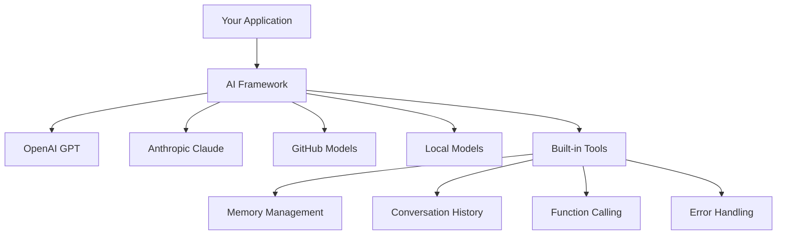
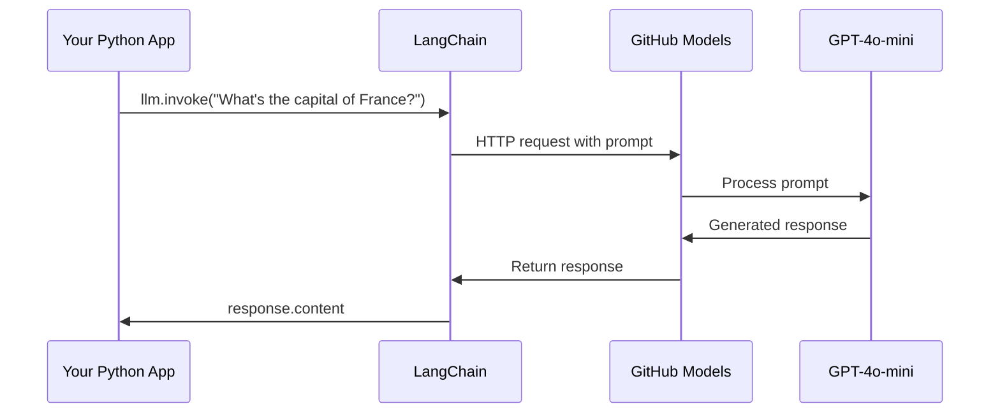
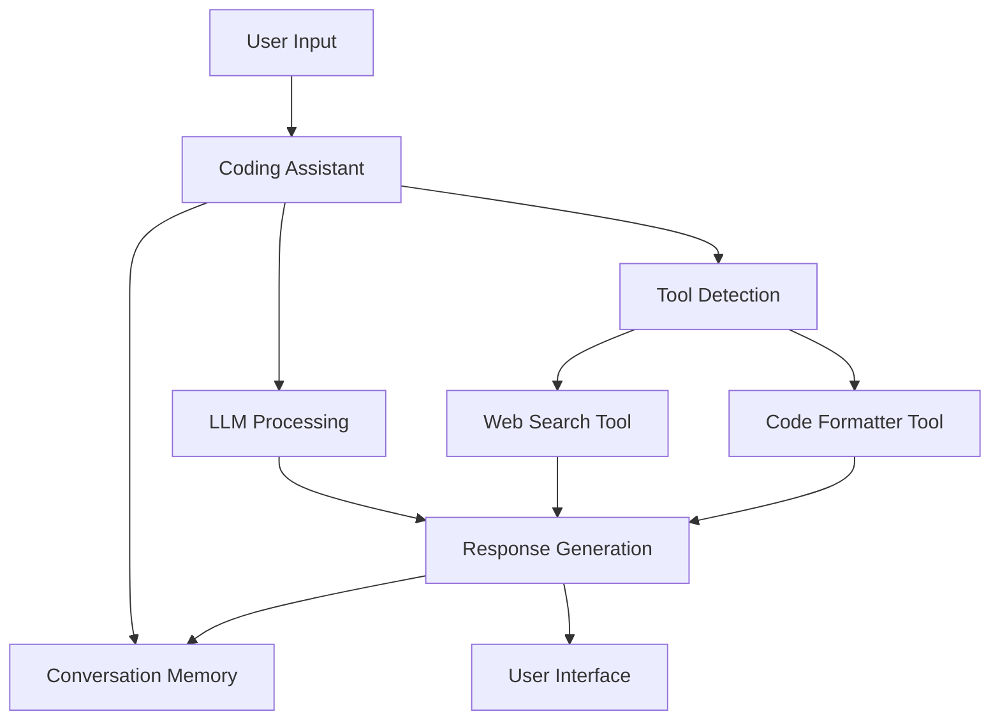
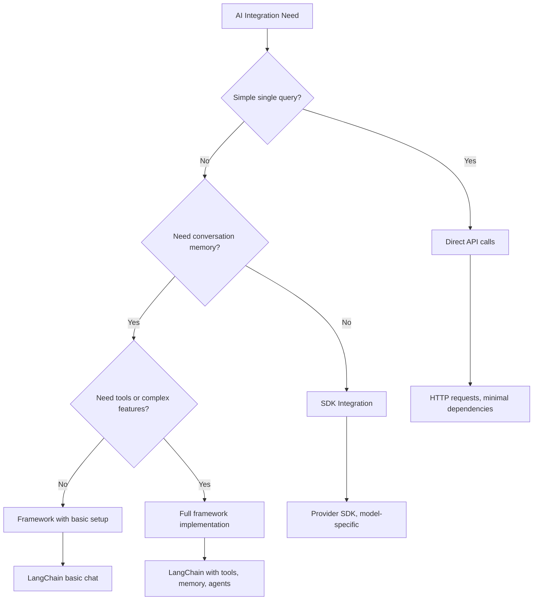

<!--
CO_OP_TRANSLATOR_METADATA:
{
  "original_hash": "e2c4ae5688e34b4b8b09d52aec56c79e",
  "translation_date": "2025-10-24T14:28:22+00:00",
  "source_file": "10-ai-framework-project/README.md",
  "language_code": "ms"
}
-->
# Rangka Kerja AI

Pernah rasa terbeban cuba membina aplikasi AI dari awal? Anda tidak keseorangan! Rangka kerja AI ibarat pisau serbaguna untuk pembangunan AI - ia adalah alat yang hebat yang boleh menjimatkan masa dan mengurangkan tekanan semasa membina aplikasi pintar. Anggaplah rangka kerja AI sebagai perpustakaan yang teratur: ia menyediakan komponen yang telah dibina, API yang standard, dan abstraksi pintar supaya anda boleh fokus pada menyelesaikan masalah daripada bergelut dengan butiran pelaksanaan.

Dalam pelajaran ini, kita akan meneroka bagaimana rangka kerja seperti LangChain boleh mengubah tugas integrasi AI yang kompleks menjadi kod yang bersih dan mudah dibaca. Anda akan belajar bagaimana menangani cabaran dunia sebenar seperti menjejaki perbualan, melaksanakan panggilan alat, dan menguruskan model AI yang berbeza melalui satu antara muka yang bersatu.

Apabila kita selesai, anda akan tahu bila untuk menggunakan rangka kerja berbanding panggilan API mentah, bagaimana menggunakan abstraksi mereka dengan berkesan, dan bagaimana membina aplikasi AI yang sedia untuk digunakan di dunia sebenar. Mari kita terokai apa yang boleh dilakukan oleh rangka kerja AI untuk projek anda.

## Mengapa memilih rangka kerja?

Jadi, anda bersedia untuk membina aplikasi AI - hebat! Tetapi inilah perkara: anda mempunyai beberapa laluan yang berbeza yang boleh diambil, dan setiap satu mempunyai kelebihan dan kekurangannya sendiri. Ia seperti memilih antara berjalan kaki, berbasikal, atau memandu untuk sampai ke suatu tempat - semuanya akan membawa anda ke sana, tetapi pengalaman (dan usaha) akan sangat berbeza.

Mari kita pecahkan tiga cara utama anda boleh mengintegrasikan AI ke dalam projek anda:

| Pendekatan | Kelebihan | Terbaik Untuk | Pertimbangan |
|------------|-----------|---------------|--------------|
| **Permintaan HTTP Langsung** | Kawalan penuh, tiada pergantungan | Pertanyaan mudah, belajar asas | Kod lebih panjang, pengendalian ralat manual |
| **Integrasi SDK** | Kurang kod boilerplate, pengoptimuman model spesifik | Aplikasi model tunggal | Terhad kepada penyedia tertentu |
| **Rangka Kerja AI** | API bersatu, abstraksi terbina dalam | Aplikasi multi-model, aliran kerja kompleks | Keluk pembelajaran, kemungkinan abstraksi berlebihan |

### Kelebihan Rangka Kerja dalam Praktik



**Mengapa rangka kerja penting:**
- **Menyatukan** pelbagai penyedia AI di bawah satu antara muka
- **Menguruskan** memori perbualan secara automatik
- **Menyediakan** alat siap pakai untuk tugas biasa seperti embeddings dan panggilan fungsi
- **Mengendalikan** pengendalian ralat dan logik percubaan semula
- **Mengubah** aliran kerja kompleks menjadi panggilan kaedah yang mudah dibaca

> 💡 **Tip Pro**: Gunakan rangka kerja apabila beralih antara model AI yang berbeza atau membina ciri kompleks seperti agen, memori, atau panggilan alat. Gunakan API langsung apabila belajar asas atau membina aplikasi yang mudah dan fokus.

**Kesimpulan**: Seperti memilih antara alat khusus tukang dan bengkel lengkap, ia tentang memadankan alat dengan tugas. Rangka kerja cemerlang untuk aplikasi yang kompleks dan kaya ciri, manakala API langsung berfungsi dengan baik untuk kes penggunaan yang mudah.

## Pengenalan

Dalam pelajaran ini, kita akan belajar untuk:

- Menggunakan rangka kerja AI yang biasa.
- Menangani masalah biasa seperti perbualan chat, penggunaan alat, memori dan konteks.
- Memanfaatkan ini untuk membina aplikasi AI.

## Permintaan AI pertama anda

Mari kita mulakan dengan asas dengan mencipta aplikasi AI pertama anda yang menghantar soalan dan mendapatkan jawapan. Seperti Archimedes yang menemui prinsip anjakan dalam mandinya, kadang-kadang pemerhatian yang paling mudah membawa kepada penemuan yang paling berkuasa - dan rangka kerja menjadikan penemuan ini mudah diakses.

### Menyediakan LangChain dengan Model GitHub

Kita akan menggunakan LangChain untuk berhubung dengan Model GitHub, yang sangat menarik kerana ia memberikan anda akses percuma kepada pelbagai model AI. Bahagian terbaik? Anda hanya memerlukan beberapa parameter konfigurasi mudah untuk bermula:

```python
from langchain_openai import ChatOpenAI
import os

llm = ChatOpenAI(
    api_key=os.environ["GITHUB_TOKEN"],
    base_url="https://models.github.ai/inference",
    model="openai/gpt-4o-mini",
)

# Send a simple prompt
response = llm.invoke("What's the capital of France?")
print(response.content)
```

**Mari kita pecahkan apa yang berlaku di sini:**
- **Mencipta** klien LangChain menggunakan kelas `ChatOpenAI` - ini adalah pintu masuk anda ke AI!
- **Mengkonfigurasi** sambungan ke Model GitHub dengan token pengesahan anda
- **Menentukan** model AI yang akan digunakan (`gpt-4o-mini`) - anggap ini sebagai memilih pembantu AI anda
- **Menghantar** soalan anda menggunakan kaedah `invoke()` - di sinilah keajaiban berlaku
- **Mengekstrak** dan memaparkan respons - dan voilà, anda sedang berbual dengan AI!

> 🔧 **Nota Persediaan**: Jika anda menggunakan GitHub Codespaces, anda bernasib baik - `GITHUB_TOKEN` sudah disediakan untuk anda! Bekerja secara tempatan? Jangan risau, anda hanya perlu mencipta token akses peribadi dengan kebenaran yang betul.

**Output yang dijangkakan:**
```text
The capital of France is Paris.
```



## Membina AI Perbualan

Contoh pertama itu menunjukkan asasnya, tetapi ia hanya satu pertukaran - anda bertanya soalan, mendapat jawapan, dan itu sahaja. Dalam aplikasi sebenar, anda mahu AI anda mengingati apa yang telah anda bincangkan, seperti bagaimana Watson dan Holmes membina perbualan penyiasatan mereka dari masa ke masa.

Di sinilah LangChain menjadi sangat berguna. Ia menyediakan jenis mesej yang berbeza yang membantu menyusun perbualan dan membolehkan anda memberikan AI anda keperibadian. Anda akan membina pengalaman chat yang mengekalkan konteks dan watak.

### Memahami Jenis Mesej

Anggaplah jenis mesej ini sebagai "topi" yang berbeza yang dipakai oleh peserta dalam perbualan. LangChain menggunakan kelas mesej yang berbeza untuk menjejaki siapa yang berkata apa:

| Jenis Mesej | Tujuan | Contoh Penggunaan |
|-------------|--------|-------------------|
| `SystemMessage` | Menentukan keperibadian dan tingkah laku AI | "Anda adalah pembantu pengkodan yang membantu" |
| `HumanMessage` | Mewakili input pengguna | "Terangkan bagaimana fungsi berfungsi" |
| `AIMessage` | Menyimpan respons AI | Respons AI sebelumnya dalam perbualan |

### Mencipta Perbualan Pertama Anda

Mari kita cipta perbualan di mana AI kita mengambil peranan tertentu. Kita akan membuatnya menjadi Kapten Picard - watak yang terkenal dengan kebijaksanaan diplomatik dan kepimpinannya:

```python
messages = [
    SystemMessage(content="You are Captain Picard of the Starship Enterprise"),
    HumanMessage(content="Tell me about you"),
]
```

**Memecahkan persediaan perbualan ini:**
- **Menetapkan** peranan dan keperibadian AI melalui `SystemMessage`
- **Memberikan** pertanyaan awal pengguna melalui `HumanMessage`
- **Mencipta** asas untuk perbualan berbilang giliran

Kod penuh untuk contoh ini kelihatan seperti berikut:

```python
from langchain_core.messages import HumanMessage, SystemMessage
from langchain_openai import ChatOpenAI
import os

llm = ChatOpenAI(
    api_key=os.environ["GITHUB_TOKEN"],
    base_url="https://models.github.ai/inference",
    model="openai/gpt-4o-mini",
)

messages = [
    SystemMessage(content="You are Captain Picard of the Starship Enterprise"),
    HumanMessage(content="Tell me about you"),
]


# works
response  = llm.invoke(messages)
print(response.content)
```

Anda sepatutnya melihat hasil yang serupa dengan:

```text
I am Captain Jean-Luc Picard, the commanding officer of the USS Enterprise (NCC-1701-D), a starship in the United Federation of Planets. My primary mission is to explore new worlds, seek out new life and new civilizations, and boldly go where no one has gone before. 

I believe in the importance of diplomacy, reason, and the pursuit of knowledge. My crew is diverse and skilled, and we often face challenges that test our resolve, ethics, and ingenuity. Throughout my career, I have encountered numerous species, grappled with complex moral dilemmas, and have consistently sought peaceful solutions to conflicts.

I hold the ideals of the Federation close to my heart, believing in the importance of cooperation, understanding, and respect for all sentient beings. My experiences have shaped my leadership style, and I strive to be a thoughtful and just captain. How may I assist you further?
```

Untuk mengekalkan kesinambungan perbualan (bukannya menetapkan semula konteks setiap kali), anda perlu terus menambah respons kepada senarai mesej anda. Seperti tradisi lisan yang memelihara cerita merentasi generasi, pendekatan ini membina memori yang kekal:

```python
from langchain_core.messages import HumanMessage, SystemMessage
from langchain_openai import ChatOpenAI
import os

llm = ChatOpenAI(
    api_key=os.environ["GITHUB_TOKEN"],
    base_url="https://models.github.ai/inference",
    model="openai/gpt-4o-mini",
)

messages = [
    SystemMessage(content="You are Captain Picard of the Starship Enterprise"),
    HumanMessage(content="Tell me about you"),
]


# works
response  = llm.invoke(messages)

print(response.content)

print("---- Next ----")

messages.append(response)
messages.append(HumanMessage(content="Now that I know about you, I'm Chris, can I be in your crew?"))

response  = llm.invoke(messages)

print(response.content)

```

Cukup menarik, bukan? Apa yang berlaku di sini ialah kita memanggil LLM dua kali - pertama dengan hanya dua mesej awal kita, tetapi kemudian sekali lagi dengan sejarah perbualan penuh. Ia seperti AI sebenarnya mengikuti perbualan kita!

Apabila anda menjalankan kod ini, anda akan mendapat respons kedua yang berbunyi seperti:

```text
Welcome aboard, Chris! It's always a pleasure to meet those who share a passion for exploration and discovery. While I cannot formally offer you a position on the Enterprise right now, I encourage you to pursue your aspirations. We are always in need of talented individuals with diverse skills and backgrounds. 

If you are interested in space exploration, consider education and training in the sciences, engineering, or diplomacy. The values of curiosity, resilience, and teamwork are crucial in Starfleet. Should you ever find yourself on a starship, remember to uphold the principles of the Federation: peace, understanding, and respect for all beings. Your journey can lead you to remarkable adventures, whether in the stars or on the ground. Engage!
```

Saya anggap itu sebagai mungkin ;)

## Respons Penstriman

Pernah perasan bagaimana ChatGPT nampaknya "menaip" responsnya secara langsung? Itulah penstriman dalam tindakan. Seperti melihat seorang penulis kaligrafi mahir bekerja - melihat watak muncul strok demi strok daripada muncul secara langsung - penstriman menjadikan interaksi terasa lebih semula jadi dan memberikan maklum balas segera.

### Melaksanakan Penstriman dengan LangChain

```python
from langchain_openai import ChatOpenAI
import os

llm = ChatOpenAI(
    api_key=os.environ["GITHUB_TOKEN"],
    base_url="https://models.github.ai/inference",
    model="openai/gpt-4o-mini",
    streaming=True
)

# Stream the response
for chunk in llm.stream("Write a short story about a robot learning to code"):
    print(chunk.content, end="", flush=True)
```

**Mengapa penstriman hebat:**
- **Menunjukkan** kandungan semasa ia sedang dicipta - tiada lagi menunggu yang janggal!
- **Membuatkan** pengguna merasa seperti sesuatu sedang berlaku
- **Terasa** lebih pantas, walaupun secara teknikalnya tidak
- **Membolehkan** pengguna mula membaca semasa AI masih "berfikir"

> 💡 **Tip Pengalaman Pengguna**: Penstriman benar-benar bersinar apabila anda berurusan dengan respons yang lebih panjang seperti penjelasan kod, penulisan kreatif, atau tutorial terperinci. Pengguna anda akan suka melihat kemajuan daripada menatap skrin kosong!

## Templat Prompt

Templat prompt berfungsi seperti struktur retorik yang digunakan dalam pidato klasik - fikirkan bagaimana Cicero akan menyesuaikan corak ucapannya untuk penonton yang berbeza sambil mengekalkan kerangka persuasif yang sama. Ia membolehkan anda mencipta prompt yang boleh digunakan semula di mana anda boleh menukar bahagian maklumat yang berbeza tanpa menulis semula semuanya dari awal. Setelah anda menyediakan templat, anda hanya perlu mengisi pembolehubah dengan nilai yang diperlukan.

### Mencipta Templat yang Boleh Digunakan Semula

```python
from langchain_core.prompts import ChatPromptTemplate

# Define a template for code explanations
template = ChatPromptTemplate.from_messages([
    ("system", "You are an expert programming instructor. Explain concepts clearly with examples."),
    ("human", "Explain {concept} in {language} with a practical example for {skill_level} developers")
])

# Use the template with different values
questions = [
    {"concept": "functions", "language": "JavaScript", "skill_level": "beginner"},
    {"concept": "classes", "language": "Python", "skill_level": "intermediate"},
    {"concept": "async/await", "language": "JavaScript", "skill_level": "advanced"}
]

for question in questions:
    prompt = template.format_messages(**question)
    response = llm.invoke(prompt)
    print(f"Topic: {question['concept']}\n{response.content}\n---\n")
```

**Mengapa anda akan suka menggunakan templat:**
- **Menjaga** konsistensi prompt anda di seluruh aplikasi anda
- **Tiada lagi** penggabungan string yang berantakan - hanya pembolehubah yang bersih dan mudah
- **AI anda** berkelakuan dengan cara yang boleh diramal kerana struktur tetap sama
- **Kemas kini** menjadi mudah - ubah templat sekali, dan ia diperbaiki di mana-mana

## Output Berstruktur

Pernah rasa kecewa cuba menguraikan respons AI yang kembali sebagai teks tidak berstruktur? Output berstruktur ibarat mengajar AI anda untuk mengikuti pendekatan sistematik seperti yang digunakan oleh Linnaeus untuk klasifikasi biologi - teratur, boleh diramal, dan mudah digunakan. Anda boleh meminta JSON, struktur data tertentu, atau mana-mana format yang anda perlukan.

### Mendefinisikan Skema Output

```python
from langchain_core.prompts import ChatPromptTemplate
from langchain_core.output_parsers import JsonOutputParser
from pydantic import BaseModel, Field

class CodeReview(BaseModel):
    score: int = Field(description="Code quality score from 1-10")
    strengths: list[str] = Field(description="List of code strengths")
    improvements: list[str] = Field(description="List of suggested improvements")
    overall_feedback: str = Field(description="Summary feedback")

# Set up the parser
parser = JsonOutputParser(pydantic_object=CodeReview)

# Create prompt with format instructions
prompt = ChatPromptTemplate.from_messages([
    ("system", "You are a code reviewer. {format_instructions}"),
    ("human", "Review this code: {code}")
])

# Format the prompt with instructions
chain = prompt | llm | parser

# Get structured response
code_sample = """
def calculate_average(numbers):
    return sum(numbers) / len(numbers)
"""

result = chain.invoke({
    "code": code_sample,
    "format_instructions": parser.get_format_instructions()
})

print(f"Score: {result['score']}")
print(f"Strengths: {', '.join(result['strengths'])}")
```

**Mengapa output berstruktur adalah pengubah permainan:**
- **Tiada lagi** meneka format yang akan anda dapatkan - ia konsisten setiap masa
- **Terhubung** terus ke pangkalan data dan API anda tanpa kerja tambahan
- **Menangkap** respons AI yang pelik sebelum ia merosakkan aplikasi anda
- **Menjadikan** kod anda lebih bersih kerana anda tahu dengan tepat apa yang anda sedang kerjakan

## Panggilan Alat

Sekarang kita sampai kepada salah satu ciri yang paling berkuasa: alat. Inilah cara anda memberikan AI anda keupayaan praktikal di luar perbualan. Seperti bagaimana persatuan zaman pertengahan membangunkan alat khusus untuk kraf tertentu, anda boleh melengkapkan AI anda dengan instrumen yang fokus. Anda menerangkan alat yang tersedia, dan apabila seseorang meminta sesuatu yang sepadan, AI anda boleh mengambil tindakan.

### Menggunakan Python

Mari kita tambah beberapa alat seperti berikut:

```python
from typing_extensions import Annotated, TypedDict

class add(TypedDict):
    """Add two integers."""

    # Annotations must have the type and can optionally include a default value and description (in that order).
    a: Annotated[int, ..., "First integer"]
    b: Annotated[int, ..., "Second integer"]

tools = [add]

functions = {
    "add": lambda a, b: a + b
}
```

Jadi apa yang berlaku di sini? Kita mencipta pelan untuk alat yang dipanggil `add`. Dengan mewarisi daripada `TypedDict` dan menggunakan jenis `Annotated` yang canggih untuk `a` dan `b`, kita memberikan LLM gambaran yang jelas tentang apa yang alat ini lakukan dan apa yang diperlukan. Kamus `functions` adalah seperti kotak alat kita - ia memberitahu kod kita dengan tepat apa yang perlu dilakukan apabila AI memutuskan untuk menggunakan alat tertentu.

Mari kita lihat bagaimana kita memanggil LLM dengan alat ini seterusnya:

```python
llm = ChatOpenAI(
    api_key=os.environ["GITHUB_TOKEN"],
    base_url="https://models.github.ai/inference",
    model="openai/gpt-4o-mini",
)

llm_with_tools = llm.bind_tools(tools)
```

Di sini kita memanggil `bind_tools` dengan array `tools` kita dan dengan itu LLM `llm_with_tools` kini mempunyai pengetahuan tentang alat ini.

Untuk menggunakan LLM baru ini, kita boleh menaip kod berikut:

```python
query = "What is 3 + 12?"

res = llm_with_tools.invoke(query)
if(res.tool_calls):
    for tool in res.tool_calls:
        print("TOOL CALL: ", functions[tool["name"]](../../../10-ai-framework-project/**tool["args"]))
print("CONTENT: ",res.content)
```

Sekarang kita memanggil `invoke` pada llm baru ini, yang mempunyai alat, kita mungkin melihat sifat `tool_calls` dipenuhi. Jika ya, mana-mana alat yang dikenal pasti mempunyai sifat `name` dan `args` yang mengenal pasti alat mana yang harus dipanggil dan dengan argumen. Kod penuh kelihatan seperti berikut:

```python
from langchain_core.messages import HumanMessage, SystemMessage
from langchain_openai import ChatOpenAI
import os
from typing_extensions import Annotated, TypedDict

class add(TypedDict):
    """Add two integers."""

    # Annotations must have the type and can optionally include a default value and description (in that order).
    a: Annotated[int, ..., "First integer"]
    b: Annotated[int, ..., "Second integer"]

tools = [add]

functions = {
    "add": lambda a, b: a + b
}

llm = ChatOpenAI(
    api_key=os.environ["GITHUB_TOKEN"],
    base_url="https://models.github.ai/inference",
    model="openai/gpt-4o-mini",
)

llm_with_tools = llm.bind_tools(tools)

query = "What is 3 + 12?"

res = llm_with_tools.invoke(query)
if(res.tool_calls):
    for tool in res.tool_calls:
        print("TOOL CALL: ", functions[tool["name"]](../../../10-ai-framework-project/**tool["args"]))
print("CONTENT: ",res.content)
```

Menjalankan kod ini, anda sepatutnya melihat output yang serupa dengan:

```text
TOOL CALL:  15
CONTENT: 
```

AI memeriksa "Apakah 3 + 12" dan mengenal pasti ini sebagai tugas untuk alat `add`. Seperti bagaimana pustakawan yang mahir tahu rujukan mana yang perlu dirujuk berdasarkan jenis soalan yang ditanya, ia membuat penentuan ini daripada nama alat, penerangan, dan spesifikasi medan. Hasil 15 datang daripada kamus `functions` kita yang melaksanakan alat:

```python
print("TOOL CALL: ", functions[tool["name"]](../../../10-ai-framework-project/**tool["args"]))
```

### Alat yang lebih menarik yang memanggil API web

Menambah nombor menunjukkan konsep, tetapi alat sebenar biasanya melakukan operasi yang lebih kompleks, seperti memanggil API web. Mari kita kembangkan contoh kita untuk membolehkan AI mendapatkan kandungan dari internet - serupa dengan bagaimana operator telegraf pernah menghubungkan lokasi yang jauh:

```python
class joke(TypedDict):
    """Tell a joke."""

    # Annotations must have the type and can optionally include a default value and description (in that order).
    category: Annotated[str, ..., "The joke category"]

def get_joke(category: str) -> str:
    response = requests.get(f"https://api.chucknorris.io/jokes/random?category={category}", headers={"Accept": "application/json"})
    if response.status_code == 200:
        return response.json().get("value", f"Here's a {category} joke!")
    return f"Here's a {category} joke!"

functions = {
    "add": lambda a, b: a + b,
    "joke": lambda category: get_joke(category)
}

query = "Tell me a joke about animals"

# the rest of the code is the same
```

Sekarang jika anda menjalankan kod ini, anda akan mendapat respons yang mengatakan sesuatu seperti:

```text
TOOL CALL:  Chuck Norris once rode a nine foot grizzly bear through an automatic car wash, instead of taking a shower.
CONTENT:  
```

Berikut adalah kod sepenuhnya:

```python
from langchain_openai import ChatOpenAI
import requests
import os
from typing_extensions import Annotated, TypedDict

class add(TypedDict):
    """Add two integers."""

    # Annotations must have the type and can optionally include a default value and description (in that order).
    a: Annotated[int, ..., "First integer"]
    b: Annotated[int, ..., "Second integer"]

class joke(TypedDict):
    """Tell a joke."""

    # Annotations must have the type and can optionally include a default value and description (in that order).
    category: Annotated[str, ..., "The joke category"]

tools = [add, joke]

def get_joke(category: str) -> str:
    response = requests.get(f"https://api.chucknorris.io/jokes/random?category={category}", headers={"Accept": "application/json"})
    if response.status_code == 200:
        return response.json().get("value", f"Here's a {category} joke!")
    return f"Here's a {category} joke!"

functions = {
    "add": lambda a, b: a + b,
    "joke": lambda category: get_joke(category)
}

llm = ChatOpenAI(
    api_key=os.environ["GITHUB_TOKEN"],
    base_url="https://models.github.ai/inference",
    model="openai/gpt-4o-mini",
)

llm_with_tools = llm.bind_tools(tools)

query = "Tell me a joke about animals"

res = llm_with_tools.invoke(query)
if(res.tool_calls):
    for tool in res.tool_calls:
        # print("TOOL CALL: ", tool)
        print("TOOL CALL: ", functions[tool["name"]](../../../10-ai-framework-project/**tool["args"]))
print("CONTENT: ",res.content)
```

## Embedding dan Pemprosesan Dokumen

Embedding mewakili salah satu penyelesaian yang paling elegan dalam AI moden. Bayangkan jika anda boleh mengambil mana-mana teks dan menukarkannya menjadi koordinat berangka yang menangkap maknanya. Itulah yang dilakukan oleh embedding - mereka mengubah teks menjadi titik dalam ruang multi-dimensi di mana konsep yang serupa berkumpul bersama. Ia seperti mempunyai sistem koordinat untuk idea, mengingatkan bagaimana Mendeleev mengatur jadual berkala berdasarkan sifat atom.

### Mencipta dan Menggunakan Embedding

```python
from langchain_openai import OpenAIEmbeddings
from langchain_community.vectorstores import FAISS
from langchain_community.document_loaders import TextLoader
from langchain.text_splitter import CharacterTextSplitter

# Initialize embeddings
embeddings = OpenAIEmbeddings(
    api_key=os.environ["GITHUB_TOKEN"],
    base_url="https://models.github.ai/inference",
    model="text-embedding-3-small"
)

# Load and split documents
loader = TextLoader("documentation.txt")
documents = loader.load()

text_splitter = CharacterTextSplitter(chunk_size=1000, chunk_overlap=0)
texts = text_splitter.split_documents(documents)

# Create vector store
vectorstore = FAISS.from_documents(texts, embeddings)

# Perform similarity search
query = "How do I handle user authentication?"
similar_docs = vectorstore.similarity_search(query, k=3)

for doc in similar_docs:
    print(f"Relevant content: {doc.page_content[:200]}...")
```

### Pemuat Dokumen untuk Pelbagai Format

```python
from langchain_community.document_loaders import (
    PyPDFLoader,
    CSVLoader,
    JSONLoader,
    WebBaseLoader
)

# Load different document types
pdf_loader = PyPDFLoader("manual.pdf")
csv_loader = CSVLoader("data.csv")
json_loader = JSONLoader("config.json")
web_loader = WebBaseLoader("https://example.com/docs")

# Process all documents
all_documents = []
for loader in [pdf_loader, csv_loader, json_loader, web_loader]:
    docs = loader.load()
    all_documents.extend(docs)
```

**Apa yang boleh anda lakukan dengan embedding:**
- **Membina** carian yang benar-benar memahami maksud anda, bukan hanya padanan kata kunci
- **Mencipta** AI yang boleh menjawab soalan tentang dokumen anda
- **Membuat** sistem cadangan yang mencadangkan kandungan yang benar-benar relevan
- **Secara automatik** mengatur dan mengkategorikan kandungan anda

## Membina Aplikasi AI Lengkap

Sekarang kita akan mengintegrasikan semua yang telah anda pelajari ke dalam aplikasi yang komprehensif - pembantu pengkodan yang boleh menjawab soalan, menggunakan alat, dan mengekalkan memori perbualan. Seperti bagaimana mesin cetak menggabungkan teknologi sedia ada (jenis bergerak, dakwat, kertas, dan tekanan) menjadi sesuatu yang transformatif, kita akan menggabungkan komponen AI kita menjadi sesuatu yang praktikal dan berguna.

### Contoh Aplikasi Lengkap

```python
from langchain_openai import ChatOpenAI, OpenAIEmbeddings
from langchain_core.prompts import ChatPromptTemplate
from langchain_core.messages import HumanMessage, SystemMessage, AIMessage
from langchain_community.vectorstores import FAISS
from typing_extensions import Annotated, TypedDict
import os
import requests

class CodingAssistant:
    def __init__(self):
        self.llm = ChatOpenAI(
            api_key=os.environ["GITHUB_TOKEN"],
            base_url="https://models.github.ai/inference",
            model="openai/gpt-4o-mini"
        )
        
        self.conversation_history = [
            SystemMessage(content="""You are an expert coding assistant. 
            Help users learn programming concepts, debug code, and write better software.
            Use tools when needed and maintain a helpful, encouraging tone.""")
        ]
        
        # Define tools
        self.setup_tools()
    
    def setup_tools(self):
        class web_search(TypedDict):
            """Search for programming documentation or examples."""
            query: Annotated[str, "Search query for programming help"]
        
        class code_formatter(TypedDict):
            """Format and validate code snippets."""
            code: Annotated[str, "Code to format"]
            language: Annotated[str, "Programming language"]
        
        self.tools = [web_search, code_formatter]
        self.llm_with_tools = self.llm.bind_tools(self.tools)
    
    def chat(self, user_input: str):
        # Add user message to conversation
        self.conversation_history.append(HumanMessage(content=user_input))
        
        # Get AI response
        response = self.llm_with_tools.invoke(self.conversation_history)
        
        # Handle tool calls if any
        if response.tool_calls:
            for tool_call in response.tool_calls:
                tool_result = self.execute_tool(tool_call)
                print(f"🔧 Tool used: {tool_call['name']}")
                print(f"📊 Result: {tool_result}")
        
        # Add AI response to conversation
        self.conversation_history.append(response)
        
        return response.content
    
    def execute_tool(self, tool_call):
        tool_name = tool_call['name']
        args = tool_call['args']
        
        if tool_name == 'web_search':
            return f"Found documentation for: {args['query']}"
        elif tool_name == 'code_formatter':
            return f"Formatted {args['language']} code: {args['code'][:50]}..."
        
        return "Tool execution completed"

# Usage example
assistant = CodingAssistant()

print("🤖 Coding Assistant Ready! Type 'quit' to exit.\n")

while True:
    user_input = input("You: ")
    if user_input.lower() == 'quit':
        break
    
    response = assistant.chat(user_input)
    print(f"🤖 Assistant: {response}\n")
```

**Arkitektur Aplikasi:**



**Ciri utama yang telah kita laksanakan:**
- **Mengingati** seluruh perbualan anda untuk kesinambungan konteks
- **Melakukan tindakan** melalui panggilan alat, bukan hanya perbualan
- **Mengikuti** corak interaksi yang boleh diramal
- **Menguruskan** pengendalian ralat dan aliran kerja kompleks secara automatik

## Tugasan: Bina Pembantu Belajar Berkuasa AI Anda Sendiri

**Objektif**: Cipta aplikasi AI yang membantu pelajar mempelajari konsep pengaturcaraan dengan memberikan penjelasan, contoh kod, dan kuiz interaktif.

### Keperluan

**Ciri Teras (Wajib):**
1. **Antara Muka Perbualan**: Laksanakan sistem chat yang mengekalkan konteks merentasi pelbagai soalan
2. **Alat Pendidikan**: Cipta sekurang-kurangnya dua alat yang membantu pembelajaran:
   - Alat penjelasan kod
   - Penjana kuiz konsep
3. **Pembelajaran Peribadi**: Gunakan mesej sistem untuk menyesuaikan respons mengikut tahap kemahiran
4. **Pemformatan Respons**: Laksanakan output berstruktur untuk soalan kuiz

### Langkah Pelaksanaan

**Langkah 1: Sediakan persekitaran anda**
```bash
pip install langchain langchain-openai
```

**Langkah 2: Fungsi asas sembang**
- Cipta kelas `StudyAssistant`
- Laksanakan memori perbualan
- Tambahkan konfigurasi personaliti untuk sokongan pendidikan

**Langkah 3: Tambahkan alat pendidikan**
- **Penerang Kod**: Memecahkan kod kepada bahagian yang mudah difahami
- **Penjana Kuiz**: Mencipta soalan tentang konsep pengaturcaraan
- **Penjejak Kemajuan**: Menjejaki topik yang telah diliputi

**Langkah 4: Ciri-ciri tambahan (Pilihan)**
- Laksanakan respons penstriman untuk pengalaman pengguna yang lebih baik
- Tambahkan pemuatan dokumen untuk menggabungkan bahan kursus
- Cipta embedding untuk pengambilan kandungan berdasarkan kesamaan

### Kriteria Penilaian

| Ciri | Cemerlang (4) | Baik (3) | Memuaskan (2) | Perlu Penambahbaikan (1) |
|------|---------------|----------|----------------|--------------------------|
| **Aliran Perbualan** | Respons semula jadi, sedar konteks | Pengekalan konteks yang baik | Perbualan asas | Tiada memori antara pertukaran |
| **Integrasi Alat** | Pelbagai alat berguna berfungsi dengan lancar | 2+ alat dilaksanakan dengan betul | 1-2 alat asas | Alat tidak berfungsi |
| **Kualiti Kod** | Bersih, didokumentasikan dengan baik, pengendalian ralat | Struktur yang baik, beberapa dokumentasi | Fungsi asas berfungsi | Struktur lemah, tiada pengendalian ralat |
| **Nilai Pendidikan** | Benar-benar membantu untuk pembelajaran, adaptif | Sokongan pembelajaran yang baik | Penjelasan asas | Manfaat pendidikan terhad |

### Struktur kod contoh

```python
class StudyAssistant:
    def __init__(self, skill_level="beginner"):
        # Initialize LLM, tools, and conversation memory
        pass
    
    def explain_code(self, code, language):
        # Tool: Explain how code works
        pass
    
    def generate_quiz(self, topic, difficulty):
        # Tool: Create practice questions
        pass
    
    def chat(self, user_input):
        # Main conversation interface
        pass

# Example usage
assistant = StudyAssistant(skill_level="intermediate")
response = assistant.chat("Explain how Python functions work")
```

**Cabaran Bonus:**
- Tambahkan keupayaan input/output suara
- Laksanakan antara muka web menggunakan Streamlit atau Flask
- Cipta pangkalan pengetahuan daripada bahan kursus menggunakan embedding
- Tambahkan penjejakan kemajuan dan laluan pembelajaran peribadi

## Ringkasan

🎉 Anda kini telah menguasai asas pembangunan rangka kerja AI dan belajar bagaimana membina aplikasi AI yang canggih menggunakan LangChain. Seperti melengkapkan latihan menyeluruh, anda telah memperoleh pelbagai kemahiran yang berguna. Mari kita ulas apa yang telah anda capai.

### Apa yang telah anda pelajari

**Konsep Asas Rangka Kerja:**
- **Manfaat Rangka Kerja**: Memahami bila untuk memilih rangka kerja berbanding panggilan API langsung
- **Asas LangChain**: Menyediakan dan mengkonfigurasi sambungan model AI
- **Jenis Mesej**: Menggunakan `SystemMessage`, `HumanMessage`, dan `AIMessage` untuk perbualan berstruktur

**Ciri-ciri Lanjutan:**
- **Panggilan Alat**: Mencipta dan mengintegrasikan alat tersuai untuk meningkatkan keupayaan AI
- **Memori Perbualan**: Mengekalkan konteks sepanjang beberapa giliran perbualan
- **Respons Penstriman**: Melaksanakan penghantaran respons secara masa nyata
- **Templat Prompt**: Membina prompt yang boleh digunakan semula dan dinamik
- **Output Berstruktur**: Memastikan respons AI yang konsisten dan boleh dianalisis
- **Embedding**: Mencipta carian semantik dan keupayaan pemprosesan dokumen

**Aplikasi Praktikal:**
- **Membina Aplikasi Lengkap**: Menggabungkan pelbagai ciri ke dalam aplikasi yang sedia untuk pengeluaran
- **Pengendalian Ralat**: Melaksanakan pengurusan ralat dan pengesahan yang kukuh
- **Integrasi Alat**: Mencipta alat tersuai yang memperluaskan keupayaan AI

### Pengajaran Utama

> 🎯 **Ingat**: Rangka kerja AI seperti LangChain pada dasarnya adalah rakan terbaik anda yang menyembunyikan kerumitan dan penuh dengan ciri-ciri. Ia sangat sesuai apabila anda memerlukan memori perbualan, panggilan alat, atau ingin bekerja dengan pelbagai model AI tanpa kehilangan kewarasan anda.

**Rangka kerja keputusan untuk integrasi AI:**



### Ke mana anda pergi dari sini?

**Mulakan pembinaan sekarang:**
- Ambil konsep ini dan bina sesuatu yang mengujakan ANDA!
- Bereksperimen dengan pelbagai model AI melalui LangChain - ia seperti taman permainan model AI
- Cipta alat yang menyelesaikan masalah sebenar yang anda hadapi dalam kerja atau projek anda

**Bersedia untuk tahap seterusnya?**
- **Ejen AI**: Bina sistem AI yang boleh merancang dan melaksanakan tugas kompleks secara sendiri
- **RAG (Retrieval-Augmented Generation)**: Gabungkan AI dengan pangkalan pengetahuan anda sendiri untuk aplikasi yang sangat berkuasa
- **AI Multi-Mod**: Bekerja dengan teks, imej, dan audio secara serentak - kemungkinan tidak terhad!
- **Penggunaan Produksi**: Belajar bagaimana untuk meningkatkan aplikasi AI anda dan memantau mereka di dunia sebenar

**Sertai komuniti:**
- Komuniti LangChain sangat hebat untuk kekal terkini dan belajar amalan terbaik
- GitHub Models memberikan anda akses kepada keupayaan AI terkini - sangat sesuai untuk bereksperimen
- Terus berlatih dengan pelbagai kes penggunaan - setiap projek akan mengajar anda sesuatu yang baru

Anda kini mempunyai pengetahuan untuk membina aplikasi perbualan pintar yang boleh membantu orang menyelesaikan masalah sebenar. Seperti tukang zaman Renaissance yang menggabungkan visi artistik dengan kemahiran teknikal, anda kini boleh menggabungkan keupayaan AI dengan aplikasi praktikal. Persoalannya: apa yang akan anda cipta? 🚀

## Cabaran Ejen GitHub Copilot 🚀

Gunakan mod Ejen untuk menyelesaikan cabaran berikut:

**Deskripsi:** Bina pembantu semakan kod AI yang canggih yang menggabungkan pelbagai ciri LangChain termasuk panggilan alat, output berstruktur, dan memori perbualan untuk memberikan maklum balas menyeluruh tentang penyerahan kod.

**Prompt:** Cipta kelas CodeReviewAssistant yang melaksanakan:
1. Alat untuk menganalisis kerumitan kod dan mencadangkan penambahbaikan
2. Alat untuk memeriksa kod mengikut amalan terbaik
3. Output berstruktur menggunakan model Pydantic untuk format semakan yang konsisten
4. Memori perbualan untuk menjejaki sesi semakan
5. Antara muka sembang utama yang boleh mengendalikan penyerahan kod dan memberikan maklum balas terperinci serta boleh diambil tindakan

Pembantu ini harus dapat menyemak kod dalam pelbagai bahasa pengaturcaraan, mengekalkan konteks sepanjang beberapa penyerahan kod dalam satu sesi, dan memberikan skor ringkasan serta cadangan penambahbaikan yang terperinci.

Ketahui lebih lanjut tentang [mod ejen](https://code.visualstudio.com/blogs/2025/02/24/introducing-copilot-agent-mode) di sini.

---

**Penafian**:  
Dokumen ini telah diterjemahkan menggunakan perkhidmatan terjemahan AI [Co-op Translator](https://github.com/Azure/co-op-translator). Walaupun kami berusaha untuk ketepatan, sila ambil perhatian bahawa terjemahan automatik mungkin mengandungi kesilapan atau ketidaktepatan. Dokumen asal dalam bahasa asalnya harus dianggap sebagai sumber yang berwibawa. Untuk maklumat penting, terjemahan manusia profesional adalah disyorkan. Kami tidak bertanggungjawab atas sebarang salah faham atau salah tafsir yang timbul daripada penggunaan terjemahan ini.