<!--
CO_OP_TRANSLATOR_METADATA:
{
  "original_hash": "3925b6a1c31c60755eaae4d578232c25",
  "translation_date": "2025-11-06T12:07:56+00:00",
  "source_file": "10-ai-framework-project/README.md",
  "language_code": "ms"
}
-->
# Rangka Kerja AI

Pernah rasa terbeban cuba membina aplikasi AI dari awal? Anda tidak keseorangan! Rangka kerja AI ibarat pisau serbaguna untuk pembangunan AI - ia adalah alat yang hebat yang boleh menjimatkan masa dan mengurangkan tekanan semasa membina aplikasi pintar. Anggaplah rangka kerja AI sebagai perpustakaan yang teratur: ia menyediakan komponen yang telah dibina, API yang standard, dan abstraksi pintar supaya anda boleh fokus menyelesaikan masalah tanpa bergelut dengan butiran pelaksanaan.

Dalam pelajaran ini, kita akan meneroka bagaimana rangka kerja seperti LangChain boleh mengubah tugas integrasi AI yang kompleks menjadi kod yang bersih dan mudah dibaca. Anda akan belajar cara menangani cabaran dunia sebenar seperti menjejaki perbualan, melaksanakan panggilan alat, dan menguruskan model AI yang berbeza melalui satu antara muka yang bersatu.

Apabila kita selesai, anda akan tahu bila untuk menggunakan rangka kerja berbanding panggilan API mentah, cara menggunakan abstraksi mereka dengan berkesan, dan cara membina aplikasi AI yang sedia untuk digunakan di dunia sebenar. Mari kita terokai apa yang rangka kerja AI boleh lakukan untuk projek anda.

## ⚡ Apa yang Boleh Anda Lakukan dalam 5 Minit Seterusnya

**Laluan Permulaan Pantas untuk Pembangun Sibuk**

```mermaid
flowchart LR
    A[⚡ 5 minutes] --> B[Install LangChain]
    B --> C[Create ChatOpenAI client]
    C --> D[Send first prompt]
    D --> E[See framework power]
```



- **Minit 1**: Pasang LangChain: `pip install langchain langchain-openai`
- **Minit 2**: Sediakan token GitHub anda dan import klien ChatOpenAI
- **Minit 3**: Buat perbualan mudah dengan mesej sistem dan manusia
- **Minit 4**: Tambahkan alat asas (seperti fungsi tambah) dan lihat panggilan alat AI
- **Minit 5**: Rasai perbezaan antara panggilan API mentah dan abstraksi rangka kerja

**Kod Ujian Pantas**:
```python
from langchain_openai import ChatOpenAI
from langchain_core.messages import SystemMessage, HumanMessage

llm = ChatOpenAI(
    api_key=os.environ["GITHUB_TOKEN"],
    base_url="https://models.github.ai/inference",
    model="openai/gpt-4o-mini"
)

response = llm.invoke([
    SystemMessage(content="You are a helpful coding assistant"),
    HumanMessage(content="Explain Python functions briefly")
])
print(response.content)
```

**Kenapa Ini Penting**: Dalam 5 minit, anda akan mengalami bagaimana rangka kerja AI mengubah integrasi AI yang kompleks menjadi panggilan kaedah yang mudah. Ini adalah asas yang menggerakkan aplikasi AI pengeluaran.

## Kenapa memilih rangka kerja?

Jadi anda bersedia untuk membina aplikasi AI - hebat! Tetapi inilah perkara: anda mempunyai beberapa laluan berbeza yang boleh anda ambil, dan setiap satu mempunyai kelebihan dan kekurangan tersendiri. Ia seperti memilih antara berjalan kaki, berbasikal, atau memandu untuk sampai ke suatu tempat - semuanya akan membawa anda ke sana, tetapi pengalaman (dan usaha) akan sangat berbeza.

Mari kita pecahkan tiga cara utama anda boleh mengintegrasikan AI ke dalam projek anda:

| Pendekatan | Kelebihan | Terbaik Untuk | Pertimbangan |
|------------|-----------|---------------|--------------|
| **Permintaan HTTP Langsung** | Kawalan penuh, tiada pergantungan | Pertanyaan mudah, belajar asas | Kod lebih panjang, pengendalian ralat manual |
| **Integrasi SDK** | Kurang kod boilerplate, pengoptimuman model spesifik | Aplikasi model tunggal | Terhad kepada penyedia tertentu |
| **Rangka Kerja AI** | API bersatu, abstraksi terbina dalam | Aplikasi multi-model, aliran kerja kompleks | Keluk pembelajaran, potensi abstraksi berlebihan |

### Kelebihan Rangka Kerja dalam Praktik


**Kenapa rangka kerja penting:**
- **Menyatukan** pelbagai penyedia AI di bawah satu antara muka
- **Menguruskan** memori perbualan secara automatik
- **Menyediakan** alat siap pakai untuk tugas biasa seperti embeddings dan panggilan fungsi
- **Mengendalikan** pengendalian ralat dan logik ulang
- **Mengubah** aliran kerja kompleks menjadi panggilan kaedah yang mudah dibaca

> 💡 **Tip Profesional**: Gunakan rangka kerja apabila beralih antara model AI yang berbeza atau membina ciri kompleks seperti agen, memori, atau panggilan alat. Gunakan API langsung apabila belajar asas atau membina aplikasi yang mudah dan fokus.

**Kesimpulan**: Seperti memilih antara alat khusus tukang dan bengkel lengkap, ia tentang memadankan alat dengan tugas. Rangka kerja cemerlang untuk aplikasi yang kompleks dan kaya ciri, manakala API langsung berfungsi dengan baik untuk kes penggunaan yang mudah.

## 🗺️ Perjalanan Pembelajaran Anda Melalui Penguasaan Rangka Kerja AI


**Destinasi Perjalanan Anda**: Pada akhir pelajaran ini, anda akan menguasai pembangunan rangka kerja AI dan mampu membina aplikasi AI yang canggih dan sedia untuk pengeluaran yang setanding dengan pembantu AI komersial.

## Pengenalan

Dalam pelajaran ini, kita akan belajar untuk:

- Menggunakan rangka kerja AI yang biasa.
- Menangani masalah biasa seperti perbualan chat, penggunaan alat, memori dan konteks.
- Memanfaatkan ini untuk membina aplikasi AI.

## 🧠 Ekosistem Pembangunan Rangka Kerja AI


**Prinsip Teras**: Rangka kerja AI mengabstrakkan kerumitan sambil menyediakan abstraksi yang kuat untuk pengurusan perbualan, integrasi alat, dan pemprosesan dokumen, membolehkan pembangun membina aplikasi AI yang canggih dengan kod yang bersih dan mudah diselenggara.

## Permintaan AI pertama anda

Mari kita mulakan dengan asas dengan mencipta aplikasi AI pertama anda yang menghantar soalan dan mendapatkan jawapan. Seperti Archimedes menemui prinsip anjakan dalam mandinya, kadang-kadang pemerhatian yang paling mudah membawa kepada wawasan yang paling kuat - dan rangka kerja menjadikan wawasan ini mudah diakses.

### Menyediakan LangChain dengan Model GitHub

Kita akan menggunakan LangChain untuk menyambung ke Model GitHub, yang sangat menarik kerana ia memberikan anda akses percuma kepada pelbagai model AI. Bahagian terbaik? Anda hanya memerlukan beberapa parameter konfigurasi mudah untuk bermula:

```python
from langchain_openai import ChatOpenAI
import os

llm = ChatOpenAI(
    api_key=os.environ["GITHUB_TOKEN"],
    base_url="https://models.github.ai/inference",
    model="openai/gpt-4o-mini",
)

# Send a simple prompt
response = llm.invoke("What's the capital of France?")
print(response.content)
```

**Mari kita pecahkan apa yang berlaku di sini:**
- **Mencipta** klien LangChain menggunakan kelas `ChatOpenAI` - ini adalah pintu masuk anda ke AI!
- **Mengkonfigurasi** sambungan ke Model GitHub dengan token pengesahan anda
- **Menentukan** model AI yang akan digunakan (`gpt-4o-mini`) - anggap ini sebagai memilih pembantu AI anda
- **Menghantar** soalan anda menggunakan kaedah `invoke()` - di sinilah keajaiban berlaku
- **Mengekstrak** dan memaparkan respons - dan voilà, anda sedang berbual dengan AI!

> 🔧 **Nota Persediaan**: Jika anda menggunakan GitHub Codespaces, anda bernasib baik - `GITHUB_TOKEN` sudah disediakan untuk anda! Bekerja secara tempatan? Jangan risau, anda hanya perlu mencipta token akses peribadi dengan kebenaran yang betul.

**Output yang dijangkakan:**
```text
The capital of France is Paris.
```


## Membina AI Perbualan

Contoh pertama itu menunjukkan asasnya, tetapi ia hanya satu pertukaran - anda bertanya soalan, mendapat jawapan, dan itu sahaja. Dalam aplikasi sebenar, anda mahu AI anda mengingati apa yang telah anda bincangkan, seperti bagaimana Watson dan Holmes membina perbualan penyiasatan mereka dari masa ke masa.

Di sinilah LangChain menjadi sangat berguna. Ia menyediakan jenis mesej yang berbeza yang membantu menyusun perbualan dan membolehkan anda memberikan AI anda keperibadian. Anda akan membina pengalaman chat yang mengekalkan konteks dan watak.

### Memahami jenis mesej

Anggaplah jenis mesej ini sebagai "topi" yang berbeza yang dipakai oleh peserta dalam perbualan. LangChain menggunakan kelas mesej yang berbeza untuk menjejaki siapa yang mengatakan apa:

| Jenis Mesej | Tujuan | Contoh Penggunaan |
|-------------|--------|-------------------|
| `SystemMessage` | Menentukan keperibadian dan tingkah laku AI | "Anda adalah pembantu pengkodan yang berguna" |
| `HumanMessage` | Mewakili input pengguna | "Terangkan bagaimana fungsi berfungsi" |
| `AIMessage` | Menyimpan respons AI | Respons AI sebelumnya dalam perbualan |

### Mencipta perbualan pertama anda

Mari kita cipta perbualan di mana AI kita mengambil peranan tertentu. Kita akan menjadikannya mewakili Kapten Picard - watak yang terkenal dengan kebijaksanaan diplomatik dan kepimpinannya:

```python
messages = [
    SystemMessage(content="You are Captain Picard of the Starship Enterprise"),
    HumanMessage(content="Tell me about you"),
]
```

**Memecahkan persediaan perbualan ini:**
- **Menetapkan** peranan dan keperibadian AI melalui `SystemMessage`
- **Memberikan** pertanyaan awal pengguna melalui `HumanMessage`
- **Mencipta** asas untuk perbualan berbilang giliran

Kod penuh untuk contoh ini kelihatan seperti berikut:

```python
from langchain_core.messages import HumanMessage, SystemMessage
from langchain_openai import ChatOpenAI
import os

llm = ChatOpenAI(
    api_key=os.environ["GITHUB_TOKEN"],
    base_url="https://models.github.ai/inference",
    model="openai/gpt-4o-mini",
)

messages = [
    SystemMessage(content="You are Captain Picard of the Starship Enterprise"),
    HumanMessage(content="Tell me about you"),
]


# works
response  = llm.invoke(messages)
print(response.content)
```

Anda sepatutnya melihat hasil yang serupa dengan:

```text
I am Captain Jean-Luc Picard, the commanding officer of the USS Enterprise (NCC-1701-D), a starship in the United Federation of Planets. My primary mission is to explore new worlds, seek out new life and new civilizations, and boldly go where no one has gone before. 

I believe in the importance of diplomacy, reason, and the pursuit of knowledge. My crew is diverse and skilled, and we often face challenges that test our resolve, ethics, and ingenuity. Throughout my career, I have encountered numerous species, grappled with complex moral dilemmas, and have consistently sought peaceful solutions to conflicts.

I hold the ideals of the Federation close to my heart, believing in the importance of cooperation, understanding, and respect for all sentient beings. My experiences have shaped my leadership style, and I strive to be a thoughtful and just captain. How may I assist you further?
```

Untuk mengekalkan kesinambungan perbualan (bukannya menetapkan semula konteks setiap kali), anda perlu terus menambah respons kepada senarai mesej anda. Seperti tradisi lisan yang memelihara cerita merentasi generasi, pendekatan ini membina memori yang berpanjangan:

```python
from langchain_core.messages import HumanMessage, SystemMessage
from langchain_openai import ChatOpenAI
import os

llm = ChatOpenAI(
    api_key=os.environ["GITHUB_TOKEN"],
    base_url="https://models.github.ai/inference",
    model="openai/gpt-4o-mini",
)

messages = [
    SystemMessage(content="You are Captain Picard of the Starship Enterprise"),
    HumanMessage(content="Tell me about you"),
]


# works
response  = llm.invoke(messages)

print(response.content)

print("---- Next ----")

messages.append(response)
messages.append(HumanMessage(content="Now that I know about you, I'm Chris, can I be in your crew?"))

response  = llm.invoke(messages)

print(response.content)

```

Cukup menarik, bukan? Apa yang berlaku di sini ialah kita memanggil LLM dua kali - pertama dengan hanya dua mesej awal kita, tetapi kemudian sekali lagi dengan sejarah perbualan penuh. Ia seperti AI sebenarnya mengikuti perbualan kita!

Apabila anda menjalankan kod ini, anda akan mendapat respons kedua yang berbunyi seperti:

```text
Welcome aboard, Chris! It's always a pleasure to meet those who share a passion for exploration and discovery. While I cannot formally offer you a position on the Enterprise right now, I encourage you to pursue your aspirations. We are always in need of talented individuals with diverse skills and backgrounds. 

If you are interested in space exploration, consider education and training in the sciences, engineering, or diplomacy. The values of curiosity, resilience, and teamwork are crucial in Starfleet. Should you ever find yourself on a starship, remember to uphold the principles of the Federation: peace, understanding, and respect for all beings. Your journey can lead you to remarkable adventures, whether in the stars or on the ground. Engage!
```


Saya anggap itu sebagai mungkin ;)

## Respons penstriman

Pernah perasan bagaimana ChatGPT nampaknya "menaip" responsnya secara langsung? Itulah penstriman dalam tindakan. Seperti melihat seorang penulis kaligrafi mahir bekerja - melihat watak muncul strok demi strok daripada muncul secara langsung - penstriman menjadikan interaksi terasa lebih semula jadi dan memberikan maklum balas segera.

### Melaksanakan penstriman dengan LangChain

```python
from langchain_openai import ChatOpenAI
import os

llm = ChatOpenAI(
    api_key=os.environ["GITHUB_TOKEN"],
    base_url="https://models.github.ai/inference",
    model="openai/gpt-4o-mini",
    streaming=True
)

# Stream the response
for chunk in llm.stream("Write a short story about a robot learning to code"):
    print(chunk.content, end="", flush=True)
```

**Kenapa penstriman hebat:**
- **Menunjukkan** kandungan semasa ia sedang dicipta - tiada lagi menunggu yang janggal!
- **Membuatkan** pengguna rasa seperti sesuatu sedang berlaku
- **Terasa** lebih pantas, walaupun secara teknikalnya tidak
- **Membolehkan** pengguna mula membaca semasa AI masih "berfikir"

> 💡 **Tip Pengalaman Pengguna**: Penstriman benar-benar bersinar apabila anda berurusan dengan respons yang lebih panjang seperti penjelasan kod, penulisan kreatif, atau tutorial terperinci. Pengguna anda akan suka melihat kemajuan daripada menatap skrin kosong!

### 🎯 Pemeriksaan Pedagogi: Kelebihan Abstraksi Rangka Kerja

**Berhenti dan Renungkan**: Anda baru sahaja mengalami kuasa abstraksi rangka kerja AI. Bandingkan apa yang anda pelajari dengan panggilan API mentah dari pelajaran sebelumnya.

**Penilaian Kendiri Pantas**:
- Bolehkah anda menerangkan bagaimana LangChain mempermudah pengurusan perbualan berbanding penjejakan mesej manual?
- Apakah perbezaan antara kaedah `invoke()` dan `stream()`, dan bila anda akan menggunakan setiap satu?
- Bagaimana sistem jenis mesej rangka kerja meningkatkan organisasi kod?

**Hubungan Dunia Sebenar**: Corak abstraksi yang anda pelajari (jenis mesej, antara muka penstriman, memori perbualan) digunakan dalam setiap aplikasi AI utama - daripada antara muka ChatGPT hingga bantuan kod GitHub Copilot. Anda sedang menguasai corak seni bina yang sama yang digunakan oleh pasukan pembangunan AI profesional.

**Soalan Cabaran**: Bagaimana anda akan mereka bentuk abstraksi rangka kerja untuk mengendalikan penyedia model AI yang berbeza (OpenAI, Anthropic, Google) dengan satu antara muka? Pertimbangkan manfaat dan kompromi.

## Templat prompt

Templat prompt berfungsi seperti struktur retorik yang digunakan dalam pidato klasik - fikirkan bagaimana Cicero akan menyesuaikan corak ucapannya untuk penonton yang berbeza sambil mengekalkan rangka kerja persuasif yang sama. Ia membolehkan anda mencipta prompt yang boleh digunakan semula di mana anda boleh menukar bahagian maklumat yang berbeza tanpa menulis semula semuanya. Setelah anda menyediakan templat, anda hanya perlu mengisi pembolehubah dengan nilai yang diperlukan.

### Mencipta prompt yang boleh digunakan semula

```python
from langchain_core.prompts import ChatPromptTemplate

# Define a template for code explanations
template = ChatPromptTemplate.from_messages([
    ("system", "You are an expert programming instructor. Explain concepts clearly with examples."),
    ("human", "Explain {concept} in {language} with a practical example for {skill_level} developers")
])

# Use the template with different values
questions = [
    {"concept": "functions", "language": "JavaScript", "skill_level": "beginner"},
    {"concept": "classes", "language": "Python", "skill_level": "intermediate"},
    {"concept": "async/await", "language": "JavaScript", "skill_level": "advanced"}
]

for question in questions:
    prompt = template.format_messages(**question)
    response = llm.invoke(prompt)
    print(f"Topic: {question['concept']}\n{response.content}\n---\n")
```

**Kenapa anda akan suka menggunakan templat:**
- **Menjaga** konsistensi prompt anda di seluruh aplikasi anda
- **Tiada lagi** penggabungan string yang berantakan - hanya pembolehubah yang bersih dan mudah
- **AI anda** berkelakuan secara konsisten kerana strukturnya tetap sama
- **Kemas kini** menjadi mudah - ubah templat sekali, dan ia diperbaiki di mana-mana

## Output berstruktur

Pernah rasa kecewa cuba mengurai respons AI yang kembali sebagai teks tidak berstruktur? Output berstruktur ibarat mengajar AI anda untuk mengikuti pendekatan sistematik yang digunakan oleh Linnaeus untuk klasifikasi biologi - teratur, boleh diramal, dan mudah digunakan. Anda boleh meminta JSON, struktur data tertentu, atau mana-mana format yang anda perlukan.

### Menentukan skema output

```python
from langchain_core.prompts import ChatPromptTemplate
from langchain_core.output_parsers import JsonOutputParser
from pydantic import BaseModel, Field

class CodeReview(BaseModel):
    score: int = Field(description="Code quality score from 1-10")
    strengths: list[str] = Field(description="List of code strengths")
    improvements: list[str] = Field(description="List of suggested improvements")
    overall_feedback: str = Field(description="Summary feedback")

# Set up the parser
parser = JsonOutputParser(pydantic_object=CodeReview)

# Create prompt with format instructions
prompt = ChatPromptTemplate.from_messages([
    ("system", "You are a code reviewer. {format_instructions}"),
    ("human", "Review this code: {code}")
])

# Format the prompt with instructions
chain = prompt | llm | parser

# Get structured response
code_sample = """
def calculate_average(numbers):
    return sum(numbers) / len(numbers)
"""

result = chain.invoke({
    "code": code_sample,
    "format_instructions": parser.get_format_instructions()
})

print(f"Score: {result['score']}")
print(f"Strengths: {', '.join(result['strengths'])}")
```

**Kenapa output berstruktur adalah pengubah permainan:**
- **Tiada lagi** meneka format yang akan anda dapatkan - ia konsisten setiap kali
- **Terus** dipasang ke dalam pangkalan data dan API anda tanpa kerja tambahan
- **Menangkap** respons AI yang pelik sebelum ia merosakkan aplikasi anda
- **Menjadikan** kod anda lebih bersih kerana anda tahu dengan tepat apa yang anda sedang kerjakan

## Panggilan alat

Sekarang kita sampai kepada salah satu ciri yang paling kuat: alat. Inilah cara anda memberikan AI anda keupayaan praktikal di luar perbualan. Seperti bagaimana persatuan zaman pertengahan membangunkan alat khusus untuk kraf tertentu, anda boleh melengkapkan AI anda dengan instrumen yang fokus. Anda menerangkan alat yang tersedia, dan apabila seseorang meminta sesuatu yang sepadan, AI anda boleh mengambil tindakan.

### Menggunakan Python

Mari tambahkan beberapa alat seperti berikut:

```python
from typing_extensions import Annotated, TypedDict

class add(TypedDict):
    """Add two integers."""

    # Annotations must have the type and can optionally include a default value and description (in that order).
    a: Annotated[int, ..., "First integer"]
    b: Annotated[int, ..., "Second integer"]

tools = [add]

functions = {
    "add": lambda a, b: a + b
}
```

Jadi apa yang berlaku di sini? Kita mencipta pelan untuk alat yang dipanggil `add`. Dengan mewarisi daripada `TypedDict` dan menggunakan jenis `Annotated` yang canggih untuk `a` dan `b`, kita memberikan LLM gambaran yang jelas tentang apa yang alat ini lakukan dan apa yang diperlukan. Kamus `functions` adalah seperti kotak alat kita - ia memberitahu kod kita dengan tepat apa yang perlu dilakukan apabila AI memutuskan untuk menggunakan alat tertentu.

Mari kita lihat bagaimana kita memanggil LLM dengan alat ini seterusnya:

```python
llm = ChatOpenAI(
    api_key=os.environ["GITHUB_TOKEN"],
    base_url="https://models.github.ai/inference",
    model="openai/gpt-4o-mini",
)

llm_with_tools = llm.bind_tools(tools)
```

Di sini kita memanggil `bind_tools` dengan array `tools` kita dan dengan itu LLM `llm_with_tools` kini mempunyai pengetahuan tentang alat ini.

Untuk menggunakan LLM baru ini, kita boleh menaip kod berikut:

```python
query = "What is 3 + 12?"

res = llm_with_tools.invoke(query)
if(res.tool_calls):
    for tool in res.tool_calls:
        print("TOOL CALL: ", functions[tool["name"]](../../../10-ai-framework-project/**tool["args"]))
print("CONTENT: ",res.content)
```

Sekarang kita memanggil `invoke` pada llm baru ini, yang mempunyai alat, kita mungkin melihat sifat `tool_calls` diisi. Jika ya, mana-mana alat yang dikenal pasti mempunyai sifat `name` dan `args` yang mengenal pasti alat mana yang harus dipanggil dan dengan argumen. Kod penuh kelihatan seperti berikut:

```python
from langchain_core.messages import HumanMessage, SystemMessage
from langchain_openai import ChatOpenAI
import os
from typing_extensions import Annotated, TypedDict

class add(TypedDict):
    """Add two integers."""

    # Annotations must have the type and can optionally include a default value and description (in that order).
    a: Annotated[int, ..., "First integer"]
    b: Annotated[int, ..., "Second integer"]

tools = [add]

functions = {
    "add": lambda a, b: a + b
}

llm = ChatOpenAI(
    api_key=os.environ["GITHUB_TOKEN"],
    base_url="https://models.github.ai/inference",
    model="openai/gpt-4o-mini",
)

llm_with_tools = llm.bind_tools(tools)

query = "What is 3 + 12?"

res = llm_with_tools.invoke(query)
if(res.tool_calls):
    for tool in res.tool_calls:
        print("TOOL CALL: ", functions[tool["name"]](../../../10-ai-framework-project/**tool["args"]))
print("CONTENT: ",res.content)
```

Apabila anda menjalankan kod ini, anda sepatutnya melihat output yang serupa dengan:

```text
TOOL CALL:  15
CONTENT: 
```

AI memeriksa "Apakah 3 + 12" dan mengenal pasti ini sebagai tugas untuk alat `add`. Seperti bagaimana pustakawan yang mahir tahu rujukan mana yang perlu dirujuk berdasarkan jenis soalan yang ditanya, ia membuat penentuan ini daripada nama alat, penerangan, dan spesifikasi medan. Hasil 15 datang daripada kamus `functions` kita yang melaksanakan alat:

```python
print("TOOL CALL: ", functions[tool["name"]](../../../10-ai-framework-project/**tool["args"]))
```

### Alat yang lebih menarik yang memanggil API web
Menambah nombor menunjukkan konsep asas, tetapi alat sebenar biasanya melakukan operasi yang lebih kompleks, seperti memanggil API web. Mari kita kembangkan contoh kita supaya AI dapat mengambil kandungan dari internet - serupa dengan bagaimana operator telegraf pernah menghubungkan lokasi yang jauh:

```python
class joke(TypedDict):
    """Tell a joke."""

    # Annotations must have the type and can optionally include a default value and description (in that order).
    category: Annotated[str, ..., "The joke category"]

def get_joke(category: str) -> str:
    response = requests.get(f"https://api.chucknorris.io/jokes/random?category={category}", headers={"Accept": "application/json"})
    if response.status_code == 200:
        return response.json().get("value", f"Here's a {category} joke!")
    return f"Here's a {category} joke!"

functions = {
    "add": lambda a, b: a + b,
    "joke": lambda category: get_joke(category)
}

query = "Tell me a joke about animals"

# the rest of the code is the same
```

Sekarang jika anda menjalankan kod ini, anda akan mendapat respons yang mengatakan sesuatu seperti:

```text
TOOL CALL:  Chuck Norris once rode a nine foot grizzly bear through an automatic car wash, instead of taking a shower.
CONTENT:  
```

```mermaid
flowchart TD
    A[User Query: "Tell me a joke about animals"] --> B[LangChain Analysis]
    B --> C{Tool Available?}
    C -->|Yes| D[Select joke tool]
    C -->|No| E[Generate direct response]
    
    D --> F[Extract Parameters]
    F --> G[Call joke(category="animals")]
    G --> H[API Request to chucknorris.io]
    H --> I[Return joke content]
    I --> J[Display to user]
    
    E --> K[AI-generated response]
    K --> J
    
    subgraph "Tool Definition Layer"
        L[TypedDict Schema]
        M[Function Implementation]
        N[Parameter Validation]
    end
    
    D --> L
    F --> N
    G --> M
```

Berikut adalah kod sepenuhnya:

```python
from langchain_openai import ChatOpenAI
import requests
import os
from typing_extensions import Annotated, TypedDict

class add(TypedDict):
    """Add two integers."""

    # Annotations must have the type and can optionally include a default value and description (in that order).
    a: Annotated[int, ..., "First integer"]
    b: Annotated[int, ..., "Second integer"]

class joke(TypedDict):
    """Tell a joke."""

    # Annotations must have the type and can optionally include a default value and description (in that order).
    category: Annotated[str, ..., "The joke category"]

tools = [add, joke]

def get_joke(category: str) -> str:
    response = requests.get(f"https://api.chucknorris.io/jokes/random?category={category}", headers={"Accept": "application/json"})
    if response.status_code == 200:
        return response.json().get("value", f"Here's a {category} joke!")
    return f"Here's a {category} joke!"

functions = {
    "add": lambda a, b: a + b,
    "joke": lambda category: get_joke(category)
}

llm = ChatOpenAI(
    api_key=os.environ["GITHUB_TOKEN"],
    base_url="https://models.github.ai/inference",
    model="openai/gpt-4o-mini",
)

llm_with_tools = llm.bind_tools(tools)

query = "Tell me a joke about animals"

res = llm_with_tools.invoke(query)
if(res.tool_calls):
    for tool in res.tool_calls:
        # print("TOOL CALL: ", tool)
        print("TOOL CALL: ", functions[tool["name"]](../../../10-ai-framework-project/**tool["args"]))
print("CONTENT: ",res.content)
```

## Embedding dan pemprosesan dokumen

Embedding mewakili salah satu penyelesaian paling elegan dalam AI moden. Bayangkan jika anda boleh mengambil sebarang teks dan menukarkannya kepada koordinat numerik yang menangkap maknanya. Itulah yang embedding lakukan - ia mengubah teks menjadi titik dalam ruang multi-dimensi di mana konsep serupa berkumpul bersama. Ia seperti mempunyai sistem koordinat untuk idea, mengingatkan bagaimana Mendeleev mengatur jadual berkala berdasarkan sifat atom.

### Membuat dan menggunakan embedding

```python
from langchain_openai import OpenAIEmbeddings
from langchain_community.vectorstores import FAISS
from langchain_community.document_loaders import TextLoader
from langchain.text_splitter import CharacterTextSplitter

# Initialize embeddings
embeddings = OpenAIEmbeddings(
    api_key=os.environ["GITHUB_TOKEN"],
    base_url="https://models.github.ai/inference",
    model="text-embedding-3-small"
)

# Load and split documents
loader = TextLoader("documentation.txt")
documents = loader.load()

text_splitter = CharacterTextSplitter(chunk_size=1000, chunk_overlap=0)
texts = text_splitter.split_documents(documents)

# Create vector store
vectorstore = FAISS.from_documents(texts, embeddings)

# Perform similarity search
query = "How do I handle user authentication?"
similar_docs = vectorstore.similarity_search(query, k=3)

for doc in similar_docs:
    print(f"Relevant content: {doc.page_content[:200]}...")
```

### Pemuat dokumen untuk pelbagai format

```python
from langchain_community.document_loaders import (
    PyPDFLoader,
    CSVLoader,
    JSONLoader,
    WebBaseLoader
)

# Load different document types
pdf_loader = PyPDFLoader("manual.pdf")
csv_loader = CSVLoader("data.csv")
json_loader = JSONLoader("config.json")
web_loader = WebBaseLoader("https://example.com/docs")

# Process all documents
all_documents = []
for loader in [pdf_loader, csv_loader, json_loader, web_loader]:
    docs = loader.load()
    all_documents.extend(docs)
```

**Apa yang boleh anda lakukan dengan embedding:**
- **Membina** carian yang benar-benar memahami maksud anda, bukan sekadar padanan kata kunci
- **Mencipta** AI yang boleh menjawab soalan tentang dokumen anda
- **Membuat** sistem cadangan yang mencadangkan kandungan yang benar-benar relevan
- **Mengatur dan mengkategorikan** kandungan anda secara automatik

```mermaid
flowchart LR
    A[Documents] --> B[Text Splitter]
    B --> C[Create Embeddings]
    C --> D[Vector Store]
    
    E[User Query] --> F[Query Embedding]
    F --> G[Similarity Search]
    G --> D
    D --> H[Relevant Documents]
    H --> I[AI Response]
    
    subgraph "Vector Space"
        J[Document A: [0.1, 0.8, 0.3...]]
        K[Document B: [0.2, 0.7, 0.4...]]
        L[Query: [0.15, 0.75, 0.35...]]
    end
    
    C --> J
    C --> K
    F --> L
    G --> J
    G --> K
```

## Membina aplikasi AI yang lengkap

Sekarang kita akan mengintegrasikan semua yang telah anda pelajari ke dalam aplikasi yang komprehensif - pembantu pengekodan yang boleh menjawab soalan, menggunakan alat, dan mengekalkan memori perbualan. Seperti bagaimana mesin cetak menggabungkan teknologi sedia ada (jenis bergerak, dakwat, kertas, dan tekanan) menjadi sesuatu yang transformatif, kita akan menggabungkan komponen AI kita menjadi sesuatu yang praktikal dan berguna.

### Contoh aplikasi lengkap

```python
from langchain_openai import ChatOpenAI, OpenAIEmbeddings
from langchain_core.prompts import ChatPromptTemplate
from langchain_core.messages import HumanMessage, SystemMessage, AIMessage
from langchain_community.vectorstores import FAISS
from typing_extensions import Annotated, TypedDict
import os
import requests

class CodingAssistant:
    def __init__(self):
        self.llm = ChatOpenAI(
            api_key=os.environ["GITHUB_TOKEN"],
            base_url="https://models.github.ai/inference",
            model="openai/gpt-4o-mini"
        )
        
        self.conversation_history = [
            SystemMessage(content="""You are an expert coding assistant. 
            Help users learn programming concepts, debug code, and write better software.
            Use tools when needed and maintain a helpful, encouraging tone.""")
        ]
        
        # Define tools
        self.setup_tools()
    
    def setup_tools(self):
        class web_search(TypedDict):
            """Search for programming documentation or examples."""
            query: Annotated[str, "Search query for programming help"]
        
        class code_formatter(TypedDict):
            """Format and validate code snippets."""
            code: Annotated[str, "Code to format"]
            language: Annotated[str, "Programming language"]
        
        self.tools = [web_search, code_formatter]
        self.llm_with_tools = self.llm.bind_tools(self.tools)
    
    def chat(self, user_input: str):
        # Add user message to conversation
        self.conversation_history.append(HumanMessage(content=user_input))
        
        # Get AI response
        response = self.llm_with_tools.invoke(self.conversation_history)
        
        # Handle tool calls if any
        if response.tool_calls:
            for tool_call in response.tool_calls:
                tool_result = self.execute_tool(tool_call)
                print(f"🔧 Tool used: {tool_call['name']}")
                print(f"📊 Result: {tool_result}")
        
        # Add AI response to conversation
        self.conversation_history.append(response)
        
        return response.content
    
    def execute_tool(self, tool_call):
        tool_name = tool_call['name']
        args = tool_call['args']
        
        if tool_name == 'web_search':
            return f"Found documentation for: {args['query']}"
        elif tool_name == 'code_formatter':
            return f"Formatted {args['language']} code: {args['code'][:50]}..."
        
        return "Tool execution completed"

# Usage example
assistant = CodingAssistant()

print("🤖 Coding Assistant Ready! Type 'quit' to exit.\n")

while True:
    user_input = input("You: ")
    if user_input.lower() == 'quit':
        break
    
    response = assistant.chat(user_input)
    print(f"🤖 Assistant: {response}\n")
```

**Senibina aplikasi:**


**Ciri utama yang telah kami laksanakan:**
- **Mengingati** keseluruhan perbualan anda untuk kesinambungan konteks
- **Melakukan tindakan** melalui pemanggilan alat, bukan sekadar perbualan
- **Mengikuti** corak interaksi yang boleh diramal
- **Menguruskan** pengendalian ralat dan aliran kerja kompleks secara automatik

### 🎯 Pemeriksaan Pedagogi: Senibina AI Pengeluaran

**Pemahaman Senibina**: Anda telah membina aplikasi AI lengkap yang menggabungkan pengurusan perbualan, pemanggilan alat, dan aliran kerja berstruktur. Ini mewakili pembangunan aplikasi AI peringkat pengeluaran.

**Konsep Utama Dikuasai**:
- **Senibina Berasaskan Kelas**: Struktur aplikasi AI yang teratur dan boleh diselenggara
- **Integrasi Alat**: Fungsi tersuai di luar perbualan
- **Pengurusan Memori**: Konteks perbualan yang berterusan
- **Pengendalian Ralat**: Tingkah laku aplikasi yang kukuh

**Hubungan Industri**: Corak senibina yang telah anda laksanakan (kelas perbualan, sistem alat, pengurusan memori) adalah corak yang sama digunakan dalam aplikasi AI perusahaan seperti pembantu AI Slack, GitHub Copilot, dan Microsoft Copilot. Anda sedang membina dengan pemikiran senibina peringkat profesional.

**Soalan Refleksi**: Bagaimana anda akan memperluaskan aplikasi ini untuk mengendalikan pelbagai pengguna, penyimpanan berterusan, atau integrasi dengan pangkalan data luaran? Pertimbangkan cabaran skalabiliti dan pengurusan keadaan.

## Tugasan: Bina pembantu belajar berkuasa AI anda sendiri

**Objektif**: Cipta aplikasi AI yang membantu pelajar mempelajari konsep pengaturcaraan dengan memberikan penjelasan, contoh kod, dan kuiz interaktif.

### Keperluan

**Ciri Teras (Diperlukan):**
1. **Antara Muka Perbualan**: Laksanakan sistem sembang yang mengekalkan konteks merentasi pelbagai soalan
2. **Alat Pendidikan**: Cipta sekurang-kurangnya dua alat yang membantu pembelajaran:
   - Alat penjelasan kod
   - Penjana kuiz konsep
3. **Pembelajaran Peribadi**: Gunakan mesej sistem untuk menyesuaikan respons kepada tahap kemahiran yang berbeza
4. **Pemformatan Respons**: Laksanakan output berstruktur untuk soalan kuiz

### Langkah Pelaksanaan

**Langkah 1: Sediakan persekitaran anda**
```bash
pip install langchain langchain-openai
```

**Langkah 2: Fungsi sembang asas**
- Cipta kelas `StudyAssistant`
- Laksanakan memori perbualan
- Tambahkan konfigurasi personaliti untuk sokongan pendidikan

**Langkah 3: Tambahkan alat pendidikan**
- **Penjelas Kod**: Memecahkan kod kepada bahagian yang boleh difahami
- **Penjana Kuiz**: Mencipta soalan tentang konsep pengaturcaraan
- **Penjejak Kemajuan**: Menjejaki topik yang telah diliputi

**Langkah 4: Ciri yang dipertingkatkan (Pilihan)**
- Laksanakan respons penstriman untuk pengalaman pengguna yang lebih baik
- Tambahkan pemuatan dokumen untuk memasukkan bahan kursus
- Cipta embedding untuk pengambilan kandungan berdasarkan persamaan

### Kriteria Penilaian

| Ciri | Cemerlang (4) | Baik (3) | Memuaskan (2) | Perlu Penambahbaikan (1) |
|------|---------------|----------|---------------|--------------------------|
| **Aliran Perbualan** | Respons semula jadi, peka konteks | Pengekalan konteks yang baik | Perbualan asas | Tiada memori antara pertukaran |
| **Integrasi Alat** | Pelbagai alat berguna berfungsi dengan lancar | 2+ alat dilaksanakan dengan betul | 1-2 alat asas | Alat tidak berfungsi |
| **Kualiti Kod** | Bersih, didokumentasikan dengan baik, pengendalian ralat | Struktur yang baik, beberapa dokumentasi | Fungsi asas berfungsi | Struktur lemah, tiada pengendalian ralat |
| **Nilai Pendidikan** | Benar-benar membantu pembelajaran, adaptif | Sokongan pembelajaran yang baik | Penjelasan asas | Manfaat pendidikan terhad |

### Struktur kod contoh

```python
class StudyAssistant:
    def __init__(self, skill_level="beginner"):
        # Initialize LLM, tools, and conversation memory
        pass
    
    def explain_code(self, code, language):
        # Tool: Explain how code works
        pass
    
    def generate_quiz(self, topic, difficulty):
        # Tool: Create practice questions
        pass
    
    def chat(self, user_input):
        # Main conversation interface
        pass

# Example usage
assistant = StudyAssistant(skill_level="intermediate")
response = assistant.chat("Explain how Python functions work")
```

**Cabaran Bonus:**
- Tambahkan keupayaan input/output suara
- Laksanakan antara muka web menggunakan Streamlit atau Flask
- Cipta pangkalan pengetahuan daripada bahan kursus menggunakan embedding
- Tambahkan penjejakan kemajuan dan laluan pembelajaran peribadi

## 📈 Garis Masa Penguasaan Pembangunan Rangka Kerja AI Anda


**🎓 Milestone Graduasi**: Anda telah berjaya menguasai pembangunan rangka kerja AI menggunakan alat dan corak yang sama yang menggerakkan aplikasi AI moden. Kemahiran ini mewakili teknologi terkini dalam pembangunan aplikasi AI dan menyediakan anda untuk membina sistem pintar peringkat perusahaan.

**🔄 Keupayaan Tahap Seterusnya**:
- Bersedia untuk meneroka senibina AI lanjutan (agen, sistem multi-agen)
- Bersedia untuk membina sistem RAG dengan pangkalan data vektor
- Dilengkapi untuk mencipta aplikasi AI multi-modal
- Asas ditetapkan untuk penskalaan dan pengoptimuman aplikasi AI

## Ringkasan

🎉 Anda kini telah menguasai asas pembangunan rangka kerja AI dan belajar bagaimana membina aplikasi AI yang canggih menggunakan LangChain. Seperti melengkapkan latihan komprehensif, anda telah memperoleh alat kemahiran yang besar. Mari kita ulas apa yang telah anda capai.

### Apa yang telah anda pelajari

**Konsep Rangka Kerja Teras:**
- **Manfaat Rangka Kerja**: Memahami bila untuk memilih rangka kerja berbanding panggilan API langsung
- **Asas LangChain**: Menyediakan dan mengkonfigurasi sambungan model AI
- **Jenis Mesej**: Menggunakan `SystemMessage`, `HumanMessage`, dan `AIMessage` untuk perbualan berstruktur

**Ciri Lanjutan:**
- **Pemanggilan Alat**: Mencipta dan mengintegrasikan alat tersuai untuk keupayaan AI yang dipertingkatkan
- **Memori Perbualan**: Mengekalkan konteks merentasi pelbagai giliran perbualan
- **Respons Penstriman**: Melaksanakan penghantaran respons masa nyata
- **Templat Prompt**: Membina prompt yang boleh digunakan semula dan dinamik
- **Output Berstruktur**: Memastikan respons AI yang konsisten dan boleh diurai
- **Embedding**: Mencipta carian semantik dan keupayaan pemprosesan dokumen

**Aplikasi Praktikal:**
- **Membina Aplikasi Lengkap**: Menggabungkan pelbagai ciri ke dalam aplikasi sedia pengeluaran
- **Pengendalian Ralat**: Melaksanakan pengurusan ralat dan pengesahan yang kukuh
- **Integrasi Alat**: Mencipta alat tersuai yang memperluaskan keupayaan AI

### Pengajaran utama

> 🎯 **Ingat**: Rangka kerja AI seperti LangChain pada dasarnya adalah sahabat terbaik anda yang menyembunyikan kerumitan dan penuh dengan ciri. Ia sempurna apabila anda memerlukan memori perbualan, pemanggilan alat, atau ingin bekerja dengan pelbagai model AI tanpa kehilangan kewarasan anda.

**Rangka kerja keputusan untuk integrasi AI:**


### Ke mana anda pergi dari sini?

**Mulakan pembinaan sekarang:**
- Ambil konsep ini dan bina sesuatu yang menggembirakan ANDA!
- Bereksperimen dengan pelbagai model AI melalui LangChain - ia seperti taman permainan model AI
- Cipta alat yang menyelesaikan masalah sebenar yang anda hadapi dalam kerja atau projek anda

**Bersedia untuk tahap seterusnya?**
- **Agen AI**: Bina sistem AI yang boleh merancang dan melaksanakan tugas kompleks sendiri
- **RAG (Retrieval-Augmented Generation)**: Gabungkan AI dengan pangkalan pengetahuan anda sendiri untuk aplikasi yang sangat berkuasa
- **AI Multi-Modal**: Bekerja dengan teks, imej, dan audio bersama-sama - kemungkinan tidak terhad!
- **Pengeluaran**: Belajar bagaimana untuk menskalakan aplikasi AI anda dan memantau mereka di dunia sebenar

**Sertai komuniti:**
- Komuniti LangChain sangat hebat untuk kekal terkini dan belajar amalan terbaik
- Model GitHub memberikan anda akses kepada keupayaan AI terkini - sempurna untuk bereksperimen
- Terus berlatih dengan pelbagai kes penggunaan - setiap projek akan mengajar anda sesuatu yang baru

Anda kini mempunyai pengetahuan untuk membina aplikasi perbualan pintar yang boleh membantu orang menyelesaikan masalah sebenar. Seperti tukang zaman Renaissance yang menggabungkan visi artistik dengan kemahiran teknikal, anda kini boleh menggabungkan keupayaan AI dengan aplikasi praktikal. Soalannya ialah: apa yang akan anda cipta? 🚀

## Cabaran Agen GitHub Copilot 🚀

Gunakan mod Agen untuk menyelesaikan cabaran berikut:

**Deskripsi:** Bina pembantu semakan kod berkuasa AI yang maju yang menggabungkan pelbagai ciri LangChain termasuk pemanggilan alat, output berstruktur, dan memori perbualan untuk memberikan maklum balas komprehensif tentang penyerahan kod.

**Prompt:** Cipta kelas CodeReviewAssistant yang melaksanakan:
1. Alat untuk menganalisis kerumitan kod dan mencadangkan penambahbaikan
2. Alat untuk memeriksa kod mengikut amalan terbaik
3. Output berstruktur menggunakan model Pydantic untuk format semakan yang konsisten
4. Memori perbualan untuk menjejaki sesi semakan
5. Antara muka sembang utama yang boleh mengendalikan penyerahan kod dan memberikan maklum balas terperinci dan boleh diambil tindakan

Pembantu harus dapat menyemak kod dalam pelbagai bahasa pengaturcaraan, mengekalkan konteks merentasi pelbagai penyerahan kod dalam satu sesi, dan memberikan skor ringkasan serta cadangan penambahbaikan terperinci.

Ketahui lebih lanjut tentang [mod agen](https://code.visualstudio.com/blogs/2025/02/24/introducing-copilot-agent-mode) di sini.

---

**Penafian**:  
Dokumen ini telah diterjemahkan menggunakan perkhidmatan terjemahan AI [Co-op Translator](https://github.com/Azure/co-op-translator). Walaupun kami berusaha untuk ketepatan, sila ambil perhatian bahawa terjemahan automatik mungkin mengandungi kesilapan atau ketidaktepatan. Dokumen asal dalam bahasa asalnya harus dianggap sebagai sumber yang berwibawa. Untuk maklumat kritikal, terjemahan manusia profesional adalah disyorkan. Kami tidak bertanggungjawab atas sebarang salah faham atau salah tafsir yang timbul daripada penggunaan terjemahan ini.