<!--
CO_OP_TRANSLATOR_METADATA:
{
  "original_hash": "672b0bb6e8b431075f3bdb7130590d2d",
  "translation_date": "2025-11-06T12:00:12+00:00",
  "source_file": "2-js-basics/1-data-types/README.md",
  "language_code": "ms"
}
-->
# Asas JavaScript: Jenis Data


> Sketchnote oleh [Tomomi Imura](https://twitter.com/girlie_mac)


Jenis data adalah salah satu konsep asas dalam JavaScript yang akan anda temui dalam setiap program yang anda tulis. Fikirkan jenis data seperti sistem pengarkiban yang digunakan oleh pustakawan kuno di Alexandria – mereka mempunyai tempat khusus untuk gulungan yang mengandungi puisi, matematik, dan rekod sejarah. JavaScript mengatur maklumat dengan cara yang serupa dengan kategori yang berbeza untuk pelbagai jenis data.

Dalam pelajaran ini, kita akan meneroka jenis data teras yang membuat JavaScript berfungsi. Anda akan belajar bagaimana mengendalikan nombor, teks, nilai benar/palsu, dan memahami mengapa memilih jenis yang betul adalah penting untuk program anda. Konsep ini mungkin kelihatan abstrak pada mulanya, tetapi dengan latihan, ia akan menjadi kebiasaan.

Memahami jenis data akan menjadikan segala-galanya dalam JavaScript lebih jelas. Sama seperti arkitek perlu memahami bahan binaan yang berbeza sebelum membina katedral, asas ini akan menyokong segala yang anda bina pada masa akan datang.

## Kuiz Pra-Pelajaran
[Kuiz pra-pelajaran](https://ff-quizzes.netlify.app/web/)

Pelajaran ini merangkumi asas JavaScript, bahasa yang menyediakan interaktiviti di web.

> Anda boleh mengambil pelajaran ini di [Microsoft Learn](https://docs.microsoft.com/learn/modules/web-development-101-variables/?WT.mc_id=academic-77807-sagibbon)!

[](https://youtube.com/watch?v=JNIXfGiDWM8 "Pemboleh ubah dalam JavaScript")

[](https://youtube.com/watch?v=AWfA95eLdq8 "Jenis Data dalam JavaScript")

> 🎥 Klik imej di atas untuk video tentang pemboleh ubah dan jenis data

Mari kita mulakan dengan pemboleh ubah dan jenis data yang mengisinya!


## Pemboleh Ubah

Pemboleh ubah adalah blok binaan asas dalam pengaturcaraan. Seperti balang berlabel yang digunakan oleh ahli alkimia zaman pertengahan untuk menyimpan bahan yang berbeza, pemboleh ubah membolehkan anda menyimpan maklumat dan memberikannya nama deskriptif supaya anda boleh merujuknya kemudian. Perlu ingat umur seseorang? Simpan dalam pemboleh ubah bernama `age`. Mahu menjejaki nama pengguna? Simpan dalam pemboleh ubah bernama `userName`.

Kami akan memberi tumpuan kepada pendekatan moden untuk mencipta pemboleh ubah dalam JavaScript. Teknik yang akan anda pelajari di sini mewakili evolusi bahasa selama bertahun-tahun dan amalan terbaik yang dibangunkan oleh komuniti pengaturcaraan.

Mencipta dan **mengisytiharkan** pemboleh ubah mempunyai sintaks berikut **[keyword] [name]**. Ia terdiri daripada dua bahagian:

- **Kata kunci**. Gunakan `let` untuk pemboleh ubah yang boleh berubah, atau `const` untuk nilai yang kekal.
- **Nama pemboleh ubah**, ini adalah nama deskriptif yang anda pilih sendiri.

✅ Kata kunci `let` diperkenalkan dalam ES6 dan memberikan pemboleh ubah anda apa yang dipanggil _skop blok_. Adalah disyorkan agar anda menggunakan `let` atau `const` dan bukannya kata kunci `var` yang lebih lama. Kami akan membincangkan skop blok dengan lebih mendalam dalam bahagian seterusnya.

### Tugasan - bekerja dengan pemboleh ubah

1. **Isytiharkan pemboleh ubah**. Mari mulakan dengan mencipta pemboleh ubah pertama kita:

    ```javascript
    let myVariable;
    ```

   **Apa yang dicapai:**
   - Ini memberitahu JavaScript untuk mencipta lokasi storan bernama `myVariable`
   - JavaScript memperuntukkan ruang dalam memori untuk pemboleh ubah ini
   - Pemboleh ubah pada masa ini tidak mempunyai nilai (undefined)

2. **Berikan nilai**. Sekarang mari kita letakkan sesuatu dalam pemboleh ubah kita:

    ```javascript
    myVariable = 123;
    ```

   **Bagaimana tugasan berfungsi:**
   - Operator `=` memberikan nilai 123 kepada pemboleh ubah kita
   - Pemboleh ubah kini mengandungi nilai ini dan bukannya undefined
   - Anda boleh merujuk nilai ini sepanjang kod anda menggunakan `myVariable`

   > Nota: penggunaan `=` dalam pelajaran ini bermaksud kita menggunakan "operator tugasan", digunakan untuk menetapkan nilai kepada pemboleh ubah. Ia tidak menunjukkan kesamaan.

3. **Lakukan dengan cara yang bijak**. Sebenarnya, mari kita gabungkan kedua-dua langkah itu:

    ```javascript
    let myVariable = 123;
    ```

    **Pendekatan ini lebih cekap:**
    - Anda mengisytiharkan pemboleh ubah dan memberikan nilai dalam satu pernyataan
    - Ini adalah amalan standard di kalangan pembangun
    - Ia mengurangkan panjang kod sambil mengekalkan kejelasan

4. **Ubah fikiran anda**. Bagaimana jika kita mahu menyimpan nombor yang berbeza?

   ```javascript
   myVariable = 321;
   ```

   **Memahami penugasan semula:**
   - Pemboleh ubah kini mengandungi 321 dan bukannya 123
   - Nilai sebelumnya digantikan – pemboleh ubah hanya menyimpan satu nilai pada satu masa
   - Kebolehubahan ini adalah ciri utama pemboleh ubah yang diisytiharkan dengan `let`

   ✅ Cuba! Anda boleh menulis JavaScript terus dalam pelayar anda. Buka tetingkap pelayar dan navigasi ke Alat Pembangun. Dalam konsol, anda akan menemui prompt; taip `let myVariable = 123`, tekan enter, kemudian taip `myVariable`. Apa yang berlaku? Nota, anda akan belajar lebih lanjut tentang konsep ini dalam pelajaran seterusnya.

### 🧠 **Semakan Penguasaan Pemboleh Ubah: Menjadi Selesa**

**Mari lihat bagaimana perasaan anda tentang pemboleh ubah:**
- Bolehkah anda menerangkan perbezaan antara mengisytiharkan dan memberikan pemboleh ubah?
- Apa yang berlaku jika anda cuba menggunakan pemboleh ubah sebelum anda mengisytiharkannya?
- Bilakah anda akan memilih `let` berbanding `const` untuk pemboleh ubah?


> **Petua cepat**: Fikirkan pemboleh ubah sebagai kotak storan berlabel. Anda mencipta kotak (`let`), meletakkan sesuatu di dalamnya (`=`), dan kemudian boleh menggantikan kandungan jika diperlukan!

## Konstanta

Kadang-kadang anda perlu menyimpan maklumat yang tidak boleh berubah semasa pelaksanaan program. Fikirkan konstanta seperti prinsip matematik yang Euclid tetapkan di Yunani kuno – setelah dibuktikan dan didokumentasikan, ia kekal tetap untuk semua rujukan masa depan.

Konstanta berfungsi sama seperti pemboleh ubah, tetapi dengan sekatan penting: setelah anda memberikan nilainya, ia tidak boleh diubah. Ketidakbolehubahan ini membantu mencegah pengubahsuaian tidak sengaja kepada nilai kritikal dalam program anda.

Pengisytiharan dan inisialisasi konstanta mengikuti konsep yang sama seperti pemboleh ubah, dengan pengecualian kata kunci `const`. Konstanta biasanya diisytiharkan dengan huruf besar semua.

```javascript
const MY_VARIABLE = 123;
```

**Inilah yang dilakukan oleh kod ini:**
- **Mencipta** konstanta bernama `MY_VARIABLE` dengan nilai 123
- **Menggunakan** konvensyen penamaan huruf besar untuk konstanta
- **Menghalang** sebarang perubahan masa depan kepada nilai ini

Konstanta mempunyai dua peraturan utama:

- **Anda mesti memberikan nilai dengan segera** – tiada konstanta kosong dibenarkan!
- **Anda tidak boleh mengubah nilai itu** – JavaScript akan membuang ralat jika anda mencuba. Mari lihat apa yang saya maksudkan:

   **Nilai mudah** - Yang berikut TIDAK dibenarkan:
   
      ```javascript
      const PI = 3;
      PI = 4; // tidak dibenarkan
      ```

   **Apa yang perlu anda ingat:**
   - **Percubaan** untuk menetapkan semula konstanta akan menyebabkan ralat
   - **Melindungi** nilai penting daripada perubahan tidak sengaja
   - **Memastikan** nilai kekal konsisten sepanjang program anda
 
   **Rujukan objek dilindungi** - Yang berikut TIDAK dibenarkan:
   
      ```javascript
      const obj = { a: 3 };
      obj = { b: 5 } // tidak dibenarkan
      ```

   **Memahami konsep ini:**
   - **Menghalang** penggantian keseluruhan objek dengan yang baru
   - **Melindungi** rujukan kepada objek asal
   - **Menjaga** identiti objek dalam memori

    **Nilai objek tidak dilindungi** - Yang berikut DIBENARKAN:
    
      ```javascript
      const obj = { a: 3 };
      obj.a = 5;  // dibenarkan
      ```

      **Memecahkan apa yang berlaku di sini:**
      - **Mengubah** nilai sifat dalam objek
      - **Menjaga** rujukan objek yang sama
      - **Menunjukkan** bahawa kandungan objek boleh berubah sementara rujukan kekal tetap

   > Nota, `const` bermaksud rujukan dilindungi daripada penugasan semula. Walau bagaimanapun, nilai itu tidak _tidak boleh diubah_ dan boleh berubah, terutamanya jika ia adalah struktur kompleks seperti objek.

## Jenis Data

JavaScript mengatur maklumat ke dalam kategori yang berbeza yang dipanggil jenis data. Konsep ini mencerminkan bagaimana sarjana kuno mengkategorikan pengetahuan – Aristotle membezakan antara jenis penaakulan yang berbeza, mengetahui bahawa prinsip logik tidak boleh digunakan secara seragam untuk puisi, matematik, dan falsafah semula jadi.

Jenis data penting kerana operasi yang berbeza berfungsi dengan jenis maklumat yang berbeza. Sama seperti anda tidak boleh melakukan aritmetik pada nama seseorang atau mengabjadkan persamaan matematik, JavaScript memerlukan jenis data yang sesuai untuk setiap operasi. Memahami ini menghalang ralat dan menjadikan kod anda lebih boleh dipercayai.

Pemboleh ubah boleh menyimpan pelbagai jenis nilai, seperti nombor dan teks. Pelbagai jenis nilai ini dikenali sebagai **jenis data**. Jenis data adalah bahagian penting dalam pembangunan perisian kerana ia membantu pembangun membuat keputusan tentang bagaimana kod harus ditulis dan bagaimana perisian harus berjalan. Selain itu, beberapa jenis data mempunyai ciri unik yang membantu mengubah atau mengekstrak maklumat tambahan dalam nilai.

✅ Jenis Data juga dirujuk sebagai primitif data JavaScript, kerana ia adalah jenis data peringkat terendah yang disediakan oleh bahasa. Terdapat 7 primitif data: string, number, bigint, boolean, undefined, null dan symbol. Luangkan masa untuk membayangkan apa yang setiap primitif ini mungkin wakili. Apa itu `zebra`? Bagaimana dengan `0`? `true`?

### Nombor

Nombor adalah jenis data yang paling mudah dalam JavaScript. Sama ada anda bekerja dengan nombor bulat seperti 42, perpuluhan seperti 3.14, atau nombor negatif seperti -5, JavaScript mengendalikannya secara seragam.

Ingat pemboleh ubah kita dari tadi? 123 yang kita simpan sebenarnya adalah jenis data nombor:

```javascript
let myVariable = 123;
```

**Ciri utama:**
- JavaScript secara automatik mengenali nilai berangka
- Anda boleh melakukan operasi matematik dengan pemboleh ubah ini
- Tiada pengisytiharan jenis eksplisit diperlukan

Pemboleh ubah boleh menyimpan semua jenis nombor, termasuk perpuluhan atau nombor negatif. Nombor juga boleh digunakan dengan operator aritmetik, yang dibincangkan dalam [bahagian seterusnya](../../../../2-js-basics/1-data-types).

```mermaid
flowchart LR
    A["🔢 Numbers"] --> B["➕ Addition"]
    A --> C["➖ Subtraction"]
    A --> D["✖️ Multiplication"]
    A --> E["➗ Division"]
    A --> F["📊 Remainder %"]
    
    B --> B1["1 + 2 = 3"]
    C --> C1["5 - 3 = 2"]
    D --> D1["4 * 3 = 12"]
    E --> E1["10 / 2 = 5"]
    F --> F1["7 % 3 = 1"]
    
    style A fill:#e3f2fd
    style B fill:#e8f5e8
    style C fill:#fff3e0
    style D fill:#f3e5f5
    style E fill:#e0f2f1
    style F fill:#fce4ec
```



### Operator Aritmetik

Operator aritmetik membolehkan anda melakukan pengiraan matematik dalam JavaScript. Operator ini mengikuti prinsip yang sama yang digunakan oleh ahli matematik selama berabad-abad – simbol yang sama yang muncul dalam karya sarjana seperti Al-Khwarizmi, yang membangunkan notasi algebra.

Operator berfungsi seperti yang anda jangkakan daripada matematik tradisional: tambah untuk penjumlahan, tolak untuk penolakan, dan sebagainya.

Terdapat beberapa jenis operator untuk digunakan semasa melakukan fungsi aritmetik, dan beberapa disenaraikan di sini:

| Simbol | Penerangan                                                              | Contoh                          |
| ------ | ----------------------------------------------------------------------- | -------------------------------- |
| `+`    | **Penjumlahan**: Mengira jumlah dua nombor                              | `1 + 2 //jawapan yang dijangka ialah 3`   |
| `-`    | **Penolakan**: Mengira perbezaan dua nombor                             | `1 - 2 //jawapan yang dijangka ialah -1`  |
| `*`    | **Pendaraban**: Mengira hasil darab dua nombor                          | `1 * 2 //jawapan yang dijangka ialah 2`   |
| `/`    | **Pembahagian**: Mengira hasil bahagi dua nombor                        | `1 / 2 //jawapan yang dijangka ialah 0.5` |
| `%`    | **Baki**: Mengira baki daripada pembahagian dua nombor                  | `1 % 2 //jawapan yang dijangka ialah 1`   |

✅ Cuba! Cuba operasi aritmetik dalam konsol pelayar anda. Adakah hasilnya mengejutkan anda?

### 🧮 **Semakan Kemahiran Matematik: Mengira dengan Yakin**

**Uji pemahaman aritmetik anda:**
- Apakah perbezaan antara `/` (pembahagian) dan `%` (baki)?
- Bolehkah anda meramalkan apa yang `10 % 3` sama dengan? (Petunjuk: ia bukan 3.33...)
- Mengapa operator baki mungkin berguna dalam pengaturcaraan?


> **Wawasan dunia sebenar**: Operator baki (%) sangat berguna untuk memeriksa sama ada nombor genap/ganjil, mencipta corak, atau mengitar melalui array!

### String

Dalam JavaScript, data teks diwakili sebagai string. Istilah "string" berasal dari konsep watak yang disusun bersama dalam urutan, seperti cara penulis di biara zaman pertengahan akan menghubungkan huruf untuk membentuk perkataan dan ayat dalam manuskrip mereka.

String adalah asas kepada pembangunan web. Setiap bahagian teks yang dipaparkan di laman web – nama pengguna, label butang, mesej ralat, kandungan – dikendalikan sebagai data string. Memahami string adalah penting untuk mencipta antara muka pengguna yang berfungsi.

String adalah set aksara yang berada di antara tanda petik tunggal atau berganda.

```javascript
'This is a string'
"This is also a string"
let myString = 'This is a string value stored in a variable';
```

**Memahami konsep ini:**
- **Menggunakan** sama ada tanda petik tunggal `'` atau tanda petik berganda `"` untuk mentakrifkan string
- **Menyimpan** data teks yang boleh termasuk huruf, nombor, dan simbol
- **Menetapkan** nilai string kepada pemboleh ubah untuk digunakan kemudian
- **Memerlukan** tanda petik untuk membezakan teks daripada nama pemboleh ubah

Ingat untuk menggunakan tanda petik semasa menulis string, jika tidak JavaScript akan menganggap ia adalah nama pemboleh ubah.

```mermaid
flowchart TD
    A["📝 Strings"] --> B["Single Quotes"]
    A --> C["Double Quotes"]
    A --> D["Template Literals"]
    
    B --> B1["'Hello World'"]
    C --> C1["\"Hello World\""]
    D --> D1["`Hello \${name}`"]
    
    E["String Operations"] --> F["Concatenation"]
    E --> G["Template Insertion"]
    E --> H["Length & Methods"]
    
    F --> F1["'Hello' + ' ' + 'World'"]
    G --> G1["`Hello \${firstName} \${lastName}`"]
    H --> H1["myString.length"]
    
    style A fill:#e3f2fd
    style E fill:#fff3e0
    style D fill:#e8f5e8
    style G fill:#e8f5e8
```



### Pemformatan String

Manipulasi string membolehkan anda menggabungkan elemen teks, menggabungkan pemboleh ubah, dan mencipta kandungan dinamik yang bertindak balas kepada keadaan program. Teknik ini membolehkan anda membina teks secara programatik. 

Selalunya anda perlu menggabungkan beberapa string bersama – proses ini dipanggil penggabungan.
Untuk **menggabungkan** dua atau lebih string, atau menyatukannya, gunakan operator `+`.

```javascript
let myString1 = "Hello";
let myString2 = "World";

myString1 + myString2 + "!"; //HelloWorld!
myString1 + " " + myString2 + "!"; //Hello World!
myString1 + ", " + myString2 + "!"; //Hello, World!
```

**Langkah demi langkah, inilah yang berlaku:**
- **Menggabungkan** beberapa string menggunakan operator `+`
- **Menyatukan** string secara langsung tanpa ruang dalam contoh pertama
- **Menambah** ruang `" "` antara string untuk memudahkan pembacaan
- **Menyisipkan** tanda baca seperti koma untuk mencipta format yang betul

✅ Kenapa `1 + 1 = 2` dalam JavaScript, tetapi `'1' + '1' = 11?` Fikirkan tentang ini. Bagaimana pula dengan `'1' + 1`?

**Template literals** adalah cara lain untuk memformat string, tetapi bukannya menggunakan tanda petik, ia menggunakan backtick. Apa sahaja yang bukan teks biasa mesti diletakkan dalam placeholder `${ }`. Ini termasuk sebarang pemboleh ubah yang mungkin berupa string.

```javascript
let myString1 = "Hello";
let myString2 = "World";

`${myString1} ${myString2}!` //Hello World!
`${myString1}, ${myString2}!` //Hello, World!
```

**Mari kita fahami setiap bahagian:**
- **Menggunakan** backtick `` ` `` dan bukannya tanda petik biasa untuk mencipta template literals
- **Menyisipkan** pemboleh ubah secara langsung menggunakan sintaks placeholder `${}`
- **Memelihara** ruang dan format seperti yang ditulis
- **Menyediakan** cara yang lebih kemas untuk mencipta string kompleks dengan pemboleh ubah

Anda boleh mencapai matlamat pemformatan anda dengan mana-mana kaedah, tetapi template literals akan mengekalkan sebarang ruang dan baris baru.

✅ Bilakah anda akan menggunakan template literal berbanding string biasa?

### 🔤 **Semak Penguasaan String: Keyakinan Manipulasi Teks**

**Uji kemahiran string anda:**
- Bolehkah anda jelaskan kenapa `'1' + '1'` sama dengan `'11'` dan bukannya `2`?
- Kaedah string mana yang anda rasa lebih mudah dibaca: penggabungan atau template literals?
- Apa yang berlaku jika anda terlupa meletakkan tanda petik di sekeliling string?


> **Petua profesional**: Template literals biasanya lebih disukai untuk membina string yang kompleks kerana ia lebih mudah dibaca dan mengendalikan string berbilang baris dengan baik!

### Booleans

Boolean mewakili bentuk data yang paling mudah: ia hanya boleh memegang salah satu daripada dua nilai – `true` atau `false`. Sistem logik binari ini berasal dari kerja George Boole, seorang ahli matematik abad ke-19 yang membangunkan algebra Boolean.

Walaupun ringkas, boolean sangat penting untuk logik program. Ia membolehkan kod anda membuat keputusan berdasarkan syarat – sama ada pengguna telah log masuk, jika butang telah diklik, atau jika kriteria tertentu dipenuhi.

Boolean hanya boleh mempunyai dua nilai: `true` atau `false`. Boolean membantu membuat keputusan tentang baris kod mana yang harus dijalankan apabila syarat tertentu dipenuhi. Dalam banyak kes, [operator](../../../../2-js-basics/1-data-types) membantu menetapkan nilai Boolean dan anda sering akan melihat dan menulis pemboleh ubah yang diinisialisasi atau nilainya dikemas kini dengan operator.

```javascript
let myTrueBool = true;
let myFalseBool = false;
```

**Dalam contoh di atas, kita telah:**
- **Mencipta** pemboleh ubah yang menyimpan nilai Boolean `true`
- **Menunjukkan** cara menyimpan nilai Boolean `false`
- **Menggunakan** kata kunci tepat `true` dan `false` (tanpa tanda petik)
- **Menyediakan** pemboleh ubah ini untuk digunakan dalam pernyataan bersyarat

✅ Pemboleh ubah boleh dianggap 'truthy' jika ia dinilai sebagai boolean `true`. Menariknya, dalam JavaScript, [semua nilai adalah truthy kecuali ditakrifkan sebagai falsy](https://developer.mozilla.org/docs/Glossary/Truthy).

```mermaid
flowchart LR
    A["🔘 Boolean Values"] --> B["true"]
    A --> C["false"]
    
    D["Truthy Values"] --> D1["'hello'"]
    D --> D2["42"]
    D --> D3["[]"]
    D --> D4["{}"]
    
    E["Falsy Values"] --> E1["false"]
    E --> E2["0"]
    E --> E3["''"]
    E --> E4["null"]
    E --> E5["undefined"]
    E --> E6["NaN"]
    
    style B fill:#e8f5e8
    style C fill:#ffebee
    style D fill:#e3f2fd
    style E fill:#fff3e0
```



### 🎯 **Semak Logik Boolean: Kemahiran Membuat Keputusan**

**Uji pemahaman boolean anda:**
- Kenapa anda fikir JavaScript mempunyai nilai "truthy" dan "falsy" selain hanya `true` dan `false`?
- Bolehkah anda ramalkan mana yang falsy: `0`, `"0"`, `[]`, `"false"`?
- Bagaimana boolean boleh berguna dalam mengawal aliran program?


> **Ingat**: Dalam JavaScript, hanya 6 nilai yang falsy: `false`, `0`, `""`, `null`, `undefined`, dan `NaN`. Segala yang lain adalah truthy!

---

## 📊 **Ringkasan Toolkit Jenis Data Anda**


## Cabaran Ejen GitHub Copilot 🚀

Gunakan mod Ejen untuk melengkapkan cabaran berikut:

**Penerangan:** Cipta pengurus maklumat peribadi yang menunjukkan semua jenis data JavaScript yang telah anda pelajari dalam pelajaran ini sambil mengendalikan senario data dunia nyata.

**Arahan:** Bina program JavaScript yang mencipta objek profil pengguna yang mengandungi: nama seseorang (string), umur (nombor), status pelajar (boolean), warna kegemaran sebagai array, dan objek alamat dengan sifat jalan, bandar, dan kod pos. Sertakan fungsi untuk memaparkan maklumat profil dan mengemas kini medan individu. Pastikan untuk menunjukkan penggabungan string, template literals, operasi aritmetik dengan umur, dan logik boolean untuk status pelajar.

Ketahui lebih lanjut tentang [mod ejen](https://code.visualstudio.com/blogs/2025/02/24/introducing-copilot-agent-mode) di sini.

## 🚀 Cabaran

JavaScript mempunyai beberapa tingkah laku yang boleh mengejutkan pembangun. Berikut adalah contoh klasik untuk diterokai: cuba taip ini dalam konsol pelayar anda: `let age = 1; let Age = 2; age == Age` dan perhatikan hasilnya. Ia akan mengembalikan `false` – bolehkah anda tentukan kenapa?

Ini mewakili salah satu daripada banyak tingkah laku JavaScript yang patut difahami. Memahami keunikan ini akan membantu anda menulis kod yang lebih boleh dipercayai dan menyelesaikan masalah dengan lebih berkesan.

## Kuiz Selepas Kuliah
[Kuiz selepas kuliah](https://ff-quizzes.netlify.app)

## Ulasan & Kajian Sendiri

Lihat [senarai latihan JavaScript ini](https://css-tricks.com/snippets/javascript/) dan cuba satu. Apa yang anda pelajari?

## Tugasan

[Latihan Jenis Data](assignment.md)

## 🚀 Garis Masa Penguasaan Jenis Data JavaScript Anda

### ⚡ **Apa yang Boleh Anda Lakukan Dalam 5 Minit Seterusnya**
- [ ] Buka konsol pelayar anda dan cipta 3 pemboleh ubah dengan jenis data yang berbeza
- [ ] Cuba cabaran: `let age = 1; let Age = 2; age == Age` dan cari tahu kenapa ia false
- [ ] Latih penggabungan string dengan nama anda dan nombor kegemaran anda
- [ ] Uji apa yang berlaku apabila anda menambah nombor kepada string

### 🎯 **Apa yang Boleh Anda Capai Dalam Satu Jam**
- [ ] Lengkapkan kuiz selepas pelajaran dan ulas sebarang konsep yang mengelirukan
- [ ] Cipta kalkulator mini yang menambah, menolak, mendarab, dan membahagi dua nombor
- [ ] Bina pemformat nama ringkas menggunakan template literals
- [ ] Terokai perbezaan antara operator perbandingan `==` dan `===`
- [ ] Latih menukar antara jenis data yang berbeza

### 📅 **Asas JavaScript Anda Sepanjang Minggu**
- [ ] Lengkapkan tugasan dengan keyakinan dan kreativiti
- [ ] Cipta objek profil peribadi menggunakan semua jenis data yang telah dipelajari
- [ ] Latih dengan [latihan JavaScript dari CSS-Tricks](https://css-tricks.com/snippets/javascript/)
- [ ] Bina validator borang ringkas menggunakan logik boolean
- [ ] Eksperimen dengan jenis data array dan objek (pratonton pelajaran akan datang)
- [ ] Sertai komuniti JavaScript dan ajukan soalan tentang jenis data

### 🌟 **Transformasi Sebulan Anda**
- [ ] Gabungkan pengetahuan jenis data ke dalam projek pengaturcaraan yang lebih besar
- [ ] Fahami bila dan kenapa menggunakan setiap jenis data dalam aplikasi sebenar
- [ ] Bantu pemula lain memahami asas JavaScript
- [ ] Bina aplikasi kecil yang menguruskan pelbagai jenis data pengguna
- [ ] Terokai konsep jenis data lanjutan seperti paksaan jenis dan kesetaraan ketat
- [ ] Sumbang kepada projek JavaScript sumber terbuka dengan penambahbaikan dokumentasi

### 🧠 **Semakan Akhir Penguasaan Jenis Data**

**Raikan asas JavaScript anda:**
- Jenis data mana yang paling mengejutkan anda dari segi tingkah lakunya?
- Sejauh mana anda selesa menjelaskan perbezaan antara pemboleh ubah dan pemalar kepada rakan?
- Apa perkara paling menarik yang anda temui tentang sistem jenis JavaScript?
- Aplikasi dunia nyata apa yang anda bayangkan boleh dibina dengan asas ini?


> 💡 **Anda telah membina asas!** Memahami jenis data adalah seperti belajar abjad sebelum menulis cerita. Setiap program JavaScript yang anda tulis akan menggunakan konsep asas ini. Anda kini mempunyai blok bangunan untuk mencipta laman web interaktif, aplikasi dinamik, dan menyelesaikan masalah dunia nyata dengan kod. Selamat datang ke dunia JavaScript yang menakjubkan! 🎉

---

**Penafian**:  
Dokumen ini telah diterjemahkan menggunakan perkhidmatan terjemahan AI [Co-op Translator](https://github.com/Azure/co-op-translator). Walaupun kami berusaha untuk ketepatan, sila ambil perhatian bahawa terjemahan automatik mungkin mengandungi kesilapan atau ketidaktepatan. Dokumen asal dalam bahasa asalnya harus dianggap sebagai sumber yang berwibawa. Untuk maklumat penting, terjemahan manusia profesional adalah disyorkan. Kami tidak bertanggungjawab atas sebarang salah faham atau salah tafsir yang timbul daripada penggunaan terjemahan ini.