<!--
CO_OP_TRANSLATOR_METADATA:
{
  "original_hash": "71f7d7dafa1c7194d79ddac87f669ff9",
  "translation_date": "2025-11-06T12:00:53+00:00",
  "source_file": "2-js-basics/2-functions-methods/README.md",
  "language_code": "ms"
}
-->
# Asas JavaScript: Kaedah dan Fungsi


> Sketchnote oleh [Tomomi Imura](https://twitter.com/girlie_mac)


## Kuiz Pra-Kuliah
[Kuiz pra-kuliah](https://ff-quizzes.netlify.app)

Menulis kod yang sama berulang kali adalah salah satu kekecewaan paling biasa dalam pengaturcaraan. Fungsi menyelesaikan masalah ini dengan membolehkan anda membungkus kod ke dalam blok yang boleh digunakan semula. Fikirkan fungsi seperti bahagian standard yang menjadikan barisan pemasangan Henry Ford revolusioner – setelah anda mencipta komponen yang boleh dipercayai, anda boleh menggunakannya di mana sahaja diperlukan tanpa perlu membina semula dari awal.

Fungsi membolehkan anda mengumpulkan bahagian kod supaya anda boleh menggunakannya semula di seluruh program anda. Daripada menyalin dan menampal logik yang sama di mana-mana, anda boleh mencipta fungsi sekali dan memanggilnya bila-bila masa diperlukan. Pendekatan ini menjadikan kod anda lebih teratur dan memudahkan kemas kini.

Dalam pelajaran ini, anda akan belajar cara mencipta fungsi anda sendiri, menghantar maklumat kepadanya, dan mendapatkan hasil yang berguna kembali. Anda akan menemui perbezaan antara fungsi dan kaedah, mempelajari pendekatan sintaks moden, dan melihat bagaimana fungsi boleh berfungsi dengan fungsi lain. Kami akan membina konsep ini langkah demi langkah.

[](https://youtube.com/watch?v=XgKsD6Zwvlc "Kaedah dan Fungsi")

> 🎥 Klik imej di atas untuk video tentang kaedah dan fungsi.

> Anda boleh mengambil pelajaran ini di [Microsoft Learn](https://docs.microsoft.com/learn/modules/web-development-101-functions/?WT.mc_id=academic-77807-sagibbon)!


## Fungsi

Fungsi ialah blok kod yang berdiri sendiri yang melaksanakan tugas tertentu. Ia merangkumi logik yang boleh anda laksanakan bila-bila masa diperlukan.

Daripada menulis kod yang sama berulang kali di seluruh program anda, anda boleh membungkusnya dalam fungsi dan memanggil fungsi itu bila-bila masa anda memerlukannya. Pendekatan ini menjadikan kod anda bersih dan memudahkan kemas kini. Fikirkan cabaran penyelenggaraan jika anda perlu menukar logik yang tersebar di 20 lokasi berbeza dalam pangkalan kod anda.

Menamakan fungsi anda dengan deskriptif adalah penting. Fungsi yang dinamakan dengan baik menyampaikan tujuannya dengan jelas – apabila anda melihat `cancelTimer()`, anda segera memahami apa yang dilakukannya, sama seperti butang yang dilabel dengan jelas memberitahu anda dengan tepat apa yang akan berlaku apabila anda mengkliknya.

## Mencipta dan memanggil fungsi

Mari kita lihat cara mencipta fungsi. Sintaksnya mengikuti corak yang konsisten:

```javascript
function nameOfFunction() { // function definition
 // function definition/body
}
```

Mari kita pecahkan:
- Kata kunci `function` memberitahu JavaScript "Hei, saya sedang mencipta fungsi!"
- `nameOfFunction` ialah tempat anda memberikan nama deskriptif kepada fungsi anda
- Kurungan `()` ialah tempat anda boleh menambah parameter (kita akan sampai ke situ sebentar lagi)
- Kurungan keriting `{}` mengandungi kod sebenar yang dijalankan apabila anda memanggil fungsi

Mari kita cipta fungsi ucapan ringkas untuk melihat ini dalam tindakan:

```javascript
function displayGreeting() {
  console.log('Hello, world!');
}
```

Fungsi ini mencetak "Hello, world!" ke konsol. Setelah anda mendefinisikannya, anda boleh menggunakannya sebanyak mana yang diperlukan.

Untuk melaksanakan (atau "memanggil") fungsi anda, tulis namanya diikuti dengan kurungan. JavaScript membolehkan anda mendefinisikan fungsi anda sebelum atau selepas anda memanggilnya – enjin JavaScript akan mengendalikan susunan pelaksanaan.

```javascript
// calling our function
displayGreeting();
```

Apabila anda menjalankan baris ini, ia melaksanakan semua kod dalam fungsi `displayGreeting` anda, memaparkan "Hello, world!" dalam konsol pelayar anda. Anda boleh memanggil fungsi ini berulang kali.

### 🧠 **Semakan Asas Fungsi: Membina Fungsi Pertama Anda**

**Mari lihat bagaimana perasaan anda tentang fungsi asas:**
- Bolehkah anda terangkan mengapa kita menggunakan kurungan keriting `{}` dalam definisi fungsi?
- Apa yang berlaku jika anda menulis `displayGreeting` tanpa kurungan?
- Mengapa anda mungkin mahu memanggil fungsi yang sama beberapa kali?

```mermaid
flowchart TD
    A["✏️ Define Function"] --> B["📦 Package Code"]
    B --> C["🏷️ Give it a Name"]
    C --> D["📞 Call When Needed"]
    D --> E["🔄 Reuse Anywhere"]
    
    F["💡 Benefits"] --> F1["No code repetition"]
    F --> F2["Easy to maintain"]
    F --> F3["Clear organization"]
    F --> F4["Easier testing"]
    
    style A fill:#e3f2fd
    style E fill:#e8f5e8
    style F fill:#fff3e0
```



> **Nota:** Anda telah menggunakan **kaedah** sepanjang pelajaran ini. `console.log()` ialah kaedah – pada dasarnya fungsi yang dimiliki oleh objek `console`. Perbezaan utama ialah kaedah dilampirkan pada objek, manakala fungsi berdiri sendiri. Ramai pembangun menggunakan istilah ini secara bergantian dalam perbualan santai.

### Amalan terbaik fungsi

Berikut adalah beberapa petua untuk membantu anda menulis fungsi yang hebat:

- Berikan nama yang jelas dan deskriptif kepada fungsi anda – diri anda di masa depan akan berterima kasih!
- Gunakan **camelCasing** untuk nama berbilang perkataan (seperti `calculateTotal` dan bukannya `calculate_total`)
- Pastikan setiap fungsi memberi tumpuan kepada melakukan satu perkara dengan baik

## Menghantar maklumat kepada fungsi

Fungsi `displayGreeting` kita terhad – ia hanya boleh memaparkan "Hello, world!" untuk semua orang. Parameter membolehkan kita menjadikan fungsi lebih fleksibel dan berguna.

**Parameter** bertindak seperti tempat letak di mana anda boleh memasukkan nilai yang berbeza setiap kali anda menggunakan fungsi. Dengan cara ini, fungsi yang sama boleh berfungsi dengan maklumat yang berbeza pada setiap panggilan.

Anda menyenaraikan parameter di dalam kurungan apabila anda mendefinisikan fungsi anda, memisahkan parameter berbilang dengan koma:

```javascript
function name(param, param2, param3) {

}
```

Setiap parameter bertindak seperti tempat letak – apabila seseorang memanggil fungsi anda, mereka akan memberikan nilai sebenar yang dimasukkan ke dalam tempat ini.

Mari kita kemas kini fungsi ucapan kita untuk menerima nama seseorang:

```javascript
function displayGreeting(name) {
  const message = `Hello, ${name}!`;
  console.log(message);
}
```

Perhatikan bagaimana kita menggunakan tanda belakang (`` ` ``) dan `${}` untuk memasukkan nama terus ke dalam mesej kita – ini dipanggil literal templat, dan ia adalah cara yang sangat berguna untuk membina rentetan dengan pembolehubah bercampur.

Sekarang apabila kita memanggil fungsi kita, kita boleh menghantar sebarang nama:

```javascript
displayGreeting('Christopher');
// displays "Hello, Christopher!" when run
```

JavaScript mengambil rentetan `'Christopher'`, memberikannya kepada parameter `name`, dan mencipta mesej peribadi "Hello, Christopher!"

```mermaid
flowchart LR
    A["🎯 Function Call"] --> B["📥 Parameters"]
    B --> C["⚙️ Function Body"]
    C --> D["📤 Result"]
    
    A1["displayGreeting('Alice')"] --> A
    B1["name = 'Alice'"] --> B
    C1["Template literal\n\`Hello, \${name}!\`"] --> C
    D1["'Hello, Alice!'"] --> D
    
    E["🔄 Parameter Types"] --> E1["Strings"]
    E --> E2["Numbers"]
    E --> E3["Booleans"]
    E --> E4["Objects"]
    E --> E5["Functions"]
    
    style A fill:#e3f2fd
    style C fill:#e8f5e8
    style D fill:#fff3e0
    style E fill:#f3e5f5
```



## Nilai lalai

Bagaimana jika kita mahu menjadikan beberapa parameter pilihan? Di sinilah nilai lalai berguna!

Katakan kita mahu orang dapat menyesuaikan perkataan ucapan, tetapi jika mereka tidak menentukan satu, kita hanya akan menggunakan "Hello" sebagai sandaran. Anda boleh menyediakan nilai lalai dengan menggunakan tanda sama, sama seperti menetapkan pembolehubah:

```javascript
function displayGreeting(name, salutation='Hello') {
  console.log(`${salutation}, ${name}`);
}
```

Di sini, `name` masih diperlukan, tetapi `salutation` mempunyai nilai sandaran `'Hello'` jika tiada siapa yang memberikan ucapan yang berbeza.

Sekarang kita boleh memanggil fungsi ini dengan dua cara berbeza:

```javascript
displayGreeting('Christopher');
// displays "Hello, Christopher"

displayGreeting('Christopher', 'Hi');
// displays "Hi, Christopher"
```

Dalam panggilan pertama, JavaScript menggunakan "Hello" lalai kerana kita tidak menentukan ucapan. Dalam panggilan kedua, ia menggunakan "Hi" tersuai kita. Fleksibiliti ini menjadikan fungsi boleh disesuaikan dengan senario yang berbeza.

### 🎛️ **Semakan Penguasaan Parameter: Menjadikan Fungsi Fleksibel**

**Uji pemahaman parameter anda:**
- Apakah perbezaan antara parameter dan argumen?
- Mengapa nilai lalai berguna dalam pengaturcaraan dunia sebenar?
- Bolehkah anda meramalkan apa yang berlaku jika anda menghantar lebih banyak argumen daripada parameter?


> **Petua pro**: Parameter lalai menjadikan fungsi anda lebih mesra pengguna. Pengguna boleh bermula dengan cepat dengan lalai yang masuk akal, tetapi masih boleh menyesuaikan apabila diperlukan!

## Nilai pulangan

Fungsi kita setakat ini hanya mencetak mesej ke konsol, tetapi bagaimana jika anda mahu fungsi mengira sesuatu dan memberikan hasilnya kembali kepada anda?

Di sinilah **nilai pulangan** masuk. Daripada hanya memaparkan sesuatu, fungsi boleh memberikan nilai kepada anda yang boleh anda simpan dalam pembolehubah atau gunakan di bahagian lain kod anda.

Untuk menghantar nilai kembali, anda menggunakan kata kunci `return` diikuti dengan apa sahaja yang anda mahu kembalikan:

```javascript
return myVariable;
```

Ini sesuatu yang penting: apabila fungsi mencapai pernyataan `return`, ia segera berhenti berjalan dan menghantar nilai itu kembali kepada sesiapa yang memanggilnya.

Mari kita ubah suai fungsi ucapan kita untuk mengembalikan mesej dan bukannya mencetaknya:

```javascript
function createGreetingMessage(name) {
  const message = `Hello, ${name}`;
  return message;
}
```

Sekarang, bukannya mencetak ucapan, fungsi ini mencipta mesej dan memberikannya kembali kepada kita.

Untuk menggunakan nilai yang dikembalikan, kita boleh menyimpannya dalam pembolehubah seperti mana-mana nilai lain:

```javascript
const greetingMessage = createGreetingMessage('Christopher');
```

Sekarang `greetingMessage` mengandungi "Hello, Christopher" dan kita boleh menggunakannya di mana-mana sahaja dalam kod kita – untuk memaparkannya di laman web, memasukkannya ke dalam e-mel, atau menghantarnya ke fungsi lain.

```mermaid
flowchart TD
    A["🔧 Function Processing"] --> B{"return statement?"}
    B -->|Yes| C["📤 Return Value"]
    B -->|No| D["📭 Return undefined"]
    
    C --> E["💾 Store in Variable"]
    C --> F["🔗 Use in Expression"]
    C --> G["📞 Pass to Function"]
    
    D --> H["⚠️ Usually not useful"]
    
    I["📋 Return Value Uses"] --> I1["Calculate results"]
    I --> I2["Validate input"]
    I --> I3["Transform data"]
    I --> I4["Create objects"]
    
    style C fill:#e8f5e8
    style D fill:#ffebee
    style I fill:#e3f2fd
```



### 🔄 **Semakan Nilai Pulangan: Mendapatkan Hasil Kembali**

**Nilai pemahaman nilai pulangan anda:**
- Apa yang berlaku kepada kod selepas pernyataan `return` dalam fungsi?
- Mengapa mengembalikan nilai sering lebih baik daripada hanya mencetak ke konsol?
- Bolehkah fungsi mengembalikan jenis nilai yang berbeza (rentetan, nombor, boolean)?


> **Wawasan utama**: Fungsi yang mengembalikan nilai lebih serba boleh kerana pemanggil memutuskan apa yang perlu dilakukan dengan hasilnya. Ini menjadikan kod anda lebih modular dan boleh digunakan semula!

## Fungsi sebagai parameter untuk fungsi

Fungsi boleh dihantar sebagai parameter kepada fungsi lain. Walaupun konsep ini mungkin kelihatan kompleks pada mulanya, ia adalah ciri yang kuat yang membolehkan corak pengaturcaraan yang fleksibel.

Corak ini sangat biasa apabila anda mahu berkata "apabila sesuatu berlaku, lakukan perkara lain ini." Sebagai contoh, "apabila pemasa selesai, jalankan kod ini" atau "apabila pengguna mengklik butang, panggil fungsi ini."

Mari kita lihat `setTimeout`, yang merupakan fungsi terbina dalam yang menunggu masa tertentu dan kemudian menjalankan beberapa kod. Kita perlu memberitahunya kod apa yang hendak dijalankan – kes penggunaan yang sempurna untuk menghantar fungsi!

Cuba kod ini – selepas 3 saat, anda akan melihat mesej:

```javascript
function displayDone() {
  console.log('3 seconds has elapsed');
}
// timer value is in milliseconds
setTimeout(displayDone, 3000);
```

Perhatikan bagaimana kita menghantar `displayDone` (tanpa kurungan) kepada `setTimeout`. Kita tidak memanggil fungsi itu sendiri – kita menyerahkannya kepada `setTimeout` dan berkata "panggil ini dalam 3 saat."

### Fungsi tanpa nama

Kadang-kadang anda memerlukan fungsi untuk satu perkara sahaja dan tidak mahu memberikannya nama. Fikirkan – jika anda hanya menggunakan fungsi sekali, mengapa menyemakkan kod anda dengan nama tambahan?

JavaScript membolehkan anda mencipta **fungsi tanpa nama** – fungsi tanpa nama yang boleh anda tentukan di mana anda memerlukannya.

Berikut adalah cara kita boleh menulis semula contoh pemasa kita menggunakan fungsi tanpa nama:

```javascript
setTimeout(function() {
  console.log('3 seconds has elapsed');
}, 3000);
```

Ini mencapai hasil yang sama, tetapi fungsi itu ditakrifkan secara langsung dalam panggilan `setTimeout`, menghapuskan keperluan untuk deklarasi fungsi yang berasingan.

### Fungsi anak panah

JavaScript moden mempunyai cara yang lebih pendek untuk menulis fungsi yang dipanggil **fungsi anak panah**. Ia menggunakan `=>` (yang kelihatan seperti anak panah – faham?) dan sangat popular dalam kalangan pembangun.

Fungsi anak panah membolehkan anda melangkau kata kunci `function` dan menulis kod yang lebih ringkas.

Berikut adalah contoh pemasa kita menggunakan fungsi anak panah:

```javascript
setTimeout(() => {
  console.log('3 seconds has elapsed');
}, 3000);
```

`()` ialah tempat parameter akan pergi (kosong dalam kes ini), kemudian datang anak panah `=>`, dan akhirnya badan fungsi dalam kurungan keriting. Ini memberikan fungsi yang sama dengan sintaks yang lebih ringkas.

```mermaid
flowchart LR
    A["📝 Function Styles"] --> B["Traditional"]
    A --> C["Arrow"]
    A --> D["Anonymous"]
    
    B --> B1["function name() {}"]
    B --> B2["Hoisted"]
    B --> B3["Named"]
    
    C --> C1["const name = () => {}"]
    C --> C2["Concise syntax"]
    C --> C3["Modern style"]
    
    D --> D1["function() {}"]
    D --> D2["No name"]
    D --> D3["One-time use"]
    
    E["⏰ When to Use"] --> E1["Traditional: Reusable functions"]
    E --> E2["Arrow: Short callbacks"]
    E --> E3["Anonymous: Event handlers"]
    
    style A fill:#e3f2fd
    style B fill:#e8f5e8
    style C fill:#fff3e0
    style D fill:#f3e5f5
    style E fill:#e0f2f1
```



### Bila hendak menggunakan setiap strategi

Bilakah anda harus menggunakan setiap pendekatan? Garis panduan praktikal: jika anda akan menggunakan fungsi beberapa kali, berikan nama dan tentukan secara berasingan. Jika ia untuk satu kegunaan tertentu, pertimbangkan fungsi tanpa nama. Kedua-dua fungsi anak panah dan sintaks tradisional adalah pilihan yang sah, walaupun fungsi anak panah adalah lazim dalam pangkalan kod JavaScript moden.

### 🎨 **Semakan Penguasaan Gaya Fungsi: Memilih Sintaks yang Tepat**

**Uji pemahaman sintaks anda:**
- Bilakah anda mungkin lebih suka fungsi anak panah berbanding sintaks fungsi tradisional?
- Apakah kelebihan utama fungsi tanpa nama?
- Bolehkah anda memikirkan situasi di mana fungsi bernama lebih baik daripada fungsi tanpa nama?


> **Trend moden**: Fungsi anak panah semakin menjadi pilihan lalai bagi ramai pembangun kerana sintaksnya yang ringkas, tetapi fungsi tradisional masih mempunyai tempatnya!

---


## 🚀 Cabaran

Bolehkah anda menjelaskan dalam satu ayat perbezaan antara fungsi dan kaedah? Cuba!

## Cabaran Ejen GitHub Copilot 🚀

Gunakan mod Ejen untuk melengkapkan cabaran berikut:

**Penerangan:** Cipta perpustakaan utiliti fungsi matematik yang menunjukkan konsep fungsi yang berbeza yang dibincangkan dalam pelajaran ini, termasuk parameter, nilai lalai, nilai pulangan, dan fungsi anak panah.

**Arahan:** Cipta fail JavaScript bernama `mathUtils.js` yang mengandungi fungsi berikut:
1. Fungsi `add` yang mengambil dua parameter dan mengembalikan jumlahnya
2. Fungsi `multiply` dengan nilai parameter lalai (parameter kedua lalai kepada 1)
3. Fungsi anak panah `square` yang mengambil nombor dan mengembalikan kuadratnya
4. Fungsi `calculate` yang menerima fungsi lain sebagai parameter dan dua nombor, kemudian menggunakan fungsi itu pada nombor tersebut
5. Tunjukkan panggilan setiap fungsi dengan kes ujian yang sesuai

Ketahui lebih lanjut tentang [mod ejen](https://code.visualstudio.com/blogs/2025/02/24/introducing-copilot-agent-mode) di sini.

## Kuiz Pasca-Kuliah
[Kuiz pasca-kuliah](https://ff-quizzes.netlify.app)

## Ulasan & Kajian Sendiri

Ia berbaloi [membaca sedikit lagi tentang fungsi anak panah](https://developer.mozilla.org/docs/Web/JavaScript/Reference/Functions/Arrow_functions), kerana ia semakin digunakan dalam pangkalan kod. Latih menulis fungsi, dan kemudian menulis semula dengan sintaks ini.

## Tugasan

[Keseronokan dengan Fungsi](assignment.md)

---

## 🧰 **Ringkasan Toolkit Fungsi JavaScript Anda**

```mermaid
graph TD
    A["🎯 JavaScript Functions"] --> B["📋 Function Declaration"]
    A --> C["📥 Parameters"]
    A --> D["📤 Return Values"]
    A --> E["🎨 Modern Syntax"]
    
    B --> B1["function name() {}"]
    B --> B2["Descriptive naming"]
    B --> B3["Reusable code blocks"]
    
    C --> C1["Input data"]
    C --> C2["Default values"]
    C --> C3["Multiple parameters"]
    
    D --> D1["return statement"]
    D --> D2["Exit function"]
    D --> D3["Pass data back"]
    
    E --> E1["Arrow functions: () =>"]
    E --> E2["Anonymous functions"]
    E --> E3["Higher-order functions"]
    
    F["⚡ Key Benefits"] --> F1["Code reusability"]
    F --> F2["Better organization"]
    F --> F3["Easier testing"]
    F --> F4["Modular design"]
    
    style A fill:#e3f2fd
    style B fill:#e8f5e8
    style C fill:#fff3e0
    style D fill:#f3e5f5
    style E fill:#e0f2f1
    style F fill:#fce4ec
```



---

## 🚀 Garis Masa Penguasaan Fungsi JavaScript Anda

### ⚡ **Apa Yang Anda Boleh Lakukan Dalam 5 Minit Seterusnya**
- [ ] Tulis fungsi ringkas yang mengembalikan nombor kegemaran anda
- [ ] Cipta fungsi dengan dua parameter yang menambahkannya bersama-sama
- [ ] Cuba tukar fungsi tradisional kepada sintaks fungsi anak panah
- [ ] Latih cabaran: terangkan perbezaan antara fungsi dan kaedah

### 🎯 **Apa Yang Boleh Anda Capai Dalam Jam Ini**
- [ ] Lengkapkan kuiz selepas pelajaran dan semak konsep yang mengelirukan
- [ ] Bina perpustakaan utiliti matematik daripada cabaran GitHub Copilot
- [ ] Cipta fungsi yang menggunakan fungsi lain sebagai parameter
- [ ] Latih menulis fungsi dengan parameter lalai
- [ ] Bereksperimen dengan literal templat dalam nilai pulangan fungsi

### 📅 **Penguasaan Fungsi Sepanjang Minggu Anda**
- [ ] Lengkapkan tugasan "Seronok dengan Fungsi" dengan kreativiti
- [ ] Refaktor kod berulang yang telah anda tulis kepada fungsi yang boleh digunakan semula
- [ ] Bina kalkulator kecil menggunakan hanya fungsi (tanpa pemboleh ubah global)
- [ ] Latih fungsi anak panah dengan kaedah array seperti `map()` dan `filter()`
- [ ] Cipta koleksi fungsi utiliti untuk tugas-tugas biasa
- [ ] Kajian fungsi peringkat tinggi dan konsep pengaturcaraan fungsional

### 🌟 **Transformasi Sepanjang Bulan Anda**
- [ ] Kuasai konsep fungsi lanjutan seperti penutupan dan skop
- [ ] Bina projek yang banyak menggunakan komposisi fungsi
- [ ] Sumbang kepada sumber terbuka dengan meningkatkan dokumentasi fungsi
- [ ] Ajar orang lain tentang fungsi dan gaya sintaks yang berbeza
- [ ] Terokai paradigma pengaturcaraan fungsional dalam JavaScript
- [ ] Cipta perpustakaan peribadi fungsi yang boleh digunakan semula untuk projek masa depan

### 🏆 **Pemeriksaan Akhir Juara Fungsi**

**Raikan penguasaan fungsi anda:**
- Apakah fungsi paling berguna yang telah anda cipta setakat ini?
- Bagaimana pembelajaran tentang fungsi mengubah cara anda berfikir tentang pengorganisasian kod?
- Sintaks fungsi mana yang anda lebih suka dan mengapa?
- Masalah dunia nyata apa yang akan anda selesaikan dengan menulis fungsi?


> 🎉 **Anda telah menguasai salah satu konsep paling berkuasa dalam pengaturcaraan!** Fungsi adalah blok binaan untuk program yang lebih besar. Setiap aplikasi yang anda bina akan menggunakan fungsi untuk mengorganisasi, menggunakan semula, dan menyusun kod. Anda kini memahami cara membungkus logik ke dalam komponen yang boleh digunakan semula, menjadikan anda seorang pengaturcara yang lebih cekap dan berkesan. Selamat datang ke dunia pengaturcaraan modular! 🚀

---

**Penafian**:  
Dokumen ini telah diterjemahkan menggunakan perkhidmatan terjemahan AI [Co-op Translator](https://github.com/Azure/co-op-translator). Walaupun kami berusaha untuk ketepatan, sila ambil perhatian bahawa terjemahan automatik mungkin mengandungi kesilapan atau ketidaktepatan. Dokumen asal dalam bahasa asalnya harus dianggap sebagai sumber yang berwibawa. Untuk maklumat penting, terjemahan manusia profesional adalah disyorkan. Kami tidak bertanggungjawab atas sebarang salah faham atau salah tafsir yang timbul daripada penggunaan terjemahan ini.