<!--
CO_OP_TRANSLATOR_METADATA:
{
  "original_hash": "c688385d15dd3645e924ea0ffee8967f",
  "translation_date": "2025-11-06T12:02:02+00:00",
  "source_file": "2-js-basics/3-making-decisions/README.md",
  "language_code": "ms"
}
-->
# Asas JavaScript: Membuat Keputusan


> Sketchnote oleh [Tomomi Imura](https://twitter.com/girlie_mac)


Pernahkah anda tertanya-tanya bagaimana aplikasi membuat keputusan yang bijak? Seperti bagaimana sistem navigasi memilih laluan terpantas, atau bagaimana termostat memutuskan bila untuk menghidupkan pemanas? Inilah konsep asas membuat keputusan dalam pengaturcaraan.

Seperti Mesin Analitik Charles Babbage yang direka untuk mengikuti urutan operasi yang berbeza berdasarkan keadaan, program JavaScript moden perlu membuat pilihan berdasarkan keadaan yang berubah-ubah. Keupayaan untuk bercabang dan membuat keputusan inilah yang mengubah kod statik menjadi aplikasi yang responsif dan pintar.

Dalam pelajaran ini, anda akan belajar cara melaksanakan logik bersyarat dalam program anda. Kita akan meneroka pernyataan bersyarat, operator perbandingan, dan ekspresi logik yang membolehkan kod anda menilai situasi dan bertindak balas dengan sewajarnya.

## Kuiz Pra-Kuliah

[Kuiz pra-kuliah](https://ff-quizzes.netlify.app/web/quiz/11)

Keupayaan untuk membuat keputusan dan mengawal aliran program adalah aspek asas pengaturcaraan. Bahagian ini merangkumi cara mengawal laluan pelaksanaan program JavaScript anda menggunakan nilai Boolean dan logik bersyarat.

[](https://youtube.com/watch?v=SxTp8j-fMMY "Membuat Keputusan")

> 🎥 Klik imej di atas untuk video tentang membuat keputusan.

> Anda boleh mengikuti pelajaran ini di [Microsoft Learn](https://docs.microsoft.com/learn/modules/web-development-101-if-else/?WT.mc_id=academic-77807-sagibbon)!


## Ulang Kaji Ringkas tentang Boolean

Sebelum meneroka membuat keputusan, mari kita ulang kaji nilai Boolean dari pelajaran sebelumnya. Dinamakan sempena ahli matematik George Boole, nilai-nilai ini mewakili keadaan binari – sama ada `true` atau `false`. Tiada kekaburan, tiada pertengahan.

Nilai binari ini membentuk asas semua logik pengiraan. Setiap keputusan yang dibuat oleh program anda akhirnya dikurangkan kepada penilaian Boolean.

Mencipta pemboleh ubah Boolean adalah mudah:

```javascript
let myTrueBool = true;
let myFalseBool = false;
```

Ini mencipta dua pemboleh ubah dengan nilai Boolean yang jelas.

✅ Boolean dinamakan sempena ahli matematik, ahli falsafah dan ahli logik Inggeris George Boole (1815–1864).

## Operator Perbandingan dan Boolean

Dalam amalan, anda jarang menetapkan nilai Boolean secara manual. Sebaliknya, anda akan menjana mereka dengan menilai keadaan: "Adakah nombor ini lebih besar daripada yang itu?" atau "Adakah nilai-nilai ini sama?"

Operator perbandingan membolehkan penilaian ini. Mereka membandingkan nilai dan mengembalikan hasil Boolean berdasarkan hubungan antara operand.

| Simbol | Penerangan                                                                                                                                                   | Contoh             |
| ------ | ------------------------------------------------------------------------------------------------------------------------------------------------------------- | ------------------ |
| `<`    | **Kurang daripada**: Membandingkan dua nilai dan mengembalikan jenis data Boolean `true` jika nilai di sebelah kiri kurang daripada nilai di sebelah kanan    | `5 < 6 // true`    |
| `<=`   | **Kurang daripada atau sama dengan**: Membandingkan dua nilai dan mengembalikan jenis data Boolean `true` jika nilai di sebelah kiri kurang daripada atau sama dengan nilai di sebelah kanan | `5 <= 6 // true`   |
| `>`    | **Lebih besar daripada**: Membandingkan dua nilai dan mengembalikan jenis data Boolean `true` jika nilai di sebelah kiri lebih besar daripada nilai di sebelah kanan | `5 > 6 // false`   |
| `>=`   | **Lebih besar daripada atau sama dengan**: Membandingkan dua nilai dan mengembalikan jenis data Boolean `true` jika nilai di sebelah kiri lebih besar daripada atau sama dengan nilai di sebelah kanan | `5 >= 6 // false`  |
| `===`  | **Kesamaan ketat**: Membandingkan dua nilai dan mengembalikan jenis data Boolean `true` jika nilai di sebelah kanan dan kiri adalah sama DAN jenis data adalah sama | `5 === 6 // false` |
| `!==`  | **Ketidaksamaan**: Membandingkan dua nilai dan mengembalikan nilai Boolean yang bertentangan dengan apa yang akan dikembalikan oleh operator kesamaan ketat | `5 !== 6 // true`  |

✅ Uji pengetahuan anda dengan menulis beberapa perbandingan dalam konsol penyemak imbas anda. Adakah data yang dikembalikan mengejutkan anda?

```mermaid
flowchart LR
    A["🔢 Values"] --> B["⚖️ Comparison"]
    B --> C["✅ Boolean Result"]
    
    D["5"] --> E["< 6"]
    E --> F["true"]
    
    G["10"] --> H["=== '10'"]
    H --> I["false"]
    
    J["'hello'"] --> K["!== 'world'"]
    K --> L["true"]
    
    M["📋 Operator Types"] --> M1["Equality: === !=="]
    M --> M2["Relational: < > <= >="]
    M --> M3["Strict vs Loose"]
    
    style A fill:#e3f2fd
    style C fill:#e8f5e8
    style M fill:#fff3e0
```



### 🧠 **Ujian Penguasaan Perbandingan: Memahami Logik Boolean**

**Uji pemahaman perbandingan anda:**
- Mengapa anda fikir `===` (kesamaan ketat) biasanya lebih disukai daripada `==` (kesamaan longgar)?
- Bolehkah anda meramalkan apa yang `5 === '5'` kembalikan? Bagaimana pula dengan `5 == '5'`?
- Apakah perbezaan antara `!==` dan `!=`?


> **Petua profesional**: Sentiasa gunakan `===` dan `!==` untuk pemeriksaan kesamaan kecuali anda secara khusus memerlukan penukaran jenis. Ini mengelakkan tingkah laku yang tidak dijangka!

## Pernyataan If

Pernyataan `if` adalah seperti bertanya soalan dalam kod anda. "Jika keadaan ini benar, maka lakukan perkara ini." Ia mungkin alat paling penting yang anda gunakan untuk membuat keputusan dalam JavaScript.

Inilah cara ia berfungsi:

```javascript
if (condition) {
  // Condition is true. Code in this block will run.
}
```

Keadaan pergi ke dalam kurungan, dan jika ia `true`, JavaScript menjalankan kod di dalam kurungan keriting. Jika ia `false`, JavaScript hanya melangkau keseluruhan blok itu.

Anda sering menggunakan operator perbandingan untuk mencipta keadaan ini. Mari lihat contoh praktikal:

```javascript
let currentMoney = 1000;
let laptopPrice = 800;

if (currentMoney >= laptopPrice) {
  // Condition is true. Code in this block will run.
  console.log("Getting a new laptop!");
}
```

Oleh kerana `1000 >= 800` menilai kepada `true`, kod di dalam blok dilaksanakan, memaparkan "Mendapatkan komputer riba baru!" dalam konsol.

```mermaid
flowchart TD
    A["🚀 Program Start"] --> B{"💰 currentMoney >= laptopPrice?"}
    B -->|true| C["🎉 'Getting a new laptop!'"]
    B -->|false| D["⏭️ Skip code block"]
    C --> E["📋 Continue program"]
    D --> E
    
    F["📊 If Statement Structure"] --> F1["if (condition) {"]
    F1 --> F2["  // code to run if true"]
    F2 --> F3["}"]
    
    style B fill:#fff3e0
    style C fill:#e8f5e8
    style D fill:#ffebee
    style F fill:#e3f2fd
```



## Pernyataan If..Else

Tetapi bagaimana jika anda mahu program anda melakukan sesuatu yang berbeza apabila keadaan adalah palsu? Di sinilah `else` masuk – ia seperti mempunyai rancangan sandaran.

Pernyataan `else` memberi anda cara untuk mengatakan "jika keadaan ini tidak benar, lakukan perkara lain ini sebagai gantinya."

```javascript
let currentMoney = 500;
let laptopPrice = 800;

if (currentMoney >= laptopPrice) {
  // Condition is true. Code in this block will run.
  console.log("Getting a new laptop!");
} else {
  // Condition is false. Code in this block will run.
  console.log("Can't afford a new laptop, yet!");
}
```

Sekarang kerana `500 >= 800` adalah `false`, JavaScript melangkau blok pertama dan menjalankan blok `else` sebagai gantinya. Anda akan melihat "Belum mampu membeli komputer riba baru!" dalam konsol.

✅ Uji pemahaman anda tentang kod ini dan kod berikut dengan menjalankannya dalam konsol penyemak imbas. Tukar nilai pemboleh ubah currentMoney dan laptopPrice untuk menukar `console.log()` yang dikembalikan.

### 🎯 **Ujian Logik If-Else: Laluan Bercabang**

**Nilai pemahaman logik bersyarat anda:**
- Apa yang berlaku jika `currentMoney` sama dengan `laptopPrice`?
- Bolehkah anda memikirkan senario dunia sebenar di mana logik if-else akan berguna?
- Bagaimana anda boleh melanjutkan ini untuk menangani pelbagai julat harga?

```mermaid
flowchart TD
    A["🔍 Evaluate Condition"] --> B{"Condition True?"}
    B -->|Yes| C["📤 Execute IF block"]
    B -->|No| D["📥 Execute ELSE block"]
    
    C --> E["✅ One path taken"]
    D --> E
    
    F["🌐 Real-world Examples"] --> F1["User login status"]
    F --> F2["Age verification"]
    F --> F3["Form validation"]
    F --> F4["Game state changes"]
    
    style B fill:#fff3e0
    style C fill:#e8f5e8
    style D fill:#e3f2fd
    style F fill:#f3e5f5
```



> **Wawasan utama**: If-else memastikan hanya satu laluan diambil. Ini menjamin program anda sentiasa mempunyai respons kepada sebarang keadaan!

## Pernyataan Switch

Kadang-kadang anda perlu membandingkan satu nilai dengan pelbagai pilihan. Walaupun anda boleh menggabungkan beberapa pernyataan `if..else`, pendekatan ini menjadi tidak praktikal. Pernyataan `switch` menyediakan struktur yang lebih bersih untuk menangani pelbagai nilai diskret.

Konsep ini menyerupai sistem pensuisan mekanikal yang digunakan dalam pertukaran telefon awal – satu nilai input menentukan laluan spesifik yang diikuti pelaksanaan.

```javascript
switch (expression) {
  case x:
    // code block
    break;
  case y:
    // code block
    break;
  default:
    // code block
}
```

Inilah cara ia disusun:
- JavaScript menilai ekspresi sekali
- Ia melihat setiap `case` untuk mencari padanan
- Apabila ia menemui padanan, ia menjalankan blok kod itu
- `break` memberitahu JavaScript untuk berhenti dan keluar dari switch
- Jika tiada kes yang sepadan, ia menjalankan blok `default` (jika anda ada)

```javascript
// Program using switch statement for day of week
let dayNumber = 2;
let dayName;

switch (dayNumber) {
  case 1:
    dayName = "Monday";
    break;
  case 2:
    dayName = "Tuesday";
    break;
  case 3:
    dayName = "Wednesday";
    break;
  default:
    dayName = "Unknown day";
    break;
}
console.log(`Today is ${dayName}`);
```

Dalam contoh ini, JavaScript melihat bahawa `dayNumber` adalah `2`, mencari padanan `case 2`, menetapkan `dayName` kepada "Tuesday", dan kemudian keluar dari switch. Hasilnya? "Hari ini adalah Selasa" dipaparkan dalam konsol.

```mermaid
flowchart TD
    A["📥 switch(expression)"] --> B["🔍 Evaluate once"]
    B --> C{"Match case 1?"}
    C -->|Yes| D["📋 Execute case 1"]
    C -->|No| E{"Match case 2?"}
    E -->|Yes| F["📋 Execute case 2"]
    E -->|No| G{"Match case 3?"}
    G -->|Yes| H["📋 Execute case 3"]
    G -->|No| I["📋 Execute default"]
    
    D --> J["🛑 break"]
    F --> K["🛑 break"]
    H --> L["🛑 break"]
    
    J --> M["✅ Exit switch"]
    K --> M
    L --> M
    I --> M
    
    style A fill:#e3f2fd
    style B fill:#fff3e0
    style M fill:#e8f5e8
```



✅ Uji pemahaman anda tentang kod ini dan kod berikut dengan menjalankannya dalam konsol penyemak imbas. Tukar nilai pemboleh ubah a untuk menukar `console.log()` yang dikembalikan.

### 🔄 **Penguasaan Pernyataan Switch: Pelbagai Pilihan**

**Uji pemahaman switch anda:**
- Apa yang berlaku jika anda terlupa pernyataan `break`?
- Bilakah anda akan menggunakan `switch` dan bukannya beberapa pernyataan if-else?
- Mengapa kes `default` berguna walaupun anda fikir anda telah meliputi semua kemungkinan?


> **Amalan terbaik**: Gunakan `switch` apabila membandingkan satu pemboleh ubah dengan pelbagai nilai spesifik. Gunakan `if-else` untuk pemeriksaan julat atau keadaan kompleks!

## Operator Logik dan Boolean

Keputusan yang kompleks sering memerlukan penilaian pelbagai keadaan secara serentak. Seperti algebra Boolean yang membolehkan ahli matematik menggabungkan ekspresi logik, pengaturcaraan menyediakan operator logik untuk menghubungkan pelbagai keadaan Boolean.

Operator ini membolehkan logik bersyarat yang canggih dengan menggabungkan penilaian benar/palsu yang mudah.

| Simbol | Penerangan                                                                                     | Contoh                                                                 |
| ------ | ----------------------------------------------------------------------------------------------- | ----------------------------------------------------------------------- |
| `&&`   | **Logik AND**: Membandingkan dua ekspresi Boolean. Mengembalikan true **hanya** jika kedua-dua belah adalah benar | `(5 > 3) && (5 < 10) // Kedua-dua belah adalah benar. Mengembalikan true` |
| `\|\|` | **Logik OR**: Membandingkan dua ekspresi Boolean. Mengembalikan true jika sekurang-kurangnya satu belah adalah benar | `(5 > 10) \|\| (5 < 10) // Satu belah adalah palsu, yang lain adalah benar. Mengembalikan true` |
| `!`    | **Logik NOT**: Mengembalikan nilai yang bertentangan dengan ekspresi Boolean                     | `!(5 > 10) // 5 tidak lebih besar daripada 10, jadi "!" menjadikannya benar` |

Operator ini membolehkan anda menggabungkan keadaan dengan cara yang berguna:
- AND (`&&`) bermaksud kedua-dua keadaan mesti benar
- OR (`||`) bermaksud sekurang-kurangnya satu keadaan mesti benar  
- NOT (`!`) membalikkan benar kepada palsu (dan sebaliknya)

```mermaid
flowchart LR
    A["🔗 Logical Operators"] --> B["&& AND"]
    A --> C["|| OR"]
    A --> D["! NOT"]
    
    B --> B1["Both must be true"]
    B --> B2["true && true = true"]
    B --> B3["true && false = false"]
    
    C --> C1["At least one true"]
    C --> C2["true || false = true"]
    C --> C3["false || false = false"]
    
    D --> D1["Flips the value"]
    D --> D2["!true = false"]
    D --> D3["!false = true"]
    
    E["🌍 Real Examples"] --> E1["Age >= 18 && hasLicense"]
    E --> E2["isWeekend || isHoliday"]
    E --> E3["!isLoggedIn"]
    
    style A fill:#e3f2fd
    style B fill:#e8f5e8
    style C fill:#fff3e0
    style D fill:#f3e5f5
    style E fill:#e0f2f1
```



## Keadaan dan Keputusan dengan Operator Logik

Mari lihat operator logik ini beraksi dengan contoh yang lebih realistik:

```javascript
let currentMoney = 600;
let laptopPrice = 800;
let laptopDiscountPrice = laptopPrice - (laptopPrice * 0.2); // Laptop price at 20 percent off

if (currentMoney >= laptopPrice || currentMoney >= laptopDiscountPrice) {
  // Condition is true. Code in this block will run.
  console.log("Getting a new laptop!");
} else {
  // Condition is false. Code in this block will run.
  console.log("Can't afford a new laptop, yet!");
}
```

Dalam contoh ini: kita mengira harga diskaun 20% (640), kemudian menilai sama ada dana yang tersedia kita mencukupi untuk harga penuh ATAU harga diskaun. Oleh kerana 600 memenuhi ambang harga diskaun 640, keadaan menilai kepada benar.

### 🧮 **Ujian Operator Logik: Menggabungkan Keadaan**

**Uji pemahaman operator logik anda:**
- Dalam ekspresi `A && B`, apa yang berlaku jika A adalah palsu? Adakah B akan dinilai?
- Bolehkah anda memikirkan situasi di mana anda memerlukan ketiga-tiga operator (&&, ||, !) bersama-sama?
- Apakah perbezaan antara `!user.isActive` dan `user.isActive !== true`?


> **Petua prestasi**: JavaScript menggunakan "penilaian litar pintas" - dalam `A && B`, jika A adalah palsu, B tidak akan dinilai. Gunakan ini untuk kelebihan anda!

### Operator Negasi

Kadang-kadang lebih mudah untuk memikirkan apabila sesuatu TIDAK benar. Seperti bukannya bertanya "Adakah pengguna log masuk?", anda mungkin mahu bertanya "Adakah pengguna TIDAK log masuk?" Tanda seru (`!`) membalikkan logik untuk anda.

```javascript
if (!condition) {
  // runs if condition is false
} else {
  // runs if condition is true
}
```

Operator `!` adalah seperti mengatakan "yang bertentangan dengan..." – jika sesuatu adalah `true`, `!` menjadikannya `false`, dan sebaliknya.

### Ekspresi Ternari

Untuk tugasan bersyarat yang mudah, JavaScript menyediakan **operator ternari**. Sintaks ringkas ini membolehkan anda menulis ekspresi bersyarat dalam satu baris, berguna apabila anda perlu menetapkan salah satu daripada dua nilai berdasarkan keadaan.

```javascript
let variable = condition ? returnThisIfTrue : returnThisIfFalse;
```

Ia dibaca seperti soalan: "Adakah keadaan ini benar? Jika ya, gunakan nilai ini. Jika tidak, gunakan nilai itu."

Di bawah adalah contoh yang lebih nyata:

```javascript
let firstNumber = 20;
let secondNumber = 10;
let biggestNumber = firstNumber > secondNumber ? firstNumber : secondNumber;
```

✅ Luangkan masa sebentar untuk membaca kod ini beberapa kali. Adakah anda memahami bagaimana operator ini berfungsi?

Inilah yang dikatakan oleh baris ini: "Adakah `firstNumber` lebih besar daripada `secondNumber`? Jika ya, letakkan `firstNumber` dalam `biggestNumber`. Jika tidak, letakkan `secondNumber` dalam `biggestNumber`."

Operator ternari hanyalah cara yang lebih pendek untuk menulis pernyataan `if..else` tradisional ini:

```javascript
let biggestNumber;
if (firstNumber > secondNumber) {
  biggestNumber = firstNumber;
} else {
  biggestNumber = secondNumber;
}
```

Kedua-dua pendekatan menghasilkan hasil yang sama. Operator ternari menawarkan ringkasan, manakala struktur if-else tradisional mungkin lebih mudah dibaca untuk keadaan yang kompleks.


---


## 🚀 Cabaran

Cipta program yang ditulis terlebih dahulu dengan operator logik, dan kemudian tulis semula menggunakan ekspresi ternari. Apakah sintaks pilihan anda?

---

## Cabaran Ejen GitHub Copilot 🚀

Gunakan mod Ejen untuk melengkapkan cabaran berikut:

**Penerangan:** Cipta kalkulator gred yang komprehensif yang menunjukkan pelbagai konsep membuat keputusan dari pelajaran ini, termasuk pernyataan if-else, pernyataan switch, operator logik, dan ekspresi ternari.

**Arahan:** Tulis program JavaScript yang mengambil skor numerik pelajar (0-100) dan menentukan gred huruf mereka menggunakan kriteria berikut:
- A: 90-100
- B: 80-89  
- C: 70-79
- D: 60-69
- F: Di bawah 60

Keperluan:
1. Gunakan pernyataan if-else untuk menentukan gred huruf
2. Gunakan operator logik untuk memeriksa sama ada pelajar lulus (gred >= 60) DAN mendapat penghormatan (gred >= 90)
3. Gunakan pernyataan switch untuk memberikan maklum balas khusus bagi setiap gred huruf
4. Gunakan operator ternary untuk menentukan sama ada pelajar layak untuk kursus seterusnya (gred >= 70)
5. Sertakan pengesahan input untuk memastikan skor berada di antara 0 dan 100

Uji program anda dengan pelbagai skor termasuk kes tepi seperti 59, 60, 89, 90, dan input tidak sah.

Ketahui lebih lanjut tentang [agent mode](https://code.visualstudio.com/blogs/2025/02/24/introducing-copilot-agent-mode) di sini.


## Kuiz Selepas Kuliah

[Kuiz selepas kuliah](https://ff-quizzes.netlify.app/web/quiz/12)

## Ulasan & Kajian Kendiri

Baca lebih lanjut tentang pelbagai operator yang tersedia untuk pengguna [di MDN](https://developer.mozilla.org/docs/Web/JavaScript/Reference/Operators).

Lihat panduan operator yang hebat oleh Josh Comeau [operator lookup](https://joshwcomeau.com/operator-lookup/)!

## Tugasan

[Operators](assignment.md)

---

## 🧠 **Ringkasan Toolkit Pengambilan Keputusan Anda**

```mermaid
graph TD
    A["🎯 JavaScript Decisions"] --> B["🔍 Boolean Logic"]
    A --> C["📊 Conditional Statements"]
    A --> D["🔗 Logical Operators"]
    A --> E["⚡ Advanced Patterns"]
    
    B --> B1["true/false values"]
    B --> B2["Comparison operators"]
    B --> B3["Truthiness concepts"]
    
    C --> C1["if statements"]
    C --> C2["if-else chains"]
    C --> C3["switch statements"]
    
    D --> D1["&& (AND)"]
    D --> D2["|| (OR)"]
    D --> D3["! (NOT)"]
    
    E --> E1["Ternary operator"]
    E --> E2["Short-circuit evaluation"]
    E --> E3["Complex conditions"]
    
    F["💡 Key Principles"] --> F1["Clear readable conditions"]
    F --> F2["Consistent comparison style"]
    F --> F3["Proper operator precedence"]
    F --> F4["Efficient evaluation order"]
    
    style A fill:#e3f2fd
    style B fill:#e8f5e8
    style C fill:#fff3e0
    style D fill:#f3e5f5
    style E fill:#e0f2f1
    style F fill:#fce4ec
```



---

## 🚀 Garis Masa Penguasaan Pengambilan Keputusan JavaScript Anda

### ⚡ **Apa Yang Boleh Anda Lakukan Dalam 5 Minit Seterusnya**
- [ ] Latih operator perbandingan dalam konsol pelayar anda
- [ ] Tulis pernyataan if-else mudah yang memeriksa umur anda
- [ ] Cuba cabaran: tulis semula if-else menggunakan operator ternary
- [ ] Uji apa yang berlaku dengan nilai "truthy" dan "falsy" yang berbeza

### 🎯 **Apa Yang Boleh Anda Capai Dalam Satu Jam**
- [ ] Lengkapkan kuiz selepas pelajaran dan ulas konsep yang mengelirukan
- [ ] Bina kalkulator gred komprehensif daripada cabaran GitHub Copilot
- [ ] Cipta pokok keputusan mudah untuk senario dunia sebenar (seperti memilih pakaian)
- [ ] Latih gabungan pelbagai syarat dengan operator logik
- [ ] Eksperimen dengan pernyataan switch untuk pelbagai kegunaan

### 📅 **Penguasaan Logik Anda Sepanjang Minggu**
- [ ] Lengkapkan tugasan operator dengan contoh kreatif
- [ ] Bina aplikasi kuiz mini menggunakan pelbagai struktur bersyarat
- [ ] Cipta validator borang yang memeriksa pelbagai syarat input
- [ ] Latih latihan [operator lookup](https://joshwcomeau.com/operator-lookup/) oleh Josh Comeau
- [ ] Refaktor kod sedia ada untuk menggunakan struktur bersyarat yang lebih sesuai
- [ ] Kajian penilaian pintasan dan implikasi prestasi

### 🌟 **Transformasi Anda Sepanjang Bulan**
- [ ] Kuasai syarat bersarang yang kompleks dan kekalkan kebolehbacaan kod
- [ ] Bina aplikasi dengan logik pengambilan keputusan yang canggih
- [ ] Sumbang kepada sumber terbuka dengan meningkatkan logik bersyarat dalam projek sedia ada
- [ ] Ajarkan orang lain tentang pelbagai struktur bersyarat dan bila untuk menggunakannya
- [ ] Terokai pendekatan pengaturcaraan fungsional untuk logik bersyarat
- [ ] Cipta panduan rujukan peribadi untuk amalan terbaik bersyarat

### 🏆 **Pemeriksaan Akhir Juara Pengambilan Keputusan**

**Raikan penguasaan pemikiran logik anda:**
- Apakah logik keputusan paling kompleks yang telah anda laksanakan dengan berjaya?
- Struktur bersyarat mana yang paling sesuai dengan anda dan mengapa?
- Bagaimana pembelajaran tentang operator logik mengubah pendekatan penyelesaian masalah anda?
- Aplikasi dunia sebenar apa yang akan mendapat manfaat daripada logik pengambilan keputusan yang canggih?


> 🧠 **Anda telah menguasai seni pengambilan keputusan digital!** Setiap aplikasi interaktif bergantung pada logik bersyarat untuk bertindak balas dengan bijak terhadap tindakan pengguna dan keadaan yang berubah. Anda kini memahami cara membuat program anda berfikir, menilai, dan memilih tindak balas yang sesuai. Asas logik ini akan memberi kuasa kepada setiap aplikasi dinamik yang anda bina! 🎉

---

**Penafian**:  
Dokumen ini telah diterjemahkan menggunakan perkhidmatan terjemahan AI [Co-op Translator](https://github.com/Azure/co-op-translator). Walaupun kami berusaha untuk ketepatan, sila ambil perhatian bahawa terjemahan automatik mungkin mengandungi kesilapan atau ketidaktepatan. Dokumen asal dalam bahasa asalnya harus dianggap sebagai sumber yang berwibawa. Untuk maklumat penting, terjemahan manusia profesional adalah disyorkan. Kami tidak bertanggungjawab atas sebarang salah faham atau salah tafsir yang timbul daripada penggunaan terjemahan ini.