<!--
CO_OP_TRANSLATOR_METADATA:
{
  "original_hash": "1710a50a519a6e4a1b40a5638783018d",
  "translation_date": "2025-11-06T12:01:29+00:00",
  "source_file": "2-js-basics/4-arrays-loops/README.md",
  "language_code": "ms"
}
-->
# Asas JavaScript: Array dan Gelung


> Nota sketsa oleh [Tomomi Imura](https://twitter.com/girlie_mac)


## Kuiz Pra-Kuliah
[Kuiz pra-kuliah](https://ff-quizzes.netlify.app/web/quiz/13)

Pernah terfikir bagaimana laman web menyimpan rekod item dalam troli belian atau memaparkan senarai rakan anda? Di sinilah array dan gelung memainkan peranan. Array adalah seperti bekas digital yang menyimpan pelbagai maklumat, manakala gelung membolehkan anda bekerja dengan data tersebut secara efisien tanpa perlu menulis kod berulang kali.

Kedua-dua konsep ini menjadi asas untuk menguruskan maklumat dalam program anda. Anda akan belajar bagaimana beralih daripada menulis setiap langkah secara manual kepada mencipta kod pintar dan efisien yang boleh memproses ratusan atau ribuan item dengan cepat.

Pada akhir pelajaran ini, anda akan memahami cara menyelesaikan tugas data yang kompleks dengan hanya beberapa baris kod. Mari kita terokai konsep penting dalam pengaturcaraan ini.

[](https://youtube.com/watch?v=1U4qTyq02Xw "Array")

[](https://www.youtube.com/watch?v=Eeh7pxtTZ3k "Gelung")

> 🎥 Klik imej di atas untuk video tentang array dan gelung.

> Anda boleh mengambil pelajaran ini di [Microsoft Learn](https://docs.microsoft.com/learn/modules/web-development-101-arrays/?WT.mc_id=academic-77807-sagibbon)!


## Array

Bayangkan array sebagai kabinet fail digital - daripada menyimpan satu dokumen setiap laci, anda boleh mengatur pelbagai item berkaitan dalam satu bekas yang terstruktur. Dalam istilah pengaturcaraan, array membolehkan anda menyimpan pelbagai maklumat dalam satu pakej yang teratur.

Sama ada anda sedang membina galeri foto, menguruskan senarai tugasan, atau menyimpan rekod skor tinggi dalam permainan, array menyediakan asas untuk pengurusan data. Mari kita lihat bagaimana ia berfungsi.

✅ Array ada di mana-mana! Bolehkah anda fikirkan contoh kehidupan sebenar untuk array, seperti susunan panel solar?

### Membuat Array

Membuat array sangat mudah - hanya gunakan kurungan segi empat!

```javascript
// Empty array - like an empty shopping cart waiting for items
const myArray = [];
```

**Apa yang berlaku di sini?**
Anda baru sahaja mencipta bekas kosong menggunakan kurungan segi empat `[]`. Anggap ia seperti rak perpustakaan kosong - ia sedia untuk menyimpan apa sahaja buku yang anda ingin susun di situ.

Anda juga boleh mengisi array anda dengan nilai awal dari awal:

```javascript
// Your ice cream shop's flavor menu
const iceCreamFlavors = ["Chocolate", "Strawberry", "Vanilla", "Pistachio", "Rocky Road"];

// A user's profile info (mixing different types of data)
const userData = ["John", 25, true, "developer"];

// Test scores for your favorite class
const scores = [95, 87, 92, 78, 85];
```

**Perkara menarik untuk diperhatikan:**
- Anda boleh menyimpan teks, nombor, atau nilai benar/palsu dalam array yang sama
- Hanya pisahkan setiap item dengan koma - mudah!
- Array sangat sesuai untuk menyimpan maklumat berkaitan bersama-sama

```mermaid
flowchart LR
    A["📦 Arrays"] --> B["Create [ ]"]
    A --> C["Store Multiple Items"]
    A --> D["Access by Index"]
    
    B --> B1["const arr = []"]
    B --> B2["const arr = [1,2,3]"]
    
    C --> C1["Numbers"]
    C --> C2["Strings"]
    C --> C3["Booleans"]
    C --> C4["Mixed Types"]
    
    D --> D1["arr[0] = first"]
    D --> D2["arr[1] = second"]
    D --> D3["arr[2] = third"]
    
    E["📊 Array Index"] --> E1["Index 0: First"]
    E --> E2["Index 1: Second"]
    E --> E3["Index 2: Third"]
    E --> E4["Index n-1: Last"]
    
    style A fill:#e3f2fd
    style B fill:#e8f5e8
    style C fill:#fff3e0
    style D fill:#f3e5f5
    style E fill:#e0f2f1
```



### Pengindeksan Array

Ini mungkin kelihatan pelik pada mulanya: array menomborkan item mereka bermula dari 0, bukan 1. Pengindeksan berasaskan sifar ini berasal daripada cara memori komputer berfungsi - ia telah menjadi konvensyen pengaturcaraan sejak zaman awal bahasa pengaturcaraan seperti C. Setiap tempat dalam array mendapat nombor alamat sendiri yang dipanggil **indeks**.

| Indeks | Nilai | Penerangan |
|-------|-------|-------------|
| 0 | "Coklat" | Elemen pertama |
| 1 | "Strawberi" | Elemen kedua |
| 2 | "Vanila" | Elemen ketiga |
| 3 | "Pistachio" | Elemen keempat |
| 4 | "Rocky Road" | Elemen kelima |

✅ Adakah anda terkejut bahawa array bermula pada indeks sifar? Dalam beberapa bahasa pengaturcaraan, indeks bermula pada 1. Ada sejarah menarik tentang ini, yang boleh anda [baca di Wikipedia](https://en.wikipedia.org/wiki/Zero-based_numbering).

**Mengakses Elemen Array:**

```javascript
const iceCreamFlavors = ["Chocolate", "Strawberry", "Vanilla", "Pistachio", "Rocky Road"];

// Access individual elements using bracket notation
console.log(iceCreamFlavors[0]); // "Chocolate" - first element
console.log(iceCreamFlavors[2]); // "Vanilla" - third element
console.log(iceCreamFlavors[4]); // "Rocky Road" - last element
```

**Memecahkan apa yang berlaku di sini:**
- **Menggunakan** notasi kurungan segi empat dengan nombor indeks untuk mengakses elemen
- **Mengembalikan** nilai yang disimpan di kedudukan tertentu dalam array
- **Bermula** mengira dari 0, menjadikan elemen pertama indeks 0

**Mengubah Elemen Array:**

```javascript
// Change an existing value
iceCreamFlavors[4] = "Butter Pecan";
console.log(iceCreamFlavors[4]); // "Butter Pecan"

// Add a new element at the end
iceCreamFlavors[5] = "Cookie Dough";
console.log(iceCreamFlavors[5]); // "Cookie Dough"
```

**Dalam contoh di atas, kita telah:**
- **Mengubah** elemen pada indeks 4 daripada "Rocky Road" kepada "Butter Pecan"
- **Menambah** elemen baru "Cookie Dough" pada indeks 5
- **Memperluas** panjang array secara automatik apabila menambah di luar sempadan semasa

### Panjang Array dan Kaedah Biasa

Array dilengkapi dengan sifat dan kaedah terbina yang memudahkan kerja dengan data.

**Mencari Panjang Array:**

```javascript
const iceCreamFlavors = ["Chocolate", "Strawberry", "Vanilla", "Pistachio", "Rocky Road"];
console.log(iceCreamFlavors.length); // 5

// Length updates automatically as array changes
iceCreamFlavors.push("Mint Chip");
console.log(iceCreamFlavors.length); // 6
```

**Perkara penting untuk diingat:**
- **Mengembalikan** jumlah elemen dalam array
- **Mengemas kini** secara automatik apabila elemen ditambah atau dibuang
- **Menyediakan** kiraan dinamik yang berguna untuk gelung dan pengesahan

**Kaedah Array Penting:**

```javascript
const fruits = ["apple", "banana", "orange"];

// Add elements
fruits.push("grape");           // Adds to end: ["apple", "banana", "orange", "grape"]
fruits.unshift("strawberry");   // Adds to beginning: ["strawberry", "apple", "banana", "orange", "grape"]

// Remove elements
const lastFruit = fruits.pop();        // Removes and returns "grape"
const firstFruit = fruits.shift();     // Removes and returns "strawberry"

// Find elements
const index = fruits.indexOf("banana"); // Returns 1 (position of "banana")
const hasApple = fruits.includes("apple"); // Returns true
```

**Memahami kaedah ini:**
- **Menambah** elemen dengan `push()` (akhir) dan `unshift()` (permulaan)
- **Membuang** elemen dengan `pop()` (akhir) dan `shift()` (permulaan)
- **Mencari** elemen dengan `indexOf()` dan memeriksa kewujudan dengan `includes()`
- **Mengembalikan** nilai berguna seperti elemen yang dibuang atau indeks kedudukan

✅ Cuba sendiri! Gunakan konsol pelayar anda untuk mencipta dan memanipulasi array ciptaan anda sendiri.

### 🧠 **Semakan Asas Array: Mengatur Data Anda**

**Uji pemahaman anda tentang array:**
- Mengapa anda fikir array mula mengira dari 0 dan bukan 1?
- Apa yang berlaku jika anda cuba mengakses indeks yang tidak wujud (seperti `arr[100]` dalam array 5-elemen)?
- Bolehkah anda fikirkan tiga senario dunia sebenar di mana array akan berguna?


> **Pandangan dunia sebenar**: Array ada di mana-mana dalam pengaturcaraan! Suapan media sosial, troli belian, galeri foto, lagu dalam senarai main - semuanya adalah array di belakang tabir!

## Gelung

Bayangkan hukuman terkenal dari novel Charles Dickens di mana pelajar perlu menulis baris berulang kali di papan tulis. Bayangkan jika anda boleh hanya mengarahkan seseorang untuk "tulis ayat ini 100 kali" dan ia dilakukan secara automatik. Itulah yang dilakukan oleh gelung untuk kod anda.

Gelung adalah seperti mempunyai pembantu yang tidak pernah letih yang boleh mengulangi tugas tanpa kesilapan. Sama ada anda perlu memeriksa setiap item dalam troli belian atau memaparkan semua foto dalam album, gelung mengendalikan pengulangan dengan efisien.

JavaScript menyediakan beberapa jenis gelung untuk dipilih. Mari kita periksa setiap satu dan fahami bila untuk menggunakannya.

```mermaid
flowchart TD
    A["🔄 Loop Types"] --> B["For Loop"]
    A --> C["While Loop"]
    A --> D["For...of Loop"]
    A --> E["forEach Method"]
    
    B --> B1["Known iterations"]
    B --> B2["Counter-based"]
    B --> B3["for(init; condition; increment)"]
    
    C --> C1["Unknown iterations"]
    C --> C2["Condition-based"]
    C --> C3["while(condition)"]
    
    D --> D1["Modern ES6+"]
    D --> D2["Array iteration"]
    D --> D3["for(item of array)"]
    
    E --> E1["Functional style"]
    E --> E2["Array method"]
    E --> E3["array.forEach(callback)"]
    
    F["⏰ When to Use"] --> F1["For: Counting, indexes"]
    F --> F2["While: User input, searching"]
    F --> F3["For...of: Simple iteration"]
    F --> F4["forEach: Functional programming"]
    
    style A fill:#e3f2fd
    style B fill:#e8f5e8
    style C fill:#fff3e0
    style D fill:#f3e5f5
    style E fill:#e0f2f1
    style F fill:#fce4ec
```



### Gelung For

Gelung `for` adalah seperti menetapkan pemasa - anda tahu dengan tepat berapa kali anda mahu sesuatu berlaku. Ia sangat teratur dan boleh diramal, yang menjadikannya sempurna apabila anda bekerja dengan array atau perlu mengira sesuatu.

**Struktur Gelung For:**

| Komponen | Tujuan | Contoh |
|-----------|---------|----------|
| **Inisialisasi** | Menetapkan titik permulaan | `let i = 0` |
| **Keadaan** | Bila untuk teruskan | `i < 10` |
| **Peningkatan** | Cara untuk mengemas kini | `i++` |

```javascript
// Counting from 0 to 9
for (let i = 0; i < 10; i++) {
  console.log(`Count: ${i}`);
}

// More practical example: processing scores
const testScores = [85, 92, 78, 96, 88];
for (let i = 0; i < testScores.length; i++) {
  console.log(`Student ${i + 1}: ${testScores[i]}%`);
}
```

**Langkah demi langkah, inilah yang berlaku:**
- **Menginisialisasi** pembolehubah pengira `i` kepada 0 pada permulaan
- **Memeriksa** keadaan `i < 10` sebelum setiap iterasi
- **Melaksanakan** blok kod apabila keadaan adalah benar
- **Meningkatkan** `i` sebanyak 1 selepas setiap iterasi dengan `i++`
- **Berhenti** apabila keadaan menjadi palsu (apabila `i` mencapai 10)

✅ Jalankan kod ini dalam konsol pelayar. Apa yang berlaku apabila anda membuat perubahan kecil pada pengira, keadaan, atau ekspresi iterasi? Bolehkah anda membuatnya berjalan ke belakang, mencipta kiraan mundur?

### 🗓️ **Semakan Penguasaan Gelung For: Pengulangan Terkawal**

**Nilai pemahaman anda tentang gelung for:**
- Apakah tiga bahagian gelung for, dan apa yang dilakukan oleh setiap satu?
- Bagaimana anda akan mengulangi array ke belakang?
- Apa yang berlaku jika anda lupa bahagian peningkatan (`i++`)?

```mermaid
flowchart TD
    A["🚀 Start For Loop"] --> B["Initialize: let i = 0"]
    B --> C{"Condition: i < array.length?"}
    C -->|true| D["Execute code block"]
    D --> E["Increment: i++"]
    E --> C
    C -->|false| F["✅ Exit loop"]
    
    G["📋 Common Patterns"] --> G1["for(let i=0; i<n; i++)"]
    G --> G2["for(let i=n-1; i>=0; i--)"]
    G --> G3["for(let i=0; i<arr.length; i+=2)"]
    
    style A fill:#e3f2fd
    style F fill:#e8f5e8
    style G fill:#fff3e0
```



> **Kebijaksanaan gelung**: Gelung for adalah sempurna apabila anda tahu dengan tepat berapa kali anda perlu mengulangi sesuatu. Ia adalah pilihan paling biasa untuk pemprosesan array!

### Gelung While

Gelung `while` adalah seperti mengatakan "teruskan melakukan ini sehingga..." - anda mungkin tidak tahu dengan tepat berapa kali ia akan berjalan, tetapi anda tahu bila untuk berhenti. Ia sempurna untuk perkara seperti meminta input pengguna sehingga mereka memberikan apa yang anda perlukan, atau mencari data sehingga anda menemui apa yang anda cari.

**Ciri-ciri Gelung While:**
- **Teruskan** melaksanakan selagi keadaan adalah benar
- **Memerlukan** pengurusan manual pembolehubah pengira
- **Memeriksa** keadaan sebelum setiap iterasi
- **Berisiko** gelung tak terhingga jika keadaan tidak pernah menjadi palsu

```javascript
// Basic counting example
let i = 0;
while (i < 10) {
  console.log(`While count: ${i}`);
  i++; // Don't forget to increment!
}

// More practical example: processing user input
let userInput = "";
let attempts = 0;
const maxAttempts = 3;

while (userInput !== "quit" && attempts < maxAttempts) {
  userInput = prompt(`Enter 'quit' to exit (attempt ${attempts + 1}):`);
  attempts++;
}

if (attempts >= maxAttempts) {
  console.log("Maximum attempts reached!");
}
```

**Memahami contoh-contoh ini:**
- **Menguruskan** pembolehubah pengira `i` secara manual dalam badan gelung
- **Meningkatkan** pengira untuk mengelakkan gelung tak terhingga
- **Menunjukkan** kes penggunaan praktikal dengan input pengguna dan had percubaan
- **Termasuk** mekanisme keselamatan untuk mengelakkan pelaksanaan tanpa henti

### ♾️ **Semakan Kebijaksanaan Gelung While: Pengulangan Berdasarkan Keadaan**

**Uji pemahaman anda tentang gelung while:**
- Apakah bahaya utama apabila menggunakan gelung while?
- Bila anda akan memilih gelung while berbanding gelung for?
- Bagaimana anda boleh mengelakkan gelung tak terhingga?

```mermaid
flowchart LR
    A["🔄 While vs For"] --> B["While Loop"]
    A --> C["For Loop"]
    
    B --> B1["Unknown iterations"]
    B --> B2["Condition-driven"]
    B --> B3["User input, searching"]
    B --> B4["⚠️ Risk: infinite loops"]
    
    C --> C1["Known iterations"]
    C --> C2["Counter-driven"]
    C --> C3["Array processing"]
    C --> C4["✅ Safe: predictable end"]
    
    D["🛡️ Safety Tips"] --> D1["Always modify condition variable"]
    D --> D2["Include escape conditions"]
    D --> D3["Set maximum iteration limits"]
    
    style A fill:#e3f2fd
    style B fill:#fff3e0
    style C fill:#e8f5e8
    style D fill:#ffebee
```



> **Keselamatan dahulu**: Gelung while adalah kuat tetapi memerlukan pengurusan keadaan yang teliti. Sentiasa pastikan keadaan gelung anda akhirnya akan menjadi palsu!

### Alternatif Gelung Moden

JavaScript menawarkan sintaks gelung moden yang boleh menjadikan kod anda lebih mudah dibaca dan kurang terdedah kepada kesilapan.

**Gelung For...of (ES6+):**

```javascript
const colors = ["red", "green", "blue", "yellow"];

// Modern approach - cleaner and safer
for (const color of colors) {
  console.log(`Color: ${color}`);
}

// Compare with traditional for loop
for (let i = 0; i < colors.length; i++) {
  console.log(`Color: ${colors[i]}`);
}
```

**Kelebihan utama for...of:**
- **Menghapuskan** pengurusan indeks dan potensi kesilapan off-by-one
- **Menyediakan** akses langsung kepada elemen array
- **Meningkatkan** kebolehbacaan kod dan mengurangkan kerumitan sintaks

**Kaedah forEach:**

```javascript
const prices = [9.99, 15.50, 22.75, 8.25];

// Using forEach for functional programming style
prices.forEach((price, index) => {
  console.log(`Item ${index + 1}: $${price.toFixed(2)}`);
});

// forEach with arrow functions for simple operations
prices.forEach(price => console.log(`Price: $${price}`));
```

**Apa yang perlu anda tahu tentang forEach:**
- **Melaksanakan** fungsi untuk setiap elemen array
- **Menyediakan** nilai elemen dan indeks sebagai parameter
- **Tidak boleh** dihentikan awal (tidak seperti gelung tradisional)
- **Mengembalikan** undefined (tidak mencipta array baru)

✅ Mengapa anda akan memilih gelung for berbanding gelung while? 17K penonton mempunyai soalan yang sama di StackOverflow, dan beberapa pendapat [mungkin menarik untuk anda](https://stackoverflow.com/questions/39969145/while-loops-vs-for-loops-in-javascript).

### 🎨 **Semakan Sintaks Gelung Moden: Menggunakan ES6+**

**Nilai pemahaman JavaScript moden anda:**
- Apakah kelebihan `for...of` berbanding gelung for tradisional?
- Bila anda mungkin masih memilih gelung for tradisional?
- Apa perbezaan antara `forEach` dan `map`?


> **Trend moden**: Sintaks ES6+ seperti `for...of` dan `forEach` menjadi pendekatan pilihan untuk iterasi array kerana ia lebih bersih dan kurang terdedah kepada kesilapan!

## Gelung dan Array

Menggabungkan array dengan gelung mencipta keupayaan pemprosesan data yang kuat. Gabungan ini adalah asas kepada banyak tugas pengaturcaraan, daripada memaparkan senarai kepada mengira statistik.

**Pemprosesan Array Tradisional:**

```javascript
const iceCreamFlavors = ["Chocolate", "Strawberry", "Vanilla", "Pistachio", "Rocky Road"];

// Classic for loop approach
for (let i = 0; i < iceCreamFlavors.length; i++) {
  console.log(`Flavor ${i + 1}: ${iceCreamFlavors[i]}`);
}

// Modern for...of approach
for (const flavor of iceCreamFlavors) {
  console.log(`Available flavor: ${flavor}`);
}
```

**Mari fahami setiap pendekatan:**
- **Menggunakan** sifat panjang array untuk menentukan sempadan gelung
- **Mengakses** elemen melalui indeks dalam gelung for tradisional
- **Menyediakan** akses langsung kepada elemen dalam gelung for...of
- **Memproses** setiap elemen array tepat sekali

**Contoh Pemprosesan Data Praktikal:**

```javascript
const studentGrades = [85, 92, 78, 96, 88, 73, 89];
let total = 0;
let highestGrade = studentGrades[0];
let lowestGrade = studentGrades[0];

// Process all grades with a single loop
for (let i = 0; i < studentGrades.length; i++) {
  const grade = studentGrades[i];
  total += grade;
  
  if (grade > highestGrade) {
    highestGrade = grade;
  }
  
  if (grade < lowestGrade) {
    lowestGrade = grade;
  }
}

const average = total / studentGrades.length;
console.log(`Average: ${average.toFixed(1)}`);
console.log(`Highest: ${highestGrade}`);
console.log(`Lowest: ${lowestGrade}`);
```

**Inilah cara kod ini berfungsi:**
- **Menginisialisasi** pembolehubah penjejakan untuk jumlah dan nilai ekstrem
- **Memproses** setiap gred dengan satu gelung yang efisien
- **Mengumpulkan** jumlah untuk pengiraan purata
- **Menjejaki** nilai tertinggi dan terendah semasa iterasi
- **Mengira** statistik akhir selepas gelung selesai

✅ Bereksperimen dengan mengulangi array ciptaan anda sendiri dalam konsol pelayar anda.

```mermaid
flowchart TD
    A["📦 Array Data"] --> B["🔄 Loop Processing"]
    B --> C["📈 Results"]
    
    A1["[85, 92, 78, 96, 88]"] --> A
    
    B --> B1["Calculate total"]
    B --> B2["Find min/max"]
    B --> B3["Count conditions"]
    B --> B4["Transform data"]
    
    C --> C1["Average: 87.8"]
    C --> C2["Highest: 96"]
    C --> C3["Passing: 5/5"]
    C --> C4["Letter grades"]
    
    D["⚡ Processing Patterns"] --> D1["Accumulation (sum)"]
    D --> D2["Comparison (min/max)"]
    D --> D3["Filtering (conditions)"]
    D --> D4["Mapping (transformation)"]
    
    style A fill:#e3f2fd
    style B fill:#fff3e0
    style C fill:#e8f5e8
    style D fill:#f3e5f5
```



---

## Cabaran Ejen GitHub Copilot 🚀

Gunakan mod Ejen untuk menyelesaikan cabaran berikut:

**Penerangan:** Bina fungsi pemprosesan data yang komprehensif yang menggabungkan array dan gelung untuk menganalisis set data dan menghasilkan wawasan yang bermakna.

**Arahan:** Cipta fungsi bernama `analyzeGrades` yang mengambil array objek gred pelajar (setiap satu mengandungi sifat nama dan skor) dan mengembalikan objek dengan statistik termasuk skor tertinggi, skor terendah, skor purata, bilangan pelajar yang lulus (skor >= 70), dan array nama pelajar yang mendapat skor di atas purata. Gunakan sekurang-kurangnya dua jenis gelung yang berbeza dalam penyelesaian anda.

Ketahui lebih lanjut tentang [mod ejen](https://code.visualstudio.com/blogs/2025/02/24/introducing-copilot-agent-mode) di sini.

## 🚀 Cabaran
JavaScript menawarkan beberapa kaedah moden untuk array yang boleh menggantikan gelung tradisional bagi tugas tertentu. Terokai [forEach](https://developer.mozilla.org/docs/Web/JavaScript/Reference/Global_Objects/Array/forEach), [for-of](https://developer.mozilla.org/docs/Web/JavaScript/Reference/Statements/for...of), [map](https://developer.mozilla.org/docs/Web/JavaScript/Reference/Global_Objects/Array/map), [filter](https://developer.mozilla.org/docs/Web/JavaScript/Reference/Global_Objects/Array/filter), dan [reduce](https://developer.mozilla.org/docs/Web/JavaScript/Reference/Global_Objects/Array/reduce). 

**Cabaran anda:** Refaktor contoh gred pelajar menggunakan sekurang-kurangnya tiga kaedah array yang berbeza. Perhatikan betapa lebih bersih dan mudah dibaca kod tersebut dengan sintaks JavaScript moden.

## Kuiz Selepas Kuliah
[Kuiz selepas kuliah](https://ff-quizzes.netlify.app/web/quiz/14)

## Ulasan & Kajian Kendiri

Array dalam JavaScript mempunyai banyak kaedah yang sangat berguna untuk manipulasi data. [Baca tentang kaedah-kaedah ini](https://developer.mozilla.org/docs/Web/JavaScript/Reference/Global_Objects/Array) dan cuba beberapa daripadanya (seperti push, pop, slice dan splice) pada array ciptaan anda sendiri.

## Tugasan

[Gelung Array](assignment.md)

---

## 📊 **Ringkasan Toolkit Array & Gelung Anda**

```mermaid
graph TD
    A["🎯 Arrays & Loops Mastery"] --> B["📦 Array Fundamentals"]
    A --> C["🔄 Loop Types"]
    A --> D["🔗 Data Processing"]
    A --> E["🎨 Modern Techniques"]
    
    B --> B1["Creation: [ ]"]
    B --> B2["Indexing: arr[0]"]
    B --> B3["Methods: push, pop"]
    B --> B4["Properties: length"]
    
    C --> C1["For: Known iterations"]
    C --> C2["While: Condition-based"]
    C --> C3["For...of: Direct access"]
    C --> C4["forEach: Functional"]
    
    D --> D1["Statistics calculation"]
    D --> D2["Data transformation"]
    D --> D3["Filtering & searching"]
    D --> D4["Real-time processing"]
    
    E --> E1["Arrow functions"]
    E --> E2["Method chaining"]
    E --> E3["Destructuring"]
    E --> E4["Template literals"]
    
    F["💡 Key Benefits"] --> F1["Efficient data handling"]
    F --> F2["Reduced code repetition"]
    F --> F3["Scalable solutions"]
    F --> F4["Cleaner syntax"]
    
    style A fill:#e3f2fd
    style B fill:#e8f5e8
    style C fill:#fff3e0
    style D fill:#f3e5f5
    style E fill:#e0f2f1
    style F fill:#fce4ec
```



---

## 🚀 Garis Masa Penguasaan Array & Gelung Anda

### ⚡ **Apa Yang Boleh Anda Lakukan Dalam 5 Minit Seterusnya**
- [ ] Cipta array filem kegemaran anda dan akses elemen tertentu
- [ ] Tulis gelung for yang mengira dari 1 hingga 10
- [ ] Cuba cabaran kaedah array moden dari pelajaran
- [ ] Latih pengindeksan array dalam konsol pelayar anda

### 🎯 **Apa Yang Boleh Anda Capai Dalam Satu Jam**
- [ ] Lengkapkan kuiz selepas pelajaran dan ulas konsep yang mencabar
- [ ] Bina penganalisis gred komprehensif dari cabaran GitHub Copilot
- [ ] Cipta troli membeli-belah ringkas yang menambah dan membuang item
- [ ] Latih menukar antara jenis gelung yang berbeza
- [ ] Bereksperimen dengan kaedah array seperti `push`, `pop`, `slice`, dan `splice`

### 📅 **Perjalanan Pemprosesan Data Anda Selama Seminggu**
- [ ] Lengkapkan tugasan "Gelung Array" dengan penambahbaikan kreatif
- [ ] Bina aplikasi senarai tugasan menggunakan array dan gelung
- [ ] Cipta kalkulator statistik ringkas untuk data numerik
- [ ] Latih dengan [kaedah array MDN](https://developer.mozilla.org/docs/Web/JavaScript/Reference/Global_Objects/Array)
- [ ] Bina antara muka galeri foto atau senarai main muzik
- [ ] Terokai pengaturcaraan fungsional dengan `map`, `filter`, dan `reduce`

### 🌟 **Transformasi Anda Selama Sebulan**
- [ ] Kuasai operasi array lanjutan dan pengoptimuman prestasi
- [ ] Bina papan pemuka visualisasi data yang lengkap
- [ ] Sumbang kepada projek sumber terbuka yang melibatkan pemprosesan data
- [ ] Ajarkan seseorang tentang array dan gelung dengan contoh praktikal
- [ ] Cipta perpustakaan peribadi fungsi pemprosesan data yang boleh digunakan semula
- [ ] Terokai algoritma dan struktur data yang dibina atas array

### 🏆 **Pemeriksaan Akhir Juara Pemprosesan Data**

**Raikan penguasaan array dan gelung anda:**
- Apakah operasi array yang paling berguna yang telah anda pelajari untuk aplikasi dunia sebenar?
- Jenis gelung mana yang paling sesuai dengan anda dan mengapa?
- Bagaimana pemahaman tentang array dan gelung mengubah pendekatan anda terhadap pengorganisasian data?
- Tugas pemprosesan data kompleks apa yang ingin anda tangani seterusnya?


> 📦 **Anda telah membuka kuasa pengorganisasian dan pemprosesan data!** Array dan gelung adalah asas hampir setiap aplikasi yang akan anda bina. Dari senarai ringkas hingga analisis data yang kompleks, anda kini mempunyai alat untuk mengendalikan maklumat dengan cekap dan elegan. Setiap laman web dinamik, aplikasi mudah alih, dan aplikasi berasaskan data bergantung pada konsep asas ini. Selamat datang ke dunia pemprosesan data yang boleh diskalakan! 🎉

---

**Penafian**:  
Dokumen ini telah diterjemahkan menggunakan perkhidmatan terjemahan AI [Co-op Translator](https://github.com/Azure/co-op-translator). Walaupun kami berusaha untuk ketepatan, sila ambil perhatian bahawa terjemahan automatik mungkin mengandungi kesilapan atau ketidaktepatan. Dokumen asal dalam bahasa asalnya harus dianggap sebagai sumber yang berwibawa. Untuk maklumat penting, terjemahan manusia profesional adalah disyorkan. Kami tidak bertanggungjawab atas sebarang salah faham atau salah tafsir yang timbul daripada penggunaan terjemahan ini.