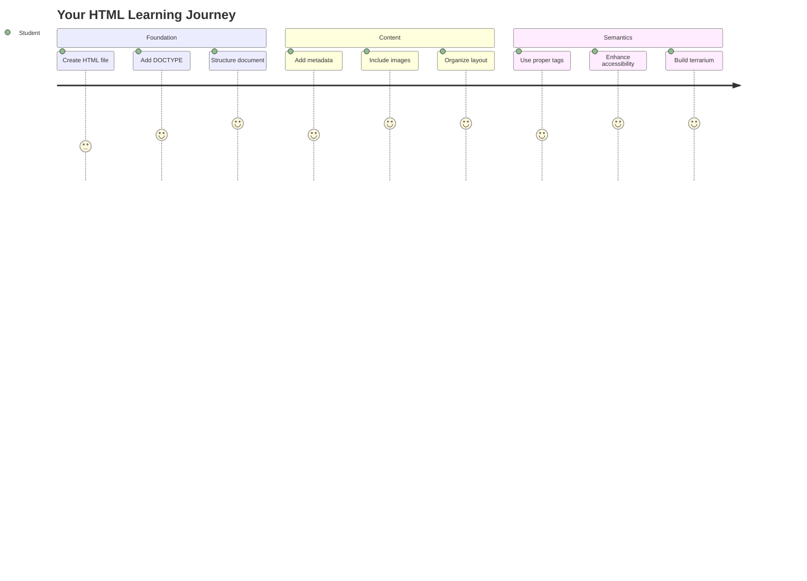
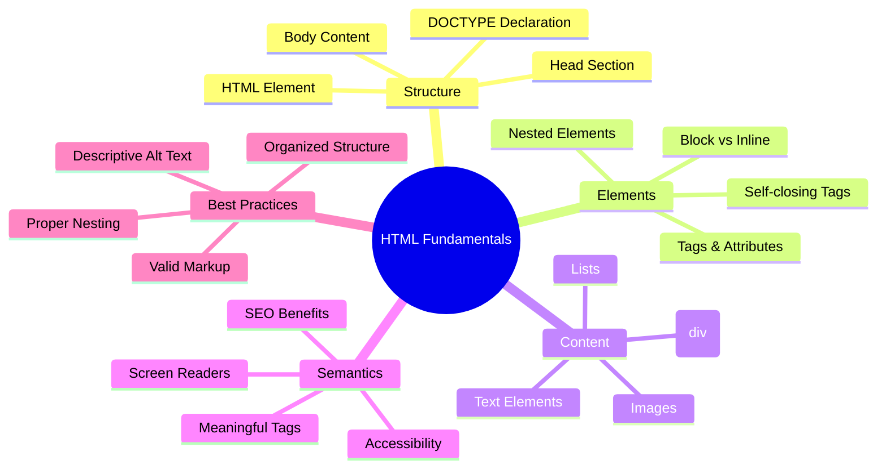
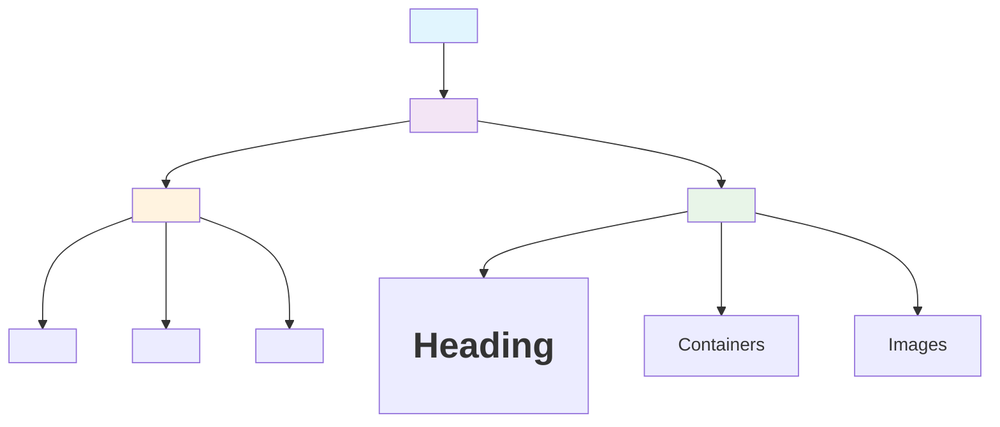
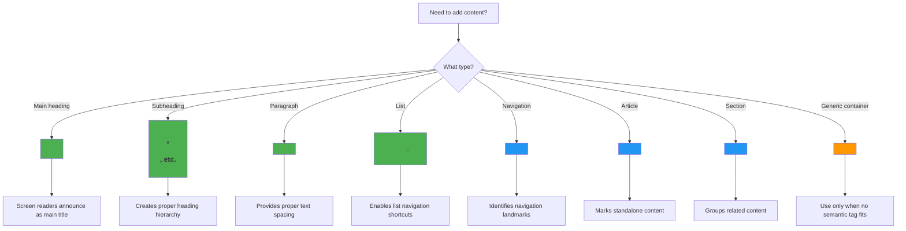
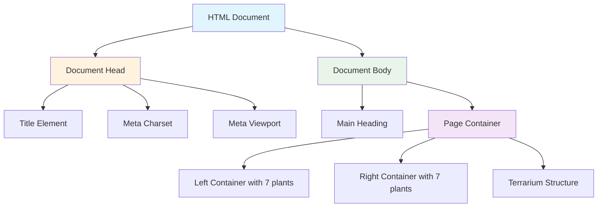
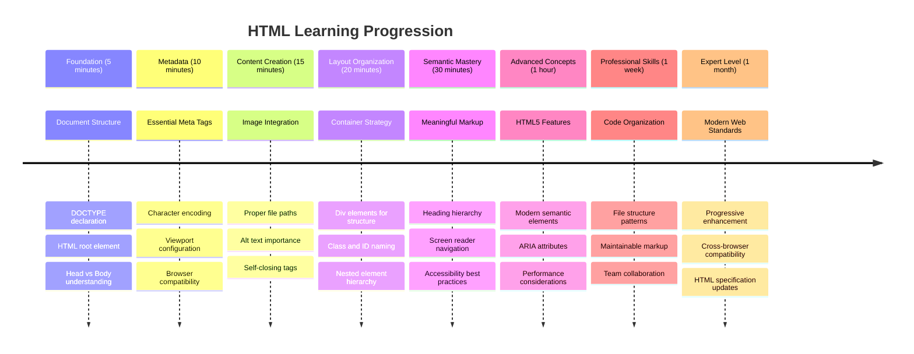

<!--
CO_OP_TRANSLATOR_METADATA:
{
  "original_hash": "3fcfa99c4897e051b558b5eaf1e8cc74",
  "translation_date": "2025-11-06T12:12:38+00:00",
  "source_file": "3-terrarium/1-intro-to-html/README.md",
  "language_code": "ms"
}
-->
# Projek Terrarium Bahagian 1: Pengenalan kepada HTML




> Sketchnote oleh [Tomomi Imura](https://twitter.com/girlie_mac)

HTML, atau HyperText Markup Language, adalah asas kepada setiap laman web yang pernah anda lawati. Fikirkan HTML sebagai rangka yang memberikan struktur kepada halaman web – ia menentukan di mana kandungan diletakkan, bagaimana ia diatur, dan apa yang setiap bahagian wakili. Walaupun CSS nanti akan "menghias" HTML anda dengan warna dan susunan, dan JavaScript akan menghidupkannya dengan interaktiviti, HTML menyediakan struktur penting yang menjadikan segalanya mungkin.

Dalam pelajaran ini, anda akan mencipta struktur HTML untuk antara muka terrarium maya. Projek praktikal ini akan mengajar anda konsep asas HTML sambil membina sesuatu yang menarik secara visual. Anda akan belajar bagaimana mengatur kandungan menggunakan elemen semantik, bekerja dengan imej, dan mencipta asas untuk aplikasi web interaktif.

Pada akhir pelajaran ini, anda akan mempunyai halaman HTML yang berfungsi memaparkan imej tumbuhan dalam lajur yang teratur, sedia untuk dihias dalam pelajaran seterusnya. Jangan risau jika ia kelihatan asas pada mulanya – itulah yang sepatutnya dilakukan oleh HTML sebelum CSS menambah sentuhan visual.



## Kuiz Pra-Pelajaran

[Kuiz pra-pelajaran](https://ff-quizzes.netlify.app/web/quiz/15)

> 📺 **Tonton dan Belajar**: Lihat video ringkasan yang berguna ini
> 
> [](https://www.youtube.com/watch?v=1TvxJKBzhyQ)

## Menyediakan Projek Anda

Sebelum kita mula dengan kod HTML, mari kita sediakan ruang kerja yang sesuai untuk projek terrarium anda. Membuat struktur fail yang teratur dari awal adalah tabiat penting yang akan membantu anda sepanjang perjalanan pembangunan web anda.

### Tugasan: Cipta Struktur Projek Anda

Anda akan mencipta folder khusus untuk projek terrarium anda dan menambah fail HTML pertama anda. Berikut adalah dua pendekatan yang boleh anda gunakan:

**Pilihan 1: Menggunakan Visual Studio Code**
1. Buka Visual Studio Code
2. Klik "File" → "Open Folder" atau gunakan `Ctrl+K, Ctrl+O` (Windows/Linux) atau `Cmd+K, Cmd+O` (Mac)
3. Cipta folder baru bernama `terrarium` dan pilihnya
4. Dalam panel Explorer, klik ikon "New File"
5. Namakan fail anda `index.html`


**Pilihan 2: Menggunakan Perintah Terminal**
```bash
mkdir terrarium
cd terrarium
touch index.html
code index.html
```

**Apa yang dicapai oleh perintah ini:**
- **Mencipta** direktori baru bernama `terrarium` untuk projek anda
- **Navigasi** ke dalam direktori terrarium 
- **Mencipta** fail kosong `index.html`
- **Membuka** fail dalam Visual Studio Code untuk penyuntingan

> 💡 **Tip Pro**: Nama fail `index.html` adalah istimewa dalam pembangunan web. Apabila seseorang melawat laman web, pelayar secara automatik mencari `index.html` sebagai halaman lalai untuk dipaparkan. Ini bermakna URL seperti `https://mysite.com/projects/` akan secara automatik memaparkan fail `index.html` dari folder `projects` tanpa perlu menentukan nama fail dalam URL.

## Memahami Struktur Dokumen HTML

Setiap dokumen HTML mengikuti struktur tertentu yang diperlukan oleh pelayar untuk memahami dan memaparkan dengan betul. Fikirkan struktur ini seperti surat rasmi – ia mempunyai elemen yang diperlukan dalam susunan tertentu yang membantu penerima (dalam kes ini, pelayar) memproses kandungan dengan betul.



Mari kita mulakan dengan menambah asas penting yang diperlukan oleh setiap dokumen HTML.

### Deklarasi DOCTYPE dan Elemen Root

Dua baris pertama mana-mana fail HTML berfungsi sebagai "pengenalan" dokumen kepada pelayar:

```html
<!DOCTYPE html>
<html></html>
```

**Memahami apa yang dilakukan oleh kod ini:**
- **Mengisytiharkan** jenis dokumen sebagai HTML5 menggunakan `<!DOCTYPE html>`
- **Mencipta** elemen root `<html>` yang akan mengandungi semua kandungan halaman
- **Menetapkan** piawaian web moden untuk paparan pelayar yang betul
- **Memastikan** paparan konsisten di pelbagai pelayar dan peranti

> 💡 **Tip VS Code**: Letakkan kursor pada mana-mana tag HTML dalam VS Code untuk melihat maklumat berguna daripada MDN Web Docs, termasuk contoh penggunaan dan butiran keserasian pelayar.

> 📚 **Ketahui Lebih Lanjut**: Deklarasi DOCTYPE menghalang pelayar daripada memasuki "quirks mode," yang digunakan untuk menyokong laman web yang sangat lama. Pembangunan web moden menggunakan deklarasi `<!DOCTYPE html>` yang mudah untuk memastikan [paparan yang mematuhi piawaian](https://developer.mozilla.org/docs/Web/HTML/Quirks_Mode_and_Standards_Mode).

### 🔄 **Pemeriksaan Pedagogi**
**Berhenti dan Renungkan**: Sebelum meneruskan, pastikan anda memahami:
- ✅ Mengapa setiap dokumen HTML memerlukan deklarasi DOCTYPE
- ✅ Apa yang terkandung dalam elemen root `<html>`
- ✅ Bagaimana struktur ini membantu pelayar memaparkan halaman dengan betul

**Ujian Kendiri Cepat**: Bolehkah anda menerangkan dengan kata-kata anda sendiri apa maksud "paparan yang mematuhi piawaian"?

## Menambah Metadata Dokumen Penting

Bahagian `<head>` dalam dokumen HTML mengandungi maklumat penting yang diperlukan oleh pelayar dan enjin carian, tetapi yang tidak dilihat secara langsung oleh pelawat di halaman. Fikirkan ia sebagai maklumat "di belakang tabir" yang membantu laman web anda berfungsi dengan betul dan muncul dengan betul di pelbagai peranti dan platform.

Metadata ini memberitahu pelayar bagaimana untuk memaparkan halaman anda, kod pengekodan watak yang hendak digunakan, dan bagaimana untuk mengendalikan saiz skrin yang berbeza – semua ini penting untuk mencipta laman web yang profesional dan boleh diakses.

### Tugasan: Tambah Bahagian Kepala Dokumen

Masukkan bahagian `<head>` ini di antara tag pembuka dan penutup `<html>` anda:

```html
<head>
	<title>Welcome to my Virtual Terrarium</title>
	<meta charset="utf-8" />
	<meta http-equiv="X-UA-Compatible" content="IE=edge" />
	<meta name="viewport" content="width=device-width, initial-scale=1" />
</head>
```

**Memecahkan apa yang dicapai oleh setiap elemen:**
- **Menetapkan** tajuk halaman yang muncul di tab pelayar dan hasil carian
- **Menentukan** pengekodan watak UTF-8 untuk paparan teks yang betul di seluruh dunia
- **Memastikan** keserasian dengan versi moden Internet Explorer
- **Mengkonfigurasi** reka bentuk responsif dengan menetapkan viewport untuk sepadan dengan lebar peranti
- **Mengawal** tahap zum awal untuk memaparkan kandungan pada saiz semula jadi

> 🤔 **Fikirkan Ini**: Apa yang akan berlaku jika anda menetapkan tag meta viewport seperti ini: `<meta name="viewport" content="width=600">`? Ini akan memaksa halaman sentiasa menjadi 600 piksel lebar, memecahkan reka bentuk responsif! Ketahui lebih lanjut tentang [konfigurasi viewport yang betul](https://developer.mozilla.org/docs/Web/HTML/Viewport_meta_tag).

## Membina Badan Dokumen

Elemen `<body>` mengandungi semua kandungan yang boleh dilihat di laman web anda – segala-galanya yang pengguna akan lihat dan berinteraksi. Walaupun bahagian `<head>` memberikan arahan kepada pelayar, bahagian `<body>` mengandungi kandungan sebenar: teks, imej, butang, dan elemen lain yang mencipta antara muka pengguna anda.

Mari kita tambah struktur badan dan fahami bagaimana tag HTML bekerjasama untuk mencipta kandungan yang bermakna.

### Memahami Struktur Tag HTML

HTML menggunakan tag berpasangan untuk menentukan elemen. Kebanyakan tag mempunyai tag pembuka seperti `<p>` dan tag penutup seperti `</p>`, dengan kandungan di antara: `<p>Hello, world!</p>`. Ini mencipta elemen perenggan yang mengandungi teks "Hello, world!".

### Tugasan: Tambah Elemen Badan

Kemas kini fail HTML anda untuk memasukkan elemen `<body>`:

```html
<!DOCTYPE html>
<html>
	<head>
		<title>Welcome to my Virtual Terrarium</title>
		<meta charset="utf-8" />
		<meta http-equiv="X-UA-Compatible" content="IE=edge" />
		<meta name="viewport" content="width=device-width, initial-scale=1" />
	</head>
	<body></body>
</html>
```

**Inilah yang disediakan oleh struktur lengkap ini:**
- **Menetapkan** rangka kerja dokumen HTML5 asas
- **Termasuk** metadata penting untuk paparan pelayar yang betul
- **Mencipta** badan kosong yang sedia untuk kandungan yang boleh dilihat
- **Mengikuti** amalan terbaik pembangunan web moden

Sekarang anda sudah bersedia untuk menambah elemen yang boleh dilihat pada terrarium anda. Kita akan menggunakan elemen `<div>` sebagai bekas untuk mengatur bahagian kandungan yang berbeza, dan elemen `` untuk memaparkan imej tumbuhan.

### Bekerja dengan Imej dan Bekas Susun Atur

Imej adalah istimewa dalam HTML kerana ia menggunakan tag "penutup sendiri". Tidak seperti elemen seperti `<p></p>` yang membungkus kandungan, tag `` mengandungi semua maklumat yang diperlukan dalam tag itu sendiri menggunakan atribut seperti `src` untuk laluan fail imej dan `alt` untuk kebolehaksesan.

Sebelum menambah imej ke HTML anda, anda perlu mengatur fail projek anda dengan betul dengan mencipta folder imej dan menambah grafik tumbuhan.

**Pertama, sediakan imej anda:**
1. Cipta folder bernama `images` di dalam folder projek terrarium anda
2. Muat turun imej tumbuhan dari [folder penyelesaian](../../../../3-terrarium/solution/images) (14 imej tumbuhan keseluruhan)
3. Salin semua imej tumbuhan ke dalam folder `images` baru anda

### Tugasan: Cipta Susun Atur Paparan Tumbuhan

Sekarang tambahkan imej tumbuhan yang diatur dalam dua lajur di antara tag `<body></body>` anda:

```html
<div id="page">
	<div id="left-container" class="container">
		<div class="plant-holder">
			
		</div>
		<div class="plant-holder">
			
		</div>
		<div class="plant-holder">
			
		</div>
		<div class="plant-holder">
			
		</div>
		<div class="plant-holder">
			
		</div>
		<div class="plant-holder">
			
		</div>
		<div class="plant-holder">
			
		</div>
	</div>
	<div id="right-container" class="container">
		<div class="plant-holder">
			
		</div>
		<div class="plant-holder">
			
		</div>
		<div class="plant-holder">
			
		</div>
		<div class="plant-holder">
			
		</div>
		<div class="plant-holder">
			
		</div>
		<div class="plant-holder">
			
		</div>
		<div class="plant-holder">
			
		</div>
	</div>
</div>
```

**Langkah demi langkah, inilah yang berlaku dalam kod ini:**
- **Mencipta** bekas halaman utama dengan `id="page"` untuk memegang semua kandungan
- **Menetapkan** dua bekas lajur: `left-container` dan `right-container`
- **Mengatur** 7 tumbuhan dalam lajur kiri dan 7 tumbuhan dalam lajur kanan
- **Membungkus** setiap imej tumbuhan dalam div `plant-holder` untuk kedudukan individu
- **Menggunakan** nama kelas yang konsisten untuk penggayaan CSS dalam pelajaran seterusnya
- **Menetapkan** ID unik kepada setiap imej tumbuhan untuk interaksi JavaScript kemudian
- **Termasuk** laluan fail yang betul menunjuk ke folder imej

> 🤔 **Pertimbangkan Ini**: Perhatikan bahawa semua imej kini mempunyai teks alt yang sama "plant". Ini tidak ideal untuk kebolehaksesan. Pengguna pembaca skrin akan mendengar "plant" diulang 14 kali tanpa mengetahui tumbuhan spesifik yang ditunjukkan oleh setiap imej. Bolehkah anda memikirkan teks alt yang lebih baik dan deskriptif untuk setiap imej?

> 📝 **Jenis Elemen HTML**: Elemen `<div>` adalah "block-level" dan mengambil lebar penuh, manakala elemen `<span>` adalah "inline" dan hanya mengambil lebar yang diperlukan. Apa yang anda fikir akan berlaku jika anda menukar semua tag `<div>` ini kepada tag `<span>`?

### 🔄 **Pemeriksaan Pedagogi**
**Memahami Struktur**: Luangkan masa untuk menyemak struktur HTML anda:
- ✅ Bolehkah anda mengenal pasti bekas utama dalam susun atur anda?
- ✅ Adakah anda memahami mengapa setiap imej mempunyai ID unik?
- ✅ Bagaimana anda akan menerangkan tujuan div `plant-holder`?

**Pemeriksaan Visual**: Buka fail HTML anda dalam pelayar. Anda sepatutnya melihat:
- Senarai asas imej tumbuhan
- Imej yang diatur dalam dua lajur
- Susun atur yang mudah dan tidak bergaya

**Ingat**: Penampilan asas ini adalah apa yang sepatutnya kelihatan sebelum penggayaan CSS!

Dengan markup ini ditambah, tumbuhan akan muncul di skrin, walaupun ia belum kelihatan menarik – itulah tujuan CSS dalam pelajaran seterusnya! Buat masa ini, anda mempunyai asas HTML yang kukuh yang mengatur kandungan anda dengan betul dan mengikuti amalan terbaik kebolehaksesan.

## Menggunakan HTML Semantik untuk Kebolehaksesan

HTML semantik bermaksud memilih elemen HTML berdasarkan makna dan tujuannya, bukan hanya penampilannya. Apabila anda menggunakan markup semantik, anda menyampaikan struktur dan makna kandungan anda kepada pelayar, enjin carian, dan teknologi bantuan seperti pembaca skrin.



Pendekatan ini menjadikan laman web anda lebih mudah diakses oleh pengguna dengan kecacatan dan membantu enjin carian memahami kandungan anda dengan lebih baik. Ia adalah prinsip asas pembangunan web moden yang mencipta pengalaman yang lebih baik untuk semua orang.

### Menambah Tajuk Halaman Semantik

Mari kita tambahkan tajuk yang sesuai untuk halaman terrarium anda. Masukkan baris ini tepat selepas tag pembuka `<body>`:

```html
<h1>My Terrarium</h1>
```

**Mengapa markup semantik penting:**
- **Membantu** pembaca skrin menavigasi dan memahami struktur halaman
- **Meningkatkan** pengoptimuman enjin carian (SEO) dengan menjelaskan hierarki kandungan
- **Memperbaiki** kebolehaksesan untuk pengguna dengan masalah penglihatan atau perbezaan kognitif
- **Mencipta** pengalaman pengguna yang lebih baik di semua peranti dan platform
- **Mengikuti** piawaian web dan amalan terbaik untuk pembangunan profesional

**Contoh pilihan semantik vs. tidak semantik:**

| Tujuan | ✅ Pilihan Semantik | ❌ Pilihan Tidak Semantik |
|--------|---------------------|--------------------------|
| Tajuk utama | `<h1>Title</h1>` | `<div class="big-text">Title</div>` |
| Navigasi | `<nav><ul><li></li></ul></nav>` | `<div class="menu"><div></div></div>` |
| Butang | `<button>Click me</button>` | `<span onclick="...">Click me</span>` |
| Kandungan artikel | `<article><p></p></article>` | `<div class="content"><div></div></div>` |

> 🎥 **Lihat Dalam Tindakan**: Tonton [bagaimana pembaca skrin berinteraksi dengan laman web](https://www.youtube.com/watch?v=OUDV1gqs9GA) untuk memahami mengapa markup semantik penting untuk kebolehaksesan. Perhatikan bagaimana struktur HTML yang betul membantu pengguna menavigasi dengan cekap.

## Mencipta Bekas Terrarium

Sekarang mari kita tambahkan struktur HTML untuk terrarium itu sendiri – bekas kaca di mana tumbuhan akhirnya akan diletakkan. Bahagian ini menunjukkan konsep penting: HTML menyediakan struktur, tetapi tanpa penggayaan CSS, elemen ini belum kelihatan.

Markup terrarium menggunakan nama kelas deskriptif yang akan menjadikan penggayaan CSS intuitif dan mudah diselenggara dalam pelajaran seterusnya.

### Tugasan: Tambah Struktur Terrarium

Masukkan markup ini di atas tag `</div>` terakhir (sebelum tag penutup bekas halaman):

```html
<div id="terrarium">
	<div class="jar-top"></div>
	<div class="jar-walls">
		<div class="jar-glossy-long"></div>
		<div class="jar-glossy-short"></div>
	</div>
	<div class="dirt"></div>
	<div class="jar-bottom"></div>
</div>
```

**Memahami struktur terrarium ini:**
- **Mencipta** bekas terrarium utama dengan ID unik untuk penggayaan
- **Menentukan** elemen berasingan untuk setiap komponen visual (atas, dinding, tanah, bawah)
- **Termasuk** elemen bersarang untuk kesan pantulan kaca (elemen berkilat)
- **Menggunakan** nama kelas deskriptif yang jelas menunjukkan tujuan setiap elemen
- **Menyediakan** struktur untuk gaya CSS yang akan mencipta rupa terrarium kaca

> 🤔 **Perasan Sesuatu?**: Walaupun anda telah menambah markup ini, anda tidak melihat apa-apa yang baru di halaman! Ini menunjukkan dengan jelas bagaimana HTML menyediakan struktur sementara CSS memberikan penampilan. Elemen `<div>` ini wujud tetapi belum mempunyai gaya visual – itu akan dibincangkan dalam pelajaran seterusnya!



### 🔄 **Pemeriksaan Pedagogi**
**Penguasaan Struktur HTML**: Sebelum meneruskan, pastikan anda boleh:
- ✅ Jelaskan perbezaan antara struktur HTML dan penampilan visual
- ✅ Kenal pasti elemen HTML semantik vs. tidak semantik
- ✅ Terangkan bagaimana markup yang betul memberi manfaat kepada kebolehaksesan
- ✅ Kenali struktur pokok dokumen lengkap

**Uji Pemahaman Anda**: Cuba buka fail HTML anda dalam pelayar dengan JavaScript dimatikan dan CSS dikeluarkan. Ini menunjukkan struktur semantik tulen yang telah anda cipta!

---

## Cabaran Ejen GitHub Copilot

Gunakan mod Ejen untuk menyelesaikan cabaran berikut:

**Penerangan:** Cipta struktur HTML semantik untuk bahagian panduan penjagaan tumbuhan yang boleh ditambah kepada projek terrarium.

**Arahan:** Cipta bahagian HTML semantik yang termasuk tajuk utama "Panduan Penjagaan Tumbuhan", tiga subseksyen dengan tajuk "Penyiraman", "Keperluan Cahaya", dan "Penjagaan Tanah", setiap satu mengandungi perenggan maklumat penjagaan tumbuhan. Gunakan tag HTML semantik yang sesuai seperti `<section>`, `<h2>`, `<h3>`, dan `<p>` untuk menyusun kandungan dengan betul.

Ketahui lebih lanjut tentang [mod ejen](https://code.visualstudio.com/blogs/2025/02/24/introducing-copilot-agent-mode) di sini.

## Cabaran Sejarah HTML

**Belajar Tentang Evolusi Web**

HTML telah berkembang dengan ketara sejak Tim Berners-Lee mencipta pelayar web pertama di CERN pada tahun 1990. Beberapa tag lama seperti `<marquee>` kini telah ditamatkan kerana ia tidak sesuai dengan standard kebolehaksesan moden dan prinsip reka bentuk responsif.

**Cuba Eksperimen Ini:**
1. Balut sementara tajuk `<h1>` anda dalam tag `<marquee>`: `<marquee><h1>Terrarium Saya</h1></marquee>`
2. Buka halaman anda dalam pelayar dan perhatikan kesan tatal
3. Pertimbangkan mengapa tag ini telah ditamatkan (petunjuk: fikirkan tentang pengalaman pengguna dan kebolehaksesan)
4. Keluarkan tag `<marquee>` dan kembali kepada markup semantik

**Soalan Refleksi:**
- Bagaimana tajuk yang menatal boleh memberi kesan kepada pengguna dengan gangguan penglihatan atau sensitiviti pergerakan?
- Teknik CSS moden apa yang boleh mencapai kesan visual serupa dengan lebih kebolehaksesan?
- Mengapa penting untuk menggunakan standard web semasa dan bukannya elemen yang telah ditamatkan?

Terokai lebih lanjut tentang [elemen HTML yang usang dan ditamatkan](https://developer.mozilla.org/docs/Web/HTML/Element#Obsolete_and_deprecated_elements) untuk memahami bagaimana standard web berkembang untuk meningkatkan pengalaman pengguna.

## Kuiz Selepas Kuliah

[Kuiz selepas kuliah](https://ff-quizzes.netlify.app/web/quiz/16)

## Ulasan & Kajian Kendiri

**Mendalami Pengetahuan HTML Anda**

HTML telah menjadi asas web selama lebih 30 tahun, berkembang daripada bahasa markup dokumen yang ringkas kepada platform canggih untuk membina aplikasi interaktif. Memahami evolusi ini membantu anda menghargai standard web moden dan membuat keputusan pembangunan yang lebih baik.

**Laluan Pembelajaran yang Disyorkan:**

1. **Sejarah dan Evolusi HTML**
   - Selidik garis masa dari HTML 1.0 hingga HTML5
   - Terokai mengapa tag tertentu telah ditamatkan (kebolehaksesan, mesra mudah alih, penyelenggaraan)
   - Selidik ciri HTML yang muncul dan cadangan

2. **Mendalami HTML Semantik**
   - Kajian senarai lengkap [elemen semantik HTML5](https://developer.mozilla.org/docs/Web/HTML/Element)
   - Latih mengenal pasti bila menggunakan `<article>`, `<section>`, `<aside>`, dan `<main>`
   - Belajar tentang atribut ARIA untuk kebolehaksesan yang dipertingkatkan

3. **Pembangunan Web Moden**
   - Terokai [membina laman web responsif](https://docs.microsoft.com/learn/modules/build-simple-website/?WT.mc_id=academic-77807-sagibbon) di Microsoft Learn
   - Fahami bagaimana HTML berintegrasi dengan CSS dan JavaScript
   - Belajar tentang prestasi web dan amalan terbaik SEO

**Soalan Refleksi:**
- Tag HTML yang telah ditamatkan mana yang anda temui, dan mengapa ia telah dikeluarkan?
- Ciri HTML baru apa yang dicadangkan untuk versi masa depan?
- Bagaimana HTML semantik menyumbang kepada kebolehaksesan web dan SEO?

### ⚡ **Apa Yang Boleh Anda Lakukan Dalam 5 Minit Seterusnya**
- [ ] Buka DevTools (F12) dan periksa struktur HTML laman web kegemaran anda
- [ ] Cipta fail HTML ringkas dengan tag asas: `<h1>`, `<p>`, dan ``
- [ ] Sahkan HTML anda menggunakan Validator HTML W3C dalam talian
- [ ] Cuba tambah komen pada HTML anda menggunakan `<!-- komen -->`

### 🎯 **Apa Yang Boleh Anda Capai Dalam Satu Jam**
- [ ] Lengkapkan kuiz selepas pelajaran dan ulas konsep HTML semantik
- [ ] Bina laman web ringkas tentang diri anda menggunakan struktur HTML yang betul
- [ ] Bereksperimen dengan tahap tajuk yang berbeza dan tag pemformatan teks
- [ ] Tambah imej dan pautan untuk berlatih integrasi multimedia
- [ ] Selidik ciri HTML5 yang belum anda cuba

### 📅 **Perjalanan HTML Anda Selama Seminggu**
- [ ] Lengkapkan tugasan projek terrarium dengan markup semantik
- [ ] Cipta laman web yang boleh diakses menggunakan label dan peranan ARIA
- [ ] Latih penciptaan borang dengan pelbagai jenis input
- [ ] Terokai API HTML5 seperti localStorage atau geolocation
- [ ] Kajian corak HTML responsif dan reka bentuk berorientasikan mudah alih
- [ ] Ulas kod HTML pemaju lain untuk amalan terbaik

### 🌟 **Asas Web Anda Selama Sebulan**
- [ ] Bina laman web portfolio yang mempamerkan penguasaan HTML anda
- [ ] Belajar templat HTML dengan rangka kerja seperti Handlebars
- [ ] Menyumbang kepada projek sumber terbuka dengan meningkatkan dokumentasi HTML
- [ ] Kuasai konsep HTML lanjutan seperti elemen tersuai
- [ ] Integrasi HTML dengan rangka kerja CSS dan pustaka JavaScript
- [ ] Mentor orang lain yang belajar asas HTML

## 🎯 Garis Masa Penguasaan HTML Anda



### 🛠️ Ringkasan Alat HTML Anda

Selepas menyelesaikan pelajaran ini, anda kini mempunyai:
- **Struktur Dokumen**: Asas HTML5 lengkap dengan DOCTYPE yang betul
- **Markup Semantik**: Tag bermakna yang meningkatkan kebolehaksesan dan SEO
- **Integrasi Imej**: Amalan organisasi fail dan teks alt yang betul
- **Bekas Susun Atur**: Penggunaan div strategik dengan nama kelas deskriptif
- **Kesedaran Kebolehaksesan**: Pemahaman navigasi pembaca skrin
- **Standard Moden**: Amalan HTML5 semasa dan pengetahuan tag yang telah ditamatkan
- **Asas Projek**: Asas kukuh untuk gaya CSS dan interaktiviti JavaScript

**Langkah Seterusnya**: Struktur HTML anda sudah bersedia untuk gaya CSS! Asas semantik yang telah anda bina akan memudahkan pelajaran seterusnya untuk difahami.

## Tugasan

[Latih HTML anda: Bina mockup blog](assignment.md)

---

**Penafian**:  
Dokumen ini telah diterjemahkan menggunakan perkhidmatan terjemahan AI [Co-op Translator](https://github.com/Azure/co-op-translator). Walaupun kami berusaha untuk ketepatan, sila ambil perhatian bahawa terjemahan automatik mungkin mengandungi kesilapan atau ketidaktepatan. Dokumen asal dalam bahasa asalnya harus dianggap sebagai sumber yang berwibawa. Untuk maklumat penting, terjemahan manusia profesional adalah disyorkan. Kami tidak bertanggungjawab atas sebarang salah faham atau salah tafsir yang timbul daripada penggunaan terjemahan ini.