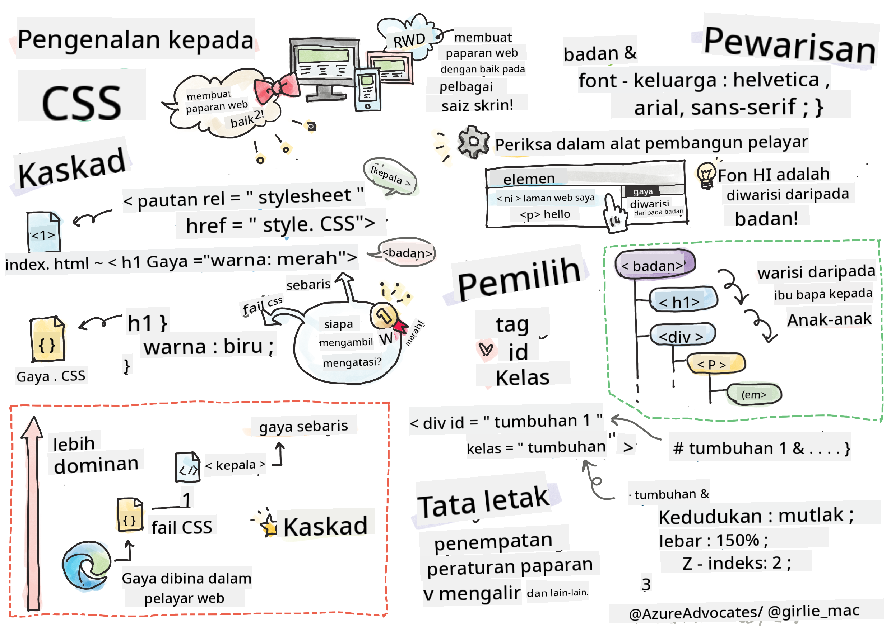
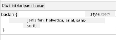
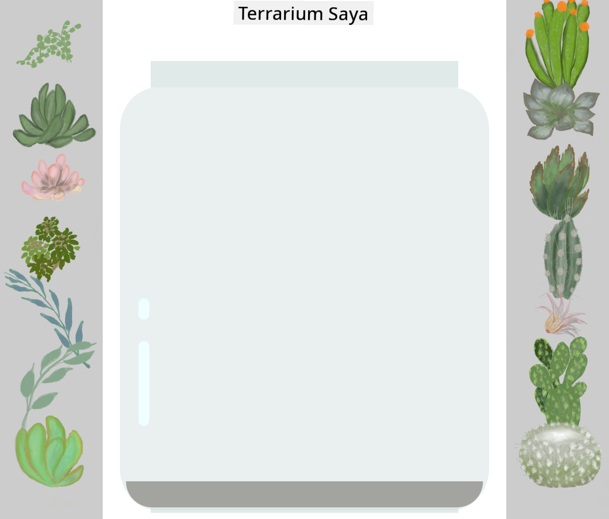

<!--
CO_OP_TRANSLATOR_METADATA:
{
  "original_hash": "acb5ae00cde004304296bb97da8ff4c3",
  "translation_date": "2025-08-29T09:33:00+00:00",
  "source_file": "3-terrarium/2-intro-to-css/README.md",
  "language_code": "ms"
}
-->
# Projek Terrarium Bahagian 2: Pengenalan kepada CSS


> Sketchnote oleh [Tomomi Imura](https://twitter.com/girlie_mac)

## Kuiz Pra-Kuliah

[Kuiz pra-kuliah](https://ff-quizzes.netlify.app/web/quiz/17)

### Pengenalan

CSS, atau Cascading Style Sheets, menyelesaikan masalah penting dalam pembangunan web: bagaimana untuk menjadikan laman web anda kelihatan menarik. Penggayaan aplikasi anda menjadikannya lebih mudah digunakan dan kelihatan lebih menarik; anda juga boleh menggunakan CSS untuk mencipta Rekabentuk Web Responsif (RWD) - membolehkan aplikasi anda kelihatan baik tidak kira saiz skrin yang digunakan. CSS bukan sahaja tentang menjadikan aplikasi anda kelihatan menarik; spesifikasinya termasuk animasi dan transformasi yang boleh membolehkan interaksi yang canggih untuk aplikasi anda. Kumpulan Kerja CSS membantu mengekalkan spesifikasi CSS semasa; anda boleh mengikuti kerja mereka di [laman World Wide Web Consortium](https://www.w3.org/Style/CSS/members).

> Nota, CSS adalah bahasa yang berkembang, seperti segala sesuatu di web, dan tidak semua pelayar menyokong bahagian spesifikasi yang lebih baru. Sentiasa semak pelaksanaan anda dengan merujuk [CanIUse.com](https://caniuse.com).

Dalam pelajaran ini, kita akan menambah gaya kepada terrarium dalam talian kita dan mempelajari lebih lanjut tentang beberapa konsep CSS: kaskad, pewarisan, dan penggunaan pemilih, kedudukan, serta menggunakan CSS untuk membina susun atur. Dalam proses ini, kita akan menyusun terrarium dan mencipta terrarium itu sendiri.

### Prasyarat

Anda sepatutnya telah membina HTML untuk terrarium anda dan bersedia untuk digayakan.

> Tonton video

> 
> [](https://www.youtube.com/watch?v=6yIdOIV9p1I)

### Tugasan

Dalam folder terrarium anda, buat fail baru bernama `style.css`. Import fail tersebut dalam bahagian `<head>`:

```html
<link rel="stylesheet" href="./style.css" />
```

---

## Kaskad

Cascading Style Sheets menggabungkan idea bahawa gaya 'mengalir' sedemikian rupa sehingga penerapan gaya dipandu oleh keutamaannya. Gaya yang ditetapkan oleh pengarang laman web mempunyai keutamaan berbanding yang ditetapkan oleh pelayar. Gaya yang ditetapkan 'inline' mempunyai keutamaan berbanding yang ditetapkan dalam lembaran gaya luaran.

### Tugasan

Tambahkan gaya inline "color: red" pada tag `<h1>` anda:

```HTML
<h1 style="color: red">My Terrarium</h1>
```

Kemudian, tambahkan kod berikut ke fail `style.css` anda:

```CSS
h1 {
 color: blue;
}
```

✅ Warna apa yang dipaparkan dalam aplikasi web anda? Kenapa? Bolehkah anda mencari cara untuk mengatasi gaya? Bilakah anda ingin melakukan ini, atau kenapa tidak?

---

## Pewarisan

Gaya diwarisi daripada gaya nenek moyang kepada keturunan, sedemikian rupa sehingga elemen bersarang mewarisi gaya ibu bapa mereka.

### Tugasan

Tetapkan fon badan kepada fon tertentu, dan periksa untuk melihat fon elemen bersarang:

```CSS
body {
	font-family: helvetica, arial, sans-serif;
}
```

Buka konsol pelayar anda pada tab 'Elements' dan perhatikan fon H1. Ia mewarisi fon daripada badan, seperti yang dinyatakan dalam pelayar:



✅ Bolehkah anda membuat gaya bersarang mewarisi sifat yang berbeza?

---

## Pemilih CSS

### Tag

Setakat ini, fail `style.css` anda hanya mempunyai beberapa tag yang digayakan, dan aplikasi kelihatan agak pelik:

```CSS
body {
	font-family: helvetica, arial, sans-serif;
}

h1 {
	color: #3a241d;
	text-align: center;
}
```

Cara ini untuk menggayakan tag memberi anda kawalan ke atas elemen unik, tetapi anda perlu mengawal gaya banyak tumbuhan dalam terrarium anda. Untuk melakukan itu, anda perlu memanfaatkan pemilih CSS.

### Id

Tambahkan beberapa gaya untuk menyusun kontena kiri dan kanan. Oleh kerana hanya ada satu kontena kiri dan satu kontena kanan, mereka diberikan id dalam markup. Untuk menggayakannya, gunakan `#`:

```CSS
#left-container {
	background-color: #eee;
	width: 15%;
	left: 0px;
	top: 0px;
	position: absolute;
	height: 100%;
	padding: 10px;
}

#right-container {
	background-color: #eee;
	width: 15%;
	right: 0px;
	top: 0px;
	position: absolute;
	height: 100%;
	padding: 10px;
}
```

Di sini, anda telah meletakkan kontena ini dengan kedudukan mutlak di sebelah kiri dan kanan skrin, dan menggunakan peratusan untuk lebar mereka supaya mereka boleh berskala untuk skrin mudah alih kecil.

✅ Kod ini agak berulang, jadi tidak "DRY" (Don't Repeat Yourself); bolehkah anda mencari cara yang lebih baik untuk menggayakan id ini, mungkin dengan id dan kelas? Anda perlu mengubah markup dan menyusun semula CSS:

```html
<div id="left-container" class="container"></div>
```

### Kelas

Dalam contoh di atas, anda menggayakan dua elemen unik pada skrin. Jika anda ingin gaya digunakan pada banyak elemen di skrin, anda boleh menggunakan kelas CSS. Lakukan ini untuk menyusun tumbuhan dalam kontena kiri dan kanan.

Perhatikan bahawa setiap tumbuhan dalam markup HTML mempunyai gabungan id dan kelas. Id di sini digunakan oleh JavaScript yang akan anda tambahkan kemudian untuk memanipulasi penempatan tumbuhan terrarium. Kelas, bagaimanapun, memberikan semua tumbuhan gaya tertentu.

```html
<div class="plant-holder">
	
</div>
```

Tambahkan kod berikut ke fail `style.css` anda:

```CSS
.plant-holder {
	position: relative;
	height: 13%;
	left: -10px;
}

.plant {
	position: absolute;
	max-width: 150%;
	max-height: 150%;
	z-index: 2;
}
```

Yang ketara dalam snippet ini adalah campuran kedudukan relatif dan mutlak, yang akan kita bahas dalam bahagian seterusnya. Lihat cara ketinggian dikendalikan oleh peratusan:

Anda menetapkan ketinggian pemegang tumbuhan kepada 13%, nombor yang baik untuk memastikan semua tumbuhan dipaparkan dalam setiap kontena menegak tanpa perlu menatal.

Anda menetapkan pemegang tumbuhan untuk bergerak ke kiri supaya tumbuhan lebih terpusat dalam kontena mereka. Imej mempunyai sejumlah besar latar belakang yang telus supaya ia lebih mudah untuk diseret, jadi perlu ditolak ke kiri untuk muat lebih baik pada skrin.

Kemudian, tumbuhan itu sendiri diberikan lebar maksimum 150%. Ini membolehkan ia berskala turun apabila pelayar berskala turun. Cuba ubah saiz pelayar anda; tumbuhan kekal dalam kontena mereka tetapi berskala turun untuk muat.

Yang juga ketara adalah penggunaan z-index, yang mengawal ketinggian relatif elemen (supaya tumbuhan duduk di atas kontena dan kelihatan duduk di dalam terrarium).

✅ Kenapa anda memerlukan kedua-dua pemilih CSS pemegang tumbuhan dan tumbuhan?

## Kedudukan CSS

Mencampurkan sifat kedudukan (terdapat kedudukan statik, relatif, tetap, mutlak, dan melekit) boleh menjadi agak rumit, tetapi apabila dilakukan dengan betul ia memberikan anda kawalan yang baik ke atas elemen pada halaman anda.

Elemen yang diposisikan secara mutlak diposisikan relatif kepada nenek moyang yang diposisikan terdekat, dan jika tiada, ia diposisikan mengikut badan dokumen.

Elemen yang diposisikan secara relatif diposisikan berdasarkan arahan CSS untuk menyesuaikan penempatannya dari kedudukan awalnya.

Dalam contoh kita, `plant-holder` adalah elemen yang diposisikan secara relatif yang diposisikan dalam kontena yang diposisikan secara mutlak. Tingkah laku yang terhasil adalah bahawa kontena bar sisi dipin kiri dan kanan, dan `plant-holder` bersarang, menyesuaikan dirinya dalam bar sisi, memberikan ruang untuk tumbuhan diletakkan dalam baris menegak.

> Tumbuhan itu sendiri juga mempunyai kedudukan mutlak, yang diperlukan untuk menjadikannya boleh diseret, seperti yang akan anda temui dalam pelajaran seterusnya.

✅ Bereksperimen dengan menukar jenis kedudukan kontena sisi dan `plant-holder`. Apa yang berlaku?

## Susun Atur CSS

Sekarang anda akan menggunakan apa yang anda pelajari untuk membina terrarium itu sendiri, semuanya menggunakan CSS!

Pertama, gayakan anak-anak div `.terrarium` sebagai segi empat tepat bulat menggunakan CSS:

```CSS
.jar-walls {
	height: 80%;
	width: 60%;
	background: #d1e1df;
	border-radius: 1rem;
	position: absolute;
	bottom: 0.5%;
	left: 20%;
	opacity: 0.5;
	z-index: 1;
}

.jar-top {
	width: 50%;
	height: 5%;
	background: #d1e1df;
	position: absolute;
	bottom: 80.5%;
	left: 25%;
	opacity: 0.7;
	z-index: 1;
}

.jar-bottom {
	width: 50%;
	height: 1%;
	background: #d1e1df;
	position: absolute;
	bottom: 0%;
	left: 25%;
	opacity: 0.7;
}

.dirt {
	width: 60%;
	height: 5%;
	background: #3a241d;
	position: absolute;
	border-radius: 0 0 1rem 1rem;
	bottom: 1%;
	left: 20%;
	opacity: 0.7;
	z-index: -1;
}
```

Perhatikan penggunaan peratusan di sini. Jika anda mengurangkan skala pelayar anda, anda boleh melihat bagaimana balang juga berskala. Juga perhatikan peratusan lebar dan ketinggian untuk elemen balang dan bagaimana setiap elemen diposisikan secara mutlak di tengah, dipin ke bahagian bawah viewport.

Kami juga menggunakan `rem` untuk radius sempadan, panjang relatif fon. Baca lebih lanjut tentang jenis ukuran relatif ini dalam [spesifikasi CSS](https://www.w3.org/TR/css-values-3/#font-relative-lengths).

✅ Cuba ubah warna balang dan kelegapan berbanding warna tanah. Apa yang berlaku? Kenapa?

---

## 🚀Cabaran

Tambahkan 'gelembung' kilauan ke kawasan bawah kiri balang untuk menjadikannya kelihatan lebih seperti kaca. Anda akan menggayakan `.jar-glossy-long` dan `.jar-glossy-short` untuk kelihatan seperti kilauan pantulan. Inilah rupa akhirnya:



Untuk melengkapkan kuiz pasca-kuliah, lalui modul Learn ini: [Gayakan aplikasi HTML anda dengan CSS](https://docs.microsoft.com/learn/modules/build-simple-website/4-css-basics/?WT.mc_id=academic-77807-sagibbon)

## Kuiz Pasca-Kuliah

[Kuiz pasca-kuliah](https://ff-quizzes.netlify.app/web/quiz/18)

## Ulasan & Kajian Kendiri

CSS kelihatan mudah difahami, tetapi terdapat banyak cabaran apabila cuba menggayakan aplikasi dengan sempurna untuk semua pelayar dan semua saiz skrin. CSS-Grid dan Flexbox adalah alat yang telah dibangunkan untuk menjadikan tugas ini lebih terstruktur dan lebih boleh dipercayai. Pelajari tentang alat ini dengan bermain [Flexbox Froggy](https://flexboxfroggy.com/) dan [Grid Garden](https://codepip.com/games/grid-garden/).

## Tugasan

[Refaktor CSS](assignment.md)

---

**Penafian**:  
Dokumen ini telah diterjemahkan menggunakan perkhidmatan terjemahan AI [Co-op Translator](https://github.com/Azure/co-op-translator). Walaupun kami berusaha untuk memastikan ketepatan, sila ambil perhatian bahawa terjemahan automatik mungkin mengandungi kesilapan atau ketidaktepatan. Dokumen asal dalam bahasa asalnya harus dianggap sebagai sumber yang berwibawa. Untuk maklumat yang kritikal, terjemahan manusia profesional adalah disyorkan. Kami tidak bertanggungjawab atas sebarang salah faham atau salah tafsir yang timbul daripada penggunaan terjemahan ini.