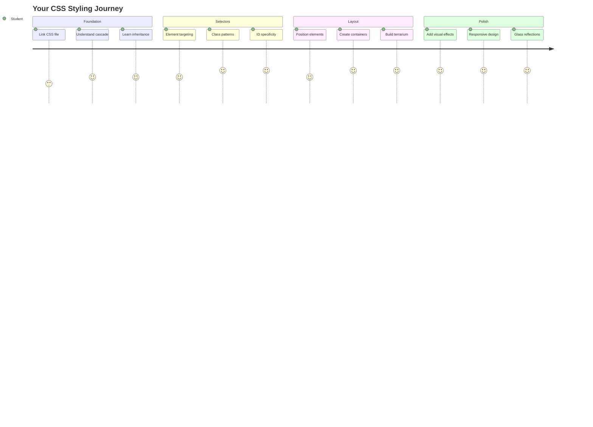
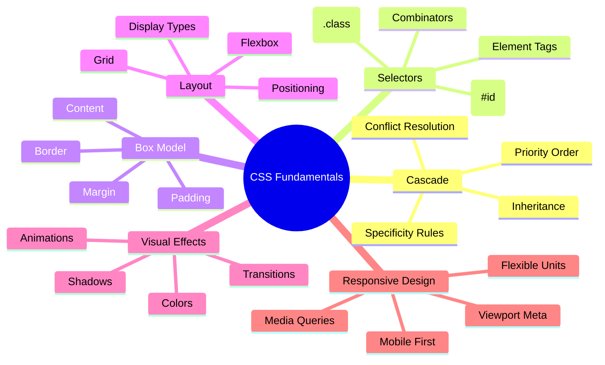
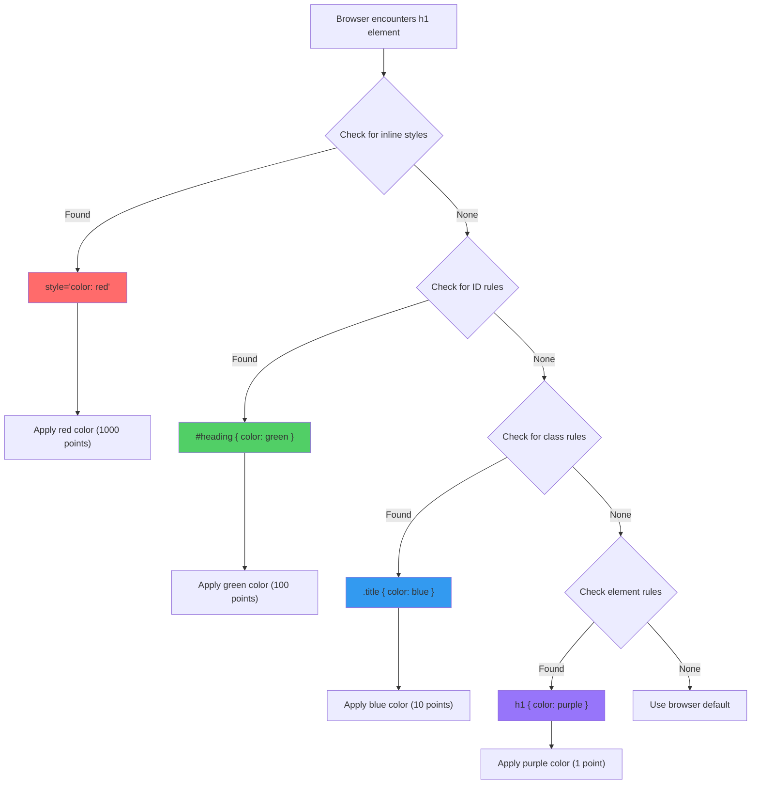
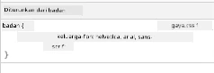
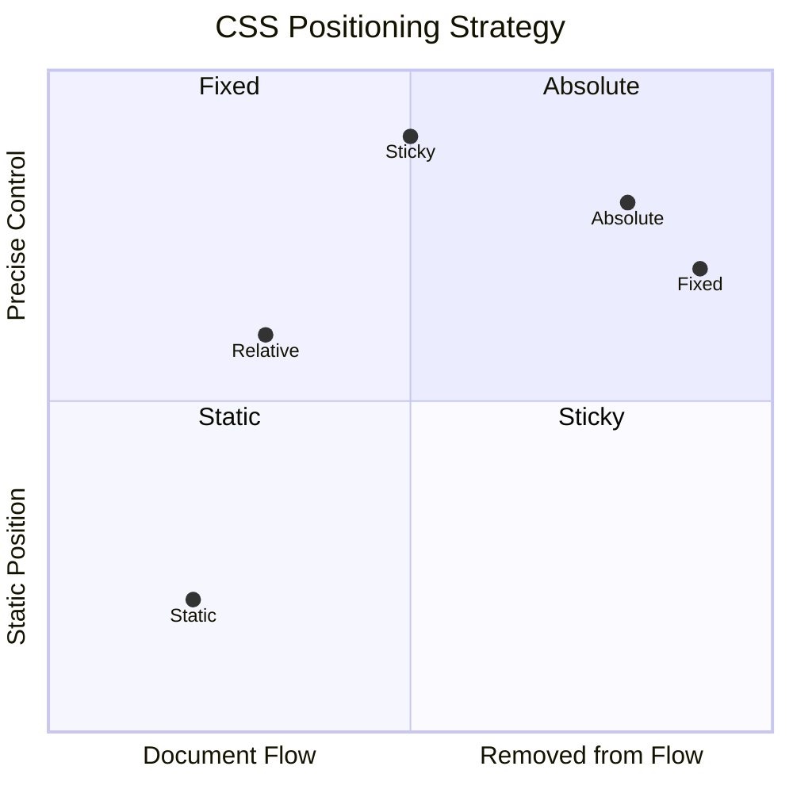
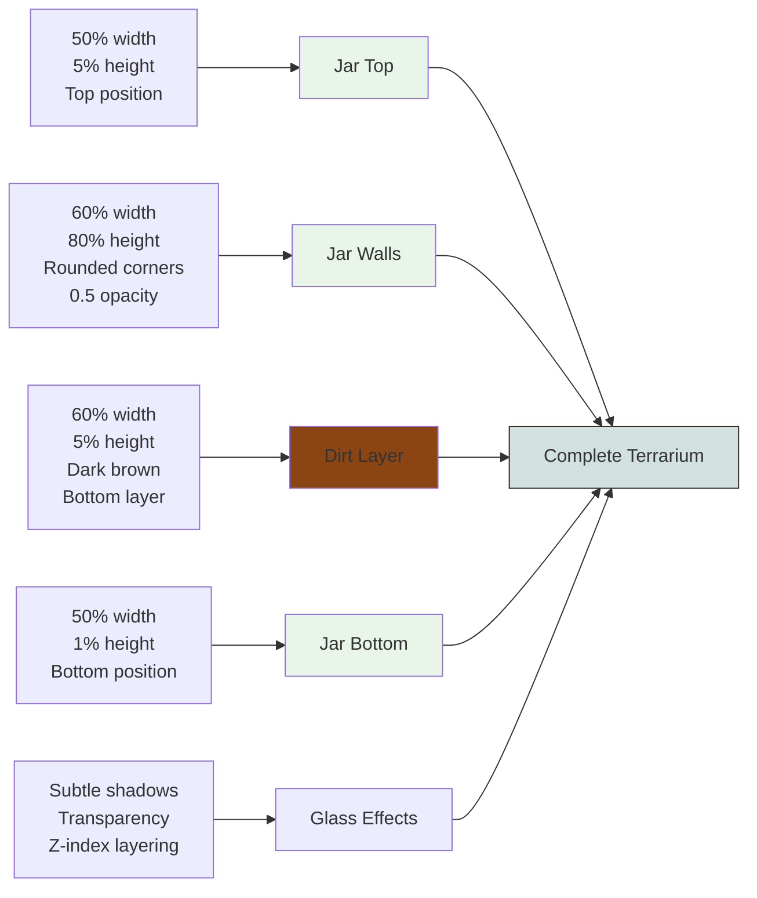
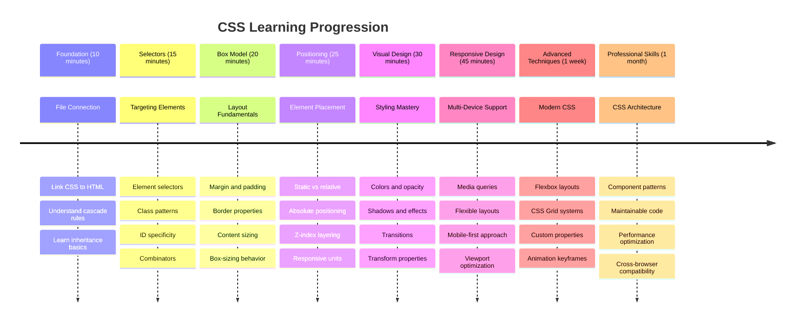

<!--
CO_OP_TRANSLATOR_METADATA:
{
  "original_hash": "e39f3a4e3bcccf94639e3af1248f8a4d",
  "translation_date": "2025-11-06T12:11:44+00:00",
  "source_file": "3-terrarium/2-intro-to-css/README.md",
  "language_code": "ms"
}
-->
# Projek Terrarium Bahagian 2: Pengenalan kepada CSS




> Sketchnote oleh [Tomomi Imura](https://twitter.com/girlie_mac)

Ingat bagaimana HTML terrarium anda kelihatan agak asas? CSS adalah tempat kita mengubah struktur biasa itu menjadi sesuatu yang menarik secara visual.

Jika HTML seperti membina rangka rumah, maka CSS adalah segala-galanya yang membuatkan ia terasa seperti rumah - warna cat, susunan perabot, pencahayaan, dan bagaimana bilik-bilik disusun. Fikirkan bagaimana Istana Versailles bermula sebagai pondok memburu yang sederhana, tetapi perhatian yang teliti terhadap hiasan dan susun atur mengubahnya menjadi salah satu bangunan paling megah di dunia.

Hari ini, kita akan mengubah terrarium anda daripada berfungsi kepada yang lebih kemas. Anda akan belajar bagaimana meletakkan elemen dengan tepat, membuat susun atur yang responsif kepada pelbagai saiz skrin, dan mencipta daya tarikan visual yang menjadikan laman web menarik.

Menjelang akhir pelajaran ini, anda akan melihat bagaimana gaya CSS yang strategik boleh meningkatkan projek anda dengan ketara. Mari tambahkan gaya pada terrarium anda.



## Kuiz Pra-Kuliah

[Kuiz pra-kuliah](https://ff-quizzes.netlify.app/web/quiz/17)

## Bermula dengan CSS

CSS sering dianggap hanya untuk "mencantikkan sesuatu," tetapi ia mempunyai tujuan yang lebih luas. CSS seperti menjadi pengarah filem - anda mengawal bukan sahaja bagaimana semuanya kelihatan, tetapi bagaimana ia bergerak, bertindak balas terhadap interaksi, dan menyesuaikan diri dengan situasi yang berbeza.

CSS moden sangat berkemampuan. Anda boleh menulis kod yang secara automatik menyesuaikan susun atur untuk telefon, tablet, dan komputer meja. Anda boleh mencipta animasi yang lancar untuk memandu perhatian pengguna ke tempat yang diperlukan. Hasilnya boleh menjadi sangat mengagumkan apabila semuanya berfungsi bersama.

> 💡 **Petua Pro**: CSS sentiasa berkembang dengan ciri dan keupayaan baharu. Sentiasa semak [CanIUse.com](https://caniuse.com) untuk mengesahkan sokongan pelayar untuk ciri CSS baharu sebelum menggunakannya dalam projek pengeluaran.

**Apa yang akan kita capai dalam pelajaran ini:**
- **Mencipta** reka bentuk visual lengkap untuk terrarium anda menggunakan teknik CSS moden
- **Meneroka** konsep asas seperti cascade, inheritance, dan selector CSS
- **Melaksanakan** strategi kedudukan dan susun atur yang responsif
- **Membina** bekas terrarium menggunakan bentuk dan gaya CSS

### Prasyarat

Anda sepatutnya telah menyiapkan struktur HTML untuk terrarium anda dari pelajaran sebelumnya dan bersedia untuk digayakan.

> 📺 **Sumber Video**: Tonton video panduan ini
>
> [](https://www.youtube.com/watch?v=6yIdOIV9p1I)

### Menyediakan Fail CSS Anda

Sebelum kita mula menggaya, kita perlu menghubungkan CSS ke HTML kita. Sambungan ini memberitahu pelayar di mana untuk mencari arahan gaya untuk terrarium kita.

Dalam folder terrarium anda, buat fail baru bernama `style.css`, kemudian pautkannya dalam bahagian `<head>` dokumen HTML anda:

```html
<link rel="stylesheet" href="./style.css" />
```

**Apa yang dilakukan oleh kod ini:**
- **Mewujudkan** sambungan antara fail HTML dan CSS anda
- **Memberitahu** pelayar untuk memuatkan dan menggunakan gaya dari `style.css`
- **Menggunakan** atribut `rel="stylesheet"` untuk menentukan ini adalah fail CSS
- **Merujuk** laluan fail dengan `href="./style.css"`

## Memahami CSS Cascade

Pernah tertanya-tanya mengapa CSS dipanggil "Cascading" Style Sheets? Gaya mengalir seperti air terjun, dan kadang-kadang mereka bertentangan antara satu sama lain.

Fikirkan bagaimana struktur perintah tentera berfungsi - perintah umum mungkin mengatakan "semua tentera memakai hijau," tetapi perintah khusus kepada unit anda mungkin mengatakan "pakai pakaian biru untuk upacara." Arahan yang lebih spesifik akan diutamakan. CSS mengikuti logik yang serupa, dan memahami hierarki ini menjadikan penyahpepijatan lebih mudah diurus.

### Mencuba Keutamaan Cascade

Mari kita lihat cascade dalam tindakan dengan mencipta konflik gaya. Pertama, tambahkan gaya inline pada tag `<h1>` anda:

```html
<h1 style="color: red">My Terrarium</h1>
```

**Apa yang dilakukan oleh kod ini:**
- **Menerapkan** warna merah secara langsung pada elemen `<h1>` menggunakan gaya inline
- **Menggunakan** atribut `style` untuk menyematkan CSS secara langsung dalam HTML
- **Mencipta** peraturan gaya keutamaan tertinggi untuk elemen tertentu ini

Seterusnya, tambahkan peraturan ini ke fail `style.css` anda:

```css
h1 {
  color: blue;
}
```

**Dalam kod di atas, kita telah:**
- **Menentukan** peraturan CSS yang menyasarkan semua elemen `<h1>`
- **Menetapkan** warna teks kepada biru menggunakan stylesheet luaran
- **Mencipta** peraturan keutamaan yang lebih rendah berbanding gaya inline

✅ **Semak Pengetahuan**: Warna apa yang dipaparkan dalam aplikasi web anda? Mengapa warna itu menang? Bolehkah anda memikirkan senario di mana anda mungkin mahu mengatasi gaya?



> 💡 **Susunan Keutamaan CSS (tertinggi ke terendah):**
> 1. **Gaya inline** (atribut style)
> 2. **ID** (#myId)
> 3. **Kelas** (.myClass) dan atribut
> 4. **Selector elemen** (h1, div, p)
> 5. **Tetapan lalai pelayar**

## Tindakan Pewarisan CSS

Pewarisan CSS berfungsi seperti genetik - elemen mewarisi sifat tertentu daripada elemen induknya. Jika anda menetapkan keluarga fon pada elemen body, semua teks di dalamnya secara automatik menggunakan fon yang sama. Ia serupa dengan bagaimana ciri-ciri fizikal keluarga diwarisi dari generasi ke generasi tanpa perlu ditentukan untuk setiap individu.

Namun, tidak semua perkara diwarisi. Gaya teks seperti fon dan warna diwarisi, tetapi sifat susun atur seperti margin dan sempadan tidak. Sama seperti anak-anak mungkin mewarisi ciri fizikal tetapi tidak pilihan fesyen ibu bapa mereka.

### Memerhati Pewarisan Fon

Mari lihat pewarisan dalam tindakan dengan menetapkan keluarga fon pada elemen `<body>`:

```css
body {
  font-family: 'Segoe UI', Tahoma, Geneva, Verdana, sans-serif;
}
```

**Memecahkan apa yang berlaku di sini:**
- **Menetapkan** keluarga fon untuk seluruh halaman dengan menyasarkan elemen `<body>`
- **Menggunakan** susunan fon dengan pilihan sandaran untuk keserasian pelayar yang lebih baik
- **Menerapkan** fon sistem moden yang kelihatan hebat di pelbagai sistem operasi
- **Memastikan** semua elemen anak mewarisi fon ini kecuali secara khusus diatasi

Buka alat pembangun pelayar anda (F12), navigasi ke tab Elemen, dan periksa elemen `<h1>` anda. Anda akan melihat bahawa ia mewarisi keluarga fon dari body:



✅ **Masa Eksperimen**: Cuba tetapkan sifat lain yang boleh diwarisi pada `<body>` seperti `color`, `line-height`, atau `text-align`. Apa yang berlaku pada tajuk dan elemen lain anda?

> 📝 **Sifat yang Boleh Diwarisi Termasuk**: `color`, `font-family`, `font-size`, `line-height`, `text-align`, `visibility`
>
> **Sifat yang Tidak Boleh Diwarisi Termasuk**: `margin`, `padding`, `border`, `width`, `height`, `position`

### 🔄 **Semakan Pedagogi**
**Pemahaman Asas CSS**: Sebelum bergerak ke selector, pastikan anda boleh:
- ✅ Jelaskan perbezaan antara cascade dan pewarisan
- ✅ Ramalkan gaya mana yang akan menang dalam konflik kekhususan
- ✅ Kenal pasti sifat mana yang diwarisi daripada elemen induk
- ✅ Sambungkan fail CSS ke HTML dengan betul

**Ujian Pantas**: Jika anda mempunyai gaya ini, warna apa yang akan dipaparkan pada `<h1>` di dalam `<div class="special">`?
```css
div { color: blue; }
.special { color: green; }
h1 { color: red; }
```
*Jawapan: Merah (selector elemen secara langsung menyasarkan h1)*

## Menguasai Selector CSS

Selector CSS adalah cara anda menyasarkan elemen tertentu untuk digayakan. Ia berfungsi seperti memberikan arahan yang tepat - bukannya mengatakan "rumah itu," anda mungkin mengatakan "rumah biru dengan pintu merah di Jalan Maple."

CSS menyediakan pelbagai cara untuk menjadi spesifik, dan memilih selector yang betul adalah seperti memilih alat yang sesuai untuk tugas tersebut. Kadang-kadang anda perlu menggaya setiap pintu di kawasan kejiranan, dan kadang-kadang hanya satu pintu tertentu.

### Selector Elemen (Tag)

Selector elemen menyasarkan elemen HTML berdasarkan nama tag mereka. Ia sesuai untuk menetapkan gaya asas yang digunakan secara meluas di seluruh halaman anda:

```css
body {
  font-family: 'Segoe UI', Tahoma, Geneva, Verdana, sans-serif;
  margin: 0;
  padding: 0;
}

h1 {
  color: #3a241d;
  text-align: center;
  font-size: 2.5rem;
  margin-bottom: 1rem;
}
```

**Memahami gaya ini:**
- **Menetapkan** tipografi yang konsisten di seluruh halaman dengan selector `body`
- **Menghapuskan** margin dan padding lalai pelayar untuk kawalan yang lebih baik
- **Menggayakan** semua elemen tajuk dengan warna, penjajaran, dan jarak
- **Menggunakan** unit `rem` untuk saiz fon yang boleh diskalakan dan boleh diakses

Walaupun selector elemen berfungsi dengan baik untuk gaya umum, anda memerlukan selector yang lebih spesifik untuk menggaya komponen individu seperti tumbuhan dalam terrarium anda.

### Selector ID untuk Elemen Unik

Selector ID menggunakan simbol `#` dan menyasarkan elemen dengan atribut `id` tertentu. Oleh kerana ID mesti unik pada satu halaman, ia sesuai untuk menggaya elemen individu yang istimewa seperti bekas tumbuhan kiri dan kanan kita.

Mari kita cipta gaya untuk bekas sisi terrarium kita di mana tumbuhan akan diletakkan:

```css
#left-container {
  background-color: #f5f5f5;
  width: 15%;
  left: 0;
  top: 0;
  position: absolute;
  height: 100vh;
  padding: 1rem;
  box-sizing: border-box;
}

#right-container {
  background-color: #f5f5f5;
  width: 15%;
  right: 0;
  top: 0;
  position: absolute;
  height: 100vh;
  padding: 1rem;
  box-sizing: border-box;
}
```

**Apa yang dicapai oleh kod ini:**
- **Meletakkan** bekas di tepi kiri dan kanan menggunakan kedudukan `absolute`
- **Menggunakan** unit `vh` (ketinggian viewport) untuk ketinggian responsif yang menyesuaikan diri dengan saiz skrin
- **Menerapkan** `box-sizing: border-box` supaya padding termasuk dalam jumlah lebar
- **Menghapuskan** unit `px` yang tidak diperlukan dari nilai sifar untuk kod yang lebih bersih
- **Menetapkan** warna latar belakang yang lembut yang lebih mudah pada mata daripada kelabu terang

✅ **Cabaran Kualiti Kod**: Perhatikan bagaimana CSS ini melanggar prinsip DRY (Don't Repeat Yourself). Bolehkah anda merombaknya menggunakan ID dan kelas?

**Pendekatan yang Diperbaiki:**
```html
<div id="left-container" class="container"></div>
<div id="right-container" class="container"></div>
```

```css
.container {
  background-color: #f5f5f5;
  width: 15%;
  top: 0;
  position: absolute;
  height: 100vh;
  padding: 1rem;
  box-sizing: border-box;
}

#left-container {
  left: 0;
}

#right-container {
  right: 0;
}
```

### Selector Kelas untuk Gaya Boleh Digunakan Semula

Selector kelas menggunakan simbol `.` dan sesuai apabila anda ingin menerapkan gaya yang sama pada pelbagai elemen. Tidak seperti ID, kelas boleh digunakan semula di seluruh HTML anda, menjadikannya ideal untuk corak gaya yang konsisten.

Dalam terrarium kita, setiap tumbuhan memerlukan gaya yang serupa tetapi juga memerlukan kedudukan individu. Kita akan menggunakan gabungan kelas untuk gaya bersama dan ID untuk kedudukan unik.

**Berikut adalah struktur HTML untuk setiap tumbuhan:**
```html
<div class="plant-holder">
  
</div>
```

**Elemen utama dijelaskan:**
- **Menggunakan** `class="plant-holder"` untuk gaya bekas yang konsisten di semua tumbuhan
- **Menerapkan** `class="plant"` untuk gaya dan tingkah laku imej bersama
- **Termasuk** `id="plant1"` unik untuk kedudukan individu dan interaksi JavaScript
- **Menyediakan** teks alt deskriptif untuk kebolehaksesan pembaca skrin

Sekarang tambahkan gaya ini ke fail `style.css` anda:

```css
.plant-holder {
  position: relative;
  height: 13%;
  left: -0.6rem;
}

.plant {
  position: absolute;
  max-width: 150%;
  max-height: 150%;
  z-index: 2;
  transition: transform 0.3s ease;
}

.plant:hover {
  transform: scale(1.05);
}
```

**Memecahkan gaya ini:**
- **Mencipta** kedudukan relatif untuk pemegang tumbuhan untuk mewujudkan konteks kedudukan
- **Menetapkan** setiap pemegang tumbuhan kepada ketinggian 13%, memastikan semua tumbuhan muat secara menegak tanpa menatal
- **Mengalihkan** pemegang sedikit ke kiri untuk lebih memusatkan tumbuhan dalam bekas mereka
- **Membolehkan** tumbuhan berskala responsif dengan sifat `max-width` dan `max-height`
- **Menggunakan** `z-index` untuk melapisi tumbuhan di atas elemen lain dalam terrarium
- **Menambah** kesan hover halus dengan peralihan CSS untuk interaksi pengguna yang lebih baik

✅ **Pemikiran Kritikal**: Mengapa kita memerlukan kedua-dua selector `.plant-holder` dan `.plant`? Apa yang akan berlaku jika kita cuba menggunakan hanya satu?

> 💡 **Corak Reka Bentuk**: Bekas (`.plant-holder`) mengawal susun atur dan kedudukan, manakala kandungan (`.plant`) mengawal penampilan dan penskalaan. Pemisahan ini menjadikan kod lebih mudah diselenggara dan fleksibel.

## Memahami Kedudukan CSS

Kedudukan CSS seperti menjadi pengarah pentas untuk sebuah drama - anda mengarahkan di mana setiap pelakon berdiri dan bagaimana mereka bergerak di sekitar pentas. Sesetengah pelakon mengikuti formasi standard, manakala yang lain memerlukan kedudukan tertentu untuk kesan dramatik.

Setelah anda memahami kedudukan, banyak cabaran susun atur menjadi lebih mudah diurus. Perlu bar navigasi yang kekal di bahagian atas semasa pengguna menatal? Kedudukan mengendalikan itu. Mahu tooltip yang muncul di lokasi tertentu? Itu juga kedudukan.

### Lima Nilai Kedudukan



| Nilai Kedudukan | Tingkah Laku | Kes Penggunaan |
|------------------|-------------|----------------|
| `static` | Aliran lalai, mengabaikan top/left/right/bottom | Susun atur dokumen biasa |
| `relative` | Diletakkan relatif kepada kedudukan normalnya | Pelarasan kecil, mewujudkan konteks kedudukan |
| `absolute` | Diletakkan relatif kepada nenek moyang yang diposisikan terdekat | Penempatan tepat, overlay |
| `fixed` | Diletakkan relatif kepada viewport | Bar navigasi, elemen terapung |
| `sticky` | Beralih antara relative dan fixed berdasarkan tatalan | Header yang melekat semasa menatal |

### Kedudukan dalam Terrarium Kita

Terrarium kita menggunakan gabungan strategik jenis kedudukan untuk mencipta susun atur yang diingini:

```css
/* Container positioning */
.container {
  position: absolute; /* Removes from normal flow */
  /* ... other styles ... */
}

/* Plant holder positioning */
.plant-holder {
  position: relative; /* Creates positioning context */
  /* ... other styles ... */
}

/* Plant positioning */
.plant {
  position: absolute; /* Allows precise placement within holder */
  /* ... other styles ... */
}
```

**Memahami strategi kedudukan:**
- **Bekas absolute** dikeluarkan dari aliran dokumen biasa dan dipasangkan ke tepi skrin
- **Pemegang tumbuhan relatif** mencipta konteks kedudukan sambil kekal dalam aliran dokumen
- **Tumbuhan absolute** boleh diletakkan dengan tepat dalam bekas relatif mereka
- **Gabungan ini** membolehkan tumbuhan disusun secara menegak sambil boleh diposisikan secara individu

> 🎯 **Mengapa Ini Penting**: Elemen `plant` memerlukan kedudukan absolute untuk menjadi boleh diseret dalam pelajaran seterusnya. Kedudukan absolute mengeluarkan mereka dari aliran susun atur biasa, menjadikan interaksi seret dan lepas boleh dilakukan.

✅ **Masa Eksperimen**: Cuba ubah nilai kedudukan dan perhatikan hasilnya:
- Apa yang berlaku jika anda menukar `.container` daripada `absolute` kepada `relative`?
- Bagaimana susun atur berubah jika `.plant-holder` menggunakan `absolute` dan bukannya `relative`?
- Apa yang berlaku apabila anda menukar `.plant` kepada kedudukan `relative`?

### 🔄 **Semakan Pedagogi**
**Penguasaan Kedudukan CSS**: Berhenti sejenak untuk mengesahkan pemahaman anda:
- ✅ Bolehkah anda menerangkan mengapa tumbuhan memerlukan kedudukan absolute untuk seret dan lepas?
- ✅ Adakah anda memahami bagaimana bekas relative mencipta konteks kedudukan?
- ✅ Mengapa bekas sisi menggunakan kedudukan absolute?
- ✅ Apa yang akan berlaku jika anda menghapuskan deklarasi kedudukan sepenuhnya?

**Hubungan Dunia Sebenar**: Fikirkan bagaimana kedudukan CSS mencerminkan susun atur dunia sebenar:
- **Static**: Buku di rak (susunan semula jadi)
- **Relative**: Menggerakkan buku sedikit tetapi mengekalkan tempatnya
- **Absolute**: Meletakkan penanda buku pada nombor halaman tertentu
- **Fixed**: Nota lekat yang kekal kelihatan semasa anda membalik halaman

## Membina Terrarium dengan CSS

Sekarang kita akan membina balang kaca menggunakan CSS sahaja - tanpa imej atau perisian grafik.

Mencipta kaca yang kelihatan realistik, bayang-bayang, dan kesan kedalaman menggunakan kedudukan dan ketelusan menunjukkan keupayaan visual CSS. Teknik ini mencerminkan bagaimana arkitek dalam gerakan Bauhaus menggunakan bentuk geometri mudah untuk mencipta struktur yang kompleks dan indah. Setelah anda memahami prinsip ini, anda akan mengenali teknik CSS di sebalik banyak reka bentuk web.



### Membina Komponen Balang Kaca

Mari kita bina balang terrarium secara berperingkat. Setiap bahagian menggunakan kedudukan absolute dan saiz berdasarkan peratusan untuk reka bentuk responsif:

```css
.jar-walls {
  height: 80%;
  width: 60%;
  background: #d1e1df;
  border-radius: 1rem;
  position: absolute;
  bottom: 0.5%;
  left: 20%;
  opacity: 0.5;
  z-index: 1;
  box-shadow: inset 0 0 2rem rgba(0, 0, 0, 0.1);
}

.jar-top {
  width: 50%;
  height: 5%;
  background: #d1e1df;
  position: absolute;
  bottom: 80.5%;
  left: 25%;
  opacity: 0.7;
  z-index: 1;
  border-radius: 0.5rem 0.5rem 0 0;
}

.jar-bottom {
  width: 50%;
  height: 1%;
  background: #d1e1df;
  position: absolute;
  bottom: 0;
  left: 25%;
  opacity: 0.7;
  border-radius: 0 0 0.5rem 0.5rem;
}

.dirt {
  width: 60%;
  height: 5%;
  background: #3a241d;
  position: absolute;
  border-radius: 0 0 1rem 1rem;
  bottom: 1%;
  left: 20%;
  opacity: 0.7;
  z-index: -1;
}
```

**Memahami pembinaan terrarium:**
- **Menggunakan** dimensi berdasarkan peratusan untuk penskalaan responsif di semua saiz skrin
- **Meletakkan** elemen secara absolute untuk menyusun dan menyelaraskannya dengan tepat
- **Mengaplikasikan** nilai ketelusan yang berbeza untuk mencipta kesan ketelusan kaca
- **Melaksanakan** lapisan `z-index` supaya tumbuhan kelihatan di dalam balang
- **Menambah** bayang-bayang kotak halus dan `border-radius` yang diperhalusi untuk penampilan yang lebih realistik

### Reka Bentuk Responsif dengan Peratusan

Perhatikan bagaimana semua dimensi menggunakan peratusan dan bukannya nilai piksel tetap:

**Mengapa ini penting:**
- **Memastikan** terrarium berskala secara berkadar pada mana-mana saiz skrin
- **Menjaga** hubungan visual antara komponen balang
- **Memberikan** pengalaman yang konsisten dari telefon bimbit ke monitor desktop besar
- **Membolehkan** reka bentuk menyesuaikan tanpa merosakkan susun atur visual

### Unit CSS dalam Tindakan

Kami menggunakan unit `rem` untuk `border-radius`, yang berskala relatif kepada saiz fon akar. Ini mencipta reka bentuk yang lebih mudah diakses yang menghormati keutamaan fon pengguna. Ketahui lebih lanjut tentang [unit relatif CSS](https://www.w3.org/TR/css-values-3/#font-relative-lengths) dalam spesifikasi rasmi.

✅ **Eksperimen Visual**: Cuba ubah nilai ini dan perhatikan kesannya:
- Tukar ketelusan balang dari 0.5 ke 0.8 – bagaimana ini mempengaruhi penampilan kaca?
- Laraskan warna tanah dari `#3a241d` ke `#8B4513` – apakah kesan visualnya?
- Ubah `z-index` tanah kepada 2 – apa yang berlaku pada lapisan?

### 🔄 **Semakan Pedagogi**
**Pemahaman Reka Bentuk Visual CSS**: Sahkan pemahaman anda tentang visual CSS:
- ✅ Bagaimana dimensi berdasarkan peratusan mencipta reka bentuk responsif?
- ✅ Mengapa ketelusan mencipta kesan ketelusan kaca?
- ✅ Apakah peranan z-index dalam melapisi elemen?
- ✅ Bagaimana nilai `border-radius` mencipta bentuk balang?

**Prinsip Reka Bentuk**: Perhatikan bagaimana kita membina visual kompleks daripada bentuk mudah:
1. **Segi empat** → **Segi empat bulat** → **Komponen balang**
2. **Warna rata** → **Ketelusan** → **Kesan kaca**
3. **Elemen individu** → **Komposisi berlapis** → **Penampilan 3D**

---

## Cabaran Ejen GitHub Copilot 🚀

Gunakan mod Ejen untuk melengkapkan cabaran berikut:

**Penerangan:** Cipta animasi CSS yang membuatkan tumbuhan terrarium bergoyang perlahan-lahan, mensimulasikan kesan angin semula jadi. Ini akan membantu anda berlatih animasi CSS, transformasi, dan keyframe sambil meningkatkan daya tarikan visual terrarium anda.

**Arahan:** Tambahkan animasi keyframe CSS untuk membuat tumbuhan dalam terrarium bergoyang perlahan dari sisi ke sisi. Cipta animasi bergoyang yang memutar setiap tumbuhan sedikit (2-3 darjah) ke kiri dan kanan dengan durasi 3-4 saat, dan aplikasikan pada kelas `.plant`. Pastikan animasi berulang tanpa henti dan mempunyai fungsi easing untuk pergerakan semula jadi.

Ketahui lebih lanjut tentang [mod ejen](https://code.visualstudio.com/blogs/2025/02/24/introducing-copilot-agent-mode) di sini.

## 🚀 Cabaran: Menambah Refleksi Kaca

Bersedia untuk meningkatkan terrarium anda dengan refleksi kaca yang realistik? Teknik ini akan menambah kedalaman dan realisme pada reka bentuk.

Anda akan mencipta sorotan halus yang mensimulasikan bagaimana cahaya memantul dari permukaan kaca. Pendekatan ini serupa dengan bagaimana pelukis Renaissance seperti Jan van Eyck menggunakan cahaya dan pantulan untuk membuat kaca yang dilukis kelihatan tiga dimensi. Berikut adalah apa yang anda sasarkan:


**Cabaran anda:**
- **Cipta** bentuk bujur putih atau warna terang untuk refleksi kaca
- **Letakkan** mereka secara strategik di sebelah kiri balang
- **Aplikasikan** kesan ketelusan dan kabur yang sesuai untuk pantulan cahaya yang realistik
- **Gunakan** `border-radius` untuk mencipta bentuk organik seperti gelembung
- **Eksperimen** dengan gradien atau bayang-bayang kotak untuk realisme yang lebih baik

## Kuiz Selepas Kuliah

[Kuiz selepas kuliah](https://ff-quizzes.netlify.app/web/quiz/18)

## Luaskan Pengetahuan CSS Anda

CSS mungkin terasa kompleks pada awalnya, tetapi memahami konsep asas ini memberikan asas yang kukuh untuk teknik yang lebih maju.

**Bidang pembelajaran CSS seterusnya:**
- **Flexbox** - memudahkan penjajaran dan pengagihan elemen
- **CSS Grid** - menyediakan alat yang kuat untuk mencipta susun atur kompleks
- **CSS Variables** - mengurangkan pengulangan dan meningkatkan kebolehselenggaraan
- **Reka bentuk responsif** - memastikan laman web berfungsi dengan baik di pelbagai saiz skrin

### Sumber Pembelajaran Interaktif

Amalkan konsep ini dengan permainan interaktif yang menyeronokkan:
- 🐸 [Flexbox Froggy](https://flexboxfroggy.com/) - Kuasai Flexbox melalui cabaran yang menyeronokkan
- 🌱 [Grid Garden](https://codepip.com/games/grid-garden/) - Belajar CSS Grid dengan menanam lobak maya
- 🎯 [CSS Battle](https://cssbattle.dev/) - Uji kemahiran CSS anda dengan cabaran pengkodan

### Pembelajaran Tambahan

Untuk asas CSS yang komprehensif, lengkapkan modul Microsoft Learn ini: [Gayakan aplikasi HTML anda dengan CSS](https://docs.microsoft.com/learn/modules/build-simple-website/4-css-basics/?WT.mc_id=academic-77807-sagibbon)

### ⚡ **Apa yang Anda Boleh Lakukan dalam 5 Minit Seterusnya**
- [ ] Buka DevTools dan periksa gaya CSS di mana-mana laman web menggunakan panel Elemen
- [ ] Cipta fail CSS ringkas dan pautkan ke halaman HTML
- [ ] Cuba tukar warna menggunakan kaedah yang berbeza: hex, RGB, dan warna bernama
- [ ] Amalkan model kotak dengan menambah padding dan margin pada div

### 🎯 **Apa yang Anda Boleh Capai Dalam Satu Jam**
- [ ] Lengkapkan kuiz selepas pelajaran dan semak asas CSS
- [ ] Gayakan halaman HTML anda dengan fon, warna, dan jarak
- [ ] Cipta susun atur ringkas menggunakan flexbox atau grid
- [ ] Eksperimen dengan peralihan CSS untuk kesan yang lancar
- [ ] Amalkan reka bentuk responsif dengan media queries

### 📅 **Pengembaraan CSS Anda Selama Seminggu**
- [ ] Lengkapkan tugasan gaya terrarium dengan kreativiti
- [ ] Kuasai CSS Grid dengan membina susun atur galeri foto
- [ ] Belajar animasi CSS untuk menghidupkan reka bentuk anda
- [ ] Terokai preprocessor CSS seperti Sass atau Less
- [ ] Kajian prinsip reka bentuk dan aplikasikan pada CSS anda
- [ ] Analisis dan cipta semula reka bentuk menarik yang anda temui dalam talian

### 🌟 **Penguasaan Reka Bentuk Anda Selama Sebulan**
- [ ] Bina sistem reka bentuk laman web responsif yang lengkap
- [ ] Belajar CSS-in-JS atau rangka kerja utiliti seperti Tailwind
- [ ] Sumbang kepada projek sumber terbuka dengan penambahbaikan CSS
- [ ] Kuasai konsep CSS lanjutan seperti sifat tersuai CSS dan containment
- [ ] Cipta perpustakaan komponen boleh guna semula dengan CSS modular
- [ ] Bimbing orang lain yang belajar CSS dan kongsi pengetahuan reka bentuk

## 🎯 Garis Masa Penguasaan CSS Anda



### 🛠️ Ringkasan Alat CSS Anda

Selepas melengkapkan pelajaran ini, anda kini mempunyai:
- **Pemahaman Cascade**: Bagaimana gaya diwarisi dan menimpa satu sama lain
- **Penguasaan Pemilih**: Penargetan tepat dengan elemen, kelas, dan ID
- **Kemahiran Kedudukan**: Penempatan dan pelapisan elemen yang strategik
- **Reka Bentuk Visual**: Mencipta kesan kaca, bayang-bayang, dan ketelusan
- **Teknik Responsif**: Susun atur berdasarkan peratusan yang menyesuaikan dengan mana-mana skrin
- **Organisasi Kod**: Struktur CSS yang bersih dan boleh diselenggara
- **Amalan Moden**: Menggunakan unit relatif dan corak reka bentuk yang boleh diakses

**Langkah Seterusnya**: Terrarium anda kini mempunyai struktur (HTML) dan gaya (CSS). Pelajaran terakhir akan menambah interaktiviti dengan JavaScript!

## Tugasan

[Refaktoring CSS](assignment.md)

---

**Penafian**:  
Dokumen ini telah diterjemahkan menggunakan perkhidmatan terjemahan AI [Co-op Translator](https://github.com/Azure/co-op-translator). Walaupun kami berusaha untuk ketepatan, sila ambil perhatian bahawa terjemahan automatik mungkin mengandungi kesilapan atau ketidaktepatan. Dokumen asal dalam bahasa asalnya harus dianggap sebagai sumber yang berwibawa. Untuk maklumat penting, terjemahan manusia profesional adalah disyorkan. Kami tidak bertanggungjawab atas sebarang salah faham atau salah tafsir yang timbul daripada penggunaan terjemahan ini.