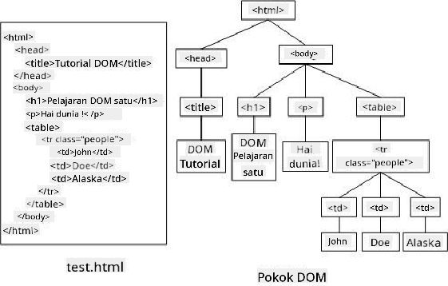
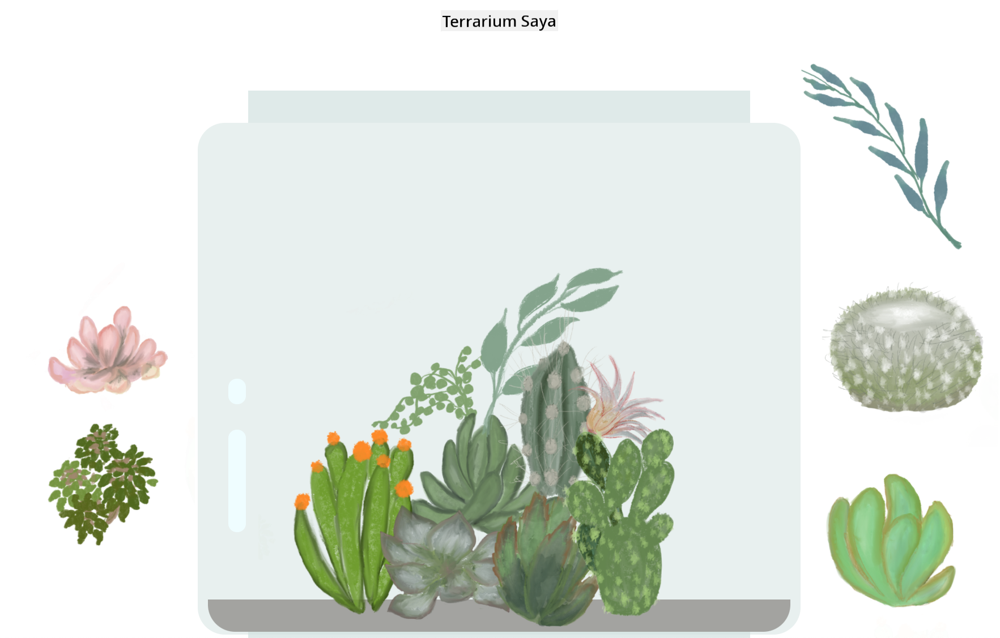

<!--
CO_OP_TRANSLATOR_METADATA:
{
  "original_hash": "30f8903a1f290e3d438dc2c70fe60259",
  "translation_date": "2025-08-27T23:02:13+00:00",
  "source_file": "3-terrarium/3-intro-to-DOM-and-closures/README.md",
  "language_code": "ms"
}
-->
# Projek Terrarium Bahagian 3: Manipulasi DOM dan Penutupan


> Sketchnote oleh [Tomomi Imura](https://twitter.com/girlie_mac)

## Kuiz Pra-Kuliah

[Kuiz pra-kuliah](https://ashy-river-0debb7803.1.azurestaticapps.net/quiz/19)

### Pengenalan

Manipulasi DOM, atau "Document Object Model", adalah aspek penting dalam pembangunan web. Menurut [MDN](https://developer.mozilla.org/docs/Web/API/Document_Object_Model/Introduction), "Document Object Model (DOM) adalah representasi data bagi objek yang membentuk struktur dan kandungan dokumen di web." Cabaran dalam manipulasi DOM di web sering menjadi sebab utama penggunaan rangka kerja JavaScript berbanding JavaScript biasa untuk menguruskan DOM, tetapi kita akan mencuba sendiri!

Selain itu, pelajaran ini akan memperkenalkan idea tentang [penutupan JavaScript](https://developer.mozilla.org/docs/Web/JavaScript/Closures), yang boleh anda anggap sebagai fungsi yang dikelilingi oleh fungsi lain supaya fungsi dalaman mempunyai akses kepada skop fungsi luaran.

> Penutupan JavaScript adalah topik yang luas dan kompleks. Pelajaran ini menyentuh idea asas bahawa dalam kod terrarium ini, anda akan menemui penutupan: fungsi dalaman dan fungsi luaran yang dibina dengan cara membolehkan fungsi dalaman mengakses skop fungsi luaran. Untuk maklumat lebih lanjut tentang cara ini berfungsi, sila lawati [dokumentasi yang mendalam](https://developer.mozilla.org/docs/Web/JavaScript/Closures).

Kita akan menggunakan penutupan untuk memanipulasi DOM.

Anggaplah DOM sebagai pokok, yang mewakili semua cara dokumen halaman web boleh dimanipulasi. Pelbagai API (Application Program Interfaces) telah ditulis supaya pengaturcara, menggunakan bahasa pengaturcaraan pilihan mereka, boleh mengakses DOM dan mengedit, mengubah, menyusun semula, dan menguruskannya.



> Representasi DOM dan markup HTML yang merujuknya. Daripada [Olfa Nasraoui](https://www.researchgate.net/publication/221417012_Profile-Based_Focused_Crawler_for_Social_Media-Sharing_Websites)

Dalam pelajaran ini, kita akan melengkapkan projek terrarium interaktif kita dengan mencipta JavaScript yang membolehkan pengguna memanipulasi tumbuhan di halaman.

### Prasyarat

Anda sepatutnya telah membina HTML dan CSS untuk terrarium anda. Pada akhir pelajaran ini, anda akan dapat memindahkan tumbuhan masuk dan keluar dari terrarium dengan menyeretnya.

### Tugasan

Dalam folder terrarium anda, buat fail baru bernama `script.js`. Import fail tersebut dalam bahagian `<head>`:

```html
	<script src="./script.js" defer></script>
```

> Nota: gunakan `defer` semasa mengimport fail JavaScript luaran ke dalam fail html supaya JavaScript hanya dilaksanakan selepas fail HTML dimuat sepenuhnya. Anda juga boleh menggunakan atribut `async`, yang membolehkan skrip dilaksanakan semasa fail HTML sedang diproses, tetapi dalam kes kita, adalah penting untuk elemen HTML tersedia sepenuhnya untuk diseret sebelum kita membenarkan skrip seret dilaksanakan.
---

## Elemen DOM

Perkara pertama yang perlu anda lakukan ialah mencipta rujukan kepada elemen yang ingin anda manipulasi dalam DOM. Dalam kes kita, ia adalah 14 tumbuhan yang sedang menunggu di bar sisi.

### Tugasan

```html
dragElement(document.getElementById('plant1'));
dragElement(document.getElementById('plant2'));
dragElement(document.getElementById('plant3'));
dragElement(document.getElementById('plant4'));
dragElement(document.getElementById('plant5'));
dragElement(document.getElementById('plant6'));
dragElement(document.getElementById('plant7'));
dragElement(document.getElementById('plant8'));
dragElement(document.getElementById('plant9'));
dragElement(document.getElementById('plant10'));
dragElement(document.getElementById('plant11'));
dragElement(document.getElementById('plant12'));
dragElement(document.getElementById('plant13'));
dragElement(document.getElementById('plant14'));
```

Apa yang berlaku di sini? Anda merujuk dokumen dan mencari melalui DOM untuk mencari elemen dengan Id tertentu. Ingat dalam pelajaran pertama tentang HTML bahawa anda memberikan Id individu kepada setiap imej tumbuhan (`id="plant1"`)? Sekarang anda akan menggunakan usaha tersebut. Selepas mengenal pasti setiap elemen, anda menghantar item tersebut kepada fungsi bernama `dragElement` yang akan anda bina sebentar lagi. Oleh itu, elemen dalam HTML kini boleh diseret, atau akan menjadi tidak lama lagi.

✅ Mengapa kita merujuk elemen melalui Id? Mengapa tidak melalui kelas CSS mereka? Anda mungkin merujuk pelajaran sebelumnya tentang CSS untuk menjawab soalan ini.

---

## Penutupan

Sekarang anda bersedia untuk mencipta penutupan `dragElement`, iaitu fungsi luaran yang mengelilingi fungsi dalaman atau beberapa fungsi (dalam kes kita, kita akan mempunyai tiga).

Penutupan berguna apabila satu atau lebih fungsi perlu mengakses skop fungsi luaran. Berikut adalah contoh:

```javascript
function displayCandy(){
	let candy = ['jellybeans'];
	function addCandy(candyType) {
		candy.push(candyType)
	}
	addCandy('gumdrops');
}
displayCandy();
console.log(candy)
```

Dalam contoh ini, fungsi displayCandy mengelilingi fungsi yang menambah jenis gula-gula baru ke dalam array yang sudah wujud dalam fungsi. Jika anda menjalankan kod ini, array `candy` akan menjadi tidak ditakrifkan, kerana ia adalah pembolehubah tempatan (tempatan kepada penutupan).

✅ Bagaimana anda boleh membuat array `candy` boleh diakses? Cuba pindahkan ia ke luar penutupan. Dengan cara ini, array menjadi global, bukannya kekal hanya tersedia untuk skop tempatan penutupan.

### Tugasan

Di bawah deklarasi elemen dalam `script.js`, buat fungsi:

```javascript
function dragElement(terrariumElement) {
	//set 4 positions for positioning on the screen
	let pos1 = 0,
		pos2 = 0,
		pos3 = 0,
		pos4 = 0;
	terrariumElement.onpointerdown = pointerDrag;
}
```

`dragElement` mendapatkan objek `terrariumElement` daripada deklarasi di bahagian atas skrip. Kemudian, anda menetapkan beberapa posisi tempatan pada `0` untuk objek yang dihantar ke fungsi. Ini adalah pembolehubah tempatan yang akan dimanipulasi untuk setiap elemen semasa anda menambah fungsi seret dan lepaskan dalam penutupan kepada setiap elemen. Terrarium akan dipenuhi oleh elemen yang diseret ini, jadi aplikasi perlu menjejaki di mana ia diletakkan.

Selain itu, `terrariumElement` yang dihantar kepada fungsi ini diberikan acara `pointerdown`, yang merupakan sebahagian daripada [web APIs](https://developer.mozilla.org/docs/Web/API) yang direka untuk membantu dengan pengurusan DOM. `onpointerdown` diaktifkan apabila butang ditekan, atau dalam kes kita, elemen yang boleh diseret disentuh. Pengendali acara ini berfungsi pada kedua-dua [pelayar web dan mudah alih](https://caniuse.com/?search=onpointerdown), dengan beberapa pengecualian.

✅ [Pengendali acara `onclick`](https://developer.mozilla.org/docs/Web/API/GlobalEventHandlers/onclick) mempunyai sokongan yang lebih luas merentas pelayar; mengapa anda tidak menggunakannya di sini? Fikirkan tentang jenis interaksi skrin yang tepat yang anda cuba cipta di sini.

---

## Fungsi Pointerdrag

`terrariumElement` sudah bersedia untuk diseret; apabila acara `onpointerdown` diaktifkan, fungsi `pointerDrag` dipanggil. Tambahkan fungsi tersebut tepat di bawah baris ini: `terrariumElement.onpointerdown = pointerDrag;`:

### Tugasan 

```javascript
function pointerDrag(e) {
	e.preventDefault();
	console.log(e);
	pos3 = e.clientX;
	pos4 = e.clientY;
}
```

Beberapa perkara berlaku. Pertama, anda menghalang acara lalai yang biasanya berlaku pada pointerdown daripada berlaku dengan menggunakan `e.preventDefault();`. Dengan cara ini anda mempunyai lebih kawalan ke atas tingkah laku antara muka.

> Kembali ke baris ini apabila anda telah membina fail skrip sepenuhnya dan cuba tanpa `e.preventDefault()` - apa yang berlaku?

Kedua, buka `index.html` dalam tetingkap pelayar, dan periksa antara muka. Apabila anda klik pada tumbuhan, anda boleh melihat bagaimana acara 'e' ditangkap. Selidiki acara tersebut untuk melihat berapa banyak maklumat yang dikumpulkan oleh satu acara pointerdown!  

Seterusnya, perhatikan bagaimana pembolehubah tempatan `pos3` dan `pos4` ditetapkan kepada e.clientX. Anda boleh mencari nilai `e` dalam panel pemeriksaan. Nilai-nilai ini menangkap koordinat x dan y tumbuhan pada saat anda klik atau sentuhnya. Anda memerlukan kawalan yang terperinci terhadap tingkah laku tumbuhan semasa anda klik dan seretnya, jadi anda menjejaki koordinat mereka.

✅ Adakah semakin jelas mengapa keseluruhan aplikasi ini dibina dengan satu penutupan besar? Jika tidak, bagaimana anda akan mengekalkan skop untuk setiap 14 tumbuhan yang boleh diseret?

Lengkapkan fungsi awal dengan menambah dua lagi manipulasi acara pointer di bawah `pos4 = e.clientY`:

```html
document.onpointermove = elementDrag;
document.onpointerup = stopElementDrag;
```
Sekarang anda menunjukkan bahawa anda mahu tumbuhan diseret bersama dengan pointer semasa anda menggerakkannya, dan untuk gerakan seret berhenti apabila anda tidak lagi memilih tumbuhan. `onpointermove` dan `onpointerup` adalah sebahagian daripada API yang sama seperti `onpointerdown`. Antara muka akan membuang ralat sekarang kerana anda belum lagi mentakrifkan fungsi `elementDrag` dan `stopElementDrag`, jadi bina fungsi tersebut seterusnya.

## Fungsi elementDrag dan stopElementDrag

Anda akan melengkapkan penutupan anda dengan menambah dua lagi fungsi dalaman yang akan mengendalikan apa yang berlaku apabila anda menyeret tumbuhan dan berhenti menyeretnya. Tingkah laku yang anda inginkan ialah anda boleh menyeret mana-mana tumbuhan pada bila-bila masa dan meletakkannya di mana-mana sahaja di skrin. Antara muka ini agak fleksibel (tiada zon lepasan contohnya) untuk membolehkan anda mereka bentuk terrarium anda dengan tepat seperti yang anda suka dengan menambah, mengeluarkan, dan menyusun semula tumbuhan.

### Tugasan

Tambahkan fungsi `elementDrag` tepat selepas kurungan penutup `pointerDrag`:

```javascript
function elementDrag(e) {
	pos1 = pos3 - e.clientX;
	pos2 = pos4 - e.clientY;
	pos3 = e.clientX;
	pos4 = e.clientY;
	console.log(pos1, pos2, pos3, pos4);
	terrariumElement.style.top = terrariumElement.offsetTop - pos2 + 'px';
	terrariumElement.style.left = terrariumElement.offsetLeft - pos1 + 'px';
}
```
Dalam fungsi ini, anda melakukan banyak pengeditan pada posisi awal 1-4 yang anda tetapkan sebagai pembolehubah tempatan dalam fungsi luaran. Apa yang berlaku di sini?

Semasa anda menyeret, anda menetapkan semula `pos1` dengan menjadikannya sama dengan `pos3` (yang anda tetapkan sebelum ini sebagai `e.clientX`) tolak nilai `e.clientX` semasa. Anda melakukan operasi yang sama pada `pos2`. Kemudian, anda menetapkan semula `pos3` dan `pos4` kepada koordinat X dan Y baru elemen tersebut. Anda boleh melihat perubahan ini dalam konsol semasa anda menyeret. Kemudian, anda memanipulasi gaya css tumbuhan untuk menetapkan posisinya yang baru berdasarkan posisi baru `pos1` dan `pos2`, mengira koordinat X dan Y tumbuhan berdasarkan perbandingan offsetnya dengan posisi baru ini.

> `offsetTop` dan `offsetLeft` adalah sifat CSS yang menetapkan posisi elemen berdasarkan posisi induknya; induknya boleh menjadi mana-mana elemen yang tidak diposisikan sebagai `static`. 

Semua pengiraan semula posisi ini membolehkan anda menyesuaikan tingkah laku terrarium dan tumbuhannya.

### Tugasan 

Tugasan terakhir untuk melengkapkan antara muka ialah menambah fungsi `stopElementDrag` selepas kurungan penutup `elementDrag`:

```javascript
function stopElementDrag() {
	document.onpointerup = null;
	document.onpointermove = null;
}
```

Fungsi kecil ini menetapkan semula acara `onpointerup` dan `onpointermove` supaya anda boleh sama ada memulakan semula kemajuan tumbuhan anda dengan mula menyeretnya semula, atau mula menyeret tumbuhan baru.

✅ Apa yang berlaku jika anda tidak menetapkan acara ini kepada null?

Sekarang anda telah melengkapkan projek anda!

🥇Tahniah! Anda telah menyelesaikan terrarium anda yang cantik. 

---

## 🚀Cabaran

Tambahkan pengendali acara baru kepada penutupan anda untuk melakukan sesuatu yang lebih kepada tumbuhan; contohnya, klik dua kali pada tumbuhan untuk membawanya ke depan. Jadilah kreatif!

## Kuiz Pasca-Kuliah

[Kuiz pasca-kuliah](https://ashy-river-0debb7803.1.azurestaticapps.net/quiz/20)

## Ulasan & Kajian Kendiri

Walaupun menyeret elemen di sekitar skrin kelihatan remeh, terdapat banyak cara untuk melakukannya dan banyak perangkap, bergantung pada kesan yang anda cari. Malah, terdapat keseluruhan [API seret dan lepaskan](https://developer.mozilla.org/docs/Web/API/HTML_Drag_and_Drop_API) yang boleh anda cuba. Kami tidak menggunakannya dalam modul ini kerana kesan yang kami inginkan agak berbeza, tetapi cuba API ini pada projek anda sendiri dan lihat apa yang boleh anda capai.

Cari lebih banyak maklumat tentang acara pointer di [dokumen W3C](https://www.w3.org/TR/pointerevents1/) dan di [dokumen web MDN](https://developer.mozilla.org/docs/Web/API/Pointer_events).

Sentiasa periksa keupayaan pelayar menggunakan [CanIUse.com](https://caniuse.com/).

## Tugasan

[Kerja sedikit lagi dengan DOM](assignment.md)

---

**Penafian**:  
Dokumen ini telah diterjemahkan menggunakan perkhidmatan terjemahan AI [Co-op Translator](https://github.com/Azure/co-op-translator). Walaupun kami berusaha untuk memastikan ketepatan, sila ambil perhatian bahawa terjemahan automatik mungkin mengandungi kesilapan atau ketidaktepatan. Dokumen asal dalam bahasa asalnya harus dianggap sebagai sumber yang berwibawa. Untuk maklumat yang kritikal, terjemahan manusia profesional adalah disyorkan. Kami tidak bertanggungjawab atas sebarang salah faham atau salah tafsir yang timbul daripada penggunaan terjemahan ini.