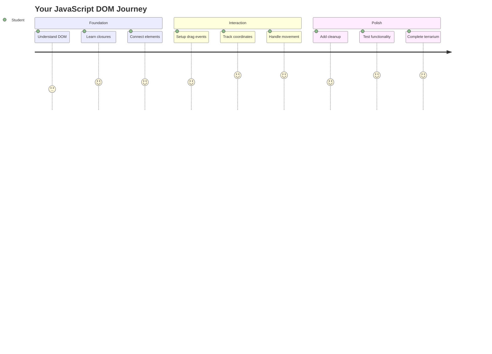
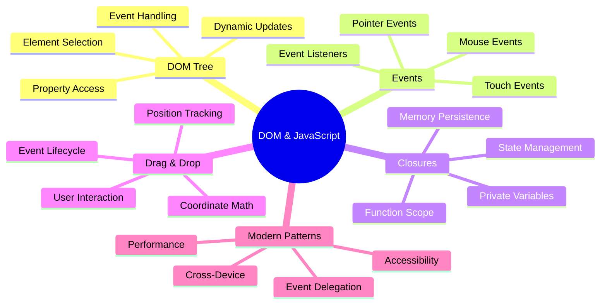
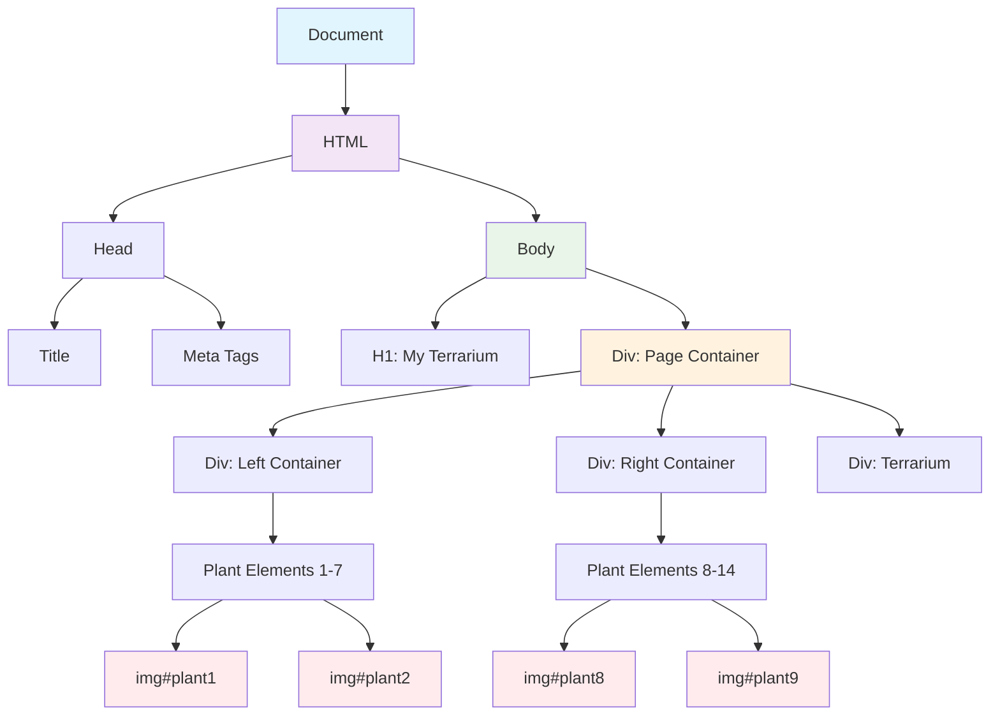
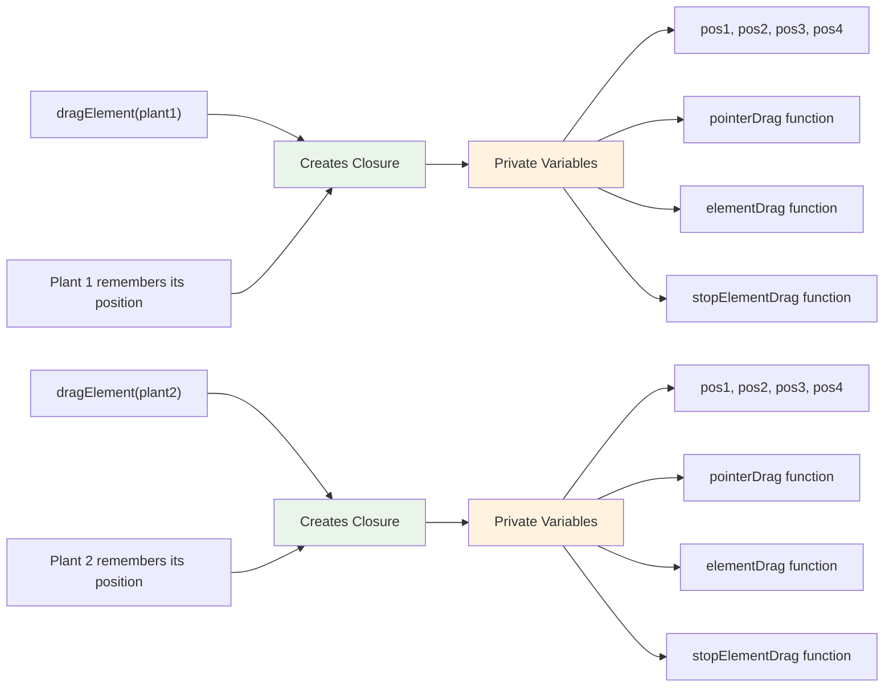
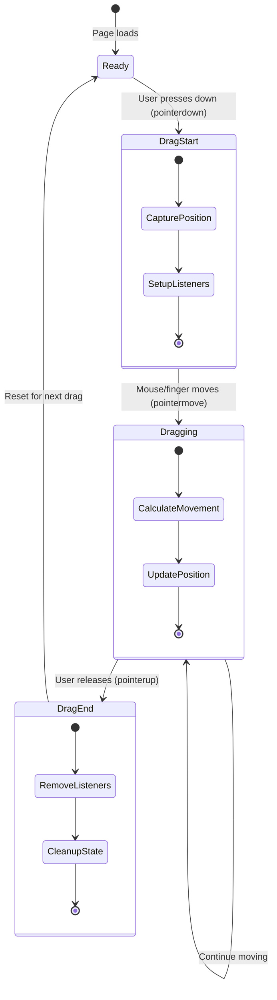
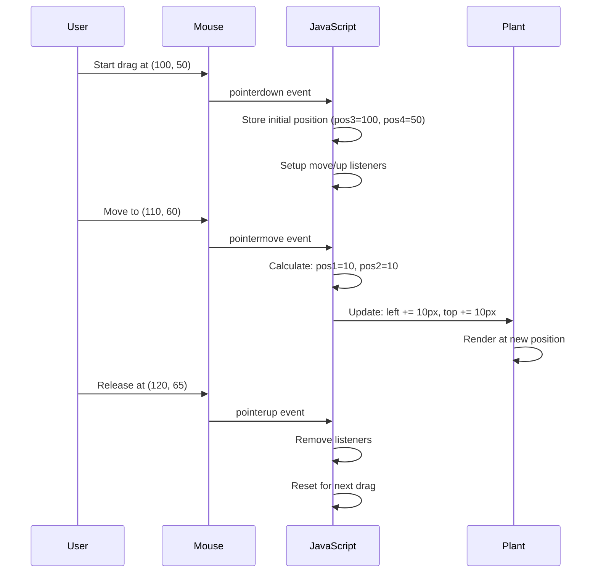
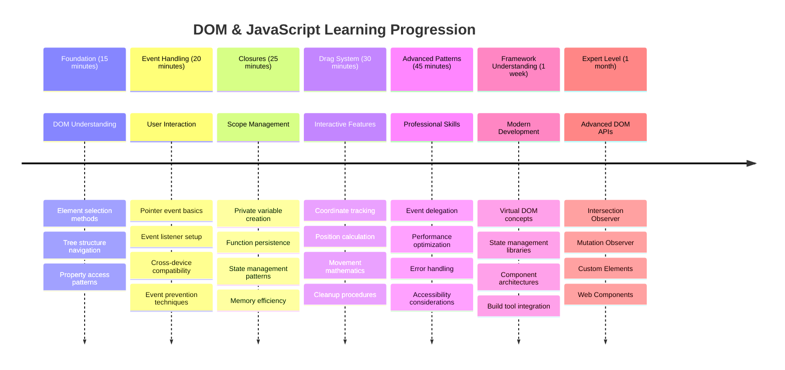

# Projek Terrarium Bahagian 3: Manipulasi DOM dan Penutupan JavaScript




> Sketchnote oleh [Tomomi Imura](https://twitter.com/girlie_mac)

Selamat datang ke salah satu aspek paling menarik dalam pembangunan web - menjadikan sesuatu interaktif! Document Object Model (DOM) adalah seperti jambatan antara HTML dan JavaScript anda, dan hari ini kita akan menggunakannya untuk menghidupkan terrarium anda. Apabila Tim Berners-Lee mencipta pelayar web pertama, beliau membayangkan web di mana dokumen boleh menjadi dinamik dan interaktif - DOM menjadikan visi itu mungkin.

Kita juga akan meneroka penutupan JavaScript, yang mungkin kedengaran menakutkan pada mulanya. Fikirkan penutupan sebagai mencipta "poket memori" di mana fungsi anda boleh mengingati maklumat penting. Ia seperti setiap tumbuhan dalam terrarium anda mempunyai rekod data sendiri untuk menjejaki kedudukannya. Menjelang akhir pelajaran ini, anda akan memahami betapa semula jadi dan bergunanya mereka.

Inilah yang akan kita bina: sebuah terrarium di mana pengguna boleh menyeret dan meletakkan tumbuhan di mana sahaja mereka mahu. Anda akan mempelajari teknik manipulasi DOM yang menggerakkan segala-galanya daripada muat naik fail seret dan lepas kepada permainan interaktif. Mari kita hidupkan terrarium anda.



## Kuiz Pra-Kuliah

[Kuiz pra-kuliah](https://ff-quizzes.netlify.app/web/quiz/19)

## Memahami DOM: Pintu Anda ke Halaman Web Interaktif

Document Object Model (DOM) adalah cara JavaScript berkomunikasi dengan elemen HTML anda. Apabila pelayar anda memuatkan halaman HTML, ia mencipta representasi berstruktur halaman itu dalam memori - itulah DOM. Fikirkan ia sebagai pokok keluarga di mana setiap elemen HTML adalah ahli keluarga yang boleh diakses, diubah, atau disusun semula oleh JavaScript.

Manipulasi DOM mengubah halaman statik menjadi laman web interaktif. Setiap kali anda melihat butang berubah warna apabila dihover, kandungan dikemas kini tanpa penyegaran halaman, atau elemen yang boleh anda seret, itu adalah manipulasi DOM yang berfungsi.




> Representasi DOM dan markup HTML yang merujuknya. Daripada [Olfa Nasraoui](https://www.researchgate.net/publication/221417012_Profile-Based_Focused_Crawler_for_Social_Media-Sharing_Websites)

**Inilah yang menjadikan DOM berkuasa:**
- **Menyediakan** cara berstruktur untuk mengakses mana-mana elemen pada halaman anda
- **Membolehkan** kemas kini kandungan dinamik tanpa penyegaran halaman
- **Membenarkan** tindak balas masa nyata kepada interaksi pengguna seperti klik dan seretan
- **Mencipta** asas untuk aplikasi web interaktif moden

## Penutupan JavaScript: Mencipta Kod yang Teratur dan Berkuasa

[Penutupan JavaScript](https://developer.mozilla.org/docs/Web/JavaScript/Closures) adalah seperti memberikan fungsi ruang kerja peribadi dengan memori yang berterusan. Pertimbangkan bagaimana burung finch Darwin di Kepulauan Galápagos masing-masing membangunkan paruh khusus berdasarkan persekitaran mereka - penutupan berfungsi dengan cara yang sama, mencipta fungsi khusus yang "mengingati" konteks khusus mereka walaupun selepas fungsi induk selesai.

Dalam terrarium kita, penutupan membantu setiap tumbuhan mengingati kedudukannya sendiri secara bebas. Corak ini muncul di seluruh pembangunan JavaScript profesional, menjadikannya konsep yang bernilai untuk difahami.



> 💡 **Memahami Penutupan**: Penutupan adalah topik penting dalam JavaScript, dan ramai pembangun menggunakannya selama bertahun-tahun sebelum memahami sepenuhnya semua aspek teori. Hari ini, kita fokus pada aplikasi praktikal - anda akan melihat penutupan muncul secara semula jadi semasa kita membina ciri interaktif kita. Pemahaman akan berkembang apabila anda melihat bagaimana ia menyelesaikan masalah sebenar.


> Representasi DOM dan markup HTML yang merujuknya. Daripada [Olfa Nasraoui](https://www.researchgate.net/publication/221417012_Profile-Based_Focused_Crawler_for_Social_Media-Sharing_Websites)

Dalam pelajaran ini, kita akan melengkapkan projek terrarium interaktif kita dengan mencipta JavaScript yang akan membolehkan pengguna memanipulasi tumbuhan pada halaman.

## Sebelum Kita Bermula: Persediaan untuk Kejayaan

Anda memerlukan fail HTML dan CSS anda daripada pelajaran terrarium sebelumnya - kita akan menjadikan reka bentuk statik itu interaktif. Jika anda baru menyertai, melengkapkan pelajaran tersebut terlebih dahulu akan memberikan konteks penting.

Inilah yang akan kita bina:
- **Seret dan lepas yang lancar** untuk semua tumbuhan terrarium
- **Penjejakan koordinat** supaya tumbuhan mengingati kedudukan mereka
- **Antara muka interaktif lengkap** menggunakan JavaScript biasa
- **Kod yang bersih dan teratur** menggunakan corak penutupan

## Menyediakan Fail JavaScript Anda

Mari kita cipta fail JavaScript yang akan menjadikan terrarium anda interaktif.

**Langkah 1: Cipta fail skrip anda**

Dalam folder terrarium anda, cipta fail baru bernama `script.js`.

**Langkah 2: Pautkan JavaScript ke HTML anda**

Tambahkan tag skrip ini ke bahagian `<head>` fail `index.html` anda:

```html
<script src="./script.js" defer></script>
```

**Kenapa atribut `defer` penting:**
- **Memastikan** JavaScript anda menunggu sehingga semua HTML dimuatkan
- **Mengelakkan** ralat di mana JavaScript mencari elemen yang belum siap
- **Menjamin** semua elemen tumbuhan anda tersedia untuk interaksi
- **Memberikan** prestasi yang lebih baik daripada meletakkan skrip di bahagian bawah halaman

> ⚠️ **Nota Penting**: Atribut `defer` mengelakkan isu masa biasa. Tanpanya, JavaScript mungkin cuba mengakses elemen HTML sebelum ia dimuatkan, menyebabkan ralat.

---

## Menyambungkan JavaScript ke Elemen HTML Anda

Sebelum kita boleh menjadikan elemen boleh diseret, JavaScript perlu mencari mereka dalam DOM. Fikirkan ini seperti sistem katalog perpustakaan - sebaik sahaja anda mempunyai nombor katalog, anda boleh mencari buku yang anda perlukan dan mengakses semua kandungannya.

Kita akan menggunakan kaedah `document.getElementById()` untuk membuat sambungan ini. Ia seperti mempunyai sistem pemfailan yang tepat - anda memberikan ID, dan ia mencari elemen yang anda perlukan dalam HTML anda.

### Mengaktifkan Fungsi Seret untuk Semua Tumbuhan

Tambahkan kod ini ke fail `script.js` anda:

```javascript
// Enable drag functionality for all 14 plants
dragElement(document.getElementById('plant1'));
dragElement(document.getElementById('plant2'));
dragElement(document.getElementById('plant3'));
dragElement(document.getElementById('plant4'));
dragElement(document.getElementById('plant5'));
dragElement(document.getElementById('plant6'));
dragElement(document.getElementById('plant7'));
dragElement(document.getElementById('plant8'));
dragElement(document.getElementById('plant9'));
dragElement(document.getElementById('plant10'));
dragElement(document.getElementById('plant11'));
dragElement(document.getElementById('plant12'));
dragElement(document.getElementById('plant13'));
dragElement(document.getElementById('plant14'));
```

**Inilah yang dicapai oleh kod ini:**
- **Mencari** setiap elemen tumbuhan dalam DOM menggunakan ID uniknya
- **Mengambil** rujukan JavaScript kepada setiap elemen HTML
- **Menghantar** setiap elemen ke fungsi `dragElement` (yang akan kita cipta seterusnya)
- **Menyediakan** setiap tumbuhan untuk interaksi seret dan lepas
- **Menyambungkan** struktur HTML anda kepada fungsi JavaScript

> 🎯 **Kenapa Gunakan ID dan Bukan Kelas?** ID memberikan pengenal unik untuk elemen tertentu, manakala kelas CSS direka untuk penggayaan kumpulan elemen. Apabila JavaScript perlu memanipulasi elemen individu, ID menawarkan ketepatan dan prestasi yang kita perlukan.

> 💡 **Tip Pro**: Perhatikan bagaimana kita memanggil `dragElement()` untuk setiap tumbuhan secara individu. Pendekatan ini memastikan setiap tumbuhan mendapat tingkah laku seret yang bebas, yang penting untuk interaksi pengguna yang lancar.

### 🔄 **Pemeriksaan Pedagogi**
**Pemahaman Sambungan DOM**: Sebelum bergerak ke fungsi seret, pastikan anda boleh:
- ✅ Jelaskan bagaimana `document.getElementById()` mencari elemen HTML
- ✅ Fahami kenapa kita menggunakan ID unik untuk setiap tumbuhan
- ✅ Terangkan tujuan atribut `defer` dalam tag skrip
- ✅ Kenali bagaimana JavaScript dan HTML bersambung melalui DOM

**Ujian Kendiri Cepat**: Apa yang akan berlaku jika dua elemen mempunyai ID yang sama? Kenapa `getElementById()` hanya mengembalikan satu elemen?
*Jawapan: ID harus unik; jika diduplikasi, hanya elemen pertama yang dikembalikan*

---

## Membina Penutupan Fungsi Drag Element

Sekarang kita akan mencipta inti fungsi seret kita: penutupan yang menguruskan tingkah laku seret untuk setiap tumbuhan. Penutupan ini akan mengandungi beberapa fungsi dalaman yang bekerjasama untuk menjejaki pergerakan tetikus dan mengemas kini kedudukan elemen.

Penutupan sangat sesuai untuk tugas ini kerana ia membolehkan kita mencipta pembolehubah "peribadi" yang berterusan antara panggilan fungsi, memberikan setiap tumbuhan sistem penjejakan koordinat bebas.

### Memahami Penutupan dengan Contoh Mudah

Mari saya tunjukkan penutupan dengan contoh mudah yang menggambarkan konsep ini:

```javascript
function createCounter() {
    let count = 0; // This is like a private variable
    
    function increment() {
        count++; // The inner function remembers the outer variable
        return count;
    }
    
    return increment; // We're giving back the inner function
}

const myCounter = createCounter();
console.log(myCounter()); // 1
console.log(myCounter()); // 2
```

**Inilah yang berlaku dalam corak penutupan ini:**
- **Mencipta** pembolehubah `count` peribadi yang hanya wujud dalam penutupan ini
- **Fungsi dalaman** boleh mengakses dan mengubah pembolehubah luar itu (mekanisme penutupan)
- **Apabila kita mengembalikan** fungsi dalaman, ia mengekalkan sambungannya kepada data peribadi itu
- **Walaupun selepas** `createCounter()` selesai pelaksanaan, `count` kekal dan mengingati nilainya

### Kenapa Penutupan Sangat Sesuai untuk Fungsi Seret

Untuk terrarium kita, setiap tumbuhan perlu mengingati koordinat kedudukan semasanya. Penutupan memberikan penyelesaian yang sempurna:

**Manfaat utama untuk projek kita:**
- **Menjaga** pembolehubah kedudukan peribadi untuk setiap tumbuhan secara bebas
- **Memelihara** data koordinat antara acara seret
- **Mengelakkan** konflik pembolehubah antara elemen yang boleh diseret
- **Mencipta** struktur kod yang bersih dan teratur

> 🎯 **Matlamat Pembelajaran**: Anda tidak perlu menguasai setiap aspek penutupan sekarang. Fokus pada melihat bagaimana ia membantu kita mengatur kod dan mengekalkan keadaan untuk fungsi seret kita.



### Mencipta Fungsi dragElement

Sekarang mari kita bina fungsi utama yang akan mengendalikan semua logik seret. Tambahkan fungsi ini di bawah deklarasi elemen tumbuhan anda:

```javascript
function dragElement(terrariumElement) {
    // Initialize position tracking variables
    let pos1 = 0,  // Previous mouse X position
        pos2 = 0,  // Previous mouse Y position  
        pos3 = 0,  // Current mouse X position
        pos4 = 0;  // Current mouse Y position
    
    // Set up the initial drag event listener
    terrariumElement.onpointerdown = pointerDrag;
}
```

**Memahami sistem penjejakan kedudukan:**
- **`pos1` dan `pos2`**: Menyimpan perbezaan antara kedudukan tetikus lama dan baru
- **`pos3` dan `pos4`**: Menjejaki koordinat tetikus semasa
- **`terrariumElement`**: Elemen tumbuhan tertentu yang kita jadikan boleh diseret
- **`onpointerdown`**: Acara yang dicetuskan apabila pengguna mula menyeret

**Inilah cara corak penutupan berfungsi:**
- **Mencipta** pembolehubah kedudukan peribadi untuk setiap elemen tumbuhan
- **Memelihara** pembolehubah ini sepanjang kitaran hidup seret
- **Memastikan** setiap tumbuhan menjejaki koordinatnya sendiri secara bebas
- **Memberikan** antara muka yang bersih melalui fungsi `dragElement`

### Kenapa Gunakan Acara Pointer?

Anda mungkin tertanya-tanya kenapa kita menggunakan `onpointerdown` dan bukannya `onclick` yang lebih biasa. Inilah alasannya:

| Jenis Acara | Terbaik Untuk | Kekurangannya |
|-------------|---------------|---------------|
| `onclick` | Klik butang mudah | Tidak boleh mengendalikan seretan (hanya klik dan lepaskan) |
| `onpointerdown` | Tetikus dan sentuhan | Lebih baru, tetapi kini disokong dengan baik |
| `onmousedown` | Tetikus desktop sahaja | Tidak menyokong pengguna mudah alih |

**Kenapa acara pointer sangat sesuai untuk apa yang kita bina:**
- **Berfungsi dengan baik** sama ada seseorang menggunakan tetikus, jari, atau stylus
- **Rasa yang sama** pada komputer riba, tablet, atau telefon
- **Mengendalikan** gerakan seretan sebenar (bukan hanya klik dan selesai)
- **Mencipta** pengalaman lancar yang pengguna harapkan daripada aplikasi web moden

> 💡 **Masa Depan**: Acara pointer adalah cara moden untuk mengendalikan interaksi pengguna. Daripada menulis kod berasingan untuk tetikus dan sentuhan, anda mendapat kedua-duanya secara percuma. Cukup hebat, bukan?

### 🔄 **Pemeriksaan Pedagogi**
**Pemahaman Pengendalian Acara**: Berhenti untuk mengesahkan pemahaman anda tentang acara:
- ✅ Kenapa kita menggunakan acara pointer dan bukannya acara tetikus?
- ✅ Bagaimana pembolehubah penutupan berterusan antara panggilan fungsi?
- ✅ Apa peranan `preventDefault()` dalam seretan yang lancar?
- ✅ Kenapa kita melampirkan pendengar kepada dokumen dan bukannya elemen individu?

**Sambungan Dunia Nyata**: Fikirkan tentang antara muka seret dan lepas yang anda gunakan setiap hari:
- **Muat naik fail**: Menyeret fail ke dalam tetingkap pelayar
- **Papan Kanban**: Memindahkan tugas antara lajur
- **Galeri imej**: Menyusun semula susunan foto
- **Antara muka mudah alih**: Meleret dan menyeret pada skrin sentuh

---

## Fungsi pointerDrag: Menangkap Permulaan Seretan

Apabila pengguna menekan tumbuhan (sama ada dengan klik tetikus atau sentuhan jari), fungsi `pointerDrag` mula berfungsi. Fungsi ini menangkap koordinat awal dan menyediakan sistem seretan.

Tambahkan fungsi ini di dalam penutupan `dragElement`, tepat selepas baris `terrariumElement.onpointerdown = pointerDrag;`:

```javascript
function pointerDrag(e) {
    // Prevent default browser behavior (like text selection)
    e.preventDefault();
    
    // Capture the initial mouse/touch position
    pos3 = e.clientX;  // X coordinate where drag started
    pos4 = e.clientY;  // Y coordinate where drag started
    
    // Set up event listeners for the dragging process
    document.onpointermove = elementDrag;
    document.onpointerup = stopElementDrag;
}
```

**Langkah demi langkah, inilah yang berlaku:**
- **Mengelakkan** tingkah laku lalai pelayar yang boleh mengganggu seretan
- **Merekodkan** koordinat tepat di mana pengguna memulakan gerakan seretan
- **Menetapkan** pendengar acara untuk pergerakan seretan yang berterusan
- **Menyediakan** sistem untuk menjejaki pergerakan tetikus/jari di seluruh dokumen

### Memahami Pencegahan Acara

Baris `e.preventDefault()` adalah penting untuk seretan yang lancar:

**Tanpa pencegahan, pelayar mungkin:**
- **Memilih** teks semasa menyeret di seluruh halaman
- **Mencetuskan** menu konteks pada klik kanan seretan
- **Mengganggu** tingkah laku seretan tersuai kita
- **Mencipta** artifak visual semasa operasi seretan

> 🔍 **Eksperimen**: Selepas melengkapkan pelajaran ini, cuba keluarkan `e.preventDefault()` dan lihat bagaimana ia mempengaruhi pengalaman seretan. Anda akan cepat memahami kenapa baris ini penting!

### Sistem Penjejakan Koordinat

Sifat `e.clientX` dan `e.clientY` memberikan kita koordinat tetikus/sentuhan yang tepat:

| Sifat | Apa yang Diukur | Kegunaan |
|-------|-----------------|----------|
| `clientX` | Kedudukan mendatar relatif kepada viewport | Menjejaki pergerakan kiri-kanan |
| `clientY` | Kedudukan menegak relatif kepada viewport | Menjejaki pergerakan atas-bawah |
**Memahami koordinat ini:**
- **Memberikan** maklumat kedudukan piksel yang tepat
- **Mengemas kini** secara masa nyata apabila pengguna menggerakkan penunjuk mereka
- **Konsisten** merentasi saiz skrin dan tahap zum yang berbeza
- **Memungkinkan** interaksi seretan yang lancar dan responsif

### Menyediakan Pendengar Acara Tahap Dokumen

Perhatikan bagaimana kita melampirkan acara gerak dan berhenti kepada keseluruhan `document`, bukan hanya elemen tumbuhan:

```javascript
document.onpointermove = elementDrag;
document.onpointerup = stopElementDrag;
```

**Mengapa melampirkan kepada dokumen:**
- **Terus** menjejaki walaupun tetikus meninggalkan elemen tumbuhan
- **Mengelakkan** gangguan seretan jika pengguna bergerak dengan cepat
- **Memberikan** seretan yang lancar di seluruh skrin
- **Mengendalikan** kes tepi di mana kursor bergerak keluar dari tetingkap pelayar

> ⚡ **Nota Prestasi**: Kita akan membersihkan pendengar tahap dokumen ini apabila seretan berhenti untuk mengelakkan kebocoran memori dan isu prestasi.

## Melengkapkan Sistem Seretan: Pergerakan dan Pembersihan

Sekarang kita akan menambah dua fungsi yang tinggal untuk mengendalikan pergerakan seretan sebenar dan pembersihan apabila seretan berhenti. Fungsi-fungsi ini bekerjasama untuk mencipta pergerakan tumbuhan yang lancar dan responsif di seluruh terrarium anda.

### Fungsi elementDrag: Menjejaki Pergerakan

Tambahkan fungsi `elementDrag` selepas kurungan penutup `pointerDrag`:

```javascript
function elementDrag(e) {
    // Calculate the distance moved since the last event
    pos1 = pos3 - e.clientX;  // Horizontal distance moved
    pos2 = pos4 - e.clientY;  // Vertical distance moved
    
    // Update the current position tracking
    pos3 = e.clientX;  // New current X position
    pos4 = e.clientY;  // New current Y position
    
    // Apply the movement to the element's position
    terrariumElement.style.top = (terrariumElement.offsetTop - pos2) + 'px';
    terrariumElement.style.left = (terrariumElement.offsetLeft - pos1) + 'px';
}
```

**Memahami matematik koordinat:**
- **`pos1` dan `pos2`**: Mengira sejauh mana tetikus telah bergerak sejak kemas kini terakhir
- **`pos3` dan `pos4`**: Menyimpan kedudukan tetikus semasa untuk pengiraan seterusnya
- **`offsetTop` dan `offsetLeft`**: Mendapatkan kedudukan semasa elemen di halaman
- **Logik penolakan**: Menggerakkan elemen dengan jumlah yang sama seperti pergerakan tetikus



**Inilah pecahan pengiraan pergerakan:**
1. **Mengukur** perbezaan antara kedudukan tetikus lama dan baru
2. **Mengira** sejauh mana elemen perlu bergerak berdasarkan pergerakan tetikus
3. **Mengemas kini** sifat kedudukan CSS elemen secara masa nyata
4. **Menyimpan** kedudukan baru sebagai asas untuk pengiraan pergerakan seterusnya

### Representasi Visual Matematik


### Fungsi stopElementDrag: Membersihkan

Tambahkan fungsi pembersihan selepas kurungan penutup `elementDrag`:

```javascript
function stopElementDrag() {
    // Remove the document-level event listeners
    document.onpointerup = null;
    document.onpointermove = null;
}
```

**Mengapa pembersihan penting:**
- **Mengelakkan** kebocoran memori daripada pendengar acara yang tertinggal
- **Menghentikan** tingkah laku seretan apabila pengguna melepaskan tumbuhan
- **Membolehkan** elemen lain diseret secara bebas
- **Menetapkan semula** sistem untuk operasi seretan seterusnya

**Apa yang berlaku tanpa pembersihan:**
- Pendengar acara terus berjalan walaupun selepas seretan berhenti
- Prestasi merosot apabila pendengar yang tidak digunakan terkumpul
- Tingkah laku yang tidak dijangka apabila berinteraksi dengan elemen lain
- Sumber pelayar terbuang pada pengendalian acara yang tidak perlu

### Memahami Sifat Kedudukan CSS

Sistem seretan kita memanipulasi dua sifat CSS utama:

| Sifat | Apa yang Dikawal | Bagaimana Kita Menggunakannya |
|-------|------------------|------------------------------|
| `top` | Jarak dari tepi atas | Kedudukan menegak semasa seretan |
| `left` | Jarak dari tepi kiri | Kedudukan mendatar semasa seretan |

**Wawasan utama tentang sifat offset:**
- **`offsetTop`**: Jarak semasa dari tepi atas elemen induk yang diposisikan
- **`offsetLeft`**: Jarak semasa dari tepi kiri elemen induk yang diposisikan
- **Konteks kedudukan**: Nilai-nilai ini adalah relatif kepada nenek moyang yang diposisikan terdekat
- **Kemas kini masa nyata**: Berubah serta-merta apabila kita mengubah sifat CSS

> 🎯 **Falsafah Reka Bentuk**: Sistem seretan ini sengaja fleksibel – tiada "zon jatuh" atau sekatan. Pengguna boleh meletakkan tumbuhan di mana-mana sahaja, memberikan mereka kawalan kreatif sepenuhnya terhadap reka bentuk terrarium mereka.

## Menggabungkan Semua: Sistem Seretan Lengkap Anda

Tahniah! Anda baru sahaja membina sistem seretan dan lepaskan yang canggih menggunakan JavaScript vanilla. Fungsi `dragElement` lengkap anda kini mengandungi penutupan yang kuat yang menguruskan:

**Apa yang dicapai oleh penutupan anda:**
- **Mengekalkan** pembolehubah kedudukan peribadi untuk setiap tumbuhan secara bebas
- **Mengendalikan** kitaran hayat seretan lengkap dari awal hingga akhir
- **Memberikan** pergerakan yang lancar dan responsif di seluruh skrin
- **Membersihkan** sumber dengan betul untuk mengelakkan kebocoran memori
- **Mencipta** antara muka intuitif dan kreatif untuk reka bentuk terrarium

### Menguji Terrarium Interaktif Anda

Sekarang uji terrarium interaktif anda! Buka fail `index.html` anda dalam pelayar web dan cuba fungsinya:

1. **Klik dan tahan** mana-mana tumbuhan untuk mula menyeret
2. **Gerakkan tetikus atau jari anda** dan lihat tumbuhan mengikut dengan lancar
3. **Lepaskan** untuk meletakkan tumbuhan di kedudukan barunya
4. **Bereksperimen** dengan susunan yang berbeza untuk meneroka antara muka

🥇 **Pencapaian**: Anda telah mencipta aplikasi web interaktif sepenuhnya menggunakan konsep teras yang digunakan oleh pembangun profesional setiap hari. Fungsi seretan dan lepaskan itu menggunakan prinsip yang sama di belakang muat naik fail, papan kanban, dan banyak antara muka interaktif lain.

### 🔄 **Pemeriksaan Pedagogi**
**Pemahaman Sistem Lengkap**: Sahkan penguasaan anda terhadap sistem seretan penuh:
- ✅ Bagaimana penutupan mengekalkan keadaan bebas untuk setiap tumbuhan?
- ✅ Mengapa matematik pengiraan koordinat diperlukan untuk pergerakan yang lancar?
- ✅ Apa yang akan berlaku jika kita lupa membersihkan pendengar acara?
- ✅ Bagaimana corak ini boleh berkembang kepada interaksi yang lebih kompleks?

**Refleksi Kualiti Kod**: Semak penyelesaian lengkap anda:
- **Reka bentuk modular**: Setiap tumbuhan mendapat contoh penutupan sendiri
- **Kecekapan acara**: Persediaan dan pembersihan pendengar yang betul
- **Sokongan merentas peranti**: Berfungsi pada desktop dan mudah alih
- **Sedarkan prestasi**: Tiada kebocoran memori atau pengiraan berlebihan


---

## Cabaran Ejen GitHub Copilot 🚀

Gunakan mod Ejen untuk menyelesaikan cabaran berikut:

**Penerangan:** Tingkatkan projek terrarium dengan menambah fungsi tetapan semula yang mengembalikan semua tumbuhan ke kedudukan asal mereka dengan animasi yang lancar.

**Arahan:** Cipta butang tetapan semula yang, apabila diklik, menganimasikan semua tumbuhan kembali ke kedudukan asal sidebar mereka menggunakan peralihan CSS. Fungsi ini harus menyimpan kedudukan asal apabila halaman dimuatkan dan dengan lancar mengalihkan tumbuhan kembali ke kedudukan tersebut dalam masa 1 saat apabila butang tetapan semula ditekan.

Ketahui lebih lanjut tentang [mod ejen](https://code.visualstudio.com/blogs/2025/02/24/introducing-copilot-agent-mode) di sini.

## 🚀 Cabaran Tambahan: Kembangkan Kemahiran Anda

Bersedia untuk membawa terrarium anda ke tahap seterusnya? Cuba melaksanakan penambahbaikan ini:

**Pengembangan Kreatif:**
- **Klik dua kali** pada tumbuhan untuk membawanya ke depan (manipulasi z-index)
- **Tambah maklum balas visual** seperti cahaya halus apabila melayang di atas tumbuhan
- **Laksanakan sempadan** untuk mengelakkan tumbuhan daripada diseret keluar dari terrarium
- **Cipta fungsi simpan** yang mengingati kedudukan tumbuhan menggunakan localStorage
- **Tambah kesan bunyi** untuk mengambil dan meletakkan tumbuhan

> 💡 **Peluang Pembelajaran**: Setiap cabaran ini akan mengajar anda aspek baru manipulasi DOM, pengendalian acara, dan reka bentuk pengalaman pengguna.

## Kuiz Selepas Kuliah

[Kuiz selepas kuliah](https://ff-quizzes.netlify.app/web/quiz/20)

## Ulasan & Kajian Sendiri: Mendalami Pemahaman Anda

Anda telah menguasai asas manipulasi DOM dan penutupan, tetapi sentiasa ada lebih banyak untuk diterokai! Berikut adalah beberapa laluan untuk mengembangkan pengetahuan dan kemahiran anda.

### Pendekatan Seretan dan Lepaskan Alternatif

Kami menggunakan acara penunjuk untuk fleksibiliti maksimum, tetapi pembangunan web menawarkan pelbagai pendekatan:

| Pendekatan | Terbaik Untuk | Nilai Pembelajaran |
|------------|---------------|--------------------|
| [API Seretan dan Lepaskan HTML](https://developer.mozilla.org/docs/Web/API/HTML_Drag_and_Drop_API) | Muat naik fail, zon seretan formal | Memahami keupayaan pelayar asli |
| [Acara Sentuhan](https://developer.mozilla.org/docs/Web/API/Touch_events) | Interaksi khusus mudah alih | Corak pembangunan mudah alih |
| Sifat `transform` CSS | Animasi lancar | Teknik pengoptimuman prestasi |

### Topik Manipulasi DOM Lanjutan

**Langkah seterusnya dalam perjalanan pembelajaran anda:**
- **Delegasi acara**: Mengendalikan acara dengan cekap untuk pelbagai elemen
- **Pemerhati Persilangan**: Mengesan apabila elemen masuk/keluar dari pandangan
- **Pemerhati Mutasi**: Memantau perubahan dalam struktur DOM
- **Komponen Web**: Mencipta elemen UI yang boleh digunakan semula dan terasing
- **Konsep DOM Maya**: Memahami bagaimana rangka kerja mengoptimumkan kemas kini DOM

### Sumber Penting untuk Pembelajaran Berterusan

**Dokumentasi Teknikal:**
- [Panduan Acara Penunjuk MDN](https://developer.mozilla.org/docs/Web/API/Pointer_events) - Rujukan acara penunjuk yang komprehensif
- [Spesifikasi Acara Penunjuk W3C](https://www.w3.org/TR/pointerevents1/) - Dokumentasi piawaian rasmi
- [Penyelaman Mendalam Penutupan JavaScript](https://developer.mozilla.org/docs/Web/JavaScript/Closures) - Corak penutupan lanjutan

**Keserasian Pelayar:**
- [CanIUse.com](https://caniuse.com/) - Semak sokongan ciri merentas pelayar
- [Data Keserasian Pelayar MDN](https://github.com/mdn/browser-compat-data) - Maklumat keserasian terperinci

**Peluang Latihan:**
- **Bina** permainan teka-teki menggunakan mekanik seretan yang serupa
- **Cipta** papan kanban dengan pengurusan tugas seretan dan lepaskan
- **Reka** galeri imej dengan susunan foto yang boleh diseret
- **Bereksperimen** dengan gerak isyarat sentuhan untuk antara muka mudah alih

> 🎯 **Strategi Pembelajaran**: Cara terbaik untuk mengukuhkan konsep ini adalah melalui latihan. Cuba bina variasi antara muka yang boleh diseret – setiap projek akan mengajar anda sesuatu yang baru tentang interaksi pengguna dan manipulasi DOM.

### ⚡ **Apa yang Anda Boleh Lakukan dalam 5 Minit Seterusnya**
- [ ] Buka DevTools pelayar dan taip `document.querySelector('body')` dalam konsol
- [ ] Cuba ubah teks laman web menggunakan `innerHTML` atau `textContent`
- [ ] Tambahkan pendengar acara klik pada mana-mana butang atau pautan di laman web
- [ ] Periksa struktur pokok DOM menggunakan panel Elemen

### 🎯 **Apa yang Anda Boleh Capai Dalam Jam Ini**
- [ ] Lengkapkan kuiz selepas pelajaran dan semak konsep manipulasi DOM
- [ ] Cipta laman web interaktif yang bertindak balas terhadap klik pengguna
- [ ] Latih pengendalian acara dengan pelbagai jenis acara (klik, mouseover, keypress)
- [ ] Bina senarai tugasan atau kaunter mudah menggunakan manipulasi DOM
- [ ] Terokai hubungan antara elemen HTML dan objek JavaScript

### 📅 **Perjalanan JavaScript Anda Sepanjang Minggu**
- [ ] Lengkapkan projek terrarium interaktif dengan fungsi seretan dan lepaskan
- [ ] Kuasai delegasi acara untuk pengendalian acara yang cekap
- [ ] Pelajari tentang gelung acara dan JavaScript asinkron
- [ ] Latih penutupan dengan membina modul dengan keadaan peribadi
- [ ] Terokai API DOM moden seperti Pemerhati Persilangan
- [ ] Bina komponen interaktif tanpa menggunakan rangka kerja

### 🌟 **Penguasaan JavaScript Anda Sepanjang Bulan**
- [ ] Cipta aplikasi halaman tunggal yang kompleks menggunakan JavaScript vanilla
- [ ] Pelajari rangka kerja moden (React, Vue, atau Angular) dan bandingkan dengan DOM vanilla
- [ ] Sumbang kepada projek JavaScript sumber terbuka
- [ ] Kuasai konsep lanjutan seperti komponen web dan elemen tersuai
- [ ] Bina aplikasi web yang berprestasi dengan corak DOM yang optimum
- [ ] Ajar orang lain tentang manipulasi DOM dan asas JavaScript

## 🎯 Garis Masa Penguasaan DOM JavaScript Anda



### 🛠️ Ringkasan Alat JavaScript Anda

Selepas menyelesaikan pelajaran ini, anda kini mempunyai:
- **Penguasaan DOM**: Pemilihan elemen, manipulasi sifat, dan navigasi pokok
- **Kepakaran Acara**: Pengendalian interaksi merentas peranti dengan acara penunjuk
- **Pemahaman Penutupan**: Pengurusan keadaan peribadi dan ketekalan fungsi
- **Sistem Interaktif**: Pelaksanaan seretan dan lepaskan lengkap dari awal
- **Kesedaran Prestasi**: Pembersihan acara yang betul dan pengurusan memori
- **Corak Moden**: Teknik organisasi kod yang digunakan dalam pembangunan profesional
- **Pengalaman Pengguna**: Mencipta antara muka yang intuitif dan responsif

**Kemahiran Profesional Diperoleh**: Anda telah membina ciri-ciri menggunakan teknik yang sama seperti:
- **Papan Kanban/Trello**: Seretan kad antara lajur
- **Sistem muat naik fail**: Pengendalian fail seretan dan lepaskan
- **Galeri imej**: Antara muka susunan foto
- **Aplikasi mudah alih**: Corak interaksi berasaskan sentuhan

**Tahap Seterusnya**: Anda bersedia untuk meneroka rangka kerja moden seperti React, Vue, atau Angular yang membina konsep manipulasi DOM asas ini!

## Tugasan

[Kerja sedikit lagi dengan DOM](assignment.md)

---

**Penafian**:  
Dokumen ini telah diterjemahkan menggunakan perkhidmatan terjemahan AI [Co-op Translator](https://github.com/Azure/co-op-translator). Walaupun kami berusaha untuk ketepatan, sila ambil perhatian bahawa terjemahan automatik mungkin mengandungi kesilapan atau ketidaktepatan. Dokumen asal dalam bahasa asalnya harus dianggap sebagai sumber yang berwibawa. Untuk maklumat penting, terjemahan manusia profesional adalah disyorkan. Kami tidak bertanggungjawab atas sebarang salah faham atau salah tafsir yang timbul daripada penggunaan terjemahan ini.