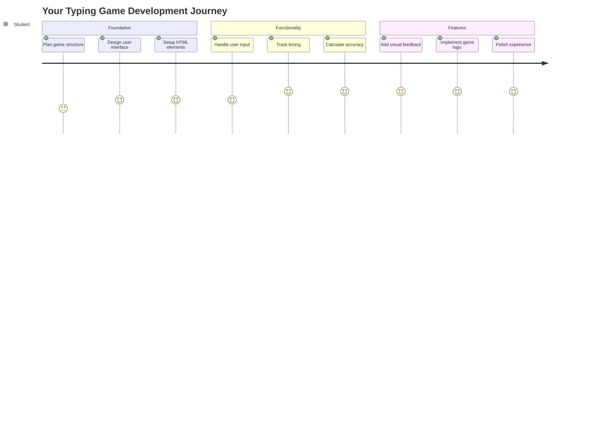
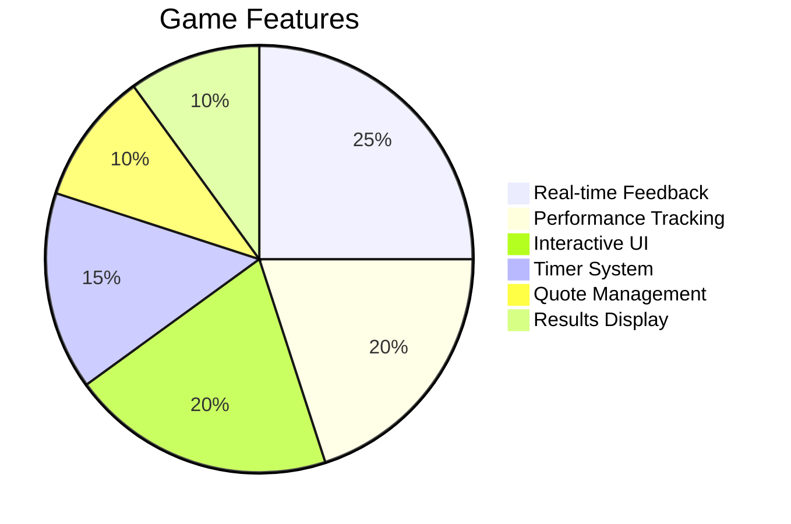
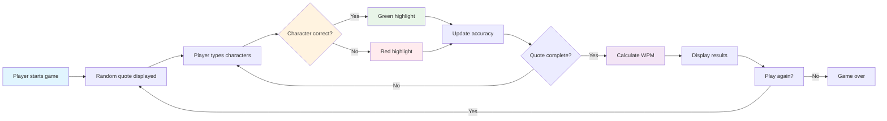
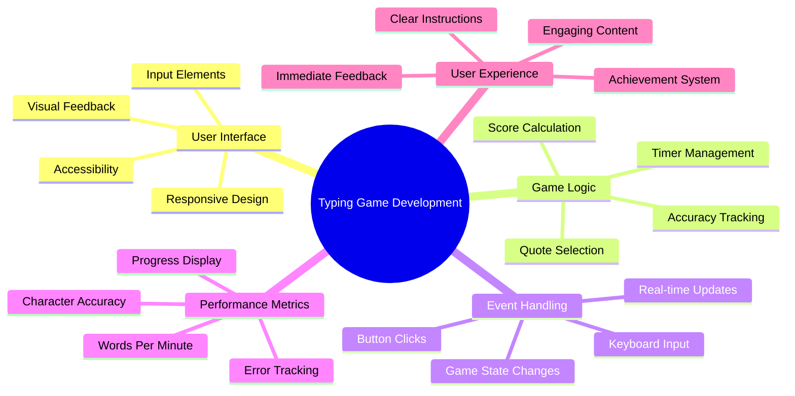
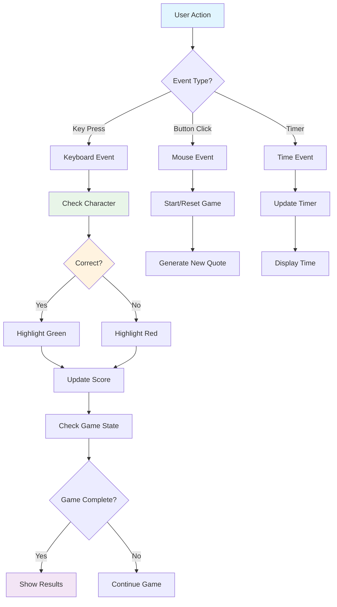
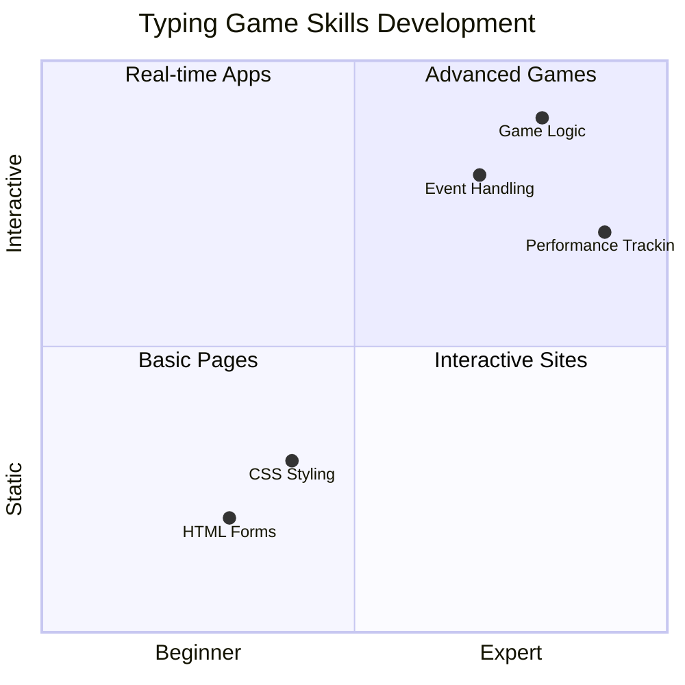
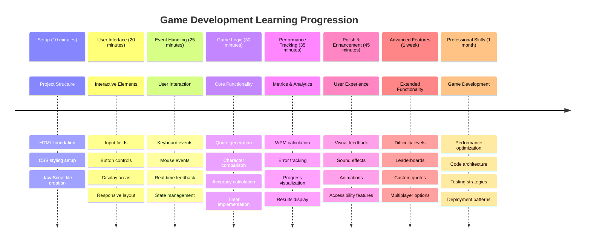

# Pengaturcaraan Berasaskan Acara - Bina Permainan Menaip

## Pengenalan

Ini sesuatu yang setiap pembangun tahu tetapi jarang dibincangkan: menaip dengan pantas adalah satu kuasa super! 🚀 Fikirkan - semakin pantas anda boleh memindahkan idea dari otak ke editor kod, semakin lancar kreativiti anda mengalir. Ia seperti mempunyai saluran langsung antara fikiran anda dan skrin.

Nak tahu salah satu cara terbaik untuk meningkatkan kemahiran ini? Betul - kita akan bina permainan!

> Jom cipta permainan menaip yang hebat bersama-sama!

Bersedia untuk menggunakan semua kemahiran JavaScript, HTML, dan CSS yang telah anda pelajari? Kita akan bina permainan menaip yang akan mencabar anda dengan petikan rawak daripada detektif legenda [Sherlock Holmes](https://en.wikipedia.org/wiki/Sherlock_Holmes). Permainan ini akan menjejaki seberapa pantas dan tepat anda menaip - dan percayalah, ia lebih ketagihan daripada yang anda sangka!

## Apa Yang Anda Perlu Tahu

Sebelum kita mulakan, pastikan anda selesa dengan konsep-konsep ini (jangan risau jika anda perlukan sedikit ulang kaji - kita semua pernah melaluinya!):

- Membuat input teks dan kawalan butang
- CSS dan menetapkan gaya menggunakan kelas  
- Asas JavaScript
  - Membuat array
  - Membuat nombor rawak
  - Mendapatkan masa semasa

Jika ada yang terasa sedikit kabur, itu tidak mengapa! Kadang-kadang cara terbaik untuk mengukuhkan pengetahuan adalah dengan menyelam ke dalam projek dan menyelesaikan masalah semasa anda melakukannya.

### 🔄 **Pemeriksaan Pedagogi**
**Penilaian Asas**: Sebelum memulakan pembangunan, pastikan anda memahami:
- ✅ Bagaimana elemen borang HTML dan input berfungsi
- ✅ Kelas CSS dan gaya dinamik
- ✅ Pendengar acara dan pengendali JavaScript
- ✅ Manipulasi array dan pemilihan rawak
- ✅ Pengukuran masa dan pengiraan

**Ujian Kendiri Cepat**: Bolehkah anda menerangkan bagaimana konsep-konsep ini berfungsi bersama dalam permainan interaktif?
- **Acara** dicetuskan apabila pengguna berinteraksi dengan elemen
- **Pengendali** memproses acara tersebut dan mengemas kini keadaan permainan
- **CSS** memberikan maklum balas visual untuk tindakan pengguna
- **Pengukuran masa** membolehkan penilaian prestasi dan perkembangan permainan

## Jom Bina Permainan Ini!

[Mencipta permainan menaip menggunakan pengaturcaraan berasaskan acara](./typing-game/README.md)

### ⚡ **Apa Yang Boleh Anda Lakukan Dalam 5 Minit Seterusnya**
- [ ] Buka konsol pelayar anda dan cuba mendengar acara papan kekunci dengan `addEventListener`
- [ ] Buat halaman HTML ringkas dengan medan input dan uji pengesanan menaip
- [ ] Latih manipulasi string dengan membandingkan teks yang ditaip dengan teks sasaran
- [ ] Bereksperimen dengan `setTimeout` untuk memahami fungsi masa

### 🎯 **Apa Yang Boleh Anda Capai Dalam Satu Jam**
- [ ] Lengkapkan kuiz selepas pelajaran dan fahami pengaturcaraan berasaskan acara
- [ ] Bina versi asas permainan menaip dengan pengesahan perkataan
- [ ] Tambah maklum balas visual untuk menaip yang betul dan salah
- [ ] Laksanakan sistem pemarkahan mudah berdasarkan kelajuan dan ketepatan
- [ ] Gayakan permainan anda dengan CSS untuk menjadikannya menarik secara visual

### 📅 **Pembangunan Permainan Anda Sepanjang Minggu**
- [ ] Lengkapkan permainan menaip penuh dengan semua ciri dan kemasan
- [ ] Tambah tahap kesukaran dengan kerumitan perkataan yang berbeza
- [ ] Laksanakan penjejakan statistik pengguna (WPM, ketepatan dari masa ke masa)
- [ ] Cipta kesan bunyi dan animasi untuk pengalaman pengguna yang lebih baik
- [ ] Jadikan permainan anda responsif untuk peranti sentuh
- [ ] Kongsi permainan anda secara dalam talian dan kumpulkan maklum balas daripada pengguna

### 🌟 **Pembangunan Interaktif Anda Sepanjang Bulan**
- [ ] Bina pelbagai permainan yang meneroka corak interaksi yang berbeza
- [ ] Belajar tentang gelung permainan, pengurusan keadaan, dan pengoptimuman prestasi
- [ ] Menyumbang kepada projek pembangunan permainan sumber terbuka
- [ ] Kuasai konsep masa lanjutan dan animasi yang lancar
- [ ] Cipta portfolio yang mempamerkan pelbagai aplikasi interaktif
- [ ] Bimbing orang lain yang berminat dalam pembangunan permainan dan interaksi pengguna

## 🎯 Garis Masa Penguasaan Permainan Menaip Anda

### 🛠️ Ringkasan Alat Pembangunan Permainan Anda

Selepas menyelesaikan projek ini, anda akan menguasai:
- **Pengaturcaraan Berasaskan Acara**: Antara muka pengguna responsif yang bertindak balas terhadap input
- **Maklum Balas Masa Nyata**: Kemas kini visual dan prestasi segera
- **Pengukuran Prestasi**: Sistem pemarkahan dan pengukuran masa yang tepat
- **Pengurusan Keadaan Permainan**: Mengawal aliran aplikasi dan pengalaman pengguna
- **Reka Bentuk Interaktif**: Mencipta pengalaman pengguna yang menarik dan ketagihan
- **API Web Moden**: Menggunakan keupayaan pelayar untuk interaksi yang kaya
- **Corak Kebolehaksesan**: Reka bentuk inklusif untuk semua pengguna

**Aplikasi Dunia Nyata**: Kemahiran ini secara langsung boleh digunakan untuk:
- **Aplikasi Web**: Mana-mana antara muka interaktif atau papan pemuka
- **Perisian Pendidikan**: Platform pembelajaran dan alat penilaian kemahiran
- **Alat Produktiviti**: Editor teks, IDE, dan perisian kolaborasi
- **Industri Permainan**: Permainan pelayar dan hiburan interaktif
- **Pembangunan Mudah Alih**: Antara muka berasaskan sentuhan dan pengendalian isyarat

**Tahap Seterusnya**: Anda bersedia untuk meneroka rangka kerja permainan lanjutan, sistem berbilang pemain masa nyata, atau aplikasi interaktif yang kompleks!

## Kredit

Ditulis dengan ♥️ oleh [Christopher Harrison](http://www.twitter.com/geektrainer)

---

**Penafian**:  
Dokumen ini telah diterjemahkan menggunakan perkhidmatan terjemahan AI [Co-op Translator](https://github.com/Azure/co-op-translator). Walaupun kami berusaha untuk ketepatan, sila ambil perhatian bahawa terjemahan automatik mungkin mengandungi kesilapan atau ketidaktepatan. Dokumen asal dalam bahasa asalnya harus dianggap sebagai sumber yang berwibawa. Untuk maklumat penting, terjemahan manusia profesional adalah disyorkan. Kami tidak bertanggungjawab atas sebarang salah faham atau salah tafsir yang timbul daripada penggunaan terjemahan ini.