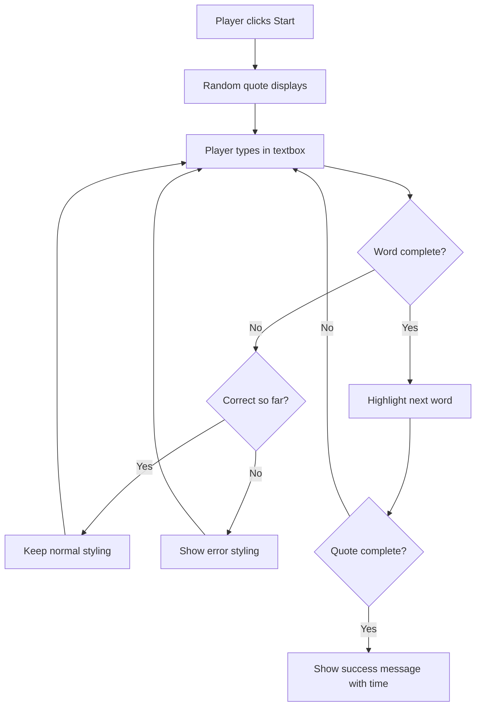
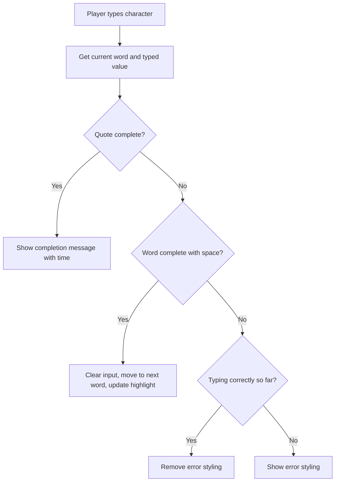
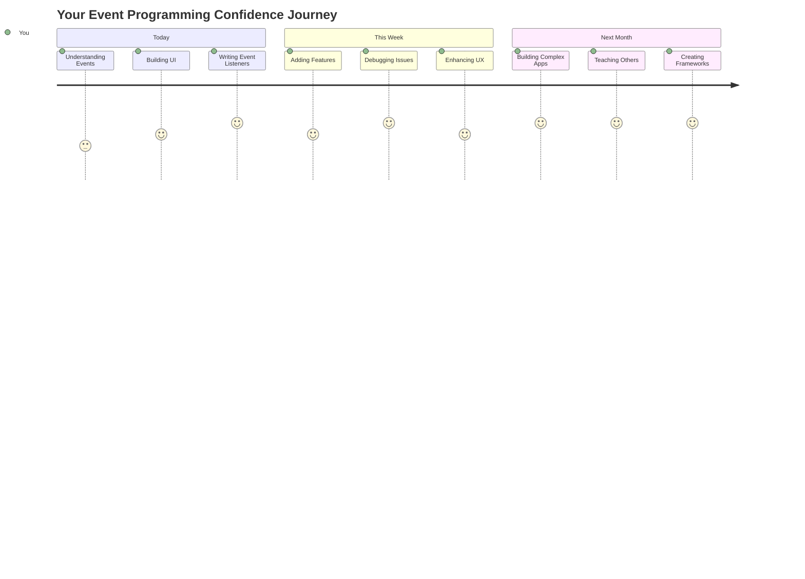

# Membina permainan menggunakan acara

Pernahkah anda tertanya-tanya bagaimana laman web tahu bila anda klik butang atau menaip dalam kotak teks? Itulah keajaiban pengaturcaraan berasaskan acara! Apa cara yang lebih baik untuk mempelajari kemahiran penting ini daripada membina sesuatu yang berguna - permainan kelajuan menaip yang bertindak balas terhadap setiap keystroke anda.

Anda akan melihat sendiri bagaimana pelayar web "bercakap" dengan kod JavaScript anda. Setiap kali anda klik, menaip, atau menggerakkan tetikus anda, pelayar menghantar mesej kecil (kami panggil ia acara) kepada kod anda, dan anda yang menentukan bagaimana untuk bertindak balas!

Apabila kita selesai di sini, anda akan membina permainan menaip sebenar yang menjejaki kelajuan dan ketepatan anda. Lebih penting lagi, anda akan memahami konsep asas yang menggerakkan setiap laman web interaktif yang pernah anda gunakan. Jom mulakan!

## Kuiz Pra-Kuliah

[Kuiz pra-kuliah](https://ff-quizzes.netlify.app/web/quiz/21)

## Pengaturcaraan berasaskan acara

Fikirkan tentang aplikasi atau laman web kegemaran anda - apa yang membuatkannya terasa hidup dan responsif? Semuanya tentang bagaimana ia bertindak balas terhadap apa yang anda lakukan! Setiap ketukan, klik, sapuan, atau keystroke mencipta apa yang kami panggil "acara," dan di situlah keajaiban sebenar pembangunan web berlaku.

Inilah yang membuatkan pengaturcaraan untuk web begitu menarik: kita tidak pernah tahu bila seseorang akan klik butang itu atau mula menaip dalam kotak teks. Mereka mungkin klik dengan segera, tunggu lima minit, atau mungkin tidak klik langsung! Ketidakpastian ini bermakna kita perlu berfikir secara berbeza tentang bagaimana kita menulis kod kita.

Daripada menulis kod yang berjalan dari atas ke bawah seperti resipi, kita menulis kod yang duduk dengan sabar menunggu sesuatu berlaku. Ia serupa dengan bagaimana operator telegraf pada tahun 1800-an akan duduk di mesin mereka, bersedia untuk bertindak balas sebaik sahaja mesej datang melalui wayar.

Jadi apa sebenarnya "acara"? Secara ringkas, ia adalah sesuatu yang berlaku! Apabila anda klik butang - itu adalah acara. Apabila anda menaip huruf - itu adalah acara. Apabila anda menggerakkan tetikus anda - itu adalah satu lagi acara.

Pengaturcaraan berasaskan acara membolehkan kita menyediakan kod kita untuk mendengar dan bertindak balas. Kita mencipta fungsi khas yang dipanggil **pendengar acara** yang menunggu dengan sabar untuk perkara tertentu berlaku, kemudian bertindak apabila ia berlaku.

Fikirkan pendengar acara seperti mempunyai loceng pintu untuk kod anda. Anda menyediakan loceng pintu (`addEventListener()`), memberitahunya bunyi apa yang perlu didengar (seperti 'klik' atau 'tekan kekunci'), dan kemudian menentukan apa yang perlu berlaku apabila seseorang menekannya (fungsi khusus anda).

**Inilah cara pendengar acara berfungsi:**
- **Mendengar** tindakan pengguna tertentu seperti klik, keystroke, atau pergerakan tetikus
- **Melaksanakan** kod khusus anda apabila acara yang ditentukan berlaku
- **Bertindak balas** dengan segera terhadap interaksi pengguna, mencipta pengalaman yang lancar
- **Mengendalikan** pelbagai acara pada elemen yang sama menggunakan pendengar yang berbeza

> **NOTE:** Perlu diingat bahawa terdapat pelbagai cara untuk mencipta pendengar acara. Anda boleh menggunakan fungsi tanpa nama, atau mencipta fungsi bernama. Anda boleh menggunakan pelbagai pintasan, seperti menetapkan sifat `click`, atau menggunakan `addEventListener()`. Dalam latihan kita, kita akan fokus pada `addEventListener()` dan fungsi tanpa nama, kerana ia mungkin teknik yang paling biasa digunakan oleh pembangun web. Ia juga yang paling fleksibel, kerana `addEventListener()` berfungsi untuk semua acara, dan nama acara boleh diberikan sebagai parameter.

### Acara biasa

Walaupun pelayar web menawarkan berpuluh-puluh acara yang berbeza untuk anda dengar, kebanyakan aplikasi interaktif hanya bergantung pada beberapa acara penting. Memahami acara teras ini akan memberi anda asas untuk membina interaksi pengguna yang canggih.

Terdapat [berpuluh-puluh acara](https://developer.mozilla.org/docs/Web/Events) yang tersedia untuk anda dengar semasa mencipta aplikasi. Pada dasarnya, apa sahaja yang pengguna lakukan pada halaman akan mencetuskan acara, yang memberi anda banyak kuasa untuk memastikan mereka mendapat pengalaman yang anda inginkan. Nasib baik, anda biasanya hanya memerlukan sebilangan kecil acara. Berikut adalah beberapa acara biasa (termasuk dua yang akan kita gunakan semasa mencipta permainan kita):

| Acara | Penerangan | Kes Penggunaan Biasa |
|-------|-------------|------------------|
| `click` | Pengguna klik sesuatu | Butang, pautan, elemen interaktif |
| `contextmenu` | Pengguna klik butang kanan tetikus | Menu klik kanan khusus |
| `select` | Pengguna menyerlahkan beberapa teks | Penyuntingan teks, operasi salin |
| `input` | Pengguna memasukkan teks | Pengesahan borang, carian masa nyata |

**Memahami jenis acara ini:**
- **Mencetuskan** apabila pengguna berinteraksi dengan elemen tertentu pada halaman anda
- **Menyediakan** maklumat terperinci tentang tindakan pengguna melalui objek acara
- **Membolehkan** anda mencipta aplikasi web yang responsif dan interaktif
- **Berfungsi** secara konsisten merentasi pelayar dan peranti yang berbeza

## Membina permainan

Sekarang anda memahami bagaimana acara berfungsi, mari kita gunakan pengetahuan itu dengan membina sesuatu yang berguna. Kita akan mencipta permainan kelajuan menaip yang menunjukkan pengendalian acara sambil membantu anda membangunkan kemahiran penting sebagai pembangun.

Kita akan mencipta permainan untuk meneroka bagaimana acara berfungsi dalam JavaScript. Permainan kita akan menguji kemahiran menaip pemain, yang merupakan salah satu kemahiran yang paling kurang dihargai tetapi sangat penting untuk pembangun. Fakta menarik: susun atur papan kekunci QWERTY yang kita gunakan hari ini sebenarnya direka pada tahun 1870-an untuk mesin taip - dan kemahiran menaip yang baik masih sama berharganya untuk pengaturcara hari ini! Aliran umum permainan akan kelihatan seperti ini:



**Inilah cara permainan kita berfungsi:**
- **Bermula** apabila pemain klik butang mula dan memaparkan petikan rawak
- **Menjejaki** kemajuan menaip pemain perkataan demi perkataan secara masa nyata
- **Menyerlahkan** perkataan semasa untuk membimbing fokus pemain
- **Memberikan** maklum balas visual segera untuk kesalahan menaip
- **Mengira** dan memaparkan jumlah masa apabila petikan selesai

Mari kita bina permainan kita, dan belajar tentang acara!

### Struktur fail

Sebelum kita mula menulis kod, mari kita susun! Mempunyai struktur fail yang bersih dari awal akan menjimatkan anda daripada sakit kepala kemudian dan menjadikan projek anda lebih profesional. 😊

Kita akan menyimpan semuanya ringkas dengan hanya tiga fail: `index.html` untuk struktur halaman kita, `script.js` untuk semua logik permainan kita, dan `style.css` untuk menjadikan semuanya kelihatan hebat. Ini adalah trio klasik yang menggerakkan kebanyakan web!

**Cipta folder baru untuk kerja anda dengan membuka konsol atau tetingkap terminal dan masukkan arahan berikut:**

```bash
# Linux or macOS
mkdir typing-game && cd typing-game

# Windows
md typing-game && cd typing-game
```

**Inilah yang dilakukan oleh arahan ini:**
- **Mencipta** direktori baru bernama `typing-game` untuk fail projek anda
- **Berpindah** ke dalam direktori yang baru dicipta secara automatik
- **Menyiapkan** ruang kerja yang bersih untuk pembangunan permainan anda

**Buka Visual Studio Code:**

```bash
code .
```

**Arahan ini:**
- **Melancarkan** Visual Studio Code dalam direktori semasa
- **Membuka** folder projek anda dalam editor
- **Memberikan** akses kepada semua alat pembangunan yang anda perlukan

**Tambah tiga fail ke folder dalam Visual Studio Code dengan nama berikut:**
- `index.html` - Mengandungi struktur dan kandungan permainan anda
- `script.js` - Mengendalikan semua logik permainan dan pendengar acara
- `style.css` - Menentukan rupa visual dan gaya

## Cipta antara muka pengguna

Sekarang mari kita bina pentas di mana semua aksi permainan kita akan berlaku! Fikirkan ini seperti mereka bentuk panel kawalan untuk kapal angkasa - kita perlu pastikan semua yang pemain kita perlukan berada di tempat yang mereka jangkakan.

Mari kita fikirkan apa yang permainan kita perlukan. Jika anda bermain permainan menaip, apa yang anda mahu lihat di skrin? Berikut adalah apa yang kita perlukan:

| Elemen UI | Tujuan | Elemen HTML |
|------------|---------|-------------|
| Paparan Petikan | Menunjukkan teks untuk ditaip | `<p>` dengan `id="quote"` |
| Kawasan Mesej | Memaparkan status dan mesej kejayaan | `<p>` dengan `id="message"` |
| Input Teks | Tempat pemain menaip petikan | `<input>` dengan `id="typed-value"` |
| Butang Mula | Memulakan permainan | `<button>` dengan `id="start"` |

**Memahami struktur UI:**
- **Mengatur** kandungan secara logik dari atas ke bawah
- **Menetapkan** ID unik kepada elemen untuk sasaran JavaScript
- **Memberikan** hierarki visual yang jelas untuk pengalaman pengguna yang lebih baik
- **Termasuk** elemen HTML semantik untuk kebolehcapaian

Setiap elemen ini memerlukan ID supaya kita boleh bekerja dengannya dalam JavaScript kita. Kita juga akan menambah rujukan kepada fail CSS dan JavaScript yang akan kita cipta.

Cipta fail baru bernama `index.html`. Tambahkan HTML berikut:

```html
<!-- inside index.html -->
<html>
<head>
  <title>Typing game</title>
  <link rel="stylesheet" href="style.css">
</head>
<body>
  <h1>Typing game!</h1>
  <p>Practice your typing skills with a quote from Sherlock Holmes. Click **start** to begin!</p>
  <p id="quote"></p> <!-- This will display our quote -->
  <p id="message"></p> <!-- This will display any status messages -->
  <div>
    <input type="text" aria-label="current word" id="typed-value" /> <!-- The textbox for typing -->
    <button type="button" id="start">Start</button> <!-- To start the game -->
  </div>
  <script src="script.js"></script>
</body>
</html>
```

**Memecahkan apa yang dicapai oleh struktur HTML ini:**
- **Memautkan** stylesheet CSS dalam `<head>` untuk gaya
- **Mencipta** tajuk dan arahan yang jelas untuk pengguna
- **Menetapkan** perenggan tempat letak dengan ID khusus untuk kandungan dinamik
- **Termasuk** medan input dengan atribut kebolehcapaian
- **Menyediakan** butang mula untuk mencetuskan permainan
- **Memuatkan** fail JavaScript di akhir untuk prestasi optimum

### Lancarkan aplikasi

Menguji aplikasi anda dengan kerap semasa pembangunan membantu anda menangkap isu lebih awal dan melihat kemajuan anda secara masa nyata. Live Server adalah alat yang sangat berguna yang secara automatik menyegarkan pelayar anda setiap kali anda menyimpan perubahan, menjadikan pembangunan lebih cekap.

Adalah lebih baik untuk membangunkan secara berperingkat untuk melihat bagaimana semuanya kelihatan. Mari lancarkan aplikasi kita. Terdapat sambungan yang hebat untuk Visual Studio Code yang dipanggil [Live Server](https://marketplace.visualstudio.com/items?itemName=ritwickdey.LiveServer&WT.mc_id=academic-77807-sagibbon) yang akan menjadi tuan rumah aplikasi anda secara tempatan dan menyegarkan pelayar setiap kali anda menyimpan.

**Pasang [Live Server](https://marketplace.visualstudio.com/items?itemName=ritwickdey.LiveServer&WT.mc_id=academic-77807-sagibbon) dengan mengikuti pautan dan klik Pasang:**

**Inilah yang berlaku semasa pemasangan:**
- **Membuka** Visual Studio Code di pelayar anda
- **Membimbing** anda melalui proses pemasangan sambungan
- **Mungkin memerlukan** anda memulakan semula Visual Studio Code untuk melengkapkan pemasangan

**Setelah dipasang, dalam Visual Studio Code, klik Ctrl-Shift-P (atau Cmd-Shift-P) untuk membuka palet arahan:**

**Memahami palet arahan:**
- **Memberikan** akses cepat kepada semua arahan VS Code
- **Mencari** arahan semasa anda menaip
- **Menawarkan** pintasan papan kekunci untuk pembangunan yang lebih pantas

**Taip "Live Server: Open with Live Server":**

**Apa yang dilakukan oleh Live Server:**
- **Memulakan** pelayan pembangunan tempatan untuk projek anda
- **Menyegarkan** pelayar secara automatik apabila anda menyimpan fail
- **Menyediakan** fail anda dari URL tempatan (biasanya `localhost:5500`)

**Buka pelayar dan navigasi ke `https://localhost:5500`:**

Anda kini sepatutnya melihat halaman yang anda cipta! Mari tambahkan beberapa fungsi.

## Tambah CSS

Sekarang mari kita buat semuanya kelihatan menarik! Maklum balas visual sangat penting untuk antara muka pengguna sejak awal pengkomputeran. Pada tahun 1980-an, penyelidik mendapati bahawa maklum balas visual segera secara dramatik meningkatkan prestasi pengguna dan mengurangkan kesilapan. Itulah yang akan kita cipta.

Permainan kita perlu sangat jelas tentang apa yang sedang berlaku. Pemain sepatutnya tahu dengan segera perkataan mana yang mereka perlu taip, dan jika mereka membuat kesilapan, mereka sepatutnya melihatnya dengan segera. Mari kita cipta gaya yang ringkas tetapi berkesan:

Cipta fail baru bernama `style.css` dan tambahkan sintaks berikut.

```css
/* inside style.css */
.highlight {
  background-color: yellow;
}

.error {
  background-color: lightcoral;
  border: red;
}
```

**Memahami kelas CSS ini:**
- **Menyerlahkan** perkataan semasa dengan latar belakang kuning untuk panduan visual yang jelas
- **Menandakan** kesalahan menaip dengan warna latar belakang coral muda
- **Memberikan** maklum balas segera tanpa mengganggu aliran menaip pengguna
- **Menggunakan** warna kontras untuk kebolehcapaian dan komunikasi visual yang jelas

✅ Apabila berkaitan dengan CSS, anda boleh menyusun halaman anda mengikut citarasa anda. Luangkan sedikit masa dan buat halaman kelihatan lebih menarik:

- Pilih fon yang berbeza
- Warnakan tajuk
- Ubah saiz item

## JavaScript

Inilah bahagian yang menarik! 🎉 Kita sudah ada struktur HTML dan gaya CSS kita, tetapi sekarang permainan kita seperti kereta cantik tanpa enjin. JavaScript akan menjadi enjin itu - ia yang membuatkan semuanya benar-benar berfungsi dan bertindak balas terhadap apa yang pemain lakukan.

Di sinilah anda akan melihat ciptaan anda hidup. Kita akan menangani ini langkah demi langkah supaya tiada apa yang terasa terlalu membebankan:

| Langkah | Tujuan | Apa yang Anda Akan Pelajari |
|------|---------|------------------|
| [Cipta pemalar](../../../../4-typing-game/typing-game) | Menyediakan petikan dan rujukan DOM | Pengurusan pembolehubah dan pemilihan DOM |
| [Pendengar acara untuk memulakan permainan](../../../../4-typing-game/typing-game) | Mengendalikan inisialisasi permainan | Pengendalian acara dan kemas kini UI |
| [Pendengar acara untuk menaip](../../../../4-typing-game/typing-game) | Memproses input pengguna secara masa nyata | Pengesahan input dan maklum balas dinamik |

**Pendekatan berstruktur ini membantu anda:**
- **Mengatur** kod anda ke dalam bahagian yang logik dan mudah diurus
- **Membina** fungsi secara berperingkat untuk debugging yang lebih mudah
- **Memahami** bagaimana bahagian yang berbeza dalam aplikasi anda berfungsi bersama
- **Mencipta** corak yang boleh digunakan semula untuk projek masa depan

Tetapi pertama, cipta fail baru bernama `script.js`.

### Tambah pemalar

Sebelum kita terjun ke dalam aksi, mari kita kumpulkan semua sumber kita! Sama seperti bagaimana pusat kawalan misi NASA menyediakan semua sistem pemantauan mereka sebelum pelancaran, ia lebih mudah apabila anda mempunyai semuanya disediakan dan sedia. Ini menjimatkan kita daripada mencari-cari sesuatu kemudian dan membantu mencegah kesalahan taip.

Berikut adalah apa yang kita perlu sediakan terlebih dahulu:

| Jenis Data | Tujuan | Contoh |
|-----------|---------|--------|
| Array of quotes | Simpan semua petikan yang mungkin untuk permainan | `['Petikan 1', 'Petikan 2', ...]` |
| Word array | Pecahkan petikan semasa kepada perkataan individu | `['Apabila', 'anda', 'mempunyai', ...]` |
| Word index | Jejak perkataan yang sedang ditaip oleh pemain | `0, 1, 2, 3...` |
| Start time | Kira masa berlalu untuk penilaian | `Date.now()` |

**Kita juga memerlukan rujukan kepada elemen UI kita:**
| Elemen | ID | Tujuan |
|---------|----|---------|
| Input teks | `typed-value` | Tempat pemain menaip |
| Paparan petikan | `quote` | Menunjukkan petikan untuk ditaip |
| Kawasan mesej | `message` | Memaparkan kemas kini status |

```javascript
// inside script.js
// all of our quotes
const quotes = [
    'When you have eliminated the impossible, whatever remains, however improbable, must be the truth.',
    'There is nothing more deceptive than an obvious fact.',
    'I ought to know by this time that when a fact appears to be opposed to a long train of deductions it invariably proves to be capable of bearing some other interpretation.',
    'I never make exceptions. An exception disproves the rule.',
    'What one man can invent another can discover.',
    'Nothing clears up a case so much as stating it to another person.',
    'Education never ends, Watson. It is a series of lessons, with the greatest for the last.',
];
// store the list of words and the index of the word the player is currently typing
let words = [];
let wordIndex = 0;
// the starting time
let startTime = Date.now();
// page elements
const quoteElement = document.getElementById('quote');
const messageElement = document.getElementById('message');
const typedValueElement = document.getElementById('typed-value');
```

**Memecahkan apa yang dicapai oleh kod persediaan ini:**
- **Menyimpan** array petikan Sherlock Holmes menggunakan `const` kerana petikan tidak akan berubah
- **Memulakan** pembolehubah penjejakan dengan `let` kerana nilai-nilai ini akan dikemas kini semasa permainan
- **Menangkap** rujukan kepada elemen DOM menggunakan `document.getElementById()` untuk akses yang efisien
- **Menyediakan** asas untuk semua fungsi permainan dengan nama pembolehubah yang jelas dan deskriptif
- **Mengatur** data dan elemen berkaitan secara logik untuk penyelenggaraan kod yang lebih mudah

✅ Teruskan dan tambahkan lebih banyak petikan ke permainan anda

> 💡 **Tip Pro**: Kita boleh mendapatkan elemen bila-bila masa dalam kod dengan menggunakan `document.getElementById()`. Disebabkan kita akan merujuk kepada elemen-elemen ini secara kerap, kita akan mengelakkan kesilapan dengan literal string dengan menggunakan konstanta. Kerangka seperti [Vue.js](https://vuejs.org/) atau [React](https://reactjs.org/) boleh membantu anda menguruskan kod secara lebih terpusat.
>
**Kenapa pendekatan ini sangat berkesan:**
- **Mengelakkan** kesilapan ejaan apabila merujuk elemen berkali-kali
- **Meningkatkan** kebolehbacaan kod dengan nama konstanta yang deskriptif
- **Membolehkan** sokongan IDE yang lebih baik dengan autolengkap dan pemeriksaan ralat
- **Memudahkan** penstrukturan semula jika ID elemen berubah kemudian

Luangkan masa untuk menonton video tentang penggunaan `const`, `let` dan `var`

[](https://youtube.com/watch?v=JNIXfGiDWM8 "Jenis pembolehubah")

> 🎥 Klik imej di atas untuk video tentang pembolehubah.

### Tambahkan logik permulaan

Di sinilah semuanya mula berfungsi! 🚀 Anda akan menulis pendengar acara pertama anda, dan ada sesuatu yang sangat memuaskan apabila melihat kod anda bertindak balas kepada klik butang.

Fikirkan: di suatu tempat, seorang pemain akan klik butang "Start", dan kod anda perlu bersedia untuk mereka. Kita tidak tahu bila mereka akan klik - mungkin segera, mungkin selepas mereka mengambil kopi - tetapi apabila mereka melakukannya, permainan anda akan hidup.

Apabila pengguna klik `start`, kita perlu memilih petikan, menyediakan antara muka pengguna, dan menyediakan penjejakan untuk perkataan semasa dan masa. Di bawah adalah JavaScript yang perlu anda tambahkan; kita akan membincangkannya selepas blok skrip.

```javascript
// at the end of script.js
document.getElementById('start').addEventListener('click', () => {
  // get a quote
  const quoteIndex = Math.floor(Math.random() * quotes.length);
  const quote = quotes[quoteIndex];
  // Put the quote into an array of words
  words = quote.split(' ');
  // reset the word index for tracking
  wordIndex = 0;

  // UI updates
  // Create an array of span elements so we can set a class
  const spanWords = words.map(function(word) { return `<span>${word} </span>`});
  // Convert into string and set as innerHTML on quote display
  quoteElement.innerHTML = spanWords.join('');
  // Highlight the first word
  quoteElement.childNodes[0].className = 'highlight';
  // Clear any prior messages
  messageElement.innerText = '';

  // Setup the textbox
  // Clear the textbox
  typedValueElement.value = '';
  // set focus
  typedValueElement.focus();
  // set the event handler

  // Start the timer
  startTime = new Date().getTime();
});
```

**Mari kita pecahkan kod kepada bahagian logik:**

**📊 Persediaan Penjejakan Perkataan:**
- **Memilih** petikan rawak menggunakan `Math.floor()` dan `Math.random()` untuk variasi
- **Menukar** petikan kepada array perkataan individu menggunakan `split(' ')`
- **Menetapkan semula** `wordIndex` kepada 0 kerana pemain bermula dengan perkataan pertama
- **Menyediakan** keadaan permainan untuk pusingan baru

**🎨 Persediaan dan Paparan UI:**
- **Mencipta** array elemen `<span>`, membungkus setiap perkataan untuk gaya individu
- **Menggabungkan** elemen span menjadi satu string untuk kemas kini DOM yang efisien
- **Menonjolkan** perkataan pertama dengan menambahkan kelas CSS `highlight`
- **Mengosongkan** mesej permainan sebelumnya untuk memberikan permulaan yang bersih

**⌨️ Persediaan Kotak Teks:**
- **Mengosongkan** teks yang ada dalam medan input
- **Memfokuskan** pada kotak teks supaya pemain boleh mula menaip dengan segera
- **Menyediakan** kawasan input untuk sesi permainan baru

**⏱️ Permulaan Pemasa:**
- **Menangkap** cap masa semasa menggunakan `new Date().getTime()`
- **Membolehkan** pengiraan kelajuan menaip dan masa selesai yang tepat
- **Memulakan** penjejakan prestasi untuk sesi permainan

### Tambahkan logik menaip

Di sinilah kita menangani inti permainan kita! Jangan risau jika ini kelihatan banyak pada awalnya - kita akan melalui setiap bahagian, dan pada akhirnya, anda akan melihat betapa logiknya semuanya.

Apa yang kita bina di sini agak canggih: setiap kali seseorang menaip huruf, kod kita akan memeriksa apa yang mereka taip, memberikan maklum balas, dan memutuskan apa yang perlu dilakukan seterusnya. Ia serupa dengan bagaimana pemproses kata awal seperti WordStar pada tahun 1970-an memberikan maklum balas masa nyata kepada penulis.

```javascript
// at the end of script.js
typedValueElement.addEventListener('input', () => {
  // Get the current word
  const currentWord = words[wordIndex];
  // get the current value
  const typedValue = typedValueElement.value;

  if (typedValue === currentWord && wordIndex === words.length - 1) {
    // end of sentence
    // Display success
    const elapsedTime = new Date().getTime() - startTime;
    const message = `CONGRATULATIONS! You finished in ${elapsedTime / 1000} seconds.`;
    messageElement.innerText = message;
  } else if (typedValue.endsWith(' ') && typedValue.trim() === currentWord) {
    // end of word
    // clear the typedValueElement for the new word
    typedValueElement.value = '';
    // move to the next word
    wordIndex++;
    // reset the class name for all elements in quote
    for (const wordElement of quoteElement.childNodes) {
      wordElement.className = '';
    }
    // highlight the new word
    quoteElement.childNodes[wordIndex].className = 'highlight';
  } else if (currentWord.startsWith(typedValue)) {
    // currently correct
    // highlight the next word
    typedValueElement.className = '';
  } else {
    // error state
    typedValueElement.className = 'error';
  }
});
```

**Memahami aliran logik menaip:**

Fungsi ini menggunakan pendekatan air terjun, memeriksa keadaan dari yang paling spesifik kepada yang paling umum. Mari kita pecahkan setiap senario:



**🏁 Petikan Selesai (Senario 1):**
- **Memeriksa** jika nilai yang ditaip sepadan dengan perkataan semasa DAN kita berada pada perkataan terakhir
- **Mengira** masa berlalu dengan menolak masa permulaan daripada masa semasa
- **Menukar** milisaat kepada saat dengan membahagi dengan 1,000
- **Memaparkan** mesej tahniah dengan masa selesai

**✅ Perkataan Selesai (Senario 2):**
- **Mengesan** penyelesaian perkataan apabila input berakhir dengan ruang
- **Mengesahkan** bahawa input yang dipangkas sepadan dengan perkataan semasa dengan tepat
- **Mengosongkan** medan input untuk perkataan seterusnya
- **Bergerak** ke perkataan seterusnya dengan menambah `wordIndex`
- **Mengemas kini** penonjolan visual dengan menghapuskan semua kelas dan menonjolkan perkataan baru

**📝 Menaip Dalam Proses (Senario 3):**
- **Memastikan** bahawa perkataan semasa bermula dengan apa yang telah ditaip setakat ini
- **Menghapuskan** gaya ralat untuk menunjukkan input adalah betul
- **Membenarkan** menaip berterusan tanpa gangguan

**❌ Keadaan Ralat (Senario 4):**
- **Mencetuskan** apabila teks yang ditaip tidak sepadan dengan permulaan perkataan yang dijangka
- **Menerapkan** kelas CSS ralat untuk memberikan maklum balas visual segera
- **Membantu** pemain mengenal pasti dan membetulkan kesilapan dengan cepat

## Uji aplikasi anda

Lihat apa yang telah anda capai! 🎉 Anda baru sahaja membina permainan menaip yang sebenar dan berfungsi dari awal menggunakan pengaturcaraan berasaskan acara. Luangkan masa untuk menghargai itu - ini bukan pencapaian kecil!

Sekarang tiba fasa ujian! Adakah ia berfungsi seperti yang diharapkan? Adakah kita terlepas sesuatu? Inilah perkara: jika sesuatu tidak berfungsi dengan sempurna pada awalnya, itu adalah perkara biasa. Malah pembangun berpengalaman sering menemui pepijat dalam kod mereka. Ia adalah sebahagian daripada proses pembangunan!

Klik pada `start`, dan mula menaip! Ia sepatutnya kelihatan seperti animasi yang kita lihat sebelum ini.


**Apa yang perlu diuji dalam aplikasi anda:**
- **Memastikan** bahawa klik Start memaparkan petikan rawak
- **Mengesahkan** bahawa menaip menonjolkan perkataan semasa dengan betul
- **Memeriksa** bahawa gaya ralat muncul untuk menaip yang salah
- **Memastikan** bahawa menyelesaikan perkataan memajukan penonjolan dengan betul
- **Menguji** bahawa menyelesaikan petikan menunjukkan mesej selesai dengan masa

**Tip penyahpepijatan biasa:**
- **Periksa** konsol pelayar (F12) untuk ralat JavaScript
- **Pastikan** semua nama fail sepadan dengan tepat (peka huruf besar kecil)
- **Pastikan** Live Server berjalan dan menyegarkan dengan betul
- **Uji** petikan yang berbeza untuk memastikan pemilihan rawak berfungsi

---

## Cabaran GitHub Copilot Agent 🎮

Gunakan mod Agent untuk menyelesaikan cabaran berikut:

**Penerangan:** Kembangkan permainan menaip dengan melaksanakan sistem kesukaran yang menyesuaikan permainan berdasarkan prestasi pemain. Cabaran ini akan membantu anda berlatih pengendalian acara lanjutan, analisis data, dan kemas kini UI dinamik.

**Arahan:** Buat sistem penyesuaian kesukaran untuk permainan menaip yang:
1. Menjejaki kelajuan menaip pemain (perkataan per minit) dan peratusan ketepatan
2. Secara automatik menyesuaikan kepada tiga tahap kesukaran: Mudah (petikan mudah), Sederhana (petikan semasa), Sukar (petikan kompleks dengan tanda baca)
3. Memaparkan tahap kesukaran semasa dan statistik pemain pada UI
4. Melaksanakan kaunter rentetan yang meningkatkan kesukaran selepas 3 prestasi baik berturut-turut
5. Menambah maklum balas visual (warna, animasi) untuk menunjukkan perubahan kesukaran

Tambahkan elemen HTML, gaya CSS, dan fungsi JavaScript yang diperlukan untuk melaksanakan ciri ini. Sertakan pengendalian ralat yang betul dan pastikan permainan kekal boleh diakses dengan label ARIA yang sesuai.

Ketahui lebih lanjut tentang [mod agent](https://code.visualstudio.com/blogs/2025/02/24/introducing-copilot-agent-mode) di sini.

## 🚀 Cabaran

Bersedia untuk membawa permainan menaip anda ke tahap seterusnya? Cuba laksanakan ciri-ciri lanjutan ini untuk mendalami pemahaman anda tentang pengendalian acara dan manipulasi DOM:

**Tambahkan lebih banyak fungsi:**

| Ciri | Penerangan | Kemahiran Yang Akan Anda Latih |
|---------|-------------|------------------------|
| **Kawalan Input** | Lumpuhkan pendengar acara `input` pada penyelesaian, dan aktifkan semula apabila butang diklik | Pengurusan acara dan kawalan keadaan |
| **Pengurusan Keadaan UI** | Lumpuhkan kotak teks apabila pemain menyelesaikan petikan | Manipulasi sifat DOM |
| **Dialog Modal** | Paparkan kotak dialog modal dengan mesej kejayaan | Corak UI lanjutan dan kebolehaksesan |
| **Sistem Skor Tertinggi** | Simpan skor tertinggi menggunakan `localStorage` | API penyimpanan pelayar dan ketekalan data |

**Tip pelaksanaan:**
- **Kajian** `localStorage.setItem()` dan `localStorage.getItem()` untuk penyimpanan berterusan
- **Berlatih** menambah dan menghapuskan pendengar acara secara dinamik
- **Terokai** elemen dialog HTML atau corak modal CSS
- **Pertimbangkan** kebolehaksesan apabila melumpuhkan dan mengaktifkan kawalan borang

## Kuiz Selepas Kuliah

[Kuiz selepas kuliah](https://ff-quizzes.netlify.app/web/quiz/22)

---

## 🚀 Garis Masa Penguasaan Permainan Menaip Anda

### ⚡ **Apa Yang Boleh Anda Lakukan Dalam 5 Minit Seterusnya**
- [ ] Uji permainan menaip anda dengan petikan yang berbeza untuk memastikan ia berfungsi dengan lancar
- [ ] Bereksperimen dengan gaya CSS - cuba ubah warna penonjolan dan ralat
- [ ] Buka DevTools pelayar anda (F12) dan lihat Konsol semasa bermain
- [ ] Cabar diri anda untuk menyelesaikan petikan secepat mungkin

### ⏰ **Apa Yang Boleh Anda Capai Dalam Jam Ini**
- [ ] Tambahkan lebih banyak petikan ke array (mungkin dari buku atau filem kegemaran anda)
- [ ] Laksanakan sistem skor tertinggi `localStorage` dari bahagian cabaran
- [ ] Buat kalkulator perkataan per minit yang dipaparkan selepas setiap permainan
- [ ] Tambahkan kesan bunyi untuk menaip yang betul, ralat, dan penyelesaian

### 📅 **Pengembaraan Sepanjang Minggu Anda**
- [ ] Bina versi berbilang pemain di mana rakan boleh bersaing secara bersebelahan
- [ ] Buat tahap kesukaran yang berbeza dengan kerumitan petikan yang berbeza
- [ ] Tambahkan bar kemajuan yang menunjukkan berapa banyak petikan yang telah selesai
- [ ] Laksanakan akaun pengguna dengan penjejakan statistik peribadi
- [ ] Reka tema tersuai dan biarkan pengguna memilih gaya pilihan mereka

### 🗓️ **Transformasi Sepanjang Bulan Anda**
- [ ] Buat kursus menaip dengan pelajaran yang secara progresif mengajar penempatan jari yang betul
- [ ] Bina analitik yang menunjukkan huruf atau perkataan yang menyebabkan kesilapan paling banyak
- [ ] Tambahkan sokongan untuk bahasa dan susun atur papan kekunci yang berbeza
- [ ] Integrasi dengan API pendidikan untuk menarik petikan dari pangkalan data kesusasteraan
- [ ] Terbitkan permainan menaip yang dipertingkatkan anda untuk digunakan dan dinikmati oleh orang lain

### 🎯 **Pemeriksaan Refleksi Akhir**

**Sebelum anda bergerak, luangkan masa untuk meraikan:**
- Apakah momen yang paling memuaskan semasa membina permainan ini?
- Bagaimana perasaan anda tentang pengaturcaraan berasaskan acara sekarang berbanding ketika anda bermula?
- Apakah satu ciri yang anda teruja untuk tambahkan untuk menjadikan permainan ini unik?
- Bagaimana anda mungkin menerapkan konsep pengendalian acara kepada projek lain?



> 🌟 **Ingat**: Anda baru sahaja menguasai salah satu konsep teras yang menggerakkan setiap laman web dan aplikasi interaktif. Pengaturcaraan berasaskan acara adalah apa yang membuatkan web terasa hidup dan responsif. Setiap kali anda melihat menu dropdown, borang yang mengesahkan semasa anda menaip, atau permainan yang bertindak balas kepada klik anda, anda kini memahami keajaiban di sebaliknya. Anda bukan sahaja belajar untuk menulis kod - anda belajar untuk mencipta pengalaman yang terasa intuitif dan menarik! 🎉

---

## Kajian & Pembelajaran Kendiri

Baca tentang [semua acara yang tersedia](https://developer.mozilla.org/docs/Web/Events) kepada pembangun melalui pelayar web, dan pertimbangkan senario di mana anda akan menggunakan setiap satu.

## Tugasan

[Cipta permainan papan kekunci baru](assignment.md)

---

**Penafian**:  
Dokumen ini telah diterjemahkan menggunakan perkhidmatan terjemahan AI [Co-op Translator](https://github.com/Azure/co-op-translator). Walaupun kami berusaha untuk ketepatan, sila ambil perhatian bahawa terjemahan automatik mungkin mengandungi kesilapan atau ketidaktepatan. Dokumen asal dalam bahasa asalnya harus dianggap sebagai sumber yang berwibawa. Untuk maklumat kritikal, terjemahan manusia profesional adalah disyorkan. Kami tidak bertanggungjawab atas sebarang salah faham atau salah tafsir yang timbul daripada penggunaan terjemahan ini.