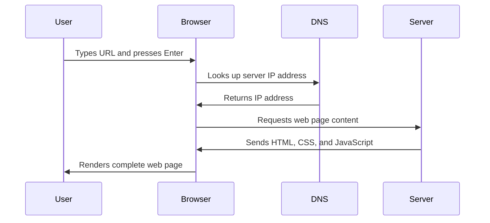

<!--
CO_OP_TRANSLATOR_METADATA:
{
  "original_hash": "33a875c522f237a2026e4653240dfc07",
  "translation_date": "2025-10-24T14:43:29+00:00",
  "source_file": "5-browser-extension/1-about-browsers/README.md",
  "language_code": "ms"
}
-->
# Projek Sambungan Pelayar Bahagian 1: Semua Tentang Pelayar


> Sketchnote oleh [Wassim Chegham](https://dev.to/wassimchegham/ever-wondered-what-happens-when-you-type-in-a-url-in-an-address-bar-in-a-browser-3dob)

## Kuiz Pra-Kuliah

[Kuiz pra-kuliah](https://ff-quizzes.netlify.app/web/quiz/23)

### Pengenalan

Sambungan pelayar adalah aplikasi mini yang meningkatkan pengalaman melayari web anda. Seperti visi asal Tim Berners-Lee tentang web interaktif, sambungan memperluaskan keupayaan pelayar melebihi paparan dokumen biasa. Daripada pengurus kata laluan yang menjaga keselamatan akaun anda hingga pemilih warna yang membantu pereka mendapatkan warna yang sempurna, sambungan menyelesaikan cabaran melayari harian.

Sebelum kita membina sambungan pertama anda, mari kita fahami bagaimana pelayar berfungsi. Sama seperti Alexander Graham Bell perlu memahami penghantaran bunyi sebelum mencipta telefon, mengetahui asas pelayar akan membantu anda mencipta sambungan yang berintegrasi dengan lancar dengan sistem pelayar sedia ada.

Pada akhir pelajaran ini, anda akan memahami seni bina pelayar dan mula membina sambungan pertama anda.

## Memahami Pelayar Web

Pelayar web pada dasarnya adalah penafsir dokumen yang canggih. Apabila anda menaip "google.com" ke dalam bar alamat, pelayar melakukan siri operasi kompleks - meminta kandungan dari pelayan di seluruh dunia, kemudian menganalisis dan memaparkan kod tersebut menjadi halaman web interaktif yang anda lihat.

Proses ini mencerminkan bagaimana pelayar web pertama, WorldWideWeb, direka oleh Tim Berners-Lee pada tahun 1990 untuk menjadikan dokumen berhiperpautan dapat diakses oleh semua orang.

✅ **Sedikit sejarah**: Pelayar pertama dipanggil 'WorldWideWeb' dan dicipta oleh Sir Timothy Berners-Lee pada tahun 1990.


> Beberapa pelayar awal, melalui [Karen McGrane](https://www.slideshare.net/KMcGrane/week-4-ixd-history-personal-computing)

### Bagaimana Pelayar Memproses Kandungan Web

Proses antara memasukkan URL dan melihat halaman web melibatkan beberapa langkah yang diselaraskan yang berlaku dalam beberapa saat:



**Apa yang dicapai oleh proses ini:**
- **Menterjemah** URL yang boleh dibaca manusia kepada alamat IP pelayan melalui pencarian DNS
- **Mewujudkan** sambungan selamat dengan pelayan web menggunakan protokol HTTP atau HTTPS
- **Meminta** kandungan halaman web tertentu dari pelayan
- **Menerima** markup HTML, gaya CSS, dan kod JavaScript dari pelayan
- **Memaparkan** semua kandungan menjadi halaman web interaktif yang anda lihat

### Ciri Teras Pelayar

Pelayar moden menyediakan pelbagai ciri yang boleh dimanfaatkan oleh pembangun sambungan:

| Ciri | Tujuan | Peluang Sambungan |
|------|--------|-------------------|
| **Enjin Pemaparan** | Memaparkan HTML, CSS, dan JavaScript | Pengubahsuaian kandungan, suntikan gaya |
| **Enjin JavaScript** | Melaksanakan kod JavaScript | Skrip tersuai, interaksi API |
| **Storan Tempatan** | Menyimpan data secara tempatan | Pilihan pengguna, data cache |
| **Tumpukan Rangkaian** | Mengendalikan permintaan web | Pemantauan permintaan, analisis data |
| **Model Keselamatan** | Melindungi pengguna daripada kandungan berbahaya | Penapisan kandungan, peningkatan keselamatan |

**Memahami ciri-ciri ini membantu anda:**
- **Mengenal pasti** di mana sambungan anda boleh menambah nilai paling banyak
- **Memilih** API pelayar yang sesuai untuk fungsi sambungan anda
- **Merancang** sambungan yang berfungsi dengan cekap dengan sistem pelayar
- **Memastikan** sambungan anda mengikuti amalan terbaik keselamatan pelayar

### Pertimbangan Pembangunan Merentas Pelayar

Pelayar yang berbeza melaksanakan piawaian dengan sedikit variasi, sama seperti bagaimana bahasa pengaturcaraan yang berbeza mungkin mengendalikan algoritma yang sama secara berbeza. Chrome, Firefox, dan Safari masing-masing mempunyai ciri unik yang perlu dipertimbangkan oleh pembangun semasa pembangunan sambungan.

> 💡 **Petua Pro**: Gunakan [caniuse.com](https://www.caniuse.com) untuk memeriksa teknologi web mana yang disokong di pelbagai pelayar. Ini sangat berguna semasa merancang ciri sambungan anda!

**Pertimbangan utama untuk pembangunan sambungan:**
- **Uji** sambungan anda di pelayar Chrome, Firefox, dan Edge
- **Sesuaikan** dengan API sambungan pelayar dan format manifest yang berbeza
- **Tangani** ciri prestasi dan had yang berbeza
- **Sediakan** alternatif untuk ciri khusus pelayar yang mungkin tidak tersedia

✅ **Wawasan Analitik**: Anda boleh menentukan pelayar mana yang lebih disukai oleh pengguna anda dengan memasang pakej analitik dalam projek pembangunan web anda. Data ini membantu anda memprioritaskan pelayar mana yang perlu disokong terlebih dahulu.

## Memahami Sambungan Pelayar

Sambungan pelayar menyelesaikan cabaran melayari web biasa dengan menambah fungsi secara langsung ke antara muka pelayar. Daripada memerlukan aplikasi berasingan atau aliran kerja yang kompleks, sambungan menyediakan akses segera kepada alat dan ciri.

Konsep ini mencerminkan bagaimana perintis komputer awal seperti Douglas Engelbart membayangkan mempertingkatkan keupayaan manusia dengan teknologi - sambungan mempertingkatkan fungsi asas pelayar anda.

**Kategori sambungan popular dan manfaatnya:**
- **Alat Produktiviti**: Pengurus tugas, aplikasi mencatat nota, dan penjejak masa yang membantu anda kekal teratur
- **Peningkatan Keselamatan**: Pengurus kata laluan, penyekat iklan, dan alat privasi yang melindungi data anda
- **Alat Pembangun**: Pemformat kod, pemilih warna, dan utiliti penyahpepijat yang memudahkan pembangunan
- **Peningkatan Kandungan**: Mod membaca, pemuat turun video, dan alat tangkapan skrin yang meningkatkan pengalaman web anda

✅ **Soalan Refleksi**: Apakah sambungan pelayar kegemaran anda? Apakah tugas khusus yang mereka lakukan, dan bagaimana mereka meningkatkan pengalaman melayari anda?

## Memasang dan Mengurus Sambungan

Memahami proses pemasangan sambungan membantu anda menjangkakan pengalaman pengguna apabila orang memasang sambungan anda. Proses pemasangan adalah standard di pelayar moden, dengan sedikit variasi dalam reka bentuk antara muka.


> **Penting**: Pastikan untuk mengaktifkan mod pembangun dan benarkan sambungan dari kedai lain semasa menguji sambungan anda sendiri.

### Proses Pemasangan Sambungan Pembangunan

Apabila anda sedang membangun dan menguji sambungan anda sendiri, ikuti aliran kerja ini:

```bash
# Step 1: Build your extension
npm run build
```

**Apa yang dicapai oleh arahan ini:**
- **Menyusun** kod sumber anda menjadi fail yang sedia untuk pelayar
- **Menggabungkan** modul JavaScript ke dalam pakej yang dioptimumkan
- **Menjana** fail sambungan akhir dalam folder `/dist`
- **Menyediakan** sambungan anda untuk pemasangan dan ujian

**Langkah 2: Navigasi ke Sambungan Pelayar**
1. **Buka** halaman pengurusan sambungan pelayar anda
2. **Klik** butang "Tetapan dan lebih lagi" (ikon `...`) di bahagian atas kanan
3. **Pilih** "Sambungan" dari menu dropdown

**Langkah 3: Muatkan Sambungan Anda**
- **Untuk pemasangan baru**: Pilih `load unpacked` dan pilih folder `/dist` anda
- **Untuk kemas kini**: Klik `reload` di sebelah sambungan yang telah dipasang
- **Untuk ujian**: Aktifkan "Mod Pembangun" untuk mengakses ciri penyahpepijat tambahan

### Pemasangan Sambungan Produksi

> ✅ **Nota**: Arahan pembangunan ini khusus untuk sambungan yang anda bina sendiri. Untuk memasang sambungan yang diterbitkan, lawati kedai sambungan pelayar rasmi seperti [Microsoft Edge Add-ons store](https://microsoftedge.microsoft.com/addons/Microsoft-Edge-Extensions-Home).

**Memahami perbezaannya:**
- **Pemasangan pembangunan** membolehkan anda menguji sambungan yang belum diterbitkan semasa pembangunan
- **Pemasangan dari kedai** menyediakan sambungan yang telah disemak, diterbitkan dengan kemas kini automatik
- **Sideloading** membolehkan pemasangan sambungan dari luar kedai rasmi (memerlukan mod pembangun)

## Membina Sambungan Jejak Karbon Anda

Kami akan mencipta sambungan pelayar yang memaparkan jejak karbon penggunaan tenaga di kawasan anda. Projek ini menunjukkan konsep pembangunan sambungan penting sambil mencipta alat praktikal untuk kesedaran alam sekitar.

Pendekatan ini mengikuti prinsip "belajar dengan melakukan" yang terbukti berkesan sejak teori pendidikan John Dewey - menggabungkan kemahiran teknikal dengan aplikasi dunia nyata yang bermakna.

### Keperluan Projek

Sebelum memulakan pembangunan, mari kumpulkan sumber dan keperluan yang diperlukan:

**Akses API Diperlukan:**
- **[Kunci API CO2 Signal](https://www.co2signal.com/)**: Masukkan alamat e-mel anda untuk menerima kunci API percuma anda
- **[Kod kawasan](http://api.electricitymap.org/v3/zones)**: Cari kod kawasan anda menggunakan [Peta Elektrik](https://www.electricitymap.org/map) (contohnya, Boston menggunakan 'US-NEISO')

**Alat Pembangunan:**
- **[Node.js dan NPM](https://www.npmjs.com)**: Alat pengurusan pakej untuk memasang keperluan projek
- **[Kod permulaan](../../../../5-browser-extension/start)**: Muat turun folder `start` untuk memulakan pembangunan

✅ **Ketahui Lebih Lanjut**: Tingkatkan kemahiran pengurusan pakej anda dengan [modul pembelajaran komprehensif ini](https://docs.microsoft.com/learn/modules/create-nodejs-project-dependencies/?WT.mc_id=academic-77807-sagibbon)

### Memahami Struktur Projek

Memahami struktur projek membantu mengatur kerja pembangunan dengan cekap. Seperti bagaimana Perpustakaan Alexandria diatur untuk pengambilan pengetahuan yang mudah, pangkalan kod yang terstruktur dengan baik menjadikan pembangunan lebih efisien:

```
project-root/
├── dist/                    # Built extension files
│   ├── manifest.json        # Extension configuration
│   ├── index.html           # User interface markup
│   ├── background.js        # Background script functionality
│   └── main.js              # Compiled JavaScript bundle
└── src/                     # Source development files
    └── index.js             # Your main JavaScript code
```

**Memecahkan apa yang dicapai oleh setiap fail:**
- **`manifest.json`**: **Menentukan** metadata sambungan, kebenaran, dan titik masuk
- **`index.html`**: **Mencipta** antara muka pengguna yang muncul apabila pengguna mengklik sambungan anda
- **`background.js`**: **Mengendalikan** tugas latar belakang dan pendengar acara pelayar
- **`main.js`**: **Mengandungi** kod JavaScript akhir yang digabungkan selepas proses binaan
- **`src/index.js`**: **Menyimpan** kod pembangunan utama anda yang akan disusun menjadi `main.js`

> 💡 **Petua Organisasi**: Simpan kunci API dan kod kawasan anda dalam nota yang selamat untuk rujukan mudah semasa pembangunan. Anda akan memerlukan nilai-nilai ini untuk menguji fungsi sambungan anda.

✅ **Nota Keselamatan**: Jangan sekali-kali memasukkan kunci API atau kelayakan sensitif ke dalam repositori kod anda. Kami akan menunjukkan cara mengendalikannya dengan selamat dalam langkah seterusnya.

## Mencipta Antara Muka Sambungan

Sekarang kita akan membina komponen antara muka pengguna. Sambungan ini menggunakan pendekatan dua skrin: skrin konfigurasi untuk persediaan awal dan skrin hasil untuk paparan data.

Ini mengikuti prinsip pendedahan progresif yang digunakan dalam reka bentuk antara muka sejak zaman awal pengkomputeran - mendedahkan maklumat dan pilihan dalam urutan logik untuk mengelakkan pengguna berasa terbeban.

### Gambaran Keseluruhan Paparan Sambungan

**Paparan Persediaan** - Konfigurasi pengguna kali pertama:


**Paparan Hasil** - Paparan data jejak karbon:


### Membina Borang Konfigurasi

Borang persediaan mengumpulkan data konfigurasi pengguna semasa penggunaan awal. Setelah dikonfigurasi, maklumat ini akan disimpan dalam storan pelayar untuk sesi masa depan.

Dalam fail `/dist/index.html`, tambahkan struktur borang ini:

```html
<form class="form-data" autocomplete="on">
    <div>
        <h2>New? Add your Information</h2>
    </div>
    <div>
        <label for="region">Region Name</label>
        <input type="text" id="region" required class="region-name" />
    </div>
    <div>
        <label for="api">Your API Key from tmrow</label>
        <input type="text" id="api" required class="api-key" />
    </div>
    <button class="search-btn">Submit</button>
</form>
```

**Apa yang dicapai oleh borang ini:**
- **Mencipta** struktur borang semantik dengan label yang sesuai dan persatuan input
- **Mengaktifkan** fungsi autolengkap pelayar untuk pengalaman pengguna yang lebih baik
- **Memerlukan** kedua-dua medan diisi sebelum penyerahan menggunakan atribut `required`
- **Mengatur** input dengan nama kelas deskriptif untuk memudahkan penggayaan dan penargetan JavaScript
- **Menyediakan** arahan yang jelas untuk pengguna yang sedang menyediakan sambungan buat kali pertama

### Membina Paparan Hasil

Seterusnya, cipta kawasan hasil yang akan memaparkan data jejak karbon. Tambahkan HTML ini di bawah borang:

```html
<div class="result">
    <div class="loading">loading...</div>
    <div class="errors"></div>
    <div class="data"></div>
    <div class="result-container">
        <p><strong>Region: </strong><span class="my-region"></span></p>
        <p><strong>Carbon Usage: </strong><span class="carbon-usage"></span></p>
        <p><strong>Fossil Fuel Percentage: </strong><span class="fossil-fuel"></span></p>
    </div>
    <button class="clear-btn">Change region</button>
</div>
```

**Memecahkan apa yang disediakan oleh struktur ini:**
- **`loading`**: **Memaparkan** mesej pemuatan semasa data API sedang diambil
- **`errors`**: **Menunjukkan** mesej ralat jika panggilan API gagal atau data tidak sah
- **`data`**: **Menyimpan** data mentah untuk tujuan penyahpepijat semasa pembangunan
- **`result-container`**: **Memaparkan** maklumat jejak karbon yang diformat kepada pengguna
- **`clear-btn`**: **Membolehkan** pengguna menukar kawasan mereka dan mengkonfigurasi semula sambungan

### Menyediakan Proses Binaan

Sekarang mari kita pasang keperluan projek dan uji proses binaan:

```bash
npm install
```

**Apa yang dicapai oleh proses pemasangan ini:**
- **Memuat turun** Webpack dan keperluan pembangunan lain yang dinyatakan dalam `package.json`
- **Mengkonfigurasi** rantaian alat binaan untuk menyusun JavaScript moden
- **Menyediakan** persekitaran pembangunan untuk membina dan menguji sambungan
- **Mengaktifkan** ciri penggabungan kod, pengoptimuman, dan keserasian merentas pelayar

> 💡 **Wawasan Proses Binaan**: Webpack menggabungkan kod sumber anda dari `/src/index.js` ke dalam `/dist/main.js`. Proses ini mengoptimumkan kod anda untuk produksi dan memastikan keserasian pelayar.

### Menguji Kemajuan Anda

Pada tahap ini, anda boleh menguji sambungan anda:

1. **Jalankan** arahan binaan untuk menyusun kod anda
2. **Muatkan** sambungan ke dalam pelayar anda menggunakan mod pembangun
3. **Sahkan** bahawa borang dipaparkan dengan betul dan kelihatan profesional
4. **Periksa** bahawa semua elemen borang sejajar dengan betul dan berfungsi

**Apa yang telah anda capai:**
- **Membina** struktur HTML asas untuk sambungan anda
- **Mencipta** antara muka konfigurasi dan hasil dengan markup semantik yang betul
- **Menyiapkan** aliran kerja pembangunan moden menggunakan alat standard industri
- **Menyediakan** asas untuk menambah fungsi interaktif JavaScript

Anda telah menyelesaikan fasa pertama pembangunan sambungan pelayar. Seperti bagaimana Wright bersaudara perlu memahami aerodinamik sebelum mencapai penerbangan, memahami konsep asas ini mempersiapkan anda untuk membina ciri interaktif yang lebih kompleks dalam pelajaran seterusnya.

## Cabaran Ejen GitHub Copilot 🚀

Gunakan mod Ejen untuk menyelesaikan cabaran berikut:
**Deskripsi:** Tingkatkan sambungan pelayar dengan menambah ciri pengesahan borang dan maklum balas pengguna untuk memperbaiki pengalaman pengguna semasa memasukkan kunci API dan kod wilayah.

**Arahan:** Buat fungsi pengesahan JavaScript yang memeriksa sama ada medan kunci API mengandungi sekurang-kurangnya 20 aksara dan sama ada kod wilayah mengikuti format yang betul (seperti 'US-NEISO'). Tambahkan maklum balas visual dengan menukar warna sempadan input kepada hijau untuk input yang sah dan merah untuk input yang tidak sah. Juga tambahkan ciri togol untuk menunjukkan/sembunyikan kunci API demi keselamatan.

Ketahui lebih lanjut tentang [mod ejen](https://code.visualstudio.com/blogs/2025/02/24/introducing-copilot-agent-mode) di sini.

## 🚀 Cabaran

Lihat kedai sambungan pelayar dan pasang satu ke pelayar anda. Anda boleh memeriksa failnya dengan cara yang menarik. Apa yang anda temui?

## Kuiz Selepas Kuliah

[Kuiz selepas kuliah](https://ff-quizzes.netlify.app/web/quiz/24)

## Ulasan & Kajian Kendiri

Dalam pelajaran ini, anda telah belajar sedikit tentang sejarah pelayar web; ambil peluang ini untuk mengetahui bagaimana pencipta World Wide Web membayangkan penggunaannya dengan membaca lebih lanjut tentang sejarahnya. Beberapa laman web yang berguna termasuk:

[Sejarah Pelayar Web](https://www.mozilla.org/firefox/browsers/browser-history/)

[Sejarah Web](https://webfoundation.org/about/vision/history-of-the-web/)

[Temu bual dengan Tim Berners-Lee](https://www.theguardian.com/technology/2019/mar/12/tim-berners-lee-on-30-years-of-the-web-if-we-dream-a-little-we-can-get-the-web-we-want)

## Tugasan 

[Ubah suai sambungan anda](assignment.md)

---

**Penafian**:  
Dokumen ini telah diterjemahkan menggunakan perkhidmatan terjemahan AI [Co-op Translator](https://github.com/Azure/co-op-translator). Walaupun kami berusaha untuk ketepatan, sila ambil perhatian bahawa terjemahan automatik mungkin mengandungi kesilapan atau ketidaktepatan. Dokumen asal dalam bahasa asalnya harus dianggap sebagai sumber yang berwibawa. Untuk maklumat kritikal, terjemahan manusia profesional adalah disyorkan. Kami tidak bertanggungjawab atas sebarang salah faham atau salah tafsir yang timbul daripada penggunaan terjemahan ini.