# Projek Sambungan Penyemak Imbas Bahagian 1: Semua Tentang Penyemak Imbas

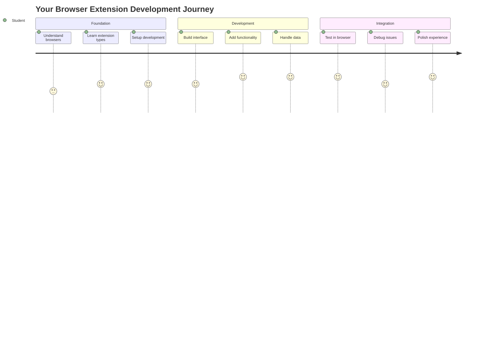

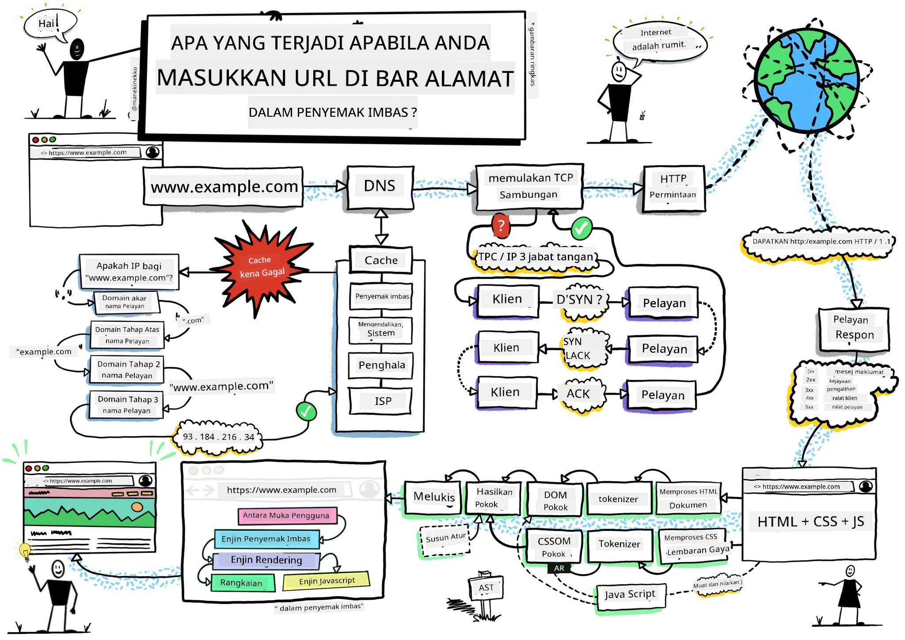
> Sketchnote oleh [Wassim Chegham](https://dev.to/wassimchegham/ever-wondered-what-happens-when-you-type-in-a-url-in-an-address-bar-in-a-browser-3dob)

## Kuiz Pra-Kuliah

[Kuiz pra-kuliah](https://ff-quizzes.netlify.app/web/quiz/23)

### Pengenalan

Sambungan penyemak imbas adalah aplikasi mini yang meningkatkan pengalaman melayari web anda. Seperti visi asal Tim Berners-Lee tentang web interaktif, sambungan memperluaskan keupayaan penyemak imbas melebihi paparan dokumen biasa. Daripada pengurus kata laluan yang memastikan akaun anda selamat kepada pemilih warna yang membantu pereka mendapatkan warna yang sempurna, sambungan menyelesaikan cabaran melayari harian.

Sebelum kita membina sambungan pertama anda, mari kita fahami bagaimana penyemak imbas berfungsi. Sama seperti Alexander Graham Bell perlu memahami penghantaran bunyi sebelum mencipta telefon, mengetahui asas penyemak imbas akan membantu anda mencipta sambungan yang berintegrasi dengan lancar dengan sistem penyemak imbas sedia ada.

Menjelang akhir pelajaran ini, anda akan memahami seni bina penyemak imbas dan telah mula membina sambungan pertama anda.

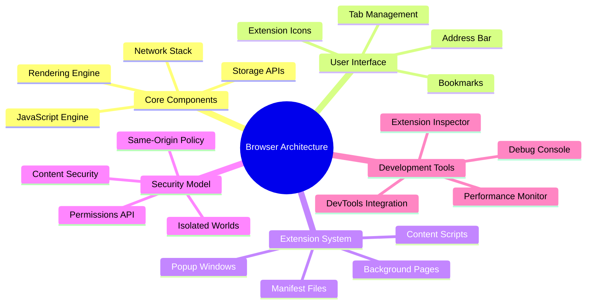

## Memahami Penyemak Imbas Web

Penyemak imbas web pada dasarnya adalah penafsir dokumen yang canggih. Apabila anda menaip "google.com" ke dalam bar alamat, penyemak imbas menjalankan siri operasi yang kompleks - meminta kandungan daripada pelayan di seluruh dunia, kemudian menganalisis dan memaparkan kod tersebut menjadi halaman web interaktif yang anda lihat.

Proses ini mencerminkan bagaimana penyemak imbas pertama, WorldWideWeb, direka oleh Tim Berners-Lee pada tahun 1990 untuk menjadikan dokumen berhiperpautan boleh diakses oleh semua orang.

✅ **Sedikit sejarah**: Penyemak imbas pertama dipanggil 'WorldWideWeb' dan dicipta oleh Sir Timothy Berners-Lee pada tahun 1990.

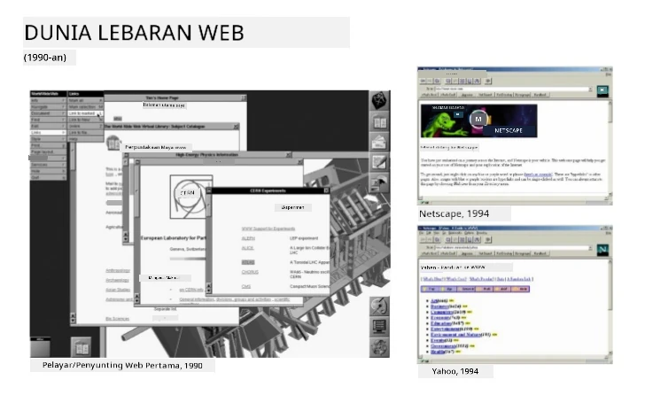
> Beberapa penyemak imbas awal, melalui [Karen McGrane](https://www.slideshare.net/KMcGrane/week-4-ixd-history-personal-computing)

### Bagaimana Penyemak Imbas Memproses Kandungan Web

Proses antara memasukkan URL dan melihat halaman web melibatkan beberapa langkah yang diselaraskan yang berlaku dalam beberapa saat:

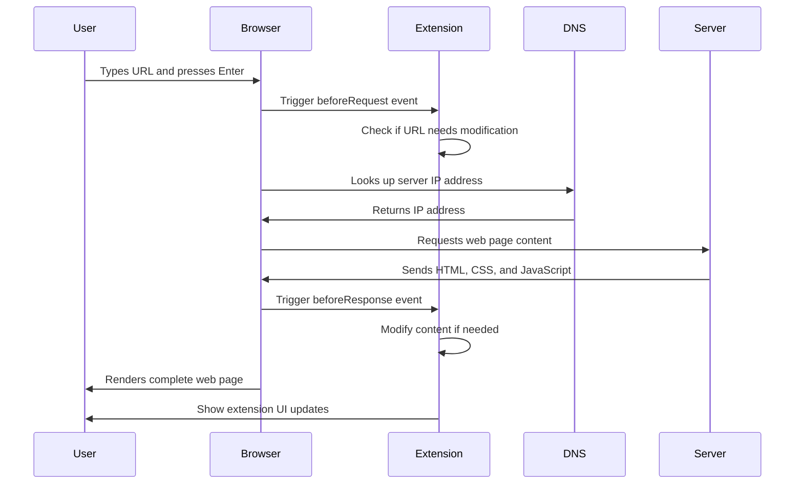

**Inilah yang dicapai oleh proses ini:**
- **Menterjemah** URL yang boleh dibaca manusia kepada alamat IP pelayan melalui pencarian DNS
- **Menjalin** sambungan selamat dengan pelayan web menggunakan protokol HTTP atau HTTPS
- **Meminta** kandungan halaman web tertentu daripada pelayan
- **Menerima** markup HTML, gaya CSS, dan kod JavaScript daripada pelayan
- **Memaparkan** semua kandungan ke dalam halaman web interaktif yang anda lihat

### Ciri Teras Penyemak Imbas

Penyemak imbas moden menyediakan pelbagai ciri yang boleh dimanfaatkan oleh pembangun sambungan:

| Ciri | Tujuan | Peluang Sambungan |
|------|--------|-------------------|
| **Enjin Pemaparan** | Memaparkan HTML, CSS, dan JavaScript | Pengubahsuaian kandungan, suntikan gaya |
| **Enjin JavaScript** | Melaksanakan kod JavaScript | Skrip tersuai, interaksi API |
| **Storan Tempatan** | Menyimpan data secara tempatan | Keutamaan pengguna, data cache |
| **Tumpukan Rangkaian** | Mengendalikan permintaan web | Pemantauan permintaan, analisis data |
| **Model Keselamatan** | Melindungi pengguna daripada kandungan berbahaya | Penapisan kandungan, peningkatan keselamatan |

**Memahami ciri-ciri ini membantu anda:**
- **Mengenal pasti** di mana sambungan anda boleh menambah nilai paling banyak
- **Memilih** API penyemak imbas yang sesuai untuk fungsi sambungan anda
- **Mereka bentuk** sambungan yang berfungsi dengan cekap dengan sistem penyemak imbas
- **Memastikan** sambungan anda mengikuti amalan terbaik keselamatan penyemak imbas

### Pertimbangan Pembangunan Merentas Penyemak Imbas

Penyemak imbas yang berbeza melaksanakan piawaian dengan sedikit variasi, sama seperti bagaimana bahasa pengaturcaraan yang berbeza mungkin mengendalikan algoritma yang sama secara berbeza. Chrome, Firefox, dan Safari masing-masing mempunyai ciri unik yang perlu dipertimbangkan oleh pembangun semasa pembangunan sambungan.

> 💡 **Petua Pro**: Gunakan [caniuse.com](https://www.caniuse.com) untuk memeriksa teknologi web mana yang disokong merentas penyemak imbas yang berbeza. Ini sangat berguna semasa merancang ciri sambungan anda!

**Pertimbangan utama untuk pembangunan sambungan:**
- **Uji** sambungan anda merentas penyemak imbas Chrome, Firefox, dan Edge
- **Sesuaikan** dengan API sambungan penyemak imbas dan format manifest yang berbeza
- **Tangani** ciri prestasi dan batasan yang berbeza
- **Sediakan** alternatif untuk ciri khusus penyemak imbas yang mungkin tidak tersedia

✅ **Wawasan Analitik**: Anda boleh menentukan penyemak imbas mana yang lebih disukai oleh pengguna anda dengan memasang pakej analitik dalam projek pembangunan web anda. Data ini membantu anda memprioritaskan penyemak imbas mana yang perlu disokong terlebih dahulu.

## Memahami Sambungan Penyemak Imbas

Sambungan penyemak imbas menyelesaikan cabaran melayari web biasa dengan menambah fungsi terus ke antara muka penyemak imbas. Daripada memerlukan aplikasi berasingan atau aliran kerja yang kompleks, sambungan menyediakan akses segera kepada alat dan ciri.

Konsep ini mencerminkan bagaimana perintis komputer awal seperti Douglas Engelbart membayangkan meningkatkan keupayaan manusia dengan teknologi - sambungan meningkatkan fungsi asas penyemak imbas anda.

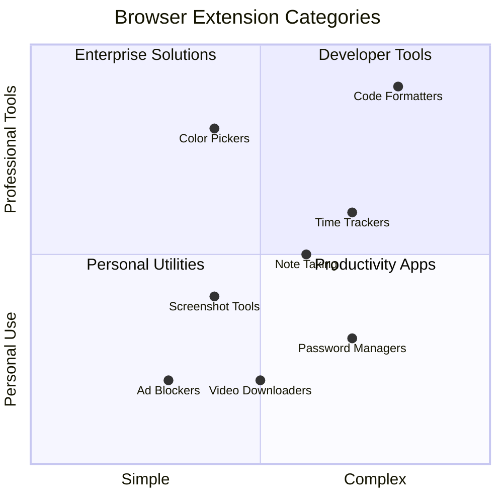

**Kategori sambungan popular dan manfaatnya:**
- **Alat Produktiviti**: Pengurus tugas, aplikasi mencatat nota, dan penjejak masa yang membantu anda kekal teratur
- **Peningkatan Keselamatan**: Pengurus kata laluan, penyekat iklan, dan alat privasi yang melindungi data anda
- **Alat Pembangun**: Pemformat kod, pemilih warna, dan utiliti penyahpepijat yang memudahkan pembangunan
- **Peningkatan Kandungan**: Mod membaca, pemuat turun video, dan alat tangkapan skrin yang meningkatkan pengalaman web anda

✅ **Soalan Refleksi**: Apakah sambungan penyemak imbas kegemaran anda? Apakah tugas khusus yang mereka lakukan, dan bagaimana mereka meningkatkan pengalaman melayari anda?

### 🔄 **Pemeriksaan Pedagogi**
**Pemahaman Seni Bina Penyemak Imbas**: Sebelum beralih kepada pembangunan sambungan, pastikan anda boleh:
- ✅ Terangkan bagaimana penyemak imbas memproses permintaan web dan memaparkan kandungan
- ✅ Kenal pasti komponen utama seni bina penyemak imbas
- ✅ Fahami bagaimana sambungan berintegrasi dengan fungsi penyemak imbas
- ✅ Kenali model keselamatan yang melindungi pengguna

**Ujian Kendiri Cepat**: Bolehkah anda menjejaki laluan dari menaip URL hingga melihat halaman web?
1. **Pencarian DNS** menukar URL kepada alamat IP
2. **Permintaan HTTP** mendapatkan kandungan daripada pelayan
3. **Penganalisisan** memproses HTML, CSS, dan JavaScript
4. **Pemaparan** memaparkan halaman web akhir
5. **Sambungan** boleh mengubah kandungan pada pelbagai langkah

## Memasang dan Mengurus Sambungan

Memahami proses pemasangan sambungan membantu anda menjangkakan pengalaman pengguna apabila orang memasang sambungan anda. Proses pemasangan adalah standard merentas penyemak imbas moden, dengan sedikit variasi dalam reka bentuk antara muka.

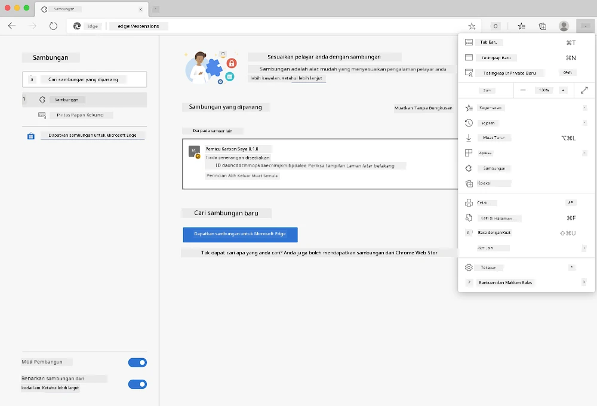

> **Penting**: Pastikan untuk menghidupkan mod pembangun dan benarkan sambungan daripada kedai lain semasa menguji sambungan anda sendiri.

### Proses Pemasangan Sambungan Pembangunan

Apabila anda sedang membangun dan menguji sambungan anda sendiri, ikuti aliran kerja ini:

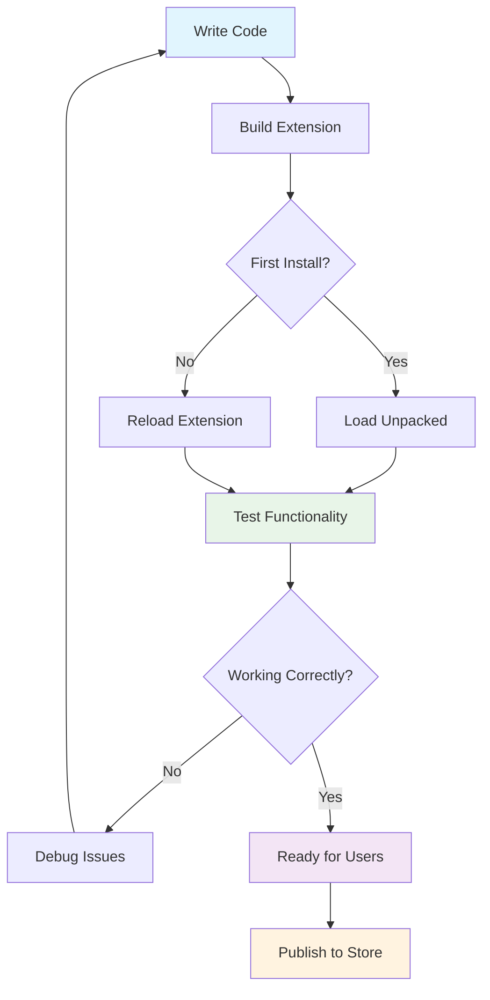

```bash
# Step 1: Build your extension
npm run build
```

**Apa yang dicapai oleh arahan ini:**
- **Menyusun** kod sumber anda ke dalam fail yang sedia untuk penyemak imbas
- **Menggabungkan** modul JavaScript ke dalam pakej yang dioptimumkan
- **Menjana** fail sambungan akhir dalam folder `/dist`
- **Menyediakan** sambungan anda untuk pemasangan dan pengujian

**Langkah 2: Navigasi ke Sambungan Penyemak Imbas**
1. **Buka** halaman pengurusan sambungan penyemak imbas anda
2. **Klik** butang "Tetapan dan banyak lagi" (ikon `...`) di bahagian atas kanan
3. **Pilih** "Sambungan" daripada menu dropdown

**Langkah 3: Muatkan Sambungan Anda**
- **Untuk pemasangan baru**: Pilih `load unpacked` dan pilih folder `/dist` anda
- **Untuk kemas kini**: Klik `reload` di sebelah sambungan yang telah dipasang
- **Untuk pengujian**: Aktifkan "Mod Pembangun" untuk mengakses ciri penyahpepijat tambahan

### Pemasangan Sambungan Pengeluaran

> ✅ **Nota**: Arahan pembangunan ini khusus untuk sambungan yang anda bina sendiri. Untuk memasang sambungan yang diterbitkan, lawati kedai sambungan penyemak imbas rasmi seperti [Microsoft Edge Add-ons store](https://microsoftedge.microsoft.com/addons/Microsoft-Edge-Extensions-Home).

**Memahami perbezaannya:**
- **Pemasangan pembangunan** membolehkan anda menguji sambungan yang belum diterbitkan semasa pembangunan
- **Pemasangan kedai** menyediakan sambungan yang telah disahkan, diterbitkan dengan kemas kini automatik
- **Sideloading** membolehkan pemasangan sambungan dari luar kedai rasmi (memerlukan mod pembangun)

## Membina Sambungan Jejak Karbon Anda

Kami akan mencipta sambungan penyemak imbas yang memaparkan jejak karbon penggunaan tenaga di kawasan anda. Projek ini menunjukkan konsep pembangunan sambungan penting sambil mencipta alat praktikal untuk kesedaran alam sekitar.

Pendekatan ini mengikuti prinsip "belajar dengan melakukan" yang telah terbukti berkesan sejak teori pendidikan John Dewey - menggabungkan kemahiran teknikal dengan aplikasi dunia nyata yang bermakna.

### Keperluan Projek

Sebelum memulakan pembangunan, mari kumpulkan sumber dan kebergantungan yang diperlukan:

**Akses API Diperlukan:**
- **[Kunci API CO2 Signal](https://www.co2signal.com/)**: Masukkan alamat e-mel anda untuk menerima kunci API percuma anda
- **[Kod kawasan](http://api.electricitymap.org/v3/zones)**: Cari kod kawasan anda menggunakan [Electricity Map](https://www.electricitymap.org/map) (contohnya, Boston menggunakan 'US-NEISO')

**Alat Pembangunan:**
- **[Node.js dan NPM](https://www.npmjs.com)**: Alat pengurusan pakej untuk memasang kebergantungan projek
- **[Kod permulaan](../../../../5-browser-extension/start)**: Muat turun folder `start` untuk memulakan pembangunan

✅ **Ketahui Lebih Lanjut**: Tingkatkan kemahiran pengurusan pakej anda dengan [modul pembelajaran komprehensif ini](https://docs.microsoft.com/learn/modules/create-nodejs-project-dependencies/?WT.mc_id=academic-77807-sagibbon)

### Memahami Struktur Projek

Memahami struktur projek membantu mengatur kerja pembangunan dengan cekap. Seperti bagaimana Perpustakaan Alexandria diatur untuk pengambilan pengetahuan yang mudah, pangkalan kod yang terstruktur dengan baik menjadikan pembangunan lebih cekap:

```
project-root/
├── dist/                    # Built extension files
│   ├── manifest.json        # Extension configuration
│   ├── index.html           # User interface markup
│   ├── background.js        # Background script functionality
│   └── main.js              # Compiled JavaScript bundle
├── src/                     # Source development files
│   └── index.js             # Your main JavaScript code
├── package.json             # Project dependencies and scripts
└── webpack.config.js        # Build configuration
```

**Memecahkan apa yang dicapai oleh setiap fail:**
- **`manifest.json`**: **Mentakrifkan** metadata sambungan, kebenaran, dan titik masuk
- **`index.html`**: **Mencipta** antara muka pengguna yang muncul apabila pengguna mengklik sambungan anda
- **`background.js`**: **Mengendalikan** tugas latar belakang dan pendengar acara penyemak imbas
- **`main.js`**: **Mengandungi** JavaScript akhir yang digabungkan selepas proses binaan
- **`src/index.js`**: **Menyimpan** kod pembangunan utama anda yang disusun ke dalam `main.js`

> 💡 **Petua Organisasi**: Simpan kunci API dan kod kawasan anda dalam nota selamat untuk rujukan mudah semasa pembangunan. Anda akan memerlukan nilai ini untuk menguji fungsi sambungan anda.

✅ **Nota Keselamatan**: Jangan sekali-kali komit kunci API atau kelayakan sensitif ke repositori kod anda. Kami akan menunjukkan kepada anda cara mengendalikannya dengan selamat dalam langkah seterusnya.

## Mencipta Antara Muka Sambungan

Sekarang kita akan membina komponen antara muka pengguna. Sambungan menggunakan pendekatan dua skrin: skrin konfigurasi untuk persediaan awal dan skrin hasil untuk paparan data.

Ini mengikuti prinsip pendedahan progresif yang digunakan dalam reka bentuk antara muka sejak zaman awal pengkomputeran - mendedahkan maklumat dan pilihan dalam urutan logik untuk mengelakkan pengguna berasa terbeban.

### Gambaran Keseluruhan Paparan Sambungan

**Paparan Persediaan** - Konfigurasi pengguna kali pertama:
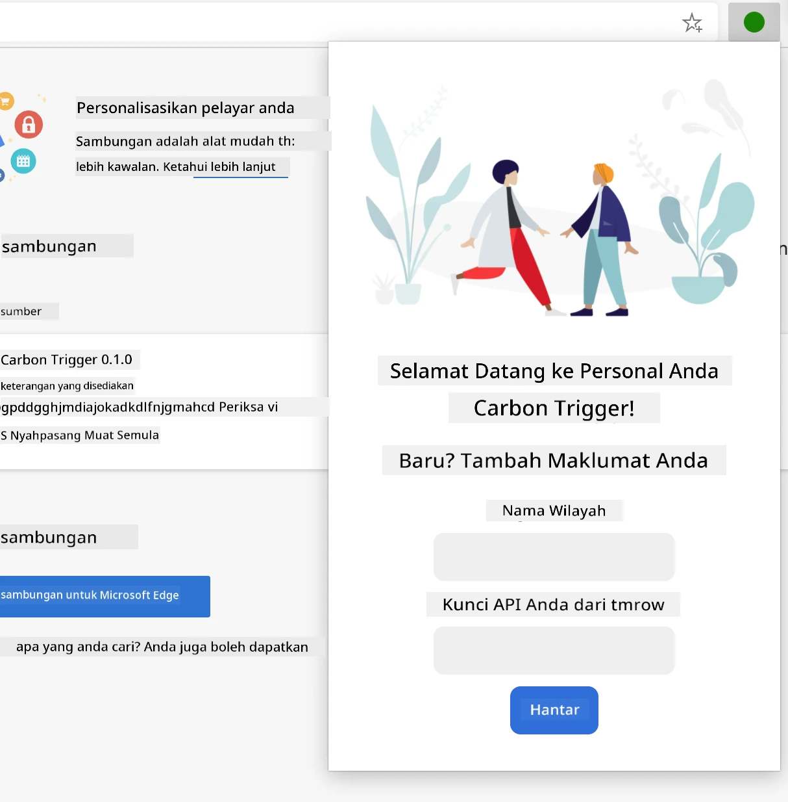

**Paparan Hasil** - Paparan data jejak karbon:
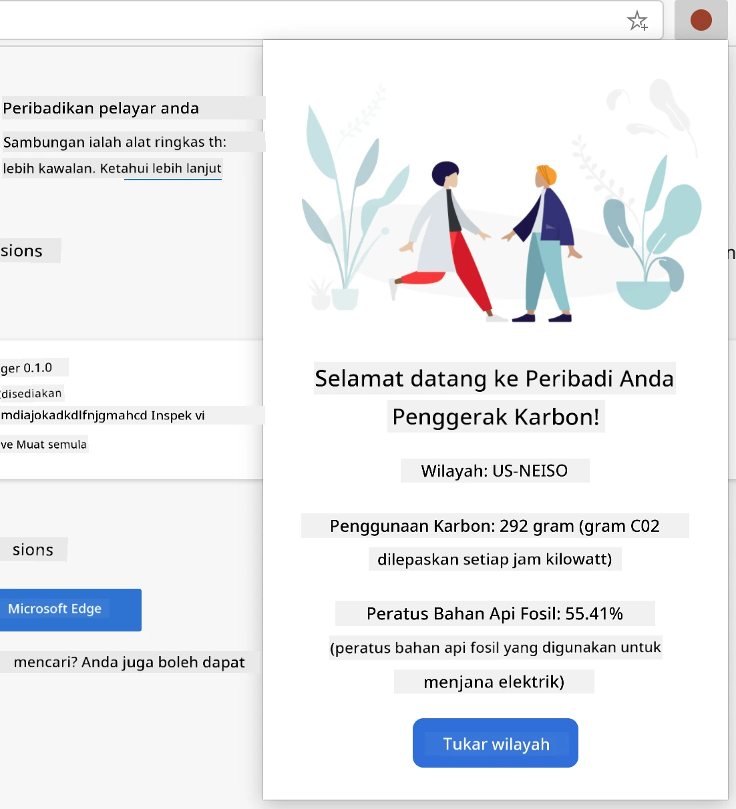

### Membina Borang Konfigurasi

Borang persediaan mengumpulkan data konfigurasi pengguna semasa penggunaan awal. Setelah dikonfigurasi, maklumat ini kekal dalam storan penyemak imbas untuk sesi masa depan.

Dalam fail `/dist/index.html`, tambahkan struktur borang ini:

```html
<form class="form-data" autocomplete="on">
    <div>
        <h2>New? Add your Information</h2>
    </div>
    <div>
        <label for="region">Region Name</label>
        <input type="text" id="region" required class="region-name" />
    </div>
    <div>
        <label for="api">Your API Key from tmrow</label>
        <input type="text" id="api" required class="api-key" />
    </div>
    <button class="search-btn">Submit</button>
</form>
```

**Inilah yang dicapai oleh borang ini:**
- **Mencipta** struktur borang semantik dengan label dan persatuan input yang betul
- **Mengaktifkan** fungsi autolengkap penyemak imbas untuk pengalaman pengguna yang lebih baik
- **Memerlukan** kedua-dua medan diisi sebelum penyerahan menggunakan atribut `required`
- **Mengatur** input dengan nama kelas deskriptif untuk penggayaan dan penargetan JavaScript yang mudah
- **Menyediakan** arahan yang jelas untuk pengguna yang sedang menyediakan sambungan buat kali pertama

### Membina Paparan Hasil

Seterusnya, cipta kawasan hasil yang akan menunjukkan data jejak karbon. Tambahkan HTML ini di bawah borang:

```html
<div class="result">
    <div class="loading">loading...</div>
    <div class="errors"></div>
    <div class="data"></div>
    <div class="result-container">
        <p><strong>Region: </strong><span class="my-region"></span></p>
        <p><strong>Carbon Usage: </strong><span class="carbon-usage"></span></p>
        <p><strong>Fossil Fuel Percentage: </strong><span class="fossil-fuel"></span></p>
    </div>
    <button class="clear-btn">Change region</button>
</div>
```

**Memecahkan apa yang disediakan oleh struktur ini:**
- **`loading`**: **Memaparkan** mesej pemuatan semasa data API sedang diambil
- **`errors`**: **Menunjukkan** mesej ralat jika panggilan API gagal atau data tidak sah
- **`data`**: **Menyimpan** data mentah untuk tujuan penyahpepijatan semasa pembangunan
- **`result-container`**: **Menyampaikan** maklumat jejak karbon yang diformat kepada pengguna
- **`clear-btn`**: **Membolehkan** pengguna menukar kawasan mereka dan mengkonfigurasi semula sambungan

### Menyediakan Proses Binaan

Sekarang mari pasang kebergantungan projek dan uji proses binaan:

```bash
npm install
```

**Apa yang dicapai oleh proses pemasangan ini:**
- **Memuat turun** Webpack dan kebergantungan pembangunan lain yang dinyatakan dalam `package.json`
- **Mengkonfigurasi** alat binaan untuk menyusun JavaScript moden
- **Menyediakan** persekitaran pembangunan untuk membina dan menguji sambungan
- **Mengaktifkan** penggabungan kod, pengoptimuman, dan ciri keserasian merentas penyemak imbas

> 💡 **Wawasan Proses Binaan**: Webpack menggabungkan kod sumber anda dari `/src/index.js` ke dalam `/dist/main.js`. Proses ini mengoptimumkan kod anda untuk pengeluaran dan memastikan keserasian penyemak imbas.

### Menguji Kemajuan Anda

Pada tahap ini, anda boleh menguji sambungan anda:
1. **Jalankan** arahan bina untuk menyusun kod anda  
2. **Muatkan** sambungan ke dalam pelayar anda menggunakan mod pembangun  
3. **Pastikan** borang dipaparkan dengan betul dan kelihatan profesional  
4. **Periksa** semua elemen borang sejajar dengan baik dan berfungsi  

**Apa yang telah anda capai:**  
- **Membina** struktur asas HTML untuk sambungan anda  
- **Mencipta** antara muka konfigurasi dan hasil dengan markup semantik yang betul  
- **Menetapkan** aliran kerja pembangunan moden menggunakan alat standard industri  
- **Menyediakan** asas untuk menambah fungsi interaktif JavaScript  

### 🔄 **Pemeriksaan Pedagogi**  
**Kemajuan Pembangunan Sambungan**: Sahkan pemahaman anda sebelum meneruskan:  
- ✅ Bolehkah anda menerangkan tujuan setiap fail dalam struktur projek?  
- ✅ Adakah anda memahami bagaimana proses binaan mengubah kod sumber anda?  
- ✅ Mengapa kita memisahkan konfigurasi dan hasil ke dalam bahagian UI yang berbeza?  
- ✅ Bagaimana struktur borang menyokong kebolehgunaan dan aksesibiliti?  

**Pemahaman Aliran Kerja Pembangunan**: Anda kini sepatutnya boleh:  
1. **Ubah** HTML dan CSS untuk antara muka sambungan anda  
2. **Jalankan** arahan bina untuk menyusun perubahan anda  
3. **Muat semula** sambungan dalam pelayar anda untuk menguji kemas kini  
4. **Nyahpepijat** isu menggunakan alat pembangun pelayar  

Anda telah melengkapkan fasa pertama pembangunan sambungan pelayar. Seperti bagaimana Wright bersaudara perlu memahami aerodinamik sebelum mencapai penerbangan, memahami konsep asas ini mempersiapkan anda untuk membina ciri interaktif yang lebih kompleks dalam pelajaran seterusnya.  

## Cabaran Ejen GitHub Copilot 🚀  

Gunakan mod Ejen untuk melengkapkan cabaran berikut:  

**Penerangan:** Tingkatkan sambungan pelayar dengan menambah ciri pengesahan borang dan maklum balas pengguna untuk meningkatkan pengalaman pengguna semasa memasukkan kunci API dan kod wilayah.  

**Arahan:** Cipta fungsi pengesahan JavaScript yang memeriksa sama ada medan kunci API mengandungi sekurang-kurangnya 20 aksara dan sama ada kod wilayah mengikuti format yang betul (seperti 'US-NEISO'). Tambahkan maklum balas visual dengan menukar warna sempadan input kepada hijau untuk input yang sah dan merah untuk input yang tidak sah. Juga tambahkan ciri togol untuk menunjukkan/sembunyikan kunci API demi keselamatan.  

Ketahui lebih lanjut tentang [mod ejen](https://code.visualstudio.com/blogs/2025/02/24/introducing-copilot-agent-mode) di sini.  

## 🚀 Cabaran  

Lihat kedai sambungan pelayar dan pasang satu ke pelayar anda. Anda boleh memeriksa failnya dengan cara yang menarik. Apa yang anda temui?  

## Kuiz Selepas Kuliah  

[Kuiz selepas kuliah](https://ff-quizzes.netlify.app/web/quiz/24)  

## Ulasan & Kajian Kendiri  

Dalam pelajaran ini, anda belajar sedikit tentang sejarah pelayar web; ambil peluang ini untuk belajar tentang bagaimana pencipta World Wide Web membayangkan penggunaannya dengan membaca lebih lanjut tentang sejarahnya. Beberapa laman web yang berguna termasuk:  

[Sejarah Pelayar Web](https://www.mozilla.org/firefox/browsers/browser-history/)  

[Sejarah Web](https://webfoundation.org/about/vision/history-of-the-web/)  

[Temu bual dengan Tim Berners-Lee](https://www.theguardian.com/technology/2019/mar/12/tim-berners-lee-on-30-years-of-the-web-if-we-dream-a-little-we-can-get-the-web-we-want)  

### ⚡ **Apa yang Anda Boleh Lakukan Dalam 5 Minit Seterusnya**  
- [ ] Buka halaman sambungan Chrome/Edge (chrome://extensions) dan terokai apa yang telah dipasang  
- [ ] Lihat tab Rangkaian alat pembangun pelayar anda semasa memuatkan laman web  
- [ ] Cuba lihat sumber halaman (Ctrl+U) untuk melihat struktur HTML  
- [ ] Periksa mana-mana elemen laman web dan ubah suai CSSnya dalam alat pembangun  

### 🎯 **Apa yang Anda Boleh Capai Dalam Satu Jam**  
- [ ] Lengkapkan kuiz selepas pelajaran dan fahami asas pelayar  
- [ ] Cipta fail manifest.json asas untuk sambungan pelayar  
- [ ] Bina sambungan "Hello World" yang mudah yang menunjukkan popup  
- [ ] Uji memuatkan sambungan anda dalam mod pembangun  
- [ ] Terokai dokumentasi sambungan pelayar untuk pelayar sasaran anda  

### 📅 **Perjalanan Sambungan Anda Selama Seminggu**  
- [ ] Lengkapkan sambungan pelayar yang berfungsi dengan utiliti sebenar  
- [ ] Belajar tentang skrip kandungan, skrip latar belakang, dan interaksi popup  
- [ ] Kuasai API pelayar seperti storan, tab, dan pemesejan  
- [ ] Reka bentuk antara muka mesra pengguna untuk sambungan anda  
- [ ] Uji sambungan anda di pelbagai laman web dan senario  
- [ ] Terbitkan sambungan anda ke kedai sambungan pelayar  

### 🌟 **Pembangunan Pelayar Anda Selama Sebulan**  
- [ ] Bina pelbagai sambungan yang menyelesaikan masalah pengguna yang berbeza  
- [ ] Pelajari API pelayar lanjutan dan amalan keselamatan terbaik  
- [ ] Sumbang kepada projek sambungan pelayar sumber terbuka  
- [ ] Kuasai keserasian pelayar silang dan peningkatan progresif  
- [ ] Cipta alat pembangunan sambungan dan templat untuk orang lain  
- [ ] Jadi pakar sambungan pelayar yang membantu pembangun lain  

## 🎯 Garis Masa Penguasaan Sambungan Pelayar Anda  

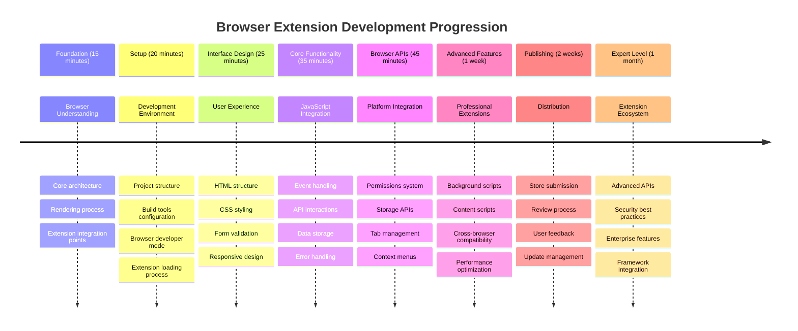
  
### 🛠️ Ringkasan Alat Pembangunan Sambungan Anda  

Selepas melengkapkan pelajaran ini, anda kini mempunyai:  
- **Pengetahuan Seni Bina Pelayar**: Pemahaman tentang enjin rendering, model keselamatan, dan integrasi sambungan  
- **Persekitaran Pembangunan**: Rangka alat moden dengan Webpack, NPM, dan keupayaan nyahpepijat  
- **Asas UI/UX**: Struktur HTML semantik dengan corak pendedahan progresif  
- **Kesedaran Keselamatan**: Pemahaman tentang kebenaran pelayar dan amalan pembangunan yang selamat  
- **Konsep Pelayar Silang**: Pengetahuan tentang pertimbangan keserasian dan pendekatan ujian  
- **Integrasi API**: Asas untuk bekerja dengan sumber data luaran  
- **Aliran Kerja Profesional**: Prosedur pembangunan dan ujian standard industri  

**Aplikasi Dunia Nyata**: Kemahiran ini secara langsung digunakan untuk:  
- **Pembangunan Web**: Aplikasi halaman tunggal dan aplikasi web progresif  
- **Aplikasi Desktop**: Perisian desktop berasaskan web dan Electron  
- **Pembangunan Mudah Alih**: Aplikasi hibrid dan penyelesaian mudah alih berasaskan web  
- **Alat Perusahaan**: Aplikasi produktiviti dalaman dan automasi aliran kerja  
- **Sumber Terbuka**: Menyumbang kepada projek sambungan pelayar dan piawaian web  

**Tahap Seterusnya**: Anda bersedia untuk menambah fungsi interaktif, bekerja dengan API pelayar, dan mencipta sambungan yang menyelesaikan masalah pengguna sebenar!  

## Tugasan  

[Ubah suai gaya sambungan anda](assignment.md)  

---

**Penafian**:  
Dokumen ini telah diterjemahkan menggunakan perkhidmatan terjemahan AI [Co-op Translator](https://github.com/Azure/co-op-translator). Walaupun kami berusaha untuk ketepatan, sila ambil perhatian bahawa terjemahan automatik mungkin mengandungi kesilapan atau ketidaktepatan. Dokumen asal dalam bahasa asalnya harus dianggap sebagai sumber yang berwibawa. Untuk maklumat penting, terjemahan manusia profesional adalah disyorkan. Kami tidak bertanggungjawab atas sebarang salah faham atau salah tafsir yang timbul daripada penggunaan terjemahan ini.