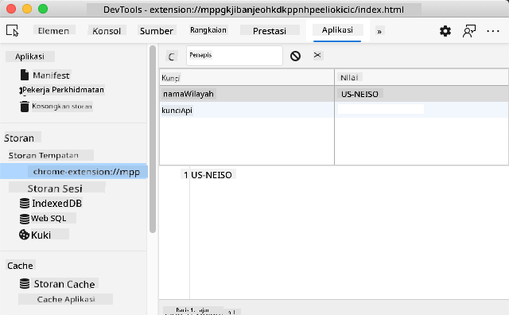

<!--
CO_OP_TRANSLATOR_METADATA:
{
  "original_hash": "e10f168beac4e7b05e30e0eb5c92bf11",
  "translation_date": "2025-08-27T22:29:47+00:00",
  "source_file": "5-browser-extension/2-forms-browsers-local-storage/README.md",
  "language_code": "ms"
}
-->
# Projek Sambungan Pelayar Bahagian 2: Panggil API, gunakan Storan Tempatan

## Kuiz Pra-Kuliah

[Kuiz pra-kuliah](https://ff-quizzes.netlify.app/web/quiz/25)

### Pengenalan

Dalam pelajaran ini, anda akan memanggil API dengan menghantar borang sambungan pelayar anda dan memaparkan hasilnya dalam sambungan pelayar anda. Selain itu, anda akan belajar bagaimana menyimpan data dalam storan tempatan pelayar anda untuk rujukan dan kegunaan masa depan.

✅ Ikuti segmen bernombor dalam fail yang sesuai untuk mengetahui di mana meletakkan kod anda.

### Sediakan elemen untuk dimanipulasi dalam sambungan:

Pada masa ini, anda telah membina HTML untuk borang dan `<div>` hasil untuk sambungan pelayar anda. Mulai sekarang, anda perlu bekerja dalam fail `/src/index.js` dan membina sambungan anda sedikit demi sedikit. Rujuk [pelajaran sebelumnya](../1-about-browsers/README.md) untuk menyediakan projek anda dan proses pembinaan.

Bekerja dalam fail `index.js` anda, mulakan dengan mencipta beberapa pemboleh ubah `const` untuk memegang nilai yang berkaitan dengan pelbagai medan:

```JavaScript
// form fields
const form = document.querySelector('.form-data');
const region = document.querySelector('.region-name');
const apiKey = document.querySelector('.api-key');

// results
const errors = document.querySelector('.errors');
const loading = document.querySelector('.loading');
const results = document.querySelector('.result-container');
const usage = document.querySelector('.carbon-usage');
const fossilfuel = document.querySelector('.fossil-fuel');
const myregion = document.querySelector('.my-region');
const clearBtn = document.querySelector('.clear-btn');
```

Semua medan ini dirujuk oleh kelas css mereka, seperti yang anda tetapkan dalam HTML pada pelajaran sebelumnya.

### Tambah pendengar

Seterusnya, tambahkan pendengar acara pada borang dan butang kosong yang menetapkan semula borang, supaya jika pengguna menghantar borang atau mengklik butang tetapan semula itu, sesuatu akan berlaku, dan tambahkan panggilan untuk memulakan aplikasi di bahagian bawah fail:

```JavaScript
form.addEventListener('submit', (e) => handleSubmit(e));
clearBtn.addEventListener('click', (e) => reset(e));
init();
```

✅ Perhatikan singkatan yang digunakan untuk mendengar acara hantar atau klik, dan bagaimana acara itu dihantar ke fungsi handleSubmit atau reset. Bolehkah anda menulis versi panjang singkatan ini? Mana satu yang anda lebih suka?

### Bina fungsi init() dan fungsi reset():

Sekarang anda akan membina fungsi yang memulakan sambungan, yang dipanggil init():

```JavaScript
function init() {
	//if anything is in localStorage, pick it up
	const storedApiKey = localStorage.getItem('apiKey');
	const storedRegion = localStorage.getItem('regionName');

	//set icon to be generic green
	//todo

	if (storedApiKey === null || storedRegion === null) {
		//if we don't have the keys, show the form
		form.style.display = 'block';
		results.style.display = 'none';
		loading.style.display = 'none';
		clearBtn.style.display = 'none';
		errors.textContent = '';
	} else {
        //if we have saved keys/regions in localStorage, show results when they load
        displayCarbonUsage(storedApiKey, storedRegion);
		results.style.display = 'none';
		form.style.display = 'none';
		clearBtn.style.display = 'block';
	}
};

function reset(e) {
	e.preventDefault();
	//clear local storage for region only
	localStorage.removeItem('regionName');
	init();
}

```
Dalam fungsi ini, terdapat beberapa logik yang menarik. Membaca melalui kod, bolehkah anda lihat apa yang berlaku?

- dua `const` disediakan untuk memeriksa sama ada pengguna telah menyimpan APIKey dan kod wilayah dalam storan tempatan.
- jika salah satu daripadanya adalah null, paparkan borang dengan menukar gayanya kepada 'block'
- sembunyikan kawasan hasil, pemuatan, dan clearBtn serta tetapkan sebarang teks ralat kepada string kosong
- jika terdapat kunci dan wilayah, mulakan rutin untuk:
  - panggil API untuk mendapatkan data penggunaan karbon
  - sembunyikan kawasan hasil
  - sembunyikan borang
  - paparkan butang tetapan semula

Sebelum meneruskan, adalah berguna untuk belajar tentang konsep yang sangat penting yang tersedia dalam pelayar: [LocalStorage](https://developer.mozilla.org/docs/Web/API/Window/localStorage). LocalStorage adalah cara yang berguna untuk menyimpan string dalam pelayar sebagai pasangan `key-value`. Jenis storan web ini boleh dimanipulasi oleh JavaScript untuk menguruskan data dalam pelayar. LocalStorage tidak luput, manakala SessionStorage, satu lagi jenis storan web, akan dibersihkan apabila pelayar ditutup. Pelbagai jenis storan mempunyai kelebihan dan kekurangan dalam penggunaannya.

> Nota - sambungan pelayar anda mempunyai storan tempatan sendiri; tetingkap pelayar utama adalah instance yang berbeza dan berkelakuan secara berasingan.

Anda menetapkan APIKey anda untuk mempunyai nilai string, sebagai contoh, dan anda boleh melihat bahawa ia ditetapkan pada Edge dengan "memeriksa" halaman web (anda boleh klik kanan pelayar untuk memeriksa) dan pergi ke tab Aplikasi untuk melihat storan.



✅ Fikirkan situasi di mana anda TIDAK mahu menyimpan beberapa data dalam LocalStorage. Secara umum, meletakkan API Keys dalam LocalStorage adalah idea yang buruk! Bolehkah anda lihat mengapa? Dalam kes kita, kerana aplikasi kita semata-mata untuk pembelajaran dan tidak akan diterbitkan ke kedai aplikasi, kita akan menggunakan kaedah ini.

Perhatikan bahawa anda menggunakan Web API untuk memanipulasi LocalStorage, sama ada dengan menggunakan `getItem()`, `setItem()`, atau `removeItem()`. Ia disokong secara meluas di pelayar.

Sebelum membina fungsi `displayCarbonUsage()` yang dipanggil dalam `init()`, mari kita bina fungsi untuk mengendalikan penghantaran borang awal.

### Tangani penghantaran borang

Cipta fungsi yang dipanggil `handleSubmit` yang menerima argumen acara `(e)`. Hentikan acara daripada merebak (dalam kes ini, kita mahu menghentikan pelayar daripada menyegarkan) dan panggil fungsi baru, `setUpUser`, dengan menghantar argumen `apiKey.value` dan `region.value`. Dengan cara ini, anda menggunakan dua nilai yang dibawa melalui borang awal apabila medan yang sesuai diisi.

```JavaScript
function handleSubmit(e) {
	e.preventDefault();
	setUpUser(apiKey.value, region.value);
}
```
✅ Segarkan ingatan anda - HTML yang anda sediakan dalam pelajaran terakhir mempunyai dua medan input yang `values`nya ditangkap melalui `const` yang anda sediakan di bahagian atas fail, dan kedua-duanya adalah `required` jadi pelayar menghalang pengguna daripada memasukkan nilai null.

### Sediakan pengguna

Bergerak ke fungsi `setUpUser`, di sinilah anda menetapkan nilai storan tempatan untuk apiKey dan regionName. Tambahkan fungsi baru:

```JavaScript
function setUpUser(apiKey, regionName) {
	localStorage.setItem('apiKey', apiKey);
	localStorage.setItem('regionName', regionName);
	loading.style.display = 'block';
	errors.textContent = '';
	clearBtn.style.display = 'block';
	//make initial call
	displayCarbonUsage(apiKey, regionName);
}
```
Fungsi ini menetapkan mesej pemuatan untuk dipaparkan semasa API dipanggil. Pada ketika ini, anda telah sampai ke penciptaan fungsi paling penting dalam sambungan pelayar ini!

### Paparkan Penggunaan Karbon

Akhirnya, tiba masanya untuk menyoal API!

Sebelum melangkah lebih jauh, kita harus membincangkan API. API, atau [Application Programming Interfaces](https://www.webopedia.com/TERM/A/API.html), adalah elemen penting dalam alat pembangun web. Mereka menyediakan cara standard untuk program berinteraksi dan berhubung antara satu sama lain. Sebagai contoh, jika anda sedang membina laman web yang perlu menyoal pangkalan data, seseorang mungkin telah mencipta API untuk anda gunakan. Walaupun terdapat banyak jenis API, salah satu yang paling popular ialah [REST API](https://www.smashingmagazine.com/2018/01/understanding-using-rest-api/).

✅ Istilah 'REST' bermaksud 'Representational State Transfer' dan melibatkan penggunaan URL yang dikonfigurasi secara pelbagai untuk mendapatkan data. Lakukan sedikit penyelidikan tentang pelbagai jenis API yang tersedia untuk pembangun. Format mana yang menarik minat anda?

Terdapat perkara penting yang perlu diperhatikan tentang fungsi ini. Pertama, perhatikan kata kunci [`async`](https://developer.mozilla.org/docs/Web/JavaScript/Reference/Statements/async_function). Menulis fungsi anda supaya ia berjalan secara asinkron bermaksud ia menunggu tindakan, seperti data yang dikembalikan, untuk diselesaikan sebelum meneruskan.

Berikut adalah video ringkas tentang `async`:

[](https://youtube.com/watch?v=YwmlRkrxvkk "Async dan Await untuk mengurus janji")

> 🎥 Klik imej di atas untuk video tentang async/await.

Cipta fungsi baru untuk menyoal API C02Signal:

```JavaScript
import axios from '../node_modules/axios';

async function displayCarbonUsage(apiKey, region) {
	try {
		await axios
			.get('https://api.co2signal.com/v1/latest', {
				params: {
					countryCode: region,
				},
				headers: {
					'auth-token': apiKey,
				},
			})
			.then((response) => {
				let CO2 = Math.floor(response.data.data.carbonIntensity);

				//calculateColor(CO2);

				loading.style.display = 'none';
				form.style.display = 'none';
				myregion.textContent = region;
				usage.textContent =
					Math.round(response.data.data.carbonIntensity) + ' grams (grams C02 emitted per kilowatt hour)';
				fossilfuel.textContent =
					response.data.data.fossilFuelPercentage.toFixed(2) +
					'% (percentage of fossil fuels used to generate electricity)';
				results.style.display = 'block';
			});
	} catch (error) {
		console.log(error);
		loading.style.display = 'none';
		results.style.display = 'none';
		errors.textContent = 'Sorry, we have no data for the region you have requested.';
	}
}
```

Ini adalah fungsi besar. Apa yang berlaku di sini?

- mengikut amalan terbaik, anda menggunakan kata kunci `async` untuk membuat fungsi ini berkelakuan secara asinkron. Fungsi ini mengandungi blok `try/catch` kerana ia akan mengembalikan janji apabila API mengembalikan data. Oleh kerana anda tidak mempunyai kawalan terhadap kelajuan API akan bertindak balas (ia mungkin tidak bertindak balas sama sekali!), anda perlu mengendalikan ketidakpastian ini dengan memanggilnya secara asinkron. 
- anda menyoal API co2signal untuk mendapatkan data wilayah anda, menggunakan API Key anda. Untuk menggunakan kunci itu, anda perlu menggunakan jenis pengesahan dalam parameter header anda.
- apabila API bertindak balas, anda menetapkan pelbagai elemen data responsnya kepada bahagian skrin anda yang anda sediakan untuk menunjukkan data ini.
- jika terdapat ralat, atau jika tiada hasil, anda memaparkan mesej ralat.

✅ Menggunakan corak pengaturcaraan asinkron adalah alat yang sangat berguna dalam kotak alat anda. Baca [tentang pelbagai cara](https://developer.mozilla.org/docs/Web/JavaScript/Reference/Statements/async_function) anda boleh mengkonfigurasi jenis kod ini.

Tahniah! Jika anda membina sambungan anda (`npm run build`) dan menyegarkannya dalam panel sambungan anda, anda mempunyai sambungan yang berfungsi! Satu-satunya perkara yang tidak berfungsi ialah ikon, dan anda akan membetulkannya dalam pelajaran seterusnya.

---

## 🚀 Cabaran

Kami telah membincangkan beberapa jenis API setakat ini dalam pelajaran ini. Pilih satu API web dan kaji dengan mendalam apa yang ditawarkannya. Sebagai contoh, lihat API yang tersedia dalam pelayar seperti [HTML Drag and Drop API](https://developer.mozilla.org/docs/Web/API/HTML_Drag_and_Drop_API). Apa yang membuatkan API hebat menurut pendapat anda?

## Kuiz Pasca-Kuliah

[Kuiz pasca-kuliah](https://ff-quizzes.netlify.app/web/quiz/26)

## Ulasan & Kajian Kendiri

Anda telah belajar tentang LocalStorage dan API dalam pelajaran ini, kedua-duanya sangat berguna untuk pembangun web profesional. Bolehkah anda fikirkan bagaimana kedua-dua perkara ini berfungsi bersama? Fikirkan bagaimana anda akan merancang laman web yang akan menyimpan item untuk digunakan oleh API.

## Tugasan

[Adopt an API](assignment.md)

---

**Penafian**:  
Dokumen ini telah diterjemahkan menggunakan perkhidmatan terjemahan AI [Co-op Translator](https://github.com/Azure/co-op-translator). Walaupun kami berusaha untuk memastikan ketepatan, sila ambil perhatian bahawa terjemahan automatik mungkin mengandungi kesilapan atau ketidaktepatan. Dokumen asal dalam bahasa asalnya harus dianggap sebagai sumber yang berwibawa. Untuk maklumat yang kritikal, terjemahan manusia profesional adalah disyorkan. Kami tidak bertanggungjawab atas sebarang salah faham atau salah tafsir yang timbul daripada penggunaan terjemahan ini.