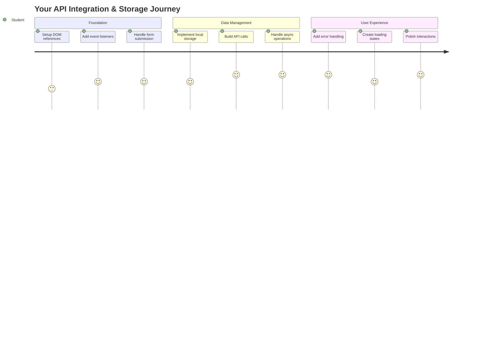
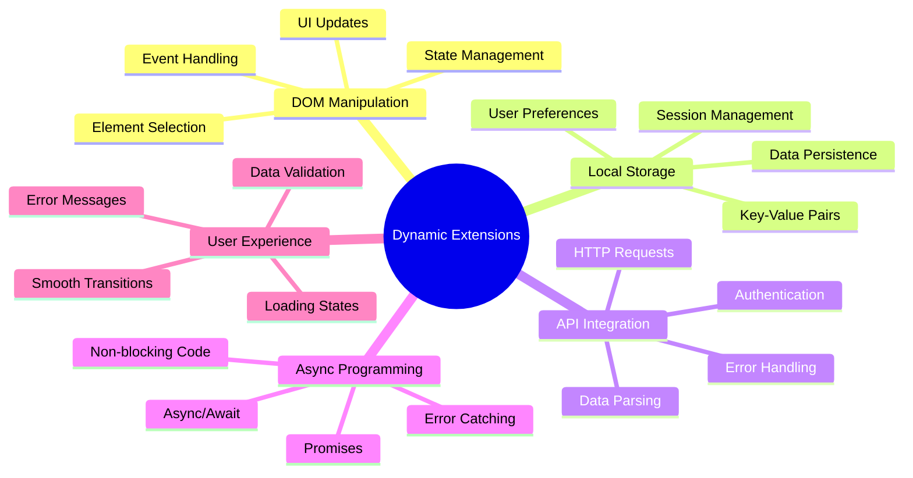
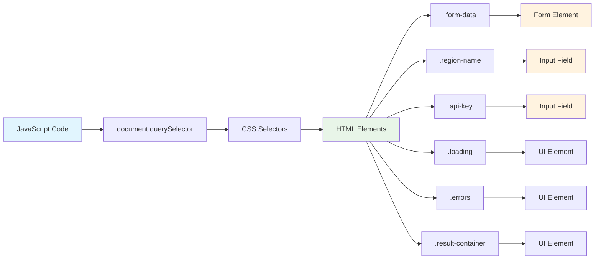
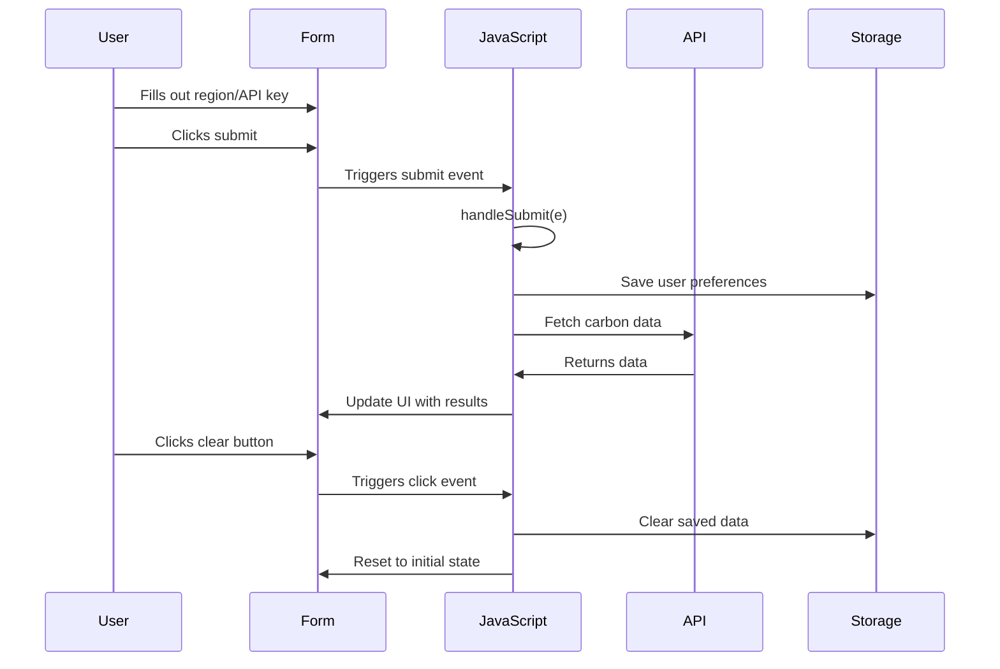
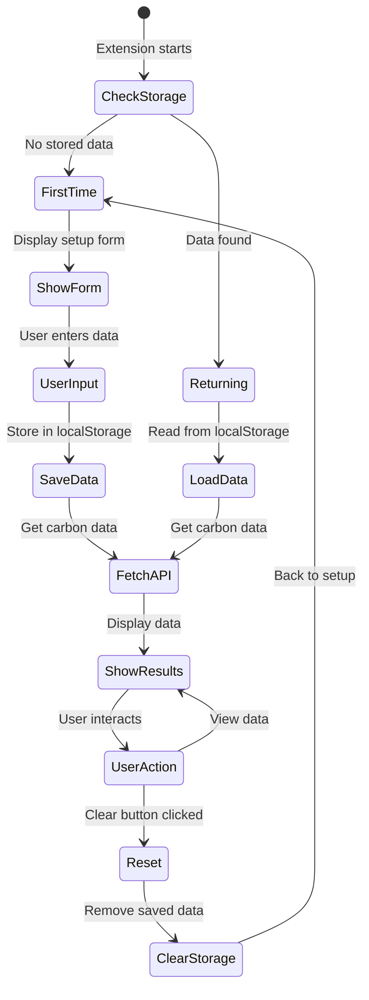
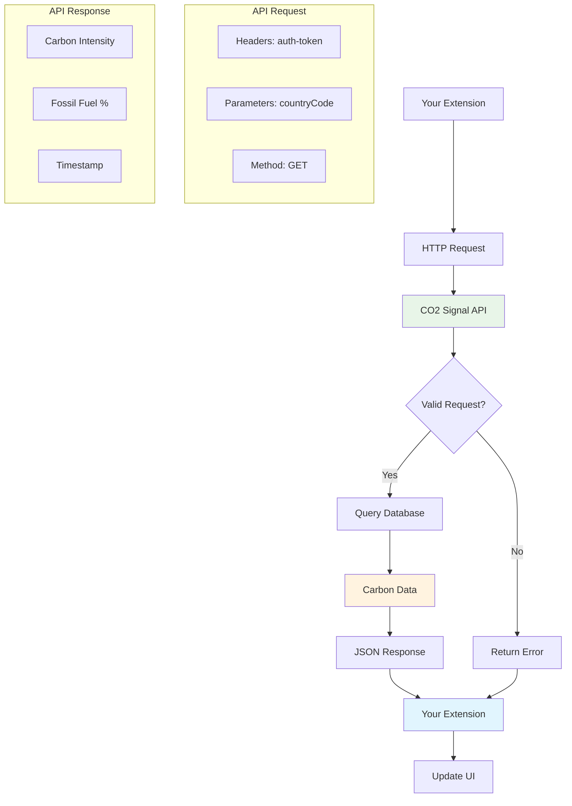
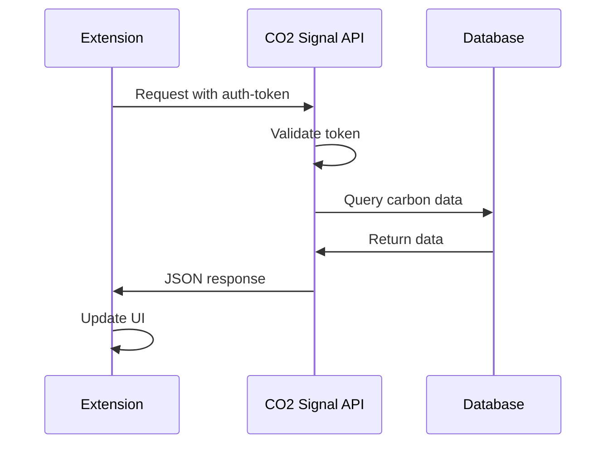
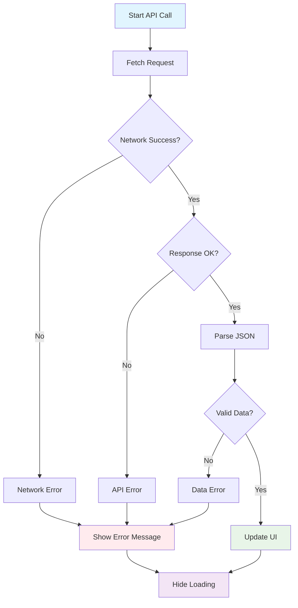
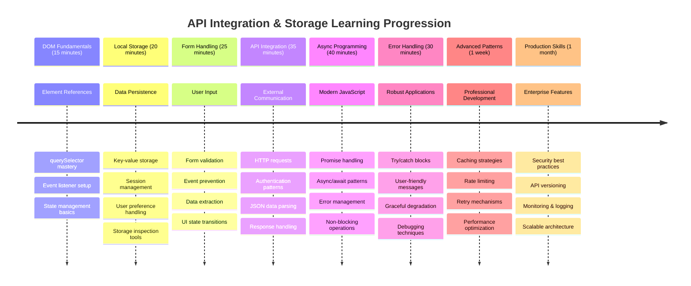

<!--
CO_OP_TRANSLATOR_METADATA:
{
  "original_hash": "2b6203a48c48d8234e0948353b47d84e",
  "translation_date": "2025-11-06T12:23:29+00:00",
  "source_file": "5-browser-extension/2-forms-browsers-local-storage/README.md",
  "language_code": "ms"
}
-->
# Projek Sambungan Pelayar Bahagian 2: Panggil API, gunakan Penyimpanan Tempatan



## Kuiz Pra-Kuliah

[Kuiz pra-kuliah](https://ff-quizzes.netlify.app/web/quiz/25)

## Pengenalan

Ingat sambungan pelayar yang anda mula bina? Sekarang anda mempunyai borang yang kelihatan menarik, tetapi ia pada dasarnya statik. Hari ini kita akan menghidupkannya dengan menghubungkannya kepada data sebenar dan memberikannya memori.

Fikirkan tentang komputer kawalan misi Apollo - mereka tidak hanya memaparkan maklumat tetap. Mereka sentiasa berkomunikasi dengan kapal angkasa, dikemas kini dengan data telemetri, dan mengingati parameter misi kritikal. Itulah jenis tingkah laku dinamik yang kita bina hari ini. Sambungan anda akan mencapai internet, mengambil data alam sekitar sebenar, dan mengingati tetapan anda untuk masa akan datang.

Integrasi API mungkin kedengaran rumit, tetapi ia sebenarnya hanya mengajar kod anda bagaimana untuk berkomunikasi dengan perkhidmatan lain. Sama ada anda mengambil data cuaca, suapan media sosial, atau maklumat jejak karbon seperti yang akan kita lakukan hari ini, semuanya tentang mewujudkan sambungan digital ini. Kita juga akan meneroka bagaimana pelayar boleh mengekalkan maklumat - sama seperti perpustakaan menggunakan katalog kad untuk mengingati di mana buku berada.

Menjelang akhir pelajaran ini, anda akan mempunyai sambungan pelayar yang mengambil data sebenar, menyimpan pilihan pengguna, dan memberikan pengalaman yang lancar. Mari kita mulakan!



✅ Ikuti segmen bernombor dalam fail yang sesuai untuk mengetahui di mana untuk meletakkan kod anda

## Sediakan elemen untuk dimanipulasi dalam sambungan

Sebelum JavaScript anda boleh memanipulasi antara muka, ia memerlukan rujukan kepada elemen HTML tertentu. Fikirkan ia seperti teleskop yang perlu diarahkan kepada bintang tertentu - sebelum Galileo dapat mengkaji bulan Jupiter, dia perlu mencari dan fokus pada Jupiter itu sendiri.

Dalam fail `index.js` anda, kita akan mencipta pembolehubah `const` yang menangkap rujukan kepada setiap elemen borang penting. Ini serupa dengan bagaimana saintis melabelkan peralatan mereka - daripada mencari seluruh makmal setiap kali, mereka boleh terus mengakses apa yang mereka perlukan.



```javascript
// form fields
const form = document.querySelector('.form-data');
const region = document.querySelector('.region-name');
const apiKey = document.querySelector('.api-key');

// results
const errors = document.querySelector('.errors');
const loading = document.querySelector('.loading');
const results = document.querySelector('.result-container');
const usage = document.querySelector('.carbon-usage');
const fossilfuel = document.querySelector('.fossil-fuel');
const myregion = document.querySelector('.my-region');
const clearBtn = document.querySelector('.clear-btn');
```

**Inilah yang dilakukan oleh kod ini:**
- **Menangkap** elemen borang menggunakan `document.querySelector()` dengan pemilih kelas CSS
- **Mencipta** rujukan kepada medan input untuk nama kawasan dan kunci API
- **Menubuhkan** sambungan kepada elemen paparan hasil untuk data penggunaan karbon
- **Menyediakan** akses kepada elemen UI seperti indikator pemuatan dan mesej ralat
- **Menyimpan** setiap rujukan elemen dalam pembolehubah `const` untuk kegunaan mudah sepanjang kod anda

## Tambah pendengar acara

Sekarang kita akan membuat sambungan anda bertindak balas kepada tindakan pengguna. Pendengar acara adalah cara kod anda memantau interaksi pengguna. Fikirkan mereka seperti operator dalam pertukaran telefon awal - mereka mendengar panggilan masuk dan menyambungkan litar yang betul apabila seseorang ingin membuat sambungan.



```javascript
form.addEventListener('submit', (e) => handleSubmit(e));
clearBtn.addEventListener('click', (e) => reset(e));
init();
```

**Memahami konsep ini:**
- **Melampirkan** pendengar hantar kepada borang yang mencetuskan apabila pengguna menekan Enter atau klik hantar
- **Menyambungkan** pendengar klik kepada butang kosong untuk menetapkan semula borang
- **Menyampaikan** objek acara `(e)` kepada fungsi pengendali untuk kawalan tambahan
- **Memanggil** fungsi `init()` dengan segera untuk menyediakan keadaan awal sambungan anda

✅ Perhatikan sintaks fungsi anak panah ringkas yang digunakan di sini. Pendekatan JavaScript moden ini lebih bersih daripada ekspresi fungsi tradisional, tetapi kedua-duanya berfungsi dengan baik!

### 🔄 **Pemeriksaan Pedagogi**
**Pemahaman Pengendalian Acara**: Sebelum beralih kepada inisialisasi, pastikan anda boleh:
- ✅ Terangkan bagaimana `addEventListener` menghubungkan tindakan pengguna kepada fungsi JavaScript
- ✅ Fahami mengapa kita menyampaikan objek acara `(e)` kepada fungsi pengendali
- ✅ Kenali perbezaan antara acara `submit` dan `click`
- ✅ Huraikan bila fungsi `init()` dijalankan dan mengapa

**Ujian Kendiri Cepat**: Apa yang akan berlaku jika anda terlupa `e.preventDefault()` dalam penghantaran borang?
*Jawapan: Halaman akan dimuat semula, kehilangan semua keadaan JavaScript dan mengganggu pengalaman pengguna*

## Bina fungsi inisialisasi dan tetapan semula

Mari kita cipta logik inisialisasi untuk sambungan anda. Fungsi `init()` adalah seperti sistem navigasi kapal yang memeriksa instrumennya - ia menentukan keadaan semasa dan menyesuaikan antara muka dengan sewajarnya. Ia memeriksa jika seseorang telah menggunakan sambungan anda sebelum ini dan memuatkan tetapan mereka yang terdahulu.

Fungsi `reset()` memberikan pengguna permulaan baru - serupa dengan bagaimana saintis menetapkan semula instrumen mereka antara eksperimen untuk memastikan data bersih.

```javascript
function init() {
	// Check if user has previously saved API credentials
	const storedApiKey = localStorage.getItem('apiKey');
	const storedRegion = localStorage.getItem('regionName');

	// Set extension icon to generic green (placeholder for future lesson)
	// TODO: Implement icon update in next lesson

	if (storedApiKey === null || storedRegion === null) {
		// First-time user: show the setup form
		form.style.display = 'block';
		results.style.display = 'none';
		loading.style.display = 'none';
		clearBtn.style.display = 'none';
		errors.textContent = '';
	} else {
		// Returning user: load their saved data automatically
		displayCarbonUsage(storedApiKey, storedRegion);
		results.style.display = 'none';
		form.style.display = 'none';
		clearBtn.style.display = 'block';
	}
}

function reset(e) {
	e.preventDefault();
	// Clear stored region to allow user to choose a new location
	localStorage.removeItem('regionName');
	// Restart the initialization process
	init();
}
```

**Memecahkan apa yang berlaku di sini:**
- **Mengambil** kunci API dan kawasan yang disimpan dari penyimpanan tempatan pelayar
- **Memeriksa** jika ini adalah pengguna kali pertama (tiada kelayakan yang disimpan) atau pengguna yang kembali
- **Menunjukkan** borang persediaan untuk pengguna baru dan menyembunyikan elemen antara muka lain
- **Memuatkan** data yang disimpan secara automatik untuk pengguna yang kembali dan memaparkan pilihan tetapan semula
- **Menguruskan** keadaan antara muka pengguna berdasarkan data yang tersedia

**Konsep utama tentang Penyimpanan Tempatan:**
- **Mengekalkan** data antara sesi pelayar (tidak seperti penyimpanan sesi)
- **Menyimpan** data sebagai pasangan kunci-nilai menggunakan `getItem()` dan `setItem()`
- **Mengembalikan** `null` apabila tiada data wujud untuk kunci tertentu
- **Memberikan** cara mudah untuk mengingati pilihan dan tetapan pengguna

> 💡 **Memahami Penyimpanan Pelayar**: [LocalStorage](https://developer.mozilla.org/docs/Web/API/Window/localStorage) adalah seperti memberikan sambungan anda memori yang berterusan. Pertimbangkan bagaimana Perpustakaan Alexandria kuno menyimpan gulungan - maklumat kekal tersedia walaupun apabila sarjana pergi dan kembali.
>
> **Ciri utama:**
> - **Mengekalkan** data walaupun selepas anda menutup pelayar anda
> - **Bertahan** restart komputer dan kerosakan pelayar
> - **Memberikan** ruang penyimpanan yang besar untuk pilihan pengguna
> - **Menawarkan** akses segera tanpa kelewatan rangkaian

> **Nota Penting**: Sambungan pelayar anda mempunyai penyimpanan tempatan yang terpencil sendiri yang berasingan daripada halaman web biasa. Ini memberikan keselamatan dan mengelakkan konflik dengan laman web lain.

Anda boleh melihat data yang disimpan dengan membuka Alat Pembangun pelayar (F12), menavigasi ke tab **Application**, dan mengembangkan bahagian **Local Storage**.




> ⚠️ **Pertimbangan Keselamatan**: Dalam aplikasi pengeluaran, menyimpan kunci API dalam LocalStorage menimbulkan risiko keselamatan kerana JavaScript boleh mengakses data ini. Untuk tujuan pembelajaran, pendekatan ini berfungsi dengan baik, tetapi aplikasi sebenar harus menggunakan penyimpanan pelayan yang selamat untuk kelayakan sensitif.

## Tangani penghantaran borang

Sekarang kita akan menangani apa yang berlaku apabila seseorang menghantar borang anda. Secara lalai, pelayar memuat semula halaman apabila borang dihantar, tetapi kita akan memintas tingkah laku ini untuk mencipta pengalaman yang lebih lancar.

Pendekatan ini mencerminkan bagaimana kawalan misi menangani komunikasi kapal angkasa - bukannya menetapkan semula keseluruhan sistem untuk setiap penghantaran, mereka mengekalkan operasi berterusan sambil memproses maklumat baru.

Cipta fungsi yang menangkap acara penghantaran borang dan mengekstrak input pengguna:

```javascript
function handleSubmit(e) {
	e.preventDefault();
	setUpUser(apiKey.value, region.value);
}
```

**Dalam perkara di atas, kita telah:**
- **Menghalang** tingkah laku penghantaran borang lalai yang akan menyegarkan halaman
- **Mengekstrak** nilai input pengguna dari medan kunci API dan kawasan
- **Menyampaikan** data borang kepada fungsi `setUpUser()` untuk diproses
- **Menjaga** tingkah laku aplikasi halaman tunggal dengan mengelakkan penyegaran halaman

✅ Ingat bahawa medan borang HTML anda termasuk atribut `required`, jadi pelayar secara automatik mengesahkan bahawa pengguna memberikan kedua-dua kunci API dan kawasan sebelum fungsi ini dijalankan.

## Sediakan pilihan pengguna

Fungsi `setUpUser` bertanggungjawab untuk menyimpan kelayakan pengguna dan memulakan panggilan API pertama. Ini mencipta peralihan yang lancar dari persediaan kepada paparan hasil.

```javascript
function setUpUser(apiKey, regionName) {
	// Save user credentials for future sessions
	localStorage.setItem('apiKey', apiKey);
	localStorage.setItem('regionName', regionName);
	
	// Update UI to show loading state
	loading.style.display = 'block';
	errors.textContent = '';
	clearBtn.style.display = 'block';
	
	// Fetch carbon usage data with user's credentials
	displayCarbonUsage(apiKey, regionName);
}
```

**Langkah demi langkah, inilah yang berlaku:**
- **Menyimpan** kunci API dan nama kawasan ke penyimpanan tempatan untuk kegunaan masa depan
- **Menunjukkan** indikator pemuatan untuk memberitahu pengguna bahawa data sedang diambil
- **Menghapuskan** mesej ralat sebelumnya dari paparan
- **Mendedahkan** butang kosong untuk pengguna menetapkan semula tetapan mereka kemudian
- **Memulakan** panggilan API untuk mengambil data penggunaan karbon sebenar

Fungsi ini mencipta pengalaman pengguna yang lancar dengan menguruskan kedua-dua pengekalan data dan kemas kini antara muka pengguna dalam satu tindakan yang diselaraskan.

## Paparkan data penggunaan karbon

Sekarang kita akan menyambungkan sambungan anda kepada sumber data luaran melalui API. Ini mengubah sambungan anda daripada alat yang berdiri sendiri kepada sesuatu yang boleh mengakses maklumat masa nyata dari seluruh internet.

**Memahami API**

[API](https://www.webopedia.com/TERM/A/API.html) adalah bagaimana aplikasi yang berbeza berkomunikasi antara satu sama lain. Fikirkan mereka seperti sistem telegraf yang menghubungkan bandar-bandar jauh pada abad ke-19 - operator akan menghantar permintaan kepada stesen jauh dan menerima respons dengan maklumat yang diminta. Setiap kali anda memeriksa media sosial, bertanya soalan kepada pembantu suara, atau menggunakan aplikasi penghantaran, API memudahkan pertukaran data ini.



**Konsep utama tentang REST API:**
- **REST** bermaksud 'Representational State Transfer'
- **Menggunakan** kaedah HTTP standard (GET, POST, PUT, DELETE) untuk berinteraksi dengan data
- **Mengembalikan** data dalam format yang boleh diramal, biasanya JSON
- **Memberikan** titik akhir berasaskan URL yang konsisten untuk jenis permintaan yang berbeza

✅ [API CO2 Signal](https://www.co2signal.com/) yang akan kita gunakan menyediakan data intensiti karbon masa nyata dari grid elektrik di seluruh dunia. Ini membantu pengguna memahami kesan alam sekitar penggunaan elektrik mereka!

> 💡 **Memahami JavaScript Asynchronous**: Kata kunci [`async`](https://developer.mozilla.org/docs/Web/JavaScript/Reference/Statements/async_function) membolehkan kod anda mengendalikan pelbagai operasi secara serentak. Apabila anda meminta data dari pelayan, anda tidak mahu seluruh sambungan anda membeku - itu seperti kawalan trafik udara menghentikan semua operasi semasa menunggu satu pesawat untuk bertindak balas.
>
> **Manfaat utama:**
> - **Menjaga** responsif sambungan semasa data dimuatkan
> - **Membolehkan** kod lain terus dilaksanakan semasa permintaan rangkaian
> - **Meningkatkan** kebolehbacaan kod berbanding corak panggilan balik tradisional
> - **Membolehkan** pengendalian ralat yang baik untuk masalah rangkaian

Berikut adalah video ringkas tentang `async`:

[](https://youtube.com/watch?v=YwmlRkrxvkk "Async dan Await untuk mengurus janji")

> 🎥 Klik imej di atas untuk video tentang async/await.

### 🔄 **Pemeriksaan Pedagogi**
**Pemahaman Pemrograman Asynchronous**: Sebelum menyelami fungsi API, pastikan anda memahami:
- ✅ Mengapa kita menggunakan `async/await` dan bukannya membekukan keseluruhan sambungan
- ✅ Bagaimana blok `try/catch` mengendalikan ralat rangkaian dengan baik
- ✅ Perbezaan antara operasi segerak dan tak segerak
- ✅ Mengapa panggilan API boleh gagal dan bagaimana untuk mengendalikan kegagalan tersebut

**Hubungan Dunia Nyata**: Pertimbangkan contoh async harian ini:
- **Memesan makanan**: Anda tidak menunggu di dapur - anda mendapat resit dan teruskan aktiviti lain
- **Menghantar e-mel**: Aplikasi e-mel anda tidak membeku semasa menghantar - anda boleh menulis lebih banyak e-mel
- **Memuatkan halaman web**: Imej dimuatkan secara progresif sementara anda sudah boleh membaca teks

**Aliran Pengesahan API**:


Cipta fungsi untuk mengambil dan memaparkan data penggunaan karbon:

```javascript
// Modern fetch API approach (no external dependencies needed)
async function displayCarbonUsage(apiKey, region) {
	try {
		// Fetch carbon intensity data from CO2 Signal API
		const response = await fetch('https://api.co2signal.com/v1/latest', {
			method: 'GET',
			headers: {
				'auth-token': apiKey,
				'Content-Type': 'application/json'
			},
			// Add query parameters for the specific region
			...new URLSearchParams({ countryCode: region }) && {
				url: `https://api.co2signal.com/v1/latest?countryCode=${region}`
			}
		});

		// Check if the API request was successful
		if (!response.ok) {
			throw new Error(`API request failed: ${response.status}`);
		}

		const data = await response.json();
		const carbonData = data.data;

		// Calculate rounded carbon intensity value
		const carbonIntensity = Math.round(carbonData.carbonIntensity);

		// Update the user interface with fetched data
		loading.style.display = 'none';
		form.style.display = 'none';
		myregion.textContent = region.toUpperCase();
		usage.textContent = `${carbonIntensity} grams (grams CO₂ emitted per kilowatt hour)`;
		fossilfuel.textContent = `${carbonData.fossilFuelPercentage.toFixed(2)}% (percentage of fossil fuels used to generate electricity)`;
		results.style.display = 'block';

		// TODO: calculateColor(carbonIntensity) - implement in next lesson

	} catch (error) {
		console.error('Error fetching carbon data:', error);
		
		// Show user-friendly error message
		loading.style.display = 'none';
		results.style.display = 'none';
		errors.textContent = 'Sorry, we couldn\'t fetch data for that region. Please check your API key and region code.';
	}
}
```

**Memecahkan apa yang berlaku di sini:**
- **Menggunakan** API `fetch()` moden dan bukannya perpustakaan luaran seperti Axios untuk kod yang lebih bersih dan bebas pergantungan
- **Melaksanakan** pemeriksaan ralat yang betul dengan `response.ok` untuk menangkap kegagalan API lebih awal
- **Mengendalikan** operasi tak segerak dengan `async/await` untuk aliran kod yang lebih mudah dibaca
- **Mengesahkan** dengan API CO2 Signal menggunakan tajuk `auth-token`
- **Menganalisis** data respons JSON dan mengekstrak maklumat intensiti karbon
- **Mengemas kini** pelbagai elemen UI dengan data alam sekitar yang diformatkan
- **Memberikan** mesej ralat mesra pengguna apabila panggilan API gagal

**Konsep JavaScript moden utama yang ditunjukkan:**
- **Literal templat** dengan sintaks `${}` untuk format string yang bersih
- **Pengendalian ralat** dengan blok try/catch untuk aplikasi yang kukuh
- **Corak async/await** untuk mengendalikan permintaan rangkaian dengan baik
- **Pemusnahan objek** untuk mengekstrak data tertentu dari respons API
- **Rantai kaedah** untuk pelbagai manipulasi DOM

✅ Fungsi ini menunjukkan beberapa konsep penting dalam pembangunan web - berkomunikasi dengan pelayan luaran, mengendalikan pengesahan, memproses data, mengemas kini antara muka, dan menguruskan ralat dengan baik. Ini adalah kemahiran asas yang digunakan oleh pembangun profesional secara kerap.



### 🔄 **Pemeriksaan Pedagogi**
**Pemahaman Sistem Lengkap**: Sahkan penguasaan anda terhadap keseluruhan aliran:
- ✅ Bagaimana rujukan DOM membolehkan JavaScript mengawal antara muka
- ✅ Mengapa penyimpanan tempatan mencipta pengekalan antara sesi pelayar
- ✅ Bagaimana async/await membuat panggilan API tanpa membekukan sambungan
- ✅ Apa yang berlaku apabila panggilan API gagal dan bagaimana ralat dikendalikan
- ✅ Mengapa pengalaman pengguna termasuk keadaan pemuatan dan mesej ralat

🎉 **Apa yang telah anda capai:** Anda telah mencipta sambungan pelayar yang:
- **Menyambung** ke internet dan mengambil data alam sekitar sebenar
- **Mengekalkan** tetapan pengguna antara sesi
- **Mengendalikan** ralat dengan baik dan bukannya terhenti
- **Memberikan** pengalaman pengguna yang lancar dan profesional

Uji kerja anda dengan menjalankan `npm run build` dan menyegarkan sambungan anda dalam pelayar. Anda kini mempunyai penjejak jejak karbon yang berfungsi. Pelajaran seterusnya akan menambah fungsi ikon dinamik untuk melengkapkan sambungan.

---

## Cabaran Ejen GitHub Copilot 🚀

Gunakan mod Ejen untuk melengkapkan cabaran berikut:
**Deskripsi:** Tingkatkan sambungan pelayar dengan menambah penambahbaikan pengendalian ralat dan ciri pengalaman pengguna. Cabaran ini akan membantu anda berlatih bekerja dengan API, storan tempatan, dan manipulasi DOM menggunakan corak JavaScript moden.

**Arahan:** Cipta versi yang dipertingkatkan bagi fungsi displayCarbonUsage yang merangkumi: 1) Mekanisme ulang semula untuk panggilan API yang gagal dengan backoff eksponen, 2) Pengesahan input untuk kod wilayah sebelum membuat panggilan API, 3) Animasi pemuatan dengan penunjuk kemajuan, 4) Caching respons API dalam localStorage dengan cap masa tamat (cache selama 30 minit), dan 5) Ciri untuk memaparkan data sejarah daripada panggilan API sebelumnya. Tambahkan juga komen JSDoc gaya TypeScript yang sesuai untuk mendokumentasikan semua parameter fungsi dan jenis nilai yang dikembalikan.

Ketahui lebih lanjut tentang [agent mode](https://code.visualstudio.com/blogs/2025/02/24/introducing-copilot-agent-mode) di sini.

## 🚀 Cabaran

Luaskan pemahaman anda tentang API dengan meneroka pelbagai API berasaskan pelayar yang tersedia untuk pembangunan web. Pilih salah satu API pelayar ini dan bina demonstrasi kecil:

- [Geolocation API](https://developer.mozilla.org/docs/Web/API/Geolocation_API) - Dapatkan lokasi semasa pengguna
- [Notification API](https://developer.mozilla.org/docs/Web/API/Notifications_API) - Hantar notifikasi desktop
- [HTML Drag and Drop API](https://developer.mozilla.org/docs/Web/API/HTML_Drag_and_Drop_API) - Cipta antara muka seret interaktif
- [Web Storage API](https://developer.mozilla.org/docs/Web/API/Web_Storage_API) - Teknik storan tempatan yang maju
- [Fetch API](https://developer.mozilla.org/docs/Web/API/Fetch_API) - Alternatif moden kepada XMLHttpRequest

**Soalan penyelidikan untuk dipertimbangkan:**
- Masalah dunia sebenar apa yang diselesaikan oleh API ini?
- Bagaimana API ini mengendalikan ralat dan kes tepi?
- Apakah pertimbangan keselamatan yang wujud semasa menggunakan API ini?
- Sejauh mana API ini disokong di pelbagai pelayar?

Selepas penyelidikan anda, kenal pasti ciri-ciri yang menjadikan API mesra pembangun dan boleh dipercayai.

## Kuiz Selepas Kuliah

[Kuiz selepas kuliah](https://ff-quizzes.netlify.app/web/quiz/26)

## Ulasan & Kajian Kendiri

Anda telah mempelajari tentang LocalStorage dan API dalam pelajaran ini, kedua-duanya sangat berguna untuk pembangun web profesional. Bolehkah anda fikirkan bagaimana kedua-dua perkara ini berfungsi bersama? Fikirkan bagaimana anda akan merancang laman web yang akan menyimpan item untuk digunakan oleh API.

### ⚡ **Apa Yang Boleh Anda Lakukan Dalam 5 Minit Seterusnya**
- [ ] Buka tab Aplikasi DevTools dan terokai localStorage di mana-mana laman web
- [ ] Cipta borang HTML ringkas dan uji pengesahan borang dalam pelayar
- [ ] Cuba simpan dan ambil data menggunakan localStorage dalam konsol pelayar
- [ ] Periksa data borang yang dihantar menggunakan tab Rangkaian

### 🎯 **Apa Yang Boleh Anda Capai Dalam Jam Ini**
- [ ] Lengkapkan kuiz selepas pelajaran dan fahami konsep pengendalian borang
- [ ] Bina borang sambungan pelayar yang menyimpan keutamaan pengguna
- [ ] Laksanakan pengesahan borang di sisi klien dengan mesej ralat yang berguna
- [ ] Berlatih menggunakan API chrome.storage untuk ketekalan data sambungan
- [ ] Cipta antara muka pengguna yang bertindak balas kepada tetapan pengguna yang disimpan

### 📅 **Pembangunan Sambungan Anda Sepanjang Minggu**
- [ ] Lengkapkan sambungan pelayar yang berfungsi sepenuhnya dengan fungsi borang
- [ ] Kuasai pilihan storan yang berbeza: storan tempatan, segerak, dan sesi
- [ ] Laksanakan ciri borang maju seperti autolengkap dan pengesahan
- [ ] Tambahkan fungsi import/eksport untuk data pengguna
- [ ] Uji sambungan anda dengan teliti di pelbagai pelayar
- [ ] Perhalusi pengalaman pengguna dan pengendalian ralat sambungan anda

### 🌟 **Penguasaan API Web Anda Sepanjang Bulan**
- [ ] Bina aplikasi kompleks menggunakan pelbagai API storan pelayar
- [ ] Pelajari corak pembangunan offline-first
- [ ] Sumbang kepada projek sumber terbuka yang melibatkan ketekalan data
- [ ] Kuasai pembangunan yang fokus kepada privasi dan pematuhan GDPR
- [ ] Cipta perpustakaan yang boleh digunakan semula untuk pengendalian borang dan pengurusan data
- [ ] Kongsi pengetahuan tentang API web dan pembangunan sambungan

## 🎯 Garis Masa Penguasaan Pembangunan Sambungan Anda



### 🛠️ Ringkasan Alat Pembangunan Full-Stack Anda

Selepas melengkapkan pelajaran ini, anda kini mempunyai:
- **Penguasaan DOM**: Penargetan dan manipulasi elemen yang tepat
- **Kepakaran Storan**: Pengurusan data berterusan dengan localStorage
- **Integrasi API**: Pengambilan data masa nyata dan pengesahan
- **Pengaturcaraan Asinkron**: Operasi tidak menyekat dengan JavaScript moden
- **Pengendalian Ralat**: Aplikasi yang kukuh yang mengendalikan kegagalan dengan baik
- **Pengalaman Pengguna**: Keadaan pemuatan, pengesahan, dan interaksi yang lancar
- **Corak Moden**: fetch API, async/await, dan ciri ES6+

**Kemahiran Profesional Diperoleh**: Anda telah melaksanakan corak yang digunakan dalam:
- **Aplikasi Web**: Aplikasi halaman tunggal dengan sumber data luaran
- **Pembangunan Mudah Alih**: Aplikasi yang didorong oleh API dengan keupayaan offline
- **Perisian Desktop**: Aplikasi Electron dengan storan berterusan
- **Sistem Perusahaan**: Pengesahan, caching, dan pengendalian ralat
- **Kerangka Moden**: Corak pengurusan data React/Vue/Angular

**Tahap Seterusnya**: Anda bersedia untuk meneroka topik lanjutan seperti strategi caching, sambungan WebSocket masa nyata, atau pengurusan keadaan yang kompleks!

## Tugasan

[Adopt an API](assignment.md)

---

**Penafian**:  
Dokumen ini telah diterjemahkan menggunakan perkhidmatan terjemahan AI [Co-op Translator](https://github.com/Azure/co-op-translator). Walaupun kami berusaha untuk ketepatan, sila ambil perhatian bahawa terjemahan automatik mungkin mengandungi kesilapan atau ketidaktepatan. Dokumen asal dalam bahasa asalnya harus dianggap sebagai sumber yang berwibawa. Untuk maklumat penting, terjemahan manusia profesional adalah disyorkan. Kami tidak bertanggungjawab atas sebarang salah faham atau salah tafsir yang timbul daripada penggunaan terjemahan ini.