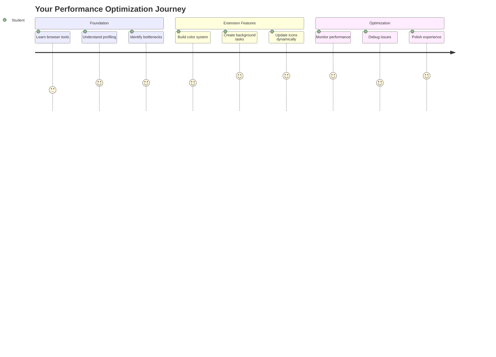
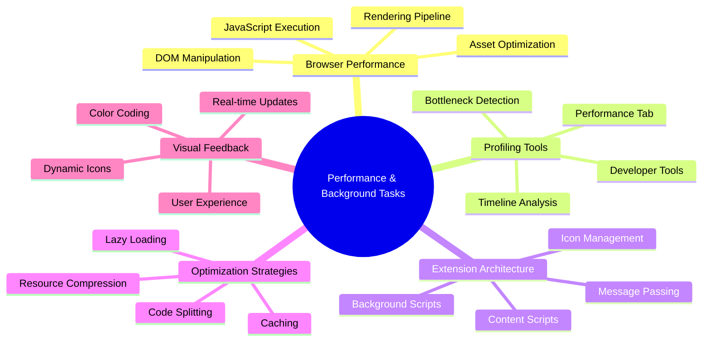
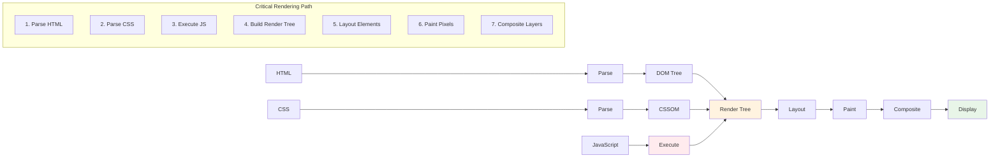
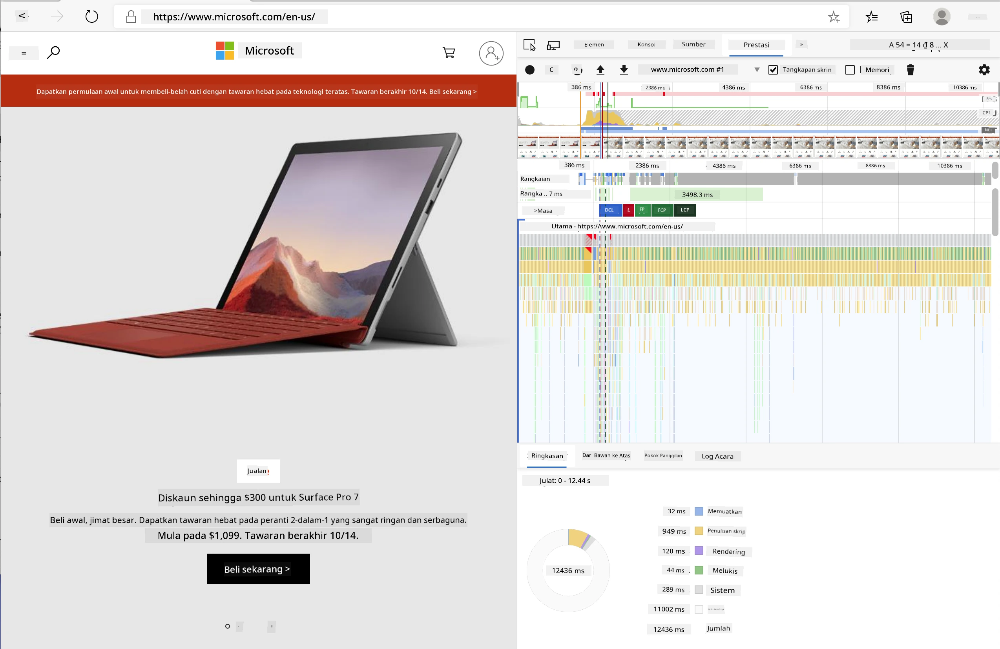
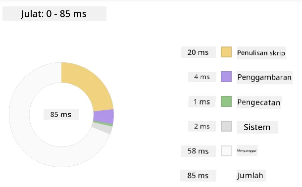
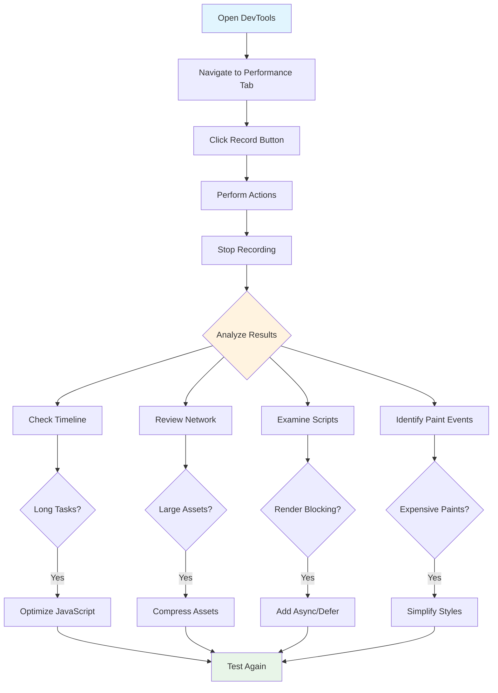
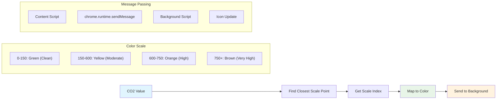
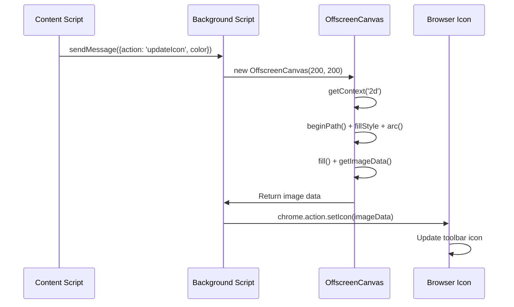
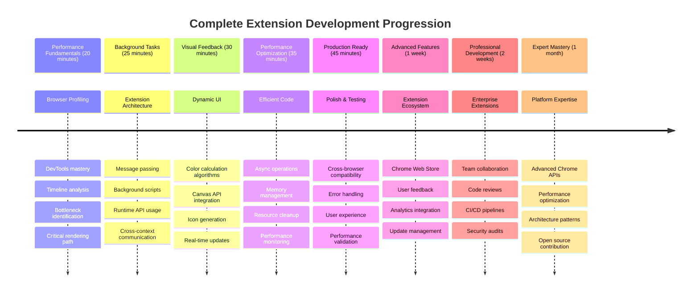

<!--
CO_OP_TRANSLATOR_METADATA:
{
  "original_hash": "b275fed2c6fc90d2b9b6661a3225faa2",
  "translation_date": "2025-11-06T12:22:45+00:00",
  "source_file": "5-browser-extension/3-background-tasks-and-performance/README.md",
  "language_code": "ms"
}
-->
# Projek Sambungan Pelayar Bahagian 3: Belajar tentang Tugas Latar Belakang dan Prestasi



Pernah tertanya-tanya apa yang membuatkan sesetengah sambungan pelayar terasa pantas dan responsif manakala yang lain kelihatan perlahan? Rahsianya terletak pada apa yang berlaku di belakang tabir. Semasa pengguna mengklik sekitar antara muka sambungan anda, terdapat dunia proses latar belakang yang senyap menguruskan pengambilan data, kemas kini ikon, dan sumber sistem.

Ini adalah pelajaran terakhir dalam siri sambungan pelayar, dan kami akan memastikan penjejak jejak karbon anda berfungsi dengan lancar. Anda akan menambah kemas kini ikon dinamik dan belajar bagaimana mengenal pasti masalah prestasi sebelum ia menjadi masalah besar. Ia seperti menyelaraskan kereta lumba - pengoptimuman kecil boleh membuat perbezaan besar dalam cara semuanya berjalan.

Apabila kita selesai, anda akan mempunyai sambungan yang kemas dan memahami prinsip prestasi yang membezakan aplikasi web yang baik daripada yang hebat. Mari kita terjun ke dunia pengoptimuman pelayar.

## Kuiz Pra-Kuliah

[Kuiz pra-kuliah](https://ff-quizzes.netlify.app/web/quiz/27)

### Pengenalan

Dalam pelajaran sebelumnya, anda telah membina borang, menyambungkannya ke API, dan menangani pengambilan data secara asinkron. Sambungan anda sedang terbentuk dengan baik.

Sekarang kita perlu menambah sentuhan akhir - seperti membuat ikon sambungan itu berubah warna berdasarkan data karbon. Ini mengingatkan saya bagaimana NASA perlu mengoptimumkan setiap sistem di kapal angkasa Apollo. Mereka tidak boleh membazirkan sebarang kitaran atau memori kerana prestasi adalah penting. Walaupun sambungan pelayar kita tidaklah sepenting itu, prinsip yang sama terpakai - kod yang cekap mencipta pengalaman pengguna yang lebih baik.



## Asas Prestasi Web

Apabila kod anda berjalan dengan cekap, orang sebenarnya *merasakan* perbezaannya. Anda tahu saat apabila halaman dimuatkan dengan serta-merta atau animasi mengalir dengan lancar? Itulah prestasi yang baik sedang berfungsi.

Prestasi bukan hanya tentang kelajuan - ia tentang mencipta pengalaman web yang terasa semula jadi dan tidak menjengkelkan. Pada zaman awal pengkomputeran, Grace Hopper terkenal menyimpan nanosecond (seutas wayar kira-kira satu kaki panjang) di mejanya untuk menunjukkan sejauh mana cahaya bergerak dalam satu bilion saat. Ia adalah cara beliau menjelaskan mengapa setiap mikrodetik penting dalam pengkomputeran. Mari kita terokai alat pengesan yang membantu anda mengetahui apa yang melambatkan sesuatu.

> "Prestasi laman web adalah tentang dua perkara: seberapa cepat halaman dimuatkan, dan seberapa cepat kod di dalamnya berjalan." -- [Zack Grossbart](https://www.smashingmagazine.com/2012/06/javascript-profiling-chrome-developer-tools/)

Topik tentang bagaimana membuat laman web anda sangat pantas pada semua jenis peranti, untuk semua jenis pengguna, dalam semua jenis situasi, tidaklah mengejutkan, sangat luas. Berikut adalah beberapa perkara yang perlu diingat semasa anda membina projek web standard atau sambungan pelayar.

Langkah pertama dalam mengoptimumkan laman anda adalah memahami apa yang sebenarnya berlaku di bawah permukaan. Nasib baik, pelayar anda dilengkapi dengan alat pengesan yang kuat.



Untuk membuka Alat Pembangun di Edge, klik tiga titik di sudut kanan atas, kemudian pergi ke Alat Lain > Alat Pembangun. Atau gunakan pintasan papan kekunci: `Ctrl` + `Shift` + `I` pada Windows atau `Option` + `Command` + `I` pada Mac. Setelah anda berada di sana, klik pada tab Prestasi - di sinilah anda akan melakukan penyiasatan anda.

**Berikut adalah alat pengesan prestasi anda:**
- **Buka** Alat Pembangun (anda akan menggunakannya secara berterusan sebagai pembangun!)
- **Pergi** ke tab Prestasi - anggap ia sebagai penjejak kecergasan aplikasi web anda
- **Tekan** butang Rekod dan lihat halaman anda beraksi
- **Kaji** hasil untuk mengenal pasti apa yang melambatkan sesuatu

Mari cuba ini. Buka laman web (Microsoft.com berfungsi dengan baik untuk ini) dan klik butang 'Rekod'. Sekarang segarkan halaman dan lihat profiler menangkap segala yang berlaku. Apabila anda berhenti merekod, anda akan melihat pecahan terperinci tentang bagaimana pelayar 'menykrip', 'merender', dan 'melukis' laman tersebut. Ia mengingatkan saya bagaimana pusat kawalan misi memantau setiap sistem semasa pelancaran roket - anda mendapat data masa nyata tentang apa yang berlaku dan bila.



✅ Dokumentasi [Microsoft](https://docs.microsoft.com/microsoft-edge/devtools-guide/performance/?WT.mc_id=academic-77807-sagibbon) mempunyai banyak lagi butiran jika anda ingin mendalami lebih jauh

> Tip pro: Kosongkan cache pelayar anda sebelum menguji untuk melihat bagaimana laman anda berprestasi untuk pelawat kali pertama - biasanya ia sangat berbeza daripada lawatan berulang!

Pilih elemen garis masa profil untuk memperbesar acara yang berlaku semasa halaman anda dimuatkan.

Dapatkan gambaran prestasi halaman anda dengan memilih bahagian garis masa profil dan melihat panel ringkasan:



Periksa panel Log Acara untuk melihat jika ada acara yang mengambil masa lebih daripada 15 ms:


✅ Kenali profiler anda! Buka alat pembangun di laman ini dan lihat jika ada halangan. Apakah aset yang paling lambat dimuatkan? Yang paling pantas?



## Apa yang Perlu Dicari Semasa Profiling

Menjalankan profiler hanyalah permulaan - kemahiran sebenar adalah mengetahui apa yang sebenarnya memberitahu anda tentang carta berwarna-warni itu. Jangan risau, anda akan terbiasa membacanya. Pembangun berpengalaman telah belajar mengenal pasti tanda amaran sebelum ia menjadi masalah besar.

Mari kita bincangkan suspek biasa - pengganggu prestasi yang cenderung menyelinap ke dalam projek web. Seperti bagaimana Marie Curie perlu memantau tahap radiasi dengan teliti di makmalnya, kita perlu memerhatikan corak tertentu yang menunjukkan masalah sedang berlaku. Menangkap ini lebih awal akan menjimatkan anda (dan pengguna anda) banyak kekecewaan.

**Saiz aset**: Laman web telah menjadi semakin "berat" selama bertahun-tahun, dan banyak berat tambahan itu datang daripada imej. Ia seperti kita telah memasukkan lebih banyak barang ke dalam beg digital kita.

✅ Lihat [Internet Archive](https://httparchive.org/reports/page-weight) untuk melihat bagaimana saiz halaman telah berkembang dari masa ke masa - ia sangat mendedahkan.

**Berikut adalah cara untuk memastikan aset anda dioptimumkan:**
- **Kompres** imej tersebut! Format moden seperti WebP boleh mengurangkan saiz fail dengan ketara
- **Hantar** saiz imej yang sesuai untuk setiap peranti - tidak perlu menghantar imej desktop besar ke telefon
- **Minify** CSS dan JavaScript anda - setiap byte adalah penting
- **Gunakan** pemuatan malas supaya imej hanya dimuat turun apabila pengguna benar-benar menatal ke arahnya

**Penelusuran DOM**: Pelayar perlu membina Model Objek Dokumen berdasarkan kod yang anda tulis, jadi demi prestasi halaman yang baik, pastikan tag anda minimum, hanya menggunakan dan menggayakan apa yang diperlukan oleh halaman. Untuk perkara ini, CSS yang berlebihan yang dikaitkan dengan halaman boleh dioptimumkan; gaya yang hanya perlu digunakan pada satu halaman tidak perlu dimasukkan dalam lembaran gaya utama, contohnya.

**Strategi utama untuk pengoptimuman DOM:**
- **Kurangkan** bilangan elemen HTML dan tahap sarang
- **Buang** peraturan CSS yang tidak digunakan dan gabungkan lembaran gaya dengan cekap
- **Susun** CSS untuk memuatkan hanya apa yang diperlukan untuk setiap halaman
- **Strukturkan** HTML secara semantik untuk penguraian pelayar yang lebih baik

**JavaScript**: Setiap pembangun JavaScript harus memerhatikan skrip 'render-blocking' yang mesti dimuatkan sebelum DOM yang lain dapat ditelusuri dan dilukis ke pelayar. Pertimbangkan menggunakan `defer` dengan skrip inline anda (seperti yang dilakukan dalam modul Terrarium).

**Teknik pengoptimuman JavaScript moden:**
- **Gunakan** atribut `defer` untuk memuatkan skrip selepas penguraian DOM
- **Laksanakan** pembahagian kod untuk memuatkan hanya JavaScript yang diperlukan
- **Terapkan** pemuatan malas untuk fungsi yang tidak kritikal
- **Kurangkan** penggunaan perpustakaan dan rangka kerja yang berat jika boleh

✅ Cuba beberapa laman web di laman [Ujian Kelajuan Laman](https://www.webpagetest.org/) untuk mengetahui lebih lanjut tentang pemeriksaan biasa yang dilakukan untuk menentukan prestasi laman.

### 🔄 **Pemeriksaan Pedagogi**
**Pemahaman Prestasi**: Sebelum membina ciri sambungan, pastikan anda boleh:
- ✅ Terangkan laluan rendering kritikal dari HTML ke piksel
- ✅ Kenal pasti halangan prestasi biasa dalam aplikasi web
- ✅ Gunakan alat pembangun pelayar untuk memprofilkan prestasi halaman
- ✅ Fahami bagaimana saiz aset dan kerumitan DOM mempengaruhi kelajuan

**Ujian Kendiri Cepat**: Apa yang berlaku apabila anda mempunyai JavaScript yang menghalang render?
*Jawapan: Pelayar mesti memuat turun dan melaksanakan skrip sebelum ia boleh terus menguraikan HTML dan merender halaman*

**Kesan Prestasi Dunia Sebenar**:
- **Kelewatan 100ms**: Pengguna perasan kelambatan
- **Kelewatan 1 saat**: Pengguna mula kehilangan fokus
- **Kelewatan 3+ saat**: 40% pengguna meninggalkan halaman
- **Rangkaian mudah alih**: Prestasi lebih penting lagi

Sekarang anda mempunyai idea tentang bagaimana pelayar merender aset yang anda hantar kepadanya, mari kita lihat beberapa perkara terakhir yang perlu anda lakukan untuk melengkapkan sambungan anda:

### Buat fungsi untuk mengira warna

Sekarang kita akan membuat fungsi yang menukar data berangka kepada warna yang bermakna. Anggaplah ia seperti sistem lampu isyarat - hijau untuk tenaga bersih, merah untuk intensiti karbon tinggi.

Fungsi ini akan mengambil data CO2 dari API kita dan menentukan warna yang paling sesuai mewakili impak alam sekitar. Ia serupa dengan bagaimana saintis menggunakan pengekodan warna dalam peta haba untuk menggambarkan corak data yang kompleks - dari suhu lautan hingga pembentukan bintang. Mari tambahkan ini ke `/src/index.js`, tepat selepas pembolehubah `const` yang telah kita tetapkan sebelum ini:



```javascript
function calculateColor(value) {
	// Define CO2 intensity scale (grams per kWh)
	const co2Scale = [0, 150, 600, 750, 800];
	// Corresponding colors from green (clean) to dark brown (high carbon)
	const colors = ['#2AA364', '#F5EB4D', '#9E4229', '#381D02', '#381D02'];

	// Find the closest scale value to our input
	const closestNum = co2Scale.sort((a, b) => {
		return Math.abs(a - value) - Math.abs(b - value);
	})[0];
	
	console.log(`${value} is closest to ${closestNum}`);
	
	// Find the index for color mapping
	const num = (element) => element > closestNum;
	const scaleIndex = co2Scale.findIndex(num);

	const closestColor = colors[scaleIndex];
	console.log(scaleIndex, closestColor);

	// Send color update message to background script
	chrome.runtime.sendMessage({ action: 'updateIcon', value: { color: closestColor } });
}
```

**Mari kita pecahkan fungsi kecil yang bijak ini:**
- **Menetapkan** dua array - satu untuk tahap CO2, satu lagi untuk warna (hijau = bersih, coklat = kotor!)
- **Mencari** padanan terdekat dengan nilai CO2 sebenar kita menggunakan beberapa pengisihan array yang bijak
- **Mengambil** warna yang sepadan menggunakan kaedah findIndex()
- **Menghantar** mesej kepada skrip latar belakang Chrome dengan warna yang dipilih
- **Menggunakan** template literals (backticks) untuk pemformatan string yang lebih bersih
- **Menjaga** semuanya teratur dengan deklarasi const

API `chrome.runtime` [API](https://developer.chrome.com/extensions/runtime) adalah seperti sistem saraf sambungan anda - ia mengendalikan semua komunikasi dan tugas di belakang tabir:

> "Gunakan API chrome.runtime untuk mendapatkan halaman latar belakang, mengembalikan butiran tentang manifest, dan mendengar serta bertindak balas terhadap acara dalam kitaran hayat aplikasi atau sambungan. Anda juga boleh menggunakan API ini untuk menukar laluan relatif URL kepada URL yang sepenuhnya layak."

**Mengapa API Chrome Runtime sangat berguna:**
- **Membolehkan** bahagian yang berbeza dari sambungan anda berkomunikasi antara satu sama lain
- **Mengendalikan** kerja latar belakang tanpa membekukan antara muka pengguna
- **Menguruskan** acara kitaran hayat sambungan anda
- **Memudahkan** penghantaran mesej antara skrip

✅ Jika anda sedang membangunkan sambungan pelayar ini untuk Edge, mungkin mengejutkan anda bahawa anda menggunakan API chrome. Versi pelayar Edge yang lebih baru berjalan pada enjin pelayar Chromium, jadi anda boleh memanfaatkan alat ini.

```mermaid
architecture-beta
    group browser(logos:chrome)[Browser]
    
    service popup(logos:html5)[Popup UI] in browser
    service content(logos:javascript)[Content Script] in browser
    service background(database)[Background Script] in browser
    service api(logos:api)[External API] in browser
    
    popup:R -- L:content
    content:R -- L:background
    background:T -- B:api
    content:T -- B:api
    
    junction junctionCenter in browser
    popup:R -- L:junctionCenter
    junctionCenter:R -- L:background
```



> **Tip Pro**: Jika anda ingin memprofilkan sambungan pelayar, lancarkan alat pembangun dari dalam sambungan itu sendiri, kerana ia adalah instance pelayar yang berasingan. Ini memberi anda akses kepada metrik prestasi khusus sambungan.

### Tetapkan warna ikon lalai

Sebelum kita mula mengambil data sebenar, mari kita berikan sambungan kita titik permulaan. Tiada siapa yang suka melihat ikon yang kosong atau kelihatan rosak. Kita akan mulakan dengan warna hijau supaya pengguna tahu sambungan itu berfungsi sebaik sahaja mereka memasangnya.

Dalam fungsi `init()` anda, mari tetapkan ikon hijau lalai itu:

```javascript
chrome.runtime.sendMessage({
	action: 'updateIcon',
	value: {
		color: 'green',
	},
});
```

**Apa yang dicapai oleh inisialisasi ini:**
- **Menetapkan** warna hijau neutral sebagai keadaan lalai
- **Memberikan** maklum balas visual segera apabila sambungan dimuatkan
- **Menetapkan** corak komunikasi dengan skrip latar belakang
- **Memastikan** pengguna melihat sambungan yang berfungsi sebelum data dimuatkan
### Panggil fungsi, laksanakan panggilan

Sekarang mari kita sambungkan semuanya supaya apabila data CO2 segar masuk, ikon anda secara automatik dikemas kini dengan warna yang betul. Ia seperti menyambungkan litar terakhir dalam peranti elektronik - tiba-tiba semua komponen individu berfungsi sebagai satu sistem.

Tambahkan baris ini tepat selepas anda mendapatkan data CO2 dari API:

```javascript
// After retrieving CO2 data from the API
// let CO2 = data.data[0].intensity.actual;
calculateColor(CO2);
```

**Integrasi ini mencapai:**
- **Menyambungkan** aliran data API dengan sistem penunjuk visual
- **Mencetuskan** kemas kini ikon secara automatik apabila data baru tiba
- **Memastikan** maklum balas visual masa nyata berdasarkan intensiti karbon semasa
- **Menjaga** pemisahan kebimbangan antara pengambilan data dan logik paparan

Dan akhirnya, dalam `/dist/background.js`, tambahkan pendengar untuk panggilan tindakan latar belakang ini:

```javascript
// Listen for messages from the content script
chrome.runtime.onMessage.addListener(function (msg, sender, sendResponse) {
	if (msg.action === 'updateIcon') {
		chrome.action.setIcon({ imageData: drawIcon(msg.value) });
	}
});

// Draw dynamic icon using Canvas API
// Borrowed from energy lollipop extension - nice feature!
function drawIcon(value) {
	// Create an offscreen canvas for better performance
	const canvas = new OffscreenCanvas(200, 200);
	const context = canvas.getContext('2d');

	// Draw a colored circle representing carbon intensity
	context.beginPath();
	context.fillStyle = value.color;
	context.arc(100, 100, 50, 0, 2 * Math.PI);
	context.fill();

	// Return the image data for the browser icon
	return context.getImageData(50, 50, 100, 100);
}
```

**Inilah yang dilakukan oleh skrip latar belakang ini:**
- **Mendengar** mesej dari skrip utama anda (seperti penyambut tetamu yang menerima panggilan)
- **Memproses** permintaan 'updateIcon' untuk menukar ikon toolbar anda
- **Mencipta** ikon baru secara langsung menggunakan API Canvas
- **Melukis** bulatan berwarna sederhana yang menunjukkan intensiti karbon semasa
- **Mengemas kini** toolbar pelayar anda dengan ikon baru
- **Menggunakan** OffscreenCanvas untuk prestasi yang lancar (tanpa menyekat UI)

✅ Anda akan belajar lebih lanjut tentang API Canvas dalam pelajaran [Permainan Angkasa](../../6-space-game/2-drawing-to-canvas/README.md).



### 🔄 **Pemeriksaan Pedagogi**
**Pemahaman Sambungan Lengkap**: Sahkan penguasaan anda terhadap keseluruhan sistem:
- ✅ Bagaimana mesej dihantar antara skrip sambungan yang berbeza?
- ✅ Mengapa kita menggunakan OffscreenCanvas dan bukannya Canvas biasa untuk prestasi?
- ✅ Apakah peranan Chrome Runtime API dalam seni bina sambungan?
- ✅ Bagaimana algoritma pengiraan warna memetakan data kepada maklum balas visual?

**Pertimbangan Prestasi**: Sambungan anda kini menunjukkan:
- **Pemesejan yang cekap**: Komunikasi yang bersih antara konteks skrip
- **Rendering yang dioptimumkan**: OffscreenCanvas mengelakkan sekatan UI
- **Kemas kini masa nyata**: Perubahan ikon dinamik berdasarkan data langsung
- **Pengurusan memori**: Pembersihan dan pengendalian sumber yang betul

**Masa untuk menguji sambungan anda:**
- **Bina** semuanya dengan `npm run build`
- **Muat semula** sambungan anda dalam pelayar (jangan lupa langkah ini)
- **Buka** sambungan anda dan lihat ikon itu berubah warna
- **Periksa** bagaimana ia bertindak balas terhadap data karbon sebenar dari seluruh dunia

Kini anda akan tahu dengan pantas sama ada masa sesuai untuk mencuci pakaian atau menunggu tenaga yang lebih bersih. Anda baru sahaja membina sesuatu yang benar-benar berguna dan belajar tentang prestasi pelayar sepanjang perjalanan.

## Cabaran GitHub Copilot Agent 🚀

Gunakan mod Agent untuk melengkapkan cabaran berikut:

**Penerangan:** Tingkatkan keupayaan pemantauan prestasi sambungan pelayar dengan menambah ciri yang menjejaki dan memaparkan masa muat untuk komponen sambungan yang berbeza.

**Arahan:** Cipta sistem pemantauan prestasi untuk sambungan pelayar yang mengukur dan merekod masa yang diambil untuk mendapatkan data CO2 dari API, mengira warna, dan mengemas kini ikon. Tambahkan fungsi bernama `performanceTracker` yang menggunakan Performance API untuk mengukur operasi ini dan memaparkan hasilnya dalam konsol pelayar dengan cap masa dan metrik durasi.

Ketahui lebih lanjut tentang [mod agent](https://code.visualstudio.com/blogs/2025/02/24/introducing-copilot-agent-mode) di sini.

## 🚀 Cabaran

Berikut adalah misi detektif yang menarik: pilih beberapa laman web sumber terbuka yang telah wujud selama bertahun-tahun (fikirkan Wikipedia, GitHub, atau Stack Overflow) dan selidiki sejarah komit mereka. Bolehkah anda mengenal pasti di mana mereka membuat penambahbaikan prestasi? Masalah apa yang sering muncul?

**Pendekatan penyiasatan anda:**
- **Cari** mesej komit untuk perkataan seperti "optimize," "performance," atau "faster"
- **Perhatikan** corak - adakah mereka sering membetulkan jenis masalah yang sama?
- **Kenal pasti** punca biasa yang memperlahankan laman web
- **Kongsi** apa yang anda temui - pembangun lain belajar daripada contoh dunia sebenar

## Kuiz Selepas Kuliah

[Kuiz selepas kuliah](https://ff-quizzes.netlify.app/web/quiz/28)

## Ulasan & Kajian Kendiri

Pertimbangkan untuk mendaftar [buletin prestasi](https://perf.email/)

Selidiki beberapa cara pelayar mengukur prestasi web dengan melihat tab prestasi dalam alat web mereka. Adakah anda menemui sebarang perbezaan besar?

### ⚡ **Apa yang Anda Boleh Lakukan dalam 5 Minit Seterusnya**
- [ ] Buka Pengurus Tugas pelayar (Shift+Esc dalam Chrome) untuk melihat penggunaan sumber sambungan
- [ ] Gunakan tab Prestasi DevTools untuk merekod dan menganalisis prestasi laman web
- [ ] Periksa halaman Sambungan pelayar untuk melihat sambungan mana yang memberi kesan kepada masa permulaan
- [ ] Cuba nyahaktifkan sambungan sementara untuk melihat perbezaan prestasi

### 🎯 **Apa yang Anda Boleh Capai Dalam Satu Jam**
- [ ] Lengkapkan kuiz selepas pelajaran dan fahami konsep prestasi
- [ ] Laksanakan skrip latar belakang untuk sambungan pelayar anda
- [ ] Belajar menggunakan browser.alarms untuk tugas latar belakang yang cekap
- [ ] Latih pemesejan antara skrip kandungan dan skrip latar belakang
- [ ] Ukur dan optimalkan penggunaan sumber sambungan anda

### 📅 **Perjalanan Prestasi Anda Selama Seminggu**
- [ ] Lengkapkan sambungan pelayar berprestasi tinggi dengan fungsi latar belakang
- [ ] Kuasai pekerja perkhidmatan dan seni bina sambungan moden
- [ ] Laksanakan strategi penyelarasan data dan caching yang cekap
- [ ] Belajar teknik debugging lanjutan untuk prestasi sambungan
- [ ] Optimumkan sambungan anda untuk fungsi dan kecekapan sumber
- [ ] Cipta ujian komprehensif untuk senario prestasi sambungan

### 🌟 **Penguasaan Pengoptimuman Anda Selama Sebulan**
- [ ] Bina sambungan pelayar gred perusahaan dengan prestasi optimum
- [ ] Belajar tentang Web Workers, Service Workers, dan prestasi web moden
- [ ] Menyumbang kepada projek sumber terbuka yang fokus pada pengoptimuman prestasi
- [ ] Kuasai dalaman pelayar dan teknik debugging lanjutan
- [ ] Cipta alat pemantauan prestasi dan panduan amalan terbaik
- [ ] Jadi pakar prestasi yang membantu mengoptimumkan aplikasi web

## 🎯 Garis Masa Penguasaan Sambungan Pelayar Anda



### 🛠️ Toolkit Pembangunan Sambungan Lengkap Anda

Selepas melengkapkan trilogi ini, anda kini telah menguasai:
- **Seni Bina Pelayar**: Pemahaman mendalam tentang bagaimana sambungan berintegrasi dengan sistem pelayar
- **Profil Prestasi**: Keupayaan untuk mengenal pasti dan membetulkan kelembapan menggunakan alat pembangun
- **Pengaturcaraan Asinkron**: Corak JavaScript moden untuk operasi responsif dan tidak menyekat
- **Integrasi API**: Pengambilan data luaran dengan pengesahan dan pengendalian ralat
- **Reka Bentuk Visual**: Kemas kini UI dinamik dan penjanaan grafik berasaskan Canvas
- **Pemesejan**: Komunikasi antara skrip dalam seni bina sambungan
- **Pengalaman Pengguna**: Keadaan pemuatan, pengendalian ralat, dan interaksi intuitif
- **Kemahiran Pengeluaran**: Pengujian, debugging, dan pengoptimuman untuk penggunaan dunia sebenar

**Aplikasi Dunia Sebenar**: Kemahiran pembangunan sambungan anda digunakan secara langsung untuk:
- **Aplikasi Web Progresif**: Seni bina dan corak prestasi yang serupa
- **Aplikasi Desktop Electron**: Aplikasi merentas platform menggunakan teknologi web
- **Aplikasi Hibrid Mudah Alih**: Pembangunan Cordova/PhoneGap menggunakan API web
- **Aplikasi Web Perusahaan**: Alat papan pemuka dan produktiviti yang kompleks
- **Sambungan DevTools Chrome**: Alat pembangun dan debugging lanjutan
- **Integrasi API Web**: Mana-mana aplikasi yang berkomunikasi dengan perkhidmatan luaran

**Kesan Profesional**: Anda kini boleh:
- **Membina** sambungan pelayar siap pengeluaran dari konsep hingga pelancaran
- **Mengoptimumkan** prestasi aplikasi web menggunakan alat profil industri standard
- **Mereka Bentuk** sistem yang boleh diskalakan dengan pemisahan kebimbangan yang betul
- **Debug** operasi asinkron yang kompleks dan komunikasi antara konteks
- **Menyumbang** kepada projek sambungan sumber terbuka dan piawaian pelayar

**Peluang Tahap Seterusnya**:
- **Pembangun Kedai Web Chrome**: Terbitkan sambungan untuk jutaan pengguna
- **Jurutera Prestasi Web**: Pakar dalam pengoptimuman dan pengalaman pengguna
- **Pembangun Platform Pelayar**: Menyumbang kepada pembangunan enjin pelayar
- **Pencipta Rangka Kerja Sambungan**: Bina alat yang membantu pembangun lain
- **Hubungan Pembangun**: Kongsi pengetahuan melalui pengajaran dan penciptaan kandungan

🌟 **Pencapaian Terkunci**: Anda telah membina sambungan pelayar lengkap dan berfungsi yang menunjukkan amalan pembangunan profesional dan piawaian web moden!

## Tugasan

[Analisis laman untuk prestasi](assignment.md)

---

**Penafian**:  
Dokumen ini telah diterjemahkan menggunakan perkhidmatan terjemahan AI [Co-op Translator](https://github.com/Azure/co-op-translator). Walaupun kami berusaha untuk ketepatan, sila ambil perhatian bahawa terjemahan automatik mungkin mengandungi kesilapan atau ketidaktepatan. Dokumen asal dalam bahasa asalnya harus dianggap sebagai sumber yang berwibawa. Untuk maklumat penting, terjemahan manusia profesional adalah disyorkan. Kami tidak bertanggungjawab atas sebarang salah faham atau salah tafsir yang timbul daripada penggunaan terjemahan ini.