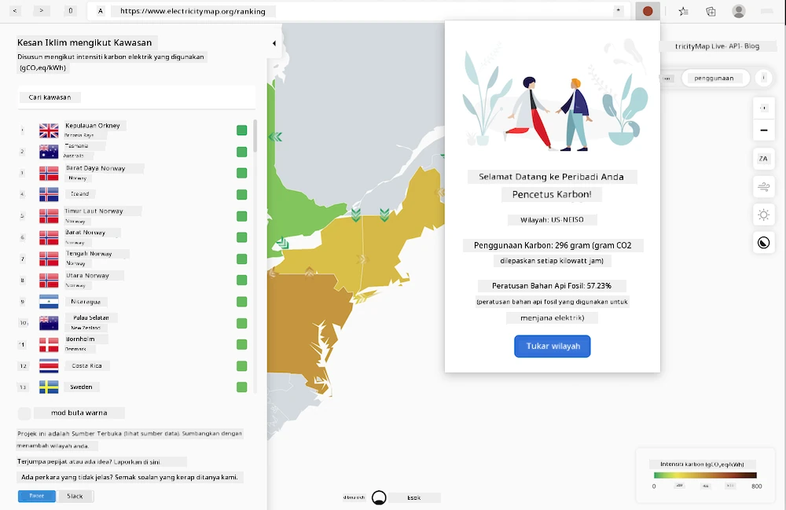

# Membina sambungan pelayar

Membina sambungan pelayar adalah cara yang menyeronokkan dan menarik untuk memikirkan prestasi aplikasi anda sambil membina aset web yang berbeza. Modul ini merangkumi pelajaran tentang bagaimana pelayar berfungsi dan cara untuk melancarkan sambungan pelayar, cara membina borang, memanggil API, menggunakan storan tempatan, serta cara menilai prestasi laman web anda dan meningkatkannya.

Anda akan membina sambungan pelayar yang berfungsi pada Edge, Chrome, dan Firefox. Sambungan ini, yang seperti laman web mini yang disesuaikan untuk tugas yang sangat spesifik, memeriksa [C02 Signal API](https://www.co2signal.com) untuk penggunaan elektrik dan intensiti karbon di kawasan tertentu, dan memberikan bacaan tentang jejak karbon kawasan tersebut.

Sambungan ini boleh dipanggil secara ad hoc oleh pengguna setelah kunci API dan kod kawasan dimasukkan ke dalam borang untuk menentukan penggunaan elektrik tempatan dan seterusnya menawarkan data yang boleh mempengaruhi keputusan elektrik pengguna. Sebagai contoh, mungkin lebih baik untuk menangguhkan penggunaan pengering pakaian (aktiviti yang intensif karbon) semasa tempoh penggunaan elektrik yang tinggi di kawasan anda.

### Topik

1. [Tentang pelayar](1-about-browsers/README.md)
2. [Borang dan storan tempatan](2-forms-browsers-local-storage/README.md)
3. [Tugas latar belakang dan prestasi](3-background-tasks-and-performance/README.md)

### Kredit

## Kredit

Idea untuk pencetus karbon web ini ditawarkan oleh Asim Hussain, ketua di Microsoft untuk pasukan Green Cloud Advocacy dan pengarang [Green Principles](https://principles.green/). Ia pada asalnya adalah [projek laman web](https://github.com/jlooper/green).

Struktur sambungan pelayar ini dipengaruhi oleh [sambungan COVID Adebola Adeniran](https://github.com/onedebos/covtension).

Konsep di sebalik sistem ikon 'dot' dicadangkan oleh struktur ikon sambungan pelayar [Energy Lollipop](https://energylollipop.com/) untuk pelepasan di California.

Pelajaran ini ditulis dengan ♥️ oleh [Jen Looper](https://www.twitter.com/jenlooper)

---

**Penafian**:  
Dokumen ini telah diterjemahkan menggunakan perkhidmatan terjemahan AI [Co-op Translator](https://github.com/Azure/co-op-translator). Walaupun kami berusaha untuk memastikan ketepatan, sila ambil perhatian bahawa terjemahan automatik mungkin mengandungi kesilapan atau ketidaktepatan. Dokumen asal dalam bahasa asalnya harus dianggap sebagai sumber yang berwibawa. Untuk maklumat yang kritikal, terjemahan manusia profesional adalah disyorkan. Kami tidak bertanggungjawab atas sebarang salah faham atau salah tafsir yang timbul daripada penggunaan terjemahan ini.