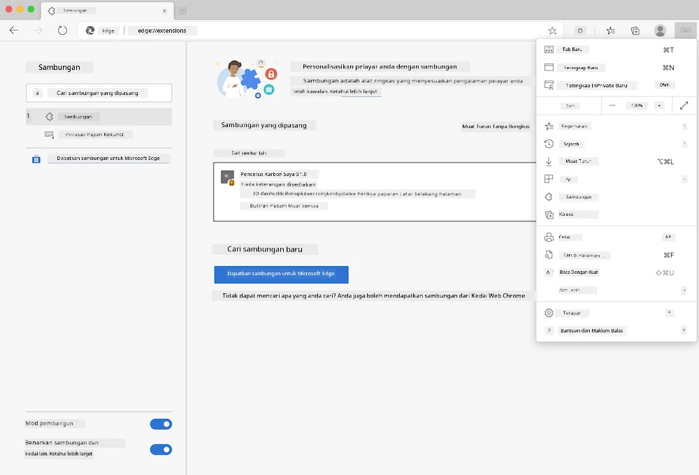

# Sambungan Penyemak Imbas Carbon Trigger: Kod Lengkap

Dengan menggunakan API C02 Signal daripada tmrow untuk menjejaki penggunaan elektrik, cipta sambungan penyemak imbas supaya anda boleh mendapat peringatan terus dalam penyemak imbas anda tentang penggunaan elektrik di kawasan anda. Penggunaan sambungan ini secara ad hoc akan membantu anda membuat keputusan berdasarkan maklumat tersebut.


## Memulakan

Anda perlu mempunyai [npm](https://npmjs.com) dipasang. Muat turun salinan kod ini ke dalam folder di komputer anda.

Pasang semua pakej yang diperlukan:

```
npm install
```

Bina sambungan menggunakan webpack

```
npm run build
```

Untuk memasang pada Edge, gunakan menu 'tiga titik' di sudut kanan atas penyemak imbas untuk mencari panel Sambungan. Dari situ, pilih 'Muatkan sambungan yang tidak dimampatkan' untuk memuatkan sambungan baharu. Buka folder 'dist' apabila diminta dan sambungan akan dimuatkan. Untuk menggunakannya, anda memerlukan kunci API untuk API CO2 Signal ([dapatkan satu melalui e-mel di sini](https://www.co2signal.com/) - masukkan e-mel anda dalam kotak di halaman ini) dan [kod untuk kawasan anda](http://api.electricitymap.org/v3/zones) yang sepadan dengan [Peta Elektrik](https://www.electricitymap.org/map) (contohnya, di Boston, saya menggunakan 'US-NEISO').



Sebaik sahaja kunci API dan kawasan dimasukkan ke dalam antara muka sambungan, titik berwarna dalam bar sambungan penyemak imbas akan berubah untuk mencerminkan penggunaan tenaga di kawasan anda dan memberikan petunjuk tentang aktiviti yang menggunakan tenaga yang sesuai untuk dilakukan. Konsep di sebalik sistem 'titik' ini diilhamkan oleh [sambungan Energy Lollipop](https://energylollipop.com/) untuk pelepasan di California.

---

**Penafian**:  
Dokumen ini telah diterjemahkan menggunakan perkhidmatan terjemahan AI [Co-op Translator](https://github.com/Azure/co-op-translator). Walaupun kami berusaha untuk memastikan ketepatan, sila ambil perhatian bahawa terjemahan automatik mungkin mengandungi kesilapan atau ketidaktepatan. Dokumen asal dalam bahasa asalnya harus dianggap sebagai sumber yang berwibawa. Untuk maklumat yang kritikal, terjemahan manusia profesional adalah disyorkan. Kami tidak bertanggungjawab atas sebarang salah faham atau salah tafsir yang timbul daripada penggunaan terjemahan ini.