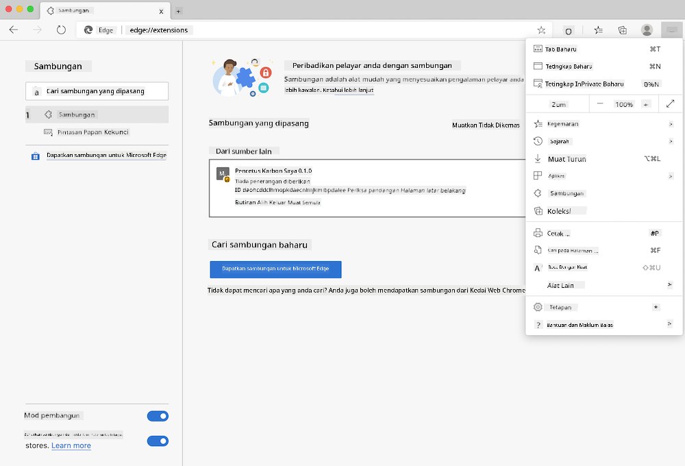

<!--
CO_OP_TRANSLATOR_METADATA:
{
  "original_hash": "dd58ae1b7707034f055718c1b68bc8de",
  "translation_date": "2025-08-27T22:24:33+00:00",
  "source_file": "5-browser-extension/solution/translation/README.hi.md",
  "language_code": "ms"
}
-->
# Sambungan Pelayar Carbon Trigger: Kod Lengkap

Menggunakan API C02 Signal dari tmrow untuk menjejak penggunaan elektrik, sambungan pelayar ini dibina untuk memberikan peringatan tentang seberapa berat penggunaan elektrik di kawasan anda semasa anda melayari internet. Dengan menggunakan sambungan ini, anda boleh membuat keputusan berdasarkan maklumat tersebut untuk aktiviti anda.


## Memulakan

Anda perlu memasang [npm](https://npmjs.com). Muat turun salinan kod ini ke dalam folder di komputer anda.

Pasang semua pakej yang diperlukan:

```
npm install
```

Bina sambungan menggunakan webpack:

```
npm run build
```

Untuk memasang di Edge, gunakan menu 'tiga titik' di sudut kanan atas pelayar untuk mencari panel sambungan. Dari situ, pilih 'Load Unpacked' untuk memuatkan sambungan baru. Pada prompt, buka folder 'dist' dan sambungan akan dimuatkan. Untuk menggunakannya, anda memerlukan kunci API CO2 Signal ([dapatkan melalui e-mel di sini](https://www.co2snal.com/) - masukkan e-mel anda dalam kotak di halaman tersebut) dan [kod kawasan anda](http://api.electricitymap.org/v3/zones) dari [Peta Elektrik](https://www.electricitymap.org/map) (contohnya, di Boston, saya menggunakan 'US-NEISO').



Setelah kunci API dan kod kawasan dimasukkan ke dalam antara muka sambungan, titik berwarna pada bar sambungan pelayar sepatutnya berubah untuk mencerminkan penggunaan tenaga di kawasan anda dan memberikan indikator tentang aktiviti berat tenaga yang sesuai untuk dilakukan. Konsep sistem 'titik' ini diilhamkan oleh [Energy Lollipop Extension](https://energylollipop.com/) untuk pelepasan di California.

---

**Penafian**:  
Dokumen ini telah diterjemahkan menggunakan perkhidmatan terjemahan AI [Co-op Translator](https://github.com/Azure/co-op-translator). Walaupun kami berusaha untuk memastikan ketepatan, sila ambil perhatian bahawa terjemahan automatik mungkin mengandungi kesilapan atau ketidaktepatan. Dokumen asal dalam bahasa asalnya harus dianggap sebagai sumber yang berwibawa. Untuk maklumat yang kritikal, terjemahan manusia profesional adalah disyorkan. Kami tidak bertanggungjawab atas sebarang salah faham atau salah tafsir yang timbul daripada penggunaan terjemahan ini.