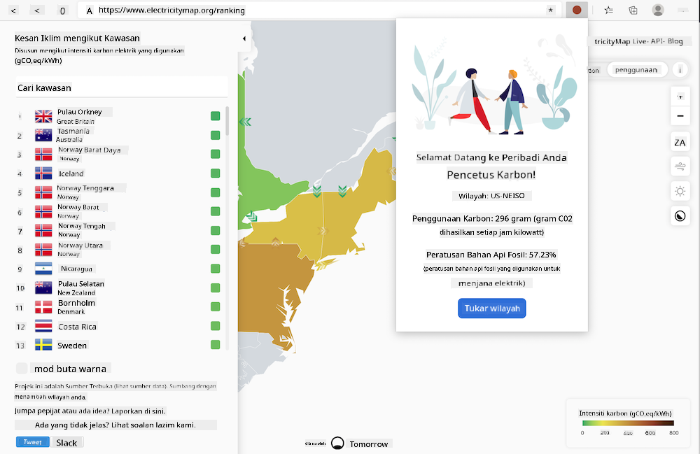

<!--
CO_OP_TRANSLATOR_METADATA:
{
  "original_hash": "3f5e6821e0febccfc5d05e7c944d9e3d",
  "translation_date": "2025-08-27T22:25:48+00:00",
  "source_file": "5-browser-extension/solution/translation/README.ja.md",
  "language_code": "ms"
}
-->
# Sambungan Penyemak Imbas Carbon Trigger: Kod Siap

Gunakan API CO2 Signal daripada tmrow untuk menjejak penggunaan tenaga elektrik anda dan memaparkan peringatan di penyemak imbas tentang betapa tinggi penggunaan tenaga di kawasan anda. Sambungan penyemak imbas ini membolehkan anda membuat keputusan berdasarkan maklumat tersebut secara ad hoc.



## Pengenalan

Pastikan [npm](https://npmjs.com) telah dipasang. Muat turun salinan kod ini ke folder di komputer anda.

Pasang semua pakej yang diperlukan.

```
npm install
```

Bina sambungan menggunakan webpack.

```
npm run build
```

Untuk memasang di Edge, cari panel "Extensions" melalui menu "tiga titik" di bahagian atas kanan penyemak imbas. Dari situ, pilih "Load Unpacked" untuk memuatkan sambungan baharu. Apabila diminta, buka folder "dist" dan sambungan akan dimuatkan. Untuk menggunakannya, anda memerlukan kunci API CO2 Signal ([dapatkan di sini melalui e-mel](https://www.co2signal.com/) - masukkan e-mel anda di kotak pada halaman tersebut) dan [kod untuk kawasan anda](http://api.electricitymap.org/v3/zones) yang sesuai dengan [Electricity Map](https://www.electricitymap.org/map) (contohnya, di Boston gunakan 'US-NEISO').


Setelah anda memasukkan kunci API dan kawasan ke dalam antara muka sambungan, titik berwarna yang dipaparkan di bar sambungan penyemak imbas akan berubah mengikut penggunaan tenaga di kawasan anda. Ini membantu anda menentukan aktiviti yang sesuai berdasarkan keperluan tenaga. Konsep sistem "titik" ini diilhamkan oleh sambungan [Energy Lollipop](https://energylollipop.com/) untuk pelepasan di California.

---

**Penafian**:  
Dokumen ini telah diterjemahkan menggunakan perkhidmatan terjemahan AI [Co-op Translator](https://github.com/Azure/co-op-translator). Walaupun kami berusaha untuk memastikan ketepatan, sila ambil perhatian bahawa terjemahan automatik mungkin mengandungi kesilapan atau ketidaktepatan. Dokumen asal dalam bahasa asalnya harus dianggap sebagai sumber yang berwibawa. Untuk maklumat yang kritikal, terjemahan manusia profesional adalah disyorkan. Kami tidak bertanggungjawab atas sebarang salah faham atau salah tafsir yang timbul daripada penggunaan terjemahan ini.