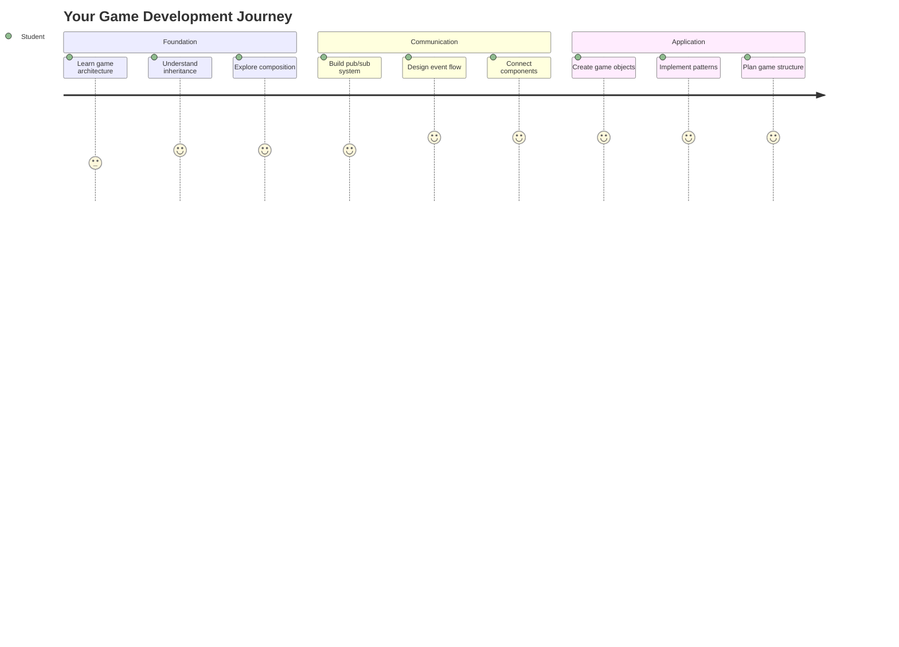
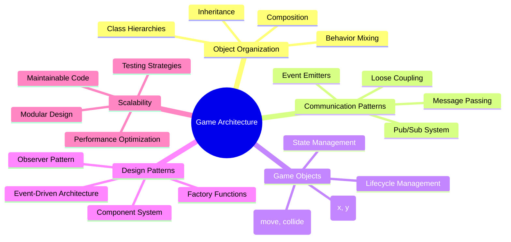
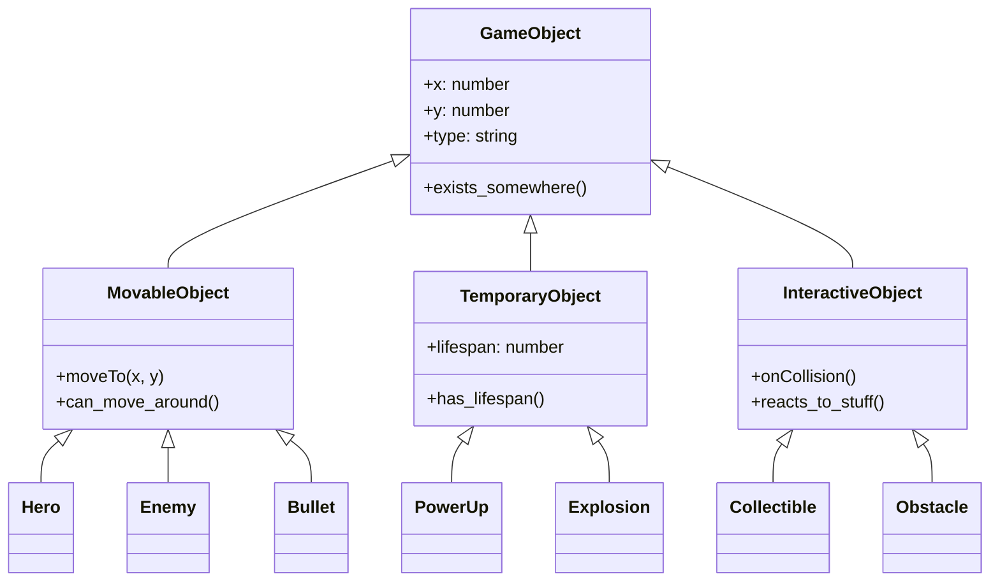
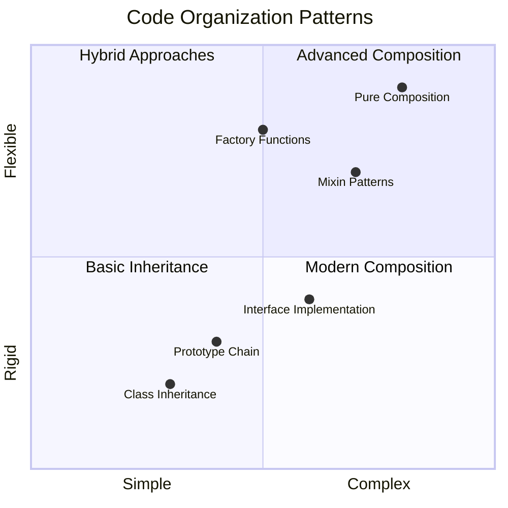
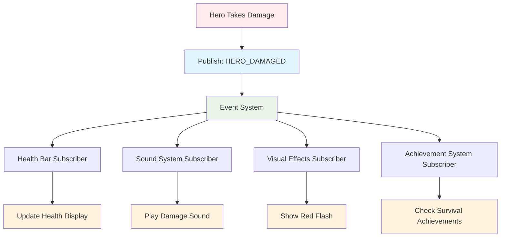
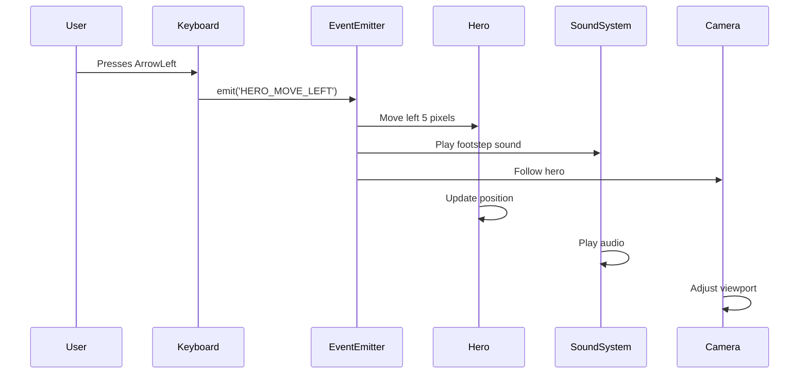
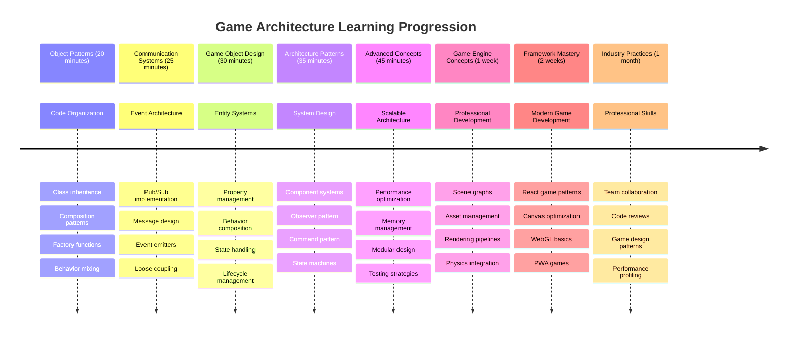

<!--
CO_OP_TRANSLATOR_METADATA:
{
  "original_hash": "a6332a7bb4d0be3bfd24199c83993777",
  "translation_date": "2025-11-06T12:21:37+00:00",
  "source_file": "6-space-game/1-introduction/README.md",
  "language_code": "ms"
}
-->
# Bina Permainan Angkasa Bahagian 1: Pengenalan




Sama seperti kawalan misi NASA yang menyelaraskan pelbagai sistem semasa pelancaran angkasa, kita akan membina permainan angkasa yang menunjukkan bagaimana bahagian-bahagian program boleh berfungsi bersama dengan lancar. Sambil mencipta sesuatu yang boleh anda mainkan, anda akan mempelajari konsep pengaturcaraan penting yang boleh digunakan dalam mana-mana projek perisian.

Kita akan meneroka dua pendekatan asas untuk mengatur kod: pewarisan dan komposisi. Ini bukan sekadar konsep akademik – ia adalah corak yang sama yang menggerakkan segala-galanya daripada permainan video hingga sistem perbankan. Kita juga akan melaksanakan sistem komunikasi yang dipanggil pub/sub yang berfungsi seperti rangkaian komunikasi yang digunakan dalam kapal angkasa, membolehkan komponen yang berbeza berkongsi maklumat tanpa mencipta pergantungan.

Pada akhir siri ini, anda akan memahami cara membina aplikasi yang boleh berkembang dan berubah – sama ada anda sedang membangunkan permainan, aplikasi web, atau sistem perisian lain.



## Kuiz Pra-Kuliah

[Kuiz pra-kuliah](https://ff-quizzes.netlify.app/web/quiz/29)

## Pewarisan dan Komposisi dalam Pembangunan Permainan

Apabila projek menjadi lebih kompleks, pengaturan kod menjadi kritikal. Apa yang bermula sebagai skrip mudah boleh menjadi sukar untuk dikendalikan tanpa struktur yang betul – sama seperti misi Apollo yang memerlukan koordinasi yang teliti antara ribuan komponen.

Kita akan meneroka dua pendekatan asas untuk mengatur kod: pewarisan dan komposisi. Setiap satu mempunyai kelebihan tersendiri, dan memahami kedua-duanya membantu anda memilih pendekatan yang sesuai untuk situasi yang berbeza. Kita akan menunjukkan konsep-konsep ini melalui permainan angkasa kita, di mana wira, musuh, kuasa tambahan, dan objek lain mesti berinteraksi dengan cekap.

✅ Salah satu buku pengaturcaraan paling terkenal yang pernah ditulis berkaitan dengan [corak reka bentuk](https://en.wikipedia.org/wiki/Design_Patterns).

Dalam mana-mana permainan, anda mempunyai `objek permainan` – elemen interaktif yang memenuhi dunia permainan anda. Wira, musuh, kuasa tambahan, dan kesan visual semuanya adalah objek permainan. Setiap satu wujud pada koordinat skrin tertentu menggunakan nilai `x` dan `y`, sama seperti memplot titik pada satah koordinat.

Walaupun berbeza secara visual, objek-objek ini sering berkongsi tingkah laku asas:

- **Mereka wujud di suatu tempat** – Setiap objek mempunyai koordinat x dan y supaya permainan tahu di mana untuk melukisnya
- **Ramai boleh bergerak** – Wira berlari, musuh mengejar, peluru terbang melintasi skrin
- **Mereka mempunyai jangka hayat** – Ada yang kekal selamanya, yang lain (seperti letupan) muncul sebentar dan hilang
- **Mereka bertindak balas terhadap sesuatu** – Apabila benda bertembung, kuasa tambahan dikumpulkan, bar kesihatan dikemas kini

✅ Fikirkan permainan seperti Pac-Man. Bolehkah anda mengenal pasti empat jenis objek yang disenaraikan di atas dalam permainan ini?



### Menyatakan Tingkah Laku Melalui Kod

Sekarang anda memahami tingkah laku biasa yang dikongsi oleh objek permainan, mari kita teroka cara melaksanakan tingkah laku ini dalam JavaScript. Anda boleh menyatakan tingkah laku objek melalui kaedah yang dilampirkan pada kelas atau objek individu, dan terdapat beberapa pendekatan untuk dipilih.

**Pendekatan Berasaskan Kelas**

Kelas dan pewarisan menyediakan pendekatan berstruktur untuk mengatur objek permainan. Seperti sistem klasifikasi taksonomi yang dibangunkan oleh Carl Linnaeus, anda bermula dengan kelas asas yang mengandungi sifat-sifat biasa, kemudian mencipta kelas khusus yang mewarisi asas-asas ini sambil menambah keupayaan tertentu.

✅ Pewarisan adalah konsep penting untuk difahami. Ketahui lebih lanjut dalam [artikel MDN tentang pewarisan](https://developer.mozilla.org/docs/Web/JavaScript/Inheritance_and_the_prototype_chain).

Berikut adalah cara anda boleh melaksanakan objek permainan menggunakan kelas dan pewarisan:

```javascript
// Step 1: Create the base GameObject class
class GameObject {
  constructor(x, y, type) {
    this.x = x;
    this.y = y;
    this.type = type;
  }
}
```

**Mari kita pecahkan langkah demi langkah:**
- Kita mencipta templat asas yang boleh digunakan oleh setiap objek permainan
- Pembina menyimpan di mana objek itu berada (`x`, `y`) dan jenis benda apa itu
- Ini menjadi asas yang akan dibina oleh semua objek permainan anda

```javascript
// Step 2: Add movement capability through inheritance
class Movable extends GameObject {
  constructor(x, y, type) {
    super(x, y, type); // Call parent constructor
  }

  // Add the ability to move to a new position
  moveTo(x, y) {
    this.x = x;
    this.y = y;
  }
}
```

**Dalam kod di atas, kita telah:**
- **Memanjangkan** kelas GameObject untuk menambah fungsi pergerakan
- **Memanggil** pembina induk menggunakan `super()` untuk memulakan sifat yang diwarisi
- **Menambah** kaedah `moveTo()` yang mengemas kini kedudukan objek

```javascript
// Step 3: Create specific game object types
class Hero extends Movable {
  constructor(x, y) {
    super(x, y, 'Hero'); // Set type automatically
  }
}

class Tree extends GameObject {
  constructor(x, y) {
    super(x, y, 'Tree'); // Trees don't need movement
  }
}

// Step 4: Use your game objects
const hero = new Hero(0, 0);
hero.moveTo(5, 5); // Hero can move!

const tree = new Tree(10, 15);
// tree.moveTo() would cause an error - trees can't move
```

**Memahami konsep-konsep ini:**
- **Mencipta** jenis objek khusus yang mewarisi tingkah laku yang sesuai
- **Menunjukkan** bagaimana pewarisan membolehkan kemasukan ciri secara selektif
- **Menunjukkan** bahawa wira boleh bergerak sementara pokok kekal pegun
- **Menggambarkan** bagaimana hierarki kelas menghalang tindakan yang tidak sesuai

✅ Luangkan beberapa minit untuk membayangkan semula wira Pac-Man (Inky, Pinky atau Blinky, sebagai contoh) dan bagaimana ia akan ditulis dalam JavaScript.

**Pendekatan Komposisi**

Komposisi mengikuti falsafah reka bentuk modular, sama seperti jurutera mereka bentuk kapal angkasa dengan komponen yang boleh ditukar ganti. Daripada mewarisi daripada kelas induk, anda menggabungkan tingkah laku tertentu untuk mencipta objek dengan fungsi yang tepat yang mereka perlukan. Pendekatan ini menawarkan fleksibiliti tanpa kekangan hierarki yang ketat.

```javascript
// Step 1: Create base behavior objects
const gameObject = {
  x: 0,
  y: 0,
  type: ''
};

const movable = {
  moveTo(x, y) {
    this.x = x;
    this.y = y;
  }
};
```

**Inilah yang dilakukan oleh kod ini:**
- **Mendefinisikan** objek asas `gameObject` dengan sifat kedudukan dan jenis
- **Mencipta** objek tingkah laku `movable` yang berasingan dengan fungsi pergerakan
- **Memisahkan** kebimbangan dengan mengekalkan data kedudukan dan logik pergerakan secara bebas

```javascript
// Step 2: Compose objects by combining behaviors
const movableObject = { ...gameObject, ...movable };

// Step 3: Create factory functions for different object types
function createHero(x, y) {
  return {
    ...movableObject,
    x,
    y,
    type: 'Hero'
  };
}

function createStatic(x, y, type) {
  return {
    ...gameObject,
    x,
    y,
    type
  };
}
```

**Dalam kod di atas, kita telah:**
- **Menggabungkan** sifat objek asas dengan tingkah laku pergerakan menggunakan sintaks penyebaran
- **Mencipta** fungsi kilang yang mengembalikan objek yang disesuaikan
- **Membolehkan** penciptaan objek yang fleksibel tanpa hierarki kelas yang ketat
- **Membolehkan** objek mempunyai tingkah laku yang tepat yang mereka perlukan

```javascript
// Step 4: Create and use your composed objects
const hero = createHero(10, 10);
hero.moveTo(5, 5); // Works perfectly!

const tree = createStatic(0, 0, 'Tree');
// tree.moveTo() is undefined - no movement behavior was composed
```

**Perkara utama untuk diingat:**
- **Menggabungkan** objek dengan mencampurkan tingkah laku daripada mewarisinya
- **Memberikan** lebih banyak fleksibiliti daripada hierarki pewarisan yang ketat
- **Membolehkan** objek mempunyai ciri-ciri yang tepat yang mereka perlukan
- **Menggunakan** sintaks penyebaran JavaScript moden untuk gabungan objek yang bersih
```

**Which Pattern Should You Choose?**

**Which Pattern Should You Choose?**



> 💡 **Tip Profesional**: Kedua-dua corak mempunyai tempat dalam pembangunan JavaScript moden. Kelas berfungsi dengan baik untuk hierarki yang jelas, sementara komposisi cemerlang apabila anda memerlukan fleksibiliti maksimum.
> 
**Inilah masa untuk menggunakan setiap pendekatan:**
- **Pilih** pewarisan apabila anda mempunyai hubungan "adalah" yang jelas (seorang Wira *adalah* objek yang boleh bergerak)
- **Pilih** komposisi apabila anda memerlukan hubungan "mempunyai" (seorang Wira *mempunyai* keupayaan pergerakan)
- **Pertimbangkan** keutamaan pasukan anda dan keperluan projek
- **Ingat** bahawa anda boleh mencampurkan kedua-dua pendekatan dalam aplikasi yang sama

### 🔄 **Pemeriksaan Pedagogi**
**Pemahaman Pengaturan Objek**: Sebelum beralih kepada corak komunikasi, pastikan anda boleh:
- ✅ Jelaskan perbezaan antara pewarisan dan komposisi
- ✅ Kenal pasti bila menggunakan kelas vs fungsi kilang
- ✅ Fahami bagaimana kata kunci `super()` berfungsi dalam pewarisan
- ✅ Kenali manfaat setiap pendekatan untuk pembangunan permainan

**Ujian Kendiri Cepat**: Bagaimana anda akan mencipta Musuh Terbang yang boleh bergerak dan terbang?
- **Pendekatan pewarisan**: `class FlyingEnemy extends Movable`
- **Pendekatan komposisi**: `{ ...movable, ...flyable, ...gameObject }`

**Hubungan Dunia Nyata**: Corak-corak ini muncul di mana-mana:
- **Komponen React**: Props (komposisi) vs pewarisan kelas
- **Enjin Permainan**: Sistem entiti-komponen menggunakan komposisi
- **Aplikasi Mudah Alih**: Kerangka UI sering menggunakan hierarki pewarisan

## Corak Komunikasi: Sistem Pub/Sub

Apabila aplikasi menjadi kompleks, mengurus komunikasi antara komponen menjadi mencabar. Corak publish-subscribe (pub/sub) menyelesaikan masalah ini menggunakan prinsip yang serupa dengan penyiaran radio – satu pemancar boleh mencapai pelbagai penerima tanpa mengetahui siapa yang mendengar.

Fikirkan apa yang berlaku apabila seorang wira mengalami kerosakan: bar kesihatan dikemas kini, kesan bunyi dimainkan, maklum balas visual muncul. Daripada menghubungkan objek wira secara langsung kepada sistem-sistem ini, pub/sub membolehkan wira menyiarkan mesej "kerosakan diterima". Mana-mana sistem yang perlu bertindak balas boleh melanggan jenis mesej ini dan bertindak sewajarnya.

✅ **Pub/Sub** bermaksud 'publish-subscribe'



### Memahami Seni Bina Pub/Sub

Corak pub/sub memastikan bahagian-bahagian aplikasi anda tidak bergantung secara langsung antara satu sama lain, bermakna mereka boleh bekerjasama tanpa pergantungan langsung. Pemisahan ini menjadikan kod anda lebih mudah diselenggara, diuji, dan fleksibel terhadap perubahan.

**Pemain utama dalam pub/sub:**
- **Mesej** – Label teks mudah seperti `'PLAYER_SCORED'` yang menerangkan apa yang berlaku (ditambah sebarang maklumat tambahan)
- **Penerbit** – Objek yang menjerit "Sesuatu telah berlaku!" kepada sesiapa yang mendengar
- **Pelanggan** – Objek yang berkata "Saya peduli tentang acara itu" dan bertindak apabila ia berlaku
- **Sistem Acara** – Orang tengah yang memastikan mesej sampai kepada pendengar yang betul

### Membina Sistem Acara

Mari kita cipta sistem acara yang mudah tetapi berkuasa yang menunjukkan konsep-konsep ini:

```javascript
// Step 1: Create the EventEmitter class
class EventEmitter {
  constructor() {
    this.listeners = {}; // Store all event listeners
  }
  
  // Register a listener for a specific message type
  on(message, listener) {
    if (!this.listeners[message]) {
      this.listeners[message] = [];
    }
    this.listeners[message].push(listener);
  }
  
  // Send a message to all registered listeners
  emit(message, payload = null) {
    if (this.listeners[message]) {
      this.listeners[message].forEach(listener => {
        listener(message, payload);
      });
    }
  }
}
```

**Memecahkan apa yang berlaku di sini:**
- **Mencipta** sistem pengurusan acara pusat menggunakan kelas mudah
- **Menyimpan** pendengar dalam objek yang diatur mengikut jenis mesej
- **Mendaftar** pendengar baru menggunakan kaedah `on()`
- **Menyiarkan** mesej kepada semua pendengar yang berminat menggunakan `emit()`
- **Menyokong** muatan data pilihan untuk menyampaikan maklumat yang relevan

### Menggabungkan Semuanya: Contoh Praktikal

Baiklah, mari kita lihat ini dalam tindakan! Kita akan membina sistem pergerakan mudah yang menunjukkan betapa bersih dan fleksibelnya pub/sub:

```javascript
// Step 1: Define your message types
const Messages = {
  HERO_MOVE_LEFT: 'HERO_MOVE_LEFT',
  HERO_MOVE_RIGHT: 'HERO_MOVE_RIGHT',
  ENEMY_SPOTTED: 'ENEMY_SPOTTED'
};

// Step 2: Create your event system and game objects
const eventEmitter = new EventEmitter();
const hero = createHero(0, 0);
```

**Inilah yang dilakukan oleh kod ini:**
- **Mendefinisikan** objek pemalar untuk mengelakkan kesilapan dalam nama mesej
- **Mencipta** contoh pemancar acara untuk mengendalikan semua komunikasi
- **Memulakan** objek wira pada kedudukan permulaan

```javascript
// Step 3: Set up event listeners (subscribers)
eventEmitter.on(Messages.HERO_MOVE_LEFT, () => {
  hero.moveTo(hero.x - 5, hero.y);
  console.log(`Hero moved to position: ${hero.x}, ${hero.y}`);
});

eventEmitter.on(Messages.HERO_MOVE_RIGHT, () => {
  hero.moveTo(hero.x + 5, hero.y);
  console.log(`Hero moved to position: ${hero.x}, ${hero.y}`);
});
```

**Dalam kod di atas, kita telah:**
- **Mendaftar** pendengar acara yang bertindak balas terhadap mesej pergerakan
- **Mengemas kini** kedudukan wira berdasarkan arah pergerakan
- **Menambah** log konsol untuk menjejaki perubahan kedudukan wira
- **Memisahkan** logik pergerakan daripada pengendalian input

```javascript
// Step 4: Connect keyboard input to events (publishers)
window.addEventListener('keydown', (event) => {
  switch(event.key) {
    case 'ArrowLeft':
      eventEmitter.emit(Messages.HERO_MOVE_LEFT);
      break;
    case 'ArrowRight':
      eventEmitter.emit(Messages.HERO_MOVE_RIGHT);
      break;
  }
});
```

**Memahami konsep-konsep ini:**
- **Menghubungkan** input papan kekunci kepada acara permainan tanpa pergantungan ketat
- **Membolehkan** sistem input berkomunikasi dengan objek permainan secara tidak langsung
- **Membolehkan** pelbagai sistem bertindak balas terhadap acara papan kekunci yang sama
- **Memudahkan** perubahan pada pengikatan kekunci atau penambahan kaedah input baru



> 💡 **Tip Profesional**: Keindahan corak ini adalah fleksibiliti! Anda boleh dengan mudah menambah kesan bunyi, gegaran skrin, atau kesan partikel hanya dengan menambah lebih banyak pendengar acara – tidak perlu mengubah kod papan kekunci atau pergerakan yang sedia ada.
> 
**Inilah sebabnya anda akan menyukai pendekatan ini:**
- Menambah ciri baru menjadi sangat mudah – hanya dengar acara yang anda pedulikan
- Banyak perkara boleh bertindak balas terhadap acara yang sama tanpa mengganggu satu sama lain
- Ujian menjadi jauh lebih mudah kerana setiap bahagian berfungsi secara bebas
- Apabila sesuatu rosak, anda tahu dengan tepat di mana untuk mencari

### Mengapa Pub/Sub Berkesan untuk Skala

Corak pub/sub mengekalkan kesederhanaan apabila aplikasi menjadi lebih kompleks. Sama ada menguruskan berpuluh-puluh musuh, kemas kini UI dinamik, atau sistem bunyi, corak ini mengendalikan peningkatan skala tanpa perubahan seni bina. Ciri-ciri baru boleh disepadukan ke dalam sistem acara yang sedia ada tanpa menjejaskan fungsi yang telah ditetapkan.

> ⚠️ **Kesilapan Biasa**: Jangan cipta terlalu banyak jenis mesej khusus pada awalnya. Mulakan dengan kategori yang luas dan perincikan mereka apabila keperluan permainan anda menjadi lebih jelas.
> 
**Amalan terbaik untuk diikuti:**
- **Mengelompokkan** mesej yang berkaitan ke dalam kategori logik
- **Menggunakan** nama deskriptif yang jelas menunjukkan apa yang berlaku
- **Menjaga** muatan mesej ringkas dan fokus
- **Mendokumentasikan** jenis mesej anda untuk kerjasama pasukan

### 🔄 **Pemeriksaan Pedagogi**
**Pemahaman Seni Bina Berasaskan Acara**: Sahkan pemahaman anda tentang sistem lengkap:
- ✅ Bagaimana corak pub/sub menghalang pergantungan ketat antara komponen?
- ✅ Mengapa lebih mudah untuk menambah ciri baru dengan seni bina berasaskan acara?
- ✅ Apakah peranan EventEmitter dalam aliran komunikasi?
- ✅ Bagaimana pemalar mesej mencegah pepijat dan meningkatkan kebolehselenggaraan?

**Cabaran Reka Bentuk**: Bagaimana anda akan mengendalikan senario permainan ini dengan pub/sub?
1. **Musuh mati**: Kemas kini skor, mainkan bunyi, hasilkan kuasa tambahan, keluarkan dari skrin
2. **Tahap selesai**: Hentikan muzik, tunjukkan UI, simpan kemajuan, muatkan tahap seterusnya
3. **Kuasa tambahan dikumpulkan**: Tingkatkan keupayaan, kemas kini UI, mainkan kesan, mulakan pemasa

**Hubungan Profesional**: Corak ini muncul dalam:
- **Kerangka Frontend**: Sistem acara React/Vue
- **Perkhidmatan Backend**: Komunikasi mikroservis
- **Enjin Permainan**: Sistem acara Unity
- **Pembangunan Mudah Alih**: Sistem pemberitahuan iOS/Android

---

## Cabaran Ejen GitHub Copilot 🚀

Gunakan mod Ejen untuk melengkapkan cabaran berikut:

**Penerangan:** Cipta sistem objek permainan mudah menggunakan kedua-dua pewarisan dan corak pub/sub. Anda akan melaksanakan permainan asas di mana objek yang berbeza boleh berkomunikasi melalui acara tanpa mengetahui secara langsung tentang satu sama lain.

**Arahan:** Cipta sistem permainan JavaScript dengan keperluan berikut: 1) Cipta kelas GameObject asas dengan koordinat x, y dan sifat jenis. 2) Cipta kelas Hero yang memanjangkan GameObject dan boleh bergerak. 3) Cipta kelas Enemy yang memanjangkan GameObject dan boleh mengejar wira. 4) Laksanakan kelas EventEmitter untuk corak pub/sub. 5) Tetapkan pendengar acara supaya apabila wira bergerak, musuh yang berdekatan menerima acara 'HERO_MOVED' dan mengemas kini kedudukan mereka untuk bergerak ke arah wira. Sertakan kenyataan console.log untuk menunjukkan komunikasi antara objek.

Ketahui lebih lanjut tentang [mod ejen](https://code.visualstudio.com/blogs/2025/02/24/introducing-copilot-agent-mode) di sini.

## 🚀 Cabaran
Pertimbangkan bagaimana corak pub-sub dapat meningkatkan seni bina permainan. Kenal pasti komponen mana yang harus mengeluarkan acara dan bagaimana sistem harus bertindak balas. Reka konsep permainan dan peta corak komunikasi antara komponennya.

## Kuiz Selepas Kuliah

[Kuiz selepas kuliah](https://ff-quizzes.netlify.app/web/quiz/30)

## Ulasan & Kajian Kendiri

Ketahui lebih lanjut tentang Pub/Sub dengan [membaca mengenainya](https://docs.microsoft.com/azure/architecture/patterns/publisher-subscriber/?WT.mc_id=academic-77807-sagibbon).

### ⚡ **Apa Yang Boleh Anda Lakukan Dalam 5 Minit Seterusnya**
- [ ] Buka mana-mana permainan HTML5 dalam talian dan periksa kodnya menggunakan DevTools
- [ ] Cipta elemen HTML5 Canvas ringkas dan lukis bentuk asas
- [ ] Cuba gunakan `setInterval` untuk mencipta gelung animasi ringkas
- [ ] Terokai dokumentasi API Canvas dan cuba kaedah melukis

### 🎯 **Apa Yang Boleh Anda Capai Dalam Satu Jam**
- [ ] Lengkapkan kuiz selepas pelajaran dan fahami konsep pembangunan permainan
- [ ] Sediakan struktur projek permainan anda dengan fail HTML, CSS, dan JavaScript
- [ ] Cipta gelung permainan asas yang mengemas kini dan merender secara berterusan
- [ ] Lukis sprite permainan pertama anda pada kanvas
- [ ] Laksanakan pemuatan aset asas untuk imej dan bunyi

### 📅 **Penciptaan Permainan Anda Sepanjang Minggu**
- [ ] Lengkapkan permainan angkasa penuh dengan semua ciri yang dirancang
- [ ] Tambahkan grafik yang menarik, kesan bunyi, dan animasi yang lancar
- [ ] Laksanakan keadaan permainan (skrin permulaan, permainan, tamat permainan)
- [ ] Cipta sistem pemarkahan dan penjejakan kemajuan pemain
- [ ] Jadikan permainan anda responsif dan boleh diakses di pelbagai peranti
- [ ] Kongsi permainan anda dalam talian dan kumpulkan maklum balas daripada pemain

### 🌟 **Pembangunan Permainan Anda Sepanjang Bulan**
- [ ] Bina pelbagai permainan yang meneroka genre dan mekanik yang berbeza
- [ ] Pelajari rangka kerja pembangunan permainan seperti Phaser atau Three.js
- [ ] Sumbang kepada projek pembangunan permainan sumber terbuka
- [ ] Kuasai corak pengaturcaraan permainan lanjutan dan pengoptimuman
- [ ] Cipta portfolio yang mempamerkan kemahiran pembangunan permainan anda
- [ ] Bimbing orang lain yang berminat dalam pembangunan permainan dan media interaktif

## 🎯 Garis Masa Penguasaan Pembangunan Permainan Anda



### 🛠️ Ringkasan Alat Seni Bina Permainan Anda

Selepas menyelesaikan pelajaran ini, anda kini mempunyai:
- **Penguasaan Corak Reka Bentuk**: Memahami pertukaran antara pewarisan dan komposisi
- **Seni Bina Berasaskan Acara**: Pelaksanaan pub/sub untuk komunikasi yang boleh diskalakan
- **Reka Bentuk Berorientasikan Objek**: Hierarki kelas dan komposisi tingkah laku
- **JavaScript Moden**: Fungsi kilang, sintaks penyebaran, dan corak ES6+
- **Seni Bina Boleh Diskalakan**: Prinsip reka bentuk modular dan penggandingan longgar
- **Asas Pembangunan Permainan**: Sistem entiti dan corak komponen
- **Corak Profesional**: Pendekatan standard industri untuk organisasi kod

**Aplikasi Dunia Sebenar**: Corak ini secara langsung digunakan untuk:
- **Rangka Kerja Frontend**: Seni bina komponen React/Vue dan pengurusan keadaan
- **Perkhidmatan Backend**: Komunikasi mikroservis dan sistem berasaskan acara
- **Pembangunan Mudah Alih**: Seni bina aplikasi iOS/Android dan sistem pemberitahuan
- **Enjin Permainan**: Pembangunan permainan berasaskan web, Unity, dan Unreal
- **Perisian Perusahaan**: Sumber acara dan reka bentuk sistem teragih
- **Reka Bentuk API**: Perkhidmatan RESTful dan komunikasi masa nyata

**Kemahiran Profesional Diperoleh**: Anda kini boleh:
- **Reka** seni bina perisian yang boleh diskalakan menggunakan corak terbukti
- **Laksanakan** sistem berasaskan acara yang mengendalikan interaksi kompleks
- **Pilih** strategi organisasi kod yang sesuai untuk senario berbeza
- **Nyahpepijat** dan selenggara sistem yang digabungkan secara longgar dengan berkesan
- **Komunikasi** keputusan teknikal menggunakan istilah standard industri

**Tahap Seterusnya**: Anda bersedia untuk melaksanakan corak ini dalam permainan sebenar, meneroka topik pembangunan permainan lanjutan, atau menerapkan konsep seni bina ini kepada aplikasi web!

🌟 **Pencapaian Terkunci**: Anda telah menguasai corak seni bina perisian asas yang menggerakkan segala-galanya daripada permainan mudah kepada sistem perusahaan yang kompleks!

## Tugasan

[Reka bentuk permainan](assignment.md)

---

**Penafian**:  
Dokumen ini telah diterjemahkan menggunakan perkhidmatan terjemahan AI [Co-op Translator](https://github.com/Azure/co-op-translator). Walaupun kami berusaha untuk ketepatan, sila ambil perhatian bahawa terjemahan automatik mungkin mengandungi kesilapan atau ketidaktepatan. Dokumen asal dalam bahasa asalnya harus dianggap sebagai sumber yang berwibawa. Untuk maklumat yang kritikal, terjemahan manusia profesional adalah disyorkan. Kami tidak bertanggungjawab atas sebarang salah faham atau salah tafsir yang timbul daripada penggunaan terjemahan ini.