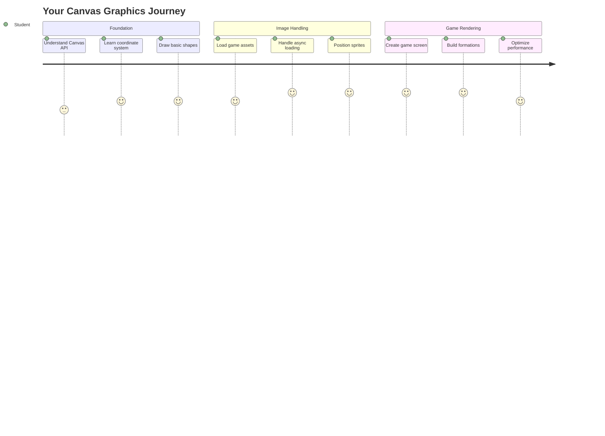
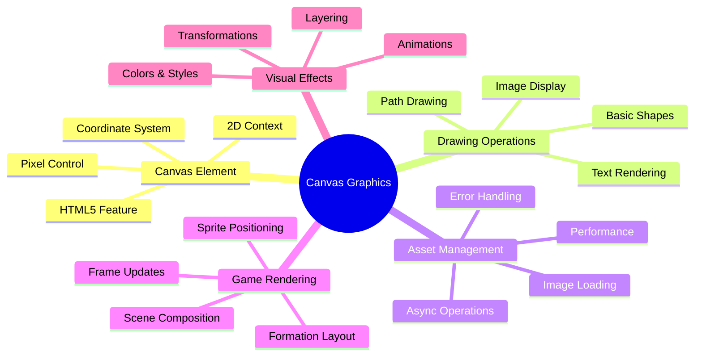
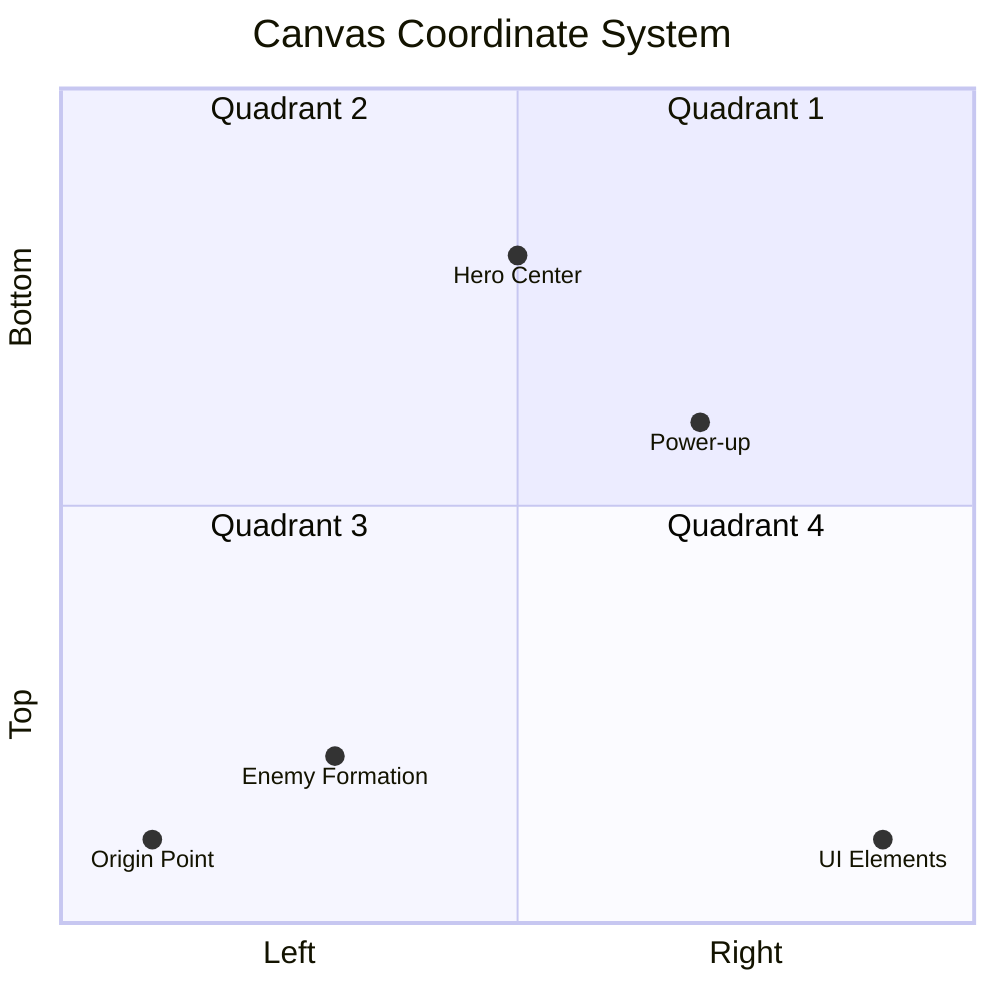
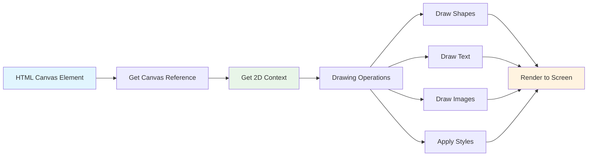
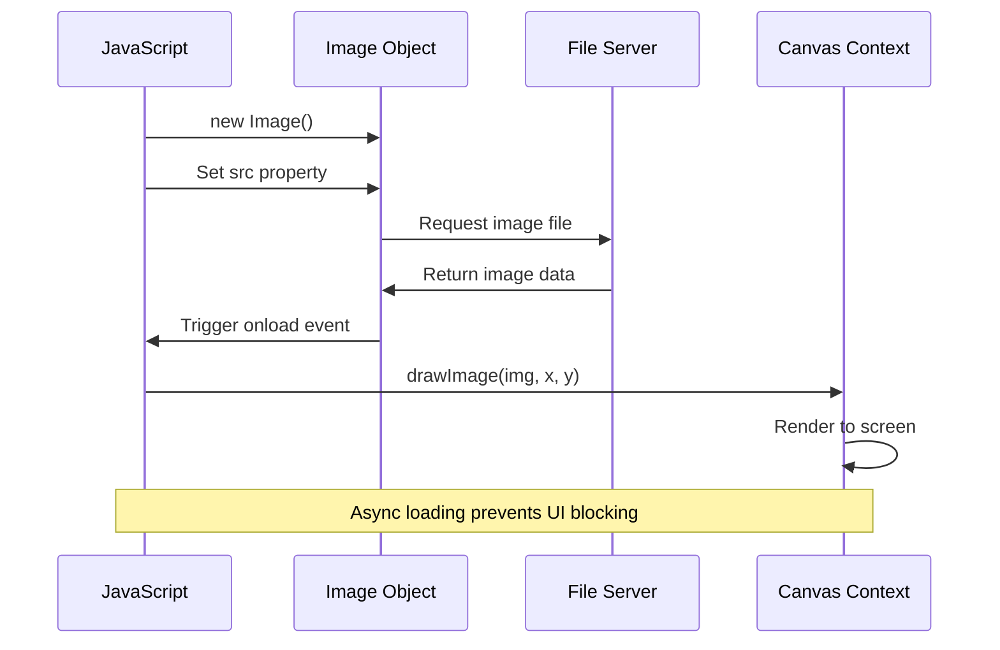
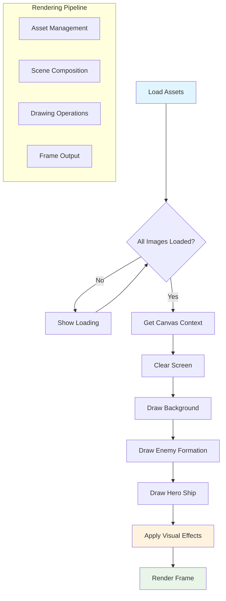
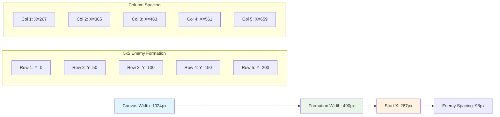
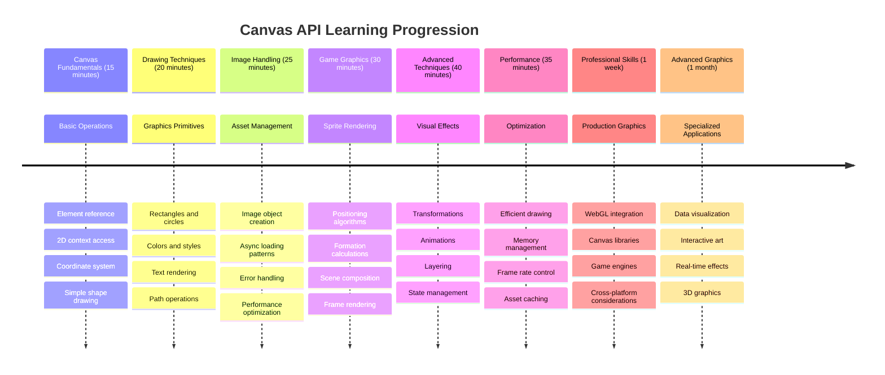

<!--
CO_OP_TRANSLATOR_METADATA:
{
  "original_hash": "7994743c5b21fdcceb36307916ef249a",
  "translation_date": "2025-11-06T12:19:29+00:00",
  "source_file": "6-space-game/2-drawing-to-canvas/README.md",
  "language_code": "ms"
}
-->
# Bina Permainan Angkasa Bahagian 2: Lukis Hero dan Raksasa pada Kanvas



API Kanvas adalah salah satu ciri paling berkuasa dalam pembangunan web untuk mencipta grafik dinamik dan interaktif terus dalam pelayar anda. Dalam pelajaran ini, kita akan mengubah elemen HTML `<canvas>` kosong itu menjadi dunia permainan yang dipenuhi dengan hero dan raksasa. Anggaplah kanvas sebagai papan seni digital anda di mana kod menjadi visual.

Kita akan membina berdasarkan apa yang anda pelajari dalam pelajaran sebelumnya, dan kini kita akan mendalami aspek visual. Anda akan belajar cara memuatkan dan memaparkan sprite permainan, meletakkan elemen dengan tepat, dan mencipta asas visual untuk permainan angkasa anda. Ini menjembatani jurang antara laman web statik dan pengalaman interaktif yang dinamik.

Menjelang akhir pelajaran ini, anda akan mempunyai adegan permainan lengkap dengan kapal hero anda yang diletakkan dengan betul dan formasi musuh yang bersedia untuk bertempur. Anda akan memahami bagaimana permainan moden memaparkan grafik dalam pelayar dan memperoleh kemahiran untuk mencipta pengalaman visual interaktif anda sendiri. Mari kita terokai grafik kanvas dan hidupkan permainan angkasa anda!



## Kuiz Pra-Pelajaran

[Kuiz pra-pelajaran](https://ff-quizzes.netlify.app/web/quiz/31)

## Kanvas

Jadi, apakah sebenarnya elemen `<canvas>` ini? Ia adalah penyelesaian HTML5 untuk mencipta grafik dan animasi dinamik dalam pelayar web. Tidak seperti imej atau video biasa yang statik, kanvas memberi anda kawalan pada tahap piksel terhadap segala yang muncul di skrin. Ini menjadikannya sempurna untuk permainan, visualisasi data, dan seni interaktif. Anggaplah ia sebagai permukaan lukisan yang boleh diprogramkan di mana JavaScript menjadi berus lukisan anda.

Secara lalai, elemen kanvas kelihatan seperti segi empat kosong dan telus pada halaman anda. Tetapi di situlah potensinya terletak! Kuasa sebenar muncul apabila anda menggunakan JavaScript untuk melukis bentuk, memuatkan imej, mencipta animasi, dan membuat sesuatu bertindak balas terhadap interaksi pengguna. Ia serupa dengan bagaimana perintis grafik komputer awal di Bell Labs pada tahun 1960-an perlu memprogram setiap piksel untuk mencipta animasi digital pertama.

✅ Baca [lebih lanjut tentang API Kanvas](https://developer.mozilla.org/docs/Web/API/Canvas_API) di MDN.

Berikut adalah cara ia biasanya diisytiharkan, sebagai sebahagian daripada badan halaman:

```html
<canvas id="myCanvas" width="200" height="100"></canvas>
```

**Inilah yang dilakukan oleh kod ini:**
- **Menetapkan** atribut `id` supaya anda boleh merujuk elemen kanvas tertentu ini dalam JavaScript
- **Menentukan** `width` dalam piksel untuk mengawal saiz mendatar kanvas
- **Menetapkan** `height` dalam piksel untuk menentukan dimensi menegak kanvas

## Melukis Geometri Mudah

Sekarang anda tahu apa itu elemen kanvas, mari kita terokai cara melukis di atasnya! Kanvas menggunakan sistem koordinat yang mungkin terasa biasa dari kelas matematik, tetapi ada satu kelainan penting yang khusus untuk grafik komputer.

Kanvas menggunakan koordinat Cartesian dengan paksi x (mendatar) dan paksi y (menegak) untuk meletakkan segala yang anda lukis. Tetapi inilah perbezaan utama: tidak seperti sistem koordinat dari kelas matematik, titik asal `(0,0)` bermula di sudut kiri atas, dengan nilai x meningkat apabila anda bergerak ke kanan dan nilai y meningkat apabila anda bergerak ke bawah. Pendekatan ini berasal dari paparan komputer awal di mana pancaran elektron mengimbas dari atas ke bawah, menjadikan kiri atas sebagai titik permulaan semula jadi.




> Imej dari [MDN](https://developer.mozilla.org/docs/Web/API/Canvas_API/Tutorial/Drawing_shapes)

Untuk melukis pada elemen kanvas, anda akan mengikuti proses tiga langkah yang sama yang membentuk asas semua grafik kanvas. Setelah anda melakukannya beberapa kali, ia menjadi kebiasaan:



1. **Dapatkan rujukan** kepada elemen Kanvas anda dari DOM (sama seperti elemen HTML lain)
2. **Dapatkan konteks rendering 2D** – ini menyediakan semua kaedah lukisan
3. **Mulakan melukis!** Gunakan kaedah terbina dalam konteks untuk mencipta grafik anda

Berikut adalah bagaimana ini kelihatan dalam kod:

```javascript
// Step 1: Get the canvas element
const canvas = document.getElementById("myCanvas");

// Step 2: Get the 2D rendering context
const ctx = canvas.getContext("2d");

// Step 3: Set fill color and draw a rectangle
ctx.fillStyle = 'red';
ctx.fillRect(0, 0, 200, 200); // x, y, width, height
```

**Mari kita pecahkan langkah demi langkah:**
- Kita **ambil** elemen kanvas kita menggunakan ID-nya dan simpan dalam pembolehubah
- Kita **dapatkan** konteks rendering 2D – ini adalah alat kita penuh dengan kaedah lukisan
- Kita **beritahu** kanvas bahawa kita mahu mengisi sesuatu dengan warna merah menggunakan sifat `fillStyle`
- Kita **lukis** segi empat bermula di sudut kiri atas (0,0) yang lebar dan tinggi 200 piksel

✅ API Kanvas kebanyakannya memberi tumpuan kepada bentuk 2D, tetapi anda juga boleh melukis elemen 3D ke laman web; untuk ini, anda mungkin menggunakan [API WebGL](https://developer.mozilla.org/docs/Web/API/WebGL_API).

Anda boleh melukis pelbagai perkara dengan API Kanvas seperti:

- **Bentuk geometri**, kami telah menunjukkan cara melukis segi empat, tetapi ada banyak lagi yang boleh anda lukis.
- **Teks**, anda boleh melukis teks dengan mana-mana fon dan warna yang anda inginkan.
- **Imej**, anda boleh melukis imej berdasarkan aset imej seperti .jpg atau .png sebagai contoh.

✅ Cuba! Anda tahu cara melukis segi empat, bolehkah anda melukis bulatan pada halaman? Lihat beberapa lukisan Kanvas yang menarik di CodePen. Berikut adalah [contoh yang sangat mengagumkan](https://codepen.io/dissimulate/pen/KrAwx).

### 🔄 **Pemeriksaan Pedagogi**
**Pemahaman Asas Kanvas**: Sebelum beralih ke pemuatan imej, pastikan anda boleh:
- ✅ Jelaskan bagaimana sistem koordinat kanvas berbeza daripada koordinat matematik
- ✅ Fahami proses tiga langkah untuk operasi lukisan kanvas
- ✅ Kenal pasti apa yang disediakan oleh konteks rendering 2D
- ✅ Terangkan bagaimana fillStyle dan fillRect berfungsi bersama

**Ujian Kendiri Cepat**: Bagaimana anda akan melukis bulatan biru di posisi (100, 50) dengan jejari 25?
```javascript
ctx.fillStyle = 'blue';
ctx.beginPath();
ctx.arc(100, 50, 25, 0, 2 * Math.PI);
ctx.fill();
```

**Kaedah Lukisan Kanvas yang Anda Ketahui Sekarang**:
- **fillRect()**: Melukis segi empat yang diisi
- **fillStyle**: Menetapkan warna dan corak
- **beginPath()**: Memulakan laluan lukisan baru
- **arc()**: Mencipta bulatan dan lengkung

## Memuatkan dan Melukis Aset Imej

Melukis bentuk asas berguna untuk permulaan, tetapi kebanyakan permainan memerlukan imej sebenar! Sprite, latar belakang, dan tekstur adalah apa yang memberikan permainan daya tarik visual. Memuatkan dan memaparkan imej pada kanvas berfungsi secara berbeza daripada melukis bentuk geometri, tetapi ia mudah difahami setelah anda memahami prosesnya.

Kita perlu mencipta objek `Image`, memuatkan fail imej kita (ini berlaku secara asinkron, bermaksud "di latar belakang"), dan kemudian melukisnya ke kanvas setelah ia sedia. Pendekatan ini memastikan imej anda dipaparkan dengan betul tanpa menyekat aplikasi anda semasa ia dimuatkan.



### Pemuatan Imej Asas

```javascript
const img = new Image();
img.src = 'path/to/my/image.png';
img.onload = () => {
  // Image loaded and ready to be used
  console.log('Image loaded successfully!');
};
```

**Inilah yang berlaku dalam kod ini:**
- Kita **cipta** objek Imej baru untuk memegang sprite atau tekstur kita
- Kita **beritahu** ia fail imej mana yang hendak dimuatkan dengan menetapkan laluan sumber
- Kita **dengar** acara muat supaya kita tahu dengan tepat bila imej sedia digunakan

### Cara Lebih Baik untuk Memuatkan Imej

Berikut adalah cara yang lebih mantap untuk mengendalikan pemuatan imej yang biasa digunakan oleh pembangun profesional. Kita akan membungkus pemuatan imej dalam fungsi berasaskan Janji – pendekatan ini, yang dipopularkan apabila Janji JavaScript menjadi standard dalam ES6, menjadikan kod anda lebih teratur dan mengendalikan ralat dengan baik:

```javascript
function loadAsset(path) {
  return new Promise((resolve, reject) => {
    const img = new Image();
    img.src = path;
    img.onload = () => {
      resolve(img);
    };
    img.onerror = () => {
      reject(new Error(`Failed to load image: ${path}`));
    };
  });
}

// Modern usage with async/await
async function initializeGame() {
  try {
    const heroImg = await loadAsset('hero.png');
    const monsterImg = await loadAsset('monster.png');
    // Images are now ready to use
  } catch (error) {
    console.error('Failed to load game assets:', error);
  }
}
```

**Apa yang telah kita lakukan di sini:**
- **Membungkus** semua logik pemuatan imej itu dalam Janji supaya kita boleh mengendalikannya dengan lebih baik
- **Menambah** pengendalian ralat yang sebenarnya memberitahu kita apabila sesuatu tidak kena
- **Menggunakan** sintaks async/await moden kerana ia lebih mudah dibaca
- **Termasuk** blok try/catch untuk mengendalikan sebarang masalah pemuatan dengan baik

Setelah imej anda dimuatkan, melukisnya ke kanvas sebenarnya agak mudah:

```javascript
async function renderGameScreen() {
  try {
    // Load game assets
    const heroImg = await loadAsset('hero.png');
    const monsterImg = await loadAsset('monster.png');

    // Get canvas and context
    const canvas = document.getElementById("myCanvas");
    const ctx = canvas.getContext("2d");

    // Draw images to specific positions
    ctx.drawImage(heroImg, canvas.width / 2, canvas.height / 2);
    ctx.drawImage(monsterImg, 0, 0);
  } catch (error) {
    console.error('Failed to render game screen:', error);
  }
}
```

**Mari kita lalui langkah demi langkah:**
- Kita **muatkan** kedua-dua imej hero dan raksasa kita di latar belakang menggunakan await
- Kita **ambil** elemen kanvas kita dan dapatkan konteks rendering 2D yang kita perlukan
- Kita **letakkan** imej hero di tengah menggunakan beberapa matematik koordinat cepat
- Kita **letakkan** imej raksasa di sudut kiri atas untuk memulakan formasi musuh kita
- Kita **tangkap** sebarang ralat yang mungkin berlaku semasa pemuatan atau rendering



## Kini Masa untuk Mula Membina Permainan Anda

Sekarang kita akan menggabungkan semuanya untuk mencipta asas visual permainan angkasa anda. Anda mempunyai pemahaman yang kukuh tentang asas kanvas dan teknik pemuatan imej, jadi bahagian praktikal ini akan membimbing anda melalui pembinaan skrin permainan lengkap dengan sprite yang diletakkan dengan betul.

### Apa yang Perlu Dibina

Anda akan membina halaman web dengan elemen Kanvas. Ia harus memaparkan skrin hitam `1024*768`. Kami telah menyediakan dua imej untuk anda:

- Kapal hero

   

- 5*5 raksasa

   

### Langkah yang Disyorkan untuk Memulakan Pembangunan

Cari fail permulaan yang telah dibuat untuk anda dalam sub folder `your-work`. Struktur projek anda harus mengandungi:

```bash
your-work/
├── assets/
│   ├── enemyShip.png
│   └── player.png
├── index.html
├── app.js
└── package.json
```

**Inilah yang anda sedang kerjakan:**
- **Sprite permainan** berada dalam folder `assets/` supaya semuanya kekal teratur
- **Fail HTML utama anda** menyediakan elemen kanvas dan menyediakan semuanya
- **Fail JavaScript** di mana anda akan menulis semua keajaiban rendering permainan anda
- **Package.json** yang menyediakan pelayan pembangunan supaya anda boleh menguji secara tempatan

Buka folder ini dalam Visual Studio Code untuk memulakan pembangunan. Anda memerlukan persekitaran pembangunan tempatan dengan Visual Studio Code, NPM, dan Node.js dipasang. Jika anda belum mempunyai `npm` disediakan pada komputer anda, [inilah cara untuk memasangnya](https://www.npmjs.com/get-npm).

Mulakan pelayan pembangunan anda dengan menavigasi ke folder `your-work`:

```bash
cd your-work
npm start
```

**Perintah ini melakukan beberapa perkara yang cukup hebat:**
- **Memulakan** pelayan tempatan di `http://localhost:5000` supaya anda boleh menguji permainan anda
- **Menyediakan** semua fail anda dengan betul supaya pelayar anda boleh memuatkannya dengan betul
- **Memantau** fail anda untuk perubahan supaya anda boleh membangun dengan lancar
- **Memberikan anda** persekitaran pembangunan profesional untuk menguji semuanya

> 💡 **Nota**: Pelayar anda akan menunjukkan halaman kosong pada mulanya – itu dijangka! Apabila anda menambah kod, segarkan pelayar anda untuk melihat perubahan anda. Pendekatan pembangunan berulang ini serupa dengan bagaimana NASA membina komputer panduan Apollo – menguji setiap komponen sebelum mengintegrasikannya ke dalam sistem yang lebih besar.

### Tambah kod

Tambah kod yang diperlukan ke `your-work/app.js` untuk melengkapkan tugas berikut:

1. **Lukis kanvas dengan latar belakang hitam**
   > 💡 **Inilah caranya**: Cari TODO dalam `/app.js` dan tambah hanya dua baris. Tetapkan `ctx.fillStyle` kepada hitam, kemudian gunakan `ctx.fillRect()` bermula di (0,0) dengan dimensi kanvas anda. Mudah!

2. **Muatkan tekstur permainan**
   > 💡 **Inilah caranya**: Gunakan `await loadAsset()` untuk memuatkan imej pemain dan musuh anda. Simpan mereka dalam pembolehubah supaya anda boleh menggunakannya kemudian. Ingat – mereka tidak akan muncul sehingga anda benar-benar melukis mereka!

3. **Lukis kapal hero di posisi tengah-bawah**
   > 💡 **Inilah caranya**: Gunakan `ctx.drawImage()` untuk meletakkan hero anda. Untuk koordinat x, cuba `canvas.width / 2 - 45` untuk meletakkannya di tengah, dan untuk koordinat y gunakan `canvas.height - canvas.height / 4` untuk meletakkannya di kawasan bawah.

4. **Lukis formasi 5×5 kapal musuh**
   > 💡 **Inilah caranya**: Cari fungsi `createEnemies` dan sediakan gelung bersarang. Anda perlu melakukan beberapa matematik untuk jarak dan posisi, tetapi jangan risau – saya akan tunjukkan kepada anda dengan tepat bagaimana!

Pertama, tetapkan pemalar untuk susun atur formasi musuh yang betul:

```javascript
const ENEMY_TOTAL = 5;
const ENEMY_SPACING = 98;
const FORMATION_WIDTH = ENEMY_TOTAL * ENEMY_SPACING;
const START_X = (canvas.width - FORMATION_WIDTH) / 2;
const STOP_X = START_X + FORMATION_WIDTH;
```

**Mari kita pecahkan apa yang dilakukan oleh pemalar ini:**
- Kita **tetapkan** 5 musuh setiap baris dan lajur (grid 5×5 yang bagus)
- Kita **tentukan** berapa banyak ruang untuk diletakkan antara musuh supaya mereka tidak kelihatan sempit
- Kita **kira** betapa lebar keseluruhan formasi kita
- Kita **fikirkan** di mana untuk bermula dan berhenti supaya formasi kelihatan terpusat



Kemudian, buat gelung bersarang untuk melukis formasi musuh:

```javascript
for (let x = START_X; x < STOP_X; x += ENEMY_SPACING) {
  for (let y = 0; y < 50 * 5; y += 50) {
    ctx.drawImage(enemyImg, x, y);
  }
}
```

**Inilah yang dilakukan oleh gelung bersarang ini:**
- Gelung luar **bergerak** dari kiri ke kanan merentasi formasi kita
- Gelung dalam **berjalan** dari atas ke bawah untuk mencipta barisan yang kemas
- Kita **lukis** setiap sprite musuh pada koordinat x,y yang kita kira
- Semuanya kekal **berjarak sama rata** supaya kelihatan profesional dan teratur

### 🔄 **Pemeriksaan Pedagogi**
**Penguasaan Rendering Permainan**: Sahkan pemahaman anda tentang sistem rendering lengkap:
- ✅ Bagaimana pemuatan imej asinkron mencegah penyekatan UI semasa permulaan permainan?
- ✅ Mengapa kita mengira posisi formasi musuh menggunakan pemalar dan bukannya kod keras?
- ✅ Apa peranan konteks rendering 2D dalam operasi lukisan?
- ✅ Bagaimana gelung bersarang mencipta formasi sprite yang teratur?

**Pertimbangan Prestasi**: Permainan anda kini menunjukkan:
- **Pemuatan aset yang cekap**: Pengurusan imej berasaskan Janji
- **Rendering teratur**: Operasi lukisan yang terstruktur
- **Posisi matematik**: Penempatan sprite yang dikira
- **Pengendalian ralat**: Pengurusan kegagalan yang baik

**Konsep Pengaturcaraan Visual**: Anda telah belajar:
- **Sistem koordinat**: Menterjemah matematik kepada kedudukan skrin
- **Pengurusan sprite**: Memuatkan dan memaparkan grafik permainan
- **Algoritma formasi**: Corak matematik untuk susunan yang teratur
- **Operasi async**: JavaScript moden untuk pengalaman pengguna yang lancar

## Hasil

Hasil akhir sepatutnya kelihatan seperti ini:


## Penyelesaian

Cuba selesaikan sendiri dahulu, tetapi jika anda buntu, lihat [penyelesaian](../../../../6-space-game/2-drawing-to-canvas/solution/app.js)

---

## Cabaran GitHub Copilot Agent 🚀

Gunakan mod Agent untuk melengkapkan cabaran berikut:

**Penerangan:** Tingkatkan kanvas permainan angkasa anda dengan menambah kesan visual dan elemen interaktif menggunakan teknik Canvas API yang telah anda pelajari.

**Arahan:** Buat fail baru bernama `enhanced-canvas.html` dengan kanvas yang memaparkan bintang animasi di latar belakang, bar kesihatan berdenyut untuk kapal hero, dan kapal musuh yang perlahan-lahan bergerak ke bawah. Sertakan kod JavaScript yang melukis bintang berkelip menggunakan kedudukan dan kelegapan rawak, melaksanakan bar kesihatan yang berubah warna berdasarkan tahap kesihatan (hijau > kuning > merah), dan menganimasikan kapal musuh untuk bergerak ke bawah skrin dengan kelajuan yang berbeza.

Ketahui lebih lanjut tentang [mod agent](https://code.visualstudio.com/blogs/2025/02/24/introducing-copilot-agent-mode) di sini.

## 🚀 Cabaran

Anda telah mempelajari tentang melukis dengan Canvas API yang berfokus pada 2D; lihat [WebGL API](https://developer.mozilla.org/docs/Web/API/WebGL_API), dan cuba lukis objek 3D.

## Kuiz Selepas Kuliah

[Kuiz selepas kuliah](https://ff-quizzes.netlify.app/web/quiz/32)

## Ulasan & Kajian Sendiri

Ketahui lebih lanjut tentang Canvas API dengan [membacanya](https://developer.mozilla.org/docs/Web/API/Canvas_API).

### ⚡ **Apa Yang Boleh Anda Lakukan Dalam 5 Minit Seterusnya**
- [ ] Buka konsol pelayar dan buat elemen kanvas dengan `document.createElement('canvas')`
- [ ] Cuba lukis segi empat menggunakan `fillRect()` pada konteks kanvas
- [ ] Bereksperimen dengan warna yang berbeza menggunakan sifat `fillStyle`
- [ ] Lukis bulatan mudah menggunakan kaedah `arc()`

### 🎯 **Apa Yang Boleh Anda Capai Dalam Satu Jam**
- [ ] Lengkapkan kuiz selepas pelajaran dan fahami asas kanvas
- [ ] Buat aplikasi lukisan kanvas dengan pelbagai bentuk dan warna
- [ ] Laksanakan pemuatan imej dan rendering sprite untuk permainan anda
- [ ] Bina animasi mudah yang menggerakkan objek merentasi kanvas
- [ ] Latih transformasi kanvas seperti penskalaan, putaran, dan terjemahan

### 📅 **Perjalanan Kanvas Anda Selama Seminggu**
- [ ] Lengkapkan permainan angkasa dengan grafik yang diperkemas dan animasi sprite
- [ ] Kuasai teknik kanvas lanjutan seperti gradien, corak, dan komposit
- [ ] Buat visualisasi interaktif menggunakan kanvas untuk perwakilan data
- [ ] Ketahui teknik pengoptimuman kanvas untuk prestasi yang lancar
- [ ] Bina aplikasi lukisan atau melukis dengan pelbagai alat
- [ ] Terokai corak pengkodan kreatif dan seni generatif dengan kanvas

### 🌟 **Penguasaan Grafik Anda Selama Sebulan**
- [ ] Bina aplikasi visual kompleks menggunakan Canvas 2D dan WebGL
- [ ] Ketahui konsep pengaturcaraan grafik dan asas shader
- [ ] Sumbang kepada perpustakaan grafik sumber terbuka dan alat visualisasi
- [ ] Kuasai pengoptimuman prestasi untuk aplikasi intensif grafik
- [ ] Buat kandungan pendidikan tentang pengaturcaraan kanvas dan grafik komputer
- [ ] Jadi pakar pengaturcaraan grafik yang membantu orang lain mencipta pengalaman visual

## 🎯 Garis Masa Penguasaan Grafik Kanvas Anda



### 🛠️ Ringkasan Alat Grafik Kanvas Anda

Selepas melengkapkan pelajaran ini, anda kini mempunyai:
- **Penguasaan Canvas API**: Pemahaman lengkap tentang pengaturcaraan grafik 2D
- **Matematik Koordinat**: Penentuan kedudukan dan algoritma susunan yang tepat
- **Pengurusan Aset**: Pemuatan imej profesional dan pengendalian ralat
- **Pipeline Rendering**: Pendekatan berstruktur untuk komposisi adegan
- **Grafik Permainan**: Penentuan kedudukan sprite dan pengiraan formasi
- **Pengaturcaraan Async**: Corak JavaScript moden untuk prestasi yang lancar
- **Pengaturcaraan Visual**: Menterjemah konsep matematik kepada grafik skrin

**Aplikasi Dunia Nyata**: Kemahiran Kanvas anda secara langsung digunakan untuk:
- **Visualisasi Data**: Carta, graf, dan papan pemuka interaktif
- **Pembangunan Permainan**: Permainan 2D, simulasi, dan pengalaman interaktif
- **Seni Digital**: Pengkodan kreatif dan projek seni generatif
- **Reka Bentuk UI/UX**: Grafik tersuai dan elemen interaktif
- **Perisian Pendidikan**: Alat pembelajaran visual dan simulasi
- **Aplikasi Web**: Grafik dinamik dan visualisasi masa nyata

**Kemahiran Profesional Diperoleh**: Anda kini boleh:
- **Membina** penyelesaian grafik tersuai tanpa perpustakaan luaran
- **Mengoptimumkan** prestasi rendering untuk pengalaman pengguna yang lancar
- **Menyahpepijat** masalah visual kompleks menggunakan alat pembangun pelayar
- **Mereka Bentuk** sistem grafik yang boleh diskalakan menggunakan prinsip matematik
- **Mengintegrasikan** grafik Kanvas dengan rangka kerja aplikasi web moden

**Kaedah Canvas API Yang Anda Kuasai**:
- **Pengurusan Elemen**: getElementById, getContext
- **Operasi Lukisan**: fillRect, drawImage, fillStyle
- **Pemuatan Aset**: Objek Imej, corak Promise
- **Penentuan Kedudukan Matematik**: Pengiraan koordinat, algoritma formasi

**Tahap Seterusnya**: Anda bersedia untuk menambah animasi, interaksi pengguna, pengesanan perlanggaran, atau meneroka WebGL untuk grafik 3D!

🌟 **Pencapaian Terkunci**: Anda telah membina sistem rendering permainan lengkap menggunakan teknik asas Canvas API!

## Tugasan

[Bermain dengan Canvas API](assignment.md)

---

**Penafian**:  
Dokumen ini telah diterjemahkan menggunakan perkhidmatan terjemahan AI [Co-op Translator](https://github.com/Azure/co-op-translator). Walaupun kami berusaha untuk ketepatan, sila ambil perhatian bahawa terjemahan automatik mungkin mengandungi kesilapan atau ketidaktepatan. Dokumen asal dalam bahasa asalnya harus dianggap sebagai sumber yang berwibawa. Untuk maklumat kritikal, terjemahan manusia profesional adalah disyorkan. Kami tidak bertanggungjawab atas sebarang salah faham atau salah tafsir yang timbul daripada penggunaan terjemahan ini.