<!--
CO_OP_TRANSLATOR_METADATA:
{
  "original_hash": "039b4d8ce65f5edd82cf48d9c3e6728c",
  "translation_date": "2025-11-06T12:20:54+00:00",
  "source_file": "6-space-game/4-collision-detection/README.md",
  "language_code": "ms"
}
-->
# Bina Permainan Angkasa Bahagian 4: Menambah Laser dan Mengesan Perlanggaran


## Kuiz Pra-Kuliah

[Kuiz pra-kuliah](https://ff-quizzes.netlify.app/web/quiz/35)

Fikirkan saat dalam Star Wars apabila torpedo proton Luke mengenai lubang ekzos Death Star. Pengesanan perlanggaran yang tepat itu mengubah nasib galaksi! Dalam permainan, pengesanan perlanggaran berfungsi dengan cara yang sama - ia menentukan bila objek berinteraksi dan apa yang berlaku seterusnya.

Dalam pelajaran ini, anda akan menambah senjata laser ke permainan angkasa anda dan melaksanakan pengesanan perlanggaran. Sama seperti perancang misi NASA mengira trajektori kapal angkasa untuk mengelakkan serpihan, anda akan belajar mengesan apabila objek permainan bersilang. Kami akan memecahkannya kepada langkah-langkah yang mudah diikuti.

Pada akhirnya, anda akan mempunyai sistem pertempuran yang berfungsi di mana laser memusnahkan musuh dan perlanggaran mencetuskan acara permainan. Prinsip perlanggaran yang sama ini digunakan dalam segala-galanya daripada simulasi fizik hingga antara muka web interaktif.


✅ Lakukan sedikit penyelidikan tentang permainan komputer pertama yang pernah ditulis. Apakah fungsinya?

## Pengesanan perlanggaran

Pengesanan perlanggaran berfungsi seperti sensor jarak pada modul lunar Apollo - ia sentiasa memeriksa jarak dan mencetuskan amaran apabila objek terlalu dekat. Dalam permainan, sistem ini menentukan bila objek berinteraksi dan apa yang perlu dilakukan seterusnya.

Pendekatan yang akan kita gunakan menganggap setiap objek permainan sebagai segi empat tepat, sama seperti bagaimana sistem kawalan lalu lintas udara menggunakan bentuk geometri yang dipermudahkan untuk mengesan pesawat. Kaedah segi empat tepat ini mungkin kelihatan asas, tetapi ia cekap dari segi pengiraan dan berfungsi dengan baik untuk kebanyakan senario permainan.

### Perwakilan segi empat tepat

Setiap objek permainan memerlukan sempadan koordinat, sama seperti bagaimana rover Mars Pathfinder memetakan lokasinya di permukaan Marikh. Berikut adalah cara kita mentakrifkan koordinat sempadan ini:

```mermaid
flowchart TD
    A["🎯 Game Object"] --> B["📍 Position (x, y)"]
    A --> C["📏 Dimensions (width, height)"]
    
    B --> D["Top: y"]
    B --> E["Left: x"]
    
    C --> F["Bottom: y + height"]
    C --> G["Right: x + width"]
    
    D --> H["🔲 Rectangle Bounds"]
    E --> H
    F --> H
    G --> H
    
    H --> I["Collision Detection Ready"]
    
    style A fill:#e3f2fd
    style H fill:#e8f5e8
    style I fill:#fff3e0
```



```javascript
rectFromGameObject() {
  return {
    top: this.y,
    left: this.x,
    bottom: this.y + this.height,
    right: this.x + this.width
  }
}
```

**Mari kita pecahkan:**
- **Tepi atas**: Di mana objek anda bermula secara menegak (kedudukan y)
- **Tepi kiri**: Di mana ia bermula secara mendatar (kedudukan x)
- **Tepi bawah**: Tambahkan ketinggian kepada kedudukan y - sekarang anda tahu di mana ia berakhir!
- **Tepi kanan**: Tambahkan lebar kepada kedudukan x - dan anda mendapat sempadan lengkap

### Algoritma persilangan

Mengesan persilangan segi empat tepat menggunakan logik yang serupa dengan bagaimana Teleskop Angkasa Hubble menentukan jika objek cakerawala bertindih dalam medan pandangannya. Algoritma ini memeriksa pemisahan:

```mermaid
flowchart LR
    A["Rectangle 1"] --> B{"Separation Tests"}
    C["Rectangle 2"] --> B
    
    B --> D["R2 left > R1 right?"]
    B --> E["R2 right < R1 left?"]
    B --> F["R2 top > R1 bottom?"]
    B --> G["R2 bottom < R1 top?"]
    
    D --> H{"Any True?"}
    E --> H
    F --> H
    G --> H
    
    H -->|Yes| I["❌ No Collision"]
    H -->|No| J["✅ Collision Detected"]
    
    style B fill:#e3f2fd
    style I fill:#ffebee
    style J fill:#e8f5e8
```



```javascript
function intersectRect(r1, r2) {
  return !(r2.left > r1.right ||
    r2.right < r1.left ||
    r2.top > r1.bottom ||
    r2.bottom < r1.top);
}
```

**Ujian pemisahan berfungsi seperti sistem radar:**
- Adakah segi empat tepat 2 sepenuhnya di sebelah kanan segi empat tepat 1?
- Adakah segi empat tepat 2 sepenuhnya di sebelah kiri segi empat tepat 1?
- Adakah segi empat tepat 2 sepenuhnya di bawah segi empat tepat 1?
- Adakah segi empat tepat 2 sepenuhnya di atas segi empat tepat 1?

Jika tiada satu pun daripada syarat ini benar, segi empat tepat mesti bertindih. Pendekatan ini mencerminkan bagaimana pengendali radar menentukan jika dua pesawat berada pada jarak yang selamat.

## Menguruskan kitaran hayat objek

Apabila laser mengenai musuh, kedua-dua objek perlu dikeluarkan dari permainan. Walau bagaimanapun, memadamkan objek semasa gelung boleh menyebabkan kerosakan - satu pelajaran yang dipelajari dengan susah payah dalam sistem komputer awal seperti Apollo Guidance Computer. Sebaliknya, kita menggunakan pendekatan "tandakan untuk pemadaman" yang membuang objek dengan selamat antara bingkai.


Berikut adalah cara kita menandakan sesuatu untuk dikeluarkan:

```javascript
// Mark object for removal
enemy.dead = true;
```

**Mengapa pendekatan ini berkesan:**
- Kita menandakan objek sebagai "mati" tetapi tidak memadamkannya serta-merta
- Ini membolehkan bingkai permainan semasa selesai dengan selamat
- Tiada kerosakan daripada cuba menggunakan sesuatu yang sudah tiada!

Kemudian tapis objek yang ditandakan sebelum kitaran render seterusnya:

```javascript
gameObjects = gameObjects.filter(go => !go.dead);
```

**Apa yang dilakukan oleh penapisan ini:**
- Membuat senarai baru dengan hanya objek "hidup"
- Membuang apa sahaja yang ditandakan sebagai mati
- Menjaga permainan anda berjalan lancar
- Mengelakkan pembaziran memori daripada pengumpulan objek yang dimusnahkan

## Melaksanakan mekanik laser

Projektil laser dalam permainan berfungsi berdasarkan prinsip yang sama seperti torpedo foton dalam Star Trek - ia adalah objek diskret yang bergerak dalam garis lurus sehingga ia mengenai sesuatu. Setiap tekan bar ruang mencipta objek laser baru yang bergerak melintasi skrin.

Untuk menjadikannya berfungsi, kita perlu menyelaraskan beberapa bahagian yang berbeza:

**Komponen utama untuk dilaksanakan:**
- **Cipta** objek laser yang muncul dari posisi wira
- **Kendalikan** input papan kekunci untuk mencetuskan penciptaan laser
- **Uruskan** pergerakan dan kitaran hayat laser
- **Laksanakan** perwakilan visual untuk projektil laser

## Melaksanakan kawalan kadar tembakan

Kadar tembakan tanpa had akan membebankan enjin permainan dan menjadikan permainan terlalu mudah. Sistem senjata sebenar menghadapi kekangan yang sama - bahkan phaser USS Enterprise memerlukan masa untuk dicas semula antara tembakan.

Kita akan melaksanakan sistem cooldown yang menghalang spam tembakan pantas sambil mengekalkan kawalan yang responsif:


```javascript
class Cooldown {
  constructor(time) {
    this.cool = false;
    setTimeout(() => {
      this.cool = true;
    }, time);
  }
}

class Weapon {
  constructor() {
    this.cooldown = null;
  }
  
  fire() {
    if (!this.cooldown || this.cooldown.cool) {
      // Create laser projectile
      this.cooldown = new Cooldown(500);
    } else {
      // Weapon is still cooling down
    }
  }
}
```

**Bagaimana cooldown berfungsi:**
- Apabila dicipta, senjata bermula "panas" (tidak boleh menembak lagi)
- Selepas tempoh tamat, ia menjadi "sejuk" (sedia untuk menembak)
- Sebelum menembak, kita periksa: "Adakah senjata sejuk?"
- Ini menghalang spam-klik sambil mengekalkan kawalan yang responsif

✅ Rujuk pelajaran 1 dalam siri permainan angkasa untuk mengingatkan diri anda tentang cooldown.

## Membina sistem perlanggaran

Anda akan memperluaskan kod permainan angkasa anda yang sedia ada untuk mencipta sistem pengesanan perlanggaran. Seperti sistem pengelakan perlanggaran automatik Stesen Angkasa Antarabangsa, permainan anda akan sentiasa memantau posisi objek dan bertindak balas terhadap persilangan.

Bermula dari kod pelajaran sebelumnya, anda akan menambah pengesanan perlanggaran dengan peraturan khusus yang mengawal interaksi objek.

> 💡 **Petua Pro**: Sprite laser sudah termasuk dalam folder aset anda dan dirujuk dalam kod anda, sedia untuk dilaksanakan.

### Peraturan perlanggaran untuk dilaksanakan

**Mekanisme permainan untuk ditambah:**
1. **Laser mengenai musuh**: Objek musuh dimusnahkan apabila terkena projektil laser
2. **Laser mengenai sempadan skrin**: Laser dikeluarkan apabila mencapai tepi atas skrin
3. **Perlanggaran musuh dan wira**: Kedua-dua objek dimusnahkan apabila mereka bersilang
4. **Musuh mencapai bawah**: Keadaan tamat permainan apabila musuh mencapai bahagian bawah skrin

### 🔄 **Pemeriksaan Pedagogi**
**Asas Pengesanan Perlanggaran**: Sebelum melaksanakan, pastikan anda memahami:
- ✅ Bagaimana sempadan segi empat tepat mentakrifkan zon perlanggaran
- ✅ Mengapa ujian pemisahan lebih cekap daripada pengiraan persilangan
- ✅ Kepentingan pengurusan kitaran hayat objek dalam gelung permainan
- ✅ Bagaimana sistem berasaskan acara menyelaraskan tindak balas perlanggaran

**Ujian Kendiri Cepat**: Apa yang akan berlaku jika anda memadamkan objek serta-merta dan bukannya menandakan mereka?
*Jawapan: Pemadaman semasa gelung boleh menyebabkan kerosakan atau melangkau objek dalam iterasi*

**Pemahaman Fizik**: Anda kini memahami:
- **Sistem Koordinat**: Bagaimana posisi dan dimensi mencipta sempadan
- **Logik Persilangan**: Prinsip matematik di sebalik pengesanan perlanggaran
- **Pengoptimuman Prestasi**: Mengapa algoritma cekap penting dalam sistem masa nyata
- **Pengurusan Memori**: Corak kitaran hayat objek yang selamat untuk kestabilan

## Menyediakan persekitaran pembangunan anda

Berita baik - kami telah menyediakan kebanyakan asas untuk anda! Semua aset permainan dan struktur asas anda menunggu dalam subfolder `your-work`, sedia untuk anda menambah ciri perlanggaran yang menarik.

### Struktur projek

```bash
-| assets
  -| enemyShip.png
  -| player.png
  -| laserRed.png
-| index.html
-| app.js
-| package.json
```

**Memahami struktur fail:**
- **Mengandungi** semua imej sprite yang diperlukan untuk objek permainan
- **Termasuk** dokumen HTML utama dan fail aplikasi JavaScript
- **Menyediakan** konfigurasi pakej untuk pelayan pembangunan tempatan

### Memulakan pelayan pembangunan

Navigasi ke folder projek anda dan mulakan pelayan tempatan:

```bash
cd your-work
npm start
```

**Urutan arahan ini:**
- **Menukar** direktori ke folder projek kerja anda
- **Memulakan** pelayan HTTP tempatan pada `http://localhost:5000`
- **Menyediakan** fail permainan anda untuk ujian dan pembangunan
- **Membolehkan** pembangunan langsung dengan pemuatan semula automatik

Buka pelayar anda dan navigasi ke `http://localhost:5000` untuk melihat keadaan permainan semasa anda dengan wira dan musuh yang dipaparkan di skrin.

### Pelaksanaan langkah demi langkah

Seperti pendekatan sistematik yang digunakan NASA untuk memprogram kapal angkasa Voyager, kita akan melaksanakan pengesanan perlanggaran secara metodologi, membina setiap komponen langkah demi langkah.


#### 1. Tambah sempadan perlanggaran segi empat tepat

Pertama, mari ajar objek permainan kita bagaimana untuk menerangkan sempadan mereka. Tambahkan kaedah ini ke kelas `GameObject` anda:

```javascript
rectFromGameObject() {
    return {
      top: this.y,
      left: this.x,
      bottom: this.y + this.height,
      right: this.x + this.width,
    };
  }
```

**Kaedah ini mencapai:**
- **Mencipta** objek segi empat tepat dengan koordinat sempadan yang tepat
- **Mengira** tepi bawah dan kanan menggunakan posisi ditambah dimensi
- **Mengembalikan** objek yang sedia untuk algoritma pengesanan perlanggaran
- **Menyediakan** antara muka standard untuk semua objek permainan

#### 2. Laksanakan pengesanan persilangan

Sekarang mari kita cipta detektif perlanggaran kita - fungsi yang boleh memberitahu bila dua segi empat tepat bertindih:

```javascript
function intersectRect(r1, r2) {
  return !(
    r2.left > r1.right ||
    r2.right < r1.left ||
    r2.top > r1.bottom ||
    r2.bottom < r1.top
  );
}
```

**Algoritma ini berfungsi dengan:**
- **Menguji** empat syarat pemisahan antara segi empat tepat
- **Mengembalikan** `false` jika mana-mana syarat pemisahan benar
- **Menunjukkan** perlanggaran apabila tiada pemisahan wujud
- **Menggunakan** logik negasi untuk ujian persilangan yang cekap

#### 3. Laksanakan sistem tembakan laser

Inilah bahagian yang menarik! Mari kita sediakan sistem tembakan laser.

##### Pemalar mesej

Pertama, mari kita takrifkan beberapa jenis mesej supaya bahagian-bahagian permainan kita boleh berkomunikasi antara satu sama lain:

```javascript
KEY_EVENT_SPACE: "KEY_EVENT_SPACE",
COLLISION_ENEMY_LASER: "COLLISION_ENEMY_LASER",
COLLISION_ENEMY_HERO: "COLLISION_ENEMY_HERO",
```

**Pemalar ini menyediakan:**
- **Menyeragamkan** nama acara di seluruh aplikasi
- **Membolehkan** komunikasi yang konsisten antara sistem permainan
- **Mengelakkan** kesilapan ejaan dalam pendaftaran pengendali acara

##### Pengendalian input papan kekunci

Tambahkan pengesanan kekunci ruang ke pendengar acara kekunci anda:

```javascript
} else if(evt.keyCode === 32) {
  eventEmitter.emit(Messages.KEY_EVENT_SPACE);
}
```

**Pengendali input ini:**
- **Mengesan** tekan kekunci ruang menggunakan keyCode 32
- **Mengeluarkan** mesej acara standard
- **Membolehkan** logik tembakan yang terpisah

##### Persediaan pendengar acara

Daftarkan tingkah laku tembakan dalam fungsi `initGame()` anda:

```javascript
eventEmitter.on(Messages.KEY_EVENT_SPACE, () => {
 if (hero.canFire()) {
   hero.fire();
 }
});
```

**Pendengar acara ini:**
- **Bertindak balas** kepada acara kekunci ruang
- **Memeriksa** status cooldown tembakan
- **Mencetuskan** penciptaan laser apabila dibenarkan

Tambahkan pengendalian perlanggaran untuk interaksi laser-musuh:

```javascript
eventEmitter.on(Messages.COLLISION_ENEMY_LASER, (_, { first, second }) => {
  first.dead = true;
  second.dead = true;
});
```

**Pengendali perlanggaran ini:**
- **Menerima** data acara perlanggaran dengan kedua-dua objek
- **Menandakan** kedua-dua objek untuk pemadaman
- **Memastikan** pembersihan yang betul selepas perlanggaran

#### 4. Cipta kelas Laser

Laksanakan projektil laser yang bergerak ke atas dan menguruskan kitaran hayatnya sendiri:

```javascript
class Laser extends GameObject {
  constructor(x, y) {
    super(x, y);
    this.width = 9;
    this.height = 33;
    this.type = 'Laser';
    this.img = laserImg;
    
    let id = setInterval(() => {
      if (this.y > 0) {
        this.y -= 15;
      } else {
        this.dead = true;
        clearInterval(id);
      }
    }, 100);
  }
}
```

**Pelaksanaan kelas ini:**
- **Memperluaskan** GameObject untuk mewarisi fungsi asas
- **Menetapkan** dimensi yang sesuai untuk sprite laser
- **Mencipta** pergerakan automatik ke atas menggunakan `setInterval()`
- **Mengendalikan** pemusnahan diri apabila mencapai bahagian atas skrin
- **Menguruskan** masa animasi dan pembersihan sendiri

#### 5. Laksanakan sistem pengesanan perlanggaran

Cipta fungsi pengesanan perlanggaran yang komprehensif:

```javascript
function updateGameObjects() {
  const enemies = gameObjects.filter(go => go.type === 'Enemy');
  const lasers = gameObjects.filter(go => go.type === "Laser");
  
  // Test laser-enemy collisions
  lasers.forEach((laser) => {
    enemies.forEach((enemy) => {
      if (intersectRect(laser.rectFromGameObject(), enemy.rectFromGameObject())) {
        eventEmitter.emit(Messages.COLLISION_ENEMY_LASER, {
          first: laser,
          second: enemy,
        });
      }
    });
  });

  // Remove destroyed objects
  gameObjects = gameObjects.filter(go => !go.dead);
}
```

**Sistem perlanggaran ini:**
- **Menapis** objek permainan mengikut jenis untuk ujian yang cekap
- **Menguji** setiap laser terhadap setiap musuh untuk persilangan
- **Mengeluarkan** acara perlanggaran apabila persilangan dikesan
- **Membersihkan** objek yang dimusnahkan selepas pemprosesan perlanggaran

> ⚠️ **Penting**: Tambahkan `updateGameObjects()` ke gelung permainan utama anda dalam `window.onload` untuk mengaktifkan pengesanan perlanggaran.

#### 6. Tambah sistem cooldown ke kelas Hero

Tingkatkan kelas Hero dengan mekanik tembakan dan had kadar:

```javascript
class Hero extends GameObject {
  constructor(x, y) {
    super(x, y);
    this.width = 99;
    this.height = 75;
    this.type = "Hero";
    this.speed = { x: 0, y: 0 };
    this.cooldown = 0;
  }
  
  fire() {
    gameObjects.push(new Laser(this.x + 45, this.y - 10));
    this.cooldown = 500;

    let id = setInterval(() => {
      if (this.cooldown > 0) {
        this.cooldown -= 100;
      } else {
        clearInterval(id);
      }
    }, 200);
  }
  
  canFire() {
    return this.cooldown === 0;
  }
}
```

**Memahami kelas Hero yang dipertingkatkan:**
- **Memulakan** pemasa cooldown pada sifar (sedia untuk menembak)
- **Mencipta** objek laser yang diposisikan di atas kapal wira
- **Menetapkan** tempoh cooldown untuk menghalang tembakan pantas
- **Mengurangkan** pemasa cooldown menggunakan kemas kini berasaskan selang
- **Menyediakan** pemeriksaan status tembakan melalui kaedah `canFire()`

### 🔄 **Pemeriksaan Pedagogi**
**Pemahaman Sistem Lengkap**: Sahkan penguasaan anda terhadap sistem perlanggaran:
- ✅ Bagaimana sempadan segi empat tepat membolehkan pengesanan perlanggaran yang cekap?
- ✅ Mengapa pengurusan kitaran hayat objek penting untuk kestabilan permainan?
- ✅ Bagaimana sistem cooldown menghalang masalah prestasi?
- ✅ Apakah peranan seni bina berasaskan acara dalam pengendalian perlanggaran?

**Integrasi Sistem**: Pengesanan perlanggaran anda menunjukkan:
- **Ketepatan Matematik**: Algoritma persilangan segi empat tepat
- **Pengoptimuman Prestasi**: Corak ujian perlanggaran yang cekap
- **Pengurusan Memori**: Penciptaan dan pemusnahan objek yang selamat
- **Penyelarasan Acara**: Komunikasi sistem yang terpisah
- **Pemprosesan Masa Nyata**: Kitaran kemas kini berasaskan bingkai

**Corak Profesional**: Anda telah melaksanakan:
- **Pemisahan Kebimbangan**: Fizik, rendering, dan input dipisahkan
- **Reka Bentuk Berorientasikan Objek**: Pewarisan dan polimorfisme
- **Pengurusan Keadaan**: Penjejakan kitaran hayat objek dan keadaan permainan
- **Pengoptimuman Prestasi**: Algoritma cekap untuk penggunaan masa nyata

### Menguji pelaksanaan anda

Permainan angkasa anda kini mempunyai pengesanan perlanggaran lengkap dan mekanik pertempuran. 🚀 Uji keupayaan baru ini:
- **Navigasi** dengan kekunci anak panah untuk mengesahkan kawalan pergerakan
- **Tembak laser** dengan bar ruang - perhatikan bagaimana cooldown menghalang spam-klik
- **Perhatikan perlanggaran** apabila laser mengenai musuh, mencetuskan pemadaman
- **Sahkan pembersihan** apabila objek yang dimusnahkan hilang dari permainan

Anda telah berjaya melaksanakan sistem pengesanan perlanggaran menggunakan prinsip matematik yang sama yang membimbing navigasi kapal angkasa dan robotik.

### ⚡ **Apa Yang Anda Boleh Lakukan Dalam 5 Minit Seterusnya**
- [ ] Buka DevTools pelayar dan tetapkan breakpoint dalam fungsi pengesanan perlanggaran anda
- [ ] Cuba ubah kelajuan laser atau pergerakan musuh untuk melihat kesan perlanggaran
- [ ] Bereksperimen dengan nilai cooldown yang berbeza untuk menguji kadar tembakan
- [ ] Tambahkan pernyataan `console.log` untuk menjejaki peristiwa perlanggaran secara langsung

### 🎯 **Apa Yang Boleh Anda Capai Dalam Jam Ini**
- [ ] Lengkapkan kuiz selepas pelajaran dan fahami algoritma pengesanan perlanggaran
- [ ] Tambahkan kesan visual seperti letupan apabila perlanggaran berlaku
- [ ] Laksanakan peluru pelbagai jenis dengan sifat yang berbeza
- [ ] Cipta kuasa tambahan yang meningkatkan keupayaan pemain secara sementara
- [ ] Tambahkan kesan bunyi untuk menjadikan perlanggaran lebih memuaskan

### 📅 **Program Pengaturcaraan Fizik Mingguan Anda**
- [ ] Lengkapkan permainan angkasa penuh dengan sistem perlanggaran yang diperkemas
- [ ] Laksanakan bentuk perlanggaran yang lebih maju selain segi empat (bulatan, poligon)
- [ ] Tambahkan sistem zarah untuk kesan letupan yang realistik
- [ ] Cipta tingkah laku musuh yang kompleks dengan pengelakan perlanggaran
- [ ] Optimumkan pengesanan perlanggaran untuk prestasi yang lebih baik dengan banyak objek
- [ ] Tambahkan simulasi fizik seperti momentum dan pergerakan realistik

### 🌟 **Penguasaan Fizik Permainan Bulanan Anda**
- [ ] Bina permainan dengan enjin fizik maju dan simulasi realistik
- [ ] Pelajari pengesanan perlanggaran 3D dan algoritma pembahagian ruang
- [ ] Sumbang kepada perpustakaan fizik sumber terbuka dan enjin permainan
- [ ] Kuasai pengoptimuman prestasi untuk aplikasi intensif grafik
- [ ] Cipta kandungan pendidikan tentang fizik permainan dan pengesanan perlanggaran
- [ ] Bina portfolio yang mempamerkan kemahiran pengaturcaraan fizik yang maju

## 🎯 Garis Masa Penguasaan Pengesanan Perlanggaran Anda


### 🛠️ Ringkasan Alat Fizik Permainan Anda

Selepas melengkapkan pelajaran ini, anda kini telah menguasai:
- **Matematik Perlanggaran**: Algoritma persilangan segi empat dan sistem koordinat
- **Pengoptimuman Prestasi**: Pengesanan perlanggaran yang cekap untuk aplikasi masa nyata
- **Pengurusan Kitaran Hayat Objek**: Corak penciptaan, kemas kini, dan pemusnahan yang selamat
- **Seni Bina Berasaskan Peristiwa**: Sistem yang terpisah untuk tindak balas perlanggaran
- **Integrasi Gelung Permainan**: Kemas kini fizik berasaskan bingkai dan penyelarasan rendering
- **Sistem Input**: Kawalan responsif dengan had kadar dan maklum balas
- **Pengurusan Memori**: Strategi pengumpulan dan pembersihan objek yang cekap

**Aplikasi Dunia Nyata**: Kemahiran pengesanan perlanggaran anda boleh digunakan secara langsung untuk:
- **Simulasi Interaktif**: Pemodelan saintifik dan alat pendidikan
- **Reka Bentuk Antara Muka Pengguna**: Interaksi seret dan lepas serta pengesanan sentuhan
- **Visualisasi Data**: Carta interaktif dan elemen yang boleh diklik
- **Pembangunan Mudah Alih**: Pengenalan gerak isyarat sentuhan dan pengendalian perlanggaran
- **Pengaturcaraan Robotik**: Perancangan laluan dan pengelakan halangan
- **Grafik Komputer**: Penjejakan sinar dan algoritma ruang

**Kemahiran Profesional Yang Diperoleh**: Anda kini boleh:
- **Reka** algoritma yang cekap untuk pengesanan perlanggaran masa nyata
- **Laksanakan** sistem fizik yang boleh berkembang dengan kerumitan objek
- **Nyahpepijat** sistem interaksi kompleks menggunakan prinsip matematik
- **Optimumkan** prestasi untuk perkakasan dan keupayaan pelayar yang berbeza
- **Arkitek** sistem permainan yang boleh diselenggara menggunakan corak reka bentuk yang terbukti

**Konsep Pembangunan Permainan Yang Dikuasai**:
- **Simulasi Fizik**: Pengesanan dan tindak balas perlanggaran masa nyata
- **Kejuruteraan Prestasi**: Algoritma yang dioptimumkan untuk aplikasi interaktif
- **Sistem Peristiwa**: Komunikasi yang terpisah antara komponen permainan
- **Pengurusan Objek**: Corak kitaran hayat yang cekap untuk kandungan dinamik
- **Pengendalian Input**: Kawalan responsif dengan maklum balas yang sesuai

**Tahap Seterusnya**: Anda bersedia untuk meneroka enjin fizik maju seperti Matter.js, melaksanakan pengesanan perlanggaran 3D, atau membina sistem zarah yang kompleks!

🌟 **Pencapaian Terkunci**: Anda telah membina sistem interaksi berasaskan fizik lengkap dengan pengesanan perlanggaran bertaraf profesional!

## Cabaran Ejen GitHub Copilot 🚀

Gunakan mod Ejen untuk melengkapkan cabaran berikut:

**Penerangan:** Tingkatkan sistem pengesanan perlanggaran dengan melaksanakan kuasa tambahan yang muncul secara rawak dan memberikan keupayaan sementara apabila dikumpulkan oleh kapal wira.

**Arahan:** Cipta kelas PowerUp yang melanjutkan GameObject dan laksanakan pengesanan perlanggaran antara wira dan kuasa tambahan. Tambahkan sekurang-kurangnya dua jenis kuasa tambahan: satu yang meningkatkan kadar tembakan (mengurangkan masa rehat) dan satu lagi yang mencipta perisai sementara. Sertakan logik kemunculan yang mencipta kuasa tambahan pada selang dan kedudukan rawak.

---

## 🚀 Cabaran

Tambahkan letupan! Lihat aset permainan dalam [repo Seni Angkasa](../../../../6-space-game/solution/spaceArt/readme.txt) dan cuba tambahkan letupan apabila laser mengenai alien.

## Kuiz Selepas Kuliah

[Kuiz selepas kuliah](https://ff-quizzes.netlify.app/web/quiz/36)

## Kajian Semula & Pembelajaran Kendiri

Eksperimen dengan selang dalam permainan anda setakat ini. Apa yang berlaku apabila anda mengubahnya? Baca lebih lanjut tentang [peristiwa masa JavaScript](https://www.freecodecamp.org/news/javascript-timing-events-settimeout-and-setinterval/).

## Tugasan

[Terokai perlanggaran](assignment.md)

---

**Penafian**:  
Dokumen ini telah diterjemahkan menggunakan perkhidmatan terjemahan AI [Co-op Translator](https://github.com/Azure/co-op-translator). Walaupun kami berusaha untuk ketepatan, sila ambil perhatian bahawa terjemahan automatik mungkin mengandungi kesilapan atau ketidaktepatan. Dokumen asal dalam bahasa asalnya harus dianggap sebagai sumber yang berwibawa. Untuk maklumat penting, terjemahan manusia profesional adalah disyorkan. Kami tidak bertanggungjawab atas sebarang salah faham atau salah tafsir yang timbul daripada penggunaan terjemahan ini.