<!--
CO_OP_TRANSLATOR_METADATA:
{
  "original_hash": "2ed9145a16cf576faa2a973dff84d099",
  "translation_date": "2025-11-06T12:22:19+00:00",
  "source_file": "6-space-game/5-keeping-score/README.md",
  "language_code": "ms"
}
-->
# Bina Permainan Angkasa Bahagian 5: Mata dan Nyawa


## Kuiz Pra-Kuliah

[Kuiz pra-kuliah](https://ff-quizzes.netlify.app/web/quiz/37)

Bersedia untuk menjadikan permainan angkasa anda terasa seperti permainan sebenar? Mari kita tambah sistem mata dan pengurusan nyawa - mekanik utama yang mengubah permainan arked awal seperti Space Invaders daripada demonstrasi ringkas kepada hiburan yang mengasyikkan. Di sinilah permainan anda menjadi benar-benar boleh dimainkan.


## Melukis Teks di Skrin - Suara Permainan Anda

Untuk memaparkan mata anda, kita perlu belajar cara memaparkan teks pada kanvas. Kaedah `fillText()` adalah alat utama anda untuk ini - ia adalah teknik yang sama digunakan dalam permainan arked klasik untuk menunjukkan mata dan maklumat status.


Anda mempunyai kawalan penuh terhadap penampilan teks:

```javascript
ctx.font = "30px Arial";
ctx.fillStyle = "red";
ctx.textAlign = "right";
ctx.fillText("show this on the screen", 0, 0);
```

✅ Terokai lebih lanjut tentang [menambah teks ke kanvas](https://developer.mozilla.org/docs/Web/API/Canvas_API/Tutorial/Drawing_text) - anda mungkin terkejut dengan betapa kreatifnya anda boleh bermain dengan fon dan gaya!

## Nyawa - Lebih Daripada Sekadar Nombor

Dalam reka bentuk permainan, "nyawa" mewakili margin kesilapan pemain. Konsep ini berasal dari mesin pinball, di mana anda mendapat beberapa bola untuk dimainkan. Dalam permainan video awal seperti Asteroids, nyawa memberikan pemain kebenaran untuk mengambil risiko dan belajar daripada kesilapan.

```mermaid
flowchart TD
    A["🎮 Player Action"] --> B{"Risk Assessment"}
    
    B --> C["High Risk, High Reward"]
    B --> D["Safe Strategy"]
    
    C --> E{"Outcome"}
    D --> F["Steady Progress"]
    
    E -->|Success| G["🏆 Big Points"]
    E -->|Failure| H["💔 Lose Life"]
    
    H --> I{"Lives Remaining?"}
    I -->|Yes| J["🔄 Try Again"]
    I -->|No| K["💀 Game Over"]
    
    J --> B
    G --> B
    F --> B
    
    style C fill:#ffebee
    style D fill:#e8f5e8
    style G fill:#e3f2fd
    style H fill:#fff3e0
```



Representasi visual sangat penting - memaparkan ikon kapal bukannya hanya "Nyawa: 3" mencipta pengiktirafan visual segera, sama seperti kabinet arked awal menggunakan ikonografi untuk berkomunikasi merentasi halangan bahasa.

## Membina Sistem Ganjaran Permainan Anda

Sekarang kita akan melaksanakan sistem maklum balas utama yang membuat pemain terus terlibat:


- **Sistem mata**: Setiap kapal musuh yang dimusnahkan memberikan 100 mata (nombor bulat lebih mudah untuk pemain kira secara mental). Mata dipaparkan di sudut kiri bawah.
- **Pengiraan nyawa**: Wira anda bermula dengan tiga nyawa - satu standard yang ditetapkan oleh permainan arked awal untuk mengimbangi cabaran dengan kebolehmainan. Setiap perlanggaran dengan musuh mengurangkan satu nyawa. Kita akan memaparkan nyawa yang tinggal di sudut kanan bawah menggunakan ikon kapal .

## Mari Mula Membina!

Pertama, sediakan ruang kerja anda. Navigasi ke fail dalam folder `your-work` anda. Anda sepatutnya melihat fail-fail ini:

```bash
-| assets
  -| enemyShip.png
  -| player.png
  -| laserRed.png
-| index.html
-| app.js
-| package.json
```

Untuk menguji permainan anda, mulakan pelayan pembangunan dari folder `your_work`:

```bash
cd your-work
npm start
```

Ini menjalankan pelayan tempatan di `http://localhost:5000`. Buka alamat ini dalam pelayar anda untuk melihat permainan anda. Uji kawalan dengan kekunci anak panah dan cuba menembak musuh untuk memastikan semuanya berfungsi.

```mermaid
flowchart TD
    A["1. Asset Loading"] --> B["2. Game Variables"]
    B --> C["3. Collision Detection"]
    C --> D["4. Hero Enhancement"]
    D --> E["5. Display Functions"]
    E --> F["6. Event Handlers"]
    
    G["Life Icon Image"] --> A
    H["Score & Lives Tracking"] --> B
    I["Hero-Enemy Intersections"] --> C
    J["Points & Life Methods"] --> D
    K["Text & Icon Rendering"] --> E
    L["Reward & Penalty Logic"] --> F
    
    F --> M["🎮 Complete Game"]
    
    style A fill:#e3f2fd
    style B fill:#e8f5e8
    style C fill:#fff3e0
    style D fill:#f3e5f5
    style E fill:#e0f2f1
    style F fill:#fce4ec
    style M fill:#e1f5fe
```



### Masa untuk Menulis Kod!

1. **Ambil aset visual yang anda perlukan**. Salin aset `life.png` dari folder `solution/assets/` ke folder `your-work` anda. Kemudian tambahkan lifeImg ke fungsi window.onload anda:

    ```javascript
    lifeImg = await loadTexture("assets/life.png");
    ```

1. Jangan lupa untuk menambah `lifeImg` ke senarai aset anda:

    ```javascript
    let heroImg,
    ...
    lifeImg,
    ...
    eventEmitter = new EventEmitter();
    ```
  
2. **Sediakan pembolehubah permainan anda**. Tambahkan beberapa kod untuk menjejaki jumlah mata anda (bermula dari 0) dan nyawa yang tinggal (bermula dari 3). Kita akan memaparkan ini di skrin supaya pemain sentiasa tahu kedudukan mereka.

3. **Laksanakan pengesanan perlanggaran**. Panjangkan fungsi `updateGameObjects()` anda untuk mengesan apabila musuh berlanggar dengan wira anda:

    ```javascript
    enemies.forEach(enemy => {
        const heroRect = hero.rectFromGameObject();
        if (intersectRect(heroRect, enemy.rectFromGameObject())) {
          eventEmitter.emit(Messages.COLLISION_ENEMY_HERO, { enemy });
        }
      })
    ```

4. **Tambah pengesanan nyawa dan mata kepada Wira anda**. 
   1. **Inisialisasi pengiraan**. Di bawah `this.cooldown = 0` dalam kelas `Hero` anda, sediakan nyawa dan mata:

        ```javascript
        this.life = 3;
        this.points = 0;
        ```

   1. **Paparkan nilai-nilai ini kepada pemain**. Cipta fungsi untuk melukis nilai-nilai ini di skrin:

        ```javascript
        function drawLife() {
          // TODO, 35, 27
          const START_POS = canvas.width - 180;
          for(let i=0; i < hero.life; i++ ) {
            ctx.drawImage(
              lifeImg, 
              START_POS + (45 * (i+1) ), 
              canvas.height - 37);
          }
        }
        
        function drawPoints() {
          ctx.font = "30px Arial";
          ctx.fillStyle = "red";
          ctx.textAlign = "left";
          drawText("Points: " + hero.points, 10, canvas.height-20);
        }
        
        function drawText(message, x, y) {
          ctx.fillText(message, x, y);
        }

        ```

   1. **Sambungkan semuanya ke gelung permainan anda**. Tambahkan fungsi-fungsi ini ke fungsi window.onload anda tepat selepas `updateGameObjects()`:

        ```javascript
        drawPoints();
        drawLife();
        ```

### 🔄 **Pemeriksaan Pedagogi**
**Pemahaman Reka Bentuk Permainan**: Sebelum melaksanakan akibat, pastikan anda memahami:
- ✅ Bagaimana maklum balas visual menyampaikan keadaan permainan kepada pemain
- ✅ Mengapa penempatan konsisten elemen UI meningkatkan kebolehgunaan
- ✅ Psikologi di sebalik nilai mata dan pengurusan nyawa
- ✅ Bagaimana pemaparan teks kanvas berbeza daripada teks HTML

**Ujian Kendiri Cepat**: Mengapa permainan arked biasanya menggunakan nombor bulat untuk nilai mata?
*Jawapan: Nombor bulat lebih mudah untuk pemain kira secara mental dan mencipta ganjaran psikologi yang memuaskan*

**Prinsip Pengalaman Pengguna**: Anda kini menerapkan:
- **Hierarki Visual**: Maklumat penting diletakkan dengan jelas
- **Maklum Balas Segera**: Kemas kini masa nyata kepada tindakan pemain
- **Beban Kognitif**: Penyampaian maklumat yang mudah dan jelas
- **Reka Bentuk Emosi**: Ikon dan warna yang mencipta hubungan dengan pemain

1. **Laksanakan akibat dan ganjaran permainan**. Sekarang kita akan menambah sistem maklum balas yang menjadikan tindakan pemain bermakna:

   1. **Perlanggaran mengurangkan nyawa**. Setiap kali wira anda berlanggar dengan musuh, anda kehilangan satu nyawa.
   
      Tambahkan kaedah ini ke kelas `Hero` anda:

        ```javascript
        decrementLife() {
          this.life--;
          if (this.life === 0) {
            this.dead = true;
          }
        }
        ```

   2. **Menembak musuh memberikan mata**. Setiap tembakan yang berjaya memberikan 100 mata, memberikan maklum balas positif segera untuk tembakan yang tepat.

      Panjangkan kelas Hero anda dengan kaedah penambahan ini:
    
        ```javascript
          incrementPoints() {
            this.points += 100;
          }
        ```

        Sekarang sambungkan fungsi-fungsi ini ke acara perlanggaran anda:

        ```javascript
        eventEmitter.on(Messages.COLLISION_ENEMY_LASER, (_, { first, second }) => {
           first.dead = true;
           second.dead = true;
           hero.incrementPoints();
        })

        eventEmitter.on(Messages.COLLISION_ENEMY_HERO, (_, { enemy }) => {
           enemy.dead = true;
           hero.decrementLife();
        });
        ```

✅ Ingin tahu tentang permainan lain yang dibina dengan JavaScript dan Canvas? Lakukan penerokaan - anda mungkin kagum dengan apa yang boleh dilakukan!

Selepas melaksanakan ciri-ciri ini, uji permainan anda untuk melihat sistem maklum balas lengkap beraksi. Anda sepatutnya melihat ikon nyawa di sudut kanan bawah, mata anda di sudut kiri bawah, dan perhatikan bagaimana perlanggaran mengurangkan nyawa sementara tembakan yang berjaya meningkatkan mata anda.

Permainan anda kini mempunyai mekanik penting yang menjadikan permainan arked awal begitu menarik - matlamat yang jelas, maklum balas segera, dan akibat yang bermakna untuk tindakan pemain.

### 🔄 **Pemeriksaan Pedagogi**
**Sistem Reka Bentuk Permainan Lengkap**: Sahkan penguasaan anda terhadap sistem maklum balas pemain:
- ✅ Bagaimana mekanik mata mencipta motivasi dan penglibatan pemain?
- ✅ Mengapa konsistensi visual penting untuk reka bentuk antara muka pengguna?
- ✅ Bagaimana sistem nyawa mengimbangi cabaran dengan pengekalan pemain?
- ✅ Apa peranan maklum balas segera dalam mencipta permainan yang memuaskan?

**Integrasi Sistem**: Sistem maklum balas anda menunjukkan:
- **Reka Bentuk Pengalaman Pengguna**: Komunikasi visual yang jelas dan hierarki maklumat
- **Seni Bina Berasaskan Acara**: Kemas kini responsif kepada tindakan pemain
- **Pengurusan Keadaan**: Menjejaki dan memaparkan data permainan dinamik
- **Penguasaan Kanvas**: Pemaparan teks dan penempatan sprite
- **Psikologi Permainan**: Memahami motivasi dan penglibatan pemain

**Corak Profesional**: Anda telah melaksanakan:
- **Seni Bina MVC**: Pemisahan logik permainan, data, dan persembahan
- **Corak Pemerhati**: Kemas kini berasaskan acara untuk perubahan keadaan permainan
- **Reka Bentuk Komponen**: Fungsi boleh guna semula untuk pemaparan dan logik
- **Pengoptimuman Prestasi**: Pemaparan cekap dalam gelung permainan

### ⚡ **Apa Yang Boleh Anda Lakukan Dalam 5 Minit Seterusnya**
- [ ] Bereksperimen dengan saiz fon dan warna yang berbeza untuk paparan mata
- [ ] Cuba ubah nilai mata dan lihat bagaimana ia mempengaruhi rasa permainan
- [ ] Tambahkan kenyataan console.log untuk menjejaki apabila mata dan nyawa berubah
- [ ] Uji kes tepi seperti kehabisan nyawa atau mencapai mata tinggi

### 🎯 **Apa Yang Boleh Anda Capai Dalam Jam Ini**
- [ ] Lengkapkan kuiz selepas pelajaran dan fahami psikologi reka bentuk permainan
- [ ] Tambahkan kesan bunyi untuk mata dan kehilangan nyawa
- [ ] Laksanakan sistem mata tinggi menggunakan localStorage
- [ ] Cipta nilai mata yang berbeza untuk jenis musuh yang berbeza
- [ ] Tambahkan kesan visual seperti gegaran skrin apabila kehilangan nyawa

### 📅 **Perjalanan Reka Bentuk Permainan Anda Sepanjang Minggu**
- [ ] Lengkapkan permainan angkasa penuh dengan sistem maklum balas yang diperkemas
- [ ] Laksanakan mekanik mata lanjutan seperti pengganda kombo
- [ ] Tambahkan pencapaian dan kandungan yang boleh dibuka
- [ ] Cipta sistem perkembangan dan keseimbangan kesukaran
- [ ] Reka bentuk antara muka pengguna untuk menu dan skrin tamat permainan
- [ ] Kajian permainan lain untuk memahami mekanisme penglibatan

### 🌟 **Penguasaan Pembangunan Permainan Anda Sepanjang Bulan**
- [ ] Bina permainan lengkap dengan sistem perkembangan yang canggih
- [ ] Pelajari analitik permainan dan pengukuran tingkah laku pemain
- [ ] Menyumbang kepada projek pembangunan permainan sumber terbuka
- [ ] Kuasai corak reka bentuk permainan lanjutan dan pengewangan
- [ ] Cipta kandungan pendidikan tentang reka bentuk permainan dan pengalaman pengguna
- [ ] Bina portfolio yang mempamerkan kemahiran reka bentuk dan pembangunan permainan

## 🎯 Garis Masa Penguasaan Reka Bentuk Permainan Anda


### 🛠️ Ringkasan Alat Reka Bentuk Permainan Anda

Selepas melengkapkan pelajaran ini, anda kini telah menguasai:
- **Psikologi Pemain**: Memahami motivasi, risiko/ganjaran, dan gelung penglibatan
- **Komunikasi Visual**: Reka bentuk UI yang berkesan menggunakan teks, ikon, dan susun atur
- **Sistem Maklum Balas**: Tindak balas masa nyata kepada tindakan pemain dan acara permainan
- **Pengurusan Keadaan**: Menjejaki dan memaparkan data permainan dinamik dengan cekap
- **Pemaparan Teks Kanvas**: Paparan teks profesional dengan gaya dan penempatan
- **Integrasi Acara**: Menyambungkan tindakan pengguna kepada akibat permainan yang bermakna
- **Keseimbangan Permainan**: Reka bentuk lengkung kesukaran dan sistem perkembangan pemain

**Aplikasi Dunia Nyata**: Kemahiran reka bentuk permainan anda digunakan secara langsung kepada:
- **Reka Bentuk Antara Muka Pengguna**: Mencipta antara muka yang menarik dan intuitif
- **Pembangunan Produk**: Memahami motivasi pengguna dan gelung maklum balas
- **Teknologi Pendidikan**: Sistem penglibatan pembelajaran dan gamifikasi
- **Visualisasi Data**: Menjadikan maklumat kompleks boleh diakses dan menarik
- **Pembangunan Aplikasi Mudah Alih**: Mekanik pengekalan dan reka bentuk pengalaman pengguna
- **Teknologi Pemasaran**: Memahami tingkah laku pengguna dan pengoptimuman penukaran

**Kemahiran Profesional Diperoleh**: Anda kini boleh:
- **Reka Bentuk** pengalaman pengguna yang memotivasi dan melibatkan pengguna
- **Laksanakan** sistem maklum balas yang membimbing tingkah laku pengguna dengan berkesan
- **Seimbangkan** cabaran dan kebolehcapaian dalam sistem interaktif
- **Cipta** komunikasi visual yang berfungsi untuk kumpulan pengguna yang berbeza
- **Analisis** tingkah laku pengguna dan iterasi pada penambahbaikan reka bentuk

**Konsep Pembangunan Permainan Dikuasai**:
- **Motivasi Pemain**: Memahami apa yang mendorong penglibatan dan pengekalan
- **Reka Bentuk Visual**: Mencipta antara muka yang jelas, menarik, dan berfungsi
- **Integrasi Sistem**: Menyambungkan pelbagai sistem permainan untuk pengalaman yang kohesif
- **Pengoptimuman Prestasi**: Pemaparan dan pengurusan keadaan yang cekap
- **Kebolehcapaian**: Reka bentuk untuk tahap kemahiran dan keperluan pemain yang berbeza

**Tahap Seterusnya**: Anda bersedia untuk meneroka corak reka bentuk permainan lanjutan, melaksanakan sistem analitik, atau mengkaji strategi pengewangan dan pengekalan pemain!

🌟 **Pencapaian Dicapai**: Anda telah membina sistem maklum balas pemain lengkap dengan prinsip reka bentuk permainan profesional!

---

## Cabaran Ejen GitHub Copilot 🚀

Gunakan mod Ejen untuk melengkapkan cabaran berikut:

**Penerangan:** Tingkatkan sistem mata permainan angkasa dengan melaksanakan ciri mata tinggi dengan penyimpanan berterusan dan mekanik mata bonus.

**Arahan:** Cipta sistem mata tinggi yang menyimpan skor terbaik pemain ke localStorage. Tambahkan mata bonus untuk pembunuhan musuh berturut-turut (sistem kombo) dan laksanakan nilai mata yang berbeza untuk jenis musuh yang berbeza. Sertakan penunjuk visual apabila pemain mencapai mata tinggi baru dan paparkan mata tinggi semasa di skrin permainan.


## 🚀 Cabaran

Anda kini mempunyai permainan berfungsi dengan sistem mata dan nyawa. Pertimbangkan ciri tambahan yang mungkin meningkatkan pengalaman pemain.

## Kuiz Selepas Kuliah

[Kuiz selepas kuliah](https://ff-quizzes.netlify.app/web/quiz/38)

## Ulasan & Kajian Kendiri

Ingin meneroka lebih lanjut? Kajian pendekatan yang berbeza untuk sistem mata dan nyawa permainan. Terdapat enjin permainan yang menarik di luar sana seperti [PlayFab](https://playfab.com) yang mengendalikan mata, papan skor, dan perkembangan pemain. Bagaimana integrasi sesuatu seperti itu boleh membawa permainan anda ke tahap seterusnya?

## Tugasan

[Bina Permainan Mata](assignment.md)

---

**Penafian**:  
Dokumen ini telah diterjemahkan menggunakan perkhidmatan terjemahan AI [Co-op Translator](https://github.com/Azure/co-op-translator). Walaupun kami berusaha untuk ketepatan, sila ambil perhatian bahawa terjemahan automatik mungkin mengandungi kesilapan atau ketidaktepatan. Dokumen asal dalam bahasa asalnya harus dianggap sebagai sumber yang berwibawa. Untuk maklumat penting, terjemahan manusia profesional adalah disyorkan. Kami tidak bertanggungjawab atas sebarang salah faham atau salah tafsir yang timbul daripada penggunaan terjemahan ini.