# Bina Permainan Angkasa Bahagian 6: Tamat dan Mulakan Semula


Setiap permainan hebat memerlukan syarat tamat yang jelas dan mekanisme permulaan semula yang lancar. Anda telah membina permainan angkasa yang mengagumkan dengan pergerakan, pertempuran, dan skor - kini tiba masanya untuk menambah elemen terakhir yang menjadikannya lengkap.

Permainan anda kini berjalan tanpa henti, seperti probe Voyager yang dilancarkan oleh NASA pada tahun 1977 - masih bergerak melalui angkasa selepas beberapa dekad. Walaupun itu sesuai untuk penerokaan angkasa, permainan memerlukan titik tamat yang ditentukan untuk mencipta pengalaman yang memuaskan.

Hari ini, kita akan melaksanakan syarat menang/kalah yang betul dan sistem permulaan semula. Pada akhir pelajaran ini, anda akan mempunyai permainan yang lengkap yang boleh diselesaikan dan dimainkan semula, seperti permainan arked klasik yang mendefinisikan medium ini.


## Kuiz Pra-Pelajaran

[Kuiz pra-pelajaran](https://ff-quizzes.netlify.app/web/quiz/39)

## Memahami Syarat Tamat Permainan

Bilakah permainan anda sepatutnya tamat? Soalan asas ini telah membentuk reka bentuk permainan sejak era arked awal. Pac-Man tamat apabila anda ditangkap oleh hantu atau membersihkan semua titik, manakala Space Invaders tamat apabila makhluk asing sampai ke bawah atau anda memusnahkan mereka semua.

Sebagai pencipta permainan, anda menentukan syarat kemenangan dan kekalahan. Untuk permainan angkasa kita, berikut adalah pendekatan yang terbukti yang mencipta permainan yang menarik:

```mermaid
flowchart TD
    A["🎮 Game Start"] --> B{"Check Conditions"}
    
    B --> C["Enemy Count"]
    B --> D["Hero Lives"]
    B --> E["Score Threshold"]
    B --> F["Level Progress"]
    
    C --> C1{"Enemies = 0?"}
    D --> D1{"Lives = 0?"}
    E --> E1{"Score ≥ Target?"}
    F --> F1{"Objectives Complete?"}
    
    C1 -->|Yes| G["🏆 Victory"]
    D1 -->|Yes| H["💀 Defeat"]
    E1 -->|Yes| G
    F1 -->|Yes| G
    
    C1 -->|No| B
    D1 -->|No| B
    E1 -->|No| B
    F1 -->|No| B
    
    G --> I["🔄 Restart Option"]
    H --> I
    
    style G fill:#e8f5e8
    style H fill:#ffebee
    style I fill:#e3f2fd
```



- **`N` Kapal musuh telah dimusnahkan**: Ini agak biasa jika anda membahagikan permainan kepada tahap yang berbeza di mana anda perlu memusnahkan `N` kapal musuh untuk melengkapkan satu tahap.
- **Kapal anda telah dimusnahkan**: Terdapat permainan di mana anda kalah jika kapal anda dimusnahkan. Pendekatan lain yang biasa ialah konsep nyawa. Setiap kali kapal anda dimusnahkan, ia mengurangkan satu nyawa. Apabila semua nyawa telah hilang, anda kalah.
- **Anda telah mengumpul `N` mata**: Satu lagi syarat tamat yang biasa ialah mengumpul mata. Bagaimana anda mendapat mata terpulang kepada anda tetapi ia agak biasa untuk memberikan mata kepada pelbagai aktiviti seperti memusnahkan kapal musuh atau mungkin mengumpul item yang *jatuh* apabila ia dimusnahkan.
- **Melengkapkan satu tahap**: Ini mungkin melibatkan beberapa syarat seperti `X` kapal musuh dimusnahkan, `Y` mata dikumpul atau mungkin item tertentu telah dikumpulkan.

## Melaksanakan Fungsi Permulaan Semula Permainan

Permainan yang baik menggalakkan kebolehmainan semula melalui mekanisme permulaan semula yang lancar. Apabila pemain melengkapkan permainan (atau mengalami kekalahan), mereka sering ingin mencuba lagi dengan segera - sama ada untuk mengalahkan skor mereka atau meningkatkan prestasi mereka.


Tetris adalah contoh sempurna: apabila blok anda mencapai bahagian atas, anda boleh segera memulakan permainan baru tanpa perlu melalui menu yang kompleks. Kita akan membina sistem permulaan semula yang serupa yang menetapkan semula keadaan permainan dengan bersih dan membawa pemain kembali ke aksi dengan cepat.

✅ **Refleksi**: Fikirkan tentang permainan yang pernah anda mainkan. Dalam keadaan apa ia tamat, dan bagaimana anda digalakkan untuk memulakan semula? Apa yang membuatkan pengalaman permulaan semula terasa lancar berbanding mengecewakan?

## Apa yang Akan Anda Bina

Anda akan melaksanakan ciri-ciri terakhir yang mengubah projek anda menjadi pengalaman permainan yang lengkap. Elemen-elemen ini membezakan permainan yang dipoles daripada prototaip asas.

**Inilah yang akan kita tambah hari ini:**

1. **Syarat kemenangan**: Musnahkan semua musuh dan dapatkan sambutan yang sewajarnya (anda layak mendapatnya!)
2. **Syarat kekalahan**: Kehabisan nyawa dan hadapi kekalahan dengan skrin kekalahan
3. **Mekanisme permulaan semula**: Tekan Enter untuk kembali bermain - kerana satu permainan tidak pernah cukup
4. **Pengurusan keadaan**: Permulaan baru setiap kali - tiada musuh yang tertinggal atau gangguan pelik dari permainan sebelumnya

## Memulakan

Mari sediakan persekitaran pembangunan anda. Anda sepatutnya mempunyai semua fail permainan angkasa anda dari pelajaran sebelumnya.

**Projek anda sepatutnya kelihatan seperti ini:**

```bash
-| assets
  -| enemyShip.png
  -| player.png
  -| laserRed.png
  -| life.png
-| index.html
-| app.js
-| package.json
```

**Mulakan pelayan pembangunan anda:**

```bash
cd your-work
npm start
```

**Perintah ini:**
- Menjalankan pelayan tempatan di `http://localhost:5000`
- Menyediakan fail anda dengan betul
- Menyegarkan secara automatik apabila anda membuat perubahan

Buka `http://localhost:5000` dalam pelayar anda dan pastikan permainan anda berjalan. Anda sepatutnya boleh bergerak, menembak, dan berinteraksi dengan musuh. Setelah disahkan, kita boleh meneruskan pelaksanaan.

> 💡 **Tip Pro**: Untuk mengelakkan amaran dalam Visual Studio Code, isytiharkan `gameLoopId` di bahagian atas fail anda sebagai `let gameLoopId;` dan bukannya mengisytiharkannya di dalam fungsi `window.onload`. Ini mengikuti amalan terbaik pengisytiharan pembolehubah JavaScript moden.


## Langkah Pelaksanaan

### Langkah 1: Cipta Fungsi Penjejakan Syarat Tamat

Kita memerlukan fungsi untuk memantau bila permainan sepatutnya tamat. Seperti sensor di Stesen Angkasa Antarabangsa yang sentiasa memantau sistem kritikal, fungsi-fungsi ini akan sentiasa memeriksa keadaan permainan.

```javascript
function isHeroDead() {
  return hero.life <= 0;
}

function isEnemiesDead() {
  const enemies = gameObjects.filter((go) => go.type === "Enemy" && !go.dead);
  return enemies.length === 0;
}
```

**Inilah yang berlaku di belakang tabir:**
- **Memeriksa** jika wira kita kehabisan nyawa (aduh!)
- **Mengira** berapa banyak musuh yang masih hidup dan aktif
- **Mengembalikan** `true` apabila medan perang bersih daripada musuh
- **Menggunakan** logik benar/palsu yang mudah untuk memastikan ia mudah difahami
- **Menapis** semua objek permainan untuk mencari yang masih hidup

### Langkah 2: Kemas Kini Pengendali Acara untuk Syarat Tamat

Sekarang kita akan menghubungkan pemeriksaan syarat ini kepada sistem acara permainan. Setiap kali perlanggaran berlaku, permainan akan menilai sama ada ia mencetuskan syarat tamat. Ini mencipta maklum balas segera untuk acara permainan yang kritikal.


```javascript
eventEmitter.on(Messages.COLLISION_ENEMY_LASER, (_, { first, second }) => {
    first.dead = true;
    second.dead = true;
    hero.incrementPoints();

    if (isEnemiesDead()) {
      eventEmitter.emit(Messages.GAME_END_WIN);
    }
});

eventEmitter.on(Messages.COLLISION_ENEMY_HERO, (_, { enemy }) => {
    enemy.dead = true;
    hero.decrementLife();
    if (isHeroDead())  {
      eventEmitter.emit(Messages.GAME_END_LOSS);
      return; // loss before victory
    }
    if (isEnemiesDead()) {
      eventEmitter.emit(Messages.GAME_END_WIN);
    }
});

eventEmitter.on(Messages.GAME_END_WIN, () => {
    endGame(true);
});
  
eventEmitter.on(Messages.GAME_END_LOSS, () => {
  endGame(false);
});
```

**Apa yang berlaku di sini:**
- **Laser mengenai musuh**: Kedua-duanya hilang, anda mendapat mata, dan kita memeriksa jika anda menang
- **Musuh mengenai anda**: Anda kehilangan nyawa, dan kita memeriksa jika anda masih bertahan
- **Susunan pintar**: Kita memeriksa kekalahan dahulu (tiada siapa yang mahu menang dan kalah pada masa yang sama!)
- **Reaksi segera**: Sebaik sahaja sesuatu yang penting berlaku, permainan mengetahuinya

### Langkah 3: Tambah Pemalar Mesej Baru

Anda perlu menambah jenis mesej baru kepada objek pemalar `Messages` anda. Pemalar ini membantu mengekalkan konsistensi dan mencegah kesalahan ejaan dalam sistem acara anda.

```javascript
GAME_END_LOSS: "GAME_END_LOSS",
GAME_END_WIN: "GAME_END_WIN",
```

**Dalam yang di atas, kita telah:**
- **Menambah** pemalar untuk acara tamat permainan bagi mengekalkan konsistensi
- **Menggunakan** nama deskriptif yang jelas menunjukkan tujuan acara
- **Mengikuti** konvensyen penamaan yang sedia ada untuk jenis mesej

### Langkah 4: Laksanakan Kawalan Permulaan Semula

Sekarang anda akan menambah kawalan papan kekunci yang membolehkan pemain memulakan semula permainan. Kekunci Enter adalah pilihan semula jadi kerana ia biasanya dikaitkan dengan tindakan pengesahan dan memulakan permainan baru.

**Tambah pengesanan kekunci Enter kepada pendengar acara keydown sedia ada anda:**

```javascript
else if(evt.key === "Enter") {
   eventEmitter.emit(Messages.KEY_EVENT_ENTER);
}
```

**Tambah pemalar mesej baru:**

```javascript
KEY_EVENT_ENTER: "KEY_EVENT_ENTER",
```

**Apa yang perlu anda tahu:**
- **Meluaskan** sistem pengendalian acara papan kekunci sedia ada anda
- **Menggunakan** kekunci Enter sebagai pencetus permulaan semula untuk pengalaman pengguna yang intuitif
- **Mengeluarkan** acara tersuai yang boleh didengar oleh bahagian lain permainan anda
- **Menjaga** corak yang sama seperti kawalan papan kekunci anda yang lain

### Langkah 5: Cipta Sistem Paparan Mesej

Permainan anda perlu menyampaikan keputusan dengan jelas kepada pemain. Kita akan mencipta sistem mesej yang memaparkan keadaan kemenangan dan kekalahan menggunakan teks berwarna, serupa dengan antara muka terminal komputer awal di mana hijau menunjukkan kejayaan dan merah menandakan kesalahan.

**Cipta fungsi `displayMessage()`:**

```javascript
function displayMessage(message, color = "red") {
  ctx.font = "30px Arial";
  ctx.fillStyle = color;
  ctx.textAlign = "center";
  ctx.fillText(message, canvas.width / 2, canvas.height / 2);
}
```

**Langkah demi langkah, inilah yang berlaku:**
- **Menetapkan** saiz dan jenis fon untuk teks yang jelas dan mudah dibaca
- **Menggunakan** parameter warna dengan "merah" sebagai lalai untuk amaran
- **Memusatkan** teks secara mendatar dan menegak pada kanvas
- **Menggunakan** parameter lalai JavaScript moden untuk pilihan warna yang fleksibel
- **Memanfaatkan** konteks 2D kanvas untuk rendering teks secara langsung

**Cipta fungsi `endGame()`:**

```javascript
function endGame(win) {
  clearInterval(gameLoopId);

  // Set a delay to ensure any pending renders complete
  setTimeout(() => {
    ctx.clearRect(0, 0, canvas.width, canvas.height);
    ctx.fillStyle = "black";
    ctx.fillRect(0, 0, canvas.width, canvas.height);
    if (win) {
      displayMessage(
        "Victory!!! Pew Pew... - Press [Enter] to start a new game Captain Pew Pew",
        "green"
      );
    } else {
      displayMessage(
        "You died !!! Press [Enter] to start a new game Captain Pew Pew"
      );
    }
  }, 200)  
}
```

**Apa yang dilakukan oleh fungsi ini:**
- **Membekukan** segalanya - tiada lagi kapal atau laser yang bergerak
- **Mengambil** jeda kecil (200ms) untuk membiarkan bingkai terakhir selesai dilukis
- **Membersihkan** skrin dan menjadikannya hitam untuk kesan dramatik
- **Menunjukkan** mesej yang berbeza untuk pemenang dan yang kalah
- **Menggunakan kod warna** - hijau untuk berita baik, merah untuk... berita kurang baik
- **Memberitahu** pemain cara untuk kembali bermain

### 🔄 **Pemeriksaan Pedagogi**
**Pengurusan Keadaan Permainan**: Sebelum melaksanakan fungsi tetapan semula, pastikan anda memahami:
- ✅ Bagaimana syarat tamat mencipta objektif permainan yang jelas
- ✅ Mengapa maklum balas visual penting untuk pemahaman pemain
- ✅ Kepentingan pembersihan yang betul dalam mencegah kebocoran memori
- ✅ Bagaimana seni bina berasaskan acara membolehkan peralihan keadaan yang bersih

**Ujian Kendiri Cepat**: Apa yang akan berlaku jika anda tidak membersihkan pendengar acara semasa tetapan semula?
*Jawapan: Kebocoran memori dan pengendali acara berganda menyebabkan tingkah laku yang tidak dapat diramalkan*

**Prinsip Reka Bentuk Permainan**: Anda kini melaksanakan:
- **Objektif Jelas**: Pemain tahu dengan tepat apa yang menentukan kejayaan dan kegagalan
- **Maklum Balas Segera**: Perubahan keadaan permainan disampaikan dengan serta-merta
- **Kawalan Pengguna**: Pemain boleh memulakan semula apabila mereka bersedia
- **Kebolehpercayaan Sistem**: Pembersihan yang betul mencegah pepijat dan isu prestasi

### Langkah 6: Laksanakan Fungsi Tetapan Semula Permainan

Sistem tetapan semula perlu membersihkan sepenuhnya keadaan permainan semasa dan memulakan sesi permainan baru. Ini memastikan pemain mendapat permulaan yang bersih tanpa sebarang data yang tertinggal dari permainan sebelumnya.

**Cipta fungsi `resetGame()`:**

```javascript
function resetGame() {
  if (gameLoopId) {
    clearInterval(gameLoopId);
    eventEmitter.clear();
    initGame();
    gameLoopId = setInterval(() => {
      ctx.clearRect(0, 0, canvas.width, canvas.height);
      ctx.fillStyle = "black";
      ctx.fillRect(0, 0, canvas.width, canvas.height);
      drawPoints();
      drawLife();
      updateGameObjects();
      drawGameObjects(ctx);
    }, 100);
  }
}
```

**Mari fahami setiap bahagian:**
- **Memeriksa** jika gelung permainan sedang berjalan sebelum menetapkan semula
- **Membersihkan** gelung permainan sedia ada untuk menghentikan semua aktiviti permainan semasa
- **Menghapuskan** semua pendengar acara untuk mencegah kebocoran memori
- **Memulakan semula** keadaan permainan dengan objek dan pembolehubah baru
- **Memulakan** gelung permainan baru dengan semua fungsi permainan penting
- **Menjaga** selang 100ms yang sama untuk prestasi permainan yang konsisten

**Tambah pengendali acara kekunci Enter kepada fungsi `initGame()` anda:**

```javascript
eventEmitter.on(Messages.KEY_EVENT_ENTER, () => {
  resetGame();
});
```

**Tambah kaedah `clear()` kepada kelas EventEmitter anda:**

```javascript
clear() {
  this.listeners = {};
}
```

**Perkara utama untuk diingat:**
- **Menghubungkan** tekan kekunci Enter kepada fungsi tetapan semula permainan
- **Mendaftarkan** pendengar acara ini semasa inisialisasi permainan
- **Menyediakan** cara bersih untuk menghapuskan semua pendengar acara semasa tetapan semula
- **Mencegah** kebocoran memori dengan membersihkan pengendali acara antara permainan
- **Menetapkan semula** objek pendengar kepada keadaan kosong untuk inisialisasi baru

## Tahniah! 🎉

👽 💥 🚀 Anda telah berjaya membina permainan lengkap dari awal. Seperti pengaturcara yang mencipta permainan video pertama pada tahun 1970-an, anda telah mengubah barisan kod menjadi pengalaman interaktif dengan mekanik permainan dan maklum balas pengguna yang betul. 🚀 💥 👽

**Anda telah mencapai:**
- **Melaksanakan** syarat menang dan kalah lengkap dengan maklum balas pengguna
- **Mencipta** sistem permulaan semula yang lancar untuk permainan berterusan
- **Merancang** komunikasi visual yang jelas untuk keadaan permainan
- **Menguruskan** peralihan keadaan permainan yang kompleks dan pembersihan
- **Menggabungkan** semua komponen menjadi permainan yang boleh dimainkan sepenuhnya

### 🔄 **Pemeriksaan Pedagogi**
**Sistem Pembangunan Permainan Lengkap**: Raikan penguasaan anda terhadap kitaran pembangunan permainan penuh:
- ✅ Bagaimana syarat tamat mencipta pengalaman pemain yang memuaskan?
- ✅ Mengapa pengurusan keadaan yang betul penting untuk kestabilan permainan?
- ✅ Bagaimana maklum balas visual meningkatkan pemahaman pemain?
- ✅ Apa peranan sistem permulaan semula dalam pengekalan pemain?

**Penguasaan Sistem**: Permainan lengkap anda menunjukkan:
- **Pembangunan Permainan Full-Stack**: Dari grafik ke input ke pengurusan keadaan
- **Seni Bina Profesional**: Sistem berasaskan acara dengan pembersihan yang betul
- **Reka Bentuk Pengalaman Pengguna**: Maklum balas yang jelas dan kawalan yang responsif
- **Pengoptimuman Prestasi**: Rendering yang cekap dan pengurusan memori
- **Polish dan Kelengkapan**: Semua butiran yang menjadikan permainan terasa selesai

**Kemahiran Sedia Industri**: Anda telah melaksanakan:
- **Seni Bina Gelung Permainan**: Sistem masa nyata dengan prestasi yang konsisten
- **Pengaturcaraan Berasaskan Acara**: Sistem yang terpisah yang skala dengan berkesan
- **Pengurusan Keadaan**: Pengendalian data yang kompleks dan pengurusan kitaran hayat
- **Reka Bentuk Antara Muka Pengguna**: Komunikasi yang jelas dan kawalan yang responsif
- **Ujian dan Debugging**: Pembangunan berulang dan penyelesaian masalah

### ⚡ **Apa yang Boleh Anda Lakukan dalam 5 Minit Seterusnya**
- [ ] Mainkan permainan lengkap anda dan uji semua syarat kemenangan dan kekalahan
- [ ] Bereksperimen dengan parameter syarat tamat yang berbeza
- [ ] Cuba tambah kenyataan console.log untuk menjejaki perubahan keadaan permainan
- [ ] Kongsi permainan anda dengan rakan dan kumpulkan maklum balas

### 🎯 **Apa yang Boleh Anda Capai Dalam Jam Ini**
- [ ] Lengkapkan kuiz selepas pelajaran dan renungkan perjalanan pembangunan permainan anda
- [ ] Tambah kesan audio untuk keadaan kemenangan dan kekalahan
- [ ] Laksanakan syarat tamat tambahan seperti had masa atau objektif bonus
- [ ] Cipta tahap kesukaran yang berbeza dengan jumlah musuh yang berbeza
- [ ] Perbaiki persembahan visual dengan fon dan warna yang lebih baik

### 📅 **Penguasaan Pembangunan Permainan Anda Sepanjang Minggu**
- [ ] Lengkapkan permainan angkasa yang dipertingkatkan dengan pelbagai tahap dan perkembangan
- [ ] Tambah ciri-ciri lanjutan seperti power-up, jenis musuh yang berbeza, dan senjata khas
- [ ] Cipta sistem skor tinggi dengan storan berterusan
- [ ] Reka bentuk antara muka pengguna untuk menu, tetapan, dan pilihan permainan
- [ ] Optimumkan prestasi untuk peranti dan pelayar yang berbeza
- [ ] Terbitkan permainan anda secara dalam talian dan kongsikan dengan komuniti
### 🌟 **Kerjaya Pembangunan Permainan Sepanjang Bulan**
- [ ] Bina beberapa permainan lengkap dengan meneroka genre dan mekanik yang berbeza
- [ ] Pelajari rangka kerja pembangunan permainan lanjutan seperti Phaser atau Three.js
- [ ] Sumbang kepada projek pembangunan permainan sumber terbuka
- [ ] Kajian prinsip reka bentuk permainan dan psikologi pemain
- [ ] Cipta portfolio yang mempamerkan kemahiran pembangunan permainan anda
- [ ] Berhubung dengan komuniti pembangunan permainan dan terus belajar

## 🎯 Garis Masa Penguasaan Pembangunan Permainan Lengkap Anda


### 🛠️ Ringkasan Alat Pembangunan Permainan Lengkap Anda

Selepas menyelesaikan siri permainan angkasa ini, anda kini telah menguasai:
- **Arkitektur Permainan**: Sistem berasaskan acara, gelung permainan, dan pengurusan keadaan
- **Pengaturcaraan Grafik**: API Canvas, rendering sprite, dan kesan visual
- **Sistem Input**: Pengendalian papan kekunci, pengesanan perlanggaran, dan kawalan responsif
- **Reka Bentuk Permainan**: Maklum balas pemain, sistem perkembangan, dan mekanik penglibatan
- **Pengoptimuman Prestasi**: Rendering yang cekap, pengurusan memori, dan kawalan kadar bingkai
- **Pengalaman Pengguna**: Komunikasi yang jelas, kawalan intuitif, dan perincian kemasan
- **Corak Profesional**: Kod bersih, teknik debugging, dan organisasi projek

**Aplikasi Dunia Sebenar**: Kemahiran pembangunan permainan anda boleh digunakan secara langsung untuk:
- **Aplikasi Web Interaktif**: Antara muka dinamik dan sistem masa nyata
- **Visualisasi Data**: Carta animasi dan grafik interaktif
- **Teknologi Pendidikan**: Gamifikasi dan pengalaman pembelajaran yang menarik
- **Pembangunan Mudah Alih**: Interaksi berasaskan sentuhan dan pengoptimuman prestasi
- **Perisian Simulasi**: Enjin fizik dan pemodelan masa nyata
- **Industri Kreatif**: Seni interaktif, hiburan, dan pengalaman digital

**Kemahiran Profesional yang Diperoleh**: Anda kini boleh:
- **Mereka Bentuk** sistem interaktif kompleks dari awal
- **Debug** aplikasi masa nyata menggunakan pendekatan sistematik
- **Optimumkan** prestasi untuk pengalaman pengguna yang lancar
- **Reka Bentuk** antara muka pengguna yang menarik dan corak interaksi
- **Bekerjasama** dengan berkesan dalam projek teknikal dengan organisasi kod yang betul

**Konsep Pembangunan Permainan yang Dikuasai**:
- **Sistem Masa Nyata**: Gelung permainan, pengurusan kadar bingkai, dan prestasi
- **Arkitektur Berasaskan Acara**: Sistem yang terpisah dan penghantaran mesej
- **Pengurusan Keadaan**: Pengendalian data kompleks dan pengurusan kitaran hidup
- **Pengaturcaraan Antara Muka Pengguna**: Grafik Canvas dan reka bentuk responsif
- **Teori Reka Bentuk Permainan**: Psikologi pemain dan mekanik penglibatan

**Tahap Seterusnya**: Anda bersedia untuk meneroka rangka kerja permainan lanjutan, grafik 3D, sistem berbilang pemain, atau beralih ke peranan pembangunan permainan profesional!

🌟 **Pencapaian Terkunci**: Anda telah menyelesaikan perjalanan pembangunan permainan penuh dan membina pengalaman interaktif berkualiti profesional dari awal!

**Selamat datang ke komuniti pembangunan permainan!** 🎮✨

## Cabaran Ejen GitHub Copilot 🚀

Gunakan mod Ejen untuk menyelesaikan cabaran berikut:

**Penerangan:** Tingkatkan permainan angkasa dengan melaksanakan sistem perkembangan tahap dengan kesukaran yang meningkat dan ciri bonus.

**Arahan:** Cipta sistem permainan angkasa berbilang tahap di mana setiap tahap mempunyai lebih banyak kapal musuh dengan kelajuan dan kesihatan yang meningkat. Tambahkan pengganda skor yang meningkat dengan setiap tahap, dan laksanakan kuasa tambahan (seperti tembakan pantas atau perisai) yang muncul secara rawak apabila musuh dimusnahkan. Sertakan bonus penyelesaian tahap dan paparkan tahap semasa di skrin bersama skor dan nyawa yang sedia ada.

Ketahui lebih lanjut tentang [mod ejen](https://code.visualstudio.com/blogs/2025/02/24/introducing-copilot-agent-mode) di sini.

## 🚀 Cabaran Peningkatan Pilihan

**Tambah Audio ke Permainan Anda**: Tingkatkan pengalaman permainan anda dengan melaksanakan kesan bunyi! Pertimbangkan untuk menambah audio untuk:

- **Tembakan laser** apabila pemain menembak
- **Kemusnahan musuh** apabila kapal terkena
- **Kerosakan hero** apabila pemain terkena
- **Muzik kemenangan** apabila permainan dimenangi
- **Bunyi kekalahan** apabila permainan kalah

**Contoh pelaksanaan audio:**

```javascript
// Create audio objects
const laserSound = new Audio('assets/laser.wav');
const explosionSound = new Audio('assets/explosion.wav');

// Play sounds during game events
function playLaserSound() {
  laserSound.currentTime = 0; // Reset to beginning
  laserSound.play();
}
```

**Apa yang perlu anda tahu:**
- **Cipta** objek Audio untuk kesan bunyi yang berbeza
- **Tetapkan semula** `currentTime` untuk membolehkan kesan bunyi tembakan pantas
- **Kendalikan** dasar autoplay pelayar dengan mencetuskan bunyi daripada interaksi pengguna
- **Urus** kelantangan audio dan masa untuk pengalaman permainan yang lebih baik

> 💡 **Sumber Pembelajaran**: Terokai [audio sandbox](https://www.w3schools.com/jsref/tryit.asp?filename=tryjsref_audio_play) ini untuk mengetahui lebih lanjut tentang pelaksanaan audio dalam permainan JavaScript.

## Kuiz Selepas Kuliah

[Kuiz selepas kuliah](https://ff-quizzes.netlify.app/web/quiz/40)

## Ulasan & Kajian Kendiri

Tugasan anda adalah untuk mencipta permainan contoh baharu, jadi terokai beberapa permainan menarik di luar sana untuk melihat jenis permainan yang mungkin anda bina.

## Tugasan

[Bina Permainan Contoh](assignment.md)

---

**Penafian**:  
Dokumen ini telah diterjemahkan menggunakan perkhidmatan terjemahan AI [Co-op Translator](https://github.com/Azure/co-op-translator). Walaupun kami berusaha untuk ketepatan, sila ambil perhatian bahawa terjemahan automatik mungkin mengandungi kesilapan atau ketidaktepatan. Dokumen asal dalam bahasa asalnya harus dianggap sebagai sumber yang berwibawa. Untuk maklumat penting, terjemahan manusia profesional adalah disyorkan. Kami tidak bertanggungjawab atas sebarang salah faham atau salah tafsir yang timbul daripada penggunaan terjemahan ini.