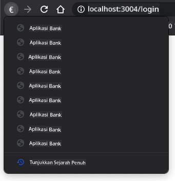

<!--
CO_OP_TRANSLATOR_METADATA:
{
  "original_hash": "8a07db14e75ac62f013b7de5df05981d",
  "translation_date": "2025-08-29T09:24:16+00:00",
  "source_file": "7-bank-project/1-template-route/README.md",
  "language_code": "ms"
}
-->
# Bina Aplikasi Perbankan Bahagian 1: Templat HTML dan Laluan dalam Aplikasi Web

## Kuiz Pra-Kuliah

[Kuiz pra-kuliah](https://ff-quizzes.netlify.app/web/quiz/41)

### Pengenalan

Sejak kemunculan JavaScript dalam pelayar, laman web menjadi lebih interaktif dan kompleks berbanding sebelumnya. Teknologi web kini sering digunakan untuk mencipta aplikasi yang berfungsi sepenuhnya yang berjalan terus dalam pelayar, yang kita panggil [aplikasi web](https://en.wikipedia.org/wiki/Web_application). Oleh kerana aplikasi web sangat interaktif, pengguna tidak mahu menunggu pemuatan semula halaman penuh setiap kali tindakan dilakukan. Oleh itu, JavaScript digunakan untuk mengemas kini HTML secara langsung menggunakan DOM, bagi memberikan pengalaman pengguna yang lebih lancar.

Dalam pelajaran ini, kita akan membina asas untuk mencipta aplikasi perbankan web, menggunakan templat HTML untuk mencipta pelbagai skrin yang boleh dipaparkan dan dikemas kini tanpa perlu memuat semula keseluruhan halaman HTML.

### Prasyarat

Anda memerlukan pelayan web tempatan untuk menguji aplikasi web yang akan kita bina dalam pelajaran ini. Jika anda belum memilikinya, anda boleh memasang [Node.js](https://nodejs.org) dan gunakan arahan `npx lite-server` dari folder projek anda. Ia akan mencipta pelayan web tempatan dan membuka aplikasi anda dalam pelayar.

### Persediaan

Pada komputer anda, cipta folder bernama `bank` dengan fail bernama `index.html` di dalamnya. Kita akan bermula dengan [boilerplate](https://en.wikipedia.org/wiki/Boilerplate_code) HTML ini:

```html
<!DOCTYPE html>
<html lang="en">
  <head>
    <meta charset="UTF-8">
    <meta name="viewport" content="width=device-width, initial-scale=1.0">
    <title>Bank App</title>
  </head>
  <body>
    <!-- This is where you'll work -->
  </body>
</html>
```

---

## Templat HTML

Jika anda ingin mencipta pelbagai skrin untuk satu halaman web, satu penyelesaian adalah dengan mencipta satu fail HTML untuk setiap skrin yang ingin dipaparkan. Walau bagaimanapun, penyelesaian ini mempunyai beberapa kelemahan:

- Anda perlu memuat semula keseluruhan HTML apabila menukar skrin, yang boleh menjadi perlahan.
- Sukar untuk berkongsi data antara skrin yang berbeza.

Pendekatan lain adalah dengan hanya mempunyai satu fail HTML, dan mentakrifkan pelbagai [templat HTML](https://developer.mozilla.org/docs/Web/HTML/Element/template) menggunakan elemen `<template>`. Templat ialah blok HTML yang boleh digunakan semula, yang tidak dipaparkan oleh pelayar, dan perlu diwujudkan semasa runtime menggunakan JavaScript.

### Tugasan

Kita akan mencipta aplikasi perbankan dengan dua skrin: halaman log masuk dan papan pemuka. Pertama, mari tambahkan dalam badan HTML elemen pemegang tempat yang akan kita gunakan untuk mewujudkan pelbagai skrin aplikasi kita:

```html
<div id="app">Loading...</div>
```

Kita memberikan `id` untuk memudahkan pencarian dengan JavaScript nanti.

> Petua: kerana kandungan elemen ini akan digantikan, kita boleh meletakkan mesej atau penunjuk pemuatan yang akan dipaparkan semasa aplikasi sedang dimuatkan.

Seterusnya, mari tambahkan templat HTML untuk halaman log masuk di bawahnya. Buat masa ini, kita hanya akan meletakkan tajuk dan seksyen yang mengandungi pautan yang akan kita gunakan untuk navigasi.

```html
<template id="login">
  <h1>Bank App</h1>
  <section>
    <a href="/dashboard">Login</a>
  </section>
</template>
```

Kemudian kita akan menambah satu lagi templat HTML untuk halaman papan pemuka. Halaman ini akan mengandungi pelbagai seksyen:

- Header dengan tajuk dan pautan log keluar
- Baki semasa akaun bank
- Senarai transaksi, dipaparkan dalam jadual

```html
<template id="dashboard">
  <header>
    <h1>Bank App</h1>
    <a href="/login">Logout</a>
  </header>
  <section>
    Balance: 100$
  </section>
  <section>
    <h2>Transactions</h2>
    <table>
      <thead>
        <tr>
          <th>Date</th>
          <th>Object</th>
          <th>Amount</th>
        </tr>
      </thead>
      <tbody></tbody>
    </table>
  </section>
</template>
```

> Petua: semasa mencipta templat HTML, jika anda ingin melihat bagaimana rupanya, anda boleh mengulas baris `<template>` dan `</template>` dengan menyelubunginya dengan `<!-- -->`.

✅ Mengapa anda fikir kita menggunakan atribut `id` pada templat? Bolehkah kita menggunakan sesuatu yang lain seperti kelas?

## Memaparkan templat dengan JavaScript

Jika anda mencuba fail HTML semasa anda dalam pelayar, anda akan melihat bahawa ia terhenti pada paparan `Loading...`. Ini kerana kita perlu menambah beberapa kod JavaScript untuk mewujudkan dan memaparkan templat HTML.

Mewujudkan templat biasanya dilakukan dalam 3 langkah:

1. Dapatkan elemen templat dalam DOM, contohnya menggunakan [`document.getElementById`](https://developer.mozilla.org/docs/Web/API/Document/getElementById).
2. Klon elemen templat, menggunakan [`cloneNode`](https://developer.mozilla.org/docs/Web/API/Node/cloneNode).
3. Lampirkan ia ke DOM di bawah elemen yang kelihatan, contohnya menggunakan [`appendChild`](https://developer.mozilla.org/docs/Web/API/Node/appendChild).

✅ Mengapa kita perlu mengklon templat sebelum melampirkannya ke DOM? Apa yang anda fikir akan berlaku jika kita melangkau langkah ini?

### Tugasan

Cipta fail baru bernama `app.js` dalam folder projek anda dan import fail tersebut dalam bahagian `<head>` HTML anda:

```html
<script src="app.js" defer></script>
```

Sekarang dalam `app.js`, kita akan mencipta fungsi baru `updateRoute`:

```js
function updateRoute(templateId) {
  const template = document.getElementById(templateId);
  const view = template.content.cloneNode(true);
  const app = document.getElementById('app');
  app.innerHTML = '';
  app.appendChild(view);
}
```

Apa yang kita lakukan di sini adalah tepat seperti 3 langkah yang diterangkan di atas. Kita mewujudkan templat dengan `id` `templateId`, dan meletakkan kandungan klonnya dalam pemegang tempat aplikasi kita. Perhatikan bahawa kita perlu menggunakan `cloneNode(true)` untuk menyalin keseluruhan subpokok templat.

Sekarang panggil fungsi ini dengan salah satu templat dan lihat hasilnya.

```js
updateRoute('login');
```

✅ Apakah tujuan kod ini `app.innerHTML = '';`? Apa yang berlaku tanpanya?

## Mencipta laluan

Apabila bercakap tentang aplikasi web, kita memanggil *Routing* sebagai niat untuk memetakan **URL** kepada skrin tertentu yang sepatutnya dipaparkan. Pada laman web dengan pelbagai fail HTML, ini dilakukan secara automatik kerana laluan fail dicerminkan pada URL. Sebagai contoh, dengan fail-fail ini dalam folder projek anda:

```
mywebsite/index.html
mywebsite/login.html
mywebsite/admin/index.html
```

Jika anda mencipta pelayan web dengan `mywebsite` sebagai root, pemetaan URL akan menjadi:

```
https://site.com            --> mywebsite/index.html
https://site.com/login.html --> mywebsite/login.html
https://site.com/admin/     --> mywebsite/admin/index.html
```

Walau bagaimanapun, untuk aplikasi web kita, kita menggunakan satu fail HTML yang mengandungi semua skrin, jadi tingkah laku lalai ini tidak akan membantu kita. Kita perlu mencipta peta ini secara manual dan mengemas kini templat yang dipaparkan menggunakan JavaScript.

### Tugasan

Kita akan menggunakan objek mudah untuk melaksanakan [peta](https://en.wikipedia.org/wiki/Associative_array) antara laluan URL dan templat kita. Tambahkan objek ini di bahagian atas fail `app.js` anda.

```js
const routes = {
  '/login': { templateId: 'login' },
  '/dashboard': { templateId: 'dashboard' },
};
```

Sekarang mari kita ubah sedikit fungsi `updateRoute`. Daripada terus menghantar `templateId` sebagai argumen, kita ingin mendapatkannya dengan terlebih dahulu melihat URL semasa, dan kemudian menggunakan peta kita untuk mendapatkan nilai ID templat yang sepadan. Kita boleh menggunakan [`window.location.pathname`](https://developer.mozilla.org/docs/Web/API/Location/pathname) untuk mendapatkan hanya bahagian laluan dari URL.

```js
function updateRoute() {
  const path = window.location.pathname;
  const route = routes[path];

  const template = document.getElementById(route.templateId);
  const view = template.content.cloneNode(true);
  const app = document.getElementById('app');
  app.innerHTML = '';
  app.appendChild(view);
}
```

Di sini kita memetakan laluan yang kita isytiharkan kepada templat yang sepadan. Anda boleh mencuba bahawa ia berfungsi dengan betul dengan menukar URL secara manual dalam pelayar anda.

✅ Apa yang berlaku jika anda memasukkan laluan yang tidak diketahui dalam URL? Bagaimana kita boleh menyelesaikan ini?

## Menambah navigasi

Langkah seterusnya untuk aplikasi kita adalah menambah keupayaan untuk menavigasi antara halaman tanpa perlu menukar URL secara manual. Ini melibatkan dua perkara:

1. Mengemas kini URL semasa
2. Mengemas kini templat yang dipaparkan berdasarkan URL baru

Kita sudah menyelesaikan bahagian kedua dengan fungsi `updateRoute`, jadi kita perlu mencari cara untuk mengemas kini URL semasa.

Kita perlu menggunakan JavaScript dan lebih khusus lagi [`history.pushState`](https://developer.mozilla.org/docs/Web/API/History/pushState) yang membolehkan kita mengemas kini URL dan mencipta entri baru dalam sejarah pelayaran, tanpa memuat semula HTML.

> Nota: Walaupun elemen sauh HTML [`<a href>`](https://developer.mozilla.org/docs/Web/HTML/Element/a) boleh digunakan sendiri untuk mencipta pautan ke URL yang berbeza, ia akan menyebabkan pelayar memuat semula HTML secara lalai. Adalah perlu untuk menghalang tingkah laku ini apabila mengendalikan laluan dengan JavaScript tersuai, menggunakan fungsi `preventDefault()` pada acara klik.

### Tugasan

Mari kita cipta fungsi baru yang boleh kita gunakan untuk menavigasi dalam aplikasi kita:

```js
function navigate(path) {
  window.history.pushState({}, path, path);
  updateRoute();
}
```

Kaedah ini pertama kali mengemas kini URL semasa berdasarkan laluan yang diberikan, kemudian mengemas kini templat. Sifat `window.location.origin` mengembalikan root URL, membolehkan kita membina semula URL lengkap dari laluan yang diberikan.

Sekarang kita mempunyai fungsi ini, kita boleh menyelesaikan masalah yang kita hadapi jika laluan tidak sepadan dengan mana-mana laluan yang ditentukan. Kita akan mengubah fungsi `updateRoute` dengan menambah laluan lalai kepada salah satu laluan yang sedia ada jika kita tidak dapat mencari padanan.

```js
function updateRoute() {
  const path = window.location.pathname;
  const route = routes[path];

  if (!route) {
    return navigate('/login');
  }

  ...
```

Jika laluan tidak dapat ditemui, kita kini akan mengalihkan ke halaman `login`.

Sekarang mari kita cipta fungsi untuk mendapatkan URL apabila pautan diklik, dan untuk menghalang tingkah laku lalai pautan pelayar:

```js
function onLinkClick(event) {
  event.preventDefault();
  navigate(event.target.href);
}
```

Mari kita lengkapi sistem navigasi dengan menambah pengikatan kepada pautan *Login* dan *Logout* dalam HTML.

```html
<a href="/dashboard" onclick="onLinkClick(event)">Login</a>
...
<a href="/login" onclick="onLinkClick(event)">Logout</a>
```

Objek `event` di atas menangkap acara `click` dan menghantarnya ke fungsi `onLinkClick` kita.

Menggunakan atribut [`onclick`](https://developer.mozilla.org/docs/Web/API/GlobalEventHandlers/onclick), ikat acara `click` kepada kod JavaScript, di sini panggilan kepada fungsi `navigate()`.

Cuba klik pada pautan ini, anda sepatutnya kini boleh menavigasi antara skrin yang berbeza dalam aplikasi anda.

✅ Kaedah `history.pushState` adalah sebahagian daripada standard HTML5 dan dilaksanakan dalam [semua pelayar moden](https://caniuse.com/?search=pushState). Jika anda membina aplikasi web untuk pelayar lama, terdapat helah yang boleh anda gunakan sebagai ganti API ini: menggunakan [hash (`#`)](https://en.wikipedia.org/wiki/URI_fragment) sebelum laluan, anda boleh melaksanakan laluan yang berfungsi dengan navigasi sauh biasa dan tidak memuat semula halaman, kerana tujuannya adalah untuk mencipta pautan dalaman dalam halaman.

## Mengendalikan butang kembali dan maju pelayar

Menggunakan `history.pushState` mencipta entri baru dalam sejarah navigasi pelayar. Anda boleh memeriksanya dengan menahan *butang kembali* pelayar anda, ia sepatutnya memaparkan sesuatu seperti ini:



Jika anda cuba klik pada butang kembali beberapa kali, anda akan melihat bahawa URL semasa berubah dan sejarah dikemas kini, tetapi templat yang sama terus dipaparkan.

Ini kerana aplikasi tidak tahu bahawa kita perlu memanggil `updateRoute()` setiap kali sejarah berubah. Jika anda melihat dokumentasi [`history.pushState`](https://developer.mozilla.org/docs/Web/API/History/pushState), anda boleh melihat bahawa jika keadaan berubah - bermakna kita berpindah ke URL yang berbeza - acara [`popstate`](https://developer.mozilla.org/docs/Web/API/Window/popstate_event) dicetuskan. Kita akan menggunakan itu untuk menyelesaikan masalah ini.

### Tugasan

Untuk memastikan templat yang dipaparkan dikemas kini apabila sejarah pelayar berubah, kita akan melampirkan fungsi baru yang memanggil `updateRoute()`. Kita akan melakukannya di bahagian bawah fail `app.js` kita:

```js
window.onpopstate = () => updateRoute();
updateRoute();
```

> Nota: kita menggunakan [fungsi anak panah](https://developer.mozilla.org/docs/Web/JavaScript/Reference/Functions/Arrow_functions) di sini untuk mengisytiharkan pengendali acara `popstate` kita untuk ringkas, tetapi fungsi biasa juga akan berfungsi sama.

Berikut adalah video penyegaran tentang fungsi anak panah:

[](https://youtube.com/watch?v=OP6eEbOj2sc "Fungsi Anak Panah")

> 🎥 Klik imej di atas untuk video tentang fungsi anak panah.

Sekarang cuba gunakan butang kembali dan maju pelayar anda, dan periksa bahawa laluan yang dipaparkan dikemas kini dengan betul kali ini.

---

## 🚀 Cabaran

Tambahkan templat dan laluan baru untuk halaman ketiga yang menunjukkan kredit untuk aplikasi ini.

## Kuiz Pasca-Kuliah

[Kuiz pasca-kuliah](https://ff-quizzes.netlify.app/web/quiz/42)

## Kajian Semula & Kajian Kendiri

Routing adalah salah satu bahagian pembangunan web yang mengejutkan sukar, terutamanya apabila web bergerak dari tingkah laku pemuatan semula halaman kepada pemuatan semula halaman Aplikasi Halaman Tunggal. Baca sedikit tentang [bagaimana perkhidmatan Azure Static Web App](https://docs.microsoft.com/azure/static-web-apps/routes/?WT.mc_id=academic-77807-sagibbon) mengendalikan routing. Bolehkah anda jelaskan mengapa beberapa keputusan yang diterangkan dalam dokumen itu diperlukan?

## Tugasan

[Perbaiki routing](assignment.md)

---

**Penafian**:  
Dokumen ini telah diterjemahkan menggunakan perkhidmatan terjemahan AI [Co-op Translator](https://github.com/Azure/co-op-translator). Walaupun kami berusaha untuk memastikan ketepatan, sila ambil perhatian bahawa terjemahan automatik mungkin mengandungi kesilapan atau ketidaktepatan. Dokumen asal dalam bahasa asalnya harus dianggap sebagai sumber yang berwibawa. Untuk maklumat penting, terjemahan manusia profesional adalah disyorkan. Kami tidak bertanggungjawab atas sebarang salah faham atau salah tafsir yang timbul daripada penggunaan terjemahan ini.