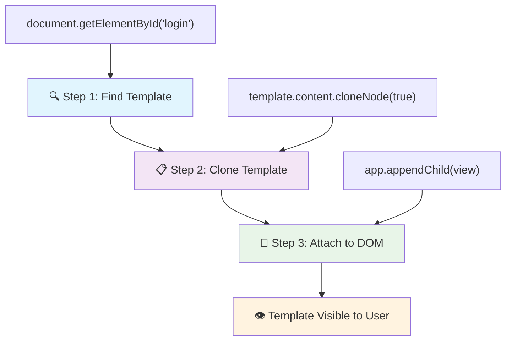
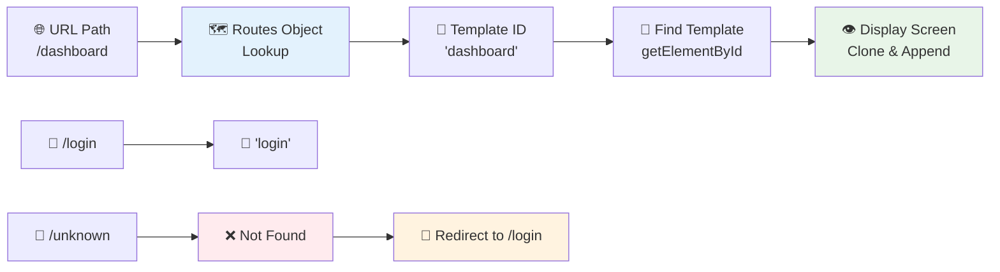
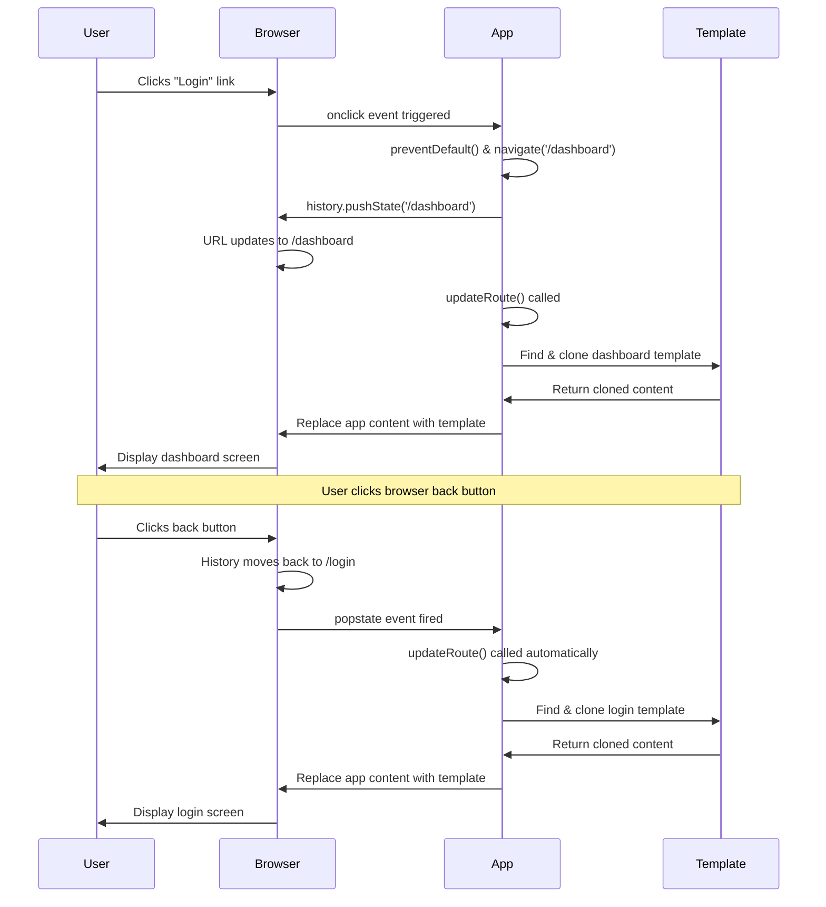

<!--
CO_OP_TRANSLATOR_METADATA:
{
  "original_hash": "5d259f6962464ad91e671083aa0398f4",
  "translation_date": "2025-10-24T14:35:34+00:00",
  "source_file": "7-bank-project/1-template-route/README.md",
  "language_code": "ms"
}
-->
# Membina Aplikasi Perbankan Bahagian 1: Templat HTML dan Laluan dalam Aplikasi Web

Apabila komputer panduan Apollo 11 menavigasi ke bulan pada tahun 1969, ia perlu bertukar antara program yang berbeza tanpa memulakan semula keseluruhan sistem. Aplikasi web moden berfungsi dengan cara yang sama – ia mengubah apa yang anda lihat tanpa memuat semula semuanya dari awal. Ini mencipta pengalaman yang lancar dan responsif seperti yang diharapkan oleh pengguna hari ini.

Tidak seperti laman web tradisional yang memuat semula keseluruhan halaman untuk setiap interaksi, aplikasi web moden hanya mengemas kini bahagian yang perlu diubah. Pendekatan ini, seperti bagaimana kawalan misi bertukar antara paparan yang berbeza sambil mengekalkan komunikasi yang berterusan, mencipta pengalaman yang lancar seperti yang kita harapkan.

Inilah yang membuat perbezaan begitu ketara:

| Aplikasi Multi-Halaman Tradisional | Aplikasi Satu Halaman Moden |
|------------------------------------|----------------------------|
| **Navigasi** | Muat semula halaman penuh untuk setiap skrin | Pertukaran kandungan segera |
| **Prestasi** | Lebih perlahan kerana muat turun HTML penuh | Lebih pantas dengan kemas kini separa |
| **Pengalaman Pengguna** | Kilatan halaman yang mengganggu | Peralihan lancar seperti aplikasi |
| **Perkongsian Data** | Sukar antara halaman | Pengurusan keadaan yang mudah |
| **Pembangunan** | Banyak fail HTML untuk diselenggara | Satu HTML dengan templat dinamik |

**Memahami evolusi:**
- **Aplikasi tradisional** memerlukan permintaan pelayan untuk setiap tindakan navigasi
- **SPA moden** dimuatkan sekali dan mengemas kini kandungan secara dinamik menggunakan JavaScript
- **Jangkaan pengguna** kini lebih menyukai interaksi yang segera dan lancar
- **Manfaat prestasi** termasuk pengurangan penggunaan jalur lebar dan tindak balas yang lebih pantas

Dalam pelajaran ini, kita akan membina aplikasi perbankan dengan pelbagai skrin yang mengalir dengan lancar. Seperti bagaimana saintis menggunakan instrumen modular yang boleh dikonfigurasi semula untuk eksperimen yang berbeza, kita akan menggunakan templat HTML sebagai komponen yang boleh digunakan semula dan dipaparkan mengikut keperluan.

Anda akan bekerja dengan templat HTML (pelan yang boleh digunakan semula untuk skrin yang berbeza), penghalaan JavaScript (sistem yang bertukar antara skrin), dan API sejarah pelayar (yang memastikan butang kembali berfungsi seperti yang diharapkan). Teknik asas ini juga digunakan oleh rangka kerja seperti React, Vue, dan Angular.

Pada akhir pelajaran ini, anda akan mempunyai aplikasi perbankan yang berfungsi dan menunjukkan prinsip aplikasi satu halaman yang profesional.

## Kuiz Pra-Kuliah

[Kuiz pra-kuliah](https://ff-quizzes.netlify.app/web/quiz/41)

### Apa yang Anda Perlukan

Kita memerlukan pelayan web tempatan untuk menguji aplikasi perbankan kita – jangan risau, ia lebih mudah daripada yang anda sangka! Jika anda belum memasangnya, hanya pasang [Node.js](https://nodejs.org) dan jalankan `npx lite-server` dari folder projek anda. Perintah ini akan menghidupkan pelayan tempatan dan secara automatik membuka aplikasi anda dalam pelayar.

### Persediaan

Di komputer anda, buat folder bernama `bank` dengan fail bernama `index.html` di dalamnya. Kita akan bermula dari [boilerplate HTML](https://en.wikipedia.org/wiki/Boilerplate_code) ini:

```html
<!DOCTYPE html>
<html lang="en">
  <head>
    <meta charset="UTF-8">
    <meta name="viewport" content="width=device-width, initial-scale=1.0">
    <title>Bank App</title>
  </head>
  <body>
    <!-- This is where you'll work -->
  </body>
</html>
```

**Inilah yang disediakan oleh boilerplate ini:**
- **Menetapkan** struktur dokumen HTML5 dengan deklarasi DOCTYPE yang betul
- **Mengkonfigurasi** pengekodan aksara sebagai UTF-8 untuk sokongan teks antarabangsa
- **Mengaktifkan** reka bentuk responsif dengan tag meta viewport untuk keserasian mudah alih
- **Menetapkan** tajuk deskriptif yang muncul di tab pelayar
- **Mencipta** bahagian badan yang bersih di mana kita akan membina aplikasi kita

> 📁 **Pratonton Struktur Projek**
> 
> **Pada akhir pelajaran ini, projek anda akan mengandungi:**
> ```
> bank/
> ├── index.html      <!-- Main HTML with templates -->
> ├── app.js          <!-- Routing and navigation logic -->
> └── style.css       <!-- (Optional for future lessons) -->
> ```
> 
> **Tanggungjawab fail:**
> - **index.html**: Mengandungi semua templat dan menyediakan struktur aplikasi
> - **app.js**: Mengendalikan penghalaan, navigasi, dan pengurusan templat
> - **Templat**: Menentukan UI untuk log masuk, papan pemuka, dan skrin lain

---

## Templat HTML

Templat menyelesaikan masalah asas dalam pembangunan web. Apabila Gutenberg mencipta pencetakan jenis bergerak pada tahun 1440-an, dia menyedari bahawa daripada mengukir keseluruhan halaman, dia boleh mencipta blok huruf yang boleh digunakan semula dan menyusunnya mengikut keperluan. Templat HTML berfungsi berdasarkan prinsip yang sama – daripada mencipta fail HTML yang berasingan untuk setiap skrin, anda menentukan struktur yang boleh digunakan semula yang boleh dipaparkan apabila diperlukan.

Anggaplah templat sebagai pelan untuk bahagian yang berbeza dalam aplikasi anda. Seperti seorang arkitek mencipta satu pelan dan menggunakannya beberapa kali daripada melukis semula bilik yang sama, kita mencipta templat sekali dan menggunakannya mengikut keperluan. Pelayar menyimpan templat ini tersembunyi sehingga JavaScript mengaktifkannya.

Jika anda ingin mencipta pelbagai skrin untuk halaman web, satu penyelesaian adalah mencipta satu fail HTML untuk setiap skrin yang ingin dipaparkan. Walau bagaimanapun, penyelesaian ini datang dengan beberapa kesulitan:

- Anda perlu memuat semula keseluruhan HTML apabila bertukar skrin, yang boleh menjadi perlahan.
- Sukar untuk berkongsi data antara skrin yang berbeza.

Pendekatan lain adalah dengan hanya mempunyai satu fail HTML, dan menentukan pelbagai [templat HTML](https://developer.mozilla.org/docs/Web/HTML/Element/template) menggunakan elemen `<template>`. Templat adalah blok HTML yang boleh digunakan semula yang tidak dipaparkan oleh pelayar, dan perlu diaktifkan semasa runtime menggunakan JavaScript.

### Mari Kita Bina

Kita akan mencipta aplikasi bank dengan dua skrin utama: halaman log masuk dan papan pemuka. Pertama, mari tambahkan elemen tempat letak ke dalam badan HTML kita – di sinilah semua skrin yang berbeza akan muncul:

```html
<div id="app">Loading...</div>
```

**Memahami tempat letak ini:**
- **Mencipta** bekas dengan ID "app" di mana semua skrin akan dipaparkan
- **Menunjukkan** mesej pemuatan sehingga JavaScript memulakan skrin pertama
- **Menyediakan** satu titik pemasangan untuk kandungan dinamik kita
- **Memudahkan** penargetan dari JavaScript menggunakan `document.getElementById()`

> 💡 **Tip Pro**: Oleh kerana kandungan elemen ini akan digantikan, kita boleh meletakkan mesej pemuatan atau penunjuk yang akan ditunjukkan semasa aplikasi sedang dimuatkan.

Seterusnya, mari tambahkan templat HTML untuk halaman log masuk di bawah. Buat masa ini kita hanya akan meletakkan tajuk dan bahagian yang mengandungi pautan yang akan kita gunakan untuk navigasi.

```html
<template id="login">
  <h1>Bank App</h1>
  <section>
    <a href="/dashboard">Login</a>
  </section>
</template>
```

**Memecahkan templat log masuk ini:**
- **Menentukan** templat dengan pengenal unik "login" untuk penargetan JavaScript
- **Termasuk** tajuk utama yang menetapkan penjenamaan aplikasi
- **Mengandungi** elemen `<section>` semantik untuk mengelompokkan kandungan berkaitan
- **Menyediakan** pautan navigasi yang akan mengarahkan pengguna ke papan pemuka

Kemudian kita akan menambah satu lagi templat HTML untuk halaman papan pemuka. Halaman ini akan mengandungi bahagian yang berbeza:

- Tajuk dengan tajuk dan pautan log keluar
- Baki semasa akaun bank
- Senarai transaksi, dipaparkan dalam jadual

```html
<template id="dashboard">
  <header>
    <h1>Bank App</h1>
    <a href="/login">Logout</a>
  </header>
  <section>
    Balance: 100$
  </section>
  <section>
    <h2>Transactions</h2>
    <table>
      <thead>
        <tr>
          <th>Date</th>
          <th>Object</th>
          <th>Amount</th>
        </tr>
      </thead>
      <tbody></tbody>
    </table>
  </section>
</template>
```

**Mari kita fahami setiap bahagian papan pemuka ini:**
- **Menyusun** halaman dengan elemen `<header>` semantik yang mengandungi navigasi
- **Memaparkan** tajuk aplikasi secara konsisten di seluruh skrin untuk penjenamaan
- **Menyediakan** pautan log keluar yang mengarahkan kembali ke skrin log masuk
- **Menunjukkan** baki akaun semasa dalam bahagian khusus
- **Mengatur** data transaksi menggunakan jadual HTML yang berstruktur dengan betul
- **Menentukan** tajuk jadual untuk lajur Tarikh, Objek, dan Jumlah
- **Meninggalkan** badan jadual kosong untuk suntikan kandungan dinamik kemudian

> 💡 **Tip Pro**: Apabila mencipta templat HTML, jika anda ingin melihat bagaimana rupanya, anda boleh mengulas baris `<template>` dan `</template>` dengan menyelubunginya dengan `<!-- -->`.

✅ Mengapa anda fikir kita menggunakan atribut `id` pada templat? Bolehkah kita menggunakan sesuatu yang lain seperti kelas?

## Menghidupkan Templat dengan JavaScript

Sekarang kita perlu menjadikan templat kita berfungsi. Seperti bagaimana pencetak 3D mengambil pelan digital dan mencipta objek fizikal, JavaScript mengambil templat tersembunyi kita dan mencipta elemen yang kelihatan dan interaktif yang boleh dilihat dan digunakan oleh pengguna.

Proses ini mengikuti tiga langkah konsisten yang membentuk asas pembangunan web moden. Setelah anda memahami corak ini, anda akan mengenalinya di banyak rangka kerja dan perpustakaan.

Jika anda mencuba fail HTML semasa anda dalam pelayar, anda akan melihat bahawa ia terhenti memaparkan `Loading...`. Ini kerana kita perlu menambah beberapa kod JavaScript untuk mengaktifkan dan memaparkan templat HTML.

Mengaktifkan templat biasanya dilakukan dalam 3 langkah:

1. Dapatkan elemen templat dalam DOM, contohnya menggunakan [`document.getElementById`](https://developer.mozilla.org/docs/Web/API/Document/getElementById).
2. Klon elemen templat, menggunakan [`cloneNode`](https://developer.mozilla.org/docs/Web/API/Node/cloneNode).
3. Lampirkan ke DOM di bawah elemen yang kelihatan, contohnya menggunakan [`appendChild`](https://developer.mozilla.org/docs/Web/API/Node/appendChild).



**Pecahan visual proses:**
- **Langkah 1** mencari templat tersembunyi dalam struktur DOM
- **Langkah 2** mencipta salinan kerja yang boleh diubah suai dengan selamat
- **Langkah 3** memasukkan salinan ke kawasan halaman yang kelihatan
- **Hasil** adalah skrin berfungsi yang boleh digunakan oleh pengguna

✅ Mengapa kita perlu mengklon templat sebelum melampirkannya ke DOM? Apa yang anda fikir akan berlaku jika kita melangkau langkah ini?

### Tugasan

Cipta fail baru bernama `app.js` dalam folder projek anda dan import fail tersebut dalam bahagian `<head>` HTML anda:

```html
<script src="app.js" defer></script>
```

**Memahami import skrip ini:**
- **Menghubungkan** fail JavaScript ke dokumen HTML kita
- **Menggunakan** atribut `defer` untuk memastikan skrip berjalan selepas parsing HTML selesai
- **Membolehkan** akses kepada semua elemen DOM kerana ia dimuat sepenuhnya sebelum pelaksanaan skrip
- **Mengikuti** amalan terbaik moden untuk pemuatan skrip dan prestasi

Sekarang dalam `app.js`, kita akan mencipta fungsi baru `updateRoute`:

```js
function updateRoute(templateId) {
  const template = document.getElementById(templateId);
  const view = template.content.cloneNode(true);
  const app = document.getElementById('app');
  app.innerHTML = '';
  app.appendChild(view);
}
```

**Langkah demi langkah, inilah yang berlaku:**
- **Mencari** elemen templat menggunakan ID uniknya
- **Mencipta** salinan mendalam kandungan templat menggunakan `cloneNode(true)`
- **Mencari** bekas aplikasi di mana kandungan akan dipaparkan
- **Mengosongkan** sebarang kandungan sedia ada dari bekas aplikasi
- **Memasukkan** kandungan templat yang diklon ke dalam DOM yang kelihatan

Sekarang panggil fungsi ini dengan salah satu templat dan lihat hasilnya.

```js
updateRoute('login');
```

**Apa yang dicapai oleh panggilan fungsi ini:**
- **Mengaktifkan** templat log masuk dengan menghantar IDnya sebagai parameter
- **Menunjukkan** cara untuk menukar skrin aplikasi secara programatik
- **Memaparkan** skrin log masuk menggantikan mesej "Loading..."

✅ Apa tujuan kod ini `app.innerHTML = '';`? Apa yang berlaku tanpanya?

## Mencipta Laluan

Penghalaan pada dasarnya adalah tentang menghubungkan URL kepada kandungan yang betul. Pertimbangkan bagaimana operator telefon awal menggunakan papan suis untuk menyambungkan panggilan – mereka akan mengambil permintaan masuk dan mengarahkan ke destinasi yang betul. Penghalaan web berfungsi dengan cara yang sama, mengambil permintaan URL dan menentukan kandungan mana yang akan dipaparkan.

Secara tradisional, pelayan web mengendalikan ini dengan menyajikan fail HTML yang berbeza untuk URL yang berbeza. Oleh kerana kita sedang membina aplikasi satu halaman, kita perlu mengendalikan penghalaan ini sendiri dengan JavaScript. Pendekatan ini memberi kita lebih kawalan terhadap pengalaman pengguna dan prestasi.



**Memahami aliran penghalaan:**
- **Perubahan URL** mencetuskan carian dalam konfigurasi laluan kita
- **Laluan yang sah** memetakan kepada ID templat tertentu untuk rendering
- **Laluan yang tidak sah** mencetuskan tingkah laku fallback untuk mengelakkan keadaan rosak
- **Rendering templat** mengikuti proses tiga langkah yang kita pelajari sebelum ini

Apabila bercakap tentang aplikasi web, kita memanggil *Penghalaan* sebagai niat untuk memetakan **URL** kepada skrin tertentu yang harus dipaparkan. Pada laman web dengan pelbagai fail HTML, ini dilakukan secara automatik kerana laluan fail dicerminkan pada URL. Sebagai contoh, dengan fail-fail ini dalam folder projek anda:

```
mywebsite/index.html
mywebsite/login.html
mywebsite/admin/index.html
```

Jika anda mencipta pelayan web dengan `mywebsite` sebagai root, pemetaan URL akan menjadi:

```
https://site.com            --> mywebsite/index.html
https://site.com/login.html --> mywebsite/login.html
https://site.com/admin/     --> mywebsite/admin/index.html
```

Walau bagaimanapun, untuk aplikasi web kita menggunakan satu fail HTML yang mengandungi semua skrin jadi tingkah laku lalai ini tidak akan membantu kita. Kita perlu mencipta peta ini secara manual dan melakukan kemas kini pada templat yang dipaparkan menggunakan JavaScript.

### Tugasan

Kita akan menggunakan objek mudah untuk melaksanakan [peta](https://en.wikipedia.org/wiki/Associative_array) antara laluan URL dan templat kita. Tambahkan objek ini di bahagian atas fail `app.js` anda.

```js
const routes = {
  '/login': { templateId: 'login' },
  '/dashboard': { templateId: 'dashboard' },
};
```

**Memahami konfigurasi laluan ini:**
- **Menentukan** pemetaan antara laluan URL dan pengenal templat
- **Menggunakan** sintaks objek di mana kunci adalah laluan URL dan nilai mengandungi maklumat templat
- **Membolehkan** carian mudah tentang templat mana yang akan dipaparkan untuk mana-mana URL tertentu
- **Menyediakan** struktur yang boleh diskalakan untuk menambah laluan baru di masa depan

Sekarang mari ubah sedikit fungsi `updateRoute`. Daripada menghantar terus `templateId` sebagai argumen, kita ingin mendapatkannya dengan terlebih dahulu melihat URL semasa, dan kemudian menggunakan peta kita untuk mendapatkan nilai ID templat yang sepadan. Kita boleh menggunakan [`window.location.pathname`](https://developer.mozilla.org/docs/Web/API/Location/pathname) untuk mendapatkan hanya bahagian laluan dari URL.

```js
function updateRoute() {
  const path = window.location.pathname;
  const route = routes[path];

  const template = document.getElementById(route.templateId);
  const view = template.content.cloneNode(true);
  const app = document.getElementById('app');
  app.innerHTML = '';
  app.appendChild(view);
}
```

**Memecahkan apa yang berlaku di sini:**
- **Mengeluarkan** laluan semasa dari URL pelayar menggunakan `window.location.pathname`
- **Mencari** konfigurasi laluan yang sepadan dalam objek laluan kita
- **Mendapatkan** ID templat dari konfigurasi laluan
- **Mengikuti** proses rendering templat yang sama seperti sebelumnya
- **Mencipta** sistem dinamik yang bertindak balas terhadap perubahan URL

Di sini kita memetakan laluan yang kita nyatakan kepada templat yang sepadan. Anda boleh mencuba bahawa ia berfungsi dengan betul dengan menukar URL secara manual dalam pelayar anda.
✅ Apa yang berlaku jika anda memasukkan laluan yang tidak dikenali dalam URL? Bagaimana kita boleh menyelesaikannya?

## Menambah Navigasi

Dengan sistem penghalaan yang telah ditetapkan, pengguna memerlukan cara untuk menavigasi aplikasi. Laman web tradisional memuat semula keseluruhan halaman apabila klik pada pautan, tetapi kita mahu mengemas kini URL dan kandungan tanpa memuat semula halaman. Ini memberikan pengalaman yang lebih lancar seperti aplikasi desktop yang beralih antara pandangan yang berbeza.

Kita perlu menyelaraskan dua perkara: mengemas kini URL pelayar supaya pengguna boleh menanda halaman dan berkongsi pautan, serta memaparkan kandungan yang sesuai. Apabila dilaksanakan dengan betul, ini mencipta navigasi yang lancar seperti yang diharapkan pengguna daripada aplikasi moden.

> 🏗️ **Pandangan Arkitektur**: Komponen Sistem Navigasi
>
> **Apa yang anda bina:**
> - **🔄 Pengurusan URL**: Mengemas kini bar alamat pelayar tanpa memuat semula halaman
> - **📋 Sistem Templat**: Menukar kandungan secara dinamik berdasarkan laluan semasa  
> - **📚 Integrasi Sejarah**: Mengekalkan fungsi butang kembali/maju pelayar
> - **🛡️ Pengendalian Ralat**: Penyelesaian yang baik untuk laluan yang tidak sah atau hilang
>
> **Bagaimana komponen berfungsi bersama:**
> - **Mendengar** acara navigasi (klik, perubahan sejarah)
> - **Mengemas kini** URL menggunakan API Sejarah
> - **Memaparkan** templat yang sesuai untuk laluan baru
> - **Mengekalkan** pengalaman pengguna yang lancar sepanjang masa

Langkah seterusnya untuk aplikasi kita adalah menambah kemungkinan untuk menavigasi antara halaman tanpa perlu menukar URL secara manual. Ini melibatkan dua perkara:

  1. Mengemas kini URL semasa
  2. Mengemas kini templat yang dipaparkan berdasarkan URL baru

Kita sudah menyelesaikan bahagian kedua dengan fungsi `updateRoute`, jadi kita perlu mencari cara untuk mengemas kini URL semasa.

Kita perlu menggunakan JavaScript dan lebih khusus lagi [`history.pushState`](https://developer.mozilla.org/docs/Web/API/History/pushState) yang membolehkan kita mengemas kini URL dan mencipta entri baru dalam sejarah pelayaran, tanpa memuat semula HTML.

> ⚠️ **Nota Penting**: Walaupun elemen anchor HTML [`<a href>`](https://developer.mozilla.org/docs/Web/HTML/Element/a) boleh digunakan sendiri untuk mencipta pautan ke URL yang berbeza, ia akan menyebabkan pelayar memuat semula HTML secara lalai. Adalah perlu untuk menghalang tingkah laku ini apabila mengendalikan penghalaan dengan JavaScript tersuai, menggunakan fungsi preventDefault() pada acara klik.

### Tugasan

Mari kita cipta fungsi baru yang boleh digunakan untuk menavigasi dalam aplikasi kita:

```js
function navigate(path) {
  window.history.pushState({}, path, path);
  updateRoute();
}
```

**Memahami fungsi navigasi ini:**
- **Mengemas kini** URL pelayar ke laluan baru menggunakan `history.pushState`
- **Menambah** entri baru ke dalam tumpukan sejarah pelayar untuk sokongan butang kembali/maju yang betul
- **Mencetuskan** fungsi `updateRoute()` untuk memaparkan templat yang sepadan
- **Mengekalkan** pengalaman aplikasi satu halaman tanpa memuat semula halaman

Kaedah ini mula-mula mengemas kini URL semasa berdasarkan laluan yang diberikan, kemudian mengemas kini templat. Sifat `window.location.origin` mengembalikan akar URL, membolehkan kita membina semula URL lengkap daripada laluan yang diberikan.

Sekarang kita mempunyai fungsi ini, kita boleh menyelesaikan masalah yang kita hadapi jika laluan tidak sepadan dengan mana-mana laluan yang ditentukan. Kita akan mengubah fungsi `updateRoute` dengan menambah penyelesaian kepada salah satu laluan yang sedia ada jika kita tidak dapat mencari padanan.

```js
function updateRoute() {
  const path = window.location.pathname;
  const route = routes[path];

  if (!route) {
    return navigate('/login');
  }

  const template = document.getElementById(route.templateId);
  const view = template.content.cloneNode(true);
  const app = document.getElementById('app');
  app.innerHTML = '';
  app.appendChild(view);
}
```

**Perkara utama untuk diingat:**
- **Memeriksa** jika laluan wujud untuk laluan semasa
- **Mengalihkan** ke halaman log masuk apabila laluan tidak sah diakses
- **Menyediakan** mekanisme penyelesaian yang menghalang navigasi yang rosak
- **Memastikan** pengguna sentiasa melihat skrin yang sah, walaupun dengan URL yang salah

Jika laluan tidak dapat ditemui, kita kini akan mengalihkan ke halaman `login`.

Sekarang mari kita cipta fungsi untuk mendapatkan URL apabila pautan diklik, dan untuk menghalang tingkah laku lalai pautan pelayar:

```js
function onLinkClick(event) {
  event.preventDefault();
  navigate(event.target.href);
}
```

**Memecahkan pengendali klik ini:**
- **Menghalang** tingkah laku lalai pautan pelayar menggunakan `preventDefault()`
- **Mengeluarkan** URL destinasi daripada elemen pautan yang diklik
- **Memanggil** fungsi navigasi tersuai kita dan bukannya memuat semula halaman
- **Mengekalkan** pengalaman aplikasi satu halaman yang lancar

```html
<a href="/dashboard" onclick="onLinkClick(event)">Login</a>
...
<a href="/login" onclick="onLinkClick(event)">Logout</a>
```

**Apa yang dicapai oleh pengikatan onclick ini:**
- **Menyambungkan** setiap pautan ke sistem navigasi tersuai kita
- **Menghantar** acara klik ke fungsi `onLinkClick` kita untuk diproses
- **Membolehkan** navigasi lancar tanpa memuat semula halaman
- **Mengekalkan** struktur URL yang betul yang boleh ditanda atau dikongsi oleh pengguna

Atribut [`onclick`](https://developer.mozilla.org/docs/Web/API/GlobalEventHandlers/onclick) mengikat acara `click` kepada kod JavaScript, di sini panggilan kepada fungsi `navigate()`.

Cuba klik pada pautan ini, anda sepatutnya kini boleh menavigasi antara skrin yang berbeza dalam aplikasi anda.

✅ Kaedah `history.pushState` adalah sebahagian daripada standard HTML5 dan dilaksanakan dalam [semua pelayar moden](https://caniuse.com/?search=pushState). Jika anda membina aplikasi web untuk pelayar lama, terdapat helah yang boleh digunakan sebagai ganti API ini: menggunakan [hash (`#`)](https://en.wikipedia.org/wiki/URI_fragment) sebelum laluan anda boleh melaksanakan penghalaan yang berfungsi dengan navigasi anchor biasa dan tidak memuat semula halaman, kerana tujuannya adalah untuk mencipta pautan dalaman dalam halaman.

## Membuat Butang Kembali dan Maju Berfungsi

Butang kembali dan maju adalah asas kepada pelayaran web, seperti bagaimana pengawal misi NASA boleh menyemak keadaan sistem sebelumnya semasa misi angkasa. Pengguna mengharapkan butang ini berfungsi, dan apabila ia tidak berfungsi, ia merosakkan pengalaman pelayaran yang diharapkan.

Aplikasi satu halaman kita memerlukan konfigurasi tambahan untuk menyokong ini. Pelayar mengekalkan tumpukan sejarah (yang telah kita tambahkan dengan `history.pushState`), tetapi apabila pengguna menavigasi melalui sejarah ini, aplikasi kita perlu bertindak balas dengan mengemas kini kandungan yang dipaparkan dengan sewajarnya.



**Titik interaksi utama:**
- **Tindakan pengguna** mencetuskan navigasi melalui klik atau butang pelayar
- **Aplikasi memintas** klik pautan untuk menghalang pemuatan semula halaman
- **API Sejarah** menguruskan perubahan URL dan tumpukan sejarah pelayar
- **Templat** menyediakan struktur kandungan untuk setiap skrin
- **Pendengar acara** memastikan aplikasi bertindak balas kepada semua jenis navigasi

Menggunakan `history.pushState` mencipta entri baru dalam sejarah navigasi pelayar. Anda boleh memeriksanya dengan menahan *butang kembali* pelayar anda, ia sepatutnya memaparkan sesuatu seperti ini:


Jika anda cuba klik pada butang kembali beberapa kali, anda akan melihat bahawa URL semasa berubah dan sejarah dikemas kini, tetapi templat yang sama terus dipaparkan.

Itu kerana aplikasi tidak tahu bahawa kita perlu memanggil `updateRoute()` setiap kali sejarah berubah. Jika anda melihat dokumentasi [`history.pushState`](https://developer.mozilla.org/docs/Web/API/History/pushState), anda boleh melihat bahawa jika keadaan berubah - bermaksud kita berpindah ke URL yang berbeza - acara [`popstate`](https://developer.mozilla.org/docs/Web/API/Window/popstate_event) dicetuskan. Kita akan menggunakan itu untuk menyelesaikan masalah tersebut.

### Tugasan

Untuk memastikan templat yang dipaparkan dikemas kini apabila sejarah pelayar berubah, kita akan melampirkan fungsi baru yang memanggil `updateRoute()`. Kita akan melakukannya di bahagian bawah fail `app.js` kita:

```js
window.onpopstate = () => updateRoute();
updateRoute();
```

**Memahami integrasi sejarah ini:**
- **Mendengar** acara `popstate` yang berlaku apabila pengguna menavigasi dengan butang pelayar
- **Menggunakan** fungsi anak panah untuk sintaks pengendali acara yang ringkas
- **Memanggil** `updateRoute()` secara automatik setiap kali keadaan sejarah berubah
- **Memulakan** aplikasi dengan memanggil `updateRoute()` apabila halaman pertama kali dimuat
- **Memastikan** templat yang betul dipaparkan tanpa mengira cara pengguna menavigasi

> 💡 **Tip Pro**: Kami menggunakan [fungsi anak panah](https://developer.mozilla.org/docs/Web/JavaScript/Reference/Functions/Arrow_functions) di sini untuk mengisytiharkan pengendali acara `popstate` kami dengan ringkas, tetapi fungsi biasa juga akan berfungsi sama.

Berikut adalah video penyegaran tentang fungsi anak panah:

[](https://youtube.com/watch?v=OP6eEbOj2sc "Fungsi Anak Panah")

> 🎥 Klik imej di atas untuk video tentang fungsi anak panah.

Sekarang cuba gunakan butang kembali dan maju pelayar anda, dan periksa bahawa laluan yang dipaparkan dikemas kini dengan betul kali ini.

---

## Cabaran Ejen GitHub Copilot 🚀

Gunakan mod Ejen untuk menyelesaikan cabaran berikut:

**Deskripsi:** Tingkatkan aplikasi perbankan dengan melaksanakan pengendalian ralat dan templat halaman 404 untuk laluan yang tidak sah, meningkatkan pengalaman pengguna apabila menavigasi ke halaman yang tidak wujud.

**Arahan:** Cipta templat HTML baru dengan id "not-found" yang memaparkan halaman ralat 404 mesra pengguna dengan gaya. Kemudian ubah logik penghalaan JavaScript untuk memaparkan templat ini apabila pengguna menavigasi ke URL yang tidak sah, dan tambah butang "Pergi ke Laman Utama" yang mengalihkan kembali ke halaman log masuk.

Ketahui lebih lanjut tentang [mod ejen](https://code.visualstudio.com/blogs/2025/02/24/introducing-copilot-agent-mode) di sini.

## 🚀 Cabaran

Tambah templat dan laluan baru untuk halaman ketiga yang memaparkan kredit untuk aplikasi ini.

**Matlamat cabaran:**
- **Cipta** templat HTML baru dengan struktur kandungan yang sesuai
- **Tambah** laluan baru ke objek konfigurasi laluan anda
- **Sertakan** pautan navigasi ke dan dari halaman kredit
- **Uji** bahawa semua navigasi berfungsi dengan betul dengan sejarah pelayar

## Kuiz Selepas Kuliah

[Kuiz selepas kuliah](https://ff-quizzes.netlify.app/web/quiz/42)

## Ulasan & Kajian Kendiri

Penghalaan adalah salah satu bahagian yang agak rumit dalam pembangunan web, terutamanya apabila web bergerak daripada tingkah laku pemuatan semula halaman kepada pemuatan semula halaman Aplikasi Satu Halaman. Baca sedikit tentang [bagaimana perkhidmatan Azure Static Web App](https://docs.microsoft.com/azure/static-web-apps/routes/?WT.mc_id=academic-77807-sagibbon) mengendalikan penghalaan. Bolehkah anda menerangkan mengapa beberapa keputusan yang diterangkan dalam dokumen itu diperlukan?

**Sumber pembelajaran tambahan:**
- **Terokai** bagaimana rangka kerja popular seperti React Router dan Vue Router melaksanakan penghalaan sisi klien
- **Kaji** perbezaan antara penghalaan berasaskan hash dan penghalaan API sejarah
- **Pelajari** tentang rendering sisi pelayan (SSR) dan bagaimana ia mempengaruhi strategi penghalaan
- **Selidik** bagaimana Aplikasi Web Progresif (PWAs) mengendalikan penghalaan dan navigasi

## Tugasan

[Perbaiki penghalaan](assignment.md)

---

**Penafian**:  
Dokumen ini telah diterjemahkan menggunakan perkhidmatan terjemahan AI [Co-op Translator](https://github.com/Azure/co-op-translator). Walaupun kami berusaha untuk ketepatan, sila ambil perhatian bahawa terjemahan automatik mungkin mengandungi kesilapan atau ketidaktepatan. Dokumen asal dalam bahasa asalnya harus dianggap sebagai sumber yang berwibawa. Untuk maklumat penting, terjemahan manusia profesional adalah disyorkan. Kami tidak bertanggungjawab atas sebarang salah faham atau salah tafsir yang timbul daripada penggunaan terjemahan ini.