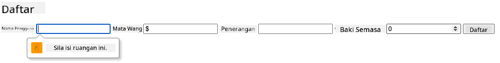
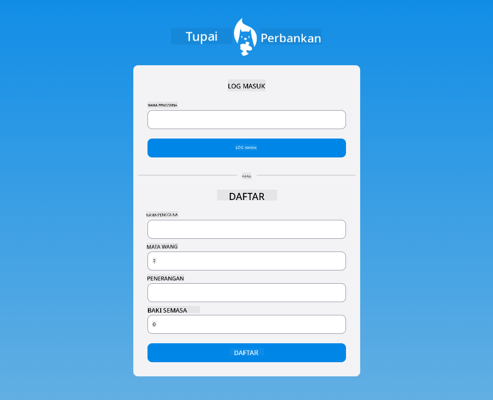

<!--
CO_OP_TRANSLATOR_METADATA:
{
  "original_hash": "b667b7d601e2ee19acb5aa9d102dc9f3",
  "translation_date": "2025-08-27T22:07:20+00:00",
  "source_file": "7-bank-project/2-forms/README.md",
  "language_code": "ms"
}
-->
# Membina Aplikasi Perbankan Bahagian 2: Membina Borang Log Masuk dan Pendaftaran

## Kuiz Pra-Kuliah

[Kuiz pra-kuliah](https://ashy-river-0debb7803.1.azurestaticapps.net/quiz/43)

### Pengenalan

Dalam hampir semua aplikasi web moden, anda boleh mencipta akaun untuk mempunyai ruang peribadi anda sendiri. Oleh kerana pelbagai pengguna boleh mengakses aplikasi web pada masa yang sama, anda memerlukan mekanisme untuk menyimpan data peribadi setiap pengguna secara berasingan dan memilih maklumat yang hendak dipaparkan. Kita tidak akan membincangkan cara menguruskan [identiti pengguna dengan selamat](https://en.wikipedia.org/wiki/Authentication) kerana ia adalah topik yang luas, tetapi kita akan memastikan setiap pengguna boleh mencipta satu (atau lebih) akaun bank dalam aplikasi kita.

Dalam bahagian ini, kita akan menggunakan borang HTML untuk menambah log masuk dan pendaftaran ke aplikasi web kita. Kita akan melihat cara menghantar data ke API pelayan secara programatik, dan akhirnya cara menentukan peraturan pengesahan asas untuk input pengguna.

### Prasyarat

Anda perlu telah menyelesaikan [templat HTML dan penghalaan](../1-template-route/README.md) aplikasi web untuk pelajaran ini. Anda juga perlu memasang [Node.js](https://nodejs.org) dan [menjalankan API pelayan](../api/README.md) secara tempatan supaya anda boleh menghantar data untuk mencipta akaun.

**Ambil perhatian**
Anda akan mempunyai dua terminal yang berjalan serentak seperti yang disenaraikan di bawah.
1. Untuk aplikasi bank utama yang kita bina dalam pelajaran [templat HTML dan penghalaan](../1-template-route/README.md)
2. Untuk [API pelayan Aplikasi Bank](../api/README.md) yang baru kita sediakan di atas.

Anda memerlukan kedua-dua pelayan ini berjalan untuk mengikuti pelajaran ini. Mereka mendengar pada port yang berbeza (port `3000` dan port `5000`) jadi semuanya sepatutnya berfungsi dengan baik.

Anda boleh menguji bahawa pelayan berjalan dengan betul dengan melaksanakan arahan ini dalam terminal:

```sh
curl http://localhost:5000/api
# -> should return "Bank API v1.0.0" as a result
```

---

## Borang dan kawalan

Elemen `<form>` merangkumi bahagian dokumen HTML di mana pengguna boleh memasukkan dan menghantar data dengan kawalan interaktif. Terdapat pelbagai jenis kawalan antara muka pengguna (UI) yang boleh digunakan dalam borang, yang paling biasa ialah elemen `<input>` dan `<button>`.

Terdapat banyak [jenis](https://developer.mozilla.org/docs/Web/HTML/Element/input) `<input>` yang berbeza, contohnya untuk mencipta medan di mana pengguna boleh memasukkan nama pengguna, anda boleh menggunakan:

```html
<input id="username" name="username" type="text">
```

Atribut `name` akan digunakan sebagai nama sifat apabila data borang dihantar. Atribut `id` digunakan untuk mengaitkan `<label>` dengan kawalan borang.

> Lihat senarai penuh [jenis `<input>`](https://developer.mozilla.org/docs/Web/HTML/Element/input) dan [kawalan borang lain](https://developer.mozilla.org/docs/Learn/Forms/Other_form_controls) untuk mendapatkan idea tentang semua elemen UI asli yang boleh anda gunakan semasa membina UI anda.

✅ Perhatikan bahawa `<input>` ialah [elemen kosong](https://developer.mozilla.org/docs/Glossary/Empty_element) yang anda *tidak* perlu menambah tag penutup yang sepadan. Walau bagaimanapun, anda boleh menggunakan notasi penutup sendiri `<input/>`, tetapi ia tidak diperlukan.

Elemen `<button>` dalam borang agak istimewa. Jika anda tidak menentukan atribut `type`nya, ia akan secara automatik menghantar data borang ke pelayan apabila ditekan. Berikut adalah nilai `type` yang mungkin:

- `submit`: Lalai dalam `<form>`, butang mencetuskan tindakan penghantaran borang.
- `reset`: Butang menetapkan semula semua kawalan borang kepada nilai asalnya.
- `button`: Tidak menetapkan tingkah laku lalai apabila butang ditekan. Anda boleh menetapkan tindakan tersuai kepadanya menggunakan JavaScript.

### Tugasan

Mari kita mulakan dengan menambah borang pada templat `login`. Kita memerlukan medan *nama pengguna* dan butang *Log Masuk*.

```html
<template id="login">
  <h1>Bank App</h1>
  <section>
    <h2>Login</h2>
    <form id="loginForm">
      <label for="username">Username</label>
      <input id="username" name="user" type="text">
      <button>Login</button>
    </form>
  </section>
</template>
```

Jika anda melihat dengan lebih dekat, anda boleh perasan bahawa kita juga menambah elemen `<label>` di sini. Elemen `<label>` digunakan untuk menambah nama kepada kawalan UI, seperti medan nama pengguna kita. Label adalah penting untuk kebolehbacaan borang anda, tetapi juga mempunyai manfaat tambahan:

- Dengan mengaitkan label kepada kawalan borang, ia membantu pengguna yang menggunakan teknologi bantuan (seperti pembaca skrin) untuk memahami data yang mereka perlu sediakan.
- Anda boleh klik pada label untuk terus memberi fokus pada input yang berkaitan, menjadikannya lebih mudah dicapai pada peranti berasaskan skrin sentuh.

> [Kebolehaksesan](https://developer.mozilla.org/docs/Learn/Accessibility/What_is_accessibility) di web adalah topik yang sangat penting yang sering diabaikan. Terima kasih kepada [elemen HTML semantik](https://developer.mozilla.org/docs/Learn/Accessibility/HTML), tidak sukar untuk mencipta kandungan yang boleh diakses jika anda menggunakannya dengan betul. Anda boleh [membaca lebih lanjut tentang kebolehaksesan](https://developer.mozilla.org/docs/Web/Accessibility) untuk mengelakkan kesilapan biasa dan menjadi pembangun yang bertanggungjawab.

Sekarang kita akan menambah borang kedua untuk pendaftaran, tepat di bawah borang sebelumnya:

```html
<hr/>
<h2>Register</h2>
<form id="registerForm">
  <label for="user">Username</label>
  <input id="user" name="user" type="text">
  <label for="currency">Currency</label>
  <input id="currency" name="currency" type="text" value="$">
  <label for="description">Description</label>
  <input id="description" name="description" type="text">
  <label for="balance">Current balance</label>
  <input id="balance" name="balance" type="number" value="0">
  <button>Register</button>
</form>
```

Dengan menggunakan atribut `value`, kita boleh menentukan nilai lalai untuk input tertentu. Perhatikan juga bahawa input untuk `balance` mempunyai jenis `number`. Adakah ia kelihatan berbeza daripada input lain? Cuba berinteraksi dengannya.

✅ Bolehkah anda menavigasi dan berinteraksi dengan borang menggunakan hanya papan kekunci? Bagaimana anda melakukannya?

## Menghantar data ke pelayan

Sekarang kita mempunyai UI yang berfungsi, langkah seterusnya adalah menghantar data ke pelayan. Mari kita buat ujian pantas menggunakan kod semasa kita: apa yang berlaku jika anda klik pada butang *Log Masuk* atau *Daftar*?

Adakah anda perasan perubahan pada bahagian URL penyemak imbas anda?


Tindakan lalai untuk `<form>` adalah menghantar borang ke URL pelayan semasa menggunakan [kaedah GET](https://www.w3.org/Protocols/rfc2616/rfc2616-sec9.html#sec9.3), menambahkan data borang terus ke URL. Walau bagaimanapun, kaedah ini mempunyai beberapa kekurangan:

- Data yang dihantar sangat terhad dalam saiz (kira-kira 2000 aksara)
- Data kelihatan secara langsung dalam URL (tidak sesuai untuk kata laluan)
- Ia tidak berfungsi dengan muat naik fail

Itulah sebabnya anda boleh menukarnya untuk menggunakan [kaedah POST](https://www.w3.org/Protocols/rfc2616/rfc2616-sec9.html#sec9.5) yang menghantar data borang ke pelayan dalam badan permintaan HTTP, tanpa sebarang had sebelumnya.

> Walaupun POST adalah kaedah yang paling biasa digunakan untuk menghantar data, [dalam beberapa senario tertentu](https://www.w3.org/2001/tag/doc/whenToUseGet.html) adalah lebih baik menggunakan kaedah GET, contohnya semasa melaksanakan medan carian.

### Tugasan

Tambah sifat `action` dan `method` pada borang pendaftaran:

```html
<form id="registerForm" action="//localhost:5000/api/accounts" method="POST">
```

Sekarang cuba daftar akaun baru dengan nama anda. Selepas klik pada butang *Daftar*, anda sepatutnya melihat sesuatu seperti ini:


Jika semuanya berjalan lancar, pelayan sepatutnya menjawab permintaan anda dengan respons [JSON](https://www.json.org/json-en.html) yang mengandungi data akaun yang telah dibuat.

✅ Cuba daftar lagi dengan nama yang sama. Apa yang berlaku?

## Menghantar data tanpa memuat semula halaman

Seperti yang anda mungkin perasan, terdapat sedikit isu dengan pendekatan yang baru kita gunakan: apabila menghantar borang, kita keluar dari aplikasi kita dan penyemak imbas mengalihkan ke URL pelayan. Kita cuba mengelakkan semua muat semula halaman dengan aplikasi web kita, kerana kita sedang membina [Aplikasi Halaman Tunggal (SPA)](https://en.wikipedia.org/wiki/Single-page_application).

Untuk menghantar data borang ke pelayan tanpa memaksa muat semula halaman, kita perlu menggunakan kod JavaScript. Daripada meletakkan URL dalam sifat `action` elemen `<form>`, anda boleh menggunakan sebarang kod JavaScript yang didahului oleh rentetan `javascript:` untuk melaksanakan tindakan tersuai. Menggunakan ini juga bermakna anda perlu melaksanakan beberapa tugas yang sebelum ini dilakukan secara automatik oleh penyemak imbas:

- Mendapatkan data borang
- Menukar dan mengekod data borang ke format yang sesuai
- Membuat permintaan HTTP dan menghantarnya ke pelayan

### Tugasan

Gantikan `action` borang pendaftaran dengan:

```html
<form id="registerForm" action="javascript:register()">
```

Buka `app.js` dan tambah fungsi baru bernama `register`:

```js
function register() {
  const registerForm = document.getElementById('registerForm');
  const formData = new FormData(registerForm);
  const data = Object.fromEntries(formData);
  const jsonData = JSON.stringify(data);
}
```

Di sini kita mendapatkan elemen borang menggunakan `getElementById()` dan menggunakan pembantu [`FormData`](https://developer.mozilla.org/docs/Web/API/FormData) untuk mengekstrak nilai daripada kawalan borang sebagai set pasangan kunci/nilai. Kemudian kita menukar data kepada objek biasa menggunakan [`Object.fromEntries()`](https://developer.mozilla.org/docs/Web/JavaScript/Reference/Global_Objects/Object/fromEntries) dan akhirnya menyusun data kepada [JSON](https://www.json.org/json-en.html), format yang biasa digunakan untuk pertukaran data di web.

Data kini sedia untuk dihantar ke pelayan. Cipta fungsi baru bernama `createAccount`:

```js
async function createAccount(account) {
  try {
    const response = await fetch('//localhost:5000/api/accounts', {
      method: 'POST',
      headers: { 'Content-Type': 'application/json' },
      body: account
    });
    return await response.json();
  } catch (error) {
    return { error: error.message || 'Unknown error' };
  }
}
```

Apa yang dilakukan oleh fungsi ini? Pertama, perhatikan kata kunci `async` di sini. Ini bermakna fungsi mengandungi kod yang akan dilaksanakan [**secara tidak segerak**](https://developer.mozilla.org/docs/Web/JavaScript/Reference/Statements/async_function). Apabila digunakan bersama kata kunci `await`, ia membolehkan menunggu kod tidak segerak untuk dilaksanakan - seperti menunggu respons pelayan di sini - sebelum meneruskan.

Berikut adalah video ringkas tentang penggunaan `async/await`:

[](https://youtube.com/watch?v=YwmlRkrxvkk "Async dan Await untuk mengurus janji")

> 🎥 Klik imej di atas untuk video tentang async/await.

Kita menggunakan API `fetch()` untuk menghantar data JSON ke pelayan. Kaedah ini mengambil 2 parameter:

- URL pelayan, jadi kita letakkan semula `//localhost:5000/api/accounts` di sini.
- Tetapan permintaan. Di sinilah kita menetapkan kaedah kepada `POST` dan menyediakan `body` untuk permintaan. Oleh kerana kita menghantar data JSON ke pelayan, kita juga perlu menetapkan tajuk `Content-Type` kepada `application/json` supaya pelayan tahu cara mentafsir kandungan.

Oleh kerana pelayan akan menjawab permintaan dengan JSON, kita boleh menggunakan `await response.json()` untuk menganalisis kandungan JSON dan mengembalikan objek yang dihasilkan. Perhatikan bahawa kaedah ini adalah tidak segerak, jadi kita menggunakan kata kunci `await` di sini sebelum mengembalikan untuk memastikan sebarang ralat semasa analisis juga ditangkap.

Sekarang tambah beberapa kod pada fungsi `register` untuk memanggil `createAccount()`:

```js
const result = await createAccount(jsonData);
```

Oleh kerana kita menggunakan kata kunci `await` di sini, kita perlu menambah kata kunci `async` sebelum fungsi register:

```js
async function register() {
```

Akhir sekali, mari kita tambah beberapa log untuk memeriksa hasilnya. Fungsi akhir sepatutnya kelihatan seperti ini:

```js
async function register() {
  const registerForm = document.getElementById('registerForm');
  const formData = new FormData(registerForm);
  const jsonData = JSON.stringify(Object.fromEntries(formData));
  const result = await createAccount(jsonData);

  if (result.error) {
    return console.log('An error occurred:', result.error);
  }

  console.log('Account created!', result);
}
```

Itu agak panjang tetapi kita berjaya! Jika anda membuka [alat pembangun penyemak imbas](https://developer.mozilla.org/docs/Learn/Common_questions/What_are_browser_developer_tools), dan cuba mendaftar akaun baru, anda sepatutnya tidak melihat sebarang perubahan pada halaman web tetapi mesej akan muncul dalam konsol mengesahkan bahawa semuanya berfungsi.


✅ Adakah anda fikir data dihantar ke pelayan dengan selamat? Bagaimana jika seseorang dapat memintas permintaan? Anda boleh membaca tentang [HTTPS](https://en.wikipedia.org/wiki/HTTPS) untuk mengetahui lebih lanjut tentang komunikasi data yang selamat.

## Pengesahan data

Jika anda cuba mendaftar akaun baru tanpa menetapkan nama pengguna terlebih dahulu, anda boleh melihat bahawa pelayan mengembalikan ralat dengan kod status [400 (Permintaan Buruk)](https://developer.mozilla.org/docs/Web/HTTP/Status/400#:~:text=The%20HyperText%20Transfer%20Protocol%20(HTTP,%2C%20or%20deceptive%20request%20routing).).

Sebelum menghantar data ke pelayan, adalah amalan yang baik untuk [mengesahkan data borang](https://developer.mozilla.org/docs/Learn/Forms/Form_validation) terlebih dahulu apabila boleh, untuk memastikan anda menghantar permintaan yang sah. Kawalan borang HTML5 menyediakan pengesahan terbina dalam menggunakan pelbagai atribut:

- `required`: medan perlu diisi jika tidak borang tidak boleh dihantar.
- `minlength` dan `maxlength`: menentukan bilangan minimum dan maksimum aksara dalam medan teks.
- `min` dan `max`: menentukan nilai minimum dan maksimum medan berangka.
- `type`: menentukan jenis data yang dijangka, seperti `number`, `email`, `file` atau [jenis terbina dalam lain](https://developer.mozilla.org/docs/Web/HTML/Element/input). Atribut ini juga boleh mengubah rendering visual kawalan borang.
- `pattern`: membolehkan anda menentukan corak [regular expression](https://developer.mozilla.org/docs/Web/JavaScript/Guide/Regular_Expressions) untuk menguji sama ada data yang dimasukkan adalah sah atau tidak.
> Petua: anda boleh menyesuaikan rupa kawalan borang anda bergantung kepada sama ada ia sah atau tidak dengan menggunakan pseudo-kelas CSS `:valid` dan `:invalid`.
### Tugas

Terdapat 2 medan wajib untuk mencipta akaun baru yang sah, iaitu nama pengguna dan mata wang, manakala medan lain adalah pilihan. Kemas kini HTML borang, menggunakan atribut `required` dan teks pada label medan supaya:

```html
<label for="user">Username (required)</label>
<input id="user" name="user" type="text" required>
...
<label for="currency">Currency (required)</label>
<input id="currency" name="currency" type="text" value="$" required>
```

Walaupun pelaksanaan pelayan tertentu ini tidak menguatkuasakan had tertentu pada panjang maksimum medan, adalah amalan yang baik untuk menetapkan had yang munasabah untuk sebarang input teks pengguna.

Tambahkan atribut `maxlength` pada medan teks:

```html
<input id="user" name="user" type="text" maxlength="20" required>
...
<input id="currency" name="currency" type="text" value="$" maxlength="5" required>
...
<input id="description" name="description" type="text" maxlength="100">
```

Sekarang, jika anda menekan butang *Daftar* dan terdapat medan yang tidak mematuhi peraturan pengesahan yang telah kita tetapkan, anda sepatutnya melihat sesuatu seperti ini:



Pengesahan seperti ini yang dilakukan *sebelum* menghantar sebarang data ke pelayan dipanggil pengesahan **client-side**. Tetapi perlu diingat bahawa tidak selalu mungkin untuk melakukan semua pemeriksaan tanpa menghantar data. Sebagai contoh, kita tidak dapat memeriksa di sini sama ada akaun dengan nama pengguna yang sama sudah wujud tanpa menghantar permintaan ke pelayan. Pengesahan tambahan yang dilakukan di pelayan dipanggil pengesahan **server-side**.

Biasanya kedua-duanya perlu dilaksanakan, dan walaupun menggunakan pengesahan client-side meningkatkan pengalaman pengguna dengan memberikan maklum balas segera kepada pengguna, pengesahan server-side adalah penting untuk memastikan data pengguna yang anda uruskan adalah betul dan selamat.

---

## 🚀 Cabaran

Tunjukkan mesej ralat dalam HTML jika pengguna sudah wujud.

Berikut adalah contoh bagaimana halaman log masuk akhir boleh kelihatan selepas sedikit penggayaan:



## Kuiz Selepas Kuliah

[Kuiz selepas kuliah](https://ashy-river-0debb7803.1.azurestaticapps.net/quiz/44)

## Ulasan & Kajian Kendiri

Pembangun telah menjadi sangat kreatif dalam usaha mereka membina borang, terutamanya berkaitan strategi pengesahan. Pelajari tentang aliran borang yang berbeza dengan melihat melalui [CodePen](https://codepen.com); bolehkah anda menemui beberapa borang yang menarik dan memberi inspirasi?

## Tugasan

[Gayakan aplikasi bank anda](assignment.md)

---

**Penafian**:  
Dokumen ini telah diterjemahkan menggunakan perkhidmatan terjemahan AI [Co-op Translator](https://github.com/Azure/co-op-translator). Walaupun kami berusaha untuk memastikan ketepatan, sila ambil perhatian bahawa terjemahan automatik mungkin mengandungi kesilapan atau ketidaktepatan. Dokumen asal dalam bahasa asalnya harus dianggap sebagai sumber yang berwibawa. Untuk maklumat yang kritikal, terjemahan manusia profesional adalah disyorkan. Kami tidak bertanggungjawab atas sebarang salah faham atau salah tafsir yang timbul daripada penggunaan terjemahan ini.