# Bina Aplikasi Perbankan Bahagian 2: Bina Borang Log Masuk dan Pendaftaran

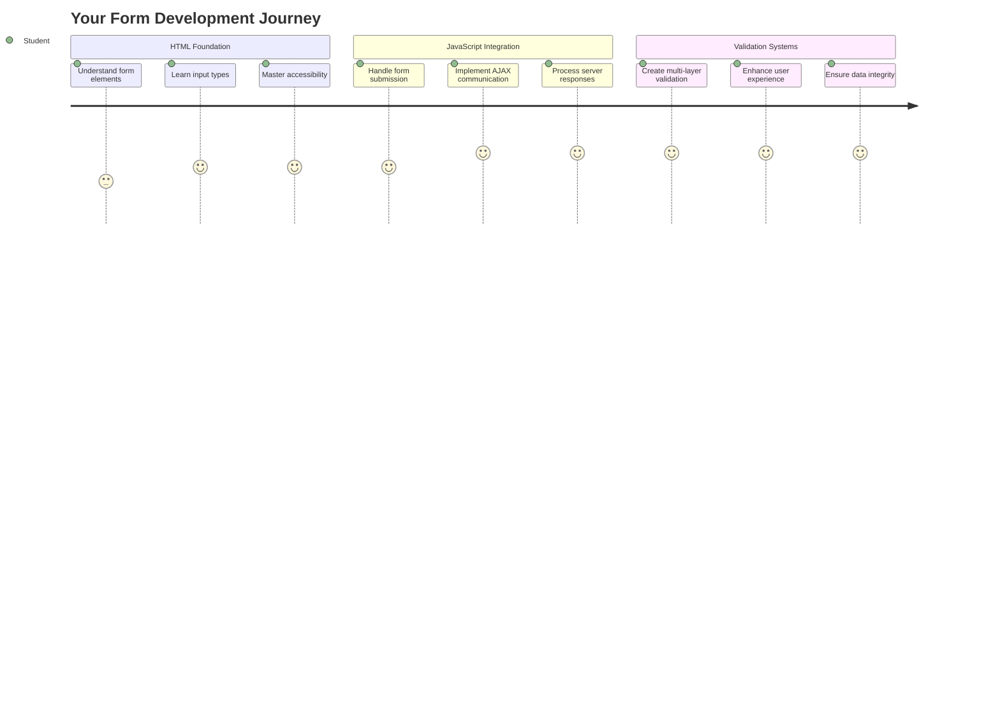

## Kuiz Pra-Kuliah

[Kuiz pra-kuliah](https://ff-quizzes.netlify.app/web/quiz/43)

Pernahkah anda mengisi borang dalam talian dan ia menolak format e-mel anda? Atau kehilangan semua maklumat apabila anda klik hantar? Kita semua pernah mengalami situasi yang mengecewakan ini.

Borang adalah jambatan antara pengguna anda dan fungsi aplikasi anda. Seperti protokol berhati-hati yang digunakan oleh pengawal trafik udara untuk membimbing pesawat dengan selamat ke destinasi mereka, borang yang direka dengan baik memberikan maklum balas yang jelas dan mencegah kesilapan yang mahal. Borang yang buruk, sebaliknya, boleh membuat pengguna meninggalkan aplikasi anda lebih cepat daripada salah komunikasi di lapangan terbang yang sibuk.

Dalam pelajaran ini, kita akan mengubah aplikasi perbankan statik anda menjadi aplikasi interaktif. Anda akan belajar membina borang yang memvalidasi input pengguna, berkomunikasi dengan pelayan, dan memberikan maklum balas yang berguna. Anggaplah ia sebagai membina antara muka kawalan yang membolehkan pengguna menavigasi ciri aplikasi anda.

Pada akhirnya, anda akan mempunyai sistem log masuk dan pendaftaran lengkap dengan validasi yang membimbing pengguna ke arah kejayaan dan bukannya kekecewaan.

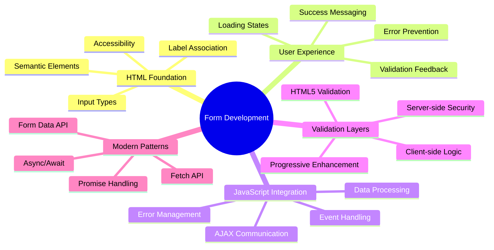

## Prasyarat

Sebelum kita mula membina borang, mari pastikan anda telah menyediakan semuanya dengan betul. Pelajaran ini bermula tepat di mana kita berhenti dalam pelajaran sebelumnya, jadi jika anda melangkau ke depan, anda mungkin ingin kembali dan memastikan asasnya berfungsi terlebih dahulu.

### Persediaan Diperlukan

| Komponen | Status | Penerangan |
|----------|--------|------------|
| [Templat HTML](../1-template-route/README.md) | ✅ Diperlukan | Struktur asas aplikasi perbankan anda |
| [Node.js](https://nodejs.org) | ✅ Diperlukan | Runtime JavaScript untuk pelayan |
| [Pelayan API Bank](../api/README.md) | ✅ Diperlukan | Perkhidmatan backend untuk penyimpanan data |

> 💡 **Tip Pembangunan**: Anda akan menjalankan dua pelayan berasingan secara serentak – satu untuk aplikasi perbankan front-end anda dan satu lagi untuk API backend. Persediaan ini mencerminkan pembangunan dunia nyata di mana perkhidmatan front-end dan backend beroperasi secara bebas.

### Konfigurasi Pelayan

**Persekitaran pembangunan anda akan merangkumi:**
- **Pelayan front-end**: Menyediakan aplikasi perbankan anda (biasanya port `3000`)
- **Pelayan API backend**: Mengendalikan penyimpanan dan pengambilan data (port `5000`)
- **Kedua-dua pelayan** boleh berjalan serentak tanpa konflik

**Menguji sambungan API anda:**
```bash
curl http://localhost:5000/api
# Expected response: "Bank API v1.0.0"
```

**Jika anda melihat respons versi API, anda sudah bersedia untuk meneruskan!**

---

## Memahami Borang dan Kawalan HTML

Borang HTML adalah cara pengguna berkomunikasi dengan aplikasi web anda. Anggaplah ia sebagai sistem telegraf yang menghubungkan tempat-tempat jauh pada abad ke-19 – ia adalah protokol komunikasi antara niat pengguna dan respons aplikasi. Apabila direka dengan teliti, ia menangkap kesilapan, membimbing format input, dan memberikan cadangan yang berguna.

Borang moden jauh lebih canggih daripada input teks asas. HTML5 memperkenalkan jenis input khusus yang secara automatik mengendalikan validasi e-mel, format nombor, dan pemilihan tarikh. Penambahbaikan ini memberi manfaat kepada kebolehaksesan dan pengalaman pengguna mudah alih.

### Elemen Borang Penting

**Blok binaan yang diperlukan setiap borang:**

```html
<!-- Basic form structure -->
<form id="userForm" method="POST">
  <label for="username">Username</label>
  <input id="username" name="username" type="text" required>
  
  <button type="submit">Submit</button>
</form>
```

**Apa yang dilakukan oleh kod ini:**
- **Mencipta** bekas borang dengan pengenal unik
- **Menentukan** kaedah HTTP untuk penghantaran data
- **Mengaitkan** label dengan input untuk kebolehaksesan
- **Mendefinisikan** butang hantar untuk memproses borang

### Jenis Input Moden dan Atribut

| Jenis Input | Tujuan | Contoh Penggunaan |
|-------------|--------|-------------------|
| `text` | Input teks umum | `<input type="text" name="username">` |
| `email` | Validasi e-mel | `<input type="email" name="email">` |
| `password` | Input teks tersembunyi | `<input type="password" name="password">` |
| `number` | Input angka | `<input type="number" name="balance" min="0">` |
| `tel` | Nombor telefon | `<input type="tel" name="phone">` |

> 💡 **Kelebihan HTML5 Moden**: Menggunakan jenis input tertentu memberikan validasi automatik, papan kekunci mudah alih yang sesuai, dan sokongan kebolehaksesan yang lebih baik tanpa JavaScript tambahan!

### Jenis Butang dan Kelakuan

```html
<!-- Different button behaviors -->
<button type="submit">Save Data</button>     <!-- Submits the form -->
<button type="reset">Clear Form</button>    <!-- Resets all fields -->
<button type="button">Custom Action</button> <!-- No default behavior -->
```

**Apa yang dilakukan oleh setiap jenis butang:**
- **Butang hantar**: Mencetuskan penghantaran borang dan menghantar data ke endpoint yang ditentukan
- **Butang reset**: Memulihkan semua medan borang ke keadaan awalnya
- **Butang biasa**: Tidak memberikan kelakuan lalai, memerlukan JavaScript khusus untuk fungsi

> ⚠️ **Nota Penting**: Elemen `<input>` adalah penutup sendiri dan tidak memerlukan tag penutup. Amalan terbaik moden adalah menulis `<input>` tanpa garis miring.

### Membina Borang Log Masuk Anda

Sekarang mari kita buat borang log masuk praktikal yang menunjukkan amalan borang HTML moden. Kita akan bermula dengan struktur asas dan secara beransur-ansur meningkatkannya dengan ciri kebolehaksesan dan validasi.

```html
<template id="login">
  <h1>Bank App</h1>
  <section>
    <h2>Login</h2>
    <form id="loginForm" novalidate>
      <div class="form-group">
        <label for="username">Username</label>
        <input id="username" name="user" type="text" required 
               autocomplete="username" placeholder="Enter your username">
      </div>
      <button type="submit">Login</button>
    </form>
  </section>
</template>
```

**Memecahkan apa yang berlaku di sini:**
- **Menyusun** borang dengan elemen HTML5 semantik
- **Mengelompokkan** elemen berkaitan menggunakan bekas `div` dengan kelas bermakna
- **Mengaitkan** label dengan input menggunakan atribut `for` dan `id`
- **Termasuk** atribut moden seperti `autocomplete` dan `placeholder` untuk UX yang lebih baik
- **Menambah** `novalidate` untuk mengendalikan validasi dengan JavaScript dan bukannya lalai pelayar

### Kuasa Label yang Betul

**Mengapa label penting untuk pembangunan web moden:**

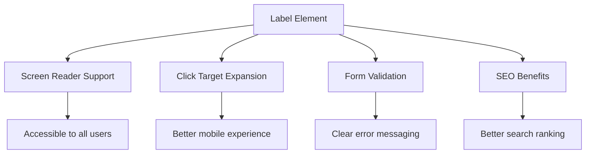

**Apa yang dicapai oleh label yang betul:**
- **Membolehkan** pembaca skrin mengumumkan medan borang dengan jelas
- **Meluaskan** kawasan yang boleh diklik (klik pada label memfokuskan input)
- **Meningkatkan** kebolehgunaan mudah alih dengan sasaran sentuhan yang lebih besar
- **Menyokong** validasi borang dengan mesej ralat yang bermakna
- **Meningkatkan** SEO dengan memberikan makna semantik kepada elemen borang

> 🎯 **Matlamat Kebolehaksesan**: Setiap input borang harus mempunyai label yang berkaitan. Amalan mudah ini menjadikan borang anda boleh digunakan oleh semua orang, termasuk pengguna kurang upaya, dan meningkatkan pengalaman untuk semua pengguna.

### Membuat Borang Pendaftaran

Borang pendaftaran memerlukan maklumat yang lebih terperinci untuk mencipta akaun pengguna lengkap. Mari kita bina dengan ciri HTML5 moden dan kebolehaksesan yang dipertingkatkan.

```html
<hr/>
<h2>Register</h2>
<form id="registerForm" novalidate>
  <div class="form-group">
    <label for="user">Username</label>
    <input id="user" name="user" type="text" required 
           autocomplete="username" placeholder="Choose a username">
  </div>
  
  <div class="form-group">
    <label for="currency">Currency</label>
    <input id="currency" name="currency" type="text" value="$" 
           required maxlength="3" placeholder="USD, EUR, etc.">
  </div>
  
  <div class="form-group">
    <label for="description">Account Description</label>
    <input id="description" name="description" type="text" 
           maxlength="100" placeholder="Personal savings, checking, etc.">
  </div>
  
  <div class="form-group">
    <label for="balance">Starting Balance</label>
    <input id="balance" name="balance" type="number" value="0" 
           min="0" step="0.01" placeholder="0.00">
  </div>
  
  <button type="submit">Create Account</button>
</form>
```

**Dalam kod di atas, kita telah:**
- **Mengatur** setiap medan dalam bekas div untuk gaya dan susun atur yang lebih baik
- **Menambah** atribut `autocomplete` yang sesuai untuk sokongan autofill pelayar
- **Termasuk** teks placeholder yang berguna untuk membimbing input pengguna
- **Menetapkan** lalai yang masuk akal menggunakan atribut `value`
- **Menerapkan** atribut validasi seperti `required`, `maxlength`, dan `min`
- **Menggunakan** `type="number"` untuk medan baki dengan sokongan perpuluhan

### Meneroka Jenis Input dan Kelakuan

**Jenis input moden memberikan fungsi yang dipertingkatkan:**

| Ciri | Kelebihan | Contoh |
|------|----------|--------|
| `type="number"` | Papan kekunci angka pada mudah alih | Memudahkan input baki |
| `step="0.01"` | Kawalan ketepatan perpuluhan | Membolehkan sen dalam mata wang |
| `autocomplete` | Autofill pelayar | Penyelesaian borang lebih cepat |
| `placeholder` | Petunjuk kontekstual | Membimbing jangkaan pengguna |

> 🎯 **Cabaran Kebolehaksesan**: Cuba navigasi borang menggunakan hanya papan kekunci anda! Gunakan `Tab` untuk bergerak antara medan, `Space` untuk memilih kotak, dan `Enter` untuk menghantar. Pengalaman ini membantu anda memahami bagaimana pengguna pembaca skrin berinteraksi dengan borang anda.

### 🔄 **Pemeriksaan Pedagogi**
**Pemahaman Asas Borang**: Sebelum melaksanakan JavaScript, pastikan anda memahami:
- ✅ Bagaimana HTML semantik mencipta struktur borang yang boleh diakses
- ✅ Mengapa jenis input penting untuk papan kekunci mudah alih dan validasi
- ✅ Hubungan antara label dan kawalan borang
- ✅ Bagaimana atribut borang mempengaruhi kelakuan lalai pelayar

**Ujian Kendiri Cepat**: Apa yang berlaku jika anda menghantar borang tanpa pengendalian JavaScript?
*Jawapan: Pelayar melakukan penghantaran lalai, biasanya mengarahkan ke URL tindakan*

**Kelebihan Borang HTML5**: Borang moden menyediakan:
- **Validasi Terbina Dalam**: Pemeriksaan format e-mel dan nombor automatik
- **Pengoptimuman Mudah Alih**: Papan kekunci yang sesuai untuk jenis input yang berbeza
- **Kebolehaksesan**: Sokongan pembaca skrin dan navigasi papan kekunci
- **Peningkatan Progresif**: Berfungsi walaupun JavaScript dilumpuhkan

## Memahami Kaedah Penghantaran Borang

Apabila seseorang mengisi borang anda dan menekan hantar, data itu perlu pergi ke suatu tempat – biasanya ke pelayan yang boleh menyimpannya. Terdapat beberapa cara berbeza ini boleh berlaku, dan mengetahui yang mana satu untuk digunakan boleh menyelamatkan anda daripada beberapa sakit kepala kemudian.

Mari kita lihat apa yang sebenarnya berlaku apabila seseorang klik butang hantar itu.

### Kelakuan Lalai Borang

Pertama, mari kita perhatikan apa yang berlaku dengan penghantaran borang asas:

**Uji borang semasa anda:**
1. Klik butang *Daftar* dalam borang anda
2. Perhatikan perubahan dalam bar alamat pelayar anda
3. Perhatikan bagaimana halaman dimuat semula dan data muncul dalam URL


### Perbandingan Kaedah HTTP

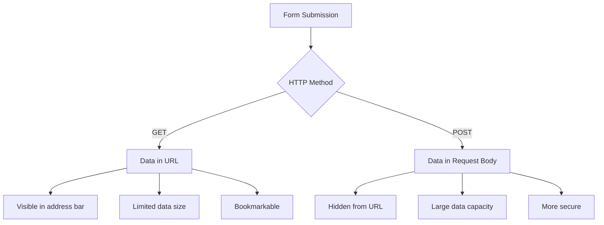

**Memahami perbezaannya:**

| Kaedah | Kes Penggunaan | Lokasi Data | Tahap Keselamatan | Had Saiz |
|--------|---------------|-------------|-------------------|----------|
| `GET` | Pertanyaan carian, penapis | Parameter URL | Rendah (kelihatan) | ~2000 aksara |
| `POST` | Akaun pengguna, data sensitif | Badan permintaan | Tinggi (tersembunyi) | Tiada had praktikal |

**Memahami perbezaan asas:**
- **GET**: Menambahkan data borang ke URL sebagai parameter pertanyaan (sesuai untuk operasi carian)
- **POST**: Termasuk data dalam badan permintaan (penting untuk maklumat sensitif)
- **Had GET**: Kekangan saiz, data kelihatan, sejarah pelayar yang berterusan
- **Kelebihan POST**: Kapasiti data besar, perlindungan privasi, sokongan muat naik fail

> 💡 **Amalan Terbaik**: Gunakan `GET` untuk borang carian dan penapis (pengambilan data), gunakan `POST` untuk pendaftaran pengguna, log masuk, dan penciptaan data.

### Mengkonfigurasi Penghantaran Borang

Mari kita konfigurasikan borang pendaftaran anda untuk berkomunikasi dengan betul dengan API backend menggunakan kaedah POST:

```html
<form id="registerForm" action="//localhost:5000/api/accounts" 
      method="POST" novalidate>
```

**Apa yang dilakukan oleh konfigurasi ini:**
- **Mengarah** penghantaran borang ke endpoint API anda
- **Menggunakan** kaedah POST untuk penghantaran data yang selamat
- **Termasuk** `novalidate` untuk mengendalikan validasi dengan JavaScript

### Menguji Penghantaran Borang

**Ikuti langkah-langkah ini untuk menguji borang anda:**
1. **Isi** borang pendaftaran dengan maklumat anda
2. **Klik** butang "Buat Akaun"
3. **Perhatikan** respons pelayan dalam pelayar anda

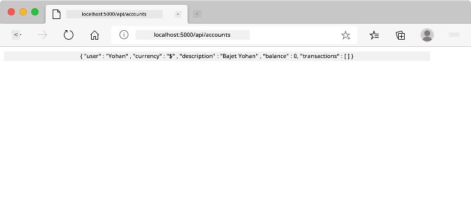

**Apa yang anda harus lihat:**
- **Pelayar mengarahkan** ke URL endpoint API
- **Respons JSON** yang mengandungi data akaun baru anda
- **Pengesahan pelayan** bahawa akaun berjaya dibuat

> 🧪 **Masa Eksperimen**: Cuba daftar lagi dengan nama pengguna yang sama. Apa respons yang anda dapat? Ini membantu anda memahami bagaimana pelayan mengendalikan data duplikat dan keadaan ralat.

### Memahami Respons JSON

**Apabila pelayan memproses borang anda dengan berjaya:**
```json
{
  "user": "john_doe",
  "currency": "$",
  "description": "Personal savings",
  "balance": 100,
  "id": "unique_account_id"
}
```

**Respons ini mengesahkan:**
- **Mencipta** akaun baru dengan data yang anda tentukan
- **Menetapkan** pengenal unik untuk rujukan masa depan
- **Mengembalikan** semua maklumat akaun untuk pengesahan
- **Menunjukkan** penyimpanan pangkalan data yang berjaya

## Pengendalian Borang Moden dengan JavaScript

Penghantaran borang tradisional menyebabkan muat semula halaman penuh, sama seperti bagaimana misi angkasa awal memerlukan tetapan semula sistem lengkap untuk pembetulan kursus. Pendekatan ini mengganggu pengalaman pengguna dan kehilangan keadaan aplikasi.

Pengendalian borang JavaScript berfungsi seperti sistem panduan berterusan yang digunakan oleh kapal angkasa moden – membuat penyesuaian masa nyata tanpa kehilangan konteks navigasi. Kita boleh memintas penghantaran borang, memberikan maklum balas segera, mengendalikan ralat dengan anggun, dan mengemas kini antara muka berdasarkan respons pelayan sambil mengekalkan kedudukan pengguna dalam aplikasi.

### Mengapa Mengelakkan Muat Semula Halaman?

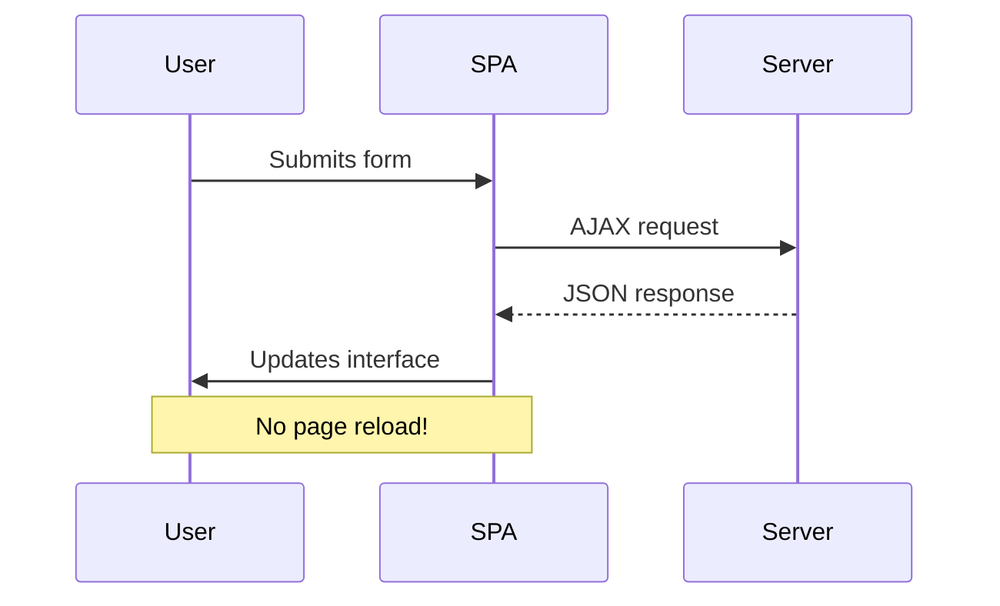

**Kelebihan pengendalian borang JavaScript:**
- **Menjaga** keadaan aplikasi dan konteks pengguna
- **Memberikan** maklum balas segera dan indikator pemuatan
- **Membolehkan** pengendalian ralat dan validasi dinamik
- **Mencipta** pengalaman pengguna yang lancar seperti aplikasi
- **Membolehkan** logik bersyarat berdasarkan respons pelayan

### Peralihan dari Borang Tradisional ke Moden

**Cabaran pendekatan tradisional:**
- **Mengalihkan** pengguna dari aplikasi anda
- **Kehilangan** keadaan dan konteks aplikasi semasa
- **Memerlukan** muat semula halaman penuh untuk operasi mudah
- **Memberikan** kawalan terhad terhadap maklum balas pengguna

**Kelebihan pendekatan JavaScript moden:**
- **Menjaga** pengguna dalam aplikasi anda
- **Menjaga** semua keadaan dan data aplikasi
- **Membolehkan** validasi dan maklum balas masa nyata
- **Menyokong** peningkatan progresif dan kebolehaksesan

### Melaksanakan Pengendalian Borang JavaScript

Mari kita gantikan penghantaran borang tradisional dengan pengendalian acara JavaScript moden:

```html
<!-- Remove the action attribute and add event handling -->
<form id="registerForm" method="POST" novalidate>
```

**Tambahkan logik pendaftaran ke fail `app.js` anda:**

```javascript
// Modern event-driven form handling
function register() {
  const registerForm = document.getElementById('registerForm');
  const formData = new FormData(registerForm);
  const data = Object.fromEntries(formData);
  const jsonData = JSON.stringify(data);
  
  console.log('Form data prepared:', data);
}

// Attach event listener when the page loads
document.addEventListener('DOMContentLoaded', () => {
  const registerForm = document.getElementById('registerForm');
  registerForm.addEventListener('submit', (event) => {
    event.preventDefault(); // Prevent default form submission
    register();
  });
});
```

**Memecahkan apa yang berlaku di sini:**
- **Menghalang** penghantaran borang lalai menggunakan `event.preventDefault()`
- **Mengambil** elemen borang menggunakan pemilihan DOM moden
- **Mengeluarkan** data borang menggunakan API `FormData` yang kuat
- **Menukar** FormData kepada objek biasa dengan `Object.fromEntries()`
- **Menyerikan** data ke format JSON untuk komunikasi pelayan
- **Mencatat** data yang diproses untuk debugging dan pengesahan

### Memahami API FormData

**API FormData menyediakan pengendalian borang yang kuat:**
```javascript
// Example of what FormData captures
const formData = new FormData(registerForm);

// FormData automatically captures:
// {
//   "user": "john_doe",
//   "currency": "$", 
//   "description": "Personal account",
//   "balance": "100"
// }
```

**Kelebihan API FormData:**
- **Pengumpulan menyeluruh**: Menangkap semua elemen borang termasuk teks, fail, dan input kompleks
- **Kesedaran jenis**: Mengendalikan pelbagai jenis input secara automatik tanpa pengekodan khas
- **Kecekapan**: Menghapuskan pengumpulan medan secara manual dengan satu panggilan API
- **Kebolehsuaian**: Mengekalkan fungsi walaupun struktur borang berubah

### Membina Fungsi Komunikasi Pelayan

Sekarang mari kita bina fungsi yang kukuh untuk berkomunikasi dengan pelayan API anda menggunakan corak JavaScript moden:

```javascript
async function createAccount(account) {
  try {
    const response = await fetch('//localhost:5000/api/accounts', {
      method: 'POST',
      headers: { 
        'Content-Type': 'application/json',
        'Accept': 'application/json'
      },
      body: account
    });
    
    // Check if the response was successful
    if (!response.ok) {
      throw new Error(`HTTP error! status: ${response.status}`);
    }
    
    return await response.json();
  } catch (error) {
    console.error('Account creation failed:', error);
    return { error: error.message || 'Network error occurred' };
  }
}
```

**Memahami JavaScript asinkron:**

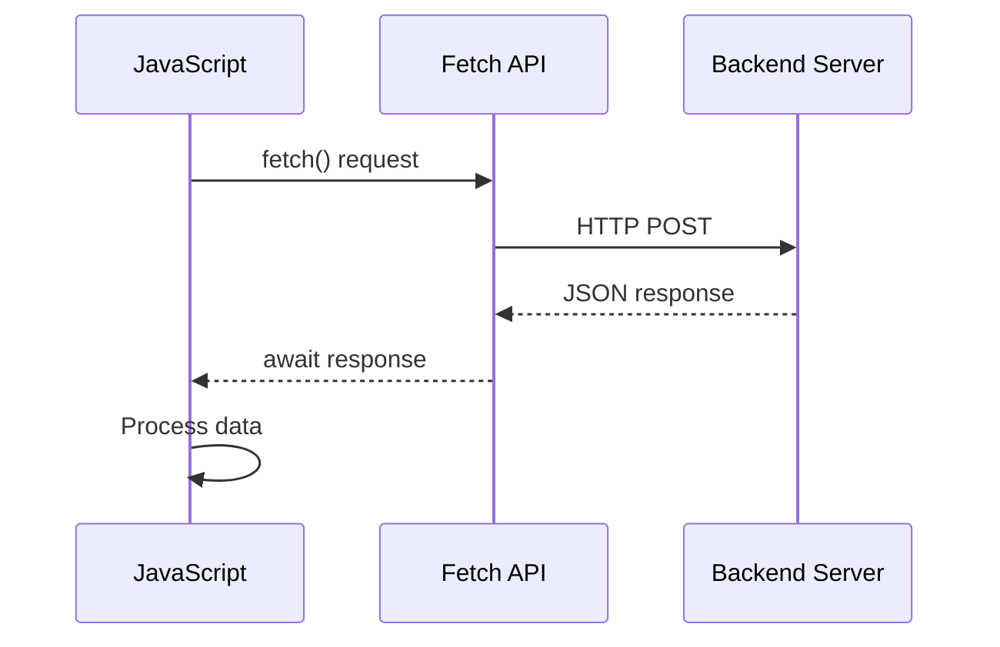

**Apa yang dicapai oleh pelaksanaan moden ini:**
- **Menggunakan** `async/await` untuk kod asinkron yang mudah dibaca
- **Termasuk** pengendalian ralat yang betul dengan blok try/catch
- **Memeriksa** status respons sebelum memproses data
- **Menetapkan** tajuk yang sesuai untuk komunikasi JSON
- **Memberikan** mesej ralat terperinci untuk penyahpepijatan
- **Mengembalikan** struktur data yang konsisten untuk kes kejayaan dan ralat

### Kuasa Fetch API Moden

**Kelebihan Fetch API berbanding kaedah lama:**

| Ciri | Manfaat | Pelaksanaan |
|------|---------|-------------|
| Berasaskan Janji | Kod asinkron yang bersih | `await fetch()` |
| Penyesuaian Permintaan | Kawalan HTTP penuh | Tajuk, kaedah, badan |
| Pengendalian Respons | Penguraian data yang fleksibel | `.json()`, `.text()`, `.blob()` |
| Pengendalian Ralat | Penangkapan ralat yang menyeluruh | Blok Try/catch |

> 🎥 **Ketahui Lebih Lanjut**: [Tutorial Async/Await](https://youtube.com/watch?v=YwmlRkrxvkk) - Memahami corak JavaScript asinkron untuk pembangunan web moden.

**Konsep utama untuk komunikasi pelayan:**
- **Fungsi asinkron** membolehkan penangguhan pelaksanaan untuk menunggu respons pelayan
- **Kata kunci Await** menjadikan kod asinkron kelihatan seperti kod sinkron
- **Fetch API** menyediakan permintaan HTTP moden berasaskan janji
- **Pengendalian ralat** memastikan aplikasi anda bertindak balas dengan baik terhadap isu rangkaian

### Menyelesaikan Fungsi Pendaftaran

Mari kita gabungkan semuanya dengan fungsi pendaftaran yang lengkap dan sedia untuk pengeluaran:

```javascript
async function register() {
  const registerForm = document.getElementById('registerForm');
  const submitButton = registerForm.querySelector('button[type="submit"]');
  
  try {
    // Show loading state
    submitButton.disabled = true;
    submitButton.textContent = 'Creating Account...';
    
    // Process form data
    const formData = new FormData(registerForm);
    const jsonData = JSON.stringify(Object.fromEntries(formData));
    
    // Send to server
    const result = await createAccount(jsonData);
    
    if (result.error) {
      console.error('Registration failed:', result.error);
      alert(`Registration failed: ${result.error}`);
      return;
    }
    
    console.log('Account created successfully!', result);
    alert(`Welcome, ${result.user}! Your account has been created.`);
    
    // Reset form after successful registration
    registerForm.reset();
    
  } catch (error) {
    console.error('Unexpected error:', error);
    alert('An unexpected error occurred. Please try again.');
  } finally {
    // Restore button state
    submitButton.disabled = false;
    submitButton.textContent = 'Create Account';
  }
}
```

**Pelaksanaan yang dipertingkatkan ini termasuk:**
- **Memberikan** maklum balas visual semasa penghantaran borang
- **Melumpuhkan** butang hantar untuk mengelakkan penghantaran berganda
- **Mengendalikan** kedua-dua ralat yang dijangka dan tidak dijangka dengan baik
- **Menunjukkan** mesej kejayaan dan ralat yang mesra pengguna
- **Menetapkan semula** borang selepas pendaftaran berjaya
- **Memulihkan** keadaan UI tanpa mengira hasilnya

### Menguji Pelaksanaan Anda

**Buka alat pembangun pelayar anda dan uji pendaftaran:**

1. **Buka** konsol pelayar (F12 → tab Konsol)
2. **Isi** borang pendaftaran
3. **Klik** "Buat Akaun"
4. **Perhatikan** mesej konsol dan maklum balas pengguna


**Apa yang anda patut lihat:**
- **Keadaan pemuatan** muncul pada butang hantar
- **Log konsol** menunjukkan maklumat terperinci tentang proses
- **Mesej kejayaan** muncul apabila penciptaan akaun berjaya
- **Borang ditetapkan semula** secara automatik selepas penghantaran berjaya

> 🔒 **Pertimbangan Keselamatan**: Pada masa ini, data dihantar melalui HTTP, yang tidak selamat untuk pengeluaran. Dalam aplikasi sebenar, sentiasa gunakan HTTPS untuk menyulitkan penghantaran data. Ketahui lebih lanjut tentang [keselamatan HTTPS](https://en.wikipedia.org/wiki/HTTPS) dan mengapa ia penting untuk melindungi data pengguna.

### 🔄 **Pemeriksaan Pedagogi**
**Integrasi JavaScript Moden**: Sahkan pemahaman anda tentang pengendalian borang asinkron:
- ✅ Bagaimana `event.preventDefault()` mengubah tingkah laku lalai borang?
- ✅ Mengapa API FormData lebih cekap daripada pengumpulan medan secara manual?
- ✅ Bagaimana corak async/await meningkatkan kebolehbacaan kod?
- ✅ Apakah peranan pengendalian ralat dalam pengalaman pengguna?

**Seni Bina Sistem**: Pengendalian borang anda menunjukkan:
- **Pengaturcaraan Berasaskan Peristiwa**: Borang bertindak balas terhadap tindakan pengguna tanpa memuat semula halaman
- **Komunikasi Asinkron**: Permintaan pelayan tidak menyekat antara muka pengguna
- **Pengendalian Ralat**: Kemerosotan yang baik apabila permintaan rangkaian gagal
- **Pengurusan Keadaan**: Kemas kini UI mencerminkan respons pelayan dengan sewajarnya
- **Peningkatan Progresif**: Fungsi asas berfungsi, JavaScript meningkatkannya

**Corak Profesional**: Anda telah melaksanakan:
- **Tanggungjawab Tunggal**: Fungsi mempunyai tujuan yang jelas dan fokus
- **Sempadan Ralat**: Blok try/catch menghalang kerosakan aplikasi
- **Maklum Balas Pengguna**: Keadaan pemuatan dan mesej kejayaan/ralat
- **Transformasi Data**: FormData kepada JSON untuk komunikasi pelayan

## Pengesahan Borang Komprehensif

Pengesahan borang mengelakkan pengalaman yang mengecewakan apabila menemui ralat hanya selepas penghantaran. Seperti sistem redundan berganda di Stesen Angkasa Antarabangsa, pengesahan yang berkesan menggunakan pelbagai lapisan pemeriksaan keselamatan.

Pendekatan yang optimum menggabungkan pengesahan peringkat pelayar untuk maklum balas segera, pengesahan JavaScript untuk pengalaman pengguna yang dipertingkatkan, dan pengesahan pelayan untuk keselamatan dan integriti data. Redundansi ini memastikan kepuasan pengguna dan perlindungan sistem.

### Memahami Lapisan Pengesahan

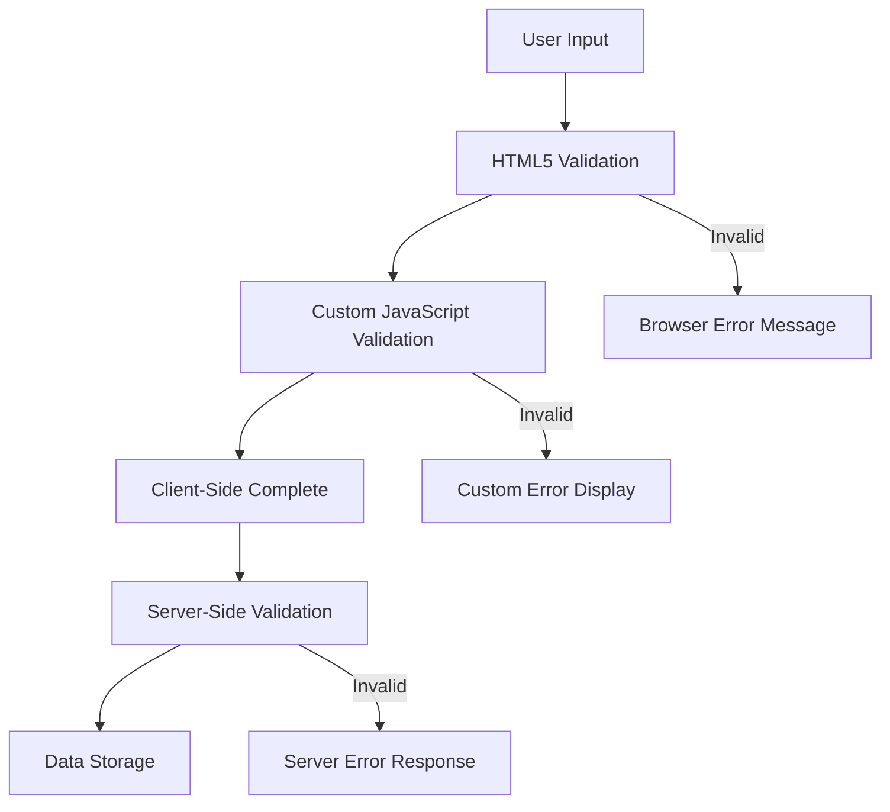

**Strategi pengesahan berbilang lapisan:**
- **Pengesahan HTML5**: Pemeriksaan berasaskan pelayar segera
- **Pengesahan JavaScript**: Logik tersuai dan pengalaman pengguna
- **Pengesahan Pelayan**: Pemeriksaan keselamatan dan integriti data akhir
- **Peningkatan progresif**: Berfungsi walaupun JavaScript dilumpuhkan

### Atribut Pengesahan HTML5

**Alat pengesahan moden yang tersedia untuk anda:**

| Atribut | Tujuan | Contoh Penggunaan | Tingkah Laku Pelayar |
|---------|--------|-------------------|----------------------|
| `required` | Medan wajib | `<input required>` | Menghalang penghantaran kosong |
| `minlength`/`maxlength` | Had panjang teks | `<input maxlength="20">` | Menguatkuasakan had aksara |
| `min`/`max` | Julat angka | `<input min="0" max="1000">` | Mengesahkan sempadan nombor |
| `pattern` | Peraturan regex tersuai | `<input pattern="[A-Za-z]+">` | Memadankan format tertentu |
| `type` | Pengesahan jenis data | `<input type="email">` | Pengesahan khusus format |

### Gaya Pengesahan CSS

**Cipta maklum balas visual untuk keadaan pengesahan:**

```css
/* Valid input styling */
input:valid {
  border-color: #28a745;
  background-color: #f8fff9;
}

/* Invalid input styling */
input:invalid {
  border-color: #dc3545;
  background-color: #fff5f5;
}

/* Focus states for better accessibility */
input:focus:valid {
  box-shadow: 0 0 0 0.2rem rgba(40, 167, 69, 0.25);
}

input:focus:invalid {
  box-shadow: 0 0 0 0.2rem rgba(220, 53, 69, 0.25);
}
```

**Apa yang dicapai oleh petunjuk visual ini:**
- **Sempadan hijau**: Menunjukkan pengesahan berjaya, seperti lampu hijau di pusat kawalan
- **Sempadan merah**: Menandakan ralat pengesahan yang memerlukan perhatian
- **Sorotan fokus**: Memberikan konteks visual yang jelas untuk lokasi input semasa
- **Gaya konsisten**: Menetapkan corak antara muka yang boleh dipelajari oleh pengguna

> 💡 **Petua Pro**: Gunakan pseudo-kelas CSS `:valid` dan `:invalid` untuk memberikan maklum balas visual segera semasa pengguna menaip, mencipta antara muka yang responsif dan membantu.

### Melaksanakan Pengesahan Komprehensif

Mari tingkatkan borang pendaftaran anda dengan pengesahan yang kukuh yang memberikan pengalaman pengguna yang sangat baik dan kualiti data:

```html
<form id="registerForm" method="POST" novalidate>
  <div class="form-group">
    <label for="user">Username <span class="required">*</span></label>
    <input id="user" name="user" type="text" required 
           minlength="3" maxlength="20" 
           pattern="[a-zA-Z0-9_]+" 
           autocomplete="username"
           title="Username must be 3-20 characters, letters, numbers, and underscores only">
    <small class="form-text">Choose a unique username (3-20 characters)</small>
  </div>
  
  <div class="form-group">
    <label for="currency">Currency <span class="required">*</span></label>
    <input id="currency" name="currency" type="text" required 
           value="$" maxlength="3" 
           pattern="[A-Z$€£¥₹]+" 
           title="Enter a valid currency symbol or code">
    <small class="form-text">Currency symbol (e.g., $, €, £)</small>
  </div>
  
  <div class="form-group">
    <label for="description">Account Description</label>
    <input id="description" name="description" type="text" 
           maxlength="100" 
           placeholder="Personal savings, checking, etc.">
    <small class="form-text">Optional description (up to 100 characters)</small>
  </div>
  
  <div class="form-group">
    <label for="balance">Starting Balance</label>
    <input id="balance" name="balance" type="number" 
           value="0" min="0" step="0.01" 
           title="Enter a positive number for your starting balance">
    <small class="form-text">Initial account balance (minimum $0.00)</small>
  </div>
  
  <button type="submit">Create Account</button>
</form>
```

**Memahami pengesahan yang dipertingkatkan:**
- **Menggabungkan** penunjuk medan wajib dengan penerangan yang membantu
- **Termasuk** atribut `pattern` untuk pengesahan format
- **Memberikan** atribut `title` untuk kebolehaksesan dan petua alat
- **Menambah** teks pembantu untuk membimbing input pengguna
- **Menggunakan** struktur HTML semantik untuk kebolehaksesan yang lebih baik

### Peraturan Pengesahan Lanjutan

**Apa yang dicapai oleh setiap peraturan pengesahan:**

| Medan | Peraturan Pengesahan | Manfaat Pengguna |
|-------|-----------------------|------------------|
| Nama Pengguna | `required`, `minlength="3"`, `maxlength="20"`, `pattern="[a-zA-Z0-9_]+"` | Memastikan pengenal pasti yang sah dan unik |
| Mata Wang | `required`, `maxlength="3"`, `pattern="[A-Z$€£¥₹]+"` | Menerima simbol mata wang biasa |
| Baki | `min="0"`, `step="0.01"`, `type="number"` | Menghalang baki negatif |
| Penerangan | `maxlength="100"` | Had panjang yang munasabah |

### Menguji Tingkah Laku Pengesahan

**Cuba senario pengesahan ini:**
1. **Hantar** borang dengan medan wajib kosong
2. **Masukkan** nama pengguna yang lebih pendek daripada 3 aksara
3. **Cuba** aksara khas dalam medan nama pengguna
4. **Masukkan** jumlah baki negatif


**Apa yang anda akan perhatikan:**
- **Pelayar memaparkan** mesej pengesahan asli
- **Perubahan gaya** berdasarkan keadaan `:valid` dan `:invalid`
- **Penghantaran borang** dihalang sehingga semua pengesahan lulus
- **Fokus secara automatik** bergerak ke medan pertama yang tidak sah

### Pengesahan Pelanggan vs Pelayan

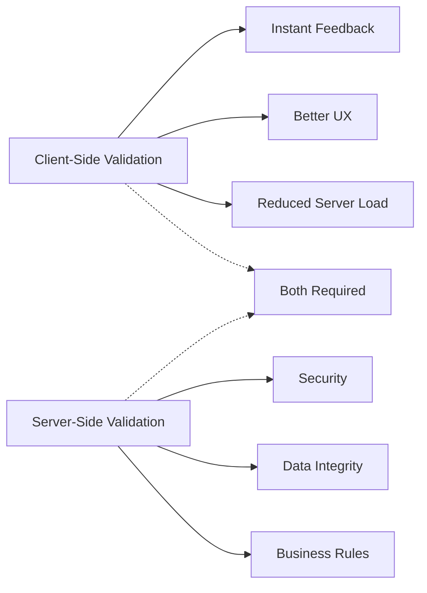

**Mengapa anda memerlukan kedua-dua lapisan:**
- **Pengesahan pelanggan**: Memberikan maklum balas segera dan meningkatkan pengalaman pengguna
- **Pengesahan pelayan**: Memastikan keselamatan dan mengendalikan peraturan perniagaan yang kompleks
- **Pendekatan gabungan**: Mencipta aplikasi yang kukuh, mesra pengguna, dan selamat
- **Peningkatan progresif**: Berfungsi walaupun JavaScript dilumpuhkan

> 🛡️ **Peringatan Keselamatan**: Jangan sekali-kali mempercayai pengesahan pelanggan sahaja! Pengguna berniat jahat boleh memintas pemeriksaan pelanggan, jadi pengesahan pelayan adalah penting untuk keselamatan dan integriti data.

### ⚡ **Apa Yang Anda Boleh Lakukan Dalam 5 Minit Seterusnya**
- [ ] Uji borang anda dengan data tidak sah untuk melihat mesej pengesahan
- [ ] Cuba hantar borang dengan JavaScript dilumpuhkan untuk melihat pengesahan HTML5
- [ ] Buka DevTools pelayar dan periksa data borang yang dihantar ke pelayan
- [ ] Bereksperimen dengan pelbagai jenis input untuk melihat perubahan papan kekunci mudah alih

### 🎯 **Apa Yang Anda Boleh Capai Dalam Jam Ini**
- [ ] Lengkapkan kuiz selepas pelajaran dan fahami konsep pengendalian borang
- [ ] Laksanakan cabaran pengesahan komprehensif dengan maklum balas masa nyata
- [ ] Tambahkan gaya CSS untuk mencipta borang yang kelihatan profesional
- [ ] Cipta pengendalian ralat untuk nama pengguna yang sama dan ralat pelayan
- [ ] Tambahkan medan pengesahan kata laluan dengan pengesahan padanan

### 📅 **Perjalanan Penguasaan Borang Anda Sepanjang Minggu**
- [ ] Lengkapkan aplikasi perbankan penuh dengan ciri borang lanjutan
- [ ] Laksanakan keupayaan muat naik fail untuk gambar profil atau dokumen
- [ ] Tambahkan borang berbilang langkah dengan penunjuk kemajuan dan pengurusan keadaan
- [ ] Cipta borang dinamik yang menyesuaikan berdasarkan pilihan pengguna
- [ ] Laksanakan autosimpan borang dan pemulihan untuk pengalaman pengguna yang lebih baik
- [ ] Tambahkan pengesahan lanjutan seperti pengesahan e-mel dan format nombor telefon

### 🌟 **Penguasaan Pembangunan Frontend Anda Sepanjang Bulan**
- [ ] Bina aplikasi borang kompleks dengan logik bersyarat dan aliran kerja
- [ ] Pelajari perpustakaan dan rangka kerja borang untuk pembangunan pantas
- [ ] Kuasai garis panduan kebolehaksesan dan prinsip reka bentuk inklusif
- [ ] Laksanakan pengantarabangsaan dan penyetempatan untuk borang global
- [ ] Cipta perpustakaan komponen borang yang boleh digunakan semula dan sistem reka bentuk
- [ ] Sumbang kepada projek borang sumber terbuka dan kongsi amalan terbaik

## 🎯 Garis Masa Penguasaan Pembangunan Borang Anda

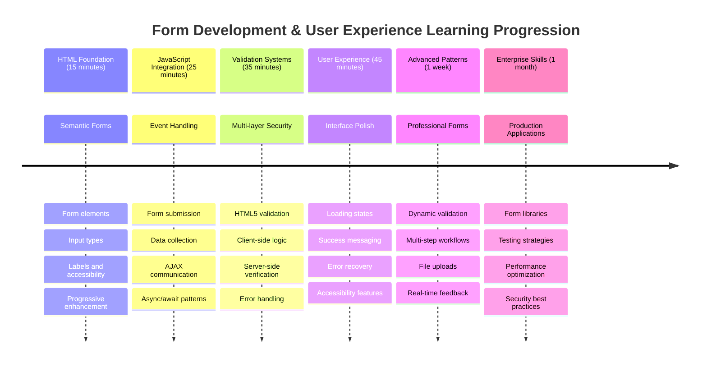

### 🛠️ Ringkasan Alat Pembangunan Borang Anda

Selepas melengkapkan pelajaran ini, anda kini telah menguasai:
- **Borang HTML5**: Struktur semantik, jenis input, dan ciri kebolehaksesan
- **Pengendalian Borang JavaScript**: Pengurusan acara, pengumpulan data, dan komunikasi AJAX
- **Seni Bina Pengesahan**: Pengesahan berbilang lapisan untuk keselamatan dan pengalaman pengguna
- **Pengaturcaraan Asinkron**: Fetch API moden dan corak async/await
- **Pengurusan Ralat**: Pengendalian ralat yang menyeluruh dan sistem maklum balas pengguna
- **Reka Bentuk Pengalaman Pengguna**: Keadaan pemuatan, mesej kejayaan, dan pemulihan ralat
- **Peningkatan Progresif**: Borang yang berfungsi di semua pelayar dan keupayaan

**Aplikasi Dunia Sebenar**: Kemahiran pembangunan borang anda digunakan secara langsung untuk:
- **Aplikasi E-dagang**: Proses pembayaran, pendaftaran akaun, dan borang pembayaran
- **Perisian Perusahaan**: Sistem kemasukan data, antara muka pelaporan, dan aplikasi aliran kerja
- **Pengurusan Kandungan**: Platform penerbitan, kandungan yang dijana pengguna, dan antara muka pentadbiran
- **Aplikasi Kewangan**: Antara muka perbankan, platform pelaburan, dan sistem transaksi
- **Sistem Penjagaan Kesihatan**: Portal pesakit, penjadualan temu janji, dan borang rekod perubatan
- **Platform Pendidikan**: Pendaftaran kursus, alat penilaian, dan pengurusan pembelajaran

**Kemahiran Profesional Diperoleh**: Anda kini boleh:
- **Reka bentuk** borang yang boleh diakses yang berfungsi untuk semua pengguna termasuk mereka yang mempunyai kecacatan
- **Laksanakan** pengesahan borang yang selamat yang menghalang kerosakan data dan kelemahan keselamatan
- **Cipta** antara muka pengguna responsif yang memberikan maklum balas dan panduan yang jelas
- **Nyahpepijat** interaksi borang kompleks menggunakan alat pembangun pelayar dan analisis rangkaian
- **Optimumkan** prestasi borang melalui pengendalian data dan strategi pengesahan yang cekap

**Konsep Pembangunan Frontend Dikuasai**:
- **Seni Bina Berasaskan Peristiwa**: Pengendalian interaksi pengguna dan sistem respons
- **Pengaturcaraan Asinkron**: Komunikasi pelayan tidak menyekat dan pengendalian ralat
- **Pengesahan Data**: Pemeriksaan keselamatan dan integriti pelanggan dan pelayan
- **Reka Bentuk Pengalaman Pengguna**: Antara muka intuitif yang membimbing pengguna ke arah kejayaan
- **Kejuruteraan Kebolehaksesan**: Reka bentuk inklusif yang berfungsi untuk keperluan pengguna yang pelbagai

**Tahap Seterusnya**: Anda bersedia untuk meneroka perpustakaan borang lanjutan, melaksanakan peraturan pengesahan kompleks, atau membina sistem pengumpulan data gred perusahaan!

🌟 **Pencapaian Terkunci**: Anda telah membina sistem pengendalian borang lengkap dengan pengesahan profesional, pengendalian ralat, dan corak pengalaman pengguna!

---


---

## Cabaran Ejen GitHub Copilot 🚀

Gunakan mod Ejen untuk melengkapkan cabaran berikut:

**Penerangan:** Tingkatkan borang pendaftaran dengan pengesahan pelanggan yang komprehensif dan maklum balas pengguna. Cabaran ini akan membantu anda berlatih pengesahan borang, pengendalian ralat, dan meningkatkan pengalaman pengguna dengan maklum balas interaktif.
**Prompt:** Buat sistem pengesahan borang lengkap untuk borang pendaftaran yang merangkumi: 1) Maklum balas pengesahan masa nyata untuk setiap medan semasa pengguna menaip, 2) Mesej pengesahan tersuai yang muncul di bawah setiap medan input, 3) Medan pengesahan kata laluan dengan pengesahan padanan, 4) Petunjuk visual (seperti tanda semak hijau untuk medan yang sah dan amaran merah untuk medan yang tidak sah), 5) Butang hantar yang hanya diaktifkan apabila semua pengesahan lulus. Gunakan atribut pengesahan HTML5, CSS untuk gaya keadaan pengesahan, dan JavaScript untuk tingkah laku interaktif.

Ketahui lebih lanjut tentang [mod ejen](https://code.visualstudio.com/blogs/2025/02/24/introducing-copilot-agent-mode) di sini.

## 🚀 Cabaran

Tunjukkan mesej ralat dalam HTML jika pengguna sudah wujud.

Berikut adalah contoh bagaimana halaman log masuk akhir boleh kelihatan selepas sedikit gaya:

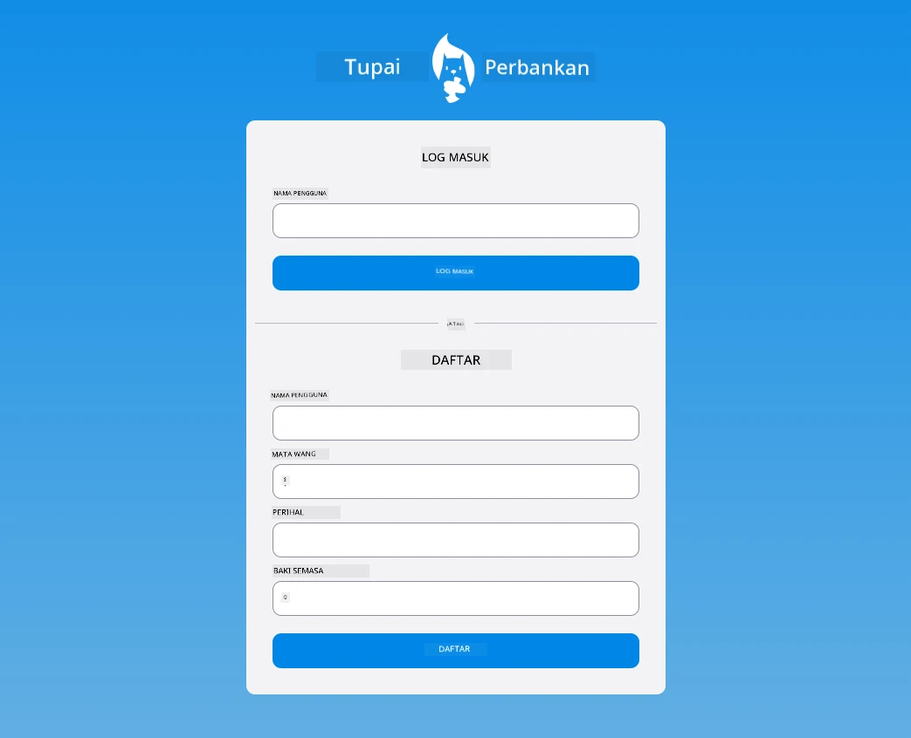

## Kuiz Selepas Kuliah

[Kuiz selepas kuliah](https://ff-quizzes.netlify.app/web/quiz/44)

## Ulasan & Kajian Kendiri

Pembangun telah menjadi sangat kreatif dalam usaha membina borang mereka, terutamanya berkaitan strategi pengesahan. Ketahui tentang aliran borang yang berbeza dengan melihat melalui [CodePen](https://codepen.com); bolehkah anda menemui beberapa borang yang menarik dan memberi inspirasi?

## Tugasan

[Gaya aplikasi bank anda](assignment.md)

---

**Penafian**:  
Dokumen ini telah diterjemahkan menggunakan perkhidmatan terjemahan AI [Co-op Translator](https://github.com/Azure/co-op-translator). Walaupun kami berusaha untuk ketepatan, sila ambil perhatian bahawa terjemahan automatik mungkin mengandungi kesilapan atau ketidaktepatan. Dokumen asal dalam bahasa asalnya harus dianggap sebagai sumber yang berwibawa. Untuk maklumat kritikal, terjemahan manusia profesional adalah disyorkan. Kami tidak bertanggungjawab atas sebarang salah faham atau salah tafsir yang timbul daripada penggunaan terjemahan ini.