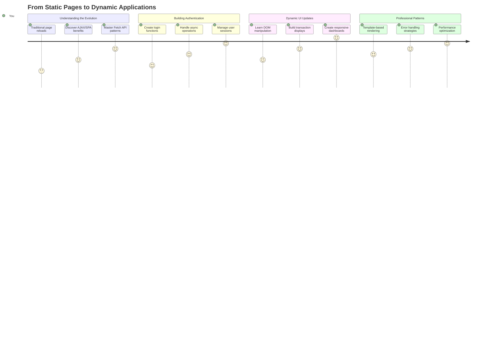
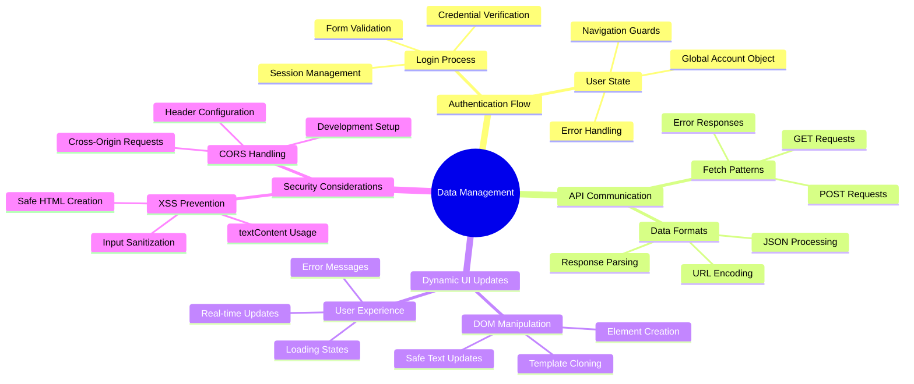
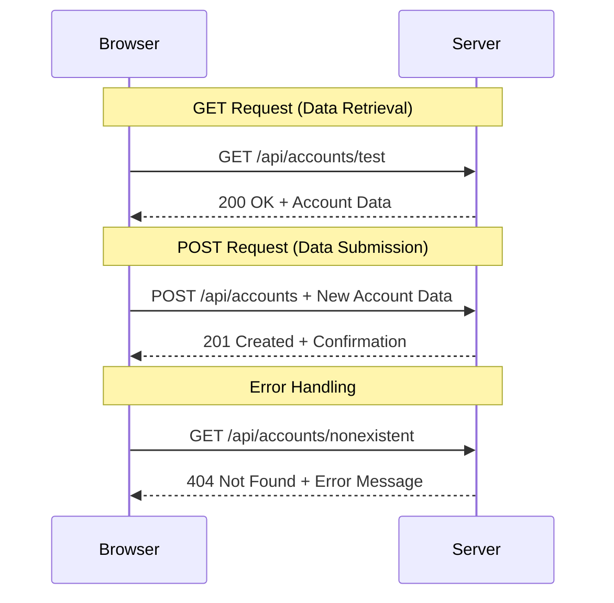
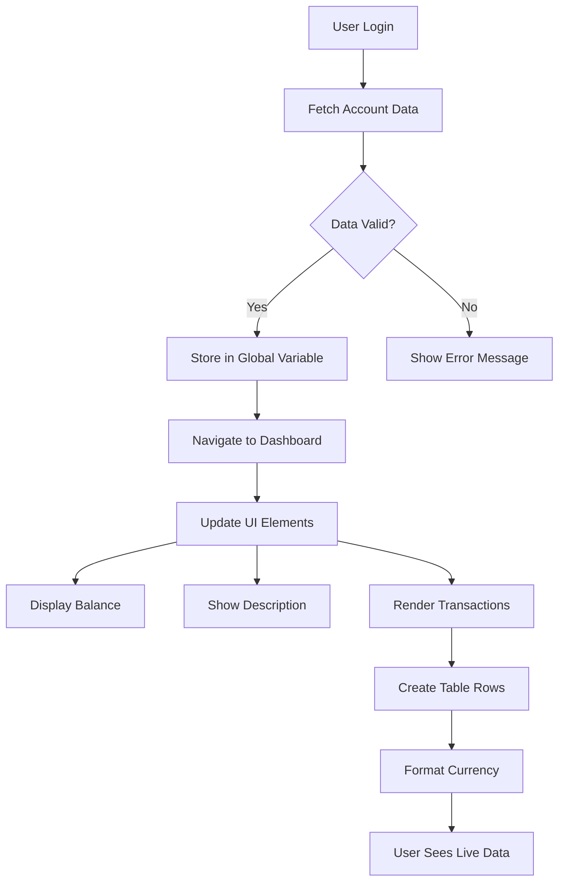
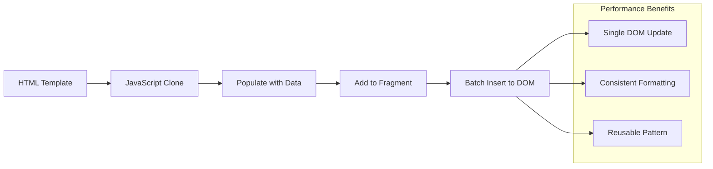
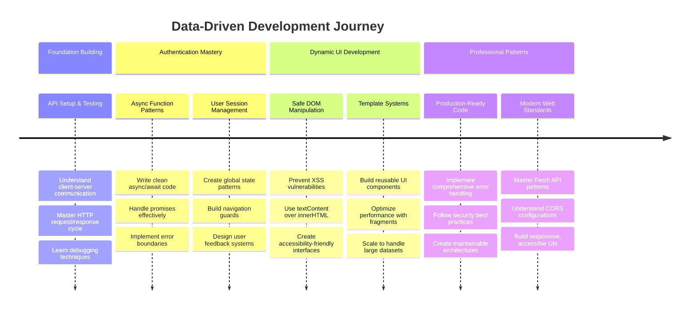

<!--
CO_OP_TRANSLATOR_METADATA:
{
  "original_hash": "86ee5069f27ea3151389d8687c95fac9",
  "translation_date": "2025-11-06T12:14:12+00:00",
  "source_file": "7-bank-project/3-data/README.md",
  "language_code": "ms"
}
-->
# Membina Aplikasi Perbankan Bahagian 3: Kaedah Mendapatkan dan Menggunakan Data

Fikirkan tentang komputer Enterprise dalam Star Trek - apabila Kapten Picard meminta status kapal, maklumat muncul serta-merta tanpa keseluruhan antara muka terhenti dan dibina semula. Aliran maklumat yang lancar itulah yang kita bina di sini dengan pengambilan data secara dinamik.

Sekarang, aplikasi perbankan anda seperti surat khabar bercetak - informatif tetapi statik. Kita akan mengubahnya menjadi sesuatu seperti pusat kawalan misi di NASA, di mana data mengalir secara berterusan dan dikemas kini secara masa nyata tanpa mengganggu aliran kerja pengguna.

Anda akan belajar bagaimana berkomunikasi dengan pelayan secara asinkron, mengendalikan data yang tiba pada masa yang berbeza, dan mengubah maklumat mentah menjadi sesuatu yang bermakna untuk pengguna anda. Inilah perbezaan antara demo dan perisian yang sedia untuk produksi.

## ⚡ Apa Yang Boleh Anda Lakukan Dalam 5 Minit Seterusnya

**Laluan Permulaan Pantas untuk Pembangun Sibuk**

```mermaid
flowchart LR
    A[⚡ 5 minutes] --> B[Set up API server]
    B --> C[Test fetch with curl]
    C --> D[Create login function]
    D --> E[See data in action]
```



- **Minit 1-2**: Mulakan pelayan API anda (`cd api && npm start`) dan uji sambungan
- **Minit 3**: Cipta fungsi asas `getAccount()` menggunakan fetch
- **Minit 4**: Sambungkan borang log masuk dengan `action="javascript:login()"`
- **Minit 5**: Uji log masuk dan lihat data akaun muncul di konsol

**Perintah Ujian Pantas**:
```bash
# Verify API is running
curl http://localhost:5000/api

# Test account data fetch
curl http://localhost:5000/api/accounts/test
```

**Kenapa Ini Penting**: Dalam 5 minit, anda akan melihat keajaiban pengambilan data secara asinkron yang menggerakkan setiap aplikasi web moden. Ini adalah asas yang membuatkan aplikasi terasa responsif dan hidup.

## 🗺️ Perjalanan Pembelajaran Anda Melalui Aplikasi Web Berasaskan Data



**Destinasi Perjalanan Anda**: Menjelang akhir pelajaran ini, anda akan memahami bagaimana aplikasi web moden mendapatkan, memproses, dan memaparkan data secara dinamik, mencipta pengalaman pengguna yang lancar seperti yang kita harapkan daripada aplikasi profesional.

## Kuiz Pra-Kuliah

[Kuiz pra-kuliah](https://ff-quizzes.netlify.app/web/quiz/45)

### Prasyarat

Sebelum mendalami pengambilan data, pastikan anda mempunyai komponen berikut:

- **Pelajaran Sebelumnya**: Lengkapkan [Borang Log Masuk dan Pendaftaran](../2-forms/README.md) - kita akan membina berdasarkan asas ini
- **Pelayan Tempatan**: Pasang [Node.js](https://nodejs.org) dan [jalankan pelayan API](../api/README.md) untuk menyediakan data akaun
- **Sambungan API**: Uji sambungan pelayan anda dengan perintah ini:

```bash
curl http://localhost:5000/api
# Expected response: "Bank API v1.0.0"
```

Ujian pantas ini memastikan semua komponen berkomunikasi dengan betul:
- Mengesahkan bahawa Node.js berjalan dengan betul pada sistem anda
- Mengesahkan pelayan API anda aktif dan memberi respons
- Memastikan aplikasi anda boleh mencapai pelayan (seperti memeriksa hubungan radio sebelum misi)

## 🧠 Gambaran Keseluruhan Ekosistem Pengurusan Data



**Prinsip Teras**: Aplikasi web moden adalah sistem orkestrasi data - mereka menyelaraskan antara antara muka pengguna, API pelayan, dan model keselamatan pelayar untuk mencipta pengalaman yang lancar dan responsif.

---

## Memahami Pengambilan Data dalam Aplikasi Web Moden

Cara aplikasi web mengendalikan data telah berkembang dengan ketara dalam dua dekad yang lalu. Memahami evolusi ini akan membantu anda menghargai mengapa teknik moden seperti AJAX dan Fetch API sangat berkuasa dan mengapa ia menjadi alat penting untuk pembangun web.

Mari kita terokai bagaimana laman web tradisional berfungsi berbanding aplikasi dinamik dan responsif yang kita bina hari ini.

### Aplikasi Berbilang Halaman Tradisional (MPA)

Pada zaman awal web, setiap klik adalah seperti menukar saluran pada televisyen lama - skrin akan menjadi kosong, kemudian perlahan-lahan menyesuaikan kepada kandungan baru. Inilah realiti aplikasi web awal, di mana setiap interaksi bermaksud membina semula keseluruhan halaman dari awal.


**Kenapa pendekatan ini terasa tidak lancar:**
- Setiap klik bermaksud membina semula keseluruhan halaman dari awal
- Pengguna terganggu di tengah-tengah pemikiran oleh kilatan halaman yang menjengkelkan
- Sambungan internet anda bekerja keras memuat turun header dan footer yang sama berulang kali
- Aplikasi terasa lebih seperti mengklik melalui kabinet fail daripada menggunakan perisian

### Aplikasi Halaman Tunggal Moden (SPA)

AJAX (Asynchronous JavaScript and XML) mengubah paradigma ini sepenuhnya. Seperti reka bentuk modular Stesen Angkasa Antarabangsa, di mana angkasawan boleh menggantikan komponen individu tanpa membina semula keseluruhan struktur, AJAX membolehkan kita mengemas kini bahagian tertentu halaman web tanpa memuat semula semuanya. Walaupun nama menyebut XML, kita kebanyakannya menggunakan JSON hari ini, tetapi prinsip teras tetap sama: kemas kini hanya apa yang perlu diubah.


**Kenapa SPA terasa lebih baik:**
- Hanya bahagian yang benar-benar berubah dikemas kini (bijak, bukan?)
- Tiada lagi gangguan yang mengejutkan - pengguna anda kekal dalam aliran mereka
- Data yang kurang bergerak melalui wayar bermaksud pemuatan lebih pantas
- Segalanya terasa pantas dan responsif, seperti aplikasi di telefon anda

### Evolusi kepada Fetch API Moden

Pelayar moden menyediakan [`Fetch` API](https://developer.mozilla.org/docs/Web/API/Fetch_API), yang menggantikan [`XMLHttpRequest`](https://developer.mozilla.org/docs/Web/API/XMLHttpRequest/Using_XMLHttpRequest) yang lebih lama. Seperti perbezaan antara mengendalikan telegraf dan menggunakan e-mel, Fetch API menggunakan janji untuk kod asinkron yang lebih bersih dan mengendalikan JSON secara semula jadi.

| Ciri | XMLHttpRequest | Fetch API |
|------|----------------|-----------|
| **Sintaks** | Berasaskan panggilan balik yang kompleks | Berasaskan janji yang bersih |
| **Pengendalian JSON** | Perlu parsing manual | Kaedah `.json()` terbina dalam |
| **Pengendalian Ralat** | Maklumat ralat terhad | Maklumat ralat yang komprehensif |
| **Sokongan Moden** | Keserasian warisan | Janji ES6+ dan async/await |

> 💡 **Keserasian Pelayar**: Berita baik - Fetch API berfungsi di semua pelayar moden! Jika anda ingin tahu tentang versi tertentu, [caniuse.com](https://caniuse.com/fetch) mempunyai cerita keserasian lengkap.
> 
**Kesimpulan:**
- Berfungsi dengan baik di Chrome, Firefox, Safari, dan Edge (pada dasarnya di mana-mana pengguna anda berada)
- Hanya Internet Explorer memerlukan bantuan tambahan (dan sejujurnya, sudah tiba masanya untuk melepaskan IE)
- Menyediakan anda dengan sempurna untuk corak async/await yang elegan yang akan kita gunakan kemudian

### Melaksanakan Log Masuk Pengguna dan Pengambilan Data

Sekarang mari kita laksanakan sistem log masuk yang mengubah aplikasi perbankan anda daripada paparan statik kepada aplikasi yang berfungsi. Seperti protokol pengesahan yang digunakan di kemudahan tentera yang selamat, kita akan mengesahkan kelayakan pengguna dan kemudian memberikan akses kepada data khusus mereka.

Kita akan membina ini secara berperingkat, bermula dengan pengesahan asas dan kemudian menambah keupayaan pengambilan data.

#### Langkah 1: Cipta Asas Fungsi Log Masuk

Buka fail `app.js` anda dan tambahkan fungsi `login` baru. Ini akan mengendalikan proses pengesahan pengguna:

```javascript
async function login() {
  const loginForm = document.getElementById('loginForm');
  const user = loginForm.user.value;
}
```

**Mari kita pecahkan ini:**
- Kata kunci `async`? Ia memberitahu JavaScript "hei, fungsi ini mungkin perlu menunggu sesuatu"
- Kita mengambil borang kita dari halaman (tidak ada yang mewah, hanya mencarinya dengan ID)
- Kemudian kita mengambil apa sahaja yang pengguna taip sebagai nama pengguna mereka
- Ini adalah trik yang bagus: anda boleh mengakses mana-mana input borang dengan atribut `name` - tidak perlu panggilan getElementById tambahan!

> 💡 **Corak Akses Borang**: Setiap kawalan borang boleh diakses dengan namanya (ditetapkan dalam HTML menggunakan atribut `name`) sebagai sifat elemen borang. Ini menyediakan cara yang bersih dan mudah dibaca untuk mendapatkan data borang.

#### Langkah 2: Cipta Fungsi Pengambilan Data Akaun

Seterusnya, kita akan mencipta fungsi khusus untuk mendapatkan data akaun dari pelayan. Ini mengikuti corak yang sama seperti fungsi pendaftaran anda tetapi memberi tumpuan kepada pengambilan data:

```javascript
async function getAccount(user) {
  try {
    const response = await fetch('//localhost:5000/api/accounts/' + encodeURIComponent(user));
    return await response.json();
  } catch (error) {
    return { error: error.message || 'Unknown error' };
  }
}
```

**Apa yang dicapai oleh kod ini:**
- **Menggunakan** Fetch API moden untuk meminta data secara asinkron
- **Membina** URL permintaan GET dengan parameter nama pengguna
- **Menggunakan** `encodeURIComponent()` untuk mengendalikan watak khas dalam URL dengan selamat
- **Menukar** respons kepada format JSON untuk manipulasi data yang mudah
- **Mengendalikan** ralat dengan baik dengan mengembalikan objek ralat dan bukannya terhenti

> ⚠️ **Nota Keselamatan**: Fungsi `encodeURIComponent()` mengendalikan watak khas dalam URL. Seperti sistem pengekodan yang digunakan dalam komunikasi tentera laut, ia memastikan mesej anda tiba dengan tepat seperti yang dimaksudkan, mencegah watak seperti "#" atau "&" daripada disalah tafsir.
> 
**Kenapa ini penting:**
- Mencegah watak khas daripada merosakkan URL
- Melindungi daripada serangan manipulasi URL
- Memastikan pelayan anda menerima data yang dimaksudkan
- Mengikuti amalan pengekodan yang selamat

#### Memahami Permintaan HTTP GET

Berikut adalah sesuatu yang mungkin mengejutkan anda: apabila anda menggunakan `fetch` tanpa pilihan tambahan, ia secara automatik mencipta permintaan [`GET`](https://developer.mozilla.org/docs/Web/HTTP/Methods/GET). Ini sempurna untuk apa yang kita lakukan - meminta pelayan "hei, bolehkah saya lihat data akaun pengguna ini?"

Fikirkan permintaan GET seperti meminta untuk meminjam buku dari perpustakaan - anda meminta untuk melihat sesuatu yang sudah ada. Permintaan POST (yang kita gunakan untuk pendaftaran) lebih seperti menyerahkan buku baru untuk ditambahkan ke koleksi.

| Permintaan GET | Permintaan POST |
|----------------|-----------------|
| **Tujuan** | Mendapatkan data sedia ada | Menghantar data baru ke pelayan |
| **Parameter** | Dalam laluan URL/string pertanyaan | Dalam badan permintaan |
| **Caching** | Boleh disimpan oleh pelayar | Tidak biasanya disimpan |
| **Keselamatan** | Terlihat dalam URL/log | Tersembunyi dalam badan permintaan |



#### Langkah 3: Menggabungkan Segalanya

Sekarang untuk bahagian yang memuaskan - mari kita sambungkan fungsi pengambilan akaun anda kepada proses log masuk. Di sinilah semuanya klik bersama:

```javascript
async function login() {
  const loginForm = document.getElementById('loginForm');
  const user = loginForm.user.value;
  const data = await getAccount(user);

  if (data.error) {
    return console.log('loginError', data.error);
  }

  account = data;
  navigate('/dashboard');
}
```

Fungsi ini mengikuti urutan yang jelas:
- Ekstrak nama pengguna dari input borang
- Meminta data akaun pengguna dari pelayan
- Mengendalikan sebarang ralat yang berlaku semasa proses
- Menyimpan data akaun dan menavigasi ke papan pemuka apabila berjaya

> 🎯 **Corak Async/Await**: Oleh kerana `getAccount` adalah fungsi asinkron, kita menggunakan kata kunci `await` untuk menghentikan pelaksanaan sehingga pelayan memberi respons. Ini menghalang kod daripada terus dengan data yang tidak ditentukan.

#### Langkah 4: Mencipta Tempat untuk Data Anda

Aplikasi anda memerlukan tempat untuk mengingati maklumat akaun setelah ia dimuatkan. Fikirkan ini seperti memori jangka pendek aplikasi anda - tempat untuk menyimpan data pengguna semasa. Tambahkan baris ini di bahagian atas fail `app.js` anda:

```javascript
// This holds the current user's account data
let account = null;
```

**Kenapa kita perlukan ini:**
- Menyimpan data akaun boleh diakses dari mana-mana dalam aplikasi anda
- Bermula dengan `null` bermaksud "belum ada yang log masuk"
- Dikemas kini apabila seseorang berjaya log masuk atau mendaftar
- Bertindak seperti sumber kebenaran tunggal - tiada kekeliruan tentang siapa yang log masuk

#### Langkah 5: Sambungkan Borang Anda

Sekarang mari kita sambungkan fungsi log masuk baru anda kepada borang HTML anda. Kemas kini tag borang anda seperti ini:

```html
<form id="loginForm" action="javascript:login()">
  <!-- Your existing form inputs -->
</form>
```

**Apa yang dilakukan oleh perubahan kecil ini:**
- Menghentikan borang daripada melakukan tingkah laku "muat semula keseluruhan halaman" lalai
- Memanggil fungsi JavaScript tersuai anda sebagai gantinya
- Menjaga segalanya lancar dan seperti aplikasi halaman tunggal
- Memberikan anda kawalan penuh terhadap apa yang berlaku apabila pengguna menekan "Log Masuk"

#### Langkah 6: Tingkatkan Fungsi Pendaftaran Anda

Untuk konsistensi, kemas kini fungsi `register` anda untuk juga menyimpan data akaun dan menavigasi ke papan pemuka:

```javascript
// Add these lines at the end of your register function
account = result;
navigate('/dashboard');
```

**Peningkatan ini menyediakan:**
- **Peralihan lancar** dari pendaftaran ke papan pemuka
- **Pengalaman pengguna yang konsisten** antara aliran log masuk dan pendaftaran
- **Akses segera** kepada data akaun selepas pendaftaran berjaya

#### Menguji Pelaksanaan Anda


**Masa untuk mencubanya:**
1. Cipta akaun baru untuk memastikan semuanya berfungsi
2. Cuba log masuk dengan kelayakan yang sama
3. Lihat konsol pelayar anda (F12) jika ada yang kelihatan tidak betul
4. Pastikan anda mendarat di papan pemuka selepas log masuk berjaya

Jika ada yang tidak berfungsi, jangan panik! Kebanyakan isu adalah pembetulan mudah seperti kesalahan ejaan atau terlupa untuk memulakan pelayan API.

#### Sepatah Kata Tentang Keajaiban Cross-Origin

Anda mungkin tertanya-tanya: "Bagaimana aplikasi web saya bercakap dengan pelayan API ini apabila mereka berjalan pada port yang berbeza?" Soalan yang bagus! Ini menyentuh sesuatu yang setiap pembangun web akan hadapi akhirnya.

> 🔒 **Keselamatan Cross-Origin**: Pelayar menguatkuasakan "dasar asal yang sama" untuk mencegah komunikasi yang tidak sah antara domain yang berbeza. Seperti sistem pemeriksaan di Pentagon, mereka mengesahkan bahawa komunikasi dibenarkan sebelum membenarkan pemindahan data.
> 
**Dalam tetapan kita:**
- Aplikasi web anda berjalan pada `localhost:3000` (pelayan pembangunan)
- Pelayan API anda berjalan pada `localhost:5000` (pelayan backend)
- Pelayan API termasuk [header CORS](https://developer.mozilla.org/docs/Web/HTTP/CORS) yang secara eksplisit membenarkan komunikasi dari aplikasi web anda

Konfigurasi ini mencerminkan pembangunan dunia nyata di mana aplikasi frontend dan backend biasanya berjalan pada pelayan yang berasingan.

> 📚 **Ketahui Lebih Lanjut**: Selami lebih dalam tentang API dan pengambilan data dengan modul [Microsoft Learn tentang API](https://docs.microsoft.com/learn/modules/use-apis-discover-museum-art/?WT.mc_id=academic-77807-sagibbon).

## Menghidupkan Data Anda dalam HTML

Sekarang kita akan membuat data yang diambil dapat dilihat oleh pengguna melalui manipulasi DOM. Seperti proses membangunkan gambar dalam bilik gelap, kita mengambil data yang tidak kelihatan dan menjadikannya sesuatu yang boleh dilihat dan berinteraksi oleh pengguna.
Manipulasi DOM adalah teknik yang mengubah laman web statik menjadi aplikasi dinamik yang mengemas kini kandungan berdasarkan interaksi pengguna dan respons pelayan.

### Memilih Alat yang Tepat untuk Tugas

Apabila anda ingin mengemas kini HTML dengan JavaScript, terdapat beberapa pilihan. Anggaplah ini seperti alat dalam kotak peralatan - setiap satu sesuai untuk tugas tertentu:

| Kaedah | Kegunaan terbaik | Bila untuk digunakan | Tahap keselamatan |
|--------|------------------|----------------------|-------------------|
| `textContent` | Memaparkan data pengguna dengan selamat | Bila-bila masa anda memaparkan teks | ✅ Sangat selamat |
| `createElement()` + `append()` | Membina susun atur kompleks | Membuat bahagian/daftar baru | ✅ Sangat kukuh |
| `innerHTML` | Menetapkan kandungan HTML | ⚠️ Cuba elakkan yang ini | ❌ Berisiko tinggi |

#### Cara Selamat untuk Memaparkan Teks: textContent

Sifat [`textContent`](https://developer.mozilla.org/docs/Web/API/Node/textContent) adalah sahabat terbaik anda apabila memaparkan data pengguna. Ia seperti pengawal keselamatan untuk laman web anda - tiada yang berbahaya dapat masuk:

```javascript
// The safe, reliable way to update text
const balanceElement = document.getElementById('balance');
balanceElement.textContent = account.balance;
```

**Kelebihan textContent:**
- Menganggap semua sebagai teks biasa (menghalang pelaksanaan skrip)
- Secara automatik membersihkan kandungan sedia ada
- Cekap untuk kemas kini teks yang mudah
- Memberikan keselamatan terbina terhadap kandungan berbahaya

#### Membuat Elemen HTML Dinamik

Untuk kandungan yang lebih kompleks, gabungkan [`document.createElement()`](https://developer.mozilla.org/docs/Web/API/Document/createElement) dengan kaedah [`append()`](https://developer.mozilla.org/docs/Web/API/ParentNode/append):

```javascript
// Safe way to create new elements
const transactionItem = document.createElement('div');
transactionItem.className = 'transaction-item';
transactionItem.textContent = `${transaction.date}: ${transaction.description}`;
container.append(transactionItem);
```

**Memahami pendekatan ini:**
- **Mencipta** elemen DOM baru secara programatik
- **Mengawal sepenuhnya** atribut dan kandungan elemen
- **Membolehkan** struktur elemen bersarang yang kompleks
- **Menjaga** keselamatan dengan memisahkan struktur daripada kandungan

> ⚠️ **Pertimbangan Keselamatan**: Walaupun [`innerHTML`](https://developer.mozilla.org/docs/Web/API/Element/innerHTML) sering muncul dalam tutorial, ia boleh melaksanakan skrip yang tertanam. Seperti protokol keselamatan di CERN yang menghalang pelaksanaan kod yang tidak sah, menggunakan `textContent` dan `createElement` menyediakan alternatif yang lebih selamat.
> 
**Risiko innerHTML:**
- Melaksanakan sebarang tag `<script>` dalam data pengguna
- Terdedah kepada serangan suntikan kod
- Mencipta potensi kelemahan keselamatan
- Alternatif yang lebih selamat yang kita gunakan memberikan fungsi yang setara

### Menjadikan Kesalahan Lebih Mesra Pengguna

Pada masa ini, kesalahan log masuk hanya muncul di konsol pelayar, yang tidak kelihatan kepada pengguna. Seperti perbezaan antara diagnostik dalaman juruterbang dan sistem maklumat penumpang, kita perlu menyampaikan maklumat penting melalui saluran yang sesuai.

Melaksanakan mesej kesalahan yang kelihatan memberikan maklum balas segera kepada pengguna tentang apa yang salah dan bagaimana untuk meneruskan.

#### Langkah 1: Tambahkan Tempat untuk Mesej Kesalahan

Pertama, mari kita sediakan tempat untuk mesej kesalahan dalam HTML anda. Tambahkan ini tepat sebelum butang log masuk supaya pengguna akan melihatnya secara semula jadi:

```html
<!-- This is where error messages will appear -->
<div id="loginError" role="alert"></div>
<button>Login</button>
```

**Apa yang berlaku di sini:**
- Kami mencipta bekas kosong yang kekal tidak kelihatan sehingga diperlukan
- Ia diletakkan di tempat yang secara semula jadi dilihat oleh pengguna selepas mengklik "Log Masuk"
- Atribut `role="alert"` adalah sentuhan yang baik untuk pembaca skrin - ia memberitahu teknologi bantuan "hei, ini penting!"
- ID unik memberikan sasaran yang mudah untuk JavaScript kita

#### Langkah 2: Buat Fungsi Pembantu yang Berguna

Mari kita buat fungsi utiliti kecil yang boleh mengemas kini teks mana-mana elemen. Ini adalah salah satu fungsi "tulis sekali, guna di mana-mana" yang akan menjimatkan masa anda:

```javascript
function updateElement(id, text) {
  const element = document.getElementById(id);
  element.textContent = text;
}
```

**Kelebihan fungsi:**
- Antara muka mudah yang hanya memerlukan ID elemen dan kandungan teks
- Menemukan dan mengemas kini elemen DOM dengan selamat
- Corak boleh guna semula yang mengurangkan pengulangan kod
- Menjaga tingkah laku kemas kini yang konsisten di seluruh aplikasi

#### Langkah 3: Paparkan Kesalahan di Tempat yang Dapat Dilihat Pengguna

Sekarang mari kita gantikan mesej konsol tersembunyi itu dengan sesuatu yang benar-benar dapat dilihat oleh pengguna. Kemas kini fungsi log masuk anda:

```javascript
// Instead of just logging to console, show the user what's wrong
if (data.error) {
  return updateElement('loginError', data.error);
}
```

**Perubahan kecil ini memberikan perbezaan besar:**
- Mesej kesalahan muncul tepat di tempat pengguna melihat
- Tiada lagi kegagalan senyap yang misteri
- Pengguna mendapat maklum balas segera dan boleh diambil tindakan
- Aplikasi anda mula terasa profesional dan bijaksana

Sekarang apabila anda menguji dengan akaun yang tidak sah, anda akan melihat mesej kesalahan yang berguna terus di halaman!


#### Langkah 4: Menjadi Inklusif dengan Kebolehaksesan

Inilah sesuatu yang menarik tentang `role="alert"` yang kita tambahkan tadi - ia bukan sekadar hiasan! Atribut kecil ini mencipta apa yang dipanggil [Live Region](https://developer.mozilla.org/docs/Web/Accessibility/ARIA/ARIA_Live_Regions) yang segera mengumumkan perubahan kepada pembaca skrin:

```html
<div id="loginError" role="alert"></div>
```

**Kenapa ini penting:**
- Pengguna pembaca skrin mendengar mesej kesalahan sebaik sahaja ia muncul
- Semua orang mendapat maklumat penting yang sama, tanpa mengira cara mereka menavigasi
- Ia adalah cara mudah untuk membuat aplikasi anda berfungsi untuk lebih ramai orang
- Menunjukkan anda peduli untuk mencipta pengalaman yang inklusif

Sentuhan kecil seperti ini membezakan pembangun yang baik daripada yang hebat!

### 🎯 Pemeriksaan Pedagogi: Corak Pengesahan

**Berhenti dan Renungkan**: Anda baru sahaja melaksanakan aliran pengesahan lengkap. Ini adalah corak asas dalam pembangunan web.

**Penilaian Diri Cepat**:
- Bolehkah anda menerangkan mengapa kita menggunakan async/await untuk panggilan API?
- Apa yang akan berlaku jika kita lupa fungsi `encodeURIComponent()`?
- Bagaimana pengendalian kesalahan kita meningkatkan pengalaman pengguna?

**Hubungan Dunia Nyata**: Corak yang anda pelajari di sini (pengambilan data async, pengendalian kesalahan, maklum balas pengguna) digunakan dalam setiap aplikasi web utama dari platform media sosial hingga laman e-dagang. Anda sedang membina kemahiran tahap produksi!

**Soalan Cabaran**: Bagaimana anda boleh mengubah sistem pengesahan ini untuk mengendalikan pelbagai peranan pengguna (pelanggan, pentadbir, juruwang)? Fikirkan tentang struktur data dan perubahan UI yang diperlukan.

#### Langkah 5: Terapkan Corak yang Sama pada Pendaftaran

Untuk konsistensi, laksanakan pengendalian kesalahan yang sama dalam borang pendaftaran anda:

1. **Tambahkan** elemen paparan kesalahan ke HTML pendaftaran anda:
```html
<div id="registerError" role="alert"></div>
```

2. **Kemas kini** fungsi pendaftaran anda untuk menggunakan corak paparan kesalahan yang sama:
```javascript
if (data.error) {
  return updateElement('registerError', data.error);
}
```

**Kelebihan pengendalian kesalahan yang konsisten:**
- **Memberikan** pengalaman pengguna yang seragam di semua borang
- **Mengurangkan** beban kognitif dengan menggunakan corak yang biasa
- **Mempermudah** penyelenggaraan dengan kod yang boleh guna semula
- **Memastikan** piawaian kebolehaksesan dipenuhi di seluruh aplikasi

## Mencipta Papan Pemuka Dinamik Anda

Sekarang kita akan mengubah papan pemuka statik anda menjadi antara muka dinamik yang memaparkan data akaun sebenar. Seperti perbezaan antara jadual penerbangan bercetak dan papan pemuka pelepasan langsung di lapangan terbang, kita bergerak dari maklumat statik ke paparan responsif masa nyata.

Menggunakan teknik manipulasi DOM yang telah anda pelajari, kita akan mencipta papan pemuka yang mengemas kini secara automatik dengan maklumat akaun semasa.

### Mengenali Data Anda

Sebelum kita mula membina, mari kita lihat jenis data yang dihantar oleh pelayan anda. Apabila seseorang berjaya log masuk, inilah khazanah maklumat yang anda dapat:

```json
{
  "user": "test",
  "currency": "$",
  "description": "Test account",
  "balance": 75,
  "transactions": [
    { "id": "1", "date": "2020-10-01", "object": "Pocket money", "amount": 50 },
    { "id": "2", "date": "2020-10-03", "object": "Book", "amount": -10 },
    { "id": "3", "date": "2020-10-04", "object": "Sandwich", "amount": -5 }
  ]
}
```

**Struktur data ini menyediakan:**
- **`user`**: Sesuai untuk memperibadikan pengalaman ("Selamat kembali, Sarah!")
- **`currency`**: Memastikan kita memaparkan jumlah wang dengan betul
- **`description`**: Nama mesra untuk akaun
- **`balance`**: Baki semasa yang sangat penting
- **`transactions`**: Sejarah transaksi lengkap dengan semua butiran

Segala yang anda perlukan untuk membina papan pemuka perbankan yang kelihatan profesional!



> 💡 **Tip Pro**: Mahu melihat papan pemuka anda berfungsi dengan segera? Gunakan nama pengguna `test` semasa log masuk - ia sudah dimuatkan dengan data contoh supaya anda dapat melihat semuanya berfungsi tanpa perlu mencipta transaksi terlebih dahulu.
> 
**Kenapa akaun ujian berguna:**
- Datang dengan data contoh yang realistik sudah dimuatkan
- Sempurna untuk melihat bagaimana transaksi dipaparkan
- Hebat untuk menguji ciri papan pemuka anda
- Menjimatkan anda daripada perlu mencipta data palsu secara manual

### Mencipta Elemen Paparan Papan Pemuka

Mari kita bina antara muka papan pemuka anda langkah demi langkah, bermula dengan maklumat ringkasan akaun dan kemudian beralih ke ciri yang lebih kompleks seperti senarai transaksi.

#### Langkah 1: Kemas Kini Struktur HTML Anda

Pertama, gantikan bahagian "Balance" statik dengan elemen pemegang tempat dinamik yang boleh diisi oleh JavaScript anda:

```html
<section>
  Balance: <span id="balance"></span><span id="currency"></span>
</section>
```

Seterusnya, tambahkan bahagian untuk penerangan akaun. Oleh kerana ini bertindak sebagai tajuk untuk kandungan papan pemuka, gunakan HTML semantik:

```html
<h2 id="description"></h2>
```

**Memahami struktur HTML:**
- **Menggunakan** elemen `<span>` yang berasingan untuk baki dan mata wang bagi kawalan individu
- **Menerapkan** ID unik pada setiap elemen untuk sasaran JavaScript
- **Mengikuti** HTML semantik dengan menggunakan `<h2>` untuk penerangan akaun
- **Mencipta** hierarki logik untuk pembaca skrin dan SEO

> ✅ **Wawasan Kebolehaksesan**: Penerangan akaun berfungsi sebagai tajuk untuk kandungan papan pemuka, jadi ia ditandai secara semantik sebagai tajuk. Ketahui lebih lanjut tentang bagaimana [struktur tajuk](https://www.nomensa.com/blog/2017/how-structure-headings-web-accessibility) mempengaruhi kebolehaksesan. Bolehkah anda mengenal pasti elemen lain di halaman anda yang mungkin mendapat manfaat daripada tag tajuk?

#### Langkah 2: Cipta Fungsi Kemas Kini Papan Pemuka

Sekarang cipta fungsi yang mengisi papan pemuka anda dengan data akaun sebenar:

```javascript
function updateDashboard() {
  if (!account) {
    return navigate('/login');
  }

  updateElement('description', account.description);
  updateElement('balance', account.balance.toFixed(2));
  updateElement('currency', account.currency);
}
```

**Langkah demi langkah, inilah yang dilakukan oleh fungsi ini:**
- **Mengesahkan** bahawa data akaun wujud sebelum meneruskan
- **Mengalihkan** pengguna yang tidak sah kembali ke halaman log masuk
- **Mengemas kini** penerangan akaun menggunakan fungsi `updateElement` yang boleh guna semula
- **Memformat** baki untuk sentiasa menunjukkan dua tempat perpuluhan
- **Memaparkan** simbol mata wang yang sesuai

> 💰 **Pemformatan Wang**: Kaedah [`toFixed(2)`](https://developer.mozilla.org/docs/Web/JavaScript/Reference/Global_Objects/Number/toFixed) itu sangat berguna! Ia memastikan baki anda sentiasa kelihatan seperti wang sebenar - "75.00" dan bukannya hanya "75". Pengguna anda akan menghargai melihat pemformatan mata wang yang biasa.

#### Langkah 3: Memastikan Papan Pemuka Anda Dikemas Kini

Untuk memastikan papan pemuka anda menyegarkan dengan data semasa setiap kali seseorang melawatnya, kita perlu menghubungkan ke sistem navigasi anda. Jika anda telah menyelesaikan [tugasan pelajaran 1](../1-template-route/assignment.md), ini sepatutnya terasa biasa. Jika tidak, jangan risau - inilah yang anda perlukan:

Tambahkan ini ke akhir fungsi `updateRoute()` anda:

```javascript
if (typeof route.init === 'function') {
  route.init();
}
```

Kemudian kemas kini laluan anda untuk memasukkan inisialisasi papan pemuka:

```javascript
const routes = {
  '/login': { templateId: 'login' },
  '/dashboard': { templateId: 'dashboard', init: updateDashboard }
};
```

**Apa yang dilakukan oleh persediaan bijak ini:**
- Memeriksa sama ada laluan mempunyai kod inisialisasi khas
- Menjalankan kod itu secara automatik apabila laluan dimuatkan
- Memastikan papan pemuka anda sentiasa menunjukkan data semasa dan terkini
- Menjaga logik laluan anda tetap bersih dan teratur

#### Menguji Papan Pemuka Anda

Selepas melaksanakan perubahan ini, uji papan pemuka anda:

1. **Log masuk** dengan akaun ujian
2. **Sahkan** anda dialihkan ke papan pemuka
3. **Periksa** bahawa penerangan akaun, baki, dan mata wang dipaparkan dengan betul
4. **Cuba log keluar dan log masuk semula** untuk memastikan data menyegarkan dengan betul

Papan pemuka anda kini sepatutnya memaparkan maklumat akaun dinamik yang dikemas kini berdasarkan data pengguna yang log masuk!

## Membina Senarai Transaksi Pintar dengan Templat

Daripada mencipta HTML secara manual untuk setiap transaksi, kita akan menggunakan templat untuk menghasilkan pemformatan yang konsisten secara automatik. Seperti komponen standard yang digunakan dalam pembuatan kapal angkasa, templat memastikan setiap baris transaksi mengikuti struktur dan penampilan yang sama.

Teknik ini berskala dengan cekap dari beberapa transaksi hingga ribuan, mengekalkan prestasi dan persembahan yang konsisten.




### Langkah 1: Cipta Templat Transaksi

Pertama, tambahkan templat boleh guna semula untuk baris transaksi dalam HTML `<body>` anda:

```html
<template id="transaction">
  <tr>
    <td></td>
    <td></td>
    <td></td>
  </tr>
</template>
```

**Memahami templat HTML:**
- **Menentukan** struktur untuk satu baris jadual
- **Tetap** tidak kelihatan sehingga diklon dan diisi dengan JavaScript
- **Termasuk** tiga sel untuk tarikh, penerangan, dan jumlah
- **Menyediakan** corak boleh guna semula untuk pemformatan yang konsisten

### Langkah 2: Sediakan Jadual Anda untuk Kandungan Dinamik

Seterusnya, tambahkan `id` pada badan jadual anda supaya JavaScript dapat menyasarkannya dengan mudah:

```html
<tbody id="transactions"></tbody>
```

**Apa yang dicapai:**
- **Mencipta** sasaran yang jelas untuk memasukkan baris transaksi
- **Memisahkan** struktur jadual daripada kandungan dinamik
- **Membolehkan** pembersihan dan pengisian semula data transaksi dengan mudah

### Langkah 3: Bina Fungsi Kilang Baris Transaksi

Sekarang cipta fungsi yang mengubah data transaksi menjadi elemen HTML:

```javascript
function createTransactionRow(transaction) {
  const template = document.getElementById('transaction');
  const transactionRow = template.content.cloneNode(true);
  const tr = transactionRow.querySelector('tr');
  tr.children[0].textContent = transaction.date;
  tr.children[1].textContent = transaction.object;
  tr.children[2].textContent = transaction.amount.toFixed(2);
  return transactionRow;
}
```

**Memecahkan fungsi kilang ini:**
- **Mengambil** elemen templat berdasarkan IDnya
- **Mengklon** kandungan templat untuk manipulasi yang selamat
- **Memilih** baris jadual dalam kandungan yang diklon
- **Mengisi** setiap sel dengan data transaksi
- **Memformat** jumlah untuk menunjukkan tempat perpuluhan yang betul
- **Mengembalikan** baris yang lengkap sedia untuk dimasukkan

### Langkah 4: Hasilkan Baris Transaksi Berganda dengan Cekap

Tambahkan kod ini ke fungsi `updateDashboard()` anda untuk memaparkan semua transaksi:

```javascript
const transactionsRows = document.createDocumentFragment();
for (const transaction of account.transactions) {
  const transactionRow = createTransactionRow(transaction);
  transactionsRows.appendChild(transactionRow);
}
updateElement('transactions', transactionsRows);
```

**Memahami pendekatan cekap ini:**
- **Mencipta** fragmen dokumen untuk operasi DOM secara berkumpulan
- **Mengulangi** semua transaksi dalam data akaun
- **Menghasilkan** baris untuk setiap transaksi menggunakan fungsi kilang
- **Mengumpulkan** semua baris dalam fragmen sebelum menambah ke DOM
- **Melakukan** satu kemas kini DOM dan bukannya banyak penyisipan individu
> ⚡ **Pengoptimuman Prestasi**: [`document.createDocumentFragment()`](https://developer.mozilla.org/docs/Web/API/Document/createDocumentFragment) berfungsi seperti proses pemasangan di Boeing - komponen disediakan di luar barisan utama, kemudian dipasang sebagai unit lengkap. Pendekatan pengelompokan ini meminimumkan reflow DOM dengan melakukan satu penyisipan berbanding operasi individu yang banyak.

### Langkah 5: Tingkatkan Fungsi Kemas Kini untuk Kandungan Campuran

Fungsi `updateElement()` anda kini hanya mengendalikan kandungan teks. Kemas kini ia supaya berfungsi dengan kedua-dua kandungan teks dan nod DOM:

```javascript
function updateElement(id, textOrNode) {
  const element = document.getElementById(id);
  element.textContent = ''; // Removes all children
  element.append(textOrNode);
}
```

**Penambahbaikan utama dalam kemas kini ini:**
- **Mengosongkan** kandungan sedia ada sebelum menambah kandungan baru
- **Menerima** sama ada teks string atau nod DOM sebagai parameter
- **Menggunakan** kaedah [`append()`](https://developer.mozilla.org/docs/Web/API/ParentNode/append) untuk fleksibiliti
- **Menjaga** keserasian ke belakang dengan penggunaan berasaskan teks sedia ada

### Mencuba Papan Pemuka Anda

Saat kebenaran telah tiba! Mari lihat papan pemuka dinamik anda beraksi:

1. Log masuk menggunakan akaun `test` (ia mempunyai data sampel yang sedia digunakan)
2. Pergi ke papan pemuka anda
3. Periksa bahawa baris transaksi muncul dengan format yang betul
4. Pastikan tarikh, deskripsi, dan jumlah kelihatan baik

Jika semuanya berfungsi, anda sepatutnya melihat senarai transaksi yang berfungsi sepenuhnya di papan pemuka anda! 🎉

**Apa yang telah anda capai:**
- Membina papan pemuka yang boleh berkembang dengan sebarang jumlah data
- Mencipta templat yang boleh digunakan semula untuk format yang konsisten
- Melaksanakan teknik manipulasi DOM yang cekap
- Membangunkan fungsi yang setanding dengan aplikasi perbankan pengeluaran

Anda telah berjaya mengubah laman web statik menjadi aplikasi web dinamik.

### 🎯 Pemeriksaan Pedagogi: Penjanaan Kandungan Dinamik

**Pemahaman Seni Bina**: Anda telah melaksanakan saluran data-ke-UI yang canggih yang mencerminkan corak yang digunakan dalam rangka kerja seperti React, Vue, dan Angular.

**Konsep Utama yang Dikuasai**:
- **Rendering berasaskan templat**: Mencipta komponen UI yang boleh digunakan semula
- **Dokumen fragmen**: Mengoptimumkan prestasi DOM
- **Manipulasi DOM yang selamat**: Mencegah kerentanan keselamatan
- **Transformasi data**: Menukar data pelayan kepada antara muka pengguna

**Hubungan Industri**: Teknik-teknik ini membentuk asas rangka kerja frontend moden. Virtual DOM React, sistem templat Vue, dan seni bina komponen Angular semuanya dibina berdasarkan konsep-konsep teras ini.

**Soalan Refleksi**: Bagaimana anda akan memperluaskan sistem ini untuk mengendalikan kemas kini masa nyata (seperti transaksi baru muncul secara automatik)? Pertimbangkan WebSockets atau Server-Sent Events.

---

## 📈 Garis Masa Penguasaan Pengurusan Data Anda



**🎓 Pencapaian Tamat Pengajian**: Anda telah berjaya membina aplikasi web lengkap yang didorong oleh data menggunakan corak JavaScript moden. Kemahiran ini secara langsung diterjemahkan kepada bekerja dengan rangka kerja seperti React, Vue, atau Angular.

**🔄 Keupayaan Tahap Seterusnya**:
- Bersedia untuk meneroka rangka kerja frontend yang dibina berdasarkan konsep-konsep ini
- Bersedia untuk melaksanakan ciri masa nyata dengan WebSockets
- Dilengkapi untuk membina Aplikasi Web Progresif dengan keupayaan luar talian
- Asas telah disediakan untuk mempelajari corak pengurusan keadaan yang maju

## Cabaran Ejen GitHub Copilot 🚀

Gunakan mod Ejen untuk menyelesaikan cabaran berikut:

**Deskripsi:** Tingkatkan aplikasi perbankan dengan melaksanakan ciri carian dan penapis transaksi yang membolehkan pengguna mencari transaksi tertentu berdasarkan julat tarikh, jumlah, atau kata kunci deskripsi.

**Arahan:** Cipta fungsi carian untuk aplikasi perbankan yang termasuk: 1) Borang carian dengan medan input untuk julat tarikh (dari/hingga), jumlah minimum/maksimum, dan kata kunci deskripsi transaksi, 2) Fungsi `filterTransactions()` yang menapis array account.transactions berdasarkan kriteria carian, 3) Kemas kini fungsi `updateDashboard()` untuk menunjukkan hasil yang ditapis, dan 4) Tambahkan butang "Clear Filters" untuk menetapkan semula paparan. Gunakan kaedah array JavaScript moden seperti `filter()` dan tangani kes tepi untuk kriteria carian kosong.

Ketahui lebih lanjut tentang [mod ejen](https://code.visualstudio.com/blogs/2025/02/24/introducing-copilot-agent-mode) di sini.

## 🚀 Cabaran

Bersedia untuk membawa aplikasi perbankan anda ke tahap seterusnya? Mari jadikan ia kelihatan dan terasa seperti sesuatu yang benar-benar ingin anda gunakan. Berikut adalah beberapa idea untuk mencetuskan kreativiti anda:

**Jadikan ia cantik**: Tambahkan gaya CSS untuk mengubah papan pemuka berfungsi anda menjadi sesuatu yang menarik secara visual. Fikirkan garis bersih, jarak yang baik, dan mungkin beberapa animasi halus.

**Jadikan ia responsif**: Cuba gunakan [media queries](https://developer.mozilla.org/docs/Web/CSS/Media_Queries) untuk mencipta [reka bentuk responsif](https://developer.mozilla.org/docs/Web/Progressive_web_apps/Responsive/responsive_design_building_blocks) yang berfungsi dengan baik di telefon, tablet, dan desktop. Pengguna anda pasti akan berterima kasih!

**Tambahkan sedikit daya tarikan**: Pertimbangkan untuk mewarnakan transaksi (hijau untuk pendapatan, merah untuk perbelanjaan), menambah ikon, atau mencipta kesan hover yang menjadikan antara muka terasa interaktif.

Berikut adalah contoh bagaimana papan pemuka yang digilap boleh kelihatan:


Jangan rasa seperti anda perlu meniru ini sepenuhnya - gunakan ia sebagai inspirasi dan jadikan ia milik anda!

## Kuiz Selepas Kuliah

[Kuiz selepas kuliah](https://ff-quizzes.netlify.app/web/quiz/46)

## Tugasan

[Refactor dan komen kod anda](assignment.md)

---

**Penafian**:  
Dokumen ini telah diterjemahkan menggunakan perkhidmatan terjemahan AI [Co-op Translator](https://github.com/Azure/co-op-translator). Walaupun kami berusaha untuk ketepatan, sila ambil perhatian bahawa terjemahan automatik mungkin mengandungi kesilapan atau ketidaktepatan. Dokumen asal dalam bahasa asalnya harus dianggap sebagai sumber yang berwibawa. Untuk maklumat penting, terjemahan manusia profesional adalah disyorkan. Kami tidak bertanggungjawab atas sebarang salah faham atau salah tafsir yang timbul daripada penggunaan terjemahan ini.