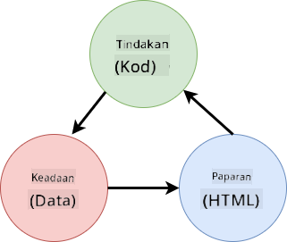
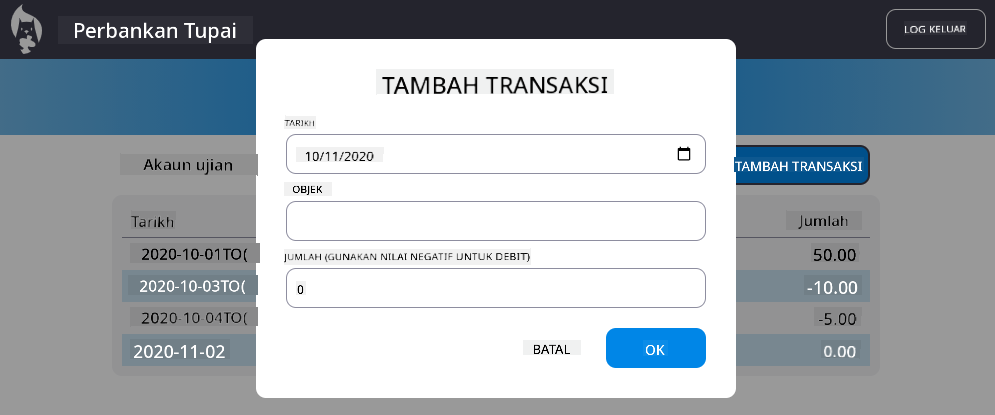

<!--
CO_OP_TRANSLATOR_METADATA:
{
  "original_hash": "32bd800759c3e943c38ad9ae6e1f51e0",
  "translation_date": "2025-10-24T14:33:21+00:00",
  "source_file": "7-bank-project/4-state-management/README.md",
  "language_code": "ms"
}
-->
# Membina Aplikasi Perbankan Bahagian 4: Konsep Pengurusan Keadaan

## Kuiz Pra-Kuliah

[Kuiz pra-kuliah](https://ff-quizzes.netlify.app/web/quiz/47)

## Pengenalan

Pengurusan keadaan adalah seperti sistem navigasi pada kapal angkasa Voyager – apabila semuanya berjalan lancar, anda hampir tidak menyedari kehadirannya. Tetapi apabila berlaku masalah, ia menjadi perbezaan antara mencapai ruang antara bintang dan hanyut tanpa arah di dalam kekosongan kosmik. Dalam pembangunan web, keadaan mewakili segala yang aplikasi anda perlu ingat: status log masuk pengguna, data borang, sejarah navigasi, dan keadaan antara muka sementara.

Apabila aplikasi perbankan anda berkembang daripada borang log masuk yang mudah kepada aplikasi yang lebih canggih, anda mungkin telah menghadapi beberapa cabaran biasa. Muat semula halaman dan pengguna akan terkeluar secara tidak dijangka. Tutup pelayar dan semua kemajuan hilang. Cuba menyelesaikan masalah dan anda terpaksa mencari melalui pelbagai fungsi yang semuanya mengubah data yang sama dengan cara yang berbeza.

Ini bukan tanda pengekodan yang lemah – ia adalah kesakitan semula jadi yang berlaku apabila aplikasi mencapai tahap kerumitan tertentu. Setiap pembangun menghadapi cabaran ini apabila aplikasi mereka beralih daripada "bukti konsep" kepada "sedia untuk pengeluaran."

Dalam pelajaran ini, kita akan melaksanakan sistem pengurusan keadaan berpusat yang mengubah aplikasi perbankan anda menjadi aplikasi profesional yang boleh dipercayai. Anda akan belajar mengurus aliran data dengan cara yang boleh diramal, mengekalkan sesi pengguna dengan betul, dan mencipta pengalaman pengguna yang lancar seperti yang diperlukan oleh aplikasi web moden.

## Prasyarat

Sebelum mendalami konsep pengurusan keadaan, anda perlu memastikan persekitaran pembangunan anda telah disediakan dengan betul dan asas aplikasi perbankan anda telah siap. Pelajaran ini dibina secara langsung berdasarkan konsep dan kod daripada bahagian sebelumnya siri ini.

Pastikan anda mempunyai komponen berikut sebelum meneruskan:

**Persediaan Diperlukan:**
- Lengkapkan [pelajaran pengambilan data](../3-data/README.md) - aplikasi anda sepatutnya berjaya memuatkan dan memaparkan data akaun
- Pasang [Node.js](https://nodejs.org) pada sistem anda untuk menjalankan API backend
- Mulakan [server API](../api/README.md) secara tempatan untuk mengendalikan operasi data akaun

**Uji Persekitaran Anda:**

Sahkan bahawa server API anda berjalan dengan betul dengan melaksanakan arahan ini dalam terminal:

```sh
curl http://localhost:5000/api
# -> should return "Bank API v1.0.0" as a result
```

**Apa yang dilakukan oleh arahan ini:**
- **Menghantar** permintaan GET kepada server API tempatan anda
- **Menguji** sambungan dan mengesahkan server memberikan respons
- **Mengembalikan** maklumat versi API jika semuanya berfungsi dengan betul

---

## Mendiagnosis Masalah Keadaan Semasa

Seperti Sherlock Holmes memeriksa tempat kejadian jenayah, kita perlu memahami dengan tepat apa yang berlaku dalam pelaksanaan semasa kita sebelum kita dapat menyelesaikan misteri kehilangan sesi pengguna.

Mari kita lakukan eksperimen mudah yang mendedahkan cabaran pengurusan keadaan yang mendasari:

**🧪 Cuba Ujian Diagnostik Ini:**
1. Log masuk ke aplikasi perbankan anda dan navigasi ke papan pemuka
2. Muat semula halaman pelayar
3. Perhatikan apa yang berlaku kepada status log masuk anda

Jika anda diarahkan semula ke skrin log masuk, anda telah menemui masalah klasik dalam pengekalan keadaan. Tingkah laku ini berlaku kerana pelaksanaan semasa kita menyimpan data pengguna dalam pembolehubah JavaScript yang diset semula dengan setiap muat semula halaman.

**Masalah Pelaksanaan Semasa:**

Pembolehubah `account` yang mudah daripada [pelajaran sebelumnya](../3-data/README.md) mencipta tiga masalah utama yang menjejaskan pengalaman pengguna dan penyelenggaraan kod:

| Masalah | Punca Teknikal | Kesan kepada Pengguna |
|---------|----------------|-----------------------|
| **Kehilangan Sesi** | Muat semula halaman membersihkan pembolehubah JavaScript | Pengguna perlu kerap log masuk semula |
| **Kemas kini Berselerak** | Pelbagai fungsi mengubah keadaan secara langsung | Menyelesaikan masalah menjadi semakin sukar |
| **Pembersihan Tidak Lengkap** | Log keluar tidak membersihkan semua rujukan keadaan | Kebimbangan keselamatan dan privasi berpotensi |

**Cabaran Arkitek:**

Seperti reka bentuk berkompartmen Titanic yang kelihatan kukuh sehingga beberapa kompartmen banjir serentak, menyelesaikan masalah ini secara individu tidak akan menangani masalah arkitek yang mendasari. Kita memerlukan penyelesaian pengurusan keadaan yang menyeluruh.

> 💡 **Apa sebenarnya yang kita cuba capai di sini?**

[Pengurusan keadaan](https://en.wikipedia.org/wiki/State_management) sebenarnya tentang menyelesaikan dua teka-teki asas:

1. **Di mana data saya?**: Menjejaki maklumat yang kita ada dan dari mana ia datang
2. **Adakah semua orang berada di halaman yang sama?**: Memastikan apa yang pengguna lihat sepadan dengan apa yang sebenarnya berlaku

**Pelan Permainan Kita:**

Daripada mengejar ekor kita sendiri, kita akan mencipta sistem **pengurusan keadaan berpusat**. Anggaplah ia seperti mempunyai seorang yang sangat teratur yang bertanggungjawab terhadap semua perkara penting:



**Memahami aliran data ini:**
- **Memusatkan** semua keadaan aplikasi di satu lokasi
- **Mengalirkan** semua perubahan keadaan melalui fungsi terkawal
- **Memastikan** UI kekal selaras dengan keadaan semasa
- **Menyediakan** corak yang jelas dan boleh diramal untuk pengurusan data

> 💡 **Pandangan Profesional**: Pelajaran ini memberi tumpuan kepada konsep asas. Untuk aplikasi yang kompleks, perpustakaan seperti [Redux](https://redux.js.org) menyediakan ciri pengurusan keadaan yang lebih maju. Memahami prinsip asas ini akan membantu anda menguasai mana-mana perpustakaan pengurusan keadaan.

> ⚠️ **Topik Lanjutan**: Kita tidak akan membincangkan kemas kini UI automatik yang dicetuskan oleh perubahan keadaan, kerana ini melibatkan konsep [Pengaturcaraan Reaktif](https://en.wikipedia.org/wiki/Reactive_programming). Anggaplah ini sebagai langkah seterusnya yang baik untuk perjalanan pembelajaran anda!

### Tugas: Memusatkan Struktur Keadaan

Mari kita mulakan transformasi pengurusan keadaan yang berselerak kepada sistem berpusat. Langkah pertama ini menetapkan asas untuk semua penambahbaikan yang akan datang.

**Langkah 1: Cipta Objek Keadaan Berpusat**

Gantikan deklarasi `account` yang mudah:

```js
let account = null;
```

Dengan objek keadaan yang berstruktur:

```js
let state = {
  account: null
};
```

**Mengapa perubahan ini penting:**
- **Memusatkan** semua data aplikasi di satu lokasi
- **Menyediakan** struktur untuk menambah lebih banyak sifat keadaan kemudian
- **Mencipta** sempadan yang jelas antara keadaan dan pembolehubah lain
- **Menetapkan** corak yang boleh berkembang apabila aplikasi anda berkembang

**Langkah 2: Kemas kini Corak Akses Keadaan**

Kemas kini fungsi anda untuk menggunakan struktur keadaan baharu:

**Dalam fungsi `register()` dan `login()`**, gantikan:
```js
account = ...
```

Dengan:
```js
state.account = ...
```

**Dalam fungsi `updateDashboard()`**, tambahkan baris ini di bahagian atas:
```js
const account = state.account;
```

**Apa yang dicapai oleh kemas kini ini:**
- **Mengekalkan** fungsi sedia ada sambil meningkatkan struktur
- **Menyediakan** kod anda untuk pengurusan keadaan yang lebih canggih
- **Mencipta** corak yang konsisten untuk mengakses data keadaan
- **Menetapkan** asas untuk kemas kini keadaan berpusat

> 💡 **Nota**: Penstrukturan semula ini tidak segera menyelesaikan masalah kita, tetapi ia mencipta asas penting untuk penambahbaikan yang kuat yang akan datang!

## Melaksanakan Kemas Kini Keadaan Terkawal

Dengan keadaan kita yang berpusat, langkah seterusnya melibatkan penubuhan mekanisme terkawal untuk pengubahsuaian data. Pendekatan ini memastikan perubahan keadaan yang boleh diramal dan penyelesaian masalah yang lebih mudah.

Prinsip terasnya menyerupai kawalan trafik udara: daripada membenarkan pelbagai fungsi mengubah keadaan secara bebas, kita akan menyalurkan semua perubahan melalui satu fungsi terkawal. Corak ini menyediakan pengawasan yang jelas tentang bila dan bagaimana data berubah.

**Pengurusan Keadaan Tidak Boleh Ubah:**

Kita akan menganggap objek `state` kita sebagai [*tidak boleh ubah*](https://en.wikipedia.org/wiki/Immutable_object), bermaksud kita tidak pernah mengubahnya secara langsung. Sebaliknya, setiap perubahan mencipta objek keadaan baharu dengan data yang dikemas kini.

Walaupun pendekatan ini pada mulanya kelihatan tidak cekap berbanding pengubahsuaian langsung, ia memberikan kelebihan yang besar untuk penyelesaian masalah, ujian, dan mengekalkan kebolehramalan aplikasi.

**Kelebihan pengurusan keadaan tidak boleh ubah:**

| Kelebihan | Penerangan | Kesan |
|-----------|------------|-------|
| **Kebolehramalan** | Perubahan hanya berlaku melalui fungsi terkawal | Lebih mudah untuk menyelesaikan masalah dan menguji |
| **Penjejakan Sejarah** | Setiap perubahan keadaan mencipta objek baharu | Membolehkan fungsi undo/redo |
| **Pencegahan Kesan Sampingan** | Tiada pengubahsuaian tidak sengaja | Mengelakkan pepijat misteri |
| **Pengoptimuman Prestasi** | Mudah untuk mengesan bila keadaan benar-benar berubah | Membolehkan kemas kini UI yang cekap |

**Ketidakbolehubahan JavaScript dengan `Object.freeze()`:**

JavaScript menyediakan [`Object.freeze()`](https://developer.mozilla.org/docs/Web/JavaScript/Reference/Global_Objects/Object/freeze) untuk menghalang pengubahsuaian objek:

```js
const immutableState = Object.freeze({ account: userData });
// Any attempt to modify immutableState will throw an error
```

**Memecahkan apa yang berlaku di sini:**
- **Menghalang** penugasan atau penghapusan sifat secara langsung
- **Membuang** pengecualian jika percubaan pengubahsuaian dibuat
- **Memastikan** perubahan keadaan mesti melalui fungsi terkawal
- **Mencipta** kontrak yang jelas untuk bagaimana keadaan boleh dikemas kini

> 💡 **Penyelaman Mendalam**: Ketahui perbezaan antara objek tidak boleh ubah *cetek* dan *mendalam* dalam [dokumentasi MDN](https://developer.mozilla.org/docs/Web/JavaScript/Reference/Global_Objects/Object/freeze#What_is_shallow_freeze). Memahami perbezaan ini adalah penting untuk struktur keadaan yang kompleks.

### Tugas

Mari kita cipta fungsi `updateState()` yang baharu:

```js
function updateState(property, newData) {
  state = Object.freeze({
    ...state,
    [property]: newData
  });
}
```

Dalam fungsi ini, kita mencipta objek keadaan baharu dan menyalin data daripada keadaan sebelumnya menggunakan [*operator penyebaran (`...`)*](https://developer.mozilla.org/docs/Web/JavaScript/Reference/Operators/Spread_syntax#Spread_in_object_literals). Kemudian kita menimpa sifat tertentu objek keadaan dengan data baharu menggunakan [notasi kurungan](https://developer.mozilla.org/docs/Web/JavaScript/Guide/Working_with_Objects#Objects_and_properties) `[property]` untuk penugasan. Akhirnya, kita mengunci objek untuk menghalang pengubahsuaian menggunakan `Object.freeze()`. Buat masa ini, kita hanya menyimpan sifat `account` dalam keadaan, tetapi dengan pendekatan ini anda boleh menambah sebanyak mana sifat yang diperlukan dalam keadaan.

Kita juga akan mengemas kini inisialisasi `state` untuk memastikan keadaan awal juga dibekukan:

```js
let state = Object.freeze({
  account: null
});
```

Selepas itu, kemas kini fungsi `register` dengan menggantikan penugasan `state.account = result;` dengan:

```js
updateState('account', result);
```

Lakukan perkara yang sama dengan fungsi `login`, gantikan `state.account = data;` dengan:

```js
updateState('account', data);
```

Kita kini akan mengambil peluang untuk menyelesaikan masalah data akaun yang tidak dibersihkan apabila pengguna mengklik *Logout*.

Cipta fungsi baharu `logout()`:

```js
function logout() {
  updateState('account', null);
  navigate('/login');
}
```

Dalam `updateDashboard()`, gantikan pengalihan `return navigate('/login');` dengan `return logout();`;

Cuba daftar akaun baharu, log keluar dan log masuk semula untuk memastikan semuanya masih berfungsi dengan betul.

> Tip: anda boleh melihat semua perubahan keadaan dengan menambahkan `console.log(state)` di bahagian bawah `updateState()` dan membuka konsol dalam alat pembangunan pelayar anda.

## Melaksanakan Pengekalan Data

Masalah kehilangan sesi yang kita kenal pasti sebelum ini memerlukan penyelesaian pengekalan yang mengekalkan keadaan pengguna merentasi sesi pelayar. Ini mengubah aplikasi kita daripada pengalaman sementara kepada alat profesional yang boleh dipercayai.

Pertimbangkan bagaimana jam atom mengekalkan masa yang tepat walaupun semasa gangguan kuasa dengan menyimpan keadaan kritikal dalam memori tidak mudah hilang. Begitu juga, aplikasi web memerlukan mekanisme penyimpanan yang berterusan untuk mengekalkan data pengguna penting merentasi sesi pelayar dan muat semula halaman.

**Soalan Strategik untuk Pengekalan Data:**

Sebelum melaksanakan pengekalan, pertimbangkan faktor kritikal ini:

| Soalan | Konteks Aplikasi Perbankan | Kesan Keputusan |
|--------|-----------------------------|-----------------|
| **Adakah data sensitif?** | Baki akaun, sejarah transaksi | Pilih kaedah penyimpanan yang selamat |
| **Berapa lama ia perlu bertahan?** | Status log masuk vs. keutamaan UI sementara | Pilih tempoh penyimpanan yang sesuai |
| **Adakah server memerlukannya?** | Token pengesahan vs. tetapan UI | Tentukan keperluan perkongsian |

**Pilihan Penyimpanan Pelayar:**

Pelayar moden menyediakan beberapa mekanisme penyimpanan, masing-masing direka untuk kegunaan yang berbeza:

**API Penyimpanan Utama:**

1. **[`localStorage`](https://developer.mozilla.org/docs/Web/API/Window/localStorage)**: Penyimpanan [Key/Value](https://en.wikipedia.org/wiki/Key%E2%80%93value_database) yang berterusan
   - **Mengekalkan** data merentasi sesi pelayar tanpa had  
   - **Bertahan** semula pelayar dan reboot komputer
   - **Dihadkan** kepada domain laman web tertentu
   - **Sempurna** untuk keutamaan pengguna dan status log masuk

2. **[`sessionStorage`](https://developer.mozilla.org/docs/Web/API/Window/sessionStorage)**: Penyimpanan sesi sementara
   - **Berfungsi** sama seperti localStorage semasa sesi aktif
   - **Dibersihkan** secara automatik apabila tab pelayar ditutup
   - **Ideal** untuk data sementara yang tidak perlu bertahan

3. **[HTTP Cookies](https://developer.mozilla.org/docs/Web/HTTP/Cookies)**: Penyimpanan yang dikongsi dengan server
   - **Dihantar** secara automatik dengan setiap permintaan server
   - **Sempurna** untuk [token pengesahan](https://en.wikipedia.org/wiki/Authentication)
   - **Terhad** dalam saiz dan boleh menjejaskan prestasi

**Keperluan Penyusunan Data:**

Kedua-dua `localStorage` dan `sessionStorage` hanya menyimpan [string](https://developer.mozilla.org/docs/Web/JavaScript/Reference/Global_Objects/String):

```js
// Convert objects to JSON strings for storage
const accountData = { user: 'john', balance: 150 };
localStorage.setItem('account', JSON.stringify(accountData));

// Parse JSON strings back to objects when retrieving
const savedAccount = JSON.parse(localStorage.getItem('account'));
```

**Memahami penyusunan:**
- **Menukar** objek JavaScript kepada string JSON menggunakan [`JSON.stringify()`](https://developer.mozilla.org/docs/Web/JavaScript/Reference/Global_Objects/JSON/stringify)
- **Membina semula** objek daripada JSON menggunakan [`JSON.parse()`](https://developer.mozilla.org/docs/Web/JavaScript/Reference/Global_Objects/JSON/parse)
- **Mengendalikan** objek bersarang kompleks dan array secara automatik
- **Gagal** pada fungsi, nilai undefined, dan rujukan bulat
> 💡 **Pilihan Lanjutan**: Untuk aplikasi luar talian yang kompleks dengan dataset besar, pertimbangkan API [`IndexedDB`](https://developer.mozilla.org/docs/Web/API/IndexedDB_API). Ia menyediakan pangkalan data penuh di sisi klien tetapi memerlukan pelaksanaan yang lebih kompleks.

### Tugas: Laksanakan Penyimpanan localStorage

Mari kita laksanakan penyimpanan berterusan supaya pengguna kekal log masuk sehingga mereka secara eksplisit log keluar. Kita akan menggunakan `localStorage` untuk menyimpan data akaun merentasi sesi pelayar.

**Langkah 1: Tentukan Konfigurasi Penyimpanan**

```js
const storageKey = 'savedAccount';
```

**Apa yang disediakan oleh pemalar ini:**
- **Mencipta** pengenal pasti yang konsisten untuk data yang disimpan
- **Mengelakkan** kesilapan menaip dalam rujukan kunci penyimpanan
- **Memudahkan** perubahan kunci penyimpanan jika diperlukan
- **Mengikuti** amalan terbaik untuk kod yang mudah diselenggara

**Langkah 2: Tambah Penyimpanan Automatik**

Tambahkan baris ini di akhir fungsi `updateState()`:

```js
localStorage.setItem(storageKey, JSON.stringify(state.account));
```

**Penjelasan tentang apa yang berlaku di sini:**
- **Menukar** objek akaun kepada string JSON untuk penyimpanan
- **Menyimpan** data menggunakan kunci penyimpanan yang konsisten
- **Melaksanakan** secara automatik setiap kali perubahan keadaan berlaku
- **Memastikan** data yang disimpan sentiasa diselaraskan dengan keadaan semasa

> 💡 **Manfaat Seni Bina**: Oleh kerana kita telah memusatkan semua kemas kini keadaan melalui `updateState()`, menambah penyimpanan hanya memerlukan satu baris kod. Ini menunjukkan kekuatan keputusan seni bina yang baik!

**Langkah 3: Pulihkan Keadaan Semasa Aplikasi Dimuat**

Cipta fungsi inisialisasi untuk memulihkan data yang disimpan:

```js
function init() {
  const savedAccount = localStorage.getItem(storageKey);
  if (savedAccount) {
    updateState('account', JSON.parse(savedAccount));
  }

  // Our previous initialization code
  window.onpopstate = () => updateRoute();
  updateRoute();
}

init();
```

**Memahami proses inisialisasi:**
- **Mengambil** sebarang data akaun yang disimpan sebelumnya dari localStorage
- **Menganalisis** string JSON kembali kepada objek JavaScript
- **Mengemas kini** keadaan menggunakan fungsi kemas kini yang terkawal
- **Memulihkan** sesi pengguna secara automatik semasa halaman dimuat
- **Melaksanakan** sebelum kemas kini laluan untuk memastikan keadaan tersedia

**Langkah 4: Optimumkan Laluan Lalai**

Kemas kini laluan lalai untuk memanfaatkan penyimpanan:

Dalam `updateRoute()`, gantikan:
```js
// Replace: return navigate('/login');
return navigate('/dashboard');
```

**Mengapa perubahan ini masuk akal:**
- **Memanfaatkan** sistem penyimpanan baru dengan berkesan
- **Membolehkan** papan pemuka mengendalikan pemeriksaan pengesahan
- **Mengalihkan** secara automatik ke log masuk jika tiada sesi yang disimpan
- **Mencipta** pengalaman pengguna yang lebih lancar

**Uji Pelaksanaan Anda:**

1. Log masuk ke aplikasi perbankan anda
2. Muat semula halaman pelayar
3. Sahkan anda kekal log masuk dan berada di papan pemuka
4. Tutup dan buka semula pelayar anda
5. Navigasi kembali ke aplikasi anda dan sahkan anda masih log masuk

🎉 **Pencapaian Tercapai**: Anda telah berjaya melaksanakan pengurusan keadaan berterusan! Aplikasi anda kini berfungsi seperti aplikasi web profesional.

## Mengimbangi Penyimpanan dengan Kesegaran Data

Sistem penyimpanan kita berjaya mengekalkan sesi pengguna, tetapi memperkenalkan cabaran baru: data yang tidak segar. Apabila beberapa pengguna atau aplikasi mengubah data pelayan yang sama, maklumat cache tempatan menjadi usang.

Situasi ini menyerupai pelayar Viking yang bergantung pada carta bintang yang disimpan dan pemerhatian semasa bintang. Carta memberikan konsistensi, tetapi pelayar memerlukan pemerhatian segar untuk mengambil kira keadaan yang berubah. Begitu juga, aplikasi kita memerlukan keadaan pengguna yang berterusan dan data pelayan semasa.

**🧪 Menemui Masalah Kesegaran Data:**

1. Log masuk ke papan pemuka menggunakan akaun `test`
2. Jalankan arahan ini dalam terminal untuk mensimulasikan transaksi dari sumber lain:

```sh
curl --request POST \
     --header "Content-Type: application/json" \
     --data "{ \"date\": \"2020-07-24\", \"object\": \"Bought book\", \"amount\": -20 }" \
     http://localhost:5000/api/accounts/test/transactions
```

3. Muat semula halaman papan pemuka anda dalam pelayar
4. Perhatikan sama ada anda melihat transaksi baru

**Apa yang ditunjukkan oleh ujian ini:**
- **Menunjukkan** bagaimana penyimpanan tempatan boleh menjadi "usang" (tidak terkini)
- **Mensimulasikan** senario dunia nyata di mana perubahan data berlaku di luar aplikasi anda
- **Mendedahkan** ketegangan antara penyimpanan dan kesegaran data

**Cabaran Kesegaran Data:**

| Masalah | Punca | Kesan kepada Pengguna |
|---------|-------|------------------------|
| **Data Usang** | localStorage tidak pernah tamat secara automatik | Pengguna melihat maklumat yang tidak terkini |
| **Perubahan Pelayan** | Aplikasi/pengguna lain mengubah data yang sama | Pandangan tidak konsisten merentasi platform |
| **Cache vs. Realiti** | Cache tempatan tidak sepadan dengan keadaan pelayan | Pengalaman pengguna yang buruk dan kekeliruan |

**Strategi Penyelesaian:**

Kami akan melaksanakan corak "penyegaran semasa dimuat" yang mengimbangi manfaat penyimpanan dengan keperluan untuk data segar. Pendekatan ini mengekalkan pengalaman pengguna yang lancar sambil memastikan ketepatan data.

### Tugas: Laksanakan Sistem Penyegaran Data

Kami akan mencipta sistem yang secara automatik mengambil data segar dari pelayan sambil mengekalkan manfaat pengurusan keadaan berterusan.

**Langkah 1: Cipta Pengemas Kini Data Akaun**

```js
async function updateAccountData() {
  const account = state.account;
  if (!account) {
    return logout();
  }

  const data = await getAccount(account.user);
  if (data.error) {
    return logout();
  }

  updateState('account', data);
}
```

**Memahami logik fungsi ini:**
- **Memeriksa** jika pengguna sedang log masuk (state.account wujud)
- **Mengalihkan** ke log keluar jika tiada sesi yang sah ditemui
- **Mengambil** data akaun segar dari pelayan menggunakan fungsi `getAccount()` yang sedia ada
- **Mengendalikan** ralat pelayan dengan baik dengan log keluar sesi yang tidak sah
- **Mengemas kini** keadaan dengan data segar menggunakan sistem kemas kini terkawal kita
- **Mencetuskan** penyimpanan localStorage automatik melalui fungsi `updateState()`

**Langkah 2: Cipta Pengendali Penyegaran Papan Pemuka**

```js
async function refresh() {
  await updateAccountData();
  updateDashboard();
}
```

**Apa yang dicapai oleh fungsi penyegaran ini:**
- **Menyelaraskan** proses penyegaran data dan kemas kini UI
- **Menunggu** data segar dimuat sebelum mengemas kini paparan
- **Memastikan** papan pemuka menunjukkan maklumat yang paling terkini
- **Menjaga** pemisahan yang jelas antara pengurusan data dan kemas kini UI

**Langkah 3: Integrasi dengan Sistem Laluan**

Kemas kini konfigurasi laluan anda untuk mencetuskan penyegaran secara automatik:

```js
const routes = {
  '/login': { templateId: 'login' },
  '/dashboard': { templateId: 'dashboard', init: refresh }
};
```

**Bagaimana integrasi ini berfungsi:**
- **Melaksanakan** fungsi penyegaran setiap kali laluan papan pemuka dimuat
- **Memastikan** data segar sentiasa dipaparkan apabila pengguna menavigasi ke papan pemuka
- **Menjaga** struktur laluan sedia ada sambil menambah kesegaran data
- **Menyediakan** corak yang konsisten untuk inisialisasi khusus laluan

**Uji Sistem Penyegaran Data Anda:**

1. Log masuk ke aplikasi perbankan anda
2. Jalankan arahan curl dari sebelumnya untuk mencipta transaksi baru
3. Muat semula halaman papan pemuka anda atau navigasi keluar dan kembali
4. Sahkan bahawa transaksi baru muncul dengan segera

🎉 **Keseimbangan Sempurna Tercapai**: Aplikasi anda kini menggabungkan pengalaman lancar penyimpanan berterusan dengan ketepatan data pelayan segar!

## Cabaran Ejen GitHub Copilot 🚀

Gunakan mod Ejen untuk menyelesaikan cabaran berikut:

**Deskripsi:** Laksanakan sistem pengurusan keadaan yang komprehensif dengan fungsi undo/redo untuk aplikasi perbankan. Cabaran ini akan membantu anda mempraktikkan konsep pengurusan keadaan lanjutan termasuk penjejakan sejarah keadaan, kemas kini tidak boleh ubah, dan penyelarasan antara muka pengguna.

**Arahan:** Cipta sistem pengurusan keadaan yang dipertingkatkan yang termasuk: 1) Array sejarah keadaan yang menjejaki semua keadaan sebelumnya, 2) Fungsi undo dan redo yang boleh mengembalikan keadaan sebelumnya, 3) Butang UI untuk operasi undo/redo di papan pemuka, 4) Had sejarah maksimum sebanyak 10 keadaan untuk mengelakkan masalah memori, dan 5) Pembersihan sejarah yang betul apabila pengguna log keluar. Pastikan fungsi undo/redo berfungsi dengan perubahan baki akaun dan berterusan merentasi penyegaran pelayar.

Ketahui lebih lanjut tentang [mod ejen](https://code.visualstudio.com/blogs/2025/02/24/introducing-copilot-agent-mode) di sini.

## 🚀 Cabaran: Pengoptimuman Penyimpanan

Pelaksanaan anda kini mengendalikan sesi pengguna, penyegaran data, dan pengurusan keadaan dengan berkesan. Walau bagaimanapun, pertimbangkan sama ada pendekatan semasa kita mengimbangi kecekapan penyimpanan dengan fungsi secara optimum.

Seperti pemain catur yang membezakan antara kepingan penting dan pion yang boleh dikorbankan, pengurusan keadaan yang berkesan memerlukan mengenal pasti data mana yang mesti disimpan berbanding data yang harus sentiasa segar dari pelayan.

**Analisis Pengoptimuman:**

Nilai pelaksanaan localStorage semasa anda dan pertimbangkan soalan strategik ini:
- Apakah maklumat minimum yang diperlukan untuk mengekalkan pengesahan pengguna?
- Data mana yang cukup kerap berubah sehingga cache tempatan memberikan sedikit manfaat?
- Bagaimana pengoptimuman penyimpanan dapat meningkatkan prestasi tanpa merosakkan pengalaman pengguna?

**Strategi Pelaksanaan:**
- **Kenal pasti** data penting yang mesti disimpan (kemungkinan hanya pengenalan pengguna)
- **Ubah** pelaksanaan localStorage anda untuk menyimpan hanya data sesi kritikal
- **Pastikan** data segar sentiasa dimuat dari pelayan semasa lawatan papan pemuka
- **Uji** bahawa pendekatan yang dioptimumkan anda mengekalkan pengalaman pengguna yang sama

**Pertimbangan Lanjutan:**
- **Bandingkan** pertukaran antara menyimpan data akaun penuh vs. hanya token pengesahan
- **Dokumentasikan** keputusan dan alasan anda untuk ahli pasukan masa depan

Cabaran ini akan membantu anda berfikir seperti pembangun profesional yang mempertimbangkan pengalaman pengguna dan kecekapan aplikasi. Luangkan masa anda untuk bereksperimen dengan pendekatan yang berbeza!

## Kuiz Selepas Kuliah

[Kuiz selepas kuliah](https://ff-quizzes.netlify.app/web/quiz/48)

## Tugasan

[Laksanakan dialog "Tambah transaksi"](assignment.md)

Berikut adalah contoh hasil selepas menyelesaikan tugasan:



---

**Penafian**:  
Dokumen ini telah diterjemahkan menggunakan perkhidmatan terjemahan AI [Co-op Translator](https://github.com/Azure/co-op-translator). Walaupun kami berusaha untuk ketepatan, sila ambil perhatian bahawa terjemahan automatik mungkin mengandungi kesilapan atau ketidaktepatan. Dokumen asal dalam bahasa asalnya harus dianggap sebagai sumber yang berwibawa. Untuk maklumat penting, terjemahan manusia profesional adalah disyorkan. Kami tidak bertanggungjawab atas sebarang salah faham atau salah tafsir yang timbul daripada penggunaan terjemahan ini.