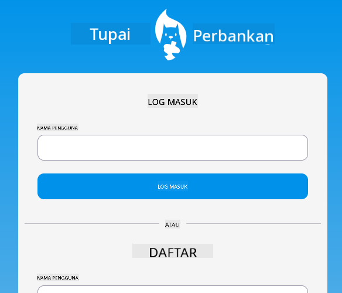
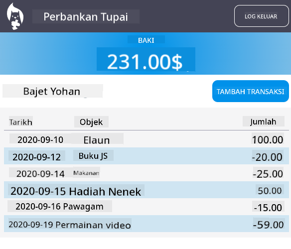

<!--
CO_OP_TRANSLATOR_METADATA:
{
  "original_hash": "830359535306594b448db6575ce5cdee",
  "translation_date": "2025-08-27T22:00:46+00:00",
  "source_file": "7-bank-project/README.md",
  "language_code": "ms"
}
-->
# :dollar: Membina Bank

Dalam projek ini, anda akan belajar cara membina bank fiksyen. Pelajaran ini merangkumi arahan tentang cara menyusun aplikasi web dan menyediakan laluan, membina borang, menguruskan keadaan, dan mendapatkan data daripada API yang membolehkan anda mengambil data bank.

|  |  |
|--------------------------------|--------------------------------|

## Pelajaran

1. [Templat HTML dan Laluan dalam Aplikasi Web](1-template-route/README.md)
2. [Membina Borang Log Masuk dan Pendaftaran](2-forms/README.md)
3. [Kaedah Mendapatkan dan Menggunakan Data](3-data/README.md)
4. [Konsep Pengurusan Keadaan](4-state-management/README.md)

### Kredit

Pelajaran ini ditulis dengan :hearts: oleh [Yohan Lasorsa](https://twitter.com/sinedied).

Jika anda berminat untuk belajar cara membina [API pelayan](/7-bank-project/api/README.md) yang digunakan dalam pelajaran ini, anda boleh mengikuti [siri video ini](https://aka.ms/NodeBeginner) (terutamanya video 17 hingga 21).

Anda juga boleh melihat [tutorial interaktif Learn ini](https://aka.ms/learn/express-api).

---

**Penafian**:  
Dokumen ini telah diterjemahkan menggunakan perkhidmatan terjemahan AI [Co-op Translator](https://github.com/Azure/co-op-translator). Walaupun kami berusaha untuk memastikan ketepatan, sila ambil perhatian bahawa terjemahan automatik mungkin mengandungi kesilapan atau ketidaktepatan. Dokumen asal dalam bahasa asalnya harus dianggap sebagai sumber yang berwibawa. Untuk maklumat yang kritikal, terjemahan manusia profesional adalah disyorkan. Kami tidak bertanggungjawab atas sebarang salah faham atau salah tafsir yang timbul daripada penggunaan terjemahan ini.