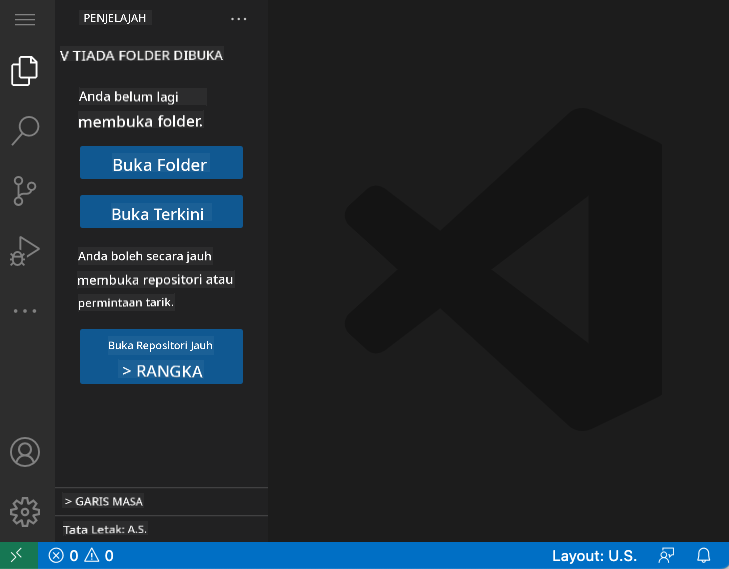
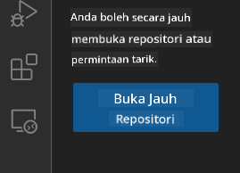
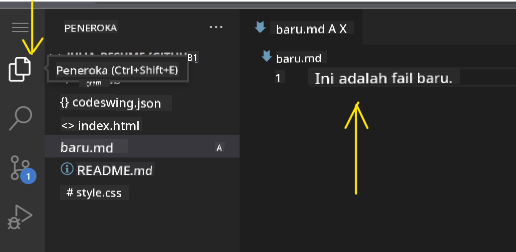
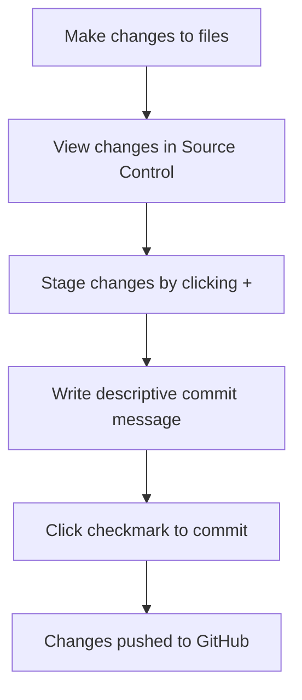
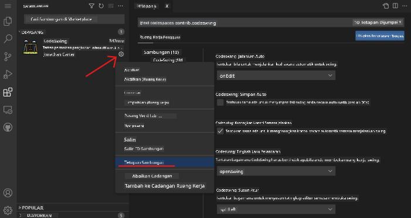

<!--
CO_OP_TRANSLATOR_METADATA:
{
  "original_hash": "cfd4a15974168ca426d50c67682ab9d4",
  "translation_date": "2025-10-24T14:22:47+00:00",
  "source_file": "8-code-editor/1-using-a-code-editor/README.md",
  "language_code": "ms"
}
-->
# Menggunakan Editor Kod: Menguasai VSCode.dev

Ingat dalam *The Matrix* apabila Neo perlu menyambung ke terminal komputer besar untuk mengakses dunia digital? Alat pembangunan web hari ini adalah cerita sebaliknya – keupayaan yang sangat hebat boleh diakses dari mana-mana sahaja. VSCode.dev ialah editor kod berasaskan pelayar yang membawa alat pembangunan profesional ke mana-mana peranti dengan sambungan internet.

Seperti bagaimana mesin cetak menjadikan buku boleh diakses oleh semua orang, bukan hanya penulis di biara, VSCode.dev mendemokrasikan pengekodan. Anda boleh bekerja pada projek dari komputer perpustakaan, makmal sekolah, atau di mana sahaja anda mempunyai akses pelayar. Tiada pemasangan, tiada batasan "Saya perlukan tetapan khusus saya".

Pada akhir pelajaran ini, anda akan memahami cara menavigasi VSCode.dev, membuka repositori GitHub terus dalam pelayar anda, dan menggunakan Git untuk kawalan versi – semua kemahiran yang digunakan oleh pembangun profesional setiap hari.

## Apa yang Anda Akan Pelajari

Selepas kita melalui ini bersama-sama, anda akan dapat:

- Menavigasi VSCode.dev seperti rumah kedua anda – mencari semua yang anda perlukan tanpa tersesat
- Membuka mana-mana repositori GitHub dalam pelayar anda dan mula mengedit dengan segera (yang ini agak ajaib!)
- Menggunakan Git untuk menjejaki perubahan anda dan menyimpan kemajuan anda seperti seorang profesional
- Mempercepatkan editor anda dengan sambungan yang menjadikan pengekodan lebih pantas dan menyeronokkan
- Mencipta dan mengatur fail projek dengan yakin

## Apa yang Anda Perlukan

Keperluannya mudah:

- Akaun [GitHub](https://github.com) percuma (kami akan membimbing anda jika perlu)
- Asas pengetahuan tentang pelayar web
- Pelajaran Asas GitHub menyediakan latar belakang yang berguna, walaupun ia tidak penting

> 💡 **Baru dengan GitHub?** Membuat akaun adalah percuma dan hanya mengambil masa beberapa minit. Seperti bagaimana kad perpustakaan memberi anda akses kepada buku di seluruh dunia, akaun GitHub membuka pintu kepada repositori kod di seluruh internet.

## Kenapa Editor Kod Berasaskan Web Penting

Sebelum internet, saintis di universiti yang berbeza tidak dapat berkongsi penyelidikan dengan mudah. Kemudian datang ARPANET pada tahun 1960-an, menghubungkan komputer merentasi jarak. Editor kod berasaskan web mengikuti prinsip yang sama – menjadikan alat yang hebat boleh diakses tanpa mengira lokasi fizikal atau peranti anda.

Editor kod berfungsi sebagai ruang kerja pembangunan anda, di mana anda menulis, mengedit, dan mengatur fail kod. Tidak seperti editor teks ringkas, editor kod profesional menyediakan penyorotan sintaks, pengesanan ralat, dan ciri pengurusan projek.

VSCode.dev membawa keupayaan ini ke pelayar anda:

**Kelebihan penyuntingan berasaskan web:**

| Ciri | Penerangan | Manfaat Praktikal |
|---------|-------------|----------|
| **Kebebasan Platform** | Berfungsi pada mana-mana peranti dengan pelayar | Bekerja dari komputer yang berbeza dengan lancar |
| **Tiada Pemasangan Diperlukan** | Akses melalui URL web | Mengatasi sekatan pemasangan perisian |
| **Kemas Kini Automatik** | Sentiasa menjalankan versi terkini | Akses ciri baharu tanpa kemas kini manual |
| **Integrasi Repositori** | Sambungan terus ke GitHub | Edit kod tanpa pengurusan fail tempatan |

**Implikasi praktikal:**
- Kesinambungan kerja merentasi persekitaran yang berbeza
- Antara muka yang konsisten tanpa mengira sistem operasi
- Keupayaan kolaborasi segera
- Keperluan storan tempatan yang dikurangkan

## Meneroka VSCode.dev

Seperti bagaimana makmal Marie Curie mengandungi peralatan canggih dalam ruang yang agak ringkas, VSCode.dev memuatkan alat pembangunan profesional ke dalam antara muka pelayar. Aplikasi web ini menyediakan fungsi teras yang sama seperti editor kod desktop.

Mulakan dengan melayari [vscode.dev](https://vscode.dev) dalam pelayar anda. Antara muka dimuatkan tanpa muat turun atau pemasangan sistem – aplikasi langsung berdasarkan prinsip pengkomputeran awan.

### Menyambungkan Akaun GitHub Anda

Seperti bagaimana telefon Alexander Graham Bell menghubungkan lokasi yang jauh, menghubungkan akaun GitHub anda menjembatani VSCode.dev dengan repositori kod anda. Apabila diminta untuk log masuk dengan GitHub, menerima sambungan ini adalah disyorkan.

**Integrasi GitHub menyediakan:**
- Akses langsung ke repositori anda dalam editor
- Tetapan dan sambungan yang diselaraskan merentasi peranti
- Aliran kerja penyimpanan yang dipermudahkan ke GitHub
- Persekitaran pembangunan yang diperibadikan

### Mengenali Ruang Kerja Baru Anda

Sebaik sahaja semuanya dimuatkan, anda akan melihat ruang kerja yang bersih dan cantik yang direka untuk memastikan anda fokus pada perkara yang penting – kod anda!

**Berikut adalah lawatan kawasan anda:**
- **Bar Aktiviti** (jalur di sebelah kiri): Navigasi utama anda dengan Explorer 📁, Carian 🔍, Kawalan Sumber 🌿, Sambungan 🧩, dan Tetapan ⚙️
- **Bar Sisi** (panel di sebelahnya): Berubah untuk menunjukkan maklumat yang relevan berdasarkan apa yang anda pilih
- **Kawasan Editor** (ruang besar di tengah): Di sinilah keajaiban berlaku – kawasan pengekodan utama anda

**Luangkan masa untuk meneroka:**
- Klik ikon Bar Aktiviti tersebut dan lihat apa yang setiap satu lakukan
- Perhatikan bagaimana bar sisi dikemas kini untuk menunjukkan maklumat yang berbeza – agak menarik, bukan?
- Paparan Explorer (📁) mungkin tempat anda akan menghabiskan sebahagian besar masa anda, jadi biasakan diri dengannya

## Membuka Repositori GitHub

Sebelum internet, penyelidik perlu pergi ke perpustakaan secara fizikal untuk mengakses dokumen. Repositori GitHub berfungsi dengan cara yang sama – ia adalah koleksi kod yang disimpan secara jauh. VSCode.dev menghapuskan langkah tradisional memuat turun repositori ke mesin tempatan anda sebelum mengedit.

Keupayaan ini membolehkan akses segera ke mana-mana repositori awam untuk melihat, mengedit, atau menyumbang. Berikut adalah dua kaedah untuk membuka repositori:

### Kaedah 1: Cara Klik dan Pilih

Ini sesuai apabila anda baru bermula di VSCode.dev dan ingin membuka repositori tertentu. Ia mudah dan mesra pemula:

**Cara melakukannya:**

1. Pergi ke [vscode.dev](https://vscode.dev) jika anda belum berada di sana
2. Cari butang "Open Remote Repository" pada skrin selamat datang dan klik

   

3. Tampal URL repositori GitHub (cuba yang ini: `https://github.com/microsoft/Web-Dev-For-Beginners`)
4. Tekan Enter dan lihat keajaiban berlaku!

**Petua pro - Pintasan Command Palette:**

Ingin berasa seperti ahli sihir pengekodan? Cuba pintasan papan kekunci ini: Ctrl+Shift+P (atau Cmd+Shift+P pada Mac) untuk membuka Command Palette:

**Command Palette seperti enjin carian untuk semua yang anda boleh lakukan:**
- Taip "open remote" dan ia akan mencari pembuka repositori untuk anda
- Ia mengingati repositori yang baru-baru ini anda buka (sangat berguna!)
- Setelah anda biasa dengannya, anda akan berasa seperti menulis kod dengan kelajuan kilat
- Ia pada dasarnya adalah versi "Hey Siri" VSCode.dev, tetapi untuk pengekodan

### Kaedah 2: Teknik Pengubahsuaian URL

Seperti bagaimana HTTP dan HTTPS menggunakan protokol yang berbeza tetapi mengekalkan struktur domain yang sama, VSCode.dev menggunakan corak URL yang mencerminkan sistem alamat GitHub. Mana-mana URL repositori GitHub boleh diubah untuk dibuka terus dalam VSCode.dev.

**Corak transformasi URL:**

| Jenis Repositori | URL GitHub | URL VSCode.dev |
|----------------|---------------------|----------------|
| **Repositori Awam** | `github.com/microsoft/Web-Dev-For-Beginners` | `vscode.dev/github/microsoft/Web-Dev-For-Beginners` |
| **Projek Peribadi** | `github.com/your-username/my-project` | `vscode.dev/github/your-username/my-project` |
| **Mana-mana Repo Boleh Akses** | `github.com/their-username/awesome-repo` | `vscode.dev/github/their-username/awesome-repo` |

**Pelaksanaan:**
- Gantikan `github.com` dengan `vscode.dev/github`
- Kekalkan semua komponen URL lain tidak berubah
- Berfungsi dengan mana-mana repositori yang boleh diakses secara awam
- Memberikan akses penyuntingan segera

> 💡 **Petua yang mengubah hidup**: Tandakan versi VSCode.dev repositori kegemaran anda. Saya mempunyai penanda seperti "Edit Portfolio Saya" dan "Betulkan Dokumentasi" yang membawa saya terus ke mod penyuntingan!

**Kaedah mana yang patut anda gunakan?**
- **Cara antara muka**: Bagus apabila anda meneroka atau tidak dapat mengingati nama repositori yang tepat
- **Trik URL**: Sempurna untuk akses pantas apabila anda tahu dengan tepat ke mana anda hendak pergi

## Bekerja dengan Fail dan Projek

Sekarang anda telah membuka repositori, mari kita mula membina! VSCode.dev memberikan anda semua yang anda perlukan untuk mencipta, mengedit, dan mengatur fail kod anda. Anggap ia sebagai bengkel digital anda – setiap alat berada di tempat yang anda perlukan.

Mari kita selami tugas harian yang akan membentuk sebahagian besar aliran kerja pengekodan anda.

### Mencipta Fail Baru

Seperti mengatur pelan di pejabat arkitek, penciptaan fail dalam VSCode.dev mengikuti pendekatan yang terstruktur. Sistem ini menyokong semua jenis fail pembangunan web standard.

**Proses penciptaan fail:**

1. Navigasi ke folder sasaran dalam bar sisi Explorer
2. Arahkan tetikus ke nama folder untuk melihat ikon "New File" (📄+)
3. Masukkan nama fail termasuk sambungan yang sesuai (`style.css`, `script.js`, `index.html`)
4. Tekan Enter untuk mencipta fail

**Konvensyen penamaan:**
- Gunakan nama deskriptif yang menunjukkan tujuan fail
- Sertakan sambungan fail untuk penyorotan sintaks yang betul
- Ikuti corak penamaan yang konsisten di seluruh projek
- Gunakan huruf kecil dan tanda hubung bukannya ruang

### Mengedit dan Menyimpan Fail

Di sinilah keseronokan sebenar bermula! Editor VSCode.dev dipenuhi dengan ciri-ciri berguna yang menjadikan pengekodan terasa lancar dan intuitif. Ia seperti mempunyai pembantu penulisan yang sangat pintar, tetapi untuk kod.

**Aliran kerja penyuntingan anda:**

1. Klik pada mana-mana fail dalam Explorer untuk membukanya di kawasan utama
2. Mula menaip dan lihat VSCode.dev membantu anda dengan warna, cadangan, dan pengesanan ralat
3. Simpan kerja anda dengan Ctrl+S (Windows/Linux) atau Cmd+S (Mac) – walaupun ia juga menyimpan secara automatik!

**Perkara menarik yang berlaku semasa anda menulis kod:**
- Kod anda diwarnakan dengan cantik supaya mudah dibaca
- VSCode.dev mencadangkan pelengkap semasa anda menaip (seperti autocorrect, tetapi lebih pintar)
- Ia menangkap kesalahan dan ralat sebelum anda menyimpan
- Anda boleh membuka beberapa fail dalam tab, seperti dalam pelayar
- Segalanya disimpan secara automatik di latar belakang

> ⚠️ **Petua cepat**: Walaupun auto-save membantu anda, menekan Ctrl+S atau Cmd+S masih merupakan tabiat yang baik. Ia segera menyimpan segalanya dan mencetuskan beberapa ciri tambahan yang berguna seperti pemeriksaan ralat.

### Kawalan Versi dengan Git

Seperti bagaimana ahli arkeologi mencipta rekod terperinci tentang lapisan penggalian, Git menjejaki perubahan dalam kod anda dari masa ke masa. Sistem ini mengekalkan sejarah projek dan membolehkan anda kembali ke versi sebelumnya apabila diperlukan. VSCode.dev termasuk fungsi Git yang terintegrasi.

**Antara muka Kawalan Sumber:**

1. Akses panel Kawalan Sumber melalui ikon 🌿 di Bar Aktiviti
2. Fail yang diubah suai muncul di bahagian "Changes"
3. Kod warna menunjukkan jenis perubahan: hijau untuk penambahan, merah untuk penghapusan

**Menyimpan kerja anda (aliran kerja commit):**

**Berikut adalah proses langkah demi langkah anda:**
- Klik ikon "+" di sebelah fail yang ingin anda simpan (ini "menyediakan" mereka)
- Periksa semula bahawa anda berpuas hati dengan semua perubahan yang disediakan
- Tulis nota ringkas yang menerangkan apa yang anda lakukan (ini adalah "mesej commit" anda)
- Klik butang tanda semak untuk menyimpan semuanya ke GitHub
- Jika anda berubah fikiran tentang sesuatu, ikon undo membolehkan anda membatalkan perubahan

**Menulis mesej commit yang baik (ini lebih mudah daripada yang anda fikirkan!):**
- Hanya terangkan apa yang anda lakukan, seperti "Tambah borang hubungan" atau "Betulkan navigasi yang rosak"
- Pastikan ia pendek dan ringkas – fikirkan panjang tweet, bukan esei
- Mulakan dengan kata kerja tindakan seperti "Tambah", "Betulkan", "Kemas kini", atau "Buang"
- **Contoh yang baik**: "Tambah menu navigasi responsif", "Betulkan isu susun atur mudah alih", "Kemas kini warna untuk kebolehaksesan yang lebih baik"

> 💡 **Petua navigasi cepat**: Gunakan menu hamburger (☰) di bahagian atas kiri untuk kembali ke repositori GitHub anda dan melihat perubahan commit anda dalam talian. Ia seperti portal antara persekitaran penyuntingan anda dan rumah projek anda di GitHub!

## Meningkatkan Fungsi dengan Sambungan

Seperti bengkel tukang yang mengandungi alat khusus untuk tugas yang berbeza, VSCode.dev boleh disesuaikan dengan sambungan yang menambah keupayaan tertentu. Plugin yang dibangunkan oleh komuniti ini menangani keperluan pembangunan biasa seperti pemformatan kod, pratonton langsung, dan integrasi Git yang dipertingkatkan.

Pasar sambungan menempatkan ribuan alat percuma yang dicipta oleh pembangun di seluruh dunia. Setiap sambungan menyelesaikan cabaran aliran kerja tertentu, membolehkan anda membina persekitaran pembangunan yang diperibadikan sesuai dengan keperluan dan keutamaan anda.

### Mencari Sambungan yang Sempurna

Pasar sambungan sangat teratur, jadi anda tidak akan tersesat mencari apa yang anda perlukan. Ia direka untuk membantu anda menemui alat tertentu dan perkara menarik yang anda tidak tahu wujud!

**Pergi ke pasar:**

1. Klik ikon Sambungan (🧩) di Bar Aktiviti
2. Jelajahi atau cari sesuatu yang spesifik
3. Klik pada apa sahaja yang kelihatan menarik untuk mengetahui lebih lanjut

**Apa yang anda akan lihat di sana:**

| Bahagian | Apa yang Ada di Dalamnya | Kenapa Ia Berguna |
|----------|---------|----------|
| **Dipasang** | Sambungan yang telah anda tambahkan | Alat pengekodan peribadi anda |
| **Popular** | Kegemaran ramai | Apa yang kebanyakan pembangun bersumpah |
| **Disyorkan** | Cadangan pintar untuk projek anda | Cadangan berguna dari VSCode.dev |

**Apa yang menjadikan penjelajahan mudah:**
- Setiap sambungan menunjukkan penilaian, jumlah muat turun, dan ulasan pengguna sebenar
- Anda mendapat tangkapan skrin dan penerangan jelas tentang apa yang setiap satu lakukan
- Segalanya ditandakan dengan jelas dengan maklumat keserasian
- Sambungan serupa disyorkan supaya anda boleh membandingkan pilihan

### Memasang Sambungan (Sangat Mudah!)

Menambah kuasa baru kepada editor anda semudah klik butang. Sambungan dipasang dalam beberapa saat dan mula berfungsi serta-merta – tiada restart, tiada masa menunggu.

**Inilah yang perlu anda lakukan:**

1. Cari apa yang anda mahukan (cuba cari "live server" atau "prettier")
2. Klik pada yang kelihatan menarik untuk melihat lebih banyak butiran
3. Baca apa yang ia lakukan dan semak penilaian
4. Tekan butang biru "Install" dan selesai!

**Apa yang berlaku di belakang tabir:**
- Sambungan dimuat turun dan disediakan secara automatik
- Ciri baru muncul dalam antara muka anda serta-merta
- Segalanya mula berfungsi dengan segera (serius, ia sangat pantas!)
- Jika anda log masuk, sambungan akan diselaraskan ke semua peranti anda

**Beberapa sambungan yang saya cadangkan untuk bermula:**
- **Live Server**: Lihat laman web anda dikemas kini secara langsung semasa anda menulis kod (yang ini sangat hebat!)
- **Prettier**: Menjadikan kod anda kelihatan bersih dan profesional secara automatik
- **Auto Rename Tag**: Tukar satu tag HTML dan pasangannya juga dikemas kini
- **Bracket Pair Colorizer**: Memberi warna kepada kurungan anda supaya anda tidak keliru
- **GitLens**: Memperkasakan ciri Git anda dengan banyak maklumat berguna

### Menyesuaikan Sambungan Anda

Kebanyakan sambungan datang dengan tetapan yang boleh anda ubah untuk menjadikannya berfungsi seperti yang anda suka. Anggap ia seperti melaraskan tempat duduk dan cermin dalam kereta – setiap orang ada keutamaan masing-masing!

**Menyesuaikan tetapan sambungan:**

1. Cari sambungan yang telah dipasang dalam panel Sambungan
2. Cari ikon gear kecil (⚙️) di sebelah namanya dan klik
3. Pilih "Extension Settings" dari menu dropdown
4. Laraskan sehingga ia sesuai dengan aliran kerja anda

**Perkara biasa yang mungkin anda ingin laraskan:**
- Bagaimana kod anda diformatkan (tab vs ruang, panjang baris, dll.)
- Pintasan papan kekunci yang mencetuskan tindakan tertentu
- Jenis fail yang sambungan harus berfungsi
- Menghidupkan atau mematikan ciri tertentu untuk memastikan segalanya bersih

### Menjaga Sambungan Anda Teratur

Apabila anda menemui lebih banyak sambungan menarik, anda pasti ingin menjaga koleksi anda tetap kemas dan berjalan lancar. VSCode.dev memudahkan pengurusan ini.

**Pilihan pengurusan sambungan anda:**

| Apa Yang Boleh Anda Lakukan | Bila Ia Berguna | Tip Pro |
|--------|---------|----------|
| **Disable** | Menguji jika sambungan menyebabkan masalah | Lebih baik daripada uninstall jika anda mungkin ingin menggunakannya semula |
| **Uninstall** | Menghapuskan sambungan yang tidak diperlukan sepenuhnya | Menjaga persekitaran anda bersih dan pantas |
| **Update** | Mendapatkan ciri terbaru dan pembaikan bug | Biasanya berlaku secara automatik, tetapi patut diperiksa |

**Cara saya menguruskan sambungan:**
- Setiap beberapa bulan, saya menyemak apa yang telah dipasang dan menghapuskan apa yang tidak digunakan
- Saya memastikan sambungan dikemas kini supaya saya mendapat penambahbaikan dan pembaikan keselamatan terkini
- Jika sesuatu kelihatan perlahan, saya sementara melumpuhkan sambungan untuk melihat jika salah satu daripadanya adalah punca
- Saya membaca nota kemas kini apabila sambungan mendapat kemas kini besar – kadang-kadang ada ciri baru yang menarik!

> ⚠️ **Tip prestasi**: Sambungan memang hebat, tetapi terlalu banyak boleh melambatkan segalanya. Fokus pada yang benar-benar memudahkan hidup anda dan jangan takut untuk menghapuskan yang tidak pernah digunakan.

## Cabaran Ejen GitHub Copilot 🚀

Seperti pendekatan terstruktur NASA untuk misi angkasa, cabaran ini melibatkan aplikasi sistematik kemahiran VSCode.dev dalam senario aliran kerja lengkap.

**Objektif:** Menunjukkan kemahiran dengan VSCode.dev dengan mewujudkan aliran kerja pembangunan web yang komprehensif.

**Keperluan projek:** Menggunakan bantuan mod Ejen, lengkapkan tugas-tugas ini:
1. Fork repositori sedia ada atau buat yang baru
2. Mewujudkan struktur projek yang berfungsi dengan fail HTML, CSS, dan JavaScript
3. Pasang dan konfigurasikan tiga sambungan yang meningkatkan pembangunan
4. Amalkan kawalan versi dengan mesej commit yang deskriptif
5. Bereksperimen dengan penciptaan dan pengubahsuaian cabang ciri
6. Dokumentasikan proses dan pembelajaran dalam fail README.md

Latihan ini menggabungkan semua konsep VSCode.dev ke dalam aliran kerja praktikal yang boleh digunakan untuk projek pembangunan masa depan.

Ketahui lebih lanjut tentang [mod ejen](https://code.visualstudio.com/blogs/2025/02/24/introducing-copilot-agent-mode) di sini.

## Tugasan

Masa untuk menguji kemahiran ini secara langsung! Saya ada projek praktikal yang membolehkan anda mempraktikkan semua yang telah kita pelajari: [Buat laman web resume menggunakan VSCode.dev](./assignment.md)

Tugasan ini membimbing anda membina laman web resume profesional sepenuhnya dalam pelayar anda. Anda akan menggunakan semua ciri VSCode.dev yang telah kita terokai, dan pada akhirnya, anda akan mempunyai laman web yang kelihatan hebat serta keyakinan yang kukuh dalam aliran kerja baru anda.

## Teruskan Meneroka dan Meningkatkan Kemahiran Anda

Anda sudah mempunyai asas yang kukuh sekarang, tetapi masih banyak perkara menarik untuk diterokai! Berikut adalah beberapa sumber dan idea untuk membawa kemahiran VSCode.dev anda ke tahap seterusnya:

**Dokumentasi rasmi yang patut disimpan:**
- [Dokumentasi VSCode Web](https://code.visualstudio.com/docs/editor/vscode-web?WT.mc_id=academic-0000-alfredodeza) – Panduan lengkap untuk penyuntingan berasaskan pelayar
- [GitHub Codespaces](https://docs.github.com/en/codespaces) – Untuk apabila anda mahukan lebih kuasa di awan

**Ciri menarik untuk dicuba seterusnya:**
- **Pintasan Papan Kekunci**: Pelajari kombinasi kekunci yang membuatkan anda rasa seperti ninja kod
- **Tetapan Workspace**: Sediakan persekitaran berbeza untuk jenis projek yang berbeza
- **Multi-root Workspaces**: Bekerja pada beberapa repositori pada masa yang sama (sangat berguna!)
- **Integrasi Terminal**: Akses alat baris perintah terus dalam pelayar anda

**Idea untuk berlatih:**
- Sertai beberapa projek sumber terbuka dan sumbang menggunakan VSCode.dev – ia cara yang hebat untuk memberi kembali!
- Cuba pelbagai sambungan untuk mencari tetapan yang sempurna
- Buat templat projek untuk jenis laman web yang paling kerap anda bina
- Amalkan aliran kerja Git seperti pencabangan dan penggabungan – kemahiran ini sangat berharga dalam projek pasukan

---

**Anda telah menguasai pembangunan berasaskan pelayar!** 🎉 Seperti bagaimana penciptaan alat mudah alih membolehkan saintis menjalankan penyelidikan di lokasi terpencil, VSCode.dev membolehkan pengekodan profesional dari mana-mana peranti yang disambungkan ke internet.

Kemahiran ini mencerminkan amalan industri semasa – ramai pembangun profesional menggunakan persekitaran pembangunan berasaskan awan untuk fleksibiliti dan aksesibiliti mereka. Anda telah mempelajari aliran kerja yang boleh disesuaikan dari projek individu hingga kolaborasi pasukan besar.

Gunakan teknik ini untuk projek pembangunan anda yang seterusnya! 🚀

---

**Penafian**:  
Dokumen ini telah diterjemahkan menggunakan perkhidmatan terjemahan AI [Co-op Translator](https://github.com/Azure/co-op-translator). Walaupun kami berusaha untuk ketepatan, sila ambil perhatian bahawa terjemahan automatik mungkin mengandungi kesilapan atau ketidaktepatan. Dokumen asal dalam bahasa asalnya harus dianggap sebagai sumber yang berwibawa. Untuk maklumat penting, terjemahan manusia profesional adalah disyorkan. Kami tidak bertanggungjawab atas sebarang salah faham atau salah tafsir yang timbul daripada penggunaan terjemahan ini.