<!--
CO_OP_TRANSLATOR_METADATA:
{
  "original_hash": "a9a3bcc037a447e2d8994d99e871cd9f",
  "translation_date": "2025-11-06T12:02:35+00:00",
  "source_file": "8-code-editor/1-using-a-code-editor/README.md",
  "language_code": "ms"
}
-->
# Menggunakan Editor Kod: Menguasai VSCode.dev

Ingat dalam *The Matrix* apabila Neo perlu menyambung ke terminal komputer besar untuk mengakses dunia digital? Alat pembangunan web hari ini adalah cerita sebaliknya – keupayaan yang sangat kuat boleh diakses dari mana-mana sahaja. VSCode.dev ialah editor kod berasaskan pelayar yang membawa alat pembangunan profesional ke mana-mana peranti dengan sambungan internet.

Seperti bagaimana mesin cetak menjadikan buku boleh diakses oleh semua orang, bukan hanya penulis di biara, VSCode.dev mendemokrasikan pengekodan. Anda boleh bekerja pada projek dari komputer perpustakaan, makmal sekolah, atau di mana sahaja anda mempunyai akses pelayar. Tiada pemasangan, tiada batasan "Saya perlukan tetapan khusus saya".

Pada akhir pelajaran ini, anda akan memahami cara menavigasi VSCode.dev, membuka repositori GitHub terus dalam pelayar anda, dan menggunakan Git untuk kawalan versi – semua kemahiran yang digunakan oleh pembangun profesional setiap hari.

## ⚡ Apa Yang Anda Boleh Lakukan Dalam 5 Minit Seterusnya

**Laluan Permulaan Pantas untuk Pembangun Sibuk**

```mermaid
flowchart LR
    A[⚡ 5 minutes] --> B[Visit vscode.dev]
    B --> C[Connect GitHub account]
    C --> D[Open any repository]
    D --> E[Start editing immediately]
```



- **Minit 1**: Navigasi ke [vscode.dev](https://vscode.dev) - tiada pemasangan diperlukan
- **Minit 2**: Log masuk dengan GitHub untuk menyambungkan repositori anda
- **Minit 3**: Cuba helah URL: tukar `github.com` kepada `vscode.dev/github` dalam mana-mana URL repo
- **Minit 4**: Cipta fail baru dan lihat penyorotan sintaks berfungsi secara automatik
- **Minit 5**: Buat perubahan dan komit melalui panel Kawalan Sumber

**URL Ujian Pantas**:
```
# Transform this:
github.com/microsoft/Web-Dev-For-Beginners

# Into this:
vscode.dev/github/microsoft/Web-Dev-For-Beginners
```

**Kenapa Ini Penting**: Dalam 5 minit, anda akan merasai kebebasan pengekodan di mana-mana sahaja dengan alat profesional. Ini mewakili masa depan pembangunan - boleh diakses, berkuasa, dan segera.

## 🗺️ Perjalanan Pembelajaran Anda Melalui Pembangunan Berasaskan Awan


**Destinasi Perjalanan Anda**: Pada akhir pelajaran ini, anda akan menguasai persekitaran pembangunan awan profesional yang berfungsi dari mana-mana peranti, membolehkan anda mengekod dengan alat yang sama digunakan oleh pembangun di syarikat teknologi besar.

## Apa Yang Anda Akan Pelajari

Selepas kita melalui ini bersama-sama, anda akan dapat:

- Menavigasi VSCode.dev seperti rumah kedua anda – mencari semua yang anda perlukan tanpa tersesat
- Membuka mana-mana repositori GitHub dalam pelayar anda dan mula mengedit dengan segera (yang ini agak ajaib!)
- Menggunakan Git untuk menjejaki perubahan anda dan menyimpan kemajuan anda seperti seorang profesional
- Mempercepatkan editor anda dengan sambungan yang menjadikan pengekodan lebih pantas dan menyeronokkan
- Mencipta dan mengatur fail projek dengan yakin

## Apa Yang Anda Perlukan

Keperluan adalah mudah:

- Akaun [GitHub](https://github.com) percuma (kami akan membimbing anda melalui penciptaan jika diperlukan)
- Familiariti asas dengan pelayar web
- Pelajaran Asas GitHub menyediakan latar belakang yang berguna, walaupun ia tidak penting

> 💡 **Baru dengan GitHub?** Mencipta akaun adalah percuma dan mengambil masa beberapa minit. Seperti bagaimana kad perpustakaan memberi anda akses kepada buku di seluruh dunia, akaun GitHub membuka pintu kepada repositori kod di seluruh internet.

## 🧠 Gambaran Keseluruhan Ekosistem Pembangunan Awan


**Prinsip Teras**: Persekitaran pembangunan berasaskan awan mewakili masa depan pengekodan - menyediakan alat gred profesional yang boleh diakses, kolaboratif, dan bebas platform.

## Kenapa Editor Kod Berasaskan Web Penting

Sebelum internet, saintis di universiti yang berbeza tidak dapat berkongsi penyelidikan dengan mudah. Kemudian datang ARPANET pada tahun 1960-an, menghubungkan komputer merentasi jarak. Editor kod berasaskan web mengikuti prinsip yang sama – menjadikan alat yang berkuasa boleh diakses tanpa mengira lokasi fizikal atau peranti anda.

Editor kod berfungsi sebagai ruang kerja pembangunan anda, di mana anda menulis, mengedit, dan mengatur fail kod. Tidak seperti editor teks biasa, editor kod profesional menyediakan penyorotan sintaks, pengesanan ralat, dan ciri pengurusan projek.

VSCode.dev membawa keupayaan ini ke pelayar anda:

**Kelebihan penyuntingan berasaskan web:**

| Ciri | Penerangan | Manfaat Praktikal |
|------|------------|-------------------|
| **Kebebasan Platform** | Berfungsi pada mana-mana peranti dengan pelayar | Bekerja dari komputer yang berbeza dengan lancar |
| **Tiada Pemasangan Diperlukan** | Akses melalui URL web | Mengatasi sekatan pemasangan perisian |
| **Kemas Kini Automatik** | Sentiasa menjalankan versi terkini | Akses ciri baru tanpa kemas kini manual |
| **Integrasi Repositori** | Sambungan langsung ke GitHub | Edit kod tanpa pengurusan fail tempatan |

**Implikasi praktikal:**
- Kesinambungan kerja merentasi persekitaran yang berbeza
- Antara muka yang konsisten tanpa mengira sistem operasi
- Keupayaan kolaborasi segera
- Keperluan storan tempatan yang dikurangkan

## Meneroka VSCode.dev

Seperti bagaimana makmal Marie Curie mengandungi peralatan canggih dalam ruang yang agak sederhana, VSCode.dev mengemas alat pembangunan profesional ke dalam antara muka pelayar. Aplikasi web ini menyediakan fungsi teras yang sama seperti editor kod desktop.

Mulakan dengan menavigasi ke [vscode.dev](https://vscode.dev) dalam pelayar anda. Antara muka dimuatkan tanpa muat turun atau pemasangan sistem – aplikasi langsung prinsip pengkomputeran awan.

### Menyambungkan Akaun GitHub Anda

Seperti bagaimana telefon Alexander Graham Bell menghubungkan lokasi yang jauh, menghubungkan akaun GitHub anda menjembatani VSCode.dev dengan repositori kod anda. Apabila diminta untuk log masuk dengan GitHub, menerima sambungan ini adalah disyorkan.

**Integrasi GitHub menyediakan:**
- Akses langsung ke repositori anda dalam editor
- Tetapan dan sambungan yang diselaraskan merentasi peranti
- Aliran kerja penyimpanan yang dipermudahkan ke GitHub
- Persekitaran pembangunan yang diperibadikan

### Mengenali Ruang Kerja Baru Anda

Apabila semuanya dimuatkan, anda akan melihat ruang kerja yang bersih dan cantik yang direka untuk memastikan anda fokus pada perkara yang penting – kod anda!


**Inilah lawatan kawasan anda:**
- **Bar Aktiviti** (jalur di sebelah kiri): Navigasi utama anda dengan Explorer 📁, Carian 🔍, Kawalan Sumber 🌿, Sambungan 🧩, dan Tetapan ⚙️
- **Bar sisi** (panel di sebelahnya): Berubah untuk menunjukkan maklumat yang relevan berdasarkan apa yang anda pilih
- **Kawasan Editor** (ruang besar di tengah): Di sinilah keajaiban berlaku – kawasan pengekodan utama anda

**Luangkan masa untuk meneroka:**
- Klik ikon Bar Aktiviti itu dan lihat apa yang dilakukan oleh setiap satu
- Perhatikan bagaimana bar sisi dikemas kini untuk menunjukkan maklumat yang berbeza – cukup menarik, bukan?
- Paparan Explorer (📁) mungkin tempat anda akan menghabiskan sebahagian besar masa anda, jadi biasakan diri dengannya

```mermaid
flowchart TB
    subgraph "VSCode.dev Interface Architecture"
        A[Activity Bar] --> B[Explorer 📁]
        A --> C[Search 🔍]
        A --> D[Source Control 🌿]
        A --> E[Extensions 🧩]
        A --> F[Settings ⚙️]
        
        B --> G[File Tree]
        C --> H[Find & Replace]
        D --> I[Git Status]
        E --> J[Extension Marketplace]
        F --> K[Configuration]
        
        L[Sidebar] --> M[Context Panel]
        N[Editor Area] --> O[Code Files]
        P[Terminal/Output] --> Q[Command Line]
    end
```



## Membuka Repositori GitHub

Sebelum internet, penyelidik perlu secara fizikal pergi ke perpustakaan untuk mengakses dokumen. Repositori GitHub berfungsi dengan cara yang sama – ia adalah koleksi kod yang disimpan secara jauh. VSCode.dev menghapuskan langkah tradisional memuat turun repositori ke mesin tempatan anda sebelum mengedit.

Keupayaan ini membolehkan akses segera ke mana-mana repositori awam untuk melihat, mengedit, atau menyumbang. Berikut adalah dua kaedah untuk membuka repositori:

### Kaedah 1: Cara Klik dan Pilih

Ini sesuai apabila anda baru bermula di VSCode.dev dan ingin membuka repositori tertentu. Ia mudah dan mesra pemula:

**Cara melakukannya:**

1. Pergi ke [vscode.dev](https://vscode.dev) jika anda belum berada di sana
2. Cari butang "Open Remote Repository" pada skrin selamat datang dan klik

   

3. Tampal mana-mana URL repositori GitHub (cuba yang ini: `https://github.com/microsoft/Web-Dev-For-Beginners`)
4. Tekan Enter dan lihat keajaiban berlaku!

**Petua profesional - Pintasan Palet Perintah:**

Ingin berasa seperti ahli sihir pengekodan? Cuba pintasan papan kekunci ini: Ctrl+Shift+P (atau Cmd+Shift+P pada Mac) untuk membuka Palet Perintah:


**Palet Perintah adalah seperti mempunyai enjin carian untuk semua yang anda boleh lakukan:**
- Taip "open remote" dan ia akan mencari pembuka repositori untuk anda
- Ia mengingati repositori yang telah anda buka baru-baru ini (sangat berguna!)
- Setelah anda terbiasa dengannya, anda akan berasa seperti mengekod dengan kelajuan kilat
- Ia pada dasarnya adalah versi "Hey Siri, tetapi untuk pengekodan" dari VSCode.dev

### Kaedah 2: Teknik Pengubahsuaian URL

Seperti bagaimana HTTP dan HTTPS menggunakan protokol yang berbeza sambil mengekalkan struktur domain yang sama, VSCode.dev menggunakan corak URL yang mencerminkan sistem alamat GitHub. Mana-mana URL repositori GitHub boleh diubah untuk dibuka terus dalam VSCode.dev.

**Corak transformasi URL:**

| Jenis Repositori | URL GitHub | URL VSCode.dev |
|------------------|------------|----------------|
| **Repositori Awam** | `github.com/microsoft/Web-Dev-For-Beginners` | `vscode.dev/github/microsoft/Web-Dev-For-Beginners` |
| **Projek Peribadi** | `github.com/your-username/my-project` | `vscode.dev/github/your-username/my-project` |
| **Mana-mana Repo Boleh Diakses** | `github.com/their-username/awesome-repo` | `vscode.dev/github/their-username/awesome-repo` |

**Pelaksanaan:**
- Gantikan `github.com` dengan `vscode.dev/github`
- Kekalkan semua komponen URL lain tidak berubah
- Berfungsi dengan mana-mana repositori yang boleh diakses secara awam
- Memberikan akses penyuntingan segera

> 💡 **Petua yang mengubah hidup**: Tandakan versi VSCode.dev repositori kegemaran anda. Saya mempunyai penanda seperti "Edit Portfolio Saya" dan "Betulkan Dokumentasi" yang membawa saya terus ke mod penyuntingan!

**Kaedah mana yang patut anda gunakan?**
- **Cara antara muka**: Hebat apabila anda meneroka atau tidak dapat mengingati nama repositori yang tepat
- **Helah URL**: Sempurna untuk akses pantas apabila anda tahu dengan tepat ke mana anda pergi

### 🎯 Pemeriksaan Pedagogi: Akses Pembangunan Awan

**Berhenti dan Renungkan**: Anda baru sahaja mempelajari dua kaedah untuk mengakses repositori kod melalui pelayar web. Ini mewakili perubahan asas dalam cara pembangunan berfungsi.

**Penilaian Kendiri Pantas**:
- Bolehkah anda menerangkan mengapa penyuntingan berasaskan web menghapuskan "penyediaan persekitaran pembangunan" tradisional?
- Apakah kelebihan teknik pengubahsuaian URL berbanding pengklonan git tempatan?
- Bagaimana pendekatan ini mengubah cara anda mungkin menyumbang kepada projek sumber terbuka?

**Hubungan Dunia Nyata**: Syarikat besar seperti GitHub, GitLab, dan Replit telah membina platform pembangunan mereka berdasarkan prinsip awan pertama ini. Anda sedang mempelajari aliran kerja yang sama digunakan oleh pasukan pembangunan profesional di seluruh dunia.

**Soalan Cabaran**: Bagaimana pembangunan berasaskan awan boleh mengubah cara pengekodan diajar di sekolah? Pertimbangkan keperluan peranti, pengurusan perisian, dan kemungkinan kolaboratif.

## Bekerja dengan Fail dan Projek

Sekarang anda telah membuka repositori, mari kita mula membina! VSCode.dev memberikan anda semua yang anda perlukan untuk mencipta, mengedit, dan mengatur fail kod anda. Anggaplah ia sebagai bengkel digital anda – setiap alat ada di tempat yang anda perlukan.

Mari kita selami tugas harian yang akan membentuk sebahagian besar aliran kerja pengekodan anda.

### Mencipta Fail Baru

Seperti mengatur pelan di pejabat arkitek, penciptaan fail dalam VSCode.dev mengikuti pendekatan yang terstruktur. Sistem ini menyokong semua jenis fail pembangunan web standard.

**Proses penciptaan fail:**

1. Navigasi ke folder sasaran dalam bar sisi Explorer
2. Arahkan tetikus ke nama folder untuk mendedahkan ikon "New File" (📄+)
3. Masukkan nama fail termasuk sambungan yang sesuai (`style.css`, `script.js`, `index.html`)
4. Tekan Enter untuk mencipta fail


**Konvensyen penamaan:**
- Gunakan nama deskriptif yang menunjukkan tujuan fail
- Sertakan sambungan fail untuk penyorotan sintaks yang betul
- Ikuti corak penamaan yang konsisten di seluruh projek
- Gunakan huruf kecil dan tanda hubung bukannya ruang

### Mengedit dan Menyimpan Fail

Di sinilah keseronokan sebenar bermula! Editor VSCode.dev dipenuhi dengan ciri-ciri berguna yang menjadikan pengekodan terasa lancar dan intuitif. Ia seperti mempunyai pembantu penulisan yang sangat pintar, tetapi untuk kod.

**Aliran kerja penyuntingan anda:**

1. Klik pada mana-mana fail dalam Explorer untuk membukanya di kawasan utama
2. Mula menaip dan lihat VSCode.dev membantu anda dengan warna, cadangan, dan pengesanan ralat
3. Simpan kerja anda dengan Ctrl+S (Windows/Linux) atau Cmd+S (Mac) – walaupun ia juga menyimpan secara automatik!


**Perkara menarik yang berlaku semasa anda mengekod:**
- Kod anda akan diwarnakan dengan cantik supaya mudah dibaca
- VSCode.dev mencadangkan pelengkap semasa anda menaip (seperti autocorrect, tetapi lebih pintar)
- Ia menangkap kesilapan dan ralat sebelum anda menyimpan
- Anda boleh membuka beberapa fail dalam tab, seperti dalam pelayar
- Segalanya disimpan secara automatik di latar belakang

> ⚠️ **Petua pantas**: Walaupun auto-simpan membantu anda, menekan Ctrl+S atau Cmd+S masih merupakan tabiat yang baik. Ia segera menyimpan segalanya dan mencetuskan beberapa ciri tambahan yang berguna seperti pemeriksaan ralat.

### Kawalan Versi dengan Git

Seperti bagaimana ahli arkeologi mencipta rekod terperinci lapisan penggalian, Git menjejaki perubahan dalam kod anda dari masa ke masa. Sistem ini memelihara sejarah projek dan membolehkan anda kembali ke versi sebelumnya apabila diperlukan. VSCode.dev termasuk fungsi Git yang terintegrasi.

**Antara muka Kawalan Sumber:**

1. Akses panel Kawalan Sumber melalui ikon 🌿 di Bar Aktiviti
2. Fail yang diubah suai muncul dalam bahagian "Changes"
3. Pengekodan warna menunjukkan jenis perubahan: hijau untuk penambahan, merah untuk penghapusan


**Menyimpan kerja anda (aliran kerja komit):**


**Inilah proses langkah demi langkah anda:**
- Klik ikon "+" di sebelah fail yang ingin anda simpan (ini "menyediakan" mereka)
- Pastikan anda berpuas hati dengan semua perubahan yang telah anda tetapkan
- Tulis nota ringkas menerangkan apa yang telah anda lakukan (ini adalah "mesej komit" anda)
- Klik butang tanda semak untuk menyimpan semuanya ke GitHub
- Jika anda berubah fikiran tentang sesuatu, ikon batal membolehkan anda membuang perubahan

**Menulis mesej komit yang baik (lebih mudah daripada yang anda fikirkan!):**
- Hanya terangkan apa yang telah anda lakukan, seperti "Tambah borang hubungan" atau "Betulkan navigasi yang rosak"
- Kekalkan ringkas dan padat – fikirkan panjang tweet, bukan esei
- Mulakan dengan kata kerja seperti "Tambah", "Betulkan", "Kemas kini", atau "Buang"
- **Contoh yang baik**: "Tambah menu navigasi responsif", "Betulkan isu susun atur mudah alih", "Kemas kini warna untuk aksesibiliti yang lebih baik"

> 💡 **Tip navigasi pantas**: Gunakan menu hamburger (☰) di bahagian atas kiri untuk kembali ke repositori GitHub anda dan lihat perubahan yang telah dikomit secara dalam talian. Ia seperti portal antara persekitaran penyuntingan anda dan rumah projek anda di GitHub!

## Meningkatkan Fungsi dengan Sambungan

Seperti bengkel tukang yang mengandungi alat khusus untuk tugas yang berbeza, VSCode.dev boleh disesuaikan dengan sambungan yang menambah keupayaan tertentu. Plugin yang dibangunkan oleh komuniti ini menangani keperluan pembangunan biasa seperti pemformatan kod, pratonton langsung, dan integrasi Git yang dipertingkatkan.

Pasaran sambungan menempatkan ribuan alat percuma yang dicipta oleh pembangun di seluruh dunia. Setiap sambungan menyelesaikan cabaran aliran kerja tertentu, membolehkan anda membina persekitaran pembangunan yang diperibadikan sesuai dengan keperluan dan pilihan anda.


### Mencari Sambungan yang Sesuai

Pasaran sambungan sangat teratur, jadi anda tidak akan tersesat mencari apa yang anda perlukan. Ia direka untuk membantu anda menemui alat tertentu dan perkara menarik yang anda mungkin tidak tahu wujud!

**Cara ke pasaran:**

1. Klik ikon Sambungan (🧩) di Bar Aktiviti
2. Jelajah atau cari sesuatu yang spesifik
3. Klik pada apa sahaja yang kelihatan menarik untuk mengetahui lebih lanjut mengenainya


**Apa yang anda akan lihat di sana:**

| Bahagian | Apa yang Ada | Kenapa Ia Berguna |
|----------|---------|----------|
| **Dipasang** | Sambungan yang telah anda tambah | Alat kod peribadi anda |
| **Popular** | Kegemaran ramai | Apa yang kebanyakan pembangun cadangkan |
| **Disyorkan** | Cadangan pintar untuk projek anda | Cadangan berguna dari VSCode.dev |

**Apa yang membuatkan melayari mudah:**
- Setiap sambungan menunjukkan penilaian, jumlah muat turun, dan ulasan pengguna sebenar
- Anda mendapat tangkapan skrin dan penerangan jelas tentang apa yang setiap satu lakukan
- Semuanya ditandakan dengan maklumat keserasian
- Sambungan serupa disyorkan supaya anda boleh membandingkan pilihan

### Memasang Sambungan (Sangat Mudah!)

Menambah kuasa baru kepada editor anda semudah klik butang. Sambungan dipasang dalam beberapa saat dan mula berfungsi dengan segera – tiada restart, tiada menunggu.

**Inilah yang perlu anda lakukan:**

1. Cari apa yang anda mahu (cuba cari "live server" atau "prettier")
2. Klik pada satu yang kelihatan baik untuk melihat lebih banyak butiran
3. Baca apa yang ia lakukan dan semak penilaian
4. Tekan butang biru "Pasang" dan anda selesai!


**Apa yang berlaku di belakang tabir:**
- Sambungan dimuat turun dan disediakan secara automatik
- Ciri baru muncul dalam antara muka anda dengan segera
- Semuanya mula berfungsi dengan serta-merta (serius, ia sangat pantas!)
- Jika anda log masuk, sambungan diselaraskan ke semua peranti anda

**Beberapa sambungan yang saya cadangkan untuk bermula:**
- **Live Server**: Lihat laman web anda dikemas kini secara langsung semasa anda menulis kod (yang ini ajaib!)
- **Prettier**: Membuat kod anda kelihatan bersih dan profesional secara automatik
- **Auto Rename Tag**: Tukar satu tag HTML dan pasangannya juga dikemas kini
- **Bracket Pair Colorizer**: Kod warna kurungan anda supaya anda tidak tersesat
- **GitLens**: Meningkatkan ciri Git anda dengan banyak maklumat berguna

### Menyesuaikan Sambungan Anda

Kebanyakan sambungan datang dengan tetapan yang boleh anda ubah untuk membuatnya berfungsi seperti yang anda suka. Fikirkan ia seperti menyesuaikan tempat duduk dan cermin dalam kereta – setiap orang mempunyai keutamaan mereka!

**Menyesuaikan tetapan sambungan:**

1. Cari sambungan yang dipasang dalam panel Sambungan
2. Cari ikon gear kecil (⚙️) di sebelah namanya dan klik
3. Pilih "Tetapan Sambungan" dari menu dropdown
4. Laraskan perkara sehingga ia sesuai dengan aliran kerja anda


**Perkara biasa yang mungkin anda mahu laraskan:**
- Bagaimana kod anda diformatkan (tab vs ruang, panjang baris, dll.)
- Pintasan papan kekunci yang mencetuskan tindakan yang berbeza
- Jenis fail yang sambungan harus berfungsi
- Menghidupkan atau mematikan ciri tertentu untuk memastikan semuanya bersih

### Menjaga Sambungan Anda Teratur

Apabila anda menemui lebih banyak sambungan menarik, anda akan mahu memastikan koleksi anda teratur dan berjalan lancar. VSCode.dev memudahkan pengurusan ini.

**Pilihan pengurusan sambungan anda:**

| Apa yang Boleh Anda Lakukan | Bila Ia Berguna | Tip Pro |
|--------|---------|----------|
| **Nyahaktifkan** | Menguji jika sambungan menyebabkan masalah | Lebih baik daripada nyahpasang jika anda mungkin mahu menggunakannya semula |
| **Nyahpasang** | Menghapuskan sambungan yang tidak diperlukan sepenuhnya | Menjaga persekitaran anda bersih dan pantas |
| **Kemas kini** | Mendapatkan ciri terbaru dan pembaikan bug | Biasanya berlaku secara automatik, tetapi patut diperiksa |

**Cara saya suka menguruskan sambungan:**
- Setiap beberapa bulan, saya menyemak apa yang telah saya pasang dan menghapuskan apa sahaja yang tidak saya gunakan
- Saya memastikan sambungan dikemas kini supaya saya mendapat penambahbaikan dan pembaikan keselamatan terkini
- Jika sesuatu kelihatan perlahan, saya nyahaktifkan sambungan sementara untuk melihat jika salah satu daripadanya adalah punca
- Saya membaca nota kemas kini apabila sambungan mendapat kemas kini besar – kadang-kadang ada ciri baru yang menarik!

> ⚠️ **Tip prestasi**: Sambungan sangat hebat, tetapi mempunyai terlalu banyak boleh melambatkan sistem. Fokus pada yang benar-benar memudahkan hidup anda dan jangan takut untuk nyahpasang yang tidak pernah digunakan.

### 🎯 Pemeriksaan Pedagogi: Penyesuaian Persekitaran Pembangunan

**Pemahaman Seni Bina**: Anda telah belajar untuk menyesuaikan persekitaran pembangunan profesional menggunakan sambungan yang dicipta oleh komuniti. Ini mencerminkan bagaimana pasukan pembangunan perusahaan membina rantai alat yang standard.

**Konsep Utama yang Dikuasai**:
- **Penemuan Sambungan**: Mencari alat yang menyelesaikan cabaran pembangunan tertentu
- **Konfigurasi Persekitaran**: Menyesuaikan alat untuk sepadan dengan keutamaan peribadi atau pasukan
- **Pengoptimuman Prestasi**: Mengimbangi fungsi dengan prestasi sistem
- **Kerjasama Komuniti**: Memanfaatkan alat yang dicipta oleh komuniti pembangun global

**Hubungan Industri**: Ekosistem sambungan menggerakkan platform pembangunan utama seperti VS Code, Chrome DevTools, dan IDE moden. Memahami cara menilai, memasang, dan mengkonfigurasi sambungan adalah penting untuk aliran kerja pembangunan profesional.

**Soalan Refleksi**: Bagaimana anda akan mendekati penubuhan persekitaran pembangunan yang standard untuk pasukan 10 pembangun? Pertimbangkan konsistensi, prestasi, dan keutamaan individu.

## 📈 Garis Masa Penguasaan Pembangunan Awan Anda


**🎓 Milestone Graduasi**: Anda telah berjaya menguasai pembangunan berasaskan awan menggunakan alat dan aliran kerja yang sama yang digunakan oleh pembangun profesional di syarikat teknologi utama. Kemahiran ini mewakili masa depan pembangunan perisian.

**🔄 Keupayaan Tahap Seterusnya**:
- Bersedia untuk meneroka platform pembangunan awan yang lebih maju (Codespaces, GitPod)
- Bersedia untuk bekerja dalam pasukan pembangunan yang diedarkan
- Dilengkapi untuk menyumbang kepada projek sumber terbuka secara global
- Asas ditetapkan untuk amalan DevOps moden dan integrasi berterusan

## Cabaran Ejen GitHub Copilot 🚀

Seperti pendekatan berstruktur NASA untuk misi angkasa, cabaran ini melibatkan aplikasi sistematik kemahiran VSCode.dev dalam senario aliran kerja lengkap.

**Objektif:** Menunjukkan kemahiran dengan VSCode.dev dengan menubuhkan aliran kerja pembangunan web yang komprehensif.

**Keperluan projek:** Menggunakan bantuan mod Ejen, lengkapkan tugas-tugas ini:
1. Fork repositori sedia ada atau buat yang baru
2. Menubuhkan struktur projek yang berfungsi dengan fail HTML, CSS, dan JavaScript
3. Pasang dan konfigurasikan tiga sambungan yang meningkatkan pembangunan
4. Amalkan kawalan versi dengan mesej komit yang deskriptif
5. Bereksperimen dengan penciptaan dan pengubahsuaian cabang ciri
6. Dokumentasikan proses dan pembelajaran dalam fail README.md

Latihan ini menggabungkan semua konsep VSCode.dev ke dalam aliran kerja praktikal yang boleh digunakan untuk projek pembangunan masa depan.

Ketahui lebih lanjut tentang [mod ejen](https://code.visualstudio.com/blogs/2025/02/24/introducing-copilot-agent-mode) di sini.

## Tugasan

Masa untuk mencuba kemahiran ini secara langsung! Saya ada projek praktikal yang membolehkan anda mengamalkan semua yang telah kita bincangkan: [Buat laman web resume menggunakan VSCode.dev](./assignment.md)

Tugasan ini membimbing anda membina laman web resume profesional sepenuhnya dalam pelayar anda. Anda akan menggunakan semua ciri VSCode.dev yang telah kita terokai, dan pada akhirnya, anda akan mempunyai laman web yang kelihatan hebat serta keyakinan yang kukuh dalam aliran kerja baru anda.

## Teruskan Meneroka dan Meningkatkan Kemahiran Anda

Anda sudah mempunyai asas yang kukuh sekarang, tetapi masih banyak perkara menarik untuk diterokai! Berikut adalah beberapa sumber dan idea untuk membawa kemahiran VSCode.dev anda ke tahap seterusnya:

**Dokumen rasmi yang patut ditandai:**
- [Dokumentasi VSCode Web](https://code.visualstudio.com/docs/editor/vscode-web?WT.mc_id=academic-0000-alfredodeza) – Panduan lengkap untuk penyuntingan berasaskan pelayar
- [GitHub Codespaces](https://docs.github.com/en/codespaces) – Untuk apabila anda mahukan lebih banyak kuasa dalam awan

**Ciri menarik untuk dicuba seterusnya:**
- **Pintasan Papan Kekunci**: Pelajari kombinasi kekunci yang membuatkan anda rasa seperti ninja kod
- **Tetapan Ruang Kerja**: Sediakan persekitaran yang berbeza untuk jenis projek yang berbeza
- **Ruang Kerja Multi-root**: Bekerja pada beberapa repositori pada masa yang sama (sangat berguna!)
- **Integrasi Terminal**: Akses alat baris perintah terus dalam pelayar anda

**Idea untuk berlatih:**
- Sertai beberapa projek sumber terbuka dan menyumbang menggunakan VSCode.dev – ia adalah cara yang hebat untuk memberi kembali!
- Cuba pelbagai sambungan untuk mencari tetapan yang sesuai untuk anda
- Buat templat projek untuk jenis laman web yang paling kerap anda bina
- Amalkan aliran kerja Git seperti pencabangan dan penggabungan – kemahiran ini sangat berharga dalam projek pasukan

---

**Anda telah menguasai pembangunan berasaskan pelayar!** 🎉 Seperti bagaimana penciptaan instrumen mudah alih membolehkan saintis menjalankan penyelidikan di lokasi terpencil, VSCode.dev membolehkan pengekodan profesional dari mana-mana peranti yang disambungkan ke internet.

Kemahiran ini mencerminkan amalan industri semasa – ramai pembangun profesional menggunakan persekitaran pembangunan berasaskan awan untuk fleksibiliti dan aksesibiliti mereka. Anda telah mempelajari aliran kerja yang boleh disesuaikan dari projek individu hingga kolaborasi pasukan besar.

Gunakan teknik ini untuk projek pembangunan anda yang seterusnya! 🚀

---

**Penafian**:  
Dokumen ini telah diterjemahkan menggunakan perkhidmatan terjemahan AI [Co-op Translator](https://github.com/Azure/co-op-translator). Walaupun kami berusaha untuk ketepatan, sila ambil perhatian bahawa terjemahan automatik mungkin mengandungi kesilapan atau ketidaktepatan. Dokumen asal dalam bahasa asalnya harus dianggap sebagai sumber yang berwibawa. Untuk maklumat kritikal, terjemahan manusia profesional adalah disyorkan. Kami tidak bertanggungjawab atas sebarang salah faham atau salah tafsir yang timbul daripada penggunaan terjemahan ini.