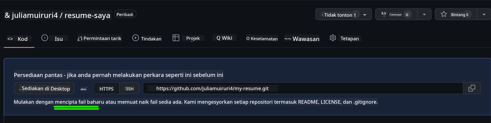
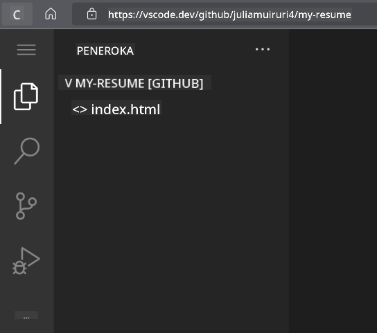

<!--
CO_OP_TRANSLATOR_METADATA:
{
  "original_hash": "bd3aa6d2b879c30ea496c43aec1c49ed",
  "translation_date": "2025-08-29T09:34:54+00:00",
  "source_file": "8-code-editor/1-using-a-code-editor/assignment.md",
  "language_code": "ms"
}
-->
# Membina Laman Web Resume menggunakan vscode.dev

_Betapa hebatnya jika seorang perekrut meminta resume anda dan anda menghantar mereka pautan url?_ 😎

## Objektif

Selepas tugasan ini, anda akan belajar bagaimana untuk:

- Membina laman web untuk mempamerkan resume anda

### Prasyarat

1. Akaun GitHub. Pergi ke [GitHub](https://github.com/) dan buat akaun jika anda belum memilikinya.

## Langkah-langkah

**Langkah 1:** Cipta Repositori GitHub baharu dan beri nama `my-resume`

**Langkah 2** Cipta fail `index.html` dalam repositori anda. Kita akan menambah sekurang-kurangnya satu fail semasa masih di github.com kerana anda tidak boleh membuka repositori kosong di vscode.dev

Klik pautan `creating a new file`, taip nama `index.html` dan pilih butang `Commit new file`



**Langkah 3:** Buka [VSCode.dev](https://vscode.dev) dan pilih butang `Open Remote Repository`

Salin url repositori yang baru anda cipta untuk laman resume anda dan tampalkannya dalam kotak input:

_Gantikan `your-username` dengan nama pengguna GitHub anda_

```
https://github.com/your-username/my-resume
```

✅ Jika berjaya, anda akan melihat projek anda dan fail index.html dibuka di editor teks pada pelayar.



**Langkah 4:** Buka fail `index.html`, tampal kod di bawah pada kawasan kod anda dan simpan

<details>
    <summary><b>Kod HTML yang bertanggungjawab untuk kandungan laman web resume anda.</b></summary>
    
        <html>

            <head>
                <link href="style.css" rel="stylesheet">
                <link rel="stylesheet" href="https://cdnjs.cloudflare.com/ajax/libs/font-awesome/5.15.4/css/all.min.css">
                <title>Nama Anda Di Sini!</title>
            </head>
            <body>
                <header id="header">
                    <!-- header resume dengan nama dan jawatan anda -->
                    <h1>Nama Anda Di Sini!</h1>
                    <hr>
                    Peranan Anda!
                    <hr>
                </header>
                <main>
                    <article id="mainLeft">
                        <section>
                            <h2>HUBUNGI</h2>
                            <!-- maklumat hubungan termasuk media sosial -->
                            <p>
                                <i class="fa fa-envelope" aria-hidden="true"></i>
                                <a href="mailto:username@domain.top-level domain">Tulis email anda di sini</a>
                            </p>
                            <p>
                                <i class="fab fa-github" aria-hidden="true"></i>
                                <a href="github.com/yourGitHubUsername">Tulis nama pengguna anda di sini!</a>
                            </p>
                            <p>
                                <i class="fab fa-linkedin" aria-hidden="true"></i>
                                <a href="linkedin.com/yourLinkedInUsername">Tulis nama pengguna anda di sini!</a>
                            </p>
                        </section>
                        <section>
                            <h2>KEMAHIRAN</h2>
                            <!-- kemahiran anda -->
                            <ul>
                                <li>Kemahiran 1!</li>
                                <li>Kemahiran 2!</li>
                                <li>Kemahiran 3!</li>
                                <li>Kemahiran 4!</li>
                            </ul>
                        </section>
                        <section>
                            <h2>PENDIDIKAN</h2>
                            <!-- pendidikan anda -->
                            <h3>Tulis kursus anda di sini!</h3>
                            <p>
                                Tulis institusi anda di sini!
                            </p>
                            <p>
                                Tarikh Mula - Tarikh Tamat
                            </p>
                        </section>            
                    </article>
                    <article id="mainRight">
                        <section>
                            <h2>TENTANG</h2>
                            <!-- tentang anda -->
                            <p>Tulis sedikit tentang diri anda!</p>
                        </section>
                        <section>
                            <h2>PENGALAMAN KERJA</h2>
                            <!-- pengalaman kerja anda -->
                            <h3>Jawatan</h3>
                            <p>
                                Nama Organisasi Di Sini | Bulan Mula – Bulan Tamat
                            </p>
                            <ul>
                                    <li>Tugas 1 - Tulis apa yang anda lakukan!</li>
                                    <li>Tugas 2 - Tulis apa yang anda lakukan!</li>
                                    <li>Tulis hasil/impak daripada sumbangan anda</li>
                                    
                            </ul>
                            <h3>Jawatan 2</h3>
                            <p>
                                Nama Organisasi Di Sini | Bulan Mula – Bulan Tamat
                            </p>
                            <ul>
                                    <li>Tugas 1 - Tulis apa yang anda lakukan!</li>
                                    <li>Tugas 2 - Tulis apa yang anda lakukan!</li>
                                    <li>Tulis hasil/impak daripada sumbangan anda</li>
                                    
                            </ul>
                        </section>
                    </article>
                </main>
            </body>
        </html>
</details>

Masukkan butiran resume anda untuk menggantikan _teks tempat letak_ pada kod html

**Langkah 5:** Arahkan tetikus pada folder My-Resume, klik ikon `New File ...` dan cipta 2 fail baharu dalam projek anda: fail `style.css` dan `codeswing.json`

**Langkah 6:** Buka fail `style.css`, tampal kod di bawah dan simpan

<details>
        <summary><b>Kod CSS untuk memformat susun atur laman.</b></summary>
            
            body {
                font-family: 'Segoe UI', Tahoma, Geneva, Verdana, sans-serif;
                font-size: 16px;
                max-width: 960px;
                margin: auto;
            }
            h1 {
                font-size: 3em;
                letter-spacing: .6em;
                padding-top: 1em;
                padding-bottom: 1em;
            }

            h2 {
                font-size: 1.5em;
                padding-bottom: 1em;
            }

            h3 {
                font-size: 1em;
                padding-bottom: 1em;
            }
            main { 
                display: grid;
                grid-template-columns: 40% 60%;
                margin-top: 3em;
            }
            header {
                text-align: center;
                margin: auto 2em;
            }

            section {
                margin: auto 1em 4em 2em;
            }

            i {
                margin-right: .5em;
            }

            p {
                margin: .2em auto
            }

            hr {
                border: none;
                background-color: lightgray;
                height: 1px;
            }

            h1, h2, h3 {
                font-weight: 100;
                margin-bottom: 0;
            }
            #mainLeft {
                border-right: 1px solid lightgray;
            }
            
</details>

**Langkah 6:** Buka fail `codeswing.json`, tampal kod di bawah dan simpan

    {
    "scripts": [],
    "styles": []
    }

**Langkah 7:** Pasang `Codeswing extension` untuk melihat laman web resume pada kawasan kod.

Klik ikon _`Extensions`_ pada bar aktiviti dan taip Codeswing. Sama ada klik butang _biru install_ pada bar aktiviti yang diperluas untuk memasang atau gunakan butang install yang muncul pada kawasan kod setelah anda memilih sambungan untuk memuatkan maklumat tambahan. Selepas memasang sambungan, perhatikan kawasan kod anda untuk melihat perubahan pada projek anda 😃


Inilah yang akan anda lihat pada skrin anda selepas memasang sambungan.


Jika anda berpuas hati dengan perubahan yang anda buat, arahkan tetikus pada folder `Changes` dan klik butang `+` untuk meletakkan perubahan.

Taipkan mesej commit _(Deskripsi perubahan yang anda buat pada projek)_ dan commit perubahan anda dengan mengklik `check`. Setelah selesai bekerja pada projek anda, pilih ikon menu hamburger di bahagian atas kiri untuk kembali ke repositori di GitHub.

Tahniah 🎉 Anda baru sahaja mencipta laman web resume anda menggunakan vscode.dev dalam beberapa langkah.

## 🚀 Cabaran

Buka repositori jauh yang anda mempunyai kebenaran untuk membuat perubahan dan kemas kini beberapa fail. Seterusnya, cuba cipta cawangan baharu dengan perubahan anda dan buat Permintaan Tarik.

## Kajian & Pembelajaran Kendiri

Baca lebih lanjut tentang [VSCode.dev](https://code.visualstudio.com/docs/editor/vscode-web?WT.mc_id=academic-0000-alfredodeza) dan beberapa ciri lain.

---

**Penafian**:  
Dokumen ini telah diterjemahkan menggunakan perkhidmatan terjemahan AI [Co-op Translator](https://github.com/Azure/co-op-translator). Walaupun kami berusaha untuk memastikan ketepatan, sila ambil perhatian bahawa terjemahan automatik mungkin mengandungi kesilapan atau ketidaktepatan. Dokumen asal dalam bahasa asalnya harus dianggap sebagai sumber yang berwibawa. Untuk maklumat penting, terjemahan manusia profesional adalah disyorkan. Kami tidak bertanggungjawab atas sebarang salah faham atau salah tafsir yang timbul daripada penggunaan terjemahan ini.