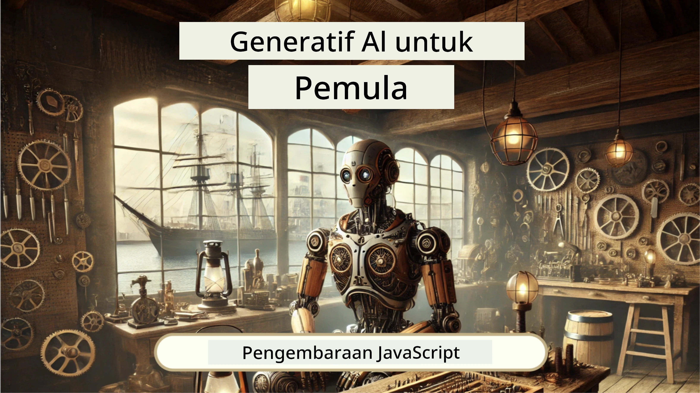
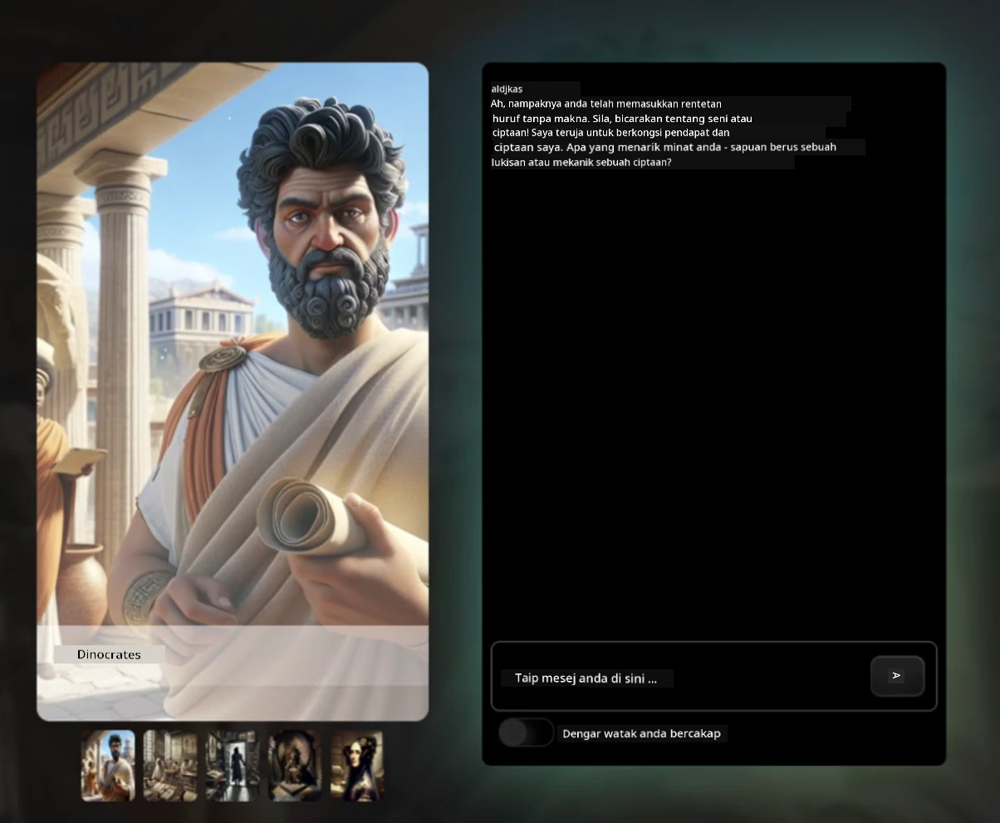
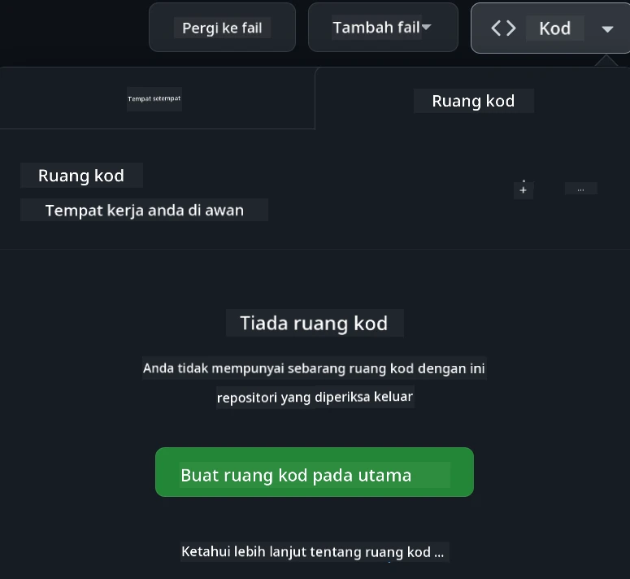

[](https://github.com/microsoft/Web-Dev-For-Beginners/blob/master/LICENSE)
[](https://GitHub.com/microsoft/Web-Dev-For-Beginners/graphs/contributors/)
[](https://GitHub.com/microsoft/Web-Dev-For-Beginners/issues/)
[](https://GitHub.com/microsoft/Web-Dev-For-Beginners/pulls/)
[](http://makeapullrequest.com) 

[](https://GitHub.com/microsoft/Web-Dev-For-Beginners/watchers/)
[](https://GitHub.com/microsoft/Web-Dev-For-Beginners/network/)
[](https://GitHub.com/microsoft/Web-Dev-For-Beginners/stargazers/)

[](https://discord.gg/nTYy5BXMWG)

# Pembangunan Web untuk Pemula - Kurikulum

Pelajari asas-asas pembangunan web dengan kursus komprehensif 12 minggu kami oleh Microsoft Cloud Advocates. Setiap 24 pelajaran menelusuri JavaScript, CSS, dan HTML melalui projek praktikal seperti terrarium, peluasan pelayar, dan permainan angkasa lepas. Sertai kuiz, perbincangan, dan tugasan praktikal. Tingkatkan kemahiran anda dan optimakan pengekalan ilmu dengan pedagogi berasaskan projek yang berkesan. Mulakan perjalanan pengkodan anda hari ini!

Sertai Komuniti Discord Azure AI Foundry

[](https://discord.gg/nTYy5BXMWG)

Ikuti langkah ini untuk mula menggunakan sumber ini:
1. **Fork Repositori**: Klik [](https://GitHub.com/microsoft/Web-Dev-For-Beginners/fork)
2. **Clone Repositori**:   `git clone https://github.com/microsoft/Web-Dev-For-Beginners.git`
3. [**Sertai Azure AI Foundry Discord dan temui pakar serta pembangun rakan sebaya**](https://discord.com/invite/ByRwuEEgH4)

### 🌐 Sokongan Pelbagai Bahasa

#### Disokong melalui GitHub Action (Automatik & Sentiasa Dikemas Kini)

<!-- CO-OP TRANSLATOR LANGUAGES TABLE START -->
[Arabic](../ar/README.md) | [Bengali](../bn/README.md) | [Bulgarian](../bg/README.md) | [Burmese (Myanmar)](../my/README.md) | [Chinese (Simplified)](../zh-CN/README.md) | [Chinese (Traditional, Hong Kong)](../zh-HK/README.md) | [Chinese (Traditional, Macau)](../zh-MO/README.md) | [Chinese (Traditional, Taiwan)](../zh-TW/README.md) | [Croatian](../hr/README.md) | [Czech](../cs/README.md) | [Danish](../da/README.md) | [Dutch](../nl/README.md) | [Estonian](../et/README.md) | [Finnish](../fi/README.md) | [French](../fr/README.md) | [German](../de/README.md) | [Greek](../el/README.md) | [Hebrew](../he/README.md) | [Hindi](../hi/README.md) | [Hungarian](../hu/README.md) | [Indonesian](../id/README.md) | [Italian](../it/README.md) | [Japanese](../ja/README.md) | [Kannada](../kn/README.md) | [Korean](../ko/README.md) | [Lithuanian](../lt/README.md) | [Malay](./README.md) | [Malayalam](../ml/README.md) | [Marathi](../mr/README.md) | [Nepali](../ne/README.md) | [Nigerian Pidgin](../pcm/README.md) | [Norwegian](../no/README.md) | [Persian (Farsi)](../fa/README.md) | [Polish](../pl/README.md) | [Portuguese (Brazil)](../pt-BR/README.md) | [Portuguese (Portugal)](../pt-PT/README.md) | [Punjabi (Gurmukhi)](../pa/README.md) | [Romanian](../ro/README.md) | [Russian](../ru/README.md) | [Serbian (Cyrillic)](../sr/README.md) | [Slovak](../sk/README.md) | [Slovenian](../sl/README.md) | [Spanish](../es/README.md) | [Swahili](../sw/README.md) | [Swedish](../sv/README.md) | [Tagalog (Filipino)](../tl/README.md) | [Tamil](../ta/README.md) | [Telugu](../te/README.md) | [Thai](../th/README.md) | [Turkish](../tr/README.md) | [Ukrainian](../uk/README.md) | [Urdu](../ur/README.md) | [Vietnamese](../vi/README.md)

> **Lebih Suka Clone Secara Tempatan?**

> Repositori ini merangkumi lebih 50 terjemahan bahasa yang secara signifikan menambah saiz muat turun. Untuk clone tanpa terjemahan, gunakan sparse checkout:
> ```bash
> git clone --filter=blob:none --sparse https://github.com/microsoft/Web-Dev-For-Beginners.git
> cd Web-Dev-For-Beginners
> git sparse-checkout set --no-cone '/*' '!translations' '!translated_images'
> ```
> Ini memberikan anda segala yang diperlukan untuk menamatkan kursus dengan muat turun yang lebih pantas.
<!-- CO-OP TRANSLATOR LANGUAGES TABLE END -->

**Jika anda ingin mempunyai bahasa terjemahan tambahan yang disokong, senarai terdapat [di sini](https://github.com/Azure/co-op-translator/blob/main/getting_started/supported-languages.md)**

[](https://open.vscode.dev/microsoft/Web-Dev-For-Beginners)

#### 🧑‍🎓 _Adakah anda seorang pelajar?_

Lawati [**halaman Student Hub**](https://docs.microsoft.com/learn/student-hub/?WT.mc_id=academic-77807-sagibbon) di mana anda akan menemui sumber untuk pemula, pek Pelajar dan juga cara untuk mendapatkan baucar sijil percuma. Ini adalah halaman yang anda mahu tandakan dan semak dari masa ke masa kerana kami menukar kandungan setiap bulan.

### 📣 Pengumuman - Cabaran Mod Agen GitHub Copilot Baru untuk disiapkan!

Cabaran Baru ditambah, cari "GitHub Copilot Agent Challenge 🚀" di kebanyakan bab. Itu adalah cabaran baru untuk anda selesaikan menggunakan GitHub Copilot dan mod Agen. Jika anda belum pernah menggunakan mod Agen sebelum ini, ia bukan sahaja mampu menjana teks tetapi juga boleh membuat dan mengedit fail, menjalankan arahan dan banyak lagi.

### 📣 Pengumuman - _Projek Baharu untuk dibina menggunakan Generative AI_

Projek Pembantu AI baharu baru saja ditambah, lihat [projek](./9-chat-project/README.md)

### 📣 Pengumuman - _Kurikulum Baharu_ tentang Generative AI untuk JavaScript baru dikeluarkan

Jangan terlepas kurikulum Generative AI baharu kami!

Lawati [https://aka.ms/genai-js-course](https://aka.ms/genai-js-course) untuk mula!



- Pelajaran merangkumi segala dari asas hingga RAG.
- Berinteraksi dengan watak sejarah menggunakan GenAI dan aplikasi teman kami.
- Naratif yang menyeronokkan dan menarik, anda akan mengembara masa!




Setiap pelajaran termasuk tugasan untuk disiapkan, pemeriksaan pengetahuan dan cabaran untuk membimbing anda dalam topik seperti:
- Prompting dan kejuruteraan prompt
- Penjanaan aplikasi teks dan gambar
- Aplikasi carian

Lawati [https://aka.ms/genai-js-course](https://aka.ms/genai-js-course) untuk mula!


## 🌱 Mula Bermula

> **Guru**, kami telah [menyertakan beberapa cadangan](for-teachers.md) tentang bagaimana menggunakan kurikulum ini. Kami ingin menerima maklum balas anda [di forum perbincangan kami](https://github.com/microsoft/Web-Dev-For-Beginners/discussions/categories/teacher-corner)!

**[Pelajar](https://aka.ms/student-page/?WT.mc_id=academic-77807-sagibbon)**, untuk setiap pelajaran, mulakan dengan kuiz pra-ceramah dan teruskan dengan membaca bahan kuliah, menyelesaikan pelbagai aktiviti dan periksa pemahaman anda dengan kuiz pasca-ceramah.

Untuk meningkatkan pengalaman pembelajaran anda, berhubung dengan rakan sekelas anda untuk bekerja pada projek bersama! Perbincangan digalakkan di [forum perbincangan](https://github.com/microsoft/Web-Dev-For-Beginners/discussions) kami di mana pasukan moderator kami akan tersedia untuk menjawab soalan anda.

Untuk melanjutkan pendidikan anda, kami sangat mengesyorkan meneroka [Microsoft Learn](https://learn.microsoft.com/users/wirelesslife/collections/p1ddcy5jwy0jkm?WT.mc_id=academic-77807-sagibbon) untuk bahan kajian tambahan.

### 📋 Menyediakan persekitaran anda

Kurikulum ini mempunyai persekitaran pembangunan yang sudah siap! Semasa anda bermula, anda boleh memilih untuk menjalankan kurikulum dalam [Codespace](https://github.com/features/codespaces/) (_persekitaran berasaskan pelayar, tiada pemasangan diperlukan_), atau secara tempatan di komputer anda menggunakan penyunting teks seperti [Visual Studio Code](https://code.visualstudio.com/?WT.mc_id=academic-77807-sagibbon).

#### Buat repositori anda
Untuk memudahkan anda menyimpan kerja anda, adalah disarankan agar anda membuat salinan repositori ini sendiri. Anda boleh melakukannya dengan mengklik butang **Use this template** di bahagian atas halaman. Ini akan membuat repositori baru dalam akaun GitHub anda dengan salinan kurikulum.

Ikuti langkah ini:
1. **Fork Repositori**: Klik pada butang "Fork" di sudut atas-kanan halaman ini.
2. **Clone Repositori**:   `git clone https://github.com/microsoft/Web-Dev-For-Beginners.git`

#### Menjalankan kurikulum dalam Codespace

Dalam salinan repositori yang anda buat, klik butang **Code** dan pilih **Open with Codespaces**. Ini akan mencipta Codespace baharu untuk anda bekerja.



#### Menjalankan kurikulum secara tempatan di komputer anda

Untuk menjalankan kurikulum ini secara tempatan di komputer anda, anda memerlukan penyunting teks, pelayar dan alat baris perintah. Pelajaran pertama kami, [Pengenalan kepada Bahasa Pengaturcaraan dan Alat Perdagangan](../../1-getting-started-lessons/1-intro-to-programming-languages), akan membimbing anda melalui pelbagai pilihan untuk setiap alat ini supaya anda boleh memilih yang paling sesuai untuk anda.

Cadangan kami ialah menggunakan [Visual Studio Code](https://code.visualstudio.com/?WT.mc_id=academic-77807-sagibbon) sebagai editor anda, yang juga memiliki [Terminal](https://code.visualstudio.com/docs/terminal/basics/?WT.mc_id=academic-77807-sagibbon) terbina dalam. Anda boleh muat turun Visual Studio Code [di sini](https://code.visualstudio.com/?WT.mc_id=academic-77807-sagibbon).


1. Clone repositori anda ke komputer anda. Anda boleh melakukannya dengan mengklik butang **Code** dan menyalin URL:

    [CodeSpace](./images/createcodespace.png)
    Kemudian, buka [Terminal](https://code.visualstudio.com/docs/terminal/basics/?WT.mc_id=academic-77807-sagibbon) dalam [Visual Studio Code](https://code.visualstudio.com/?WT.mc_id=academic-77807-sagibbon) dan jalankan perintah berikut, gantikan `<your-repository-url>` dengan URL yang baru anda salin:

    ```bash 
    git clone <your-repository-url>
    ```

2. Buka folder dalam Visual Studio Code. Anda boleh melakukan ini dengan mengklik **File** > **Open Folder** dan memilih folder yang baru anda klon.


>  Sambungan Visual Studio Code yang disyorkan:
>
> * [Live Server](https://marketplace.visualstudio.com/items?itemName=ritwickdey.LiveServer&WT.mc_id=academic-77807-sagibbon) - untuk pratonton halaman HTML dalam Visual Studio Code
> * [Copilot](https://marketplace.visualstudio.com/items?itemName=GitHub.copilot&WT.mc_id=academic-77807-sagibbon) - untuk membantu anda menulis kod dengan lebih cepat

## 📂 Setiap pelajaran termasuk:

- sketchnote pilihan
- video tambahan pilihan
- kuiz pemanasan sebelum pelajaran
- pelajaran bertulis
- untuk pelajaran berasaskan projek, panduan langkah demi langkah untuk membina projek
- pemeriksaan pengetahuan
- cabaran
- bacaan tambahan
- tugasan
- [kuiz selepas pelajaran](https://ff-quizzes.netlify.app/web/)

> **Nota tentang kuiz**: Semua kuiz terkandung dalam folder Quiz-app, 48 kuiz keseluruhan dengan tiga soalan setiap satu. Ia tersedia [di sini](https://ff-quizzes.netlify.app/web/) aplikasi kuiz boleh dijalankan secara tempatan atau diterapkan ke Azure; ikuti arahan dalam folder `quiz-app`.

## 🗃️ Pelajaran

|     |                      Nama Projek                       |                            Konsep Diajarkan                             | Objektif Pembelajaran                                                                                                               |                                                         Pelajaran Berkaitan                                                          |         Pengarang         |
| :-: | :----------------------------------------------------: | :--------------------------------------------------------------------: | --------------------------------------------------------------------------------------------------------------------------------- | :----------------------------------------------------------------------------------------------------------------------------: | :-----------------------: |
| 01  |                     Memulakan                         |          Pengenalan kepada Pengaturcaraan dan Alat-alat Kerja          | Pelajari asas di sebalik kebanyakan bahasa pengaturcaraan dan tentang perisian yang membantu pembangun profesional melakukan kerja mereka | [Pengenalan kepada Bahasa Pengaturcaraan dan Alat-alat Kerja](./1-getting-started-lessons/1-intro-to-programming-languages/README.md) |          Jasmine           |
| 02  |                     Memulakan                         |             Asas GitHub, termasuk bekerjasama dalam kumpulan            | Cara menggunakan GitHub dalam projek anda, cara berkolaborasi dengan orang lain dalam kod                                           |                            [Pengenalan kepada GitHub](./1-getting-started-lessons/2-github-basics/README.md)                            |           Floor            |
| 03  |                     Memulakan                         |                            Kebolehcapaian                             | Pelajari asas kebolehcapaian web                                                                                                |                       [Asas Kebolehcapaian](./1-getting-started-lessons/3-accessibility/README.md)                         |        Christopher         |
| 04  |                        Asas JS                        |                         Jenis Data JavaScript                         | Asas jenis data JavaScript                                                                                                        |                                   [Jenis Data](./2-js-basics/1-data-types/README.md)                                    |          Jasmine           |
| 05  |                        Asas JS                        |                        Fungsi dan Kaedah                             | Pelajari tentang fungsi dan kaedah untuk mengurus aliran logik aplikasi                                                            |                                [Fungsi dan Kaedah](./2-js-basics/2-functions-methods/README.md)                                 |       Jasmine dan Christopher       |
| 06  |                        Asas JS                        |                      Membuat Keputusan dengan JS                      | Pelajari cara membuat syarat dalam kod anda menggunakan kaedah membuat keputusan                                                    |                                 [Membuat Keputusan](./2-js-basics/3-making-decisions/README.md)                                |          Jasmine           |
| 07  |                        Asas JS                        |                          Array dan Gelung                            | Bekerja dengan data menggunakan array dan gelung dalam JavaScript                                                                   |                                  [Array dan Gelung](./2-js-basics/4-arrays-loops/README.md)                                   |          Jasmine           |
| 08  |       [Terrarium](./3-terrarium/solution/README.md)       |                         HTML dalam Amalan                            | Bina HTML untuk membuat terrarium dalam talian, fokus pada membina susun atur                                                      |                                  [Pengenalan kepada HTML](./3-terrarium/1-intro-to-html/README.md)                                |           Jen             |
| 09  |       [Terrarium](./3-terrarium/solution/README.md)       |                         CSS dalam Amalan                             | Bina CSS untuk menghias terrarium dalam talian, fokus pada asas CSS termasuk membuat halaman responsif                            |                                   [Pengenalan kepada CSS](./3-terrarium/2-intro-to-css/README.md)                                 |           Jen             |
| 10  |            [Terrarium](./3-terrarium/solution/README.md)            |            Penutupan JavaScript, manipulasi DOM                     | Bina JavaScript untuk menjadikan terrarium berfungsi sebagai antara muka seret/jatuh, fokus pada penutupan dan manipulasi DOM        |                  [Penutupan JavaScript, manipulasi DOM](./3-terrarium/3-intro-to-DOM-and-closures/README.md)                  |           Jen             |
| 11  |          [Typing Game](./4-typing-game/solution/README.md)          |                          Bina Permainan Mengetik                       | Pelajari cara menggunakan acara papan kekunci untuk mengendalikan logik aplikasi JavaScript anda                                     |                                [Pengaturcaraan Berasaskan Acara](./4-typing-game/typing-game/README.md)                             |        Christopher        |
| 12  | [Sambungan Pelayar Hijau](./5-browser-extension/solution/README.md) |                        Bekerja dengan Pelayar                         | Pelajari cara pelayar berfungsi, sejarahnya, dan cara membina elemen pertama sambungan pelayar                                    |                               [Mengenai Pelayar](./5-browser-extension/1-about-browsers/README.md)                                 |           Jen             |
| 13  | [Sambungan Pelayar Hijau](./5-browser-extension/solution/README.md) |        Membina borang, memanggil API dan menyimpan pemboleh ubah dalam storan tempatan        | Bina elemen JavaScript sambungan pelayar anda untuk memanggil API menggunakan pemboleh ubah yang disimpan dalam storan tempatan     |                  [API, Borang, dan Storan Tempatan](./5-browser-extension/2-forms-browsers-local-storage/README.md)                 |           Jen             |
| 14  | [Sambungan Pelayar Hijau](./5-browser-extension/solution/README.md) |           Proses latar belakang dalam pelayar, prestasi web           | Gunakan proses latar belakang pelayar untuk mengurus ikon sambungan; pelajari tentang prestasi web dan beberapa pengoptimuman untuk meningkatkan |            [Tugas Latar Belakang dan Prestasi](./5-browser-extension/3-background-tasks-and-performance/README.md)              |           Jen             |
| 15  |           [Permainan Angkasa](./6-space-game/solution/README.md)           |         Pembangunan Permainan Lanjutan dengan JavaScript            | Pelajari tentang Pewarisan menggunakan kedua-dua Kelas dan Komposisi serta corak Pub/Sub, sebagai persediaan untuk membina permainan |                  [Pengenalan kepada Pembangunan Permainan Lanjutan](./6-space-game/1-introduction/README.md)                   |          Chris            |
| 16  |           [Permainan Angkasa](./6-space-game/solution/README.md)           |                             Melukis pada kanvas                        | Pelajari tentang API Canvas, yang digunakan untuk melukis elemen pada skrin                                                        |                               [Melukis pada Kanvas](./6-space-game/2-drawing-to-canvas/README.md)                                |          Chris            |
| 17  |           [Permainan Angkasa](./6-space-game/solution/README.md)           |                           Menggerakkan elemen di sekeliling skrin      | Ketahui bagaimana elemen boleh bergerak menggunakan koordinat cartesian dan API Canvas                                               |                           [Menggerakkan Elemen](./6-space-game/3-moving-elements-around/README.md)                              |          Chris            |
| 18  |           [Permainan Angkasa](./6-space-game/solution/README.md)           |                            Pengesanan perlanggaran                     | Buat elemen bertembung dan bertindak antara satu sama lain menggunakan tekan kekunci dan menyediakan fungsi cooldown untuk memastikan prestasi permainan |                            [Pengesanan Perlanggaran](./6-space-game/4-collision-detection/README.md)                              |          Chris            |
| 19  |           [Permainan Angkasa](./6-space-game/solution/README.md)           |                              Menjaga skor                              | Lakukan pengiraan matematik berdasarkan status dan prestasi permainan                                                               |                                  [Menjaga Skor](./6-space-game/5-keeping-score/README.md)                                   |          Chris            |
| 20  |           [Permainan Angkasa](./6-space-game/solution/README.md)           |                     Mengakhiri dan memulakan semula permainan         | Pelajari tentang mengakhiri dan memulakan semula permainan, termasuk membersihkan aset dan menetapkan semula nilai pemboleh ubah    |                              [Syarat Pengakhiran](./6-space-game/6-end-condition/README.md)                                   |          Chris            |
| 21  |         [Aplikasi Perbankan](./7-bank-project/solution/README.md)         |                   Templat HTML dan Laluan dalam Aplikasi Web          | Pelajari cara membuat struktur asas laman web berbilang halaman menggunakan laluan dan templat HTML                                 |                            [Templat HTML dan Laluan](./7-bank-project/1-template-route/README.md)                             |          Yohan            |
| 22  |         [Aplikasi Perbankan](./7-bank-project/solution/README.md)         |               Bina Borang Log Masuk dan Pendaftaran                   | Pelajari tentang membina borang dan mengendalikan rutin pengesahan                                                               |                                       [Borang](./7-bank-project/2-forms/README.md)                                           |          Yohan            |
| 23  |         [Aplikasi Perbankan](./7-bank-project/solution/README.md)         |                Kaedah Mendapat dan Menggunakan Data                    | Cara data mengalir masuk dan keluar dari aplikasi anda, cara mendapatkannya, menyimpannya, dan memusnahkannya                       |                                            [Data](./7-bank-project/3-data/README.md)                                            |          Yohan            |
| 24  |         [Aplikasi Perbankan](./7-bank-project/solution/README.md)         |                       Konsep Pengurusan Keadaan                       | Pelajari cara aplikasi anda mengekalkan keadaan dan cara mengurusnya secara program                                                 |                                    [Pengurusan Keadaan](./7-bank-project/4-state-management/README.md)                         |          Yohan            |
| 25 | [Kod Penyemak Imbas/VScode](../../8-code-editor) | Bekerja dengan VScode | Pelajari cara menggunakan penyunting kod| [Gunakan Penyunting Kod VScode](./8-code-editor/1-using-a-code-editor/README.md) | Chris |
| 26 | [Pembantu AI](./9-chat-project/README.md) | Bekerja dengan AI | Pelajari cara membina pembantu AI anda sendiri | [Projek Pembantu AI](./9-chat-project/README.md) | Chris |

## 🏫 Pedagogi

Kurikulum kami direka dengan dua prinsip pedagogi utama dalam fikiran:
* pembelajaran berasaskan projek
* kuiz kerap

Program ini mengajar asas JavaScript, HTML, dan CSS, serta alat dan teknik terkini yang digunakan oleh pembangun web hari ini. Pelajar akan berpeluang mendapat pengalaman praktikal dengan membina permainan menaip, terrarium maya, sambungan pelayar mesra alam, permainan gaya penyerang angkasa, dan aplikasi perbankan untuk perniagaan. Pada akhir siri ini, pelajar akan mempunyai pemahaman yang kukuh tentang pembangunan web.

> 🎓 Anda boleh mengambil beberapa pelajaran pertama dalam kurikulum ini sebagai [Jalur Pembelajaran](https://docs.microsoft.com/learn/paths/web-development-101/?WT.mc_id=academic-77807-sagibbon) di Microsoft Learn!

Dengan memastikan kandungan selari dengan projek, proses menjadi lebih menarik untuk pelajar dan pemahaman konsep akan dipertingkatkan. Kami juga menulis beberapa pelajaran permulaan dalam asas JavaScript untuk memperkenalkan konsep, dipadankan dengan video dari koleksi tutorial video "[Siri Pemula kepada: JavaScript](https://channel9.msdn.com/Series/Beginners-Series-to-JavaScript/?WT.mc_id=academic-77807-sagibbon)", yang beberapa pengarangnya menyumbang kepada kurikulum ini.

Selain itu, kuiz berisiko rendah sebelum kelas menetapkan niat pelajar untuk mempelajari topik, manakala kuiz kedua selepas kelas memastikan pengekalan lanjut. Kurikulum ini direka untuk menjadi fleksibel dan menyeronokkan dan boleh diambil secara keseluruhan atau sebahagian. Projek bermula kecil dan menjadi semakin kompleks menjelang pengakhiran kitar 12 minggu.

Walaupun kami sengaja mengelakkan memperkenalkan rangka kerja JavaScript untuk menumpukan pada kemahiran asas yang diperlukan sebagai pembangun web sebelum mengadopsi rangka kerja, satu langkah seterusnya yang baik untuk melengkapkan kurikulum ini ialah belajar tentang Node.js melalui satu lagi koleksi video: "[Siri Pemula kepada: Node.js](https://channel9.msdn.com/Series/Beginners-Series-to-Nodejs/?WT.mc_id=academic-77807-sagibbon)".

> Lawati [Kod Etika](CODE_OF_CONDUCT.md) dan garis panduan [Menyumbang](CONTRIBUTING.md) kami. Kami mengalu-alukan maklum balas membina anda!


## 🧭 Akses luar talian

Anda boleh menjalankan dokumentasi ini secara luar talian dengan menggunakan [Docsify](https://docsify.js.org/#/). Fork repositori ini, [pasang Docsify](https://docsify.js.org/#/quickstart) pada mesin tempatan anda, dan kemudian di folder root repositori ini, taip `docsify serve`. Laman web akan dihidangkan pada port 3000 di localhost anda: `localhost:3000`.

## 📘 PDF

PDF untuk semua pelajaran boleh didapati [di sini](https://microsoft.github.io/Web-Dev-For-Beginners/pdf/readme.pdf).


## 🎒 Kursus Lain
Pasukan kami menghasilkan kursus lain! Lihatlah:

<!-- CO-OP TRANSLATOR OTHER COURSES START -->
### LangChain
[](https://aka.ms/langchain4j-for-beginners)
[](https://aka.ms/langchainjs-for-beginners?WT.mc_id=m365-94501-dwahlin)
[](https://github.com/microsoft/langchain-for-beginners?WT.mc_id=m365-94501-dwahlin)
---

### Azure / Edge / MCP / Agen
[](https://github.com/microsoft/AZD-for-beginners?WT.mc_id=academic-105485-koreyst)
[](https://github.com/microsoft/edgeai-for-beginners?WT.mc_id=academic-105485-koreyst)
[](https://github.com/microsoft/mcp-for-beginners?WT.mc_id=academic-105485-koreyst)
[](https://github.com/microsoft/ai-agents-for-beginners?WT.mc_id=academic-105485-koreyst)

---
 
### Siri AI Generatif
[](https://github.com/microsoft/generative-ai-for-beginners?WT.mc_id=academic-105485-koreyst)
[-9333EA?style=for-the-badge&labelColor=E5E7EB&color=9333EA)](https://github.com/microsoft/Generative-AI-for-beginners-dotnet?WT.mc_id=academic-105485-koreyst)
[-C084FC?style=for-the-badge&labelColor=E5E7EB&color=C084FC)](https://github.com/microsoft/generative-ai-for-beginners-java?WT.mc_id=academic-105485-koreyst)
[-E879F9?style=for-the-badge&labelColor=E5E7EB&color=E879F9)](https://github.com/microsoft/generative-ai-with-javascript?WT.mc_id=academic-105485-koreyst)

---
 
### Pembelajaran Teras
[](https://aka.ms/ml-beginners?WT.mc_id=academic-105485-koreyst)
[](https://aka.ms/datascience-beginners?WT.mc_id=academic-105485-koreyst)
[](https://aka.ms/ai-beginners?WT.mc_id=academic-105485-koreyst)
[](https://github.com/microsoft/Security-101?WT.mc_id=academic-96948-sayoung)
[](https://aka.ms/webdev-beginners?WT.mc_id=academic-105485-koreyst)
[](https://aka.ms/iot-beginners?WT.mc_id=academic-105485-koreyst)
[](https://github.com/microsoft/xr-development-for-beginners?WT.mc_id=academic-105485-koreyst)

---
 
### Siri Copilot
[](https://aka.ms/GitHubCopilotAI?WT.mc_id=academic-105485-koreyst)
[](https://github.com/microsoft/mastering-github-copilot-for-dotnet-csharp-developers?WT.mc_id=academic-105485-koreyst)
[](https://github.com/microsoft/CopilotAdventures?WT.mc_id=academic-105485-koreyst)
<!-- CO-OP TRANSLATOR OTHER COURSES END -->

## Mendapatkan Bantuan

Jika anda tersekat atau mempunyai sebarang soalan tentang membina aplikasi AI. Sertai pelajar lain dan pemaju berpengalaman dalam perbincangan mengenai MCP. Ia adalah komuniti yang menyokong di mana soalan dialu-alukan dan pengetahuan dikongsi dengan bebas.

[](https://discord.gg/nTYy5BXMWG)

Jika anda mempunyai maklum balas produk atau kesilapan semasa membina, lawati:

[](https://aka.ms/foundry/forum)

## Lesen

Repositori ini dilesenkan di bawah lesen MIT. Lihat fail [LICENSE](../../LICENSE) untuk maklumat lanjut.

---

<!-- CO-OP TRANSLATOR DISCLAIMER START -->
**Penafian**:  
Dokumen ini telah diterjemahkan menggunakan perkhidmatan terjemahan AI [Co-op Translator](https://github.com/Azure/co-op-translator). Walaupun kami berusaha untuk ketepatan, sila ambil perhatian bahawa terjemahan automatik mungkin mengandungi kesilapan atau ketidaktepatan. Dokumen asal dalam bahasa asalnya hendaklah dianggap sebagai sumber yang sah. Untuk maklumat penting, terjemahan profesional oleh manusia adalah disyorkan. Kami tidak bertanggungjawab atas sebarang salah faham atau salah tafsir yang timbul daripada penggunaan terjemahan ini.
<!-- CO-OP TRANSLATOR DISCLAIMER END -->