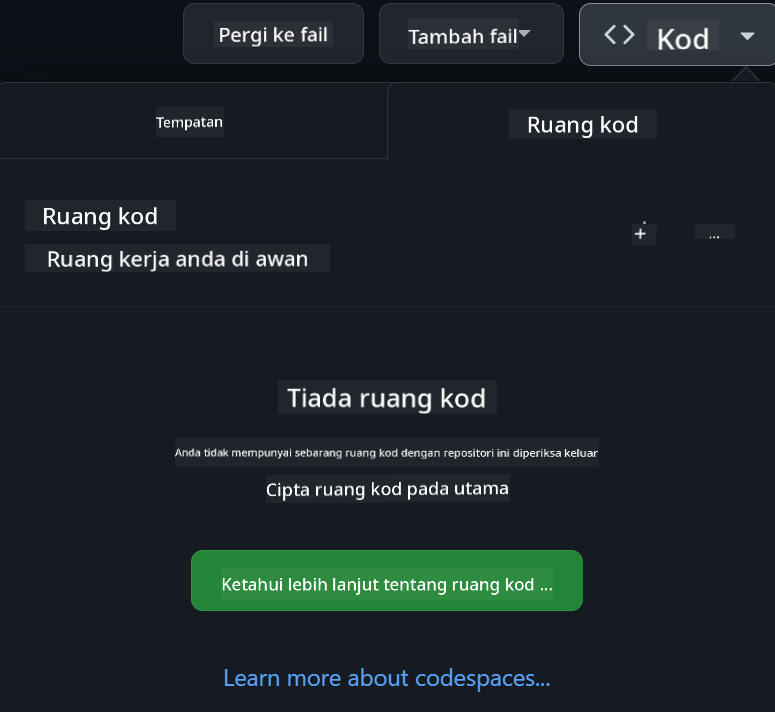

<!--
CO_OP_TRANSLATOR_METADATA:
{
  "original_hash": "caff943951276a4459a687166f3dfae2",
  "translation_date": "2025-12-19T10:25:31+00:00",
  "source_file": "README.md",
  "language_code": "ms"
}
-->
[](https://github.com/microsoft/Web-Dev-For-Beginners/blob/master/LICENSE)
[](https://GitHub.com/microsoft/Web-Dev-For-Beginners/graphs/contributors/)
[](https://GitHub.com/microsoft/Web-Dev-For-Beginners/issues/)
[](https://GitHub.com/microsoft/Web-Dev-For-Beginners/pulls/)
[](http://makeapullrequest.com)

[](https://GitHub.com/microsoft/Web-Dev-For-Beginners/watchers/)
[](https://GitHub.com/microsoft/Web-Dev-For-Beginners/network/)
[](https://GitHub.com/microsoft/Web-Dev-For-Beginners/stargazers/)

[](https://discord.gg/nTYy5BXMWG)

# Pembangunan Web untuk Pemula - Kurikulum

Pelajari asas pembangunan web dengan kursus 12 minggu yang komprehensif oleh Microsoft Cloud Advocates. Setiap daripada 24 pelajaran meneroka JavaScript, CSS, dan HTML melalui projek praktikal seperti terrarium, sambungan pelayar, dan permainan angkasa. Sertai kuiz, perbincangan, dan tugasan praktikal. Tingkatkan kemahiran anda dan optimalkan pemahaman anda dengan pendekatan pembelajaran berasaskan projek yang efektif. Mulakan perjalanan pengkodan anda hari ini!

Sertai Komuniti Discord Azure AI Foundry

[](https://discord.gg/nTYy5BXMWG)

Ikuti langkah-langkah ini untuk mula menggunakan sumber ini:
1. **Fork Repositori**: Klik [](https://GitHub.com/microsoft/Web-Dev-For-Beginners/fork)
2. **Clone Repositori**:   `git clone https://github.com/microsoft/Web-Dev-For-Beginners.git`
3. [**Sertai Azure AI Foundry Discord dan berhubung dengan pakar serta pembangun lain**](https://discord.com/invite/ByRwuEEgH4)

### 🌐 Sokongan Pelbagai Bahasa

#### Disokong melalui GitHub Action (Automatik & Sentiasa Terkini)

<!-- CO-OP TRANSLATOR LANGUAGES TABLE START -->
[Arabic](../ar/README.md) | [Bengali](../bn/README.md) | [Bulgarian](../bg/README.md) | [Burmese (Myanmar)](../my/README.md) | [Chinese (Simplified)](../zh/README.md) | [Chinese (Traditional, Hong Kong)](../hk/README.md) | [Chinese (Traditional, Macau)](../mo/README.md) | [Chinese (Traditional, Taiwan)](../tw/README.md) | [Croatian](../hr/README.md) | [Czech](../cs/README.md) | [Danish](../da/README.md) | [Dutch](../nl/README.md) | [Estonian](../et/README.md) | [Finnish](../fi/README.md) | [French](../fr/README.md) | [German](../de/README.md) | [Greek](../el/README.md) | [Hebrew](../he/README.md) | [Hindi](../hi/README.md) | [Hungarian](../hu/README.md) | [Indonesian](../id/README.md) | [Italian](../it/README.md) | [Japanese](../ja/README.md) | [Korean](../ko/README.md) | [Lithuanian](../lt/README.md) | [Malay](./README.md) | [Marathi](../mr/README.md) | [Nepali](../ne/README.md) | [Norwegian](../no/README.md) | [Persian (Farsi)](../fa/README.md) | [Polish](../pl/README.md) | [Portuguese (Brazil)](../br/README.md) | [Portuguese (Portugal)](../pt/README.md) | [Punjabi (Gurmukhi)](../pa/README.md) | [Romanian](../ro/README.md) | [Russian](../ru/README.md) | [Serbian (Cyrillic)](../sr/README.md) | [Slovak](../sk/README.md) | [Slovenian](../sl/README.md) | [Spanish](../es/README.md) | [Swahili](../sw/README.md) | [Swedish](../sv/README.md) | [Tagalog (Filipino)](../tl/README.md) | [Tamil](../ta/README.md) | [Thai](../th/README.md) | [Turkish](../tr/README.md) | [Ukrainian](../uk/README.md) | [Urdu](../ur/README.md) | [Vietnamese](../vi/README.md)
<!-- CO-OP TRANSLATOR LANGUAGES TABLE END -->

**Jika anda ingin menambah sokongan bahasa tambahan, senarai bahasa yang disokong boleh didapati [di sini](https://github.com/Azure/co-op-translator/blob/main/getting_started/supported-languages.md)**

[](https://open.vscode.dev/microsoft/Web-Dev-For-Beginners)

#### 🧑‍🎓 _Adakah anda seorang pelajar?_

Lawati [**Halaman Hub Pelajar**](https://docs.microsoft.com/learn/student-hub/?WT.mc_id=academic-77807-sagibbon) di mana anda akan menemui sumber untuk pemula, pakej pelajar dan juga cara mendapatkan baucar sijil percuma. Ini adalah halaman yang patut anda tandai dan periksa dari semasa ke semasa kerana kandungan akan ditukar setiap bulan.

### 📣 Pengumuman - Cabaran mod Agen GitHub Copilot baru untuk diselesaikan!

Cabaran baru ditambah, cari "Cabaran Agen GitHub Copilot 🚀" dalam kebanyakan bab. Ini adalah cabaran baru untuk anda selesaikan menggunakan GitHub Copilot dan mod Agen. Jika anda belum pernah menggunakan mod Agen sebelum ini, ia mampu bukan sahaja menjana teks tetapi juga mencipta dan mengedit fail, menjalankan arahan dan banyak lagi.

### 📣 Pengumuman - _Projek Baru untuk dibina menggunakan AI Generatif_

Projek Pembantu AI baru sahaja ditambah, lihat [projek](./09-chat-project/README.md)

### 📣 Pengumuman - _Kurikulum Baru_ mengenai AI Generatif untuk JavaScript baru sahaja dilancarkan

Jangan lepaskan kurikulum AI Generatif baru kami!

Lawati [https://aka.ms/genai-js-course](https://aka.ms/genai-js-course) untuk bermula!


- Pelajaran yang merangkumi segalanya dari asas hingga RAG.
- Berinteraksi dengan watak sejarah menggunakan GenAI dan aplikasi pendamping kami.
- Naratif yang menyeronokkan dan menarik, anda akan mengembara masa!


Setiap pelajaran termasuk tugasan untuk diselesaikan, semakan pengetahuan dan cabaran untuk membimbing anda mempelajari topik seperti:
- Prompting dan kejuruteraan prompt
- Penjanaan aplikasi teks dan imej
- Aplikasi carian

Lawati [https://aka.ms/genai-js-course](../../[https:/aka.ms/genai-js-course) untuk bermula!


## 🌱 Bermula

> **Guru**, kami telah [menyertakan beberapa cadangan](for-teachers.md) tentang cara menggunakan kurikulum ini. Kami menghargai maklum balas anda [di forum perbincangan kami](https://github.com/microsoft/Web-Dev-For-Beginners/discussions/categories/teacher-corner)!

**[Pelajar](https://aka.ms/student-page/?WT.mc_id=academic-77807-sagibbon)**, untuk setiap pelajaran, mulakan dengan kuiz pra-kuliah dan teruskan dengan membaca bahan kuliah, melengkapkan pelbagai aktiviti dan semak pemahaman anda dengan kuiz pasca-kuliah.

Untuk meningkatkan pengalaman pembelajaran anda, berhubung dengan rakan sebaya untuk bekerjasama dalam projek! Perbincangan digalakkan di [forum perbincangan kami](https://github.com/microsoft/Web-Dev-For-Beginners/discussions) di mana pasukan moderator kami akan tersedia untuk menjawab soalan anda.

Untuk melanjutkan pendidikan anda, kami sangat mengesyorkan meneroka [Microsoft Learn](https://learn.microsoft.com/users/wirelesslife/collections/p1ddcy5jwy0jkm?WT.mc_id=academic-77807-sagibbon) untuk bahan kajian tambahan.

### 📋 Menyediakan persekitaran anda

Kurikulum ini mempunyai persekitaran pembangunan yang sedia untuk digunakan! Semasa anda bermula, anda boleh memilih untuk menjalankan kurikulum ini dalam [Codespace](https://github.com/features/codespaces/) (_persekitaran berasaskan pelayar, tidak memerlukan pemasangan_), atau secara tempatan di komputer anda menggunakan editor teks seperti [Visual Studio Code](https://code.visualstudio.com/?WT.mc_id=academic-77807-sagibbon).

#### Cipta repositori anda
Untuk memudahkan anda menyimpan kerja anda, disarankan agar anda mencipta salinan repositori ini. Anda boleh melakukannya dengan mengklik butang **Use this template** di bahagian atas halaman. Ini akan mencipta repositori baru dalam akaun GitHub anda dengan salinan kurikulum.

Ikuti langkah-langkah ini:
1. **Fork Repositori**: Klik pada butang "Fork" di sudut kanan atas halaman ini.
2. **Clone Repositori**:   `git clone https://github.com/microsoft/Web-Dev-For-Beginners.git`

#### Menjalankan kurikulum dalam Codespace

Dalam salinan repositori anda yang telah anda cipta, klik butang **Code** dan pilih **Open with Codespaces**. Ini akan mencipta Codespace baru untuk anda bekerja.



#### Menjalankan kurikulum secara tempatan di komputer anda

Untuk menjalankan kurikulum ini secara tempatan di komputer anda, anda memerlukan editor teks, pelayar dan alat baris arahan. Pelajaran pertama kami, [Pengenalan kepada Bahasa Pengaturcaraan dan Alat Perdagangan](../../1-getting-started-lessons/1-intro-to-programming-languages), akan membimbing anda melalui pelbagai pilihan untuk setiap alat ini supaya anda boleh memilih yang paling sesuai untuk anda.

Cadangan kami adalah menggunakan [Visual Studio Code](https://code.visualstudio.com/?WT.mc_id=academic-77807-sagibbon) sebagai editor anda, yang juga mempunyai [Terminal](https://code.visualstudio.com/docs/terminal/basics/?WT.mc_id=academic-77807-sagibbon) terbina dalam. Anda boleh memuat turun Visual Studio Code [di sini](https://code.visualstudio.com/?WT.mc_id=academic-77807-sagibbon).

1. Clone repositori anda ke komputer anda. Anda boleh melakukannya dengan mengklik butang **Code** dan menyalin URL:

    [CodeSpace](./images/createcodespace.png)

    Kemudian, buka [Terminal](https://code.visualstudio.com/docs/terminal/basics/?WT.mc_id=academic-77807-sagibbon) dalam [Visual Studio Code](https://code.visualstudio.com/?WT.mc_id=academic-77807-sagibbon) dan jalankan arahan berikut, gantikan `<your-repository-url>` dengan URL yang baru anda salin:

    ```bash 
    git clone <your-repository-url>
    ```

2. Buka folder dalam Visual Studio Code. Anda boleh melakukannya dengan mengklik **File** > **Open Folder** dan memilih folder yang baru anda clone.


>  Sambungan Visual Studio Code yang disyorkan:
>
> * [Live Server](https://marketplace.visualstudio.com/items?itemName=ritwickdey.LiveServer&WT.mc_id=academic-77807-sagibbon) - untuk pratonton halaman HTML dalam Visual Studio Code
> * [Copilot](https://marketplace.visualstudio.com/items?itemName=GitHub.copilot&WT.mc_id=academic-77807-sagibbon) - untuk membantu anda menulis kod dengan lebih pantas

## 📂 Setiap pelajaran merangkumi:

- sketchnote pilihan
- video tambahan pilihan
- kuiz pemanasan sebelum pelajaran
- pelajaran bertulis
- untuk pelajaran berasaskan projek, panduan langkah demi langkah tentang cara membina projek
- semakan pengetahuan
- cabaran
- bacaan tambahan
- tugasan
- [kuiz selepas pelajaran](https://ff-quizzes.netlify.app/web/)

> **Nota tentang kuiz**: Semua kuiz terdapat dalam folder Quiz-app, sebanyak 48 kuiz dengan tiga soalan setiap satu. Ia boleh didapati [di sini](https://ff-quizzes.netlify.app/web/) dan aplikasi kuiz boleh dijalankan secara tempatan atau dideploy ke Azure; ikuti arahan dalam folder `quiz-app`.

## 🗃️ Pelajaran

|     |                       Nama Projek                       |                            Konsep yang Diajarkan                             | Objektif Pembelajaran                                                                                                                 |                                                         Pelajaran Terkait                                                          |         Penulis          |
| :-: | :------------------------------------------------------: | :--------------------------------------------------------------------------: | ------------------------------------------------------------------------------------------------------------------------------------- | :----------------------------------------------------------------------------------------------------------------------------: | :---------------------: |
| 01  |                     Memulakan Asas                      |           Pengenalan kepada Pengaturcaraan dan Alat yang Digunakan           | Belajar asas di sebalik kebanyakan bahasa pengaturcaraan dan tentang perisian yang membantu pembangun profesional melakukan kerja mereka | [Pengenalan kepada Bahasa Pengaturcaraan dan Alat yang Digunakan](./1-getting-started-lessons/1-intro-to-programming-languages/README.md) |         Jasmine         |
| 02  |                     Memulakan Asas                      |             Asas GitHub, termasuk bekerja dalam pasukan             | Cara menggunakan GitHub dalam projek anda, cara bekerjasama dengan orang lain dalam kod asas                                                    |                            [Pengenalan kepada GitHub](./1-getting-started-lessons/2-github-basics/README.md)                             |          Floor          |
| 03  |                     Memulakan Asas                      |                             Kebolehcapaian                              | Belajar asas kebolehcapaian web                                                                                               |                       [Asas Kebolehcapaian](./1-getting-started-lessons/3-accessibility/README.md)                       |       Christopher       |
| 04  |                        Asas JS                         |                         Jenis Data JavaScript                          | Asas jenis data JavaScript                                                                                                 |                                       [Jenis Data](./2-js-basics/1-data-types/README.md)                                        |         Jasmine         |
| 05  |                        Asas JS                         |                         Fungsi dan Kaedah                          | Belajar tentang fungsi dan kaedah untuk mengurus aliran logik aplikasi                                                             |                              [Fungsi dan Kaedah](./2-js-basics/2-functions-methods/README.md)                               | Jasmine dan Christopher |
| 06  |                        Asas JS                         |                        Membuat Keputusan dengan JS                        | Belajar cara mencipta syarat dalam kod anda menggunakan kaedah membuat keputusan                                                           |                                 [Membuat Keputusan](./2-js-basics/3-making-decisions/README.md)                                  |         Jasmine         |
| 07  |                        Asas JS                         |                            Array dan Gelung                            | Bekerja dengan data menggunakan array dan gelung dalam JavaScript                                                                                 |                                   [Array dan Gelung](./2-js-basics/4-arrays-loops/README.md)                                    |         Jasmine         |
| 08  |       [Terrarium](./3-terrarium/solution/README.md)       |                            HTML dalam Praktik                            | Membina HTML untuk mencipta terrarium dalam talian, dengan fokus pada membina susun atur                                                         |                                 [Pengenalan kepada HTML](./3-terrarium/1-intro-to-html/README.md)                                 |           Jen           |
| 09  |       [Terrarium](./3-terrarium/solution/README.md)       |                            CSS dalam Praktik                             | Membina CSS untuk menggayakan terrarium dalam talian, dengan fokus pada asas CSS termasuk menjadikan halaman responsif                     |                                  [Pengenalan kepada CSS](./3-terrarium/2-intro-to-css/README.md)                                  |           Jen           |
| 10  |            [Terrarium](./3-terrarium/solution/README.md)            |                 Penutupan JavaScript, manipulasi DOM                  | Membina JavaScript untuk menjadikan terrarium berfungsi sebagai antara muka seret/lepas, dengan fokus pada penutupan dan manipulasi DOM             |                  [Penutupan JavaScript, manipulasi DOM](./3-terrarium/3-intro-to-DOM-and-closures/README.md)                   |           Jen           |
| 11  |          [Permainan Menaip](./4-typing-game/solution/README.md)          |                          Membina Permainan Menaip                           | Belajar cara menggunakan acara papan kekunci untuk menggerakkan logik aplikasi JavaScript anda                                                          |                                [Pengaturcaraan Berasaskan Acara](./4-typing-game/typing-game/README.md)                                |       Christopher       |
| 12  | [Pelanjutan Pelayar Hijau](./5-browser-extension/solution/README.md) |                         Bekerja dengan Pelayar                          | Belajar cara pelayar berfungsi, sejarahnya, dan cara membina elemen pertama pelanjutan pelayar                               |                               [Tentang Pelayar](./5-browser-extension/1-about-browsers/README.md)                                |           Jen           |
| 13  | [Pelanjutan Pelayar Hijau](./5-browser-extension/solution/README.md) | Membina borang, memanggil API dan menyimpan pembolehubah dalam storan tempatan | Membina elemen JavaScript pelanjutan pelayar anda untuk memanggil API menggunakan pembolehubah yang disimpan dalam storan tempatan                      |                [API, Borang, dan Storan Tempatan](./5-browser-extension/2-forms-browsers-local-storage/README.md)                 |           Jen           |
| 14  | [Pelanjutan Pelayar Hijau](./5-browser-extension/solution/README.md) |          Proses latar belakang dalam pelayar, prestasi web          | Menggunakan proses latar belakang pelayar untuk mengurus ikon pelanjutan; belajar tentang prestasi web dan beberapa pengoptimuman untuk meningkatkan   |             [Tugas Latar Belakang dan Prestasi](./5-browser-extension/3-background-tasks-and-performance/README.md)              |           Jen           |
| 15  |           [Permainan Angkasa](./6-space-game/solution/README.md)           |             Pembangunan Permainan yang Lebih Lanjutan dengan JavaScript             | Belajar tentang Pewarisan menggunakan kedua-dua Kelas dan Komposisi serta corak Pub/Sub, sebagai persediaan untuk membina permainan              |                      [Pengenalan kepada Pembangunan Permainan Lanjutan](./6-space-game/1-introduction/README.md)                       |          Chris          |
| 16  |           [Permainan Angkasa](./6-space-game/solution/README.md)           |                           Melukis ke kanvas                            | Belajar tentang API Kanvas, digunakan untuk melukis elemen ke skrin                                                                       |                                [Melukis ke Kanvas](./6-space-game/2-drawing-to-canvas/README.md)                                |          Chris          |
| 17  |           [Permainan Angkasa](./6-space-game/solution/README.md)           |                   Menggerakkan elemen di sekitar skrin                    | Mengetahui cara elemen boleh bergerak menggunakan koordinat Cartesian dan API Kanvas                                            |                           [Menggerakkan Elemen di Sekitar](./6-space-game/3-moving-elements-around/README.md)                           |          Chris          |
| 18  |           [Permainan Angkasa](./6-space-game/solution/README.md)           |                          Pengesanan perlanggaran                           | Membuat elemen bertembung dan bertindak balas antara satu sama lain menggunakan penekanan kekunci dan menyediakan fungsi cooldown untuk memastikan prestasi permainan    |                              [Pengesanan Perlanggaran](./6-space-game/4-collision-detection/README.md)                              |          Chris          |
| 19  |           [Permainan Angkasa](./6-space-game/solution/README.md)           |                             Menyimpan skor                              | Melakukan pengiraan matematik berdasarkan status dan prestasi permainan                                                                |                                    [Menyimpan Skor](./6-space-game/5-keeping-score/README.md)                                    |          Chris          |
| 20  |           [Permainan Angkasa](./6-space-game/solution/README.md)           |                     Menamatkan dan memulakan semula permainan                     | Belajar tentang menamatkan dan memulakan semula permainan, termasuk membersihkan aset dan menetapkan semula nilai pembolehubah                              |                                [Keadaan Tamat](./6-space-game/6-end-condition/README.md)                                 |          Chris          |
| 21  |         [Aplikasi Perbankan](./7-bank-project/solution/README.md)          |                 Templat HTML dan Laluan dalam Aplikasi Web                 | Belajar cara mencipta rangka seni bina laman web berbilang halaman menggunakan laluan dan templat HTML                             |                            [Templat HTML dan Laluan](./7-bank-project/1-template-route/README.md)                             |          Yohan          |
| 22  |         [Aplikasi Perbankan](./7-bank-project/solution/README.md)          |                  Membina Borang Log Masuk dan Pendaftaran                   | Belajar tentang membina borang dan mengendalikan rutin pengesahan                                                                          |                                           [Borang](./7-bank-project/2-forms/README.md)                                           |          Yohan          |
| 23  |         [Aplikasi Perbankan](./7-bank-project/solution/README.md)          |                   Kaedah Mengambil dan Menggunakan Data                   | Bagaimana data mengalir masuk dan keluar dari aplikasi anda, cara mengambilnya, menyimpannya, dan membuangnya                                                 |                                            [Data](./7-bank-project/3-data/README.md)                                            |          Yohan          |
| 24  |         [Aplikasi Perbankan](./7-bank-project/solution/README.md)          |                      Konsep Pengurusan Keadaan                      | Belajar cara aplikasi anda mengekalkan keadaan dan cara menguruskannya secara programatik                                                              |                                [Pengurusan Keadaan](./7-bank-project/4-state-management/README.md)                                |          Yohan          |
| 25 | [Kod Pelayar/VScode](../../8-code-editor) | Bekerja dengan VScode | Belajar cara menggunakan editor kod| [Gunakan Editor Kod VScode](./8-code-editor/1-using-a-code-editor/README.md) | Chris |
| 26 | [Pembantu AI](./9-chat-project/README.md) | Bekerja dengan AI | Belajar cara membina pembantu AI anda sendiri | [Projek Pembantu AI](./9-chat-project/README.md) | Chris |

## 🏫 Pedagogi

Kurikulum kami direka dengan dua prinsip pedagogi utama:
* pembelajaran berasaskan projek
* kuiz yang kerap

Program ini mengajar asas JavaScript, HTML, dan CSS, serta alat dan teknik terkini yang digunakan oleh pembangun web masa kini. Pelajar akan berpeluang untuk mendapatkan pengalaman praktikal dengan membina permainan menaip, terrarium maya, pelanjutan pelayar mesra alam, permainan gaya penyerang angkasa, dan aplikasi perbankan untuk perniagaan. Menjelang akhir siri ini, pelajar akan memperoleh pemahaman yang kukuh tentang pembangunan web.

> 🎓 Anda boleh mengambil beberapa pelajaran pertama dalam kurikulum ini sebagai [Learn Path](https://docs.microsoft.com/learn/paths/web-development-101/?WT.mc_id=academic-77807-sagibbon) di Microsoft Learn!

Dengan memastikan kandungan selaras dengan projek, proses pembelajaran menjadi lebih menarik bagi pelajar dan pengekalan konsep akan dipertingkatkan. Kami juga menulis beberapa pelajaran permulaan dalam asas JavaScript untuk memperkenalkan konsep, digabungkan dengan video daripada koleksi tutorial video "[Beginners Series to: JavaScript](https://channel9.msdn.com/Series/Beginners-Series-to-JavaScript/?WT.mc_id=academic-77807-sagibbon)", beberapa penulisnya menyumbang kepada kurikulum ini.

Selain itu, kuiz berisiko rendah sebelum kelas menetapkan niat pelajar untuk mempelajari topik, manakala kuiz kedua selepas kelas memastikan pengekalan yang lebih lanjut. Kurikulum ini direka untuk fleksibel dan menyeronokkan dan boleh diambil secara keseluruhan atau sebahagian. Projek bermula kecil dan menjadi semakin kompleks menjelang akhir kitaran 12 minggu.

Walaupun kami sengaja mengelakkan memperkenalkan rangka kerja JavaScript untuk menumpukan pada kemahiran asas yang diperlukan sebagai pembangun web sebelum mengguna pakai rangka kerja, langkah seterusnya yang baik selepas melengkapkan kurikulum ini adalah belajar tentang Node.js melalui koleksi video lain: "[Beginner Series to: Node.js](https://channel9.msdn.com/Series/Beginners-Series-to-Nodejs/?WT.mc_id=academic-77807-sagibbon)".

> Lawati [Kod Etika](CODE_OF_CONDUCT.md) dan panduan [Menyumbang](CONTRIBUTING.md) kami. Kami mengalu-alukan maklum balas membina anda!


## 🧭 Akses Luar Talian

Anda boleh menjalankan dokumentasi ini secara luar talian dengan menggunakan [Docsify](https://docsify.js.org/#/). Fork repo ini, [pasang Docsify](https://docsify.js.org/#/quickstart) pada mesin tempatan anda, dan kemudian dalam folder root repo ini, taip `docsify serve`. Laman web akan disediakan pada port 3000 di localhost anda: `localhost:3000`.

## 📘 PDF

PDF semua pelajaran boleh didapati [di sini](https://microsoft.github.io/Web-Dev-For-Beginners/pdf/readme.pdf).


## 🎒 Kursus Lain

Pasukan kami menghasilkan kursus lain! Lihat:

### LangChain
[](https://aka.ms/langchain4j-for-beginners)
[](https://aka.ms/langchainjs-for-beginners?WT.mc_id=m365-94501-dwahlin)
---

### Azure / Edge / MCP / Ejen
[](https://github.com/microsoft/AZD-for-beginners?WT.mc_id=academic-105485-koreyst)
[](https://github.com/microsoft/edgeai-for-beginners?WT.mc_id=academic-105485-koreyst)
[](https://github.com/microsoft/mcp-for-beginners?WT.mc_id=academic-105485-koreyst)
[](https://github.com/microsoft/ai-agents-for-beginners?WT.mc_id=academic-105485-koreyst)

---

### Siri AI Generatif
[](https://github.com/microsoft/generative-ai-for-beginners?WT.mc_id=academic-105485-koreyst)
[-9333EA?style=for-the-badge&labelColor=E5E7EB&color=9333EA)](https://github.com/microsoft/Generative-AI-for-beginners-dotnet?WT.mc_id=academic-105485-koreyst)
[-C084FC?style=for-the-badge&labelColor=E5E7EB&color=C084FC)](https://github.com/microsoft/generative-ai-for-beginners-java?WT.mc_id=academic-105485-koreyst)
[-E879F9?style=for-the-badge&labelColor=E5E7EB&color=E879F9)](https://github.com/microsoft/generative-ai-with-javascript?WT.mc_id=academic-105485-koreyst)

---

### Pembelajaran Teras
[](https://aka.ms/ml-beginners?WT.mc_id=academic-105485-koreyst)
[](https://aka.ms/datascience-beginners?WT.mc_id=academic-105485-koreyst)
[](https://aka.ms/ai-beginners?WT.mc_id=academic-105485-koreyst)
[](https://github.com/microsoft/Security-101?WT.mc_id=academic-96948-sayoung)
[](https://aka.ms/webdev-beginners?WT.mc_id=academic-105485-koreyst)
[](https://aka.ms/iot-beginners?WT.mc_id=academic-105485-koreyst)
[](https://github.com/microsoft/xr-development-for-beginners?WT.mc_id=academic-105485-koreyst)

---

### Siri Copilot
[](https://aka.ms/GitHubCopilotAI?WT.mc_id=academic-105485-koreyst)
[](https://github.com/microsoft/mastering-github-copilot-for-dotnet-csharp-developers?WT.mc_id=academic-105485-koreyst)
[](https://github.com/microsoft/CopilotAdventures?WT.mc_id=academic-105485-koreyst)
<!-- CO-OP TRANSLATOR OTHER COURSES END -->

## Mendapatkan Bantuan

Jika anda menghadapi kesukaran atau mempunyai sebarang soalan tentang membina aplikasi AI, sertai pelajar lain dan pembangun berpengalaman dalam perbincangan tentang MCP. Ia adalah komuniti yang menyokong di mana soalan dialu-alukan dan pengetahuan dikongsi secara bebas.

[](https://discord.gg/nTYy5BXMWG)

Jika anda mempunyai maklum balas produk atau menghadapi ralat semasa membina, lawati:

[](https://aka.ms/foundry/forum)

## Lesen

Repositori ini dilesenkan di bawah lesen MIT. Lihat fail [LICENSE](../../LICENSE) untuk maklumat lanjut.

---

<!-- CO-OP TRANSLATOR DISCLAIMER START -->
**Penafian**:  
Dokumen ini telah diterjemahkan menggunakan perkhidmatan terjemahan AI [Co-op Translator](https://github.com/Azure/co-op-translator). Walaupun kami berusaha untuk ketepatan, sila ambil perhatian bahawa terjemahan automatik mungkin mengandungi kesilapan atau ketidaktepatan. Dokumen asal dalam bahasa asalnya harus dianggap sebagai sumber yang berwibawa. Untuk maklumat penting, terjemahan manusia profesional adalah disyorkan. Kami tidak bertanggungjawab atas sebarang salah faham atau salah tafsir yang timbul daripada penggunaan terjemahan ini.
<!-- CO-OP TRANSLATOR DISCLAIMER END -->