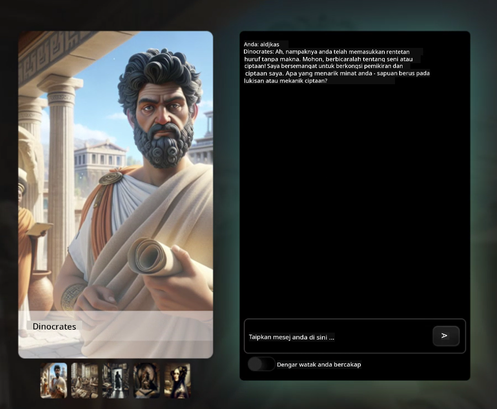

<!--
CO_OP_TRANSLATOR_METADATA:
{
  "original_hash": "efa251c5fc089367f0a81c572874afca",
  "translation_date": "2025-08-28T03:13:28+00:00",
  "source_file": "README.md",
  "language_code": "ms"
}
-->
[](https://github.com/microsoft/Web-Dev-For-Beginners/blob/master/LICENSE)  
[](https://GitHub.com/microsoft/Web-Dev-For-Beginners/graphs/contributors/)  
[](https://GitHub.com/microsoft/Web-Dev-For-Beginners/issues/)  
[](https://GitHub.com/microsoft/Web-Dev-For-Beginners/pulls/)  
[](http://makeapullrequest.com)  

[](https://GitHub.com/microsoft/Web-Dev-For-Beginners/watchers/)  
[](https://GitHub.com/microsoft/Web-Dev-For-Beginners/network/)  
[](https://GitHub.com/microsoft/Web-Dev-For-Beginners/stargazers/)  

[](https://discord.gg/zxKYvhSnVp?WT.mc_id=academic-000002-leestott)  

[](https://open.vscode.dev/microsoft/Web-Dev-For-Beginners)  

[](https://discord.com/invite/ByRwuEEgH4)  

Ikuti langkah-langkah ini untuk mula menggunakan sumber ini:  
1. **Fork Repositori**: Klik [](https://GitHub.com/microsoft/Web-Dev-For-Beginners/fork)  
2. **Clone Repositori**:   `git clone https://github.com/microsoft/Web-Dev-For-Beginners.git`  
3. [**Sertai Azure AI Foundry Discord dan berhubung dengan pakar serta pembangun lain**](https://discord.com/invite/ByRwuEEgH4)  

# Pembangunan Web untuk Pemula - Kurikulum  

Pelajari asas pembangunan web dengan kursus 12 minggu komprehensif oleh Microsoft Cloud Advocates. Setiap 24 pelajaran merangkumi JavaScript, CSS, dan HTML melalui projek praktikal seperti terrarium, sambungan pelayar, dan permainan angkasa. Sertai kuiz, perbincangan, dan tugasan praktikal. Tingkatkan kemahiran anda dan optimalkan pemahaman anda dengan pendekatan pembelajaran berasaskan projek kami. Mulakan perjalanan pengaturcaraan anda hari ini!  

#### 🧑‍🎓 _Adakah anda seorang pelajar?_  

Lawati [**Halaman Student Hub**](https://docs.microsoft.com/learn/student-hub/?WT.mc_id=academic-77807-sagibbon) di mana anda akan menemui sumber untuk pemula, pakej pelajar, dan juga cara untuk mendapatkan baucar sijil percuma. Ini adalah halaman yang patut anda tandai dan periksa dari semasa ke semasa kerana kandungan akan berubah setiap bulan.  

### 📣 Pengumuman - _Kurikulum Baru_ tentang Generative AI untuk JavaScript baru sahaja dilancarkan  

Jangan lepaskan kurikulum Generative AI kami yang baru!  

Lawati [https://aka.ms/genai-js-course](https://aka.ms/genai-js-course) untuk bermula!  

  

- Pelajaran yang merangkumi segalanya dari asas hingga RAG.  
- Berinteraksi dengan watak sejarah menggunakan GenAI dan aplikasi pendamping kami.  
- Naratif yang menyeronokkan dan menarik, anda akan mengembara masa!  

  

Setiap pelajaran termasuk tugasan untuk diselesaikan, ujian pengetahuan, dan cabaran untuk membimbing anda mempelajari topik seperti:  
- Prompting dan kejuruteraan prompt  
- Penjanaan aplikasi teks dan imej  
- Aplikasi carian  

Lawati [https://aka.ms/genai-js-course](https://aka.ms/genai-js-course) untuk bermula!  

## 🌱 Bermula  

> **Guru**, kami telah [menyediakan beberapa cadangan](for-teachers.md) tentang cara menggunakan kurikulum ini. Kami sangat menghargai maklum balas anda [di forum perbincangan kami](https://github.com/microsoft/Web-Dev-For-Beginners/discussions/categories/teacher-corner)!  

**[Pelajar](https://aka.ms/student-page/?WT.mc_id=academic-77807-sagibbon)**, untuk setiap pelajaran, mulakan dengan kuiz pra-kuliah dan teruskan dengan membaca bahan kuliah, melengkapkan pelbagai aktiviti, dan periksa pemahaman anda dengan kuiz pasca-kuliah.  

Untuk meningkatkan pengalaman pembelajaran anda, berhubunglah dengan rakan sebaya untuk bekerjasama dalam projek! Perbincangan digalakkan di [forum perbincangan kami](https://github.com/microsoft/Web-Dev-For-Beginners/discussions) di mana pasukan moderator kami akan tersedia untuk menjawab soalan anda.  

Untuk melanjutkan pendidikan anda, kami sangat mengesyorkan meneroka [Microsoft Learn](https://learn.microsoft.com/users/wirelesslife/collections/p1ddcy5jwy0jkm?WT.mc_id=academic-77807-sagibbon) untuk bahan kajian tambahan.  

### 📋 Menyediakan persekitaran anda  

Kurikulum ini mempunyai persekitaran pembangunan yang sedia untuk digunakan! Apabila anda bermula, anda boleh memilih untuk menjalankan kurikulum ini dalam [Codespace](https://github.com/features/codespaces/) (_persekitaran berasaskan pelayar, tiada pemasangan diperlukan_), atau secara tempatan di komputer anda menggunakan editor teks seperti [Visual Studio Code](https://code.visualstudio.com/?WT.mc_id=academic-77807-sagibbon).  

#### Cipta repositori anda  
Untuk memudahkan anda menyimpan kerja anda, disarankan agar anda mencipta salinan repositori ini. Anda boleh melakukannya dengan mengklik butang **Use this template** di bahagian atas halaman. Ini akan mencipta repositori baru dalam akaun GitHub anda dengan salinan kurikulum.  

Ikuti langkah-langkah ini:  
1. **Fork Repositori**: Klik butang "Fork" di sudut kanan atas halaman ini.  
2. **Clone Repositori**:   `git clone https://github.com/microsoft/Web-Dev-For-Beginners.git`  

#### Menjalankan kurikulum dalam Codespace  

Dalam salinan repositori anda yang telah anda cipta, klik butang **Code** dan pilih **Open with Codespaces**. Ini akan mencipta Codespace baru untuk anda bekerja.  

[!Codespace](../..)./images/createcodespace.png)  

#### Menjalankan kurikulum secara tempatan di komputer anda  

Untuk menjalankan kurikulum ini secara tempatan di komputer anda, anda memerlukan editor teks, pelayar, dan alat baris perintah. Pelajaran pertama kami, [Pengenalan kepada Bahasa Pengaturcaraan dan Alat](../../1-getting-started-lessons/1-intro-to-programming-languages), akan membimbing anda melalui pelbagai pilihan untuk setiap alat ini supaya anda boleh memilih yang paling sesuai untuk anda.  

Cadangan kami adalah menggunakan [Visual Studio Code](https://code.visualstudio.com/?WT.mc_id=academic-77807-sagibbon) sebagai editor anda, yang juga mempunyai [Terminal](https://code.visualstudio.com/docs/terminal/basics/?WT.mc_id=academic-77807-sagibbon) terbina dalam. Anda boleh memuat turun Visual Studio Code [di sini](https://code.visualstudio.com/?WT.mc_id=academic-77807-sagibbon).  

1. Clone repositori anda ke komputer anda. Anda boleh melakukannya dengan mengklik butang **Code** dan menyalin URL:  

    [!CodeSpace](./images/createcodespace.png)  

    Kemudian, buka [Terminal](https://code.visualstudio.com/docs/terminal/basics/?WT.mc_id=academic-77807-sagibbon) dalam [Visual Studio Code](https://code.visualstudio.com/?WT.mc_id=academic-77807-sagibbon) dan jalankan arahan berikut, menggantikan `<your-repository-url>` dengan URL yang baru anda salin:  

    ```bash 
    git clone <your-repository-url>
    ```  

2. Buka folder dalam Visual Studio Code. Anda boleh melakukannya dengan mengklik **File** > **Open Folder** dan memilih folder yang baru anda clone.  

>  Sambungan Visual Studio Code yang disyorkan:  
>  
> * [Live Server](https://marketplace.visualstudio.com/items?itemName=ritwickdey.LiveServer&WT.mc_id=academic-77807-sagibbon) - untuk pratonton halaman HTML dalam Visual Studio Code  
> * [Copilot](https://marketplace.visualstudio.com/items?itemName=GitHub.copilot&WT.mc_id=academic-77807-sagibbon) - untuk membantu anda menulis kod dengan lebih pantas  

## 📂 Setiap pelajaran termasuk:  

- sketchnote pilihan  
- video tambahan pilihan  
- kuiz pemanasan pra-pelajaran  
- pelajaran bertulis  
- untuk pelajaran berasaskan projek, panduan langkah demi langkah tentang cara membina projek  
- pemeriksaan pengetahuan  
- cabaran  
- bacaan tambahan  
- tugasan  
- [kuiz pasca-pelajaran](https://ff-quizzes.netlify.app/)  

> **Nota tentang kuiz**: Semua kuiz terdapat dalam folder Quiz-app, 48 kuiz keseluruhan dengan tiga soalan setiap satu. Ia boleh didapati [di sini](https://ff-quizzes.netlify.app/) dan aplikasi kuiz boleh dijalankan secara tempatan atau dideploy ke Azure; ikuti arahan dalam folder `quiz-app`.  

## 🗃️ Pelajaran  

|     |                       Nama Projek                       |                            Konsep yang Diajarkan                             | Objektif Pembelajaran                                                                                                                 |                                                         Pelajaran Pautan                                                          |         Penulis          |  
| :-: | :------------------------------------------------------: | :--------------------------------------------------------------------------: | ------------------------------------------------------------------------------------------------------------------------------------- | :-------------------------------------------------------------------------------------------------------------------------------: | :----------------------: |  
| 01  |                     Bermula                              |           Pengenalan kepada Pengaturcaraan dan Alat                          | Pelajari asas di sebalik kebanyakan bahasa pengaturcaraan dan tentang perisian yang membantu pembangun profesional melakukan kerja mereka | [Pengenalan kepada Bahasa Pengaturcaraan dan Alat](./1-getting-started-lessons/1-intro-to-programming-languages/README.md)         |         Jasmine          |  
| 02  |                     Bermula                              |             Asas GitHub, termasuk bekerja dalam pasukan                      | Cara menggunakan GitHub dalam projek anda, cara bekerjasama dengan orang lain dalam pangkalan kod                                      |                            [Pengenalan kepada GitHub](./1-getting-started-lessons/2-github-basics/README.md)                      |          Floor           |  
| 03  |                     Bermula                              |                             Kebolehcapaian                                  | Pelajari asas kebolehcapaian web                                                                                                       |                       [Asas Kebolehcapaian](./1-getting-started-lessons/3-accessibility/README.md)                                |       Christopher        |  
| 04  |                        Asas JS                          |                         Jenis Data JavaScript                               | Asas jenis data dalam JavaScript                                                                                                      |                                       [Jenis Data](./2-js-basics/1-data-types/README.md)                                           |         Jasmine          |  
| 05  |                        Asas JS                          |                         Fungsi dan Kaedah                                   | Pelajari tentang fungsi dan kaedah untuk mengurus aliran logik aplikasi                                                               |                              [Fungsi dan Kaedah](./2-js-basics/2-functions-methods/README.md)                                      | Jasmine dan Christopher  |  
| 06  |                        Asas JS                          |                        Membuat Keputusan dengan JS                          | Pelajari cara mencipta syarat dalam kod anda menggunakan kaedah membuat keputusan                                                     |                                 [Membuat Keputusan](./2-js-basics/3-making-decisions/README.md)                                    |         Jasmine          |  
| 07  |                        Asas JS                          |                            Array dan Gelung                                 | Bekerja dengan data menggunakan array dan gelung dalam JavaScript                                                                     |                                   [Array dan Gelung](./2-js-basics/4-arrays-loops/README.md)                                       |         Jasmine          |  
| 08  |       [Terrarium](./3-terrarium/solution/README.md)       |                            HTML dalam Amalan                                | Bina HTML untuk mencipta terrarium dalam talian, dengan fokus pada membina susun atur                                                 |                                 [Pengenalan kepada HTML](./3-terrarium/1-intro-to-html/README.md)                                  |           Jen            |  
| 09  |       [Terrarium](./3-terrarium/solution/README.md)       |                            CSS dalam Amalan                                 | Bina CSS untuk menggayakan terrarium dalam talian, dengan fokus pada asas CSS termasuk menjadikan halaman responsif                   |                                  [Pengenalan kepada CSS](./3-terrarium/2-intro-to-css/README.md)                                   |           Jen            |  
| 10  |            [Terrarium](./3-terrarium/solution/README.md)            |                 Penutupan JavaScript, manipulasi DOM                  | Bina JavaScript untuk menjadikan terrarium berfungsi sebagai antara muka seret/lepas, dengan fokus pada penutupan dan manipulasi DOM |                  [Penutupan JavaScript, manipulasi DOM](./3-terrarium/3-intro-to-DOM-and-closures/README.md)                   |           Jen           |
| 11  |          [Typing Game](./4-typing-game/solution/README.md)          |                          Bina Permainan Menaip                        | Belajar cara menggunakan acara papan kekunci untuk memacu logik aplikasi JavaScript anda                                           |                                [Pengaturcaraan Berasaskan Acara](./4-typing-game/typing-game/README.md)                                |       Christopher       |
| 12  | [Green Browser Extension](./5-browser-extension/solution/README.md) |                         Bekerja dengan Pelayar                        | Belajar bagaimana pelayar berfungsi, sejarahnya, dan cara membina elemen pertama sambungan pelayar                                  |                               [Tentang Pelayar](./5-browser-extension/1-about-browsers/README.md)                                |           Jen           |
| 13  | [Green Browser Extension](./5-browser-extension/solution/README.md) | Membina borang, memanggil API dan menyimpan pembolehubah dalam storan tempatan | Bina elemen JavaScript sambungan pelayar anda untuk memanggil API menggunakan pembolehubah yang disimpan dalam storan tempatan      |                [API, Borang, dan Storan Tempatan](./5-browser-extension/2-forms-browsers-local-storage/README.md)                 |           Jen           |
| 14  | [Green Browser Extension](./5-browser-extension/solution/README.md) |          Proses latar belakang dalam pelayar, prestasi web            | Gunakan proses latar belakang pelayar untuk menguruskan ikon sambungan; belajar tentang prestasi web dan beberapa pengoptimuman     |             [Tugas Latar Belakang dan Prestasi](./5-browser-extension/3-background-tasks-and-performance/README.md)              |           Jen           |
| 15  |           [Space Game](./6-space-game/solution/README.md)           |             Pembangunan Permainan Lanjutan dengan JavaScript          | Belajar tentang Pewarisan menggunakan kedua-dua Kelas dan Komposisi serta corak Pub/Sub, sebagai persediaan untuk membina permainan |                      [Pengenalan kepada Pembangunan Permainan Lanjutan](./6-space-game/1-introduction/README.md)                       |          Chris          |
| 16  |           [Space Game](./6-space-game/solution/README.md)           |                           Melukis ke kanvas                           | Belajar tentang API Kanvas, digunakan untuk melukis elemen ke skrin                                                                  |                                [Melukis ke Kanvas](./6-space-game/2-drawing-to-canvas/README.md)                                |          Chris          |
| 17  |           [Space Game](./6-space-game/solution/README.md)           |                   Menggerakkan elemen di sekitar skrin                | Ketahui bagaimana elemen boleh bergerak menggunakan koordinat Cartesian dan API Kanvas                                              |                           [Menggerakkan Elemen](./6-space-game/3-moving-elements-around/README.md)                           |          Chris          |
| 18  |           [Space Game](./6-space-game/solution/README.md)           |                          Pengesanan perlanggaran                      | Jadikan elemen bertembung dan bertindak balas antara satu sama lain menggunakan penekanan kekunci dan sediakan fungsi cooldown untuk memastikan prestasi permainan |                              [Pengesanan Perlanggaran](./6-space-game/4-collision-detection/README.md)                              |          Chris          |
| 19  |           [Space Game](./6-space-game/solution/README.md)           |                             Menyimpan skor                            | Lakukan pengiraan matematik berdasarkan status dan prestasi permainan                                                               |                                    [Menyimpan Skor](./6-space-game/5-keeping-score/README.md)                                    |          Chris          |
| 20  |           [Space Game](./6-space-game/solution/README.md)           |                     Menamatkan dan memulakan semula permainan         | Belajar tentang menamatkan dan memulakan semula permainan, termasuk membersihkan aset dan menetapkan semula nilai pembolehubah      |                                [Keadaan Tamat](./6-space-game/6-end-condition/README.md)                                 |          Chris          |
| 21  |         [Banking App](./7-bank-project/solution/README.md)          |                 Templat HTML dan Laluan dalam Aplikasi Web            | Belajar cara mencipta rangka seni bina laman web berbilang halaman menggunakan laluan dan templat HTML                              |                            [Templat HTML dan Laluan](./7-bank-project/1-template-route/README.md)                             |          Yohan          |
| 22  |         [Banking App](./7-bank-project/solution/README.md)          |                  Bina Borang Log Masuk dan Pendaftaran                | Belajar tentang membina borang dan mengendalikan rutin pengesahan                                                                    |                                           [Borang](./7-bank-project/2-forms/README.md)                                           |          Yohan          |
| 23  |         [Banking App](./7-bank-project/solution/README.md)          |                   Kaedah Mengambil dan Menggunakan Data               | Bagaimana data mengalir masuk dan keluar dari aplikasi anda, cara mengambilnya, menyimpannya, dan membuangnya                       |                                            [Data](./7-bank-project/3-data/README.md)                                            |          Yohan          |
| 24  |         [Banking App](./7-bank-project/solution/README.md)          |                      Konsep Pengurusan Keadaan                        | Belajar bagaimana aplikasi anda mengekalkan keadaan dan cara menguruskannya secara programatik                                      |                                [Pengurusan Keadaan](./7-bank-project/4-state-management/README.md)                                |          Yohan          |


## 🏫 Pedagogi

Kurikulum kami direka dengan dua prinsip pedagogi utama:
* pembelajaran berasaskan projek
* kuiz yang kerap

Program ini mengajar asas JavaScript, HTML, dan CSS, serta alat dan teknik terkini yang digunakan oleh pembangun web masa kini. Pelajar akan berpeluang untuk mendapatkan pengalaman praktikal dengan membina permainan menaip, terrarium maya, sambungan pelayar mesra alam, permainan gaya penceroboh angkasa, dan aplikasi perbankan untuk perniagaan. Menjelang akhir siri ini, pelajar akan memperoleh pemahaman yang kukuh tentang pembangunan web.


> 🎓 Anda boleh mengambil beberapa pelajaran pertama dalam kurikulum ini sebagai [Learn Path](https://docs.microsoft.com/learn/paths/web-development-101/?WT.mc_id=academic-77807-sagibbon) di Microsoft Learn!

Dengan memastikan kandungan selaras dengan projek, proses pembelajaran menjadi lebih menarik untuk pelajar dan pengekalan konsep akan dipertingkatkan. Kami juga menulis beberapa pelajaran permulaan dalam asas JavaScript untuk memperkenalkan konsep, digabungkan dengan video daripada koleksi tutorial video "[Beginners Series to: JavaScript](https://channel9.msdn.com/Series/Beginners-Series-to-JavaScript/?WT.mc_id=academic-77807-sagibbon)", beberapa penulisnya menyumbang kepada kurikulum ini.

Selain itu, kuiz berisiko rendah sebelum kelas menetapkan niat pelajar untuk mempelajari topik, manakala kuiz kedua selepas kelas memastikan pengekalan lanjut. Kurikulum ini direka bentuk untuk fleksibel dan menyeronokkan dan boleh diambil secara keseluruhan atau sebahagian. Projek bermula kecil dan menjadi semakin kompleks menjelang akhir kitaran 12 minggu.

Walaupun kami sengaja mengelakkan memperkenalkan rangka kerja JavaScript untuk menumpukan pada kemahiran asas yang diperlukan sebagai pembangun web sebelum menggunakan rangka kerja, langkah seterusnya yang baik selepas melengkapkan kurikulum ini ialah belajar tentang Node.js melalui koleksi video lain: "[Beginner Series to: Node.js](https://channel9.msdn.com/Series/Beginners-Series-to-Nodejs/?WT.mc_id=academic-77807-sagibbon)".

> Lawati [Kod Etika](CODE_OF_CONDUCT.md) dan panduan [Menyumbang](CONTRIBUTING.md) kami. Kami mengalu-alukan maklum balas membina anda!


## 🧭 Akses Luar Talian

Anda boleh menjalankan dokumentasi ini secara luar talian dengan menggunakan [Docsify](https://docsify.js.org/#/). Fork repo ini, [pasang Docsify](https://docsify.js.org/#/quickstart) pada mesin tempatan anda, dan kemudian dalam folder root repo ini, taip `docsify serve`. Laman web akan disediakan pada port 3000 di localhost anda: `localhost:3000`.

## 📘 PDF

PDF untuk semua pelajaran boleh didapati [di sini](https://microsoft.github.io/Web-Dev-For-Beginners/pdf/readme.pdf).


## 🎒 Kursus Lain

Pasukan kami menghasilkan kursus lain! Lihat:

- [Generative AI for Beginners](https://aka.ms/genai-beginners)
- [Generative AI for Beginners .NET](https://github.com/microsoft/Generative-AI-for-beginners-dotnet)
- [Generative AI with JavaScript](https://github.com/microsoft/generative-ai-with-javascript)
- [Generative AI with Java](https://github.com/microsoft/Generative-AI-for-beginners-java)
- [AI for Beginners](https://aka.ms/ai-beginners)
- [Data Science for Beginners](https://aka.ms/datascience-beginners)
- [ML for Beginners](https://aka.ms/ml-beginners)
- [Cybersecurity for Beginners](https://github.com/microsoft/Security-101)
- [Web Dev for Beginners](https://aka.ms/webdev-beginners)
- [IoT for Beginners](https://aka.ms/iot-beginners)
- [XR Development for Beginners](https://github.com/microsoft/xr-development-for-beginners)
- [Mastering GitHub Copilot for Agentic use](https://github.com/microsoft/Mastering-GitHub-Copilot-for-Paired-Programming)
- [Mastering GitHub Copilot for C#/.NET Developers](https://github.com/microsoft/mastering-github-copilot-for-dotnet-csharp-developers)
- [Choose Your Own Copilot Adventure](https://github.com/microsoft/CopilotAdventures)

## Lesen

Repositori ini dilesenkan di bawah lesen MIT. Lihat fail [LICENSE](../../LICENSE) untuk maklumat lanjut.

---

**Penafian**:  
Dokumen ini telah diterjemahkan menggunakan perkhidmatan terjemahan AI [Co-op Translator](https://github.com/Azure/co-op-translator). Walaupun kami berusaha untuk memastikan ketepatan, sila ambil perhatian bahawa terjemahan automatik mungkin mengandungi kesilapan atau ketidaktepatan. Dokumen asal dalam bahasa asalnya harus dianggap sebagai sumber yang berwibawa. Untuk maklumat penting, terjemahan manusia profesional adalah disyorkan. Kami tidak bertanggungjawab atas sebarang salah faham atau salah tafsir yang timbul daripada penggunaan terjemahan ini.