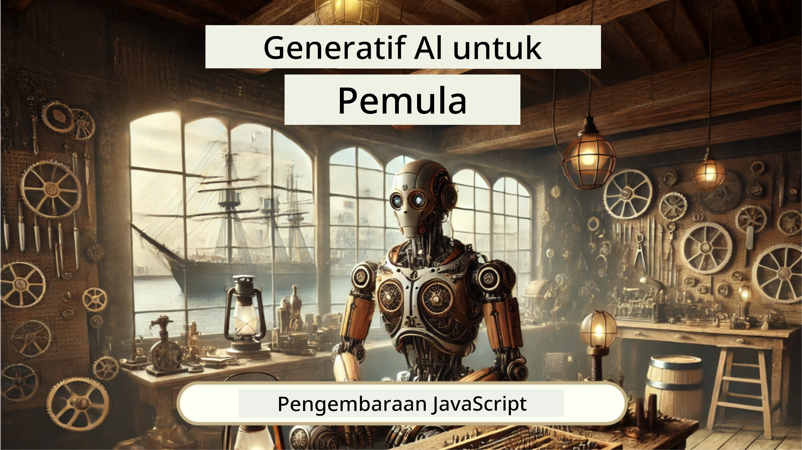
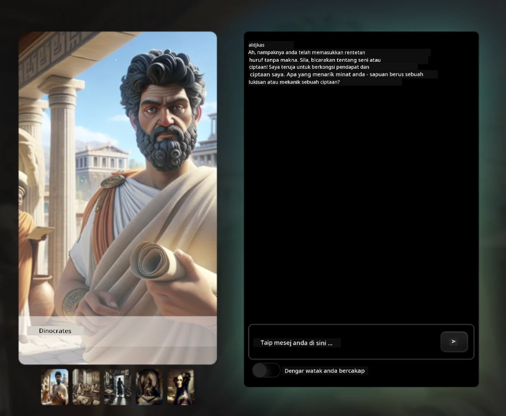
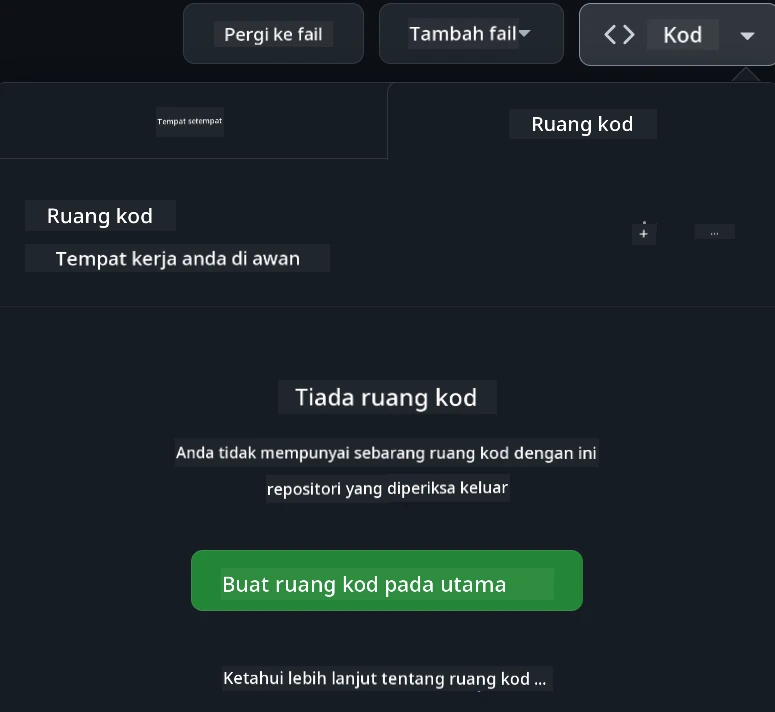

[](https://github.com/microsoft/Web-Dev-For-Beginners/blob/master/LICENSE)
[](https://GitHub.com/microsoft/Web-Dev-For-Beginners/graphs/contributors/)
[](https://GitHub.com/microsoft/Web-Dev-For-Beginners/issues/)
[](https://GitHub.com/microsoft/Web-Dev-For-Beginners/pulls/)
[](http://makeapullrequest.com) 

[](https://GitHub.com/microsoft/Web-Dev-For-Beginners/watchers/)
[](https://GitHub.com/microsoft/Web-Dev-For-Beginners/network/)
[](https://GitHub.com/microsoft/Web-Dev-For-Beginners/stargazers/)

[](https://discord.gg/nTYy5BXMWG)

# Pembangunan Web untuk Pemula - Kurikulum

Pelajari asas-asas pembangunan web dengan kursus komprehensif 12-minggu oleh Microsoft Cloud Advocates. Setiap 24 pelajaran menyelami JavaScript, CSS, dan HTML melalui projek praktikal seperti terrarium, sambungan pelayar, dan permainan angkasa lepas. Sertai kuiz, perbincangan, dan tugasan praktikal. Tingkatkan kemahiran anda dan optimalkan penyerapan pengetahuan dengan pedagogi berasaskan projek kami yang efektif. Mula perjalanan pengkodan anda hari ini!

Sertai Komuniti Discord Azure AI Foundry

[](https://discord.gg/nTYy5BXMWG)

Ikuti langkah-langkah berikut untuk bermula menggunakan sumber ini:
1. **Fork Repositori**: Klik [](https://GitHub.com/microsoft/Web-Dev-For-Beginners/fork)
2. **Klon Repositori**:   `git clone https://github.com/microsoft/Web-Dev-For-Beginners.git`
3. [**Sertai Discord Azure AI Foundry dan jumpa pakar serta pembangun lain**](https://discord.com/invite/ByRwuEEgH4)

### 🌐 Sokongan Pelbagai Bahasa

#### Disokong melalui GitHub Action (Automatik & Sentiasa Terkini)

<!-- CO-OP TRANSLATOR LANGUAGES TABLE START -->
[Arabic](../ar/README.md) | [Bengali](../bn/README.md) | [Bulgarian](../bg/README.md) | [Burmese (Myanmar)](../my/README.md) | [Chinese (Simplified)](../zh-CN/README.md) | [Chinese (Traditional, Hong Kong)](../zh-HK/README.md) | [Chinese (Traditional, Macau)](../zh-MO/README.md) | [Chinese (Traditional, Taiwan)](../zh-TW/README.md) | [Croatian](../hr/README.md) | [Czech](../cs/README.md) | [Danish](../da/README.md) | [Dutch](../nl/README.md) | [Estonian](../et/README.md) | [Finnish](../fi/README.md) | [French](../fr/README.md) | [German](../de/README.md) | [Greek](../el/README.md) | [Hebrew](../he/README.md) | [Hindi](../hi/README.md) | [Hungarian](../hu/README.md) | [Indonesian](../id/README.md) | [Italian](../it/README.md) | [Japanese](../ja/README.md) | [Kannada](../kn/README.md) | [Korean](../ko/README.md) | [Lithuanian](../lt/README.md) | [Malay](./README.md) | [Malayalam](../ml/README.md) | [Marathi](../mr/README.md) | [Nepali](../ne/README.md) | [Nigerian Pidgin](../pcm/README.md) | [Norwegian](../no/README.md) | [Persian (Farsi)](../fa/README.md) | [Polish](../pl/README.md) | [Portuguese (Brazil)](../pt-BR/README.md) | [Portuguese (Portugal)](../pt-PT/README.md) | [Punjabi (Gurmukhi)](../pa/README.md) | [Romanian](../ro/README.md) | [Russian](../ru/README.md) | [Serbian (Cyrillic)](../sr/README.md) | [Slovak](../sk/README.md) | [Slovenian](../sl/README.md) | [Spanish](../es/README.md) | [Swahili](../sw/README.md) | [Swedish](../sv/README.md) | [Tagalog (Filipino)](../tl/README.md) | [Tamil](../ta/README.md) | [Telugu](../te/README.md) | [Thai](../th/README.md) | [Turkish](../tr/README.md) | [Ukrainian](../uk/README.md) | [Urdu](../ur/README.md) | [Vietnamese](../vi/README.md)

> **Lebih suka Klon Secara Tempatan?**
>
> Repositori ini termasuk lebih 50+ terjemahan bahasa yang secara signifikan meningkatkan saiz muat turun. Untuk klon tanpa terjemahan, gunakan sparse checkout:
>
> **Bash / macOS / Linux:**
> ```bash
> git clone --filter=blob:none --sparse https://github.com/microsoft/Web-Dev-For-Beginners.git
> cd Web-Dev-For-Beginners
> git sparse-checkout set --no-cone '/*' '!translations' '!translated_images'
> ```
>
> **CMD (Windows):**
> ```cmd
> git clone --filter=blob:none --sparse https://github.com/microsoft/Web-Dev-For-Beginners.git
> cd Web-Dev-For-Beginners
> git sparse-checkout set --no-cone "/*" "!translations" "!translated_images"
> ```
>
> Ini memberikan anda segala yang anda perlukan untuk menyelesaikan kursus dengan muat turun yang jauh lebih pantas.
<!-- CO-OP TRANSLATOR LANGUAGES TABLE END -->

**Jika anda ingin menambah bahasa terjemahan tambahan yang disokong disenaraikan [di sini](https://github.com/Azure/co-op-translator/blob/main/getting_started/supported-languages.md)**

[](https://open.vscode.dev/microsoft/Web-Dev-For-Beginners)

#### 🧑‍🎓 _Adakah anda seorang pelajar?_

Lawati [**halaman Student Hub**](https://docs.microsoft.com/learn/student-hub/?WT.mc_id=academic-77807-sagibbon) di mana anda akan menemui sumber pemula, pek Pelajar dan juga cara untuk mendapatkan baucar sijil percuma. Ini adalah halaman yang anda patut tandakan dan semak dari semasa ke semasa kerana kandungan akan ditukar setiap bulan.

### 📣 Pengumuman - Cabaran mod Agen GitHub Copilot baru untuk diselesaikan!

Cabaran Baru ditambah, cari "GitHub Copilot Agent Challenge 🚀" dalam kebanyakan bab. Itu adalah cabaran baru untuk anda selesaikan menggunakan GitHub Copilot dan mod Agen. Jika anda belum pernah menggunakan mod Agen, ia bukan sahaja mampu menjana teks tetapi juga boleh mencipta dan menyunting fail, menjalankan arahan dan banyak lagi.

### 📣 Pengumuman - _Projek Baru untuk dibina menggunakan Generative AI_ 

Projek Pembantu AI baru telah ditambah, semak [projek](./9-chat-project/README.md)

### 📣 Pengumuman - _Kurikulum Baru_ mengenai Generative AI untuk JavaScript baru sahaja dikeluarkan

Jangan terlepas kurikulum Generative AI baru kami!

Lawati [https://aka.ms/genai-js-course](https://aka.ms/genai-js-course) untuk bermula!



- Pelajaran merangkumi segala-galanya dari asas hingga RAG.
- Berinteraksi dengan watak sejarah menggunakan GenAI dan aplikasi pendamping kami.
- Naratif yang menyeronokkan dan menarik, anda akan 'mengembara masa'!



Setiap pelajaran termasuk tugasan untuk diselesaikan, pemeriksaan pengetahuan dan cabaran untuk membimbing anda mempelajari topik seperti:
- Prompting dan kejuruteraan prompt
- Penjanaan aplikasi teks dan imej
- Aplikasi pencarian

Lawati [https://aka.ms/genai-js-course](https://aka.ms/genai-js-course) untuk bermula!

## 🌱 Memulakan

> **Guru-guru**, kami telah [sertakan beberapa cadangan](for-teachers.md) tentang cara menggunakan kurikulum ini. Kami sangat mengalu-alukan maklum balas anda [di forum perbincangan kami](https://github.com/microsoft/Web-Dev-For-Beginners/discussions/categories/teacher-corner)!

**[Pelajar](https://aka.ms/student-page/?WT.mc_id=academic-77807-sagibbon)**, untuk setiap pelajaran, mulakan dengan kuiz pra-ceramah dan teruskan dengan membaca bahan ceramah, melengkapkan pelbagai aktiviti dan periksa kefahaman anda dengan kuiz pasca-ceramah.

Untuk meningkatkan pengalaman pembelajaran anda, berhubung dengan rakan sekelas untuk bekerjasama dalam projek bersama! Perbincangan digalakkan di [forum perbincangan kami](https://github.com/microsoft/Web-Dev-For-Beginners/discussions) di mana pasukan moderator kami akan tersedia untuk menjawab soalan anda.

Untuk melanjutkan pendidikan anda, kami sangat mengesyorkan meneroka [Microsoft Learn](https://learn.microsoft.com/users/wirelesslife/collections/p1ddcy5jwy0jkm?WT.mc_id=academic-77807-sagibbon) bagi bahan pembelajaran tambahan.

### 📋 Menyediakan persekitaran anda

Kurikulum ini telah menyediakan persekitaran pembangunan siap sedia! Apabila anda bermula anda boleh memilih untuk menjalankan kurikulum dalam [Codespace](https://github.com/features/codespaces/) (_persekitaran berasaskan pelayar tanpa perlu pasang apa-apa_), atau secara tempatan pada komputer anda menggunakan penyunting teks seperti [Visual Studio Code](https://code.visualstudio.com/?WT.mc_id=academic-77807-sagibbon).

#### Cipta repositori anda
Untuk memudahkan anda menyimpan kerja anda, disyorkan anda mencipta salinan anda sendiri repositori ini. Anda boleh lakukan ini dengan mengklik butang **Use this template** di atas halaman ini. Ini akan mencipta repositori baru dalam akaun GitHub anda dengan salinan kurikulum.

Ikuti langkah berikut:
1. **Fork Repositori**: Klik pada butang "Fork" di sudut atas-kanan halaman ini.
2. **Klon Repositori**:   `git clone https://github.com/microsoft/Web-Dev-For-Beginners.git`

#### Menjalankan kurikulum dalam Codespace

Dalam salinan repositori ini yang anda cipta, klik butang **Code** dan pilih **Open with Codespaces**. Ini akan mencipta Codespace baru untuk anda bekerja.



#### Menjalankan kurikulum secara tempatan pada komputer anda

Untuk menjalankan kurikulum ini secara tempatan pada komputer anda, anda memerlukan penyunting teks, pelayar dan alat baris perintah. Pelajaran pertama kami, [Pengenalan kepada Bahasa Pengaturcaraan dan Alat Perdagangan](../../1-getting-started-lessons/1-intro-to-programming-languages), akan membimbing anda melalui pelbagai pilihan bagi setiap alat ini supaya anda boleh pilih yang paling sesuai.

Cadangan kami adalah untuk menggunakan [Visual Studio Code](https://code.visualstudio.com/?WT.mc_id=academic-77807-sagibbon) sebagai penyunting anda, yang juga mempunyai [Terminal](https://code.visualstudio.com/docs/terminal/basics/?WT.mc_id=academic-77807-sagibbon) terbina dalam. Anda boleh muat turun Visual Studio Code [di sini](https://code.visualstudio.com/?WT.mc_id=academic-77807-sagibbon).
1. Klon repositori anda ke komputer anda. Anda boleh melakukannya dengan mengklik butang **Code** dan menyalin URL:

    [CodeSpace](./images/createcodespace.png)

    Kemudian, buka [Terminal](https://code.visualstudio.com/docs/terminal/basics/?WT.mc_id=academic-77807-sagibbon) dalam [Visual Studio Code](https://code.visualstudio.com/?WT.mc_id=academic-77807-sagibbon) dan jalankan arahan berikut, menggantikan `<your-repository-url>` dengan URL yang baru anda salin:

    ```bash 
    git clone <your-repository-url>
    ```

2. Buka folder tersebut dalam Visual Studio Code. Anda boleh melakukannya dengan mengklik **File** > **Open Folder** dan memilih folder yang baru sahaja anda klon.

>  Sambungan Visual Studio Code yang disyorkan:
>
> * [Live Server](https://marketplace.visualstudio.com/items?itemName=ritwickdey.LiveServer&WT.mc_id=academic-77807-sagibbon) - untuk pratonton halaman HTML dalam Visual Studio Code
> * [Copilot](https://marketplace.visualstudio.com/items?itemName=GitHub.copilot&WT.mc_id=academic-77807-sagibbon) - untuk membantu anda menulis kod dengan lebih pantas

## 📂 Setiap pelajaran merangkumi:

- sketchnote pilihan
- video tambahan pilihan
- kuiz pemanasan sebelum pelajaran
- pelajaran bertulis
- untuk pelajaran berasaskan projek, panduan langkah demi langkah tentang cara membina projek
- semakan pengetahuan
- cabaran
- bacaan tambahan
- tugasan
- [kuiz selepas pelajaran](https://ff-quizzes.netlify.app/web/)

> **Nota tentang kuiz**: Semua kuiz terkandung dalam folder Quiz-app, 48 kuiz keseluruhan dengan tiga soalan setiap satu. Ia tersedia [di sini](https://ff-quizzes.netlify.app/web/). aplikasi kuiz boleh dijalankan secara tempatan atau dipasang di Azure; ikut arahan dalam folder `quiz-app`.

## 🗃️ Pelajaran

|     |                       Nama Projek                       |                            Konsep yang Diajarkan                             | Objektif Pembelajaran                                                                                                                 |                                                         Pelajaran Berkaitan                                                          |         Pengarang          |
| :-: | :------------------------------------------------------: | :--------------------------------------------------------------------: | ----------------------------------------------------------------------------------------------------------------------------------- | :----------------------------------------------------------------------------------------------------------------------------: | :---------------------: |
| 01  |                     Memulakan                          |           Pengenalan kepada Pengaturcaraan dan Alat Perdagangan           | Pelajari asas berdasarkan kebanyakan bahasa pengaturcaraan dan tentang perisian yang membantu pembangun profesional melakukan kerja mereka | [Pengenalan kepada Bahasa Pengaturcaraan dan Alat Perdagangan](./1-getting-started-lessons/1-intro-to-programming-languages/README.md) |         Jasmine         |
| 02  |                     Memulakan                          |             Asas GitHub, termasuk bekerja dalam pasukan             | Cara menggunakan GitHub dalam projek anda, cara bekerjasama dengan orang lain dalam asas kod                                                    |                            [Pengenalan kepada GitHub](./1-getting-started-lessons/2-github-basics/README.md)                             |          Floor          |
| 03  |                     Memulakan                          |                             Kebolehaksesan                              | Pelajari asas kebolehaksesan web                                                                                               |                       [Asas Kebolehaksesan](./1-getting-started-lessons/3-accessibility/README.md)                       |       Christopher       |
| 04  |                        Asas JS                         |                         Jenis Data JavaScript                          | Asas jenis data JavaScript                                                                                                 |                                       [Jenis Data](./2-js-basics/1-data-types/README.md)                                        |         Jasmine         |
| 05  |                        Asas JS                         |                         Fungsi dan Kaedah                          | Pelajari tentang fungsi dan kaedah untuk mengurus aliran logik aplikasi                                                             |                              [Fungsi dan Kaedah](./2-js-basics/2-functions-methods/README.md)                               | Jasmine dan Christopher |
| 06  |                        Asas JS                         |                        Membuat Keputusan dengan JS                        | Pelajari cara membuat syarat dalam kod anda menggunakan kaedah membuat keputusan                                                           |                                 [Membuat Keputusan](./2-js-basics/3-making-decisions/README.md)                                  |         Jasmine         |
| 07  |                        Asas JS                         |                            Tatasusunan dan Gelung                            | Bekerja dengan data menggunakan tatasusunan dan gelung dalam JavaScript                                                                                 |                                   [Tatasusunan dan Gelung](./2-js-basics/4-arrays-loops/README.md)                                    |         Jasmine         |
| 08  |       [Terrarium](./3-terrarium/solution/README.md)       |                            HTML dalam Amalan                            | Bina HTML untuk membuat terrarium dalam talian, menumpukan pada membina susun atur                                                         |                                 [Pengenalan kepada HTML](./3-terrarium/1-intro-to-html/README.md)                                 |           Jen           |
| 09  |       [Terrarium](./3-terrarium/solution/README.md)       |                            CSS dalam Amalan                             | Bina CSS untuk menyerlahkan terrarium dalam talian, menumpukan pada asas CSS termasuk membuat halaman responsif                     |                                  [Pengenalan kepada CSS](./3-terrarium/2-intro-to-css/README.md)                                  |           Jen           |
| 10  |            [Terrarium](./3-terrarium/solution/README.md)            |                 Penutupan JavaScript, manipulasi DOM                  | Bina JavaScript untuk menjadikan terrarium berfungsi sebagai antara muka seret/lepas, menumpukan pada penutupan dan manipulasi DOM             |                  [Penutupan JavaScript, manipulasi DOM](./3-terrarium/3-intro-to-DOM-and-closures/README.md)                   |           Jen           |
| 11  |          [Typing Game](./4-typing-game/solution/README.md)          |                          Bina Permainan Mengetik                           | Pelajari cara menggunakan acara papan kekunci untuk mendorong logik aplikasi JavaScript anda                                                          |                                [Pengaturcaraan Berasaskan Acara](./4-typing-game/typing-game/README.md)                                |       Christopher       |
| 12  | [Green Browser Extension](./5-browser-extension/solution/README.md) |                         Bekerja dengan Pelayar                          | Pelajari cara pelayar berfungsi, sejarahnya, dan cara membina elemen pertama pelanjutan pelayar                               |                               [Mengenai Pelayar](./5-browser-extension/1-about-browsers/README.md)                                |           Jen           |
| 13  | [Green Browser Extension](./5-browser-extension/solution/README.md) | Membina borang, memanggil API dan menyimpan pemboleh ubah dalam storan tempatan | Bina elemen JavaScript pelanjutan pelayar anda untuk memanggil API menggunakan pemboleh ubah yang disimpan dalam storan tempatan                      |                [API, Borang, dan Storan Tempatan](./5-browser-extension/2-forms-browsers-local-storage/README.md)                 |           Jen           |
| 14  | [Green Browser Extension](./5-browser-extension/solution/README.md) |          Proses latar belakang dalam pelayar, prestasi web          | Gunakan proses latar belakang pelayar untuk mengurus ikon pelanjutan; pelajari tentang prestasi web dan beberapa pengoptimuman untuk menjadikan   |             [Tugas Latar Belakang dan Prestasi](./5-browser-extension/3-background-tasks-and-performance/README.md)              |           Jen           |
| 15  |           [Space Game](./6-space-game/solution/README.md)           |             Pembangunan Permainan Lanjutan dengan JavaScript             | Pelajari tentang Warisan menggunakan kedua-dua Kelas dan Komposisi serta corak Pub/Sub, sebagai persediaan untuk membina permainan              |                      [Pengenalan kepada Pembangunan Permainan Lanjutan](./6-space-game/1-introduction/README.md)                       |          Chris          |
| 16  |           [Space Game](./6-space-game/solution/README.md)           |                           Melukis ke kanvas                            | Pelajari tentang API Kanvas, digunakan untuk melukis elemen ke skrin                                                                       |                                [Melukis ke Kanvas](./6-space-game/2-drawing-to-canvas/README.md)                                |          Chris          |
| 17  |           [Space Game](./6-space-game/solution/README.md)           |                   Menggerakkan elemen di sekeliling skrin                    | Temui bagaimana elemen boleh mendapat pergerakan menggunakan koordinat kartesian dan API Kanvas                                            |                           [Menggerakkan Elemen](./6-space-game/3-moving-elements-around/README.md)                           |          Chris          |
| 18  |           [Space Game](./6-space-game/solution/README.md)           |                          Pengesanan pertembungan                           | Membuat elemen bertembung dan bertindak balas antara satu sama lain menggunakan kekunci tekan dan menyediakan fungsi penyejukkan untuk memastikan prestasi permainan    |                              [Pengesanan Pertembungan](./6-space-game/4-collision-detection/README.md)                              |          Chris          |
| 19  |           [Space Game](./6-space-game/solution/README.md)           |                             Menjaga skor                              | Melakukan pengiraan matematik berdasarkan status dan prestasi permainan                                                                |                                    [Menjaga Skor](./6-space-game/5-keeping-score/README.md)                                    |          Chris          |
| 20  |           [Space Game](./6-space-game/solution/README.md)           |                     Menamatkan dan memulakan semula permainan                     | Pelajari tentang menamatkan dan memulakan semula permainan, termasuk membersihkan aset dan menetapkan semula nilai pemboleh ubah                              |                                [Keadaan Tamat](./6-space-game/6-end-condition/README.md)                                 |          Chris          |
| 21  |         [Banking App](./7-bank-project/solution/README.md)          |                 Templat HTML dan Laluan dalam Aplikasi Web                 | Pelajari cara membuat kerangka seni bina laman web berbilang halaman menggunakan laluan dan templat HTML                             |                            [Templat HTML dan Laluan](./7-bank-project/1-template-route/README.md)                             |          Yohan          |
| 22  |         [Banking App](./7-bank-project/solution/README.md)          |                  Bina Borang Log Masuk dan Pendaftaran                   | Pelajari tentang membina borang dan mengendalikan rutin pengesahan                                                                          |                                           [Borang](./7-bank-project/2-forms/README.md)                                           |          Yohan          |
| 23  |         [Banking App](./7-bank-project/solution/README.md)          |                   Kaedah Mendapat dan Menggunakan Data                   | Bagaimana data mengalir masuk dan keluar dari aplikasi anda, bagaimana untuk mendapatkannya, menyimpan, dan membuangnya                                                 |                                            [Data](./7-bank-project/3-data/README.md)                                            |          Yohan          |
| 24  |         [Banking App](./7-bank-project/solution/README.md)          |                      Konsep Pengurusan Keadaan                      | Pelajari bagaimana aplikasi anda mengekalkan keadaan dan bagaimana menguruskannya secara program                                                              |                                [Pengurusan Keadaan](./7-bank-project/4-state-management/README.md)                                |          Yohan          |
| 25 | [Browser/VScode Code](../../8-code-editor) | Bekerja dengan VScode | Pelajari cara menggunakan penyunting kod| [Gunakan Penyunting Kod VScode](./8-code-editor/1-using-a-code-editor/README.md) | Chris |
| 26 | [AI Assistants](./9-chat-project/README.md) | Bekerja dengan AI | Pelajari cara membina pembantu AI anda sendiri | [Projek Pembantu AI](./9-chat-project/README.md) | Chris |

## 🏫 Pedagogi

Kurikulum kami direka dengan dua prinsip pedagogi utama:
* pembelajaran berasaskan projek
* kuiz kerap

Program ini mengajarkan asas JavaScript, HTML, dan CSS, serta alat dan teknik terkini yang digunakan oleh pembangun web masa kini. Pelajar akan berpeluang mengembangkan pengalaman secara langsung dengan membina permainan menaip, terrarium maya, pelanjutan pelayar mesra alam, permainan gaya penyerang angkasa, dan aplikasi perbankan untuk perniagaan. Pada akhir siri ini, pelajar akan memperoleh pemahaman yang kukuh mengenai pembangunan web.

> 🎓 Anda boleh mengikuti beberapa pelajaran pertama dalam kurikulum ini sebagai [Jalan Pembelajaran](https://docs.microsoft.com/learn/paths/web-development-101/?WT.mc_id=academic-77807-sagibbon) di Microsoft Learn!

Dengan memastikan bahawa kandungan selaras dengan projek, proses pembelajaran menjadi lebih menarik untuk pelajar dan daya ingatan konsep akan dipertingkatkan. Kami juga menulis beberapa pelajaran permulaan dalam asas JavaScript untuk memperkenalkan konsep, dipadankan dengan video dari koleksi tutorial video "[Siri Pemula kepada: JavaScript](https://channel9.msdn.com/Series/Beginners-Series-to-JavaScript/?WT.mc_id=academic-77807-sagibbon)", yang mana beberapa pengarangnya menyumbang kepada kurikulum ini.

Selain itu, kuiz sama ada ringkas sebelum kelas menetapkan niat pelajar terhadap pembelajaran topik, sementara kuiz kedua selepas kelas memastikan pemahaman lebih lanjut. Kurikulum ini direka untuk menjadi fleksibel dan menyeronokkan serta boleh diambil secara keseluruhan atau sebahagian. Projek bermula kecil dan menjadi semakin rumit pada penghujung kitaran 12 minggu.

Walaupun kami sengaja mengelakkan pengenalan rangka kerja JavaScript untuk menumpukan pada kemahiran asas yang diperlukan sebagai pembangun web sebelum menggunakan rangka kerja, langkah seterusnya yang baik selepas melengkapkan kurikulum ini adalah mempelajari tentang Node.js melalui koleksi video lain: "[Siri Pemula kepada: Node.js](https://channel9.msdn.com/Series/Beginners-Series-to-Nodejs/?WT.mc_id=academic-77807-sagibbon)".

> Lawati [Kod Etika](CODE_OF_CONDUCT.md) dan panduan [Menyumbang](CONTRIBUTING.md) kami. Kami mengalu-alukan maklum balas membina anda!

## 🧭 Akses luar talian

Anda boleh menjalankan dokumentasi ini secara luar talian dengan menggunakan [Docsify](https://docsify.js.org/#/). Fork repo ini, [pasang Docsify](https://docsify.js.org/#/quickstart) pada mesin tempatan anda, dan kemudian di folder akar repo ini, taip `docsify serve`. Laman web akan dihidangkan pada port 3000 pada lokalhos anda: `localhost:3000`.

## 📘 PDF
PDF bagi semua pelajaran boleh didapati [di sini](https://microsoft.github.io/Web-Dev-For-Beginners/pdf/readme.pdf).


## 🎒 Kursus Lain

Pasukan kami menghasilkan kursus lain! Lihat:

<!-- CO-OP TRANSLATOR OTHER COURSES START -->
### LangChain
[](https://aka.ms/langchain4j-for-beginners)
[](https://aka.ms/langchainjs-for-beginners?WT.mc_id=m365-94501-dwahlin)
[](https://github.com/microsoft/langchain-for-beginners?WT.mc_id=m365-94501-dwahlin)
---

### Azure / Edge / MCP / Agen
[](https://github.com/microsoft/AZD-for-beginners?WT.mc_id=academic-105485-koreyst)
[](https://github.com/microsoft/edgeai-for-beginners?WT.mc_id=academic-105485-koreyst)
[](https://github.com/microsoft/mcp-for-beginners?WT.mc_id=academic-105485-koreyst)
[](https://github.com/microsoft/ai-agents-for-beginners?WT.mc_id=academic-105485-koreyst)

---
 
### Siri AI Generatif
[](https://github.com/microsoft/generative-ai-for-beginners?WT.mc_id=academic-105485-koreyst)
[-9333EA?style=for-the-badge&labelColor=E5E7EB&color=9333EA)](https://github.com/microsoft/Generative-AI-for-beginners-dotnet?WT.mc_id=academic-105485-koreyst)
[-C084FC?style=for-the-badge&labelColor=E5E7EB&color=C084FC)](https://github.com/microsoft/generative-ai-for-beginners-java?WT.mc_id=academic-105485-koreyst)
[-E879F9?style=for-the-badge&labelColor=E5E7EB&color=E879F9)](https://github.com/microsoft/generative-ai-with-javascript?WT.mc_id=academic-105485-koreyst)

---
 
### Pembelajaran Teras
[](https://aka.ms/ml-beginners?WT.mc_id=academic-105485-koreyst)
[](https://aka.ms/datascience-beginners?WT.mc_id=academic-105485-koreyst)
[](https://aka.ms/ai-beginners?WT.mc_id=academic-105485-koreyst)
[](https://github.com/microsoft/Security-101?WT.mc_id=academic-96948-sayoung)
[](https://aka.ms/webdev-beginners?WT.mc_id=academic-105485-koreyst)
[](https://aka.ms/iot-beginners?WT.mc_id=academic-105485-koreyst)
[](https://github.com/microsoft/xr-development-for-beginners?WT.mc_id=academic-105485-koreyst)

---
 
### Siri Copilot
[](https://aka.ms/GitHubCopilotAI?WT.mc_id=academic-105485-koreyst)
[](https://github.com/microsoft/mastering-github-copilot-for-dotnet-csharp-developers?WT.mc_id=academic-105485-koreyst)
[](https://github.com/microsoft/CopilotAdventures?WT.mc_id=academic-105485-koreyst)
<!-- CO-OP TRANSLATOR OTHER COURSES END -->

## Mendapatkan Bantuan

Jika anda tersekat atau mempunyai sebarang pertanyaan tentang membina aplikasi AI. Sertai pelajar lain dan pembangun berpengalaman dalam perbincangan tentang MCP. Ia adalah komuniti sokongan di mana soalan dialu-alukan dan pengetahuan dikongsi dengan bebas.

[](https://discord.gg/nTYy5BXMWG)

Jika anda mempunyai maklum balas produk atau ralat semasa membina, lawati:

[](https://aka.ms/foundry/forum)

## Lesen

Repositori ini dilesenkan di bawah lesen MIT. Lihat fail [LICENSE](../../LICENSE) untuk maklumat lanjut.

---

<!-- CO-OP TRANSLATOR DISCLAIMER START -->
**Penafian**:  
Dokumen ini telah diterjemahkan menggunakan perkhidmatan terjemahan AI [Co-op Translator](https://github.com/Azure/co-op-translator). Walaupun kami berusaha untuk ketepatan, sila ambil perhatian bahawa terjemahan automatik mungkin mengandungi kesilapan atau ketidaktepatan. Dokumen asal dalam bahasa asalnya harus dianggap sebagai sumber yang sahih. Untuk maklumat penting, terjemahan manusia profesional adalah disyorkan. Kami tidak bertanggungjawab atas sebarang salah faham atau salah tafsir yang timbul daripada penggunaan terjemahan ini.
<!-- CO-OP TRANSLATOR DISCLAIMER END -->