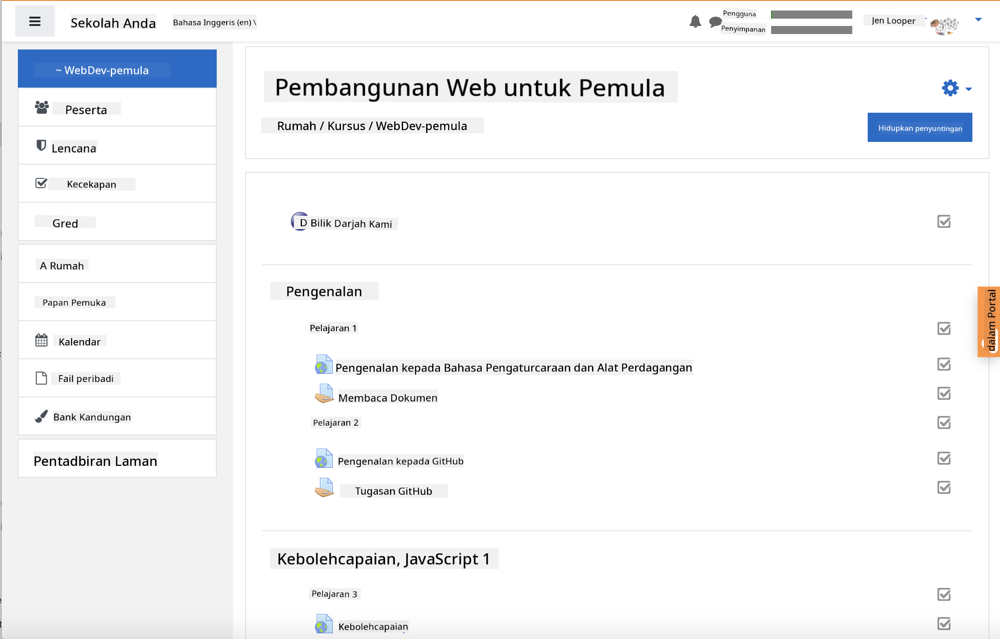
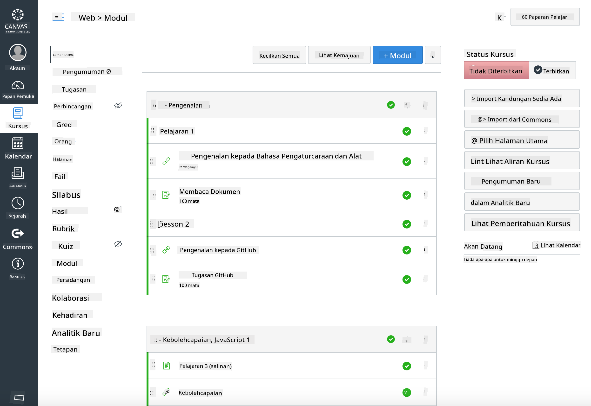

<!--
CO_OP_TRANSLATOR_METADATA:
{
  "original_hash": "75cb51f7ca9ea0b097ef4a1287e9290c",
  "translation_date": "2025-08-27T21:59:40+00:00",
  "source_file": "for-teachers.md",
  "language_code": "ms"
}
-->
## Untuk Pendidik

Adakah anda ingin menggunakan kurikulum ini di dalam kelas anda? Jangan ragu untuk menggunakannya!

Malah, anda boleh menggunakannya terus di GitHub dengan menggunakan GitHub Classroom.

Untuk melakukannya, fork repo ini. Anda perlu mencipta repo untuk setiap pelajaran, jadi anda perlu mengekstrak setiap folder ke dalam repo yang berasingan. Dengan cara ini, [GitHub Classroom](https://classroom.github.com/classrooms) boleh mengambil setiap pelajaran secara berasingan.

Arahan penuh ini [full instructions](https://github.blog/2020-03-18-set-up-your-digital-classroom-with-github-classroom/) akan memberikan anda gambaran tentang cara untuk menyediakan kelas anda.

## Menggunakannya di Moodle, Canvas atau Blackboard

Kurikulum ini berfungsi dengan baik dalam Sistem Pengurusan Pembelajaran ini! Gunakan [fail muat naik Moodle](../../../../../../../teaching-files/webdev-moodle.mbz) untuk kandungan penuh, atau cuba [fail Common Cartridge](../../../../../../../teaching-files/webdev-common-cartridge.imscc) yang mengandungi sebahagian daripada kandungan. Moodle Cloud tidak menyokong eksport penuh Common Cartridge, jadi adalah lebih baik untuk menggunakan fail muat turun Moodle yang boleh dimuat naik ke dalam Canvas. Sila maklumkan kepada kami bagaimana kami boleh memperbaiki pengalaman ini.

> Kurikulum dalam kelas Moodle

> Kurikulum dalam Canvas

## Menggunakan repo seperti sedia ada

Jika anda ingin menggunakan repo ini seperti keadaannya sekarang, tanpa menggunakan GitHub Classroom, itu juga boleh dilakukan. Anda hanya perlu berkomunikasi dengan pelajar anda tentang pelajaran mana yang perlu dipelajari bersama.

Dalam format dalam talian (Zoom, Teams, atau lain-lain), anda boleh membentuk bilik perbincangan untuk kuiz, dan membimbing pelajar untuk membantu mereka bersedia untuk belajar. Kemudian jemput pelajar ke kuiz dan serahkan jawapan mereka sebagai 'issues' pada masa tertentu. Anda juga boleh melakukan perkara yang sama dengan tugasan jika anda mahu pelajar bekerja secara kolaboratif secara terbuka.

Jika anda lebih suka format yang lebih peribadi, minta pelajar anda untuk fork kurikulum ini, pelajaran demi pelajaran, ke repo GitHub mereka sendiri sebagai repo peribadi, dan berikan anda akses. Kemudian mereka boleh melengkapkan kuiz dan tugasan secara peribadi dan menyerahkannya kepada anda melalui issues pada repo kelas anda.

Terdapat banyak cara untuk menjadikan ini berfungsi dalam format kelas dalam talian. Sila maklumkan kepada kami apa yang paling sesuai untuk anda!

## Sila berikan pendapat anda!

Kami ingin menjadikan kurikulum ini berfungsi untuk anda dan pelajar anda. Hubungi kami di [Teacher corner](https://github.com/microsoft/Web-Dev-For-Beginners/discussions/categories/teacher-corner) dan buka [**isu baru**](https://github.com/microsoft/Web-Dev-For-Beginners/issues/new/choose) untuk sebarang permintaan, pepijat, dan maklum balas.

---

**Penafian**:  
Dokumen ini telah diterjemahkan menggunakan perkhidmatan terjemahan AI [Co-op Translator](https://github.com/Azure/co-op-translator). Walaupun kami berusaha untuk memastikan ketepatan, sila ambil perhatian bahawa terjemahan automatik mungkin mengandungi kesilapan atau ketidaktepatan. Dokumen asal dalam bahasa asalnya harus dianggap sebagai sumber yang berwibawa. Untuk maklumat yang kritikal, terjemahan manusia profesional adalah disyorkan. Kami tidak bertanggungjawab atas sebarang salah faham atau salah tafsir yang timbul daripada penggunaan terjemahan ini.