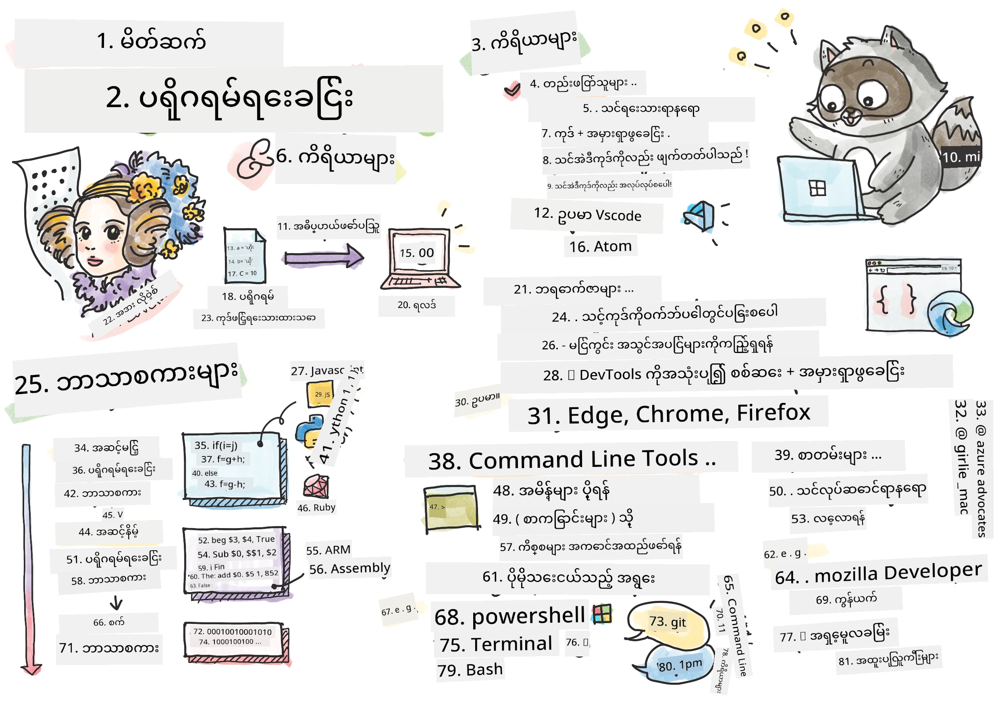
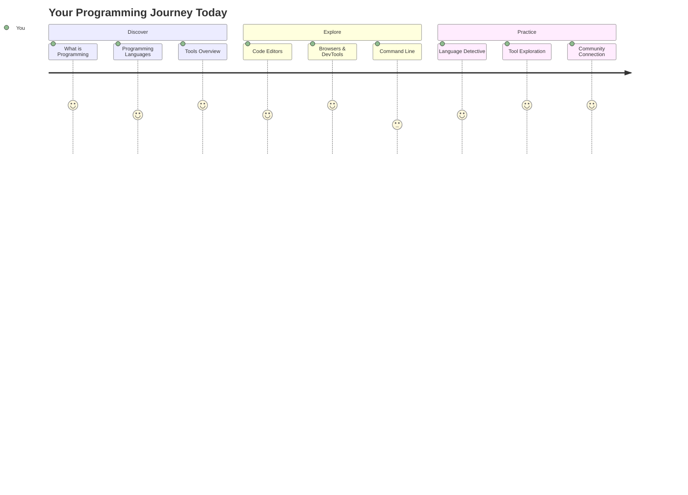
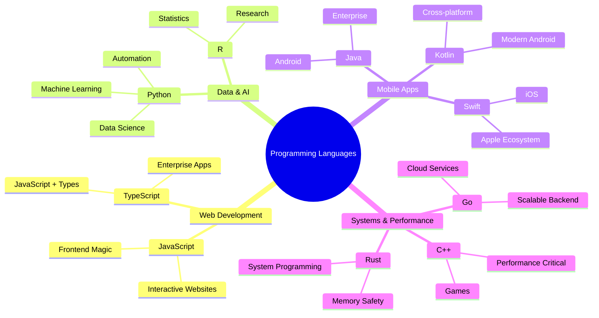
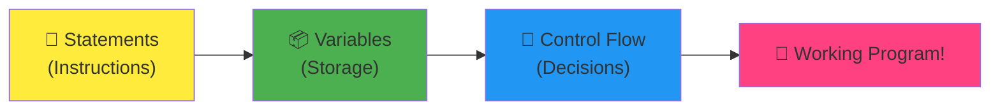
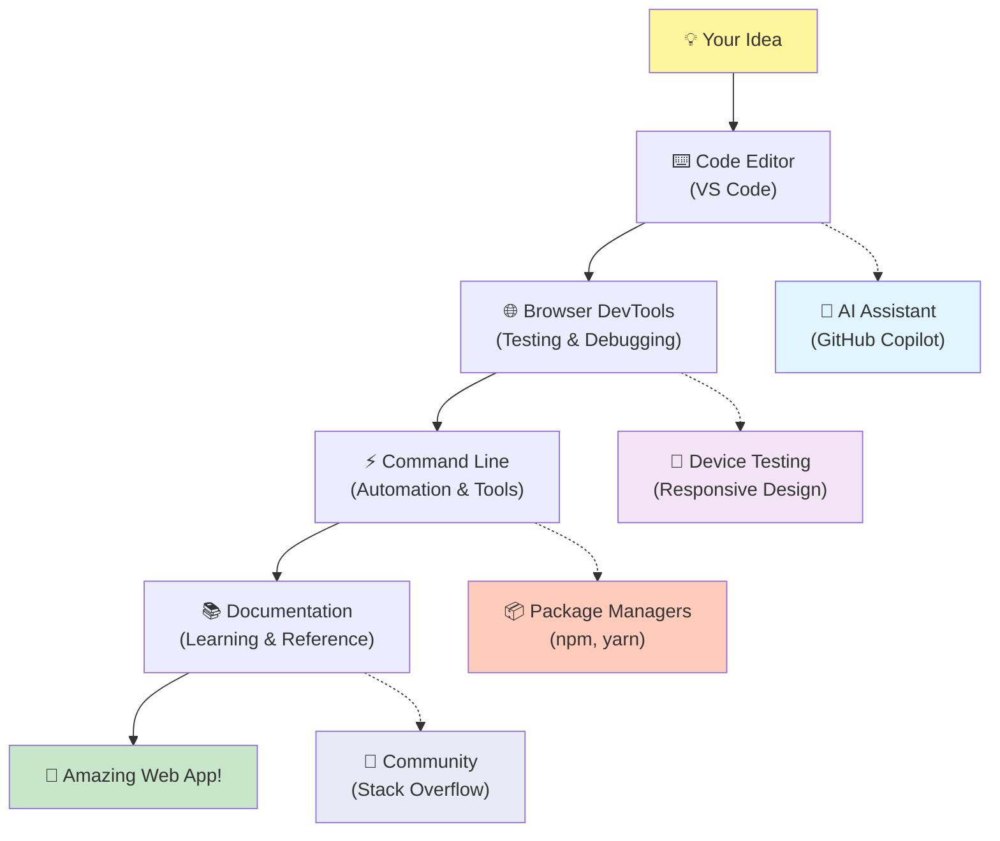
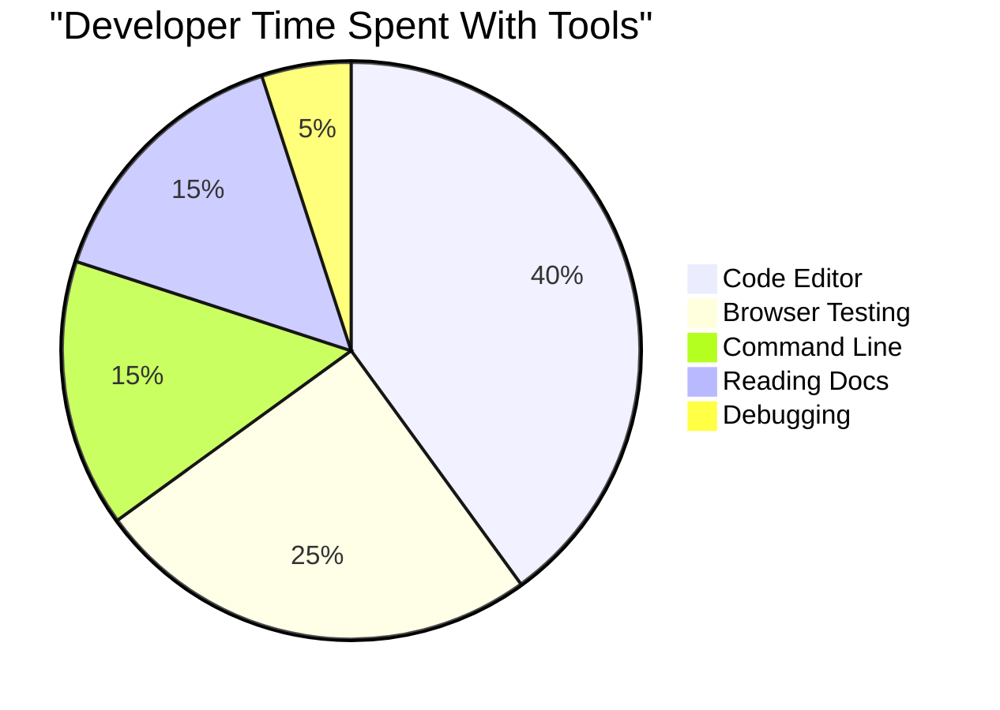
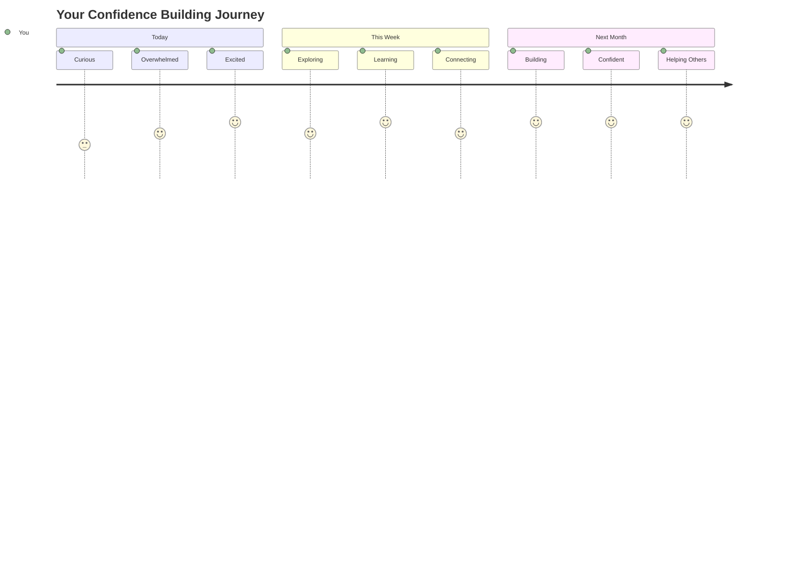

# ပရိုဂရမ်မင်းဘာသာစကားများနှင့် ခေတ်မီ Developer Tools မိတ်ဆက်

ဟေး၊ အနာဂတ် Developer! 👋 တစ်ခုခုပြောပါရစေ၊ အခုချိန်မှာတောင် ကျွန်တော်ကို အတော်လေးလှုပ်ရှားစေတဲ့အရာတစ်ခုရှိတယ်။ သင်ဟာ Programming ဆိုတာက ကွန်ပျူတာတွေနဲ့ပဲ မသက်ဆိုင်ဘူးဆိုတာ ရှာဖွေတွေ့ရှိတော့မှာပါ – ဒါဟာ သင်ရဲ့ အကြမ်းဆုံးအတွေးအခေါ်တွေကို အကောင်အထည်ဖော်နိုင်တဲ့ အစွမ်းထက်စွမ်းရည်တစ်ခုပါ!

သင်အကြိုက်ဆုံး App ကိုသုံးနေတဲ့အချိန်မှာ အားလုံးက Perfect ဖြစ်နေတဲ့အချိန်ကို သတိရပါ။ Button တစ်ခုကိုနှိပ်လိုက်တာနဲ့ အံ့ဩစရာအရာတစ်ခုဖြစ်လာပြီး "အင်း၊ သူတို့က ဒီလိုလုပ်နိုင်တာဘယ်လိုလဲ?" ဆိုပြီး အံ့ဩသွားတဲ့အချိန်။ အဲဒီ Magic ကို ဖန်တီးခဲ့တဲ့ Code ကို ရေးခဲ့တဲ့သူက သင်လိုပဲ – အချိန် ၂ နာရီမှာ သူ့အကြိုက်ဆုံး ကော်ဖီဆိုင်မှာ Espresso သုံးခွက်နဲ့ ထိုင်နေတဲ့သူတစ်ယောက်။ အခုတော့ သင့်ကို အံ့ဩစေမယ့်အရာက – ဒီသင်ခန်းစာအဆုံးမှာ သူတို့ဘယ်လိုလုပ်ခဲ့တယ်ဆိုတာ နားလည်သွားမယ်၊ သင်ကိုယ်တိုင်လည်း လုပ်ကြည့်ချင်စိတ်ဖြစ်လာမယ်!

Programming ကို စတင်လေ့လာတဲ့အချိန်မှာ အတော်လေးကြောက်မက်ဖွယ်ရှိတယ်ဆိုတာ ကျွန်တော်နားလည်တယ်။ ကျွန်တော်စတင်တဲ့အချိန်မှာတော့ Math Genius တစ်ယောက်ဖြစ်ရမယ်၊ သို့မဟုတ် ၅ နှစ်အရွယ်ကတည်းက Coding လုပ်ခဲ့ရမယ်လို့ ထင်ခဲ့တယ်။ ဒါပေမယ့် ကျွန်တော်ရဲ့အမြင်ကို ပြောင်းလဲစေတဲ့အရာက – Programming ဆိုတာ အသစ်သောဘာသာစကားတစ်ခုကို စကားပြောတတ်လာဖို့ လေ့လာရတာနဲ့ တူတယ်။ "ဟယ်လို" နဲ့ "ကျေးဇူးတင်ပါတယ်" ကို စတင်ပြီး ကော်ဖီမှာတတ်လာပြီးနောက်မှာတော့ အနက်နက်သော အတွေးအခေါ်တွေကို ဆွေးနွေးနိုင်တဲ့အထိ ရောက်လာတယ်! ဒါပေမယ့် ဒီအခါမှာတော့ သင်ဟာ ကွန်ပျူတာတွေနဲ့ စကားပြောနေပြီး အမှားတွေကို မစီရင်ဘဲ ပြန်လုပ်ဖို့ အမြဲတမ်းအဆင်သင့်ဖြစ်နေတဲ့ အတော်လေး သည်းခံတဲ့ စကားပြောဖော်တွေပါ!

ဒီနေ့မှာတော့ ခေတ်မီ Web Development ကို မဖြစ်မနေဖြစ်စေတဲ့ Tools တွေကို ရှာဖွေတွေ့ရှိကြမယ်။ Netflix, Spotify, သင့်အကြိုက်ဆုံး Indie App Studio တွေမှာ Developer တွေက နေ့စဉ်အသုံးပြုနေတဲ့ Editors, Browsers, Workflows တွေကို ပြောတာပါ။ အခုတော့ သင့်ကို Dance လုပ်ချင်စေမယ့်အပိုင်းက – ဒီ Professional-grade, Industry-standard Tools တွေက အခမဲ့ပဲဆိုတာပါ!


> Sketchnote by [Tomomi Imura](https://twitter.com/girlie_mac)



## သင့်မှာ ရှိပြီးသား အတတ်ပညာတွေကို ကြည့်ကြမယ်!

ပျော်ရွှင်စရာအပိုင်းတွေကို စတင်မလုပ်ခင်မှာတော့ Programming ကမ္ဘာကြီးအကြောင်း သင့်မှာ ရှိပြီးသား အတတ်ပညာတွေကို သိချင်ပါတယ်။ ဒီမေးခွန်းတွေကို ကြည့်ပြီး "အဲဒီအကြောင်းကို ဘာမှ မသိဘူး" လို့ ထင်ရင်လည်း အဆင်ပြေပါတယ်၊ Perfect ပါပဲ! ဒါက သင့်အတွက် အတော်လေးမှန်ကန်တဲ့နေရာမှာ ရောက်နေတယ်ဆိုတာကို ပြသပါတယ်။ ဒီ Quiz ကို Workout မလုပ်ခင် Stretch လုပ်တဲ့အတိုင်း Brain Muscle တွေကို အပူပေးနေတဲ့အချိန်လို့ ထင်ပါ!

[Pre-lesson Quiz ကို လုပ်ပါ](https://forms.office.com/r/dru4TE0U9n?origin=lprLink)


## ကျွန်တော်တို့အတူတူ သွားမယ့် စွန့်စားခန်း

အိုကေ၊ ကျွန်တော် အခုတင်တင်လှုပ်ရှားနေပါတယ်၊ ဒီနေ့မှာ ကျွန်တော်တို့ ရှာဖွေတွေ့ရှိမယ့်အရာတွေကို ပြောရတာ အတော်လေး စိတ်လှုပ်ရှားစေပါတယ်! တကယ်လို့ ဒီ Concept တွေကို နားလည်တဲ့အချိန်မှာ သင့်မျက်နှာကို မြင်နိုင်ရင် ကျွန်တော် အတော်လေးပျော်ရွှင်မယ်။ ဒီနေ့ ကျွန်တော်တို့အတူတူ သွားမယ့် စွန့်စားခန်းကတော့ -

- **Programming ဆိုတာ ဘာလဲ (အတော်လေးအမိုက်ဆုံးအရာ!)** – Code က သင့်အနားမှာရှိတဲ့ အရာအားလုံးကို Invisible Magic နဲ့ Power လုပ်ပေးနေတဲ့အရာဆိုတာကို ရှာဖွေတွေ့ရှိကြမယ်။
- **Programming Languages နဲ့ သူတို့ရဲ့ Amazing Personality တွေ** – Party တစ်ခုကို Imagine လုပ်ပါ၊ လူတိုင်းက အထူးစွမ်းရည်နဲ့ ပြဿနာတွေကို ဖြေရှင်းနိုင်တဲ့ အတော်လေးစွမ်းရည်ရှိတယ်။ Programming Language ကမ္ဘာကြီးက ဒီလိုပဲ၊ သင့်အကြိုက်ဆုံး Language ကို တွေ့ရမှာပါ!
- **Digital Magic ကို ဖန်တီးပေးတဲ့ အခြေခံအဆောက်အအုံတွေ** – Creative LEGO Set တစ်ခုလိုပဲ၊ ဒီ Pieces တွေကို နားလည်ပြီးရင် သင့်စိတ်ကူးအတွေးအခေါ်တွေကို အကောင်အထည်ဖော်နိုင်တယ်။
- **Professional Tools တွေ** – Wizard's Wand ကို လက်ခံရသလို ခံစားရမယ့် Tools တွေကို ရှာဖွေတွေ့ရှိကြမယ်။

> 💡 **အရေးကြီးတာက**: ဒီနေ့မှာ အားလုံးကို မှတ်မိဖို့ မကြိုးစားပါနဲ့! အခုချိန်မှာ သင့်ကို စိတ်လှုပ်ရှားစေတဲ့ Spark ကို ခံစားစေချင်ပါတယ်။ အချက်အလက်တွေက ကျွန်တော်တို့အတူတူ လေ့ကျင့်တဲ့အခါမှာ သဘာဝအတိုင်း Stick ဖြစ်လာမယ် – အမှန်တကယ် လေ့လာမှုဆိုတာ ဒီလိုပဲ ဖြစ်ပါတယ်!

> Microsoft Learn မှာ ဒီသင်ခန်းစာကို [ယူနိုင်ပါတယ်](https://docs.microsoft.com/learn/modules/web-development-101/introduction-programming/?WT.mc_id=academic-77807-sagibbon)!

## Programming ဆိုတာ တိတိ ဘာလဲ?

အိုကေ၊ Million-dollar Question ကို ဖြေကြည့်ရအောင် – Programming ဆိုတာ တကယ် ဘာလဲ?

ကျွန်တော့်အမြင်ကို ပြောင်းလဲစေတဲ့ Story တစ်ခုကို ပြောပါရစေ။ အတိတ်တစ်ပတ်က ကျွန်တော့်မိခင်ကို Smart TV Remote အသုံးပြုနည်းကို ရှင်းပြနေတဲ့အချိန်မှာ "အနီရောင် Button ကို နှိပ်ပါ၊ ဒါပေမယ့် အကြီးဆုံး Button မဟုတ်ဘူး၊ ဘယ်ဘက်မှာရှိတဲ့ အနီရောင် Button ကို နှိပ်ပါ... သင့်ဘယ်ဘက်မဟုတ်ဘူး... အိုကေ၊ အခုတော့ ၂ စက္ကန့်အထိ ဖိထားပါ၊ ၁ စက္ကန့်မဟုတ်ဘူး၊ ၃ စက္ကန့်လည်း မဟုတ်ဘူး..." ဆိုပြီး ပြောနေရတာကို တွေ့ရတယ်။ 😅

ဒါက Programming ပါ! အတော်လေးအစွမ်းထက်တဲ့အရာကို အလွန်အသေးစိတ်၊ အဆင့်ဆင့် အညွှန်းတွေကို ပေးတဲ့ အနုပညာပါ။ ဒါပေမယ့် မိခင်ကို ရှင်းပြတာမဟုတ်ဘဲ (မိခင်က "ဘယ် Button လဲ?!" လို့ မေးနိုင်တယ်) ကွန်ပျူတာကို ရှင်းပြတာ (ကွန်ပျူတာက သင်ပြောတာကို တိတိကျကျ လုပ်ပေးတယ်၊ သင်ပြောတာက သင့်ရဲ့ အဓိပ္ပာယ်နဲ့ မတူဘဲ ဖြစ်နေတယ်ဆိုရင်တောင်).

ဒီအချက်ကို ကျွန်တော် ပထမဆုံး သိခဲ့တဲ့အခါမှာ အံ့ဩသွားတဲ့အရာက – ကွန်ပျူတာတွေဟာ အခြေခံမှာ တကယ်လွယ်ကူတယ်။ သူတို့ Literally ၂ ခုပဲ နားလည်တယ် – 1 နဲ့ 0, ဒါဟာ "ဟုတ်" နဲ့ "မဟုတ်" သို့မဟုတ် "ဖွင့်" နဲ့ "ပိတ်" ဆိုတာပဲ။ ဒါပေမယ့် Magic ဖြစ်တဲ့အချက်က – ကျွန်တော်တို့ 1s နဲ့ 0s ကို မပြောရဘူး၊ The Matrix ထဲမှာလိုပဲ။ **Programming Languages** တွေက ကူညီပေးတဲ့အရာပါ။ ဒါဟာ သင့်ရဲ့ လူသားအတွေးအခေါ်တွေကို ကွန်ပျူတာဘာသာစကားအဖြစ် Translate လုပ်ပေးတဲ့ World's Best Translator တစ်ယောက်လိုပါပဲ။

ဒီအချိန်မှာ ကျွန်တော်ကို အတော်လေးလှုပ်ရှားစေတဲ့အရာက – Literally *အရာအားလုံး* Digital ဖြစ်တဲ့အရာတွေဟာ သင်လိုပဲ တစ်ယောက်က စတင်ခဲ့တာပါ၊ သူ့ Pajamas နဲ့ ကော်ဖီတစ်ခွက်ကိုင်ပြီး Laptop ပေါ်မှာ Code ရိုက်နေတဲ့သူတစ်ယောက်။ Instagram Filter က သင့်ကို Flawless ဖြစ်စေတဲ့အရာကို? တစ်ယောက်က Code ရေးခဲ့တယ်။ သင့်အကြိုက်ဆုံး သီချင်းကို ရှာဖွေစေတဲ့ Recommendation Algorithm ကို? Developer တစ်ယောက်က Build လုပ်ခဲ့တယ်။ Dinner Bill ကို သူငယ်ချင်းတွေနဲ့ ခွဲစေတဲ့ App ကို? ဟုတ်ပါတယ်၊ တစ်ယောက်က "ဒီအရာက အရမ်းအဆင်မပြေဘူး၊ ကျွန်တော် ဒီကို ပြင်နိုင်မယ်ထင်တယ်" လို့ ထင်ပြီး... ပြင်လိုက်တယ်!

Programming ကို သင်လေ့လာတဲ့အခါမှာ သင်ဟာ အသစ်သော Skill တစ်ခုကို ရယူတာမဟုတ်ဘူး – သင်ဟာ "တစ်ယောက်ရဲ့နေ့ကို အနည်းငယ်ကောင်းမွန်စေမယ့် အရာတစ်ခုကို ဖန်တီးနိုင်မလား?" လို့ အမြဲတမ်းတွေးနေတဲ့ ပြဿနာဖြေရှင်းသူတွေ့အဖွဲ့ထဲကို ပါဝင်လာတာပါ။ အဲဒါထက် အမိုက်ဆုံးအရာတစ်ခု ရှိနိုင်မလား?

✅ **အံ့ဩစရာအချက်ရှာဖွေမှု**: Spare Moment ရှိတဲ့အခါမှာ အတော်လေးအမိုက်ဆုံးအချက်တစ်ခုကို ရှာဖွေကြည့်ပါ – ကမ္ဘာ့ပထမဆုံး Computer Programmer က ဘယ်သူလဲထင်ပါသလား? Hint တစ်ခုပေးမယ် – သင့်အနောက်မှန်းမထားမိတဲ့သူဖြစ်နိုင်ပါတယ်! ဒီသူ့အကြောင်း Story က အတော်လေးစိတ်ဝင်စားစရာကောင်းပြီး Programming ဟာ အမြဲတမ်း Creative Problem-solving နဲ့ Thinking Outside the Box ဖြစ်တယ်ဆိုတာကို ပြသပါတယ်။

### 🧠 **Check-in Time: သင့်ခံစားချက်က ဘယ်လိုလဲ?**

**အချိန်ယူပြီး အတွေးအခေါ်တွေကို ပြန်လည်သုံးသပ်ပါ:**
- "ကွန်ပျူတာတွေကို အညွှန်းပေးတာ" ဆိုတဲ့အကြောင်းအရာကို အခုနားလည်သွားပြီလား?
- Programming နဲ့ Automation လုပ်ချင်တဲ့ နေ့စဉ်လုပ်ငန်းတစ်ခုကို စဉ်းစားနိုင်ပြီလား?
- Programming အကြောင်းအရာတွေနဲ့ ပတ်သက်ပြီး သင့်စိတ်ထဲမှာ ဘာတွေ မေးခွန်းထွက်လာနေလဲ?

> **သတိထားပါ**: အချို့ Concept တွေက အခုချိန်မှာ မရှင်းလင်းသေးတာ သဘာဝအတိုင်းပါပဲ။ Programming ကို လေ့လာတာဟာ ဘာသာစကားအသစ်တစ်ခုကို လေ့လာတာနဲ့ တူတယ် – သင့် Brain က Neural Pathways တွေကို တည်ဆောက်ဖို့ အချိန်ယူရတယ်။ သင် အတော်လေးကောင်းပါတယ်!

## Programming Languages တွေက Magic အမျိုးမျိုးလိုပဲ

အိုကေ၊ ဒီအကြောင်းကို ပြောရင် အနည်းငယ်ထူးဆန်းနေမယ်၊ ဒါပေမယ့် Stick လုပ်ပါ – Programming Languages တွေဟာ Music အမျိုးမျိုးလိုပဲ။ စဉ်းစားကြည့်ပါ – Jazz, Rock, Classical, Hip-hop တွေလိုပဲ၊ Language တစ်ခုစီမှာ သူ့ရဲ့ Vibe, Community, Mood နဲ့ Occasion တွေရှိတယ်။

Programming Languages တွေက ဒီလိုပဲ! Climate Data အများကြီးကို Crunch လုပ်ဖို့ Language တစ်ခုကို သုံးမှာမဟုတ်ဘူး၊ Fun Mobile Game တစ်ခုကို Build လုပ်ဖို့ Language တစ်ခုကို သုံးမှာမဟုတ်ဘူး၊ Yoga Class မှာ Death Metal တီးတာလိုပဲ (အများစု Yoga Class မှာတော့ မဟုတ်ဘူး 😄).

ဒါပေမယ့် ကျွန်တော့်ကို အတော်လေးအံ့ဩစေတဲ့အချက်က – Language တွေဟာ အတော်လေး သည်းခံပြီး Brilliant Interpreter တစ်ယောက်လိုပါပဲ။ သင့် Human Brain အတွက် သဘာဝအတိုင်း Feel ဖြစ်တဲ့အတိုင်း Idea တွေကို ပြောနိုင်ပြီး Computer Logic ကို Translate လုပ်ပေးတယ်။ "Human Creativity" နဲ့ "Computer Logic" နှစ်ခုလုံးကို Perfect Fluent ဖြစ်တဲ့ သူငယ်ချင်းတစ်ယောက်လိုပါပဲ – သူတို့က အပန်းမလွတ်ဘူး၊ Coffee Break မလိုဘူး၊ တစ်ခါတစ်ခါ မေးတဲ့မေးခွန်းကို ပြန်မေးတာကိုလည်း မစီရင်ဘူး!

### လူကြိုက်များတဲ့ Programming Languages နဲ့ သူတို့ရဲ့ အသုံးအများဆုံးနေရာ



| Language | Best For | Why It's Popular |
|----------|----------|------------------|
| **JavaScript** | Web development, user interfaces | Browsers မှာ Run လုပ်ပြီး Interactive Websites တွေကို Power လုပ်ပေးတယ် |
| **Python** | Data science, automation, AI | လွယ်ကူပြီး Powerful Libraries တွေရှိတယ် |
| **Java** | Enterprise applications, Android apps | Platform-independent ဖြစ်ပြီး Large Systems တွေအတွက် အတော်လေး Robust ဖြစ်တယ် |
| **C#** | Windows applications, game development | Microsoft Ecosystem အတွက် Support အတော်လေး Strong ဖြစ်တယ် |
| **Go** | Cloud services, backend systems | Fast, Simple ဖြစ်ပြီး Modern Computing အတွက် Design လုပ်ထားတယ် |

### High-Level vs. Low-Level Languages

အိုကေ၊ ကျွန်တော် Programming ကို စတင်လေ့လာတဲ့အချိန်မှာ Brain Break ဖြစ်စေတဲ့ Concept တစ်ခုက ဒီပါ၊ ဒါကြောင့် ကျွန်တော့်ကို အတော်လေးအထောက်အကူဖြစ်စေတဲ့ Analogy ကို မျှဝေပါမယ် – သင့်အတွက်လည်း အထောက်အကူဖြစ်မယ်လို့ မျှော်လင့်ပါတယ်!

Imagine လုပ်ပါ – သင် ဘာသာစကားမပြောတတ်တဲ့ နိုင်ငံတစ်ခုကို သွားရောက်ပြီး အရေးကြီး Bathroom ရှာဖွေရတဲ့အချိန် (အားလုံးက ဒီလိုဖြစ်ဖူးတယ်၊ ဟုတ်လား? 😅):

- **Low-level programming** ကတော့ ဒေသခံ Dialect ကို အတော်လေး Fluently ပြောတတ်ပြီး Cultural References, Local Slang, Inside Jokes တွေကို အသုံးပြုနိုင်တဲ့အတိုင်း ဖြစ်တယ်။ အတော်လေး Impression ဖြစ်ပြီး အလွန်အကျွမ်းကျင်တယ်... ဒါပေမယ့် Bathroom ရှာဖွေရတဲ့အချိန်မှာတော့ အတော်လေး Overwhelming ဖြစ်တယ်။

- **High-level programming** ကတော့ Amazing Local Friend တစ်ယောက်လိုပါပဲ။ "ကျွန်တော် Bathroom ရှာဖွေနေ
- **မှတ်ချက်များ**: အဆင့်မြင့်ဘာသာစကားများသည် ကုဒ်ကို ကိုယ်တိုင်ရှင်းပြနိုင်သော အကြောင်းအရာများကို ရှင်းလင်းစွာ ရေးသားရန်အားပေးသည်။
- **ဖွဲ့စည်းမှု**: JavaScript ၏ သဘောတရားစဉ်ဆက်လက်မှုသည် လူသားများက ပြဿနာများကို အဆင့်ဆင့်တွေးဆလိုက်သည့် နည်းလမ်းနှင့် ကိုက်ညီသည်။
- **ထိန်းသိမ်းမှု**: အခြေအနေအမျိုးမျိုးအတွက် JavaScript ဗားရှင်းကို အဆင်ပြေစွာ ပြင်ဆင်နိုင်သည်။

✅ **Fibonacci အစဉ်အတိုင်းအတာအကြောင်း**: ဒီအလှပဆုံးနံပါတ်ပုံစံ (နံပါတ်တစ်ခုစီသည် အရင်နံပါတ်နှစ်ခု၏ စုစုပေါင်းဖြစ်သည်: 0, 1, 1, 2, 3, 5, 8...) သဘာဝတွင် *အရမ်း* တွေ့ရပါတယ်! သင်သည် ဒါကို နေကြာပန်းပုံစံများ၊ ပိတောက်ပန်းပုံစံများ၊ nautilus အခွံပုံစံများ၊ နှင့် သစ်ပင်အခွံပုံစံများတွင် တွေ့ရပါမည်။ သဘာဝ၏ အလှတရားကို ဖန်တီးရန် သင်္ချာနှင့် ကုဒ်က အကြောင်းအရာများကို နားလည်စေပြီး ပြန်ဖန်တီးနိုင်သည်ဟု တွေးမိတာ အရမ်းအံ့ဩစရာပါပဲ!

## မျိုးစုံအံ့ဩမှုကို ဖန်တီးပေးသော အခြေခံအဆောက်အအုံများ

အိုကေ၊ programming languages တွေကို လုပ်ဆောင်ပုံကို ကြည့်ပြီးပြီဆိုတော့ အခုတော့ ဘာသာစကားတိုင်းမှာပါဝင်တဲ့ အခြေခံအစိတ်အပိုင်းတွေကို ခွဲခြမ်းရှင်းလင်းကြည့်ရအောင်။ ဒါတွေကို သင်အကြိုက်ဆုံးဟင်းချက်နည်းမှာပါဝင်တဲ့ အရေးကြီးအပစ္စည်းတွေလို တွေးပါ – တစ်ခုချင်းစီက ဘာလုပ်ပေးနိုင်တယ်ဆိုတာ နားလည်ပြီးရင် ဘာသာစကားမဆို ကုဒ်ကို ဖတ်နိုင်၊ ရေးနိုင်ဖြစ်သွားပါလိမ့်မယ်!

ဒါဟာ programming ၏ သဒ္ဒါကို သင်ယူနေသလိုပါပဲ။ ကျောင်းမှာ နာမ်၊ ကြိယာ၊ စာကြောင်းတွေကို ဘယ်လိုချိတ်ဆက်ရမယ်ဆိုတာ သင်ယူခဲ့တဲ့အခါကို သတိရပါ။ Programming က သူ့သဒ္ဒါကိုယ်စီရှိပြီး အင်္ဂလိပ်သဒ္ဒါထက် အလွန်လွယ်ကူပြီး အလွန်လက်ခံနိုင်စွမ်းရှိပါတယ် 😄

### Statements: အဆင့်ဆင့်ညွှန်ကြားချက်များ

**Statements** တွေက သင့်ကွန်ပျူတာနဲ့ စကားပြောတဲ့ စာကြောင်းတစ်ကြောင်းလိုပါပဲ။ Statement တစ်ခုစီက ကွန်ပျူတာကို တစ်ခုခုလုပ်ဖို့ ညွှန်ကြားပါတယ်၊ ဥပမာ "ဒီမှာ ဘယ်ဘက်ကိုလှည့်ပါ," "အနီရောင်မီးမှာရပ်ပါ," "ဒီနေရာမှာ ကားရပ်ပါ" လိုမျိုး။

Statements တွေက အရမ်းဖတ်လွယ်တဲ့အချက်ကို သင်ကြိုက်မိမှာပါ။ ဒီကိုကြည့်ပါ:

```javascript
// Basic statements that perform single actions
const userName = "Alex";                    
console.log("Hello, world!");              
const sum = 5 + 3;                         
```

**ဒီကုဒ်က ဘာလုပ်သလဲဆိုရင်:**
- **Constant variable** တစ်ခုကို အသုံးပြုသူရဲ့နာမည်ကို သိမ်းဆည်းရန် ကြေညာပါ။
- **Console output** မှာ အကြိုဆိုစာကို ပြပါ။
- **သင်္ချာဆိုင်ရာ လုပ်ဆောင်ချက်** ရလဒ်ကို တွက်ချက်ပြီး သိမ်းဆည်းပါ။

```javascript
// Statements that interact with web pages
document.title = "My Awesome Website";      
document.body.style.backgroundColor = "lightblue";
```

**အဆင့်ဆင့်လုပ်ဆောင်မှု:**
- **Webpage title** ကို ပြောင်းလဲပါ။
- **Page body** ရဲ့ နောက်ခံအရောင်ကို ပြောင်းလဲပါ။

### Variables: သင့်ကုဒ်ရဲ့ မှတ်ဉာဏ်စနစ်

**Variables** တွေက သင်နေ့စဉ်အသုံးပြုနေတဲ့ အရာတွေနဲ့ အလွန်တူတဲ့အတွက် သင်ယူရတာ အရမ်းပျော်စရာကောင်းပါတယ်!

သင့်ဖုန်းရဲ့ ဆက်သွယ်ရန်စာရင်းကို စဉ်းစားပါ။ လူတိုင်းရဲ့ဖုန်းနံပါတ်ကို မှတ်မထားဘဲ "မေမေ," "အကောင်းဆုံးသူငယ်ချင်း," "Pizza ဆိုင်" လို့ သိမ်းထားပြီး ဖုန်းက အမှန်တကယ်နံပါတ်ကို မှတ်ထားပေးပါတယ်။ Variables တွေက အတိအကျ ဒီလိုပဲ လုပ်ပါတယ်! Variables တွေက သင့်ကုဒ်မှာ အချက်အလက်တွေကို သိမ်းဆည်းပြီး နောက်ပိုင်းမှာ အလွယ်တကူ ပြန်ယူနိုင်တဲ့ အမည်တစ်ခုနဲ့ label လုပ်ထားတဲ့ အထုပ်တွေလိုပါပဲ။

Variables တွေက သင့်ကုဒ်အတွင်းမှာ အခြေအနေအလိုက် ပြောင်းလဲနိုင်ပါတယ်။ Pizza ဆိုင်ကို အကောင်းဆုံးဆိုင်တစ်ခုကို ရှာတွေ့တဲ့အခါ update လုပ်သလိုပဲ၊ Variables တွေက သင့်ကုဒ်မှာ အချက်အလက်အသစ်တွေကို update လုပ်နိုင်ပါတယ်။

ဒီလိုရိုးရှင်းတဲ့အရာကို ကြည့်ပါ:

```javascript
// Step 1: Creating basic variables
const siteName = "Weather Dashboard";        
let currentWeather = "sunny";               
let temperature = 75;                       
let isRaining = false;                      
```

**ဒီအချက်တွေကို နားလည်ပါ:**
- **Const variables** တွေကို unchanging values သိမ်းဆည်းရန် အသုံးပြုပါ။
- **Let** ကို သင့်ကုဒ်အတွင်းမှာ ပြောင်းလဲနိုင်တဲ့ values တွေအတွက် အသုံးပြုပါ။
- **Strings, numbers, booleans** စတဲ့ data types တွေကို assign လုပ်ပါ။
- **Descriptive names** တွေကို အသုံးပြုပါ။

```javascript
// Step 2: Working with objects to group related data
const weatherData = {                       
  location: "San Francisco",
  humidity: 65,
  windSpeed: 12
};
```

**ဒီမှာ:**
- **Object** တစ်ခုကို ဖန်တီးပြီး သက်ဆိုင်ရာ အချက်အလက်တွေကို အုပ်စုဖွဲ့ထားပါ။
- **Key-value pairs** တွေကို အသုံးပြုပြီး အချက်အလက်တွေကို ရှင်းလင်းစွာ label လုပ်ပါ။

```javascript
// Step 3: Using and updating variables
console.log(`${siteName}: Today is ${currentWeather} and ${temperature}°F`);
console.log(`Wind speed: ${weatherData.windSpeed} mph`);

// Updating changeable variables
currentWeather = "cloudy";                  
temperature = 68;                          
```

**ဒီအပိုင်းကို နားလည်ပါ:**
- **Template literals** ကို `${}` syntax နဲ့ အသုံးပြုပါ။
- **Dot notation** ကို အသုံးပြုပြီး object properties တွေကို access လုပ်ပါ။
- **Let variables** တွေကို update လုပ်ပါ။
- **Multiple variables** တွေကို ပေါင်းစပ်ပြီး အဓိပ္ပါယ်ရှိတဲ့ messages ဖန်တီးပါ။

```javascript
// Step 4: Modern destructuring for cleaner code
const { location, humidity } = weatherData; 
console.log(`${location} humidity: ${humidity}%`);
```

**သင်သိထားရမယ့်အချက်များ:**
- **Destructuring assignment** ကို အသုံးပြုပြီး object properties တွေကို extract လုပ်ပါ။
- **Object keys** နဲ့ အမည်တူတဲ့ variables တွေကို auto-create လုပ်ပါ။
- **Dot notation** ကို မကြာခဏအသုံးပြုရတာကို ရှောင်ရှားပါ။

### Control Flow: သင့်ကုဒ်ကို စဉ်းစားစေခြင်း

ဒီမှာတော့ programming က အရမ်းအံ့ဩစရာကောင်းတဲ့နေရာကို ရောက်လာပါပြီ! **Control flow** က သင့်ကုဒ်ကို အတိအကျဆုံးဆုံးဖြတ်ချက်တွေကို လုပ်နိုင်အောင် သင်ပေးတာပါ။

ဥပမာ၊ ဒီမနက်မှာ သင် "မိုးရွာရင် ထီးယူမယ်။ အေးရင် အင်္ကျီဝတ်မယ်။ နောက်ကျနေရင် မနက်စာကျော်ပြီး coffee ယူမယ်" လို့ စဉ်းစားခဲ့ရတယ်ဆိုပါစို့။ သင့်ဦးနှောက်က ဒီလို if-then logic ကို အလိုအလျောက် လိုက်နာပါတယ်။

ဒီလို conditional logic တွေက သင့်ကုဒ်ကို အသုံးပြုသူအတွက် အကောင်းဆုံးအတွေ့အကြုံပေးနိုင်အောင် အခြေအနေအလိုက် ပြောင်းလဲနိုင်စေပါတယ်။

```javascript
// Step 1: Basic conditional logic
const userAge = 17;

if (userAge >= 18) {
  console.log("You can vote!");
} else {
  const yearsToWait = 18 - userAge;
  console.log(`You'll be able to vote in ${yearsToWait} year(s).`);
}
```

**ဒီကုဒ်က ဘာလုပ်သလဲဆိုရင်:**
- **Age** ကို စစ်ဆေးပြီး မဲပေးနိုင်မှုကို စစ်ဆေးပါ။
- **Condition result** အပေါ်မူတည်ပြီး ကုဒ်အပိုင်းတွေကို run လုပ်ပါ။
- **Voting eligibility** အတွက် ကျန်ရှိတဲ့အချိန်ကို တွက်ချက်ပြီး ပြပါ။
- **Scenario တစ်ခုစီအတွက် feedback** ပေးပါ။

```javascript
// Step 2: Multiple conditions with logical operators
const userAge = 17;
const hasPermission = true;

if (userAge >= 18 && hasPermission) {
  console.log("Access granted: You can enter the venue.");
} else if (userAge >= 16) {
  console.log("You need parent permission to enter.");
} else {
  console.log("Sorry, you must be at least 16 years old.");
}
```

**ဒီမှာဖြစ်ပျက်တာကို ခွဲခြမ်းကြည့်ပါ:**
- **Conditions** တွေကို `&&` operator နဲ့ ပေါင်းစပ်ပါ။
- **Else if** ကို အသုံးပြုပြီး အခြေအနေအမျိုးမျိုးကို စီမံပါ။
- **Final else statement** ကို အသုံးပြုပြီး မျှော်လင့်မထားတဲ့အခြေအနေကို handle လုပ်ပါ။
- **Feedback** ကို scenario တစ်ခုစီအတွက် ရှင်းလင်းစွာပေးပါ။

```javascript
// Step 3: Concise conditional with ternary operator
const votingStatus = userAge >= 18 ? "Can vote" : "Cannot vote yet";
console.log(`Status: ${votingStatus}`);
```

**သင်သိထားရမယ့်အချက်များ:**
- **Ternary operator (`? :`)** ကို အသုံးပြုပြီး simple conditions တွေကို handle လုပ်ပါ။
- **Condition** ကို ရေးပြီး `?` နောက်မှာ true result, `:` နောက်မှာ false result ကို ရေးပါ။
- **Assign values** ကို conditions အပေါ်မူတည်ပြီး လုပ်ပါ။

```javascript
// Step 4: Handling multiple specific cases
const dayOfWeek = "Tuesday";

switch (dayOfWeek) {
  case "Monday":
  case "Tuesday":
  case "Wednesday":
  case "Thursday":
  case "Friday":
    console.log("It's a weekday - time to work!");
    break;
  case "Saturday":
  case "Sunday":
    console.log("It's the weekend - time to relax!");
    break;
  default:
    console.log("Invalid day of the week");
}
```

**ဒီကုဒ်က ဘာလုပ်သလဲဆိုရင်:**
- **Variable value** ကို specific cases တွေနဲ့ match လုပ်ပါ။
- **Similar cases** တွေကို အုပ်စုဖွဲ့ပါ။
- **Code block** ကို match တွေ့တဲ့အခါ run လုပ်ပါ။
- **Default case** ကို အသုံးပြုပြီး unexpected values ကို handle လုပ်ပါ။
- **Break statements** ကို အသုံးပြုပြီး နောက်ထပ် case ကို မဆက်လက်လုပ်ဆောင်စေပါ။

> 💡 **အမှန်တကယ်နမူနာ**: Control flow ကို GPS လမ်းညွှန်စနစ်လို တွေးပါ။ "Main Street မှာ traffic ရှိရင် highway ကို သွားပါ။ Highway မှာ ဆောက်လုပ်ရေးရှိရင် scenic route ကို သွားပါ" လို့ GPS က ပြောသလိုပဲ၊ Programs တွေက conditional logic ကို အသုံးပြုပြီး အခြေအနေအလိုက် အကောင်းဆုံးဆုံးဖြတ်ချက်တွေကို လုပ်နိုင်ပါတယ်။

### 🎯 **Concept Check: အခြေခံအဆောက်အအုံများကို ကျွမ်းကျင်မှုစစ်ဆေးခြင်း**

**သင့်အခြေခံအဆောက်အအုံများကို စစ်ဆေးကြည့်ပါ:**
- Variable နဲ့ statement တစ်ခုချင်းစီရဲ့ ကွာခြားချက်ကို သင့်စကားနဲ့ ရှင်းပြနိုင်ပါသလား?
- If-then decision ကို သင့်နေ့စဉ်ဘဝမှာ အသုံးပြုမယ့် နမူနာတစ်ခုကို တွေးနိုင်ပါသလား?
- Programming logic အကြောင်းမှာ သင့်ကို အံ့ဩစေတဲ့အရာတစ်ခုက ဘာလဲ?

**Quick confidence booster:**


✅ **နောက်တစ်ခုမှာ ဘာတွေရှိမလဲ**: ဒီ concepts တွေကို နက်နက်ရှိုင်းရှိုင်း သင်ယူရင်း အရမ်းပျော်စရာကောင်းတဲ့ ခရီးကို ဆက်လက်လုပ်ဆောင်မှာပါ! အခုတော့ အနာဂတ်မှာ ဖြစ်နိုင်တဲ့ အံ့ဩစရာတွေကို စိတ်လှုပ်ရှားမှုနဲ့ အာရုံစိုက်ပါ။ အတိအကျ skills တွေက ကျွန်တော်တို့အတူတူ practice လုပ်ရင်း အလိုအလျောက် သင့်မှာ ကျန်ရှိသွားပါလိမ့်မယ် – ဒီခရီးက သင်မျှော်လင့်ထားတာထက် ပိုပျော်စရာကောင်းမှာပါလို့ ကတိပေးပါတယ်!

## Tools of the Trade

အိုကေ၊ ဒီမှာတော့ excitement အပြည့်နဲ့ မနားနိုင်တော့ဘူး! 🚀 အခုတော့ သင့်ကို digital spaceship ရဲ့ key တွေကို လက်ထဲမှာပေးလိုက်သလို tools တွေကို ပြောပြမှာပါ။

Chef တစ်ယောက်ရဲ့ လက်ကို extension လိုခံစားရတဲ့ balance ကောင်းတဲ့ ဓားတွေ၊ သို့မဟုတ် ဂီတသမားရဲ့ သီချင်းတွေကို အလွယ်တကူဖန်တီးနိုင်တဲ့ guitar တစ်လက်လို tools တွေကို developers တွေမှာလည်း ရှိပါတယ်။ အခုတော့ အံ့ဩစရာကောင်းတဲ့အချက်က – ဒီ tools တွေက အများစုအခမဲ့ပါ!

AI-powered coding assistants, cloud environments, debugging tools စတဲ့ tools တွေက software ဖန်တီးပုံကို ပြောင်းလဲပေးခဲ့ပါတယ်။ ဒီ tools တွေက beginner tools မဟုတ်ပါဘူး – Google, Netflix, indie app studio တွေမှာ အသုံးပြုနေတဲ့ tools တွေပါပဲ။ 



### Code Editors and IDEs: သင့်ရဲ့ digital အကောင်းဆုံးသူငယ်ချင်း

Code editors တွေက သင့်ရဲ့ coding sanctuary ဖြစ်လာမှာပါ။ Modern editors တွေက သင့်ကို coding mentor တစ်ယောက်လို support ပေးပါတယ်။ Typos တွေကို အလိုအလျောက်ဖမ်းပြီး၊ သင့်ကို genius လိုခံစားရစေတဲ့ suggestions တွေ၊ code ကို နားလည်စေတဲ့ explanations တွေ၊ auto-completion feature တွေက သင့်ကို future မှာနေတဲ့သူလို ခံစားရစေပါတယ်။

**Modern editors တွေက ဘာတွေကောင်းလဲ?**

| Feature | ဘာလုပ်ပေးသလဲ | ဘာလို့အကျိုးရှိလဲ |
|---------|--------------|--------------|
| **Syntax Highlighting** | Code ကို အရောင်အသွေးနဲ့ ဖော်ပြ | Code ကို ဖတ်ရလွယ်ပြီး error တွေကို အလွယ်တကူတွေ့နိုင် |
| **Auto-completion** | Code ကို type လုပ်ရင်း suggestion ပေး | Coding ကို မြန်ဆန်စေပြီး typos တွေကို လျှော့ချ |
| **Debugging Tools** | Error တွေကို ရှာပြီး ပြင်ဆင် | Troubleshooting အချိန်ကို လျှော့ချ |
| **Extensions** | Specialized features တွေကို ထည့်သွင်း | Editor ကို သင့်နည်းပညာအလိုက် customize လုပ်နိုင် |
| **AI Assistants** | Code နဲ့ explanations တွေကို suggest | Learning နဲ့ productivity ကို မြှင့်တင် |

> 🎥 **ဗီဒီယိုအရင်းအမြစ်**: Tools တွေကို လုပ်ဆောင်ပုံကို ကြည့်ချင်ပါသလား? ဒီ [Tools of the Trade video](https://youtube.com/watch?v=69WJeXGBdxg) ကို ကြည့်ပါ။

#### Web Development အတွက် အကြံပြုထားတဲ့ Editors

**[Visual Studio Code](https://code.visualstudio.com/?WT.mc_id=academic-77807-sagibbon)** (အခမဲ့)
- Web developers တွေကြားမှာ အလွန်လူကြိုက်များ
- Extension ecosystem ကောင်း
- Built-in terminal နဲ့ Git integration
- **Must-have extensions**:
  - [GitHub Copilot](https://marketplace.visualstudio.com/items?itemName=GitHub.copilot) - AI-powered code suggestions
  - [Live Share](https://marketplace.visualstudio.com/items?itemName=MS-vsliveshare.vsliveshare) - Real-time collaboration
  - [Prettier](https://marketplace.visualstudio.com/items?itemName=esbenp.prettier-vscode) - Automatic code formatting
  - [Code Spell Checker](https://marketplace.visualstudio.com/items?itemName=streetsidesoftware.code-spell-checker) - Catch typos in your code

**[JetBrains WebStorm](https://www.jetbrains.com/webstorm/)** (Paid, free for students)
- Debugging နဲ့ testing tools အဆင့်မြင့်
- Intelligent code completion
- Built-in version control

**Cloud-Based IDEs** (Various pricing)
- [GitHub Codespaces](https://github.com/features/codespaces) - Browser မှာ VS Code အပြည့်အသုံးပြုနိုင်
- [Replit](https://replit.com/) - Learning နဲ့ code ကို share လုပ်ဖို့ကောင်း
- [StackBlitz](https://stackblitz.com/) - Instant, full-stack web development

> 💡 **စတင်ရန်အကြံပြုချက်**: Visual Studio Code ကို စတင်ပါ – အခမဲ့၊ စက်မှုလုပ်ငန်းမှာ အများဆုံးအသုံးပြုပြီး tutorials နဲ့ extensions တွေကို ရှာဖွေဖို့ community ကြီးတစ်ခုရှိပါတယ်။

### Web Browsers: သင့်ရဲ့လျှို့ဝှက် Developer Laboratory

အိုကေ၊ သင့်စိတ်ကို အပြည့်အဝ အံ့ဩစေဖို့ ပြင်ဆင်ထားပါ
တစ်ဦးတစ်ယောက် Browser DevTools ကို ပထမဆုံး ပြသခဲ့တဲ့အခါ၊ ကျွန်တော်/ကျွန်မ သုံးနာရီလောက် အဲဒီမှာပဲ ကလစ်လုပ်ပြီး "WAIT, ဒါလည်းလုပ်နိုင်တာလား?!" လို့ အံ့ဩနေခဲ့တယ်။ သင်တစ်ခုခု website ကို အချိန်နှင့်တပြေးညီ ပြင်ဆင်နိုင်တယ်၊ အားလုံး ဘယ်လောက်မြန်မြန်တင်တင်ဖြစ်တယ်ဆိုတာ မြင်နိုင်တယ်၊ သင့် site ကို အခြား device တွေမှာ ဘယ်လိုပုံစံနဲ့ မြင်ရမလဲ စမ်းသပ်နိုင်တယ်၊ JavaScript ကိုလည်း အတော်လေးကျွမ်းကျင်တဲ့ပုံစံနဲ့ debug လုပ်နိုင်တယ်။ အဲဒါက အံ့ဩစရာကောင်းလှပါတယ်!

**Browser တွေက သင့်ရဲ့ လျှို့ဝှက်လက်နက်ဖြစ်တဲ့အကြောင်း:**

Website သို့မဟုတ် web application တစ်ခုကို ဖန်တီးတဲ့အခါ၊ အဲဒါကို အမှန်တကယ်ကမ္ဘာမှာ ဘယ်လိုပုံစံနဲ့ မြင်ရမလဲ၊ ဘယ်လိုအပြုအမူရှိမလဲဆိုတာ သိဖို့လိုပါတယ်။ Browser တွေက သင့်အလုပ်ကို ပြသပေးရုံသာမက၊ performance, accessibility, နဲ့ ဖြစ်နိုင်တဲ့ပြဿနာတွေကို အသေးစိတ် feedback ပေးနိုင်ပါတယ်။

#### Browser Developer Tools (DevTools)

ခေတ်မီ Browser တွေမှာ Comprehensive Development Suite တွေ ပါဝင်ပါတယ်။

| Tool Category | ဘာလုပ်ပေးသလဲ | အသုံးပြုမှု ဥပမာ |
|---------------|--------------|------------------|
| **Element Inspector** | HTML/CSS ကို အချိန်နှင့်တပြေးညီ ကြည့်ရှုပြီး ပြင်ဆင်နိုင် | Styling ကို ပြင်ပြီး ချက်ချင်းရလဒ်တွေကို မြင်နိုင် |
| **Console** | Error message တွေကို ကြည့်ပြီး JavaScript ကို စမ်းသပ်နိုင် | ပြဿနာတွေကို debug လုပ်ပြီး code ကို စမ်းသပ် |
| **Network Monitor** | Resource တွေ ဘယ်လို load ဖြစ်တယ်ဆိုတာကို ကြည့်ရှု | Performance နဲ့ loading time တွေကို optimize လုပ် |
| **Accessibility Checker** | Inclusive design အတွက် စမ်းသပ် | သင့် site ကို လူတိုင်းအတွက် အလုပ်လုပ်စေဖို့ သေချာစေ |
| **Device Simulator** | အခြား screen size တွေမှာ preview လုပ် | Responsive design ကို စမ်းသပ်ဖို့ များစွာသော device မလိုအပ်တော့ဘူး |

#### Development အတွက် အကြံပြု Browser တွေ

- **[Chrome](https://developers.google.com/web/tools/chrome-devtools/)** - Documentation အပြည့်အစုံနဲ့ Industry-standard DevTools
- **[Firefox](https://developer.mozilla.org/docs/Tools)** - CSS Grid နဲ့ accessibility tools အတွက် အထူးကောင်းမွန်
- **[Edge](https://docs.microsoft.com/microsoft-edge/devtools-guide-chromium/?WT.mc_id=academic-77807-sagibbon)** - Chromium ပေါ်မှာ Microsoft ရဲ့ developer resources တွေနဲ့ တည်ဆောက်ထား

> ⚠️ **အရေးကြီး Testing အကြံပေးချက်**: သင့် website တွေကို Browser အမျိုးမျိုးမှာ စမ်းသပ်ပါ! Chrome မှာ အလုံးစုံအလုပ်လုပ်တဲ့အရာတွေ Safari သို့မဟုတ် Firefox မှာ မတူနိုင်ပါတယ်။ Professional developer တွေက Browser ใหญ่တွေမှာ အားလုံးကို စမ်းသပ်ပြီး consistent user experience ရရှိစေဖို့ ကြိုးစားကြပါတယ်။

### Command Line Tools: Developer Superpowers ရောက်ဖို့ Gateway

အခုတော့ Command Line အကြောင်းကို အပြည့်အဝ အမှန်တရားနဲ့ ပြောပြချင်ပါတယ်၊ အကြောင်းက ကျွန်တော်/ကျွန်မလည်း အဲဒီအရာကို အရင်ဆုံးတွေ့တဲ့အခါ "အင်း၊ မလုပ်နိုင်ဘူး! ၁၉၈၀ ခုနှစ် hacker movie ကနေ ထွက်လာတဲ့အရာလိုပဲ၊ ကျွန်တော်/ကျွန်မ အဲဒီအရာကို လုပ်နိုင်အောင် smart မဟုတ်ဘူး!" 😅 လို့ literal ထင်ခဲ့တယ်။

ဒါပေမယ့် အဲဒီအချိန်မှာ တစ်ဦးတစ်ယောက်က ပြောပြပေးခဲ့ရမယ့်အရာကို အခုတော့ ကျွန်တော်/ကျွန်မ ပြောပြချင်ပါတယ်။ Command Line က စိတ်လှုပ်ရှားစရာကောင်းတဲ့အရာမဟုတ်ဘူး – အဲဒါက သင့် computer နဲ့ တိုက်ရိုက် စကားပြောနေတဲ့အရာပါပဲ။ Fancy app တွေမှာ menu နဲ့ picture တွေကို သုံးပြီး အစားအစာ order လုပ်တာနဲ့ သင့်အကြိုက်ကို chef က သိပြီး "အံ့ဩစရာကောင်းတဲ့အရာတစ်ခု surprise လုပ်ပေးပါ" လို့ ပြောလိုက်တာနဲ့ တိုက်ရိုက် အစားအစာရတဲ့အရာနဲ့ တူပါတယ်။

Command Line က developer တွေ wizard လိုခံစားရတဲ့နေရာပါပဲ။ စကားလုံးအနည်းငယ် (အိုကေ၊ အဲဒါက command တွေပါပဲ၊ ဒါပေမယ့် magic လိုခံစားရတယ်!) ရိုက်ပြီး enter ကို နှိပ်လိုက်တာနဲ့ BOOM – project structure အပြည့်ကို ဖန်တီးလိုက်တယ်၊ ကမ္ဘာတစ်ဝှမ်းက powerful tools တွေ install လုပ်လိုက်တယ်၊ သို့မဟုတ် သင့် app ကို internet ပေါ်တင်ပြီး လူသန်းပေါင်းများစွာကို မြင်နိုင်အောင်လုပ်လိုက်တယ်။ အဲဒီ power ကို ပထမဆုံး ခံစားလိုက်တဲ့အခါ၊ အဲဒါက အတော်လေး စွဲလမ်းစရာကောင်းပါတယ်!

**Command Line ကို သင့်အကြိုက် tool ဖြစ်စေမယ့်အကြောင်း:**

Graphical interface တွေက အလုပ်အမျိုးမျိုးအတွက် အကောင်းဆုံးဖြစ်ပေမယ့် Command Line က automation, precision, နဲ့ speed အတွက် အထူးကောင်းပါတယ်။ Development tool အများစုက Command Line Interface တွေကို အဓိကအခြေခံထားပြီး၊ အဲဒီ tool တွေကို ထိရောက်စွာ အသုံးပြုတတ်ခြင်းက productivity ကို အလွန်မြှင့်တင်ပေးနိုင်ပါတယ်။

```bash
# Step 1: Create and navigate to project directory
mkdir my-awesome-website
cd my-awesome-website
```

**ဒီ code က ဘာလုပ်သလဲ:**
- **Create** "my-awesome-website" လို့ခေါ်တဲ့ directory အသစ်တစ်ခု ဖန်တီးပြီး project အတွက် အသုံးပြု
- **Navigate** အသစ်ဖန်တီးထားတဲ့ directory ထဲကို ဝင်ပြီး အလုပ်လုပ်စတင်

```bash
# Step 2: Initialize project with package.json
npm init -y

# Install modern development tools
npm install --save-dev vite prettier eslint
npm install --save-dev @eslint/js
```

**အဆင့်ဆင့်ဖြင့် ဘာတွေဖြစ်နေသလဲ:**
- **Initialize** Node.js project အသစ်တစ်ခုကို default settings နဲ့ `npm init -y` ကို သုံးပြီး စတင်
- **Install** Vite ကို modern build tool အဖြစ် အသုံးပြုဖို့
- **Add** Prettier ကို automatic code formatting အတွက်၊ ESLint ကို code quality check အတွက်
- **Use** `--save-dev` flag ကို development-only dependencies အဖြစ် သတ်မှတ်ဖို့

```bash
# Step 3: Create project structure and files
mkdir src assets
echo '<!DOCTYPE html><html><head><title>My Site</title></head><body><h1>Hello World</h1></body></html>' > index.html

# Start development server
npx vite
```

**အထက်ပါအရာတွေမှာ:**
- **Organized** project ကို source code နဲ့ assets အတွက် folder တွေ ခွဲခြားဖန်တီး
- **Generated** basic HTML file တစ်ခုကို proper document structure နဲ့
- **Started** Vite development server ကို live reloading နဲ့ hot module replacement အတွက်

#### Web Development အတွက် အရေးကြီး Command Line Tools

| Tool | ရည်ရွယ်ချက် | ဘာကြောင့်လိုအပ်သလဲ |
|------|---------|-----------------|
| **[Git](https://git-scm.com/)** | Version control | Changes တွေကို track လုပ်၊ အခြားသူတွေနဲ့ ပူးပေါင်းလုပ်ဆောင်၊ အလုပ်တွေကို backup လုပ် |
| **[Node.js & npm](https://nodejs.org/)** | JavaScript runtime & package management | Browser အပြင်မှာ JavaScript ကို run လုပ်၊ modern development tools တွေ install လုပ် |
| **[Vite](https://vitejs.dev/)** | Build tool & dev server | Lightning-fast development နဲ့ hot module replacement |
| **[ESLint](https://eslint.org/)** | Code quality | JavaScript မှာ ပြဿနာတွေကို အလိုအလျောက် ရှာပြီး ပြင် |
| **[Prettier](https://prettier.io/)** | Code formatting | Code ကို အမြဲတမ်း readable နဲ့ consistent ဖြစ်အောင် format လုပ် |

#### Platform-Specific Options

**Windows:**
- **[Windows Terminal](https://docs.microsoft.com/windows/terminal/?WT.mc_id=academic-77807-sagibbon)** - ခေတ်မီ feature-rich terminal
- **[PowerShell](https://docs.microsoft.com/powershell/?WT.mc_id=academic-77807-sagibbon)** 💻 - Powerful scripting environment
- **[Command Prompt](https://docs.microsoft.com/windows-server/administration/windows-commands/?WT.mc_id=academic-77807-sagibbon)** 💻 - Traditional Windows command line

**macOS:**
- **[Terminal](https://support.apple.com/guide/terminal/)** 💻 - Built-in terminal application
- **[iTerm2](https://iterm2.com/)** - Advanced features ပါဝင်တဲ့ terminal

**Linux:**
- **[Bash](https://www.gnu.org/software/bash/)** 💻 - Standard Linux shell
- **[KDE Konsole](https://docs.kde.org/trunk5/en/konsole/konsole/index.html)** - Advanced terminal emulator

> 💻 = Operating system မှာ အလိုအလျောက် ပါဝင်ပြီးသား

> 🎯 **Learning Path**: `cd` (directory ပြောင်း), `ls` သို့မဟုတ် `dir` (file list), `mkdir` (folder ဖန်တီး) လို basic command တွေကို စတင်ပါ။ `npm install`, `git status`, `code .` (VS Code မှာ current directory ကို ဖွင့်) လို modern workflow command တွေကို လေ့ကျင့်ပါ။ အဆင့်မြင့် command တွေ နဲ့ automation technique တွေကို သင်တတ်လာမှာပါ။

### Documentation: သင့်ရဲ့ အမြဲရရှိနိုင်တဲ့ သင်ကြားမှု Mentor

အိုကေ၊ beginner ဖြစ်တဲ့အခါ သင့်ကို ပိုကောင်းစေမယ့် လျှို့ဝှက်ချက်လေးကို မျှဝေချင်ပါတယ် – အတွေ့အကြုံရှိ developer တွေက documentation ကို ဖတ်ဖို့ အချိန်အများကြီး သုံးတယ်။ ဒါက သူတို့ မသိတာကြောင့် မဟုတ်ဘူး – အဲဒါက တကယ့်ပညာရှိမှုရဲ့ အမှတ်အသားပါ!

Documentation ကို 24/7 ရရှိနိုင်တဲ့ အတော်လေး သည်းခံပြီး ပညာရှိတဲ့ ဆရာတွေလို ထင်ပါ။ 2 AM မှာ ပြဿနာတစ်ခုမှာ ပိတ်မိနေတယ်လို့ ထင်ပါစေ – Documentation က virtual hug နဲ့ သင့်လိုအပ်တဲ့ အဖြေကို ပေးနိုင်ပါတယ်။ လူတိုင်းပြောနေတဲ့ အလန်းစား feature တစ်ခုကို သင်ယူချင်တယ်လို့ ထင်ပါစေ – Documentation က step-by-step ဥပမာတွေနဲ့ သင့်ကို ကူညီနိုင်ပါတယ်။ တစ်ခုခု ဘာကြောင့် အလုပ်လုပ်တယ်ဆိုတာ နားလည်ချင်တယ်လို့ ထင်ပါစေ – Documentation က အဲဒီအရာကို သင့်အတွက် ရှင်းပြနိုင်ပါတယ်။

**အမှန်တရားက ဒီမှာပဲ:**

Professional developer တွေက documentation ကို အများကြီး ဖတ်တယ် – သူတို့ မသိတာကြောင့် မဟုတ်ဘူး၊ web development က မြန်မြန်ဆန်ဆန် ရှေ့ဆက်နေတဲ့အတွက် current ဖြစ်ဖို့ အမြဲလေ့လာရတာပါ။ Documentation က သင့်ကို *ဘယ်လို* အသုံးပြုရမလဲဆိုတာသာမက၊ *ဘာကြောင့်* နဲ့ *ဘယ်အချိန်မှာ* အသုံးပြုရမလဲဆိုတာကိုလည်း နားလည်စေပါတယ်။

#### အရေးကြီး Documentation Resources

**[Mozilla Developer Network (MDN)](https://developer.mozilla.org/docs/Web)**
- Web technology documentation အတွက် gold standard
- HTML, CSS, JavaScript အတွက် comprehensive guide
- Browser compatibility အချက်အလက်တွေ ပါဝင်
- Practical examples နဲ့ interactive demos တွေ ပါဝင်

**[Web.dev](https://web.dev)** (Google မှ)
- Modern web development best practices
- Performance optimization guide
- Accessibility နဲ့ inclusive design principle
- Real-world project case studies

**[Microsoft Developer Documentation](https://docs.microsoft.com/microsoft-edge/#microsoft-edge-for-developers)**
- Edge browser development resources
- Progressive Web App guide
- Cross-platform development insights

**[Frontend Masters Learning Paths](https://frontendmasters.com/learn/)**
- Structured learning curricula
- Industry expert တွေက video course
- Hands-on coding exercise

> 📚 **Study Strategy**: Documentation ကို မှတ်မထားဖို့ ကြိုးစားမနေပါနဲ့ – အစား Documentation ကို ထိရောက်စွာ navigate လုပ်တတ်ဖို့ လေ့လာပါ။ အမြဲအသုံးပြု references တွေကို bookmark လုပ်ပြီး အချက်အလက်ကို မြန်မြန်ရှာဖွေဖို့ search function တွေကို လေ့ကျင့်ပါ။

### 🔧 **Tool Mastery Check: သင့်အတွက် အဓိကအရာက ဘာလဲ?**

**အချိန်ယူပြီး စဉ်းစားပါ:**
- သင့်အတွက် စမ်းသပ်ချင်တဲ့ tool က ဘာလဲ? (မှားတဲ့အဖြေမရှိပါ!)
- Command Line က အခုထိ ကြောက်စရာကောင်းသေးလား၊ ဒါမှမဟုတ် စိတ်ဝင်စားနေပါသလား?
- Browser DevTools ကို သင့်အကြိုက် website တွေမှာ စမ်းသပ်ကြည့်ဖို့ စိတ်ကူးရနိုင်ပါသလား?



> **စိတ်ဝင်စားစရာအချက်**: Developer တွေက သူတို့ရဲ့ code editor မှာ အချိန် 40% လောက် သုံးတယ်၊ ဒါပေမယ့် testing, learning, နဲ့ problem-solving အတွက် အချိန်အများကြီး သုံးတယ်။ Programming က code ရေးတာပဲ မဟုတ်ဘူး – အတွေ့အကြုံတွေကို ဖန်တီးတာပါ!

✅ **စဉ်းစားစရာအချက်**: Website တွေကို ဖန်တီးတဲ့ tool တွေ (development) နဲ့ အဲဒီ website တွေကို ဒီဇိုင်းဆွဲတဲ့ tool တွေ (design) ဘယ်လိုကွာခြားမလဲလို့ သင်ထင်ပါသလဲ? အလှပဆုံးအိမ်ကို ဒီဇိုင်းဆွဲတဲ့ architect နဲ့ အဲဒီအိမ်ကို တကယ်တည်ဆောက်တဲ့ contractor တို့လိုပါပဲ။ နှစ်ခုလုံး အရေးကြီးပေမယ့် tool box က မတူပါဘူး! Website တွေ ဘယ်လိုပုံစံနဲ့ အသက်ဝင်လာတယ်ဆိုတာကို ကြီးကျယ်တဲ့အမြင်နဲ့ မြင်နိုင်စေမှာပါ။

## GitHub Copilot Agent Challenge 🚀

Agent mode ကို အသုံးပြုပြီး အောက်ပါ challenge ကို ပြီးမြောက်ပါ:

**ဖော်ပြချက်:** Modern code editor သို့မဟုတ် IDE ရဲ့ feature တွေကို စူးစမ်းပြီး Web Developer အနေနဲ့ workflow ကို ဘယ်လိုတိုးတက်စေမလဲဆိုတာ ပြသပါ။

**Prompt:** Visual Studio Code, WebStorm, သို့မဟုတ် cloud-based IDE တစ်ခုကို ရွေးပါ။ Code ရေး, debug လုပ်, သို့မဟုတ် code ကို maintain လုပ်ဖို့ အထောက်အကူပြု feature သို့မဟုတ် extension သုံးခုကို ရွေးပါ။ တစ်ခုချင်းစီအတွက် workflow ကို ဘယ်လိုအကျိုးရှိစေမလဲဆိုတာ အကျဉ်းချုပ် ရေးပါ။

---

## 🚀 Challenge

**အိုကေ၊ စုံထောက်၊ သင့်ရဲ့ ပထမဆုံး case အတွက် အဆင်သင့်ဖြစ်ပြီလား?**

အခု သင့်မှာ အခြေခံအချက်တွေ ရှိပြီးသားဖြစ်တဲ့အတွက်၊ Programming ကမ္ဘာကြီးရဲ့ အမျိုးမျိုးနဲ့ စိတ်ဝင်စားစရာကောင်းတဲ့အရာတွေကို မြင်နိုင်ဖို့ အခွင့်အရေးတစ်ခု ရှိပါတယ်။ ဒီတော့ – အခုတော့ code ရေးတာမဟုတ်ဘူး၊ ဒါကြောင့် စိတ်ဖိစီးမှုမရှိပါဘူး! သင့်ကို Programming Language Detective အဖြစ် သင့်ရဲ့ ပထမဆုံး စိတ်လှုပ်ရှားစရာ case ကို လုပ်ဆောင်ဖို့ ဖိတ်ခေါ်ပါတယ်!

**သင့် mission, သင်လက်ခံဖို့ ဆုံးဖြတ်လျှင်:**
1. **Language Explorer ဖြစ်ပါ**: Website တွေကို ဖန်တီးတဲ့ language တစ်ခု၊ Mobile app တွေကို ဖန်တီးတဲ့ language တစ်ခု၊ Scientist တွေအတွက် data crunching လုပ်တဲ့ language တစ်ခု – အဲဒီ language သုံးခုကို ရွေးပါ။ တစ်ခုချင်းစီမှာ အလွယ်ဆုံး task တစ်ခုကို ဘယ်လိုရေးထားတယ်ဆိုတာကို ရှာပါ။ အဲဒီ task တွေက တူတူလုပ်ပေမယ့် ဘ
## ပြန်လည်သုံးသပ်ခြင်းနှင့် ကိုယ်တိုင်လေ့လာခြင်း

**အချိန်ယူပြီး စူးစမ်းလေ့လာပါ၊ ပျော်ရွှင်ပါစေ!**

ဒီနေ့မှာ သင်အများကြီးလေ့လာပြီးဖြစ်ပါတယ်၊ အဲဒါက သင်ဂုဏ်ယူဖို့အကြောင်းပါ! အခုတော့ စိတ်ဝင်စားမှုကိုဖြစ်စေတဲ့အကြောင်းအရာတွေကို စူးစမ်းဖို့အချိန်ရောက်ပါပြီ။ ဒီဟာက အိမ်စာမဟုတ်ပါဘူး – ဒါက စွန့်စားမှုပါ!

**သင့်ကို စိတ်လှုပ်ရှားစေတဲ့အရာတွေကို ပိုမိုနက်နက်ရှိုင်းရှိုင်းလေ့လာပါ:**

**Programming Language တွေနဲ့ လက်တွေ့လုပ်ဆောင်ပါ:**
- သင့်စိတ်ဝင်စားမှုကိုဖြစ်စေတဲ့ ဘာသာစကား ၂-၃ ခုရဲ့ တရားဝင်ဝက်ဘ်ဆိုဒ်တွေကို သွားလေ့လာပါ။ ဘာသာစကားတိုင်းမှာ သူ့ရဲ့ပုံစံနဲ့ သမိုင်းကြောင်းရှိပါတယ်!
- [CodePen](https://codepen.io/), [JSFiddle](https://jsfiddle.net/), [Replit](https://replit.com/) တို့လို online coding playground တွေကို စမ်းကြည့်ပါ။ စမ်းသပ်ဖို့မကြောက်ပါနဲ့ – ဘာမှမပျက်စီးနိုင်ပါဘူး!
- သင့်အကြိုက်ဆုံး programming language ရဲ့ သမိုင်းကြောင်းကို ဖတ်ရှုပါ။ တကယ်လို့ စိတ်ဝင်စားဖွယ်ကောင်းပြီး ဘာသာစကားတွေ ဘာကြောင့် ဒီလိုအလုပ်လုပ်ရလဲဆိုတာကို နားလည်စေမှာပါ။

**သင့်ရဲ့ Tools အသစ်တွေနဲ့ ရင်းနှီးပါ:**
- Visual Studio Code ကို ဒေါင်းလုပ်လုပ်ပါ (မလုပ်ရသေးရင်) – အခမဲ့ဖြစ်ပြီး သင်အကြိုက်တွေ့ပါလိမ့်မယ်!
- Extensions marketplace ကို အချိန်အနည်းငယ်ကြာ browse လုပ်ပါ။ ဒါက သင့် code editor အတွက် app store လိုပါပဲ!
- သင့် browser ရဲ့ Developer Tools ကို ဖွင့်ပြီး အဲဒီမှာ click လုပ်ကြည့်ပါ။ အားလုံးကို နားလည်ဖို့မလိုပါဘူး – အဲဒီမှာ ဘာတွေရှိလဲဆိုတာကို ရင်းနှီးဖို့သာ လုပ်ပါ။

**Community ကို ဝင်ပါ:**
- [Dev.to](https://dev.to/), [Stack Overflow](https://stackoverflow.com/), [GitHub](https://github.com/) တို့မှာ developer communities တွေကို follow လုပ်ပါ။ Programming community က အသစ်ဝင်လာသူတွေကို အလွန်ကြိုဆိုပါတယ်!
- YouTube မှာ beginner-friendly coding video တွေကို ကြည့်ပါ။ စတင်နေတဲ့အချိန်က ဘယ်လိုဖြစ်တယ်ဆိုတာကို သတိရတဲ့ creators တွေ အများကြီးရှိပါတယ်။
- ဒေသခံ meetups တွေကို ဝင်ပါ၊ ဒါမှမဟုတ် online communities တွေကို join လုပ်ပါ။ Developer တွေက အသစ်ဝင်လာသူတွေကို ကူညီဖို့အကြိုက်ဆုံးပါ!

> 🎯 **နောက်ဆုံး သတိပေးချင်တာက**: သင် coding wizard ဖြစ်ဖို့ တစ်ညလုံးမှာ မျှော်လင့်ထားတာမဟုတ်ပါဘူး! အခုတော့ သင်ဝင်ရောက်ဖို့ရှိတဲ့ အံ့မခန်းတဲ့ကမ္ဘာကို သိရှိဖို့သာ ဖြစ်ပါတယ်။ အချိန်ယူပါ၊ ခရီးကို ပျော်ရွှင်ပါ၊ သတိထားပါ – သင်ဂုဏ်ပြုတဲ့ developer တစ်ဦးချင်းစီဟာ သင်အခုရှိနေတဲ့နေရာမှာ တစ်ချိန်ကရှိခဲ့ပြီး စိတ်လှုပ်ရှားမှုနဲ့ အနည်းငယ်မူးမူးမောမောဖြစ်ခဲ့ပါတယ်။ ဒါက အလွန်ပုံမှန်ဖြစ်ပြီး သင်မှန်ကန်စွာလုပ်ဆောင်နေတယ်ဆိုတာကို ဆိုလိုပါတယ်။

## အိမ်စာ

[Reading the Docs](assignment.md)

> 💡 **အိမ်စာအတွက် အနည်းငယ်သတိပေးချက်**: ကျွန်တော်အရမ်းကြိုက်မိတာက သင်မလေ့လာရသေးတဲ့ tools တွေကို စူးစမ်းဖို့ပါ! ကျွန်တော်တို့ပြောခဲ့တဲ့ editors, browsers, command line tools တွေကို ကျော်သွားပါ – အံ့မခန်းတဲ့ development tools တွေရှိပြီး အဲဒီမှာ စူးစမ်းဖို့အချိန်ရောက်ပါပြီ။ အလုပ်လုပ်နေဆဲဖြစ်ပြီး community တွေက အလွန်ကူညီတတ်တဲ့ tools တွေကို ရှာဖွေပါ (tutorials တွေက အကောင်းဆုံးဖြစ်ပြီး သင်အခက်အခဲတွေ့တဲ့အခါမှာ ကူညီပေးမယ့်သူတွေရှိပါတယ်။)

---

## 🚀 သင့် Programming ခရီးစဉ် အချိန်ဇယား

### ⚡ **နောက် ၅ မိနစ်အတွင်း လုပ်နိုင်တာ**
- [ ] သင့်စိတ်ဝင်စားမှုကိုဖြစ်စေတဲ့ programming language websites ၂-၃ ခုကို bookmark လုပ်ပါ
- [ ] Visual Studio Code ကို ဒေါင်းလုပ်လုပ်ပါ (မလုပ်ရသေးရင်)
- [ ] သင့် browser ရဲ့ DevTools (F12) ကို ဖွင့်ပြီး website တစ်ခုခုမှာ click လုပ်ကြည့်ပါ
- [ ] Programming community တစ်ခုကို join လုပ်ပါ (Dev.to, Reddit r/webdev, Stack Overflow)

### ⏰ **ဒီနာရီအတွင်း ပြီးမြောက်နိုင်တာ**
- [ ] Post-lesson quiz ကို ပြီးမြောက်ပြီး သင့်အဖြေတွေကို ပြန်လည်သုံးသပ်ပါ
- [ ] VS Code ကို GitHub Copilot extension နဲ့ setup လုပ်ပါ
- [ ] Programming language ၂ ခုမှာ "Hello World" ဥပမာကို online မှာ စမ်းကြည့်ပါ
- [ ] YouTube မှာ "Day in the Life of a Developer" video တစ်ခုကို ကြည့်ပါ
- [ ] Programming language detective work ကို စတင်ပါ (challenge မှာ)

### 📅 **သင့်ရဲ့ တစ်ပတ်တာ စွန့်စားမှု**
- [ ] အိမ်စာကို ပြီးမြောက်ပြီး development tools အသစ် ၃ ခုကို စူးစမ်းပါ
- [ ] Developer ၅ ဦး ဒါမှမဟုတ် programming accounts တွေကို social media မှာ follow လုပ်ပါ
- [ ] CodePen ဒါမှမဟုတ် Replit မှာ တစ်ခုခုကို တည်ဆောက်ကြည့်ပါ (တောင် "Hello, [Your Name]!" ဆိုပြီး)
- [ ] Developer blog post တစ်ခုကို ဖတ်ရှုပါ (coding journey အကြောင်း)
- [ ] Virtual meetup တစ်ခုကို join လုပ်ပါ ဒါမှမဟုတ် programming talk တစ်ခုကို ကြည့်ပါ
- [ ] Online tutorials တွေနဲ့ သင်ရွေးချယ်ထားတဲ့ ဘာသာစကားကို စတင်လေ့လာပါ

### 🗓️ **တစ်လတာ ပြောင်းလဲမှု**
- [ ] ပထမဆုံး project သေးသေးလေးကို တည်ဆောက်ပါ (တစ်ခုခုရိုးရိုးလေး webpage တစ်ခုတောင် ရပါပြီ!)
- [ ] Open-source project တစ်ခုကို ပါဝင်ပါ (documentation fixes နဲ့ စတင်ပါ)
- [ ] Programming journey ကို စတင်နေတဲ့သူတစ်ဦးကို mentor လုပ်ပါ
- [ ] Developer portfolio website ကို ဖန်တီးပါ
- [ ] ဒေသခံ developer communities ဒါမှမဟုတ် study groups တွေနဲ့ ဆက်သွယ်ပါ
- [ ] သင့်ရဲ့ နောက် learning milestone ကို စတင်စီစဉ်ပါ

### 🎯 **နောက်ဆုံး Reflection Check-in**

**သင့်ခရီးစဉ်ကို ဆက်လက်လုပ်ဆောင်မတိုင်မီ ခဏတာဂုဏ်ပြုပါ:**
- ဒီနေ့ programming အကြောင်းမှာ စိတ်လှုပ်ရှားစေတဲ့အရာတစ်ခုက ဘာလဲ?
- Tools ဒါမှမဟုတ် concept တစ်ခုကို ပထမဆုံး စူးစမ်းချင်တာက ဘာလဲ?
- ဒီ programming ခရီးစဉ်ကို စတင်ဖို့ သင့်ခံစားချက်က ဘယ်လိုလဲ?
- Developer တစ်ဦးကို အခုချိန်မှာ မေးချင်တဲ့မေးခွန်းတစ်ခုက ဘာလဲ?



> 🌟 **သတိထားပါ**: ကျွမ်းကျင်သူတိုင်းဟာ တစ်ချိန်က beginner ဖြစ်ခဲ့ပါတယ်။ Senior developer တစ်ဦးချင်းစီဟာ သင်အခုခံစားနေရတဲ့အတိုင်း စိတ်လှုပ်ရှားမှုနဲ့ အနည်းငယ်မူးမူးမောမောဖြစ်ခဲ့ပါတယ် – အဲဒါက အံ့မခန်းတဲ့အရာတွေကို စူးစမ်းဖို့ စိတ်ဝင်စားမှုကို ဆိုလိုပါတယ်။ သင်အံ့မခန်းတဲ့ company မှာ ရှိနေပြီး ဒီခရီးစဉ်က အလွန်အမင်းအံ့မခန်းတဲ့အရာဖြစ်မှာပါ။ Programming ရဲ့ အံ့မခန်းတဲ့ကမ္ဘာကို ကြိုဆိုပါတယ်! 🎉

---

**အကြောင်းကြားချက်**:  
ဤစာရွက်စာတမ်းကို AI ဘာသာပြန်ဝန်ဆောင်မှု [Co-op Translator](https://github.com/Azure/co-op-translator) ကို အသုံးပြု၍ ဘာသာပြန်ထားပါသည်။ ကျွန်ုပ်တို့သည် တိကျမှုအတွက် ကြိုးစားနေသော်လည်း အလိုအလျောက် ဘာသာပြန်မှုများတွင် အမှားများ သို့မဟုတ် မမှန်ကန်မှုများ ပါဝင်နိုင်သည်ကို သတိပြုပါ။ မူရင်းဘာသာစကားဖြင့် ရေးသားထားသော စာရွက်စာတမ်းကို အာဏာတရားရှိသော အရင်းအမြစ်အဖြစ် သတ်မှတ်သင့်ပါသည်။ အရေးကြီးသော အချက်အလက်များအတွက် လူ့ဘာသာပြန်ပညာရှင်များကို အသုံးပြုရန် အကြံပြုပါသည်။ ဤဘာသာပြန်မှုကို အသုံးပြုခြင်းမှ ဖြစ်ပေါ်လာသော အလွဲအမှားများ သို့မဟုတ် အနားလွဲမှုများအတွက် ကျွန်ုပ်တို့သည် တာဝန်မယူပါ။