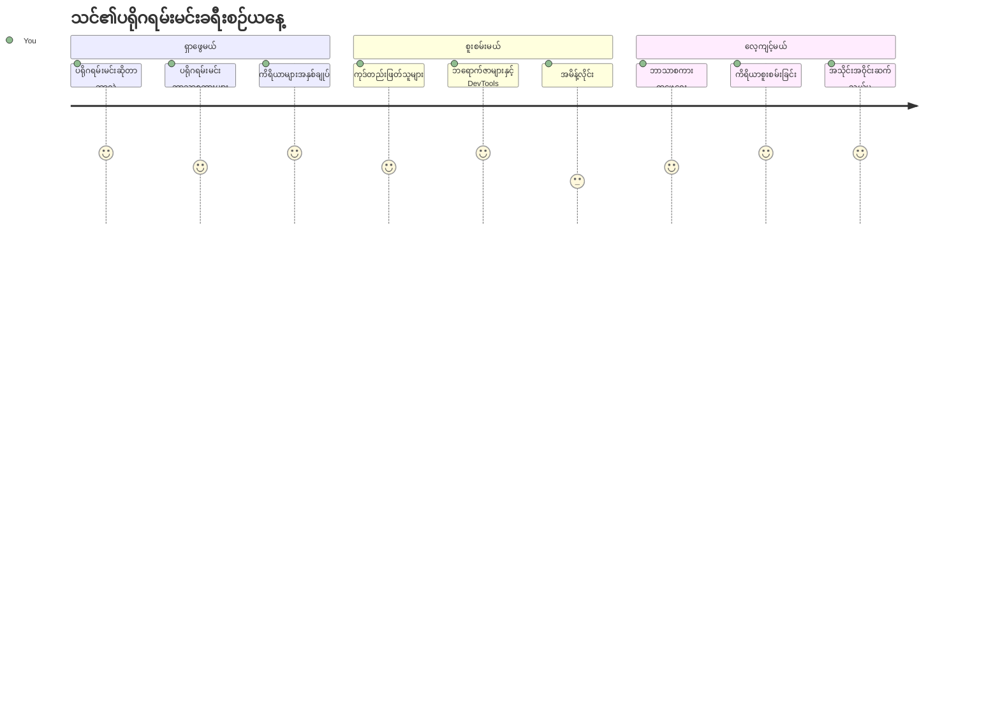
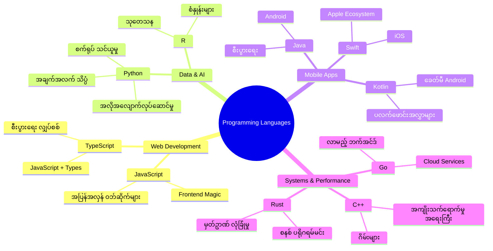
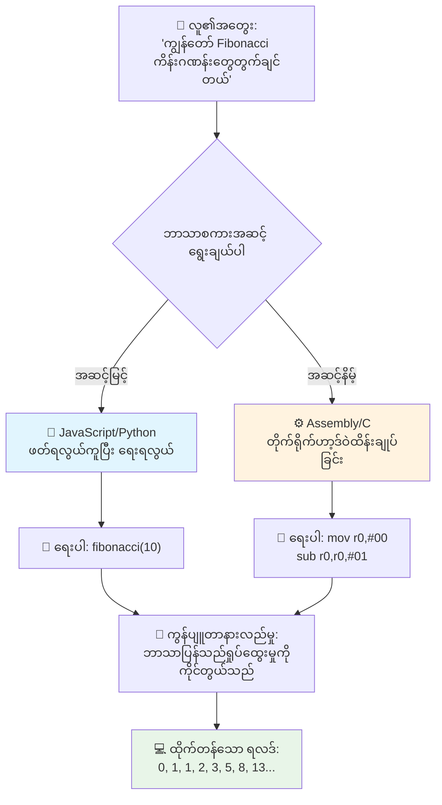
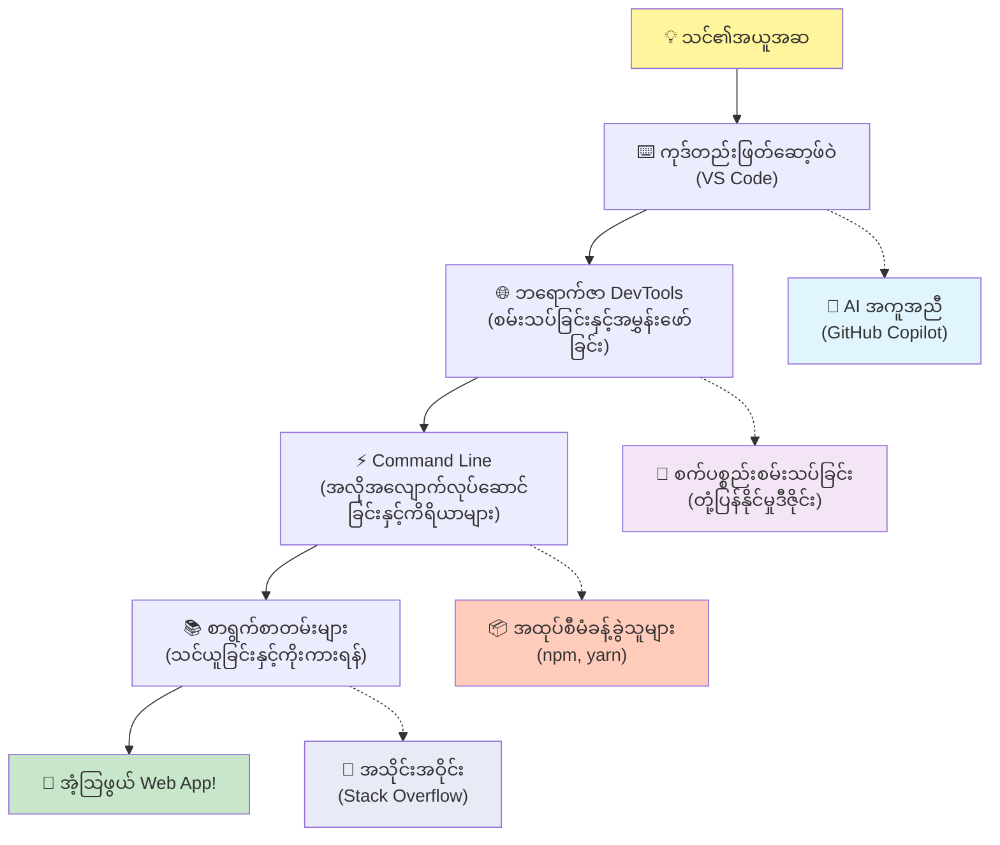
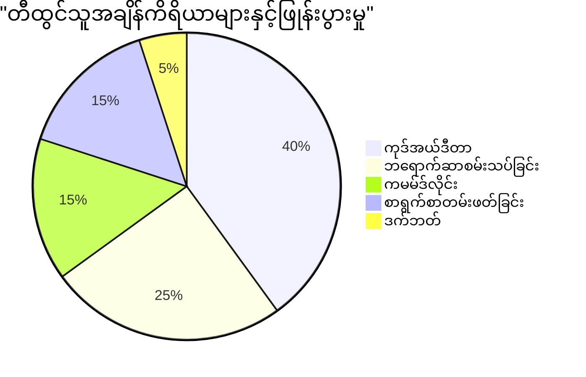
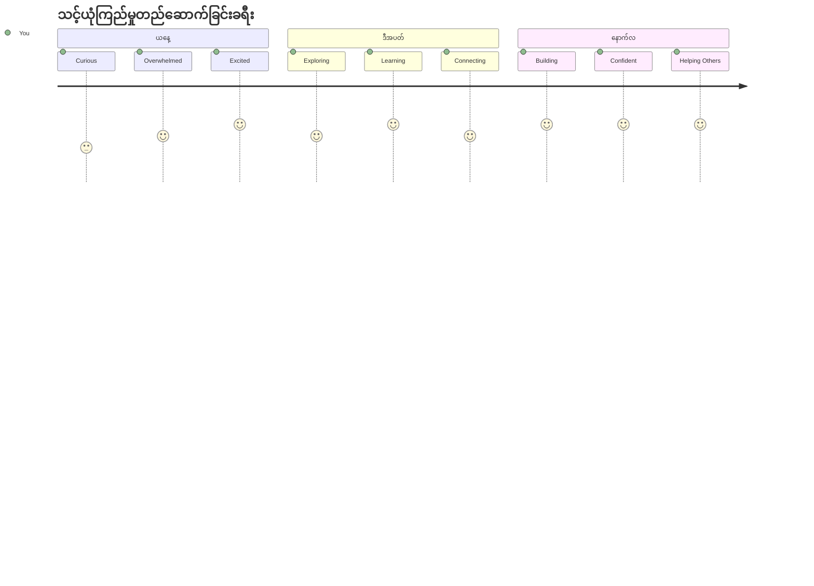

# Programming Languages နှင့် မော်ဒန်း Developer ကိရိယာများအကြောင်းအကျဉ်း ပြန်လည်မိတ်ဆက်ခြင်း
 
မင်္ဂလာပါ ရင်ခုန်နေရသော developer ရှင်! 👋 အချိန်တိုင်းငါ့ကိုအံ့သြစရာပေးတဲ့တစ်ခုခု ပြောပါရစေ။ programming က ကွန်ပျူတာတွေရဲ့အကြောင်းပဲမဟုတ်ပါဘူး – သင့်ရဲ့ရူးသွပ်စရာစိတ်ကူးတွေကို အသက်ဝင်စေဖို့ အမှန်တကယ်ေသာ အထူးကျွမ်းကျင်မှုတွေ ရရှိမယ်ဆိုတာကို သင်တွေ့မြင်တော့မှာပါ!

သင်သည့်အချိန်မှာ သင်အကြိုက်ဆုံး app ကို အသုံးပြုပြီး အရာအားလုံး ထိတွေ့လွယ်ကူစွာကိုက်ညီသွားတဲ့ခံစားချက်ရခဲ့ဖူးပါသလား? ခလုတ်တစ်ခုကို နှိပ်လိုက်တဲ့အခါ "wow, ဘယ်လိုလုပ်ခဲ့တာလဲ?" ဆိုတဲ့အံ့ဩဖွယ် ကိစ္စတွေ ဖြစ်ပေါ်ခဲ့ဖူးလား? ဟုတ်ကဲ့၊ သင်နှင့် တူတဲ့ လူတစ်ဦးက – အကြိုက်ဆုံးကော်ဖီဆိုင်မှာ မနက် ၂ နာရီမှာ Espresso တတိယလုံးကို နေထိုင်ပြီး အဲဒီဆန်းသစ်မှုကို ရေးသားခဲ့တာပါ။ ဒီသင်ခန်းစာကုန်ဆုတ်ချိန်မှာတော့ သင့်စိတ်ကို ဖြေလျော့ပေးမယ့် အရာက အဲဒီသူတွေ ဘယ်လိုလုပ်ခဲ့တယ်ဆိုတာ နားလည်လာမှာပဲမဟုတ်ဘဲ စိတ်လှုပ်ရှားစွာ ပြင်လုပ်ကြည့်ရမဲ့ စိတ်နှောင့်ယှက်ပြုမှု လည်းဖြစ်လာမှာပါ!

ကြည့်ပါ၊ programming က အခုတလောမှာ စိတ်မချရင်နားလည်ပါတယ်။ ငါစတင်လေ့လာတဲ့အချိန်မှာ တကယ်ကို အထူးဂဏန်းရွှင်တို့လို ဖြစ်ရမယ်လို့ ထင်ခဲ့တယ်။ ဒါ့အပြင် ငါ့တွေးမြင်ခဲ့တာက programming က အသစ်တစ်ခုသောဘာသာစကားမှန်သလို စကားပြောနည်းကို သင်ယူနေသလိုပဲ။ "မင်္ဂလာပါ" နဲ့ "ကျေးဇူးတင်ပါတယ်" ဆိုတာကနေ စတင်ပြီး ကော်ဖီမှာမှာဖို့ အသုံးပြုမှုပုံစံကို မျှော်လင့်နိုင်ပါတယ်။ နောက်ပြီးတော့ သင်က ပြင်းထန်တဲ့ ရှုထောင့်ဆိုင်ရာ ဆွေးနွေးချက်တွေ ပြောဆိုနိုင်ပါပြီ။ ဒါပေမယ့် ဒီအချိန်မှာ သင်က ကွန်ပျူတာတွေနဲ့ ပြောဆိုနေတယ်၊ ငြင်းဆန်မှုမရှိတဲ့ ဆွေးနွေးသူတွေ အများဆုံး ဖြစ်လို့ သင့် အမှားတွေအပေါ် သုံးသပ်မှုမရှိဘဲ ထပ်မံကြိုးစားဖို့ အမြဲ စိတ်အားထက်သန်နေတဲ့သူတွေပဲ ဖြစ်ပါတယ်!

ယနေ့မှာ မော်ဒန်းဝက်ဘ်ဖွံ့ဖြိုးတိုးတက်မှုကို ဖြစ်ရပ်မှန် ဖြစ်စေတဲ့ ကိရိယာအသစ်တွေကို လေ့လာမယ်။ Netflix, Spotify နှင့် သင်စိတ်ကြိုက် indie app စတူဒီယိုတွေအပေါ်မှာ တည်ဆောက်တဲ့ editor, browser, workflow တွေကို သင်တွေ့မြင်ပါလိမ့်မယ်။ ဒီအရာတွေ ပိုများတဲ့ အနက်ဖြစ်တာကတော့ ကမ္ဘာကြီးခရီးသွားဖြတ်သန်းနေတဲ့သူတွေ အသုံးပြုတဲ့ professional-grade ကိရိယာတွေ အများစုဟာ အခမဲ့ပဲဆိုတာ ဖြစ်ပါတယ်!


> Sketchnote by [Tomomi Imura](https://twitter.com/girlie_mac)


```mermaid
journey
    title သင်၏ပရိုဂရမ်းမင်းခရီးစဉ်ယနေ့
    section ရှာဖွေမယ်
      ပရိုဂရမ်းမင်းဆိုတာဘာလဲ: 5: You
      ပရိုဂရမ်းမင်းဘာသာစကားများ: 4: You
      ကိရိယာများအနှစ်ချုပ်: 5: You
    section စူးစမ်းမယ်
      ကုဒ်တည်းဖြတ်သူများ: 4: You
      ဘရောက်ဇာများနှင့် DevTools: 5: You
      အမိန့်လိုင်း: 3: You
    section လေ့ကျင့်မယ်
      ဘာသာစကားရှာဖွေရေး: 4: You
      ကိရိယာစူးစမ်းခြင်း: 5: You
      အသိုင်းအဝိုင်းဆက်သွယ်မှု: 5: You
```
## သင်မှာ ဘာတွေသိပြီးသားလဲ ချက်ချင်းကြည့်ကြမယ်!

စိတ်လှုပ်ရှားဖွယ်တွေ ဝင်ရောက်မလို့မတိုင်ခင် အကြိုသိထားမှုကို သိချင်တယ် – programming ကမ္ဘာက ဘာတွေလဲဆိုတာ မင်းက ဘယ်လောက်သိတယ်? နားဆင်ပါ၊ ဒီမေးခွန်းတွေကို ကြည့်ပြီး "ဒီအရာတွေကို ဘာမှမသိဘူး" ထင်လာမယ်ဆိုရင်တော့ အဲဒါကအဆင်ပြေပါတယ်၊ အရာရာခပ်သိမ်း ပိုပါတယ်! ဒါဆိုရင် သင့်ရဲ့နေရာက အတိအကျမှန်ကန်နေပြီ။ ဒီ quiz ကို workout ပြင်ဆင်ခြင်းလို စိတ်ထိန်းချုပ်ခြင်းအဖြစ် ထင်ပါ၊ ဦးနှောက်ကြံ့ခိုင်မှုများကို ချိန်ဆဖြစ်ပါတယ်!

[Take the pre-lesson quiz](https://ff-quizzes.netlify.app/web/)


## အတူတကွ သွားမယ့် စွန့်စားခန်း

ရယ်ဖြန်ကြတယ်၊ ဒီနေ့ငါတို့ လေ့လာကြမယ့် အရာတွေကို ဟာသဖြင့် စိတ်ကူးယဉ်ရင်း ရူးသွပ်နေတယ်! တကယ်လို့၊ သင်အဲ့ဒီခံစားချက်တွေကို ခံစားရဦးမယ့်အခါ မျက်နှာကိုမြင်ချင်ပါတယ်။ ဒီအံ့ဖွယ်ခရီးလမ်းအမှန်ကတော့ -

- **Programming ဆိုတာ ဘာလဲ (ဘာကြောင့် အကောင်းဆုံး ဆန်းသစ်မှုတစ်ခုလည်းဆိုတာ!)** – အဲဒီ ကုဒ်က သင့်ဘယ်ဘက်မှာမဆို လက်ရှိရှိသော အရာအားလုံးကို ခေါ်ဆောင်သွားတဲ့ မမြင်ရသော မတ်တပ်ရပ်သော ဝိညာဉ်ဆန်သော စွမ်းအားဖြစ်နေကြောင်း သိရှိသွားမယ်၊ အဲဒါက တနင်္လာနေ့ မနက်ဖြန်ဒီဇင်ဘာလ ကျောင်းတက်ဖို့သိသော အချိန်၊ Netflix တင်ဆက်မှုများကို အကြံပြုတဲ့ အယ်လိုရစ်သမာတွေပါ။
- **Programming ဘာသာစကားများနှင့် ၎င်းတို့၏ အံ့ဩဖွယ်ဂုဏ်သတ္တိများ** – လူတိုင်းက အထူးစွမ်းအားများနှင့် ပြဿနာဖြေရှင်းနည်းတစ်ခုချင်းစီကို ရှိပြီး အဲဒါကို သင်လုပ်ဖို့ ခွင့်ပြုတာလိုလားကြည့်ပါ။ အဲဒါက programming ဘာသာစကားကမ္ဘာက အခြေအနေတစ်ခုပါ၊ အဲဒီသူတွေနဲ့ တွေ့ဖို့ သင်ကြိုက်နို်င်ပါတယ်!
- **ဒစ်ဂျစ်တယ်အံ့ဖွယ်ဆန်းသစ်မှုဖြစ်စေတဲ့ အခြေခံအုတ်တောင်ကျောက်များ** – ဒါတွေကို အကောင်းဆုံးဖြစ်သွားပြီး LEGO အဖွဲ့အစည်းလို ထက်မြက်ပါစေ။ ဤအစိတ်အပိုင်းများကို နားလည်သွားရင် သင်၏ စိတ်ကူးတွင် ထည့်ထားသော တော်တော်အားလုံးကို တည်ဆောက်နိုင်ပါပြီ။
- **စွမ်းအင်ဆန်းသစ်မှုတစ်ခုလို ခံစားမယ့် professional tools** – ငါပြောတာ မဟုတ်ဘူး၊ အဲဒီ tools တွေက သင့်တွင် အထူးစွမ်းအားရိပ်သာ စွမ်းရည်တွေကို ဖြစ်စေပါလိမ့်မယ်၊ နှင့် အကောင်းဆုံး အပိုင်းက သူတို့ဟာ အပရော်ဖက်ရှင်နယ်တွေသုံးတဲ့ ဆော့ဖ်ဝဲတွေနဲ့တူတဲ့အရာပဲ။

> 💡 **အခုလိုပဲ:** ဒီနေ့မှာ အရာအားလုံးကို မွတ်သိပ်ထားဖို့ မရိုက်ထည့်ပါနဲ့! အခုကျတော့ ငါသင်ကို အခုလိုမျိုး စိတ်ပေါ်လာအောင် ဆန်းစစ်ချင်တာပဲ။ အကြောင်းကြောင်း အသေးစိတ်တွေဟာ ပဲ့တင်ပို့ဆောင်မှုတွေနဲ့ သင်ယူရင်း သိမြင်လာမယ် – ဒါမျိုးမျိုး ပိုမိုနိုင်ပြီဖြစ်တယ်။

> သင်ဒီသင်ခန်းစာကို [Microsoft Learn](https://learn.microsoft.com/en-us/learn/modules/web-development-101/introduction-programming/?WT.mc_id=academic-77807-sagibbon) မှာလည်း လေ့လာနိုင်ပါတယ်။

## Programming ဆိုတာ *ဘာလဲ*?

အိုကေ၊ ဒီသင်ခန်းစာထဲမှာ အဓိက မေးခွန်း တစ်ခုကို ဖြေကြားကြမယ် – programming ဆိုတာ ဘာလဲ?

ငါ့အတွေးကို ချဲ့ထွင်အောင် ဘာသာပြန်ပေးမယ့် မိခင်ကို လမ်းညွှန်ဖို့ ကြိုးစားချိန်မှာ ဖြစ်တယ်။ ငါဘာသာပြန်ပြီး၊ "အနီလက်မကိုနဲ့ နှိပ်ပါ၊ ဒါပေမယ့် ကြီးမားတဲ့ အနီလက်မမဟုတ်ပါဘူး၊ ဘယ်ဘက်က အနီလက်မ သေးငယ်တဲ့လက်မပါ... အိုကေ၊ ယခု နှစ်စက္ကန့်အထိ ဖိထားပါ၊ တစ်စက္ကန့်မဟုတ်ပါ၊ သုံးစက္ကန့်မဟုတ်ပါ..." ဆိုတာတွေ ပြောဆိုတယ်။ နားလည်သလား? 😅

ဒါပဲ programming။ အတိအကျ ပြောရရင် အင်အားကြီးတဲ့ တစ်ခုခုကို နောက်တစ်ဆင့်ချင်းစီအားလုံးကို စနစ်တကျဆက်သွယ်ရန် အနုပညာပဲဖြစ်တယ်။ သင့်မိခင်မှာ ("ဘယ်အနီလက်မလဲ?" မေးနိုင်တဲ့သူ) နဲ့မတူဘူး၊ ကွန်ပျူတာမှာတော့ ("သင်ပြောတာ အချိန်တိုင်း ပြောသိပ်မတတ်ရင်" အနက် မရှိဘဲ တိတိ ကျကျ ဆောင်ရွက်ပါတယ်) ဖြစ်ပါတယ်။

ပထမဆုံးသင်ယူသမိုင်းမှာငါ့ကို အံ့ဩစေခဲ့တာက ကွန်ပျူတာတွေဟာ အရင်ဆုံး အရိုးရှင်းပြီးဖြစ်တယ်။ ၁ နဲ့ ၀ အတွက်တွေ့နိုင်တာဖြစ်ပြီး "ဟုတ်" နဲ့ "မဟုတ်"၊ ဒါမှမဟုတ် "ဖွင့်" နဲ့ "ပိတ်" ဆိုတဲ့ အဓိပ္ပါယ်ပဲ။ ဒါပေမယ့် ဆိုရာမှာ အံ့ဖွယ်ကောင်းတဲ့အချက်က ၁ နဲ့ ၀ တွေကို Matrix ကဲ့သို့ပြောဖို့ မလိုတော့ပါဘူး။ အဲဒါကို ဖော်ပြတဲ့ စကားလုံးတွေက **programming languages** တွေပါ။ သူတို့က သင့်ရဲ့ လူသားတွေးခေါ်မှုပုံစံကို ကွန်ပျူတာများတွက် ဘာသာပြန်ပေးတဲ့ အကောင်းဆုံးဘာသာပြန်သူပဲဖြစ်ပါတယ်။

နောက်ပြီး နံနက်တိုင်း သင့်စိတ်ကြောက်မက်စေတယ်ဆိုတာကတော့ ဒစ်ဂျစ်တယ်ရှိရာ အရာအားလုံးဟာ လူတစ်ယောက်လို တစ်ဖက်ကနေ mass နှုတ်ဆက်ပြီး laptop များစွာပေါ် typing လုပ်ပြီးဖန်တီးခဲ့တာပါ။ Instagram filter တစ်ခုက သင့်ရဲ့ မသိသေးတဲ့ အနုပညာလက်ရာ၊ ကိုယ်ပိုင်သီချင်းပြသမှု အယ်လိုရစ်သမာတွေ၊ ယနေ့ညဟာပိတ်ပွဲဝင်အချုပ်ကို ကိုင်တွယ်ဖို့ ကူညီတယ်တဲ့ app – ဆိုတော့ ဒီအရာတွေမှာ လူတစ်ယောက်ဦးတည်ထားတာ။

programming သင်ယူတဲ့အချိန်မှာ သင်က အသစ်တစ်ခုတင်မဟုတ်ဘဲ စိတ်လှုပ်ရှားစရာ၊ ပွန်းပွားစွာ စဉ်းစားတဲ့ လူမှုအသိုင်းအဝိုင်းတွဲဖက်နေတဲ့ အဖွဲ့ဝင် ဖြစ်လာတာပဲ။ သူတို့က တစ်နေ့တာအတွင်း စဉ်းစားနေတယ်၊ "မတူတဲ့လူတစ်ယောက်ရဲ့နေ့ကို နည်းနည်း ပိုကောင်းစေရန် ဘာတည်ဆောက်လို့ရမလဲ?" ဆိုတာ။ တကယ်တော့၊ ငါးညာမွန်တာဆိုတော့ ဒီထက် ပိုကောင်းသေးတာ ရှိတယ်လား?

✅ **ကောင့်တွန့်မေးခွန်း**: အချိန်ပေး စူးစမ်းကြည့်ပါ – ကမ္ဘာ့ ပထမဆုံးကွန်ပျူတာ programmer ဖြစ်သူ ဘယ်သူလဲ? အကြံပေးတယ် – သူကို မမျှော်လင့်ထားသည့် ပုံစံတစ်ရပ်ဖြစ်နိုင်တယ်! သူ့နောက်ကွယ်ဇာတ်လမ်းဟာ လွန်စွာစိတ်ဝင်စားဖွယ်ကောင်းပြီး programming ဟာ ပြတ္တိဖြေရှင်းမှုနဲ့ ကန့်သတ်မှုအပြင်အဆင်များကို အမြဲတမ်းတွေးထားကြောင်း ပြောပြတယ်။

### 🧠 **စစ်ဆေးကြည့်ခန်း: သင့်ခံစားချက်**

**အချိန်နားလည်ပါ:**
- "ကွန်ပျူတာတွေကို လမ်းညွှန်ချက်ပြောခြင်း" အကြောင်းနားလည်သလား?
- နေ့စဉ်လုပ်ဆောင်ချက်တွေကို programming ဖြင့် автоматတပ်ပြီး ပိုအဆင်ပြေစေချင်တာ ရှိမလား?
- programming ပတ်သက်ပြီး စိတ်ထဲမှာ မေးခွန်းများ ရှိသေးပါသလား?

> **မှတ်သားပါ**: အချို့စာပေများကို သက်ဆိုင်ရာညို့မှုပြုစေခြင်း ganzလေ့လာတဲ့အခါ နားလည်တော့မှာ မဖြစ်နိုင်ပါ။ Programming သင်ယူရတာ သမားရိုးကျ ဘာသာစကားသင်ယူခြင်းလိုပါ – ဦးနှောက်မှာ စနစ်ကျ ဦးတည်ချက်များ ဖန်တီးဖို့ အချိန်လိုပါတယ်။ သင်ကောင်းနေပါတယ်။

## Programming ဘာသာစကားတွေဟာ မတူညီတဲ့ ကြက်သွန်နီအဆီများလိုပဲ

အိုကေ၊ ဒီဟာက ဗဟုသုတဖြစ်စေချင်ပါတယ်၊ programming ဘာသာစကားတွေဟာ ဂီတအမျိုးအစား မတူညီခြင်းနဲ့ တူတယ်။ သင်ကြားလိုက်ပါ – jazz က ကြမ်းတမ်းပြီး စတူးတစ်လို ရှုထောင့်ရှိတဲ့၊ rock က ပါဝါအပြည့်၊ classical က တိက်ပြီး စနစ်တကျ၊ hip-hop က ပြည့်စုံပြီး ရိုးရာစဉ်အဆက်အမြဲဖြစ်။ အသီးသီး ချစ်သူများ၊ သူတို့ရဲ့ထူးခြားသော သဘောတရားတစ်ခုစီရှိပြီး ကာလအမျိုးအစားအလိုက် သင့်တော်ပါတယ်။

Programming ဘာသာစကားတွေကလည်း တူတယ်! နာမ်ဘာနဲ့ သီချင်းတစ်ပုဒ်ထဲမှာ အသုံးပြုပြီး mobile game တစ်ခုက ဖန်တီးရင် သင့်အကြိုက်ဆုံး အသင်းအစစ်အမှန်တို့ ကို စုပေါင်းလိုက်ပါ။

ဒါပေမယ့် ငါအမြဲဘယ်တော့မှ မပျက်နေတာက ဒီဘာသာစကားတွေက ကမ္ဘာမှာ အကောင်းဆုံး အာရုံစိုက်ဆွေးနွေးသူတစ်ယောက်ကို သင့်ဘက်ကစားစေတယ်။ သင့်ရဲ့ လူသားစိတ်ကူးတွေကို နားလည်သလို ပြောကြားနိုင်ပြီး အဲဒီလို ပြောဆိုမှုတွေကို ၁ နဲ့ ၀ ထဲမှာ ပြန်လည်လိုက်စားပေးတယ်။ သင့်နှင့် အတူရှိတဲ့ သူငယ်ချင်းက "လူ့ဖန်တီးမှု" နဲ့ "ကွန်ပျူတာ သံသရာ" ကွဲပြားမှုကို အပြည့်အဝ နားလည်မြင်မြင်နေပြီး ကောင်းမွန်စွာ အားထုတ်ပေးတယ်။ သူတို့က မပင်ပန်း သောက်ရေ မလိုအပ်ဘဲ ထပ်ညွှန်ကြားမှု မှန်မှန် မရလည်လျှင်စာမေးခွန်းတစ်ခုအား မေးတာလည်း စီမံကြပါဘူး။

### လူကြိုက်များတဲ့ Programming ဘာသာစကားများနှင့် အသုံးများမှု


```mermaid
mindmap
  root((Programming Languages))
    Web Development
      JavaScript
        Frontend Magic
        အပြန်အလှန် ဝဘ်ဆိုက်များ
      TypeScript
        JavaScript + Types
        စီးပွားရေး လျှပ်စစ်
    Data & AI
      Python
        အချက်အလက် သိပ္ပံ
        စက်ရုပ် သင်ယူမှု
        အလိုအလျောက်လုပ်ဆောင်မှု
      R
        စံနှုန်းများ
        သုတေသန
    Mobile Apps
      Java
        Android
        စီးပွားရေး
      Swift
        iOS
        Apple Ecosystem
      Kotlin
        ခေတ်မီ Android
        ပလက်ဖောင်းအလွှာများ
    Systems & Performance
      C++
        ဂိမ်းများ
        အကျိုးသက်ရောက်မှု အရေးကြီး
      Rust
        မှတ်ဥာဏ် လုံခြုံမှု
        စနစ် ပရိုဂရမ်မင်း
      Go
        Cloud Services
        လာမည့် ဘက်အင်ဒ်
```
| ဘာသာစကား | သင့်တော်သော နယ်ပယ် | ဘာကြောင့် လူကြိုက်များတာလဲ |
|----------|----------|------------------|
| **JavaScript** | ဝက်ဘ်ဖွံ့ဖြိုးတိုးတက်မှု၊ အသုံးပြုသူအင်တာဖေ့ | Browser များတွင် စက်ခံအသွင့်ဖြစ်ပြီး အပြန်အလှန် ဆက်သွယ်မှုရှိသော ဝက်ဘ်ဆိုဒ်များ ဖန်တီးနိုင်သည် |
| **Python** | ဒေတာ သိပ္ပံ၊ အော်တိုမေရှင်၊ AI | လွယ်ကူပြတ်သားစွာ ဖတ်နိုင်ပြီး စွမ်းအားသာသနာတရားရှိသော စာကြည့်တိုက်များရှိသည် |
| **Java** | စက်မှုလုပ်ငန်းတို့၏ application များ၊ Android apps | အသုံးပြုနိုင်သည့် ပလက်ဖောင်းပေါ်မူတည်မှုမဟုတ်ပြီး ဂရုတစိုက်ကြီးမားသော စနစ်များအတွက် သင့်တော်သည် |
| **C#** | Windows application များ၊ ဂိမ်းဖွံ့ဖြိုးတိုးတက်မှု | Microsoft ပတ်ဝန်းကျင်အတွက် အားကောင်းသော ရရှိမှုရှိသည် |
| **Go** | Cloud ဝန်ဆောင်မှုများ၊ backend စနစ်များ | မြန်ဆန်ပြီး သောကများမရှိဘဲ မော်ဒန် ကွန်ပျူတာ အတွက် ဒီဇိုင်း ပြုလုပ်ထားသည် |

### အဆင့်မြင့် နှင့် နိမ့်အဆင့် ဘာသာစကားများ

ဒါက အမှန်တကယ် ငါစတင်သင်ယူတဲ့အချိန်မှာ ဦးနှောက်ပျက်စီးမှု ရှိခဲ့တဲ့ အကြောင်းအရာဖြစ်လို့၊ ငါ မှီဝဲပေးမယ့် အချက်မှာ ဒီလိုဖြစ်တယ် – နားလည်ဖို့ အနားမလွတ်ပါနဲ့!

နိုင်ငံအသစ်တစ်ခုသို့ သင်သွားလာပြီးဘာသာစကား မတတ်တဲ့အချိန်မှာ အနီးဆုံး ရေချိုးခန်း ရှာဖွေဖို့လိုပါတယ် (ကျွန်တော်တို့အားလုံး ဒီအတွေ့အကြုံရှိဖူးကြတယ်မဟုတ်လား? 😅):

- **နိမ့်အဆင့် programming** ဆိုတာ ဒေသခံစကားလုံးကို အလွန်အကျွံသိပြီး ကမ်းခြေဖျတ်ရာမှာ အရွယ်ရင့်ကြီးမားတဲ့အမျိုးသမီးနှင့် ဆက်ဆံနေသလို ဖြစ်ပါတယ်၊ ဒေသဆိုင်ရာ ရိုးရာစကားများ၊ ဝေါဟာရများနှင့် ယဥ်ကျေးမှု ရယ်သံများ အားလုံးကို သိကောင်းပြီး ထိရောက်စွာ ဆက်နွယ်နေနိုင်ပါတယ်... ကျွမ်းကျင်မှုရှိရင် တကယ်ပဲ နိုင်ပါတယ်! ဘာသာစကား မသိရင် အိမ်သာရှာဖို့ ပြဿနာတွေဖြစ်တတ်ပါတယ်။

- **အဆင့်မြင့် programming** ဆိုတာ ဒေသခံ သူငယ်ချင်းက နားလည်သလိုရှိရင်သေချာပါစေ။ "ကျွန်တော် အိမ်သာလိုအပ်နေတယ်" ဆိုပြီး အင်္ဂလိပ်နဲ့ ပြောပြလိုက်ရင် တစ်ဖက်က ကောင်းမွန်စွာ ဘာသာပြန်ပေးပြီး၊ နားမလည်တဲ့ ဦးနှောက်ကို ကြည်ဖြူစေပြီး လမ်းညွှန်ပေးပါမယ်။

Programming စကားဖြင့်။
- **နိမ့်အဆင့် ဘာသာစကားများ** (Assembly သို့မဟုတ် C ကဲ့သို့) က ကွန်ပျူတာရဲ့ Hardware နဲ့ အလွန်အသေးစိတ် စကားပြောခွင့် ပေးပေမယ့် စက်လို ကျွမ်းကျင် ရှိရမယ်ဆိုတဲ့ စိတ်ဖြေဦး အလိုရှိပါတယ်။
- **အဆင့်မြင့် ဘာသာစကားများ** (JavaScript, Python, C#) က သင့်ကို လူတစ်ယောက်လို သဘောထားနိုင်စေလို့၊ နောက်ကွယ်မှာ စက်စကားပြောဆိုမှုကို ကိုင်တွယ်နေပါတယ်။ ဤဘာသာစကားတွေမှာ လူအသစ်တွေအတွက် နုံလမ်းကောင်း ကူညီပေးသူတွေ့ရှိနိုင်ပါတယ်။

ငါ Suggest လုပ်မယ့် သင်စတင်သင်ယူဖို့ ဘာသာစကားက ဘယ်ဟာလဲ သိချင်လား? 😉 အဆင့်မြင့် ဘာသာစကားများက ကိုယ့်ကိုတတ်မြောက်မှုပိုအဆင်ပြေသလို ဟန်ချက်မှန်တဲ့ training wheels ဖြစ်ပါတယ်။


```mermaid
flowchart TB
    A["👤 လူ၏အတွေး:<br/>'ကျွန်တော် Fibonacci ကိန်းဂဏန်းတွေတွက်ချင်တယ်'"] --> B{ဘာသာစကားအဆင့် ရွေးချယ်ပါ}
    
    B -->|အဆင့်မြင့်| C["🌟 JavaScript/Python<br/>ဖတ်ရလွယ်ကူပြီး ရေးရလွယ်"]
    B -->|အဆင့်နိမ့်| D["⚙️ Assembly/C<br/>တိုက်ရိုက်ဟာ့ဒ်ဝဲထိန်းချုပ်ခြင်း"]
    
    C --> E["📝 ရေးပါ: fibonacci(10)"]
    D --> F["📝 ရေးပါ: mov r0,#00<br/>sub r0,r0,#01"]
    
    E --> G["🤖 ကွန်ပျူတာနားလည်မှု:<br/>ဘာသာပြန်သည်ရှုပ်ထွေးမှုကိုကိုင်တွယ်သည်"]
    F --> G
    
    G --> H["💻 ထိုက်တန်သော ရလဒ်:<br/>0, 1, 1, 2, 3, 5, 8, 13..."]
    
    style C fill:#e1f5fe
    style D fill:#fff3e0
    style H fill:#e8f5e8
```
###အဆင့်မြင့် ဘာသာစကားများ ဘာကြောင့် လူကြိုက်များတယ်ဆိုတာ ငါပြမယ်

ကောင်းပြီ၊ ငါ သင့်ကို အဆင့်မြင့် ဘာသာစကားကြောင့် စိတ်ပျော်ရွှင်ခဲ့တာကို ပုံမှန်ဖော်ပြထားတဲ့ နမူနာတစ်ခု ပြမယ့်အခါ စိတ်ညစ်မိသွားစေမှာ မဟုတ်ပါနဲ့။ ငါ့ကို တစ်ချက် ကတိပေးပါ။ ပထမဆုံးအချို့ code ကို မြင်ရင် စိုးရိမ်မထားပါနဲ့! ဒီအရာက စိတ်ဖိစီးမှု ဖြစ်စေလိုလို့ပါ။

ငါတို့ နှစ်မျိုး ကွဲပြားတာနဲ့ ရေးထားတဲ့ ပထမ Fibonacci စာရင်း ကို ကြည့်ပါမယ် – အကြိမ်ရေ သင်္ချာ ရုပ်သဖွယ်ပုံစံ ဖြစ်ပြီး နံပါတ်တစ်ခုက အရင်နံပါတ် နှစ်ခု ပေါင်းထုတ်ထားတာပါ – 0, 1, 1, 2, 3, 5, 8, 13... (ရှစ်ရှည်သတင်းတစ်ခု – ဒီပုံစံတွေဟာ သဘာဝမှာ အပြည့်အဝ တွေ့ရှိနိုင်တယ် – နေကြာစေ့များ၊ ရေပန်းပျိုး များ၊ ကြယ်စု သဘာဝဖွဲ့စည်းမှုများစသဖြစ်!)

ကွဲပြားချက်ကို ကြည့်ဖို့ ပြင်ဆင်ပါ!

**အဆင့်မြင့် ဘာသာစကား (JavaScript) – လူသားအတွက် ရိုးရှင်းချောမွေ့:**

```javascript
// အဆင့် ၁: အခြေခံ Fibonacci ပြင်ဆင်မှု
const fibonacciCount = 10;
let current = 0;
let next = 1;

console.log('Fibonacci sequence:');
```

**ဒီကုဒ်က ဘာလုပ်တယ်ဆိုတာ:**
- **fixed constant** တစ်ခု သတ်မှတ်သည်။ ထို constant က ကျွန်တော်တို့ လိုအပ်သည့် Fibonacci နံပါတ်အရေအတွက်ဖြစ်သည်။
- **variables နှစ်ခု စတင်ပြီး** လက်ရှိနံပါတ်နှင့် နောက်နံပါတ်ကို ချိန်ညှိထားသည်။
- **စတင်တန်ဖိုးများ** (0 နှင့် 1) ကို Fibonacci ပုံစံအတိုင်း သတ်မှတ်ထားသည်။
- **output အထွက်စာသားကို** Header အဖြစ် ပြသသည်။

```javascript
// အဆင့် ၂: Loop ဖြင့် အလိုက်လိုက်စဉ်ကို ဖန်တီးပါ
for (let i = 0; i < fibonacciCount; i++) {
  console.log(`Position ${i + 1}: ${current}`);
  
  // စဉ်ထဲရှိ နောက်ထပ် နံပါတ်ကို တွက်ချက်ပါ
  const sum = current + next;
  current = next;
  next = sum;
}
```

**ဒီမှာ ဖြစ်ပျက်တာကို ခွဲခြမ်းတော့:**
- **for loop** ဖြင့် လုပ်ဆောင်ချက်ထိတိုင် စဥ်စားသည်။
- **number နှင့် position** တို့ကို Template literal ဖြင့် ပြသသည်။
- **နောက်ထပ် Fibonacci နံပါတ်ကို** လက်ရှိနံပါတ်နှင့် နောက်နံပါတ် ပေါင်းပြီးတွက်ချက်သည်။
- **variables ကို update** ပြုလုပ်၍ အောက်တန်းဟန်ပြုနေသည်။

```javascript
// အဆင့် ၃: ခေတ်မီသော လုပ်ဆောင်မှုနည်းလမ်း
const generateFibonacci = (count) => {
  const sequence = [0, 1];
  
  for (let i = 2; i < count; i++) {
    sequence[i] = sequence[i - 1] + sequence[i - 2];
  }
  
  return sequence;
};

// အသုံးပြုမှုဥပမာ
const fibSequence = generateFibonacci(10);
console.log(fibSequence);
```

**အထက်ပါနမူနာမှာ:**
- **Modern arrow function syntax** ကို အသုံးပြု၍ ပြန်လည်သုံးနိုင်သော function တစ်ခု ဖန်တီးထားသည်။
- **Array တစ်ခုဆောက်ပြီး** နံပါတ်များစွာကို တစ်ခါတည်း တစ်ခုစီပြရန်တင်မထားဘဲ သိမ်းဆည်းထားသည်။
- **Array index ကို အသုံးပြု၍** နောက်ဆုံးနံပါတ်များမှ အသစ်ထုတ်ယူသည်။
- **ပြန်လည် Return** လုပ်၍ application တစ်ခုတွင် အလွယ်တကူအသုံးပြုနိုင်သည်။

**နိမ့်အဆင့် ဘာသာစကား (ARM Assembly) – ကွန်ပျူတာအတွက် သင့်တော်:**

```assembly
 area ascen,code,readonly
 entry
 code32
 adr r0,thumb+1
 bx r0
 code16
thumb
 mov r0,#00
 sub r0,r0,#01
 mov r1,#01
 mov r4,#10
 ldr r2,=0x40000000
back add r0,r1
 str r0,[r2]
 add r2,#04
 mov r3,r0
 mov r0,r1
 mov r1,r3
 sub r4,#01
 cmp r4,#00
 bne back
 end
```

JavaScript ဗားရှင်းဟာ အင်္ဂလိပ်လို ပုံမှန် နည်းလမ်းနဲ့ ဖတ်ရပြီး Assembly ဗားရှင်းကတော့ ကွန်ပျူတာ processor ကို တိုက်ရိုက် ထိန်းချုပ်ဖို့ မျိုးစုံ ကုတ်များမှာ စာလုံးပေါင်းတွေ အသုံးပြုထားတာ တွေ့ရတယ်။ နှစ်ခုလုံးက တစ်ခုတည်းတဲ့ အလုပ်လုပ်ပေးတာဖြစ်ပေမယ့် အဆင့်မြင့် ဘာသာစကားက လူသားတွေအတွက် ပိုလွယ်ကူ နားလည်ရေး၊ ရေးဖွဲ့ရေးနဲ့ ပြုပြင်ပြောင်းလဲရေး အဆင်ပြေပါတယ်။

**အဓိက ကွာခြားချက်များကို သင်တွေ့ရှိမှာ**:
- **ဖတ်ရှုရလွယ်မှု**: JavaScript သည် `fibonacciCount` ကဲ့သို့ ဖော်ပြချက်ပြည့်ဝသော နာမည်များကို အသုံးပြုသောအခါ Assembly သည် `r0`, `r1` ကဲ့သို့ လျှို့ဝှက် အမှတ်အသားများကို အသုံးပြုသည်
- **မှတ်ချက်များ**: အဆင့်မြင့် ဘာသာစကားများတွင် ကိုးကားချက်ရှင်းလင်းမှုများအား စွမ်းအားပေးကာ ကုဒ်ကို ကိုယ်တိုင်စာရွက်စာတမ်းဖြစ်လာစေသည်
- **ဖွဲ့စည်းပုံ**: JavaScript ၏ ယောဂျနည်းလိုင်းသည် လူတစ်ယောက်သည် ပြဿနာများကို တစ်ဆင့်ချင်းစီ အတွေးအခေါ်ပုံစံနှင့် ကိုက်ညီသည်
- **စောင့်ရှောက်မှု**: မတူညီသော လိုအပ်ချက်များအတွက် JavaScript ဗားရှင်းကို အဆင်ပြေစွာ နှင့်ရှင်းလင်းစွာ ပြင်ဆင်နိုင်သည်

✅ **Fibonacci အစဉ်အလာအကြောင်း**: ဒီအလွန်အမင်းလှပသော အရေအတွက်ပုံစံ (အရေအတွက်တစ်ခုချင်းစီသည် ၎င်းမတိုင်မှီနှစ်ခု၏ စုစုပေါင်းနှင့်တူသည်: 0, 1, 1, 2, 3, 5, 8...) သဘာဝတွင် တကယ်အချိန်တိုင်း မြင်တွေ့ရသည်! သင့်သည် နေကြာပန်းပန်းသီးများ၏ စနစ်, ရှေးဟောင်းပင်ပန်းပုံစံများ, nautilus သားလိပ်များ၏လွှမ်းမိုးပုံ, သစ်ပင်ခွံပေါ်နည်းလမ်းများတွင် လည်းတွေ့ရှိနိုင်သည်။ သင်္ချာနှင့် ကုဒ်က သဘာဝ၌ အလှတရားဖန်တီးရန်အသုံးပြုသည့် ပုံစံများကို နားလည်၍ ပြန်လည်ဖန်တီးနိုင်မှု မျှော်လင့်စရာအကြီးကောင်းပါတယ်!

## သို့သော အခြေခံအစိတ်အပိုင်းများ

အိုကေ၊ လက်ရှိ programming ဘာသာစကားများက ဘယ်လို ရှိနေတယ်ဆိုတာတွေ့ပြီးပြီဆိုတော့၊ ကြည့်ပြီးသော အခြေခံအပိုင်းများကို သွားကြည့်ကြမယ်။ သင်နှစ်သက်သည့် ဟင်းချက်ချက်နည်းမှာ မည်သည့်ပစ္စည်းတစ်ခုချင်းစီသည် ဘယ်လိုလုပ်သလဲ တွေ့ရတာလိုမျိုး - အဲဒါကို နားလည်ပြီးပါက ဘာသာစကား မဆို ကိုးကားရေးသားနိုင်ပြီဖြစ်သည်။

ဒါဟာ programming ရဲ့ ဝေါဟာရကို သင်ယူနေသလိုပါ။ ကျောင်းတုန်းက နာမ်၊ ကြိယာနဲ့ စာကြောင်းဖွဲ့စည်းပုံကို သင်ဖတ်ခဲ့တဲ့အခါ ကြားဖူးပါလား။ programming ရဲ့ ကိုယ်ပိုင် grammar ရှိပြီး၊ တကယ်說ဘာသာ စကားgrammarထက် ပိုသေချာပြတ်သားပြီး ကောင်းတာပါ! 😄

### ကြေညာချက်များ: အဆင့်လိုက် အချက်ပြချက်များ

**ကြေညာချက်များ** ဆိုတာက ကွန်ပျူတာနဲ့ စကားပြော တစ်ကြောင်းလိုပါပဲ။ ကြေညာချက်တိုင်းက ကွန်ပျူတာကို တစ်ချက်လောက် အလုပ်လုပ်စေဖို့ လိုက်နာစေသည်။ ဥပမာ- "ဒီမှာဘယ်ဘက်ကို သွားပါ", "နီရောင်မီးမှာ ရပ်ပါ", "ဒီနေရာမှာ ကားရပ်ပါ။"

ကြေညာချက်တွေရဲ့ ဖတ်ရှုရလွယ်မှုက ကောင်းတဲ့အရာပါ။ ဒီကို ကြည့်ပါ:

```javascript
// တစ်ခုတည်းသော လုပ်ဆောင်ချက်များ ပြုလုပ်သော အခြေခံ ပြောကြားချက်များ
const userName = "Alex";                    
console.log("Hello, world!");              
const sum = 5 + 3;                         
```
  
**ဒီကုဒ်ရဲ့ လုပ်ဆောင်ချက်များ:**  
- အသုံးပြုသူနာမည်ကို သိမ်းဆည်းရန် တည်ငြိမ်သော မရေပြားတစ်ခုကို ကြေညာသည်  
- စာလုံးဖတ်ထွက်ထံ အကြောင်းကြားစာတစ်ခု ပြသသည်  
- သင်္ချာဆိုင်ရာ လုပ်ဆောင်ချက်ရလဒ်ကိုတွက်ချက်ပြီး သိမ်းဆည်းသည်  

```javascript
// ဝက်ဘ်စာမျက်နှာများနှင့် အပြန်အလှန်ဆက်ဆံသော ကြေညာချက်များ
document.title = "My Awesome Website";      
document.body.style.backgroundColor = "lightblue";
```
  
**အဆင့်လိုက် အကြောင်းအရာများ:**  
- ဝဘ်စာမျက်နှာ၏ ခေါင်းစဉ်ကို ပြင်ဆင်သည် (ဘရောက်ဇာတဘ်တွင် ပြသသော)  
- စာမျက်နှာ၏ နောက်ခံအရောင်ကို ပြောင်းသည်  

### အမျိုးအစားများ: သင့်ကိုယ်ပိုင် မှတ်ဉာဏ်စနစ်

အိုကေ၊ **အမျိုးအစားများ** ဟာ ကျွန်ုပ်အတွက် သင်ကြားရတာ အရမ်းနှစ်သက်တဲ့အကြောင်းအရာတစ်ခုပါ၊ ဒါဟာ သင့်နေ့စဉ်အသုံးပြုတာတွေနဲ့ သက်ဆိုင်တယ်ဆိုတော့!

လူမှုဆက်သွယ်ရေးနံပါတ်စာရင်းကို စဉ်းစားကြည့်ပါ။ မင်း `မိခင်`, `အကောင်းဆုံးသူငယ်ချင်း`, ဒါမှမဟုတ် `နောက်နေ့၂နာရီထိ ပို့ဆောင်တဲ့ ပီဇာဆိုင်` စတဲ့ နာမ်များသိမ်းဆည်းထားပြီး နံပါတ်တွေကို မမှတ်မိဘဲ ဖုန်းကို ယူထားတယ်။ အမျိုးအစားတွေကလည်း ဒီလိုပါပဲ။ ဒါတွေက သင့်အစီအစဉ်မှာ ဒေတာများကို သိမ်းဆည်းပြီး နောက်မှ အမှန်တကယ် နာမည်နဲ့ ခေါ်ယူနိုင်တဲ့ labeled container တွေပဲ။

အလွန် အထူးသဖြင့်- အမျိုးအစားတွေ ပြောင်းလဲနိုင်တာကြောင့် အလွယ်တကူ အသစ် ပြင်ဆင်ပေးလို့ရတယ် (အဲဒီမှ "variable" ဆိုတဲ့အမည်မျိုးပဲ)။ မင်းအသစ်ကောင်းတဲ့ ပီဇာဆိုင်ကို ရှာတွေ့ရင် အလွယ်တကူ အမျိုးအစားတူ ပြင်နိုင်တယ်။

ဒီအတိုင်း လွယ်ကူစွာရှင်းပြမယ်:

```javascript
// အဆင့် ၁: အခြေခံရင်းနှီးသတ်မှတ်ချက်များ ဖန်တီးခြင်း
const siteName = "Weather Dashboard";        
let currentWeather = "sunny";               
let temperature = 75;                       
let isRaining = false;                      
```
  
**သဘောထားများ သဘောပေါက်ခြင်း:**  
- `const` ကို အသုံးပြုပြီး မပြောင်းလဲနိုင်သော တန်ဖိုးများ သိမ်းဆည်းခြင်း  
- `let` ကို အသုံးပြုပြီး အလုပ်အပြောင်းအလဲရှိဉာဏ်ပညာတန်ဖိုးများကို သိမ်းဆည်းခြင်း  
- အမျိုးအစား များ ချိန်ညှိခြင်း: စာသားများ, နံပါတ်များ, boolean (true/false)  
- အကြောင်းဖော်ပြသော နာမည်များ ရွေးချယ်ခြင်း  

```javascript
// အဆင့် ၂: သက်ဆိုင်ရာဒေတာများကို အုပ်စုဖွဲ့ရန် အရာဝတ္ထုများနှင့် အလုပ်လုပ်ခြင်း
const weatherData = {                       
  location: "San Francisco",
  humidity: 65,
  windSpeed: 12
};
```
  
**အထက်ပါ၌:**  
- ဆက်စပ်သော ရာသီဥတုဆိုင်ရာ ဥပမာတစ်ခုကို အသုံးပြုအရာအား ဆောက်လုပ်သည်  
- အချက်အလက်များစွာကို တစ်ခုတည်းသော အမျိုးအစား အောက်တွင် စုစည်းသည်  
- key-value စနစ်ဖြင့် တစ်စိတ်တစ်ပိုင်း ငြင်းသာတပ်၍ ဖော်ပြသည်  

```javascript
// အဆင့် ၃: မျဉ်းပြောင်းများကို အသုံးပြုခြင်းနှင့် အပ်ဒိတ်လုပ်ခြင်း
console.log(`${siteName}: Today is ${currentWeather} and ${temperature}°F`);
console.log(`Wind speed: ${weatherData.windSpeed} mph`);

// ပြောင်းလဲနိုင်သော မျဉ်းပြောင်းများကို အပ်ဒိတ်တင်ခြင်း
currentWeather = "cloudy";                  
temperature = 68;                          
```
  
**အပိုင်းတစ်ခုချင်းစီ နားလည်ခြင်း:**  
- template literals `${}` နယ်နိမိတ်များဖြင့် သတင်းအချက်အလက် ပြသခြင်း  
- dot notation (`weatherData.windSpeed`) ဖြင့် object property များ ထိန်းသိမ်းတွက်ချက်ရန်  
- `let` ဖြင့် ကြေညာထားတဲ့ variable များကို ပြင်ဆင်ခြင်း  
- မျိုးကြီးတူ variable များ ပေါင်းစပ်ပြီး ဆက်စပ်တန်ဖိုးများ ဖန်တီးခြင်း  

```javascript
// ခြေလှမ်း ၄: ပိုသန့်ရှင်းသောကုဒ်အတွက်ခေတ်မီသောပျိုးပင်ခြင်း
const { location, humidity } = weatherData; 
console.log(`${location} humidity: ${humidity}%`);
```
  
**သိထားရန်လိုအပ်ချက်များ:**  
- destructuring assignment ဖြင့် object-properties ထွက်ယူခြင်း  
- object keys နာမည်များနှင့် အလိုအလျောက် variable အသစ် ဖန်တီးခြင်း  
- dot notation အလွန် မကြာခဏ သုံးခြင်း မလိုအပ်အောင် code ရိုးရှင်းစေခြင်း  

### ထိန်းချုပ်မှု လည်ပတ်မှု: သင့်အစီအစဉ်ကို စဉ်းစားကောင်းစေခြင်း

အိုကေ၊ ဒီမှာ programming က အံ့သြစရာအမြင့်ဆုံး ဖြစ်တာပါပဲ! **ထိန်းချုပ်မှု လည်ပတ်မှု** ဆိုတာ သင့်အစီအစဉ်ကို သင်လုန့်တဲ့အတိုင်း ဖြစ်ထွန်းအောင် စဉ်းစားသော နည်းလမ်းများ သင်ကြားပေးခြင်းပါ။

မနက်ဖြန်မိုးရွာရင် ထီးယူမယ်။ အေးမြေလို့ ဇက်ကတ်ဝတ်မယ်။ နောက်ကျသွားရင် ထမင်းမစားဘဲ ကော်ဖီယူမယ်ဆိုတဲ့ logic ကို စဉ်းစားပါ။ မိမိဘက်ဝဲတွင် ထို if-then လိုက်နာမှု ပုံစံများကို နေ့စဉ် ဒါရိုက်စရာမရှိဘဲ အလုပ်လုပ်နေတယ်!

ဒါကြောင့် ကုဒ်များက ရိုးစွဲသော စာရိုက်မှု မဟုတ်ဘဲ တကယ်သိပ္ပံရပ်မှန်ပြီး အသက်ရှင်လှုပ်ရှားသော ဇာတ်ကောင်တွေလို ဖြစ်စေတယ်။ အချက်အလက်များကို တွက်ချက်ပြီး ရလဒ်ထွက်အောင် လုပ်ဆောင်တယ်! သင့်အစီအစဉ်ကို စိတ်ဥာဏ်ရှိသော နက်နဲတဲ့ ဦးနှောက်တစ်ခု ပေးပြီး ပြောင်းလဲမှုများနှင့် ဆုံးဖြတ်ချက်များ လုပ်နိုင်စေပါတယ်။

အဲဒါက ဘယ်လိုကောင်းမြတ်နိုင်မလဲ၊ ကြည့်ပါ:

```javascript
// အဆင့် ၁: မူလအခြေအနေဆိုင်ရာ ရွေးချယ်မှုရေးရာ ထောက်ခံချက်
const userAge = 17;

if (userAge >= 18) {
  console.log("You can vote!");
} else {
  const yearsToWait = 18 - userAge;
  console.log(`You'll be able to vote in ${yearsToWait} year(s).`);
}
```
  
**ဒီကုဒ်လုပ်တာက:**  
- အသုံးပြုသူအသက်ကို မဲပေးခွင့်လိုအပ်ချက်နှင့် စစ်ဆေးသည်  
- နောက်ဆုံးရလဒ်အပေါ် အခြေခံကာ ကွဲပြားသည့် code block များ ကို လုပ်ဆောင်သည်  
- အသက် ၁၈ နှုတ်မပြည့်လျှင် မဲပေးခွင့် ရရှိမည့် အချိန်ကို တွက်ပြီး ပြသသည်  
- တခြားအခြေအနေများအတွက် ထိရောက်သော အကြံပြုချက်များ ထောက်ပံ့ပေးသည်  

```javascript
// အဆင့် ၂: ဆိုက်ငံ့လှည့်ခြင်းများနှင့်အတူ မျိုးစုံထားသော အခြေအနေများ
const userAge = 17;
const hasPermission = true;

if (userAge >= 18 && hasPermission) {
  console.log("Access granted: You can enter the venue.");
} else if (userAge >= 16) {
  console.log("You need parent permission to enter.");
} else {
  console.log("Sorry, you must be at least 16 years old.");
}
```
  
**မှတ်ချက်များ:**  
- `&&` (နှင့်) ရိုးရာ operator ဖြင့် အခြေအနေများ ပေါင်းစပ်ခြင်း  
- မျိုးစုံအခြေအနေများအတွက် `else if` ဖြင့် အဆင့်တန်းဖွဲ့ခြင်း  
- နောက်ဆုံးတွင် `else` ဖြင့် အခြေအနေ မမှတ်သားဘဲ ဖြစ်နိုင်ခြေ ချုပ်ဆိုခြင်း  
- အခြေအနေတစ်ခုချင်းစီအတွက် အကြောင်းပြချက်အသေးစိတ်ပေးခြင်း  

```javascript
// အဆင့် ၃: သုံးလမ်းရွေးချယ်ခြင်းနဲ့ စည်းကမ်းပြည့်စုံတဲ့ အခြေအနေစစ်တမ်း
const votingStatus = userAge >= 18 ? "Can vote" : "Cannot vote yet";
console.log(`Status: ${votingStatus}`);
```
  
**သတိထားရန်:**  
- အခြေအနေ ရိုးရှင်းသော နှစ်ရွေးစရာအတွက် ternary operator (`? :`) အသုံးပြုသည်  
- ပထမဦးဆုံး အခက်အခဲရေးပြီး `?` ဖြင့်စ၍ true မျာ့နှင့် false ရလဒ်များကိုထည့်သည်  
- အခြေအနေအပေါ်တွင် ထောက်ခံတန်ဖိုး ပေးသည့်အခါ အသုံးပြုရန်  

```javascript
// အဆင့် ၄: အထူးအမှုအခြေအနေများစွာကို ကောင်းစွာကျင့်သုံးခြင်း
const dayOfWeek = "Tuesday";

switch (dayOfWeek) {
  case "Monday":
  case "Tuesday":
  case "Wednesday":
  case "Thursday":
  case "Friday":
    console.log("It's a weekday - time to work!");
    break;
  case "Saturday":
  case "Sunday":
    console.log("It's the weekend - time to relax!");
    break;
  default:
    console.log("Invalid day of the week");
}
```
  
**ဒီကုဒ်အလုပ်ဖြစ်စေသောအချက်များ:**  
- variable တန်ဖိုးကို မတူညီသော ဥပမာများနှင့် ကိုက်ညီမှု ပြုစေသည်  
- ဆက်စပ်သည့် ဥပမာများ (အလုပ်ရက်နေ့များ နှင့် အပတ်ကုန်များ) ကိုစုစည်းသည်  
- ကိုက်ညီမှု မြင်သာသောအခါ သင့်လျော်သော code block ကို ဆောင်ရွက်သည်  
- မမျှော်လင့်သော တန်ဖိုးများကို ထိန်းသိမ်းရန် `default` case ပါထည့်သည်  
- နောက်မှဖြစ်လာရင် မလုပ်ဆောင်အောင် `break` ဖြင့် ရပ်ဆိုင်းသည်  

> 💡 **နမူနာနက်နဲတယ်**: ထိန်းချုပ်မှု လည်ပတ်မှုကို သဘာဝနှင့် လူကြီးဆုံး GPS တစ်ခုလို ထင်နိုင်ပါသည်။ "Main သာလမ်းတွင် ယာဉ်တာရွေ့နေပါက အမြန်ဆုံးလမ်းကို သွားပါ၊ အမြန်လမ်းပိတ်နေပါက ကျေးလက်လမ်းကို စမ်းကြည့်ပါ" ဆိုသလိုဖြစ်သည်။ ကြားနာတတ်သော logic များဖြင့် အခြေအနေများကို အသိပညာနဲ့ တုံ့ပြန်ပေးသည်။

### 🎯 **အကြောင်းအရာ စစ်ဆေးခြင်း: အခြေခံကိရိယာ ကျွမ်းကျင်မှု**

**အခြေခံများမှာ မင်း ဘယ်လိုလုပ်နေတာလဲ ကြည့်ရအောင်:**  
- မင်းရဲ့စကားဖြင့် variable နဲ့ statement ကြားက ကြားခံချက်ကို ရှင်းပြနိုင်မလား?  
- ကျွန်ုပ်တို့ voting ဥပမာကဲ့သို့ if-then ဆုံးဖြတ်ချက် များ အသုံးပြုမယ့် ရဲ့ နေ့စဉ်ဘဝ အခန်းကဏ္ဍတစ်ခု ဆိုလိုက်ပါ  
- programming logic မှာ မင်း အံ့ဩသွားတဲ့ အချက်တစ်ချက် ပြောပါ  

**မြန်စွာ ယုံကြည်မှု တိုးမြှင့်ကမ့်:**  

```mermaid
flowchart LR
    A["📝 မက်ဆေ့ချ်များ<br/>(ညွှန်ကြားချက်များ)"] --> B["📦 အမျိုးအစားများ<br/>(သိုလှောင်မှု)"] --> C["🔀 ထိန်းချုပ်မှုစီးဆင်းမှု<br/>(ဆုံးဖြတ်ချက်များ)"] --> D["🎉 လုပ်ဆောင်နိုင်သောပရိုဂရမ်!"]
    
    style A fill:#ffeb3b
    style B fill:#4caf50
    style C fill:#2196f3
    style D fill:#ff4081
```  
✅ **နောက်တစ်ခုပြီးတော့ မျှော်လင့်သောအရာ**: ဒီအံ့သြဖွယ် concepts တွေကို နက်နဲစွာ အသိပညာရရှိအောင် ကူညီဖို့ ဒီခရီးကို ဆက်လုပ်မှာပါ! လက်ရှိမှာ တစ်ခုချင်းစီအတွက် စိတ်လှုပ်ရှားမှုကိုသာ ဖမ်းဆီးထားပါ။ အတော်များများသော ကျွမ်းကျင်မှုများနှင့် နည်းပညာများမှာ သင်ယူလေ့ကျင့်မှုတွေနဲ့ အလိုအလျောက် ရွေးချယ်ဖြစ်လာမှာ သေချာပါတယ်။ ဒီခရီး သင့်အတွက်အတော်ပင် စိတ်ဝင်စားစရာဖြစ်မယ်!

## ကိရိယာများ

အိုကေ၊ ဒီနေရာမှာ ကျွန်တော် တကယ် စိတ်လှုပ်ရှားစရာ ဖြစ်သွားတာပါ! 🚀 ဒီကား ဝန်းရံပေးမယ့် အံ့ဖွယ်ကိရိယာတွေကို ပြောပြတော့မယ်။

ဟင်းချက်သမားတစ်ယောက်မှာ လက်မောင်းတစ်မောင်းလို မကျေမနပ် စိတ်ချရသောဓားတွေ ရှိသလို၊ သာမန်တေးသမားတစ်ယောက်မှာ ဂီတတီးတစ်လုံးကို လက်တည်သာချိန်မှာသာ သီဆိုနိုင်သလို၊ developer တွေမှာလည်း ဒီစွမ်းအားရှိတဲ့ ကိရိယာတွေရှိတယ်။ အဲဒါတွေက တကယ့်အဖိုးအတန်ကိရိယာတွေဖြစ်ပြီး ထူးခြားစိတျကြီးစွာမှာ ရေးသားရေးလုပ်အားကို ပေးနိုင်စေတယ်။ 

အဲ့ဒီထဲမှာ AI ကို အသုံးပြု၍ ကုဒ်ရေးရာမှ ကူညီပေးတဲ့ အကူအညီပေးသူတွေ၊ Wi-Fi ရရှိသည့်နေရာဘယ်နေရာကမှ ကုဒ်ပြုလုပ်နိုင်မယ့် cloud ဖိနပ်တွေ၊ X-ray vision လို debug လုပ်နိုင်တဲ့ ကိရိယာတွေ ပါဝင်တယ်။

နှလုံးသားထဲက လှုပ်ရှားဖွယ်ကောင်းတာကတော့ အဲဒီကိရိယာတွေအများစုက ဝမ်းသာစရာအမျိုးအစား "အစပိုင်းသင်ယူသူကိရိယာ" မဟုတ်ပဲ၊ Google, Netflix, သင့်အကြိုက် အင်ဒီအက်ပ်စတူဒီယိုတွေရဲ့ ပြင်ပတွင်လည်း ပါဝင် အသုံးပြုနေကြတဲ့ နောက်ဆုံးပေါ် professional-grade ကိရိယာတွေ ဖြစ်တာပါ။ မင်းလုံးဝ အရမ်းကျွမ်းကျင်ပြီးသားလိုခံစားရလိမ့်မယ်!


```mermaid
graph TD
    A["💡 သင်၏အယူအဆ"] --> B["⌨️ ကုဒ်တည်းဖြတ်ဆော့ဖ်ဝဲ<br/>(VS Code)"] 
    B --> C["🌐 ဘရောက်ဇာ DevTools<br/>(စမ်းသပ်ခြင်းနှင့်အမွှန်းဖော်ခြင်း)"]
    C --> D["⚡ Command Line<br/>(အလိုအလျောက်လုပ်ဆောင်ခြင်းနှင့်ကိရိယာများ)"]
    D --> E["📚 စာရွက်စာတမ်းများ<br/>(သင်ယူခြင်းနှင့်ကိုးကားရန်)"]
    E --> F["🚀 အံ့သြဖွယ် Web App!"]
    
    B -.-> G["🤖 AI အကူအညီ<br/>(GitHub Copilot)"]
    C -.-> H["📱 စက်ပစ္စည်းစမ်းသပ်ခြင်း<br/>(တုံ့ပြန်နိုင်မှုဒီဇိုင်း)"]
    D -.-> I["📦 အထုပ်စီမံခန့်ခွဲသူများ<br/>(npm, yarn)"]
    E -.-> J["👥 အသိုင်းအဝိုင်း<br/>(Stack Overflow)"]
    
    style A fill:#fff59d
    style F fill:#c8e6c9
    style G fill:#e1f5fe
    style H fill:#f3e5f5
    style I fill:#ffccbc
    style J fill:#e8eaf6
```  
### ကုဒ် ဆောင်းပါးရေးတည်းဖြတ်သူများ နဲ့ IDE များ: သင့်အသစ်ရ digitaal ကျွန်မိတ်ဆွေများ

ကုဒ် ဆောင်းပါးရေးတည်းဖြတ်ရာတွင်ပေါ်ပေါက်လာပါစို့ – ဒီနေရာတွေက သင့်အကြိုက်ဆုံး အသင်းအဖွဲ့ ဝင်နေရာတွေ ဖြစ်တော့မှာပါ! ဒီနေရာမှာ သင် digital ဖန်တီးမှုများ ကိုက်ညီစွာ ဖန်တီးတော်မူမယ်။

အခုခေတ် အဆင့်မြင့် Editors တွေက ဆောင်းပါးရေးတည်းဖြတ်သူ အဖြစ်သာမက 24/7 ဘေးနားမှာ ထိုင်နေတဲ့ brilliant, support ပေးမယ့် coding mentor တွေလည်း ဖြစ်တယ်။ သင်ရိုက်လို့ ယူမယ်ဆိုသောအတိုင်း typing error များကို စောင့်ကြည့်ပေး၊ coding ကို ပိုမိုထူးချွန်အောင် ကူညီ၊ ဘယ်လို code တစ်ခုစီ အလုပ်လုပ်သလဲကို ကြားနားပေးတယ်။ တချို့ကတော့ မင်းရိုက်ဖြစ်မှာကို ထင်ရှားစေရန် ပျမ်းမျှထက်ပြီး အသုံးပြုမယ့် အရာကို အပြီးလိုက် ပြောပြတတ်ကြတယ်!

ဥပမာ အလိုအလျောက် ဖြည့်စွက်မှု (auto-completion) ကို စတင်တွေ့မြင်တဲ့အခါ အနာဂတျနေ့သားမှာ နေထိုင်နေသလိုခံစားခဲ့ရတယ်။ မင်းဟာ function တစ်ခု ခန့်မှန်းပြီး ရိုက်ရင်း editor က "ဒီ function လုပ်ဆောင်မယ်ဆိုတာ မင်းစဉ်းစားထားသလား?" လို့ ပြောပေးတယ်။ mind-reader တစ်ဦးလို ပေါ့!

**ဘာပဲလို့ editor တွေပြောင်းလဲနေသလဲ?**

ခေတ်သစ် code editor တွေမှာ productivity တိုးတက်စေဖို့ feature များစွာ ပါဝင်တယ်:

| Function | အကြောင်း | အကျိုးသက်ရောက်မှု |
|---------|--------------|--------------|
| **Syntax Highlighting** | code ၏ အပိုင်းများကို အရောင်ပေးသည် | ကုဒ်ဖတ်ရှုရလွယ်ကူပြီး အမှားတွေရှာဖွေချင်ရလွယ်စေသည် |
| **Auto-completion** | မင်းရိုက်နေသူအတိုင်း ကုဒ်ကို အကြံပေးသည် | coding အမြန်မြှင့်ပြီး စာလုံးမှားမှု လျော့ချပေးသည် |
| **Debugging Tools** | error တွေရှာ ဖယ်ရှားရာကူညီသည် | ဆင့်ကဲခြင်းနာရီများ လျှော့ချပေးသည် |
| **Extensions** | အထူးပြု feature များ ထည့်သွင်းနိုင်သည် | သင်၏ editor ကို နည်းပညာ အမျိုးမျိုး အတွက် ကိုက်ညီစေသည် |
| **AI Assistants** | ကုဒ်နှင့် ရှင်းလင်းချက်များ အကြံပေးသည် | သင်ယူမှုနှင့် လုပ်ငန်းဆောင်တာ ပိုမိုမြန်ဆန်စေသည် |

> 🎥 **ဗွီဒီယို အရင်းအမြစ်**: ဒီကိရိယာတွေ အသုံးပြုပုံ ကြည့်ရှုချင်ရင် [Tools of the Trade video](https://youtube.com/watch?v=69WJeXGBdxg) ကို ကြည့်လိုက်ပါ။

#### ဝက်ဘ်ဖန်တီးမှုအတွက် အကြံပြု editor များ

**[Visual Studio Code](https://code.visualstudio.com/?WT.mc_id=academic-77807-sagibbon)** (အခမဲ့)  
- ဝက်ဘ်ဖန်တီးသူများအကြား အလွန်နာမည်ကြီးသော editor  
- Extension ecosystem ကောင်းမှုပြည့်ဝသည်  
- terminal နှင့် Git ပါဝင်သည်  
- **လိုအပ်သော extension များ**:  
  - [GitHub Copilot](https://marketplace.visualstudio.com/items?itemName=GitHub.copilot) - AI ဖြင့် ကုဒ်ဆွဲပြချက်  
  - [Live Share](https://marketplace.visualstudio.com/items?itemName=MS-vsliveshare.vsliveshare) - အချိန်နှင့်တပြေးညီ ပူးပေါင်းရေးသားမှု  
  - [Prettier](https://marketplace.visualstudio.com/items?itemName=esbenp.prettier-vscode) - ကုဒ်ကို အလိုအလျောက် ပရောဖောမက်ခြင်း  
  - [Code Spell Checker](https://marketplace.visualstudio.com/items?itemName=streetsidesoftware.code-spell-checker) - ကုဒ်လုံးပေါက်မှားရေးစစ်ခြင်း  

**[JetBrains WebStorm](https://www.jetbrains.com/webstorm/)** (စာရင်းပေးဆောင်ရပြီး၊ ကျောင်းသားများအခမဲ့)  
- တိုးတက်သော ပြန်လည်စစ်ဆေးမှုနှင့် စမ်းသပ်စက်ကိရိယာများ  
- အတှကျဆင့်-ကုဒ်ပြည့်စုံစနစ်  
- ဖွဲ့စည်းထားသော ရုပ်ပိုင်းများနှင့် အပြောင်းအလဲစီမံခန့်ခွဲမှု  

**Cloud-Based IDEs** (စျေးနှုန်းကွဲပြားမှုများ)  
- [GitHub Codespaces](https://github.com/features/codespaces) - browser ထဲတွင် VS Code အပြည့်အစုံ  
- [Replit](https://replit.com/) - သင်ယူရေးနှင့် မျှဝေရေးအတွက်ကောင်းမှု  
- [StackBlitz](https://stackblitz.com/) - အမြန်ဆုံး၊ full-stack ဝက်ဘ်ဖန်တီးမှု  

> 💡 **စတင်သုံးစွဲခြင်း အကြံပြုချက်**: Visual Studio Code နဲ့ စတင်ပါ – အခမဲ့၊ များစွာ အသုံးပြုတယ်၊ များစွာသော အဖွဲ့အစည်းများ သင်ကြားမှုနဲ့ Extension များ ဖန်တီးနေပြီဖြစ်တာကြောင့် အရမ်းအထောက်အကူဖြစ်လိမ့်မယ်။  

### ဝက်ဘ် ဘရောက်ဇာ: သင်၏လျှို့ဝှက် ဖန်တီးမှုလေ့လာခန်း

အိုကေ၊ စိတ်အမြန်အမြင့်တက်ဖို့ ပြင်ဆင်ထားပါ! နဲ့ ကမ့်သည် နောက်ဖက်မှာ developer tools လျှို့ဝှက်ခန်းတစ်ခုကို ဖုံးကွယ်ထားခဲ့တဲ့ ဘရောက်ဇာကို သင်အသုံးပြုနေပါသလား? အခုထိ ဖော်ထုတ်ဖော်ပြဖို့ စောင့်ဆိုင်းနေခဲ့တာပါ!

ဝက်ဘ်စာမျက်နှာဘက်ကို ဖက်နှိပ်၍ "Inspect Element" ရွေးချယ်တိုင်း၊ သင့်ရှေ့တွင် developer tools များ၏ ပြတင်းပေါက်ပိတ်မခံနိုင်စိတ်ကူးတစ်ခု ပေါ်ပေါက်လာပါသည်။ ဒီကိရိယာတွေက ကျွန်ုပ်တို့ဟာ တစ်ကြိမ်မှာ ရေတွက်ကြည့်ရင် ဒေါ်လာရာနဲ့ ပဲ စျေးထားတဲ့ software တွေထက် ပို စွမ်းဆောင်ရည်မြင့်တယ်။ စားသောက်ခန်းလက်ငင်းမျှော်မှန်းမရသော စီမံခန့်ခွဲမှု ခန်းမဖြစ်ပါတယ်!
ပထမဆုံးတစ်ယောက်ယောက်က browser DevTools ကိုပြသပေးတဲ့အခါမှာ၊ ကျွန်တော် သုံးနာရီလောက် တိုးတိုးမြှောက်မြှောက်နှိပ်ကာ "သတိရပါဦး၊ ဒါကိုပါ လုပ်လို့ရမယ်လား?!" လို့ထင်ခဲ့ပါတယ်။ သင်ဟာ တကယ်တမ်းအားဖြင့် မည်သည့်ဝက်ဘ်ဆိုဒ်မဆို တိုက်ရိုက်ပြင်ဆင်နိုင်တယ်၊ အရာရာဘယ်လောက်မြန်မြန် ကွန်တိန်းလုပ်ဆောင်နေသလဲ ချက်ချင်းကြည့်ရှုနိုင်တယ်၊ သင့်ဆိုဒ်ကို အမျိုးမျိုးသောစက်ပစ္စည်းများပေါ်မှာ ဘယ်လိုကြည့်ရမလဲ စမ်းသပ်နိုင်တယ်၊ နောက်ပြီး JavaScript ကိုလည်း လုံးဝကျွမ်းကျင်သူလို မှတ်ပုံတင်ပြင်ဆင်နိုင်တယ်။ ဒါက တကယ်အံ့ဩစရာပါပဲ!

**အဲ့ဒါကြောင့် browser တွေက သင့်ရဲ့လျှို့ဝှက်လက်နက်ဖြစ်တယ်ဆိုတာ ဖြစ်တာက ဒီတော့ပါ:**

ဝက်ဘ်ဆိုဒ် သို့မဟုတ် ဝက်ဘ်အက်ပ်လိကေးရှင်းတစ်ခု ဖန်တီးတဲ့အခါမှာ၊ ကမ္ဘာလောကမှာ ဘယ်လိုပုံပေါ်တယ်၊ ဘယ်လိုသဘောထားပြုလုပ်တယ်ဆိုတာ ကြည့်ရှုဖို့လိုပါတယ်။ Browser များက သင့်လုပ်ဆောင်မှုကို ပြသပေးတာကပဲ မဟုတ်ပဲ၊ စွမ်းဆောင်ရည်၊ အသုံးပြုနိုင်မှုနှင့် ဖြစ်နိုင်တဲ့ ပြဿနာများအကြောင်း အသေးစိတ်တုံ့ပြန်ချက်များကိုပါပံ့ပိုးပေးပါတယ်။

#### Browser Developer Tools (DevTools)

ခေတ်မှီ browser များဟာ ဖန်တီးသူဆော့ဖ်ဝဲများ အပြည့်အဝပါဝင်ပါတယ်-

| ကိရိယာ အမျိုးအစား | အလုပ်လုပ်ပုံ | သုံးစွဲမှုဥပမာ |
|---------------|--------------|------------------|
| **Element Inspector** | HTML/CSS ကို အချိန်နှင့်တပြေးညီ ကြည့်ရှု ပြင်ဆင်နိုင် | တိုက်ရိုက်မကြာခဏ ပုံစံပြင်ဆင်ခြင်း |
| **Console** | အမှားစာတန်းများအား ကြည့်ရှု သပ်မတ် JavaScript ကို စမ်းသပ် | ပြဿနာများ ဖြေရှင်းခြင်းနှင့် ကုဒ် စမ်းသပ်မှု |
| **Network Monitor** | အရင်းအမြစ်ဘယ်လိုပေါက်ကြောင်း စောင့်ကြည့်ခြင်း | စွမ်းဆောင်ရည်နှင့် ယခုပြန်ဘယ်လောက်လျှော့ချရန် စမ်းသပ်ခြင်း |
| **Accessibility Checker** | ကာမရှင်ဖက်ဆိုင် ဒီဇိုင်း စစ်ဆေးခြင်း | အသုံးပြုသူအားလုံးအတွက် သင့်ဆိုဒ် အလုပ်လုပ်စေလိုချက် |
| **Device Simulator** | မျိုးစုံသော စကင်းအရွယ်အစားပေါ်မှာ ကြည့်ရှုရန် | စကင်းလှုပ်ရှားမှုဒီဇိုင်း စမ်းသပ်ခြင်း |

#### ဖန်တီးမှုအတွက် အကြံပြု browser များ

- **[Chrome](https://developers.google.com/web/tools/chrome-devtools/)** - စံချိန်စံညွှန်း DevTools နှင့် အသေးစိတ်စာရွက်စာတမ်းများ
- **[Firefox](https://developer.mozilla.org/docs/Tools)** - CSS Grid နှင့် အသုံးပြုနိုင်မှုကိရိယာ အထူးကောင်းမွန်
- **[Edge](https://docs.microsoft.com/microsoft-edge/devtools-guide-chromium/?WT.mc_id=academic-77807-sagibbon)** - Chromium အခြေခံပြီး Microsoft ၏ဖန်တီးသူရင်းမြစ်များပါရှိ

> ⚠️ **အသိပေး စမ်းသပ်မှု အကြံပြုချက်**: မိမိ ဝက်ဘ်ဆိုဒ်များကို browser အမျိုးမျိုးမှာ စမ်းသပ်ဖို့ အမြဲတမ်းလိုသည်! Chrome မှာ ပြီးပြည့်စုံတဲ့အရာတွေဟာ Safari ဒါမှမဟုတ် Firefox မှာ ကွာခြား ကြည့်ပါလိမ့်မယ်။ အတန်းစား ဖန်တီးသူများက major browser ကြီးများအားလုံးမှာ စမ်းသပ်ပြီး အသုံးပြုသူတွေ စိတ်ကျေနပ်မှုကို သေချာဆောင်ရွက်ကြပါတယ်။

### Command Line Tools: Developer Superpowers များသို့ ရောက်ရှိဖို့ သင့်လမ်းဝင်

ကောင်းပြီ၊ Command line ကို ပိုမိုရင်းနှီးစွာ သတိထားလေ့လာဖို့၊ ရိုးသားစွာ ပြောရရင်၊ ပထမဆုံး Command line ကို တွေ့သမျှပြောရရင် - အဲဒါက မျက်စိထဲ တောက်ပသောစာသားလိပ်ရူပါသော အနက်ရောင် စာမျက်နှာတစ်မျက်နဲ့ တူတဲ့ကြောက်စရာတစ်ခုလို ပြရတယ်။ ကျွန်တော် "မဖြစ်ပါ၊ ကောင်းကောင်းလူမဟုတ်ပါဘူး! 1980s hacker ရုပ်ရှင်ကနေထွက်လာတဲ့ အရာတစ်ခုလိုတယ်!" ဆိုပြီး စိတ်ချန်နေတာပါ။ 😅

ဒါပေမယ့်၊ တချို့သူငယ်ချင်းတွေက ပြောခဲ့ရင် အခုမှာ သင့်ကို ပြောချင်တာကတော့ အဲ့ဒါက ကြောက်စရာမဟုတ်ဘူး – တကယ်တော့ကွန်ပျူတာနဲ့ ပြောဆိုတာလိုတယ်။ အစားအသောက်မှာ ဓာတ်ပုံနဲ့ မီနူးပါတဲ့ fancy app မှာ အော်ဒါပေးတာနဲ့ (နူးညံ့ပြေပြစ်) သင်ကြိုက်တဲ့အရာကောင်းတစ်ခုကို သိတဲ့ မီးဖိုချောင်မှာတစ်ကိုယ်တော်ဝင်ပြီး "အံ့ဩစရာ တစ်ခု လုပ်ပေးပါ" လို့ ပြောတဲ့ကွာခြားချက်အတိုင်းပါ။

Command line က အဲ့ဒီ့အရာကို Developer တွေကိုအံ့ဖွယ်ဆန်းသစ်ချက်တွေ လုံးဝမီးမောင်းကစားသလို ဖြစ်စေပါတယ်။ တချို့ စကားလုံးများကို ရိုက်ထည့်ပြီး (အိုကေ၊ အဲ့ဒါက command တွေပဲ ဖြစ်ပေမယ့် စိတ်ကူးယဉ်ဆန်စေပါတယ်) enter နှိပ်လိုက်တာနဲ့ BOOM – လုံးဝပရောဂျက်ဖွဲ့စည်းမှုတွေ ဖန်တီးသွားတယ်၊ ကမ္ဘာအနှံ့က စွမ်းအားကြီးတဲ့ကိရိယာတွေကို တပ်ဆင်လိုက်တယ်၊ သို့မဟုတ် သင့် app ကို အင်တာနက်ပေါ် မီလျံပေါင်းကြီးတွေ ကြည့်ရှုနိုင်ဖို့ ထုတ်ဝေသွားတယ်။ ဒီစွမ်းအားကို ပထမဆုံးခံစားလိုက်ရင်၊ အရမ်းလေးစားဖို့ဖြစ်ပါတယ်!

**Command line ကို ဘာကြောင့် သင်၏သဘောကျဆုံးသော ကိရိယာဖြစ်လာမည်နည်း**

ဂရပ်ဖစ်အင်တာဖေ့စ်များဟာ အများပြည်သူအတွက်ကောင်းခဲတယ်။ ဒါပေမယ့် command line က အလိုအလျောက်လုပ်သက်၊ တိကျမှု၊ နာရီအရှိန်မှာထူးခြားပါတယ်။ ဖန်တီးမှုကိရိယာအများစုက command line မှာ သည်းခံနေရပြီး၊ အဲဒီကို တည့်တည့်အသုံးပြုပြီး သင် ရလဒ်တွေကို ထူးခြားစွာ တိုးတက်မှုရှိစေပါတယ်။

```bash
# အဆင့် ၁: ပရောဂျက်ဖိုဒါကို ဖန်တီးပြီး သွားရောက်ရန်
mkdir my-awesome-website
cd my-awesome-website
```

**ဒီကုဒ်က ဘာလုပ်တယ်ဆိုတာ:**
- **"my-awesome-website"** ဆိုတဲ့ directory အသစ်တစ်ခု ဖန်တီးသည်
- အသစ်ဖန်တီးထားတဲ့ directory ထဲကို ဝင်ရောက်ကုဒ်ရေးစမည်

```bash
# အဆင့် ၂: package.json ဖြင့် ပရောဂျက်စတင်ဖွင့်ပါ
npm init -y

# ခေတ်သစ် တိုးတက်ဖွံ့ဖြိုးရေးကိရိယာများ ထည့်သွင်းတပ်ဆင်ပါ
npm install --save-dev vite prettier eslint
npm install --save-dev @eslint/js
```

**တစ်ဆင့်ချင်း အဖြစ်ဖြစ်ပုံများ:**
- `npm init -y` နဲ့ Node.js ပရောဂျက်အသစ်ကို မူလဖွဲ့စည်းမှုဖြင့် စတင်သည်
- အဆင့်မြင့်အဆောက်အအုံ Vite ကို တပ်ဆင်သည်၊ ဖွံ့ဖြိုးမှုနှင့် ထုတ်လုပ်မှုအတွက် အကောင်းဆုံးကိရိယာ
- Prettier ကို ကုဒ်အလိုအလျော့ ဖော်မက်ဖို့၊ ESLint ကို ကုဒ်အရည်အသွေး စစ်ဆေးရန် ထည့်သွင်းသည်
- `--save-dev` flag နဲ့ ဤကိရိယာများကို ဖန်တီးသူအဆင့် မဟုတ်သော dependencies အဖြစ် မှတ်သားသည်

```bash
# အဆင့် ၃: ပရောဂျက်ဖွဲ့စည်းမှုနှင့်ဖိုင်များ ဖန်တီးပါ
mkdir src assets
echo '<!DOCTYPE html><html><head><title>My Site</title></head><body><h1>Hello World</h1></body></html>' > index.html

# ဖွံ့ဖြိုးတိုးတက်မှုဆာဗာကို စတင်ပါ
npx vite
```

**အထက်မှာ ကျွန်တော်တို့:**
- မူလကုဒ်နှင့် ပစ္စည်းများအတွက် အထူးဖိုင်ပေါက်များ ဖန်တီး၍ ပရောဂျက် စနစ်တကျ စီစဉ်သည်။
- မှန်ကန်သော စာရွက်စနစ်အတိုင်း မူလ HTML ဖိုင် တစ်ခု ဖန်တီးသည်
- Vite ဖွံ့ဖြိုးရေးဆာဗာကို စတင်ပြီး Live Reloading နှင့် Hot Module Replacement ကိုအသုံးပြုသည်

#### ဝက်ဘ်ဖန်တီးမှုအတွက် မဖြစ်မနေနဲ့ Command Line ကိရိယာများ

| ကိရိယာ | ရည်ရွယ်ချက် | ဘာကြောင့်လိုသလဲ |
|------|---------|-----------------|
| **[Git](https://git-scm.com/)** | ဗားရှင်းထိန်းချုပ်မှု | ပြောင်းလဲမှုများ စောကြည့်နည်း၊ အဖွဲ့လိုက်လုပ်ဆောင်ခြင်း၊ အလုပ်စာရွက်များ ကူးယူခြင်း |
| **[Node.js & npm](https://nodejs.org/)** | JavaScript runtime နှင့် package စီမံခန့်ခွဲမှု | Browser ပြင်ပတွင် JavaScript ဆားပင်ဘက် အသုံးပြုခြင်း၊ နောက်ဆုံးပေါ် ဖန်တီးမှုကိရိယာများ ထည့်သွင်းခြင်း |
| **[Vite](https://vitejs.dev/)** | Build ကိရိယာနှင့် dev ဆာဗာ | အလွန်မြန်ဆန်သော ဖွံ့ဖြိုးမှု၊ Hot Module Replacement ပါဝင်သည် |
| **[ESLint](https://eslint.org/)** | ကုဒ်အရည်အသွေးစစ်ဆေးခြင်း | JavaScript မှာ ပြဿနာများကိုကိုယ်တိုင် ရှာဖွေပြင်ဆင်ပါသည် |
| **[Prettier](https://prettier.io/)** | ကုဒ်ဖော်မတ်ရေး | ကုဒ်ကို အမြဲတမ်း တိကျချောမွေ့ စေပြီး ဖတ်ရှုရလွယ်ကူအောင်ထားသည် |

#### စနစ်ပလက်ဖောင်းအလိုက် ရွေးချယ်မှုများ

**Windows:**
- **[Windows Terminal](https://docs.microsoft.com/windows/terminal/?WT.mc_id=academic-77807-sagibbon)** - ခေတ်မှီ၊ အင်္ဂါရပ်ပြည့်စုံဆုံး terminal
- **[PowerShell](https://docs.microsoft.com/powershell/?WT.mc_id=academic-77807-sagibbon)** 💻 - စွမ်းအားပြင်းသော scripting ပတ်ဝန်းကျင်
- **[Command Prompt](https://docs.microsoft.com/windows-server/administration/windows-commands/?WT.mc_id=academic-77807-sagibbon)** 💻 - ရိုးရိုး Windows command line

**macOS:**
- **[Terminal](https://support.apple.com/guide/terminal/)** 💻 - စနစ်တစ်ခုအတွင်း ပါရှိသော terminal app
- **[iTerm2](https://iterm2.com/)** - ထူးခြားစွာ တိုးတက်တင်မြှောက်ထားသော terminal

**Linux:**
- **[Bash](https://www.gnu.org/software/bash/)** 💻 - ရိုးရာ Linux shell
- **[KDE Konsole](https://docs.kde.org/trunk5/en/konsole/konsole/index.html)** - အဆင့်မြင့် terminal emulator

> 💻 = စနစ်တပ်ဆင်ပြီးသော

> 🎯 **သင်ယူမှုလမ်းညွှန်**: အခြေခံ command များဖြစ်တဲ့ `cd` (directory ပြောင်းရန်), `ls` ဒါမှမဟုတ် `dir` (ဖိုင်စာရင်းဖော်ရန်), `mkdir` (ဖိုင်ပေါက်ဖန်တီးရန်) ကို စတင်လေ့ကျင့်ပါ။ `npm install`, `git status` နှင့် `code .` (အဲဒီနေရာ VS Code ဖြင့်ဖွင့်ရန်) စတဲ့ နောက်ဆုံးပေါ် workflow command များကိုလည်း အသုံးပြုရန် လေ့လာပါ။ နောက်ပိုင်းမှာ ပိုမိုကျွမ်းကျင်လာချိန်မှာ advanced command များနှင့် automation နည်းလမ်းများကို သဘာဝတရားလို တစ်ဆင့်တိုးလေ့လာပါလိမ့်မယ်။

###စာရွက်စာတမ်းများ: သင်၏ အမြဲရရှိနိုင်သော သင်ယူမှုလမ်းညွှန်

အိုကေ၊ စိတ်တိုင်းကျ beginner ဖြစ်နေတဲ့ မိမိကိုယ်ကိုပိုမိုသက်သာစေဖို့ လျှို့ဝှက်ချက်တစ်ခုမျှဝေရမယ်။ အတွေ့အကြုံရှိတဲ့ Developer အများစုဟာ အချိန်အများစုကို Documentation ဖတ်ခြင်းဆီမှာဖြတ်သိမ်းကြတယ်။ ဒါဟာ သူတို့ဘာလုပ်နေလဲ မသိတာမဟုတ်ပါဘူး – အတက်ပညာကြီးမှု လက္ခဏာတစ်ခုပါပဲ!

Documentation ကို ကမ္ဘာ့အကြင်နာဆုံး၊ ပညာရှင်အကောင်းဆုံး ဆရာတွေကို 24/7 ရနိုင်သလို စဉ်ဆက်မပြတ်မှာနေရတဲ့အတိုင်း ယူဆကြပါ။ မနက် ၂ နာရီမှာ ပြဿနာတစ်ခုတွင်ကြုံရလျှင် Documentation က လှပတဲ့ virtual ဖမ်းခေါင်းနဲ့ သင့်အတွက်လိုအပ်တဲ့ ဖြေဆိုချက်ကိုပေးပါတယ်။ အသစ်ထွက်သန့်စင်သည့် လုပ်ဆောင်ချက်တစ်ခုလေ့လာချင်လျှင် Documentation ကို သင့်ပြီးခဲ့တဲ့အတိုင်း အဆင့်ဆင့် ဥပမာတွေနဲ့ ရှင်းပြပေးပါတယ်။ ဘာဖြစ်လို့ အဲ့ဒီအခြေအနေ လုပ်ဆောင်နေတာလဲဆိုတာ နားလည်ဖို့ ကြိုးစားရင် - ဖြေရှင်းပုံကတော့ documentation ဖြစ်ပါတယ်။

ကျွန်ုပ် ကိုယ်တိုင်အတွေ့အကြုံလည်း ပြောင်းလဲမှုကြီးဖြစ်ခဲ့ပါတယ်။ ဝက်ဘ်ဖန်တီးမှုကမ္ဘာလောကက အလွန်မြန်မြန်တိုးတက်နေပြီး၊ တစိတ်တပိုင်းအားလုံးကို မှတ်မိထားတာ မရှိပါဘူး။ Senior developer ၁၅ နှစ်ကျော်အတွေ့အကြုံရှိသူတွေကိုလည်း အခြေခံ syntax ကို အချိန်ပေးရှာဖွေနေကြတာတွေ မြင်ခဲ့တယ်။ ဒါက အရမ်းနောက်ကျတာရော မဟုတ်ပါဘူး သေချာပါပြီ။ မှတ်ဉာဏ်ကောင်းတာကို မဟုတ်ပါဘူး၊ အဆင်ပြေတဲ့ ဖြေရှင်းချက်တွေကို ပြီးမြောက်မြန်ဆန်စွာ ရှာဖွေချင်တာပါ။

**အမှန်တကယ် စွမ်းအားတူးဖော်ရာမှာ:**

Professional developer တွေ Documentation ကို အချိန်အတော်များစွာ ဖတ်ကြတယ် - ဘာလုပ်နေလည်း မသိသူတွေမဟုတ်ပေမယ့်၊ ဝက်ဘ်ဖန်တီးမှုလောက ပြောင်းလဲနေတဲ့အတွက် အဆက်မပြတ် သင်ယူလိုနေရတာပါ။ ကောင်းမွန်တဲ့ Documentation က သင်ကို ဘယ်လိုအသုံးပြုရမယ်ဆိုတာသာမက ဘာကြောင့်၊ ဘယ်အခါအသုံးပြုရမလဲ ဆိုတာကိုလည်း နားဆင်ရန် ကူညီပေးပါတယ်။

#### အရေးကြီး Documentation ရင်းမြစ်များ

**[Mozilla Developer Network (MDN)](https://developer.mozilla.org/docs/Web)**
- ဝက်ဘ်နည်းပညာ Documentation ၏ ရွှေစံချိန်စံညွှန်း
- HTML၊ CSS၊ JavaScript အတွက် ကျယ်ပြန့်သော လမ်းညွှန်များ
- Browser compatibility အချက်အလက်များ ပါဝင်သည်
- လက်တွေ့ ဥပမာများနှင့် interactive demo များ ပါရှိသည်

**[Web.dev](https://web.dev)** (Google မှ)
- ခေတ်မှီ ဝက်ဘ်ဖန်တီးမှု လုပ်ထုံးလုပ်နည်းများ
- စွမ်းဆောင်ရည် တိုးတက်အောင်လမ်းညွှန်ချက်များ
- စားေပွဲဖက်နှင့် ပါဝင်မှု ဖန်တီးမှုစည်းမျဉ်းများ
- အိမ်တတ်သော စမ်းသပ်မှုများ

**[Microsoft Developer Documentation](https://docs.microsoft.com/microsoft-edge/#microsoft-edge-for-developers)**
- Edge browser အတွက် ဖန်တီးမှုအရင်းအမြစ်များ
- Progressive Web App လမ်းညွှန်ချက်များ
- Cross-platform ဖန်တီးမှု သဘောတူညီချက်များ

**[Frontend Masters Learning Paths](https://frontendmasters.com/learn/)**
- သီးသန့်သင်ယူမှု သင်တန်းများ
- စက်မှုလုပ်ငန်းပညာရှင်များမှ ဗီဒီယိုသင့်ဘွဲ့များ
- လက်တွေ့ကုဒ်ရေးမှု လေ့ကျင့်ခန်းများ

> 📚 **လေ့လာမှုနည်းဗျူဟာ**: Documentation ကို မှတ်မိရန် မကြိုးစားပါနှင့် - သာမန်အားဖြင့် သင်နည်းတူလမ်းညွှန်များအား စနစ်တကျ သွားရေးနိုင်ရန် သင်ယူပါ။ အမြဲအသုံးများသော သတင်းအချက်အလက်များကို Bookmark လုပ်ပြီး ရှာဖွေမှုအင်္ဂါရပ်များကူညီမှုပြုရာ သာမာန်သုံးပါ။

### 🔧 **Tool Mastery Check: သင်နှစ်သက်တဲ့ Tool ဘာလဲ?**

**အချိန်ယူပြီး အောက်ပါတို့ရေတွက်ကြည့်ပါ:**
- ဘယ် tool ကို မျှော်လင့်စရာအရ ပထမဆုံးစမ်းသပ်လိုပါသလဲ? (မှားတဲ့အဖြေ မရှိပါ)
- Command line ဟာ ကျွန်တော်/ကျွန်မကို ကြောက်ရွံ့စေတယ်? ဒါမှမဟုတ် စူးစမ်းလိုက်ချင်ပါသလား?
- Browser DevTools ကို သင်ကြိုက်တဲ့ ဝက်ဘ်ဆိုဒ်များနောက်ကွယ် ကြည့်ရှုဖို့ စိတ်ဝင်စားလား?


```mermaid
pie title "တီထွင်သူအချိန်ကိရိယာများနှင့်ဖြုန်းပွားမှု"
    "ကုဒ်အယ်ဒီတာ" : 40
    "ဘရောက်ဆာစမ်းသပ်ခြင်း" : 25
    "ကမမ်ဒ်လိုင်း" : 15
    "စာရွက်စာတမ်းဖတ်ခြင်း" : 15
    "ဒက်ဘတ်" : 5
```
> **ပျော်စရာ ကပ်လီနက်**: အများဆုံး developer တွေဟာ သူတို့ကုဒ် editor မှာ အချိန် ၄၀% ခန့် ခဏစောင့်ကြည့်တယ်၊ ဒါပေမယ့် စမ်းသပ်ခြင်း၊ သင်ယူခြင်း၊ ပြဿနာဖြေရှင်းခြင်းများမှာ အချိန်အများကြီးသုံးတယ်။ Programming လုပ်တာ ကုဒ်ရေးခြင်းပဲ မဟုတ်ပါဘူး၊ အတွေ့အကြုံဖန်တီးခြင်း ဖြစ်ပါတယ်!

✅ **စိတ်ထဲတွင် စဉ်းစားရန်**: ဝက်ဘ်ဆိုဒ်ဖန်တီးရန် ကိရိယာများနဲ့ နေရာပြောင်းမှု ဒီဇိုင်းကိရိယာများ ဘာကွာခြားကြမလဲ ဆိုတာ စဉ်းစားကြည့်ပါ။ ဒါဟာ လှပတဲ့ အိမ်တစ်လုံး ဒီဇိုင်းရေးတဲ့ ဘဏ္ဍာရေးဆရာနဲ့ အဲဒီအိမ်ကို တည်ဆောက်နေတဲ့ လုပ်သားပန်းချီကြီးကြားက ကွာခြားချက်လိုပါပဲ။ နှစ်ခုလုံးလိုအပ်တယ်၊ ဒါပေမယ့် ကိရိယာကိုလည်း မတူပါဘူး! အဲဒီစဥ်းစားခြင်းက သင့်အား ဝက်ဘ်ဆိုဒ်တွေ ဘယ်လိုဖန်တီးကြတာကို ကျယ်ကျယ်ပြန့်ပြန့် မြင်ရဖို့ ကူညီလိမ့်မယ်။

## GitHub Copilot Agent Challenge 🚀

Agent mode ကို အသုံးပြု၍ အောက်ပါ စိန်ခေါ်မှုကို ပြီးမြောက်ပါ:

**ဖော်ပြချက်:** ခေတ်မှီ code editor သို့မဟုတ် IDE ၏ လက္ခဏာများကို ရှာဖွေပြီး ဝက်ဘ်ဖန်တီးမှု အလုပ်လုပ်စဥ်အား တိုးတက်စေသည့် နည်းလမ်းများ ချပြပါ။

**Prompt:** Code editor သို့ IDE (Visual Studio Code, WebStorm, ဒါမှမဟုတ် cloud-based IDE တို့မလိုအပ်သည်) တစ်ခု ရွေးပါ။ ကုဒ်ရေးခြင်း၊ debug လုပ်ခြင်း သို့မဟုတ် ကုဒ်ထိန်းသိမ်းမှုကို ပိုမိုမြန်ဆန်စေသော လက္ခဏာ သုံးခု သို့မဟုတ် extension သုံးခုကို ပြပါ။ တစ်ခုစီအတွက် သင့် workflow အတွက် ဘယ်လိုအကျိုးရှိသလဲ ဆိုတာ အကျဥ်းတင်ရှင်းပြပါ။

---

## 🚀 Challenge

**အခု detective ရေ၊ ပထမဆုံးကိစ္စကြီးအတွက် ပြင်ဆင်ပါပြီလား?**

အခု သင်မှာ အဲဒီ အံ့သြစရာ အထောက်အကူပေး အခြေခံများ ရနေပြီ။ သူတို့ရဲ့ အံ့ဩစရာ programming ကမ္ဘာက တကယ်မျိုးစုံနှင့်စိတ်ဝင်စားဖွယ် ဖြစ်တယ်ဆိုတာ သင်သိနိုင်ဖို့ ကူညီဖို့ စွန့်စားမှုတစ်ခု ကြိုတင်ပြင်ဆင်ထားပါတယ်။ နားထောင်ပါ - အခု code မရေးသေးပါဘူး၊ ဖိအားတစ်ခုမှ မရှိပါဘူး! သင်ဟာ programming language စုံစမ်းသူ တစ်ယောက်တည်းဖြစ်ပြီး ပထမဆုံး စွန့်စားမှုကို တွန်းအားပေးမှာပါ!

**သင့်တာဝန်၊ လက်ခံပါက:**
1. **ဘာသာစကားစူးစမ်းသူ ဖြစ်ပါ:** တကယ်ကို အလုပ်လုပ်နေရတဲ့ programming languages သုံးခုကို ရွေးချယ်ပါ – ဝက်ဘ်ဆိုဒ်တစ်ခုဖန်တီးတဲ့၊ မိုဘိုင်းအက်ပ်တစ်ခုဖန်တီးတဲ့၊ သိပ္ပံပညာရှင်တွေအတွက်ဒေတာကိုခွဲခြမ်းစိတ်ဖြာတဲ့ တစ်ခုစီ။ တူညီတဲ့ လုပ်ဆောင်ချက် လုပ်နည်း အတွက် မတူညီသော ဥပမာများကို ရှာဖွေပါ။ သုံးသပ်ကြည့်ပါ! ဘယ်လောက် ကွဲပြားနိုင်သလဲဆိုတာ မှတ်မိမယ်!
2. **မူလဇာတ်လမ်းများ ကို ရှာဖွေပါ:** ဘာသာစကား တစ်ခုချင်းစီ မူလမှာ အထူးပြုရာဘာလဲ? အဲဒါက အထူးပါးပျံ့ချနေတာ – programming language တစ်ခုစီကို ဘာဖြေရှင်းဖို့ ဖြစ်လာတာလဲဆိုတာဟာ သိထားဖို့စိတ်ဝင်စားစရာကောင်းပါတယ်။
3. **အသိုင်းအဝိုင်းများနှင့် တွေ့ဆုံပါ:** ဘာသာစကားအသိုင်းအဝိုင်းတွေအကြောင်း ကြည့်ရှုပါ။ အချို့တွေအလွန်ကြီးမားပြီး developerပေါင်းများစွာ သိရှိဝေစုသလို၊ တချို့က အလွန်ငယ်ငယ်ပြီးလည်း သဲကြားမှုရှိသည်။ သင်နှစ်သက်တဲ့ အသိုင်းအဝိုင်းကို ကြည့်ရှုပါ။
4. **အသိပေးခံစားချက်နဲ့ လိုက်ပါ:** လက်ရှိအချိန်မှာ သင့်အား အကောင်းဆုံး လက်ခံရရှိသော ဘာသာစကား ဘယ်ဟာလဲ? “ပေါက်ကွဲ” ရွေးချယ်မှုမရှိပါဘူး၊ သင့်ခံစားချက်ကိုသာ လိုက်ပါ! ဘာမှမှား မဟုတ်ပါဘူး၊ နောက်မှ နောက်ထပ် လေ့လာ ကြည့်လို့ရပါတယ်။

**အပို detective စွန့်စားမှု**: ဘာသာစကားတစ်ခုချင်းစီက major websites သို့မဟုတ် apps ဘယ်လောက် ဖန်တီးရာ ရှိသလဲ ရှာဖွေပါ။ Instagram, Netflix, သင်မရပ်နိုင်တဲ့ မိုဘိုင်းဂိမ်း ဘယ်လို ဘာသာစကားနဲ့ ဖန်တီးထားတာလဲဆိုတာ သိပြီး အံ့အားသင့်မှာ သေချာပါပဲ!

> 💡 **မေ့မလားနဲ့**: ဒီဘာသာစကားတွေမှာ တကယ် ကျွမ်းကျင်သူ ဖြစ်ဖို့ မဟုတ်ပါဘူး။ ဘာသာစကားတွေရှိရာ အသိုင်းအဝိုင်းကို မိမိအကျဆုံးနေရာရှာဖွေဖို့၊ အကောင်းဆုံးနေရာမှာ ဆုံးဖြတ်တိုင်ပတ်ဖို့ နေရာရှာဖွေတဲ့မှု ဖြစ်ပါတယ်။ အချိန်ယူပြီး ပျော်ပါစေ၊ စူးစမ်းဖို့စေ!

## သင့်ရှာဖွေတွေ့ရှိမှုကို ကျေနပ်အောင် အတူပျော်ကြရအောင်!

မင်း ဒီနေ့ အံ့ဖွယ်အချက်အလက်တွေကို များစွာ သိရှိသွားပြီ! ကျွန်တော် အမှန်တကယ် ဝမ်းမြောက်မိပြီး ဒီ အံ့ဩဖွယ်ခရီးစဉ်ကို ကောင်းစွာ ကျင့်သုံးမိကြောင်း မျှော်လင့်ပါတယ်။ စမ်းသပ်ချက်လေးမျိုး မဟုတ်ပါဘူး၊ အမှားကင်းစင်ပြီး ရှင်းလင်းစွာ သင်ယူဖို့ အခမ်းအနားတစ်ခုလိုပါပဲ။

[စာသင်ပြီးနောက် စမ်းသပ်မေးခွန်းများ](https://ff-quizzes.netlify.app/web/)

## ပြန်ကြားခြင်းနှင့် ကိုယ်တိုင်လေ့လာမှု

**အချိန်ယူ ကျွမ်းကျင်လာရန် နှင့် ပျော်ပါစေ!**
နေ့တစ်နေ့မှာ အများကြီး လေ့လာခဲ့ပြီ၊ အဲဒါက မျက်နှာမောင်း တစ်ခုပါပဲ! ယခုကော ဘယ်လို စိတ်ဝင်စားစရာရှိလဲ ဆိုတဲ့ ခေါင်းစဉ်တွေကို ရှာဖွေကြည့်ဖို့ ပိုစိတ်လှုပ်ရှားစရာပဲ။ မှတ်ထားပါ၊ ဒါက စာသင်ခန်းအလုပ်မဟုတ်ပါဘူး၊ စွန့်စားခန်းတစ်ခုပါပဲ!

**သင့်စိတ်အားထက်သန်မှုကို နက်ရှိုင်းစွာ ထည့်သွင်းကြည့်ပါ။**

**ပရိုဂရမ်မင်းဘာသာစကားတွေနဲ့ လက်တွေ့ကျကျ လုပ်ဆောင်ပါ။**
- သင့်စိတ်ဝင်စားမှုကို ဖမ်းဆီးထားတဲ့ ဘာသာစကား ၂-၃ ခုရဲ့ တရားဝင် ဝက်ဘ်ဆိုဒ်တွေကို လည်ပတ်ကြည့်ပါ။ တစ်ခုချင်းစီမှာ ကိုယ့်ဘာသာ စတိုင်နဲ့ အကြောင်းအရာသီးသန့်တွေ ရှိပါတယ်!
- [CodePen](https://codepen.io/), [JSFiddle](https://jsfiddle.net/), ဒါမှမဟုတ် [Replit](https://replit.com/) ကဲ့သို့ အွန်လိုင်းကုဒ် ရေးနိုင်တဲ့နေရာတွေကို စမ်းကြည့်ပါ။ စမ်းသပ်ဖို့ မကြောက်ပါနဲ့ – ဘာမှ မဖျက်ရင် မိမိကောင်းမှုမျိုးမျိုးလည်း ရနိုင်ပါတယ်!
- သင်နှစ်သက်တဲ့ ဘာသာစကား ဘယ်လို တည်ရှိလာခဲ့တာလဲ ဆိုတာကို ဖတ်ရှုလိုက်ပါ။ တကယ်ပါပဲ၊ ဒီအစပြုမှုများက အလွန်စိတ်ဝင်စားဖွယ်ဖြစ်ပြီး ဘာသာစကားတွေ ဘာကြောင့် ဒီလို အသုံးပြုကြတာလဲ ကို နားလည်စေပါတယ်။

**သင့် အသုံးပြုမည့်ကိရိယာ အသစ်များနဲ့ သဘာဝကျစွာ နေထိုင်ကြည့်ပါ။**
- Visual Studio Code ကို ဒေါင်းလုပ်မလုပ်ဖူးရင် ဒေါင်းလုပ်ဆွဲပါ – အခမဲ့ပါ၊ သင့်အတွက် အရမ်းကြိုက်မယ်။
- Extensions Marketplace ကို မိနစ်ပိုင်းကြည့်ကြည့်ပါ။ ဒါဟာ ကိုယ်ရဲ့ ကုဒ်ရေးစက်အတွက် အက်ပ်ဆိုင်လို့တူပါတယ်!
- သင့် ဘရောက်ဇာ Developer Tools ကို ဖွင့်ပြီး တစ်ချို့နေရာတွေ ဆလတ်ဆလတ် နှိပ်ကြည့်ပါ။ အားလုံးကို နားလည်ဖို့ မလိုပါဘူး – ရှိတဲ့ အရာတွေကို သဘောကျဖို့ လေ့လာပါ။

**အသိုင်းအဝိုင်းမှာ ပါဝင်ပါ။**
- [Dev.to](https://dev.to/), [Stack Overflow](https://stackoverflow.com/), ဒါမှမဟုတ် [GitHub](https://github.com/) မှာ Developer အသိုင်းအဝိုင်းတွေကို ချီးမြှင့်လိုက်ပါ။ ပရိုဂရမ်မင်းအသိုင်းအဝိုင်းက အတွေ့အကြုံ မရှိသေးသူတွေကို ဂရုစိုက် တက်ကြွစွာ လက်ခံတတ်ပါတယ်!
- YouTube ပေါ်မှာ စကင်းစရိုက် ကုဒ်ရေး ဖွင့်ကြည့် videos တွေကို ကြည့်ပါ။ စတင်၍ ပြောင်းလဲနေသူများ ခံစားရသလို အဖြစ်မှတ်ထားသူ အသက်ဝင်သူများ အများကြီး ရှိတယ်။
- ဒေသခံ Meetup များ သို့မဟုတ် အွန်လိုင်းအသိုင်းအဝိုင်းတွေကို ပါဝင်စဉ်းစားပါ။ Developer များက လူအသစ်တွေကို ကူညီပေးဖို့ ကြိုက်နှစ်သက်တယ်။

> 🎯 **နားဆင်ထည့်သွင်းပါ၊ ကျွန်တော်/သူ မေတ္တာရပ်ခံချင်တာမှာ**: တစ်ညအတွင်း ကုဒ်ရေး ဘာမော့မဆိုသမား ဖြစ်ဖို့ မမျှော်လင့်ပါနဲ့! ယခုအချိန်မှာတော့ သင် ပါဝင်ဖို့ရှိတဲ့ ဒီ အံ့သြဖွယ် ကမ္ဘာအသစ်နဲ့ မိတ်ဆက်နေတယ်။ အချိန်ယူပြီး ခရီးစဉ်ကို ပျော်ရွှင်ပါ၊ နှလုံးထားပါ – သင်ကို မျှော်လင့်ကြည့်ရတဲ့ Developer တစ်ယောက်ချင်းစီဟာ ဒီနေရာမှာရောက်တုန်းက သင့်လိုပဲ စိတ်လှုပ်ရှားမှုတွေနဲ့ အနည်းငယ် စိတ်မသာမှုတွေနဲ့ ရှိခဲ့ကြတာပါ။ ဒါက လုံးဝ သာမာန်ဖြစ်ခြင်းဖြစ်ပြီး သင်ဟာ မှန်ကန်စွာ လုပ်ဆောင်နေပြီဆိုရတာပါ။

## Assignment

[Reading the Docs](assignment.md)

> 💡 **သင့် အလုပ်အပ်တာအတွက် ငြိမ်သက်မှုချေးချက်**: မကျွန်တော်တို့ မဖော်ပြဖူးသေးတဲ့ ကိရိယာတွေကို ရှာဖွေကြည့်တာကို အရမ်းချစ်လိမ့်မယ်! ကျွန်တော်တို့ အကြောင်းပြောထားတဲ့ Editor, Browser, Command line tools များကို ရပ်ပါ – ထူးခြား အံ့သြဖွယ် Development tools တွေက ထပ်ပြီး ရှာဖွေရန် စောင့်ကြည့်နေပါတယ်။ ဖြစ်နိုင်ရင် တီထွင်ပြုပြင်မှု အမြဲတမ်းရှိပြီး လန်းဆန်းတဲ့ အသိုင်းအဝိုင်းပါဝင်သော ကိရိယာတွေကို ရွေးချယ်ပါ (ဒီလူတွေဟာ သင် ပံ့ပိုးမှုလိုအပ်တဲ့အခါမှာ ကူညီပေးဖို့ အကောင်းဆုံး Tutorial တွေနဲ့ လူတွေ ဖြစ်လေ့ရှိပါတယ်)။

---

## 🚀 သင့် ပရိုဂရမ်းမင်း ခရီးစဉ် အချိန်ဇယား

### ⚡ **နောက် ၅ မိနစ်အတွင်း လုပ်နိုင်တာ**
- [ ] စိတ်ဝင်စားဖွယ်ကောင်းတဲ့ ပရိုဂရမ်းမင်းဘာသာစကား ဝက်ဘ်ဆိုဒ် ၂-၃ ခု Bookmark လုပ်ပါ
- [ ] Visual Studio Code ကို ဒေါင်းလုပ်ဆွဲပါ (မလုပ်ဖူးရင်)
- [ ] ဘရောက်ဇာ DevTools (F12) ဖွင့်ပြီး မည်သည့် ဝက်ဘ်ဆိုဒ် မဆို လှည့်ယှဉ်ကြည့်ပါ
- [ ] တစ်ခုသော ပရိုဂရမ်းမင်း အသိုင်းအဝိုင်း (Dev.to, Reddit r/webdev, Stack Overflow) ကို ပါဝင်ဆက်သွယ်ပါ

### ⏰ **ဒီနာရီအတွင်း ပြီးမြောက်နိုင်တာ**
- [ ] သင်ခန်းစာပြီးနောက် စစ်တမ်း ဖြေပြီး မဟာဗျူဟာတွေအပေါ် ပြန်လည်စဉ်းစားပါ
- [ ] VS Code ကို GitHub Copilot extension ဖြင့် ပြင်ဆင်ပါ
- [ ] အွန်လိုင်းမှာ ဘာသာစကား ၂ မျိုးနဲ့ "Hello World" နမူနာ လုပ်ကြည့်ပါ
- [ ] YouTube ပေါ်မှာ "Day in the Life of a Developer" ဗီဒီယို ကြည့်ပါ
- [ ] ဘာသာစကား စုံစမ်းဖော်ထုတ်မှုများ (ချန်လှပ်) စတင်ပါ

### 📅 **သင့် အပတ်တစ်ပတ် ခရီးစဉ်**
- [ ] အလုပ်အပ်တာ ပြီးစီးပြီး နောက် ၃ မျိုး Development tools ရှာဖွေပါ
- [ ] Developer များ သို့မဟုတ် programming အကောင့် ၅ ခု follower လုပ်ပါ
- [ ] CodePen ဒါမှမဟုတ် Replit မှာ သေးငယ်တဲ့ တည်ဆောက်မှုတစ်ခုစမ်းဆောင်ပါ ("Hello, [Your Name]!" ပါ)
- [ ] Developer ဘလော့ဂ် တစ်ခုကို တစ်ခုဖတ်ပါ၊ တစ်ယောက်ရဲ့ ကုဒ်ရေး ခရီးစဉ်ကို ဖတ်ရှု့
- [ ] Virtual meetup တစ်ခု သို့မဟုတ် programming စကားဝိုင်းတစ်ခု ဝင်ပါ
- [ ] သင် ရွေးချယ်ထားတဲ့ ဘာသာစကားကို အွန်လိုင်းသင်ခန်းစာဖြင့် သင်ယူပါ

### 🗓️ **သင့် လ ပြည့် ခရီးစဉ် ပြောင်းလဲမှု**
- [ ] ပထမဆုံး သေးငယ်တဲ့ Project တစ်ခု တည်ဆောက်ပါ (လွယ်ကူတဲ့ ဝက်ဘ်စာမျက်နှာတစ်ခုပါ)
- [ ] Open-source project တစ်ခုတွင် လှည့်လည်ပါ (အများအားဖြင့် စာရွက်စာတမ်း အသေးစိတ် ပြင်ဆင်ခြင်း)
- [ ] ပရိုဂရမ်းမင်း ခရီးစဉ် စတင်သူ ခေါ်သူတစ်ယောက်ကို မန်တော် ဒ်ဖြစ်ပါ
- [ ] သင့် Developer Portfolio Website တည်ဆောက်ပါ
- [ ] ဒေသခံ Developer အဖွဲ့များ သို့ Study Group များနှင့် ဆက်သွယ်ပါ
- [ ] နောက်ထပ် သင်ယူမည့် အဆင့်စီမံကိန်းများ စီစဉ်ပါ

### 🎯 **နောက်ဆုံး ပြန်လည် မေးမြန်းခြင်း**

**ရှေ့ဆက်ရန်မပြီးခင်၊ ချီးမွမ်းချိန်တစ်ခု တွေ့ပါလား:**
- ဒီနေ့ သင့်ကို စိတ်လှုပ်ရှားစေတဲ့ Programming အချက်တစ်ခုက ဘာလဲ။
- အရင်ဆုံး ရှာဖွေလိုတဲ့ ကိရိယာ သို့မဟုတ် သဘောတရား ဘာလဲ။
- ဒီ ပရိုဂရမ်းမင်း ခရီးစဉ် စတင်ဖို့ ဘယ်လို ခံစားနေရပါသလဲ။
- ယခုလက်ရှိ Developer တစ်ယောက်ကို မေးချင်တဲ့ မေးခွန်း တစ်ခု ရှိပါသလား။


```mermaid
journey
    title သင့်ယုံကြည်မှုတည်ဆောက်ခြင်းခရီး
    section ယနေ့
      Curious: 3: You
      Overwhelmed: 4: You
      Excited: 5: You
    section ဒီအပတ်
      Exploring: 4: You
      Learning: 5: You
      Connecting: 4: You
    section နောက်လ
      Building: 5: You
      Confident: 5: You
      Helping Others: 5: You
```
> 🌟 **မေ့မလားနဲ့**: တစ်ဦးချင်းစီ က ပညာရှင် ဖြစ်ရန် အစက စတင်သူတစ်ယောက်ပါပဲ။ ကြီးမားတဲ့ Developer များ ဘာကြောင့်လဲဆိုတော့ သင့်လိုပဲ စိတ်လှုပ်ရှားပြီး၊ အနည်းငယ် စိတ်ရှုပ်ထွေးမှုတွေကို ခံစားခဲ့ကြတယ်။ သင်ဟာ စပျစ်တဲ့ပေါင်းကောင်းတဲ့ လူပတ်ဝန်းကျင်ထဲမှာ ရှိပြီး ဒီခရီးစဉ်ဟာ အံ့သြဖွယ် ဖြစ်တော့မှာပါ။ ပရိုဂရမ်းမင်းကမ္ဘာလုံလောက်တဲ့ နေရာကြီးသို့ ကြိုဆိုပါတယ်! 🎉

---

<!-- CO-OP TRANSLATOR DISCLAIMER START -->
**အလြန္စိုးရိမ္ခ်က္**  
ဤစာတမ္း၌ [Co-op Translator](https://github.com/Azure/co-op-translator) ဟုေခၚေသာ AI ဘာသာျပန္ဝန္ေဆာင္မွုကို အသံုးျပဳျပီး ဘာသာျပန္ထားျခင္းျဖစ္သည္။ စိစစ္မွန္ကန္မႈအတြက္ႀကိဳးစားေနၾကေသာ္လည္း၊ စက္ယန္႔ဘာသာျပန္မ်ားတြင္ အမွားမ်ား သို႔မဟုတ္မွားယြင္းခ်က္မ်ား ပါဝင္ႏိုင္ေၾကာင္း သတိျပဳၾကပါေစ။ မူရင္းစာတမ္းသည္ မိခင္ဘာသာစကားျဖင့္ ရွိျခင္းေၾကာင့္ အတည္ၿပဳရမည့္ စာတမ္းျဖစ္သည္။ အေရးႀကီးေသာ အခ်က္အလက္မ်ားအတြက္ ပရဖက္ရွင္နယ္ လူသားဘာသာျပန္ေရာက္ခြင့္ယူသင့္ပါသည္။ ဤဘာသာျပန္ခ်က္ကို အသံုးျပဳလ်က္ျဖစ္ေသာ တြယ္တမ္း သို႔မဟုတ္ မမွန္ကန္မႈမ်ားအတြက္ ေတာင္းပန္ျခင္းမရွိပါ။
<!-- CO-OP TRANSLATOR DISCLAIMER END -->