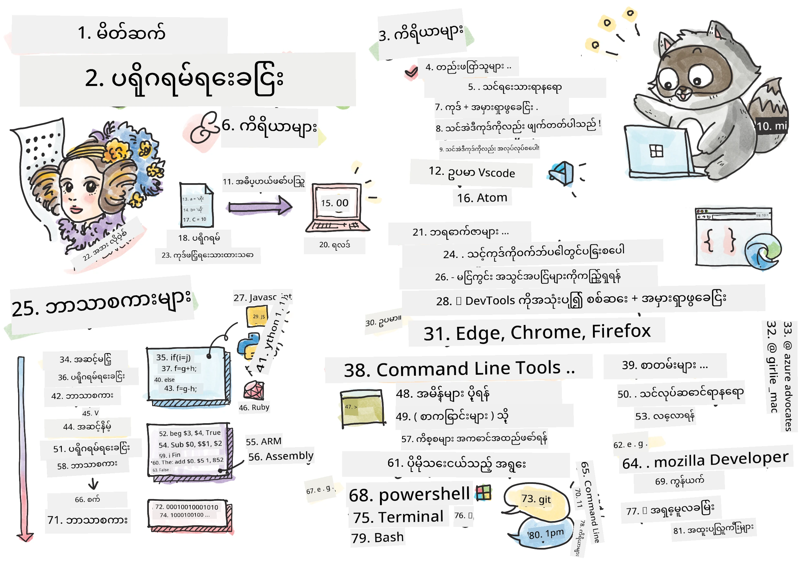
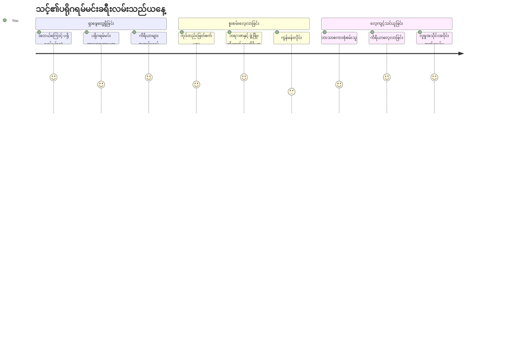
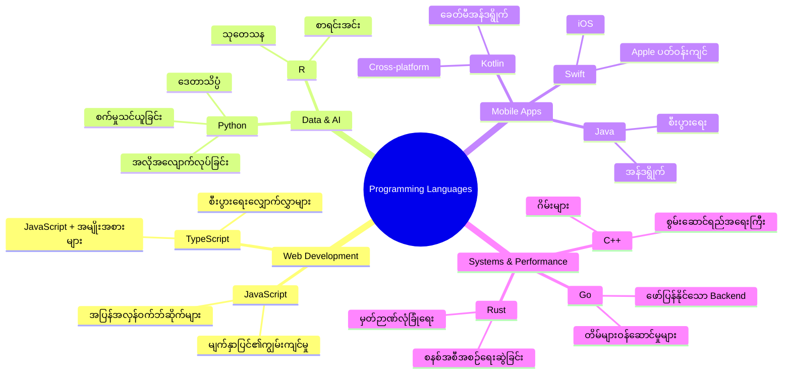
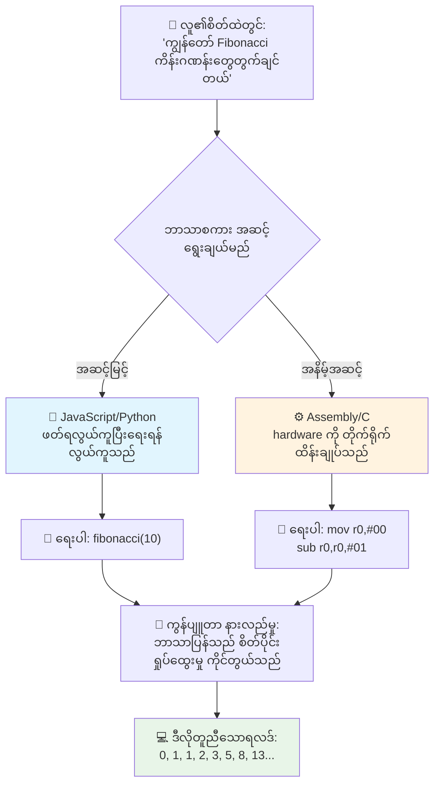
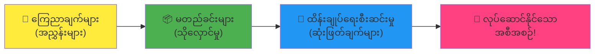
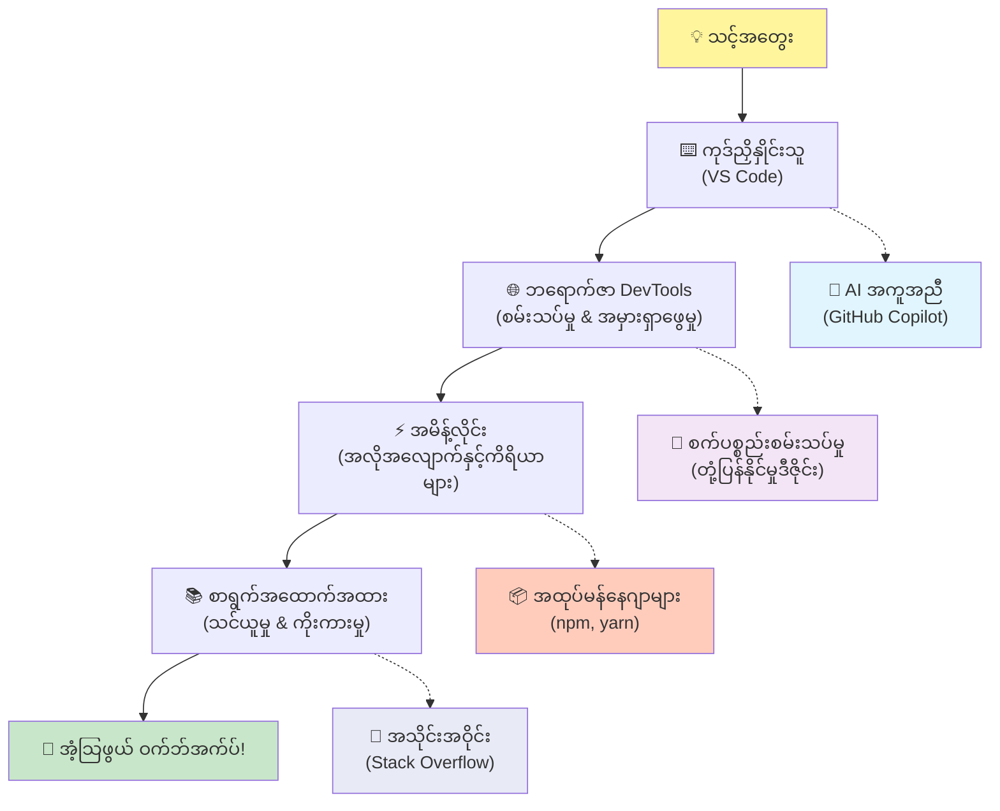
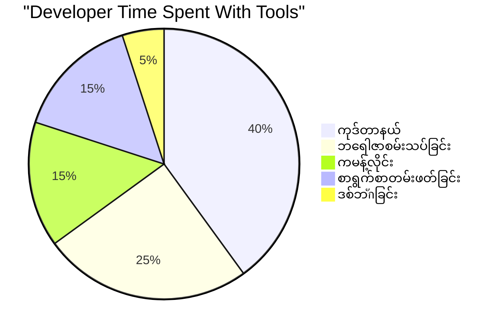
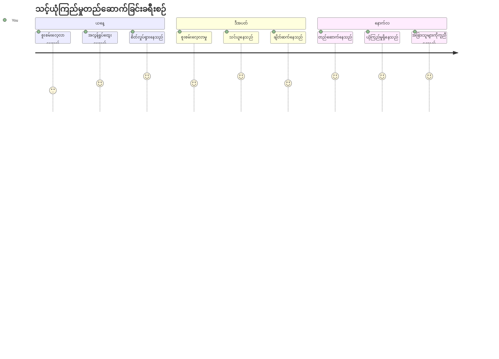

# Programming ဘာသာစကားများနှင့်ခေတ်သစ် developer ကိရိယာများအIntroduction

ဟေး၊ အနာဂတ် developer ကိုယ်တိုင်! 👋 တစ်နေ့တာတိုင်းငါ့ကိုအရမ်းတုန်လှုပ်စေတဲ့အရာကိုပြောလိုက်ရမလား? programming ဆိုတာကကွန်ပျူတာတွေအကြောင်းပဲမဟုတ်ဘူး – အကြောင်းအရာသင့်ရဲ့အကြံဥာဏ်တွေကိုပြန်လည်အသက်ဝင်စေတဲ့အတော်ကြီးအစွမ်းသတ္တိတွေပါပဲ!

သင့်ကြိုက်နှစ်သက်တဲ့ app ကိုသုံးနေတုန်း မြစ်တွယ်ဆင်တူတဲ့အချိန် ချိန်ပေါက်လာတဲ့အဲဒီအခန်းကဏ္ဍကိုသိတယ်နော်? ခလုတ်ကိုနှိပ်တဲ့အခါ စိတ်ပျော်စရာအံ့အားသင့်စေတဲ့အရာတစ်ခုဖြစ်ပေါ်သွားပြီး "ဟိုသူတို့ ဘယ်လိုလုပ်သလဲ?" လို့ထင်တယ်? ဟုတ်တယ်၊ ကိုယ့်လိုသူတစ်ယောက်က – ၂ နာရီနောက်တုန်းက coffee shop သုံးခုမြိတ်ကြမ်းပြီးထိုင်သည့်သူ – အဲဒီအံ့အားသင့်စရာကိုရေးသားခဲ့တာပါ။ ဒီစာသင်ခန်းမပြီးခင်မှာ နားလည်သွားမယ့်အကြောင်းကတော့ သူတို့ ဘယ်လိုလုပ်သလဲဆိုတာကိုနားလည်ရုံမက၊ ကိုယ့်ကိုယ်ကိုယ်လည်း မျှော်လင့်နေပြီးစမ်းသပ်ဖို့ဖိစီးမှုရှိနေမှာပဲ!

Programming ကိုစတင်သင်ယူတဲ့အခါ ကြောက်ရွံ့တာနားလည်ပါတယ်။ ကၽြန္ေတာ္စတင္သင္ယူခဲ့တဲ့အခါ လူသိနည်းမူသူ တစ်ယောက်ဖြစ်ဖို့လိုတယ်ဆိုတာထင်မြင်ခဲ့တယ်။ ဒါပေမဲ့ ဒါက ဘာကြောင့် ပြောင်းလဲသွားသလဲဆိုတော့ programming ဆိုတာဘာသာစကားအသစ်တစ်ခုကို စကားပြောသင်ယူတဲ့အတိုင်းပါပဲ။ “ဟယ်လို”နဲ့ “ကျေးဇူးတင်ပါတယ်” ဆိုတာနဲ့စပြီး ကော်ဖီမှာမှာယူဖို့အထိ သင်တန်းဖြစ်နေတယ်၊ နောက်ဆုံးမှာတော့ နက်နဲသောဗဟုသုတဆွေးနွေးပွဲတွေပြောဆိုနေမယ်! ဒါပေမဲ့ဒီအတန်းမှာ ကွန်ပျူတာတွေနဲ့ အပြန်အလှန်စကားပြောနေတယ်၊ တကယ်တမ်းမှာသူတို့ဟာ နောက်ကျတဲ့သူမဟုတ်ဘဲ သင့်အမှားတွေကို ဘယ်တော့မှ ညှို့ဆွဲမယ်မဟုတ်ဘူး၊ ပြန်လုပ်ဖို့လည်း အမြဲရှိနေပါတယ်!

ဒီနေ့တော့ ခေတ်သစ် web ဖွံ့ဖြိုးတိုးတက်မှုကိုဖြစ်နိုင်အောင် ပတ်ဝန်းကျင်ဆန်းသစ်ပြီးစိတ်လှုပ်ရှားစရာကိရိယာတွေကို အတူတကွရှာဖွေကြမယ်။ Netflix, Spotify နဲ့ သင့်အကြိုက်ဆုံး indie app စတူဒီယိုတွေမှာ developer တွေတိုင်း နေ့တိုင်းသုံးတဲ့ တိကျတဲ့ editor, browser နဲ့ workflow တွေကို ဆိုလိုတာပါ။ ဒါပေမဲ့ ဒီအကြောင်းက သင့်ကို အားလုံးအတွက်အခမဲ့ ပရော်ဖက်ရှင်နယ်အဆင့်တွဲကိရိယာတွေဖြစ်တယ်ဆိုပြီး တမန်တတယ့် ပြည့်စုံမှုဖန်တီးမယ်!


> Sketchnote by [Tomomi Imura](https://twitter.com/girlie_mac)


```mermaid
journey
    title သင့်၏ပရိုဂရမ်မင်းခရီးလမ်းသည်ယနေ့
    section ရှာဖွေတွေ့ရှိခြင်း
      အဘယ်ကြောင့် ပရိုဂရမ်မင်းလဲ: 5: You
      ပရိုဂရမ်မင်းဘာသာစကားများ: 4: You
      ကိရိယာများအကျဉ်းချုပ်: 5: You
    section စူးစမ်းလေ့လာခြင်း
      ကုဒ်တည်းဖြတ်စက်များ: 4: You
      ဘရาวဇာနှင့် ဖွံ့ဖြိုးတိုးတက်ရေးကိရိယာများ: 5: You
      ကွန်မန်းလိုင်း: 3: You
    section လေ့ကျင့်သင်ယူခြင်း
      ဘာသာစကားစုံစမ်းသူ: 4: You
      ကိရိယာလေ့လာခြင်း: 5: You
      လူမှုအသိုင်းအဝိုင်းဆက်သွယ်မှု: 5: You
```
## အကြောင်းအရာကို စတင်ဖို့ မည်မှာ သိပြီးသားတွေကြည့်ကြည့်ပါ!

ပျော်စရာအပေါက်ကို ကြည့်တင်ခင်မှာ programming ကမ္ဘာကြီးအကြောင်းသင့်တုံ့ပြန်ချက်ကဘာလဲ? မသိဘူးဆို တကယ်တော့ ကောင်းပါတယ်! အဲ့ဒါက သင့်နေရာမှန်တယ်ဆိုတာကိုသက်သေပြတာ။ စမ်းသပ်မှုအတိုင်း ဆီလျော်ဖို့ ဦးတည်ချက်နဲ့ အာရုံစိုက်ကြရအောင်။

[Take the pre-lesson quiz](https://ff-quizzes.netlify.app/web/)


## နောက်တစ်ခါအတူတကွမကြုံမယ့် စွန့်စားမှု

ဟုတ်ကဲ့၊ ဒီနေ့မကြုံမယ့်အရာတွေကို စိတ်လှုပ်ရှားနေတယ်! တစ်ကယ်နဲ့ကျွန်တော် မင်းရဲ့မျက်နှာကိုမြင်မယ်ဆိုရင် အဲဒီအချိန်တွင် စိတ်လှုပ်ရှားစရာတွေကြားမှာပါပဲ။ အတူတကွသွားမယ့် ခရီးစဉ်မှာပါသည်-

- **Programming ဆိုတာဘာလဲ (အလှဆုံး အရာတစ်ခုဖြစ်တဲ့အကြောင်း!)** – ကုဒ်ဆိုတာ သင့်ပတ်ဝန်းကျင် စုစုပေါင်းကို invisible အနေနဲ့ လှုံ့ဆော်ပေးတဲ့ မိန့်ခွန်းပမာ ဖြစ်တာကို ရှာဖွေကြမယ်၊ အဲဒီ alarm မနက်ဖြန်ဆိုတာကို သင်ထင်မှတ်ထားသလိုသိထားတယ်၊ Netflix recommendation များကို အလွန်တိကျစွာ စီစဉ်ပေးတဲ့ အဲဒီ algorithm ကိုလည်း
- **Programming ဘာသာစကားများနဲ့ သူတို့ရဲ့ အံ့ဩဖွယ်တဲ့ ပုံစံတွေ** – တစ်ဖြည်းဖြည်း အခြားသူတွေနဲ့ မတူသည့် စွမ်းအင်တွေနဲ့ ပြဿနာဖြေရှင်းနည်းတွေနဲ့ တစ်ပါတီကို ဦးတည်ဆောင်ရွက်တယ်ဆိုတာကို စိတ်ကူးမြင်ကြည့်ပါ၊ programming ဘာသာစကားကမ္ဘာကြီးက အဲဒီလိုပဲဖြစ်ပြီး သင့်အတွက် အကြိုက်ကောင်းစေမှာပါ!
- **အခြေခံထည့်သွင်းမှု ဘာလဲဆိုတာ digital magic တွေဖန်တီးဖို့** – ဒါကို LEGO ကစားပစ္စည်းအဖြစ်တွေးပါ။ ဒီအစိတ်အပိုင်းတွေ ဘယ်လို တွဲစားတာနဲ့ နားလည်သွားရင် သင်အကြံဉာဏ်တွေနဲ့ ဘာမှမရှိတာကို တကယ်ဖြစ်အောင် တည်ဆောက်နိုင်ပြီဆိုတာကို နားလည်နိုင်မှာပါ
- **ပရော်ဖက်ရှင်နယ် အထောက်အကူပြု ကိရိယာတွေက မေးလ်ဇာဝတ်စုံတစ်ခုရဘဲ ခံစားမယ်မို့** – ပြတ်သားစွာပြောရရင် ဒီကိရိယာတွေက မင်းကို superpower ရရှိသလိုခံစားရအောင် ပြုလုပ်မှာပါ၊ အကောင်းဆုံးကတော့ ပရော်ဖက်ရှင်နယ်တွေသုံးတဲ့တူညီချက်တွေပါပဲ!

> 💡 **ဒါက အချက်ဖြစ်ပါတယ်**: ဒီနေ့ အားလုံးကို မှတ်မိဖို့ကြိုးစားခွင့်မရပါဘူး! ယခုအချိန်မှာ သင်ကိုယ်တိုင် အကြောင်းအရာတွေအပေါ် စိတ်လှုပ်ရှားမှုတခုမျှ လှုံ့ဆော်ချင်တာ ဖြစ်ပါတယ်။ အကြောင်းအရာတွေကို သဘာဝကျကျ သင်ယူမှုအတိုင်း ပတ်ဝန်းကျင်မှာ လေ့ကျင့်မယ်ဆိုရင်မှာ သင်ယူမှုဟာ အမှန်တကယ်ဖြစ်ပေါ်လာပါလိမ့်မယ်!

> သင်တန်းကို [Microsoft Learn](https://learn.microsoft.com/en-us/learn/modules/web-development-101/introduction-programming/?WT.mc_id=academic-77807-sagibbon) မှာလည်းယူနိုင်ပါသည်!

## Programming ဆိုတာ သေချာပြီးဘာလဲ?

အိုကေ၊ မီလီယံဒေါ်လာမေးခွန်းကို ဖြေကြပါစို့ - programming ဆိုတာ အမှန်တကယ်ဘာလဲ?

ကျွန်တော် ငြင်းဆိုဒေသကို ပြောင်းလဲခဲ့တဲ့ စိတ်ကူးတစ်ခုကို ပြောပြပါမယ် – အပတ်က ကျွန်တော်မိခင်ကို ကျွန်တော်တို့ရဲ့ smart TV remote အသစ်ကို ဘယ်လိုသုံးရမလဲ တတ်နိုင်လောက်အောင်ရှင်းပြနေတယ်။ "နီလာ ခလုတ်ကိုနှိပ်ပါ၊ ဒါပေမဲ့ အကြီးနီခလုတ်နဲ့ မဟုတ်ဘူး၊ ဘေးဘက်က နီလာသေးတဲ့ ခလုတ်... အဲ့ဒါတခြားဘေးဘက်... ပဝါ့၊ ယင်းကို နှောင်ထားပါ နှစ်စက္ကန့်၊ တစ်စက္ကန့် မဟုတ်ပဲ၊ သုံးစက္ကန့်မဟုတ်ပဲ..." နဲ့တူညီလား? 😅

ဒါပဲ programming ပါ! အလွန်အသေးစိတ်၊ အဆင့်ဆင့်ညွှန်ကြားချက်တွေ ပြန်လည်ပေးရတဲ့ အနုပညာပါ၊ အရမ်းအစွမ်းထက်တဲ့တစ်ခုကို မှတ်သားဖို့ လိုအပ်တယ်။ မိခင်နဲ့ဖေါ်ပြဖို့ (သူမက "ဘယ်နီခလုတ်လဲ?!" လို့မေးနိုင်တဲ့ကိုယ်တိုင်) မဟုတ်ဘဲ၊ ကွန်ပျူတာကို (သင်လိုချင်တာဟာ တကယ်နားလည်တဲ့အတိုင်းမဟုတ်ပေမဲ့ ပြောတာကို တိကျစွာလုပ်တယ်) ရှင်းပြနေတာပဲ။

စိတ်ဝင်စားစရာကတော့ ကွန်ပျူတာတွေ အဓိက ရိုးရှင်းတယ်ဆိုတာပါ။ သူတို့နားလည်နိုင်တာ သာမန်အားဖြင့် ၁ နဲ့ ၀ လုံးနဲ့ပဲဖြစ်တယ်၊ "ဟုတ်တယ်" နဲ့ "မဟုတ်ဘူး" သို့မဟုတ် "On" နဲ့ "Off" လို့ ဆိုလို့ရတယ်။ ဒါပေမဲ့ ဒီမှာက Magical ဖြစ်တယ် – ကျွန်တော်တို့က ၁ နဲ့ ၀ ဖြင့်တိုက်ရိုက်ပြောဆိုဖို့ မလိုတော့ပါဘူး။ ဒီမှာ **programming ဘာသာစကား** တွေက ကူညီပေးနေပါတယ်။ သူတို့ဟာ လူတွေရဲ့ အကြောင်းအရာအသုံးအနှုန်းတွေကို ကွန်ပျူတာဘာသာစကားစနစ်အဖြစ် ပြောင်းပေးနိုင်တဲ့ အကောင်းဆုံးဘာသာပြန်တစ်ယောက်လိုပါပဲ။

နံနံအိမ်မက်မြင်တဲ့ အဖြစ်အပျက်ကနေ ကောင်းကင်ကိုရောက်လာတဲ့ အချိန်တိုင်း ငါ့ကိုစိတ်တုန်လှုပ်စေတယ် – ကိုယ့်ဘဝထဲက *အားလုံး* ဒစ်ဂျစ်တယ်ဖြစ်သော အရာတွေအားလုံးဟာ ကိုယ့်လိုသူတစ်ယောက်ကအစတည်ခဲ့တာပါ၊ အိပ်ချိန်ဝတ်ဆင်ပြီး လက်ဖက်ရည်ပါရာ ကွန်ပျူတာမှာ ကုဒ်ရေးနေစဉ်။ ကိုယ်မလှတဲ့ Instagram filter? တစ်ယောက်က သတ်မှတ်ထားတာပါ။ သင့်အသစ်စက်စက်နှစ်သက်တဲ့သီချင်းကို 推薦 ပေးတဲ့ algorithm? တစ်ဦးက တည်ဆောက်ခဲ့တာပါ။ မိတ်ဆွေတွေနဲ့ ညစာဘဲလ်တွေကို ဖြန့်ဖြူးရာ app? ဟုတ်ကဲ့၊ တစ်ယောက်က "ဒီဟာရိုင်းလှတယ်ဆိုပြီး ပြုပြင်သွားဖို့စဉ်းစားခဲ့" ဆက်ပြီးတော့ လုပ်ခဲ့တာပါ!

Programming သင်ယူတာက သင့်တစ်စိတ်တစ်ပိုင်းအတူတူ ဖြစ်တဲ့ စရာအကြောင်းကို မဟုတ်ဘဲ၊ ပြဿနာဖြေရှင်းသူတွေက လူ့ဘ၀တစ်ခုလုံးထဲမှာ တစ်နေ့တာမှာ "တစ်စုံတစ်ယောက်ရဲ့နေ့ကို နည်းနည်းသာ ပိုကောင်းစေဖို့ တစ်ခုတည်ဆောက်နိုင်ရမလား" လို့ အမြဲစဉ်းစားကြတဲ့ ပေါင်းဖက်ဖက်မှုတစ်ခု ဖြစ်လာတာပါ။

✅ **ပေါ့ဖြစ်မှုပြုခြင်း**: အသားပေးအချိန် ဖွင့်ကြည့်ဖို့ အကြောင်းအရာရောက်ပါပြီ – မင်းထင်တဲ့ အကမ္ဘာလုံးဆိုင်ရာပထမဆုံး ကွန်ပျူတာ programmer က ဘယ်သူလဲ? ငါ hint တစ်ခုပေးမယ်- မင်းမျှော်မှန်းထားတာမဟုတ်ဘူး!  ဒီလူအကြောင်းစိတ်၀င်စားဖွယ်ရာဖြစ်ပြီး programming ဟာ အမြဲတမ်း ဖန်တီးမှုအရင်းအမြစ်နဲ့ စူးစမ်းလေ့လာမှုနဲ့ ဖြစ်ခဲ့တာကို ပြသနေပါတယ်။

### 🧠 **စစ်ဆေးချိန်: စိတ်ခံစားချက် ဘယ်လိုလဲ?**

**အနားယူပြီး မှတ်ယူပါ:**
- "ကွန်ပျူတာတွေကိုညွှန်ကြားခြင်း" ဆိုတာကို အခုနားလည်ပါသလား?
- သင်လက်ရှိမှာ လုပ်တဲ့မှတ်သားရတဲ့ ရိုးရှင်းတဲ့လုပ်ငန်းတစ်ခုဟာ programming နဲ့ automation လုပ်ချင်တာရှိပါသလား?
- Programming အကြောင်းမှာ စိတ်၀င်စားမှု သက်ဝင်ခန်းပေါ်လာတယ်လို့ထင်တာရှိပါသလား?

> **မှတ်ထားပါ**: အချို့အကြောင်းအရာတွေ လှပ်လပ်ငြိမ်ငြိမ်နဲ့ မသေချာသေးရင် ပုံမှန်ပါပဲ။ Programming သင်ယူခြင်းဟာ ဘာသာစကားအသစ်တစ်ခုကို ဆက်လက်သင်ယူတဲ့အတိုင်းဖြစ်ပြီး ဖြစ်ပေါ်လာဖို့ နှလုံးသားနဲ့ စိတ်ဓာတ်လိုအပ်တယ်။ မင်းကောင်းစွာလုပ်နေပြီနော်!

## Programming ဘာသာစကားတွေက မကွဲမပြားတဲ့ Magic အရသာပုံစံများလိုပါပဲ

အိုကေ၊ ယခုနှစ်မြောက်တရား အဆင်မပြေသလောက် ရှင်းပြပါမယ် - programming ဘာသာစကားတွေက တူညီတဲ့တမျိုးတည်း ရှေးဟောင်းဂီတအတိုင်းပါပဲ။ ကြားဖြတ်ကြည့်ပါ- jazz ဆိုတာ တိက်ပြီး သီချင်းတွေးတည်တဲ့စတိုင်၊ rock က အင်အားကြီးပြီး တိုတောင်းတဲ့ စတိုင်၊ classical က တိကျပြီး ဂရုပြုထားတဲ့စတိုင်၊ hip-hop က ဖန်တီးမှုနှင့် အမြင်တက်တဲ့စတိုင်ဖြစ်ပါတယ်။ အသီးသီးမှာ သူ့ရဲ့ နှင့်အတူ လူမှုအသိုင်းအဝိုင်းလည်းရှိပြီး ခံစားမှုနှင့် အစဉ်အလာနဲ့ ကိုက်ညီမှုကြောင့် အသုံးပြုနေကြကြတာလည်းပဲ။

Programming ဘာသာစကားတွေလည်း အဲဒီလိုပါပဲ! သောကြောင့် mobile game သာမက ပြောင်းလဲမှု များသော အချက်အလက်စနစ်ကို ဖြေပေးဖို့တူညီဘာသာစကားတစ်ခုကို မသုံးရပါဘူး၊ yoga class မှာ death metal သီချင်းမသီတာလိုပါပဲ (ဒါဆို ပိုက်ဆံတွေပိုကြီးတယ်! 😄)။

ဒါပေမဲ့ သိပ်ခက်ခဲနေတဲ့အချက်က နေ့တိုင်း စိတ်ကူးရိုက်နေချိန်မှာ ဒီဘာသာစကားတွေကို သင်ယူရတာက လောကရဲ့ အကောင်းဆုံး Interpreter နဲ့ တွဲဖက်တူညီပါတယ်ဆိုတာပဲ။ လူမှုဆက်ဆံမှုအနေနဲ့ မိမိစိတ်ကူးတွေကို လွယ်ကူစွာဖွင့်ဆိုနိုင်ပါတယ်၊ သူတို့ကတော့ ကွန်ပျူတာကိရိယာတွေ အတွက် ပြုလုပ်ဖို့ လိုအပ်တဲ့ 1 နဲ့ 0 တွေဘာသာစကားကို ဘာသာပြန်ကြရတယ်။ ဒီအတူတူ Human creativity နဲ့ computer logic နှစ်ခုလုံးကို လုံးဝပြောဆိုနိုင်တဲ့သူငယ်ချင်းတစ်ယောက်ရှိသလိုဖြစ်ပါတယ် – သူတို့တစ်ခါမှ မပင်ပန်းပါ၊ coffee break လိုအပ်တာမရှိပါ၊ တစ်ခါတည်းတောင်းဆိုတဲ့ မေးခွန်းကို မအနိမ့်ထားပါဘူး!

### လူကြိုက်များတဲ့ Programming ဘာသာစကားများနှင့် အသုံးပြုမှု


```mermaid
mindmap
  root((Programming Languages))
    Web Development
      JavaScript
        မျက်နှာပြင်၏ကျွမ်းကျင်မှု
        အပြန်အလှန်ဝက်ဘ်ဆိုက်များ
      TypeScript
        JavaScript + အမျိုးအစားများ
        စီးပွားရေးလျှောက်လွှာများ
    Data & AI
      Python
        ဒေတာသိပ္ပံ
        စက်မှုသင်ယူခြင်း
        အလိုအလျောက်လုပ်ခြင်း
      R
        စာရင်းအင်း
        သုတေသန
    Mobile Apps
      Java
        အန်ဒရွိုက်
        စီးပွားရေး
      Swift
        iOS
        Apple ပတ်ဝန်းကျင်
      Kotlin
        ခေတ်မီအန်ဒရွိုက်
        Cross-platform
    Systems & Performance
      C++
        ဂိမ်းများ
        စွမ်းဆောင်ရည်အရေးကြီး
      Rust
        မှတ်ဉာဏ်လုံခြုံရေး
        စနစ်အစီအစဉ်ရေးဆွဲခြင်း
      Go
        တိမ်များဝန်ဆောင်မှုများ
        ဖော်ပြန်နိုင်သော Backend
```
| ဘာသာစကား | အကောင်းဆုံးအသုံး | လူကြိုက်များရတဲ့အကြောင်းပြချက် |
|----------|----------|------------------|
| **JavaScript** | web ဖွံ့ဖြိုးတိုးတက်မှု၊ user interface | Browser မှာ run ပြီး interactive website တွေမှာ အသုံးပြုနိုင်တယ် |
| **Python** | data science, automation, AI | ဖတ်ရလွယ်ပြီး သင်ယူရလွယ်၊ စွမ်းအားကြီးတဲ့ library တွေရှိတယ် |
| **Java** | စီးပွားရေး app များ၊ Android apps | platform မပျက်အောင်၊ စနစ်ကြီးတွေအတွက် တည်ငြိမ်စွာအသုံးပြုနိုင်တယ် |
| **C#** | Windows app များ၊ game ဖွံ့ဖြိုးတိုးတက်မှု | Microsoft ecosystem အားကောင်းစွာထောက်ပံ့တယ် |
| **Go** | cloud service, backend စနစ်များ | လျှင်မြန်ပြီး ရိုးရှင်းစွာ ရေးသားဖို့ ဒီဇိုင်းထားတယ် |

### High-Level နှင့် Low-Level ဘာသာစကားများ

ဟုတ်ကဲ့၊ ဒီအကြောင်းအရာ ဟုတ်ကဲ့ ကျွန်တော်စတင်သင်ကြားပြီးသားက အတွေ့အကြုံ ဖြစ်ပါတယ်၊ ပြောပြတဲ့ analogy သက်ဆိုင်ရာပုံစံနဲ့ ပရိုက်ပေးချင်ပါတယ် – ဒါကကျွန်တော်အတွက် မျက်နှာပဲဖြစ်ခဲ့တယ်၊ အခု အစစ်အမှန်နားလည်စေဖို့ မျှော်လင့်ပါတယ်!

သင်ဘာသာစကားမပြောတဲ့နိုင်ငံတစ်ခုကို သွားတယ်လို့စဉ်းစားပါ - အနီးဆုံးအိပ်သာကို ရှာဖွေဖို့လိုတယ် (ကျွန်တော်တင်က ဒီအကြောင်းကို တူညီစွာခံစားခဲ့တယ် 😅):

- **Low-level programming** ဆိုတာ သင်နေတဲ့ဒေသရဲ့ ဒိုင်ယယ်ကတ်ကို အစားအစာရောင်းတဲ့ အဘွားနှင့် တော်တော်နားလည်အောင် တက်ကြွစွာပြောဆိုနိုင်သလိုဖြစ်ပါတယ်၊ ဒေသရေးရာ reference လေးတွေနဲ့၊ ဒေသခံစကားတွေနဲ့၊ အထက်တန်းဂျိုးကတာတွေရှိပြီး သင့်မှာ fluency ရှိရင် အလွန်ထင်ရှားပြီး ထိရောက်မှုရှိပါတယ်! ဒါပေမဲ့ အိပ်သာရှာဖွေနေတုန်း ကိုယ့်အတွက်တော့ ခက်ခဲနိုင်တယ်။

- **High-level programming** ဆိုတာ အံ့ဖွယ်ကောင်းတဲ့ ဒေသခံသူငယ်ချင်းတစ်ယောက်လိုပါပဲ။ သင် "ကြိုတင်အိပ်သာသွားချင်တယ်" လို့ ကျွမ်းကျင်ပြောလိုက်ရင် သူက ဘာသာပြန်ပေးပြီး အသိပညာနဲ့ သင့်အတွက် လမ်းညွှန်ပေးတယ်။

Programming ဘာသာစကားတွေအရ:
- **Low-level ဘာသာစကားတွေ** (Assembly, Cလို) ကွန်ပျူတာ hardware နဲ့ အသေးစိတ်စကားပြောခွင့်ပေးတယ်၊ ဒါပေမဲ့ စက်တုရားလို စဉ်းစားရပါမယ်၊ အဲဒါက ကိန်းဂဏန်းတစ်ခု ကြီးနားတဲ့စိတ်ပိုင်းဆိုင်ရာပြောင်းလဲမှုတစ်ခုပါ!
- **High-level ဘာသာစကားတွေ** (JavaScript, Python, C#) က မိမိဘဝပုံစံနဲ့ အလုပ်လုပ်ဖို့ခွင့်လွှတ်ပေးပြီး နောက်ခံမှာ စက်ပညာစကားတွေကို သူတို့ ထိန်းချုပ်တာပဲ။ ထို့အပြင် အသစ်စက်စက်တွေကို အကောင်းဆုံးကူညီပေးပြီး အသင်းချစ်စနစ်ပါတယ်။

ဘာသာစကား ဘယ်ကနေစတင်ဖို့အကြံပေးချင်တယ်ဆိုတာ သိချင်လား? 😉 High-level ဘာသာစကားတွေက training wheels ပုံစံဖြစ်ပြီး အတွေ့အကြုံကို ပိုမိုပျော်စရာကောင်းစေပါတယ်!


```mermaid
flowchart TB
    A["👤 လူ၏စိတ်ထဲတွင်:<br/>'ကျွန်တော် Fibonacci ကိန်းဂဏန်းတွေတွက်ချင်တယ်'"] --> B{ဘာသာစကား အဆင့်ရွေးချယ်မည်}
    
    B -->|အဆင့်မြင့်| C["🌟 JavaScript/Python<br/>ဖတ်ရလွယ်ကူပြီးရေးရန်လွယ်ကူသည်"]
    B -->|အနိမ့်အဆင့်| D["⚙️ Assembly/C<br/>hardware ကို တိုက်ရိုက်ထိန်းချုပ်သည်"]
    
    C --> E["📝 ရေးပါ: fibonacci(10)"]
    D --> F["📝 ရေးပါ: mov r0,#00<br/>sub r0,r0,#01"]
    
    E --> G["🤖 ကွန်ပျူတာ နားလည်မှု:<br/>ဘာသာပြန်သည် စိတ်ပိုင်းရှုပ်ထွေးမှု ကိုင်တွယ်သည်"]
    F --> G
    
    G --> H["💻 ဒီလိုတူညီသောရလဒ်:<br/>0, 1, 1, 2, 3, 5, 8, 13..."]
    
    style C fill:#e1f5fe
    style D fill:#fff3e0
    style H fill:#e8f5e8
```
### High-level ဘာသာစကားတွေ ဘာကြောင့် ပိုမိုရင်းနှီးကြောင်း ပြမယ်

ဟုတ်ကဲ့၊ ကျွန်တော် high-level ဘာသာစကားတွေကို ဘာကြောင့် ချစ်ခဲ့သလဲဆိုတာ ကိုယ်တိုင်ပြသပေးချင်ပါတယ်၊ ဒါပေမဲ့ နောက်ဆုံးအကြိမ် ဖြည်းဖြည်းလိုက်ပါဦး။ ပထမဆုံး code ကို မြင်တဲ့အခါ အာရုံမရေတော့ပါနဲ့!  အဲဒါက ကြောက်ရွံ့စရာပါပဲ။ အဲဒါအချက်ပါပဲ!

တူညီတဲ့ task ကို နှစ်မျိုး style များဖြင့်ရေးသားထားတာကို ကြည့်မယ်။ ကိုယ့်ဧရိယာလေးမှာ Fibonacci sequence ဖန်တီးတာပါ – နံပါတ်တစ်ခုဟာ သူ့မတိုင်ခင် နှစ်ခုရဲ့ ပေါင်းစပ်ခြင်းဖြစ်ပါတယ် – 0, 1, 1, 2, 3, 5, 8, 13... (စိတ်ဝင်စားစရာ- ဒီ pattern က သဘာဝမှာကျယ်ပြန့်လွန်းပြီး - နွယ်ပင်စေ့ပုံစံ၊ ပိုင်းကုတ်ပုံစံမှ၊ နဂိုယ်ယားများ ဖွဲ့စည်းပုံနည်း!)

Ready လား? စတင်ကြဦးလိုက်!

**High-level ဘာသာစကား (JavaScript) – လူငယ်နှစ်သက်ရာ:**

```javascript
// အဆင့် ၁: အခြေခံ Fibonacci ဆက်တင်
const fibonacciCount = 10;
let current = 0;
let next = 1;

console.log('Fibonacci sequence:');
```

**ဒီ code ကဘာလုပ်တာလဲ:**
- **ပြောကြားတယ်** Fibonacci နံပါတ် များကို မည်မျှထုတ်မလဲဆိုတာကို သတ်မှတ်ထားတဲ့ constant တစ်ခု
- **စတင်ထားတယ်** လက်ရှိနဲ့ နောက်တစ်ခုနံပါတ်တိုင်းကို ထိန်းသိမ်းဖို့ variable နှစ်ခု
- **အစပြုထားတယ်** (0 နှင့် 1) Fibonacci နံပါတ်ပုံစံကို သတ်မှတ်ထားတဲ့ တန်ဖိုးများ
- **ပြသထားတယ်** output ကို အမည်ပေးတဲ့ အကြောင်းအရာ message

```javascript
// အဆင့် ၂: လုပ်ဆောင်ချက်တစ်ကြိမ်သုံးပြီး စဥ်လိုက်ကို ဖန်တီးပါ
for (let i = 0; i < fibonacciCount; i++) {
  console.log(`Position ${i + 1}: ${current}`);
  
  // စဥ်လိုက်အတွင်း နောက်အရေအတွက်ကိုတွက်ချက်ပါ
  const sum = current + next;
  current = next;
  next = sum;
}
```

**အောက်မှာဖြစ်ပေါ်တာ ခြွင်းချက်:**
- **အသုံးပြု** `for` loop နဲ့ sequence တစ်ခုပြီးတော့ iterate လုပ်နေတယ်
- **ပြသထားတယ်** နံပါတ်တိုင်းနဲ့ အနေအထားကို template literal ဖြင့်
- **တွက်ချက်ထားတယ်** ညနောက်တစ်ရက် Fibonacci နံပါတ်ကို လက်ရှိနဲ့နောက်တစ်နံပါတ် ပေါင်းစပ်ထားတယ်
- **update လုပ်ထားတယ်** တိုင်းကြိမ်ရဲ့ variable တွေကို ပိုပြီး iteration အဆင့်ဆင့်သို့

```javascript
// အဆင့် ၃: စတိုင်ကျပြီး လက်တွေ့ကျသော နည်းလမ်း
const generateFibonacci = (count) => {
  const sequence = [0, 1];
  
  for (let i = 2; i < count; i++) {
    sequence[i] = sequence[i - 1] + sequence[i - 2];
  }
  
  return sequence;
};

// အသုံးပြုမှု ဥပမာ
const fibSequence = generateFibonacci(10);
console.log(fibSequence);
```

**အထက်တွင် ကျွန်တော်တို့:**
- **ဖန်တီးထားတယ်** modern arrow function syntax အသုံးပြုပြီး reusable function ကို
- **တည်ဆောက်ထားတယ်** တစ်ခုချင်းပြသခြင်းမရှိဘဲ လုံးဝ sequence ကို array ထဲမှာ သိမ်းဆည်းထားတယ်
- **အသုံးပြုထားတယ်** array index ကို စဉ်ဆက်မပြတ် နံပါတ်အသစ် တွက်ချက်ဖို့
- **ပြန်ပေးလိုက်တယ်** အလုပ်အတွက်ပိုကုန်လွယ်အောင် လုံးဝ sequence

**Low-level ဘာသာစကား (ARM Assembly) – ကွန်ပျူတာနှစ်သက်ရာ:**

```assembly
 area ascen,code,readonly
 entry
 code32
 adr r0,thumb+1
 bx r0
 code16
thumb
 mov r0,#00
 sub r0,r0,#01
 mov r1,#01
 mov r4,#10
 ldr r2,=0x40000000
back add r0,r1
 str r0,[r2]
 add r2,#04
 mov r3,r0
 mov r0,r1
 mov r1,r3
 sub r4,#01
 cmp r4,#00
 bne back
 end
```

JavaScript Version က တိုကောင်လူ့စာသား ခက်ခဲခြင်းမရှိပဲ ဖတ်ရတယ်၊ Assembly Version ကတော့ ကွန်ပျူတာ processor ကို တိုက်ရိုက်ထိန်းချုပ်တဲ့ အမိန့်များသုံးထားတယ်။ နှစ်ခုလုံး လုပ်ဆောင်ချက်တူသော်လည်း high-level ဘာသာစကားက လူတွေဘက်မှ နားလည်ရေး၊ ရေးသားရေး၊ ပြုပြင်ထိန်းသိမ်းရာမှာ ပို၍လွယ်ကူတယ်။

**အဓိကကွာခြားချက်များမှာ:**
- **ဖတ်ရလွယ်မှု**: JavaScript က `fibonacciCount` လို့ ဖေါ်ပြတဲ့ ရိုးရှင်းသေချာတဲ့ အမည်တွေနဲ့ အသုံးပြုတယ်၊ Assembly ကတော့ `r0`, `r1` စတဲ့ စပ်ဆံဖွယ်ရာဘရိတ်တွေကိုအသုံးပြုတယ်။
- **မှတ်ချက်များ**: အဆင့်မြင့်ဘာသာစကားတွေက ပြောချင်တဲ့ အကြောင်းအရာတွေကို ရှင်းလင်းပြောပြဖို့ တိုက်တွန်းတယ်၊ ဒါက ကုဒ်ကို ကိုယ်တိုင်မှတ်တမ်းတင်နိုင်အောင် ကူညီတယ်။
- **ဖွဲ့စည်းပုံ**: JavaScript ရဲ့ လူတွေ စဉ်းစားတတ်တဲ့ နည်းအတိုင်း ပြဋ္ဌာန်းထားတဲ့ ဒေတာစီးစဉ်မှာ ကိုက်ညီတယ်။
- **ထိန်းသိမ်းမူ**: မတူညီတဲ့ လိုအပ်ချက်တွေအတွက် JavaScript ဗားရှင်းကို update လုပ်တာ ရိုးရှင်းပြီးရှင်းလင်းတယ်။

✅ **Fibonacci စဉ်အကြောင်း**: ဒီအံ့ဩဖွယ်ဂဏန်းစဉ် pattern ( နှစ်ခုရှေ့က အရေအတွက်ကို ပေါင်းပြီးထွက်တယ်: 0, 1, 1, 2, 3, 5, 8...) ဟာ သဘာဝအရာတွေအကုန်မှာ ဖော်ထုတ်တွေ့ရပါတယ်! နေကုလားပွင့် လှီးများ, ပင်ရွက်ထင်ရှားမှုများ, nautilus ရေမွှားမျက်နှာကြမ်းမှု စတာတွေနဲ့ သေချာတယ်။ သင့်ကို သဘောကျလောက်အောင် သဘာဝမှာ သဘောဆောင်တဲ့ ပုံစံတွေကို သင့်စိတ်ကူးကိန်းနဲ့ ကုဒ်ဖြင့်နားလည်နိုင်ဖို့ မင်းကို ရှင်းပြတယ်။

## ပုံမှန်ပစ္စည်းတွေဖြင့် စွမ်းအင်ကြားကြလေ

အိုကေ၊ အခု သင် programming ဘာသာစကားတွေကို လုပ်ဆောင်နေတဲ့ပုံကို မြင်လာပြီ မျှော်လင့်ပါတယ်၊ အခုတော့ သင့်လက်ထဲမှာ ရှိတဲ့ software အားလုံးကို ဖွဲ့စည်းတဲ့ အခြေခံအစိတ်အပိုင်းတွေကို ခွဲခြမ်းကြပါစို့။ ဤအရာတွေကို သင့်အကြိုက်ဆုံးချက်ပြုတ်ဟင်းရဲ့ ဆိုဒ်အဖြစ် စဉ်းစားပါ—တစ်ခုချင်းစီဘာလုပ်နေသလဲနဲ့ သိပြီးနောက်၊ ဘာသာစကားမဆို ကိုဖတ်နာရေးနှင့်ရေးသားနိုင်မှာဖြစ်ပါတယ်။

ဒါဟာ programming ရဲ့ သဒ္ဒါသင်ယူခြင်းလိုဖြစ်တယ်။ ကျောင်းမှာ နာမ်နဲ့ ကြိယာရေးအတန်းတွေ သင်တာကို မှတ်ရင်ပါ၊ programming မှာပါ ကိုယ်ပိုင် သဒ္ဒါလမ်းစဉ်များရှိပြီး အင်္ဂလိပ်သဒ္ဒါလမ်းစဉ်ထက် ပိုသဘာဝနဲ့ ပိုခွင့်ပြုပါတယ်! 😄

### ညွှန်ကြားချက်များ: ခြေလှမ်းခြေလှမ်းညွှန်ကြားချက်များ

**ညွှန်ကြားချက်များ** ကိုစတင်ပါစို့ – သူတို့ဟာ သင့်ကွန်ပျူတာနဲ့ပြောတယ်ဆိုတဲ့ အဆက်အသွယ်လို စကားစုတစ်ခုချင်းစီပါဝင်တယ်။ တစ်ခုချင်းဆီသည် တစ်ခုတည်း အခ်ိန်တုန်းမှာ လုပ်ဆောင်ရန် တိကျစွာ အသိပေးတယ်၊ ဥပမာ- "ဒီနေရာမှာ ဘယ်ဘက်အလျား…","အနီလက်မီးမောက်မှာ ရပ်ပါ","မှာအားမှာ ရပ်စိုက်ပါ" ဆိုတာလိုပါပဲ။

Statement တွေရဲ့ ဖတ်ရတာလွယ်ရွယ်တာကို ကောင်းမြတ်သဘောပေါက်တယ်။
ကြည့်ပါ:

```javascript
// တစ်ခုတည်းသော လုပ်ဆောင်မှုများကို ဆောင်ရွက်သော အခြေခံ ပြောကြားချက်များ
const userName = "Alex";                    
console.log("Hello, world!");              
const sum = 5 + 3;                         
```

**ဒီကုဒ်ကဘာလုပ်သလဲ?**
- အသုံးပြုသူနာမည် သိမ်းဆည်းရန် constant variable တစ်ခု ပြဋ္ဌာန်းခြင်း
- console output မှာ မင်္ဂလာပါ စကားကို ပြသခြင်း
- ဂဏန်းဆိုင်ရာ လုပ်ဆောင်ချက် ရလဒ်တွက်ချက်ပြီး သိမ်းဆည်းခြင်း

```javascript
// ဝက်ဘ်စာမျက်နှာများနှင့် အပြန်အလှန်သက်ရောက်မှုရှိသော ကြေညာချက်များ
document.title = "My Awesome Website";      
document.body.style.backgroundColor = "lightblue";
```

**ခြေလှမ်းခြေလှမ်းဖြင့် မျှဝေခြင်း:**
- browser tab မှာ ပြသမည့် ဝက်ဘ်စာမျက်နှာခေါင်းစဉ် ပြင်ဆင်ခြင်း
- စာမျက်နှာပေါ်မှာ နောက်ခံအရောင်ပြောင်းခြင်း

### Variables: သင့်ပရိုဂရမ်ရဲ့ မှတ်ဉာဏ်စနစ်

အိုကေ၊ **variables** တွေဟာ ကျွန်တော့်အကြိုက်ဆုံး ကောင်းစွာ သင်ကြားနိုင်တဲ့ အကြောင်းအရာလို့ ပြောနိုင်ပါတယ်၊ အဲဒါက မိမိနေ့တိုင်းအသုံးပြုတဲ့ အရာတွေနဲ့ အတူတူပါပဲ။

ဖုန်းထဲမှာ ဖုန်းစာရင်းကြည့်ပြီးစဉ်းစားကြည့်ပါ။ သင့်အတွက် လူကိုယ်တိုင်းဖုန်းနံပါတ်ကို မှတ်မိလိုက်တာ မဟုတ်ပါဘူး၊ "မေမေ", "အကောင်းဆုံးသူငယ်ချင်း" ဒါမှမဟုတ် "၂ နာရီအထိ ပီဇာပို့ဆောင်နေတဲ့ ဆိုင်" ဆိုပြီး သိမ်းဆည်းထားတာပါ။ variables တွေကလည်း အဲ့ဒီလိုပဲ ဖြစ်တယ်! သင့်စဉ်းစားမှုအတိုင်း အချက်အလက်ကို သိမ်းဆည်းပြီး နောက်မှတင် အသုံးချနိုင်ဖို့ တစ်ခုချင်းစီကို အမှတ်အသားတပ်ထားတဲ့ အိတ်ပါတဲ့ လို့ ထင်နိုင်ပါတယ်။

အရမ်းကောင်းတာက variables တွေဟာ သင့် application အသုံးပြုသလို ပြောင်းလဲနိုင်တယ် (ဒါကြောင့် "variable" လို့ခေါ်တာပါနော်။)။ ပီဇာဆိုင်သတင်းအချက်အလက် အသစ်တွေ ဖြစ်လာရင် variable ကို update လုပ်တဲ့အတိုင်းပဲ၊ သင့်ပြုလုပ်မှုတိုးတက်လာသလို variables တွေဟာ ပြောင်းလဲနိုင်ခြင်းရှိပါတယ်။

ဘယ်လို လွယ်ကူကြည့်ရမှာလဲဆိုတာ ကြည့်ပါ:

```javascript
// အဆင့် ၁: အခြေခံပြောင်းလဲနိုင်သော တန်ဖိုးများကို ဖန်တီးခြင်း
const siteName = "Weather Dashboard";        
let currentWeather = "sunny";               
let temperature = 75;                       
let isRaining = false;                      
```

**အဓိပ္ပာယ်လုပ်နည်း:**
- `const` variable များတွင် မပြောင်းလဲမည့်တန်ဖိုးများ သိမ်းဆည်းရန် (ဥပမာဆိုက်နာမည်)
- `let` ကို အသုံးပြုပြီး ပြောင်းလဲနိုင်သော တန်ဖိုးများ သိမ်းဆည်းရန်
- String (စာသား), Number, Boolean (စစ်/မစစ်) တန်ဖိုးများ စုံလင်စွာသတ်မှတ်ရန်
- ပြောဆိုခြင်းမှာ ရိုးရိုးရှင်းရှင်းဖြင့် တန်ဖိုးမဟုတ်တဲ့ အနည်းငယ်မှတ်သားနိုင်သော အမည်များရွေးချယ်ရန်

```javascript
// အဆင့် ၂: ဆက်စပ်သော အချက်အလက်များကို အုပ်စုဖွဲ့ရန် အရာဝတ္ထုများနှင့် အလုပ်လုပ်ခြင်း
const weatherData = {                       
  location: "San Francisco",
  humidity: 65,
  windSpeed: 12
};
```

**အထက်ပါမှာ:**
- သက်ဆိုင်ရာရာထူးများစုစည်းထားသော object တစ်ခု ဖန်တီးခြင်း
- တစ်ခုတည်းသော variable အောက်မှာ များစွာသော အချက်အလက်များ စုစည်းခြင်း
- key-value ရွှေ့ပြောင်းထားခြင်းဖြင့် နောက်ခံဉီးဆောင်ရေးဖြစ်စေခြင်း

```javascript
// အဆင့် ၃: မVariables ပြောင်းလဲနိုင်သော မVariables များကို အသုံးပြုခြင်းနှင့် ပြင်ဆင်ခြင်း
console.log(`${siteName}: Today is ${currentWeather} and ${temperature}°F`);
console.log(`Wind speed: ${weatherData.windSpeed} mph`);

// ပြောင်းလဲနိုင်သော မVariables များကို ပြင်ဆင်ခြင်း
currentWeather = "cloudy";                  
temperature = 68;                          
```

**အစိတ်အပိုင်းအသီးသီး ကို နားလည်ခြင်း**
- `${}` စတိုင်နဲ့ template literals အသုံးပြုပြီး သတင်းအချက်အလက် ပြသခြင်း
- dot notation (`weatherData.windSpeed`) အသုံးပြု၍ object properties ထိန်းချုပ်ခြင်း
- ကြေညာထားတဲ့ `let` variables များ update လုပ်ခြင်း
- များစွာသော variables များ ပေါင်းစပ်၍ အဓိပ္ပာယ်ရှိသော စာသားဖန်တီးခြင်း

```javascript
// အဆင့် ၄: ပိုသန့်ရှင်းတဲ့ ကုဒ်အတွက် ခေတ်မီသော ဖျက်သိမ်းခြင်းနည်း
const { location, humidity } = weatherData; 
console.log(`${location} humidity: ${humidity}%`);
```

**သင်ယူသင့်တာတွေ:**
- destructuring assignment ဖြင့် object က ချိတ်ဆက်ထားသည့် specific property များ ထုတ်ယူခြင်း
- object key များနဲ့ အတူ variable အသစ်များ အလိုအလျောက် ဖန်တီးခြင်း
- dot notation ထပ်တူထပ်မျှ ပြန်ကြားခြင်း မဖြစ်စေရန် ရိုးရှင်းအောင် ပြုလုပ်ခြင်း

### Control Flow: သင့်ပရိုဂရမ်ကို စဉ်းစားတတ်အောင် သင်ကြားခြင်း

အိုကေ၊ ဒီမှာ programming က အံ့ဩဖွယ်ကောင်းတယ်နော်! **Control flow** ဟာ basically သင့်ပရိုဂရမ်ကို စဉ်းစားတတ်အောင် သင်ကြားတယ်၊ သင့်ကိုယ်တိုင် လုပ်နေတဲ့ပုံစံနဲ့တူတယ်။

စဥ်စားပါစို့ - ဒီမနက်မှာ သင် "မိုးရွာလျှင် ထီးယူမယ်။ ရာသီအေးရင် ဂျက်ကက်ဝတ်မယ်။ နောက်ကျရင် မနက်စာ မစားဘဲ ကော်ဖီယူမယ်" စတဲ့ if-then လို logic တွေနဲ့ မြှောက်မြူနေပေမဲ့ သေချာ လုပ်ဆောင်ခဲ့ရပါမယ်။ သင့်အာရုံစူးစိုက်မှုဟာ ဒီ if-then logic ကို နေ့စဉ်တစ်ချိန်လုံးမျှမျှတတ လိုက်နာနေပါတယ်။

ဒီလို programming တွေဟာ စိတ်ကိုလှုပ်ရှားဖွယ်နဲ့ အသက်ဝင်နေတဲ့ application တွေလို ဖြစ်စေတယ်၊ ပုံမှန် script တစ်ခုလို ကြေးပင်ကန်ရုတ်မှတ်မဟုတ်ပါဘူး။ သူတို့က ထိတွေ့လာတဲ့အခြေအနေကို သုံးသပ်ပြီး သင့်တော်သော ပြန်ကြားမှုကို ပြန်ပေးနိုင်ပါတယ်။ သင့်ပရိုဂရမ်အတွက် ခေါင်းဆောင်အထူး ဉာဏ်ကောင်းတက်နိုင်အောင် ပြုလုပ်ပေးခြင်းလိုပါပဲ။

ဒီလိုလုပ်ပုံကို ကြည့်ချင်ပါသလား? ဒီလိုဖြစ်ပါတယ်:

```javascript
// အဆင့် ၁: အခြေခံ အခြေအနေ သေချာရေး lógica
const userAge = 17;

if (userAge >= 18) {
  console.log("You can vote!");
} else {
  const yearsToWait = 18 - userAge;
  console.log(`You'll be able to vote in ${yearsToWait} year(s).`);
}
```

**ဒီကုဒ်လုပ်ဆောင်တာ:**
- အသုံးပြုသူ အသက် မဲပေးခွင့် ရှိမရှိ စစ်ဆေးခြင်း
- က""အခြေအနေ အပေါ် မူတည်ပြီး ကုဒ်အပိုင်းမျိုးစုံ မျက်နှာချင်းဆိုင် ဆောင်ရွက်ခြင်း
- ၁၈ နှစ် မပြည့်လျှင် မဲပေးခွင့် ရောက်မြန်ချိန်တွက်ချက်ပြီး ပြသခြင်း
- အခြေအနေတစ်ခုချင်းအတွက် အသေးစိတ် ဝမ်းနည်းစရာ ညွှန်ကြားချက်ပေးခြင်း

```javascript
// အဆင့် ၂: တရားစီစစ်သူများနဲ့ အခြေအနေများစုံ
const userAge = 17;
const hasPermission = true;

if (userAge >= 18 && hasPermission) {
  console.log("Access granted: You can enter the venue.");
} else if (userAge >= 16) {
  console.log("You need parent permission to enter.");
} else {
  console.log("Sorry, you must be at least 16 years old.");
}
```

**ဒီမှာ ဖြစ်သင့်တာ အပိုင်း - အပိုင်း မျှဝေခြင်း:**
- `&&` operator ဖြင့် အခြေအနေ များ စုပေါင်းခြင်း
- မျိုးစုံ အခြေအနေများအတွက် `else if` ဖြင့် အဆင့်တက်ပုံဖန်တီးခြင်း
- ရှိနိုင်တဲ့ case အားလုံး ကို `else` statement တစ်ခုနဲ့ ကိုင်တွယ်ခြင်း
- အခြေအနေ အမျိုးမျိုးအတွက် ရှင်းလင်း သာမန် အကြံပြုချက်ပေးခြင်း

```javascript
// အဆင့် ၃: တန်းနရီ operator ဖြင့် အတိုချုပ်အခြေအနေရှုခင်း
const votingStatus = userAge >= 18 ? "Can vote" : "Cannot vote yet";
console.log(`Status: ${votingStatus}`);
```

**သင်မှတ်မိထားသင့်တာ:**
- အသုံးပြုမှုရိုးရှင်းတဲ့ ၂ ရွေးချယ်မှုအတွက် ternary operator (`? :`) သုံးပါ
- စဉ်းစားခွင့်နောက်တွင် `?`, true ဖြစ်စေရန် မတိုင်ခင်, `:` ဖြင့် false ဖြစ်စေရန် အတိုင်းရေးပါ
- အခြေအနေများပေါ် မူတည်ကာ တန်ဖိုးသတ်မှတ်ခြင်းလိုအပ်သောအခါ သုံးပါ

```javascript
// အဆင့် ၄: အထူးကိစ္စများစွာကို ကိုင်တွယ်ခြင်း
const dayOfWeek = "Tuesday";

switch (dayOfWeek) {
  case "Monday":
  case "Tuesday":
  case "Wednesday":
  case "Thursday":
  case "Friday":
    console.log("It's a weekday - time to work!");
    break;
  case "Saturday":
  case "Sunday":
    console.log("It's the weekend - time to relax!");
    break;
  default:
    console.log("Invalid day of the week");
}
```

**ဒီကုဒ်အလုပ်ဖြစ်တဲ့ အဆင့်တွေ:**
- variable တန်ဖိုးကို နောက်ထပ် case များနှင့် ကိုက်ညီသည့် အခြေအနေတွေနဲ့ သေချာစွာ ညှိနှိုင်းခြင်း
- ဆင်တူတဲ့ case များကို စုပေါင်းခြင်း (အလုပ်ရက်များ နှင့် အပတ်သတ်ရက်များ)
- ထိုအချိန် မေးခွန်းနှင့်ကိုက်ညီသော case ကို လုပ်ဆောင်ခြင်း
- မမျှော်လင့်ထားတဲ့ တန်ဖိုးများအတွက် `default` case ထည့်ခြင်း
- code ကို နောက် case သို့ ဆက်သွားမှုကင်းစင်စေရန် `break` statement များထည့်ခြင်း

> 💡 **တကယ့်ကမ္ဘာ ပုံပြင်**: Control flow ကို စိတ်ရှည်လက်ရှည် GPS နဲ့ လမ်းညွှန်ဖို့ စဉ်းစားပါ။ သူက "Main Street မှာ ယာဉ်များ ပြတင်းပေါက်နေသော်လည်း လမ်းမကြီးမှတက်ပါ။ လမ်းမကြီးမှာ ဆောက်လုပ်ရေးစခန်း ရှိလျှင် မြင်ကွင်းကောင်းတဲ့လမ်းသို့ ရွေ့ပါ" လို့ ပြောမယ်။ Program များကလည်း အဲ့ဒီလို အခြေအနေ အမျိုးမျိုးကို ရိုးရွင်းပြီး ချင့်ချိန်တုန့်ပြန် မျှော်လင့်ချက်အ‌ရှိဆုံး ရရှိရန် ဆိုလိုက်ပါတယ်။

### 🎯 **ပညာသင်စစ်ဆေးစရာ: ပုံမှန်ပစ္စည်း ကျွမ်းကျင်မှု**

**အခြေခံတွေ ဘယ်လိုလုပ်နေလဲ ကြည့်ကြရအောင်:**
- variable နဲ့ statement ကြားက ကွာခြားချက်ကို ကိုယ်ပိုင်စကားနဲ႔ ရှင်းပြပါ။
- voting example ကဲ့သို့ if-then ဆုံးဖြတ်ချက် အသုံးပြုမယ့် ပိုင်းကို ကောင်းကောင်းစဉ်းစားပါ။
- programming logic မှာ တစ်ခုခု အံ့အားသင့်စရာ ရှိခဲ့ဖူးလား?

**အမြန် အားပေးမှု:**

```mermaid
flowchart LR
    A["📝 ကြေညာချက်များ<br/>(အညွှန်းများ)"] --> B["📦 မတည်ခင်းများ<br/>(သိုလှောင်မှု)"] --> C["🔀 ထိန်းချုပ်ရေးစီးဆင်းမှု<br/>(ဆုံးဖြတ်ချက်များ)"] --> D["🎉 လုပ်ဆောင်နိုင်သောအစီအစဉ်!"]
    
    style A fill:#ffeb3b
    style B fill:#4caf50
    style C fill:#2196f3
    style D fill:#ff4081
```
✅ **အနောက်မှာ ဘာလာလဲ**: ဒီအကြောင်းအရာတွေနဲ့ ပိုမိုနက်ရှိုင်းစွာ လေ့လာရင်း ဆက်လက် ခရီးကို ပျော်ရွှင်စွာ ဆက်လက် ဆောင်ရွက်ကြမယ်! ဒီအချိန်မှာတော့ ရှေ့မှာ လှုပ်ရှားစိတ်တွေက မျှော်လင့်ချက်တွေနဲ့ ပြည့်ပြီး၊ လေ့ကျင့်ဖို့လိုအပ်တဲ့ ကျွမ်းကျင်မှုတွေနဲ့ နည်းလမ်းတွေ သဘာဝကျကျ ပေါက်ပေါက်ပြီ ဖြစ်လာမယ်ဆိုတာက သေချာလိုက်ပါ။

## အသုံးအဆောင်ကိရိယာများ

အိုကေ၊ ဒီနေရာမှာ ကိုယ်ကြွယ်ဝမှုမဟုတ်လို့ ကြွက်သားထိုင်ခုံပေါ်မှာ ပျံ့လွင့်နေတယ်! 🚀 ဒီကိရိယာများက သင့်ကို ဒစ်ဂျစ်တယ်အာကာသယာဉ်အညွှန်းချက်ကို ဖမ်းဆီးထားတဲ့ ကီးတွေ လက်ဆောင်ပေးမှာ ဖြစ်တယ်။

စားဖိုမှူးတစ်ယောက်ဟာ လက်တွေ့ ချိန်ညှိထားတဲ့ ဓားတစ်ပုံရှိတယ်၊ မူးယစ်ဖူးသံဓာတ်တေးဆရာ တစ်ယောက်ဟာ ထိတွေ့ရင် ဆိုင်းငံ့ခဲ့သလို တေးဆိုတယ်ဆိုတာသိပါသလား။ Developer တွေကလည်း ဒီလို စွမ်းအားစုံကိရိယာတွေနဲ့ရှိပြီး၊ မင်းကို အံ့သြစရာ များစွာသည်၊ အများစုက ရှင်းလင်းပြီး အခမဲ့ပါပဲ။

ဒီတွေ့မြင်ရာတွေမဖြစ်စေနိုင်တဲ့ ဆက်ဆံရေးနက္ခတ်များအပေါ် ကူညီပေးတဲ့ AI powered coding assistants များ၊ Wi-Fi ဖြင့် ကမ္ဘာတစ်ဝှမ်းကနေ ကျွမ်းကျင်စွာ application ဆောက်နိုင်တဲ့ cloud environment များ၊ X-ray vision လို debugging ကိရိယာတွေပါဝင်ပါတယ်။

နှလုံးခုန်အားတိုးတာက - ဒီ tools တွေဟာ "အစပြုသူများအတွက်" ကိရိယာမျိုးဟာ မဟုတ်ပါဘူး။ Google, Netflix နဲ့ မင်းနှစ်သက်တဲ့ indie app studio များမှာ ဒီအချိန်ကိုယ်တိုင် အသုံးပြုနေတဲ့ professional-grade ကိရိယာများပါ! မင်းလည်း သူတို့ကိုအသုံးပြုပြီး မင်းရဲ႕အတိုင်း အတုယူနိုင်မှာ အထူးသဖြင့် ခံစားမိမှာပါ!


```mermaid
graph TD
    A["💡 သင့်အတွေး"] --> B["⌨️ ကုဒ်ညှိနှိုင်းသူ<br/>(VS Code)"] 
    B --> C["🌐 ဘရောက်ဇာ DevTools<br/>(စမ်းသပ်မှု & အမှားရှာဖွေမှု)"]
    C --> D["⚡ အမိန့်လိုင်း<br/>(အလိုအလျောက်နှင့်ကိရိယာများ)"]
    D --> E["📚 စာရွက်အထောက်အထား<br/>(သင်ယူမှု & ကိုးကားမှု)"]
    E --> F["🚀 အံ့သြဖွယ် ဝက်ဘ်အက်ပ်!"]
    
    B -.-> G["🤖 AI အကူအညီ<br/>(GitHub Copilot)"]
    C -.-> H["📱 စက်ပစ္စည်းစမ်းသပ်မှု<br/>(တုံ့ပြန်နိုင်မှုဒီဇိုင်း)"]
    D -.-> I["📦 အထုပ်မန်နေဂျာများ<br/>(npm, yarn)"]
    E -.-> J["👥 အသိုင်းအဝိုင်း<br/>(Stack Overflow)"]
    
    style A fill:#fff59d
    style F fill:#c8e6c9
    style G fill:#e1f5fe
    style H fill:#f3e5f5
    style I fill:#ffccbc
    style J fill:#e8eaf6
```
### Code Editors နဲ့ IDEs: သင့်ရဲ့ ဒစ်ဂျစ်တယ် အကောင်းဆုံးသူငယ်ချင်းများ

Code editor များအကြောင်း ပြောကြမယ် – သူတို့ဟာ သင့်ကိုယ်ပိုင် coding အရိပ် အမြွက်နေရာ ဖြစ်နေမှာပါ! ဒီမှာ သင်အချိန်အများစုကို ဖန်တီးမှုတွေ ဖန်တီးတတ်စွမ်းဖို့ ပြုလုပ်ပါမယ်။

ဒါပေမဲ့ ဒီခေတ်မီ editor တွေကတော့ ပုံမှန်စာသားညှိချက်က မဟုတ်ပါ။ သူတို့က ၂၄ နာရီ ၇ ရက် ဦးတည်ချက် ဒစ်ဂျစ်တယ် coding mentor လို လုပ်ဆောင်နိုင်တယ်။ မင်းရိုက်ချက် မမှန်မှုတွေ အလိုအလျောက် သိလိုက်တယ်၊ လုပ်ငန်းစဉ်များတိုးတက်အောင် အကြံဉာဏ်ပြုတယ်၊ ကုဒ်အစိတ်အပိုင်းဟာ ဘာလုပ်တာလဲဆိုတာ နားလည်စေတယ်၊ ဘယ်လိုရိုက်ရန် သင့်စိတ်ထဲကို ခန့်မှန်းပေးတယ်။

Auto-completion ကို တွေ့တဲ့အချိန်မှာ ကျွန်ေတာ္ အနာဂတ်ထဲမှာ နေရင်းလိုခံစားခဲ့တယ်။ တစ်ခုကို ရိုက်တဲ့အခါ “Hey, ဒီ function လေးကို ခန့်မှန်းလိုက်ပါတယ်” ဆိုတာနဲ့ ။

**ဒါကြောင့်ဒီ editor တွေ ဘာကြောင့်အံ့မခန်းလဲ?**

ခေတ်သစ် editor များမှာ လုပ်ငန်းစဉ်မြှင့်တင်ဖို့ အောက်ပါတို့ ပါဝင်ပါတယ်။

| လက္ခဏာ | ဘာလုပ်သလဲ | ဘာကြောင့် အထူး? |
|---------|--------------|--------------|
| **Syntax Highlighting** | ကုဒ်အပိုင်းအခြားကို အရောင်စုံဖြင့် ဖော်ပြတယ် | ကုဒ်ဖတ်ရလွယ်ကူစေပြီး မှားယွင်းချက်တွေတွေ့ရง่ายစေတယ် |
| **Auto-completion** | ရိုက်နေစဉ် ကုဒ် ကို အကြံပြုတယ် | coding လျင်မြန်စေပြီး typo လျော့နည်းစေတယ် |
| **Debugging Tools** | မတော်တဆမှားယွင်းမှုတွေ ရှာဖွေပြီး ပြင်ဆင်နိုင်စေတယ် | ပြဿနာဖြေရှင်းရာမှာ အချိန်မြင်းစေတယ် |
| **Extensions** | နည်းပညာအမျိုးမျိုးအတွက် အထူး feature များ ထည့်နိုင်တယ် | မင်း editor ကို ကိုယ်ပိုင် customize လုပ်လို့ရတယ် |
| **AI Assistants** | ကုဒ် အကြံပြုချက်နဲ့ ရှင်းပြချက် ပေးတယ် | သင်ယူမှုနဲ့ ထုတ်လုပ်မှု တွွန်းအားဖြစ်စေတယ် |

> 🎥 **ဗွီဒီယိုအရင်းအမြစ်**: ဒီ tool တွေကို လက်တွေ့ ကြည့်ချင်ရင် [Tools of the Trade ဗီဒီယို](https://youtube.com/watch?v=69WJeXGBdxg) ကို ကြည့်ပါ။

#### Web Development အတွက် အကြံပြု Editor များ

**[Visual Studio Code](https://code.visualstudio.com/?WT.mc_id=academic-77807-sagibbon)** (အခမဲ့)
- Web developer များအကြား လူကြိုက်အများဆုံး
- Extension ecosystem ပေါ်လွင်တယ်
- built-in terminal နဲ့ Git ပေါင်းစည်းမှု
- **စျေးကွက်တွေ့ extension များ**:
  - [GitHub Copilot](https://marketplace.visualstudio.com/items?itemName=GitHub.copilot) - AI ကလည်း ကူညီပေးတာ
  - [Live Share](https://marketplace.visualstudio.com/items?itemName=MS-vsliveshare.vsliveshare) - အချိန်နဲ့အမျှ Share လုပ်မည်
  - [Prettier](https://marketplace.visualstudio.com/items?itemName=esbenp.prettier-vscode) - ကုဒ်ကို အလိုအလျောက် ကိုယ်စားပြုခြင်း
  - [Code Spell Checker](https://marketplace.visualstudio.com/items?itemName=streetsidesoftware.code-spell-checker) - စာလုံးအမှားတွေ သိမ်းဆည်းဖို့

**[JetBrains WebStorm](https://www.jetbrains.com/webstorm/)** (ပေးဆောင်ရပြီး၊ ကျောင်းသားများအတွက် အခမဲ့)
- debugging နဲ့ စမ်းသပ်မှု ကိရိယာတိုးတက်
- အလွန်တိကျတဲ့ code completion
- built-in version control

**Cloud-Based IDEs** (စျေးကွက် လွန်ကာ)
- [GitHub Codespaces](https://github.com/features/codespaces) - browser မှာ VS Code အပြည့်အစုံ
- [Replit](https://replit.com/) - သင်ယူမှုနဲ့ ကုဒ်မျှဝေပိုင်ရှင်
- [StackBlitz](https://stackblitz.com/) - အရမ်းမြန်ဆန်တဲ့ full-stack web development

> 💡 **စတင်ရန် အကြံပြုချက်**: Visual Studio Code နဲ့ စလုပ်ပါ - အခမဲ့၊ စက်မှုလုပ်ငန်းမှာ ကျယ်ပြန့်အသုံးပြုတယ်။ သင်ကြားမှု နှင့် extension များ အများကြီး ရှိတယ်။

### Web Browsers: သင့်ပျောက်ကွယ်နေသည့် ဖွံ့ဖြိုးတိုးတက်မှု ဓာတ်ခွဲခန်း

အိုကေ၊ သင်၏ဦးနှောက်ကို ပြတ်သားအံ့သြစေဖို့အဆင်သင့်ဖြစ်ပါစေ! သင်က social media သုံးပြီး ဗွီဒီယိုတွေကြည့်နေတာကို သိပြီးသားပေမယ့် ဘရောက်ဇာတွေဟာ ကပ်လှမ်းထားတဲ့ သင့်အတွက် အံ့သြဖွယ် ဖွံ့ဖြိုးတိုးတက်မှုဆိုင်ရာ အဓိကဓာတ်ခွဲခန်းတစ်ခု ကို လျှို့ဝှက်ထားတယ်ဆိုတာကို မသိခဲ့ရသလား!

Webpage တစ်ခုမှာ right-click လုပ်ပြီး "Inspect Element" ကိုရွေးချယ်တိုင်း သင်ဟာ developer tool ပြကွက်ကို ဖွင့်လိုက်တာဖြစ်ပြီး၊ စရိတ်ကြီးတဲ့ software အချို့ထက် ပိုစွမ်းဆောင်နိုင်တဲ့ ကိရိယာများ ပါဝင်ပါတယ်။ သင့်ရဲ့ အိမ်မက်ချက်မီးဖိုချောင်ထဲမှာ professional အစားအစာချက်လုပ်ရာ ဓာတ်ခွဲခန်း ပန်နယ်လ်တစ်ခုရှိနေခဲ့တာကို တွေ့လိုက်သလိုပါပဲ!
သူတစ်ယောက်က ထိပ်တန်းအကြိမ် browser DevTools ကို ပြသခဲ့တဲ့အချိန်မှာ ကျွန်တော် ကြာချိန် သုံးနာရီ လောက် ကိုချကျခဲ့ရတယ်၊ အလှည့်ကျနှိပ်နဲ့ "စောင့်ပါဦး၊ ဒါလည်း ပြုလုပ်နိုင်တယ်လား?!" ဆိုပြီး။ သင်ဟာ တကယ်ကို အချိန်နှင့်တပြေးညီ ဘာသာရပ် website ကိုတည်းဖြတ်နိုင်၊ အရာအားလုံး ဘယ်လောက် မြန်မြန် ကောင်းကောင်း loading ဖြစ်နေသလဲ ဆိုတာကို ကြည့်ရှုနိုင်၊ သင့်ဆိုက်ကို ကွဲပြားတဲ့ စက်ပစ္စည်းတွေအပေါ် ဘယ်လို ဖော်ပြလာမှာလဲ ဆိုတာကို စစ်ဆေးနိုင်၊ နောက်ပြီး JavaScript ကို အတော်လေး ကျွမ်းကျင်စွာ debug လုပ်နိုင်တယ်။ ဒီဟာက တကယ်အစိတ်အပိုင်းတစ်ခုလုံး အံ့အားသင့်စရာပါပဲ။

**ဒါကြောင့် ဘရောက်ဇာတွေက သင့်ရဲ့ လျှို့ဝှက်အားသာချက်ဖြစ်ပါတယ်။**

သင် website သို့မဟုတ် web application တစ်ခု ဖန်တီးတဲ့အခါမှာ၊ အဲဒါဘယ်လိုပုံစံရှိပြီး ဘယ်လို အပြုအမူပြုလုပ်သလဲကို သတ်မှတ်ဖို့ လိုပါတယ်။ ဘရောက်ဇာတွေဟာ သင့်ရဲ့အလုပ်ကို ပြသပေးတာအပြင် စွမ်းဆောင်ရည်၊ ဝင်ရောက်လွယ်ကူမှုနဲ့ ဖြစ်နိုင်ချေရှိတဲ့ ပြဿနာတွေကို အသေးစိတ် ပြန်လည် ထောက်ပြပေးပါတယ်။

#### Browser Developer Tools (DevTools)

ခေတ္တဘရောက်ဇာတွေမှာ ဖွံ့ဖြိုးတိုးတက်မှု အစုလိုက်များပါဝင်ပါတယ်။

| Tool Category | What It Does | Example Use Case |
|---------------|--------------|------------------|
| **Element Inspector** | HTML/CSS ကို တိုက်ရိုက် ကြည့်ရှု၊ ပြင်ဆင်နိုင်သည် | စတိုင်လ် များကို အချိန်နဲ့တပြေးညီ ပြင်ဆင်ရန် |
| **Console** | အမှားစာများကြည့်ရှု၊ JavaScript စမ်းသပ် | ပြဿနာရှာဖွေမှုနှင့် ကုဒ် စမ်းသပ်ခြင်း |
| **Network Monitor** | အရင်းအမြစ်များ ဘယ်လို ပြေးနေသလဲ စစ်ဆေး | စွမ်းဆောင်ရည်နှင့် loading အချိန်များကို အနိမ့်ကျစေခြင်း |
| **Accessibility Checker** | ဝင်ရောက်အသုံးပြုနိုင်မှု စစ်ဆေး | သင့်ဆိုက်ကို အသုံးပြုသူအားလုံးအတွက် အဆင်ပြေစေခြင်း |
| **Device Simulator** | ကွဲပြားသော အရွယ်အစားများအပေါ် ကြိုတင်ကြည့်ရှု | အမျိုးမျိုးစက်ပစ္စည်းတွေအပေါ် မျက်နှာပြင်လိုက် တုံ့ပြန်မှု စမ်းသပ်ခြင်း |

#### ဖွံ့ဖြိုးတိုးတက်ရေးအတွက် အကြံပြုဘရောက်ဇာများ

- **[Chrome](https://developers.google.com/web/tools/chrome-devtools/)** - စက်မှုလုပ်ငန်းစံချိန် DevTools နှင့် ကျယ်ပြန့်သော မှတ်တမ်း
- **[Firefox](https://developer.mozilla.org/docs/Tools)** - CSS Grid နှင့် ဝင်ရောက်လွယ်သောကိရိယာများ အထူးကောင်းမွန်
- **[Edge](https://docs.microsoft.com/microsoft-edge/devtools-guide-chromium/?WT.mc_id=academic-77807-sagibbon)** - Chromium အခြေခံ ထုတ်လုပ်ထားပြီး Microsoft ၏ ဖွံ့ဖြိုးရေးအရင်းအမြစ်

> ⚠️ **အရေးကြီး စမ်းသပ်ခြင်းအကြံပြုချက်**: တစ်ခါတရံ အမျိုးမျိုးသော ဘရောက်ဇာများတွင် သင့်ဆိုက်များအား စမ်းသပ်ပါ။ Chrome မှာ အကောင်းဆုံး လုပ်ဆောင်ရင် Safari သို့မဟုတ် Firefox မှာ မတူညီနိုင်ပါဘူး။ အတွေ့အကြုံတူညီမှုအတွက် ပရော်ဖက်ရှင်နယ် ဖွံ့ဖြိုးရေးသူများက အကြီးစား ဘရောက်ဇာအားလုံး သုံးစွဲကာ စမ်းသပ်ကြပါသည်။

### Command Line Tools: ဖွံ့ဖြိုးရေးသူ အင်အားအတွက် ဗဟို၀င်ခွင့်

အိုကေ၊ Command line အကြောင်း အပြစ်မဲ့ဖြစ်အောင် ရိုးသားစွာ ပြောပြချင်ပါတယ်။ လိပ်ပြာပြတ်တဲ့ အနက်ရောင် မျက်နှာပြင်တစ်ခုကို ကွယ်မျှောင်စွာ နေမြဲနေတဲ့ စာသားတွေကို ပထမဆုံးမြင်တော့ "မဖြစ်နိုင်ပါဘူး၊ ကျွန်တော် ထင်တာမဟုတ်ဘူး! ဒီဟာက ၁၉၈၀ အချိန်က hacker ဇာတ်ကားမှ ဆွဲကျတဲ့ ဂိမ်းတစ်ခုပဲ၊ ကျွန်တော် ဒီအတွက် အလွန်မကျွမ်းကျင်ပါဘူး!" ဆိုပြီး ယူဆခဲ့ပါတယ် 😅

ဒါပေမယ့် အဲ့ဒီအချိန်မှာ တစ်ယောက်က ပြောပေးခဲ့ဖူးမယ့် အရာနဲ့ ယခုလက်ရှိ သင့်အား ပြောပြချင်တာကတော့ command line ဟာ မကြောက်စရာဘူး၊ ရိုးရိုး သင့်ကွန်ပျူတာနဲ့ ဒိုင်ရက်တာ ဆက်ဆံနေတာလိုပါပဲ။ fancy app တစ်ခုကနေ အစားအစာမှာမှာဖို့ (ပုံနှင့် မီနူးပါသည့်) နဲ့သုံးရာ အနေနဲ့ လက်တွေ့ လူကြိုက်စားတဲ့ စားသောက်ဆိုင်တစ်ခုမှာလူကြိုက်စားတဲ့ မဟာချက်ပေးသူက ထိပ်တန်း ထမင်းပြန်ကြားရုံနဲ့ စားစရာ ပြင်ပေးလို့ရတယ်ဆိုတာကြားကြည့်ပါ။

Command line ကတော့ ဖွံ့ဖြိုးရေးသူတွေ အားလုံးကို  မဟာအင်ဂျင်နီယာဖြစ်သလိုခံစားစေတဲ့ နေရာဖြစ်ပါတယ်။ စကားလုံး၊ ရိုးရှင်းတဲ့ ပန်ကတ်တွေကို ရိုက်ထည့်ပြီး Enter ကို နှိပ်လိုက်လျှင် သင့်ရဲ့ project အလုပ်အပေါ်တွင် စုစည်းပြင်ဆင်ခြင်း၊ အပြည်ပြည်ဆိုင်ရာ စွမ်းအားရှိသော ကိရိယာတွေ သွင်းယူခြင်း သို့မဟုတ် သင့် app ကို အင်တာနက်ပေါ်သို့ တင်ပြနိုင်ပြီး သန်းပေါင်းများစွာ ဖြစ်နိုင်ပါသည်။ အခုတစ်ကြိမ် အဲ့ဒီ အင်အားကို ခံစားကြည့်လိုက်ရင် ပြီးတော့ လုံးဝ မလွဲပြောင်းနိုင်တော့ပါဘူး!

**Command line ကို သင့်အကြိုက်ဆုံး ကိရိယာဖြစ်အောင် လုပ်ကြောင်းမှာ ဆွေးနွေးချက်များ**

graphical interface တွေက ကောင်းတာ များပေမယ့် command line က automation, မှန်ကန်မှုပေးခြင်း၊ အရှိန်အဟုန်တို့မှာ ထူးခြားပါတယ်။ ဖွံ့ဖြိုးရေးကိရိယာ များအများစု command line interface ကနေ အဓိက ထိန်းချုပ်တဲ့အတွက် ထိရောက်စွာ သုံးနိုင်ဖို့ သင်ယူဖို့ လိုပါတယ်။

```bash
# အဆင့် ၁: ပရောဂျက်ဖိုင်တွဲကိုဖန်တီးပြီး သွားရောက်ပါ။
mkdir my-awesome-website
cd my-awesome-website
```

**ဒီကုဒ်က ဘာလုပ်နေလဲဆိုတာ**
- **my-awesome-website** ဆိုတဲ့ directory အသစ်ကို ဖန်တီးခြင်း
- အသစ်ဖန်တီးပြီး directory ထဲသို့ သွားခြင်း

```bash
# အဆင့် ၂: package.json ဖြင့် ပရောဂျက်စတင်တပ်ဆင်ပါ
npm init -y

# ခေတ်သစ် ဖွံ့ဖြိုးရေး ကိရိယာများကို 설치 ပြုလုပ်ပါ
npm install --save-dev vite prettier eslint
npm install --save-dev @eslint/js
```

**အဆင့်ဆင့်မှာ ဒီလိုဖြစ်နေ**
- `npm init -y` ဖြင့် Node.js project အသစ်ကို default ဖြင့် စတင်တည်ဆောက်ခြင်း
- Vite ကို အမြန် ဖွံ့ဖြိုးမှုနှင့် တည်ဆောက်မှုအတွက် အဆင့်မြင့် build tool အဖြစ် ထည့်သွင်းခြင်း
- Prettier ကို automatic code formatting အတွက်၊ ESLint ကို code အရည်အသွေး စစ်ဆေးမှုအတွက် ထည့်သွင်းခြင်း
- `--save-dev` flag က development dependency လို့ သတ်မှတ်ခြင်း

```bash
# အဆင့် ၃: ပရောဂျက် ဖွဲ့စည်းမှုနှင့် ဖိုင်များ ဖန်တီးပါ
mkdir src assets
echo '<!DOCTYPE html><html><head><title>My Site</title></head><body><h1>Hello World</h1></body></html>' > index.html

# ဖွံ့ဖြိုးရေး ဆာဗာကို စတင်ပါ
npx vite
```

**အထက်မှာ ကျွန်တော်တို့က**
- Source code နဲ့ assets အတွက် အဖိုင်အုပ်စု သီးခြားဖန်တီးပြီး စီမံခြင်း
- Document structure ထည့်သွင်းထားတဲ့ အခြေခံ HTML ဖိုင် ထုတ်လုပ်ခြင်း
- Vite development server ရဲ့ live reloading နှင့် hot module replacement စတင်တင်ဆက်ခြင်း

#### ဝက်ဘ်ဖွံ့ဖြိုးရေးအတွက် အမှုခံ command line ကိရိယာများ

| Tool | Purpose | Why You Need It |
|------|---------|-----------------|
| **[Git](https://git-scm.com/)** | Version control | ပြောင်းလဲမှုများကို ထိန်းသိမ်း၊ ပူးပေါင်းလုပ်ကိုင်ခြင်း၊ မိတ္တူထုတ်ခြင်း |
| **[Node.js & npm](https://nodejs.org/)** | JavaScript runtime & package management | Browser အပြင် JavaScript တပြင် run ရန်၊ ဖွံ့ဖြိုးရေးကိရိယာ အသစ်ထည့်သွင်းရန် |
| **[Vite](https://vitejs.dev/)** | Build tool & dev server | အမြန်ဆုံးဖွံ့ဖြိုးရေးနှင့် hot module replacement |
| **[ESLint](https://eslint.org/)** | Code quality | JavaScript မှာ ချို့ယွင်းချက်များ မ automática ရှာဖြေချေခြင်း |
| **[Prettier](https://prettier.io/)** | Code formatting | ကုဒ်ကို အညီညွတ်ပြီး ဖတ်ရှုရ လွယ်ကူစေခြင်း |

#### Platform အလိုက် ရွေးချယ်စရာများ

**Windows:**
- **[Windows Terminal](https://docs.microsoft.com/windows/terminal/?WT.mc_id=academic-77807-sagibbon)** - ခေတ်မီ၊ လုပ်ဆောင်နိုင်စွမ်းများစွာပါဝင်သည့် terminal
- **[PowerShell](https://docs.microsoft.com/powershell/?WT.mc_id=academic-77807-sagibbon)** 💻 - တိုက်ရိုက် စာသားရေးခြင်းနယ်ပယ်
- **[Command Prompt](https://learn.microsoft.com/windows-server/administration/windows-commands/windows-commands)** 💻 - ရိုးရာ Windows command line

**macOS:**
- **[Terminal](https://support.apple.com/guide/terminal/)** 💻 - အတွင်းရေး သက်ဆိုင်ရာ terminal
- **[iTerm2](https://iterm2.com/)** - အဆင့်မြင့် features ပါဝင်သည့် terminal ကိုတိုးချဲ့ထားသည်

**Linux:**
- **[Bash](https://www.gnu.org/software/bash/)** 💻 - Linux standard shell
- **[KDE Konsole](https://docs.kde.org/trunk5/en/konsole/konsole/index.html)** - အဆင့်မြင့် terminal emulator

> 💻 = operating system မှ ရောနှောပြီး ပါရှိပြီးသား

> 🎯 **သင်ယူရန် လမ်းညွှန်ချက်**: `cd` (directory ပြောင်းခြင်း), `ls` သို့မဟုတ် `dir` (ဖိုင်အမျိုးအစားများ ကြည့်ရှုခြင်း), `mkdir` (folder ဖန်တီးခြင်း) ကဲ့သို့သော အခြေခံ command များမှ စပါ။ နောက်ပိုင်းမှာ `npm install`, `git status` နှင့် `code .` (VS Code ဖြင့် လက်ရှိ directory ကိုဖွင့်ရန်) ကဲ့သို့မဟုတ် အသုံးများသော workflow command များကို လေ့ကျင့်ပါ။ သင်ပိုမိုအားပြင်းလာသည့်အခါ advanced command များနှင့် automation နည်းလမ်းများကို ကိုယ်တိုင် ရယူလေ့လာကြပါလိမ့်မည်။

### အတွင်းရေးစာတမ်းများ: သင်တန်းဆရာ ၂၄/၇ အမြဲရရှိနိုင်သော ဆရာ

အိုကေ၊ စတင်သည့်သူတစ်ယောက်အနေဖြင့် ဆုံးမကြည့်ချင်တဲ့ ကန့်ကွက်ချက်လေးတစ်ခုကို မျှဝေချင်ပါတယ် - အတွေ့အကြုံရှိ ဖွံ့ဖြိုးရေးသူများတောင် စာတမ်းတွေကို ဖတ်ရှုရန် အချိန် ပေးသည့် အပိုင်းကြီးရှိပါတယ်။ ဒါဟာ သင် မသိသလောက်ကြောင်းမဟုတ်ဘဲ၊ အလွန်ပညာရှင်လက္ခဏာပါပဲ!

စာတမ်းတွေက တကယ်တော့ ၂၄ နာရီ ၇ ရက် မပြတ် ရရှိနိုင်တဲ့ ပညာရှင်တွေ ချစ်မောလျက်ရှိတဲ့ အပြည့်အစုံ သိပ္ပံပညာရှင်တွေလို ဖြစ်ပါတယ်။ ညနေ ၂ နာရီမှာ ပြဿနာတက်ရင်၊ စာတမ်းတွေက ချစ်စရာ virtual ဖမ်းခနဲနဲ့ လိုအပ်တဲ့ ဖြေရှင်းချက်ကို တိတိကျကျပေးပါတယ်။ မကြာခဏ လူတွေ ပြောဆိုနေတဲ့ features အသစ်တစ်ခုကို သင် လေ့လာချင်တဲ့အခါမှာ၊ စာတမ်းက နည်းလမ်းတစ်ဆင့်ဆင့်၊ ဥပမာနဲ့ အတူ ပံ့ပိုးပေးပါတယ်။ ဘာဖြစ်လို့ အဲ့ဒီအတိုင်းအလုပ်လုပ်တာလဲဆိုတာ သိချင်ရင်လည်း၊ စာတမ်းက နားလည်စေဖို့ ပြင်ဆင်ထားတာပါ။

ဒါက ကျွန်တော် အမြဲပြောင်းလဲနေတဲ့ web စီးပွားရေးကမ္ဘာကို ဖြတ်သန်းကြည့်ရင်း၊ senior developers ၁၅ နှစ်ကျော် အတွေ့အကြုံရှိသူတွေလည်း basic syntax ကို ရေးရာမှတ်တမ်း ဖတ်ရှုကြတာကို ကြည့်ပါတယ်။ မာနမဆုံးတာမဟုတ်ဘူး၊ တော်လှတဲ့ သတိပြုမှုပါ။ perfect memory မလိုဘဲ၊ အကြောင်းအရာကို လျင်မြန်စွာ ရှာဖွေရန် နေရာကို သိပြီး၊ သိရှိထားတာကို သုံးနိုင်ခြင်းပဲဖြစ်သည်။

**အမှန်တကယ် စေ့စပ်မှုဖြစ်ပေါ်ရာ:**

ပရော်ဖက်ရှင်နယ် ဖွံ့ဖြိုးရေးသူတွေဟာ စာတမ်းဖတ်မှုမှာ အချိန်အများတစ်စိတ်တစ်ပိုင်း ပေးပါတယ်။ သူတို့ မသိတော့လို့ မဟုတ်ပါဘူး၊ ဒါပေမယ့် web ဖွံ့ဖြိုးရေးကမ္ဘာ ဘယ်လောက်မြန်မြန်ပြောင်းလဲနေတာဆိုတာ ကြည့်ပြီး နေရာတကျ သင်ယူဖို့လိုပါတယ်။ ကောင်းမွန်တဲ့ စာတမ်းက သင် ကိုယ်တိုင် ဘာကြောင့် သုံးရမလဲ၊ ဘယ်အချိန် သုံးရမလဲ သိရှိစေပါတယ်။

#### အရေးကြီး စာတမ်း အရင်းအမြစ်များ

**[Mozilla Developer Network (MDN)](https://developer.mozilla.org/docs/Web)**
- ဝက်ဘ် နည်းပညာ စာတမ်းမှာ ရွှေရောင်စံချိန်
- HTML, CSS, JavaScript အတွက် လမ်းညွှန်ရန် များ
- ဘရောက်ဇာ အညီမသေးမလှည့် အချက်အလက် အပါအဝင်
- လက်တွေ့ ဥပမာများနှင့် စမ်းသပ်နိုင်သော ဆော့ဖ်ဝဲလ်များပါပါသည်

**[Web.dev](https://web.dev)** (Google မှ)
- ခေတ်မှီ web ဖွံ့ဖြိုးရေး အကောင်းဆုံး လမ်းညွှန်မှုများ
- စွမ်းဆောင်ရည် တိုးတက်ရေး လမ်းညွှန်ချက်များ
- ဝင်ရောက်လွယ်ကူမှုနှင့် တဝိုက်ဒီဇိုင်း အခြေခံချက်များ
- အချက်ပေးလုပ်ငန်းများဖြင့် အခြေခံသင်ခန်းစာ

**[Microsoft Developer Documentation](https://docs.microsoft.com/microsoft-edge/#microsoft-edge-for-developers)**
- Edge browser ဖွံ့ဖြိုးရေး အရင်းအမြစ်များ
- Progressive Web App လမ်းညွှန်ချက်များ
- Cross-platform ဖွံ့ဖြိုးရေး တက်ကြွမှုများ

**[Frontend Masters Learning Paths](https://frontendmasters.com/learn/)**
- အစဉ်လိုက် သင်ယူသင်ကြားမှု လမ်းညွှန်ချက်များ
- ထွန်းကားသော ဗွီဒီယို သင်ခန်းစာများ
- လက်တွေ့ ကုဒ်ရေးမှု လေ့ကျင့်ခန်းများ

> 📚 **လေ့လာမှု နည်းဗျူဟာ**: စာတမ်းကို မှတ်မိဖို့ မကြိုးစားပါနဲ့၊ အစား တိကျစွာ ရှာဖွေ သုံးနိုင်ရန် လေ့လာပါ။ အသုံးပြုမှုပြည့်ဝသည့် လမ်းညွှန်ချက်များကို bookmark လုပ်ထားပြီး အချက်အလက်ကို လျင်မြန်စွာ ရှာဖွေရန် ကူညီပေးသည်။

### 🔧 **Tool Mastery စစ်ဆေးခြင်း: ဘာတွေ သင့်ကို မဆိုးပါ?**

**အချိန်ယူပြီး စဉ်းစားကြည့်ပါ**
- အရင်ဆုံး စမ်းသပ်ချင်တဲ့ ကိရိယာ ဘယ်ဟာလဲ? (မှားယွင်းမှု မရှိပါ)
- Command line က မကြောက်နေရ ်သေးလား၊ သဘောက်လိုတယ်လား?
- သင့်ရဲ့ အကြိုက်ဆုံး website ထဲက မျက်နှာပြင်ရှေ့မှာ browser DevTools ကို သုံးသပ်ကြည့်နိုင်မလား?


```mermaid
pie title "Developer Time Spent With Tools"
    "ကုဒ်တာနယ်" : 40
    "ဘရေါဇာစမ်းသပ်ခြင်း" : 25
    "ကမန့်လိုင်း" : 15
    "စာရွက်စာတမ်းဖတ်ခြင်း" : 15
    "ဒစ်ဘักခြင်း" : 5
```
> **ပျော်စရာ အတွေးပေါ်တစ်ခု**: ဖွံ့ဖြိုးရေးသူအများစု ကုဒ် ရေးစဉ်အတွင်း ၄၀% ခန့်ကို အားပေးပြီး code editor ထဲမှာရှိကြတယ်၊ ဒါပေမယ့် စမ်းသပ်၊ လေ့လာ၊ ပြဿနာဖြေရှင်းမှုတွေမှာ အချိန်များအပ်ကြတယ်။ programming ဟာ ကုဒ်တစ်ကြောင်းရေးတာသာ မဟုတ်ပါဘူး၊ အတွေ့အကြုံဖန်တီးခြင်းပါပဲ။

✅ **စဉ်းစားရန်**: နေ့တိုင်း website ဖန်တီးရာ development tools များက design tools တွေနဲ့ ဘယ် ကွာချက် ရှိမလဲ? အဲဒါကဗျာဆရာတစ်ယောက် မြို့တော်အဆောက်အအုံမှာပုံစံတည်ဆောက်ခြင်းနဲ့ တည်ဆောက်သူတစ်ယောက် လုပ်ငန်းတွင် သုံးတဲ့ကိရိယာတွေရဲ့ ကွာခြားမှုလိုပါပဲ။ နှစ်ခုစလုံး အရေးကြီးပေမယ့် အခြား ကိရိယာတွေလိုအပ်ပါတယ်။ ဒီစိတ်ကူးဟာ အရမ်းလိုက်ဖက်တဲ့ စိတ်မြင့်မြတ်မှုပုံစံကို သင်ကို့ကိုယ်ကိုရှင်းလင်းပေးပါလိမ့်မယ်။

## GitHub Copilot Agent Challenge 🚀

Agent mode ကို သုံးပြီး အောက်ပါ စိန်ခေါ်မှုကို ပြီးမြောက်စေပါ။

**ဖော်ပြချက်**: ခေတ္တခေတ် code editor သို့ IDE တစ်ခုရွေးပြီး web developer အနေနဲ့ workflow ကို ဘယ်လိုပိုမိုသင့်တော်စေမလဲ ပြသပါ။

**အကြောင်းအရာ**: Visual Studio Code, WebStorm သို့ cloud-based IDE တို့ထဲမှ တစ်ခုရွေးပါ။ ကုဒ်ရေးခြင်း၊ debug ကိရိယာ သို့ သက်ဆိုင်ရာ extension သုံးခုကို ဖော်ပြပါ။ တစ်ခုချင်းစီအတွက် workflow ပိုမိုကောင်းမွန်စေသည့် အကျိုးသက်ရောက်မှု ရှင်းပြပါ။

---

## 🚀 စိန်ခေါ်မှု

**အိုကေ၊ စုံစမ်းသူရယ်၊ ပထမဆုံး လုပ်ငန်းစဥ်အတွက် ပြင်ဆင်ပြီးပြီလား?**

အခု သင့်မှာ အခြေခံတွေဆီလာပြီ၊ ကျွန်တော်က တကယ်ခရီးသွားရန် စိတ်ဝင်စားစရာကောင်းတဲ့ programming ကမ္ဘာကို ကြည့်ရှုဖို့ အတွေ့အကြုံရှိစေဖို့ ကဏ္ဍတစ်ခုရှိတယ်။ နားထောင်ပါ – ဒီဟာကကော ဒါကိုရေးဖို့တော့ မဟုတ်ဘူး၊ ဘာမှ မစရာပါဘူး! သင့်ကို programming ဘာသာစကား စုံစမ်းသံသယဉ်းတစ်ယောက်လို မျက်နှာမတွေ့ပဲ  ပထမဆုံး စိတ်လှုပ်ရှားဖွယ် စုံစမ်းမှုတစ်ခုလို့ ထင်ပါ။

**သင့်တာဝန် (သင်ရွေးချယ်ပါက):**
1. **ဘာသာစကား လေ့လာသူဖြစ်ပါ**: အပြည့်အဝ ကွဲပြားကြွယ်ဝတဲ့ programming ဘာသာစကား ၃ခုရွေးပါ – တစ်ခုက website ဖန်တီးခြင်း၊ တစ်ခုက မိုဘိုင်း app ဖန်တီးခြင်း၊ တစ်ခုက သိပ္ပံ ဒေတာစစ်ဆေးခြင်း။ အဲ့ဒီဘာသာစကားတစ်လုံးခြင်းစီမှာ လုပ်ဆောင်မှုသေးငယ်တစ်ခုတူညီတဲ့ script များကို ရှာပါ။ အဲဒီလို ဝေဖန်မှုကြားနေရတဲ့ တူညီမှုတွေကို သင် အံ့သြဖွယ် မြင်ရပါလိမ့်မယ်။

2. **တည်ထောင်ရေးဇာတ်လမ်းတွေရှာဖွေပါ**: ဘာသာစကားတိုင်းကို မူလတည်ထောင်ခဲ့တဲ့ အကြောင်းအရင်းကို ရှာပါ။ အားလုံးဟာ တစ်ခုတည်းသော ပြဿနာအတွက် ပိုကောင်းတဲ့ ဖြေရှင်းနည်းတစ်ခုလိုး ရှာဖွေရန် ဖြစ်ပါတယ်။ သင် ပြဿနာတွေကို ခန့်မှန်းနိုင်ပါသလား? အဲ့ဒီဇာတ်လမ်းတွေထဲမှာ စိတ်ဝင်စားစရာ များစွာ ရှိပါတယ်။

3. **အသိုင်းအဝိုင်းတွေကို တွေ့ဆုံပါ**: ဘာသာစကားတွေ ပတ်သတ်တဲ့ အသိုင်းအဝိုင်းက ဘယ်လောက် ကြိုဆိုမေတ္တာရှိပြီး စိတ်အားထက်သန်မှုရှိတာလဲ စစ်ဆေးပါ။ တချို့မှာ ဒေသအရင် စီစဉ်ထားပြီး အသင်းအသီးသီးက တစ်ဦးတည်း ဆန္ဒကောင်းရွှင်လန်းစေပါသည်။ တချို့မှာ လူဦးရေ များစွာဖြင့် ကျယ်ပြန့်ပီး ကိုယ်တိုင်ကူညီပေးကြပါမယ်။ အသိုင်းအဝိုင်းတွေ ရှိတဲ့ အမျိုးအစားတွေကို ကြည့်လိုက်တော့ မကြာခဏ ဦးစားပေးသော နှလုံးသားကို တွယ်လိုက်နိုင်ပါတယ်။

4. **သင့်စိတ်ခံစားချက်သို့ နားထောင်ပါ**: ယခုအခါ ဘာသာစကား ဘယ်ဟာ သင့်အတွက် လာလည်ရလောက်တဲ့ သဘောခုနှစ်မှု ရှိသလဲ? “မှန်ကန်တဲ့” ရွေးချယ်မှုကို စိုးမပူပါနဲ့ – သင့် ဉာဏ်ဖြင့် သဘောတူပါ။ မှားယွင်းတဲ့ဖြေဆိုမှု မရှိပါဘူး၊ နောက်ထပ် လေ့လာမှုများကို အချိန်ရသလို စူးစမ်းနိုင်ပါတယ်။

**လျှို့ဝှက် စုံစမ်းမှု**: ဘာသာစကားတိုင်းနဲ့ တည်ဆောက်ထားတဲ့ ထင်ရှားတဲ့ website သို့ ကဏ္ဍ app များ ရှာဖွေကြည့်ပါ။ Instagram, Netflix သို့မဟုတ် သင်မရပ်နိုင်တဲ့ မိုဘိုင်းဂိမ်းကို ဘာ language နဲ့ ပြုလုပ်ထားတာလဲဆိုတာ သိရင် အံ့အားသင့်မှာ မလားပြောပြပါ။

> 💡 **သတိပေးချက်**: ဒီဘာသာစကားတွေ အဲဒီနေ့မှာ ကျွမ်းကျင်ဖို့ မပန်းတိုင်ထားပါနဲ့။ သင့်မှာ နေရာရွေးချယ်ဖို့ အင်အားအပြည့်ဖြင့် အထောက်အကူပြုဖို့ နေရာပတ်ဝန်းကျင် ကို မိတ်ဆက်တာပဲဖြစ်ပါတယ်။ အချိန်ယူပြီး ပျော်ရွှင်ပြီး စူးစမ်းပါ၊ ရည်းစားစိတ်ဓာတ်နဲ့ သင်ယူပါ!

## သင်တွေ့ရှိခဲ့သမျှကို ပျော်ရွှင်ကြိုဆိုကြစို့!

ဗုဒ္ဓဟူးတရားကဲ့သို့၊ ဒီနေ့ သင် လေ့လာသင့်ထင်ရာ အထူးကို သဘောကျစေဖို့ အလွန်ပျော်ရွှင်ပါတယ်! ဤ အံ့မခန်းခရီးစဉ်တစ်ခုက သင့်မှာ ဘယ်လောက် သိရှိမှုတွေ စိုက်ထုတ်လိုက်ပါသလဲဆိုတာ ကြည့်မယ်။ စိတ်မပူပါနဲ့ – ဒီကိစ္စက ရုံတင် သင်ယူမှုတွေရဲ့ ပျော်မှုချက်တစ်ခုပါပဲ။

[သင်ခန်းစာပြီး ရလဒ်စစ်ဆေးခြင်း](https://ff-quizzes.netlify.app/web/)

## နောက်ဆုံးသုံးသပ်ချက် & ကိုယ်တိုင်လေ့လာခြင်း

**အချိန်ယူပြီး လေ့လာနှစ်သက်ပျော်မွေ့ပါ!**
သင်ဒီနေ့ မဖြစ်မနေ ပြီးပြည့်စုံစွာ လေ့လာပြီးသားဖြစ်ပြီး၊ ဒါဟာ ဂုဏ်ယူစရာ တစ်ခုပါပဲ! ယခုကတော့ သင့်စိတ်ဝင်စားမှုကို အာရုံစိုက်စေတဲ့ အကြောင်းအရာတွေကို ရှာဖွေတွေ့ရှိဖို့ စတင်ချိန်ပါ။ သတိပြုပါ၊ ဒါဟာ အလုပ်စာမဟုတ်ပါဘူး – ဒါက စွန့်စားခရီးတစ်ခုဖြစ်ပါတယ်!

**သင့်ကို စိတ်လှုပ်ရှားစေတဲ့ အရာတွေကို နက်ရှိုင်းစွာ လေ့လာပါ။**

**ပရိုဂရက်မင်းဘာသာစကားတွေနဲ့ လက်တွေ့ကျကျ လေ့လာပါ။**
- သင့်စိတ်ဝင်စားမှုကို ဖမ်းစားထားတဲ့ ဘာသာစကား ၂ မှ ၃ ခုရဲ့ တရားဝင် ဝဘ်ဆိုက်တွေကို လည်ပတ်ပါ။ အဲဒီ တစ်ခုချင်းစီဟာ သူ့ရဲ့ ကိုယ်ပိုင် လက္ခဏာနဲ့ ပုံပြင်ရှိပါတယ်။
- [CodePen](https://codepen.io/)၊ [JSFiddle](https://jsfiddle.net/) သို့မဟုတ် [Replit](https://replit.com/) စတဲ့ အွန်လိုင်း ကုဒ်ကစားခန်းတွေကို ကြိုးစားပြီး လေ့လာပါ။ လုပ်ကြည့်ရင်း ဖျက်ဆီးရမှာ မဟုတ်ပါဘူး၊ စမ်းသပ်ဖို့ မစိုးရိမ်ပါနဲ့။
- သင့်ကြိုက်နှစ်သက်တဲ့ ဘာသာစကား ဘယ်လိုဖွားမြင်လာခဲ့တယ်ဆိုတာကို ဖတ်ရှုပါ။ တကယ်တော့ အဲဒီ ဘာသာစကားမူလပုံပြင်တွေမှာ စိတ်ဝင်စားဖွယ်ရာတွေ များစွာရှိပြီး ဘာသာစကားတွေ ဘာကြောင့် ဒီလို အလုပ်လုပ်ကြတာလဲဆိုတာ နားမလည်မှုကို ကူညီပေးပါတယ်။

**သင့်ရဲ့ အသစ်ရတဲ့ ကိရိယာတွေကို ချစ်ခင်တတ်လာပါ။**
- Visual Studio Code ကို မဒေါင်းလုပ်ဆွဲထားရသေးရင် ဆွဲယူလိုက်ပါ – အခမဲ့ဖြစ်ပြီး သင့်အား နှစ်သက်သွားမှာ ဖြစ်တယ်။
- Extensions marketplace ကို မိနစ်အနည်းငယ်ကြာ မြင်ကွင်းချဲ့ပါ။ ဒါဟာ သင့်ကုဒ်အယ်ဒီတာအတွက် အက်ပ်စတိုးတစ်ခုလိုပဲ။
- ဘရောက်ဇာ Developer Tools ကို ဖွင့်ပြီး သက်သက်သာသာ ခလုတ်တွေကို နှိပ်ပါ။ အားလုံးနားလည်ဖို့ စိုးရိမ်မထားပါနဲ့ – ရှိနေတဲ့အရာတွေကို မိတ်ဆက်ကြည့်ပါ။

**အသိုင်းအဝိုင်းနဲ့ ပူးပေါင်းပါ။**
- [Dev.to](https://dev.to/)၊ [Stack Overflow](https://stackoverflow.com/) သို့မဟုတ် [GitHub](https://github.com/) မှ developer အသိုင်းအဝိုင်းများကို လိုက်ပါ။ ပရိုဂရက်မင်းအသိုင်းအဝိုင်းမှာ နယူးဂျင်တွေကို အလွန်ကြိုဆိုမှုပြုတယ်။
- YouTube မှာ သူငယ်ချင်းတွေ အတွက် အဆင်ပြေတဲ့ ကုဒ်ရေးဗီဒီယိုတွေ ကြည့်ပါ။ စတင်နေသူတွေဘယ်လို ဖြစ်ကြတာ ဆိုတာ မေ့မယ့် ကြိုတင်မွတ်တမပေါင်းများစွာ ရှိပါတယ်။
- ဒေသခံ မိတ်ဆွေတွေ သို့မဟုတ် အွန်လိုင်း အသိုင်းအဝိုင်းတွေကို ပါဝင်ပါ။ ယုံကြည်ပါဦး၊ developer တွေက နယူးဂျင်တွေလုပ်ဖို့ အားပေးတတ်ကြတယ်!

> 🎯 **နားထောင်ပါ၊ ဒီအချက်ကို မွတ်မတိုင်အောင် မေ့မထားနဲ့**: သင်ကိုယ်တိုင် ကုတ်ရေးလိမ့်မယ်ဆိုတာကို တစ်ညအတွင်း မသိးမျှတမ်း မျှော်လင့်ခြင်း မရှိပါ။ ယခုအချိန်မှာတော့ သင်ပါဝင်တော့မယ့် အံ့သြဖွယ် နေရာအသစ်ကို သင် သိရှိလာနေချိန်ပါ။ အချိန်ယူပြီး ခရီးကို ခံစားပါ၊ နှစ်ဆက်လိုက်ပါ၊ ပြီးတော့ – သင်နှင်းဆီ မျှော်လင့်တဲ့ developer တစ်ယောက်ချင်းစီဟာ ကခုနစ်မှစပြီး အခုတစ်ချိန်မှာ သင့်နေပုံတူမှာ ထိုင်ပြီး စိတ်လှုပ်ရှားနေကြသလို ပြီးတစ်ဖန် သိပ်မက်မက်ခဲ့ရပါတယ်။ ဒါဟာ ပြောင်းလဲဖို့လိုအပ်တဲ့ အခြေအနေ ဖြစ်ပြီး သင့်အတွက် သင့်လျော်စွာ လုပ်ဆောင်နေတယ်ဆိုတာကို ဆိုလိုပါတယ်။


## လေ့ကျင့်ခန်း

[Reading the Docs](assignment.md)

> 💡 **သင့်လေ့ကျင့်ခန်းအတွက် အသေးစိတ် အကြံပေးချက်**: ကျွန်ုပ်တို့ မဖော်ပြရသေးသည့် ကိရိယာအသစ်တွေကို လေ့လာကြည့်ဖို့ မျှော်လင့်ပါတယ်! ကျွန်တော်တို့ ရှိပြီးသား အယ်ဒီတာတွေ၊ ဘရောက်ဇာတွေ၊ command line ကိရိယာတွေကို ကျော်လွှားလိုက်ပါ – အဲဒါတွေကာလတစ်လျှောက် မျှော်စင့်သင့်တဲ့ အံ့သြဖွယ် အချို့သော ဖွံ့ဖြိုးမှု ကိရိယာတွေရှိပြီး တိကျတဲ့သင်ခန်းစာ ၊ ခက်ခဲတဲ့အခါ ကူညီတတ်တဲ့ လူတွေ များနေတဲ့ ကြီးမားတဲ့ အသိုင်းအဝိုင်းတွေနဲ့ တွေ့ရှိမှာ ဖြစ်တယ်။

---

## 🚀 သင့်ပရိုဂရက်မင်းခရီးစဉ် အချိန်ဇယား

### ⚡ **နောက် ၅ မိနစ်အတွင်း ပြုလုပ်နိုင်သည့် အရာများ**
- [ ] သင့်စိတ်ဝင်စားမှု ဖမ်းစားထားတဲ့ ပရိုဂရက်မင်းဘာသာစကား ဝဘ်ဆိုက် ၂ မှ ၃ ခု ကို Bookmark လုပ်ပါ
- [ ] Visual Studio Code ကို မဒေါင်းလုပ်ဆွဲရသေးရင် ဆွဲယူပါ
- [ ] ဘရောက်ဇာ Developer Tools (F12) ကို ဖွင့်ပြီး မည်သည့်ဝဘ်ဆိုက်မဆို ခလုတ်နှိပ်၍ မိတ်ဆက်ကြည့်ပါ
- [ ] ပရိုဂရက်မင်း အသိုင်းအဝိုင်း တစ်ခုကို ပါဝင်ပါ (Dev.to, Reddit r/webdev, သို့မဟုတ် Stack Overflow)

### ⏰ **ယခု နာရီအတွင်း ပြီးမြောက်စေရန်**
- [ ] လက်ရှိ သင်ခန်းစာ ပြီးပြီး ငြမ်းချုပ်မေးခွန်းများ ဖြေဆိုပြီး ကိုယ်တိုင်အတွေးချင်းပေးဆောင်ပါ
- [ ] VS Code ကို GitHub Copilot extension နဲ့ စတင် တပ်ဆင်ပါ
- [ ] အွန်လိုင်းမှာ ဘာသာစကား ၂ မျိုးကို အသုံးပြုပြီး "Hello World" ဥပမာတစ်ခု ပြုလုပ်ကြည့်ပါ
- [ ] YouTube မှာ "Day in the Life of a Developer" ဗီဒီယို တစ်ခု ကြည့်ပါ
- [ ] ပရိုဂရက်မင်းဘာသာစကား စုံစမ်းစစ်ဆေးမှု (အတင်းအခိုက်) ကို စတင်ပါ

### 📅 **တစ်ပတ်တာ စွန့်စားခရီး**
- [ ] လေ့ကျင့်ခန်းပြီးမြောက်ပြီး အသစ်သော ဖွံ့ဖြိုးရေး ကိရိယာ ၃ ခု ကို စူးစမ်းပါ
- [ ] ဆာရှယ်မီဒီယာမှာ ပရိုဂရက်မင်း ၅ ဦး သို့မဟုတ် အကောင့်များကို လိုက်ပါ
- [ ] CodePen သို့ Replit တွင် နည်းနည်းအသေးစား ဖန်တီးခြင်း (တောင် "Hello, [Your Name]!" ဆိုတာပါ)
- [ ] တစ်ယောက်ယောက်ရဲ့ ကုဒ်ရေးခရီးကို ဖတ်ရှုတဲ့ ပရိုဂရက်မင်း ဘလော့ခ်တစ်ခု ဖတ်ပါ
- [ ] ဗွီဒီယို သို့မဟုတ် အွန်လိုင်း မိတ်ဆွေ ထိတွေ့မှု တစ်ခု ပါဝင်ပါ
- [ ] သင့်ရွေးချယ်ထားတဲ့ ဘာသာစကားကို အွန်လိုင်း သင်ခန်းစာများ ဖြင့် စတင်လေ့လာပါ

### 🗓️ **တစ်လတာ အပြောင်းအလဲ**
- [ ] သင့်ပထမဆုံး သေးငယ်တဲ့ ပရောဂျက်တစ်ခု ဖန်တီးပါ (စုံလင်တဲ့ ဝက်ဘ်စာမျက်နှာတစ်ခုပါမယ်)
- [ ] Open-source ပရောဂျက်တစ်ခုထံ မွန်ဆောင်ပါ (စာရွက်စာတမ်းတည်းဖြတ်ခြင်းမှ စတင်ပါ)
- [ ] ပရိုဂရက်မင်းခရီးစဉ် စတင်နေသူ တစ်ယောက်ကို ကိုးကားပညတ်ပါ
- [ ] သင့်ပရိုဂရက်မင်း ကိုယ်ပိုင် portfolio ဝဘ်ဆိုက်တစ်ခု ဖန်တီးပါ
- [ ] ဒေသခံ developer အသိုင်းအဝိုင်း သို့မဟုတ် သင်ယူအဖွဲ့များနှင့် ဆက်သွယ်ပါ
- [ ] နောက်တစ်ဆင့်သင်ယူမှု ရည်မှန်းချက် ရေးဆွဲပါ

### 🎯 **နောက်ဆုံး စဉ်းစားမြင်ကွင်း စစ်ဆေးမှု**

**ရှေ့မထွက်ခင်၊ ပျော်ရွှင်စရာ နှစ်ချက်ယူပါ။**
- ဒီနေ့ ပရိုဂရက်မင်းမှာ သင်အား စိတ်လှုပ်ရှားစေခဲ့တာ ဘာလဲ?
- ဘယ်ကိရိယာ သို့မဟုတ် အကြောင်းအရာ ကို အရင်ဆုံး စူးစမ်းလိုပါသလဲ?
- ဒီပရိုဂရက်မင်းခရီးစဉ် စတင်ရခြင်းအပေါ် မျှော်လင့်ချက်က ဘယ်လို ဖြစ်နေသလဲ?
- အခု သင့်အနေဖြင့် developer တစ်ဦးကို မေးချင်တာ ဘာတစ်ခုရှိပါသလဲ?


```mermaid
journey
    title သင့်ယုံကြည်မှုတည်ဆောက်ခြင်းခရီးစဉ်
    section ယနေ့
      စူးစမ်းလေ့လာနေသည်: 3: You
      အလွန်ရှုပ်ထွေးနေသည်: 4: You
      စိတ်လှုပ်ရှားနေသည်: 5: You
    section ဒီအပတ်
      စူးစမ်းလေ့လာမှု: 4: You
      သင်ယူနေသည်: 5: You
      ချိတ်ဆက်နေသည်: 4: You
    section နောက်လ
      တည်ဆောက်နေသည်: 5: You
      ယုံကြည်မှုရှိနေသည်: 5: You
      အခြားသူများကိုကူညီနေသည်: 5: You
```
> 🌟 **မှတ်ထားပါ**။ သူပုန် ဖြစ်သူတိုင်းက စတင်သူ ဖြစ်ခဲ့ပါတယ်။ ဗဟုသုတရှိတဲ့ developer ကြီးတော့ အတိတ်က ဖော်ပြခဲ့သည့်အတိုင်း သင့်လို စိတ်လှုပ်ရှားနေပြီး၊ အနည်းငယ် စိုးရိမ်ပြီး၊ ဘာဖြစ်နိုင်မလဲဆိုတာကို စိတ်ဝင်စားနေသူတွေပဲ ဖြစ်ကြပါတယ်။ သင်ဟာ ပရိုဂရက်မင်းကမ္ဘာကြီးက စိတ်ဝင်စားဖွယ် လူတွေထဲမှာ ပါ၀င်ပြီး ဒီခရီးစဉ်ဟာ ထူးခြားဆုံးဖြစ်လာမှာ ဖြစ်ပါတယ်။ ပြည့်ဖို့ကြိုဆိုပါတယ်! 🎉

---

<!-- CO-OP TRANSLATOR DISCLAIMER START -->
**အကြောင်းကြားချက်**:  
ဤစာတမ်းကို AI ဘာသာပြန်ဝန်ဆောင်မှု [Co-op Translator](https://github.com/Azure/co-op-translator) အသုံးပြု၍ ဘာသာပြန်ထားသည်။ တိကျမှုအတွက် ကြိုးစားနေသော်လည်း အလိုအလျောက်ဘာသာပြန်မှုများတွင် အမှားများ သို့မဟုတ် မှားယွင်းချက်များ ပါဝင်နိုင်၍ ရှိကြောင်း သတိပြုပါရန်လိုအပ်သည်။ မူရင်းစာတမ်းကို မူရင်းဘာသာဖြင့်သာ တရားဝင်အရင်းအမြစ်ဟု ယူဆသင့်သည်။ အရေးကြီးသော သတင်းအချက်အလက်များအတွက် လူ့ပညာရှင်များ၏ ဘာသာပြန်မှုကို ဦးစားပေး အသုံးပြုရန် အကြံပြုပါသည်။ ဤဘာသာပြန်မှုကို အသုံးပြုခြင်းမှ ဖြစ်ပေါ်လာနိုင်သည့် မပြေပြစ်မှုများ သို့မဟုတ် မှားယွင်းဖတ်သိမှုများအတွက် ကျွန်ုပ်တို့ တာဝန်မရှိပါ။
<!-- CO-OP TRANSLATOR DISCLAIMER END -->