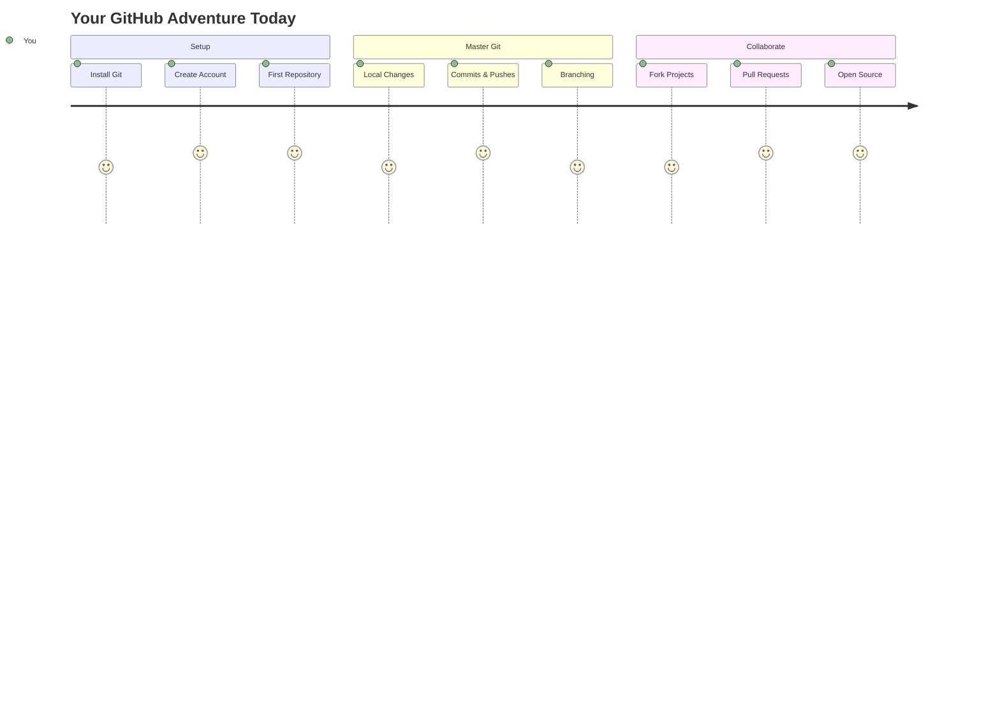
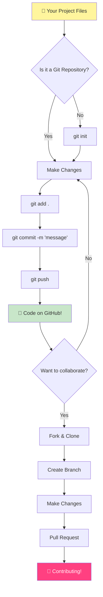
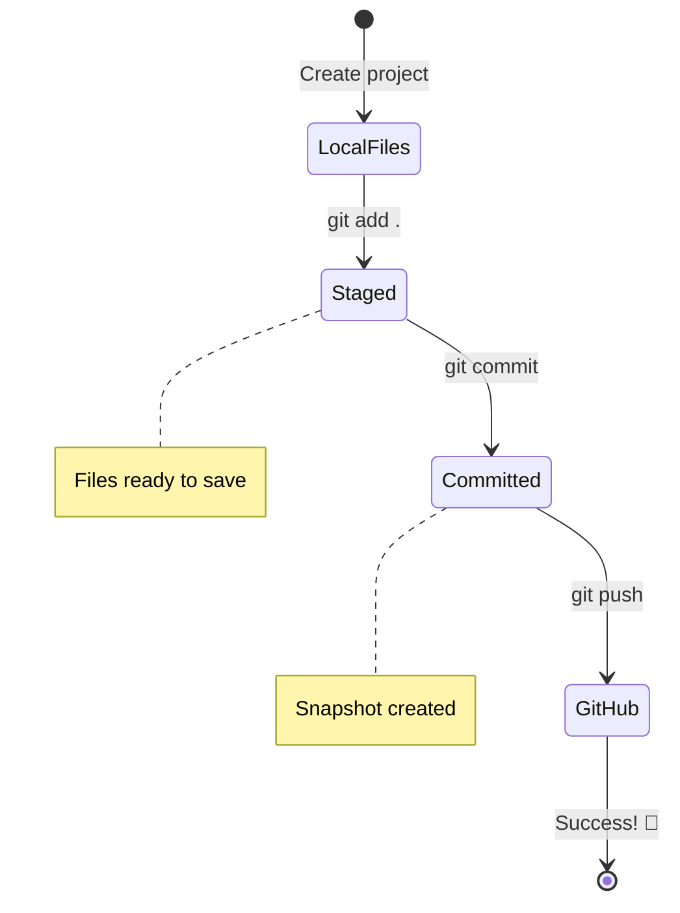
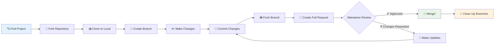
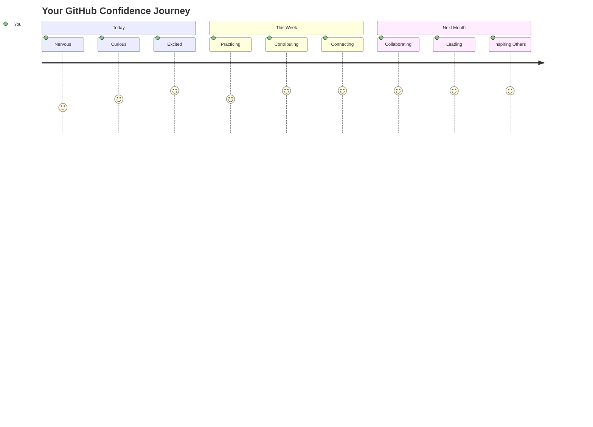

<!--
CO_OP_TRANSLATOR_METADATA:
{
  "original_hash": "0fe3ff66299b447f1c8cb34dcbf0c5ef",
  "translation_date": "2025-11-06T14:21:42+00:00",
  "source_file": "1-getting-started-lessons/2-github-basics/README.md",
  "language_code": "my"
}
-->
# GitHub ကိုမိတ်ဆက်ခြင်း

ဟယ်လို၊ အနာဂတ် Developer! 👋 ကမ္ဘာတစ်ဝှမ်းရှိ coder သန်းပေါင်းများစွာနှင့် ပူးပေါင်းလုပ်ဆောင်ရန် အသင့်ဖြစ်ပြီလား? GitHub ကိုမိတ်ဆက်ပေးဖို့ အရမ်းလှုပ်ရှားနေပါတယ် – ဒါကို programmer တွေအတွက် social media platform လို့ထင်ပါ။ Lunch ရဲ့ဓာတ်ပုံတွေမျှဝေတဲ့အစား၊ ကျွန်တော်တို့ code တွေကိုမျှဝေပြီး အံ့မခန်းအရာတွေကိုအတူတူတည်ဆောက်နေပါတယ်!

အံ့မခန်းဖြစ်စေတဲ့အရာကတော့ – သင့်ဖုန်းထဲမှာရှိတဲ့ app တစ်ခုစီ၊ သင်သွားလည်တဲ့ website တစ်ခုစီ၊ သင်သုံးဖို့လေ့လာမယ့် tools များစွာကို GitHub ကဲ့သို့သော platform တွေပေါ်မှာ developer အဖွဲ့များပူးပေါင်းပြီးတည်ဆောက်ထားတာပါ။ သင်နှစ်သက်တဲ့ music app? သင်လို developer တစ်ယောက်က အထောက်အကူပြုထားတာပါ။ သင်မရပ်နိုင်တဲ့ game? ဟုတ်ပါတယ်၊ GitHub ပေါ်မှာပူးပေါင်းလုပ်ဆောင်ထားတာဖြစ်နိုင်ပါတယ်။ အခုတော့ သင်ဟာ ဒီအံ့မခန်း community ရဲ့အဖွဲ့ဝင်ဖြစ်ဖို့ လေ့လာသွားမှာပါ!

ဒီအရာတွေကိုစတင်လေ့လာတဲ့အခါ အများကြီးဖြစ်နေသလိုခံစားရနိုင်ပါတယ် – ကျွန်တော်လည်း ပထမဆုံး GitHub စာမျက်နှာကိုကြည့်ပြီး "ဒီအရာတွေကဘာကိုဆိုလိုတာလဲ?" လို့တွေးနေခဲ့တာကိုသိတယ်။ ဒါပေမယ့် အရေးကြီးတာက – developer တစ်ယောက်စီဟာ သင်အခုရှိနေတဲ့နေရာမှာပဲ စတင်ခဲ့တာပါ။ ဒီသင်ခန်းစာအဆုံးမှာ သင်မှာ GitHub repository ကိုယ်ပိုင်တစ်ခု (cloud ပေါ်မှာ သင့် project ကိုပြသတဲ့နေရာ) ရှိလာပြီး သင့်အလုပ်ကိုသိမ်းဆည်းနည်း၊ အခြားသူများနှင့်မျှဝေနည်း၊ သန်းပေါင်းများစွာသောလူများအသုံးပြုနေတဲ့ project တွေကိုပါအထောက်အကူပြုနည်းကိုသိလာပါမယ်။

ကျွန်တော်တို့ ဒီခရီးကိုအတူတူတစ်ဆင့်ချင်းဆင့်ယူသွားမှာပါ။ အလျင်မပြုပါနဲ့၊ ဖိအားမပေးပါနဲ့ – သင်၊ ကျွန်တော်၊ နဲ့ သင့်အနာဂတ်အကောင်းဆုံး tools တွေကိုအတူတူလေ့လာသွားမှာပါ!


> Sketchnote by [Tomomi Imura](https://twitter.com/girlie_mac)



## သင်ခန်းစာမတိုင်မီ Quiz
[Pre-lecture quiz](https://ff-quizzes.netlify.app)

## မိတ်ဆက်

အရမ်းစိတ်လှုပ်ရှားစရာကောင်းတဲ့အရာတွေကိုစတင်မပြောခင်၊ သင့်ကွန်ပျူတာကို GitHub magic အတွက်အသင့်ဖြစ်အောင်လုပ်ရအောင်! ဒါကို သင်ပန်းချီကားတစ်ခုဖန်တီးမယ့်အခါ art supplies တွေကိုစီစဉ်ထားတဲ့အတိုင်းထင်ပါ – tools တွေကိုအဆင်ပြေစွာအသင့်ထားတာက အားလုံးကိုပိုမိုချောမွေ့စေပြီး ပိုမိုပျော်ရွှင်စေပါတယ်။

Setup တစ်ခုချင်းစီကို ကျွန်တော်ကိုယ်တိုင်လမ်းညွှန်ပေးမှာဖြစ်ပြီး၊ ပထမဆုံးကြည့်တဲ့အခါ အတော်လေးကြောက်စရာကောင်းတယ်လို့ခံစားရနိုင်ပေမယ့် အဲဒါမဟုတ်ပါဘူးလို့အာမခံပါတယ်။ တစ်ခုခုမရမချင်းဖြစ်ရင်လည်း အလွန်ပုံမှန်ပါပဲ! ကျွန်တော်ပထမဆုံး development environment ကို setup လုပ်တဲ့အခါ "ဟိုဂရိုဖစ်စာလုံးတွေကိုဖတ်ဖို့ကြိုးစားနေတာလား" လို့ခံစားခဲ့ရတာကိုသိတယ်။ Developer တစ်ယောက်စီဟာ သင်အခုရှိနေတဲ့နေရာမှာပဲ စတင်ခဲ့ပြီး "ကျွန်တော်မှန်ကန်စွာလုပ်နေလား" လို့တွေးနေခဲ့ပါတယ်။ Spoiler alert: သင်လေ့လာနေတယ်ဆိုရင် သင်ဟာမှန်ကန်စွာလုပ်နေပါပြီ! 🌟

ဒီသင်ခန်းစာမှာ ကျွန်တော်တို့ လေ့လာမယ့်အရာတွေက:

- သင့်ကွန်ပျူတာပေါ်မှာလုပ်ဆောင်တဲ့အလုပ်ကို tracking လုပ်နည်း
- အခြားသူများနှင့် project တွေကိုအတူတူလုပ်ဆောင်နည်း
- open source software တွေကိုအထောက်အကူပြုနည်း

### လိုအပ်ချက်များ

GitHub magic အတွက် သင့်ကွန်ပျူတာကိုအသင့်ဖြစ်အောင်လုပ်ရအောင်! စိုးရိမ်စရာမလိုပါဘူး – ဒီ setup ကိုတစ်ခါတည်းလုပ်ရုံပါပဲ၊ အဲဒီနောက်မှာ သင့် coding ခရီးလုံးအတွက်အသင့်ဖြစ်နေပါပြီ။

အဆောက်အအုံကိုစတင်ရအောင်! ပထမဆုံး Git ဟာ သင့်ကွန်ပျူတာမှာရှိပြီးသားလားဆိုတာစစ်ဆေးရမယ်။ Git ဟာ သင့် code ကိုပြောင်းလဲမှုတစ်ခုချင်းစီကိုမှတ်မိနေတဲ့ super-smart assistant တစ်ယောက်လိုပါပဲ – Ctrl+S ကိုနှစ်စက္ကန့်တိုင်းနှိပ်ရတာထက်ပိုကောင်းပါတယ် (ကျွန်တော်တို့အားလုံးအဲဒီလိုလုပ်ဖူးကြတယ်!).

Git install လုပ်ထားပြီးသားလားဆိုတာစစ်ဆေးဖို့ terminal မှာ ဒီ magic command ကိုရိုက်ပါ:
`git --version`

Git မရှိသေးရင် စိုးရိမ်စရာမလိုပါဘူး! [download Git](https://git-scm.com/downloads) ကိုသွားပြီး download လုပ်လိုက်ပါ။ Install လုပ်ပြီးတာနဲ့ Git ကို properly မိတ်ဆက်ပေးရမယ်:

> 💡 **ပထမဆုံး Setup**: ဒီ command တွေက Git ကို သင်ဘယ်သူလဲဆိုတာပြောပါတယ်။ ဒီအချက်အလက်တွေဟာ သင့် commit တစ်ခုချင်းစီနဲ့တွဲဖက်ပြီးသွားမှာဖြစ်လို့ သင့်အဆင်ပြေတဲ့နာမည်နဲ့ email ကိုရွေးချယ်ပါ။

```bash
git config --global user.name "your-name"
git config --global user.email "your-email"
```

Git ကို configure လုပ်ထားပြီးသားလားဆိုတာစစ်ဆေးဖို့:
```bash
git config --list
```

GitHub account တစ်ခု၊ code editor (Visual Studio Code ကောင်းပါတယ်) တစ်ခု၊ terminal (သို့မဟုတ် command prompt) ကိုဖွင့်ဖို့လိုအပ်ပါမယ်။

[github.com](https://github.com/) ကိုသွားပြီး account တစ်ခုဖွင့်ပါ၊ သို့မဟုတ် login လုပ်ပြီး profile ကိုဖြည့်ပါ။

💡 **ခေတ်သစ်အကြံပေးချက်**: Password မလိုဘဲ authentication ကိုပိုမိုလွယ်ကူစေဖို့ [SSH keys](https://docs.github.com/en/authentication/connecting-to-github-with-ssh) ကို setup လုပ်တာ သို့မဟုတ် [GitHub CLI](https://cli.github.com/) ကိုအသုံးပြုတာကိုစဉ်းစားပါ။

✅ GitHub ဟာ ကမ္ဘာမှာရှိတဲ့ code repository တစ်ခုတည်းမဟုတ်ပါဘူး၊ အခြား repository တွေလည်းရှိပေမယ့် GitHub က အထင်ရှားဆုံးဖြစ်ပါတယ်

### ပြင်ဆင်မှု

သင့် local machine (laptop သို့မဟုတ် PC) ပေါ်မှာ code project တစ်ခုပါရှိတဲ့ folder တစ်ခုနဲ့ GitHub ပေါ်မှာ public repository တစ်ခုလိုအပ်ပါမယ်၊ ဒါဟာ အခြားသူများရဲ့ project တွေကိုအထောက်အကူပြုနည်းကိုလေ့လာဖို့နမူနာအဖြစ်အသုံးပြုမယ်။

### သင့် Code ကိုလုံခြုံစွာထားရှိခြင်း

လုံခြုံရေးအကြောင်းကိုအနည်းငယ်ပြောကြရအောင် – ဒါပေမယ့် စိုးရိမ်စရာကောင်းတဲ့အရာတွေကိုမပြောပါဘူး! ဒီလုံခြုံရေးအလေ့အကျင့်တွေကို သင့်ကား သို့မဟုတ် သင့်အိမ်ကိုသော့ခတ်တဲ့အတိုင်းထင်ပါ – ရိုးရှင်းတဲ့အလေ့အကျင့်တွေဖြစ်ပြီး သင့်အလုပ်ကိုလုံခြုံစွာထိန်းသိမ်းနိုင်စေပါတယ်။

GitHub နဲ့အလုပ်လုပ်တဲ့အခါ လုံခြုံရေးအကောင်းဆုံးအလေ့အကျင့်တွေကိုလိုက်နာဖို့အရေးကြီးပါတယ်:

| လုံခြုံရေးဧရိယာ | အကောင်းဆုံးအလေ့အကျင့် | အရေးကြီးတဲ့အကြောင်းရင်း |
|---------------|---------------|----------------|
| **Authentication** | SSH keys သို့မဟုတ် Personal Access Tokens ကိုအသုံးပြုပါ | Password တွေကပိုမလုံခြုံပြီး phase out လုပ်နေပါတယ် |
| **Two-Factor Authentication** | GitHub account မှာ 2FA ကို enable လုပ်ပါ | Account ကိုထပ်တစ်ဆင့်လုံခြုံစေပါတယ် |
| **Repository Security** | အရေးကြီးတဲ့အချက်အလက်တွေကို commit မလုပ်ပါနဲ့ | API keys နဲ့ passwords တွေကို public repos မှာမထည့်သင့်ပါ |
| **Dependency Management** | Dependabot ကို enable လုပ်ပါ | Dependency တွေကိုလုံခြုံစေပြီး update လုပ်ထားနိုင်ပါတယ် |

> ⚠️ **အရေးကြီးတဲ့လုံခြုံရေးအမှတ်တရ**: API keys, passwords, သို့မဟုတ် sensitive information တွေကို repository တစ်ခုခုမှာ commit မလုပ်ပါနဲ့။ Environment variables နဲ့ `.gitignore` files ကိုအသုံးပြုပြီး sensitive data ကိုကာကွယ်ပါ။

**ခေတ်သစ် Authentication Setup:**

```bash
# Generate SSH key (modern ed25519 algorithm)
ssh-keygen -t ed25519 -C "your_email@example.com"

# Set up Git to use SSH
git remote set-url origin git@github.com:username/repository.git
```

> 💡 **Pro Tip**: SSH keys တွေက password တွေကိုအကြိမ်ကြိမ်ရိုက်ရတာကိုဖယ်ရှားပေးပြီး traditional authentication methods ထက်ပိုမိုလုံခြုံပါတယ်။

---

## သင့် Code ကို Pro တစ်ယောက်လိုစီမံခြင်း

အိုကေ၊ အခုက အရမ်းစိတ်လှုပ်ရှားစရာကောင်းတဲ့နေရာပါ! 🎉 ကျွန်တော်တို့ သင့် code ကို pro တွေလို track နဲ့ manage လုပ်နည်းကိုလေ့လာတော့မှာဖြစ်ပြီး၊ အဲဒါက coding life ကိုပြောင်းလဲစေတဲ့အရာဖြစ်လို့ အရမ်းသင်ပေးချင်တဲ့အရာတစ်ခုပါ။

ဒီလိုစဉ်းစားပါ: သင်အံ့မခန်းဇာတ်လမ်းတစ်ပုဒ်ရေးနေပြီး၊ draft တစ်ခုချင်းစီ၊ brilliant edit တစ်ခုချင်းစီ၊ "အို၊ ဒါကအရမ်းကောင်းတယ်!" ဆိုတဲ့အချိန်တစ်ခုချင်းစီကိုမှတ်ထားချင်တယ်။ Git ဟာ သင့် code အတွက်အဲဒီလိုအတိအကျမှတ်ထားတဲ့ time-traveling notebook တစ်ခုလိုပါပဲ! Keystroke တစ်ခုချင်းစီ၊ ပြောင်းလဲမှုတစ်ခုချင်းစီ၊ "အို၊ အဲဒါကအကုန်ပျက်သွားတယ်" ဆိုတဲ့အချိန်တစ်ခုချင်းစီကိုတစ်ချက်တည်းပြန်ပြင်နိုင်ပါတယ်။

အရင်ဆုံးတော့ အတော်လေးအလွှမ်းတစ်လွှမ်းဖြစ်နေသလိုခံစားရနိုင်ပါတယ်။ ကျွန်တော်စတင်တဲ့အခါ "ဘာလို့ file တွေကိုပုံမှန်အတိုင်း save လုပ်လို့မရတာလဲ?" လို့တွေးခဲ့တယ်။ ဒါပေမယ့် Git ကိုနားလည်တဲ့အခါ (နောက်ဆုံးမှာနားလည်မှာပါ!) သင်မှာ "Git မရှိဘဲ coding လုပ်ခဲ့တာဘယ်လိုလဲ?" ဆိုတဲ့ lightbulb moment ရပါမယ်။ ဒါဟာ သင်လမ်းလျှောက်နေတဲ့အချိန်မှာ ပျံနိုင်တယ်ဆိုတာရှာဖွေသလိုပါပဲ!

သင့် local folder မှာ code project တစ်ခုရှိပြီး git – version control system ကိုအသုံးပြုပြီး progress ကို tracking လုပ်ချင်တယ်ဆိုပါစို့။ git ကိုအသုံးပြုတာကို အချို့လူတွေက သင့်အနာဂတ်ကိုယ်တိုင်ကိုချစ်တဲ့စာရေးတာလိုပြောကြတယ်။ commit messages တွေကို ရက်ပေါင်းများစွာ၊ လများစွာ၊ နှစ်များစွာအကြာမှာပြန်ဖတ်တဲ့အခါ သင်ဘာကြောင့်အဲဒီဆုံးဖြတ်ချက်ကိုလုပ်ခဲ့တယ်ဆိုတာကိုမှတ်မိနိုင်ပြီး၊ "rollback" လုပ်နိုင်ပါတယ် – ဒါကတော့ သင်ကောင်းမွန်တဲ့ "commit messages" ရေးတဲ့အခါမှာပါ။



### Task: သင့်ပထမဆုံး Repository ကိုဖန်တီးပါ!

> 🎯 **သင့်မစ်ရှင် (ကျွန်တော်အရမ်းစိတ်လှုပ်ရှားနေပါတယ်!)**: ကျွန်တော်တို့ သင့်ပထမဆုံး GitHub repository ကိုအတူတူဖန်တီးသွားမယ်! ဒီနေရာမှာပြီးဆုံးတဲ့အခါ သင့် code နေထိုင်တဲ့ internet ရဲ့အနားလေးကိုရရှိပြီး၊ သင့်ပထမဆုံး "commit" (developer တွေက အရမ်း smart နည်းလမ်းနဲ့ အလုပ်ကို save လုပ်တာကိုပြောတာ) ကိုလုပ်ပြီးဖြစ်ပါမယ်။
>
> ဒီအချိန်ဟာ အရမ်းထူးခြားတဲ့အချိန်ပါ – သင်က developer တွေရဲ့ global community ကိုတရားဝင်အဖွဲ့ဝင်ဖြစ်တော့မှာပါ! ကျွန်တော်ပထမဆုံး repo ကိုဖန်တီးတဲ့ thrill ကိုအခုထိမှတ်မိနေပြီး "Wow, ကျွန်တော်အမှန်တကယ်လုပ်နေတယ်!" လို့တွေးခဲ့တာကိုသိတယ်။

ဒီခရီးကိုအတူတူတစ်ဆင့်ချင်းဆင့်လမ်းလျှောက်သွားရအောင်။ အပိုင်းတစ်ခုချင်းစီကိုအချိန်ယူပါ – အလျင်မပြုပါနဲ့၊ အဆင့်တစ်ခုချင်းစီဟာအဓိပ္ပာယ်ရှိလာမယ်လို့အာမခံပါတယ်။ သင်အားလုံးကိုအံ့မခန်းထင်ရတဲ့ coding superstar တွေဟာ သင်အခုရှိနေတဲ့နေရာမှာပဲရှိခဲ့ပြီး ပထမဆုံး repository ကိုဖန်တီးဖို့အဆင်သင့်ဖြစ်နေခဲ့ပါတယ်။ ဒါကဘယ်လောက်အေးလဲ?

> Video ကိုကြည့်ပါ
> 
> [](https://www.youtube.com/watch?v=9R31OUPpxU4)

**အတူတူလုပ်ဆောင်ကြရအောင်:**

1. **GitHub မှာ သင့် repository ကိုဖန်တီးပါ**. GitHub.com ကိုသွားပြီး အဲဒီလှပတဲ့အစိမ်းရောင် **New** ခလုတ် (သို့မဟုတ် အပေါ်ဘက်ညာဘက်မှာရှိတဲ့ **+** အမှတ်အသား) ကိုရှာပါ။ အဲဒီကိုနှိပ်ပြီး **New repository** ကိုရွေးပါ။

   ဒီအတိုင်းလုပ်ပါ:
   1. သင့် repository ကိုနာမည်ပေးပါ – သင့်အတွက်အဓိပ္ပာယ်ရှိတဲ့အရာကိုရွေးပါ!
   1. Description ထည့်ချင်ရင်ထည့်ပါ (ဒါက project ရဲ့အကြောင်းကိုအခြားသူတွေကိုနားလည်စေပါတယ်)
   1. Public (လူတိုင်းကြည့်နိုင်တယ်) သို့မဟုတ် Private (သင့်အတွက်ပဲ) ဖြစ်ဖို့ဆုံးဖြတ်ပါ
   1. README file ကိုထည့်ဖို့ box ကို check လုပ်ဖို့အကြံပေးပါတယ် – project ရဲ့အရှေ့စာမျက်နှာလိုပါပဲ
   1. **Create repository** ကိုနှိပ်ပြီး အောင်မြင်မှုကိုခံစားပါ – သင့်ပထမဆုံး repo ကိုဖန်တီးပြီးပါပြီ! 🎉

2. **သင့် project folder ကိုသွားပါ**. အခုတော့ terminal ကိုဖွင့်ပြီး (ကြောက်စရာကောင်းတယ်လို့မထင်ပါနဲ့!) သင့် project file တွေရှိတဲ့နေရာကို သင့်ကွန်ပျူတာကိုပြောရမယ်။ ဒီ command ကိုရိုက်ပါ:

   ```bash
   cd [name of your folder]
   ```

   **ဒီမှာ
**ကျွန်တော်တို့ လုပ်ခဲ့တာ:**
- သင့်ရဲ့ ဒေသခံပရောဂျက်နဲ့ GitHub repository အကြား ချိတ်ဆက်မှုကို ဖန်တီးခဲ့ပါတယ်။
- "Origin" ဆိုတာ သင့် GitHub repository အတွက် နာမည်တစ်ခုသာဖြစ်ပါတယ် – ဖုန်းမှာ contact တစ်ခုထည့်သလိုပဲ။
- အခု သင့် ဒေသခံ Git က သင့် code ကို မျှဝေဖို့ ပြင်ဆင်တဲ့အခါ GitHub ကို ပို့ရမယ့်နေရာကို သိနေပါပြီ။

💡 **လွယ်ကူတဲ့နည်းလမ်း**: GitHub CLI ကို install လုပ်ထားရင် တစ် command နဲ့ ဒီအရာကို လုပ်နိုင်ပါတယ်:
   ```bash
   gh repo create my-repo --public --push --source=.
   ```

8. **သင့် code ကို GitHub ကို ပို့ပါ** (အရေးကြီးတဲ့အချိန်!):

   ```bash
   git push -u origin main
   ```

**🚀 အခုတော့ သင့် code ကို GitHub ကို upload လုပ်နေပါပြီ!**

**ဘာဖြစ်နေသလဲ:**
- သင့် commits တွေက သင့်ကွန်ပျူတာကနေ GitHub ကို သွားနေပါတယ်။
- `-u` flag က အမြဲတမ်း connection တစ်ခုကို ဖန်တီးပေးပြီး အနာဂတ်မှာ push လုပ်တာ ပိုလွယ်ကူစေပါတယ်။
- "main" ဆိုတာ သင့် primary branch ရဲ့ နာမည်ဖြစ်ပါတယ် (main folder လိုပဲ)။
- ဒီအခါမှာတော့ အနာဂတ် upload တွေအတွက် `git push` ကိုသာ ရိုက်လိုက်ရုံပါပဲ!

💡 **အရေးကြီးအချက်**: သင့် branch ကို "master" လို့ခေါ်ရင်တော့ အဲဒီနာမည်ကို သုံးပါ။ `git branch --show-current` နဲ့ စစ်ဆေးနိုင်ပါတယ်။

9. **သင့် coding ရဲ့ နေ့စဉ် rhythm** (အခုကတော့ စွဲလန်းစရာပါ!):

အခုကစပြီး သင့် project ကို ပြောင်းလဲမှုတွေ လုပ်တဲ့အခါ ဒီအဆင့်သုံးဆင့် dance လေးကို လုပ်ရပါမယ်:

   ```bash
   git add .
   git commit -m "describe what you changed"
   git push
   ```

**ဒီ workflow က သင့် coding ရဲ့ heartbeat ဖြစ်လာပါမယ်:**
- သင့် code ကို အံ့ဩစရာ ပြောင်းလဲမှုတွေ လုပ်ပါ ✨
- `git add` နဲ့ stage လုပ်ပါ ("Git ကို ဒီပြောင်းလဲမှုတွေကို သတိထားပါလို့ ပြောတာပါ!")
- `git commit` နဲ့ save လုပ်ပြီး ဖော်ပြချက် message တစ်ခုထည့်ပါ (အနာဂတ်မှာ သင့်ကိုယ်ကို ကျေးဇူးတင်စေပါမယ်!)
- `git push` နဲ့ ကမ္ဘာကို မျှဝေပါ 🚀
- ထပ်လုပ်ပါ – အမှန်တကယ် ဒီ workflow က သဘာဝလို ဖြစ်လာပါမယ်!

ဒီ workflow ကို ကျွန်တော်ချစ်တာက video game မှာ save points အများကြီး ရှိသလိုပါပဲ။ သင့်အကြိုက်ပြောင်းလဲမှုတစ်ခု လုပ်လိုက်ရင် commit လုပ်ပါ! အန္တရာယ်ရှိတဲ့အရာကို စမ်းချင်ရင်လည်း အဆင်ပြေပါတယ် – အရာတွေ မအောင်မြင်ရင် နောက်ဆုံး commit ကို ပြန်သွားနိုင်ပါတယ်!

> 💡 **အကြံပေးချက်**: `.gitignore` file တစ်ခုကို သုံးဖို့ စဉ်းစားပါ၊ သင့် GitHub မှာ track လုပ်ချင်မယ့် file တွေကို မပါစေဖို့ – public repository မှာ မရှိသင့်တဲ့ notes file လို file တွေပါ။ `.gitignore` file templates တွေကို [.gitignore templates](https://github.com/github/gitignore) မှာ ရှာနိုင်ပါတယ်၊ ဒါမှမဟုတ် [gitignore.io](https://www.toptal.com/developers/gitignore) ကို သုံးပြီး ဖန်တီးနိုင်ပါတယ်။

### 🧠 **ပထမဆုံး Repository Check-in: အဲဒီအရာကို ခံစားရတာ ဘယ်လိုလဲ?**

**အနားယူပြီး အတွေးအမြင်တွေ ပြန်လည်သုံးသပ်ပါ:**
- သင့် code ကို GitHub မှာ ပထမဆုံးမြင်ရတာ ဘယ်လိုခံစားရလဲ?
- ဘယ်အဆင့်က အလွယ်ဆုံးလို့ ခံစားရပြီး ဘယ်အဆင့်က အလွယ်တကူ မဖြစ်နိုင်ဘူးလို့ ထင်ရလဲ?
- `git add`, `git commit`, နဲ့ `git push` တို့ရဲ့ ကွာခြားချက်ကို သင့်စကားနဲ့ ရှင်းပြနိုင်မလား?



> **သတိပြုပါ**: အတွေ့အကြုံရှိတဲ့ developer တွေတောင် command တွေကို တိတိကျကျ မမှတ်မိတာ ရှိတတ်ပါတယ်။ ဒီ workflow ကို muscle memory ဖြစ်လာဖို့ အလေ့အကျင့်လိုပါတယ် – သင့်အနေဖြင့် အရမ်းကောင်းနေပါတယ်!

#### ခေတ်မီ Git workflows

ဒီ practices တွေကို စဉ်းစားပြီး လက်ခံသုံးစွဲပါ:

- **Conventional Commits**: `feat:`, `fix:`, `docs:` စတဲ့ standardized commit message format ကို သုံးပါ။ [conventionalcommits.org](https://www.conventionalcommits.org/) မှာ ပိုမိုလေ့လာနိုင်ပါတယ်။
- **Atomic commits**: commit တစ်ခုစီကို တစ်ခုတည်းသော logical ပြောင်းလဲမှုကို ကိုယ်စားပြုပါ။
- **Frequent commits**: အကြီးမားတဲ့ commit တွေ မလုပ်ဘဲ အကြောင်းဖော်ပြချက် message တွေပါရှိတဲ့ commit တွေကို မကြာခဏလုပ်ပါ။

#### Commit messages

Git commit subject line က ဒီစာကြောင်းကို ပြည့်စုံစေပါတယ်:
ဒီ commit ကို အသုံးပြုရင် <သင့် subject line> ဖြစ်ပါလိမ့်မယ်။

Subject မှာ imperative, present tense ကို သုံးပါ: "change" ဖြစ်ရမယ်၊ "changed" သို့မဟုတ် "changes" မဟုတ်ပါဘူး။
Subject မှာလိုပဲ body (optional) မှာလည်း imperative, present tense ကို သုံးပါ။ Body မှာ ပြောင်းလဲမှုရဲ့ motivation ကို ရှင်းပြပြီး ယခင်အခြေအနေနဲ့ ကွာခြားချက်ကို ဖော်ပြပါ။ `why` ကို ရှင်းပြတာဖြစ်ပြီး `how` ကို မဟုတ်ပါ။

✅ GitHub မှာ surf လုပ်ပြီး commit message ကောင်းတစ်ခုကို ရှာဖွေပါ။ အနည်းဆုံး message တစ်ခုကို ရှာဖွေပါ။ commit message မှာ ဘယ်အချက်တွေက အရေးကြီးပြီး အသုံးဝင်တယ်လို့ သင်ထင်ပါသလဲ?

## အခြားသူတွေနဲ့ အလုပ်လုပ်ခြင်း (ပျော်စရာအပိုင်း!)

အခုတော့ GitHub က အံ့ဩစရာကောင်းတဲ့အပိုင်းကို စတင်ပါမယ်! 🪄 သင့်ကိုယ်ပိုင် code ကို စီမံခန့်ခွဲတာကို ကျွမ်းကျင်ပြီးသားဖြစ်ပါတယ်၊ ဒါပေမယ့် အခုတော့ ကျွန်တော်အကြိုက်ဆုံးအပိုင်း – ကမ္ဘာတစ်ဝှမ်းက အံ့ဩစရာကောင်းတဲ့လူတွေနဲ့ ပူးပေါင်းလုပ်ဆောင်ခြင်းကို စတင်ပါမယ်။

ဒီလိုပုံစံကို စိတ်ကူးပါ: မနက်ဖြန် နိုးလာတဲ့အခါ တိုကျိုက developer တစ်ဦးက သင့် code ကို တိုးတက်အောင် လုပ်ထားပါတယ်။ ပြီးတော့ ဘာလင်က developer တစ်ဦးက သင့်အခက်အခဲဖြေရှင်းပေးပါတယ်။ နေ့လယ်မှာတော့ ဆာအိုပေါလိုက developer တစ်ဦးက သင့်မစဉ်းစားမိတဲ့ feature တစ်ခုကို ထည့်သွင်းပေးပါတယ်။ ဒါက သိပ္ပံစိတ်ကူးမဟုတ်ပါဘူး – GitHub universe မှာ အဲဒီအရာက သာမန်နေ့တစ်နေ့ပါပဲ!

ကျွန်တော်ကို အရမ်းစိတ်လှုပ်ရှားစေတဲ့အချက်က သင်လေ့လာမယ့် collaboration skills တွေက Google, Microsoft, နဲ့ သင့်အကြိုက်ဆုံး startups တွေမှာ နေ့စဉ်အသုံးပြုတဲ့ workflows တွေပါပဲ။ သင် cool tool တစ်ခုကို လေ့လာတာမဟုတ်ပါဘူး – software ကမ္ဘာတစ်ခုလုံးကို ပူးပေါင်းလုပ်ဆောင်စေတဲ့ လျှို့ဝှက်ဘာသာစကားကို လေ့လာနေပါတယ်။

အမှန်တကယ် open source project မှာ ပထမဆုံး pull request ကို merge လုပ်တဲ့အခါရဲ့ စိတ်လှုပ်ရှားမှုကို ခံစားရတဲ့အခါ developer တွေက ဘာကြောင့် အရမ်းစိတ်အားထက်သန်နေကြတာကို နားလည်နိုင်ပါလိမ့်မယ်။ ဒါက ကမ္ဘာ့အကြီးဆုံး၊ အဖန်တီးဆုံး team project ရဲ့ အစိတ်အပိုင်းတစ်ခုဖြစ်သလိုပါပဲ!

> ဗီဒီယိုကြည့်ပါ
>
> [](https://www.youtube.com/watch?v=bFCM-PC3cu8)

GitHub မှာ အရာတွေကို ထည့်သွင်းတာရဲ့ အဓိကအကြောင်းရင်းက အခြား developer တွေနဲ့ ပူးပေါင်းလုပ်ဆောင်နိုင်ဖို့ပါ။



သင့် repository မှာ `Insights > Community` ကို သွားပြီး သင့် project က community standards အတွက် အဆင့်က ဘယ်လိုရှိလဲ စစ်ဆေးပါ။

သင့် repository ကို professional နဲ့ ကြိုဆိုဖွယ်ကောင်းအောင် လုပ်ချင်ပါသလား? သင့် repository ကို သွားပြီး `Insights > Community` ကို click လုပ်ပါ။ ဒီ feature က သင့် project က GitHub community ရဲ့ "good repository practices" လို့ သတ်မှတ်ထားတဲ့အချက်တွေနဲ့ ဘယ်လိုတူညီလဲဆိုတာ ပြသပေးပါတယ်။

> 🎯 **သင့် Project ကို ထင်ဟပ်စေခြင်း**: စီမံထားတဲ့ repository တစ်ခုက documentation ကောင်းကောင်းနဲ့ ရှိရင် သင့်အလုပ်ကို အရေးကြီးစေပြီး အခြားသူတွေကို ပါဝင်ချင်စေပါတယ်!

**Repository ကို အံ့ဩစရာကောင်းအောင် လုပ်စေတဲ့အရာတွေ:**

| ဘာထည့်မလဲ | အရေးကြီးတဲ့အကြောင်းရင်း | သင့်အတွက် ဘာလုပ်ပေးမလဲ |
|-------------|-------------------|---------------------|
| **Description** | ပထမဆုံး impression အရေးကြီးပါတယ်! | သင့် project ဘာလုပ်ပေးနိုင်လဲဆိုတာ လူတွေ ချက်ချင်းသိနိုင်ပါတယ် |
| **README** | သင့် project ရဲ့ မျက်နှာဖုံး | သစ်လွင်တဲ့ visitor တွေအတွက် လမ်းညွှန် guide လိုပါပဲ |
| **Contributing Guidelines** | အကူအညီကို ကြိုဆိုတယ်ဆိုတာ ပြသပါတယ် | လူတွေ သင့်ကို ဘယ်လိုကူညီနိုင်လဲဆိုတာ သိနိုင်ပါတယ် |
| **Code of Conduct** | အပေါင်းအသင်းကောင်းကောင်း ဖန်တီးပေးပါတယ် | လူတိုင်း ပါဝင်ဖို့ ကြိုဆိုခံစားရပါတယ် |
| **License** | ဥပဒေကြောင်းရှင်းလင်းမှု | အခြားသူတွေ သင့် code ကို ဘယ်လိုအသုံးပြုနိုင်လဲဆိုတာ သိနိုင်ပါတယ် |
| **Security Policy** | သင့်ရဲ့ တာဝန်ရှိမှုကို ပြသပါတယ် | ပရော်ဖက်ရှင်နယ် လုပ်ဆောင်မှုတွေကို ပြသပါတယ် |

> 💡 **Pro Tip**: GitHub က ဒီ file တွေအတွက် templates တွေ ပေးထားပါတယ်။ repository အသစ်တစ်ခု ဖန်တီးတဲ့အခါ ဒီ file တွေကို auto generate လုပ်ဖို့ box တွေကို check လုပ်ပါ။

**ခေတ်မီ GitHub Features တွေကို စူးစမ်းပါ:**

🤖 **Automation & CI/CD:**
- **GitHub Actions** ကို automated testing နဲ့ deployment အတွက်
- **Dependabot** ကို automatic dependency updates အတွက်

💬 **Community & Project Management:**
- **GitHub Discussions** ကို issues ထက်ပိုပြီး community conversations အတွက်
- **GitHub Projects** ကို kanban-style project management အတွက်
- **Branch protection rules** ကို code quality standards ကို အတည်ပြုဖို့

ဒီ resource တွေက အသစ်ရောက်တဲ့ team member တွေကို အကျိုးရှိစေပါမယ်။ အဲဒီ resource တွေက typically အသစ်ရောက်တဲ့ contributor တွေ project ကို စတင်ကြည့်မယ့်အခါ အရေးကြီးတဲ့အရာတွေဖြစ်ပါတယ်။

✅ README files တွေက ပြင်ဆင်ဖို့ အချိန်ယူရတတ်ပေမယ့် 忙碌တဲ့ maintainer တွေက မကြာခဏ မလေးစားတတ်ပါဘူး။ အရမ်းဖော်ပြချက်ကောင်းတဲ့ README file တစ်ခုကို ရှာဖွေပါ။ Note: [tools to help create good READMEs](https://www.makeareadme.com/) တွေကို စမ်းသုံးကြည့်ပါ။

### Task: Code တစ်ခုကို Merge လုပ်ပါ

Contributing docs တွေက project ကို ကူညီဖို့ လူတွေကို ကူညီပေးပါတယ်။ ဘယ်လို contribution အမျိုးအစားတွေကို ရှာဖွေနေပြီး process က ဘယ်လိုလုပ်ရမလဲဆိုတာ ရှင်းပြပါတယ်။ Contributors တွေ GitHub မှာ သင့် repo ကို contribute လုပ်ဖို့ အဆင့်တွေကို လုပ်ရပါမယ်:

1. **Forking your repo** သင့် project ကို _fork_ လုပ်ဖို့ contributor တွေကို လိုအပ်ပါတယ်။ Forking ဆိုတာ သူတို့ရဲ့ GitHub profile မှာ သင့် repository ရဲ့ replica တစ်ခုကို ဖန်တီးတာပါ။
1. **Clone**. အဲဒီနေရာက သူတို့ project ကို သူတို့ရဲ့ local machine မှာ clone လုပ်ပါမယ်။
1. **Create a branch**. သူတို့ရဲ့ အလုပ်အတွက် _branch_ တစ်ခုကို ဖန်တီးဖို့ contributor တွေကို တောင်းဆိုပါ။
1. **Focus their change on one area**. Contributor တွေကို တစ်ခါတစ်ခါမှာ တစ်ခုတည်းသော အရာကို အာရုံစိုက်ဖို့ တောင်းဆိုပါ – အဲဒီလိုဆိုရင် သူတို့ရဲ့ အလုပ်ကို _merge_ လုပ်နိုင်တဲ့ အခွင့်အလမ်း ပိုများပါမယ်။ Bug fix တစ်ခုရေးတာ၊ feature အသစ်တစ်ခုထည့်တာ၊ နဲ့ test အများကြီး update လုပ်တာကို imagine လုပ်ပါ – သင့်အနေဖြင့် ၃ ခုထဲက ၂ ခု သို့မဟုတ် ၁ ခုကိုသာ implement လုပ်နိုင်ရင် ဘာဖြစ်မလဲ?

✅ Branch တွေက code ရေးနဲ့ ပို့တဲ့အတွက် အရေးကြီးတဲ့အခြေအနေကို imagine လုပ်ပါ။ ဘယ်လို use cases တွေကို စဉ်းစားနိုင်ပါသလဲ?

> သင်လိုချင်တဲ့ ပြောင်းလဲမှုကို အခြားသူတွေမှာ မျှော်လင့်သလို သင့်ကိုယ်တိုင်အတွက် branch တွေကို ဖန်တီးပါ။ သင့် commit တွေက သင့် "checked out" လုပ်ထားတဲ့ branch မှာ လုပ်ပါမယ်။ `git status` ကို သုံးပြီး ဘယ် branch မှာ ရှိလဲဆိုတာ ကြည့်ပါ။

Contributor workflow ကို လုပ်ဆောင်ကြည့်ပါ။ Contributor က repo ကို _fork_ နဲ့ _clone_ လုပ်ပြီး Git repo ကို သူတို့ရဲ့ local machine မှာ အလုပ်လုပ်ဖို့ ပြင်ဆင်ထားပြီးသားဖြစ်တယ်လို့ assume လုပ်ပါ:

1. **Create a branch**. Contributor တွေ contribute လုပ်ဖို့ ပြောင်းလဲမှုတွေကို ထည့်သွင်းမယ့် branch ကို ဖန်တီးဖို့ `git branch` command ကို သုံးပါ:

   ```bash
   git branch [branch-name]
   ```

   > 💡 **ခေတ်မီနည်းလမ်း**: Command တစ်ခုနဲ့ branch အသစ်ကို ဖန်တီးပြီး switch လုပ်နိုင်ပါတယ်:
   ```bash
   git switch -c [branch-name]
   ```

1. **Switch to working branch**. သတ်မှတ်ထားတဲ့ branch ကို switch လုပ်ပြီး working directory ကို update လုပ်ပါ `git switch` command ကို သုံးပါ:

   ```bash
   git switch [branch-name]
   ```

   > 💡 **ခေတ်မီအချက်**: `git switch` က branch တွေကို ပြောင်းလဲတဲ့အခါ `git checkout` ရဲ့ ခေတ်မီအစားထိုးဖြစ်ပါတယ်။ အရင်ထက် ပိုရှင်းပြီး beginner တွေအတွက် ပိုလုံခြုံပါတယ်။

1. **Do work**. အခုတော့ သင့်ပြောင်းလဲမှုတွေကို ထည့်သွင်းပါ။ Git ကို အဲဒီအကြောင်းကို ပြောဖို့ commands တွေကို မမေ့ပါနဲ့:

   ```bash
   git add .
   git commit -m "my changes"
   ```

   > ⚠️ **Commit Message Quality**: သင့် commit ကို ကောင်းမွန်တဲ့နာမည်ပေးပါ၊ သင့်အတွက်နဲ့ သင့်ကို ကူညီနေတဲ့ repo maintainer အတွက်ပါ။ သင့်ပြောင်းလဲမှုကို အတိအကျဖော်ပြပါ!

1. **Combine your work with the `main` branch**. တစ်ချိန်မှာတော့ သင့်အ
1. **ရှင်းလင်းမှု**။ PR ကိုအောင်မြင်စွာပေါင်းစည်းပြီးနောက်မှာ _ရှင်းလင်း_ လုပ်တာက အကောင်းဆုံးအလေ့အကျင့်တစ်ခုအဖြစ် သတ်မှတ်ထားပါတယ်။ သင့်ရဲ့ local branch နဲ့ GitHub ကို push လုပ်ထားတဲ့ branch နှစ်ခုလုံးကို ရှင်းလင်းချင်ပါတယ်။ အရင်ဆုံး local မှာ delete လုပ်ဖို့အတွက် အောက်ပါ command ကိုသုံးပါ:

   ```bash
   git branch -d [branch-name]
   ```

GitHub မှာ fork လုပ်ထားတဲ့ repo ရဲ့ page ကိုသွားပြီး remote branch ကိုလည်း ဖျက်ပစ်ပါ။

`Pull request` ဆိုတာ အနည်းငယ်အရူးအမူးဖြစ်နိုင်ပါတယ်၊ အကြောင်းကတော့ သင့်ရဲ့ project ကို push လုပ်ချင်တာပါ။ ဒါပေမဲ့ maintainer (project owner) သို့မဟုတ် core team က သင့်ရဲ့ changes ကို project ရဲ့ "main" branch နဲ့ပေါင်းစည်းမလားဆိုတာကို ဆုံးဖြတ်ဖို့လိုပါတယ်။ ဒါကြောင့် သင် maintainer ကို change ဆုံးဖြတ်ချက်တောင်းနေတဲ့အခြေအနေဖြစ်ပါတယ်။

Pull request ဆိုတာ review, comment, integrated test စတဲ့အရာတွေနဲ့ branch မှာ introduce လုပ်ထားတဲ့ အပြောင်းအလဲတွေကို နှိုင်းယှဉ်ပြီး ဆွေးနွေးဖို့နေရာတစ်ခုဖြစ်ပါတယ်။ commit message နဲ့တူတဲ့ rule တွေကို follow လုပ်တဲ့ pull request ကောင်းတစ်ခုဖြစ်ပါတယ်။ Issue tracker မှာ issue ကို reference လုပ်နိုင်ပါတယ်၊ ဥပမာ သင့်ရဲ့အလုပ်က issue တစ်ခုကို ဖြေရှင်းပေးတယ်ဆိုရင် `#` နဲ့ issue number ကိုထည့်သွင်းနိုင်ပါတယ်။ ဥပမာ `#97`။

🤞 Fingers crossed သင့်ရဲ့ changes တွေကို project owner(s) က project ထဲ merge လုပ်ပေးပါစေ 🤞

GitHub မှာရှိတဲ့ remote branch ရဲ့ commit အသစ်တွေကို သင့် local working branch နဲ့ update လုပ်ပါ:

`git pull`

## Open Source ကိုပံ့ပိုးခြင်း (သင့်ရဲ့ အကျိုးသက်ရောက်မှုကို ဖန်တီးရန် အခွင့်အရေး!)

အံ့ဩစရာကောင်းတဲ့အရာတစ်ခုကို ပြောပြမယ့်အတွက် အရမ်းလှုပ်ရှားနေပါတယ် 🤯 Open source project တွေကို ပံ့ပိုးခြင်းအကြောင်းကို ပြောကြားပါစို့ – ဒီအကြောင်းကို မျှဝေဖို့ စိတ်လှုပ်ရှားနေပါတယ်!

ဒီအခွင့်အရေးက သင့်အတွက် အထူးတလည်ဖြစ်ပါတယ်။ သန်းပေါင်းများစွာသော developer တွေ အမြဲအသုံးပြုနေတဲ့ tools တွေကို တိုးတက်အောင်လုပ်ပေးတာ၊ သင့်သူငယ်ချင်းတွေချစ်တဲ့ app မှာ bug တစ်ခုကို ဖြေရှင်းပေးတာကို စိတ်ကူးယဉ်ပါ။ ဒါက အိပ်မက်မဟုတ်ပါဘူး – ဒါက open source ပံ့ပိုးမှုရဲ့ အဓိကပါ!

ဒီအကြောင်းကို စဉ်းစားတိုင်း အရမ်းလှုပ်ရှားစရာကောင်းတာက – သင့်ရဲ့ code editor, သင့် browser, သင့် framework တွေ – အားလုံးက developer တစ်ဦးရဲ့ ပထမဆုံး contribution ကနေစတင်ခဲ့တာပါ။ သင့်ရဲ့အကြိုက်ဆုံး VS Code extension ကို ဖန်တီးခဲ့တဲ့ developer? သူတို့လည်း သင့်လိုပဲ "create pull request" ကို click လုပ်တဲ့ beginner တစ်ဦးဖြစ်ခဲ့ပါတယ်။

အလှပဆုံးအပိုင်းကတော့ – open source community က internet ရဲ့ အကြီးဆုံး group hug လိုပါပဲ။ အများစု project တွေက newcomer တွေကို actively ရှာဖွေပြီး "good first issue" ဆိုတဲ့ tag တွေကို သတ်မှတ်ထားပါတယ်။ Maintainer တွေကလည်း သူတို့ရဲ့ ပထမဆုံးအဆင့်ကို သတိရပြီး newcomer တွေကို အရမ်းဝမ်းသာပါတယ်။

```mermaid
flowchart TD
    A[🔍 Explore GitHub] --> B[🏷️ Find "good first issue"]
    B --> C[📖 Read Contributing Guidelines]
    C --> D[🍴 Fork Repository]
    D --> E[💻 Set Up Local Environment]
    E --> F[🌿 Create Feature Branch]
    F --> G[✨ Make Your Contribution]
    G --> H[🧪 Test Your Changes]
    H --> I[📝 Write Clear Commit]
    I --> J[📤 Push & Create PR]
    J --> K[💬 Engage with Feedback]
    K --> L[🎉 Merged! You're a Contributor!]
    L --> M[🌟 Find Next Issue]
    
    style A fill:#e1f5fe
    style L fill:#c8e6c9
    style M fill:#fff59d
```

သင် coding ကို သင်ယူနေတဲ့အခါမှာ – သင့်ရဲ့ digital world ကို ပိုမိုကောင်းမွန်အောင်လုပ်ဖို့ အမြဲစဉ်းစားနေတဲ့ global family တစ်ခုရဲ့ အစိတ်အပိုင်းဖြစ်လာမှာပါ! 🌟

အရင်ဆုံး GitHub မှာ သင့်စိတ်ဝင်စားတဲ့ repository (repo) ကိုရှာဖွေပြီး change တစ်ခုကို contribute လုပ်ချင်ပါတယ်။ repo ရဲ့ content ကို သင့် machine မှာ copy လုပ်ပါ။

✅ 'beginner-friendly' repo တွေကို [tag 'good-first-issue' နဲ့ရှာဖွေပါ](https://github.blog/2020-01-22-browse-good-first-issues-to-start-contributing-to-open-source/)။


Code ကို copy လုပ်ဖို့နည်းလမ်းများစွာရှိပါတယ်။ Repository ရဲ့ content ကို HTTPS, SSH, GitHub CLI (Command Line Interface) ကိုသုံးပြီး "clone" လုပ်နိုင်ပါတယ်။

Terminal ကိုဖွင့်ပြီး repository ကို clone လုပ်ပါ:
```bash
# Using HTTPS
git clone https://github.com/ProjectURL

# Using SSH (requires SSH key setup)
git clone git@github.com:username/repository.git

# Using GitHub CLI
gh repo clone username/repository
```

Project ကိုအလုပ်လုပ်ဖို့ folder မှာ switch လုပ်ပါ:
`cd ProjectURL`

Project အားလုံးကိုဖွင့်နိုင်တဲ့နည်းလမ်းများ:
- **[GitHub Codespaces](https://github.com/features/codespaces)** - GitHub ရဲ့ cloud development environment
- **[GitHub Desktop](https://desktop.github.com/)** - Git operation တွေအတွက် GUI application  
- **[GitHub.dev](https://github.dev)** - GitHub repo မှာ `.` key ကိုနှိပ်ပြီး browser မှာ VS Code ကိုဖွင့်ပါ
- **VS Code** GitHub Pull Requests extension နဲ့

နောက်ဆုံးမှာ code ကို zipped folder အနေနဲ့ download လုပ်နိုင်ပါတယ်။

### GitHub အကြောင်း စိတ်ဝင်စားစရာအချက်အချို့

GitHub မှာ public repository တစ်ခုကို star, watch, "fork" လုပ်နိုင်ပါတယ်။ Starred repositories တွေကို top-right drop-down menu မှာတွေ့နိုင်ပါတယ်။ Bookmark လုပ်တာလိုပဲ code အတွက်ပါ။

Project တွေမှာ issue tracker ရှိပါတယ်၊ အများစု GitHub ရဲ့ "Issues" tab မှာရှိပါတယ်၊ project နဲ့ပတ်သက်တဲ့ issue တွေကို ဆွေးနွေးဖို့နေရာပါ။ Pull Requests tab ကတော့ အပြောင်းအလဲတွေကို ဆွေးနွေးပြီး review လုပ်တဲ့နေရာပါ။

Project တွေမှာ forum, mailing list, Slack, Discord, IRC လို chat channel တွေမှာ discussion တွေရှိနိုင်ပါတယ်။

🔧 **GitHub ရဲ့ ခေတ်မီ features**:
- **GitHub Discussions** - Community conversation တွေအတွက် forum
- **GitHub Sponsors** - Maintainer တွေကို ငွေကြေးပံ့ပိုးမှု
- **Security tab** - Vulnerability report နဲ့ security advisories
- **Actions tab** - Automated workflow နဲ့ CI/CD pipeline တွေ
- **Insights tab** - Contributor, commit, project health အတွက် analytics
- **Projects tab** - GitHub ရဲ့ project management tools

✅ GitHub repo အသစ်ကို လေ့လာပြီး setting တွေကို edit လုပ်ပါ၊ repo အတွက် အချက်အလက်တွေထည့်ပါ၊ project တစ်ခု (Kanban board လို) ဖန်တီးပါ၊ GitHub Actions ကို automation အတွက် set up လုပ်ပါ။ GitHub မှာလုပ်နိုင်တဲ့အရာတွေ အများကြီးရှိပါတယ်!

---

## 🚀 စိန်ခေါ်မှု

GitHub ရဲ့ superpower အသစ်တွေကို စမ်းသပ်ဖို့အချိန်ရောက်ပါပြီ! 🚀 အောက်ပါ challenge ကို လုပ်ဆောင်ပြီး သင့်ရဲ့ GitHub အတတ်ပညာကို အကောင်းဆုံးနားလည်စေပါ:

သူငယ်ချင်းတစ်ဦး (သို့မဟုတ် သင့်ရဲ့ computer stuff အကြောင်းမေးနေတဲ့ မိသားစုဝင်) ကိုဖမ်းပြီး coding adventure ကိုအတူတူစတင်ပါ! Project တစ်ခုဖန်တီးပြီး fork လုပ်ပါ၊ branch တွေဖန်တီးပြီး pro လိုပဲ changes တွေကို merge လုပ်ပါ။

Coding buddy မရှိသေးလား? စိတ်မပူပါနဲ့! GitHub community က အရမ်းကြိုဆိုတဲ့လူတွေရှိပါတယ်။ "good first issue" label တွေပါတဲ့ repo တွေကိုရှာပါ – သူတို့က "Hey beginners, come learn with us!" လို့ပြောနေပါတယ်။ အရမ်းအေးပါတယ်မဟုတ်လား?

## Post-Lecture Quiz
[Post-lecture quiz](https://ff-quizzes.netlify.app/web/en/)

## Review & Keep Learning

အို! 🎉 သင် GitHub ရဲ့ basic တွေကို အောင်မြင်စွာကျော်ဖြတ်လိုက်ပြီ! သင့်ရဲ့ ဦးနှောက်က အနည်းငယ်ပြည့်နေတယ်လို့ခံစားရရင်၊ ဒါက အကောင်းဆုံးလက္ခဏာပါ။ Developer တွေရဲ့ toolkit မှာ အရေးကြီးတဲ့ tools တွေကို သင့်ရဲ့အတတ်ပညာအဖြစ် သင်ယူပြီးသားဖြစ်ပါတယ်။

Git နဲ့ GitHub က အရမ်းအစွမ်းထက်ပါတယ် (တကယ်တော့ အရမ်းအစွမ်းထက်ပါတယ်)၊ Developer တွေကလည်း အစမှာ practice လုပ်ပြီး stumble လုပ်ခဲ့ရပါတယ်။ Lesson ကိုပြီးမြောက်နိုင်တာက သင့်ရဲ့အတတ်ပညာတိုးတက်မှုရဲ့ အစပြုချက်ပါ။

အောက်ပါ resource တွေက သင့်ကို ပိုမိုတိုးတက်အောင်လုပ်ပေးနိုင်ပါတယ်:

- [Open source software guide](https://opensource.guide/how-to-contribute/#how-to-submit-a-contribution) – အကျိုးသက်ရောက်မှုဖန်တီးဖို့ roadmap
- [Git cheatsheet](https://training.github.com/downloads/github-git-cheat-sheet/) – Quick reference အတွက် handy ဖြစ်တဲ့ cheatsheet

GitHub ရဲ့ interactive course တွေက safe environment မှာ practice လုပ်ဖို့အတွက် အကောင်းဆုံးပါ:

- [Introduction to GitHub](https://github.com/skills/introduction-to-github)
- [Communicate using Markdown](https://github.com/skills/communicate-using-markdown)  
- [GitHub Pages](https://github.com/skills/github-pages)
- [Managing merge conflicts](https://github.com/skills/resolve-merge-conflicts)

**Feeling adventurous? Modern tools တွေကိုစမ်းသပ်ပါ:**
- [GitHub CLI documentation](https://cli.github.com/manual/) – Command-line wizard ဖြစ်ဖို့
- [GitHub Codespaces documentation](https://docs.github.com/en/codespaces) – Cloud-based coding
- [GitHub Actions documentation](https://docs.github.com/en/actions) – Automation အတွက်
- [Git best practices](https://www.atlassian.com/git/tutorials/comparing-workflows) – Workflow ကို level up လုပ်ပါ

## GitHub Copilot Agent Challenge 🚀

Agent mode ကိုသုံးပြီး challenge ကိုပြီးမြောက်ပါ:

**Description:** GitHub workflow အားလုံးကို သင့်ရဲ့ web development project မှာ အသုံးပြုပါ။

**Prompt:** "Web Development Resources" project အတွက် public GitHub repository အသစ်တစ်ခုဖန်တီးပါ။ README.md file ကို categories (HTML, CSS, JavaScript, etc.) အလိုက် useful resources တွေကို စနစ်တကျရေးပါ။ License, contributing guidelines, code of conduct ပါဝင်တဲ့ community standards ကို set up လုပ်ပါ။ CSS resources အတွက် feature branch တစ်ခု၊ JavaScript resources အတွက် feature branch တစ်ခုဖန်တီးပါ။ Descriptive commit message တွေကိုအသုံးပြုပြီး commit လုပ်ပါ၊ pull request တွေကို create လုပ်ပြီး main branch နဲ့ merge လုပ်ပါ။ GitHub features တွေကို enable လုပ်ပြီး automation checks အတွက် GitHub Actions workflow ကို set up လုပ်ပါ။

## Assignment 

Mission: [Introduction to GitHub](https://github.com/skills/introduction-to-github) course ကိုပြီးမြောက်ပါ။ Interactive course က သင့်ကို safe environment မှာ လေ့ကျင့်စေမှာပါ။ Course ပြီးမြောက်ရင် badge 🏅 ရမှာပါ!

**Feeling ready for more challenges?**
- GitHub account အတွက် SSH authentication set up လုပ်ပါ
- GitHub CLI ကို Git operation တွေအတွက် daily သုံးပါ
- GitHub Actions workflow ပါတဲ့ repository တစ်ခုဖန်တီးပါ
- GitHub Codespaces ကိုစမ်းသပ်ပါ

---

## 🚀 GitHub Mastery Timeline

### ⚡ **Next 5 Minutes**
- [ ] Repository 3 ခုကို star လုပ်ပါ
- [ ] GitHub account အတွက် two-factor authentication set up လုပ်ပါ
- [ ] README ရေးပြီး repository တစ်ခုဖန်တီးပါ
- [ ] Developer 5 ဦးကို follow လုပ်ပါ

### 🎯 **Next Hour**
- [ ] Post-lesson quiz ကိုပြီးမြောက်ပါ
- [ ] SSH keys set up လုပ်ပါ
- [ ] Commit message ကောင်းတစ်ခုနဲ့ meaningful commit တစ်ခုလုပ်ပါ
- [ ] GitHub ရဲ့ "Explore" tab ကိုလေ့လာပါ
- [ ] Repository တစ်ခုကို fork လုပ်ပြီး small change လုပ်ပါ

### 📅 **Week-Long Adventure**
- [ ] GitHub Skills courses (Introduction to GitHub, Markdown) ကိုပြီးမြောက်ပါ
- [ ] Open source project တစ်ခုမှာ ပထမဆုံး pull request လုပ်ပါ
- [ ] GitHub Pages site တစ်ခုဖန်တီးပါ
- [ ] GitHub Discussions တွေမှာ ပါဝင်ပါ
- [ ] Community standards (README, License, etc.) ပါတဲ့ repository တစ်ခုဖန်တီးပါ
- [ ] GitHub Codespaces ကိုစမ်းသပ်ပါ

### 🌟 **Month-Long Transformation**
- [ ] Open source project 3 ခုကို contribute လုပ်ပါ
- [ ] GitHub အသစ်တစ်ဦးကို mentor လုပ်ပါ
- [ ] GitHub Actions workflow set up လုပ်ပါ
- [ ] GitHub contribution တွေကို showcase လုပ်တဲ့ portfolio တစ်ခုဖန်တီးပါ
- [ ] Hacktoberfest လို community events တွေမှာပါဝင်ပါ
- [ ] သင့် project ကို maintainer ဖြစ်ပြီး အခြားသူတွေ contribute လုပ်နိုင်အောင်လုပ်ပါ

### 🎓 **Final GitHub Mastery Check-in**

**Celebrate how far you've come:**
- GitHub ကိုသုံးရတာမှာ သင့်အကြိုက်ဆုံးအရာကဘာလဲ?
- Collaboration feature တွေထဲမှာ သင့်ကိုအရမ်းစိတ်လှုပ်ရှားစေတဲ့အရာကဘာလဲ?
- Open source ကို contribute လုပ်ဖို့ သင့်ရဲ့ self-confidence ဘယ်လောက်ရှိလဲ?
- ပထမဆုံး contribute လုပ်ချင်တဲ့ project ကဘာလဲ?



> 🌍 **Global developer community မှာ ကြိုဆိုပါတယ်!** Developer သန်းပေါင်းများစွာနဲ့အတူတူ အလုပ်လုပ်ဖို့ tools တွေရှိပြီ။ သင့်ရဲ့ ပထမဆုံး contribution က သေးငယ်နေပေမဲ့ – major open source project တစ်ခုစတင်ခဲ့တဲ့အချိန်မှာလည်း ပထမဆုံး commit တစ်ခုကနေစတင်ခဲ့တာပါ။ သင့်ရဲ့ unique perspective က ဘယ် project ကိုအကျိုးသက်ရောက်မှုပေးမလဲဆိုတာက အဓိကပါ! 🚀

Expert တစ်ဦးကလည်း beginner တစ်ဦးဖြစ်ခဲ့ပါတယ်။ သင့်မှာအောင်မြင်နိုင်တဲ့အခွင့်အရေးရှိပါတယ်! 💪

---

**အကြောင်းကြားချက်**:  
ဤစာရွက်စာတမ်းကို AI ဘာသာပြန်ဝန်ဆောင်မှု [Co-op Translator](https://github.com/Azure/co-op-translator) ကို အသုံးပြု၍ ဘာသာပြန်ထားပါသည်။ ကျွန်ုပ်တို့သည် တိကျမှုအတွက် ကြိုးစားနေသော်လည်း အလိုအလျောက် ဘာသာပြန်မှုများတွင် အမှားများ သို့မဟုတ် မတိကျမှုများ ပါဝင်နိုင်သည်ကို သတိပြုပါ။ မူရင်းဘာသာစကားဖြင့် ရေးသားထားသော စာရွက်စာတမ်းကို အာဏာတရ အရင်းအမြစ်အဖြစ် သတ်မှတ်သင့်ပါသည်။ အရေးကြီးသော အချက်အလက်များအတွက် လူ့ဘာသာပြန်ပညာရှင်များကို အသုံးပြုရန် အကြံပြုပါသည်။ ဤဘာသာပြန်မှုကို အသုံးပြုခြင်းမှ ဖြစ်ပေါ်လာသော အလွဲအမှားများ သို့မဟုတ် အနားလွဲမှုများအတွက် ကျွန်ုပ်တို့သည် တာဝန်မယူပါ။