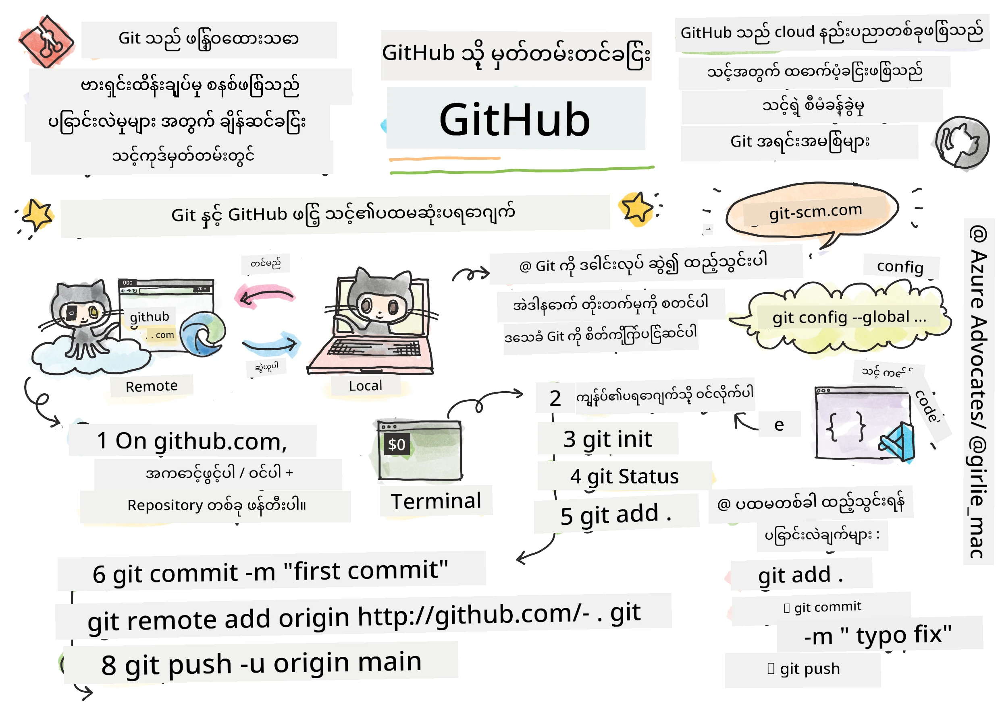
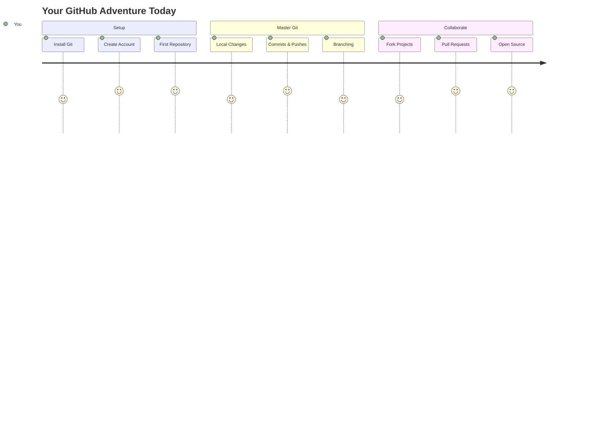
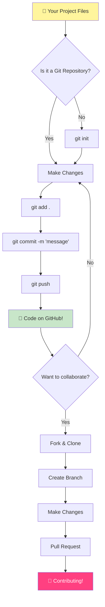
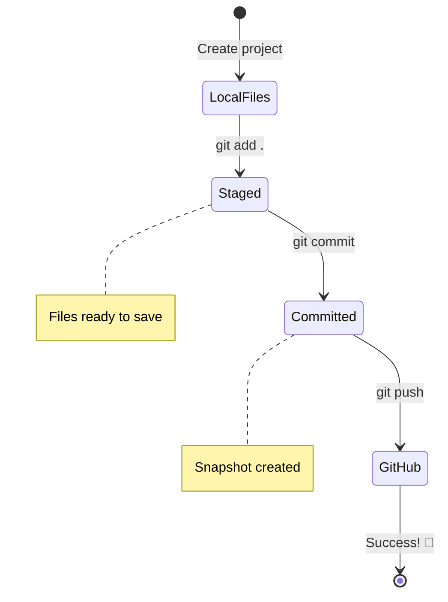
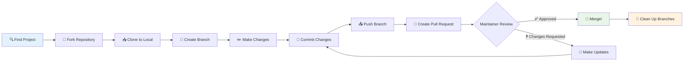
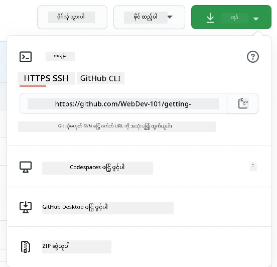
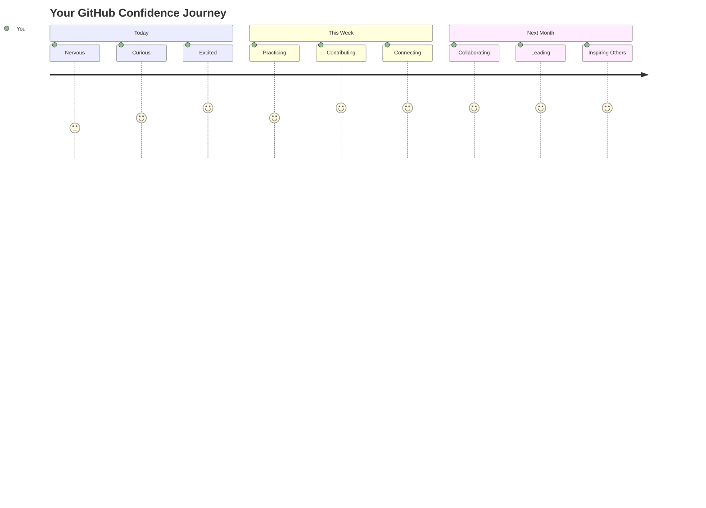

# GitHub အကြောင်းမိတ်ဆက်

ဟေး၊ အနာဂတ် Developer! 👋 ကမ္ဘာတစ်ဝှမ်းရှိ coder သန်းပေါင်းများစွာနဲ့ ပူးပေါင်းဖို့ အဆင်သင့်ဖြစ်ပြီလား? GitHub ကို မိတ်ဆက်ပေးဖို့ တကယ်ပဲ စိတ်လှုပ်ရှားနေပါတယ် – ဒါကို programmer တွေအတွက် social media platform လို့ ထင်ပါ။ ဒါပေမယ့် lunch ရဲ့ ဓာတ်ပုံတွေ မျှဝေတဲ့အစား code တွေကို မျှဝေပြီး အံ့ဖွယ်ရာတွေကို အတူတူ တည်ဆောက်နေကြတာပါ!

အဲဒါက တကယ်ကို အံ့ဩစရာပါပဲ – သင့်ဖုန်းထဲက app တစ်ခုစီ၊ သင့်ရောက်သွားတဲ့ website တစ်ခုစီ၊ သင်သုံးဖို့ လေ့လာမယ့် tools များစွာဟာ GitHub လို platform တွေမှာ developer အဖွဲ့တွေ ပူးပေါင်းပြီး တည်ဆောက်ထားတာပါ။ သင်ချစ်တဲ့ music app? သင့်လိုသူတစ်ယောက်က အဲဒါကို ပံ့ပိုးပေးထားတာပါ။ သင်မရပ်နိုင်တဲ့ game? ဟုတ်ပါတယ်၊ GitHub ပေါ်မှာ ပူးပေါင်းပြီး တည်ဆောက်ထားတာပါ။ အခုတော့ သင်ဟာ အဲဒီအံ့ဖွယ်ကမ္ဘာကြီးရဲ့ အစိတ်အပိုင်းတစ်ခုဖြစ်လာဖို့ လေ့လာတော့မှာပါ!

ဒီအရာတွေ အစမှာ အတော်လေး များပြားနေသလို ခံစားရနိုင်ပါတယ် – ဟုတ်ပါတယ်၊ ငါ့ရဲ့ ပထမဆုံး GitHub စာမျက်နှာကို ကြည့်ပြီး "ဒါတွေ ဘာကိုဆိုလိုတာလဲ?" လို့ စဉ်းစားနေတဲ့အချိန်ကို သတိရတယ်။ ဒါပေမယ့် အရေးကြီးတာက – developer တစ်ယောက်စီဟာ အတိအကျ သင့်ရဲ့ အခုအနေအထားမှာ စတင်ခဲ့ကြတာပါ။ ဒီသင်ခန်းစာအဆုံးမှာတော့ သင့်ကိုယ်ပိုင် GitHub repository (cloud ပေါ်မှာ သင့်ရဲ့ ကိုယ်ပိုင် project ပြသမှု) ရှိလာပြီး သင့်အလုပ်ကို သိမ်းဆည်းနည်း၊ အခြားသူတွေနဲ့ မျှဝေနည်း၊ သန်းပေါင်းများစွာသုံးနေတဲ့ project တွေကို ပံ့ပိုးပေးနည်းကို သိလာပါလိမ့်မယ်။

ဒီခရီးကို အတူတူ လျှောက်ကြမယ်၊ တစ်ဆင့်ချင်းစီနဲ့။ အလျင်မပြေးပါနဲ့၊ ဖိအားမပေးပါနဲ့ – သင်၊ ငါနဲ့ သင့်ရဲ့ အကောင်းဆုံးသူငယ်ချင်းအသစ်ဖြစ်လာမယ့် အလွန်အမင်းအေးချမ်းတဲ့ tools တွေပါ!


> Sketchnote by [Tomomi Imura](https://twitter.com/girlie_mac)



## သင်ခန်းစာမတိုင်မီ စမ်းမေးခွန်း
[သင်ခန်းစာမတိုင်မီ စမ်းမေးခွန်း](https://ff-quizzes.netlify.app)

## မိတ်ဆက်

စိတ်လှုပ်ရှားစရာအရာတွေကို စတင်မပြုမီ သင့်ကွန်ပျူတာကို GitHub အတွက် ပြင်ဆင်လိုက်ရအောင်! ဒါကို သင့်ရဲ့ အနုပညာပစ္စည်းတွေကို စီစဉ်နေတဲ့အတိုင်း ထင်ပါ – အမှန်တကယ် smooth ဖြစ်ပြီး ပိုပြီး ပျော်စရာကောင်းအောင် tools တွေကို အဆင်သင့်ထားတာပါ။

အဆင့်တိုင်းကို ကိုယ်တိုင် လမ်းညွှန်ပေးပါမယ်၊ အစမှာ ကြည့်ရတာ အတော်လေး ကြောက်စရာကောင်းတယ်လို့ ခံစားရနိုင်ပါတယ်။ တစ်ခုခု မရိုးရင်လည်း အဆင်ပြေပါတယ်! ငါ့ရဲ့ ပထမဆုံး development environment ကို စတင်ပြင်ဆင်တဲ့အချိန် ancient hieroglyphics တွေကို ဖတ်နေသလို ခံစားရတာကို သတိရတယ်။ Developer တစ်ယောက်စီဟာ အတိအကျ သင့်ရဲ့ အခုအနေအထားမှာ စတင်ခဲ့ကြတာပါ၊ "သင့်လျော်စွာ လုပ်နေတယ်" ဆိုတာ အတည်ပြုပါတယ်! 🌟

ဒီသင်ခန်းစာမှာ ကျွန်တော်တို့ လေ့လာမယ့်အရာတွေက:

- သင့်ကွန်ပျူတာပေါ်မှာ လုပ်နေတဲ့အလုပ်ကို tracking လုပ်နည်း
- အခြားသူတွေနဲ့ project တွေမှာ ပူးပေါင်းလုပ်ဆောင်နည်း
- open source software တွေကို ပံ့ပိုးပေးနည်း

### လိုအပ်ချက်များ

GitHub အတွက် သင့်ကွန်ပျူတာကို ပြင်ဆင်လိုက်ရအောင်! စိတ်မပူပါနဲ့ – ဒီ setup ကို တစ်ခါတည်း လုပ်ရုံနဲ့ သင့် coding ခရီးတစ်လျှောက်လုံး အဆင်သင့်ဖြစ်သွားပါလိမ့်မယ်။

အိုကေ၊ အခြေခံအဆင့်ကို စတင်လိုက်ရအောင်! ပထမဆုံး Git ဟာ သင့်ကွန်ပျူတာမှာ ရှိပြီးသားလားဆိုတာ စစ်ဆေးရမယ်။ Git ဟာ သင့် code မှာ ပြောင်းလဲမှုတိုင်းကို မှတ်မိနေတဲ့ assistant တစ်ယောက်လိုပါပဲ – Ctrl+S ကို နှစ်စက္ကန့်တစ်ကြိမ်နှိပ်နေရတာထက် အများကြီး ပိုကောင်းပါတယ် (အားလုံး အဲဒီလို လုပ်ဖူးကြတယ်)။

Git ရှိပြီးသားလားဆိုတာ စစ်ဆေးဖို့ ဒီ magic command ကို terminal မှာ ရိုက်ထည့်ပါ:
`git --version`

Git မရှိသေးရင်လည်း စိတ်မပူပါနဲ့! [download Git](https://git-scm.com/downloads) ကို သွားပြီး ရယူလိုက်ပါ။ Install ပြီးရင်တော့ Git ကို သင့်နဲ့ တရားဝင် မိတ်ဆက်ပေးရပါမယ်:

> 💡 **ပထမဆုံး Setup**: ဒီ command တွေက Git ကို သင်ဘယ်သူလဲဆိုတာ ပြောပြတာပါ။ ဒီအချက်အလက်တွေဟာ သင့်လုပ်ဆောင်မှုတိုင်းနဲ့ တွဲဖက်ထားမယ်၊ ဒါကြောင့် သင့်အဆင်ပြေတဲ့ နာမည်နဲ့ email ကို ရွေးချယ်ပါ။

```bash
git config --global user.name "your-name"
git config --global user.email "your-email"
```

Git ရ already configured လားဆိုတာ စစ်ဆေးဖို့:
```bash
git config --list
```

GitHub account တစ်ခု၊ code editor (Visual Studio Code လို) တစ်ခုနဲ့ terminal (သို့မဟုတ် command prompt) ကို ဖွင့်ဖို့ လိုအပ်ပါမယ်။

[github.com](https://github.com/) ကို သွားပြီး account တစ်ခု ဖန်တီးပါ၊ မရှိသေးရင်၊ သို့မဟုတ် login ၀င်ပြီး profile ကို ဖြည့်ပါ။

💡 **ခေတ်မီအကြံပြုချက်**: [SSH keys](https://docs.github.com/en/authentication/connecting-to-github-with-ssh) ကို setup လုပ်တာ သို့မဟုတ် [GitHub CLI](https://cli.github.com/) ကို သုံးတာက password မလိုဘဲ authentication လုပ်ဖို့ ပိုလွယ်ကူစေပါတယ်။

✅ GitHub ဟာ ကမ္ဘာပေါ်မှာ တစ်ခုတည်းသော code repository မဟုတ်ပါဘူး၊ ဒါပေမယ့် GitHub က အများဆုံး လူသိများပါတယ်။

### ပြင်ဆင်မှု

သင့် local machine (laptop သို့မဟုတ် PC) ပေါ်မှာ code project တစ်ခုပါဝင်တဲ့ folder တစ်ခုနဲ့ GitHub ပေါ်မှာ public repository တစ်ခု လိုအပ်ပါမယ်၊ ဒါဟာ အခြားသူတွေရဲ့ project တွေကို ဘယ်လို ပံ့ပိုးပေးရမလဲဆိုတာကို ဥပမာအနေနဲ့ သုံးပါမယ်။

### သင့် Code ကို ဘေးကင်းစွာ ထိန်းသိမ်းခြင်း

အခုတော့ လုံခြုံရေးအကြောင်း ပြောကြရအောင် – ဒါပေမယ့် ကြောက်စရာကောင်းတဲ့အရာတွေကို မပြောပါဘူး! ဒီလုံခြုံရေးအလေ့အကျင့်တွေကို သင့်ကား သို့မဟုတ် သင့်အိမ်ကို သော့ခတ်ထားတဲ့အတိုင်း ထင်ပါ။ ဒါတွေက ရိုးရှင်းပြီး အလေ့အကျင့်ဖြစ်လာပြီး သင့်အလုပ်ကို ကာကွယ်ပေးနိုင်ပါတယ်။

GitHub နဲ့ အလုပ်လုပ်တဲ့အခါ လုံခြုံရေးအကောင်းဆုံးအလေ့အကျင့်တွေကို လိုက်နာဖို့ အရေးကြီးပါတယ်:

| လုံခြုံရေးအပိုင်း | အကောင်းဆုံးအလေ့အကျင့် | အရေးကြီးတဲ့အကြောင်းရင်း |
|---------------|---------------|----------------|
| **Authentication** | SSH keys သို့မဟုတ် Personal Access Tokens ကို သုံးပါ | Password တွေက ပိုမလုံခြုံဘဲ phase out လုပ်နေပါတယ် |
| **Two-Factor Authentication** | GitHub account မှာ 2FA ကို ဖွင့်ပါ | Account ကို အပိုကာကွယ်ပေးပါတယ် |
| **Repository Security** | အရေးကြီးတဲ့အချက်အလက်တွေကို commit မလုပ်ပါနဲ့ | API keys နဲ့ passwords တွေကို public repos မှာ မထည့်သင့်ပါ |
| **Dependency Management** | Dependabot ကို enable လုပ်ပါ | Dependency တွေကို လုံခြုံပြီး up-to-date ဖြစ်အောင် ထိန်းသိမ်းပေးပါတယ် |

> ⚠️ **အရေးကြီးတဲ့ လုံခြုံရေး သတိပေးချက်**: API keys, passwords, သို့မဟုတ် အရေးကြီးတဲ့အချက်အလက်တွေကို repository တစ်ခုခုမှာ commit မလုပ်ပါနဲ့။ Environment variables နဲ့ `.gitignore` ဖိုင်တွေကို သုံးပြီး sensitive data တွေကို ကာကွယ်ပါ။

**ခေတ်မီ Authentication Setup:**

```bash
# Generate SSH key (modern ed25519 algorithm)
ssh-keygen -t ed25519 -C "your_email@example.com"

# Set up Git to use SSH
git remote set-url origin git@github.com:username/repository.git
```

> 💡 **Pro Tip**: SSH keys တွေက password တွေကို မကြာခဏ ရိုက်ထည့်စရာမလိုဘဲ ပိုလုံခြုံစေပါတယ်။

---

## သင့် Code ကို Professional လို ထိန်းသိမ်းခြင်း

အိုကေ၊ အခုတော့ အရမ်း စိတ်လှုပ်ရှားစရာကောင်းတဲ့အပိုင်းကို စတင်တော့မယ်! 🎉 Developer တွေလိုပဲ သင့် code ကို tracking နဲ့ management လုပ်နည်းကို လေ့လာတော့မှာပါ၊ ဒီဟာက တကယ်ကို အရေးကြီးတဲ့ game-changer တစ်ခုပါ။

ဉပမာ – သင် အံ့ဩစရာကောင်းတဲ့ စာရေးနေတယ်လို့ ထင်ပါစို့၊ draft တစ်ခုချင်းစီ၊ brilliant edit တစ်ခုချင်းစီ၊ "အိုဟုတ်တယ်၊ ဒါက အရမ်းကောင်းတယ်!" ဆိုတဲ့ အချိန်တိုင်းကို မှတ်ထားချင်တယ်ဆိုရင် Git ဟာ သင့် code အတွက် အဲဒီလိုပဲ လုပ်ပေးပါတယ်! ဒါဟာ အံ့ဩစရာ time-traveling notebook တစ်ခုလိုပါပဲ – keystroke တစ်ခုချင်းစီ၊ ပြောင်းလဲမှုတစ်ခုချင်းစီ၊ "အိုဟုတ်၊ ဒါက အားလုံးကို ပျက်စီးစေတယ်" ဆိုတဲ့ အချိန်တိုင်းကို ပြန်ပြင်နိုင်ပါတယ်။

အတော်လေး များပြားနေသလို ခံစားရနိုင်ပါတယ်။ ငါစတင်တဲ့အချိန်မှာ "ဘာလို့ file တွေကို ပုံမှန် save လုပ်လို့မရတာလဲ?" လို့ ထင်ခဲ့တယ်။ ဒါပေမယ့် Git ကို နားလည်တဲ့အခါ (နောက်ဆုံးမှာ နားလည်မှာပါ!) "Git မရှိဘဲ ဘယ်လို code ရေးခဲ့တာလဲ?" ဆိုတဲ့ lightbulb moment ရပါလိမ့်မယ်။ 

ဉပမာ – သင့် local folder တစ်ခုမှာ code project တစ်ခုရှိပြီး git ကို သုံးပြီး progress ကို tracking လုပ်ချင်တယ်ဆိုပါစို့။ git ကို သုံးတာဟာ သင့်အနာဂတ်ကိုယ်တိုင်ကို ချစ်တဲ့စာရေးတာလိုပါပဲ။ commit messages တွေကို ရက်ပေါင်းများစွာ၊ လအနည်းငယ်၊ နှစ်အနည်းငယ်အကြာမှာ ပြန်ဖတ်တဲ့အခါ သင့်ဆုံးဖြတ်ချက်တွေကို ပြန်လည်သတိရနိုင်ပါတယ်။



### Task: သင့်ပထမဆုံး Repository ကို ဖန်တီးပါ!

> 🎯 **သင့် Mission (ငါ့အနေနဲ့ အရမ်းစိတ်လှုပ်ရှားနေတယ်!):** သင့်ပထမဆုံး GitHub repository ကို အတူတူ ဖန်တီးကြမယ်! ဒီမှာ အဆုံးသတ်တဲ့အချိန်မှာ သင့် code နေထိုင်တဲ့ သင့်အင်တာနက်ရဲ့ အနားလေးကို ရရှိပြီး "commit" တစ်ခု (developer တွေပြောတဲ့ အရမ်း smart ဖြစ်တဲ့ save လုပ်နည်း) လုပ်ထားပါလိမ့်မယ်။
>
> ဒါဟာ တကယ်ကို အထူးအခိုက်အတန့်တစ်ခုပါ – သင်ဟာ တရားဝင် developer တွေရဲ့ ကမ္ဘာလောကကို ဝင်ရောက်တော့မှာပါ! ငါ့ပထမဆုံး repo ကို ဖန်တီးတဲ့အချိန်ရဲ့ စိတ်လှုပ်ရှားမှုကို အခုထိ သတိရတယ်၊ "Wow, ငါ တကယ်လုပ်နေပြီ!" 

ဒီခရီးကို အတူတူ လျှောက်ကြမယ်၊ တစ်ဆင့်ချင်းစီနဲ့။ အပိုင်းတိုင်းကို အချိန်ယူပြီး လုပ်ပါ – အလျင်ပြေးရမယ့် ဆုမရှိပါဘူး၊ အဆင့်တိုင်းဟာ အဓိပ္ပါယ်ရှိလာပါလိမ့်မယ်။ သင်ချစ်တဲ့ coding superstar တစ်ယောက်စီဟာ သင့်အခုအနေအထားမှာ တစ်ခါတုန်းက ရှိခဲ့ကြတာပါ၊ သင့်ပထမဆုံး repository ကို ဖန်တီးဖို့ အဆင်သင့်ဖြစ်နေတဲ့အချိန်မှာ။ ဒါက အရမ်းမိုက်တယ်မဟုတ်လား?

> ဗီဒီယိုကို ကြည့်ပါ
> 
> [](https://www.youtube.com/watch?v=9R31OUPpxU4)

**အတူတူ လုပ်ကြရအောင်:**

1. **GitHub ပေါ်မှာ သင့် repository ကို ဖန်တီးပါ**။ GitHub.com ကို သွားပြီး အစိမ်းရောင် **New** ခလုတ် (သို့မဟုတ် အပေါ်ညာထောင့်က **+** အမှတ်) ကို ရှာပါ။ အဲဒါကို နှိပ်ပြီး **New repository** ကို ရွေးပါ။

   ဒီအတိုင်း လုပ်ပါ:
   1. သင့် repository ကို နာမည်ပေးပါ – သင့်အတွက် အဓိပ္ပါယ်ရှိတဲ့ နာမည်တစ်ခု ဖြစ်စေပါ!
   1. ဖော်ပြချက်တစ်ခု ထည့်ပါ (သင့် project ဘာအကြောင်းလဲဆိုတာ အခြားသူတွေ နားလည်စေပါတယ်)
   1. Public (အားလုံးကြည့်နိုင်မယ့်) သို့မဟုတ် Private (သင့်အတွက်ပဲ) ဖြစ်စေဖို့ ဆုံးဖြတ်ပါ
   1. README ဖိုင်တစ်ခု ထည့်ဖို့ box ကို check လုပ်ဖို့ ငါ recommend လုပ်တယ် – ဒါဟာ သင့် project ရဲ့ မျက်နှာဖုံးလိုပါပဲ
   1. **Create repository** ကို နှိပ်ပြီး အောင်မြင်မှုကို ကျင်းပပါ – သင့်ပထမဆုံး repo ကို ဖန်တီးပြီးပါပြီ! 🎉

2. **သင့် project folder ကို သွားပါ**။ အခုတော့ terminal ကို ဖွင့်လိုက်ရအောင် (ကြည့်ရတာ ကြောက်စရာမကောင်းပါဘူး!)။ သင့်ကွန်ပျူတာကို သင့် project ဖိုင်တွေ ဘယ်မှာရှိလဲဆိုတာ ပြောရမယ်။ ဒီ command ကို ရိုက်ထည့်ပါ:

   ```bash
   cd [name of your folder]
   ```

   **ဒီမှာ ဘာလုပ်နေတာလဲဆိုတော့:**
   - "ဟေး ကွန်ပျူတာ၊ ငါ့ project folder ကို သွားစေချင်တယ်" လို့ ပြောနေတာပါ
   - ဒါဟာ desktop ပေါ်မှာ folder တစ်ခု ဖွင့်တာနဲ့ တူတယ်၊ ဒါပေမယ့် text command တွေနဲ့ လုပ်နေတာပါ
   - `[name of your folder]` ကို သင့် project folder ရဲ့ အမှန်တကယ် နာမည်နဲ့ အစားထိုးပါ
   - သင့်ရဲ့ ဒေသခံပရောဂျက်နဲ့ GitHub repository အကြား ချိတ်ဆက်မှုကို ဖန်တီးပြီးပါပြီ။
   - "Origin" ဆိုတာ သင့် GitHub repository အတွက် နာမည်ပေးထားတဲ့ အမည်တစ်ခုပါပဲ – ဖုန်းမှာ contact တစ်ခု ထည့်သလိုပဲ။
   - အခု သင့် ဒေသခံ Git က သင့် code ကို မျှဝေဖို့ ပြင်ဆင်တဲ့အခါ ဘယ်ကို ပို့ရမယ်ဆိုတာ သိနေပါပြီ။

   💡 **လွယ်ကူတဲ့နည်းလမ်း**: GitHub CLI ကို သင်ထည့်သွင်းထားရင်၊ ဒီအဆင့်ကို command တစ်ခုနဲ့ ပြုလုပ်နိုင်ပါတယ်:
   ```bash
   gh repo create my-repo --public --push --source=.
   ```

8. **သင့် code ကို GitHub ကို ပို့ပါ** (အရေးကြီးတဲ့အချိန်!):

   ```bash
   git push -u origin main
   ```

   **🚀 အခုတော့ သင့် code ကို GitHub ကို upload လုပ်နေပါပြီ!**
   
   **ဘာဖြစ်နေသလဲ:**
   - သင့် commits တွေက သင့်ကွန်ပျူတာကနေ GitHub ကို သွားနေပါတယ်။
   - `-u` flag က အမြဲတမ်း connection တစ်ခုကို ဖန်တီးပေးပြီး အနာဂတ်မှာ push လုပ်တာ ပိုလွယ်ကူစေပါတယ်။
   - "main" ဆိုတာ သင့် primary branch ရဲ့ အမည်ပါ (main folder လိုပဲ)။
   - ဒီအခါမှာတော့ အနာဂတ် upload တွေအတွက် `git push` ကိုသာ ရိုက်လိုက်ရုံပါပဲ!

   💡 **အရေးကြီးအချက်**: သင့် branch အမည်က "master" လို အခြားအမည်ဖြစ်ရင်၊ အဲ့အမည်ကို သုံးပါ။ `git branch --show-current` နဲ့ စစ်ဆေးနိုင်ပါတယ်။

9. **သင့် coding ရဲ့ နေ့စဉ် rhythm** (အခုကတော့ စွဲလမ်းစရာပါ!):

   အခုကစပြီး သင့် project ကို ပြောင်းလဲမှုတွေ ပြုလုပ်တဲ့အခါ၊ အလွယ်ကူတဲ့ အဆင့်သုံးဆင့် dance ရှိပါပြီ:

   ```bash
   git add .
   git commit -m "describe what you changed"
   git push
   ```

   **ဒီ workflow က သင့် coding ရဲ့ အသက်သွေးဖြစ်လာမယ်:**
   - သင့် code ကို အံ့ဩစရာ ပြောင်းလဲမှုတွေ ပြုလုပ်ပါ ✨
   - `git add` နဲ့ stage လုပ်ပါ ("Git ကို ဒီပြောင်းလဲမှုတွေကို သတိထားပါဆိုလိုက်ပါ!")
   - `git commit` နဲ့ သတ်မှတ်ချက် message နဲ့ save လုပ်ပါ (အနာဂတ်က သင့်ကို ကျေးဇူးတင်ပါလိမ့်မယ်!)
   - `git push` နဲ့ ကမ္ဘာကို မျှဝေပါ 🚀
   - ထပ်လုပ်ပါ – အမှန်တကယ် ဒီ workflow က သဘာဝလို ဖြစ်လာမယ်!

   ဒီ workflow ကို သဘောကျတာက video game မှာ save point တွေ အများကြီး ရှိသလိုပါပဲ။ သင်ချစ်တဲ့ ပြောင်းလဲမှုတစ်ခု ပြုလုပ်ပြီးလား? Commit လုပ်လိုက်ပါ! အန္တရာယ်ရှိတဲ့အရာကို စမ်းချင်လား? အဆင်ပြေပါတယ် – အရာတွေ မအောင်မြင်ရင် နောက်ဆုံး commit ကို ပြန်သွားနိုင်ပါတယ်!

   > 💡 **အကြံပေးချက်**: `.gitignore` ဖိုင်ကို သုံးပြီး GitHub မှာ track မလုပ်ချင်တဲ့ ဖိုင်တွေကို ကာကွယ်နိုင်ပါတယ် - public repository မှာ မရှိသင့်တဲ့ notes ဖိုင်လို အရာတွေပါ။ `.gitignore` ဖိုင် template တွေကို [.gitignore templates](https://github.com/github/gitignore) မှာ ရှာနိုင်ပါတယ်၊ ဒါမှမဟုတ် [gitignore.io](https://www.toptal.com/developers/gitignore) ကို သုံးပြီး ဖန်တီးနိုင်ပါတယ်။

### 🧠 **ပထမဆုံး Repository Check-in: အဲ့အခါ ဘယ်လိုခံစားရလဲ?**

**အနားယူပြီး အတွေးအမြင်တွေ ပြန်လည်သုံးသပ်ပါ:**
- သင့် code ကို GitHub မှာ ပထမဆုံးမြင်တဲ့အခါ ဘယ်လိုခံစားရလဲ?
- ဘယ်အဆင့်က အလွယ်ကူဆုံးလို့ ခံစားရပြီး၊ ဘယ်အဆင့်က အလွယ်တကူ မဖြစ်နိုင်ဘူးလို့ ထင်ရလဲ?
- `git add`, `git commit`, နဲ့ `git push` တို့ရဲ့ ကွာခြားချက်ကို သင့်စကားနဲ့ ရှင်းပြနိုင်ပါသလား?



> **သတိပေးချက်**: အတွေ့အကြုံရှိတဲ့ developer တွေတောင် command တွေကို မျှတချိန်မှာ မေ့တတ်ပါတယ်။ ဒီ workflow ကို muscle memory ဖြစ်အောင် လေ့ကျင့်ဖို့ လိုအပ်ပါတယ် - သင့်အနေအထားက အရမ်းကောင်းပါတယ်!

#### ခေတ်မီ Git workflow များ

ဒီခေတ်မီနည်းလမ်းတွေကို လက်ခံသုံးစွဲဖို့ စဉ်းစားပါ:

- **Conventional Commits**: `feat:`, `fix:`, `docs:` စတဲ့ standardized commit message format ကို သုံးပါ။ [conventionalcommits.org](https://www.conventionalcommits.org/) မှာ ပိုမိုလေ့လာနိုင်ပါတယ်။
- **Atomic commits**: commit တစ်ခုစီကို တစ်ခုတည်းသော logical ပြောင်းလဲမှုကို ကိုယ်စားပြုပါ။
- **Frequent commits**: commit message တွေကို ဖော်ပြချက်ပြည့်စုံစွာ ရေးပြီး မကြာခဏ commit လုပ်ပါ။

#### Commit messages

Git commit subject line က ဒီစာကြောင်းကို ပြည့်စုံစေပါတယ်:
ဒီ commit ကို အကောင်အထည်ဖော်ရင် <သင့် subject line> ဖြစ်ပါမယ်။

Subject မှာ imperative, present tense ကို သုံးပါ: "change" မဟုတ်ရင် "changed" သို့မဟုတ် "changes" မသုံးပါနဲ့။  
Subject မှာလိုပဲ body (optional) မှာလည်း imperative, present tense ကို သုံးပါ။ Body မှာ ပြောင်းလဲမှုရဲ့ motivation ကို ရှင်းပြပြီး ယခင်အခြေအနေနဲ့ ကွာခြားချက်ကို ဖော်ပြပါ။ `why` ကို ရှင်းပြတာဖြစ်ပြီး `how` ကို မဟုတ်ပါ။

✅ GitHub မှာ လှည့်လည်ကြည့်ပြီး commit message ကောင်းတစ်ခုကို ရှာနိုင်ပါသလား? အနည်းဆုံး message တစ်ခုကို ရှာနိုင်ပါသလား? Commit message မှာ ဘယ်အချက်တွေက အရေးကြီးပြီး အသုံးဝင်တယ်လို့ သင်ထင်ပါသလဲ?

## အခြားသူတွေနဲ့ အလုပ်လုပ်ခြင်း (ပျော်စရာအပိုင်း!)

အခုတော့ GitHub က အံ့ဩစရာ ဖြစ်လာတဲ့အချိန်ပါ! 🪄 သင့် code ကို ကိုယ်တိုင် စီမံခန့်ခွဲနိုင်ပြီးသားဖြစ်တဲ့အခါ၊ အခုတော့ ကမ္ဘာတစ်ဝှမ်းက developer တွေနဲ့ ပူးပေါင်းလုပ်ဆောင်ဖို့ သင်ကြားသွားမှာပါ။

ဒီလိုပုံစံကို စိတ်ကူးပါ: မနက်ဖြန် သင်အိပ်ရာထလာတဲ့အခါ Tokyo မှာရှိတဲ့ developer တစ်ဦးက သင့် code ကို တိုးတက်အောင် ပြုလုပ်ထားပါတယ်။ Berlin မှာရှိတဲ့ developer တစ်ဦးက သင့်အတွက် အခက်အခဲဖြစ်နေတဲ့ bug ကို ဖြေရှင်းပေးထားပါတယ်။ နေ့လယ်မှာတော့ São Paulo မှာရှိတဲ့ developer တစ်ဦးက သင်မစဉ်းစားထားတဲ့ feature တစ်ခုကို ထည့်သွင်းပေးထားပါတယ်။ ဒါက သိပ္ပံစိတ်ကူးမဟုတ်ပါဘူး – GitHub ကမ္ဘာမှာ အင်္ဂါနေ့ပုံမှန်ပဲ!

အခု သင်သင်ယူမယ့် ပူးပေါင်းလုပ်ဆောင်မှု skill တွေက Google, Microsoft, နဲ့ သင့်အကြိုက်ဆုံး startup တွေမှာ နေ့စဉ်အသုံးပြုတဲ့ workflow တွေပါပဲ။ သင် cool tool တစ်ခုကို သင်ယူတာမဟုတ်ပါဘူး – software ကမ္ဘာတစ်ခုလုံးကို ပူးပေါင်းလုပ်ဆောင်စေတဲ့ လျှို့ဝှက်ဘာသာစကားကို သင်ယူနေပါတယ်။

အမှန်တကယ် open source project မှာ ပထမဆုံး pull request ကို merge လုပ်တဲ့အခါရဲ့ စိတ်လှုပ်ရှားမှုကို ခံစားပြီးရင် developer တွေက ဘာလို့ open source ကို အရမ်းစိတ်အားထက်သန်ကြလဲဆိုတာ နားလည်နိုင်ပါလိမ့်မယ်။ ဒါက ကမ္ဘာ့အကြီးဆုံး၊ အဖန်တီးဆုံး အဖွဲ့အစည်း project တစ်ခုရဲ့ အစိတ်အပိုင်းဖြစ်တာလိုပါပဲ!

> ဗီဒီယိုကြည့်ပါ
>
> [](https://www.youtube.com/watch?v=bFCM-PC3cu8)

GitHub မှာ အရာတွေကို ထည့်သွင်းထားတဲ့ အဓိကအကြောင်းရင်းက အခြား developer တွေနဲ့ ပူးပေါင်းလုပ်ဆောင်နိုင်ဖို့ ဖြစ်ပါတယ်။



သင့် repository မှာ `Insights > Community` ကို သွားပြီး သင့် project က community standards အတွက် အဆင့်သင့်ဖြစ်နေသလား စစ်ဆေးနိုင်ပါတယ်။

သင့် repository ကို professional ဖြစ်ပြီး ကြိုဆိုဖွယ်ကောင်းအောင် ပြုလုပ်ချင်ပါသလား? Repository ကို သွားပြီး `Insights > Community` ကို click လုပ်ပါ။ ဒီ feature က သင့် project က GitHub community ရဲ့ "repository ကောင်း" အဖြစ် သတ်မှတ်ချက်တွေနဲ့ ဘယ်လိုတူညီလဲဆိုတာ ပြသပေးပါမယ်။

> 🎯 **သင့် project ကို ထင်ဟပ်စေခြင်း**: စီမံထားပြီး documentation ကောင်းတဲ့ repository တစ်ခုက သန့်ရှင်းပြီး ကြိုဆိုဖွယ်ကောင်းတဲ့ storefront တစ်ခုလိုပါပဲ။ ဒါက သင့်အလုပ်ကို အရေးကြီးစေပြီး အခြားသူတွေက ပါဝင်ချင်စေပါတယ်!

**Repository ကောင်းတစ်ခုကို ဖန်တီးဖို့ အရေးကြီးတဲ့အချက်များ:**

| ဘာထည့်မလဲ | အရေးကြီးတဲ့အကြောင်းရင်း | သင့်အတွက် ဘာလုပ်ပေးမလဲ |
|-------------|-------------------|---------------------|
| **Description** | ပထမဆုံး impression အရေးကြီးပါတယ်! | သင့် project ဘာလုပ်ပေးနိုင်လဲဆိုတာ လူတွေ ချက်ချင်းသိနိုင်ပါတယ် |
| **README** | သင့် project ရဲ့ မျက်နှာဖုံး | သစ်လွင်တဲ့ visitor တွေအတွက် လမ်းညွှန် guide တစ်ခုလိုပါပဲ |
| **Contributing Guidelines** | အကူအညီကို ကြိုဆိုတယ်ဆိုတာ ပြသပါတယ် | လူတွေက သင့်ကို ဘယ်လိုကူညီနိုင်လဲဆိုတာ သိနိုင်ပါတယ် |
| **Code of Conduct** | သင့်လွှာကို ဖန်တီးပေးပါတယ် | အားလုံးက ပါဝင်ဖို့ ကြိုဆိုခံစားရပါတယ် |
| **License** | ဥပဒေကြောင်းရှင်းလင်းမှု | အခြားသူတွေက သင့် code ကို ဘယ်လိုအသုံးပြုနိုင်လဲဆိုတာ သိနိုင်ပါတယ် |
| **Security Policy** | တာဝန်ရှိတယ်ဆိုတာ ပြသပါတယ် | Professional လုပ်ဆောင်မှုကို ပြသပါတယ် |

> 💡 **Pro Tip**: GitHub က ဒီဖိုင်တွေ အတွက် template တွေ ပေးထားပါတယ်။ Repository အသစ်တစ်ခု ဖန်တီးတဲ့အခါ၊ ဒီဖိုင်တွေကို auto generate လုပ်ဖို့ box တွေကို check လုပ်ပါ။

**ခေတ်မီ GitHub Features တွေကို စမ်းသုံးပါ:**

🤖 **Automation & CI/CD:**
- **GitHub Actions** ကို automated testing နဲ့ deployment အတွက်
- **Dependabot** ကို automatic dependency updates အတွက်

💬 **Community & Project Management:**
- **GitHub Discussions** ကို issues အပြင် community conversations အတွက်
- **GitHub Projects** ကို kanban-style project management အတွက်
- **Branch protection rules** ကို code quality standards ကို အတည်ပြုဖို့

ဒီ resource တွေက အသစ် join လုပ်တဲ့ team member တွေကို အကျိုးရှိစေပါမယ်။ အဲဒီ resource တွေက typically contributor အသစ်တွေ project ကို စတင်ကြည့်တဲ့အခါ အရေးကြီးပါတယ်၊ project က သူတို့အချိန်ကို သုံးစွဲဖို့ သင့်တော်တဲ့နေရာလားဆိုတာ သိဖို့။

✅ README ဖိုင်တွေက ပြင်ဆင်ဖို့ အချိန်ယူရတတ်ပေမယ့်၊ 忙碌တဲ့ maintainer တွေက မကြာခဏ မလေးစားတတ်ပါဘူး။ အလွန်ဖော်ပြချက်ပြည့်စုံတဲ့ README တစ်ခုကို ရှာနိုင်ပါသလား? Note: [tools to help create good READMEs](https://www.makeareadme.com/) တွေကို စမ်းသုံးနိုင်ပါတယ်။

### Task: Code တစ်ခုကို Merge လုပ်ပါ

Contributing docs တွေက project ကို ကူညီဖို့ လူတွေကို ကူညီပေးပါတယ်။ ဘယ်လို contribution အမျိုးအစားတွေကို ရှာနေပြီး၊ process ဘယ်လိုလုပ်ရမယ်ဆိုတာ ရှင်းပြပါတယ်။ Contributors တွေက သင့် repo မှာ contribute လုပ်ဖို့ GitHub မှာ အဆင့်တွေကို လုပ်ဆောင်ရပါမယ်:

1. **Forking your repo** သင့် project ကို _fork_ လုပ်ဖို့ contributor တွေကို တိုက်တွန်းပါ။ Forking ဆိုတာ သူတို့ရဲ့ GitHub profile မှာ သင့် repository ရဲ့ replica တစ်ခုကို ဖန်တီးတာပါ။
1. **Clone**. အဲဒီနေရာက project ကို သူတို့ရဲ့ local machine ကို clone လုပ်ပါ။
1. **Create a branch**. သူတို့ရဲ့ အလုပ်အတွက် _branch_ တစ်ခု ဖန်တီးဖို့ contributor တွေကို တိုက်တွန်းပါ။
1. **Focus their change on one area**. Contributor တွေကို contribution တစ်ခုချင်းစီကို အာရုံစိုက်ဖို့ တိုက်တွန်းပါ - ဒီလိုဆိုရင် သူတို့ရဲ့ အလုပ်ကို _merge_ လုပ်နိုင်တဲ့ အခွင့်အလမ်း ပိုများပါမယ်။ Bug fix တစ်ခုရေး၊ feature အသစ်တစ်ခုထည့်၊ နဲ့ test အများကြီး update လုပ်တယ်ဆိုရင် - သင့်အနေနဲ့ ၃ ခုထဲက ၂ ခု၊ ဒါမှမဟုတ် ၁ ခုကိုပဲ implement လုပ်နိုင်တယ်ဆိုရင် ဘာဖြစ်မလဲ?

✅ Branch တွေက code ကောင်းရေးနဲ့ shipping အတွက် အရေးကြီးတဲ့ အခြေအနေကို စဉ်းစားပါ။ ဘယ်လို use case တွေကို စဉ်းစားနိုင်ပါသလဲ?

> Note, သင်ကလည်း သင်လိုချင်တဲ့ ပြောင်းလဲမှုကို အကောင်အထည်ဖော်ပါ၊ သင့်အလုပ်အတွက် branch တွေကို ဖန်တီးပါ။ သင်လုပ်တဲ့ commits တွေက သင် "checked out" လုပ်ထားတဲ့ branch မှာ ဖြစ်ပါမယ်။ `git status` ကို သုံးပြီး ဘယ် branch မှာရှိလဲဆိုတာ ကြည့်ပါ။

Contributor workflow ကို လိုက်ပါစဉ်းစားကြည့်ပါ။ Contributor က repo ကို _fork_ နဲ့ _clone_ လုပ်ပြီးသားဖြစ်ပြီး၊ local machine မှာ Git repo ရှိနေပြီလို့ ယူဆပါ:

1. **Create a branch**. Contributor က သူတို့ contribute လုပ်ဖို့ ပြောင်းလဲမှုတွေကို ထည့်သွင်းမယ့် branch ကို ဖန်တီးဖို့ `git branch` command ကို သုံးပါ:

   ```bash
   git branch [branch-name]
   ```

   > 💡 **ခေတ်မီနည်းလမ်း**: Command တစ်ခုနဲ့ branch အသစ်ကို ဖန်တီးပြီး switch လုပ်နိုင်ပါတယ်:
   ```bash
   git switch -c [branch-name]
   ```

1. **Switch to working branch**. သတ်မှတ်ထားတဲ့ branch ကို switch လုပ်ပြီး working directory ကို update လုပ်ပါ `git switch` command ကို သုံးပါ:

   ```bash
   git switch [branch-name]
   ```

   > 💡 **ခေတ်မီအချက်**: `git switch` က branch တွေကို ပြောင်းလဲတဲ့အခါ `git checkout` ရဲ့ ခေတ်မီအစားထိုးဖြစ်ပါတယ်။ အဓိကနဲ့ beginner တွေအတွက် ပိုလွယ်ကူပါတယ်။

1. **Do work**. အခုတော့ သင့်ပြောင်းလဲမှုတွေကို ထည့်သွင်းပါ။ Git ကို အဲ့အရာကို ပြောဖို့ commands တွေကို မမေ့ပါနဲ့:

   ```bash
   git add .
   git commit -m "my changes"
   ```

   > ⚠️ **Commit Message Quality**: Commit message ကို ကောင်းမွန်တဲ့နာမည်ပေးပါ၊ သင့်အတွက်နဲ့ repo maintainer အတွက်ပါ အရေးကြီးပါတယ်။ သင့်ပြောင်းလဲမှုကို အတိအကျဖော်ပြပါ!

1. **Combine your work with the `main` branch**. အချိန်တ
1. **ရှင်းလင်းမှု**။ PR ကိုအောင်မြင်စွာပေါင်းစည်းပြီးနောက်မှာ _ရှင်းလင်းမှု_ လုပ်တာက အကောင်းဆုံးအလေ့အကျင့်တစ်ခုအဖြစ် သတ်မှတ်ထားပါတယ်။ သင့်ရဲ့ ဒေသခံ branch နဲ့ GitHub ကို push လုပ်ထားတဲ့ branch နှစ်ခုလုံးကို ရှင်းလင်းချင်ပါတယ်။ အရင်ဆုံး ဒေသခံမှာ ဖျက်ဖို့အတွက် အောက်ပါ command ကို အသုံးပြုပါ:

   ```bash
   git branch -d [branch-name]
   ```

GitHub မှာ fork လုပ်ထားတဲ့ repo ရဲ့ page ကိုသွားပြီး သင် push လုပ်ထားတဲ့ remote branch ကို ဖျက်ပါ။

`Pull request` ဆိုတာ အရမ်းရယ်စရာကောင်းတဲ့စကားလုံးတစ်ခုလိုပဲ။ အမှန်တကယ်တော့ သင့်ရဲ့ ပြောင်းလဲမှုတွေကို project ထဲ push လုပ်ချင်တာပါ။ ဒါပေမဲ့ maintainer (project owner) သို့မဟုတ် core team က သင့်ရဲ့ ပြောင်းလဲမှုတွေကို project ရဲ့ "main" branch နဲ့ ပေါင်းစည်းမလားဆိုတာ ဆုံးဖြတ်ဖို့လိုပါတယ်။ ဒါကြောင့် အမှန်တကယ်တော့ maintainer ကို ပြောင်းလဲမှုအပေါ် ဆုံးဖြတ်ချက်တောင်းနေတဲ့အခြေအနေပါ။

Pull request ဆိုတာ review, comment, integrated test စတဲ့ အရာတွေကို အသုံးပြုပြီး branch မှာ ပြောင်းလဲမှုတွေကို နှိုင်းယှဉ်ဆွေးနွေးဖို့နေရာတစ်ခုပါ။ commit message နဲ့ တူတဲ့ rule တွေကို follow လုပ်တဲ့ pull request ကောင်းတစ်ခုဖြစ်ပါတယ်။ Issue tracker မှာ issue ကို reference လုပ်နိုင်ပါတယ်၊ ဥပမာအားဖြင့် သင့်ရဲ့အလုပ်က issue တစ်ခုကို ဖြေရှင်းပေးနိုင်တဲ့အခါမှာပါ။ ဒါကို `#` နဲ့ issue number ကို အသုံးပြုပြီးလုပ်နိုင်ပါတယ်။ ဥပမာ `#97`။

🤞 Fingers crossed သင့်ရဲ့ ပြောင်းလဲမှုတွေကို project owner(s) က project ထဲ merge လုပ်ပါစေ 🤞

GitHub မှာရှိတဲ့ remote branch ရဲ့ commit အသစ်တွေကို သင့်ရဲ့ ဒေသခံ branch နဲ့ update လုပ်ပါ:

`git pull`

## Open Source ကို အထောက်အကူပြုခြင်း (သင့်ရဲ့ အကျိုးသက်ရောက်မှုကို ဖန်တီးပါ!)

အခု သင့်စိတ်ကို အလွန်လှုပ်ရှားစေမယ့်အရာတစ်ခုကို ပြောပြမယ် 🤯 Open source project တွေကို အထောက်အကူပြုခြင်းအကြောင်းကို ပြောပါမယ် – ဒီအကြောင်းကို မျှဝေဖို့ စိတ်လှုပ်ရှားနေပါတယ်!

ဒီဟာက သင့်အတွက် အလွန်ထူးခြားတဲ့အခွင့်အရေးပါ။ သန်းပေါင်းများစွာသော developer တွေ အချိန်တိုင်း အသုံးပြုနေတဲ့ tools တွေကို တိုးတက်အောင်လုပ်တာ၊ သင့်မိတ်ဆွေတွေချစ်တဲ့ app မှာ bug တစ်ခုကို ဖြေရှင်းတာကို စိတ်ကူးပါ။ ဒါဟာ အိပ်မက်တစ်ခုမဟုတ်ပါဘူး – ဒါက open source contribution ရဲ့ အဓိကပါ!

ဒီအကြောင်းကို စဉ်းစားတိုင်း အမြဲတမ်း goosebumps ရပါတယ်: သင့်ရဲ့ code editor, သင်လေ့လာမယ့် frameworks, သင်ဖတ်နေတဲ့ browser – အဲဒီအရာတွေကို တစ်ချို့ developer တွေက သူတို့ရဲ့ ပထမဆုံး contribution ကိုလုပ်ခဲ့တဲ့အချိန်မှာ စတင်ခဲ့တာပါ။ သင့်ရဲ့ အကြိုက်ဆုံး VS Code extension ကို တည်ဆောက်ခဲ့တဲ့ developer က သူတို့ရဲ့ ပထမဆုံး pull request ကို လုပ်ခဲ့တဲ့အချိန်မှာ သင့်လိုပဲ စိတ်လှုပ်ရှားခဲ့ပါတယ်။

အခု အလှပဆုံးအပိုင်းကတော့ open source community က အင်တာနက်ရဲ့ အကြီးဆုံး group hug လိုပါပဲ။ အများစု project တွေက newcomers တွေကို actively ရှာဖွေပြီး "good first issue" ဆိုတဲ့ tag တွေကို သတ်မှတ်ထားပါတယ်။ Maintainers တွေက အသစ်ရောက်လာတဲ့ contributors တွေကို မြင်ရင် အရမ်းဝမ်းသာတယ်၊ သူတို့ရဲ့ ပထမဆုံးအဆင့်တွေကို သတိရလို့ပါ။

```mermaid
flowchart TD
    A[🔍 Explore GitHub] --> B[🏷️ Find "good first issue"]
    B --> C[📖 Read Contributing Guidelines]
    C --> D[🍴 Fork Repository]
    D --> E[💻 Set Up Local Environment]
    E --> F[🌿 Create Feature Branch]
    F --> G[✨ Make Your Contribution]
    G --> H[🧪 Test Your Changes]
    H --> I[📝 Write Clear Commit]
    I --> J[📤 Push & Create PR]
    J --> K[💬 Engage with Feedback]
    K --> L[🎉 Merged! You're a Contributor!]
    L --> M[🌟 Find Next Issue]
    
    style A fill:#e1f5fe
    style L fill:#c8e6c9
    style M fill:#fff59d
```

ဒီမှာ သင် coding လေ့လာနေတဲ့အခါမှာ သင့်ရဲ့ အတန်းထဲက developer တွေကို digital world ကို ပိုမိုကောင်းမွန်အောင်လုပ်ဖို့ အတူတူ wake up လုပ်တဲ့ global family တစ်ခုရဲ့ အစိတ်အပိုင်းဖြစ်ဖို့ ပြင်ဆင်နေပါတယ်။ 🌟

အရင်ဆုံး GitHub မှာ သင့်စိတ်ဝင်စားတဲ့ repository (repo) တစ်ခုကို ရှာဖွေပြီး ပြောင်းလဲမှုတစ်ခုကို contribute လုပ်ချင်ပါတယ်။ အဲဒီ repo ရဲ့ content ကို သင့်ရဲ့ machine မှာ copy လုပ်ပါ။

✅ 'beginner-friendly' repo တွေကို [good-first-issue tag ကို search လုပ်ပြီး](https://github.blog/2020-01-22-browse-good-first-issues-to-start-contributing-to-open-source/) ရှာဖွေပါ။



Code ကို copy လုပ်ဖို့ နည်းလမ်းအများကြီးရှိပါတယ်။ Repository ရဲ့ content ကို HTTPS, SSH, GitHub CLI (Command Line Interface) ကို အသုံးပြုပြီး "clone" လုပ်နိုင်ပါတယ်။

Terminal ကို ဖွင့်ပြီး repository ကို clone လုပ်ပါ:
```bash
# Using HTTPS
git clone https://github.com/ProjectURL

# Using SSH (requires SSH key setup)
git clone git@github.com:username/repository.git

# Using GitHub CLI
gh repo clone username/repository
```

Project ကို အလုပ်လုပ်ဖို့ folder မှာ switch လုပ်ပါ:
`cd ProjectURL`

Project တစ်ခုလုံးကို ဖွင့်နိုင်ပါတယ်:
- **[GitHub Codespaces](https://github.com/features/codespaces)** - GitHub ရဲ့ cloud development environment
- **[GitHub Desktop](https://desktop.github.com/)** - Git operation တွေအတွက် GUI application  
- **[GitHub.dev](https://github.dev)** - GitHub repo မှာ `.` key ကို နှိပ်ပြီး browser မှာ VS Code ကို ဖွင့်ပါ
- **VS Code** GitHub Pull Requests extension နဲ့

နောက်ဆုံးမှာ code ကို zipped folder အနေနဲ့ download လုပ်နိုင်ပါတယ်။

### GitHub အကြောင်း စိတ်ဝင်စားစရာအချို့

GitHub မှာ public repository တစ်ခုကို star, watch, "fork" လုပ်နိုင်ပါတယ်။ သင့်ရဲ့ starred repositories တွေကို အပေါ်ယာဉ် drop-down menu မှာတွေ့နိုင်ပါတယ်။ Bookmark လုပ်တာလိုပဲ၊ ဒါပေမဲ့ code အတွက်ပါ။

Project တွေမှာ issue tracker ရှိပါတယ်၊ အများစု GitHub ရဲ့ "Issues" tab မှာရှိပါတယ်၊ project နဲ့ပတ်သက်တဲ့ ပြဿနာတွေကို ဆွေးနွေးဖို့နေရာပါ။ Pull Requests tab မှာ ပြောင်းလဲမှုတွေကို ဆွေးနွေးပြီး review လုပ်ပါတယ်။

Project တွေမှာ forum, mailing list, Slack, Discord, IRC လို chat channel တွေမှာ ဆွေးနွေးမှုတွေရှိနိုင်ပါတယ်။

🔧 **GitHub ရဲ့ ခေတ်မီ features**:
- **GitHub Discussions** - Community conversations အတွက် built-in forum
- **GitHub Sponsors** - Maintainers တွေကို ငွေကြေးအထောက်အကူပေးပါ  
- **Security tab** - Vulnerability report နဲ့ security advisories
- **Actions tab** - Automated workflows နဲ့ CI/CD pipelines တွေကိုကြည့်ပါ
- **Insights tab** - Contributors, commits, project health အကြောင်း analytics
- **Projects tab** - GitHub ရဲ့ built-in project management tools

✅ GitHub repo အသစ်ကို လေ့လာပြီး settings ကို edit လုပ်တာ၊ repo အတွက် အချက်အလက်တွေထည့်တာ၊ project တစ်ခု (Kanban board လို) ဖန်တီးတာ၊ GitHub Actions ကို automation အတွက် set up လုပ်တာ စတဲ့အရာတွေကို လုပ်ကြည့်ပါ။ GitHub မှာ လုပ်နိုင်တဲ့အရာတွေ အများကြီးရှိပါတယ်!

---

## 🚀 စိန်ခေါ်မှု 

အိုကေ၊ သင့်ရဲ့ GitHub superpowers အသစ်ကို စမ်းသပ်ဖို့အချိန်ရောက်ပါပြီ! 🚀 ဒီစိန်ခေါ်မှုက သင့်ရဲ့ အတန်းတွေကို အလွန်စိတ်ကျေနပ်စေမယ့်နည်းလမ်းတစ်ခုပါ:

မိတ်ဆွေတစ်ယောက် (သို့မဟုတ် သင့်ရဲ့ computer stuff အကြောင်း အမြဲမေးတဲ့ မိသားစုဝင်တစ်ယောက်) ကို ဖမ်းပြီး အတူတူ coding adventure တစ်ခုကို စတင်ပါ! Project တစ်ခုဖန်တီးပြီး သူတို့ fork လုပ်ပါစေ၊ branch တွေဖန်တီးပြီး pro တွေလို changes တွေ merge လုပ်ပါ။

Coding buddy မရှိသေးလား? စိတ်မပူပါနဲ့! GitHub community က အလွန်ကြိုဆိုတဲ့လူတွေ အများကြီးရှိပါတယ်။ "good first issue" label တွေပါတဲ့ repo တွေကို ရှာဖွေပါ – သူတို့ basically "Hey beginners, come learn with us!" လို့ပြောနေပါတယ်။ အဲဒါက အရမ်းအေးပါတယ်မဟုတ်လား?

## Post-Lecture Quiz
[Post-lecture quiz](https://ff-quizzes.netlify.app/web/en/)

## Review & Keep Learning

အို! 🎉 သင် GitHub basics ကို အလွန်အောင်မြင်စွာ ကျော်လွှားလိုက်ပြီ! Brain အနည်းငယ်ပြည့်နေတယ်လို့ ခံစားရရင် အဲဒါက အလွန်ပုံမှန်ပြီး အကောင်းဆုံးအချက်ပြပါ။ Developer တွေရဲ့ toolkit မှာ အရေးကြီးဆုံး tools တွေကို သင့်ရဲ့ အတန်းကနေ ကျော်လွှားလိုက်ပြီဆိုတာ အမှန်ပါ။

Git နဲ့ GitHub က အလွန်အစွမ်းထက်ပါတယ် (အရမ်းအစွမ်းထက်ပါတယ်)၊ Developer တွေ အားလုံး – wizard လိုပဲမြင်ရတဲ့သူတွေပါ – အဲဒီ tools တွေကို သင့်လိုပဲ လေ့ကျင့်ပြီး stumble လုပ်ခဲ့ရပါတယ်။ Lesson ကို ကျော်လွှားလိုက်ပြီဆိုတာ သင့်ရဲ့ အတန်းတွေကို အောင်မြင်စွာ ကျော်လွှားလိုက်ပြီဆိုတာပါ။

ဒီ resource တွေက သင့်ကို practice လုပ်ပြီး ပိုမိုအောင်မြင်အောင် ကူညီပေးပါမယ်:

- [Open source software guide](https://opensource.guide/how-to-contribute/#how-to-submit-a-contribution) – အကျိုးသက်ရောက်မှုကို ဖန်တီးဖို့ roadmap
- [Git cheatsheet](https://training.github.com/downloads/github-git-cheat-sheet/) – Quick reference အတွက် handy ဖြစ်တဲ့ cheatsheet!

Practice makes progress, not perfection! Git နဲ့ GitHub ကို ပိုမိုအသုံးပြုသင့်ပါတယ်၊ အဲဒါက ပိုမိုသဘာဝကျလာပါမယ်။ GitHub ရဲ့ interactive courses တွေက safe environment မှာ practice လုပ်ဖို့အတွက် အလွန်အကောင်းဆုံးပါ:

- [Introduction to GitHub](https://github.com/skills/introduction-to-github)
- [Communicate using Markdown](https://github.com/skills/communicate-using-markdown)  
- [GitHub Pages](https://github.com/skills/github-pages)
- [Managing merge conflicts](https://github.com/skills/resolve-merge-conflicts)

**Feeling adventurous? Modern tools တွေကို စမ်းကြည့်ပါ:**
- [GitHub CLI documentation](https://cli.github.com/manual/) – Command-line wizard လိုခံစားဖို့
- [GitHub Codespaces documentation](https://docs.github.com/en/codespaces) – Cloud မှာ code လုပ်ပါ!
- [GitHub Actions documentation](https://docs.github.com/en/actions) – အရာအားလုံးကို automate လုပ်ပါ
- [Git best practices](https://www.atlassian.com/git/tutorials/comparing-workflows) – Workflow game ကို Level up လုပ်ပါ 

## GitHub Copilot Agent Challenge 🚀

Agent mode ကို အသုံးပြုပြီး အောက်ပါ challenge ကို ပြီးမြောက်ပါ:

**Description:** GitHub workflow အပြည့်အစုံကို သင့်ရဲ့ real-world scenario မှာ practice လုပ်ဖို့ collaborative web development project တစ်ခုကို ဖန်တီးပါ။

**Prompt:** "Web Development Resources" project အတွက် public GitHub repository အသစ်တစ်ခုကို ဖန်တီးပါ။ README.md file ကို categories (HTML, CSS, JavaScript, etc.) အလိုက် useful web development tools နဲ့ resources တွေကို စနစ်တကျ စီစဉ်ထားပါ။ License, contributing guidelines, code of conduct ပါဝင်တဲ့ community standards တွေကို repository မှာ set up လုပ်ပါ။ CSS resources အတွက် feature branch တစ်ခု၊ JavaScript resources အတွက် feature branch တစ်ခု ဖန်တီးပါ။ Descriptive commit messages နဲ့ commit လုပ်ပြီး changes တွေကို main branch နဲ့ merge လုပ်ဖို့ pull request ဖန်တီးပါ။ Issues, Discussions, GitHub Actions workflow အတွက် automation checks တွေကို enable လုပ်ပါ။

## Assignment 

သင့်ရဲ့ mission: GitHub Skills ရဲ့ [Introduction to GitHub](https://github.com/skills/introduction-to-github) course ကို ပြီးမြောက်ပါ။ Interactive course က သင့်ကို လမ်းညွှန်ပြီး သင့်ရဲ့ အတန်းတွေကို safe environment မှာ practice လုပ်ခွင့်ပေးပါမယ်။ Course ပြီးမြောက်တဲ့အခါ badge ရပါမယ်! 🏅

**Feeling ready for more challenges?**
- GitHub account အတွက် SSH authentication ကို set up လုပ်ပါ (password မလိုတော့ဘူး!)
- GitHub CLI ကို သင့်ရဲ့ Git operations အတွက် အသုံးပြုပါ
- GitHub Actions workflow ပါတဲ့ repository တစ်ခုကို ဖန်တီးပါ
- GitHub Codespaces ကို စမ်းကြည့်ပြီး cloud-based editor ကို ဖွင့်ပါ

---

## 🚀 GitHub Mastery Timeline

### ⚡ **Next 5 Minutes**
- [ ] Repository ကို star လုပ်ပြီး သင့်စိတ်ဝင်စားတဲ့ 3 ခုကို star လုပ်ပါ
- [ ] GitHub account အတွက် two-factor authentication ကို set up လုပ်ပါ
- [ ] README ရိုးရှင်းတဲ့ file ကို သင့်ရဲ့ ပထမဆုံး repository အတွက် ဖန်တီးပါ
- [ ] သင့်ကို inspire လုပ်တဲ့ developer 5 ယောက်ကို follow လုပ်ပါ

### 🎯 **This Hour**
- [ ] Post-lesson quiz ကို ပြီးမြောက်ပြီး GitHub journey ကို reflect လုပ်ပါ
- [ ] GitHub authentication အတွက် SSH keys ကို set up လုပ်ပါ
- [ ] Commit message ကောင်းတစ်ခုနဲ့ meaningful commit တစ်ခုကို ဖန်တီးပါ
- [ ] GitHub ရဲ့ "Explore" tab ကို explore လုပ်ပြီး trending projects တွေကို ရှာဖွေပါ
- [ ] Repository တစ်ခုကို fork လုပ်ပြီး small change တစ်ခုကို လုပ်ပါ

### 📅 **Week-Long Adventure**
- [ ] GitHub Skills courses (Introduction to GitHub, Markdown) ကို ပြီးမြောက်ပါ
- [ ] Open source project တစ်ခုကို ပထမဆုံး pull request လုပ်ပါ
- [ ] GitHub Pages site ကို set up လုပ်ပြီး သင့်ရဲ့ အလုပ်တွေကို ပြသပါ
- [ ] GitHub Discussions မှာ သင့်စိတ်ဝင်စားတဲ့ project တွေကို join လုပ်ပါ
- [ ] README, License ပါတဲ့ community standards အပြည့်အစုံပါတဲ့ repository တစ်ခုကို ဖန်တီးပါ
- [ ] GitHub Codespaces ကို စမ်းကြည့်ပြီး cloud-based development ကို စတင်ပါ

### 🌟 **Month-Long Transformation**
- [ ] Open source project 3 ခုကို contribute လုပ်ပါ
- [ ] GitHub အသစ်တစ်ယောက်ကို mentor လုပ်ပါ (pay it forward!)
- [ ] GitHub Actions နဲ့ automated workflows တွေကို set up လုပ်ပါ
- [ ] GitHub contributions တွေကို ပြသတဲ့ portfolio တစ်ခုကို တည်ဆောက်ပါ
- [ ] Hacktoberfest သို့မဟုတ် အခြား community events တွေကို ပါဝင်ပါ
- [ ] သင့်ကိုယ်ပိုင် project ကို maintainer ဖြစ်ပြီး အခြားသူတွေ contribute လုပ်ပါစေ

### 🎓 **Final GitHub Mastery Check-in**

**Celebrate how far you've come:**
- GitHub ကို အသုံးပြုတဲ့အခါ သင့်အကြိုက်ဆုံးအရာက ဘာလဲ?
- Collaboration feature တွေထဲမှာ သင့်ကို အရမ်းစိတ်လှုပ်ရှားစေတဲ့ feature က ဘာလဲ?
- Open source ကို contribute လုပ်ဖို့ ဘယ်လောက် self-confident ရှိလဲ?
- ပထမဆုံး contribute လုပ်ချင်တဲ့ project က ဘာလဲ?



> 🌍 **Global developer community ကို ကြိုဆိုပါတယ်!** Developer သန်းပေါင်းများစွာနဲ့ အတူတူ ပူးပေါင်းလုပ်ဆောင်ဖို့ tools တွေကို သင်ရရှိလိုက်ပြီ။ သင့်ရဲ့ ပထမဆုံး contribution က သေးငယ်တဲ့အရာလိုပဲ ခံစားရနိုင်ပါတယ်၊ ဒါပေမဲ့ အရေးကြီး open source project တစ်ခုစလို့ ပထမဆုံး commit ကိုလုပ်ခဲ့တဲ့ developer တစ်ယောက်ကနေ စတင်ခဲ့တာပါ။ သင့်ရဲ့ unique perspective က ဘယ် project ကို

---

<!-- CO-OP TRANSLATOR DISCLAIMER START -->
**အကြောင်းကြားချက်**:  
ဤစာရွက်စာတမ်းကို AI ဘာသာပြန်ဝန်ဆောင်မှု [Co-op Translator](https://github.com/Azure/co-op-translator) ကို အသုံးပြု၍ ဘာသာပြန်ထားပါသည်။ ကျွန်ုပ်တို့သည် တိကျမှုအတွက် ကြိုးစားနေသော်လည်း အလိုအလျောက် ဘာသာပြန်မှုများတွင် အမှားများ သို့မဟုတ် မမှန်ကန်မှုများ ပါဝင်နိုင်သည်ကို သတိပြုပါ။ မူရင်းဘာသာစကားဖြင့် ရေးသားထားသော စာရွက်စာတမ်းကို အာဏာတရားရှိသော အရင်းအမြစ်အဖြစ် သတ်မှတ်သင့်ပါသည်။ အရေးကြီးသော အချက်အလက်များအတွက် လူက ဘာသာပြန်မှုကို အကြံပြုပါသည်။ ဤဘာသာပြန်မှုကို အသုံးပြုခြင်းမှ ဖြစ်ပေါ်လာသော အလွဲအမှားများ သို့မဟုတ် အနားလွဲမှုများအတွက် ကျွန်ုပ်တို့သည် တာဝန်မယူပါ။
<!-- CO-OP TRANSLATOR DISCLAIMER END -->