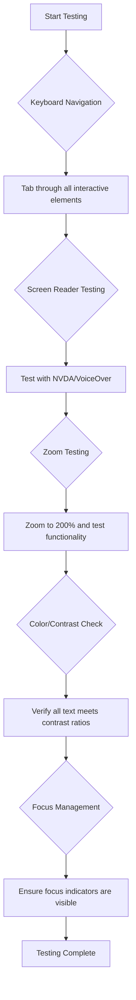
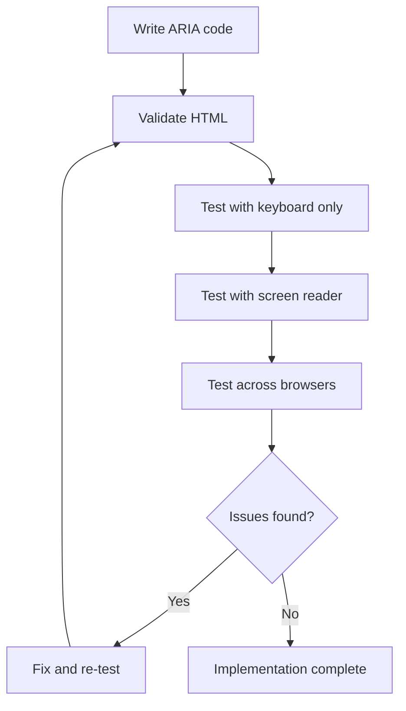

<!--
CO_OP_TRANSLATOR_METADATA:
{
  "original_hash": "90b19cde5b79b29e91babd3138cd8035",
  "translation_date": "2025-10-24T16:19:03+00:00",
  "source_file": "1-getting-started-lessons/3-accessibility/README.md",
  "language_code": "my"
}
-->
# ဝင်ရောက်နိုင်သော ဝဘ်စာမျက်နှာများ ဖန်တီးခြင်း


> Sketchnote by [Tomomi Imura](https://twitter.com/girlie_mac)

## မိန့်ခွန်းမတိုင်မီ စမ်းမေးခွန်း
[မိန့်ခွန်းမတိုင်မီ စမ်းမေးခွန်း](https://ff-quizzes.netlify.app/web/)

> ဝဘ်၏ အင်အားသည် ၎င်း၏ အားလုံးအတွက် တူညီမှုတွင် ရှိသည်။ မသန်စွမ်းမှုမရှိမရှိ အားလုံးရောက်ရှိနိုင်မှုသည် အရေးပါသော အချက်တစ်ခုဖြစ်သည်။
>
> \- Sir Timothy Berners-Lee, W3C Director နှင့် World Wide Web တီထွင်သူ

သင်ကို အံ့ဩစေမည့်အရာတစ်ခုရှိသည်—သင် ဝင်ရောက်နိုင်သော ဝဘ်ဆိုဒ်များ ဖန်တီးသောအခါ သင်သည် မသန်စွမ်းသူများကိုသာ မကူညီဘဲ ဝဘ်ကို အားလုံးအတွက် ပိုမိုကောင်းမွန်စေပါသည်။

လမ်းထောင့်များတွင် curb cuts တွေကို သတိထားမိပါသလား။ ၎င်းတို့ကို စတင်စီမံကိန်းဆွဲခဲ့သည်မှာ လှေကားလှေကားများအတွက်ဖြစ်ပြီး ယခုအခါတွင် ကလေးလှေကားများ၊ ပို့ဆောင်ရေးလုပ်သားများ၊ ခရီးသွားများနှင့် စက်ဘီးစီးသူများအတွက်လည်း အကျိုးရှိစေပါသည်။ ဝင်ရောက်နိုင်သော ဝဘ်ဒီဇိုင်းသည် အတိအကျ ဒီလိုပဲဖြစ်သည်—အုပ်စုတစ်ခုအတွက် အကျိုးရှိသော ဖြေရှင်းနည်းများသည် အားလုံးအတွက် အကျိုးရှိလာသည်။ အရမ်းအေးလွန်းတယ်မဟုတ်လား။

ဒီသင်ခန်းစာမှာ ဝဘ်ကို ဘယ်လို browse လုပ်ပုံမဆို အားလုံးအတွက် အလုပ်လုပ်နိုင်သော ဝဘ်ဆိုဒ်များ ဖန်တီးပုံကို လေ့လာသွားမည်။ ဝဘ်စံနှုန်းများတွင် ရှိပြီးသား အကျိုးရှိသောနည်းလမ်းများကို ရှာဖွေတွေ့ရှိပြီး စမ်းသပ်မှုကိရိယာများနှင့် လက်တွေ့လုပ်ဆောင်ခြင်းများကို လေ့လာပြီး သင်၏ ဝဘ်ဆိုဒ်များကို အားလုံးအတွက် ပိုမိုအသုံးပြုနိုင်စေမည့် accessibility ၏ အကျိုးကျေးဇူးကို မြင်တွေ့ရမည်။

ဒီသင်ခန်းစာအဆုံးတွင် accessibility ကို သင်၏ ဖွံ့ဖြိုးတိုးတက်မှု workflow ၏ သဘာဝတစ်ခုအဖြစ် ဖန်တီးနိုင်မည့် ယုံကြည်မှုကို ရရှိမည်။ ဝဘ်ကို ဘီလျံချီသော အသုံးပြုသူများအတွက် ဖွင့်လှစ်နိုင်စေရန် စဉ်းစားထားသော ဒီဇိုင်းရွေးချယ်မှုများကို ရှာဖွေလိုက်ရအောင်!

> ဒီသင်ခန်းစာကို [Microsoft Learn](https://docs.microsoft.com/learn/modules/web-development-101/accessibility/?WT.mc_id=academic-77807-sagibbon) တွင် လေ့လာနိုင်ပါသည်။

## Assistive Technologies ကို နားလည်ခြင်း

Coding ကို စတင်မလုပ်မီ မတူကွဲပြားသော စွမ်းရည်များရှိသော လူများသည် ဝဘ်ကို ဘယ်လို အတွေ့အကြုံရှိကြသည်ကို နားလည်ရန် အချိန်ယူလိုက်ပါ။ ၎င်းသည် သီအိုရီသာမက အမှန်တကယ် navigation patterns များကို နားလည်ခြင်းသည် သင်ကို ပိုမိုကောင်းမွန်သော developer ဖြစ်စေမည်။

Assistive technologies သည် မသန်စွမ်းသူများကို ဝဘ်ဆိုဒ်များနှင့် အပြန်အလှန်ဆက်သွယ်နိုင်စေရန် အံ့ဩစရာကောင်းသော ကိရိယာများဖြစ်သည်။ ဒီ technologies များ ဘယ်လိုအလုပ်လုပ်သည်ကို နားလည်ပြီးရင် ဝင်ရောက်နိုင်သော ဝဘ်အတွေ့အကြုံများ ဖန်တီးခြင်းသည် ပိုမိုလွယ်ကူလာမည်။ ၎င်းသည် တစ်စုံတစ်ဦး၏ မျက်လုံးမှ သင်၏ code ကို မြင်နိုင်ရန် လေ့လာခြင်းနှင့် တူသည်။

### Screen readers

[Screen readers](https://en.wikipedia.org/wiki/Screen_reader) သည် ဒစ်ဂျစ်တယ်စာသားများကို အသံသို့မဟုတ် braille output အဖြစ် ပြောင်းလဲပေးသော နည်းပညာများဖြစ်သည်။ ၎င်းတို့ကို အဓိကအားဖြင့် မျက်စိမမြင်သူများ အသုံးပြုသော်လည်း dyslexia ကဲ့သို့သော သင်ယူမှုမသန်စွမ်းမှုများရှိသော အသုံးပြုသူများအတွက်လည်း အကျိုးရှိစေသည်။

Screen reader ကို စာအုပ်ကို ဖတ်ပေးနေသော narrator တစ်ဦးအဖြစ် စဉ်းစားနိုင်သည်။ ၎င်းသည် အကြောင်းအရာများကို အဆင့်ဆင့် ဖတ်ပေးပြီး "button" သို့မဟုတ် "link" ကဲ့သို့သော interactive elements များကို ကြေညာပေးပြီး စာမျက်နှာတစ်ခုလုံးကို လွယ်ကူစွာ သွားလာနိုင်ရန် keyboard shortcuts များကို ပေးသည်။ သို့သော် screen readers များသည် သင် developer အဖြစ် ဝဘ်ဆိုဒ်များကို သင့်တော်သော structure နှင့် အဓိပ္ပာယ်ရှိသော အကြောင်းအရာများဖြင့် ဖန်တီးပါကသာ ၎င်းတို့၏ magic ကို အလုပ်လုပ်နိုင်မည်။ 

**Platform များအတွက် လူကြိုက်များသော screen readers:**
- **Windows**: [NVDA](https://www.nvaccess.org/about-nvda/) (အခမဲ့နှင့် လူကြိုက်များဆုံး), [JAWS](https://webaim.org/articles/jaws/), [Narrator](https://support.microsoft.com/windows/complete-guide-to-narrator-e4397a0d-ef4f-b386-d8ae-c172f109bdb1/?WT.mc_id=academic-77807-sagibbon) (built-in)
- **macOS/iOS**: [VoiceOver](https://support.apple.com/guide/voiceover/welcome/10) (built-in နှင့် အရမ်းတန်ဖိုးရှိ)
- **Android**: [TalkBack](https://support.google.com/accessibility/android/answer/6283677) (built-in)
- **Linux**: [Orca](https://wiki.gnome.org/Projects/Orca) (အခမဲ့နှင့် open-source)

**Screen readers များသည် ဝဘ်အကြောင်းအရာကို ဘယ်လို navigate လုပ်သလဲ:**

Screen readers များသည် အတွေ့အကြုံရှိသော အသုံးပြုသူများအတွက် browsing ကို ထိရောက်စွာလုပ်ဆောင်နိုင်ရန် navigation နည်းလမ်းများစွာကို ပေးသည်။
- **Sequential reading**: စာအုပ်တစ်အုပ်ကို ဖတ်သလို အကြောင်းအရာကို အပေါ်မှ အောက်သို့ ဖတ်သည်။
- **Landmark navigation**: စာမျက်နှာအပိုင်းများ (header, nav, main, footer) အကြား jump လုပ်သည်။
- **Heading navigation**: Headings အကြား skip လုပ်ပြီး စာမျက်နှာ structure ကို နားလည်သည်။
- **Link lists**: အားလုံး link များကို စာရင်းပြုလုပ်ပြီး လွယ်ကူစွာ access လုပ်သည်။
- **Form controls**: Input fields နှင့် buttons အကြား တိုက်ရိုက် navigate လုပ်သည်။

> 💡 **ဤအရာသည် ကျွန်ုပ်ကို အံ့ဩစေခဲ့သည်**: Screen reader အသုံးပြုသူ 68% သည် headings အားဖြင့် အဓိက navigate လုပ်ကြသည် ([WebAIM Survey](https://webaim.org/projects/screenreadersurvey9/#finding))။ ၎င်းသည် သင်၏ heading structure သည် အသုံးပြုသူများအတွက် roadmap တစ်ခုဖြစ်သည်—သင်မှန်ကန်စွာလုပ်ဆောင်ပါက သင်၏ အကြောင်းအရာကို ပိုမိုလျင်မြန်စွာ ရှာဖွေဖော်ထုတ်နိုင်ရန် ကူညီပေးနေသည်။

### သင်၏ စမ်းသပ်မှု workflow ကို တည်ဆောက်ခြင်း

သတင်းကောင်းတစ်ခုရှိသည်—ထိရောက်သော accessibility စမ်းသပ်မှုသည် အလွန်ခက်ခဲသောအရာမဟုတ်ပါ! သင်သည် automated tools များ (၎င်းတို့သည် ထင်ရှားသော အခက်အခဲများကို ဖမ်းဆီးရန် အလွန်ကောင်းမွန်သည်) နှင့် လက်တွေ့စမ်းသပ်မှုများကို ပေါင်းစပ်လိုက်ရမည်။ ဒီမှာ ကျွန်ုပ်တွေ့ရှိခဲ့တဲ့ စနစ်တကျ approach တစ်ခုရှိပါတယ်၊ ၎င်းသည် သင်၏ တစ်နေ့လုံးကို မကုန်ဆုံးစေဘဲ အခက်အခဲများကို အများဆုံးဖမ်းဆီးနိုင်စေပါသည်။

**အရေးကြီးသော လက်တွေ့စမ်းသပ်မှု workflow:**



**အဆင့်ဆင့် စမ်းသပ်မှု စစ်ဆေးစာရင်း:**
1. **Keyboard navigation**: Tab, Shift+Tab, Enter, Space, နှင့် Arrow keys ကိုသာ အသုံးပြုပါ။
2. **Screen reader စမ်းသပ်မှု**: NVDA, VoiceOver, သို့မဟုတ် Narrator ကို enable လုပ်ပြီး မျက်လုံးပိတ်ထားပြီး navigate လုပ်ပါ။
3. **Zoom စမ်းသပ်မှု**: 200% နှင့် 400% zoom အဆင့်များတွင် စမ်းသပ်ပါ။
4. **Color contrast verification**: အားလုံး text နှင့် UI components များကို စစ်ဆေးပါ။
5. **Focus indicator စမ်းသပ်မှု**: Interactive elements အားလုံးတွင် focus states တွေကို မြင်နိုင်စေရန် သေချာပါစေ။

✅ **Lighthouse ဖြင့် စတင်ပါ**: သင်၏ browser ၏ DevTools ကို ဖွင့်ပြီး Lighthouse accessibility audit ကို run လုပ်ပါ၊ ထို့နောက် သင်၏ လက်တွေ့စမ်းသပ်မှု အာရုံစိုက်မှုဧရိယာများကို လမ်းညွှန်ရန် ရလဒ်များကို အသုံးပြုပါ။

### Zoom နှင့် magnification tools

တစ်ခါတစ်ရံ သင်၏ဖုန်းတွင် စာသားများ သေးလွန်းသောအခါ pinch-to-zoom လုပ်ပြီး၊ သို့မဟုတ် အလင်းရောင်ပြင်းထန်သောနေရာတွင် laptop screen ကို squint လုပ်ကြည့်ရသလို၊ အချို့သော အသုံးပြုသူများသည် အကြောင်းအရာကို ဖတ်နိုင်ရန် အမြဲတမ်း magnification tools များကို အားထားရသည်။ ၎င်းသည် မျက်စိမကောင်းသူများ၊ အသက်ကြီးသူများနှင့် အပြင်မှာ ဝဘ်ဆိုဒ်ကို ဖတ်ဖို့ ကြိုးစားသူများအတွက်ပါ အကျိုးရှိစေသည်။

ခေတ်သစ် zoom နည်းပညာများသည် အကြောင်းအရာများကို ကြီးမားစေခြင်းသာမက ပိုမိုတိုးတက်လာသည်။ ဒီ tools များ ဘယ်လိုအလုပ်လုပ်သည်ကို နားလည်ခြင်းသည် magnification အဆင့်မည်သည့်အဆင့်တွင်မဆို functional နှင့် attractive ဖြစ်နေသော responsive designs များ ဖန်တီးနိုင်ရန် ကူညီပေးမည်။

**ခေတ်သစ် browser zoom capabilities:**
- **Page zoom**: အကြောင်းအရာအားလုံးကို proportionally scale လုပ်သည် (text, images, layout) - ၎င်းသည် preferred method ဖြစ်သည်။
- **Text-only zoom**: Font size ကို original layout ကို ထိန်းသိမ်းထားပြီး တိုးမြှင့်သည်။
- **Pinch-to-zoom**: Mobile gesture support သို့မဟုတ် temporary magnification
- **Browser support**: ခေတ်သစ် browser အားလုံးသည် 500% zoom အထိ functionality မပျက်စီးဘဲ support လုပ်သည်။

**Specialized magnification software:**
- **Windows**: [Magnifier](https://support.microsoft.com/windows/use-magnifier-to-make-things-on-the-screen-easier-to-see-414948ba-8b1c-d3bd-8615-0e5e32204198) (built-in), [ZoomText](https://www.freedomscientific.com/training/zoomtext/getting-started/)
- **macOS/iOS**: [Zoom](https://www.apple.com/accessibility/mac/vision/) (built-in နှင့် advanced features ပါရှိသည်)

> ⚠️ **Design Consideration**: WCAG သည် content ကို 200% zoom လုပ်သောအခါ functional ဖြစ်နေစေရန် လိုအပ်သည်။ ဒီအဆင့်တွင် horizontal scrolling သင့်လျှော်မှုရှိရမည်၊ interactive elements အားလုံးသည် accessible ဖြစ်နေရမည်။

✅ **Responsive design ကို စမ်းသပ်ပါ**: သင်၏ browser ကို 200% နှင့် 400% zoom လုပ်ပါ။ သင်၏ layout သည် gracefully adapt လုပ်ပါသလား။ သင် excessive scrolling မရှိဘဲ functionality အားလုံးကို access လုပ်နိုင်ပါသလား။

## ခေတ်သစ် Accessibility စမ်းသပ်မှု Tools

Assistive technologies များဖြင့် ဝဘ်ကို ဘယ်လို navigate လုပ်ကြသည်ကို နားလည်ပြီးရင် ဝင်ရောက်နိုင်သော ဝဘ်ဆိုဒ်များကို တည်ဆောက်ခြင်းနှင့် စမ်းသပ်ခြင်းအတွက် ကူညီပေးသော tools များကို လေ့လာလိုက်ပါ။

ဒီလိုစဉ်းစားပါ—automated tools များသည် ထင်ရှားသော အခက်အခဲများ (missing alt text ကဲ့သို့သော) ကို ဖမ်းဆီးရန် အလွန်ကောင်းမွန်သည်၊ လက်တွေ့စမ်းသပ်မှုများသည် သင်၏ site ကို အမှန်တကယ် အသုံးပြုရသည့် အတွေ့အကြုံကို သေချာစေသည်။ ၎င်းတို့ကို ပေါင်းစပ်ပြီး သင်၏ sites များသည် အားလုံးအတွက် အလုပ်လုပ်နိုင်မည်ဆိုသော ယုံကြည်မှုကို ပေးသည်။

### Color contrast စမ်းသပ်ခြင်း

သတင်းကောင်းတစ်ခုရှိသည်—color contrast သည် အများဆုံးတွေ့ရသော accessibility အခက်အခဲတစ်ခုဖြစ်သော်လည်း ၎င်းကို ပြုပြင်ရန် အလွန်လွယ်ကူသည်။ ကောင်းမွန်သော contrast သည် အားလုံးအတွက် အကျိုးရှိစေသည်—မျက်စိမကောင်းသူများမှ စ၍ ပင်လယ်ကမ်းခြေတွင် ဖုန်းကို ဖတ်ရန် ကြိုးစားသူများအထိ။

**WCAG contrast လိုအပ်ချက်များ:**

| Text Type | WCAG AA (အနိမ့်ဆုံး) | WCAG AAA (တိုးတက်သော) |
|-----------|-------------------|---------------------|
| **Normal text** (18pt အောက်) | 4.5:1 contrast ratio | 7:1 contrast ratio |
| **Large text** (18pt+ သို့မဟုတ် 14pt+ bold) | 3:1 contrast ratio | 4.5:1 contrast ratio |
| **UI components** (buttons, form borders) | 3:1 contrast ratio | 3:1 contrast ratio |

**အရေးကြီးသော စမ်းသပ်မှု tools:**
- [Colour Contrast Analyser](https://www.tpgi.com/color-contrast-checker/) - Desktop app with color picker
- [WebAIM Contrast Checker](https://webaim.org/resources/contrastchecker/) - Web-based with instant feedback
- [Stark](https://www.getstark.co/) - Design tool plugin for Figma, Sketch, Adobe XD
- [Accessible Colors](https://accessible-colors.com/) - Accessible color palettes ရှာဖွေပါ

✅ **Color palettes များကို ပိုမိုကောင်းမွန်စေပါ**: သင်၏ brand colors ဖြင့် စတင်ပြီး contrast checkers များကို အသုံးပြု၍ accessible variations များ ဖန်တီးပါ။ ၎င်းတို့ကို သင်၏ design system ၏ accessible color tokens အဖြစ် documentation ပြုလုပ်ပါ။

### Comprehensive accessibility auditing

အထိရောက်ဆုံး accessibility စမ်းသပ်မှုသည် နည်းလမ်းများစွာကို ပေါင်းစပ်ထားသည်။ Tool တစ်ခုတည်းသည် အားလုံးကို ဖမ်းဆီးနိုင်မည်မဟုတ်သဖြင့် စမ်းသပ်မှု routine ကို အမျိုးမျိုးသော နည်းလမ်းများဖြင့် တည်ဆောက်ခြင်းသည် thorough coverage ကို သေချာစေသည်။

**Browser-based စမ်းသပ်မှု (DevTools တွင် built-in):**
- **Chrome/Edge**: Lighthouse accessibility audit + Accessibility panel
- **Firefox**: Accessibility Inspector with detailed tree view
- **Safari**: Audit tab in Web Inspector with VoiceOver simulation

**Professional စမ်းသပ်မှု extensions:**
- [axe DevTools](https://www.deque.com/axe/devtools/) - Industry-standard automated
အရောင်သည် ဆက်သွယ်မှုအတွက် အရေးပါသောအရာတစ်ခုဖြစ်သော်လည်း အရေးကြီးသော အချက်အလက်များကို ပေးပို့ရာတွင် အရောင်တစ်ခုတည်းကို မသုံးသင့်ပါ။ အရောင်အပြင် အခြားနည်းလမ်းများကို ဒီဇိုင်းဆွဲခြင်းက ပိုမိုခိုင်မာပြီး အားလုံးပါဝင်နိုင်သော အတွေ့အကြုံများကို ဖန်တီးပေးပြီး အခြေအနေများစွာတွင် အလုပ်လုပ်နိုင်စေပါသည်။

**အရောင်မြင်ခြင်းကွဲပြားမှုများအတွက် ဒီဇိုင်းဆွဲခြင်း:**

အမျိုးသားများ၏ ၈% နှင့် အမျိုးသမီးများ၏ ၀.၅% ခန့်မှာ အရောင်မြင်ခြင်းကွဲပြားမှုတစ်ခုခုရှိကြသည် (အများအားဖြင့် "အရောင်မျက်မမြင်ခြင်း" ဟုခေါ်သည်။) အများဆုံးတွေ့ရသော အမျိုးအစားများမှာ:
- **Deuteranopia**: အနီနှင့် အစိမ်းကို ခွဲခြားရန် အခက်အခဲရှိခြင်း
- **Protanopia**: အနီသည် ပိုမှိန်သောအတိုင်း မြင်ရခြင်း
- **Tritanopia**: အပြာနှင့် အဝါကို ခွဲခြားရန် အခက်အခဲရှိခြင်း (ရှားပါး)

**အားလုံးပါဝင်နိုင်သော အရောင်နည်းလမ်းများ:**

```css
/* ❌ Bad: Using only color to indicate status */
.error { color: red; }
.success { color: green; }

/* ✅ Good: Color plus icons and context */
.error {
  color: #d32f2f;
  border-left: 4px solid #d32f2f;
}
.error::before {
  content: "⚠️";
  margin-right: 8px;
}

.success {
  color: #2e7d32;
  border-left: 4px solid #2e7d32;
}
.success::before {
  content: "✅";
  margin-right: 8px;
}
```

**အခြေခံအဆင့် အရောင်ကွဲပြားမှုလိုအပ်ချက်များအပြင်:**
- အရောင်ရွေးချယ်မှုများကို အရောင်မျက်မမြင်မှု စမ်းသပ်စက်များဖြင့် စမ်းသပ်ပါ
- အရောင်ကုဒ်များနှင့်အတူ ပုံစံများ၊ အထည်အလိပ်များ သို့မဟုတ် ပုံသဏ္ဌာန်များကို အသုံးပြုပါ
- အပြန်အလှန်အခြေအနေများကို အရောင်မပါဘဲ ခွဲခြားနိုင်စေရန် သေချာပါစေ
- သင့်ဒီဇိုင်းကို အမြင့်အContrast Modeတွင် မည်သို့ပုံပေါ်မည်ကို စဉ်းစားပါ

✅ **သင့်အရောင်ရောက်ရှိနိုင်မှုကို စမ်းသပ်ပါ**: [Coblis](https://www.color-blindness.com/coblis-color-blindness-simulator/) ကဲ့သို့သော ကိရိယာများကို အသုံးပြု၍ သင့်ဆိုဒ်ကို အရောင်မြင်ခြင်းကွဲပြားမှုရှိသော အသုံးပြုသူများအတွက် မည်သို့ပုံပေါ်မည်ကို ကြည့်ပါ။

### အာရုံစိုက်မှုပြသမှုများနှင့် အပြန်အလှန်ဒီဇိုင်း

အာရုံစိုက်မှုပြသမှုများသည် cursor၏ ဒစ်ဂျစ်တယ်အတုတစ်ခုဖြစ်ပြီး - ၎င်းသည် ကီးဘုတ်အသုံးပြုသူများကို စာမျက်နှာပေါ်တွင် မည်သို့ရှိနေသည်ကို ပြသပေးသည်။ အကောင်းဆုံးဒီဇိုင်းဆွဲထားသော အာရုံစိုက်မှုပြသမှုများသည် အပြန်အလှန်များကို ရှင်းလင်းပြီး ခန့်မှန်းနိုင်သောအတိုင်း ဖန်တီးပေးခြင်းအားဖြင့် အားလုံးအတွက် အတွေ့အကြုံကို မြှင့်တင်ပေးသည်။

**ခေတ်မီအာရုံစိုက်မှုပြသမှုအကောင်းဆုံးအလေ့အကျင့်များ:**

```css
/* Enhanced focus styles that work across browsers */
button:focus-visible {
  outline: 2px solid #0066cc;
  outline-offset: 2px;
  box-shadow: 0 0 0 4px rgba(0, 102, 204, 0.25);
}

/* Remove focus outline for mouse users, preserve for keyboard users */
button:focus:not(:focus-visible) {
  outline: none;
}

/* Focus-within for complex components */
.card:focus-within {
  box-shadow: 0 0 0 3px rgba(74, 144, 164, 0.5);
  border-color: #4A90A4;
}

/* Ensure focus indicators meet contrast requirements */
.custom-focus:focus-visible {
  outline: 3px solid #ffffff;
  outline-offset: 2px;
  box-shadow: 0 0 0 6px #000000;
}
```

**အာရုံစိုက်မှုပြသမှုလိုအပ်ချက်များ:**
- **မြင်နိုင်မှု**: ပတ်ပတ်လည်ရှိသော အရာများနှင့် အနည်းဆုံး 3:1 contrast ratio ရှိရမည်
- **အကျယ်**: အရာတစ်ခုလုံးပတ်လည်တွင် အနည်းဆုံး 2px အထူရှိရမည်
- **တည်ငြိမ်မှု**: အာရုံစိုက်မှုသည် အခြားနေရာသို့ ရွှေ့သည်အထိ မြင်နိုင်နေသင့်သည်
- **ခွဲခြားမှု**: အခြား UI အခြေအနေများနှင့် သက်သက်သာသာ ခွဲခြားနိုင်ရမည်

> 💡 **ဒီဇိုင်းအကြံပေးချက်**: အကောင်းဆုံးအာရုံစိုက်မှုပြသမှုများသည် outline၊ box-shadow နှင့် အရောင်ပြောင်းလဲမှုတို့ကို ပေါင်းစပ်အသုံးပြု၍ အခြားနောက်ခံများနှင့် အခြေအနေများတွင် မြင်နိုင်မှုကို သေချာစေပါသည်။

✅ **အာရုံစိုက်မှုပြသမှုများကို စစ်ဆေးပါ**: သင့်ဝက်ဘ်ဆိုဒ်ကို Tab ဖြင့် လှည့်ကြည့်ပြီး အာရုံစိုက်မှုပြသမှုများရှိသော အရာများကို မှတ်သားပါ။ မည်သည့်အရာများသည် မြင်ရခက်ခဲနေသို့မဟုတ် လုံးဝမရှိပါသလဲ?

### Semantic HTML: အရောက်ရှိနိုင်မှု၏ အခြေခံအုတ်မြစ်

Semantic HTML သည် သင့်ဝက်ဘ်ဆိုဒ်အတွက် assistive technologies များကို GPS စနစ်ပေးခြင်းနှင့်တူသည်။ HTML element များကို ၎င်းတို့ရည်ရွယ်ချက်အတွက် သင့်တော်သောအတိုင်း အသုံးပြုသောအခါ screen readers၊ ကီးဘုတ်များနှင့် အခြားကိရိယာများကို အသုံးပြုသူများအတွက် ထိရောက်စွာ လမ်းညွှန်ပေးနိုင်သော အကြောင်းအရာများကို ပေးစွမ်းနိုင်သည်။

Semantic HTML ကို library တစ်ခုနှင့် warehouse တစ်ခုကို နှိုင်းယှဉ်၍ နားလည်နိုင်သည်။ Library တစ်ခုတွင် စီစဉ်ထားသော အမျိုးအစားများနှင့် အထောက်အကူပြုသော အမှတ်အသားများရှိပြီး warehouse တွင် စာအုပ်များကို မတူညီသောနေရာများတွင် ပျံ့ပျံ့နှံ့နှံ့ထားသည်။ စာအုပ်များသည် နှစ်ခုစလုံးတွင် တူညီပေမယ့် သင်ဘာကိုရှာဖွေချင်သလဲဆိုတာ အဘယ်မှာ ရှာဖွေချင်မည်ဟု သင်ထင်ပါသလဲ? အတိအကျ!

**အရောက်ရှိနိုင်သော စာမျက်နှာဖွဲ့စည်းမှု၏ အခြေခံအုတ်အမြစ်များ:**

```html
<!-- Landmark elements provide page navigation structure -->
<header>
  <h1>Your Site Name</h1>
  <nav aria-label="Main navigation">
    <ul>
      <li><a href="/home">Home</a></li>
      <li><a href="/about">About</a></li>
      <li><a href="/services">Services</a></li>
    </ul>
  </nav>
</header>

<main>
  <article>
    <header>
      <h1>Article Title</h1>
      <p>Published on <time datetime="2024-10-14">October 14, 2024</time></p>
    </header>
    
    <section>
      <h2>First Section</h2>
      <p>Content that relates to this section...</p>
    </section>
    
    <section>
      <h2>Second Section</h2>
      <p>More related content...</p>
    </section>
  </article>
  
  <aside>
    <h2>Related Links</h2>
    <nav aria-label="Related articles">
      <ul>
        <li><a href="/related-1">First related article</a></li>
        <li><a href="/related-2">Second related article</a></li>
      </ul>
    </nav>
  </aside>
</main>

<footer>
  <p>&copy; 2024 Your Site Name. All rights reserved.</p>
  <nav aria-label="Footer links">
    <ul>
      <li><a href="/privacy">Privacy Policy</a></li>
      <li><a href="/contact">Contact Us</a></li>
    </ul>
  </nav>
</footer>
```

**ဘာကြောင့် Semantic HTML သည် အရောက်ရှိနိုင်မှုကို ပြောင်းလဲစေသနည်း:**

| Semantic Element | ရည်ရွယ်ချက် | Screen Reader အကျိုးကျေးဇူး |
|------------------|---------|----------------------|
| `<header>` | စာမျက်နှာ သို့မဟုတ် အပိုင်းခေါင်းစဉ် | "Banner landmark" - အပေါ်သို့ အလွယ်တကူသွားနိုင်ခြင်း |
| `<nav>` | Navigation link များ | "Navigation landmark" - navigation အပိုင်းများစာရင်း |
| `<main>` | အဓိကစာမျက်နှာအကြောင်းအရာ | "Main landmark" - အကြောင်းအရာသို့ တိုက်ရိုက်သွားနိုင်ခြင်း |
| `<article>` | ကိုယ်ပိုင်အကြောင်းအရာ | article အစွန်းအထွန်းများကို ကြေညာခြင်း |
| `<section>` | အကြောင်းအရာအုပ်စုများ | အကြောင်းအရာဖွဲ့စည်းမှုကို ပေးခြင်း |
| `<aside>` | ဆက်စပ်သော sidebar အကြောင်းအရာ | "Complementary landmark" |
| `<footer>` | စာမျက်နှာ သို့မဟုတ် အပိုင်း footer | "Contentinfo landmark" |

**Semantic HTML နှင့် Screen Reader အထူးစွမ်းရည်များ:**
- **Landmark navigation**: စာမျက်နှာ၏ အဓိကအပိုင်းများအကြား ချက်ချင်းခုန်နိုင်ခြင်း
- **Heading outlines**: heading ဖွဲ့စည်းမှုမှ အကြောင်းအရာစာရင်းတစ်ခု ဖန်တီးခြင်း
- **Element lists**: link၊ button သို့မဟုတ် form control အားလုံး၏ စာရင်းများ ဖန်တီးခြင်း
- **Context awareness**: အကြောင်းအရာအပိုင်းများအကြား ဆက်နွယ်မှုများကို နားလည်ခြင်း

> 🎯 **အမြန်စမ်းသပ်မှု**: landmark shortcut (NVDA/JAWS တွင် D key၊ heading အတွက် H key၊ link အတွက် K key) အသုံးပြု၍ သင့်ဆိုဒ်ကို screen reader ဖြင့် လှည့်လည်ကြည့်ပါ။ navigation သည် make sense လား?

✅ **သင့် semantic ဖွဲ့စည်းမှုကို စစ်ဆေးပါ**: သင့် browser၏ DevTools တွင် Accessibility panel ကို အသုံးပြု၍ accessibility tree ကို ကြည့်ပြီး သင့် markup သည် သင်္ကေတဖွဲ့စည်းမှုကို ဖန်တီးပေးနိုင်မည်ကို သေချာပါစေ။

### Heading hierarchy: အကြောင်းအရာစာရင်းတစ်ခု ဖန်တီးခြင်း

Heading များသည် အရောက်ရှိနိုင်သော အကြောင်းအရာအတွက် အလွန်အရေးပါသည် - ၎င်းသည် အားလုံးကို ပေါင်းစည်းထားသော spine တစ်ခုလိုပါပဲ။ Screen reader အသုံးပြုသူများသည် heading များကို အကြောင်းအရာကို နားလည်ရန်နှင့် navigation ပြုလုပ်ရန် အလွန်အမင်း မှီခိုကြသည်။ ၎င်းသည် သင့်စာမျက်နှာအတွက် အကြောင်းအရာစာရင်းတစ်ခု ပေးခြင်းနှင့် တူသည်။

**Heading များအတွက် ရွှေ့လမ်းစည်းကမ်း:**
Level များကို မကျော်ပါနှင့်။ အမြဲတမ်း `<h1>` မှ `<h2>` သို့ `<h3>` သို့ စဉ်ဆက်မပြတ် ရှေ့ဆက်ပါ။ ကျောင်းတွင် outline များ ဖန်တီးခဲ့ဖူးလား? ၎င်းသည် အတိအကျတူညီသော စည်းမျဉ်းဖြစ်သည် - "I. Main Point" မှ "C. Sub-sub-point" သို့ "A. Sub-point" မပါဘဲ ခုန်မသွားပါနှင့်။

**Heading ဖွဲ့စည်းမှုအကောင်းဆုံးနမူနာ:**

```html
<!-- ✅ Excellent: Logical, hierarchical progression -->
<main>
  <h1>Complete Guide to Web Accessibility</h1>
  
  <section>
    <h2>Understanding Screen Readers</h2>
    <p>Introduction to screen reader technology...</p>
    
    <h3>Popular Screen Reader Software</h3>
    <p>NVDA, JAWS, and VoiceOver comparison...</p>
    
    <h3>Testing with Screen Readers</h3>
    <p>Step-by-step testing instructions...</p>
  </section>
  
  <section>
    <h2>Color and Contrast Guidelines</h2>
    <p>Designing with sufficient contrast...</p>
    
    <h3>WCAG Contrast Requirements</h3>
    <p>Understanding the different contrast levels...</p>
    
    <h3>Testing Tools and Techniques</h3>
    <p>Tools for verifying contrast ratios...</p>
  </section>
</main>
```

```html
<!-- ❌ Problematic: Skipping levels, inconsistent structure -->
<h1>Page Title</h1>
<h3>Subsection</h3> <!-- Skipped h2 -->
<h2>This should come before h3</h2>
<h1>Another main heading?</h1> <!-- Multiple h1s -->
```

**Heading အကောင်းဆုံးအလေ့အကျင့်များ:**
- **စာမျက်နှာတစ်ခုလုံးတွင် `<h1>` တစ်ခုသာ**: သင့်စာမျက်နှာ၏ အဓိကခေါင်းစဉ် သို့မဟုတ် အဓိကအကြောင်းအရာ heading ဖြစ်သည်
- **Logical progression**: Level များကို မကျော်ပါ (h1 → h2 → h3, h1 → h3 မဟုတ်)
- **Descriptive content**: Heading များကို အကြောင်းအရာမပါဘဲ ဖတ်သောအခါ အဓိကအကျိုးရှိစေရန် ဖန်တီးပါ
- **CSS ဖြင့် Visual styling**: CSS ကို ပုံစံအတွက် အသုံးပြုပါ၊ HTML level များကို ဖွဲ့စည်းမှုအတွက် အသုံးပြုပါ

**Screen reader navigation အချက်အလက်များ:**
- Screen reader အသုံးပြုသူများ၏ ၆၈% သည် heading များဖြင့် navigation ပြုလုပ်ကြသည် ([WebAIM Survey](https://webaim.org/projects/screenreadersurvey9/#finding))
- အသုံးပြုသူများသည် logical heading outline ကို ရှာဖွေမည်ဟု မျှော်လင့်ကြသည်
- Heading များသည် စာမျက်နှာဖွဲ့စည်းမှုကို အမြန်ဆုံး နားလည်ရန် နည်းလမ်းပေးသည်

> 💡 **Pro Tip**: "HeadingsMap" ကဲ့သို့သော browser extension များကို အသုံးပြု၍ သင့် heading ဖွဲ့စည်းမှုကို visualization ပြုလုပ်ပါ။ ၎င်းသည် အကောင်းဆုံးဖွဲ့စည်းထားသော အကြောင်းအရာစာရင်းတစ်ခုလို ဖတ်ရမည်။

✅ **သင့် heading ဖွဲ့စည်းမှုကို စမ်းသပ်ပါ**: Screen reader၏ heading navigation (NVDA တွင် H key) ကို အသုံးပြု၍ heading များကို ခုန်သွားပါ။ progression သည် သင့်အကြောင်းအရာ၏ story ကို logical အတိုင်း ပြောပြပါသလား?

### အဆင့်မြင့် Visual Accessibility နည်းလမ်းများ

Contrast နှင့် အရောင်၏ အခြေခံအချက်များအပြင် အားလုံးပါဝင်နိုင်သော visual အတွေ့အကြုံများကို ဖန်တီးရန် sophisticated နည်းလမ်းများရှိသည်။ ၎င်းနည်းလမ်းများသည် viewing conditions များနှင့် assistive technologies များအကြား သင့်အကြောင်းအရာကို အလုပ်လုပ်စေရန် သေချာစေသည်။

**အရေးပါသော Visual ဆက်သွယ်မှုနည်းလမ်းများ:**

- **Multi-modal feedback**: Visual၊ Textual၊ Audio cues များကို ပေါင်းစပ်အသုံးပြုပါ
- **Progressive disclosure**: အချက်အလက်များကို စိတ်ချရသော အပိုင်းများဖြင့် ဖော်ပြပါ
- **Consistent interaction patterns**: ရင်းနှီးသော UI conventions များကို အသုံးပြုပါ
- **Responsive typography**: စက်ပစ္စည်းများအတိုင်း text ကို သင့်တော်စွာ အတိုင်းအတာချိန်ညှိပါ
- **Loading နှင့် error states**: အသုံးပြုသူ၏ လုပ်ဆောင်မှုများအတွက် ရှင်းလင်းသော feedback ပေးပါ

**Enhanced accessibility အတွက် CSS utilities:**

```css
/* Screen reader only text - visually hidden but accessible */
.sr-only {
  position: absolute;
  width: 1px;
  height: 1px;
  padding: 0;
  margin: -1px;
  overflow: hidden;
  clip: rect(0, 0, 0, 0);
  white-space: nowrap;
  border: 0;
}

/* Skip link for keyboard navigation */
.skip-link {
  position: absolute;
  top: -40px;
  left: 6px;
  background: #000000;
  color: #ffffff;
  padding: 8px 16px;
  text-decoration: none;
  border-radius: 4px;
  font-weight: bold;
  transition: top 0.3s ease;
  z-index: 1000;
}

.skip-link:focus {
  top: 6px;
}

/* Reduced motion respect */
@media (prefers-reduced-motion: reduce) {
  .skip-link {
    transition: none;
  }
  
  * {
    animation-duration: 0.01ms !important;
    animation-iteration-count: 1 !important;
    transition-duration: 0.01ms !important;
  }
}

/* High contrast mode support */
@media (prefers-contrast: high) {
  .button {
    border: 2px solid;
  }
}
```

> 🎯 **Accessibility Pattern**: "skip link" သည် keyboard အသုံးပြုသူများအတွက် အရေးပါသည်။ ၎င်းသည် သင့်စာမျက်နှာပေါ်တွင် ပထမဆုံး focusable element ဖြစ်ပြီး အဓိကအကြောင်းအရာဧရိယာသို့ ခုန်သွားရန် အခွင့်ပြုသင့်သည်။

✅ **Skip navigation ကို အကောင်အထည်ဖော်ပါ**: Skip link များကို သင့်စာမျက်နှာများတွင် ထည့်သွင်းပြီး စမ်းသပ်ပါ။ စာမျက်နှာ load ပြီးချိန်တွင် Tab ကို နှိပ်ပြီး ၎င်းတို့ကို မြင်နိုင်ပြီး အဓိကအကြောင်းအရာသို့ ခုန်သွားနိုင်ရမည်။

## အဓိပ္ပါယ်ရှိသော Link Text ဖန်တီးခြင်း

Link များသည် ဝက်ဘ်၏ လမ်းမကြီးများဖြစ်သော်လည်း အဓိပ္ပါယ်မရှိသော link text သည် "Place" ဟုသာ ရေးထားသော လမ်းညွှန်အမှတ်အသားများနှင့် တူသည်။ "Downtown Chicago" ဟု ရေးထားခြင်းက ပိုမိုအကျိုးရှိမည်မဟုတ်ပါလား?

Screen reader များသည် စာမျက်နှာတစ်ခု၏ link အားလုံးကို စုစည်းထားသော စာရင်းတစ်ခုအဖြစ် ဖော်ပြနိုင်သည်ဟု သင်သိပါသလား? သင့်စာမျက်နှာပေါ်ရှိ link အားလုံး၏ directory ကို တစ်ခုတည်းအဖြစ် ပေးလိုက်မည်ဆိုပါက link တစ်ခုချင်းစီသည် ကိုယ်တိုင်အနေနှင့် make sense လား? ၎င်းသည် သင့် link text သွားရောက်ရမည့် စမ်းသပ်မှုဖြစ်သည်!

### Link navigation pattern များကို နားလည်ခြင်း

Screen reader များသည် အကောင်းဆုံးရေးသားထားသော link text ကို မှီခို၍ အထူး link navigation အင်္ဂါရပ်များကို ပေးသည်:

**Link navigation နည်းလမ်းများ:**
- **Sequential reading**: Link များကို အကြောင်းအရာ flow အတွင်း context အတိုင်း ဖတ်သည်
- **Link list generation**: စာမျက်နှာ link အားလုံးကို ရှာဖွေနိုင်သော directory အဖြစ် စုစည်းသည်
- **Quick navigation**: Keyboard shortcut (NVDA တွင် K) ဖြင့် link များအကြား ခုန်သွားသည်
- **Search functionality**: Partial text ရိုက်၍ သတ်မှတ် link များကို ရှာဖွေသည်

**Context အရေးပါမှု:**
Screen reader အသုံးပြုသူများသည် link list ကို ဖန်တီးသောအခါ ၎င်းသည် အောက်ပါအတိုင်း မြင်ရမည်:
- "Download report"
- "Learn more"
- "Click here"
- "Privacy policy"
- "Click here"

၎င်း link များအနက် နှစ်ခုသာ context မပါဘဲ အကျိုးရှိသောအချက်အလက်ကို ပေးသည်!

> 📊 **User Impact**: Screen reader အသုံးပြုသူများသည် link list များကို scan ပြုလုပ်၍ စာမျက်နှာ
5. **ရိုးရှင်းစွာ စတင်ပါ**: ARIA ကို ရှုပ်ထွေးစွာ အသုံးပြုခြင်းသည် အမှားများဖြစ်ပေါ်နိုင်ခြင်းကို ပိုမိုဖြစ်စေသည်

**🔍 စမ်းသပ်မှုလုပ်ငန်းစဉ်:**



**🚫 ရှောင်ရှားသင့်သော ARIA အမှားများ:**

- **အချက်အလက်များမညီညွတ်မှု**: HTML semantics နှင့် ဆန့်ကျင်မှုမရှိစေရန်
- **အလွန်များသော label ထည့်ခြင်း**: ARIA အချက်အလက်များ အလွန်များလွန်းခြင်းသည် အသုံးပြုသူများကို အခက်အခဲဖြစ်စေသည်
- **Static ARIA**: ARIA states များကို အကြောင်းအရာပြောင်းလဲမှုအချိန်တွင် မပြောင်းလဲခြင်း
- **မစမ်းသပ်ထားသော အကောင်အထည်ဖော်မှုများ**: သီအိုရီအရ အလုပ်လုပ်သော်လည်း လက်တွေ့မှာ မအောင်မြင်သော ARIA
- **Keyboard ပံ့ပိုးမှုမရှိခြင်း**: ARIA roles များတွင် keyboard interaction မပါရှိခြင်း

> 💡 **စမ်းသပ်မှုအရင်းအမြစ်များ**: [accessibility-checker](https://www.npmjs.com/package/accessibility-checker) ကဲ့သို့သော tools များကို အသုံးပြု၍ ARIA ကို အလိုအလျောက် စစ်ဆေးနိုင်သော်လည်း အပြည့်အစုံသော အတွေ့အကြုံရရှိရန် အမှန်တကယ် screen readers ဖြင့် စမ်းသပ်ပါ။

✅ **ကျွမ်းကျင်သူများထံမှ သင်ယူပါ**: [ARIA Authoring Practices Guide](https://w3c.github.io/aria-practices/) ကို လေ့လာပြီး ရှုပ်ထွေးသော interactive widgets များအတွက် စမ်းသပ်ပြီးသော ပုံစံများနှင့် အကောင်အထည်ဖော်မှုများကို ရယူပါ။

## ပုံများနှင့် မီဒီယာများကို အားလုံးအတွက် အသုံးပြုနိုင်အောင် ပြုလုပ်ခြင်း

မြင်သာသောအရာများနှင့် အသံအကြောင်းအရာများသည် ခေတ်မီဝဘ်အတွေ့အကြုံများ၏ အရေးပါသော အစိတ်အပိုင်းများဖြစ်သော်လည်း သေချာစွာ အကောင်အထည်ဖော်မထားပါက အခက်အခဲများကို ဖြစ်စေနိုင်သည်။ ရည်ရွယ်ချက်မှာ သတင်းအချက်အလက်များနှင့် မီဒီယာ၏ စိတ်ခံစားမှုကို အသုံးပြုသူအားလုံးထိရောက်စေရန် ဖြစ်သည်။ တစ်ခါတစ်ရံမှာ အလွယ်တကူ အကျင့်အကျင့်ဖြစ်လာနိုင်သည်။

မီဒီယာအမျိုးအစားများသည် အဆင့်ဆင့် accessibility လုပ်နည်းများကို လိုအပ်သည်။ ဥပမာအားဖြင့် ချက်ပြုတ်နည်းကဲ့သို့ပင် ဖြစ်သည်—ပေါ့ပါးသောငါးကို ခိုင်မာသောအသားကဲ့သို့ မဆက်ဆက်ပါ။ အဆင့်ဆင့်ကွဲပြားမှုများကို နားလည်ခြင်းသည် အခြေအနေတစ်ခုစီအတွက် သင့်လျော်သော ဖြေရှင်းနည်းကို ရွေးချယ်နိုင်စေသည်။

### ပုံများကို သုံးသပ်ပြီး accessibility ရှိအောင်လုပ်ခြင်း

ဝဘ်ဆိုဒ်ပေါ်ရှိ ပုံတစ်ခုစီသည် ရည်ရွယ်ချက်တစ်ခုရှိသည်။ အဲဒီရည်ရွယ်ချက်ကို နားလည်ခြင်းသည် ပိုမိုကောင်းမွန်သော alternative text ရေးသားနိုင်စေပြီး အားလုံးအတွက် ပိုမိုပါဝင်သော အတွေ့အကြုံများကို ဖန်တီးနိုင်စေသည်။

**ပုံအမျိုးအစား ၄ မျိုးနှင့် ၎င်းတို့၏ alt text ရေးသားနည်းများ:**

**အချက်အလက်ပေးသောပုံများ** - အရေးပါသော အချက်အလက်များကို ပေးသည်:
```html

```

**အလှဆင်ပုံများ** - သတင်းအချက်အလက်မပါရှိသော ရှုခင်းအလှပုံများ:
```html

```

**လုပ်ဆောင်မှုပုံများ** - button သို့မဟုတ် control အဖြစ် အသုံးပြုသောပုံများ:
```html
<button>
  
</button>
```

**ရှုပ်ထွေးသောပုံများ** - charts, diagrams, infographics:
```html

<div id="chart-description">
  <p>Detailed description: Sales data shows a steady increase across all quarters...</p>
</div>
```

### ဗီဒီယိုနှင့် အသံအကြောင်းအရာများကို accessibility ရှိအောင်လုပ်ခြင်း

**ဗီဒီယိုလိုအပ်ချက်များ:**
- **Captions**: ပြောဆိုသောအကြောင်းအရာနှင့် အသံအကျိုးသက်ရောက်မှုများ၏ စာသားပုံစံ
- **Audio descriptions**: မျက်မမြင်သူများအတွက် မြင်သာသောအရာများကို ရှင်းလင်းပြောဆိုခြင်း
- **Transcripts**: အသံနှင့် မြင်သာသောအကြောင်းအရာများ၏ စာသားပုံစံ

```html
<video controls>
  <source src="video.mp4" type="video/mp4">
  <track kind="captions" src="captions.vtt" srclang="en" label="English">
  <track kind="descriptions" src="descriptions.vtt" srclang="en" label="Audio descriptions">
</video>
```

**အသံလိုအပ်ချက်များ:**
- **Transcripts**: ပြောဆိုသောအကြောင်းအရာများ၏ စာသားပုံစံ
- **မြင်သာသောအချက်ပြများ**: အသံသာရှိသောအကြောင်းအရာများအတွက် မြင်သာသောအချက်ပြများပေးပါ

### ခေတ်မီပုံနည်းလမ်းများ

**အလှဆင်ပုံများအတွက် CSS ကို အသုံးပြုခြင်း:**
```css
.hero-section {
  background-image: url('decorative-hero.jpg');
  /* Decorative images in CSS don't need alt text */
}
```

**Responsive ပုံများကို accessibility ဖြင့် အသုံးပြုခြင်း:**
```html
<picture>
  <source media="(min-width: 800px)" srcset="large-chart.png">
  <source media="(min-width: 400px)" srcset="medium-chart.png">
  
</picture>
```

✅ **ပုံများ၏ accessibility ကို စမ်းသပ်ပါ**: Screen reader ကို အသုံးပြု၍ ပုံများပါရှိသော စာမျက်နှာကို လှည့်လည်ကြည့်ပါ။ အကြောင်းအရာကို နားလည်ရန် လုံလောက်သော အချက်အလက်များ ရရှိပါသလား?

## Keyboard navigation နှင့် focus management

အသုံးပြုသူများစွာသည် ဝဘ်ကို keyboard ဖြင့်သာ လှည့်လည်ကြည့်ရှုကြသည်။ ဤအတွင်းတွင် မော်တာအတားအဆီးရှိသူများ၊ mouse ထက် keyboard ကို မြန်ဆန်သည်ဟု ယုံကြည်သူများ၊ သို့မဟုတ် mouse မအလုပ်လုပ်တော့သောသူများ ပါဝင်သည်။ သင့်ဆိုဒ်သည် keyboard input ဖြင့် ကောင်းစွာ အလုပ်လုပ်စေရန် သေချာစေရန် မဖြစ်မနေလိုအပ်သည်။ ၎င်းသည် လူတိုင်းအတွက် သင့်ဆိုဒ်ကို ပိုမိုထိရောက်စေသည်။

### အရေးပါသော keyboard navigation ပုံစံများ

**ပုံမှန် keyboard interaction များ:**
- **Tab**: interactive elements များကို ရှေ့သို့ focus ပြောင်းရန်
- **Shift + Tab**: နောက်သို့ focus ပြောင်းရန်
- **Enter**: button နှင့် link များကို အလုပ်လုပ်စေရန်
- **Space**: button များကို အလုပ်လုပ်စေရန်၊ checkbox များကို အမှန်ခြစ်ရန်
- **Arrow keys**: component group များတွင် လှည့်လည်ကြည့်ရှုရန် (radio buttons, menus)
- **Escape**: modals, dropdowns ကို ပိတ်ရန် သို့မဟုတ် လုပ်ဆောင်မှုများကို ပယ်ဖျက်ရန်

### Focus management အကောင်းဆုံးအလေ့အကျင့်များ

**မြင်သာသော focus indicators:**
```css
/* Ensure focus is always visible */
button:focus-visible {
  outline: 2px solid #4A90A4;
  outline-offset: 2px;
}

/* Custom focus styles for different components */
.card:focus-within {
  box-shadow: 0 0 0 3px rgba(74, 144, 164, 0.5);
}
```

**Skip links ဖြင့် ထိရောက်သော navigation:**
```html
<a href="#main-content" class="skip-link">Skip to main content</a>
<a href="#navigation" class="skip-link">Skip to navigation</a>

<nav id="navigation">
  <!-- navigation content -->
</nav>
<main id="main-content">
  <!-- main content -->
</main>
```

**Tab order ကို သင့်လျော်စွာ ပြုလုပ်ခြင်း:**
```html
<!-- Use semantic HTML for natural tab order -->
<form>
  <label for="name">Name:</label>
  <input type="text" id="name" tabindex="0">
  
  <label for="email">Email:</label>
  <input type="email" id="email" tabindex="0">
  
  <button type="submit" tabindex="0">Submit</button>
</form>
```

### Modals တွင် focus trapping

Modal dialogs ကို ဖွင့်သောအခါ focus ကို modal အတွင်းတွင်သာ ထိန်းထားသင့်သည်:

```javascript
// Modern focus trap implementation
function trapFocus(element) {
  const focusableElements = element.querySelectorAll(
    'button, [href], input, select, textarea, [tabindex]:not([tabindex="-1"])'
  );
  
  const firstElement = focusableElements[0];
  const lastElement = focusableElements[focusableElements.length - 1];

  element.addEventListener('keydown', (e) => {
    if (e.key === 'Tab') {
      if (e.shiftKey && document.activeElement === firstElement) {
        e.preventDefault();
        lastElement.focus();
      } else if (!e.shiftKey && document.activeElement === lastElement) {
        e.preventDefault();
        firstElement.focus();
      }
    }
    
    if (e.key === 'Escape') {
      closeModal();
    }
  });
  
  // Focus first element when modal opens
  firstElement.focus();
}
```

✅ **Keyboard navigation ကို စမ်းသပ်ပါ**: Tab key ကိုသာ အသုံးပြု၍ သင့်ဝဘ်ဆိုဒ်ကို လှည့်လည်ကြည့်ရှုပါ။ interactive elements အားလုံးကို ရောက်နိုင်ပါသလား? Focus order သည် သင့်လျော်ပါသလား? Focus indicators သည် အလင်းလင်းရောင်ရောင် မြင်နိုင်ပါသလား?

## Form accessibility

Form များသည် အသုံးပြုသူများနှင့် အပြန်အလှန်ဆက်သွယ်မှုအတွက် အရေးပါသော အခန်းကဏ္ဍဖြစ်ပြီး accessibility အတွက် အထူးဂရုစိုက်ရန် လိုအပ်သည်။

### Label နှင့် form control အချိတ်အဆက်

**Form control တစ်ခုစီတွင် label တစ်ခုလိုအပ်သည်:**
```html
<!-- Explicit labeling (preferred) -->
<label for="username">Username:</label>
<input type="text" id="username" name="username" required>

<!-- Implicit labeling -->
<label>
  Password:
  <input type="password" name="password" required>
</label>

<!-- Using aria-label when visual label isn't desired -->
<input type="search" aria-label="Search products" placeholder="Search...">
```

### Error handling နှင့် validation

**Accessible error messages:**
```html
<label for="email">Email Address:</label>
<input type="email" id="email" name="email" 
       aria-describedby="email-error" 
       aria-invalid="true" required>
<div id="email-error" role="alert">
  Please enter a valid email address
</div>
```

**Form validation အကောင်းဆုံးအလေ့အကျင့်များ:**
- `aria-invalid` ကို အသုံးပြု၍ မမှန်သော field များကို ဖော်ပြရန်
- ရှင်းလင်းပြီး သတ်မှတ်ချက်ရှိသော error messages ပေးရန်
- အရေးပါသော error အကြောင်းကြားမှုများအတွက် `role="alert"` ကို အသုံးပြုရန်
- Error များကို ချက်ချင်းနှင့် form ကို submit လုပ်သောအခါတွင် ဖော်ပြရန်

### Fieldsets နှင့် grouping

**ဆက်စပ်သော form control များကို အုပ်စုဖွဲ့ရန်:**
```html
<fieldset>
  <legend>Shipping Address</legend>
  <label for="street">Street Address:</label>
  <input type="text" id="street" name="street">
  
  <label for="city">City:</label>
  <input type="text" id="city" name="city">
</fieldset>

<fieldset>
  <legend>Preferred Contact Method</legend>
  <input type="radio" id="contact-email" name="contact" value="email">
  <label for="contact-email">Email</label>
  
  <input type="radio" id="contact-phone" name="contact" value="phone">
  <label for="contact-phone">Phone</label>
</fieldset>
```

## သင့် Accessibility ခရီး: အဓိကအချက်များ

ဂုဏ်ယူပါတယ်! သင့်အနေနှင့် အားလုံးအတွက် ဝဘ်အတွေ့အကြုံများကို ဖန်တီးနိုင်ရန် အခြေခံအသိပညာများ ရရှိခဲ့ပါပြီ။ ဤသည်သည် စိတ်လှုပ်ရှားဖွယ်ရာ အရာများဖြစ်သည်! Web accessibility သည် compliance box များကို အမှတ်အသားပြုခြင်းအကြောင်းသာမဟုတ်ပါ—လူများသည် digital content ကို အမျိုးမျိုးသောနည်းလမ်းများဖြင့် အပြန်အလှန်ဆက်သွယ်မှုကို အသိအမှတ်ပြုခြင်းနှင့် အဲဒီအံ့မခန်းသော အဆင့်ဆင့်မှုအတွက် ဒီဇိုင်းဆွဲခြင်းအကြောင်းဖြစ်သည်။

သင့်အနေနှင့် digital content ကို အားလုံးအတွက် သင့်လျော်စေရန် နားလည်သော developer များ၏ တိုးတက်လာသော အသိုင်းအဝိုင်း၏ အစိတ်အပိုင်းတစ်ခုဖြစ်လာပါပြီ။ အဖွဲ့ထဲကို ကြိုဆိုပါတယ်!

**🎯 သင့် accessibility toolkit တွင် အခုပါဝင်သောအရာများ:**

| Core Principle | Implementation | Impact |
|----------------|----------------|---------|
| **Semantic HTML Foundation** | HTML elements များကို ရည်ရွယ်ချက်အတိုင်း အသုံးပြုပါ | Screen readers သည် ထိရောက်စွာ လှည့်လည်ကြည့်ရှုနိုင်ပြီး keyboard များသည် အလိုအလျောက် အလုပ်လုပ်သည် |
| **Inclusive Visual Design** | Contrast လုံလောက်မှု၊ အဓိကရှိသော အရောင်အသုံးပြုမှု၊ မြင်သာသော focus indicators | အလင်းအရောင်အခြေအနေမည်သည့်အချိန်တွင်မဆို လူတိုင်းအတွက် ရှင်းလင်းမှုရှိသည် |
| **Descriptive Content** | အဓိကရှိသော link text, alt text, headings | Visual context မပါဘဲ content ကို အသုံးပြုသူများ နားလည်နိုင်သည် |
| **Keyboard Accessibility** | Tab order, keyboard shortcuts, focus management | မော်တာအတားအဆီးရှိသူများနှင့် power user efficiency |
| **ARIA Enhancement** | Semantic gaps များကို ဖြည့်ရန် အကောင်းဆုံးအသုံးပြုမှု | ရှုပ်ထွေးသော application များသည် assistive technologies များနှင့် အလုပ်လုပ်သည် |
| **Comprehensive Testing** | Automated tools + manual verification + real user testing | အသုံးပြုသူများကို ထိခိုက်မီ အခက်အခဲများကို ဖမ်းဆီးနိုင်သည် |

**🚀 သင့်အနာဂတ်အတွက် အဆင့်များ:**

1. **Accessibility ကို သင့် workflow ထဲတွင် ထည့်သွင်းပါ**: စမ်းသပ်မှုကို သင့် development လုပ်ငန်းစဉ်၏ သဘာဝအပိုင်းတစ်ခုအဖြစ် ပြုလုပ်ပါ
2. **အမှန်တကယ်သော အသုံးပြုသူများထံမှ သင်ယူပါ**: Assistive technologies ကို အသုံးပြုသူများထံမှ အကြံဉာဏ် ရှာဖွေပါ
3. **လက်ရှိနည်းလမ်းများကို လေ့လာပါ**: Accessibility နည်းလမ်းများသည် နည်းပညာအသစ်များနှင့် စံသတ်မှတ်ချက်များနှင့်အတူ တိုးတက်လာသည်
4. **Inclusivity ကို အားပေးပါ**: သင့်အသိပညာကို မျှဝေပြီး accessibility ကို အဖွဲ့၏ ဦးစားပေးမှုအဖြစ် ပြုလုပ်ပါ

> 💡 **သတိပြုပါ**: Accessibility အကန့်အသတ်များသည် လူတိုင်းအတွက် အကျိုးရှိသော innovative, elegant ဖြေရှင်းနည်းများကို often ဖန်တီးစေသည်။ Curb cuts, captions, voice controls များသည် accessibility features အဖြစ် စတင်ခဲ့ပြီး mainstream အဆင့်မြှင့်တင်မှုများဖြစ်လာခဲ့သည်။

**စီးပွားရေးအရ အကျိုးကျေးဇူးသည် ရှင်းလင်းစွာ မြင်သာသည်**: Accessible ဝဘ်ဆိုဒ်များသည် အသုံးပြုသူများပိုမိုရောက်ရှိစေပြီး၊ search engines တွင် ပိုမိုကောင်းမွန်စွာ ရှာဖွေမှုရရှိစေပြီး၊ ပြုပြင်ထိန်းသိမ်းမှုကုန်ကျစရိတ်ကို လျှော့ချပြီး၊ တရားဥပဒေဆိုင်ရာ အန္တရာယ်များကို ရှောင်ရှားနိုင်သည်။ သို့သော် အမှန်တကယ် accessibility ကို ဂရုစိုက်ရန် အကြောင်းရင်းသည် ပိုမိုနက်ရှိုင်းသည်။ Accessible ဝဘ်ဆိုဒ်များသည် ဝဘ်၏ အကောင်းဆုံးတန်ဖိုးများကို ကိုယ်စားပြုသည်—ဖွင့်လှစ်မှု၊ ပါဝင်မှုနှင့် လူတိုင်းသည် သတင်းအချက်အလက်များကို တန်းတူရရှိရန် အယူအဆ။

သင့်အနေနှင့် အနာဂတ်တွင် အားလုံးအတွက် ဝဘ်ကို ဖန်တီးနိုင်ရန် အသုံးပြုနိုင်သော အရင်းအမြစ်များနှင့် အတူ အဆင်သင့်ဖြစ်နေပါပြီ။ သင့်အနေနှင့် ဖန်တီးသော accessible site တစ်ခုစီသည် လူတိုင်းအတွက် ဝဘ်ကို ပိုမိုကြိုဆိုဖွယ်ရာနေရာဖြစ်စေသည်။ အဲဒါကို စဉ်းစားကြည့်ပါက အံ့မခန်းပါပဲ!

## အပိုဆောင်းအရင်းအမြစ်များ

သင့် accessibility ကို လေ့လာမှုခရီးကို အောက်ပါ အရေးပါသော အရင်းအမြစ်များဖြင့် ဆက်လက်လုပ်ဆောင်ပါ:

**📚 တရားဝင်စံနှင့် လမ်းညွှန်ချက်များ:**
- [WCAG 2.1 Guidelines](https://www.w3.org/WAI/WCAG21/quickref/) - အတိအကျကို ရှာဖွေနိုင်သော တရားဝင် accessibility စံ
- [ARIA Authoring Practices Guide](https://w3c.github.io/aria-practices/) - ရှုပ်ထွေးသော interactive widgets များအတွက် အပြည့်အစုံသော ပုံစံများ
- [WebAIM Guidelines](https://webaim.org/) - အခြေခံအဆင့်အတွက် အကျိုးရှိသော accessibility လမ်းညွှန်ချက်များ

**🛠️ Tools နှင့် စမ်းသပ်မှုအရင်းအမြစ်များ:**
- [axe DevTools](https://www.deque.com/axe/devtools/) - စက်မှုလုပ်ငန်းစံ accessibility စမ်းသပ်မှု
- [A11y Project Checklist](https://www.a11yproject.com/checklist/) - accessibility စစ်ဆေးမှုအဆင့်ဆင့်
- [Accessibility Insights](https://accessibilityinsights.io/) - Microsoft ၏ အပြည့်အစုံသော စမ်းသပ်မှုစနစ်
- [Color Oracle](https://colororacle.org/) - ဒီဇိုင်းစမ်းသပ်မှုအတွက် အရောင်မမြင်နိုင်မှု simulator

**🎓 လေ့လာမှုနှင့် အသိုင်းအဝိုင်း:**
- [WebAIM Screen Reader Survey](https://webaim.org/projects/screenreadersurvey9/) - အမှန်တကယ်သော အသုံးပြုသူများ၏ အကြိုက်နှင့် အပြုအမူများ
- [Inclusive Components](https://inclusive-components.design/) - ခေတ်မီ accessible component ပုံစံများ
- [A11y Coffee](https://a11y.coffee/) - accessibility အကြံဉာဏ်များနှင့် အမြင်များ
- [Web Accessibility Initiative

---

**အကြောင်းကြားချက်**:  
ဤစာရွက်စာတမ်းကို AI ဘာသာပြန်ဝန်ဆောင်မှု [Co-op Translator](https://github.com/Azure/co-op-translator) ကို အသုံးပြု၍ ဘာသာပြန်ထားပါသည်။ ကျွန်ုပ်တို့သည် တိကျမှန်ကန်မှုအတွက် ကြိုးစားနေသော်လည်း အလိုအလျောက် ဘာသာပြန်မှုများတွင် အမှားများ သို့မဟုတ် မမှန်ကန်မှုများ ပါဝင်နိုင်သည်ကို သတိပြုပါ။ မူရင်းဘာသာစကားဖြင့် ရေးသားထားသော စာရွက်စာတမ်းကို အာဏာတရားရှိသော အရင်းအမြစ်အဖြစ် သတ်မှတ်သင့်ပါသည်။ အရေးကြီးသော အချက်အလက်များအတွက် လူ့ဘာသာပြန်ပညာရှင်များကို အသုံးပြုရန် အကြံပြုပါသည်။ ဤဘာသာပြန်မှုကို အသုံးပြုခြင်းမှ ဖြစ်ပေါ်လာသော အလွဲအမှားများ သို့မဟုတ် အနားယူမှုများအတွက် ကျွန်ုပ်တို့သည် တာဝန်မယူပါ။