<!--
CO_OP_TRANSLATOR_METADATA:
{
  "original_hash": "7f2c48e04754724123ea100a822765e5",
  "translation_date": "2025-11-06T14:17:39+00:00",
  "source_file": "1-getting-started-lessons/3-accessibility/README.md",
  "language_code": "my"
}
-->
# ဝင်ရောက်နိုင်သော ဝဘ်စာမျက်နှာများ ဖန်တီးခြင်း


> Sketchnote by [Tomomi Imura](https://twitter.com/girlie_mac)

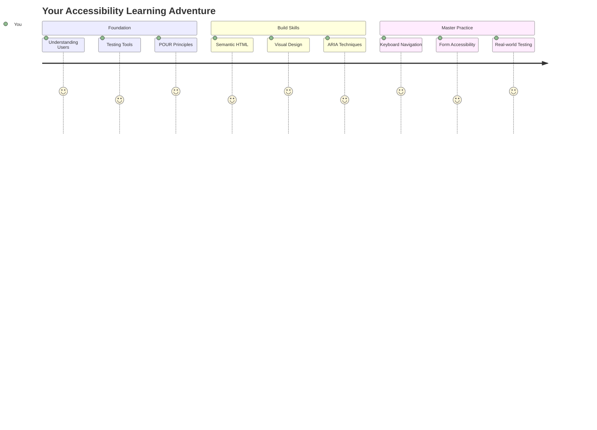

## မိမိကိုယ်တိုင် စစ်ဆေးမေးခွန်း
[Pre-lecture quiz](https://ff-quizzes.netlify.app/web/)

> ဝဘ်၏ အားသာချက်မှာ ၎င်း၏ အထွေထွေသုံးနိုင်မှု ဖြစ်သည်။ မသန်စွမ်းမှုရှိသူများပါဝင်နိုင်မှုသည် အရေးပါသော အချက်တစ်ခုဖြစ်သည်။
>
> \- Sir Timothy Berners-Lee, W3C Director နှင့် World Wide Web တီထွင်သူ

သင်ကို အံ့ဩစေမည့်အရာတစ်ခုရှိသည်—သင် ဝင်ရောက်နိုင်သော ဝဘ်ဆိုဒ်များ ဖန်တီးသောအခါ၊ သင် မသန်စွမ်းမှုရှိသူများကိုသာ မကူညီပေးဘဲ၊ ဝဘ်ကို အားလုံးအတွက် ပိုမိုကောင်းမွန်စေပါသည်။

လမ်းထောင့်များတွင် ရှိသော ကားလမ်းကြမ်းများကို သတိထားမိပါသလား။ ၎င်းတို့ကို စတင်စီမံကိန်းချမှတ်ခဲ့သောအခါ၊ စက်လှည်းများအတွက် ရည်ရွယ်ခဲ့သည်။ ယခုအခါ၊ ၎င်းတို့သည် ကလေးလှည်းများ၊ ပစ္စည်းပို့သူများ၊ ခရီးသွားများနှင့် စက်ဘီးစီးသူများအတွက်ပါ အကျိုးရှိစေသည်။ ဝင်ရောက်နိုင်သော ဝဘ်ဒီဇိုင်းသည် အတိအကျ ဒီလိုပဲ—အုပ်စုတစ်ခုအတွက် အကျိုးရှိသော ဖြေရှင်းနည်းများသည် အားလုံးအတွက် အကျိုးရှိလာသည်။ အရမ်းအေးချမ်းတယ်၊ ဟုတ်လား?

ဒီသင်ခန်းစာမှာ၊ ဝဘ်ကို ဘယ်လိုကြည့်ရှုသုံးစွဲနေပါစေ၊ အားလုံးအတွက် အလုပ်လုပ်နိုင်သော ဝဘ်ဆိုဒ်များ ဖန်တီးပုံကို လေ့လာသွားမည်။ ဝဘ်စံနှုန်းများတွင် ရှိပြီးသားသော လက်တွေ့နည်းလမ်းများကို ရှာဖွေတွေ့ရှိပြီး၊ စမ်းသပ်မှုကိရိယာများနှင့် လက်တွေ့ကျကျ လုပ်ဆောင်ပြီး၊ ဝင်ရောက်နိုင်မှုသည် သင့်ဝဘ်ဆိုဒ်များကို အားလုံးအတွက် ပိုမိုအသုံးပြုနိုင်စေသည့်ပုံကို မြင်တွေ့ရမည်။

ဒီသင်ခန်းစာအဆုံးတွင်၊ ဝင်ရောက်နိုင်မှုကို သင့်ဖွံ့ဖြိုးတိုးတက်မှုလုပ်ငန်းစဉ်၏ သဘာဝတရားတစ်ခုအဖြစ် ဖန်တီးနိုင်မည့် ယုံကြည်မှုကို ရရှိမည်။ သန်းပေါင်းများစွာသော အသုံးပြုသူများအတွက် ဝဘ်ကို ဖွင့်လှစ်ပေးနိုင်မည့် ဒီဇိုင်းရွေးချယ်မှုများကို ရှာဖွေဖို့ အသင့်ဖြစ်ပြီလား? စတင်လိုက်ကြစို့!

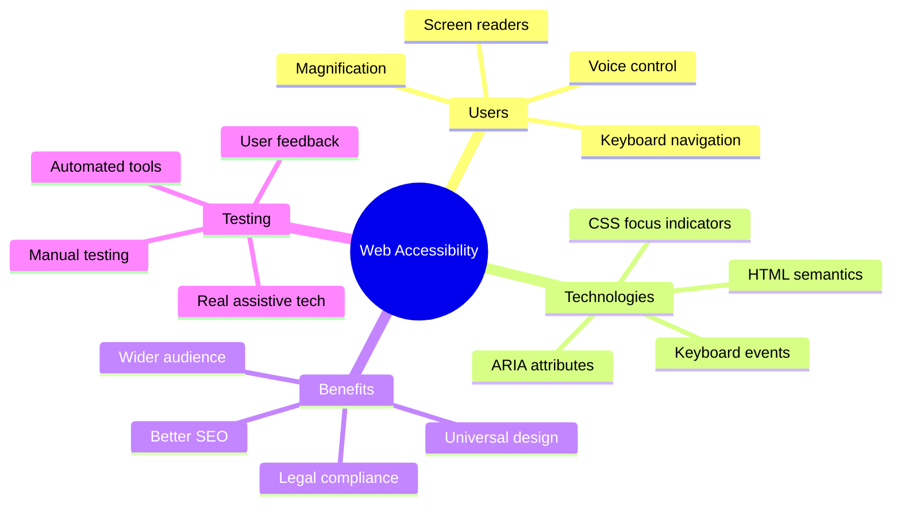

> သင်ဤသင်ခန်းစာကို [Microsoft Learn](https://docs.microsoft.com/learn/modules/web-development-101/accessibility/?WT.mc_id=academic-77807-sagibbon) တွင် လေ့လာနိုင်သည်!

## အကူအညီပေးသော နည်းပညာများကို နားလည်ခြင်း

ကုဒ်ရေးသားခြင်းကို စတင်မတိုင်မီ၊ မတူကွဲပြားသော စွမ်းရည်များရှိသော လူများသည် ဝဘ်ကို အကယ်၍ ဘယ်လိုတွေ့ကြုံရလဲဆိုတာကို နားလည်ရန် အချိန်ယူကြည့်ပါ။ ၎င်းသည် သီအိုရီသာမက၊ အမှန်တကယ်ရှိသော လမ်းကြောင်းများကို နားလည်ခြင်းသည် သင့်ကို ပိုမိုကောင်းမွန်သော Developer ဖြစ်စေမည်။

အကူအညီပေးသော နည်းပညာများသည် မသန်စွမ်းမှုရှိသော လူများကို ဝဘ်ဆိုဒ်များနှင့် အပြန်အလှန်ဆက်သွယ်နိုင်စေရန် အကူအညီပေးသော အံ့ဩဖွယ်ကိရိယာများဖြစ်သည်။ ၎င်းတို့၏ လုပ်ဆောင်ပုံကို နားလည်ပြီးနောက်၊ ဝင်ရောက်နိုင်သော ဝဘ်အတွေ့အကြုံများ ဖန်တီးခြင်းသည် ပိုမိုလွယ်ကူလာသည်။ ၎င်းသည် တစ်စုံတစ်ဦး၏ မျက်လုံးများမှ သင့်ကုဒ်ကို မြင်နိုင်ရန် သင်ယူခြင်းနှင့် တူသည်။

### Screen readers

[Screen readers](https://en.wikipedia.org/wiki/Screen_reader) သည် ဒစ်ဂျစ်တယ်စာသားကို အသံသို့မဟုတ် braille output အဖြစ် ပြောင်းလဲပေးသော နည်းပညာများဖြစ်သည်။ ၎င်းတို့ကို အဓိကအားဖြင့် မျက်စိမမြင်သူများ အသုံးပြုသော်လည်း၊ dyslexia ကဲ့သို့သော သင်ယူမှုမသန်စွမ်းမှုရှိသူများအတွက်လည်း အထောက်အကူဖြစ်စေသည်။

Screen reader ကို စာအုပ်ကို အရမ်းတော်သော storyteller တစ်ဦးက ဖတ်ပေးနေသလို ထင်ရသည်။ ၎င်းသည် အကြောင်းအရာကို အစဉ်အတိုင်း အသံထွက်ဖတ်ပေးပြီး၊ "button" သို့မဟုတ် "link" ကဲ့သို့သော အပြန်အလှန်ဆက်သွယ်မှုအရာများကို ကြေညာပေးပြီး၊ စာမျက်နှာတစ်ခုကို လွယ်ကူစွာ သွားလာနိုင်ရန် ကီးဘုတ် shortcut များကို ပေးသည်။ ဒါပေမယ့် Screen reader များသည် သင့် Developer အနေနဲ့ သင့်ဝဘ်ဆိုဒ်ကို သင့်တော်သော ဖွဲ့စည်းမှုနှင့် အဓိပ္ပါယ်ရှိသော အကြောင်းအရာများဖြင့် ဖန်တီးမှသာ ၎င်းတို့၏ အံ့ဩဖွယ်အလုပ်များကို လုပ်ဆောင်နိုင်သည်။

**Platform များအတွက် လူကြိုက်များသော Screen readers:**
- **Windows**: [NVDA](https://www.nvaccess.org/about-nvda/) (အခမဲ့နှင့် လူကြိုက်များဆုံး), [JAWS](https://webaim.org/articles/jaws/), [Narrator](https://support.microsoft.com/windows/complete-guide-to-narrator-e4397a0d-ef4f-b386-d8ae-c172f109bdb1/?WT.mc_id=academic-77807-sagibbon) (built-in)
- **macOS/iOS**: [VoiceOver](https://support.apple.com/guide/voiceover/welcome/10) (built-in နှင့် အရမ်းတော်)
- **Android**: [TalkBack](https://support.google.com/accessibility/android/answer/6283677) (built-in)
- **Linux**: [Orca](https://wiki.gnome.org/Projects/Orca) (အခမဲ့နှင့် open-source)

**Screen readers များသည် ဝဘ်အကြောင်းအရာကို ဘယ်လိုသွားလာကြည့်ရှုသလဲ:**

Screen readers များသည် အတွေ့အကြုံရှိသော အသုံးပြုသူများအတွက် browsing ကို ထိရောက်စွာလုပ်ဆောင်နိုင်ရန် လမ်းကြောင်းများစွာကို ပေးသည်။
- **Sequential reading**: စာအုပ်လိုမျိုး အပေါ်မှ အောက်သို့ အကြောင်းအရာကို ဖတ်သည်
- **Landmark navigation**: စာမျက်နှာအပိုင်းများ (header, nav, main, footer) အကြား သွားလာသည်
- **Heading navigation**: Heading များအကြား သွားလာပြီး စာမျက်နှာဖွဲ့စည်းမှုကို နားလည်သည်
- **Link lists**: လွယ်ကူစွာ ဝင်ရောက်နိုင်ရန် link အားလုံးကို စာရင်းပြုလုပ်သည်
- **Form controls**: input field နှင့် button များအကြား တိုက်ရိုက်သွားလာသည်

> 💡 **အံ့ဩစရာကောင်းသောအချက်**: Screen reader အသုံးပြုသူ 68% သည် heading များဖြင့် အဓိကအားဖြင့် သွားလာကြသည် ([WebAIM Survey](https://webaim.org/projects/screenreadersurvey9/#finding))။ ၎င်းသည် သင့် heading ဖွဲ့စည်းမှုသည် အသုံးပြုသူများအတွက် လမ်းပြမြေပုံတစ်ခုလိုဖြစ်သည်—သင့်ဖွဲ့စည်းမှုမှန်ကန်သောအခါ၊ လူများကို သင့်အကြောင်းအရာကို ပိုမိုလျင်မြန်စွာ ရှာဖွေသွားနိုင်ရန် ကူညီပေးနေသည်။

### Testing workflow ကို တည်ဆောက်ခြင်း

သတင်းကောင်းတစ်ခုရှိသည်—ထိရောက်သော ဝင်ရောက်နိုင်မှု စမ်းသပ်ခြင်းသည် အလွန်ခက်ခဲစရာမလိုပါ! သင်သည် အလွယ်တကူ အမှားများကို ဖမ်းဆီးနိုင်သော automated tools များနှင့် လက်တွေ့စမ်းသပ်မှုကို ပေါင်းစပ်လိုက်ရမည်။ အချိန်ကုန်သက်သာစွာ အများဆုံးအမှားများကို ဖမ်းဆီးနိုင်သော စနစ်တကျ လုပ်ဆောင်မှုကို အောက်တွင် ဖော်ပြထားသည်။

**အရေးပါသော လက်တွေ့စမ်းသပ်မှုလုပ်ငန်းစဉ်:**

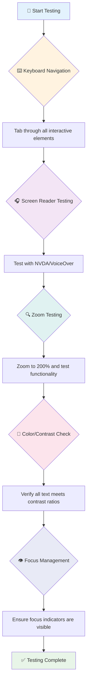

**အဆင့်လိုက် စမ်းသပ်မှု စစ်ဆေးစာရင်း:**
1. **Keyboard navigation**: Tab, Shift+Tab, Enter, Space, နှင့် Arrow key များကိုသာ အသုံးပြုပါ
2. **Screen reader စမ်းသပ်မှု**: NVDA, VoiceOver, သို့မဟုတ် Narrator ကို ဖွင့်ပြီး မျက်လုံးပိတ်ထား၍ သွားလာပါ
3. **Zoom စမ်းသပ်မှု**: 200% နှင့် 400% zoom အဆင့်များတွင် စမ်းသပ်ပါ
4. **Color contrast verification**: စာသားများနှင့် UI components အားလုံးကို စစ်ဆေးပါ
5. **Focus indicator စမ်းသပ်မှု**: အပြန်အလှန်ဆက်သွယ်မှုအရာအားလုံးတွင် မြင်သာသော focus states ရှိကြောင်း သေချာပါ

✅ **Lighthouse ဖြင့် စတင်ပါ**: သင့် browser ၏ DevTools ကို ဖွင့်ပြီး Lighthouse accessibility audit ကို run လုပ်ပါ၊ ထို့နောက် သင့် manual testing focus areas ကို လမ်းညွှန်ရန် ရလဒ်များကို အသုံးပြုပါ။

### Zoom နှင့် magnification tools

တစ်ခါတစ်ရံ သင့်ဖုန်းတွင် စာသားများ သေးလွန်းသောအခါ pinch-to-zoom လုပ်ပြီး၊ သို့မဟုတ် laptop screen ကို အလင်းရောင်ပြင်းထန်သောနေရာတွင် မျက်လုံးဖြင့် ကြည့်ရသောအခါကို သတိထားမိပါသလား? မျက်စိမကောင်းသူများ၊ အသက်ကြီးသူများ၊ သို့မဟုတ် အပြင်မှာ ဝဘ်ဆိုဒ်ကို ဖတ်ဖို့ ကြိုးစားသူများအတွက် အကြောင်းအရာကို ဖတ်နိုင်စေရန် magnification tools များကို နေ့စဉ်အသုံးပြုနေသည်။

ခေတ်မီ zoom နည်းပညာများသည် အကြောင်းအရာများကို ရိုးရိုးကြီးစေခြင်းထက် ပိုမိုတိုးတက်လာသည်။ ၎င်းတို့၏ လုပ်ဆောင်ပုံကို နားလည်ခြင်းသည် မည်သည့် magnification အဆင့်တွင်မဆို အလုပ်လုပ်နိုင်သော responsive designs များ ဖန်တီးရန် ကူညီပေးမည်။

**ခေတ်မီ browser zoom စွမ်းရည်များ:**
- **Page zoom**: အကြောင်းအရာအားလုံးကို အချိုးကျစွာ ပိုမိုကြီးစေသည် (စာသား, ပုံများ, layout) - ၎င်းသည် အကြံပြုထားသော နည်းလမ်းဖြစ်သည်
- **Text-only zoom**: font size ကို တိုးမြှင့်ပြီး မူရင်း layout ကို ထိန်းသိမ်းထားသည်
- **Pinch-to-zoom**: အချိန်ပိုင်း magnification အတွက် mobile gesture support
- **Browser support**: ခေတ်မီ browser အားလုံးသည် 500% zoom အထိ functionality မပျက်စီးဘဲ ပံ့ပိုးပေးသည်

**အထူး magnification software:**
- **Windows**: [Magnifier](https://support.microsoft.com/windows/use-magnifier-to-make-things-on-the-screen-easier-to-see-414948ba-8b1c-d3bd-8615-0e5e32204198) (built-in), [ZoomText](https://www.freedomscientific.com/training/zoomtext/getting-started/)
- **macOS/iOS**: [Zoom](https://www.apple.com/accessibility/mac/vision/) (built-in with advanced features)

> ⚠️ **ဒီဇိုင်းစဉ်းစားမှု**: WCAG သတ်မှတ်ချက်အရ အကြောင်းအရာသည် 200% zoom လုပ်သောအခါတွင် အလုပ်လုပ်နိုင်ရမည်။ ဤအဆင့်တွင် horizontal scrolling သက်သာပြီး၊ အပြန်အလှန်ဆက်သွယ်မှုအရာအားလုံးသည် ဝင်ရောက်နိုင်ရမည်။

✅ **Responsive design ကို စမ်းသပ်ပါ**: သင့် browser ကို 200% နှင့် 400% zoom လုပ်ပါ။ သင့် layout သည် လွယ်ကူစွာ အလျော်အစားလုပ်ပါသလား? အလွန် scrolling မရှိဘဲ functionality အားလုံးကို သုံးနိုင်ပါသလား?

## ခေတ်မီ ဝင်ရောက်နိုင်မှု စမ်းသပ်မှုကိရိယာများ

အခု သင်သည် ဝဘ်ကို assistive technologies ဖြင့် သွားလာပုံကို နားလည်ပြီးနောက်၊ ဝင်ရောက်နိုင်သော ဝဘ်ဆိုဒ်များ ဖန်တီးရန်နှင့် စမ်းသပ်ရန် ကူညီပေးသော ကိရိယာများကို လေ့လာကြည့်ပါ။

ဤအရာကို ဒီလိုထင်ပါ—automated tools များသည် အလွယ်တကူ အမှားများ (ဥပမာ alt text မရှိခြင်း) ကို ဖမ်းဆီးနိုင်ပြီး၊ လက်တွေ့စမ်းသပ်မှုသည် သင့် site ကို အမှန်တကယ် အသုံးပြုရသည့်အခါ သက်တောင့်သက်သာဖြစ်စေရန် ကူညီပေးသည်။ ၎င်းတို့ကို ပေါင်းစပ်ပြီး သင့် site များသည် အားလုံးအတွက် အလုပ်လုပ်နိုင်ကြောင်း ယုံကြည်မှုရရှိစေသည်။

### Color contrast စမ်းသပ်ခြင်း

သတင်းကောင်းတစ်ခုရှိသည်—color contrast သည် အများဆုံးတွေ့ရသော ဝင်ရောက်နိုင်မှုပြဿနာတစ်ခုဖြစ်သော်လည်း၊ ၎င်းကို ဖြေရှင်းရန် အလွယ်ဆုံးဖြစ်သည်။ ကောင်းမွန်သော contrast သည် အားလုံးအတွက် အကျိုးရှိစေသည်—မျက်စိမကောင်းသူများမှ စ၍ ပင်လယ်ကမ်းခြေတွင် ဖုန်းဖတ်နေသူများအထိ။

**WCAG contrast လိုအပ်ချက်များ:**

| Text Type | WCAG AA (အနိမ့်ဆုံး) | WCAG AAA (တိုးတက်သော) |
|-----------|-------------------|---------------------|
| **Normal text** (18pt အောက်) | 4.5:1 contrast ratio | 7:1 contrast ratio |
| **Large text** (18pt+ သို့မဟုတ် 14pt+ bold) | 3:1 contrast ratio | 4.5:1 contrast ratio |
| **UI components** (buttons, form borders) | 3:1 contrast ratio | 3:1 contrast ratio |

**အရေးပါသော စမ်းသပ်မှုကိရိယာများ:**
- [Colour Contrast Analyser](https://www.tpgi.com/color-contrast-checker/) - color picker ပါသော desktop app
- [WebAIM Contrast Checker](https://webaim.org/resources/contrastchecker/) - web-based နှင့် ချက်ချင်း feedback
- [Stark](https://www.getstark.co/) - Figma, Sketch, Adobe XD အတွက် design tool plugin
- [Accessible Colors](https://accessible-colors.com/) - ဝင်ရောက်နိုင်သော color palettes ရှာဖွေပါ

✅ **Color palettes ပိုမိုကောင်းမွန်စေပါ**: သင့် brand colors ဖြင့် စတင်ပြီး contrast checkers ကို အသုံးပြု၍ ဝင်ရောက်နိုင်သော အမျိုးအစားများ ဖန်တီးပါ။ ၎င်းတို့ကို သင့် design system ၏ accessible color tokens အဖြစ် documentation ပြုလုပ်ပါ။

### Comprehensive accessibility auditing

အထိရောက်ဆုံး
- **အမျိုးမျိုးသော browser, device, နှင့် အထောက်အကူပြု tools များတွင် စမ်းသပ်ပါ**
- **အဆင့်မြင့် feature များကို မထောက်ပံ့နိုင်သောအခါ content ကို သက်တောင့်သက်သာ ဖွဲ့စည်းပါ**

### 🎯 **POUR Principles Check: အခြေခံအချက်များကို မှတ်သားခြင်း**

**အခြေခံအချက်များအပေါ် အမြန်ပြန်လည်စဉ်းစားခြင်း:**
- POUR principle တစ်ခုချင်းစီကို မဖြည့်ဆည်းနိုင်သော website feature ကို စဉ်းစားနိုင်ပါသလား။
- Developer အနေနဲ့ ဘယ် principle က သဘာဝကျဆုံးလဲ။
- ဒီ principle တွေက မသန်စွမ်းသူများအတွက်သာမက အားလုံးအတွက် ဒီဇိုင်းကို ဘယ်လိုတိုးတက်စေမလဲ။

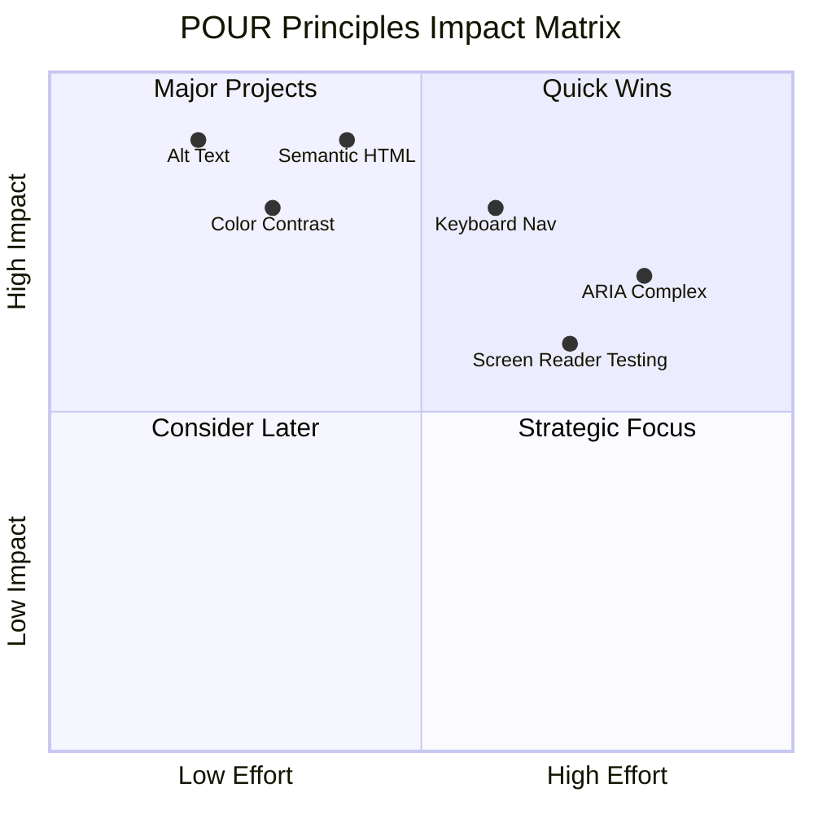

> **သတိပြုပါ**: အလွယ်တကူ ပြုပြင်နိုင်ပြီး အကျိုးသက်ရောက်မှု မြင့်မားသော အချက်များကို စတင်ပါ။ Semantic HTML နှင့် alt text က accessibility အတွက် အနည်းဆုံး အလွယ်ဆုံးနည်းလမ်းဖြစ်ပါတယ်။

## အထောက်အကူပြု Visual Design ဖန်တီးခြင်း

အကောင်းဆုံး visual design နှင့် accessibility သည် အတူတူ လက်တွဲသွားပါသည်။ Accessibility ကို စဉ်းစားပြီး ဒီဇိုင်းဆွဲရာတွင် အားလုံးအတွက် အကျိုးရှိသော သန့်ရှင်းပြီး လှပသော ဖြေရှင်းချက်များကို ရှာဖွေတွေ့ရှိနိုင်ပါသည်။

အားလုံးအတွက် အဆင်ပြေသော visual design များကို ဖန်တီးပုံကို လေ့လာကြည့်ရအောင်။

### အရောင်နှင့် visual accessibility နည်းလမ်းများ

အရောင်သည် ဆက်သွယ်မှုအတွက် အရေးကြီးသော အခန်းကဏ္ဍတစ်ခုဖြစ်သော်လည်း အရေးကြီးသော အချက်များကို ဖော်ပြရာတွင် အရောင်တစ်ခုတည်းကို မသုံးသင့်ပါ။ အရောင်အပြင် အခြားနည်းလမ်းများကို အသုံးပြုခြင်းသည် ပိုမိုခိုင်မာပြီး အားလုံးအတွက် အကျိုးရှိသော အတွေ့အကြုံများကို ဖန်တီးပေးနိုင်ပါသည်။

**အရောင်မြင်ခြင်းကွဲလွဲမှုများအတွက် ဒီဇိုင်းဆွဲခြင်း:**

အမျိုးသား ၈% နှင့် အမျိုးသမီး ၀.၅% ခန့်မှာ အရောင်မြင်ခြင်းကွဲလွဲမှု (color blindness) ရှိကြသည်။ အများဆုံးတွေ့ရသော အမျိုးအစားများမှာ:
- **Deuteranopia**: အနီနှင့် အစိမ်းကို ခွဲခြားရန် အခက်အခဲရှိခြင်း
- **Protanopia**: အနီရောင်သည် ပိုမှိန်သွားခြင်း
- **Tritanopia**: အပြာနှင့် အဝါရောင်ကို ခွဲခြားရန် အခက်အခဲရှိခြင်း (ရှားပါး)

**အထောက်အကူပြု အရောင်နည်းလမ်းများ:**

```css
/* ❌ Bad: Using only color to indicate status */
.error { color: red; }
.success { color: green; }

/* ✅ Good: Color plus icons and context */
.error {
  color: #d32f2f;
  border-left: 4px solid #d32f2f;
}
.error::before {
  content: "⚠️";
  margin-right: 8px;
}

.success {
  color: #2e7d32;
  border-left: 4px solid #2e7d32;
}
.success::before {
  content: "✅";
  margin-right: 8px;
}
```

**အခြေခံ contrast လိုအပ်ချက်များအပြင်:**
- အရောင်ရွေးချယ်မှုများကို color blind simulators ဖြင့် စမ်းသပ်ပါ
- အရောင် coding အပြင် pattern, texture, သို့မဟုတ် shape များကို အသုံးပြုပါ
- Interactive state များကို အရောင်မပါဘဲ ခွဲခြားနိုင်စေရန် သေချာပါစေ
- High contrast mode တွင် ဒီဇိုင်းကို ဘယ်လိုပုံပေါ်မည်ကို စဉ်းစားပါ

✅ **အရောင် accessibility ကို စမ်းသပ်ပါ**: [Coblis](https://www.color-blindness.com/coblis-color-blindness-simulator/) ကဲ့သို့သော tools များကို အသုံးပြု၍ သင့် site ကို အရောင်မြင်ခြင်းကွဲလွဲမှုရှိသူများအတွက် ဘယ်လိုပုံပေါ်မည်ကို ကြည့်ပါ။

### Focus indicators နှင့် interaction design

Focus indicators သည် cursor ရဲ့ digital version ဖြစ်ပြီး keyboard အသုံးပြုသူများအတွက် page ပေါ်မှာ ရှိနေသောနေရာကို ပြသပေးသည်။ အကောင်းဆုံး focus indicators များသည် အားလုံးအတွက် အတွေ့အကြုံကို ပိုမိုရှင်းလင်းပြီး ခန့်မှန်းနိုင်စေသည်။

**ခေတ်မီ focus indicator အကောင်းဆုံးနည်းလမ်းများ:**

```css
/* Enhanced focus styles that work across browsers */
button:focus-visible {
  outline: 2px solid #0066cc;
  outline-offset: 2px;
  box-shadow: 0 0 0 4px rgba(0, 102, 204, 0.25);
}

/* Remove focus outline for mouse users, preserve for keyboard users */
button:focus:not(:focus-visible) {
  outline: none;
}

/* Focus-within for complex components */
.card:focus-within {
  box-shadow: 0 0 0 3px rgba(74, 144, 164, 0.5);
  border-color: #4A90A4;
}

/* Ensure focus indicators meet contrast requirements */
.custom-focus:focus-visible {
  outline: 3px solid #ffffff;
  outline-offset: 2px;
  box-shadow: 0 0 0 6px #000000;
}
```

**Focus indicator လိုအပ်ချက်များ:**
- **မြင်နိုင်မှု**: ပတ်ပတ်လည် element များနှင့် အနည်းဆုံး 3:1 contrast ratio ရှိရမည်
- **အကျယ်**: Element အပေါ်တွင် အနည်းဆုံး 2px ထူထဲရှိရမည်
- **တည်ရှိမှု**: Focus အခြားနေရာသို့ မရွှေ့မီအထိ မြင်နိုင်ရမည်
- **ခွဲခြားမှု**: အခြား UI state များနှင့် visually ကွဲပြားရမည်

> 💡 **ဒီဇိုင်းအကြံပေးချက်**: အကောင်းဆုံး focus indicators များသည် outline, box-shadow, နှင့် အရောင်ပြောင်းလဲမှုတို့ကို ပေါင်းစပ်အသုံးပြု၍ အမျိုးမျိုးသောနောက်ခံနှင့် အခြေအနေများတွင် မြင်နိုင်စေရန် သေချာစေသည်။

✅ **Focus indicators ကို စစ်ဆေးပါ**: သင့် website ကို Tab ဖြင့် ဖြတ်သန်းကြည့်ပြီး element များတွင် ရှင်းလင်းသော focus indicators ရှိမရှိ စစ်ဆေးပါ။ မမြင်နိုင်သော သို့မဟုတ် လုံးဝမရှိသော အချက်များ ရှိပါသလား။

### Semantic HTML: Accessibility ရဲ့ အခြေခံ

Semantic HTML သည် assistive technologies အတွက် သင့် website ကို GPS system တစ်ခုလို ဖြစ်စေသည်။ HTML element များကို သင့်တော်သော ရည်ရွယ်ချက်အတွက် အသုံးပြုခြင်းသည် screen readers, keyboards, နှင့် အခြား tools များကို အသုံးပြုသူများအတွက် navigation ကို ပိုမိုအဆင်ပြေစေသည်။

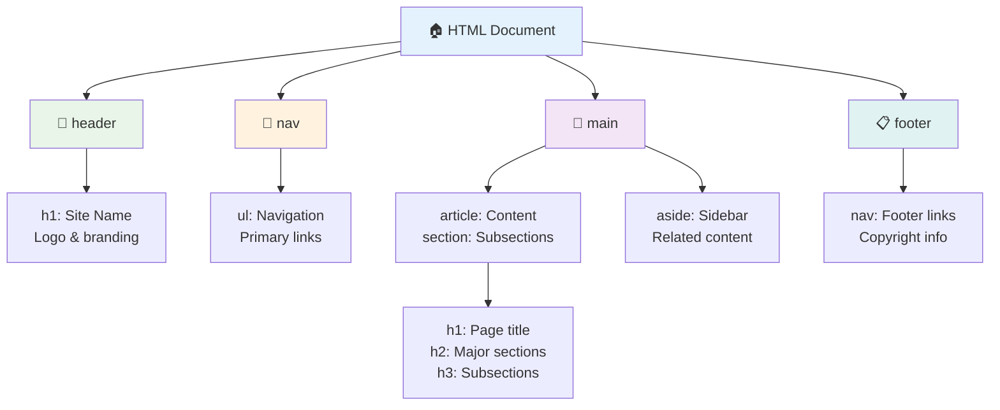

**Accessible page structure ရဲ့ အခြေခံအချက်များ:**

```html
<!-- Landmark elements provide page navigation structure -->
<header>
  <h1>Your Site Name</h1>
  <nav aria-label="Main navigation">
    <ul>
      <li><a href="/home">Home</a></li>
      <li><a href="/about">About</a></li>
      <li><a href="/services">Services</a></li>
    </ul>
  </nav>
</header>

<main>
  <article>
    <header>
      <h1>Article Title</h1>
      <p>Published on <time datetime="2024-10-14">October 14, 2024</time></p>
    </header>
    
    <section>
      <h2>First Section</h2>
      <p>Content that relates to this section...</p>
    </section>
    
    <section>
      <h2>Second Section</h2>
      <p>More related content...</p>
    </section>
  </article>
  
  <aside>
    <h2>Related Links</h2>
    <nav aria-label="Related articles">
      <ul>
        <li><a href="/related-1">First related article</a></li>
        <li><a href="/related-2">Second related article</a></li>
      </ul>
    </nav>
  </aside>
</main>

<footer>
  <p>&copy; 2024 Your Site Name. All rights reserved.</p>
  <nav aria-label="Footer links">
    <ul>
      <li><a href="/privacy">Privacy Policy</a></li>
      <li><a href="/contact">Contact Us</a></li>
    </ul>
  </nav>
</footer>
```

**Semantic HTML က accessibility ကို ဘယ်လိုပြောင်းလဲစေသလဲ:**

| Semantic Element | ရည်ရွယ်ချက် | Screen Reader အကျိုးကျေးဇူး |
|------------------|-------------|-----------------------------|
| `<header>` | Page သို့မဟုတ် section header | "Banner landmark" - အပေါ်ဆုံးသို့ အလွယ်တကူ navigation |
| `<nav>` | Navigation links | "Navigation landmark" - nav section များစာရင်း |
| `<main>` | Page content အဓိက | "Main landmark" - content သို့ တိုက်ရိုက်သွားရန် |
| `<article>` | Self-contained content | article အကန့်အသတ်များကို ကြေညာသည် |
| `<section>` | Themed content groups | content structure ကို ပေးသည် |
| `<aside>` | Related sidebar content | "Complementary landmark" |
| `<footer>` | Page သို့မဟုတ် section footer | "Contentinfo landmark" |

**Semantic HTML ရဲ့ screen reader superpowers:**
- **Landmark navigation**: Page section အဓိကများကို အလွယ်တကူ ဖြတ်သန်းနိုင်သည်
- **Heading outlines**: Heading structure မှ table of contents တစ်ခုကို ဖန်တီးနိုင်သည်
- **Element lists**: Link, button, သို့မဟုတ် form control များစာရင်းကို ဖန်တီးနိုင်သည်
- **Context awareness**: Content section များအကြား ဆက်နွယ်မှုကို နားလည်နိုင်သည်

> 🎯 **Quick Test**: Screen reader ကို landmark shortcut (NVDA/JAWS တွင် D, H, K) အသုံးပြု၍ သင့် site ကို navigation လုပ်ကြည့်ပါ။ Navigation သည် make sense လား။

### 🏗️ **Semantic HTML Mastery Check: အခြေခံအချက်များကို ခိုင်မာစွာ တည်ဆောက်ခြင်း**

**Semantic HTML ကို သင်နားလည်မှုကို အကဲဖြတ်ကြည့်ရအောင်:**
- HTML ကိုကြည့်ရုံဖြင့် webpage ရဲ့ landmarks များကို သတ်မှတ်နိုင်ပါသလား။
- `<section>` နှင့် `<div>` ရဲ့ ကွာခြားချက်ကို သူငယ်ချင်းတစ်ဦးကို ဘယ်လိုရှင်းပြမလဲ။
- Screen reader အသုံးပြုသူက navigation ပြဿနာများကို တိုင်ကြားခဲ့လျှင် သင်စစ်ဆေးမည့် ပထမဆုံးအရာက ဘာလဲ။

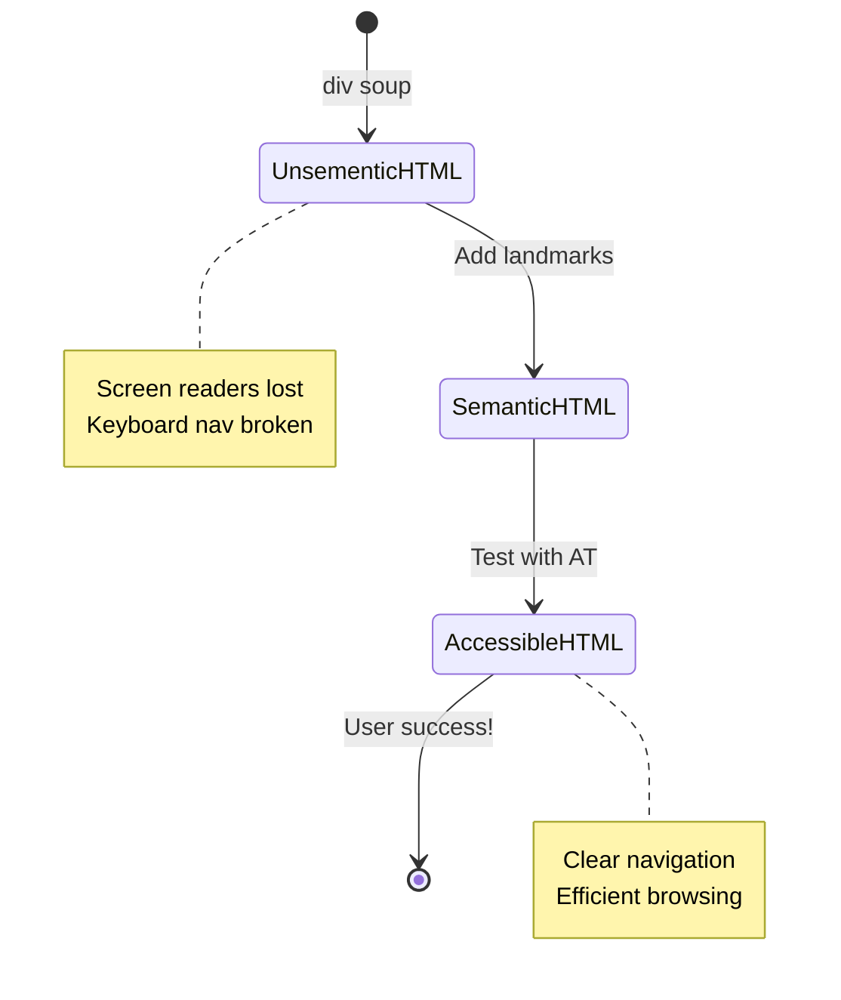

> **Pro insight**: Semantic HTML က accessibility ပြဿနာများ၏ ၇၀% ခန့်ကို အလိုအလျောက် ဖြေရှင်းပေးနိုင်သည်။ ဒီအခြေခံကို ကျွမ်းကျင်ပါက သင်သည် accessibility ရဲ့ အရေးကြီးသော အဆင့်ကို ရောက်ရှိနေပါပြီ!

✅ **Semantic structure ကို စစ်ဆေးပါ**: Browser ရဲ့ DevTools မှ Accessibility panel ကို အသုံးပြု၍ accessibility tree ကို ကြည့်ပြီး သင့် markup က logical structure ဖန်တီးထားမထား စစ်ဆေးပါ။

### Heading hierarchy: Logical content outline ဖန်တီးခြင်း

Headings သည် accessible content အတွက် အလွန်အရေးကြီးသည်—ဒါဟာ content အားလုံးကို ဆွဲထားတဲ့ အကြောတစ်ခုလိုပါပဲ။ Screen reader အသုံးပြုသူများသည် သင့် content ကို နားလည်ရန်နှင့် navigation လုပ်ရန် headings ကို အလွန်အားထားကြသည်။

**Headings ရဲ့ golden rule:**
Level များကို မကျော်ပါနှင့်။ အမြဲ `<h1>` → `<h2>` → `<h3>` အတိုင်း logical progression ဖြင့် ဆက်သွားပါ။ ကျောင်းမှာ outline ရေးခဲ့ဖူးတာကို သတိရပါ။ အတိအကျတူတူပဲ—"I. Main Point" ကနေ "C. Sub-sub-point" ကို "A. Sub-point" မရှိဘဲ မသွားပါဘူး၊ ဟုတ်လား။

**Heading structure အကောင်းဆုံးနမူနာ:**

```html
<!-- ✅ Excellent: Logical, hierarchical progression -->
<main>
  <h1>Complete Guide to Web Accessibility</h1>
  
  <section>
    <h2>Understanding Screen Readers</h2>
    <p>Introduction to screen reader technology...</p>
    
    <h3>Popular Screen Reader Software</h3>
    <p>NVDA, JAWS, and VoiceOver comparison...</p>
    
    <h3>Testing with Screen Readers</h3>
    <p>Step-by-step testing instructions...</p>
  </section>
  
  <section>
    <h2>Color and Contrast Guidelines</h2>
    <p>Designing with sufficient contrast...</p>
    
    <h3>WCAG Contrast Requirements</h3>
    <p>Understanding the different contrast levels...</p>
    
    <h3>Testing Tools and Techniques</h3>
    <p>Tools for verifying contrast ratios...</p>
  </section>
</main>
```

```html
<!-- ❌ Problematic: Skipping levels, inconsistent structure -->
<h1>Page Title</h1>
<h3>Subsection</h3> <!-- Skipped h2 -->
<h2>This should come before h3</h2>
<h1>Another main heading?</h1> <!-- Multiple h1s -->
```

**Heading best practices:**
- **Page တစ်ခုလုံးမှာ `<h1>` တစ်ခုသာ**: အများအားဖြင့် main page title သို့မဟုတ် primary content heading
- **Logical progression**: Level များကို မကျော်ပါ (h1 → h2 → h3, h1 → h3 မဟုတ်)
- **Descriptive content**: Headings ကို context မပါဘဲ ဖတ်ရင်လည်း အဓိပ္ပါယ်ရှိအောင်ရေးပါ
- **Visual styling with CSS**: Appearance အတွက် CSS ကို အသုံးပြုပါ၊ Structure အတွက် HTML levels ကို အသုံးပြုပါ

**Screen reader navigation အချက်အလက်များ:**
- Screen reader အသုံးပြုသူ ၆၈% သည် headings ဖြင့် navigation လုပ်ကြသည် ([WebAIM Survey](https://webaim.org/projects/screenreadersurvey9/#finding))
- Logical heading outline ကို ရှာဖွေမည်ဟု မျှော်လင့်ကြသည်
- Headings သည် page structure ကို နားလည်ရန် အမြန်ဆုံးနည်းလမ်းပေးသည်

> 💡 **Pro Tip**: "HeadingsMap" ကဲ့သို့သော browser extensions ကို အသုံးပြု၍ heading structure ကို visualization လုပ်ပါ။ Table of contents ကောင်းကောင်းတစ်ခုလို ဖတ်နိုင်ရမည်။

✅ **Heading structure ကို စမ်းသပ်ပါ**: Screen reader ရဲ့ heading navigation (NVDA တွင် H key) ကို အသုံးပြု၍ headings တွေကို ဖြတ်သန်းကြည့်ပါ။ Content ရဲ့ progression က logical ဖြစ်ပါသလား။

### အဆင့်မြင့် visual accessibility နည်းလမ်းများ

Contrast နှင့် color ရဲ့ အခြေခံအချက်များအပြင်၊ viewing conditions များနှင့် assistive technologies များအတွက် အမှန်တကယ် inclusive visual experiences ဖန်တီးရန် sophisticated techniques များရှိသည်။

**အရေးကြီး visual communication နည်းလမ်းများ:**

- **Multi-modal feedback**: Visual, textual, နှင့် audio cues များကို ပေါင်းစပ်ပါ
- **Progressive disclosure**: အချက်အလက်များကို စိတ်ချရသော အပိုင်းများဖြင့် ဖော်ပြပါ
- **Consistent interaction patterns**: ရင်းနှီးသော UI conventions များကို အသုံးပြုပါ
- **Responsive typography**: Device များအတိုင်း text ကို scale လုပ်ပါ
- **Loading နှင့် error states**: User action များအတွက် ရှင်းလင်းသော feedback ပေးပါ

**Enhanced accessibility အတွက် CSS utilities:**

```css
/* Screen reader only text - visually hidden but accessible */
.sr-only {
  position: absolute;
  width: 1px;
  height: 1px;
  padding: 0;
  margin: -1px;
  overflow: hidden;
  clip: rect(0, 0, 0, 0);
  white-space: nowrap;
  border: 0;
}

/* Skip link for keyboard navigation */
.skip-link {
  position: absolute;
  top: -40px;
  left: 6px;
  background: #000000;
  color: #ffffff;
  padding: 8px 16px;
  text-decoration: none;
  border-radius: 4px;
  font-weight: bold;
  transition: top 0.3s ease;
  z-index: 1000;
}

.skip-link:focus {
  top: 6px;
}

/* Reduced motion respect */
@media (prefers-reduced-motion: reduce) {
  .skip-link {
    transition: none;
  }
  
  * {
    animation-duration: 0.01ms !important;
    animation-iteration-count: 1 !important;
    transition-duration: 0.01ms !important;
  }
}

/* High contrast mode support */
@media (prefers-contrast: high) {
  .button {
    border: 2px solid;
  }
}
```

> 🎯 **Accessibility Pattern**: "Skip link" သည် keyboard အသုံးပြုသူများအတွက် အရေးကြီးသည်။ Page ပေါ်တွင် ပထမဆုံး focusable element ဖြစ်ပြီး main content area သို့ တိုက်ရိုက်သွားနိုင်ရမည်။

✅ **Skip navigation ကို အကောင်အထည်ဖော်ပါ**: Skip links များကို သင့် page များတွင် ထည့်သွင်းပြီး page load ပြီးချိန်မှာ Tab key ကို နှိပ်၍ စမ်းသပ်ပါ။ Skip links များသည် ပေါ်လာပြီး main content သို့ jump လုပ်နိုင်ရမည်။

## အဓိပ္ပါယ်ရှိသော Link Text ဖန်တီးခြင်း

Links သည် web ရဲ့ highway များဖြစ်သော်လည်း အဓိပ္ပါယ်မရှိသော link text သည် "Place" ဆိုပြီး road sign တွေရှိတဲ့ လမ်းမကြီးလိုပါပဲ။ အတော်လေး မအဆင်ပြေဘူး၊ ဟုတ်လား။

Screen reader များသည် page ရဲ့ link အားလုံးကို စုစည်းပြီး list တစ်ခုအဖြစ် ပြသနိုင်သည်ဆိုတာကို ပထမဆုံး သိလိုက်တဲ့အခါ အတော်လေး အံ့ဩခဲ့ရပါတယ်။ Page ရဲ့ link အားလုံးကို directory တစ်ခုအဖြစ် ရရှိခဲ့တယ်ဆိုရင် link တစ်ခုချင်းစီက အဓိပ္ပါယ်ရှိမရှိ စစ်ဆေးနိုင်မယ်။ Link text သည် ဒီစစ်ဆေးမှုကို ဖြတ်သန်းနိုင်ရမည်။

### Link navigation patterns ကို နားလည်ခြင်း

Screen reader များသည် အကောင်းဆုံး link navigation feature များကို အဓိပ္ပါယ်ရှိသော link text အပေါ် အားထားသည်:

**Link navigation နည်းလမ်းများ:**
- **Sequential reading**: Links များကို content flow ရဲ့ အစိတ်အပိုင်းအဖြစ် context အတွင်း ဖတ်သည်
- **Link list generation**: Page ရဲ့ link အားလုံးကို searchable directory အဖြစ် စုစည်းသည်
- **Quick navigation**: Keyboard shortcuts (NVDA တွင် K) အသုံးပြု၍ links အကြား jump လုပ်သည်
- **Search functionality**: Partial text ဖြင့် link များကို ရှာဖွေသည်

**Context ရဲ့ အရေးကြီးမှု:**
Screen reader အသုံးပြုသူများသည် link list ကို ဖန်တီးသောအခါ အောက်ပါအတိုင်း ဖြစ်နိုင်သည်:
- "Download report"
- "Learn more"
- "Click here"
- "Privacy policy"
- "Click here"

ဒီ link များထဲမှာ context မပါဘဲ ဖတ်တဲ့အခါ အသုံးဝင်တဲ့အချက်ကို ပေးနိုင်တဲ့ link နှစ်ခုပဲ ရှိပါတယ်!

> 📊 **User Impact**: Screen reader အသုံးပြုသူများသည် link list ကို scan လုပ်ပြီး page content ကို အမြန်နားလည်ရန် ကြိုးစားကြသည်။ Generic link text သည် link ရဲ့ context ကို ပြန်သွားရှာရန် အားထုတ်စေပြီး browsing အတွေ့အကြုံကို အလွန်နှေးကွေးစေသည်။

### Link text ရဲ့ အမှားများကို ရှောင်ရှားခြင်း

မကောင်းသောအချက်များကို နားလည်ခြင်းသည် ရှိပြီးသား content တွင် accessibility ပြဿနာများကို သတိပြုပြီး ပြုပြင်နိုင်စေသည်။

**❌ Context မပေးသော generic link text:**

```html
<!-- Meaningless when read from a link list -->
<p>Our sustainability efforts are detailed in our recent report. 
   <a href="/sustainability-2024.pdf">Click here</a> to view it.</p>

<!-- Repeated generic text throughout the page -->
<div class="article-card">
  <h3>Web Accessibility Guide</h3>
  <p>Learn the fundamentals...</p>
  <a href="/accessibility-guide">Read more</a>
</div>
<div class="article-card">
  <h3>Color Contrast Tips</h3>
  <p>Improve your design...</p>
  <a href="/color-contrast">Read more</a>
</div>

<!-- URLs as link text (difficult for screen readers to announce) -->
<p>Visit https://www.w3.org/WAI/WCAG21/quickref/ for WCAG guidelines.</p>

<!-- Vague action words -->
<a href="/contact">Go</a> | <a href="/about">See</a> | <a href="/help">View</a>
```

**ဒီ pattern များက ဘာကြောင့် မအောင်မြင်သလဲ:**
- **"Click here"** သည် destination အကြောင်း ဘာမှ မပြောသည်
- **"Read more"** ကို မကြိမ်ကြိမ် ထပ်သုံးခြင်းသည် ရှုပ်ထွေးမှု ဖြစ်စေသည်
- **Raw URLs** သည် screen readers အတွက် ပြောရန် အခက်အခဲဖြစ်စေသည်
- **Single words** ကဲ့သို့သော "Go" သို့မဟုတ် "See" သည် descriptive context မပါဘဲ ဖြစ်သည်

### အကောင်းဆုံး link text ရေးသားခြင်း

Descriptive link text သည် အားလုံးအတွက် အကျိုးရှိသည်—မျက်စိရှိသူများသည် links ကို အလွယ်တကူ scan လုပ်နိုင်ပြီး screen reader အသုံးပြုသူများသည် destinations ကို ချက်ချင်းနားလည်နိုင်သည်။

**✅ ရှင်းလင်းပြီး descriptive link
**ARIA ၏ အမျိုးအစား ၅ မျိုး**

1. **Roles**: ဒီ element ကဘာလဲ? (`button`, `tab`, `dialog`)
2. **Properties**: ဒီ element ရဲ့ အင်္ဂါရပ်တွေကဘာလဲ? (`aria-required`, `aria-haspopup`)
3. **States**: အခုအခြေအနေကဘာလဲ? (`aria-expanded`, `aria-checked`)
4. **Landmarks**: ဒီ element က page structure မှာဘယ်နေရာမှာရှိလဲ? (`banner`, `navigation`, `main`)
5. **Live regions**: ပြောင်းလဲမှုတွေကို ဘယ်လိုကြေညာပေးရမလဲ? (`aria-live`, `aria-atomic`)

### ခေတ်သစ် Web Apps အတွက် အရေးကြီး ARIA ပုံစံများ

ဒီပုံစံတွေက interactive web applications တွေမှာ အများဆုံးဖြစ်ပေါ်တဲ့ accessibility စိန်ခေါ်မှုတွေကို ဖြေရှင်းပေးနိုင်ပါတယ်။

**Element တွေကို အမည်ပေးခြင်းနှင့် ဖော်ပြခြင်း:**

```html
<!-- aria-label: Provides accessible name when visible text isn't sufficient -->
<button aria-label="Close newsletter subscription dialog">×</button>

<!-- aria-labelledby: References existing text as the accessible name -->
<section aria-labelledby="news-heading">
  <h2 id="news-heading">Latest News</h2>
  <!-- news content -->
</section>

<!-- aria-describedby: Links to additional descriptive text -->
<input type="password" 
       aria-describedby="pwd-requirements pwd-strength"
       required>
<div id="pwd-requirements">
  Password must contain at least 8 characters, including uppercase, lowercase, and numbers.
</div>
<div id="pwd-strength" aria-live="polite">
  <!-- Dynamic password strength indicator -->
</div>
```

**Dynamic content အတွက် Live regions:**

```html
<!-- Polite announcements (don't interrupt current speech) -->
<div aria-live="polite" id="status-updates">
  <!-- Status messages appear here -->
</div>

<!-- Assertive announcements (interrupt and announce immediately) -->
<div aria-live="assertive" id="urgent-alerts">
  <!-- Error messages and critical alerts -->
</div>

<!-- Loading states with live regions -->
<button id="submit-btn" aria-describedby="loading-status">
  Submit Application
</button>
<div id="loading-status" aria-live="polite" aria-atomic="true">
  <!-- "Processing your application..." appears here -->
</div>
```

**Interactive widget နမူနာ (accordion):**

```html
<div class="accordion">
  <h3>
    <button aria-expanded="false" 
            aria-controls="panel-1" 
            id="accordion-trigger-1"
            class="accordion-trigger">
      Accessibility Guidelines
    </button>
  </h3>
  <div id="panel-1" 
       role="region"
       aria-labelledby="accordion-trigger-1" 
       hidden>
    <p>WCAG 2.1 provides comprehensive guidelines...</p>
  </div>
</div>
```

```javascript
// JavaScript to manage accordion state
function toggleAccordion(trigger) {
  const panel = document.getElementById(trigger.getAttribute('aria-controls'));
  const isExpanded = trigger.getAttribute('aria-expanded') === 'true';
  
  // Toggle states
  trigger.setAttribute('aria-expanded', !isExpanded);
  panel.hidden = isExpanded;
  
  // Announce change to screen readers
  const status = document.getElementById('status-updates');
  status.textContent = isExpanded ? 'Section collapsed' : 'Section expanded';
}
```

### ARIA ကို အကောင်းဆုံး အသုံးပြုနည်းများ

ARIA က အလွန်အစွမ်းထက်ပေမယ့် သေချာစွာ အသုံးပြုဖို့လိုအပ်ပါတယ်။ ဒီလမ်းညွှန်ချက်တွေကို လိုက်နာခြင်းက ARIA ရဲ့ accessibility ကို တိုးတက်စေပြီး အတားအဆီးမဖြစ်စေပါဘူး။

**🛡️ အဓိကအချက်များ:**

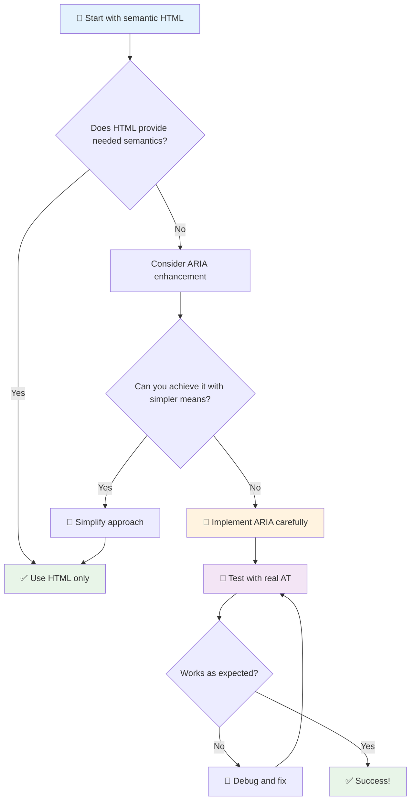

1. **Semantic HTML ကို ဦးစားပေးပါ**: `<button>` ကို `<div role="button">` ထက် အမြဲဦးစားပေးပါ
2. **Semantics ကို မဖျက်ဆီးပါနဲ့**: HTML ရဲ့ အဓိပ္ပါယ်ကို မဖျက်ဆီးပါနဲ့ (ဥပမာ `<h1 role="button">` ကို ရှောင်ပါ)
3. **Keyboard accessibility ကို ထိန်းသိမ်းပါ**: ARIA element တွေကို keyboard နဲ့ အပြည့်အဝ အသုံးပြုနိုင်ရမယ်
4. **အသုံးပြုသူတွေနဲ့ စမ်းသပ်ပါ**: ARIA support က assistive technologies တွေမှာ အလွန်ကွဲပြားပါတယ်
5. **ရိုးရှင်းစွာ စတင်ပါ**: ARIA implementation တွေ ရှုပ်ထွေးလာရင် အမှားဖြစ်နိုင်မှုများလာပါတယ်

**🔍 စမ်းသပ်မှုလုပ်ငန်းစဉ်:**

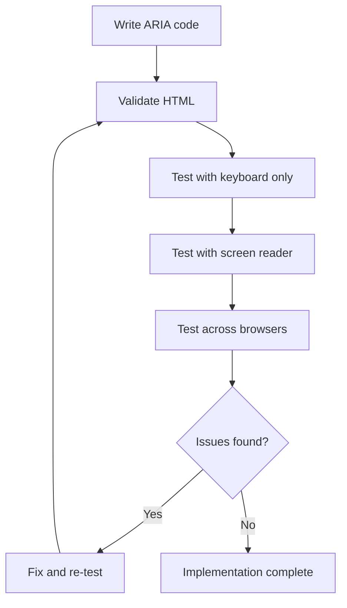

**🚫 ARIA အသုံးပြုမှုအမှားများကို ရှောင်ရှားပါ:**

- **အချက်အလက်များ မညီညွတ်မှု**: HTML semantics ကို မဆန့်ကျင်ပါနဲ့
- **အလွန်များသော labeling**: ARIA အချက်အလက်များ အလွန်များလွန်းရင် အသုံးပြုသူတွေကို အလွှမ်းမီစေပါဘူး
- **Static ARIA**: Content ပြောင်းလဲတဲ့အခါ ARIA states ကို မအပ်ဒိတ်ခြင်း
- **မစမ်းသပ်ထားသော implementation**: သီအိုရီအရ အလုပ်လုပ်ပေမယ့် အကောင်အထည်မဖော်နိုင်သော ARIA
- **Keyboard support မပါသော ARIA roles**: Keyboard interaction မပါသော ARIA roles

> 💡 **Testing Resources**: [accessibility-checker](https://www.npmjs.com/package/accessibility-checker) ကဲ့သို့သော tools တွေကို ARIA validation အတွက် အသုံးပြုပါ၊ ဒါပေမယ့် real screen readers နဲ့ အပြည့်အစုံ စမ်းသပ်ပါ။

### 🎭 **ARIA Skills Check: ရှုပ်ထွေးသော Interaction များအတွက် အသင့်ဖြစ်ပါသလား?**

**ARIA ကို နားလည်မှုကို တိုင်းတာပါ:**
- Semantic HTML ထက် ARIA ကို ဘယ်အချိန်မှာ ရွေးချယ်မလဲ? (အကြံပြုချက်: အလွန်ရှားပါး!)
- `<div role="button">` က `<button>` ထက် အဆိုးဖြစ်တဲ့အကြောင်းကို ရှင်းပြနိုင်ပါသလား?
- ARIA testing အတွက် အရေးကြီးဆုံးအချက်ကဘာလဲ?

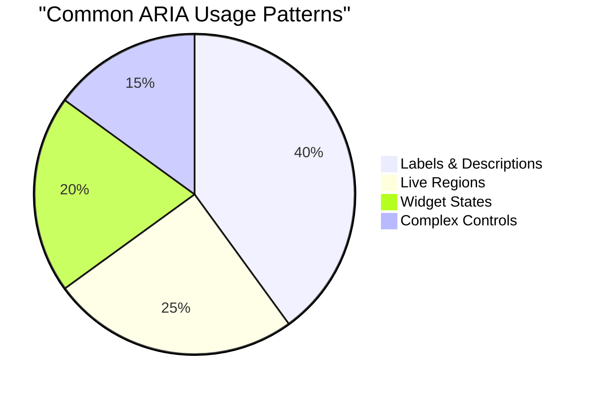

> **အဓိကအချက်**: ARIA ကို အများဆုံး အသုံးပြုတာက element တွေကို labeling နှင့် describing အတွက်ပါ။ ရှုပ်ထွေးတဲ့ widget patterns တွေက အလွန်ရှားပါးပါတယ်။

✅ **ကျွမ်းကျင်သူများထံမှ သင်ယူပါ**: [ARIA Authoring Practices Guide](https://w3c.github.io/aria-practices/) ကို လေ့လာပြီး ရှုပ်ထွေးတဲ့ interactive widgets တွေကို အကောင်းဆုံး အကောင်အထည်ဖော်နည်းများကို ရယူပါ။

## ပုံများနှင့် မီဒီယာများကို Accessible ဖြစ်စေရန်

မြင်သာသောနှင့် အသံအကြောင်းအရာများသည် ခေတ်သစ် web experience တွေမှာ အရေးကြီးသော အစိတ်အပိုင်းများဖြစ်ပေမယ့် သေချာစွာ အကောင်အထည်မဖော်ရင် အတားအဆီးများ ဖြစ်စေနိုင်ပါတယ်။ ရည်ရွယ်ချက်ကတော့ သတင်းအချက်အလက်နှင့် မီဒီယာရဲ့ စိတ်ခံစားမှုကို အသုံးပြုသူတိုင်းရောက်ရှိစေရန်ဖြစ်ပါတယ်။ အကောင်းဆုံးနည်းလမ်းတွေကို နားလည်ပြီးရင် အလွယ်တကူ အကျင့်အဖြစ် ရောက်လာနိုင်ပါတယ်။

မီဒီယာအမျိုးအစားတစ်ခုချင်းစီမှာ accessibility approach များကွဲပြားပါတယ်။ ဥပမာအားဖြင့် ငါးနုနုကို ချက်တဲ့နည်းနဲ့ အမဲသားကို ချက်တဲ့နည်းက မတူသလိုပါပဲ။ ဒီကွဲပြားမှုတွေကို နားလည်ခြင်းက သင့်အနေဖြင့် အခြေအနေတစ်ခုချင်းစီအတွက် အကောင်းဆုံးဖြေရှင်းနည်းကို ရွေးချယ်နိုင်စေပါတယ်။

### ပုံများကို Accessible ဖြစ်စေရန် မဟာဗျူဟာ

Website ရဲ့ ပုံတစ်ပုံချင်းစီမှာ ရည်ရွယ်ချက်ရှိပါတယ်။ ဒီရည်ရွယ်ချက်ကို နားလည်ခြင်းက alternative text ကို ပိုမိုကောင်းမွန်စွာ ရေးသားနိုင်စေပြီး ပိုမိုပါဝင်မှုရှိတဲ့ အတွေ့အကြုံတွေကို ဖန်တီးနိုင်စေပါတယ်။

**ပုံအမျိုးအစား ၄ မျိုးနှင့် alt text strategy များ:**

**Informative images** - အရေးကြီးသော အချက်အလက်ကို ဖော်ပြခြင်း:
```html

```

**Decorative images** - သာမန် visual ဖြစ်ပြီး အချက်အလက်မပါဝင်ခြင်း:
```html

```

**Functional images** - button သို့မဟုတ် control အဖြစ် အသုံးပြုခြင်း:
```html
<button>
  
</button>
```

**Complex images** - charts, diagrams, infographics:
```html

<div id="chart-description">
  <p>Detailed description: Sales data shows a steady increase across all quarters...</p>
</div>
```

### ဗီဒီယိုနှင့် အသံအကြောင်းအရာများကို Accessible ဖြစ်စေရန်

**ဗီဒီယိုအတွက် လိုအပ်ချက်များ:**
- **Captions**: ပြောဆိုသောအကြောင်းအရာနှင့် အသံအကျိုးသက်ရောက်မှုများ၏ စာသားဗားရှင်း
- **Audio descriptions**: မျက်မမြင်သူများအတွက် visual elements ကို ရှင်းပြသော narration
- **Transcripts**: Audio နှင့် visual content အားလုံး၏ စာသားဗားရှင်း

```html
<video controls>
  <source src="video.mp4" type="video/mp4">
  <track kind="captions" src="captions.vtt" srclang="en" label="English">
  <track kind="descriptions" src="descriptions.vtt" srclang="en" label="Audio descriptions">
</video>
```

**အသံအကြောင်းအရာအတွက် လိုအပ်ချက်များ:**
- **Transcripts**: ပြောဆိုသောအကြောင်းအရာအားလုံး၏ စာသားဗားရှင်း
- **Visual indicators**: Audio-only content အတွက် visual cues ပေးပါ

### ခေတ်သစ်ပုံနည်းလမ်းများ

**Decorative images အတွက် CSS အသုံးပြုခြင်း:**
```css
.hero-section {
  background-image: url('decorative-hero.jpg');
  /* Decorative images in CSS don't need alt text */
}
```

**Responsive images ကို accessibility ဖြင့် အသုံးပြုခြင်း:**
```html
<picture>
  <source media="(min-width: 800px)" srcset="large-chart.png">
  <source media="(min-width: 400px)" srcset="medium-chart.png">
  
</picture>
```

✅ **ပုံများကို Accessible ဖြစ်စေရန် စမ်းသပ်ပါ**: Screen reader ကို အသုံးပြုပြီး ပုံများပါဝင်သော page ကို navigation လုပ်ပါ။ Content ကို နားလည်ဖို့ လုံလောက်တဲ့အချက်အလက်ရရှိပါသလား?

## Keyboard navigation နှင့် focus management

အသုံးပြုသူများအနက် တစ်ချို့က keyboard ကိုသာ အသုံးပြုပြီး web ကို navigation လုပ်ကြပါတယ်။ ဒီအထဲမှာ motor disabilities ရှိသူများ၊ mouse ထက် keyboard ကို ပိုမြန်တယ်လို့ ယုံကြည်သူများ၊ သို့မဟုတ် mouse ပျက်သွားသူများ ပါဝင်ပါတယ်။ သင့် site က keyboard input နဲ့ အလုပ်လုပ်နိုင်ဖို့ သေချာစေခြင်းက အရေးကြီးပြီး အားလုံးအတွက် ပိုမိုထိရောက်တဲ့ site ဖြစ်စေပါတယ်။

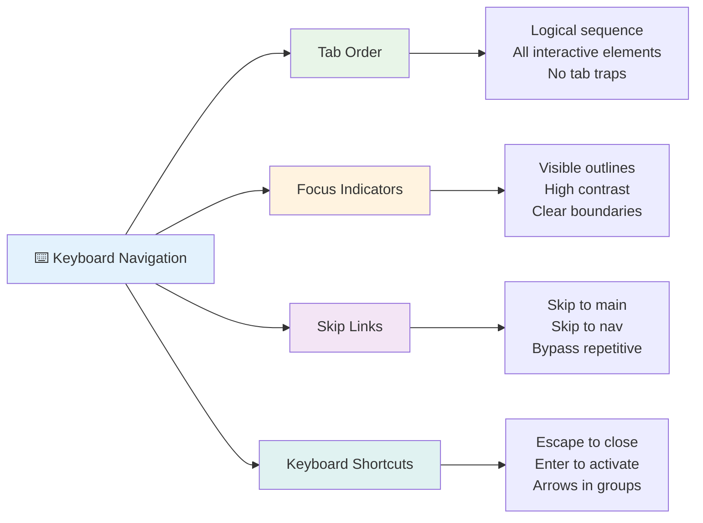

### Keyboard navigation patterns အရေးကြီးများ

**Standard keyboard interactions:**
- **Tab**: Interactive elements တွေကို အရှေ့သို့ focus ပြောင်းပါ
- **Shift + Tab**: အနောက်သို့ focus ပြောင်းပါ
- **Enter**: Button နှင့် link တွေကို activate လုပ်ပါ
- **Space**: Button တွေကို activate လုပ်ပါ၊ checkbox တွေကို check လုပ်ပါ
- **Arrow keys**: Component group တွေ (radio buttons, menus) အတွင်းမှာ navigation လုပ်ပါ
- **Escape**: Modal, dropdowns ကို ပိတ်ပါ သို့မဟုတ် operation ကို cancel လုပ်ပါ

### Focus management အကောင်းဆုံးနည်းလမ်းများ

**Visible focus indicators:**
```css
/* Ensure focus is always visible */
button:focus-visible {
  outline: 2px solid #4A90A4;
  outline-offset: 2px;
}

/* Custom focus styles for different components */
.card:focus-within {
  box-shadow: 0 0 0 3px rgba(74, 144, 164, 0.5);
}
```

**Efficient navigation အတွက် Skip links:**
```html
<a href="#main-content" class="skip-link">Skip to main content</a>
<a href="#navigation" class="skip-link">Skip to navigation</a>

<nav id="navigation">
  <!-- navigation content -->
</nav>
<main id="main-content">
  <!-- main content -->
</main>
```

**Proper tab order:**
```html
<!-- Use semantic HTML for natural tab order -->
<form>
  <label for="name">Name:</label>
  <input type="text" id="name" tabindex="0">
  
  <label for="email">Email:</label>
  <input type="email" id="email" tabindex="0">
  
  <button type="submit" tabindex="0">Submit</button>
</form>
```

### Modal တွေမှာ focus trapping

Modal dialogs ကို ဖွင့်တဲ့အခါ focus ကို modal အတွင်းမှာပဲ ထိန်းသိမ်းထားရမယ်:

```javascript
// Modern focus trap implementation
function trapFocus(element) {
  const focusableElements = element.querySelectorAll(
    'button, [href], input, select, textarea, [tabindex]:not([tabindex="-1"])'
  );
  
  const firstElement = focusableElements[0];
  const lastElement = focusableElements[focusableElements.length - 1];

  element.addEventListener('keydown', (e) => {
    if (e.key === 'Tab') {
      if (e.shiftKey && document.activeElement === firstElement) {
        e.preventDefault();
        lastElement.focus();
      } else if (!e.shiftKey && document.activeElement === lastElement) {
        e.preventDefault();
        firstElement.focus();
      }
    }
    
    if (e.key === 'Escape') {
      closeModal();
    }
  });
  
  // Focus first element when modal opens
  firstElement.focus();
}
```

✅ **Keyboard navigation ကို စမ်းသပ်ပါ**: Tab key ကိုသာ အသုံးပြုပြီး သင့် website ကို navigation လုပ်ကြည့်ပါ။ Interactive elements အားလုံးကို ရောက်ရှိနိုင်ပါသလား? Focus order က logical ဖြစ်ပါသလား? Focus indicators တွေ ရှင်းလင်းမြင်သာပါသလား?

## Form accessibility

Form တွေက အသုံးပြုသူ interaction အတွက် အရေးကြီးပြီး accessibility အတွက် အထူးဂရုစိုက်ဖို့ လိုအပ်ပါတယ်။

### Label နှင့် form control အချိတ်အဆက်

**Form control တစ်ခုချင်းစီမှာ label လိုအပ်ပါတယ်:**
```html
<!-- Explicit labeling (preferred) -->
<label for="username">Username:</label>
<input type="text" id="username" name="username" required>

<!-- Implicit labeling -->
<label>
  Password:
  <input type="password" name="password" required>
</label>

<!-- Using aria-label when visual label isn't desired -->
<input type="search" aria-label="Search products" placeholder="Search...">
```

### Error handling နှင့် validation

**Accessible error messages:**
```html
<label for="email">Email Address:</label>
<input type="email" id="email" name="email" 
       aria-describedby="email-error" 
       aria-invalid="true" required>
<div id="email-error" role="alert">
  Please enter a valid email address
</div>
```

**Form validation အကောင်းဆုံးနည်းလမ်းများ:**
- `aria-invalid` ကို အသုံးပြုပြီး invalid fields ကို ဖော်ပြပါ
- ရှင်းလင်းပြီး သေချာတဲ့ error messages ပေးပါ
- အရေးကြီးတဲ့ error ကြေညာချက်များအတွက် `role="alert"` ကို အသုံးပြုပါ
- Error တွေကို form submit လုပ်တဲ့အခါမှာပဲမဟုတ်ပဲ ချက်ချင်းပြပါ

### Fieldsets နှင့် grouping

**Form control တွေကို အုပ်စုဖွဲ့ပါ:**
```html
<fieldset>
  <legend>Shipping Address</legend>
  <label for="street">Street Address:</label>
  <input type="text" id="street" name="street">
  
  <label for="city">City:</label>
  <input type="text" id="city" name="city">
</fieldset>

<fieldset>
  <legend>Preferred Contact Method</legend>
  <input type="radio" id="contact-email" name="contact" value="email">
  <label for="contact-email">Email</label>
  
  <input type="radio" id="contact-phone" name="contact" value="phone">
  <label for="contact-phone">Phone</label>
</fieldset>
```

## သင့် Accessibility ခရီး: အဓိကအချက်များ

ဂုဏ်ယူပါတယ်! သင့်အနေနဲ့ အားလုံးပါဝင်နိုင်တဲ့ web experience တွေကို ဖန်တီးနိုင်ဖို့ အခြေခံအသိပညာတွေ ရရှိပြီးပါပြီ။ ဒါက အလွန်စိတ်လှုပ်ရှားစရာကောင်းတဲ့အရာပါ! Web accessibility က compliance box တွေကို check လုပ်ဖို့အတွက်သာမဟုတ်ပါဘူး—လူတွေက digital content ကို interact လုပ်တဲ့ နည်းလမ်းတွေကွဲပြားမှုကို အသိအမှတ်ပြုပြီး ဒီအံ့ဖွယ်ကောင်းတဲ့ diversity အတွက် design လုပ်ဖို့အရေးပါပါတယ်။

အခု သင့်အနေနဲ့ digital content ကို interact လုပ်တဲ့ လူတွေကို နားလည်ပြီး design လုပ်တတ်တဲ့ developer တွေရဲ့ growing community မှာ ပါဝင်နေပါပြီ။ Club မှာ ကြိုဆိုပါတယ်!

**🎯 သင့် accessibility toolkit မှာ အခုပါဝင်ပြီးသားတွေ:**

| Core Principle | Implementation | Impact |
|----------------|----------------|---------|
| **Semantic HTML Foundation** | HTML elements တွေကို ရည်ရွယ်ချက်အတိုင်း အသုံးပြုပါ | Screen readers တွေက အလွယ်တကူ navigation လုပ်နိုင်ပြီး keyboard တွေ အလိုအလျောက် အလုပ်လုပ်နိုင်ပါတယ် |
| **Inclusive Visual Design** | Contrast လုံလောက်မှု၊ အဓိပ္ပါယ်ရှိတဲ့ အရောင်အသုံးပြုမှု၊ မြင်သာတဲ့ focus indicators | အလင်းအခြေအနေမည်သည့်အချိန်တွင်မဆို အားလုံးအတွက် ရှင်းလင်းမြင်သာမှုရှိပါတယ် |
| **Descriptive Content** | အဓိပ္ပါယ်ရှိတဲ့ link text, alt text, headings | Visual context မပါဘဲ content ကို အသုံးပြုသူတွေ နားလည်နိုင်ပါတယ် |
| **Keyboard Accessibility** | Tab order, keyboard shortcuts, focus management | Motor accessibility နှင့် power user efficiency |
| **ARIA Enhancement** | Semantic gaps တွေကို ဖြည့်ဖို့ အကောင်းဆုံးအသုံးပြုပါ | Complex applications တွေ assistive technologies နဲ့ အလုပ်လုပ်နိုင်ပါတယ် |
| **Comprehensive Testing** | Automated tools + manual verification + real user testing | အသုံးပြုသူတွေကို အကျိုးသက်ရောက်မယ့် အခါမှာ အမှားတွေကို ဖမ်းဆီးနိုင်ပါတယ် |

**🚀 သင့်အနာဂတ်အတွက် နောက်ထပ်အဆင့်များ:**

1. **Accessibility ကို workflow အတွင်းထည့်ပါ**: Testing ကို development process ရဲ့ အစိတ်အပိုင်းတစ်ခုအဖြစ် သဘာဝကျစွာလုပ်ပါ
2. **Real users ထံမှ သင်ယူပါ**: Assistive technologies အသုံးပြုသူများထံမှ feedback ရယူပါ
3. **လက်ရှိနည်းလမ်းများကို လိုက်နာပါ**: Accessibility techniques တွေက နည်းပညာအသစ်တွေနဲ့ standards အသစ်တွေနဲ့အတူ တိုးတက်နေပါတယ်
4. **Inclusion အတွက် advocate လုပ်ပါ**: သင့်အသိပညာကို မျှဝေပြီး accessibility ကို အဖွဲ့အစည်းရဲ့ priority ဖြစ်စေပါ

> 💡 **သတိပြုပါ**: Accessibility constraints တွေက အားလုံးအတွက် အကျိုးရှိတဲ့ innovative, elegant solutions တွေကို ဖန်တီးစေပါတယ်။ Curb cuts, captions, voice controls တွေက accessibility features အဖြစ် စတင်ခဲ့ပြီး mainstream improvements ဖြစ်လာခဲ့ပါတယ်။

**စီးပွားရေးအတွက် အကျိုးကျေးဇူးက ရှင်းလင်းပါတယ်**: Accessible websites တွေက အသုံးပြုသူများပိုရောက်ရှိပြီး၊ search engines မှာ ပိုမိုကောင်းမွန်စွာ rank ရရှိပြီး၊ ထိန်းသိမ်းမှုကုန်ကျစရိတ်နည်းပြီး၊ တရားဥပဒေဆိုင်ရာအန္တရာယ်များကို ရှောင်ရှားနိုင်ပါတယ်။ ဒါပေမယ့် အမှန်တကယ် အရေးကြီးတဲ့အကြောင်းက ပိုမိုနက်ရှိုင်းပါတယ်။ Accessible websites တွေက web ရဲ့ အကောင်းဆုံးတန်ဖိုးတွေ—openness, inclusivity, နှင့် လူတိုင်းအတွက် သတင်းအချက်အလက်ရရှိခွင့်ကို အတိအကျဖော်ပြပါတယ်။

သင့်အနေနဲ့ အနာဂတ်ရဲ့ inclusive web ကို ဖန်တီးနိုင်ဖို့ အသင့်ဖြစ်နေပါပြီ။ သင့်အနေနဲ့ ဖန်တီးတဲ့ accessible site တစ်ခုချင်းစီက internet ကို လူတိုင်းအတွက် ပိုမိုကြိုဆိုဖွယ်ကောင်းတဲ့နေရာဖြစ်စေပါတယ်။ ဒီအကြောင်းကို စဉ်းစားကြည့်ရင် အလွန်အံ့ဩစရာကောင်းပါတယ်!

## အပိုဆောင်းရင်းမြစ်များ

သင့် accessibility သင်ယူမှုခရီးကို ဒီအရေးကြီးသော resources များနှင့် ဆက်လက်တိုးတက်စေပါ:

**📚 တရားဝင် Standards နှင့် Guidelines:**
- [WCAG 2.1 Guidelines](https://www.w3.org/WAI/WCAG21/quickref/) - အတိအကျ reference ပါဝင်သော တရားဝင် accessibility standard
- [ARIA Authoring Practices Guide](https://w3c.github.io/aria-practices/) - Interactive widgets အတွက် အပြည့်အစုံ patterns
- [WebAIM Guidelines](https://webaim.org/) - Practical, beginner-friendly accessibility guidance

**🛠️ Tools နှင့် Testing Resources:**
- [axe DevTools](https://www.deque.com/axe/devtools/) - စက်မှုလုပ်ငန်း-standard accessibility testing
- [A11y Project Checklist](https://www.a11yproject.com/checklist/) - Accessibility verification အဆင့်ဆင့်
- [Accessibility Insights](https://accessibility
- [ ] ၅ ခုသော ရှုပ်ထွေးသော ဝက်ဘ်ဆိုဒ်များတွင် ကီးဘုတ်ဖြင့် လှုပ်ရှားမှုကို လေ့ကျင့်ပါ။
- [ ] သင့်တော်သော label များ၊ error ကိုင်တွယ်မှုနှင့် ARIA ပါဝင်သော ရိုးရှင်းသော form တစ်ခု တည်ဆောက်ပါ။
- [ ] အနားလွှာမရှိသူများအတွက် community တစ်ခု (A11y Slack, WebAIM forum) တွင် ပါဝင်ပါ။
- [ ] မသန်စွမ်းသူများသည် ဝက်ဘ်ဆိုဒ်များကို လှုပ်ရှားသုံးစွဲပုံကို ကြည့်ရှုပါ (YouTube တွင် အလွန်ကောင်းသော ဥပမာများ ရှိသည်)။

### 🌟 **သင့်လစဉ် ပြောင်းလဲမှု**
- [ ] သင့်တိုးတက်မှုလုပ်ငန်းစဉ်တွင် accessibility စမ်းသပ်မှုကို ပေါင်းစပ်ပါ။
- [ ] accessibility ပြဿနာများကို ဖြေရှင်းခြင်းဖြင့် open source project တစ်ခုတွင် ပါဝင်ပါ။
- [ ] assistive technology ကို အသုံးပြုသူတစ်ဦးနှင့် usability စမ်းသပ်မှု ပြုလုပ်ပါ။
- [ ] သင့်အဖွဲ့အတွက် accessible component library တစ်ခု တည်ဆောက်ပါ။
- [ ] သင့်အလုပ်နေရာ သို့မဟုတ် community တွင် accessibility အတွက် လှုပ်ရှားမှု ပြုလုပ်ပါ။
- [ ] accessibility အယူအဆများကို အသစ်တစ်ခုကို သင်ကြားပေးပါ။

### 🏆 **နောက်ဆုံး Accessibility Champion စစ်ဆေးမှု**

**သင့် accessibility ခရီးကို ကျေးဇူးတင်ပါ:**
- လူများသည် ဝက်ဘ်ကို အသုံးပြုပုံအကြောင်း အံ့ဩစရာအရာတစ်ခုက ဘာလဲ?
- သင့်တိုးတက်မှုစတိုင်နှင့် အတူတူသော accessibility အခြေခံအချက်က ဘာလဲ?
- accessibility အကြောင်းကို သင်ယူခြင်းက ဒီဇိုင်းအပေါ် သင့်အမြင်ကို ဘယ်လိုပြောင်းလဲစေခဲ့သလဲ?
- အမှန်တကယ် project တစ်ခုတွင် accessibility တိုးတက်မှုကို ပထမဆုံး ဘာလုပ်ချင်သလဲ?

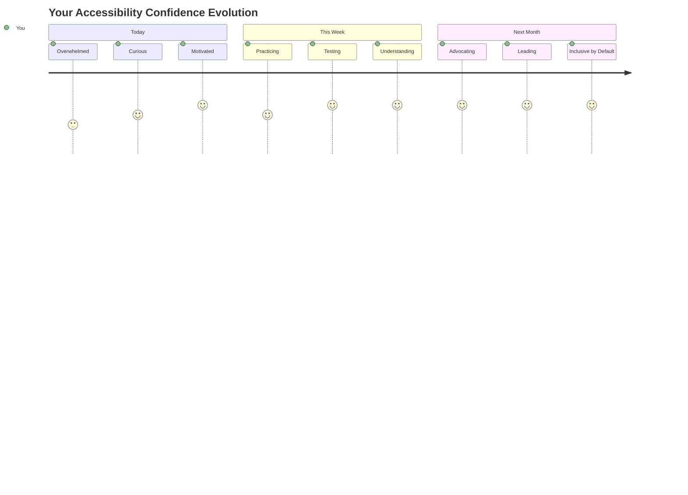

> 🌍 **သင်သည် အခု accessibility champion ဖြစ်ပါပြီ!** လူတိုင်းသည် ဝက်ဘ်ကို ဘယ်လိုအသုံးပြုမည်ဆိုသည်ကို မထီမှီဘဲ အကောင်းဆုံး ဝက်ဘ်အတွေ့အကြုံများကို ဖန်တီးနိုင်သည်။ သင်တည်ဆောက်သော accessible feature တစ်ခုစီသည် အင်တာနက်ကို ပိုမိုပါဝင်မှုရှိစေသည်။ accessibility ကို အကန့်အသတ်မဟုတ်ဘဲ အားလုံးအတွက် ပိုမိုကောင်းမွန်သော အတွေ့အကြုံများ ဖန်တီးရန် အခွင့်အရေးအဖြစ် မြင်နိုင်သော developer များကို ဝက်ဘ်က လိုအပ်နေသည်။ လှုပ်ရှားမှုတွင် ကြိုဆိုပါသည်! 🎉

---

**အကြောင်းကြားချက်**:  
ဤစာရွက်စာတမ်းကို AI ဘာသာပြန်ဝန်ဆောင်မှု [Co-op Translator](https://github.com/Azure/co-op-translator) ကို အသုံးပြု၍ ဘာသာပြန်ထားပါသည်။ ကျွန်ုပ်တို့သည် တိကျမှုအတွက် ကြိုးစားနေသော်လည်း အလိုအလျောက် ဘာသာပြန်မှုများတွင် အမှားများ သို့မဟုတ် မတိကျမှုများ ပါဝင်နိုင်သည်ကို သတိပြုပါ။ မူရင်းဘာသာစကားဖြင့် ရေးသားထားသော စာရွက်စာတမ်းကို အာဏာတရ အရင်းအမြစ်အဖြစ် သတ်မှတ်သင့်ပါသည်။ အရေးကြီးသော အချက်အလက်များအတွက် လူ့ဘာသာပြန်ပညာရှင်များကို အသုံးပြုရန် အကြံပြုပါသည်။ ဤဘာသာပြန်မှုကို အသုံးပြုခြင်းမှ ဖြစ်ပေါ်လာသော အလွဲအမှားများ သို့မဟုတ် အနားလွဲမှုများအတွက် ကျွန်ုပ်တို့သည် တာဝန်မယူပါ။