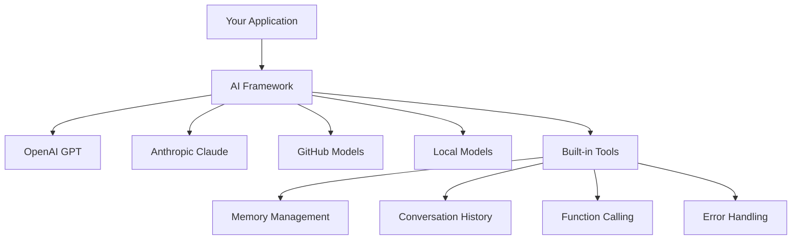
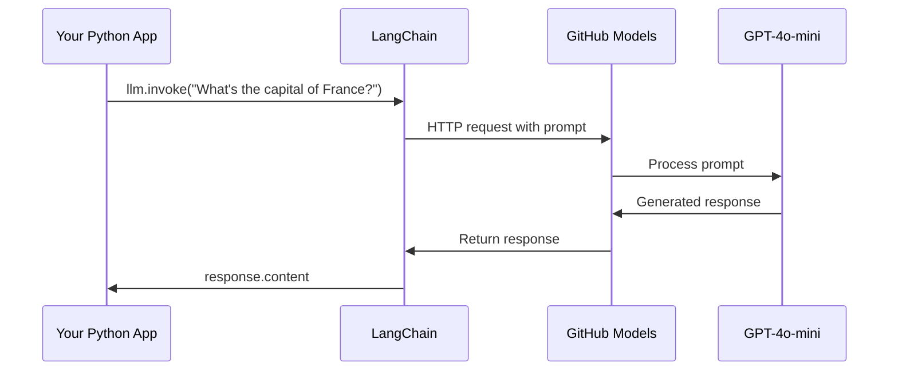
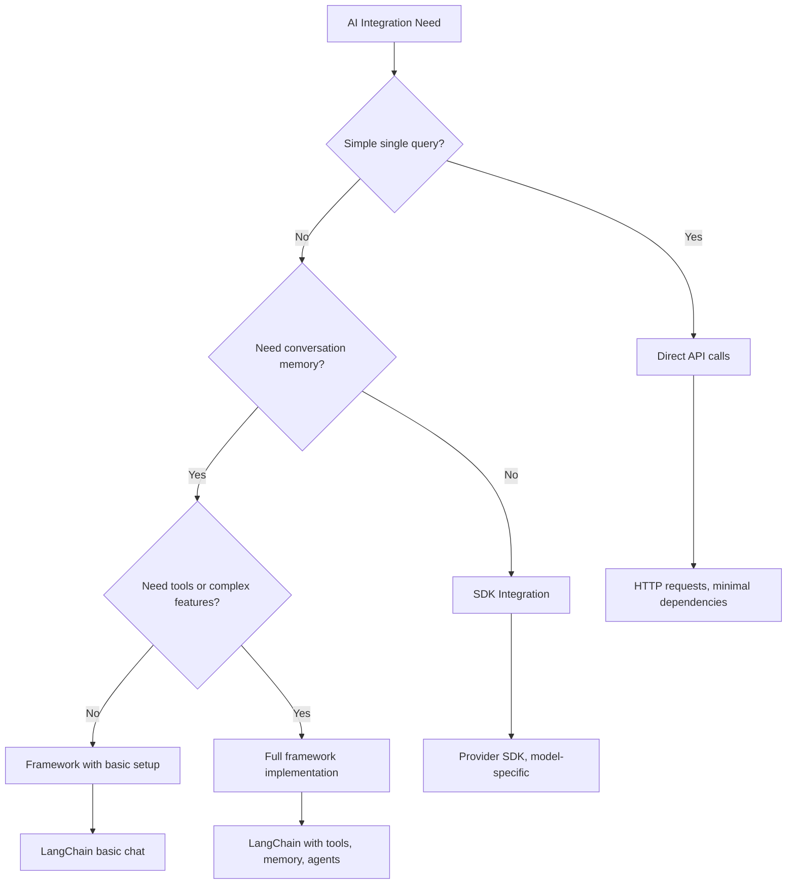

<!--
CO_OP_TRANSLATOR_METADATA:
{
  "original_hash": "e2c4ae5688e34b4b8b09d52aec56c79e",
  "translation_date": "2025-10-24T16:26:04+00:00",
  "source_file": "10-ai-framework-project/README.md",
  "language_code": "my"
}
-->
# AI Framework

AI အက်ပလီကေးရှင်းတွေကို အစမှစပြီး တည်ဆောက်ဖို့ ကြိုးစားရင်း စိတ်ပျက်ခဲ့ဖူးပါသလား? သင်တစ်ယောက်တည်းမဟုတ်ပါဘူး! AI Frameworks တွေက AI တိုးတက်မှုအတွက် အရမ်းအသုံးဝင်တဲ့ ကိရိယာတွေဖြစ်ပြီး အချိန်ကုန်သက်သာစေပြီး စိတ်ပျက်စရာတွေကိုလည်း လျော့ကျစေပါတယ်။ AI Framework ကို စနစ်တကျ စီမံထားတဲ့ စာကြည့်တိုက်တစ်ခုလိုပဲ ထင်ပါ။ ဒါဟာ အစိတ်အပိုင်းတွေ၊ စံသတ်မှတ်ထားတဲ့ API တွေ၊ အဆင်ပြေတဲ့ အကြောင်းအရာတွေကို ပေးစွမ်းပြီး သင်ရဲ့ ပြဿနာတွေကို ဖြေရှင်းဖို့ အာရုံစိုက်နိုင်အောင် Implementation အချက်အလက်တွေကို မရုန်းမနှိုင်းဖြစ်စေပါဘူး။

ဒီသင်ခန်းစာမှာ LangChain လို Frameworks တွေက အရင်က ရှုပ်ထွေးတဲ့ AI ပေါင်းစည်းမှု အလုပ်တွေကို သန့်ရှင်းပြီး ဖတ်ရှုရလွယ်တဲ့ ကုဒ်အဖြစ် ပြောင်းလဲပေးနိုင်ပုံကို လေ့လာပါမယ်။ စကားဝိုင်းတွေကို မှတ်တမ်းတင်ခြင်း၊ ကိရိယာခေါ်ဆိုမှုကို အကောင်အထည်ဖော်ခြင်း၊ AI မော်ဒယ်အမျိုးမျိုးကို တစ်ခုတည်းသော Interface မှတစ်ဆင့် စီမံခြင်းလို အကိန်းအနက်တွေကို ဖြေရှင်းပုံကို ရှာဖွေတွေ့ရှိပါမယ်။

ဒီသင်ခန်းစာပြီးဆုံးတဲ့အခါ Frameworks တွေကို API ခေါ်ဆိုမှုတွေထက် ဘယ်အချိန်မှာ အသုံးပြုရမလဲ၊ အကြောင်းအရာတွေကို ထိရောက်စွာ အသုံးချပုံ၊ နောက်ဆုံးမှာတော့ အမှန်တကယ် အသုံးချနိုင်တဲ့ AI အက်ပလီကေးရှင်းတွေကို တည်ဆောက်ပုံကို သိရှိလာပါလိမ့်မယ်။ သင့်ရဲ့ Project တွေမှာ AI Frameworks တွေ ဘာတွေ လုပ်ဆောင်ပေးနိုင်မလဲဆိုတာကို ရှာဖွေကြည့်ရအောင်။

## Framework ကို ဘာကြောင့် ရွေးချယ်သင့်သလဲ?

AI အက်ပလီကေးရှင်းတစ်ခုကို တည်ဆောက်ဖို့ ပြင်ဆင်နေပြီဆိုတာ အရမ်းကောင်းပါတယ်! ဒါပေမယ့် သင့်မှာ လမ်းကြောင်းအမျိုးမျိုး ရွေးချယ်နိုင်ပြီး တစ်ခုချင်းစီမှာ အကျိုးကျေးဇူးနဲ့ အားနည်းချက်တွေ ရှိပါတယ်။ လမ်းလျှောက်တာ၊ စက်ဘီးစီးတာ၊ ကားမောင်းတာတို့ကို ရွေးချယ်တာလိုပဲ - အားလုံးက သင့်ကို ရောက်စေမယ်၊ ဒါပေမယ့် အတွေ့အကြုံ (နဲ့ ကြိုးစားမှု) က အတော်လေး ကွဲပြားနေမှာပါ။

AI ကို သင့် Project တွေမှာ ပေါင်းစည်းဖို့ လမ်းလျှောက်နည်း ၃ မျိုးကို ခွဲခြားကြည့်ရအောင်-

| လမ်းလျှောက်နည်း | အကျိုးကျေးဇူး | အကောင်းဆုံး အသုံးပြုမှု | စဉ်းစားစရာ |
|------------------|----------------|--------------------------|--------------|
| **Direct HTTP Requests** | အပြည့်အဝ ထိန်းချုပ်မှု၊ အခြားအရာမလိုအပ် | ရိုးရှင်းတဲ့ မေးခွန်းတွေ၊ အခြေခံကို သင်ယူခြင်း | ကုဒ်များများရေးရ၊ အမှားကို ကိုယ်တိုင်ထိန်းချုပ်ရ |
| **SDK Integration** | ကုဒ်များများ မလိုအပ်၊ မော်ဒယ်အထူးပြု အဆင်ပြေမှု | တစ်ခုတည်းသော မော်ဒယ်အက်ပလီကေးရှင်း | Provider အတိအကျကိုသာ သက်ဆိုင် |
| **AI Frameworks** | Unified API, built-in abstractions | မော်ဒယ်အမျိုးမျိုးပါ Apps, ရှုပ်ထွေးတဲ့ Workflow | သင်ယူရခက်မှု၊ အလွန်အမင်း အကြောင်းအရာဖုံးလွှမ်းမှု |

### Framework အသုံးပြုမှု အကျိုးကျေးဇူး



**Frameworks အရေးကြီးတဲ့အကြောင်း:**
- **Unified** API တစ်ခုတည်းမှ AI Providers အမျိုးမျိုးကို ပေါင်းစည်းပေးနိုင်ခြင်း
- **Conversation memory** ကို အလိုအလျောက် စီမံပေးခြင်း
- **Embeddings နဲ့ function calling** လို အလုပ်တွေကို အဆင်ပြေတဲ့ ကိရိယာတွေ ပေးခြင်း
- **Error handling နဲ့ retry logic** ကို စီမံပေးခြင်း
- **ရှုပ်ထွေးတဲ့ Workflow တွေကို** ဖတ်ရှုရလွယ်တဲ့ Method Calls အဖြစ် ပြောင်းလဲပေးခြင်း

> 💡 **Pro Tip**: Frameworks တွေကို မော်ဒယ်အမျိုးမျိုးကို ပြောင်းလဲအသုံးပြုတဲ့အခါ သို့မဟုတ် Agent, Memory, Tool Calling လို ရှုပ်ထွေးတဲ့ Feature တွေ တည်ဆောက်တဲ့အခါ အသုံးပြုပါ။ အခြေခံတွေကို သင်ယူတဲ့အခါ သို့မဟုတ် ရိုးရှင်းတဲ့ အက်ပလီကေးရှင်းတွေ တည်ဆောက်တဲ့အခါ Direct APIs တွေကို အသုံးပြုပါ။

**အကျိုးကျေးဇူး**: Craftsman ရဲ့ အထူးပြု Tools တွေနဲ့ အပြည့်အစုံ Workshop တစ်ခုကို ရွေးချယ်တာလိုပဲ Tool ကို Task နဲ့ ကိုက်ညီအောင် ရွေးချယ်တာပါ။ Frameworks တွေက ရှုပ်ထွေးပြီး Feature-rich Applications တွေအတွက် အထူးကောင်းပြီး Direct APIs တွေက ရိုးရှင်းတဲ့ Use Cases တွေအတွက် အထူးကောင်းပါတယ်။

## အကျဉ်းချုပ်

ဒီသင်ခန်းစာမှာ သင်လေ့လာရမှာက-

- AI Framework တစ်ခုကို အသုံးပြုပုံ
- Chat Conversations, Tool Usage, Memory နဲ့ Context လို အခြေခံပြဿနာတွေကို ဖြေရှင်းပုံ
- AI Apps တည်ဆောက်ဖို့ ဒီအရာတွေကို အသုံးချပုံ

## သင့်ရဲ့ ပထမဆုံး AI Prompt

မေးခွန်းတစ်ခုကို ပို့ပြီး အဖြေကို ပြန်ရတဲ့ ပထမဆုံး AI Application ကို တည်ဆောက်ခြင်းဖြင့် အခြေခံတွေကို စတင်ကြရအောင်။ Archimedes က သူ့ရေချိုးကန်ထဲမှာ Displacement Principle ကို ရှာဖွေတွေ့ရှိခဲ့သလို အရမ်းရိုးရှင်းတဲ့ အမြင်တွေက အရမ်းအစွမ်းထက်တဲ့ အမြင်တွေကို ဖြစ်ပေါ်စေတတ်ပါတယ် - Frameworks တွေက ဒီအမြင်တွေကို ရရှိနိုင်အောင် လွယ်ကူစေပါတယ်။

### LangChain ကို GitHub Models နဲ့ တပ်ဆင်ခြင်း

LangChain ကို GitHub Models နဲ့ ချိတ်ဆက်ဖို့ သုံးပါမယ်။ ဒါက အရမ်းကောင်းပါတယ်၊ အကြောင်းကတော့ AI Models အမျိုးမျိုးကို အခမဲ့ အသုံးပြုခွင့်ရစေပါတယ်။ အကောင်းဆုံးကတော့ စတင်ဖို့အတွက် Configuration Parameters အနည်းငယ်ပဲ လိုပါတယ်-

```python
from langchain_openai import ChatOpenAI
import os

llm = ChatOpenAI(
    api_key=os.environ["GITHUB_TOKEN"],
    base_url="https://models.github.ai/inference",
    model="openai/gpt-4o-mini",
)

# Send a simple prompt
response = llm.invoke("What's the capital of France?")
print(response.content)
```

**ဒီမှာ ဘာတွေဖြစ်နေသလဲဆိုတာကို ခွဲခြားကြည့်ရအောင်:**
- **LangChain client** ကို `ChatOpenAI` class ကို အသုံးပြုပြီး ဖန်တီးခြင်း - ဒါက သင့်ရဲ့ AI ကို ချိတ်ဆက်ဖို့ Gateway ဖြစ်ပါတယ်!
- **GitHub Models** ကို သင့် Authentication Token နဲ့ ချိတ်ဆက်ပေးခြင်း
- **AI Model** ကို သတ်မှတ်ပေးခြင်း (`gpt-4o-mini`) - ဒါကို သင့်ရဲ့ AI အကူအညီပေးသူကို ရွေးချယ်တာလိုပဲ ထင်ပါ။
- **invoke() method** ကို အသုံးပြုပြီး မေးခွန်းကို ပို့ခြင်း - ဒီမှာပဲ အံ့ဩစရာတွေ ဖြစ်ပေါ်ပါတယ်
- **Response ကို** ထုတ်ယူပြီး ပြသခြင်း - Voilà, သင် AI နဲ့ စကားပြောနေပါပြီ!

> 🔧 **Setup Note**: GitHub Codespaces ကို အသုံးပြုနေတယ်ဆိုရင် သင့်အတွက် ကံကောင်းပါတယ် - `GITHUB_TOKEN` ကို အလိုအလျောက် Set လုပ်ထားပါတယ်! Local မှာ အလုပ်လုပ်နေရင်လည်း စိတ်မပူပါနဲ့ - Personal Access Token ကို သင့်အတွက် လိုအပ်တဲ့ Permissions နဲ့ ဖန်တီးရုံပါ။

**မျှော်လင့်ရတဲ့ Output:**
```text
The capital of France is Paris.
```




## Conversational AI တည်ဆောက်ခြင်း

ပထမဆုံး ဥပမာက အခြေခံတွေကို ပြသပေမယ့် ဒါဟာ Single Exchange တစ်ခုသာဖြစ်ပါတယ် - သင် မေးခွန်းတစ်ခု မေးပြီး အဖြေတစ်ခု ရရှိတာပါ။ အမှန်တကယ် အက်ပလီကေးရှင်းတွေမှာ Watson နဲ့ Holmes တို့လို စကားဝိုင်းတွေကို အချိန်ကြာကြာ တည်ဆောက်နိုင်ဖို့ သင့် AI က သင့်ရဲ့ စကားဝိုင်းတွေကို မှတ်မိဖို့ လိုပါတယ်။

ဒီမှာ LangChain က အရမ်းအသုံးဝင်ပါတယ်။ ဒါဟာ စကားဝိုင်းတွေကို ဖွဲ့စည်းဖို့ message types အမျိုးမျိုးကို ပေးပြီး သင့် AI ကို personality ပေးနိုင်စေပါတယ်။ Context နဲ့ Character ကို ထိန်းသိမ်းထားတဲ့ Chat Experience တွေကို သင် တည်ဆောက်နိုင်ပါမယ်။

### Message Types ကို နားလည်ခြင်း

Message Types တွေကို စကားဝိုင်းမှာ ပါဝင်သူတွေ ဝတ်ဆင်ထားတဲ့ "ဦးထုပ်" အမျိုးမျိုးလို ထင်ပါ။ LangChain က Message Classes အမျိုးမျိုးကို အသုံးပြုပြီး ဘယ်သူက ဘာပြောနေလဲဆိုတာကို မှတ်တမ်းတင်ထားပါတယ်-

| Message Type | ရည်ရွယ်ချက် | ဥပမာ အသုံးပြုမှု |
|--------------|-------------|------------------|
| `SystemMessage` | AI ရဲ့ Personality နဲ့ Behavior ကို သတ်မှတ်ပေးခြင်း | "သင်က coding အကူအညီပေးသူတစ်ဦးဖြစ်ပါတယ်" |
| `HumanMessage` | User Input ကို ကိုယ်စားပြု | "Function တွေ ဘယ်လိုအလုပ်လုပ်လဲ ရှင်းပြပါ" |
| `AIMessage` | AI ရဲ့ အဖြေတွေကို သိမ်းဆည်း | စကားဝိုင်းထဲက AI ရဲ့ အရင်အဖြေတွေ |

### ပထမဆုံး စကားဝိုင်းတစ်ခုကို ဖန်တီးခြင်း

AI ကို အထူးသက်သက်ရှိတဲ့ အခန်းကဏ္ဍတစ်ခုကို ယူစေတဲ့ စကားဝိုင်းတစ်ခုကို ဖန်တီးကြရအောင်။ AI ကို Captain Picard - သူ့ရဲ့ သံတမန်ဆန်တဲ့ ဉာဏ်နဲ့ ခေါင်းဆောင်မှုအရည်အချင်းတွေကို ကိုယ်စားပြုစေပါမယ်-

```python
messages = [
    SystemMessage(content="You are Captain Picard of the Starship Enterprise"),
    HumanMessage(content="Tell me about you"),
]
```

**ဒီစကားဝိုင်း Setup ကို ခွဲခြားကြည့်ရအောင်:**
- **AI ရဲ့ Role နဲ့ Personality ကို** `SystemMessage` မှတစ်ဆင့် သတ်မှတ်ပေးခြင်း
- **User ရဲ့ မေးခွန်းကို** `HumanMessage` မှတစ်ဆင့် ပေးပို့ခြင်း
- **Multi-turn Conversation** အတွက် အခြေခံကို ဖန်တီးပေးခြင်း

ဒီဥပမာရဲ့ အပြည့်အစုံ Code က ဒီလိုပဲဖြစ်ပါတယ်-

```python
from langchain_core.messages import HumanMessage, SystemMessage
from langchain_openai import ChatOpenAI
import os

llm = ChatOpenAI(
    api_key=os.environ["GITHUB_TOKEN"],
    base_url="https://models.github.ai/inference",
    model="openai/gpt-4o-mini",
)

messages = [
    SystemMessage(content="You are Captain Picard of the Starship Enterprise"),
    HumanMessage(content="Tell me about you"),
]


# works
response  = llm.invoke(messages)
print(response.content)
```

သင့်ရဲ့ Output က ဒီလိုမျိုး ဖြစ်ရပါမယ်-

```text
I am Captain Jean-Luc Picard, the commanding officer of the USS Enterprise (NCC-1701-D), a starship in the United Federation of Planets. My primary mission is to explore new worlds, seek out new life and new civilizations, and boldly go where no one has gone before. 

I believe in the importance of diplomacy, reason, and the pursuit of knowledge. My crew is diverse and skilled, and we often face challenges that test our resolve, ethics, and ingenuity. Throughout my career, I have encountered numerous species, grappled with complex moral dilemmas, and have consistently sought peaceful solutions to conflicts.

I hold the ideals of the Federation close to my heart, believing in the importance of cooperation, understanding, and respect for all sentient beings. My experiences have shaped my leadership style, and I strive to be a thoughtful and just captain. How may I assist you further?
```

Conversation Continuity ကို ထိန်းသိမ်းဖို့ (Context ကို တစ်ခါတစ်လေ Reset မလုပ်ဘဲ) Message List ထဲကို Response တွေကို ဆက်ပြီး ထည့်သွင်းရပါမယ်။ Oral Traditions တွေလိုပဲ Story တွေကို မျိုးဆက်အဆက် ထိန်းသိမ်းထားတဲ့ အနည်းအကျဉ်းနည်းလမ်းဖြစ်ပါတယ်-

```python
from langchain_core.messages import HumanMessage, SystemMessage
from langchain_openai import ChatOpenAI
import os

llm = ChatOpenAI(
    api_key=os.environ["GITHUB_TOKEN"],
    base_url="https://models.github.ai/inference",
    model="openai/gpt-4o-mini",
)

messages = [
    SystemMessage(content="You are Captain Picard of the Starship Enterprise"),
    HumanMessage(content="Tell me about you"),
]


# works
response  = llm.invoke(messages)

print(response.content)

print("---- Next ----")

messages.append(response)
messages.append(HumanMessage(content="Now that I know about you, I'm Chris, can I be in your crew?"))

response  = llm.invoke(messages)

print(response.content)

```

အရမ်းကောင်းပါတယ်၊ ဟုတ်လား? ဒီမှာ ဖြစ်နေတဲ့အရာက LLM ကို နှစ်ကြိမ်ခေါ်ဆိုတာပါ - ပထမဆုံးမှာ Messages နှစ်ခုသာပါပြီး ဒုတိယအကြိမ်မှာတော့ စကားဝိုင်းသမိုင်းအပြည့်အစုံနဲ့ ခေါ်ဆိုတာပါ။ AI က တကယ် Chat ကို လိုက်နာနေတာလို ခံစားရပါတယ်!

ဒီ Code ကို Run လုပ်တဲ့အခါ ဒုတိယအဖြေက ဒီလိုမျိုး ဖြစ်ရပါမယ်-

```text
Welcome aboard, Chris! It's always a pleasure to meet those who share a passion for exploration and discovery. While I cannot formally offer you a position on the Enterprise right now, I encourage you to pursue your aspirations. We are always in need of talented individuals with diverse skills and backgrounds. 

If you are interested in space exploration, consider education and training in the sciences, engineering, or diplomacy. The values of curiosity, resilience, and teamwork are crucial in Starfleet. Should you ever find yourself on a starship, remember to uphold the principles of the Federation: peace, understanding, and respect for all beings. Your journey can lead you to remarkable adventures, whether in the stars or on the ground. Engage!
```

ဒါကို "သေချာမဟုတ်ဘူး" လို့ယူဆပါ ;)

## Streaming Responses

ChatGPT က သူ့ရဲ့ အဖြေတွေကို Real-time မှာ "type" လုပ်နေသလို ခံစားရဖူးပါသလား? ဒါက Streaming ဖြစ်ပါတယ်။ Skilled Calligrapher တစ်ဦးက Stroke တစ်ခုချင်းစီကို ရေးနေတဲ့အခါ Characters တွေကို တစ်ခါတစ်လေ ပေါ်လာတာကို ကြည့်ရတာလိုပဲ - Streaming က Interaction ကို သဘာဝကျစေပြီး ချက်ချင်း Feedback ပေးနိုင်ပါတယ်။

### LangChain နဲ့ Streaming ကို အကောင်အထည်ဖော်ခြင်း

```python
from langchain_openai import ChatOpenAI
import os

llm = ChatOpenAI(
    api_key=os.environ["GITHUB_TOKEN"],
    base_url="https://models.github.ai/inference",
    model="openai/gpt-4o-mini",
    streaming=True
)

# Stream the response
for chunk in llm.stream("Write a short story about a robot learning to code"):
    print(chunk.content, end="", flush=True)
```

**Streaming အကျိုးကျေးဇူး:**
- **Content ကို** ဖန်တီးနေစဉ်မှာ ပြသပေးခြင်း - အဆင်မပြေတဲ့ စောင့်ဆိုင်းမှု မရှိတော့ဘူး!
- **User တွေကို** တစ်ခုခု ဖြစ်နေတဲ့ ခံစားမှု ပေးခြင်း
- **Technically မျှော်လင့်ထားတာထက်** ပိုမြန်တဲ့ ခံစားမှု ပေးခြင်း
- **AI "စဉ်းစားနေ" စဉ်မှာ** User တွေ ဖတ်ရှုနိုင်စေခြင်း

> 💡 **User Experience Tip**: Streaming က Code ရှင်းပြချက်တွေ၊ စိတ်ကူးယဉ်ရေးသားမှုတွေ၊ အသေးစိတ် Tutorial တွေလို Response ရှည်လျားတဲ့အခါ အရမ်းကောင်းပါတယ်။ User တွေက အလွတ်တစ်ခါတည်း မျက်နှာပြင်ကို ကြည့်နေတဲ့အစား တိုးတိုးတက်တက် ဖြစ်နေတဲ့ Progress ကို ကြည့်ရတာကို သဘောကျမှာပါ!

## Prompt Templates

Prompt Templates တွေက Classical Oratory မှာ အသုံးပြုတဲ့ Rhetorical Structures တွေလိုပဲ - Cicero က သူ့ရဲ့ Speech Patterns တွေကို Audience အမျိုးမျိုးအတွက် ပြောင်းလဲသုံးပေမယ့် Persuasive Framework ကို တစ်ခုတည်း ထိန်းသိမ်းထားတာလိုပဲ။ Templates တွေက Reusable Prompts တွေကို ဖန်တီးပြီး သင့်ရဲ့ အချက်အလက်တွေကို ပြောင်းလဲသုံးနိုင်စေပါတယ်။

### Reusable Prompts ဖန်တီးခြင်း

```python
from langchain_core.prompts import ChatPromptTemplate

# Define a template for code explanations
template = ChatPromptTemplate.from_messages([
    ("system", "You are an expert programming instructor. Explain concepts clearly with examples."),
    ("human", "Explain {concept} in {language} with a practical example for {skill_level} developers")
])

# Use the template with different values
questions = [
    {"concept": "functions", "language": "JavaScript", "skill_level": "beginner"},
    {"concept": "classes", "language": "Python", "skill_level": "intermediate"},
    {"concept": "async/await", "language": "JavaScript", "skill_level": "advanced"}
]

for question in questions:
    prompt = template.format_messages(**question)
    response = llm.invoke(prompt)
    print(f"Topic: {question['concept']}\n{response.content}\n---\n")
```

**Templates ကို သင်ချစ်မယ့်အကြောင်း:**
- **Prompts တွေကို** App တစ်ခုလုံးမှာ တစ်ပြိုင်တည်း ထိန်းသိမ်းထားနိုင်ခြင်း
- **Messy String Concatenation မရှိတော့ဘူး** - Variables ရိုးရှင်းပြီး သန့်ရှင်းစွာ အသုံးပြုနိုင်ခြင်း
- **AI ရဲ့** Structure တစ်ခုတည်းနဲ့ အပြုအမူကို ယုံကြည်စိတ်ချနိုင်ခြင်း
- **Update တွေကို** Template တစ်ခုကို ပြောင်းလဲရုံနဲ့ အားလုံးမှာ ပြင်ဆင်နိုင်ခြင်း

## Structured Output

AI Response တွေကို Unstructured Text အနေနဲ့ ပြန်ရတဲ့အခါ စိတ်ပျက်ဖူးပါသလား? Structured Output က Linnaeus က Biological Classification ကို Systematic အနေနဲ့ သင်ကြားပုံလိုပဲ - စနစ်တကျ၊ ယုံကြည်စိတ်ချရပြီး အလုပ်လုပ်ရလွယ်ကူပါတယ်။ JSON, Specific Data Structures, သို့မဟုတ် သင့်လိုအပ်ချက်အတိုင်း Format တစ်ခုခုကို တောင်းဆိုနိုင်ပါတယ်။

### Output Schemas သတ်မှတ်ခြင်း

```python
from langchain_core.prompts import ChatPromptTemplate
from langchain_core.output_parsers import JsonOutputParser
from pydantic import BaseModel, Field

class CodeReview(BaseModel):
    score: int = Field(description="Code quality score from 1-10")
    strengths: list[str] = Field(description="List of code strengths")
    improvements: list[str] = Field(description="List of suggested improvements")
    overall_feedback: str = Field(description="Summary feedback")

# Set up the parser
parser = JsonOutputParser(pydantic_object=CodeReview)

# Create prompt with format instructions
prompt = ChatPromptTemplate.from_messages([
    ("system", "You are a code reviewer. {format_instructions}"),
    ("human", "Review this code: {code}")
])

# Format the prompt with instructions
chain = prompt | llm | parser

# Get structured response
code_sample = """
def calculate_average(numbers):
    return sum(numbers) / len(numbers)
"""

result = chain.invoke({
    "code": code_sample,
    "format_instructions": parser.get_format_instructions()
})

print(f"Score: {result['score']}")
print(f"Strengths: {', '.join(result['strengths'])}")
```

**Structured Output က Game-Changer ဖြစ်တဲ့အကြောင်း:**
- **Format ကို** အမြဲတမ်း တိကျစွာ ပြန်ရရှိခြင်း - အတိအကျ ဖြစ်စေခြင်း
- **Databases နဲ့ APIs တွေကို** အပိုအလုပ်မလိုဘဲ တိုက်ရိုက် Plug လုပ်နိုင်ခြင်း
- **AI Response တွေကို** App ကို ပျက်စီးစေမယ့် Error တွေ မဖြစ်
3. **ပုဂ္ဂိုလ်ရေးသင်ယူမှု**: စနစ်မက်ဆေ့များကို အသုံးပြု၍ အတန်းအစားအမျိုးမျိုးအတွက် အဖြေများကို လိုက်လျောညီထွေဖြစ်အောင် ပြုလုပ်ပါ။
4. **အဖြေဖော်ပြမှု**: မေးခွန်းများအတွက် ဖွဲ့စည်းထားသော output ကို အကောင်အထည်ဖော်ပါ။

### အကောင်အထည်ဖော်ခြင်းအဆင့်များ

**အဆင့် ၁: သင့်ပတ်ဝန်းကျင်ကို စတင်ပြင်ဆင်ပါ**
```bash
pip install langchain langchain-openai
```

**အဆင့် ၂: အခြေခံစကားပြောလုပ်ဆောင်မှု**
- `StudyAssistant` class တစ်ခုကို ဖန်တီးပါ။
- စကားပြောမှတ်ဉာဏ်ကို အကောင်အထည်ဖော်ပါ။
- ပညာရေးအထောက်အကူပြုမှုအတွက် ပုဂ္ဂိုလ်ရေး configuration ကို ထည့်သွင်းပါ။

**အဆင့် ၃: ပညာရေးဆိုင်ရာ tools များထည့်သွင်းပါ**
- **Code Explainer**: ကုဒ်ကို နားလည်နိုင်သော အပိုင်းများအဖြစ် ခွဲခြားဖော်ပြပေးသည်။
- **Quiz Generator**: Programming concepts များနှင့်ပတ်သက်သော မေးခွန်းများ ဖန်တီးပေးသည်။
- **Progress Tracker**: လေ့လာပြီးသော အကြောင်းအရာများကို မှတ်တမ်းတင်ထားသည်။

**အဆင့် ၄: တိုးတက်သောအင်္ဂါရပ်များ (Optional)**
- အသုံးပြုသူအတွေ့အကြုံပိုမိုကောင်းမွန်စေရန် streaming responses ကို အကောင်အထည်ဖော်ပါ။
- သင်ခန်းစာပစ္စည်းများကို ထည့်သွင်းနိုင်ရန် document loading ကို ထည့်သွင်းပါ။
- အကြောင်းအရာ retrieval ကို ဆင်တူမှုအခြေခံ၍ ဖော်ထုတ်နိုင်ရန် embeddings ဖန်တီးပါ။

### အကဲဖြတ်မှုအခြေခံချက်များ

| အင်္ဂါရပ် | Excellent (4) | Good (3) | Satisfactory (2) | Needs Work (1) |
|-----------|---------------|----------|------------------|----------------|
| **စကားပြောစီးဆင်းမှု** | သဘာဝကျပြီး context-aware အဖြေများ | context retention ကောင်းမွန် | အခြေခံစကားပြော | စကားပြောအကြား memory မရှိ |
| **Tool Integration** | အသုံးဝင်သော tools များစွာကို seamless အဖြစ်လုပ်ဆောင်နိုင် | tools ၂ ခုနှင့်အထက်ကို မှန်ကန်စွာ အကောင်အထည်ဖော်နိုင် | အခြေခံ tools ၁-၂ ခု | tools မလုပ်ဆောင်နိုင် |
| **Code Quality** | သန့်ရှင်းပြီး documentation ကောင်းမွန်၊ error handling ပါရှိ | ဖွဲ့စည်းမှုကောင်းမွန်၊ documentation အနည်းငယ်ပါရှိ | အခြေခံလုပ်ဆောင်မှုအောင်မြင် | ဖွဲ့စည်းမှုမကောင်း၊ error handling မပါ |
| **ပညာရေးဆိုင်ရာတန်ဖိုး** | သင်ယူမှုအတွက် အကောင်းဆုံးအထောက်အကူပေးနိုင်၊ adaptive | သင်ယူမှုအထောက်အကူကောင်းမွန် | အခြေခံရှင်းလင်းချက်များ | ပညာရေးဆိုင်ရာအကျိုးကျေးဇူး အနည်းငယ်သာရှိ |

### နမူနာကုဒ်ဖွဲ့စည်းမှု

```python
class StudyAssistant:
    def __init__(self, skill_level="beginner"):
        # Initialize LLM, tools, and conversation memory
        pass
    
    def explain_code(self, code, language):
        # Tool: Explain how code works
        pass
    
    def generate_quiz(self, topic, difficulty):
        # Tool: Create practice questions
        pass
    
    def chat(self, user_input):
        # Main conversation interface
        pass

# Example usage
assistant = StudyAssistant(skill_level="intermediate")
response = assistant.chat("Explain how Python functions work")
```

**အပိုစိန်ခေါ်မှုများ:**
- အသံ input/output စွမ်းရည်များ ထည့်သွင်းပါ။
- Streamlit သို့မဟုတ် Flask ကို အသုံးပြု၍ web interface တစ်ခု ဖန်တီးပါ။
- embeddings ကို အသုံးပြု၍ သင်ခန်းစာပစ္စည်းများမှ knowledge base တစ်ခု ဖန်တီးပါ။
- progress tracking နှင့် ပုဂ္ဂိုလ်ရေးသင်ယူမှုလမ်းကြောင်းများ ထည့်သွင်းပါ။

## အကျဉ်းချုပ်

🎉 သင်သည် ယခုအခါ AI framework ဖွံ့ဖြိုးမှု၏ အခြေခံများကို ကျွမ်းကျင်စွာ လေ့လာပြီး LangChain ကို အသုံးပြု၍ ရှုပ်ထွေးသော AI အက်ပလီကေးရှင်းများ ဖန်တီးနိုင်သော နည်းလမ်းများကို သင်ယူပြီးဖြစ်ပါသည်။ အကျွမ်းတဝင်လေ့ကျင့်မှုတစ်ခုကို ပြီးမြောက်သည့်အတိုင်း သင်သည် ကျွမ်းကျင်မှုများစွာကို ရရှိထားပါသည်။ အခုတော့ သင်အောင်မြင်ခဲ့သည့်အရာများကို ပြန်လည်သုံးသပ်ကြည့်ပါ။

### သင်လေ့လာခဲ့သည့်အရာများ

**Core Framework Concepts:**
- **Framework Benefits**: Framework များကို direct API calls များထက် ရွေးချယ်သင့်သောအခါကို နားလည်ခြင်း
- **LangChain Basics**: AI model connections ကို စတင်ပြင်ဆင်ခြင်းနှင့် configuration ပြုလုပ်ခြင်း
- **Message Types**: `SystemMessage`, `HumanMessage`, နှင့် `AIMessage` ကို structured conversations အတွက် အသုံးပြုခြင်း

**Advanced Features:**
- **Tool Calling**: AI စွမ်းရည်များ တိုးတက်စေရန် custom tools များ ဖန်တီးခြင်းနှင့် ထည့်သွင်းခြင်း
- **Conversation Memory**: စကားပြောအကြိမ်များအကြား context ကို ထိန်းသိမ်းထားခြင်း
- **Streaming Responses**: အချိန်နှင့်တပြေးညီ အဖြေများပေးခြင်း
- **Prompt Templates**: ပြန်လည်အသုံးပြုနိုင်သော dynamic prompts ဖန်တီးခြင်း
- **Structured Output**: AI အဖြေများကို တိကျပြီး parseable ဖြစ်အောင် သေချာစွာ ဖော်ပြခြင်း
- **Embeddings**: semantic search နှင့် document processing စွမ်းရည်များ ဖန်တီးခြင်း

**Practical Applications:**
- **Complete Apps ဖန်တီးခြင်း**: အင်္ဂါရပ်များစွာကို ပေါင်းစပ်ပြီး production-ready applications ဖန်တီးခြင်း
- **Error Handling**: error management နှင့် validation ကို ခိုင်မာစွာ အကောင်အထည်ဖော်ခြင်း
- **Tool Integration**: AI စွမ်းရည်များ တိုးတက်စေရန် custom tools များ ဖန်တီးခြင်း

### အဓိကအချက်များ

> 🎯 **သတိပြုပါ**: LangChain ကဲ့သို့သော AI frameworks များသည် သင့်ရဲ့ ရှုပ်ထွေးမှုများကို ဖုံးကွယ်ပေးပြီး အင်္ဂါရပ်များစွာပါဝင်သော အကောင်းဆုံးအထောက်အကူပေးသူများဖြစ်သည်။ Conversation memory, tool calling, သို့မဟုတ် AI models များစွာနှင့်အတူ အလုပ်လုပ်ရန်လိုအပ်သောအခါတွင် အထူးသင့်လျော်ပါသည်။

**AI integration အတွက် ဆုံးဖြတ်ချက် framework:**



### အခုနောက်တစ်ဆင့်သို့ သွားရန်

**ယခုချိန်တွင် စတင်ဖန်တီးလိုက်ပါ:**
- အဆိုပါ concepts များကို အသုံးပြု၍ သင့်ကို စိတ်လှုပ်ရှားစေသော အရာတစ်ခုကို ဖန်တီးပါ။
- LangChain ကို အသုံးပြု၍ AI models များကို စမ်းသပ်ပါ - AI models playground တစ်ခုလိုပါပဲ။
- သင့်အလုပ်သို့မဟုတ် project များတွင် သင်ကြုံတွေ့ရသော ပြဿနာများကို ဖြေရှင်းပေးနိုင်သော tools များ ဖန်တီးပါ။

**နောက်တစ်ဆင့်သို့ ရောက်ရန် အသင့်ဖြစ်ပါသလား?**
- **AI Agents**: ကိုယ်တိုင် အစီအစဉ်ချပြီး ရှုပ်ထွေးသောအလုပ်များကို အကောင်အထည်ဖော်နိုင်သော AI systems များ ဖန်တီးပါ။
- **RAG (Retrieval-Augmented Generation)**: AI ကို သင့်ရဲ့ knowledge bases နှင့် ပေါင်းစပ်ပြီး စွမ်းရည်မြင့်မားသော applications များ ဖန်တီးပါ။
- **Multi-Modal AI**: စာသား၊ ပုံနှင့် အသံများကို အတူတကွ အလုပ်လုပ်နိုင်သော စွမ်းရည်များ ဖန်တီးပါ - အခွင့်အလမ်းများက အဆုံးမရှိပါ။
- **Production Deployment**: သင့် AI apps များကို အကောင်အထည်ဖော်ပြီး အပြည့်အဝ အသုံးချနိုင်ရန် scale လုပ်ခြင်းနှင့် real world တွင် စောင့်ကြည့်ခြင်းကို လေ့လာပါ။

**အဖွဲ့အစည်းနှင့် ပူးပေါင်းပါ:**
- LangChain အဖွဲ့အစည်းသည် အဆင့်မြှင့်တင်နေဆဲဖြစ်ပြီး အကောင်းဆုံးနည်းလမ်းများကို လေ့လာရန် အထူးသင့်လျော်ပါသည်။
- GitHub Models သည် cutting-edge AI စွမ်းရည်များကို ရယူနိုင်ရန် အကောင်းဆုံးဖြစ်သည် - စမ်းသပ်ရန်အတွက် အထူးသင့်လျော်ပါသည်။
- အမျိုးမျိုးသော use cases များနှင့်အတူ လေ့ကျင့်ပါ - project တစ်ခုစီသည် သင့်ကို အတတ်ပညာအသစ်တစ်ခုကို သင်ပေးပါလိမ့်မည်။

ယခုအခါ သင်သည် လူများကို အမှန်တကယ် ပြဿနာများကို ဖြေရှင်းပေးနိုင်သော ဉာဏ်ရည်ရှိသော စကားပြောအက်ပလီကေးရှင်းများကို ဖန်တီးနိုင်ရန် အသိပညာများ ရရှိပြီးဖြစ်ပါသည်။ အနုပညာဆန်သော ရှုမြင်မှုနှင့် နည်းပညာကျွမ်းကျင်မှုကို ပေါင်းစပ်ထားသော Renaissance လက်မှုကျွမ်းကျင်သူများကဲ့သို့ သင်သည် ယခုအခါ AI စွမ်းရည်များကို လက်တွေ့အသုံးချမှုနှင့် ပေါင်းစပ်နိုင်ပါပြီ။ အဓိကမေးခွန်းကတော့ - သင်ဘာကို ဖန်တီးမလဲ? 🚀

## GitHub Copilot Agent Challenge 🚀

Agent mode ကို အသုံးပြု၍ အောက်ပါစိန်ခေါ်မှုကို ပြီးမြောက်ပါစေ:

**ဖော်ပြချက်:** LangChain အင်္ဂါရပ်များစွာ (tool calling, structured output, conversation memory) ကို ပေါင်းစပ်ထားသော အဆင့်မြင့် AI-powered code review assistant တစ်ခုကို ဖန်တီးပါ။

**Prompt:** CodeReviewAssistant class ကို ဖန်တီးပါ၊ အောက်ပါအင်္ဂါရပ်များပါဝင်ရမည်:
1. ကုဒ်၏ ရှုပ်ထွေးမှုကို ခွဲခြားပြီး တိုးတက်မှုအကြံပြုချက်များပေးနိုင်သော tool တစ်ခု
2. ကုဒ်ကို best practices များနှင့် နှိုင်းယှဉ်စစ်ဆေးနိုင်သော tool တစ်ခု
3. review format ကို တိကျစွာ ဖော်ပြနိုင်သော structured output ကို Pydantic models အသုံးပြု၍ ဖန်တီးခြင်း
4. review sessions များကို မှတ်ဉာဏ်ထိန်းသိမ်းထားနိုင်သော conversation memory
5. code submissions များကို လက်ခံပြီး အသေးစိတ်အကြံပြုချက်များနှင့် အကျိုးကျေးဇူးများပေးနိုင်သော main chat interface

Assistant သည် programming languages များစွာကို review ပြုလုပ်နိုင်ရမည်၊ session တစ်ခုအတွင်း code submissions များအကြား context ကို ထိန်းသိမ်းထားနိုင်ရမည်၊ summary scores နှင့် အသေးစိတ်တိုးတက်မှုအကြံပြုချက်များကို ပေးနိုင်ရမည်။

[agent mode](https://code.visualstudio.com/blogs/2025/02/24/introducing-copilot-agent-mode) အကြောင်းပိုမိုလေ့လာရန် ဤနေရာတွင် ကြည့်ပါ။

---

**အကြောင်းကြားချက်**:  
ဤစာရွက်စာတမ်းကို AI ဘာသာပြန်ဝန်ဆောင်မှု [Co-op Translator](https://github.com/Azure/co-op-translator) ကို အသုံးပြု၍ ဘာသာပြန်ထားပါသည်။ ကျွန်ုပ်တို့သည် တိကျမှုအတွက် ကြိုးစားနေသော်လည်း၊ အလိုအလျောက် ဘာသာပြန်မှုများတွင် အမှားများ သို့မဟုတ် မမှန်ကန်မှုများ ပါဝင်နိုင်သည်ကို သတိပြုပါ။ မူရင်းဘာသာစကားဖြင့် ရေးသားထားသော စာရွက်စာတမ်းကို အာဏာတရားရှိသော အရင်းအမြစ်အဖြစ် သတ်မှတ်သင့်ပါသည်။ အရေးကြီးသော အချက်အလက်များအတွက် လူက ဘာသာပြန်မှုကို အသုံးပြုရန် အကြံပြုပါသည်။ ဤဘာသာပြန်မှုကို အသုံးပြုခြင်းမှ ဖြစ်ပေါ်လာသော အလွဲအမှားများ သို့မဟုတ် အနားလွဲမှုများအတွက် ကျွန်ုပ်တို့သည် တာဝန်မယူပါ။